# Hafta 1 — Güvenli Programlamaya Giriş ve Uygulama Koruma Planı

| | |
| --- | --- |
| **Tarih** | 18.09.2026 (telafi: 30.09.2026) |
| **Öğrenme çıktıları** | ÖÇ.1 (zafiyetleri tanır ve sınıflandırır) · ÖÇ.5 (güvenli tasarım ilkeleriyle yazılım planı oluşturur) |
| **Süre** | 3 saat (3 × 50 dakika) |
| **Ön bilgi** | C'de fonksiyon, dizi, işaretçi; PowerShell ya da Linux terminalinde `cd`, `ls` |
| **Uygulamalar** | [`code/week-01`](https://github.com/ucoruh/cen429-secure-programming/tree/main/code/week-01) — 4 demo; Windows'ta `.\demo.ps1`, WSL / Linux'ta `sh demo.sh`; Visual Studio 2022 Community ile de açılır |

<!-- materyal:basla -->

<div class="materyal" markdown>

[:material-file-pdf-box: Ders notu (PDF)](cen429-week-1-ders-notu.pdf){ .md-button download="cen429-week-1-ders-notu.pdf" }
[:material-file-word-box: Ders notu (DOCX)](cen429-week-1-ders-notu.docx){ .md-button download="cen429-week-1-ders-notu.docx" }
[:material-presentation: Sunum (PDF)](cen429-week-1-sunum.pdf){ .md-button download="cen429-week-1-sunum.pdf" }
[:material-microsoft-powerpoint: Sunum (PPTX)](cen429-week-1-sunum.pptx){ .md-button download="cen429-week-1-sunum.pptx" }
[:material-language-html5: Sunum (HTML, çevrimdışı)](cen429-week-1-sunum.html){ .md-button download="cen429-week-1-sunum.html" }
[:material-folder-zip: Tümünü indir (ZIP)](cen429-week-1-materyal.zip){ .md-button download="cen429-week-1-materyal.zip" }
[:material-fullscreen: Sunumu tam ekran aç](cen429-week-1-sunum.html){ .md-button .md-button--primary target=_blank }

</div>

<div class="sunum-cercevesi">
<iframe src="../cen429-week-1-sunum.html" title="Hafta 1 — Güvenli Programlamaya Giriş ve Uygulama Koruma Planı" loading="lazy" allowfullscreen></iframe>
</div>

<p class="sunum-ipucu">Sunumun içine tıklayıp ok tuşlarıyla ilerleyin; tam ekran için sunumun sağ altındaki düğmeyi ya da yukarıdaki "Sunumu tam ekran aç" bağlantısını kullanın.</p>

<!-- materyal:bitis -->

!!! abstract "Bu haftanın sonunda şunları yapabileceksiniz"
    1. Gizlilik, bütünlük, erişilebilirlik kavramlarını ve **varlık–tehdit–zafiyet–risk** zincirini kendi
       örneklerinizle açıklamak.
    2. Bir yazılım için **saldırgan modelini** seçmek; özellikle "cihaz saldırganın elindeyse" ne değiştiğini söylemek.
    3. Küçük bir uygulama için **uygulama koruma planının** ilk bölümlerini (kapsam, mimari, varlıklar, tehditler)
       yazmak.
    4. **STRIDE** ile bir veri akış diyagramından tehdit çıkarmak ve bir **saldırı ağacı** çizmek.
    5. Bir programın **başlarken** devraldığı tehlikeleri (ortam değişkenleri, bellek dökümü) ve **bellekte kalan
       sırları** göstermek ve düzeltmek.
    6. **Arabellek taşması** ile **işaretli/işaretsiz tamsayı** hatasını çalışan bir örnekte göstermek, derleyici ve
       sanitizer araçlarıyla yakalamak ve düzeltmek.
    7. Bellek yönetimi hatalarını (sızıntı, çift serbest bırakma, UAF) tanımak; sırları güvenli silmek ve belleğin
       diske düşmesini önlemek.
    8. Uygulama korumasının yedi katmanını, **korunan kod bölümleme** ve **şifreleme ile güvenli işleme**
       fikirlerini açıklamak; koruma planını yaşatan süreçleri (sürüm kimliği, değişiklik yönetimi, ödünleşim
       kaydı) saymak.

??? info "Ders akışı (öğretim üyesi için zaman planı)"
    | Zaman | Bölüm | Ne yapılıyor |
    | --- | --- | --- |
    | 0:00–0:10 | Tanışma | İzlence, dönem projesi, değerlendirme, laboratuvar kurulumu |
    | 0:10–0:35 | [1–4](#1-guvenlik-nedir) | Güvenlik kavramları, saldırgan modelleri, tasarım ilkeleri (tartışmalı anlatım) |
    | 0:35–0:50 | [5](#5-uygulama-korumasina-genel-bakis-katmanli-savunma-haritasi) | Uygulama korumasına genel bakış: yedi katman, beyaz kutu saldırgan, korumanın bedeli |
    | 0:50–1:00 | Ara | |
    | 1:00–1:25 | [6–8](#6-uygulama-koruma-plani) | Koruma planı, arayüz ve varlık tabloları, STRIDE, saldırı ağacı, VAD, risk puanı |
    | 1:25–1:50 | [9](#9-uygulamali-ornek-bir-koruma-planini-adim-adim-yazmak) | Uygulamalı örnek "Kasa" (yedi adım) — **sınıf alıştırması** |
    | 1:50–2:00 | Ara | |
    | 2:00–2:20 | [10–12](#10-program-baslarken-guvenilmeyen-ortam) | **Demo 1** (PATH ile kandırma), güvenli başlatma, **Demo 2** (bellekte kalan parola) |
    | 2:20–2:40 | [13–16](#13-surec-bellegi-verileriniz-nerede-duruyor) | Süreç belleği, arabellek taşmaları, **Demo 3**, **Demo 4** |
    | 2:40–2:55 | [17–19](#17-bellek-yonetimi-ve-guvenlik) | Bellek yönetimi, korunan kod bölümleme, güvenli geliştirme süreci |
    | 2:55–3:00 | [20–23](#21-donem-projesi-bu-hafta) | Araç kutusu, proje başlangıcı, kendini sınama |

!!! tip "Laboratuvarı önceden hazırlayın"
    Bütün demolar **Windows**'ta (Visual Studio 2022 Community ya da PowerShell), **WSL**'de ve **Linux**'ta çalışır.
    Kurulum, Visual Studio'da açma ve güvenlik kuralları:
    [`code/README.md`](https://github.com/ucoruh/cen429-secure-programming/blob/main/code/README.md). Kısaca:

    === "Windows"

        Visual Studio 2022 Community'yi **C++ ile masaüstü geliştirme** iş yüküyle kurun. Sonra PowerShell'de:

        ```powershell
        mkdir C:\Dersler; cd C:\Dersler
        git clone https://github.com/ucoruh/cen429-secure-programming.git
        cd cen429-secure-programming\code
        .\build.ps1
        cd week-01\01-path-kandirma
        .\demo.ps1
        ```

        Visual Studio'da: **Dosya > Aç > Klasör** → `code` → yapılandırma **Windows (MSVC)** → **Derle > Tümünü Derle**.

    === "WSL / Linux"

        ```bash
        sudo apt install -y build-essential cmake gdb valgrind binutils
        git clone https://github.com/ucoruh/cen429-secure-programming.git
        cd cen429-secure-programming/code
        ./build.sh
        cd week-01/01-path-kandirma
        sh demo.sh
        ```

!!! warning "Etik kural — bu derste her hafta geçerli"
    Bu derste saldırıları **görerek** öğreniyoruz. Bütün demolar yalnız kendi klasörlerinde çalışır, yönetici yetkisi
    istemez ve bilgisayarınızın hiçbir ayarını değiştirmez. Öğrendiğiniz teknikleri **yalnız kendi bilgisayarınızda ve
    verilen demolar üzerinde** deneyin. Başkasına ait bir sistemde izinsiz denemek suçtur.

!!! info "Ders nasıl yürüyor?"
    - **Tek dönem projesi:** C/C++ uygulaması + "sertifikasyondan geçecekmiş gibi" bir **güvenlik kılavuzu**; vize
      kontrolü **[7. hafta](../week-7/cen429-week-7.md)**, final kontrolü **[15. hafta](../week-15/cen429-week-15.md)** gösterimiyle yapılır.
    - **İki quiz:** [8. hafta](../week-8/cen429-week-8.md) (1–6. hafta konuları) · [16. hafta](../week-16/cen429-week-16.md) (9–14. hafta konuları).
    - Not hesaplaması: `Vize = 0,6·Proje1 + 0,4·Quiz1` · `Final = 0,7·Proje2 + 0,3·Quiz2`.
    - Her hafta aynı kalıpla ilerler: **hatalı kod → saldırı → düzeltme**.

---

## 0. Başlamadan önce

Bu bölüm haftaya hazırlık içindir. Dersin ilk haftası olduğu için önceki bir konuya dayanmıyoruz: aşağıdaki kavram
haritası bu haftanın kavramlarını birer cümleyle tanımlar ve her birini ayrıntılı anlatıldığı bölüme bağlar.

### Bu haftanın kavram haritası

| Kavram | Bir cümlede | Ayrıntısı |
| --- | --- | --- |
| Güvenlik | Güvenlik, bir sistemi ona zarar vermek isteyen kasıtlı bir saldırgana karşı korumaktır; sıradan bir hatadan farkı, karşısında bilinçli bir düşmanın olmasıdır. | [§1](#1-guvenlik-nedir) |
| Varlık (asset) | Varlık, korunmaya değer her şeydir — veri, anahtar ya da işlev — ve güvenlik sorusu her zaman "neyi koruyoruz?" ile başlar. | [§1](#1-guvenlik-nedir) |
| Tehdit ve zafiyet | Tehdit, bir varlığa zarar verebilecek olası bir olay ya da kişidir; zafiyet, bu tehdidin kullanabileceği zayıf noktadır; tehdit + zafiyet + saldırgan risk oluşturur. | [§1](#1-guvenlik-nedir) |
| CIA üçlüsü | Güvenliğin üç temel hedefi gizlilik (yalnız yetkili görsün), bütünlük (izinsiz değişmesin) ve erişilebilirliktir (gerektiğinde çalışsın). | [§1](#guvenligin-uc-hedefi-cia) |
| Saldırgan modeli | Saldırgan modeli, "saldırgan neyi görebilir, neyi yapabilir?" sorusunun sistemli cevabıdır; savunma buna göre tasarlanır. | [§3](#3-saldirgan-kim-neye-erisebiliyor) |
| Beyaz kutu / MATE | MATE (Man-At-The-End), programın **kendisine sahip** olan saldırgandır: kodu okuyabilir, belleği görebilir ve değiştirebilir; mobil/masaüstü uygulamaların gerçek durumudur. | [§3](#3-saldirgan-kim-neye-erisebiliyor) |
| Güvenli tasarım ilkeleri | Saltzer ve Schroeder'in 1975'te yazdığı ilkeler — en az ayrıcalık, güvenli varsayılan, açık tasarım ve benzerleri — güvenli tasarımın bugün de geçerli omurgasıdır. | [§4](#4-guvenli-tasarimin-temel-ilkeleri) |
| Katmanlı savunma | Katmanlı savunma, tek bir önleme güvenmek yerine birbirini tamamlayan birçok koruma katmanı kurmaktır; biri aşılırsa diğeri devreye girer. | [§5](#5-uygulama-korumasina-genel-bakis-katmanli-savunma-haritasi) |
| Ödünleşim (trade-off) | Her koruma bir bedel getirir (hız, karmaşıklık, maliyet); güvenlik "sonsuz koruma" değil, dengeli koruma ve açıkça yazılmış bir kalan risktir. | [§5](#korumanin-maliyeti-her-katmanin-bir-bedeli-var) |
| Tehdit modelleme | Tehdit modelleme, "neyi, kime karşı, nasıl koruyacağız?" sorusunu sistemli biçimde yanıtlamaktır; varlıkları, tehditleri ve önlemleri listeler. | [§7](#7-tehdit-modelleme-stride-ve-saldiri-agaclari) |
| STRIDE | STRIDE, tehditleri altı harfle sınıflandıran bir yöntemdir: kimlik taklidi, kurcalama, inkâr, bilgi sızması, hizmet engelleme ve yetki yükseltme. | [§7](#7-tehdit-modelleme-stride-ve-saldiri-agaclari) |
| Saldırı ağacı | Saldırı ağacı, bir hedefi saldırganın izleyebileceği alt adımlara bölen bir ağaçtır; kökü saldırganın amacını, dalları bu amaca ulaşmanın yollarını gösterir. | [§7](#saldiri-agaci) |
| Veri akış diyagramı (DFD) | DFD, verinin sistemde süreç, veri deposu, dış varlık, akış ve güven sınırlarıyla nasıl aktığını gösteren bir şemadır; tehditleri bulmak için bir haritadır. | [§8](#8-tehdit-modellemeyi-derinlestirmek-veri-akis-diyagrami-stride-ayrintilari-ve-risk-puani) |

## 1. Güvenlik nedir?

**Güvenlik**, bir sistemi ona zarar vermek isteyen kasıtlı bir saldırgana karşı korumaktır; sıradan bir yazılım
hatasından farkı, karşısında **bilinçli bir düşmanın** bulunmasıdır. Bunu somutlaştırmak için bir bankanın kasasını
düşünün. Kasanın içindeki para **varlıktır**. Parayı çalmak isteyen biri **tehdittir**. Kasanın kilidinin arızalı
olması bir **zafiyettir**. Hırsızın o arızalı kilidi kullanması bir **saldırıdır**. **Risk** ise "bu olay ne kadar
olası ve olursa ne kadar zarar verir?" sorusunun cevabıdır.

!!! note "Kısa tarihçe: güvenli programlama fikri nereden geldi?"
    - **1975** — Saltzer & Schroeder, güvenli tasarımın **sekiz ilkesini** yayımlar (en az ayrıcalık, derinlemesine savunma, açık tasarım…). Bugün hâlâ temeldir.
    - **1970'ler–80'ler** — **CIA üçlüsü** (gizlilik · bütünlük · erişilebilirlik) askerî/devlet bilgi güvenliğinden doğar ve ortak dil olur.
    - **1998–99** — Microsoft'ta **STRIDE** tehdit sınıflandırması (Kohnfelder & Garg) geliştirilir; aynı yıllarda Bruce Schneier **saldırı ağaçlarını** tanıtır.
    - **2001–2003** — Viega & McGraw *Building Secure Software* ve Viega & Messier ***Secure Programming Cookbook for C and C++*** (bu dersin ana kaynağı) "güvenliği sonradan ekleme, baştan kur" kültürünü yerleştirir.

    Bu haftanın bütün araçları (CIA, saldırgan modeli, STRIDE, saldırı ağacı) işte bu çizginin ürünüdür.

Yazılımda da aynı zincir vardır; yalnız kasanın yerinde program, paranın yerinde veri durur.

| Kavram | Tanım | Kasa örneği | Yazılım örneği |
| --- | --- | --- | --- |
| **Varlık** (asset) | Korumaya değer her şey | Kasadaki para | Kullanıcı parolası, ödeme anahtarı, müşteri kayıtları |
| **Tehdit** (threat) | Varlığa zarar verebilecek olası olay ya da kişi | Hırsız | Parolayı çalmak isteyen biri |
| **Zafiyet** (vulnerability) | Tehdidin kullanabileceği zayıflık | Arızalı kilit | Uzunluğu denetlenmeyen bir `strcpy` |
| **Saldırı** (attack/exploit) | Zafiyetin fiilen kullanılması | Kilidin açılması | Uzun bir kullanıcı adıyla yönetici olmak |
| **Karşı önlem** (countermeasure) | Riski azaltan önlem | Yeni kilit, alarm | Uzunluk denetimi, derleyici koruması |
| **Risk** | Olasılık × etki | "Bu mahallede bu kilitle yılda bir soygun olur" | "Bu hata bulunursa bütün hesaplar ele geçer" |

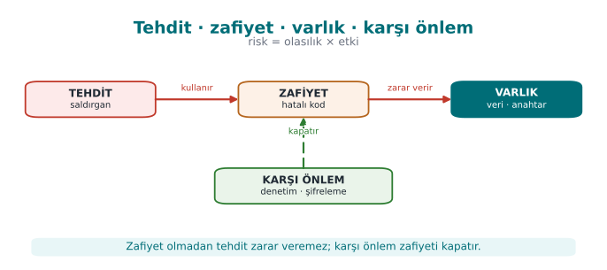

### Güvenliğin üç hedefi: CIA

Güvenlikten söz ettiğimizde neredeyse her zaman şu üç şeyi korumaya çalışırız; bu üçlü birlikte **CIA üçlüsü**
(confidentiality, integrity, availability) olarak anılır:

| Hedef | Soru | Bozulursa ne olur? | Tipik önlem |
| --- | --- | --- | --- |
| **Gizlilik** (Confidentiality) | Veriyi yalnız yetkili olanlar görebiliyor mu? | Parolalar, kart bilgileri sızar | Şifreleme, erişim denetimi |
| **Bütünlük** (Integrity) | Veri yetkisiz biçimde değiştirilebiliyor mu? | Bakiye, not, fiyat değiştirilir | Özet (hash), MAC, dijital imza |
| **Erişilebilirlik** (Availability) | Hizmet gerektiğinde çalışıyor mu? | Sistem çöker, kimse kullanamaz | Yedeklilik, kaynak sınırlama |

Bunlara sıklıkla üç kavram daha eklenir: **kimlik doğrulama** (sen gerçekten o musun?), **yetkilendirme** (bunu
yapmaya iznin var mı?) ve **hesap verebilirlik / inkâr edilemezlik** (bunu kim yaptı, sonradan inkâr edebilir mi?).

!!! example "Sınıfta tartışalım (5 dakika)"
    Telefonunuzdaki bankacılık uygulamasını düşünün. Aşağıdakilerin her biri CIA'nın hangi hedefini bozar?

    1. Uygulama hesap bakiyenizi şifrelemeden telefonun belleğine yazıyor.
    2. Biri, para transferindeki alıcı IBAN'ını yolda değiştirebiliyor.
    3. Bayram gecesi sunucu aşırı yükten çöküyor.

    ??? success "Cevaplar"
        1\. Gizlilik · 2. Bütünlük · 3. Erişilebilirlik

### Hata ile zafiyet arasındaki fark

Her yazılım hatası bir güvenlik açığı değildir; ama **güvenlik açıklarının çok büyük kısmı sıradan yazılım
hatalarıdır**. Bir hata, bir saldırganın kendi istediği sonucu elde etmesine izin veriyorsa artık bir **zafiyettir**.

!!! quote "Gerçek dünyadan: Heartbleed (2014)"
    OpenSSL kütüphanesindeki bir "kalp atışı" mesajında, istemcinin söylediği uzunluk ile gerçekten gönderdiği verinin
    uzunluğu karşılaştırılmıyordu. Saldırgan "bana 64 KB geri yolla" diyip yalnız birkaç bayt gönderince, sunucu
    belleğindeki komşu veriyi — parolalar, oturum çerezleri, hatta özel anahtarlar — geri yolluyordu (CVE-2014-0160).
    Tek bir eksik uzunluk denetimi, internetin önemli bir kısmını etkiledi. Bu hafta [Demo 4](#16-tamsayilar-ve-isaretli-uzunluk-hatasi)'te
    aynı aileden bir hatayı kendi elimizle göreceğiz.

---

## 2. Neden "güvenli programlama"?

Güvenlik duvarları, antivirüsler, ağ izleme… Bunların hepsi önemlidir; ama **hatalı yazılmış bir programı
kurtaramazlar**. Saldırgan izin verilen kapıdan — yani programın kendisinden — içeri girer. Güvenli programlama,
güvenliği sonradan eklenen bir katman olarak değil, **kodu yazarken verilen kararlar** olarak ele alır:

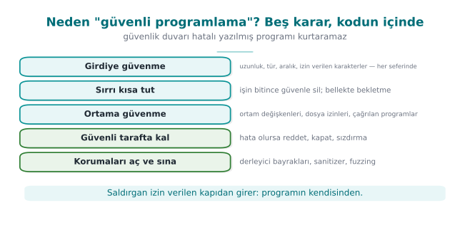

- Girdiye güvenme; **her girdiyi doğrula** (uzunluk, tür, aralık, izin verilen karakterler).
- Sırları **mümkün olan en kısa süre** bellekte tut, işin bitince **güvenle sil**.
- Programın çalıştığı ortama (ortam değişkenleri, dosya izinleri, çağırdığı programlar) **güvenme**.
- Hata olursa **güvenli tarafta** kal: reddet, kapat, sızdırma.
- Derleyicinin ve işletim sisteminin sunduğu korumaları **aç** ve araçlarla (sanitizer, fuzzing) **sına**.

Dönem boyunca bu ilkeleri önce C/C++'ta, sonra Java'da; ardından "program saldırganın elindeyse" dünyasında (çalışma
zamanı koruması, kod gizleme, whitebox kriptografi) uygulayacağız.

---

## 3. Saldırgan kim, neye erişebiliyor?

Bir güvenlik önlemini değerlendirmenin ilk sorusu şudur: **"Kime karşı?"** Aynı önlem bir saldırgana karşı yeterli,
başka birine karşı işe yaramaz olabilir. Bu yüzden her projede önce **saldırgan modeli** yazılır.

| Saldırgan | Neye erişebilir? | Neler yapabilir? | Örnek | Savunmanın ağırlığı |
| --- | --- | --- | --- | --- |
| **Uzaktaki saldırgan** | Yalnız ağ üzerinden gönderdiği mesajlar | Bozuk/uzun girdi gönderir, trafiği dinler | Web sunucusuna saldıran biri | Girdi doğrulama, TLS |
| **Yerel kullanıcı** | Aynı bilgisayarda sıradan bir hesap | Dosyaları okur, ortam değişkenlerini değiştirir, programları çalıştırır | Paylaşılan sunucudaki başka bir öğrenci | İzinler, güvenli başlatma |
| **Kötü niyetli içeriden kişi** | Kaynak koda, sunuculara yetkili erişim | Arka kapı ekler, veri sızdırır | Görevini kötüye kullanan çalışan | Ayrıcalık ayrımı, denetim kaydı |
| **Cihazın sahibi saldırgan** (beyaz kutu, "Man-At-The-End") | Programın kendisine **tam** erişim | Hata ayıklayıcıyla adım adım izler, belleği döker, ikili dosyayı değiştirir | Mobil ödeme uygulamasını kendi telefonunda kırmaya çalışan biri | Çalışma zamanı koruması, kod gizleme, whitebox kriptografi |

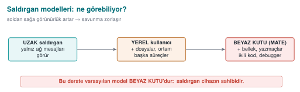

!!! note "Bu dersin farkı"
    Klasik güvenlik dersleri çoğunlukla ilk iki saldırganla ilgilenir. Bu derste son satıra — **programın saldırganın
    cihazında çalıştığı** duruma — özellikle ağırlık vereceğiz. Mobil ödeme, dijital içerik koruma (DRM), oyun hilelerine
    karşı koruma ve lisans denetimi bu dünyadadır. Burada "anahtarı gizle, olur biter" demek yetmez: saldırgan belleği
    okuyabilir, kodu değiştirebilir, programı istediği gibi durdurup başlatabilir.

---

## 4. Güvenli tasarımın temel ilkeleri

1975'te Saltzer ve Schroeder'in yazdığı ilkeler bugün de güvenli tasarımın omurgasıdır. Her birini tek cümlelik bir
örnekle aklınızda tutun:

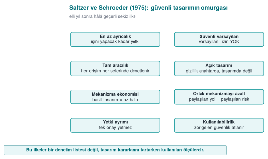

| İlke | Anlamı | Örnek |
| --- | --- | --- |
| **En az ayrıcalık** | Her bileşen işini yapmaya yetecek kadar yetkiyle çalışır | Rapor programı yönetici olarak değil, sıradan kullanıcıyla çalışır |
| **Güvenli varsayılan** | Varsayılan durum "izin yok"tur | Yeni kullanıcının `yonetici` alanı 0 ile başlar |
| **Tam aracılık** | Her erişim her seferinde denetlenir | Yetki bir kez bakılıp önbelleğe yazılmaz |
| **Açık tasarım** | Güvenlik, tasarımın gizli kalmasına değil anahtarın gizliliğine dayanır (Kerckhoffs) | Kendi şifreleme algoritmanızı yazmazsınız |
| **Mekanizma ekonomisi** | Basit tasarım daha az hata içerir | 20 satırlık açık bir denetim, 500 satırlık "akıllı" bir denetimden iyidir |
| **Ayrıcalıkların ayrılması** | Kritik işlem için birden fazla koşul gerekir | Para transferi için hem parola hem SMS kodu |
| **En az ortak mekanizma** | Kullanıcılar arasında paylaşılan kaynaklar azaltılır | Her oturumun kendi geçici dosyası olur |
| **Psikolojik kabul edilebilirlik** | Güvenlik kullanılabilir olmalıdır, yoksa atlatılır | Her 5 dakikada parola sormak, parolanın kâğıda yazılmasına yol açar |

Bunlara modern bir ilke ekleyelim: **Derinlemesine savunma** (defense in depth). Tek bir önleme güvenmeyiz; birbirini
tamamlayan **katmanlar** kurarız. Biri aşılırsa diğeri devreye girer.
[3. haftada](../week-3/cen429-week-3.md#14-guvenlik-kabuklari-derinlemesine-savunmanin-somut-hali) hassas bir
anahtarın tam **dört ayrı koruma katmanı** (güvenlik kabuğu) içinde nasıl taşındığını göreceğiz.

---

## 5. Uygulama korumasına genel bakış: katmanlı savunma haritası

Buraya kadar güvenliğin **ne** olduğunu ve **kime karşı** korunduğunu konuştuk. Şimdi dönemin geri kalanında
kullanacağımız araç kutusunun haritasını çıkaralım. "Uygulama koruması" (application protection) tek bir teknik
değil, birbirini tamamlayan **katmanlar** bütünüdür. Her katman farklı bir soruyu cevaplar ve farklı bir saldırgan
yeteneğine karşı durur.

### Neden tek bir önlem yetmez?

Bir binayı düşünün. Kapıya iyi bir kilit taktınız. Ama pencere açıksa, anahtar paspasın altındaysa ya da içerideki
kasa şifresizse kilit tek başına bir şey ifade etmez. Yazılımda da durum aynıdır:

- Kodunuz **hatasız** olabilir, ama saldırgan ikili dosyayı açıp **mantığınızı okuyabilir**.
- Mantığınızı **gizleyebilirsiniz**, ama saldırgan programı çalışırken bir hata ayıklayıcıyla **durdurup
  belleğini** okuyabilir.
- Belleği **izlenmeye karşı** koruyabilirsiniz, ama anahtar kodun içinde **düz metin** duruyorsa bir dize taraması
  yeter.
- Anahtarı gizleyebilirsiniz, ama saldırgan ikili dosyadaki **bir denetimi değiştirip** (ör. "lisans geçerli mi?"
  sorusunu her zaman "evet" yapıp) korumayı tamamen atlayabilir.

Her satır, bir önlemin neyi **çözmediğini** gösteriyor. Katmanlı savunmanın mantığı budur: her katman bir öncekinin
açık bıraktığı yolu kapatır; saldırganın hepsini **aynı anda** aşması gerekir ve bu da maliyeti katlar.

### Yedi katman

Aşağıdaki şema, bu dönem göreceğimiz katmanları **içten dışa** sıralar. İç katmanlar "kodu doğru yaz" sorusuyla,
dış katmanlar "kod saldırganın elindeyken ne olacak?" sorusuyla ilgilenir.

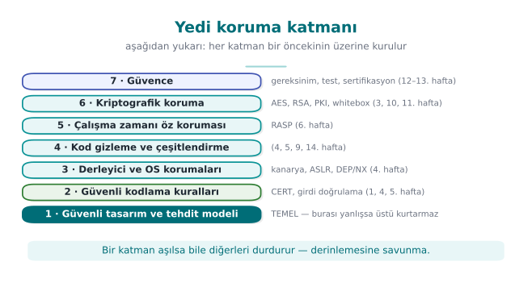

| Katman | Cevapladığı soru | Tipik teknikler | Durduğu saldırgan |
| --- | --- | --- | --- |
| **1. Güvenli tasarım** | Neyi, kime karşı koruyoruz? | Tehdit modeli, varlık ve arayüz tabloları, en az ayrıcalık | Tasarım hatası arayan herkes |
| **2. Güvenli kodlama** | Kodum hatasız mı? | Girdi doğrulama, sınır denetimi, güvenli API, SEI CERT kuralları | Uzaktan girdi gönderen saldırgan |
| **3. Derleyici/OS korumaları** | Hata kaçarsa sömürülmesi zorlaşıyor mu? | Yığın koruyucu (canary), ASLR, DEP/NX, CFI, `_FORTIFY_SOURCE` | Bellek hatasını kullanmaya çalışan saldırgan |
| **4. Gizleme** | Kodu okuyan anlayabiliyor mu? | Kontrol akışı düzleştirme, opak yüklem, dize gizleme, sanallaştırma | Tersine mühendislik yapan analist |
| **5. RASP** | Program saldırı altında olduğunu fark ediyor mu? | Hata ayıklayıcı, kanca, root/emülatör, bütünlük denetimi | Programı çalışırken inceleyen saldırgan |
| **6. Kriptografi** | Veri ele geçse bile anlamsız mı? | Kimlik doğrulamalı şifreleme, anahtar hiyerarşisi, whitebox | Depolanan ya da aktarılan veriyi alan saldırgan |
| **7. Güvence** | Bütün bunların çalıştığını nasıl kanıtlıyoruz? | Kod incelemesi, fuzzing, sızma testi, ETSI/EMV/FIPS/Ortak Kriterler | Denetçi ve değerlendirici |

!!! note "Katmanları bir araya getiren fikir: güvenlik kabuğu"
    Öğretim üyesinin sahada kullandığı yöntemde, hassas bir veri (ör. bir anahtar) bu katmanların **birkaçının
    içinde aynı anda** taşınır: şifrelenmiş olarak saklanır, yalnız kullanılacağı an ve yalnız gerektiği kadar
    çözülür, çözüldüğü kod bölümü gizlenmiş ve bütünlüğü denetlenmiştir, çalıştığı süreçte hata ayıklayıcı
    denetimi vardır. Bu iç içe katmanlara bu derste **güvenlik kabuğu** diyeceğiz.
    [3. haftada](../week-3/cen429-week-3.md#14-guvenlik-kabuklari-derinlemesine-savunmanin-somut-hali) dört kabuklu
    bir tasarımı adım adım kuracağız.

### Hangi katman ne zaman önemlidir? Saldırgan modeline göre seçim

Her uygulamanın yedi katmanın hepsine eşit ihtiyacı yoktur. Seçimi, 3. bölümde tanımladığımız **saldırgan modeli**
belirler:

| Uygulama türü | Saldırgan nerede? | Öncelikli katmanlar |
| --- | --- | --- |
| Sunucu tarafı web hizmeti | Ağda; koda ve sunucuya erişimi yok | 1, 2, 3, 6 (TLS), 7 |
| Masaüstü iş uygulaması | Kullanıcının bilgisayarında; ama genelde kullanıcı saldırgan değil | 1, 2, 3, 6 |
| Mobil bankacılık / ödeme uygulaması | **Cihaz saldırganın elinde** olabilir | Hepsi; özellikle 4, 5, 6 |
| Oyun, lisanslı yazılım | Kullanıcının kendisi saldırgan (hile, korsan kopya) | 4, 5 ağırlıklı |
| Gömülü cihaz (ör. akıllı sayaç) | Fiziksel erişim mümkün | 2, 3, 6, donanım destekli koruma |

Burada kritik ayrım şudur: **sunucu tarafında** kodunuz sizin kontrolünüzdeki bir makinede çalışır; saldırgan
yalnız girdileri kontrol eder. **İstemci tarafında** (telefon, masaüstü, oyun konsolu) ise saldırgan programın
**kendisine** sahiptir: onu kopyalayabilir, açabilir, değiştirebilir, istediği kadar yeniden çalıştırabilir. Bu
modele **"beyaz kutu" (white-box) saldırgan** denir ve 4, 5, 6 numaralı katmanlar tam olarak bu saldırgan için vardır.

!!! warning "Gizleme, doğru kodun yerine geçmez"
    Sık yapılan bir hata, güvenli kodlamayı atlayıp "nasılsa kodu gizleyeceğiz" demektir. Gizleme saldırganı
    **yavaşlatır**, hatayı **düzeltmez**. Gizlenmiş bir arabellek taşması hâlâ bir arabellek taşmasıdır; yalnız
    bulunması biraz daha uzun sürer. Dış katmanlar, iç katmanlar sağlamsa anlam kazanır.

### Beyaz kutu saldırganın altı yolu

İstemci tarafında çalışan hassas bir kütüphanenin güvenlik kılavuzu, saldırganın hedeflerini genellikle altı
satırlık bir **saldırı tablosuyla** özetler. Her satır, katmanlardan en az birinin cevap vermesi gereken bir
sorudur:

| # | Saldırganın yolu | Örnek | Cevap veren katmanlar |
| --- | --- | --- | --- |
| 1 | Platform denetimlerini aşmak | Root'lu cihaz, emülatör, değiştirilmiş işletim sistemi | 5 (RASP) |
| 2 | Kodu tersine mühendislikle çözmek | Tersine derleyiciyle mantığı ve anahtarları okumak | 4 (gizleme), 6 |
| 3 | Kodu değiştirmek | Bir `if` denetimini ters çevirip yeniden paketlemek | 5 (bütünlük), 4 |
| 4 | Bileşenler arası arayüzleri kötüye kullanmak | Kütüphaneyi kendi programından çağırmak, arayüzden geçen veriyi okumak | 1 (tasarım), 5, 6 |
| 5 | Çalışma anında varlık çıkarmak | Bellek dökümü, hata ayıklayıcı, kanca | 2 (silme), 5, 6 (whitebox) |
| 6 | Çalışma anında akışı değiştirmek | Hata ayıklayıcıyla bir dalı atlamak, dönüş değerini değiştirmek | 5 (akış sayacı), 4 |

Bu tablo, koruma planındaki tehdit bölümünün **başlangıç noktasıdır**: her varlık için bu altı yolun her birinin
nasıl kapatıldığı yazılır.

Aynı gereksinim setinde iki madde daha, katmanlı savunmanın neden zorunlu olduğunu açıkça söyler:

- Uygulama, **güvencesi olmayan** güvenlik işlevlerine tek başına dayanmamalıdır: işletim sisteminin korumaları, anahtar
  zinciri, uygulama kum havuzu ya da donanım destekli anahtar deposu gibi özellikler cihazdan cihaza değişir ve
  saldırgan tarafından devre dışı bırakılabilir.
- Platformun sunduğu mekanizmalar (ör. işletim sisteminin kripto kütüphanesi) kullanılabilir, ama yalnız uygulamanın
  **kendi** korumalarına **ek olarak**.

Savunmacı programlama da aynı listede tek tek sayılır: her girdi ve çıktı denetlenir; varlıklar mümkün olan en kısa
süre işlenir; varlıklar kod içindeki arayüzlerden bile açık halde geçirilmez; zamanlamaya dayalı ilişkilendirme
saldırılarına karşı gecikmeler eklenir; iş bitince veriyi silen güvenli bir silme fonksiyonu kullanılır. Bu
kuralların hepsini dönem boyunca tek tek uygulayacağız.

### Korumanın maliyeti: her katmanın bir bedeli var

Katman eklemek bedava değildir; güvenlik, hız ve karmaşıklık arasında sürekli bir **ödünleşim (trade-off)** kurmayı
gerektirir — hedef sonsuz koruma değil, **dengeli** koruma ve açıkça yazılmış bir kalan risktir. Bir koruma planı
yazarken her katman için şu dört bedeli tartarsınız:

1. **Performans:** Gizlenmiş kod daha yavaş çalışır (ör. kontrol akışı düzleştirme bir fonksiyonu birkaç kat
   yavaşlatabilir). Bütünlük denetimi ve hata ayıklayıcı algılama da işlemci zamanı harcar.
2. **Boyut:** Gizleme, sanallaştırma ve tablo tabanlı whitebox kriptografi ikili dosyayı büyütür.
3. **Geliştirme ve bakım:** Gizlenmiş kodun hatası zor ayıklanır; çökme raporları okunaksız olur. Bu yüzden
   gizleme **yalnız hassas bölümlere** uygulanır ve sembol eşleme dosyaları güvenli yerde saklanır.
4. **Yanlış pozitif:** Aşırı hassas bir root ya da emülatör algılaması, meşru kullanıcıyı (ör. geliştirici
   seçenekleri açık bir telefonu) cezalandırabilir.

Bu yüzden bir koruma planında her önlem **gerekçesiyle** yazılır: "Şu varlığı, şu saldırgana karşı, şu maliyetle
koruyoruz." Gerekçesi yazılmamış bir önlem ya gereksizdir ya da yanlış yerdedir.

### Dönem boyunca izleyeceğimiz yol

Bu haritayı her hafta bir katmanı açarak dolduracağız:

| Hafta | Katman | Ana soru |
| --- | --- | --- |
| 1 | 1, 2 | Güvenli tasarım, tehdit modeli, bellek hataları nasıl oluşur? |
| 2 | 1 | Zararlı yazılım, güvenlik modelleri, zafiyetlerin sınıflandırılması |
| 3 | 6 | Veriyi aktarımda, beklemede ve kullanımda nasıl koruruz? |
| 4 | 2, 3, 4 | C/C++ kodunu nasıl sağlamlaştırırız? |
| 5 | 2, 4 | Java ve yorumlanan dillerde enjeksiyon, gizleme, bağımlılık güvenliği |
| 6 | 5 | Program saldırı altındayken kendini nasıl korur? |
| 9 | 4 | Gelişmiş gizleme ve etkinliğinin ölçülmesi |
| 10 | 6 | AES, RSA, dijital imza, PKI |
| 11 | 6 | Anahtar saldırganın elindeki kodun içindeyken nasıl korunur? |
| 12–13 | 7 | Sertifikasyon, sızma testi, güvenlik gereksinimleri |
| 14 | 4 | Tigress ile otomatik gizleme ve çeşitlendirme |

!!! tip "Değerlendirici bu katmanlara nasıl bakar?"
    Bağımsız bir değerlendirici, bir ürünü incelerken bu tabloyu **tersten** okur: önce kolay yolları dener (dize
    taraması, ikili dosyayı açma, hata ayıklayıcı bağlama), hangi katmanda durdurulduğunu not eder. Durdurulmadığı
    her adım, raporda bir bulgu olur. Sizin projenizin güvenlik kılavuzu da her katman için "hangi önlemi aldım,
    nasıl test ettim" sorusunu cevaplayacak.

### Kendini dene

1. Bir **çevrimdışı parola yöneticisi** (tüm veriler kullanıcının bilgisayarında) için saldırgan modeli nedir?
   Yedi katmandan hangileri en önemlidir? Neden?
2. "Uygulamamız sunucuda çalışıyor, gizlemeye gerek yok" cümlesi hangi durumda doğrudur, hangi durumda yanlıştır?
3. Bir oyun şirketi hile yapılmasını engellemek için yalnız gizleme kullanıyor. Hangi saldırı yolu açık kalır?

??? tip "Cevap ipuçları"
    1. Saldırgan dosyayı kopyalayan biri (çalınan dizüstü) ya da bilgisayara zararlı bulaştıran biri olabilir;
       kriptografi (6: parola tabanlı anahtar türetme, kimlik doğrulamalı şifreleme) ve güvenli kodlama (2) en
       önemlileridir; kullanıcının kendisi saldırgan olmadığı için gizleme ikinci plandadır.
    2. Kod gerçekten yalnız sunucuda çalışıyor ve istemciye hiçbir mantık gönderilmiyorsa doğrudur. Ama istemci
       uygulaması da iş mantığı ya da anahtar taşıyorsa (mobil uygulama, tarayıcıdaki JavaScript) yanlıştır.
    3. Hileli istemcinin sunucuya **tutarsız veri** göndermesi: gizleme istemciyi korur, ama sunucu istemciden gelen
       her değeri doğrulamıyorsa (ör. "bu oyuncu bir saniyede 100 metre gidemez") hile yine mümkündür. Kural:
       **sunucu, istemciye asla güvenmez.**

---

## 6. Uygulama koruma planı

Bir yazılımın güvenliği şansa bırakılmaz; **yazılı bir planla** yönetilir. Bağımsız bir laboratuvarın güvenlik
sertifikasyonundan geçen ürünlerde bu plan, yüzlerce sayfalık bir **güvenlik kılavuzuna** dönüşür. Bu derste siz de
dönem projeniz için bunun küçük bir sürümünü yazacaksınız. Planın omurgası şudur:

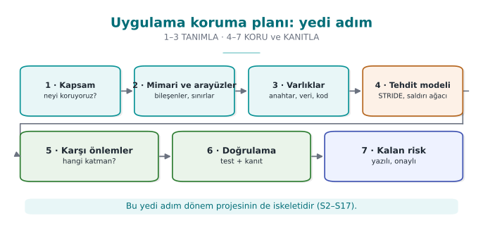

Plan bir kez yazılıp bırakılmaz: ürün her değiştiğinde (yeni özellik, hata düzeltmesi, yeni sürüm) 1. adıma dönülür
ve plan güncellenir.

1. **Kapsam:** Neyi değerlendiriyoruz? Yalnız "sürüm 2.1" demek yetmez; hangi ikili dosya, hangi kaynak kod, hangi
   özet değeri? Sertifikasyonda buna **değerlendirme hedefi** denir.
2. **Mimari ve arayüzler:** Bileşenler neler, birbirleriyle hangi kanaldan konuşuyor, her kanalda kimlik nasıl
   doğrulanıyor?
3. **Varlıklar:** Korunacak her veri tek tek listelenir: nerede durur, ne zaman oluşur, ne zaman silinir, **gizlilik
   (C)** mi **bütünlük (I)** mü gerekir?
4. **Tehditler:** Saldırgan kim (bkz. bölüm 3), her varlığa hangi yoldan ulaşabilir?
5. **Karşı önlemler:** Her tehdit için hangi önlem, hangi katmanda?
6. **Doğrulama:** Her önlemin çalıştığı nasıl kanıtlanıyor — birim testi, atlatma denemesi?
7. **Kalan risk:** Kapatılamayan ya da bilerek kabul edilen riskler ve nedenleri (ör. performans).

### Planın iki temel aracı: arayüz tablosu ve varlık tablosu

Planın 2. ve 3. adımları iki tabloyla yazılır; bu derste bütün dönem boyunca aynı yöntemi kullanacağız. Yöntemi bir
örnek mimari üzerinde görelim: telefonun NFC'si üzerinden temassız ödeme yapan bir mobil uygulama ve onun kritik
işlerini yapan bir **güvenlik kütüphanesi**. Kütüphanenin bir kısmı Java'da, güvenlik açısından en hassas kısmı ise
**C/C++ ile yazılmış yerel (native) katmanda** çalışır.

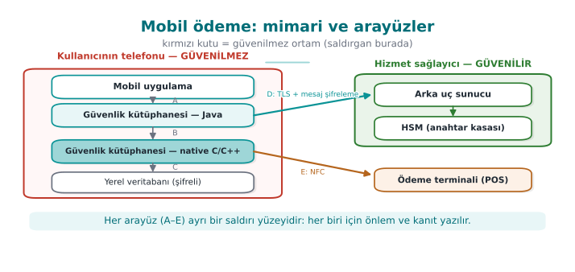

Bu şemada iki şeye dikkat edin:

- Telefon kutusunun başlığı **"güvenilmez ortam"**. Telefon, kullanıcının — yani potansiyel saldırganın — elinde.
  Root yetkisi alınmış olabilir, hata ayıklayıcı bağlanmış olabilir. Bu yüzden tasarım baştan **"telefona
  güvenmiyorum"** varsayımıyla yapılır.
- Harflerle gösterilen her ok bir **arayüzdür**. Her arayüz için şu tablo doldurulur:

| Arayüz | Uç A | Uç B | Kimlik doğrulama | Gizlilik / bütünlük |
| --- | --- | --- | --- | --- |
| A | Mobil uygulama | Kütüphane (Java) | Çağıran uygulamanın imzası doğrulanır | Aynı süreç içi; hassas veri geçmez |
| B | Kütüphane (Java) | Kütüphane (native) | Karşılıklı bütünlük denetimi | Veriler şifreli ve örtülü geçer |
| C | Kütüphane (native) | Yerel veritabanı | — | Şifreleme + bütünlük kodu (MAC), anahtar cihaza bağlı |
| D | Kütüphane | Arka uç sunucu | Sertifika sabitleme + sunucu doğrulama kodu | TLS **ve** ayrıca mesaj düzeyinde şifreleme |
| E | Kütüphane | Ödeme terminali | Ödeme protokolü | Tek kullanımlık ödeme anahtarı |

Ve **varlık tablosundan** bir kesit (değerler sentetiktir):

| Varlık | Tür | Nerede | Oluşma → silinme | Koruma |
| --- | --- | --- | --- | --- |
| Tek kullanımlık ödeme anahtarı | Kriptografik, dinamik | Veritabanı (şifreli), kullanım anında bellek | Sunucudan iner → tek ödemede kullanılır → silinir | C, I |
| Cihaz parmak izi | Dinamik | Bellek, iki ayrı parçada | Uygulama açılışında hesaplanır | I |
| Oturum anahtarı | Kriptografik, dinamik | Yalnız bellek | Sunucuyla oturum kurulurken türetilir → oturum sonunda silinir | C, I |
| İşlem sayacı | Dinamik | Veritabanı | Her ödemede artar | I |
| Sunucu açık anahtarı | Kriptografik, statik | Uygulamaya gömülü | Derleme anında | I |

!!! note "Neden bu kadar ayrıntı?"
    Bir değerlendirici ilk iş olarak bu listeye bakar ve her satır için sorar: "Bu varlık **nerede ve ne zaman**
    açığa çıkıyor?" Listede olmayan bir varlık korunmuyor demektir. Sizin projenizde de her varlık bu tabloda yer
    alacak.

!!! tip "Bu yöntemin devamı"
    Bu dönem her hafta, bu tablolardaki varlıkları koruyan yöntemlerden birini açacağız: katmanlı veri koruması ve
    güvenlik kabukları ([3. hafta](../week-3/cen429-week-3.md)), native kod sağlamlaştırma (4. ve [9. haftalar](../week-9/cen429-week-9.md)), Java tarafı sağlamlaştırma
    ([5. hafta](../week-5/cen429-week-5.md)), çalışma zamanı öz koruması ([6. hafta](../week-6/cen429-week-6.md)), kripto yöntemleri ve anahtar hiyerarşisi ([10. hafta](../week-10/cen429-week-10.md)), whitebox
    kriptografi ([11. hafta](../week-11/cen429-week-11.md)), sertifikasyon ve gereksinim eşlemesi (12–13. haftalar).

---

## 7. Tehdit modelleme: STRIDE ve saldırı ağaçları

Tehdit modelleme, "saldırgan olsaydım buraya nasıl saldırırdım?" sorusunu **düzenli** biçimde sormaktır. En yaygın
yöntemlerden biri Microsoft'un geliştirdiği **STRIDE**'dır: her harf bir tehdit ailesi ve bozduğu güvenlik özelliğidir.

| Harf | Tehdit | Bozduğu özellik | Örnek (mobil ödeme mimarisi) |
| --- | --- | --- | --- |
| **S** | Spoofing — kimlik taklidi | Kimlik doğrulama | Sahte bir uygulamanın kendini asıl uygulama gibi gösterip güvenlik kütüphanesini çağırması |
| **T** | Tampering — kurcalama | Bütünlük | Native kütüphanedeki bir denetimin ikili dosyada değiştirilmesi |
| **R** | Repudiation — inkâr | İnkâr edilemezlik | Kullanıcının "bu ödemeyi ben yapmadım" demesi ve kanıt olmaması |
| **I** | Information disclosure — bilgi sızması | Gizlilik | Ödeme anahtarının bellek dökümünden okunması |
| **D** | Denial of service — hizmet engelleme | Erişilebilirlik | Sunucuya binlerce sahte kayıt isteği |
| **E** | Elevation of privilege — yetki yükseltme | Yetkilendirme | Sıradan kullanıcının yönetici işlevine erişmesi |

Uygulaması basittir: sistemin **veri akış diyagramını** çizin (dış varlıklar, süreçler, veri depoları, veri akışları
ve **güven sınırları**), sonra her öğe için altı harfi tek tek sorun. Güven sınırını geçen her ok, en çok tehdidin
çıktığı yerdir.

### Saldırı ağacı

Saldırı ağacında kök, saldırganın **hedefidir**; alt dallar o hedefe ulaşmanın yollarıdır. **VEYA** düğümünde
dallardan biri yeter, **VE** düğümünde hepsi gerekir. Ağaç çizildiğinde en ucuz yol ve savunulacak kilit noktalar
kendiliğinden ortaya çıkar.

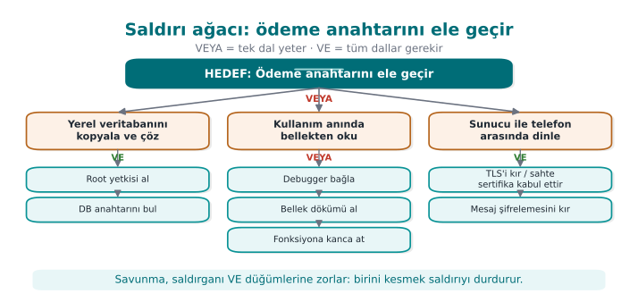

Bu ağaçtan hemen şu sonuçlar çıkar: (1) C yolu **iki** katmanı birden kırmayı gerektirdiği için pahalıdır — işte
derinlemesine savunma. (2) B yolunun üç alternatifi var; demek ki **bellekteki anahtar** en zayıf nokta ve buna
karşı özel önlemler (bu hafta Demo 2, [6. hafta](../week-6/cen429-week-6.md) çalışma zamanı koruması, [11. hafta](../week-11/cen429-week-11.md) whitebox) gerekir.

!!! example "Sınıf alıştırması (15 dakika, 3–4 kişilik gruplar)"
    Bir **"öğrenci not sistemi"** düşünün: öğretim üyesi not girer, öğrenci notunu görür, veriler bir sunucuda durur.

    1. Veri akış diyagramını çizin; güven sınırlarını kesikli çizgiyle işaretleyin.
    2. En az **altı** STRIDE tehdidi yazın (her harften bir tane).
    3. "Notumu 45'ten 85'e çıkar" hedefi için bir saldırı ağacı çizin. En ucuz yol hangisi?

    ??? tip "İpucu"
        Güven sınırları: tarayıcı ↔ sunucu, sunucu ↔ veritabanı, öğrenci rolü ↔ öğretim üyesi rolü. "E" harfi için
        öğrencinin not girme sayfasına doğrudan adres yazarak ulaşmasını düşünün; "R" için "bu notu kim, ne zaman
        değiştirdi?" kaydının olmamasını.

---

## 8. Tehdit modellemeyi derinleştirmek: veri akış diyagramı, STRIDE ayrıntıları ve risk puanı

Önceki bölümde STRIDE'ı ve saldırı ağacını tanıdık. Bu bölümde yöntemi bir mühendis gibi **adım adım** uygulamayı
öğreneceğiz: diyagramı nasıl çizeriz, her öğeye hangi harfleri sorarız, çıkan onlarca tehdidi nasıl sıralarız?

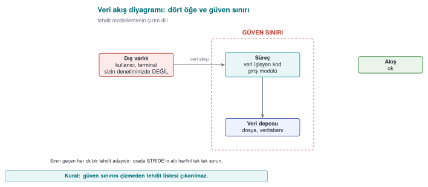

### Veri akış diyagramının (VAD) dört öğesi ve güven sınırı

Tehdit modellemede kullanılan diyagram, yazılım mühendisliği derslerinden bildiğiniz veri akış diyagramının
sadeleştirilmiş halidir. Yalnız beş sembol vardır:

| Sembol | Adı | Ne anlatır? | Örnek |
| --- | --- | --- | --- |
| Dikdörtgen | **Dış varlık** | Sizin kontrolünüzde olmayan kişi ya da sistem | Kullanıcı, ödeme terminali, e-posta sunucusu |
| Daire / yuvarlak kutu | **Süreç** | Veri işleyen kod | Giriş modülü, şifreleme kütüphanesi |
| İki paralel çizgi | **Veri deposu** | Verinin durduğu yer | Veritabanı, yapılandırma dosyası, kayıt defteri |
| Ok | **Veri akışı** | Verinin bir yerden başka yere gidişi | HTTP isteği, fonksiyon çağrısı, dosya yazma |
| Kesikli çizgi | **Güven sınırı** | Güven düzeyinin değiştiği yer | İnternet ↔ sunucu, kullanıcı modu ↔ çekirdek, uygulama ↔ işletim sistemi |

**Güven sınırı** kavramı yöntemin kalbidir. Bir veri, güven sınırını geçtiği anda "öbür taraftan gelen veri"
olur ve doğrulanmadan kullanılamaz. Tehditlerin çoğu bu geçişlerde doğar. Pratik bir kural: diyagramınızda güven
sınırını geçen her oku kırmızıyla boyayın; incelemeye oradan başlayın.

### Hangi öğeye hangi harf sorulur?

Her öğe altı tehdidin hepsine açık değildir. Microsoft'un yaygınlaştırdığı "öğe başına STRIDE" tablosu, hangi
soruların anlamlı olduğunu gösterir:

| Öğe | S | T | R | I | D | E |
| --- | :-: | :-: | :-: | :-: | :-: | :-: |
| Dış varlık | ✔ | | ✔ | | | |
| Süreç | ✔ | ✔ | ✔ | ✔ | ✔ | ✔ |
| Veri deposu | | ✔ | ✔¹ | ✔ | ✔ | |
| Veri akışı | | ✔ | | ✔ | ✔ | |

¹ Veri deposu bir denetim kaydıysa (log), inkâr tehdidi de sorulur: kayıt silinirse ya da değiştirilirse kimin ne
yaptığı kanıtlanamaz.

Tablonun mantığı sezgiseldir: bir veri akışı (ör. ağ paketi) **kimlik taklidi yapamaz**, çünkü bir "kimliği" yoktur;
ama **dinlenebilir** (I), **değiştirilebilir** (T) ya da **kesilebilir** (D). Bir süreç ise altı tehdide de açıktır:
taklit edilebilir, kodu değiştirilebilir, belleği okunabilir, çökertilebilir, yetkisi kötüye kullanılabilir.

### Her harf için sorulacak sorular ve tipik karşı önlemler

| Harf | Kendinize sorun | Tipik karşı önlem | Bu dersteki yeri |
| --- | --- | --- | --- |
| **S** | Karşı taraf olduğunu söylediği kişi mi? Bir başkası kendini onun yerine koyabilir mi? | Kimlik doğrulama, karşılıklı TLS, imza doğrulama, sertifika sabitleme | 3, [10. hafta](../week-10/cen429-week-10.md) |
| **T** | Bu veri ya da kod yolda veya diskte değiştirilebilir mi? Değiştirilse fark eder miyim? | MAC/HMAC, dijital imza, bütünlük denetimi, salt okunur bellek | 2, 3, [6. hafta](../week-6/cen429-week-6.md) |
| **R** | Bir kullanıcı "bunu ben yapmadım" derse kanıtım var mı? | Kurcalamaya dayanıklı denetim kaydı, imzalı işlem, zaman damgası | [2. hafta](../week-2/cen429-week-2.md) |
| **I** | Bu veri yetkisi olmayan birinin eline geçebilir mi — diskte, ağda, bellekte, günlükte, hata iletisinde? | Şifreleme, bellek temizleme, en az veri, maskeleme | 1, 3, [11. hafta](../week-11/cen429-week-11.md) |
| **D** | Bu bileşen çökertilebilir, kilitlenebilir ya da kaynakları tüketilebilir mi? | Girdi sınırları, oran sınırlama, zaman aşımı, kaynak kotası | 1, [4. hafta](../week-4/cen429-week-4.md) |
| **E** | Daha az yetkili biri, daha yetkili birinin işini yaptırabilir mi? | En az ayrıcalık, tam aracılık, bellek güvenliği, sandbox | 1, 2, 4. hafta |

!!! example "Aynı hatanın birden fazla harfi olabilir"
    Bir arabellek taşması hem **D** (program çöker) hem **E** (saldırgan akışı ele geçirip yetkili kod çalıştırır)
    hem de **I** (bitişik bellekteki sır okunur) tehdididir. STRIDE bir sınıflandırma değil, **düşünme aracıdır**:
    amacı tehdidi doğru kutuya koymak değil, hiçbir tehdidi **atlamamaktır**.

### Tehditleri sıralamak: olasılık × etki

Orta büyüklükte bir sistemde tehdit modelleme kolayca 50–100 tehdit üretir. Hepsini aynı anda kapatamazsınız.
Bu yüzden her tehdide bir **risk puanı** verilir. En sade yöntem, olasılık ve etkiyi 1–3 arasında puanlayıp çarpmaktır:

| | **Etki: Düşük (1)** | **Etki: Orta (2)** | **Etki: Yüksek (3)** |
| --- | :-: | :-: | :-: |
| **Olasılık: Yüksek (3)** | 3 — orta | 6 — yüksek | **9 — kritik** |
| **Olasılık: Orta (2)** | 2 — düşük | 4 — orta | 6 — yüksek |
| **Olasılık: Düşük (1)** | 1 — düşük | 2 — düşük | 3 — orta |

**Olasılığı** belirlerken saldırganın ihtiyaç duyduğu şeyleri sorun: fiziksel erişim mi gerekiyor, yoksa internetten
mi yapılabilir? Özel araç ya da uzmanlık gerekiyor mu? Saldırı otomatikleştirilebilir mi? **Etkiyi** belirlerken
varlık tablosuna dönün: hangi varlık etkileniyor, kaç kullanıcı etkileniyor, parasal ya da hukuki sonucu nedir?

!!! info "Daha ayrıntılı ölçekler"
    Sektörde bundan daha ayrıntılı puanlama sistemleri kullanılır. 2. haftada göreceğimiz **CVSS**, bir zafiyeti
    saldırı vektörü, karmaşıklık, gereken yetki, kullanıcı etkileşimi ve gizlilik/bütünlük/erişilebilirlik etkisi
    gibi ölçütlerle 0–10 arasında puanlar. Ödeme sistemlerinin sertifikasyonunda ise "saldırı potansiyeli" denen,
    gereken süre, uzmanlık, hedef bilgisi, erişim fırsatı ve ekipmanı toplayan bir ölçek kullanılır ([13. hafta](../week-13/cen429-week-13.md)).
    Bu hafta basit 3×3 matris yeterlidir.

### Tehdide verilebilecek dört yanıt

Her tehdit için dört seçenekten birini bilinçli olarak seçer ve plana yazarsınız:

1. **Azalt (mitigate):** Bir karşı önlem ekle. En sık seçilen yanıt.
2. **Ortadan kaldır (eliminate):** Tehdide yol açan özelliği tamamen kaldır. Ör. "parolayı hatırla" özelliği
   gerekli değilse hiç yazmamak, parolanın diskte saklanması tehdidini sıfırlar. En güçlü yanıttır.
3. **Aktar (transfer):** Riski bir başkasına devret. Ör. kart verisini hiç saklamayıp ödeme hizmet sağlayıcısına
   bırakmak ya da bir sigorta.
4. **Kabul et (accept):** Riski bilerek üstlen ve gerekçesini yaz. Ör. "Fiziksel olarak çipin açılıp
   incelenmesine karşı önlem almıyoruz; bu saldırının maliyeti korunan değerden yüksektir."

!!! warning "Kabul edilen risk, unutulan risk değildir"
    "Kabul et" demek, riski planın **kalan risk** bölümüne yazmak ve bir sonraki sürümde yeniden değerlendirmek
    demektir. Plana yazılmamış bir risk kabul edilmiş değil, **gözden kaçmıştır**. Değerlendiriciler ilk olarak
    kalan risk listesinin varlığına ve gerekçelerine bakar.

---

## 9. Uygulamalı örnek: bir koruma planını adım adım yazmak

Şimdi önceki üç bölümdeki bütün araçları küçük bir uygulama üzerinde, baştan sona uygulayalım. Bu örnek, dönem
projenizin ilk teslimi için bir **şablon** görevi görecek.

### Adım 0 — Uygulamayı tanımla

**"Kasa"**, C++ ile yazılmış, masaüstünde çalışan bir **parola kasası** olsun:

- Kullanıcı bir **ana parola** belirler. Kasa, içindeki kayıtları (site adı, kullanıcı adı, parola) bu ana
  paroladan türetilen bir anahtarla şifreleyip **tek bir dosyada** saklar.
- Kullanıcı bir kaydın parolasını **panoya kopyalayabilir**.
- İsteğe bağlı olarak şifreli kasa dosyası bir **yedekleme sunucusuna** gönderilebilir.
- Uygulama, yeni sürümleri bir **güncelleme sunucusundan** indirir.

### Adım 1 — Kapsam

| Alan | Değer |
| --- | --- |
| Değerlendirme hedefi | `kasa.exe` / `kasa` sürüm 1.0, çekirdek kütüphane `kasa_cekirdek`, yapılandırma dosyası |
| Platformlar | Windows 10/11 (x64), Ubuntu 22.04 (x64) |
| Kapsam dışı | Yedekleme sunucusunun kendi güvenliği (ayrı bir ekip sorumlu), işletim sisteminin kendisi |
| Güvenlik amacı | Kasa dosyası ve yedekleri, ana parolayı bilmeyen biri için **okunamaz ve fark edilmeden değiştirilemez** olmalı |

"Kapsam dışı" satırı önemlidir: neyi korumadığınızı açıkça yazmak, neyi koruduğunuzu yazmak kadar değerlidir.

### Adım 2 — Mimari ve arayüzler

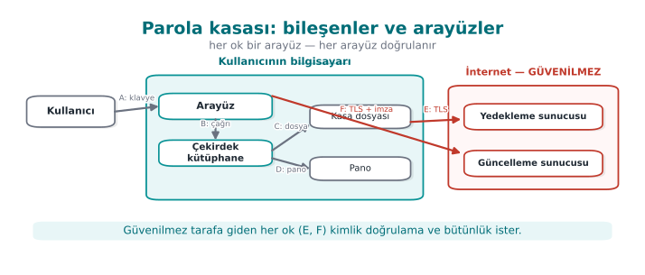

| Arayüz | Uç A | Uç B | Kimlik doğrulama | Gizlilik / bütünlük |
| --- | --- | --- | --- | --- |
| A | Kullanıcı | Arayüz | Ana parola | Parola ekranda gösterilmez |
| B | Arayüz | Çekirdek | Aynı süreç | Ana parola çağrı sonrası bellekten silinir |
| C | Çekirdek | Kasa dosyası | — | Kimlik doğrulamalı şifreleme (AES-GCM), anahtar ana paroladan türetilir |
| D | Çekirdek | Pano | — | Pano 30 s sonra temizlenir |
| E | Çekirdek | Yedekleme sunucusu | Sunucu sertifikası doğrulanır, kullanıcı belirteci | TLS + dosya zaten şifreli |
| F | Arayüz | Güncelleme sunucusu | Güncelleme paketinin **dijital imzası** doğrulanır | TLS; asıl güvence imzadır |

### Adım 3 — Varlıklar

| # | Varlık | Tür | Nerede | Oluşma → silinme | Koruma |
| --- | --- | --- | --- | --- | --- |
| V1 | Ana parola | Gizli, kısa ömürlü | Yalnız bellek | Kullanıcı yazar → anahtar türetilir → **hemen silinir** | C |
| V2 | Kasa anahtarı | Kriptografik, oturum boyu | Yalnız bellek | Türetilir → kasa kilitlenince silinir | C, I |
| V3 | Kasa kayıtları (çözülmüş) | Gizli | Bellek (yalnız görüntülenen kayıt) | Açılır → ekrandan kalkınca silinir | C |
| V4 | Kasa dosyası | Şifreli veri | Disk, yedek sunucusu | Kalıcı | C, I |
| V5 | Tuz ve türetme parametreleri | Açık ama bütünlüğü önemli | Kasa dosyasının başlığı | Kasa oluşturulurken | I |
| V6 | Güncelleme imza açık anahtarı | Kriptografik, statik | Uygulamaya gömülü | Derleme anında | I |
| V7 | Yedekleme belirteci | Kimlik bilgisi | Disk (işletim sistemi anahtar deposu) | Kullanıcı bağlanınca → iptal edilince | C |

"Koruma" sütununda dört değer kullanılır: **C** (gizlilik), **I** (bütünlük), **I+** (bütünlüğe ek olarak
hesap verebilirlik ve kimlik doğrulama: verinin **kimden geldiğinin** de doğrulanması gerekir; sahada bunu sunucuyla
paylaşılan bir kimlik doğrulama kodu sağlar) ve **N**
(koruma gerekmez). Sahada kullanılan varlık tabloları bunlara ek olarak her varlığın boyutunu, değerinin
kaynağını, varsayılan değerini ve hangi tabloda ya da dosyada durduğunu da yazar; statik, dinamik ve kriptografik
varlıklar ayrı tablolarda listelenir.

### Adım 4 — Tehditler (STRIDE, arayüz arayüz)

| # | Nerede | Harf | Tehdit | Olasılık | Etki | Risk |
| --- | --- | :-: | --- | :-: | :-: | :-: |
| T1 | C / V4 | I | Çalınan dizüstünden kasa dosyası kopyalanır, zayıf ana parola çevrimdışı denenir | 3 | 3 | **9** |
| T2 | B / V1, V2 | I | Ana parola ya da anahtar bellekte kalır; bellek dökümü, takas dosyası ya da hazırda bekletme dosyasından okunur | 2 | 3 | 6 |
| T3 | D / V3 | I | Panoya kopyalanan parola başka bir uygulama tarafından okunur | 3 | 2 | 6 |
| T4 | C / V4 | T | Kasa dosyası değiştirilir; uygulama bozuk kaydı fark etmeden kullanır ya da çöker | 2 | 2 | 4 |
| T5 | C / V5 | T | Başlıktaki türetme parametresi (yineleme sayısı) 1'e düşürülür; bir sonraki kaydetmede zayıf anahtar kullanılır | 1 | 3 | 3 |
| T6 | F / V6 | T, E | Sahte güncelleme paketi kurulur, saldırganın kodu kullanıcı yetkisiyle çalışır | 2 | 3 | 6 |
| T7 | E | S | Sahte yedek sunucusu belirteci çalar | 2 | 2 | 4 |
| T8 | Süreç | T | Kasa dosyası ayrıştırıcısında (parser) bellek hatası; kötü niyetli dosya programı çökertir ya da ele geçirir | 2 | 3 | 6 |
| T9 | A | S | Kullanıcının yanında biri ana parolayı ekrandan görür (omuz sörfü) | 1 | 3 | 3 |

### Adım 5 — Karşı önlemler

| Tehdit | Yanıt | Karşı önlem | Katman |
| --- | --- | --- | --- |
| T1 | Azalt | Ana paroladan anahtarı **yavaş** bir türetme fonksiyonuyla türet (PBKDF2 yüksek yineleme ya da Argon2id), en az parola uzunluğu şartı, parola gücü göstergesi | 6, 2 |
| T2 | Azalt | Anahtarı ve parolayı kullanımdan hemen sonra **güvenli sil**, belleği takasa düşmeye karşı kilitle, çökme dökümünü kapat (bu haftanın 11–12 ve 17. bölümleri) | 2 |
| T3 | Azalt | Panoyu 30 s sonra temizle, platform destekliyorsa "pano geçmişine alma" işaretini kullan | 1 |
| T4 | Azalt | Kimlik doğrulamalı şifreleme: etiket tutmazsa dosyayı **hiç açma** | 6 |
| T5 | Azalt | Başlığı şifrelemenin **ek doğrulanmış verisi** (AAD) yap; en düşük yineleme sayısını kodda sabitle, altındaysa reddet | 6, 2 |
| T6 | Azalt | Güncelleme paketini gömülü açık anahtarla imza doğrulamadan **asla** çalıştırma; sürüm geri almayı (downgrade) reddet | 6 |
| T7 | Azalt | Sertifika doğrulama + ana makine adı denetimi, isteğe bağlı sertifika sabitleme | 6 |
| T8 | Azalt | Ayrıştırıcıda her uzunluk alanını doğrula, fuzzing ile test et, derleyici korumalarını aç | 2, 3, 7 |
| T9 | Kabul et | Ekranda parolayı gizle; fiziksel gözetime karşı başka önlem kapsam dışı | — |

### Adım 6 — Doğrulama planı

Her önlem için "çalıştığını nasıl kanıtlarım?" sorusunun cevabı yazılır. Bir önlemin testi yoksa, o önlem
değerlendirici gözünde **yok** sayılır.

| Önlem | Test | Beklenen sonuç |
| --- | --- | --- |
| T1 türetme | Birim testi: türetme süresi ölçülür | Hedef makinede ≥ 250 ms |
| T2 silme | Kasa kilitlendikten sonra süreç belleği dökülür, ana parola aranır | Bulunamaz |
| T4 bütünlük | Kasa dosyasının rastgele bir baytı değiştirilir | Uygulama "dosya bozuk" der, açmaz, çökmez |
| T5 parametre | Başlıktaki yineleme sayısı 1 yapılır | Uygulama dosyayı reddeder |
| T6 imza | İmzası bozuk paket sunulur | Kurulum reddedilir, olay günlüğe yazılır |
| T8 ayrıştırıcı | 24 saat fuzzing ([4. hafta](../week-4/cen429-week-4.md)) | Çökme yok; sanitizer bulgusu yok |

### Adım 7 — Kalan risk

| Risk | Neden kabul edildi? | Yeniden değerlendirme |
| --- | --- | --- |
| Kasa açıkken bilgisayarda zararlı yazılım çalışıyorsa bellek okunabilir | Aynı kullanıcı yetkisiyle çalışan zararlıya karşı tam koruma mümkün değil; otomatik kilitleme süresi kısa tutuldu | Her sürüm |
| Omuz sörfü (T9) | Fiziksel ortam kapsam dışı | — |
| Çok zayıf ana parola | Kullanıcı uyarılıyor ama zorla engellenmiyor (kullanılabilirlik) | Kullanıcı geri bildirimine göre |

!!! success "Şablonu projenize taşıyın"
    Bu yedi adımlık yapı, dönem projenizin güvenlik kılavuzunun iskeletidir. Bu hafta yalnız **adım 0–4**'ü
    kendi projeniz için doldurmanız bekleniyor (bkz. "Dönem projesi: bu hafta"). Adım 5–7'yi dönem boyunca her
    hafta öğrendiğiniz önlemlerle dolduracaksınız.

### Sık yapılan hatalar

- **Varlıkları unutmak:** Yalnız "kullanıcı verisi" yazıp anahtarları, belirteçleri, sayaçları, yapılandırma
  dosyalarını ve **kodun kendisini** (bütünlüğü korunacak bir varlıktır) listelememek.
- **Güven sınırını yanlış çizmek:** Kendi yazdığınız istemci uygulamasını "güvenilir" kutusuna koymak. İstemci,
  kullanıcının makinesinde çalışıyorsa güvenilmezdir.
- **Önlemi tehditle eşleştirmemek:** "TLS kullanıyoruz" demek, TLS'in hangi tehdidi kapattığını (dinleme ve
  değiştirme) ve hangisini kapatmadığını (sunucudaki veri, istemcinin kendisi) söylemeden eksiktir.
- **Testsiz önlem:** "Parolayı bellekten siliyoruz" deyip derleyicinin bu silme işlemini kaldırıp kaldırmadığını
  hiç denetlememek (bu haftanın Demo 2'si tam olarak budur).

---

## 10. Program başlarken: güvenilmeyen ortam

Bir program çalışmaya başladığında **boş bir sayfayla** başlamaz. Onu çalıştıran kişiden birçok şey devralır:
**ortam değişkenleri** (`PATH`, `LD_PRELOAD`, `IFS`...), **açık dosya tanıtıcıları**, çalışma dizini, `umask`,
kaynak sınırları. Program bunlara güvenirse, onları kontrol eden kişi programın davranışını da kontrol eder.
Kaynak kitabımızın ilk bölümü (Viega & Messier, tarif 1.1–1.9) tam olarak bu "güvenli başlatma" konusunu işler.

### Demo 1 — PATH ile kandırma

!!! info "Demo 1 · `code/week-01/01-path-kandirma` · CWE-426 (güvenilmeyen arama yolu)"
    Program bir sistem komutunu çağırıyor: Linux'ta tarihi yazan `date`, Windows'ta bilgisayar adını yazan
    `hostname`. Soru: **hangi** `date`, **hangi** `hostname`?

Kabuk bir komutu mutlak yolu olmadan çağırdığınızda, programı `PATH` değişkenindeki klasörlerde **soldan sağa**
arar ve **ilk bulduğunu** çalıştırır:

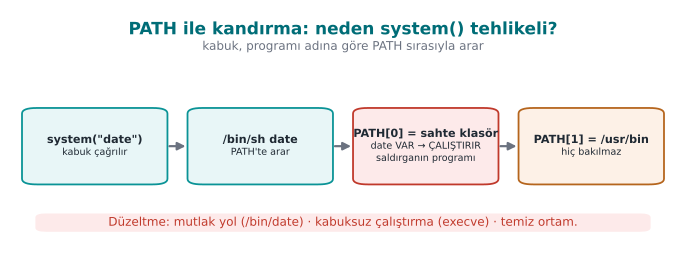

Windows'ta durum daha da kötüdür: `cmd.exe` komutu `PATH`'ten **önce çalışma klasöründe** arar ve `.bat`, `.cmd`
gibi uzantıları da dener. Programı hangi klasörden çalıştırdığınız bile hangi dosyanın çalışacağını değiştirir.

Hatalı kod:

```c title="rapor.c"
#ifdef _WIN32
#define KOMUT "hostname"
#else
#define KOMUT "date"
#endif

int main(void)
{
    printf("=== Aylik Satis Raporu ===\n");
    fflush(stdout);

    /* HATA: çıplak komut adı + kabuk + devralınan ortam (PATH, ...) */
    int durum = system(KOMUT);
    ...
}
```

Demoyu çalıştırın:

=== "Windows (PowerShell)"

    ```powershell
    cd code\week-01\01-path-kandirma
    .\demo.ps1
    ```

=== "WSL / Linux"

    ```bash
    cd code/week-01/01-path-kandirma
    sh demo.sh
    ```

```text title="Çıktı — WSL (kısaltılmış; Windows'ta aynı akış hostname ile)"
ADIM 1 — Normal calisma: program gercek date'i buluyor
=== Aylik Satis Raporu ===
Rapor tarihi: Sat Sep 19 19:11:32 +03 2026

ADIM 2 — Saldiri: PATH'in basina sahte/ klasoru ekleniyor
$ PATH="$PWD/sahte:$PATH" ./bin/linux/rapor
=== Aylik Satis Raporu ===
Rapor tarihi:
  !!! SAHTE 'date' calisti !!!
  Program PATH uzerinden kandirildi. ...

ADIM 3 — Duzeltilmis surum ayni saldiri altinda
=== Aylik Satis Raporu ===
Rapor tarihi: Sat Sep 19 19:11:32 +03 2026
```

Sahte `date` burada yalnız bir mesaj basıyor. Gerçek bir saldırgan aynı noktada **programı çalıştıran kişinin bütün
yetkileriyle** istediği her şeyi yapabilirdi. Program yüksek yetkiyle çalışıyorsa (ör. bir sistem servisi), bu doğrudan
yetki yükseltmedir.

Düzeltilmiş kod üç şeyi birden yapar: **1)** mutlak yol, **2)** kabuk yok, **3)** küçük, bilinen ortam.

=== "Linux (posix_spawn)"

    ```c title="rapor_guvenli.c"
    char *const arguman[]     = { "date", NULL };
    char *const temiz_ortam[] = { "PATH=/usr/bin:/bin", "LANG=C", NULL };

    pid_t pid;
    int hata = posix_spawn(&pid, "/bin/date", NULL, NULL,
                           arguman, temiz_ortam);
    ```

=== "Windows (CreateProcessW)"

    ```c title="rapor_guvenli.c"
    /* 1) C:\Windows\System32\hostname.exe — tam yol */
    GetSystemDirectoryW(sistem, MAX_PATH);
    swprintf(program, MAX_PATH, L"%ls\\hostname.exe", sistem);

    /* 3) ortam bloğunda yalnız SystemRoot */
    swprintf(ortam, MAX_PATH + 16, L"SystemRoot=%ls", kok);

    /* 2) cmd.exe yok: program doğrudan başlatılır */
    CreateProcessW(program, komut_satiri, NULL, NULL, FALSE,
                   CREATE_UNICODE_ENVIRONMENT, ortam, NULL, &si, &pi);
    ```

!!! success "Kural"
    Başka bir program çalıştırmanız gerekiyorsa: **mutlak yol** kullanın, **kabuk üzerinden çalıştırmayın**
    (`system`, `popen` yerine Linux'ta `posix_spawn`/`execve`, Windows'ta `CreateProcessW`) ve çocuk sürece
    **temizlenmiş, bilinen** bir ortam verin. En iyisi: başka program çalıştırmaya hiç gerek bırakmayın — tarihi
    `time()` ve `strftime()` ile, bilgisayar adını `gethostname()` ya da `GetComputerNameW()` ile kendiniz alın.

---

## 11. Güvenli başlatma: programın ilk satırlarında yapılacaklar

Demo 1, programın devraldığı tek bir ortam değişkeninin (`PATH`) bütün güvenliği nasıl altüst ettiğini gösterdi.
`PATH` tek tehlike değildir. Kaynak kitabımızın birinci bölümü (Tarif 1.1–1.9), bir programın `main()`
fonksiyonunun **ilk satırlarında** yapması gerekenleri sıralar. Bu bölümde o listeyi bugünün sistemlerine göre
güncelleyip adım adım işleyeceğiz.

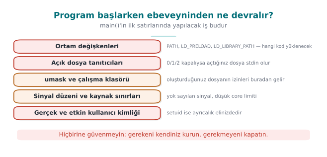

### Program başladığında elinde ne var?

Bir süreç `exec` ile başlatıldığında (Windows'ta `CreateProcess`) şu durumu **ebeveyninden** devralır:

| Devralınan | Neden tehlikeli? | Kitaptaki tarif |
| --- | --- | --- |
| Ortam değişkenleri | `PATH`, `LD_PRELOAD`, `LD_LIBRARY_PATH` hangi programın ve kütüphanenin yükleneceğini değiştirir | 1.1 |
| Açık dosya tanıtıcıları | Ebeveynin açık bıraktığı bir gizli dosya ya da soket çocuk sürece sızar; 0–2 kapalıysa ilk açılan dosya "standart çıktı" olur | 1.5 |
| `umask` | Yeni dosyaların izinlerini belirler; `000` ise dosyalar herkese yazılabilir olur | 2.7 |
| Çalışma dizini | Göreli yollar (`./ayar.ini`) saldırganın seçtiği bir klasöre işaret edebilir | 1.1 |
| Kaynak sınırları | Çekirdek dökümü (core dump) açıksa çökme anında bellek diske yazılır | 1.9 |
| Kimlik ve yetkiler | setuid programda gerçek ve etkin kullanıcı farklıdır; gereğinden fazla yetki taşınır | 1.3 |
| Sinyal ayarları | Ebeveynin yok saydığı sinyaller çocukta da yok sayılır | 13.5 |

Kural basittir: **programın kendisinin kurmadığı hiçbir şeye güvenme.** Programın ilk işi, bu devralınan durumu
bilinen ve güvenli bir duruma getirmektir.

### Adım 1 — Ortamı temizle (Tarif 1.1)

İki yaklaşım vardır: kötü değişkenleri tek tek silmek (kara liste) ya da ortamı tamamen boşaltıp gerekenleri
yeniden kurmak (beyaz liste). Kara liste her zaman eksik kalır, çünkü yarın hangi değişkenin tehlikeli olacağını
bilemezsiniz. Doğru olan **beyaz listedir**:

```c title="Linux — ortamı beyaz listeyle yeniden kur"
#include <stdlib.h>
#include <string.h>

static void ortami_temizle(void)
{
    const char *tz = getenv("TZ");          /* korunacak değişkeni önce kopyala */
    char tz_kopya[64] = "";
    if (tz && strlen(tz) < sizeof tz_kopya)
        strcpy(tz_kopya, tz);

    clearenv();                              /* glibc; taşınabilir değil (aşağıya bakın) */
    setenv("PATH", "/usr/bin:/bin", 1);      /* bilinen, yazılamaz dizinler */
    if (tz_kopya[0])
        setenv("TZ", tz_kopya, 1);
}
```

!!! note "Neden önce kopyalıyoruz?"
    `getenv()` ortam bloğunun **içine** bir işaretçi döndürür. `clearenv()` bu bloğu geçersiz kılar; sonra o
    işaretçiyi kullanmak serbest bırakılmış belleği kullanmak olur. Korunacak değeri önce kendi tamponunuza
    kopyalayın. `clearenv()` glibc'ye özgüdür; taşınabilir kodda `extern char **environ; environ = NULL;` kullanılır.

Bir değişkeni kullanmanız **gerekiyorsa** (ör. kullanıcının `HOME`'u), ona bir girdi gibi davranın: uzunluğunu
sınırlayın, beklenen biçimde olduğunu doğrulayın (Tarif 3.6). Windows'ta ortam aynı şekilde devralınır; orada
`PATH`'in yanında **DLL arama sırası** da tehlikedir (aşağıda Adım 6).

### Adım 2 — Dosya tanıtıcılarını düzenle (Tarif 1.5)

İki ayrı sorun vardır:

1. **0, 1, 2 kapalıysa:** Saldırgan programı standart çıktısı kapalı olarak başlatır. Programın açtığı ilk dosya
   (ör. parola dosyası) tanıtıcı **1**'i alır. Sonraki her `printf`, o dosyanın **içine** yazar.
2. **Fazladan açık tanıtıcılar:** Ebeveyn, `close-on-exec` işaretlemeden açık bıraktığı bir dosyayı ya da soketi
   çocuğa devreder. Çocuk bu tanıtıcıyla, normalde erişemeyeceği bir kaynağa erişebilir.

```c title="Linux — 0-2'yi garantile, gerisini kapat"
#include <fcntl.h>
#include <unistd.h>
#include <stdlib.h>

static void tanitici_duzenle(void)
{
    for (int fd = 0; fd <= 2; fd++) {
        if (fcntl(fd, F_GETFD) == -1) {           /* kapalı mı? */
            int yeni = open("/dev/null", O_RDWR);
            if (yeni != fd)                        /* tam olarak o numarayı almalı */
                abort();
        }
    }
    /* Linux 5.9+ / glibc 2.34+: tek çağrıda 3 ve üstünü kapat */
    close_range(3, ~0U, 0);
}
```

Daha eski sistemlerde `sysconf(_SC_OPEN_MAX)`'a kadar döngüyle `close()` çağrılır; sınır çok büyükse (ör. bir
milyon) bu yavaş olabilir, `close_range` bu yüzden eklendi. Kendi açtığınız dosyalarda ise her zaman
`O_CLOEXEC` bayrağını kullanın; böylece ileride başlatacağınız bir alt sürece sızmazlar.

### Adım 3 — Yeni dosyaların iznini daralt (Tarif 2.7)

```c
#include <sys/stat.h>
umask(077);     /* yeni dosyalar yalnız sahibine açık: rw------- */
```

`umask` bir **maskedir**: `open()`'a verdiğiniz izinlerden maskedeki bitler **çıkarılır**. `077` ile grup ve
diğerleri için hiçbir bit kalmaz. Yine de hassas dosyayı açarken izni açıkça yazın: `open(yol, O_WRONLY |
O_CREAT | O_EXCL, 0600)`. `O_EXCL`, dosya zaten varsa (ör. saldırganın önceden oluşturduğu bir bağlantıysa)
açmayı reddeder; [2. haftadaki](../week-2/cen429-week-2.md) TOCTOU demosunu hatırlayın.

### Adım 4 — Çökme dökümünü kapat (Tarif 1.9)

Program çöktüğünde işletim sistemi, hata ayıklamaya yardım etsin diye sürecin **bütün belleğini** bir dosyaya
yazabilir. O bellekte parola, anahtar ve çözülmüş veri varsa, hepsi diskte düz metin olarak kalır. Demo 2'deki
parola tam olarak böyle bulunabilir.

=== "Linux"

    ```c
    #include <sys/resource.h>
    #include <sys/prctl.h>

    static void dokumu_kapat(void)
    {
        struct rlimit r = { 0, 0 };
        setrlimit(RLIMIT_CORE, &r);            /* çekirdek dökümü boyutu 0 */
        prctl(PR_SET_DUMPABLE, 0, 0, 0, 0);    /* döküm yok, aynı kullanıcı bile ptrace ile bağlanamaz */
    }
    ```

    `PR_SET_DUMPABLE` ikinci bir kazanç sağlar: aynı kullanıcıyla çalışan başka bir süreç, bu sürece hata
    ayıklayıcı olarak **bağlanamaz** ve `/proc/<pid>/mem` dosyasını okuyamaz. [6. haftada](../week-6/cen429-week-6.md) hata ayıklayıcı
    algılamayı konuşurken bu satıra döneceğiz.

=== "Windows"

    ```c
    #include <windows.h>

    static void dokumu_kapat(void)
    {
        /* Çökme iletişim kutusunu ve kritik hata kutularını kapat */
        SetErrorMode(SEM_FAILCRITICALERRORS | SEM_NOGPFAULTERRORBOX);
    }
    ```

    Windows'ta tam bellek dökümünü asıl belirleyen, Windows Hata Bildirimi'nin (WER) yerel döküm ayarlarıdır ve
    bunlar sistem ya da kullanıcı düzeyinde yapılandırılır. Program kendi içinden yapabileceği en önemli şeyi
    yapmalıdır: sırları bellekte **mümkün olan en kısa süre** tutmak ve işi bitince silmek (bkz. 12. ve 17. bölümler). Bir
    döküm alınsa bile, içinde bulunacak sır kalmamalıdır.

### Adım 5 — Gereksiz yetkiyi bırak (Tarif 1.2–1.4)

Programınız bir işi yapmak için geçici olarak yüksek yetki gerektiriyorsa (ör. 1024'ün altındaki bir portu açmak),
o işi yaptıktan **hemen sonra** yetkiyi **kalıcı olarak** bırakmalıdır.

```c title="Linux — setuid programda yetkiyi kalıcı bırak ve doğrula"
#include <unistd.h>
#include <stdlib.h>

static void yetkiyi_birak(void)
{
    uid_t u = getuid();
    gid_t g = getgid();

    if (setresgid(g, g, g) != 0) abort();   /* önce grup: sonra buna yetkimiz kalmaz */
    if (setresuid(u, u, u) != 0) abort();   /* gerçek, etkin ve saklı kimliğin üçü de */

    uid_t r, e, s;
    getresuid(&r, &e, &s);
    if (r != u || e != u || s != u) abort();  /* bıraktığını DOĞRULA */
}
```

Üç ayrıntı hayatidir: (1) **önce grup**, sonra kullanıcı bırakılır; kullanıcıyı önce bırakırsanız grubu
değiştirecek yetkiniz kalmaz. (2) Yalnız etkin kimliği değiştiren `seteuid()` geçicidir; **saklı** kimlik yetkili
kalır ve yetki geri alınabilir (2. hafta Demo 13). (3) Bırakma işleminin sonucu mutlaka **doğrulanır**; dönüş
değeri denetlenmeyen bir `setuid()` çağrısı gerçek hatalara yol açmıştır.

Windows'ta aynı fikir **kısıtlanmış belirteç** (restricted token) ile uygulanır: `CreateRestrictedToken` ile
yönetici gruplarını ve ayrıcalıkları çıkarılmış bir belirteç oluşturulur ve riskli iş o belirteçle çalışan bir alt
süreçte yapılır (Tarif 1.2). Daha güçlü bir yaklaşım **ayrıcalık ayrımıdır** (Tarif 1.4): programı, yetki gerektiren
küçük bir parça ile yetkisiz çalışan büyük bir parça olarak **iki sürece** bölmek. Bir tarayıcının her sekmeyi
yetkisiz bir "kum havuzu" (sandbox) sürecinde çalıştırması bu fikrin bugünkü halidir.

### Adım 6 — Başka program ve kütüphane yüklerken dikkat (Tarif 1.6–1.8)

| Hatalı | Neden? | Doğrusu |
| --- | --- | --- |
| `system("convert " + dosya)` | Kabuk çalışır; dosya adındaki `;`, `&&`, `$(...)` komut olur ([5. hafta](../week-5/cen429-week-5.md)) | `execve("/usr/bin/convert", argv, temiz_ortam)` |
| `execvp("convert", ...)` | `PATH`'te arar (Demo 1) | Tam yol ile `execve` |
| `CreateProcess(NULL, "C:\Program Files\Araç\a.exe", ...)` | Tırnaksız boşluklu yol: önce `C:\Program.exe` denenir | `lpApplicationName`'e tam yolu ver, komut satırını tırnakla |
| `LoadLibrary("yardimci.dll")` | Arama sırasında uygulamanın ya da çalışma dizininin içine konmuş sahte DLL yüklenebilir | `SetDefaultDllDirectories(LOAD_LIBRARY_SEARCH_DEFAULT_DIRS)` ve tam yol |
| `dlopen("libyardimci.so")` | `LD_LIBRARY_PATH` ve arama yolları | Tam yol; `LD_*` değişkenleri Adım 1'de temizlenmiş olmalı |

Windows'taki DLL arama sırası sorunu, `PATH` sorununun ikizidir: program, istediği kütüphaneyi saldırganın
bıraktığı bir klasörde bulursa o kütüphanenin kodu, programın yetkisiyle çalışır (CWE-427).

### Hepsi bir arada: `guvenli_baslat()`

```c title="guvenli_baslat.c — Linux iskeleti (Windows karşılıkları yorumlarda)"
int main(int argc, char **argv)
{
    tanitici_duzenle();   /* Adım 2 — Windows: gerek yok, tanıtıcılar varsayılan olarak devralınmaz */
    ortami_temizle();     /* Adım 1 — Windows: SetDefaultDllDirectories + PATH doğrulaması */
    umask(077);           /* Adım 3 — Windows: dosyayı açıkça kısıtlı DACL ile oluştur */
    dokumu_kapat();       /* Adım 4 — Windows: SetErrorMode */
    yetkiyi_birak();      /* Adım 5 — Windows: kısıtlanmış belirteç / ayrı süreç */

    /* ... programın asıl işi ... */
    return 0;
}
```

Sıralama rastgele değildir: tanıtıcılar ve ortam, programın **başka hiçbir şey yapmadan önce** düzenlenmelidir;
çünkü sonraki her adım (ör. bir hata iletisi yazmak) bunlara dayanır.

!!! tip "Değerlendirici nasıl test eder?"
    Programı kapalı standart çıktıyla, zehirli `PATH` ve `LD_PRELOAD` ile, `umask 000` ile başlatır; çökme
    tetikleyip döküm dosyası arar; setuid programlarda yetkinin gerçekten bırakılıp bırakılmadığını
    `/proc/<pid>/status` içindeki `Uid:` satırıyla denetler. Windows'ta uygulamanın klasörüne ve çalışma
    dizinine sahte bir DLL koyup yüklenip yüklenmediğine bakar.

!!! note "Sahada nasıl uygulanır?"
    Mobil ödeme kütüphanelerinde native katman, `LD_PRELOAD` değişkeninin dolu olup olmadığını denetler; hatta
    `getenv` fonksiyonunun kendisinin kancalanıp kancalanmadığını anlamak için rastgele bir değişkeni `setenv` ile
    yazıp `getenv` ile geri okur. Değer tutmazsa, biri çağrıyı araya girip değiştiriyordur. Bu, güvenli başlatmanın
    "çalışma zamanı öz koruması"na (6. hafta) dönüştüğü noktadır.

---

## 12. Bellekte kalan sırlar

Bir parolayı kullandıktan sonra ne olur? Değişken kapsam dışına çıkar ama **bellek silinmez**; o baytlar üzerine
başka bir şey yazılana kadar orada durur. Bir saldırgan o belleği görebilirse sırrı okur. Belleğin görülebildiği
durumlar sandığınızdan çoktur:

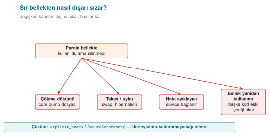

- Program çöktüğünde oluşan **çökme dökümü** (core dump) dosyası,
- İşletim sisteminin belleği diske yazdığı **takas alanı** (swap) ve uyku (hibernation) dosyası,
- Bir **hata ayıklayıcının** sürece bağlanması,
- Aynı belleği sonradan kullanan başka bir kod parçasının eski içeriği okuması.

### Demo 2 — Bellekte kalan parola

!!! info "Demo 2 · `code/week-01/02-bellekte-parola` · CWE-14 (derleyicinin silme kodunu kaldırması), CWE-316"
    Program parolayı `parola.txt` dosyasından okuyor, onunla bir anahtar hesaplıyor, sonra parolayı silmeye
    çalışıyor. Demo, programın belleğini bir dosyaya döküp içinde parolayı arıyor: Linux'ta `gdb`'nin `gcore`
    komutuyla, Windows'ta programın kendi belleğini `MiniDumpWriteDump` ile yazmasıyla. Üç sürüm var: **hiç
    silmeyen**, **`memset` ile silen** ve **`explicit_bzero` / `SecureZeroMemory` ile silen**.

```c title="parola.c (özü)"
unsigned long giris_yap(const char *dosya)
{
    char parola[64];
    /* düşük düzey okuma: parola yalnız bu dizide durur */
    int fd = dosya_ac(dosya);
    int n = (int)dosya_oku(fd, parola, sizeof(parola) - 1);
    ...
    unsigned long anahtar = anahtar_turet(parola, (size_t)n);

#if SILME == 1
    memset(parola, 0, sizeof(parola));         /* "ölü yazma" */
#elif SILME == 2
  #ifdef _WIN32
    SecureZeroMemory(parola, sizeof(parola));  /* kaldırılamaz */
  #else
    explicit_bzero(parola, sizeof(parola));    /* kaldırılamaz */
  #endif
#endif
    return anahtar;
}
```

=== "Windows (PowerShell)"

    ```powershell
    cd code\week-01\02-bellekte-parola
    .\demo.ps1
    ```

=== "WSL / Linux"

    ```bash
    cd code/week-01/02-bellekte-parola
    sh demo.sh
    ```

```text title="sh demo.sh — çıktı (Windows'ta sonuç aynıdır)"
ADIM 1 — Parolayi hic silmeyen surum
  SONUC: parola dokumde 1 yerde BULUNDU  ->  Gizli-Parola-2026

ADIM 2 — memset ile silen surum (-O2)
  SONUC: parola dokumde 1 yerde BULUNDU  ->  Gizli-Parola-2026

ADIM 3 — explicit_bzero ile silen surum (-O2)
  SONUC: parola dokumde bulunamadi

Neden? giris_yap() fonksiyonunun makine kodu:
  memset surumunde silme komutu sayisi    ->  0
  explicit surumunde explicit_bzero cagrisi ->  1
```

**İkinci adım şaşırtıcıdır:** kodda açıkça `memset` yazıyor, ama parola hâlâ bellekte! Nedeni derleyicinin
optimizasyonudur. Derleyici şöyle düşünür: *"`parola` dizisi bu satırdan sonra hiç okunmuyor; ona sıfır yazmanın
programın sonucuna hiçbir etkisi yok. Öyleyse bu yazma gereksiz, silebilirim."* Buna **ölü yazma giderme** (dead
store elimination) denir. Normal programlarda hız kazandıran bu optimizasyon, güvenlik kodunda sırrın bellekte
kalmasına yol açar. Bu yalnız GCC'ye özgü değildir: Windows'ta MSVC `/O2` ile de aynı sonuç çıkar. Makine koduna
kendiniz bakın: Linux'ta `objdump -d bin/linux/parola_memset | less` ile `giris_yap`'ı arayın; Visual Studio'da
`giris_yap`'a kesme noktası koyup **Hata Ayıkla > Pencereler > Ayrıştırılmış Kod** (*Disassembly*) penceresini açın.
`memset`'e ait tek bir komut bile yoktur.

!!! success "Kural"
    Sırları silmek için derleyicinin kaldıramayacağı fonksiyonları kullanın:
    Linux/glibc'de `explicit_bzero`, Windows'ta `SecureZeroMemory`, C11 Ek K destekleyen derleyicilerde `memset_s`,
    OpenSSL'de `OPENSSL_cleanse`. Ek katmanlar: çökme dökümünü kapatmak (`setrlimit(RLIMIT_CORE, 0)`), belleğin diske
    yazılmasını engellemek (`mlock`), sırrı mümkün olan en kısa süre tutmak ve kopyalarını çoğaltmamak.

!!! note "Sahada nasıl uygulanır?"
    Mobil ödeme gibi yüksek güvenlik gerektiren yazılımlarda tek kullanımlık ödeme anahtarı yalnız ödeme anında ve
    yalnız native katmanda açılır; kullanımdan hemen sonra tampon **rastgele veriyle** üzerine yazılarak silinir. Java
    tarafında hassas veri, silinemeyen `String` yerine silinebilen `byte[]` dizilerinde tutulur. Bağımsız bir
    değerlendirici bunu, ödeme sırasında ve sonrasında bellek dökümü alıp anahtarı arayarak test eder — tam olarak
    Demo 2'de yaptığımız gibi.

---

## 13. Süreç belleği: verileriniz nerede duruyor?

Taşma hatalarını anlamak için önce bir programın belleğinin nasıl düzenlendiğini bilmemiz gerekir. Linux'ta çalışan
bir sürecin sanal belleği kabaca şöyledir:

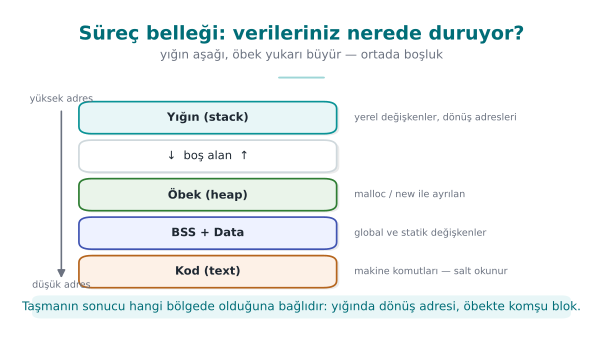

Bir fonksiyon çağrıldığında yığında ona bir **çerçeve** (stack frame) ayrılır. Yerel değişkenler, bu çerçevede
**yan yana** durur. C, bir dizinin sonuna gelindiğini **denetlemez**: `ad[16]` dizisine 17. baytı yazarsanız, C bunu
engellemez ve o bayt bellekte hemen arkada ne varsa onun üzerine yazılır.

Demo 3'teki yapıya bakalım:

```c
struct oturum {
    char ad[16];
    int  yonetici;   /* 0 = normal kullanıcı */
};
```

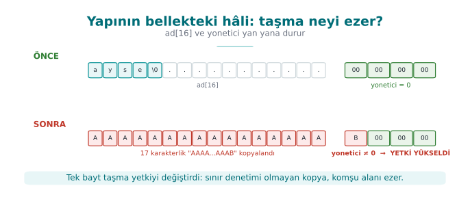

x86-64 işlemciler **küçük uçlu** (little-endian) çalışır: bir tamsayının en düşük baytı en düşük adreste durur. Bu
yüzden `yonetici`'nin ilk baytına yazılan `'B'` (0x42) tamsayıyı 66 yapar — sıfır olmayan her değer "yönetici" demektir.

---

## 14. Arabellek taşmaları: nasıl oluşur, nasıl önlenir?

Önceki bölümde sürecin belleğinin bölgelerini gördük. Şimdi bu belleğin en eski ve hâlâ en yaygın hatasını
tanıyalım. **Arabellek taşması** (buffer overflow), bir programın bir diziye, o dizinin **ayrılan boyutundan fazla**
veri yazmasıdır. Taşan baytlar yok olmaz; dizinin hemen yanındaki belleğe, yani **başka değişkenlerin** üzerine
yazılır. CWE Top 25 listesinde "sınırlar dışına yazma" (CWE-787) yıllardır ilk sıralardadır.

### C neden bu kadar kolay taşar?

Java, C#, Python gibi dillerde bir dizinin dışına yazmaya çalıştığınızda çalışma zamanı sizi durdurur
(`ArrayIndexOutOfBoundsException`). C ve C++'ta ise:

1. Dizi, bellekte ardışık baytlardan başka bir şey değildir; **boyutunu kendisi bilmez**.
2. Bir diziyi fonksiyona verdiğinizde yalnız **başlangıç adresi** gider (`char *`); boyut bilgisi kaybolur.
3. Dizgeler (string) ayrı bir tür değildir; sonu `'\0'` baytıyla işaretlenmiş bir `char` dizisidir. `strcpy`,
   `strcat`, `sprintf` gibi fonksiyonlar kaynağı **sıfır baytını görene kadar** kopyalar; hedefin ne kadar yer
   olduğunu hiç sormaz.
4. Derleyici, hızdan ödün vermemek için sınır denetimi **eklemez**.

Sonuç: sınırı denetlemek tamamen **programcının** sorumluluğundadır. Programcı bir kez unutursa, hata oradadır.

### Yığında bir taşma adım adım

Aşağıdaki fonksiyon bir kullanıcı adını küçük bir yerel diziye kopyalıyor:

```c title="Hatalı: kaynak uzunluğu hiç denetlenmiyor"
void selamla(const char *ad)
{
    int  yetkili = 0;
    char tampon[16];

    strcpy(tampon, ad);          /* ad 16 bayttan uzunsa? */
    printf("Merhaba %s\n", tampon);
    if (yetkili) { /* ... */ }
}
```

Fonksiyon çağrıldığında yığında ona ait bir **çerçeve** (stack frame) oluşur. Çerçevenin içinde yerel değişkenler,
bir önceki çerçevenin adresi ve fonksiyon bitince **nereye dönüleceğini** gösteren **dönüş adresi** bulunur.
Basitleştirilmiş bir görünüm (düşük adres yukarıda; gerçek yerleşim derleyiciye göre değişir):

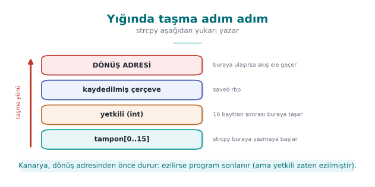

Üç durum vardır:

| Girdi uzunluğu | Ne olur? | Sonuç |
| --- | --- | --- |
| ≤ 15 karakter | Her şey tampona sığar | Program doğru çalışır |
| Biraz fazla | Taşan baytlar `yetkili`'nin üzerine yazar; `yetkili` artık 0 değildir | **Mantık bozulur**: yetkisiz kullanıcı yetkili sayılır (Demo 3) |
| Çok fazla | Dönüş adresi bozulur; fonksiyon bitince işlemci anlamsız bir adrese atlar | Program **çöker** (hizmet engelleme); korumasız bir sistemde akış **ele geçirilebilir** |

Üçüncü satırın son kısmı, taşmayı bu kadar tehlikeli yapan şeydir: dönüş adresini kontrol eden, programın **bir
sonra hangi kodu çalıştıracağını** kontrol eder. 1988'deki Morris solucanından 2003'teki Slammer'a kadar
salgınların çoğunun giriş kapısı buydu ([2. hafta](../week-2/cen429-week-2.md)). Bugünkü işletim sistemleri ve derleyiciler bu yolu çok
zorlaştıran korumalar ekler (aşağıda), ama **hatanın kendisi hâlâ kodunuzdadır** ve korumalar her durumu
kapatmaz. Bu derste sömürünün nasıl yapılacağıyla değil, hatanın **nasıl oluştuğu, nasıl bulunduğu ve nasıl
önlendiğiyle** ilgileniyoruz.

### Taşma türleri

| Tür | Nerede? | Tipik neden | CWE |
| --- | --- | --- | --- |
| **Yığın taşması** | Yerel dizi | `strcpy`, `gets`, sınırsız `scanf("%s")` | CWE-121 |
| **Öbek taşması** | `malloc` ile ayrılmış blok | Uzunluk yanlış hesaplanmış `memcpy`; öbek yönetim bilgisi bozulur | CWE-122 |
| **Bir fazla (off-by-one)** | Herhangi bir dizi | `<=` yerine `<`; sonlandırıcı `'\0'` için yer ayırmayı unutmak | CWE-193 |
| **Sınır dışı okuma** | Herhangi bir dizi | Karşı tarafın bildirdiği uzunluğa güvenmek | CWE-125 |
| **Tamsayı kaynaklı** | Herhangi bir dizi | `n * boyut` taşar, küçük bir blok ayrılır, sonra büyük kopyalanır | CWE-190 → 787 |

!!! example "Sınır dışı okuma da yazma kadar tehlikelidir: Heartbleed (2014)"
    OpenSSL'in "kalp atışı" (heartbeat) uzantısında istemci bir mesaj ve o mesajın **uzunluğunu** gönderiyordu;
    sunucu mesajı aynen geri yolluyordu. Sunucu, bildirilen uzunluğun gerçekten gelen mesajın uzunluğu olup
    olmadığını **denetlemiyordu**. İstemci 1 baytlık mesaj gönderip "64 KB" dediğinde sunucu, belleğinden 64 KB
    geri yolluyordu: içinde başka kullanıcıların parolaları, oturum bilgileri, hatta sunucunun **özel anahtarı**
    olabiliyordu (CVE-2014-0160). Hiçbir şey yazılmadı, hiçbir şey çökmedi; yalnız **okundu**. Düzeltme tek bir
    denetimdi: "bildirilen uzunluk, alınan kayıt uzunluğundan büyükse mesajı at."

### Bir fazla hatası: en masum görünen taşma

```c title="Hatalı: sonlandırıcıya yer yok"
char ad[8];
for (int i = 0; i <= 8; i++)     /* 9 kez döner: ad[8] dizinin dışında */
    ad[i] = kaynak[i];
```

```c title="Hatalı: strncpy sonlandırıcıyı garanti etmez"
char ad[8];
strncpy(ad, kaynak, sizeof ad);  /* kaynak ≥ 8 ise ad '\0' ile BİTMEZ */
printf("%s\n", ad);              /* printf dizinin sonundan okumaya devam eder */
```

`strncpy` adı yanıltıcıdır: güvenli bir `strcpy` değildir. Kaynak hedeften uzunsa sonlandırıcı koymaz; kısaysa
hedefin geri kalanını gereksiz yere sıfırlarla doldurur. Tek bir baytlık taşma bile bitişik bir değişkenin en
düşük baytını ya da kaydedilmiş çerçeve adresini değiştirmeye yeter.

### Tehlikeli fonksiyonlar ve yerlerine kullanılacaklar

| Tehlikeli | Sorun | Yerine | Not |
| --- | --- | --- | --- |
| `gets(s)` | Sınırı hiç bilmez | `fgets(s, sizeof s, stdin)` | C11'de standarttan **kaldırıldı** |
| `strcpy(d, s)` | Hedef boyutu yok | Önce uzunluğu denetle, sonra `memcpy`; ya da `snprintf(d, sizeof d, "%s", s)` | glibc 2.38+ ve BSD'lerde `strlcpy` |
| `strcat(d, s)` | Hedef boyutu yok | Kalan yeri hesapla; `snprintf` ile birleştir | `strlcat` |
| `sprintf(d, ...)` | Çıktı uzunluğu bilinmez | `snprintf(d, sizeof d, ...)` ve dönüş değerini denetle | Dönüş ≥ boyut ise **kesildi** demektir |
| `scanf("%s", s)` | Sınırsız okuma | `scanf("%15s", s)` (boyut − 1) ya da `fgets` | |
| `strncpy(d, s, n)` | `'\0'` garantisi yok | `snprintf` ya da `strlcpy` | |
| `memcpy(d, s, n)` | `n` doğrulanmamışsa | `n ≤ hedef boyutu` denetimi **önce** | En sık hata: `n` dışarıdan gelir |
| `alloca(n)`, VLA `char a[n]` | Büyük `n` yığını aşar | Sabit üst sınır ya da `malloc` | |

!!! info "Tarif 3.3 ve 3.4'ün bugünkü karşılığı"
    Kitap, taşmayı önlemek için dizge işlemlerini sınır denetimli bir kütüphaneye (SafeStr) devretmeyi önerir.
    Fikir bugün de geçerlidir, araçlar değişmiştir: C'de `snprintf` ve `strlcpy`, Microsoft derleyicisinde C11
    Ek K'daki `strcpy_s`/`strcat_s` ailesi (glibc bu ailesi desteklemez), C++'ta ise `std::string`,
    `std::vector`, `std::array::at()` ve `std::span`. Microsoft'un güvenli geliştirme süreci, tehlikeli
    fonksiyonları derlemede **hata** olarak işaretleyen bir "yasaklı fonksiyonlar" başlık dosyası kullanır; siz
    de projenizde aynı yöntemi kullanabilirsiniz.

### Doğru kalıp: önce doğrula, sonra sınırlı kopyala

```c title="Düzeltilmiş: uzunluk denetimi + sınırlı kopya + her zaman sonlandırıcı"
#include <stdio.h>
#include <string.h>

int selamla(const char *ad)
{
    char tampon[16];
    size_t n = strnlen(ad, sizeof tampon);

    if (n == sizeof tampon)            /* 15 karakterden uzun: reddet, sessizce kesme */
        return -1;

    memcpy(tampon, ad, n);
    tampon[n] = '\0';
    printf("Merhaba %s\n", tampon);
    return 0;
}
```

Bu kalıpta üç karar var:

1. **`strnlen`** ile uzunluk, en fazla tampon boyutu kadar baytta ölçülür; kaynak hiç sonlanmıyorsa bile
   okuma sınırın ötesine geçmez.
2. Uzun girdi **reddedilir**. Sessizce kesmek bazen doğrudur (ör. ekrana yazılacak bir başlık), ama bir kimlik
   bilgisi, dosya yolu ya da komut kesildiğinde anlamı değişebilir: `/home/ayse/gizli_rapor.txt` kesilince
   `/home/ayse/gizli` olabilir. Güvenlik açısından belirsiz girdiyi reddetmek daha güvenlidir.
3. Sonlandırıcı her durumda **açıkça** yazılır.

C++'ta aynı işi dil yapar:

```cpp title="C++ — boyutu tür taşır"
#include <string>
#include <iostream>

void selamla(const std::string &ad)
{
    if (ad.size() > 15) throw std::invalid_argument("ad cok uzun");
    std::string tampon = ad;                   /* kendi belleğini kendi yönetir */
    std::cout << "Merhaba " << tampon << '\n';
}
```

!!! warning "C++ da sizi her zaman korumaz"
    `std::vector::operator[]` sınır denetlemez; `at()` denetler. `std::string::c_str()` ile alınan işaretçiyi
    bir C fonksiyonuna verip oraya yazarsanız C'nin bütün sorunları geri gelir. Güvenli tür kullanmak, sınırı
    düşünmekten muaf tutmaz.

### Taşmayı kim yakalar? Savunma katmanları

Taşmaya karşı savunma da katmanlıdır. En içteki katman doğru koddur; dıştaki katmanlar, bir hata kaçtığında
zararı sınırlar:

| Katman | Araç | Ne yapar? | Ne zaman? |
| --- | --- | --- | --- |
| Kod | Sınır denetimi, güvenli API | Taşmayı hiç oluşturmaz | Her zaman |
| Derleyici uyarısı | `-Wall -Wextra -Wformat-security`, MSVC `/W4 /sdl` | Şüpheli çağrıları derlemede gösterir | Geliştirme |
| Statik analiz | `clang --analyze`, `cppcheck`, MSVC `/analyze` | Kodu çalıştırmadan olası taşmaları arar | Geliştirme, CI |
| Sanitizer | AddressSanitizer (`-fsanitize=address`, MSVC `/fsanitize=address`) | Her bellek erişimini denetler; ilk taşmada programı durdurup yerini söyler | Test |
| Fuzzing | libFuzzer, AFL++ | Programı milyonlarca rastgele girdiyle besler | Test (4. hafta) |
| Derleyici koruması | Yığın koruyucu (`-fstack-protector-strong`, MSVC `/GS`), `_FORTIFY_SOURCE` | Dönüş adresinin önüne bir "kanarya" koyar, bozulursa programı sonlandırır | Sürüm |
| İşletim sistemi | DEP/NX, ASLR | Veri bölgesinde kod çalıştırmayı engeller; adresleri her çalıştırmada değiştirir | Sürüm |
| Donanım | Gölge yığın (Intel CET, ARM PAC) | Dönüş adresinin ayrı ve korumalı bir kopyasını tutar | Sürüm (yeni işlemciler) |

Bu korumaların her birini
[4. haftada](../week-4/cen429-week-4.md#12-derleyici-ve-isletim-sistemi-korumalari) ayrı ayrı açıp kapatarak
inceleyeceğiz. Bu hafta şu fikri aklınızda tutun:
**koruma, sömürüyü zorlaştırır; hatayı gidermez.** Kanarya bozulduğunda programı **sonlandırır**; yani saldırgan
akışı ele geçiremese bile programı çökertebilir. Bu da bir hizmet engellemedir.

### AddressSanitizer ile bir taşmayı yakalamak

Yukarıdaki hatalı `selamla` fonksiyonunu sanitizer açık derleyip 20 karakterlik bir adla çağırdığınızda, taşma
daha programın mantığı bozulmadan yakalanır. Çıktı şuna benzer (kısaltılmış; adresler her çalıştırmada değişir).
Aynı türden bir raporu Demo 3'ün `giris_asan` hedefiyle kendiniz üreteceksiniz:

```text
==12345==ERROR: AddressSanitizer: stack-buffer-overflow on address 0x7ffd...
WRITE of size 21 at 0x7ffd... thread T0
    #0 in strcpy
    #1 in selamla  ornek.c:7
    #2 in main     ornek.c:15
Address 0x7ffd... is located in stack of thread T0 at offset 48 in frame
    #0 in selamla  ornek.c:3
  This frame has 1 object(s):
    [32, 48) 'tampon' <== Memory access at offset 48 overflows this variable
```

Okuma sırası: **ne oldu** (yığın taşması, 21 baytlık yazma), **nerede oldu** (`ornek.c` 7. satır, `strcpy`),
**hangi değişken** (`tampon`, 16 bayt: 32–48 aralığı; erişim 48'de, yani tam sınırın bir ötesinde başlıyor).
Sanitizer programı yaklaşık iki kat yavaşlatır ve bellek kullanımını artırır; bu yüzden **test** derlemelerinde
kullanılır, sürüm derlemesinde kullanılmaz.

!!! tip "Değerlendirici nasıl test eder?"
    Kaynak kod incelemesinde önce tehlikeli fonksiyonları arar (`grep -nE "strcpy|strcat|sprintf|gets|scanf"`),
    sonra dışarıdan gelen her **uzunluk alanının** kullanılmadan önce doğrulanıp doğrulanmadığına bakar. Dinamik
    testte her girdiye çok uzun değer, sıfır uzunluk, negatif uzunluk ve alanın bildirdiğinden kısa veri verir;
    programı sanitizer ile çalıştırır ve fuzzing yapar. İkili dosyada yığın koruyucu, NX ve ASLR'nin açık olup
    olmadığını denetler (Linux'ta `checksec`, Windows'ta `dumpbin /headers`).

!!! note "Sahada nasıl uygulanır?"
    Güvenlik açısından hassas native kütüphanelerde, savunmacı programlama kuralları kılavuzun başında yazılı
    olarak yer alır: her girdi ve çıktı denetlenir, arayüzlerden açık veri geçirilmez, varlıklar bellekte mümkün
    olan en kısa süre tutulur, bellek güvenli bir silme fonksiyonuyla temizlenir. Bazı ekipler `memcpy`, `memset`,
    `strcmp` gibi standart fonksiyonların yerine kendi yazdıkları sürümleri kullanır. Bunun iki nedeni vardır:
    saldırganın bu iyi bilinen fonksiyonlara kanca atıp veriyi yolda okumasını zorlaştırmak ve bu fonksiyonların
    kodunu da bütünlük denetiminin kapsamına almak ([6. hafta](../week-6/cen429-week-6.md)).

---

## 15. Demo 3 — Arabellek taşmasıyla yetki yükseltme

!!! info "Demo 3 · `code/week-01/03-tasma-giris` · CWE-121 (yığın tabanlı taşma), CWE-787 (sınır dışına yazma)"

```c title="giris.c (hatalı)"
struct oturum o;
o.yonetici = 0;

strcpy(o.ad, argv[1]);  /* HATA: hedefin 16 bayt olduğu hiç denetlenmiyor */

if (o.yonetici)
    printf(">>> YONETICI paneline erisim verildi! <<<\n");
```

Demo aynı hatalı kodu dört farklı biçimde derler ve aynı saldırıyı dener:

| Sürüm | Linux / WSL (GCC) | Windows (MSVC) | Ne görmeyi bekliyoruz? |
| --- | --- | --- | --- |
| `giris` | `-O0`, koruma yok | `/Od` | Saldırı başarılı |
| `giris_asan` | `-fsanitize=address` | `/fsanitize=address` | AddressSanitizer yakalar mı? |
| `giris_denetimli` | `-O2 -D_FORTIFY_SOURCE=2` | `/O2` + `strcpy_s` | Kütüphanenin boyut denetimi yakalar mı? |
| `giris_guvenli` | Düzeltilmiş kod | Düzeltilmiş kod | Girdi reddedilir |

=== "Windows (PowerShell)"

    ```powershell
    cd code\week-01\03-tasma-giris
    .\demo.ps1
    ```

=== "WSL / Linux"

    ```bash
    cd code/week-01/03-tasma-giris
    sh demo.sh
    ```

```text title="sh demo.sh — çıktı"
ADIM 1 — Normal giris
$ ./bin/linux/giris ayse
Hos geldin, ayse
yonetici alani = 0 (0x00000000)
Normal kullanici oturumu.

ADIM 2 — Saldiri: 16 bayttan 1 bayt fazla ad (17 karakter)
$ ./bin/linux/giris AAAAAAAAAAAAAAAAB
Hos geldin, AAAAAAAAAAAAAAAAB
yonetici alani = 66 (0x00000042)
>>> YONETICI paneline erisim verildi! <<<

ADIM 3 — Ayni saldiri, AddressSanitizer ile derlenmis surumde
$ ./bin/linux/giris_asan AAAAAAAAAAAAAAAAB
Hos geldin, AAAAAAAAAAAAAAAAB
yonetici alani = 66 (0x00000042)
>>> YONETICI paneline erisim verildi! <<<
   ^ ASan sessiz kaldi: tasma yapinin ICINDE kaldi.

ADIM 4 — Yapinin disina tasan uzun ad, ASan surumu
==1750==ERROR: AddressSanitizer: stack-buffer-overflow on address ...
WRITE of size 41 at 0x7fffffffe8c4 thread T0

ADIM 5 — Ayni kisa saldiri, _FORTIFY_SOURCE=2 ile derlenmis surumde
$ ./bin/linux/giris_denetimli AAAAAAAAAAAAAAAAB
*** buffer overflow detected ***: terminated
   (program, derleyicinin ekledigi denetimle durduruldu)

ADIM 6 — Duzeltilmis surum
$ ./bin/linux/giris_guvenli AAAAAAAAAAAAAAAAB
Reddedildi: ad 1-15 karakter; yalniz harf, rakam, _ ve - olabilir.
```

Windows'ta akış aynıdır. Yalnız 5. adımda `strcpy_s`, hedefin 16 bayt olduğunu bildiği için taşmayı görür ve
programı durdurur:

```text title=".\demo.ps1 — 5. adım"
> .\bin\windows\giris_denetimli.exe AAAAAAAAAAAAAAAAB
*** Guvenli kutuphane islevi tasmayi algiladi: program durduruldu ***
   (cikis kodu: 3)
```

Bu demodan çıkan üç ders:

1. **Tek bir baytlık taşma bile yeterlidir.** Saldırganın programı çökertmesi gerekmez; bir bayrağı değiştirmesi
   yetki yükseltmek için yeterli olabilir.
2. **Araçların sınırı vardır.** AddressSanitizer bellekte her **nesnenin** etrafına "yasak bölge" koyar; ama taşma
   aynı yapının **içinde** kaldığı için (ad → yonetici) bunu göremedi. Taşma yapının dışına çıkınca hemen yakaladı.
   `_FORTIFY_SOURCE` (Linux) ve `strcpy_s` (Windows) ise hedefin (`o.ad`) 16 bayt olduğunu bildiği için kısa
   taşmayı da yakaladı. Tek bir araca güvenmeyin.
3. **Asıl düzeltme koddadır.** Araçlar hatayı bulur; hatayı gidermek programcının işidir.

```c title="giris_guvenli.c (özü)"
/* İzin listesi: 1–15 karakter; harf, rakam, '_' ve '-' */
static int ad_gecerli_mi(const char *s)
{
    size_t n = strnlen(s, 16);
    if (n == 0 || n >= 16)
        return 0;
    for (size_t i = 0; i < n; i++) {
        unsigned char c = (unsigned char)s[i];
        if (!isalnum(c) && c != '_' && c != '-')
            return 0;
    }
    return 1;
}
...
if (!ad_gecerli_mi(argv[1])) { /* reddet */ }
struct oturum o = { .yonetici = 0 };          /* güvenli varsayılan */
snprintf(o.ad, sizeof(o.ad), "%s", argv[1]);  /* boyutu bilen kopya */
```

!!! note "Gerçek saldırılarda ne olur?"
    Burada taşan baytlar bir bayrağı değiştirdi. Yığında yerel değişkenlerin ardından fonksiyonun **dönüş adresi**
    de durur; taşma oraya kadar uzanırsa saldırgan programın akışını değiştirebilir. Modern sistemler buna karşı
    katmanlı önlemler alır: **stack canary** (dönüş adresinden önce konan ve taşmada bozulan gizli değer),
    **DEP/NX** (yığındaki veriyi kod olarak çalıştırmayı yasaklar) ve **ASLR** (adresleri her çalıştırmada
    değiştirir). Bunları [4. haftada](../week-4/cen429-week-4.md) ayrıntılı işleyeceğiz; önemli olan, bunların **hatayı düzeltmediğini, yalnız
    sömürmeyi zorlaştırdığını** bilmek.

---

## 16. Tamsayılar ve işaretli uzunluk hatası

C'de `int` **işaretli**, `size_t` ise **işaretsiz** bir tamsayıdır. Bilgisayar negatif sayıları **ikiye tümleyen**
(two's complement) biçiminde saklar: `-1`'in 64 bitlik gösterimi `0xFFFFFFFFFFFFFFFF`'tir. Aynı bit dizisi işaretsiz
okunursa **18.446.744.073.709.551.615** olur. `memcpy`, `malloc`, `read` gibi fonksiyonların boyut parametresi
`size_t`'dir; bu yüzden negatif bir `int` onlara geçtiği anda dev bir sayıya dönüşür.

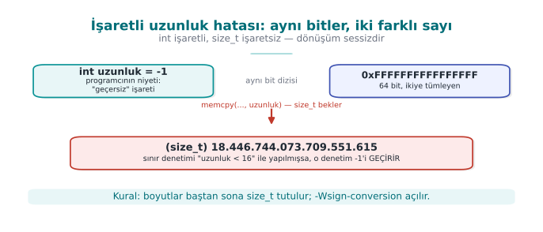

### Demo 4 — İşaretli uzunluk hatası

!!! info "Demo 4 · `code/week-01/04-isaretli-uzunluk` · CWE-195 (işaretliden işaretsize dönüşüm hatası)"

```c title="kopya.c (hatalı)"
#define KAYIT_BOYUTU 16

static int kaydi_kopyala(char *hedef, const char *kaynak, int uzunluk)
{
    /* HATA: alt sınır (negatif değer) denetlenmiyor */
    if (uzunluk > KAYIT_BOYUTU)
        return -1;
    memcpy(hedef, kaynak, uzunluk);   /* int -> size_t: -1 -> 2^64 - 1 */
    return 0;
}
```

=== "Windows (PowerShell)"

    ```powershell
    cd code\week-01\04-isaretli-uzunluk
    .\demo.ps1
    ```

=== "WSL / Linux"

    ```bash
    cd code/week-01/04-isaretli-uzunluk
    sh demo.sh
    ```

```text title="sh demo.sh — çıktı"
ADIM 0 — Derleyici bu hatayi goruyor mu?
$ gcc -Wall -Wextra -fsyntax-only -I../../common kopya.c
   -> Uyari yok: -Wall -Wextra bu donusumu bildirmez.
$ gcc -Wsign-conversion -fsyntax-only -I../../common kopya.c
kopya.c:21:27: warning: conversion to 'size_t' from 'int'
               may change the sign of the result [-Wsign-conversion]

ADIM 1 — Normal kullanim
$ ./bin/linux/kopya 8
Kopyalandi: ORNEK-KA

ADIM 2 — Cok buyuk uzunluk: denetim yakalar
$ ./bin/linux/kopya 100
Reddedildi: uzunluk cok buyuk.

ADIM 3 — Saldiri: negatif uzunluk denetimi atlatir
$ ./bin/linux/kopya -1
Segmentation fault
   (cikis kodu: 139 — 139 = bellek hatasi, SIGSEGV)

ADIM 4 — Ayni saldiri, AddressSanitizer ile
==1823==ERROR: AddressSanitizer: negative-size-param: (size=-1)

ADIM 5 — Duzeltilmis surum
$ ./bin/linux/kopya_guvenli -1 ; ./bin/linux/kopya_guvenli 12abc ; ./bin/linux/kopya_guvenli 8
Reddedildi: uzunluk 0-16 arasinda bir tamsayi olmali.
Reddedildi: uzunluk 0-16 arasinda bir tamsayi olmali.
Kopyalandi (8 bayt): ORNEK-KA
```

Windows'ta iki fark görürsünüz. 3. adımda program `0xC0000409` koduyla biter: Windows yığının bozulduğunu fark edip
süreci anında sonlandırır. 0. adımda ise MSVC'nin C derleyicisi `/Wall` ile bile **hiç uyarmaz**; aynı kod C++
olarak derlenince uyarı çıkar:

```text title=".\demo.ps1 — 0. adım"
> cl /Zs /W4 kopya.c                 (C olarak derle)
   -> Uyari yok: MSVC'nin C derleyicisi bu donusumu /Wall ile bile bildirmez.
> cl /Zs /W4 /w44365 /TP kopya.c     (ayni kod, C++ olarak)
kopya.c(21): warning C4365: 'argument': conversion from 'int' to 'size_t', signed/unsigned mismatch
```

Denetim `uzunluk > 16` sorusunu soruyor; `-1` bu soruya "hayır" dediği için geçiyor. Ağdan gelen bir paketteki
uzunluk alanı, bir dosya başlığındaki kayıt boyutu — saldırganın kontrol ettiği her sayı bu hataya yol açabilir.
Derleyici bizi **uyarabilirdi**, ama yalnız istersek: GCC'de `-Wsign-conversion` varsayılan uyarılarda yoktur,
MSVC'nin C derleyicisinde hiç yoktur. Hangi uyarıların açık olduğunu bilmek ve onları okumak, bedava bir güvenlik
aracıdır; araçların sessizliği ise kodun doğru olduğunu göstermez.

```c title="kopya_guvenli.c (özü)"
static int uzunluk_oku(const char *metin, size_t *sonuc)
{
    char *son;
    errno = 0;
    long deger = strtol(metin, &son, 10);
    if (errno != 0 || son == metin || *son != '\0')
        return -1;                       /* sayı değil ya da taştı */
    if (deger < 0 || deger > KAYIT_BOYUTU)
        return -1;                       /* hem alt hem üst sınır */
    *sonuc = (size_t)deger;
    return 0;
}
```

!!! success "Kural"
    Boyut ve uzunlukları baştan **`size_t`** ile tutun. Dışarıdan gelen bir sayıyı **hem alt hem üst sınırla**
    denetleyin. `atoi` yerine hatayı bildiren `strtol` kullanın. Derlerken `-Wall -Wextra -Wconversion
    -Wsign-conversion` açık olsun.

Bu tamsayı hatasının daha geniş ailesini — taşma, işaret dönüşümü, sınır değerleri — [4. haftada tanımsız davranış
bölümünde](../week-4/cen429-week-4.md#7-tamsayilar-ve-tanimsiz-davranis-tarif-35) derinlemesine işleyeceğiz.

---

## 17. Bellek yönetimi ve güvenlik

Arabellek taşması "ne kadar yazdığımızı" unuttuğumuzda ortaya çıkar. Bu bölümdeki hatalar ise "belleğin **kime ait
olduğunu** ve **ne zamana kadar** geçerli olduğunu" unuttuğumuzda ortaya çıkar. C ve C++'ta öbekten (heap) ayrılan
bellek, programcı serbest bırakana kadar yaşar; dil bu süreyi sizin yerinize takip etmez.

### Belleğin dört ömrü

| Ömür | Nasıl oluşur? | Ne zaman biter? | Tipik hata |
| --- | --- | --- | --- |
| **Statik** | Genel değişken, `static` yerel değişken | Program bitince | Birden fazla iş parçacığının aynı anda yazması |
| **Otomatik** | Fonksiyon içindeki yerel değişken | Fonksiyon dönünce | Yerel değişkenin adresini döndürmek |
| **Dinamik** | `malloc`/`calloc`/`new` | `free`/`delete` çağrılınca | Sızıntı, çift serbest bırakma, serbest bırakıldıktan sonra kullanma |
| **İş parçacığı** | `_Thread_local` / `thread_local` | İş parçacığı bitince | — |

Dinamik belleğin yaşam döngüsü dört adımdır: **ayır → doğrula → kullan → serbest bırak**. Her adımda ayrı bir hata
sınıfı yaşar.

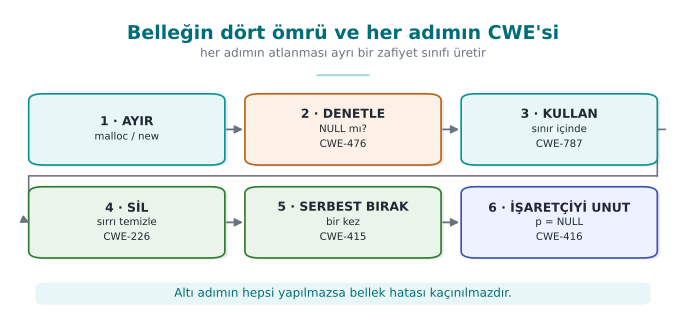

### Hata sınıfları

| Hata | Ne olur? | Güvenlik sonucu | CWE |
| --- | --- | --- | --- |
| **Bellek sızıntısı** | Ayrılan bellek hiç serbest bırakılmaz | Uzun çalışan sunucuda bellek tükenir → hizmet engelleme; sırlar bellekte gereğinden uzun kalır | 401 |
| **Çift serbest bırakma** | Aynı blok iki kez `free` edilir | Bellek yöneticisinin iç listeleri bozulur; sonraki iki `malloc` aynı bloğu iki farklı nesneye verebilir | 415 |
| **Serbest bırakıldıktan sonra kullanma (UAF)** | `free` edilmiş bloğa eski işaretçiyle erişilir | Blok başka bir nesneye verilmişse, eski işaretçi **başka bir nesnenin** verisini okur ya da değiştirir | 416 |
| **İlklendirilmemiş okuma** | Değer atanmadan okunur | Önceki kullanıcının verisi (ör. parola) sızar; rastgele davranış | 457, 908 |
| **NULL denetimi yok** | `malloc` başarısız olur, sonuç denetlenmez | Çökme; bazı sistemlerde düşük adreslere yazma | 476 |
| **Yanlış eşleşme** | `new[]` ile ayrılan `delete` ile, `malloc` ile ayrılan `delete` ile bırakılır | Tanımsız davranış; bellek yöneticisi bozulur | 762 |
| **Boyut hesabı taşması** | `n * sizeof(T)` taşar | Küçük blok ayrılır, büyük yazılır → öbek taşması | 190, 131 |
| **Sırrın silinmemesi** | Serbest bırakılan blok sıfırlanmaz | Blok bir sonraki `malloc`'la başka koda verilir, içindeki sır okunabilir | 226, 244 |

### Serbest bıraktıktan sonra kullanma: neden bu kadar tehlikeli?

```c title="Hatalı: iki işaretçi aynı bloğu gösteriyor"
typedef struct { char ad[32]; int yetki; } Kullanici;

Kullanici *aktif = malloc(sizeof *aktif);
Kullanici *onbellek = aktif;          /* ikinci bir sahip daha */
/* ... */
free(aktif);                          /* oturum kapandı */
aktif = NULL;                         /* aktif güvende, ama onbellek hâlâ eski adresi tutuyor */

char *not = malloc(sizeof(Kullanici));  /* bellek yöneticisi aynı bloğu yeniden verebilir */
strcpy(not, "....");                    /* not yazılıyor */

if (onbellek->yetki) { /* ... */ }      /* UAF: artık 'not'un baytlarını okuyor */
```

`free` belleği işletim sistemine geri vermez; bellek yöneticisinin "boş" listesine koyar. Bir sonraki aynı boyutlu
`malloc` büyük olasılıkla **aynı bloğu** geri verir. Eski işaretçi (`onbellek`) artık tamamen farklı bir nesneye
bakıyordur. Programın mantığı, başka bir amaçla yazılmış baytları "kullanıcının yetkisi" diye okur. Bu yüzden UAF
hataları tarayıcı ve işletim sistemi açıklarının en büyük sınıflarından biridir.

Örnekteki `aktif = NULL;` satırı **iyi bir alışkanlıktır**, ama yalnız **o** işaretçiyi korur. Asıl sorun aynı
bloğa birden fazla işaretçinin sahip çıkmasıdır. Çözüm bir **sahiplik kuralıdır**:

!!! success "Sahiplik kuralı"
    Her dinamik blokun **tek bir sahibi** vardır ve bloğu yalnız o serbest bırakır. Diğer kodlar bloğu ödünç
    alır ve sahibinden uzun yaşayacak hiçbir yerde saklamaz. Sahiplik bir fonksiyondan diğerine geçiyorsa, bu
    fonksiyonun adında ve belgesinde açıkça yazılır (ör. `..._al()` sahipliği devralır, `..._goster()` yalnız
    ödünç alır).

UAF'i C/C++'ta adım adım sömürüp AddressSanitizer ile yakalamayı [4. haftada
göreceğiz](../week-4/cen429-week-4.md#6-serbest-birakilmis-bellegin-kullanimi-ve-cift-serbest-birakma).

### Diğer hataların düzeltilmiş halleri

```c title="NULL denetimi ve taşmasız boyut hesabı"
/* Hatalı: n büyükse n * sizeof(Kayit) taşar, küçük bir blok ayrılır */
Kayit *k = malloc(n * sizeof(Kayit));

/* Doğru 1: calloc boyut çarpımında taşmayı denetler ve belleği sıfırlar */
Kayit *k = calloc(n, sizeof(Kayit));
if (k == NULL) return HATA_BELLEK;

/* Doğru 2: yeniden boyutlandırmada reallocarray (glibc 2.26+, BSD) */
Kayit *yeni = reallocarray(k, n2, sizeof(Kayit));
if (yeni == NULL) { free(k); return HATA_BELLEK; }   /* k'yi kaybetme */
k = yeni;
```

```c title="realloc tuzağı"
/* Hatalı: realloc başarısız olursa NULL döner ve eski blok hâlâ ayrılmış durumdadır;
   onu gösteren tek işaretçinin üzerine yazdık → sızıntı */
tampon = realloc(tampon, yeni_boyut);
```

`realloc`'un ikinci bir gizli sorunu daha vardır: blok **taşınırsa** eski blok serbest bırakılır ama
**sıfırlanmaz**. İçinde sır varsa, eski kopya belleğin bir köşesinde kalır. Sır tutan tamponlar için `realloc`
kullanmayın; yeni bir blok ayırıp kopyalayın ve eskisini **silip** öyle serbest bırakın.

### Sırları bellekten silmek (Tarif 13.2)

"Bellekte kalan sırlar" bölümündeki Demo 2, derleyicinin `memset(parola, 0, ...)` satırını "sonra hiç okunmayan bir yere yazma" (dead
store) olarak görüp **tamamen kaldırabildiğini** gösterdi. Bunu önlemek için derleyicinin kaldırmayacağı
fonksiyonlar kullanılır:

| Platform | Fonksiyon | Not |
| --- | --- | --- |
| Linux (glibc 2.25+), BSD | `explicit_bzero(p, n)` | En yaygın seçenek |
| Windows | `SecureZeroMemory(p, n)` | `windows.h` içinde |
| C11 Ek K | `memset_s(p, smax, 0, n)` | Her derleyicide yok |
| C23 | `memset_explicit(p, 0, n)` | Yeni standart |
| Hiçbiri yoksa | `volatile` işaretçiyle bayt bayt yazma | Taşınabilir yedek yol |

```c title="cen429_sil — taşınabilir güvenli silme"
#include <string.h>
#ifdef _WIN32
#  include <windows.h>
#endif

static void cen429_sil(void *p, size_t n)
{
#if defined(_WIN32)
    SecureZeroMemory(p, n);
#elif defined(__GLIBC__) || defined(__OpenBSD__) || defined(__FreeBSD__)
    explicit_bzero(p, n);
#else
    volatile unsigned char *v = (volatile unsigned char *)p;
    while (n--) *v++ = 0;
#endif
}
```

Silme işleminin **nerede** yapılacağı da önemlidir. Sırrın kopyası sandığınızdan fazla yerde olabilir:

- Fonksiyona **değerle** geçirilen yapılar (her çağrıda bir kopya yığında kalır).
- `realloc` ile taşınan eski blok.
- `std::string`'in kısa dizge iyileştirmesi (SSO) ve kopyaları; `std::string` yok edilirken içeriğini **silmez**.
- G/Ç tamponları (`fgets`'in okuduğu `stdin` tamponu).
- İşletim sisteminin **takas dosyası** ve **hazırda bekletme** dosyası (aşağıda).

!!! note "Sahada nasıl uygulanır?"
    Hassas kütüphanelerde oturum verisi, işlem biter bitmez **rastgele değerlerle doldurularak** silinir; native
    tarafta rastgele sayı üretecinin tek kullanım yeri bu doldurmadır. Sıfır yerine rastgele değer, bellekte "burada
    az önce bir sır vardı" izini (uzun bir sıfır dizisi) de ortadan kaldırır. Varlık tablosundaki "oluşma → silinme"
    sütunu, her varlığın tam olarak **hangi satırda** silindiğini gösterecek kadar ayrıntılı yazılır.

### Belleğin diske düşmesini önlemek (Tarif 13.3)

İşletim sistemi, bellek darlığında az kullanılan sayfaları **takas alanına** (Linux swap, Windows `pagefile.sys`)
yazar. Bilgisayar hazırda bekletmeye geçtiğinde ise belleğin tamamı diske yazılır. Sırrınızı bellekte ne kadar iyi
silerseniz silin, o arada diske yazılmış bir kopya kalabilir. Önlem, sır tutan sayfaları **kilitlemektir**:

=== "Linux"

    ```c
    #include <sys/mman.h>

    unsigned char anahtar[32];
    if (mlock(anahtar, sizeof anahtar) != 0) {
        /* RLIMIT_MEMLOCK aşılmış olabilir; hatayı raporla ama sırrı yine de sil */
    }
    /* ... anahtarı kullan ... */
    cen429_sil(anahtar, sizeof anahtar);
    munlock(anahtar, sizeof anahtar);
    ```

    `madvise(p, n, MADV_DONTDUMP)` ile bu sayfaların çekirdek dökümüne girmemesi de sağlanabilir.

=== "Windows"

    ```c
    #include <windows.h>

    unsigned char anahtar[32];
    if (!VirtualLock(anahtar, sizeof anahtar)) {
        /* çalışma kümesi sınırı aşılmış olabilir */
    }
    /* ... anahtarı kullan ... */
    SecureZeroMemory(anahtar, sizeof anahtar);
    VirtualUnlock(anahtar, sizeof anahtar);
    ```

Kilitleme **sayfa** düzeyinde çalışır (genellikle 4 KB). Küçük bir diziyi kilitlediğinizde, onu içeren sayfanın
tamamı kilitlenir. Kilitlenebilecek bellek miktarı sınırlıdır; bu yüzden bütün programı değil, yalnız anahtarları
tutan küçük ve ayrı bir bölgeyi kilitleyin.

### Hepsi bir arada: güvenli tampon

Yukarıdaki kuralları tek bir küçük modülde toplamak, her yerde doğru yapmayı kolaylaştırır:

```c title="gizli_tampon.h — sırlar için tek giriş noktası"
typedef struct {
    unsigned char *veri;
    size_t         boyut;
} GizliTampon;

/* Ayırır, sıfırlar, belleği kilitler. Başarısızsa -1. */
int  gizli_ayir(GizliTampon *t, size_t boyut);

/* Güvenli siler, kilidi açar, serbest bırakır; t->veri = NULL yapar. İki kez çağrılabilir. */
void gizli_birak(GizliTampon *t);
```

```c title="gizli_tampon.c — Linux gerçekleştirimi (Windows: VirtualLock/SecureZeroMemory)"
#include <stdlib.h>
#include <sys/mman.h>
#include "gizli_tampon.h"

int gizli_ayir(GizliTampon *t, size_t boyut)
{
    t->veri = calloc(1, boyut);
    if (!t->veri) return -1;
    t->boyut = boyut;
    (void)mlock(t->veri, boyut);                 /* başarısızlık ölümcül değil */
    return 0;
}

void gizli_birak(GizliTampon *t)
{
    if (!t->veri) return;                        /* çift bırakmaya karşı */
    cen429_sil(t->veri, t->boyut);
    munlock(t->veri, t->boyut);
    free(t->veri);
    t->veri  = NULL;
    t->boyut = 0;
}
```

C++'ta aynı fikir bir sınıfın **yıkıcısına** (destructor) konur; böylece nesne kapsam dışına çıktığında, bir istisna
fırlasa bile silme **otomatik** olarak yapılır. Buna **RAII** (kaynak edinimi ilklendirmedir) denir:

```cpp title="C++ — RAII ile otomatik silme"
class GizliAnahtar {
public:
    explicit GizliAnahtar(std::size_t n) : v_(n) { kilitle(v_.data(), n); }
    ~GizliAnahtar() { cen429_sil(v_.data(), v_.size()); kilidi_ac(v_.data(), v_.size()); }
    GizliAnahtar(const GizliAnahtar&) = delete;              /* kopya yok: sır çoğalmasın */
    GizliAnahtar& operator=(const GizliAnahtar&) = delete;
    unsigned char* veri() { return v_.data(); }
private:
    std::vector<unsigned char> v_;
};
```

Kopya yapıcısının **silinmesi** bilinçli bir karardır: sır tutan bir nesnenin kopyalanması, belleğin başka bir
yerinde silinmesi unutulabilecek ikinci bir kopya demektir.

!!! tip "C++'ta genel kural: çıplak new/delete yok"
    Sahiplik için `std::unique_ptr` (tek sahip), paylaşım gerçekten gerekiyorsa `std::shared_ptr` kullanın;
    diziler için `std::vector` ya da `std::array`. Bu türler serbest bırakmayı yıkıcıda yapar; çift serbest
    bırakma, sızıntı ve yanlış eşleşme hatalarının çoğu kendiliğinden ortadan kalkar. Bununla birlikte
    `unique_ptr` bile belleği **silmeden** serbest bırakır; sırlar için yukarıdaki gibi özel bir tür gerekir.

### Bellek hatalarını bulan araçlar

| Araç | Platform | Neyi bulur? | Nasıl? |
| --- | --- | --- | --- |
| AddressSanitizer | GCC, Clang, MSVC | Taşma, UAF, çift serbest bırakma | `-fsanitize=address` / `/fsanitize=address` |
| LeakSanitizer | GCC, Clang (Linux) | Sızıntı | ASan ile birlikte gelir; program sonunda rapor |
| MemorySanitizer | Clang (Linux) | İlklendirilmemiş okuma | `-fsanitize=memory` |
| Valgrind Memcheck | Linux | Hepsi (yavaş ama derleme gerektirmez) | `valgrind --leak-check=full ./prog` |
| CRT hata ayıklama öbeği | MSVC | Sızıntı, taşma (blok sınırında) | `_CrtSetDbgFlag` ile `_CRTDBG_LEAK_CHECK_DF` bayrağı |

!!! tip "Değerlendirici nasıl test eder?"
    Hassas bir işlem (giriş, şifre çözme, ödeme) bittikten sonra sürecin belleğinin dökümünü alır ve bilinen
    sırrı (test parolası, test anahtarı) bu dökümde arar. Bulursa bulgu yazılır: "varlık kullanım sonrasında
    bellekte kalıyor." Kaynak kodda her `malloc`'un karşılığında bir `free` ve her sır için bir silme çağrısı
    arar; sır tutan tamponlarda `realloc` ve değerle geçirilen yapılar görmek istemez.

### Kendini dene: bellek

1. `char *p = malloc(10); free(p); free(p);` programı her zaman çöker mi? Neden "çökmese bile tehlikeli"?
2. `std::string parola;` ile tutulan bir parolayı iş bitince nasıl silersiniz? `parola.clear()` yeter mi?
3. Bir sunucu her istekte 100 bayt sızdırıyor. Saniyede 1000 istek alıyorsa, 4 GB bellek ne kadar sürede tükenir?
   Bu hangi STRIDE harfidir?

??? tip "Cevap ipuçları"
    1. Hayır; bellek yöneticisinin sürümüne göre fark etmeyebilir. Fark etmese bile iç listeleri bozulur ve sonraki
       iki `malloc` aynı bloğu iki farklı yere verebilir; bu da UAF'e benzer bir duruma yol açar. Modern glibc
       basit çift bırakmayı çoğu zaman yakalayıp programı durdurur (`free(): double free detected`).
    2. `clear()` yalnız uzunluğu sıfırlar, baytları silmez. `cen429_sil(parola.data(), parola.capacity())`
       ile önce içeriği silin; SSO ve daha önceki kopyalar nedeniyle en güvenlisi sırlar için `std::string`
       yerine özel bir tür (ör. `GizliAnahtar`) kullanmaktır.
    3. 4·10⁹ / (100·1000) = 40.000 saniye ≈ 11 saat. **D** (hizmet engelleme). Saldırgan istek hızını artırarak
       bu süreyi kısaltabilir.

---

## 18. Korunan kod bölümleme ve şifreleme ile güvenli işleme

Bir programın her satırı aynı derecede hassas değildir. Ekrana menü çizen kod ile anahtarla şifre çözen kod aynı
özeni gerektirmez. **Korunan kod bölümleme** (protected code partitioning), programı hassasiyetine göre
**bölgelere** ayırmak ve en hassas bölgeyi küçük, yalıtılmış ve en güçlü korumalarla donatılmış bir çekirdek haline
getirmektir. **Şifreleme ile güvenli işleme** ise hassas verinin (hatta hassas kodun) bu çekirdeğin dışında hiçbir
zaman **açık halde** bulunmamasını sağlamaktır.

### Neden bölmeliyiz? Güvenilir hesaplama tabanı

Güvenlikte **güvenilir hesaplama tabanı** (TCB — trusted computing base), "bu parça hatalıysa güvenlik çöker"
dediğimiz kodun tamamıdır. TCB ne kadar büyükse, içinde hata olma olasılığı o kadar yüksek, incelenmesi o kadar
zordur. Saltzer ve Schroeder'in **mekanizma ekonomisi** ilkesinin (4. bölüm) pratik karşılığı şudur: **TCB'yi
küçült.**

Örnek: 200.000 satırlık bir uygulamada anahtarla çalışan kod 2.000 satırsa ve bu kod ayrı bir modüle
ayrılmışsa, sızma testi ve kod incelemesi bu 2.000 satıra yoğunlaşabilir. Gizleme ve bütünlük denetimi yalnız bu
modüle uygulanır; performans maliyeti de yalnız burada ödenir (bkz. "Korumanın maliyeti").

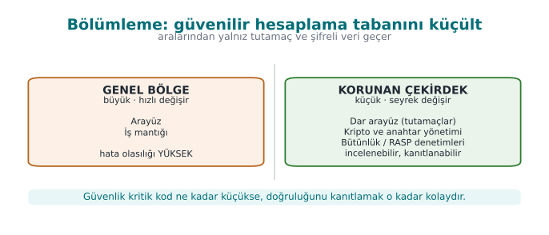

### Bölümleme seçenekleri

Korunan çekirdeği nereye koyacağınız, saldırgan modelinize ve platformunuza bağlıdır:

| Seçenek | Yalıtım gücü | Örnek | Bedeli |
| --- | --- | --- | --- |
| **Aynı süreçte ayrı modül** | Düşük: aynı bellek, aynı yetki | Java uygulamasının içindeki C/C++ (native) kütüphane | Ucuz; yalnız kodun okunmasını zorlaştırır |
| **Ayrı süreç (ayrıcalık ayrımı)** | Orta: ayrı bellek, farklı yetki | Tarayıcının kum havuzu süreçleri; yetkili küçük bir yardımcı süreç (Tarif 1.4) | Süreçler arası iletişim (IPC) tasarımı ve maliyeti |
| **İşletim sistemi hizmeti** | Orta–yüksek | Windows DPAPI, macOS Anahtarlık, Android Keystore | Platforma bağımlılık |
| **Donanım destekli yalıtım** | Yüksek | Güvenli eleman, akıllı kart, TPM, ARM TrustZone tabanlı güvenilir yürütme ortamı (TEE) | Her cihazda yok; geliştirme zor |
| **Sunucuya taşıma** | En yüksek (istemci için) | Sırrı hiç istemciye göndermeyip sunucuda, bir HSM'de tutmak | Ağ bağlantısı gerekir; çevrimdışı çalışmaz |

En güçlü koruma genellikle **sırrı istemciden tamamen kaldırmaktır**. Bu mümkün olmadığında (ör. telefon çevrimdışı
ödeme yapabilmeli), donanım desteği aranır. O da yoksa (ya da her cihazda yoksa), sır **yazılımla** korunmak
zorundadır ve dönem boyunca göreceğimiz gizleme, RASP ve whitebox teknikleri tam olarak bu durum içindir.

!!! example "Mobil ödemede bölümleme"
    Telefonun güvenli elemanını kullanmayan (kartı yazılımla taklit eden) bir ödeme uygulamasında tipik bölümleme
    şöyledir: kullanıcı arayüzü ve iş akışı Java/Kotlin'dedir; kriptografik işlemler ve güvenlik denetimleri ise
    **native** kütüphanededir. Java bayt kodu kolayca kaynak koda geri çevrilebilirken, derlenmiş ve gizlenmiş
    native kodu anlamak çok daha fazla emek ister. Native katman yalnız Java katmanı tarafından ve yalnız dar bir
    arayüzden (JNI) çağrılır; iki katman birbirinin **bütünlüğünü** denetler.

### Bölümler arasındaki arayüz: dar, doğrulanmış, sırsız

Bölümlemenin değeri tamamen **sınırdaki arayüzün** kalitesine bağlıdır. Anahtarı ayrı bir modülde tutup sonra
`anahtar_al()` diye bir fonksiyonla dışarı veriyorsanız, hiçbir şey kazanmadınız demektir. Arayüz için üç kural:

1. **Sırrı dışarı verme, iş yaptır.** Çekirdek anahtarı döndürmez; anahtarla **işlem yapar** ve yalnız sonucu
   döndürür. Dışarıya anahtar yerine bir **tutamaç** (handle, opak kimlik) verilir.
2. **Sınırı geçen her şeyi doğrula.** Çekirdek, dış bölgeden gelen her parametreye güvenilmez girdi gibi davranır
   (boyut, aralık, biçim).
3. **Sınırdan açık veri geçirme.** Sınırı geçmesi gereken hassas veri, şifreli ve bütünlüğü korunmuş halde geçer.
   Aksi halde saldırgan, arayüz fonksiyonuna kanca atarak veriyi **yolda** okur.

```c title="kasa_cekirdek.h — sırrı hiç dışarı vermeyen arayüz"
typedef struct KasaAnahtari KasaAnahtari;          /* opak tür: içi dışarıdan görünmez */

/* Ana paroladan anahtarı türetip çekirdeğin içinde tutar; parolayı siler. */
int  kasa_ac(const char *parola, size_t parola_uzunlugu,
             const unsigned char tuz[16], KasaAnahtari **cikti);

/* Anahtarla şifreler / çözer; anahtarın kendisi hiçbir zaman dışarı çıkmaz. */
int  kasa_sifrele(KasaAnahtari *a, const unsigned char *acik, size_t n,
                  unsigned char *sifreli, size_t kapasite, size_t *yazilan);
int  kasa_coz(KasaAnahtari *a, const unsigned char *sifreli, size_t n,
              unsigned char *acik, size_t kapasite, size_t *yazilan);

/* Anahtarı güvenli siler ve serbest bırakır. */
void kasa_kapat(KasaAnahtari *a);
```

C'de **opak tür** (yalnız bildirilen, tanımı başlık dosyasında olmayan `struct`), çağıran kodun anahtarın
baytlarına doğrudan erişmesini dil düzeyinde engeller. Tabii ki aynı süreçteki bir saldırgan belleği yine de
okuyabilir; opak tür **programlama hatalarını** önler, saldırganı değil. Saldırgana karşı ek katmanlar gerekir.

### Arayüzün kötüye kullanımı: şifre çözme kâhini ve kod kaldırma

Anahtarı iyi saklamak yetmez. Saldırgan anahtarı hiç bulmadan **sizin fonksiyonunuzu kullanabilir**:

- **Şifre çözme kâhini (decryption oracle):** Saldırgan `kasa_coz` fonksiyonunu kendi seçtiği verilerle doğrudan
  çağırır. Anahtar gizli kalır ama saldırgan istediği her şeyi çözdürür.
- **Kod kaldırma (code lifting):** Saldırgan korunan fonksiyonu (hatta içine gömülü anahtarıyla birlikte)
  ikili dosyadan olduğu gibi **kopyalar** ve kendi programında bir "kara kutu" gibi çalıştırır. Anahtarı hiç
  çıkarmasına gerek kalmaz.

Karşı önlemler bu nedenle "anahtarı sakla"nın ötesine geçer:

| Önlem | Fikir | Hafta |
| --- | --- | --- |
| **Cihaza ve örneğe bağlama** | Anahtar, cihaza ve uygulamanın o kurulumuna özgü bilgilerle karıştırılır; başka bir ortamda kopyalanan kod doğru sonucu üretmez | 3, 6 |
| **Sürüme bağlama** | Sürüm bilgisi anahtar türetmeye katılır; eski ya da değiştirilmiş sürümde anahtar çözülmez | 6 |
| **Bağlam denetimi** | Çekirdek, çağıranın bütünlüğünü ve beklenen akışı doğrular; sırasız ya da bağlamsız çağrıyı reddeder | 6 |
| **Oran ve kullanım sınırı** | Çözme işlemi sayısı sınırlanır; tek kullanımlık anahtarlar kullanılır | 3 |
| **Ortak statik anahtar kullanmama** | Tek bir kurulumun kırılması diğerlerini etkilemez | 3, 10 |

!!! warning "Tek bir anahtar, bütün kullanıcılar"
    Bütün kopyalarda **aynı** gömülü anahtarı kullanan bir uygulama, tek bir kopya kırıldığında **bütün
    kullanıcıları** birden kaybeder. Sertifikasyon gereksinimleri bu yüzden açıkça "bir örneğin kırılması diğer
    örnekleri etkilememeli" der. Her kuruluma ya da cihaza özgü anahtarlar bu gereksinimin cevabıdır.

### Şifreleme ile güvenli işleme: açıklık penceresini daraltmak

Hassas bir veri, yaşam döngüsü boyunca üç durumda bulunur: **beklemede** (disk), **aktarımda** (ağ) ve
**kullanımda** (bellek, yazmaçlar). İlk ikisini şifrelemek standarttır; asıl zor olan üçüncüsüdür, çünkü işlem
yapmak için verinin bir noktada açılması gerekir. (Beklemede ve aktarımda veriyi koruma yöntemlerini
[3. haftada](../week-3/cen429-week-3.md#1-verinin-uc-hali-ve-guvenlik-kabugu) ayrıntılı işleyeceğiz.) Hedef, bu
**açıklık penceresini** zaman ve yer olarak mümkün olduğunca daraltmaktır:

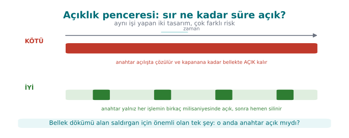

Bunu sağlayan teknikler:

1. **Tam zamanında çözme:** Veri, yalnız kullanılacağı fonksiyonun içinde çözülür ve fonksiyon dönmeden silinir.
2. **Bellekte örtme (masking):** Kullanılmadığı sürede anahtar, çalışma anında üretilen rastgele bir maskeyle
   XOR'lanmış halde tutulur. Bellekte tek bir yerde anahtarın kendisi değil, iki anlamsız parça bulunur.
3. **Parçalama:** Anahtar ya da bir değer, belleğin farklı yerlerinde (hatta farklı fonksiyonların içinde) duran
   parçalara bölünür; yalnız kullanım anında birleştirilir.
4. **Kod şifreleme (dinamik şifreleme):** Yalnız veri değil, en hassas **fonksiyonların kodu** da ikili dosyada
   şifreli durur; çalışma anında belleğe çözülüp çalıştırılır, sonra yeniden şifrelenir. Ayrıntısı 4. ve 9.
   haftalarda.
5. **Anahtarı hiç açmadan işlem:** Whitebox kriptografide anahtar, hesaplama tablolarının içine öyle gömülür ki
   işlem boyunca bellekte hiçbir zaman açık halde bulunmaz ([11. hafta](../week-11/cen429-week-11.md)).

```c title="Bellekte örtme: anahtar iki parça olarak durur"
#include <stdint.h>
#include <stddef.h>

typedef struct {
    uint8_t maske[32];     /* açılışta rastgele üretilir */
    uint8_t ortulu[32];    /* anahtar XOR maske */
} OrtuluAnahtar;

/* Yalnız kullanım anında, çağıranın verdiği geçici tampona birleştirir. */
static void anahtari_ac(const OrtuluAnahtar *o, uint8_t gecici[32])
{
    for (size_t i = 0; i < 32; i++)
        gecici[i] = o->ortulu[i] ^ o->maske[i];
}

void imzala(const OrtuluAnahtar *o, const uint8_t *veri, size_t n, uint8_t etiket[32])
{
    uint8_t k[32];
    anahtari_ac(o, k);
    kripto_hmac_sha256(k, sizeof k, veri, n, etiket);   /* işlem: code/common/cen429_kripto.h */
    cen429_sil(k, sizeof k);                     /* açıklık penceresi burada kapanır */
}
```

!!! warning "Örtme bir engel, kale değil"
    XOR ile örtme, bellek dökümünde anahtarın **doğrudan** aranmasını engeller; iki parçayı bulup birleştiren
    kararlı bir saldırganı durdurmaz. Değeri, diğer katmanlarla (gizleme, hata ayıklayıcı algılama, maskenin sık
    yenilenmesi) birleştiğinde ortaya çıkar. Güvenlikte "tek başına yeter" diye bir önlem yoktur.

!!! note "Sahada nasıl uygulanır?"
    Hassas bir kütüphanede kaynak koda gömülmesi zorunlu olan tek bir statik anahtar (ör. dizeleri gizlemekte
    kullanılan anahtar) tek bir yerde durmaz: yarım bayt (nibble) düzeyinde parçalanıp onlarca farklı fonksiyonun
    içine dağıtılır ve yalnız kullanım anında birleştirilir. Cihaz parmak izi gibi değerler ise **iki farklı
    özetle iki farklı yerde** saklanır ve arka planda karşılaştırılır; biri değiştirilirse tutarsızlık ortaya
    çıkar. Uygulama tarafında kimliği tanımlayan değerler de cihaz kimliğiyle XOR'lanarak saklanır; başka bir
    cihaza kopyalanan veri anlamsızlaşır.

### Bölümlemenin sınırları

- Aynı süreç içindeki bir modül, aynı süreçte çalışan bir saldırgana (ör. programa kanca atan bir araç) karşı
  gerçek bir yalıtım sağlamaz. Bu durumda asıl koruma RASP ve gizlemedir.
- Süreçler arası ya da istemci–sunucu sınırında, **iletişim kanalının kendisi** yeni bir saldırı yüzeyidir;
  karşılıklı kimlik doğrulama ve bütünlük gerekir
  ([3. hafta](../week-3/cen429-week-3.md#9-aktarimda-veri-tls-13-sertifika-dogrulama-ve-sabitleme)).
- Donanım yalıtımı (TEE, güvenli eleman) güçlüdür ama içinde çalışan kodun da hatasız olması gerekir; TEE
  uygulamalarında da arabellek taşmaları bulunmuştur.

!!! tip "Değerlendirici nasıl test eder?"
    Önce sınırı bulur: hangi fonksiyonlar korunan bölgenin giriş kapısıdır? Sonra bu fonksiyonlara kanca atıp
    sınırı geçen verileri kaydeder ("arayüzden açık veri geçiyor mu?"). Ardından korunan fonksiyonu kendi
    seçtiği girdilerle doğrudan çağırmayı (kâhin), başka bir cihaza ya da ortama kopyalayıp çalıştırmayı (kod
    kaldırma) dener. Son olarak işlem sırasında ve sonrasında bellek dökümü alıp anahtarın açık ya da kolay
    birleştirilebilir halde durup durmadığına bakar.

---

## 19. Güvenli geliştirme süreci: planı yaşatmak

Bir koruma planı, yazıldığı gün değil, ürün **değiştiğinde** sınanır. Yeni bir özellik, bir hata düzeltmesi ya da
bir kütüphane güncellemesi, dikkatle kurulmuş bir önlemi farkında olmadan etkisiz bırakabilir. Bu bölüm, planın
ürünle birlikte yaşamasını sağlayan süreçleri anlatır. Sertifikasyondan geçen ürünlerde bu süreçler, en az kodun
kendisi kadar incelenir.

### Güvenli yazılım geliştirme yaşam döngüsü

Microsoft'un Güvenli Geliştirme Yaşam Döngüsü (SDL) ve NIST'in Güvenli Yazılım Geliştirme Çerçevesi (SSDF,
SP 800-218), güvenliğin yazılımın **her** aşamasına dağıtılması gerektiğini söyler:

| Aşama | Güvenlik etkinliği | Bu dersteki karşılığı |
| --- | --- | --- |
| Gereksinim | Güvenlik gereksinimlerini yaz (standartlardan türet) | [13. hafta](../week-13/cen429-week-13.md) |
| Tasarım | Tehdit modeli, koruma planı, saldırı yüzeyi analizi | 1–2. hafta |
| Gerçekleştirme | Kodlama kuralları, yasaklı fonksiyonlar, statik analiz, kod incelemesi | 4–5. hafta |
| Doğrulama | Sanitizer, fuzzing, sızma testi, güvenlik testleri | 4, [12. hafta](../week-12/cen429-week-12.md) |
| Yayın | İmzalı derleme, benzersiz sürüm kimliği, olay müdahale planı | Bu bölüm, [10. hafta](../week-10/cen429-week-10.md) |
| Yanıt | Zafiyet bildirimi alma, acil güncelleme süreci | 12. hafta |

### Benzersiz sürüm kimliği: "incelenen ile dağıtılan aynı mı?"

Bir değerlendirici bir ürünü incelediğinde, raporu **tam olarak o ikili dosya** için geçerlidir. Aynı sürüm
numarasıyla dağıtılan ama tek bir satırı farklı olan bir dosya, incelenmemiş bir üründür. Bu yüzden her derleme
**benzersiz ve doğrulanabilir** bir kimlik taşımalıdır:

1. **Anlamsal sürüm** (ör. `1.4.2`): insanlar için.
2. **Kaynak kod kimliği**: derlemenin yapıldığı git işlemesinin (commit) özeti.
3. **İkili dosyanın özeti**: dağıtılan dosyanın SHA-256 değeri; kullanıcı ya da değerlendirici indirdiği dosyanın
   bu değerle eşleştiğini kendisi doğrulayabilir.

```cmake title="CMakeLists.txt — derlemeye git kimliğini göm"
execute_process(COMMAND git rev-parse --short=12 HEAD
                WORKING_DIRECTORY ${CMAKE_SOURCE_DIR}
                OUTPUT_VARIABLE GIT_KIMLIK OUTPUT_STRIP_TRAILING_WHITESPACE)
target_compile_definitions(kasa PRIVATE SURUM="1.4.2" GIT_KIMLIK="${GIT_KIMLIK}")
```

```c title="main.c — sürüm kimliğini yazdır"
if (argc > 1 && strcmp(argv[1], "--surum") == 0) {
    printf("kasa %s (%s)\n", SURUM, GIT_KIMLIK);
    return 0;
}
```

=== "Windows (PowerShell)"

    ```powershell
    Get-FileHash .\kasa.exe -Algorithm SHA256
    ```

=== "WSL / Linux"

    ```bash
    sha256sum ./kasa
    ```

!!! note "Sahada nasıl uygulanır?"
    Sürüm bilgisi yalnız ekrana yazılan bir dize olarak kalmaz; **anahtar türetmeye** de katılır. Böylece
    kullanıcı eski ve zafiyetli bir sürüme geri dönerse (sürüm geri alma saldırısı), o sürüm yeni sürümün
    anahtarlarını çözemez. Sürüm kimliği bu şekilde bir güvenlik önlemine dönüşür.

Aynı disiplin dönemin sonunda yeniden karşımıza çıkar: [14. haftada](../week-14/cen429-week-14.md#9-gizlemeyi-derleme-ve-dagitim-hattina-yerlestirmek-s15) kod
gizleme derleme hattına girdiğinde, hangi sürümün hangi dönüşüm ve tohumla üretildiği yine bu kimlik ve özet
değerleriyle izlenir.

### Değişiklik yönetimi: yedi adım

Olgun bir geliştirme ekibinde hiçbir değişiklik "doğrudan ana dala" gitmez. BT hizmet yönetiminden uyarlanan tipik
süreç yedi adımdır:

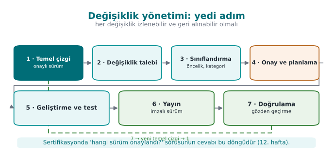

Güvenlik açısından en önemli adım **3 ve 4** arasında yapılan **güvenlik etki analizidir**: "Bu değişiklik hangi
varlığa, hangi arayüze, hangi tehdide ve hangi önleme dokunuyor?" Cevap "hiçbirine" ise değişiklik hızlı
ilerleyebilir; bir önleme dokunuyorsa, o önlemin testleri yeniden çalıştırılır ve gerekirse değerlendiriciye
bildirilir. Sertifikalı ürünlerde bu analize dayanarak yalnız değişen kısmın yeniden incelendiği değerlendirmeye
**delta değerlendirme** denir (13. hafta).

Kaynak kod deposunda da aynı disiplin uygulanır:

- Ana dallar **korumalıdır**; yalnız yetkili kişiler birleştirme yapabilir.
- Her değişiklik en az **bir başka geliştirici** tarafından incelenir.
- Sürümler **etiketlenir** (tercihen imzalı etiket).
- Depoya dışarıdan erişim çok faktörlü kimlik doğrulamayla yapılır.
- Derleme ortamı da korunur: [2. haftada](../week-2/cen429-week-2.md) gördüğümüz tedarik zinciri saldırıları, derleme sunucusuna giren kodu
  hedef alır.

### Ödünleşim kaydı: bilinçli kararların belgesi

Güvenlik neredeyse her zaman bir şeyle ödünleşimdir: performans, kullanılabilirlik, bakım kolaylığı. Olgun bir
ekip bu kararları **yazılı** tutar. Kayıt tutulmayan bir ödünleşim, altı ay sonra "burası neden böyle?" sorusuna
cevap veremez ve bir değerlendiricinin gözünde bir **hata** gibi görünür.

| Karar | Seçenekler | Seçilen | Gerekçe | Güvenlik etkisi / kalan risk |
| --- | --- | --- | --- | --- |
| Sürüm derlemesinde günlükleme | Açık / seviyeli / tamamen kaldırılmış | Tamamen kaldırılmış (derleme makrosuyla) | Susturulmuş günlük kodu ikili dosyada dizge olarak kalır ve yeniden açılabilir | Sahada hata ayıklama zorlaşır; yalnız şifreli bir tanı çıktısı bırakıldı |
| Hata kodları | Ayrıntılı kod / yalnız başarılı-başarısız | Yalnız başarılı-başarısız (opak değer) | Ayrıntılı kod saldırgana hangi denetimde takıldığını söyler | Destek ekibi için ayrı, sunucu tarafında bir tanı kanalı gerekir |
| Native kütüphanenin "hata ayıklanabilir" bayrağı | Kapalı / açık | Açık (gerekçeli istisna) | Kod bütünlüğü denetimi kendi belleğini okuyabilmeli | Hata ayıklayıcı algılama ile telafi edildi |
| Parola türetme süresi | 50 ms / 250 ms / 1 s | 250 ms | Kullanıcı beklemesi ile kaba kuvvet maliyeti dengesi | Çok zayıf parolalar hâlâ risk (kalan risk listesinde) |

Tablodaki üçüncü satır özellikle öğreticidir: bir güvenlik önlemi (bütünlük denetimi), başka bir güvenlik
ayarını (hata ayıklanamazlık) gevşetmeyi gerektirmiştir. Böyle bir karar, gerekçesi ve telafi edici önlemiyle
yazıldığında savunulabilir; yazılmadığında bir bulgudur.

### Korumaların derleme hattına etkisi

Bütünlük denetimi gibi önlemler, derleme sürecini de değiştirir. Programın kendi kodunun özetini denetleyebilmesi
için doğru özet değerinin programa gömülmesi gerekir; ama özeti gömmek programı değiştirir, bu da özeti değiştirir.
Bu döngü, **birkaç turlu** bir derlemeyle çözülür: önce derlenir, özet ölçülür, gizlenerek koda gömülür, yeniden
derlenir; ölçülen bölge gömülen değeri içermeyecek şekilde tasarlanır. Sahada imza sertifikasının özeti, paket
özeti ve kod özeti gibi değerlerin art arda gömüldüğü **beş turlu** imzalı derlemeler kullanılır. Bu tür adımlar
elle yapılırsa hata yapılır; bu yüzden derleme betiğine dönüştürülür ve belgelenir. [6. haftada](../week-6/cen429-week-6.md) bu döngüyü küçük
bir örnekle kuracağız.

### Korumaların maliyetini ölçmek

Koruma planının son parçası **ölçümdür**. "Gizleme ekledik" demek yetmez; ürünün hâlâ kabul edilebilir hızda
çalıştığını göstermek gerekir. Basit bir yöntem: kritik işlemi (ör. bir ödeme, bir kasa açılışı) korumalı ve
korumasız sürümde 20'şer kez çalıştırıp en kısa, en uzun ve ortalama süreyi raporlamak. Temassız bir ödemede toplam
sürenin yarım saniyenin altında kalması gibi somut bir hedef, hangi korumanın nereye konabileceğini belirler.

---

## 20. Bu haftanın araç kutusu


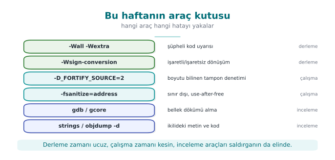

| Araç / bayrak | Ne işe yarar? | Bu hafta nerede gördük? |
| --- | --- | --- |
| `-Wall -Wextra -Wsign-conversion` | Şüpheli kod için derleme uyarıları | Demo 4 |
| `-D_FORTIFY_SOURCE=2` (+ `-O2`) | Boyutu bilinen tamponlara yazan kütüphane çağrılarını çalışma anında denetler | Demo 3 |
| `-fsanitize=address` (ASan) | Sınır dışı erişim, serbest bırakılmış belleğin kullanımı gibi hataları çalışma anında yakalar | Demo 3, 4 |
| `gdb`, `gcore` | Hata ayıklayıcı; çalışan sürecin belleğini dosyaya döker | Demo 2 |
| `strings`, `objdump -d` | İkili dosyadaki metinleri ve makine kodunu gösterir | Demo 2 |
| `explicit_bzero` / `SecureZeroMemory` | Derleyicinin kaldıramayacağı bellek silme | Demo 2 |
| `posix_spawn` + mutlak yol + temiz ortam | Başka bir programı güvenle çalıştırma | Demo 1 |
| `clearenv`, `close_range`, `umask(077)`, `setrlimit(RLIMIT_CORE)`, `prctl(PR_SET_DUMPABLE)` | Programın ilk satırlarında devralınan durumu temizleme | Güvenli başlatma |
| `setresuid`/`setresgid` + `getresuid` · `CreateRestrictedToken` | Yetkiyi kalıcı bırakma ve doğrulama | Güvenli başlatma |
| `SetDefaultDllDirectories` | Windows'ta DLL arama sırasını daraltma | Güvenli başlatma |
| `snprintf`, `strnlen`, `strlcpy`, `fgets` | Sınırlı dizge işlemleri | Arabellek taşmaları |
| `calloc`, `reallocarray` | Çarpım taşmasını denetleyen bellek ayırma | Bellek yönetimi |
| `mlock` / `VirtualLock`, `madvise(MADV_DONTDUMP)` | Sırların takasa ve döküme düşmesini önleme | Bellek yönetimi |
| `valgrind --leak-check=full`, LeakSanitizer | Sızıntı ve UAF bulma | Bellek yönetimi |
| `git rev-parse`, `sha256sum` / `Get-FileHash` | Benzersiz sürüm kimliği | Güvenli geliştirme süreci |

---

## 21. Dönem projesi: bu hafta

Dönem projesinde bir C/C++ uygulamasını **"bir güvenlik sertifikasyonundan geçecekmiş gibi"** geliştirip bir
**güvenlik kılavuzu** yazacaksınız (20–30 sayfa). Bu hafta yapılacaklar:

- [ ] Takımınızı kurun (bireysel ya da en fazla 4 kişi) ve konunuzu seçin (konu listesi proje rehberinde).
- [ ] GitHub'da proje deposunu ve **proje planını** (iş paketleri, takvim, görev dağılımı) oluşturun; planı onaylatın.
- [ ] Güvenlik kılavuzunun ilk bölümlerinin taslağını yazın:
    - **S0** Kapak ve sürüm geçmişi
    - **S2** Ürün genel bakışı — uygulamanız ne yapıyor?
    - **S3** Mimari ve **arayüz tablosu** (6. bölümdeki tablo biçimiyle)
    - **S4** Saldırgan modeli, **STRIDE tablosu** ve bir **saldırı ağacı**
    - **S5** Varlık listesi (taslak): her varlık için konum, oluşma → silinme ve C/I/I+ sınıfı
- [ ] "Uygulamalı örnek" bölümündeki yedi adımlı şablonun **0–4. adımlarını** kendi projeniz için doldurun.

```markdown title="S3 arayüz tablosu şablonu"
| ID | Uç A | Uç B | Kimlik doğrulama | Gizlilik / bütünlük | Açıklama |
| -- | ---- | ---- | ---------------- | ------------------- | -------- |
| A  | Konsol uyg. | Güvenlik DLL'i | ... | ... | ... |
```

---

## 22. Kendi başına çalış

Bu alıştırmalar not verilmez; dersi pekiştirmeniz içindir. Hepsi `code/week-01` klasöründeki demoların üzerinde,
yalnız kendi bilgisayarınızda yapılır.

??? question "Alıştırma 1 — Kolay: PATH tuzağının başka bir hali"
    Linux'ta `rapor.c`'deki `date` komutunu `ls -l rapor.c` yapın; Windows'ta `hostname` komutunu `whoami` yapın.
    Sahte bir `ls` (ya da `whoami.bat`) hazırlayıp `PATH` ile çalıştırın. Sonra `rapor_guvenli.c`'yi gerçek
    programı tam yoluyla çalıştıracak biçimde değiştirin.

    ??? tip "İpucu"
        Sahte dosyayı `sahte/` klasörüne koyun; Linux'ta `chmod +x sahte/ls` ile çalıştırılabilir yapın. Güvenli
        sürümde Linux'ta argüman dizisi `{ "ls", "-l", "rapor.c", NULL }` ve yol `/bin/ls` olur; Windows'ta yol
        `GetSystemDirectoryW` + `\whoami.exe` olur. Komut satırından yeniden derleyin (`.\build.ps1` ya da
        `./build.sh`) ve demoyu yeniden çalıştırın.

??? question "Alıştırma 2 — Kolay: Optimizasyonun etkisi"
    Demo 2'nin `CMakeLists.txt` dosyasında `parola_memset` satırındaki `MOD optimize`'ı `MOD korumasiz` yapın
    (GCC `-O0`, MSVC `/Od`), yeniden derleyip demoyu çalıştırın. `memset` sürümü bu kez parolayı silebiliyor mu? Neden?

    ??? success "Beklenen sonuç"
        `-O0`'da derleyici optimizasyon yapmadığı için `memset` kalır ve parola silinir. Bu, **güvenliğin optimizasyon
        düzeyine bağlı olmaması gerektiğini** gösterir: sürüm (release) derlemeleri her zaman optimizasyonludur, bu
        yüzden `explicit_bzero` kullanılmalıdır.

??? question "Alıştırma 3 — Orta: Taşmanın tam sınırı"
    Demo 3'te `giris` programına (`bin/linux/giris` ya da `bin\windows\giris.exe`) 16, 17, 18, 19 ve 20 karakterlik
    adlar verin. Her birinde `yonetici` alanının
    değerini tabloya yazın ve 13. bölümdeki bellek çizimiyle açıklayın. 16 karakterlik ad neden de tehlikelidir?

    ??? tip "İpucu"
        `strcpy` sonlandırıcı `'\0'` karakterini de kopyalar. 16 karakterlik adın `'\0'`'ı nereye yazılıyor?

??? question "Alıştırma 4 — Orta: Yeni bir yetki alanı"
    `struct oturum`'a `int bakiye;` alanını `ad`'dan sonra ekleyin. Taşmayla bakiyeyi 1000'in üzerine çıkarabilir
    misiniz? Sonra `giris_guvenli.c`'nin bunu nasıl engellediğini gösterin.

??? question "Alıştırma 5 — Orta: Tehdit modeli"
    Kendi dönem projeniz için bir veri akış diyagramı çizin ve her güven sınırını geçen akış için STRIDE'ın altı
    harfini sorun. En az 8 tehdit yazın ve her birine bir karşı önlem önerin.

??? question "Alıştırma 6 — Zor: Gerçek bir zafiyet raporu okuyun"
    Heartbleed (CVE-2014-0160) için yayımlanmış bir teknik açıklamayı okuyun. (a) Hangi uzunluk denetimi eksikti?
    (b) Demo 4 ile ortak noktası nedir? (c) Hangi CWE kategorisine girer? (d) Düzeltme hangi satırları ekledi?

    ??? tip "İpucu"
        Aranacak kavram: "out-of-bounds read" (CWE-125). Düzeltmede, mesajda bildirilen uzunluğun gerçek kayıt
        uzunluğunu aşıp aşmadığı denetlenmiştir.

??? question "Alıştırma 7 — Kolay: Güvenli başlatmayı ölçün"
    WSL/Linux'ta küçük bir C programı yazın; `main()`'in başında açık dosya tanıtıcılarını (`/proc/self/fd`
    klasörünü) ve ortam değişkenlerinin sayısını yazdırsın. Programı önce normal, sonra `env -i ./prog` ile, sonra
    `./prog 1>&-` (standart çıktı kapalı) ile çalıştırın. Ardından "Güvenli başlatma" bölümündeki
    `tanitici_duzenle()` ve `ortami_temizle()` fonksiyonlarını ekleyip farkı gözlemleyin.

    ??? tip "İpucu"
        `opendir("/proc/self/fd")` ile klasördeki girdileri sayın. Standart çıktı kapalıyken `printf` çıktısını
        göremezsiniz; sonucu `stderr`'e ya da bir dosyaya yazın. `tanitici_duzenle()` eklendiğinde 1 numaralı
        tanıtıcının `/dev/null`'a bağlandığını `ls -l /proc/<pid>/fd` ile görebilirsiniz.

??? question "Alıştırma 8 — Kolay: Güvenli silmenin kanıtı"
    Demo 2'de `parola_explicit` sürümünün belleği gerçekten sildiğini gösterdiniz. Aynı programı bir kez daha,
    parolayı `std::string` içinde tutacak şekilde C++ ile yazın. `parola.clear()` ile ve `cen429_sil` ile silip
    bellek dökümünde arayın. Hangi durumda parola bulunuyor? Nedenini "Bellek yönetimi ve güvenlik" bölümüyle
    açıklayın.

??? question "Alıştırma 9 — Orta: Koruma planını kendi projenize uygulayın"
    "Uygulamalı örnek" bölümündeki yedi adımlı şablonu kendi dönem projeniz için doldurun: adım 0–4 eksiksiz, adım
    5–7 için ilk fikirler. Varlık tablonuzda en az 6 varlık, tehdit tablonuzda en az 8 tehdit ve her birinin
    olasılık × etki puanı olsun.

    ??? tip "İpucu"
        Varlık listesine kodun kendisini, yapılandırma dosyalarını ve günlük dosyalarını da katmayı unutmayın.
        Her tehdit için "hangi arayüzde, hangi varlığa" sorusunu cevaplayın; cevaplanamıyorsa tehdit fazla
        genel yazılmış demektir.

??? question "Alıştırma 10 — Orta: Tehlikeli fonksiyon avı"
    `code/week-01` klasöründeki bütün `.c` dosyalarında tehlikeli fonksiyonları arayın. Her bulgu için (a) hangi
    dosyada ve satırda, (b) bilerek mi (demo için) konmuş, (c) güvenli sürümde neyle değiştirilmiş, tablo yapın.

    === "Windows (PowerShell)"

        ```powershell
        Get-ChildItem -Recurse -Filter *.c code\week-01 |
          Select-String -Pattern 'strcpy|strcat|sprintf|gets\(|scanf'
        ```

    === "WSL / Linux"

        ```bash
        grep -rnE 'strcpy|strcat|sprintf|gets\(|scanf' code/week-01 --include=*.c
        ```

??? question "Alıştırma 11 — Orta: Sızıntı ve UAF'i araçla yakalayın"
    Küçük bir programda (a) bir döngüde `malloc` edip hiç `free` etmeyin, (b) bir bloğu `free` ettikten sonra
    okuyun. Programı WSL'de `-fsanitize=address -g` ile, Windows'ta `/fsanitize=address /Zi` ile derleyip
    çalıştırın. Her rapor için "ne oldu, nerede oldu, blok nerede ayrıldı ve nerede serbest bırakıldı" sorularını
    rapordan okuyup yazın.

    ??? tip "İpucu"
        UAF raporunda üç yığın izi vardır: erişimin yapıldığı yer, bloğun serbest bırakıldığı yer ve bloğun
        ayrıldığı yer. Sızıntı raporu Linux'ta LeakSanitizer tarafından program **biterken** verilir; Windows'ta
        ASan sızıntı raporlamaz, bunun için CRT hata ayıklama öbeğini kullanın.

??? question "Alıştırma 12 — Orta: Opak tutamaçlı bir arayüz tasarlayın"
    "Korunan kod bölümleme" bölümündeki `kasa_cekirdek.h` örneğine bakarak kendi projenizin en hassas işlemi için
    bir başlık dosyası yazın. Kural: hiçbir fonksiyon anahtarı ya da açık sırrı dışarı döndürmeyecek; her fonksiyon
    başarı/başarısızlık dönecek; her parametrenin nasıl doğrulanacağı yorum olarak yazılacak.

??? question "Alıştırma 13 — Zor: Bellekte örtülü anahtar"
    "Bellekte örtme" örneğini çalışır hale getirin: açılışta rastgele bir maske üretin (Linux `getrandom`, Windows
    `BCryptGenRandom`), anahtarı örtün, `imzala()` fonksiyonunu `code/common/cen429_kripto.h` içindeki HMAC ile
    gerçekleştirin. Sonra süreç belleğinin dökümünü alıp anahtarı arayın: iş yapılmıyorken bulunmamalı. İşlem
    sırasında (ör. `imzala()` içinde bir `getchar()` ile bekletip) döküm alırsanız ne görürsünüz?

??? question "Alıştırma 14 — Zor: Benzersiz sürüm kimliği"
    Kendi projenizin `CMakeLists.txt` dosyasına git kimliğini gömün ve programa `--surum` seçeneği ekleyin. İki
    ayrı işlemede derleyip çıkan ikili dosyaların SHA-256 değerlerini karşılaştırın. Aynı kaynak koddan iki kez
    derlediğinizde özet aynı mı çıkıyor? Çıkmıyorsa neden? ("yeniden üretilebilir derleme" kavramını araştırın.)

    ??? tip "İpucu"
        Derleyiciler ikili dosyaya zaman damgası, tam dosya yolu gibi bilgiler gömebilir. MSVC'de `/Brepro`,
        GCC'de `-ffile-prefix-map` ve `SOURCE_DATE_EPOCH` ortam değişkeni bu farkları azaltır.

---

## 23. Kendini sınama

??? question "1. Varlık, tehdit ve zafiyet arasındaki farkı bir örnekle açıklayın."
    **Varlık** korunan şeydir (kullanıcı parolası). **Tehdit** ona zarar verebilecek olası olay/kişidir (parolayı
    çalmak isteyen biri). **Zafiyet** tehdidin kullanabileceği zayıflıktır (parolanın bellekte silinmeden kalması).

??? question "2. Bir para transferinde alıcı hesabın yolda değiştirilmesi CIA'nın hangi hedefini bozar? Hangi önlem bunu engeller?"
    **Bütünlük.** Mesaj kimlik doğrulama kodu (MAC) ya da dijital imza; ayrıca TLS.

??? question "3. 'Beyaz kutu' saldırganı uzaktaki saldırgandan ayıran nedir? Bir örnek verin."
    Beyaz kutu saldırganı programın çalıştığı cihaza tam erişime sahiptir: belleği okur, hata ayıklayıcı bağlar, ikili
    dosyayı değiştirir. Örnek: mobil ödeme uygulamasını kendi (root'lu) telefonunda analiz eden kişi.

??? question "4. STRIDE'daki 'E' harfi hangi tehdidi anlatır? Bu haftaki hangi demo bunun örneğidir?"
    **Yetki yükseltme** (Elevation of privilege). Demo 3: uzun kullanıcı adıyla `yonetici` bayrağının değiştirilmesi.

??? question "5. Saldırı ağacında VE düğümü ile VEYA düğümünün farkı nedir? Savunma açısından hangisi daha iyidir?"
    VEYA'da tek bir dal yeterlidir, VE'de bütün dallar gerekir. Saldırganı VE düğümlerine zorlamak (birden çok katmanı
    birlikte kırmak zorunda bırakmak) savunma açısından daha iyidir; derinlemesine savunmanın mantığı budur.

??? question "6. `date` komutunu `system()` ile çağırmak neden tehlikelidir? Üç düzeltme sayın."
    Kabuk `date`'i PATH üzerinden arar; PATH'i kontrol eden kişi hangi programın çalışacağını seçer. Düzeltmeler:
    mutlak yol (`/bin/date`), kabuksuz çalıştırma (`posix_spawn`/`execve`), temizlenmiş ortam.

??? question "7. Demo 2'de `memset` neden parolayı silemedi?"
    Derleyici, dizinin `memset`'ten sonra hiç okunmadığını görüp bu yazmayı "ölü yazma" olarak kaldırdı (dead store
    elimination). `explicit_bzero` derleyicinin kaldıramayacağı biçimde tanımlanmıştır.

??? question "8. Demo 3'te AddressSanitizer 17 karakterlik saldırıyı neden yakalayamadı?"
    ASan sınır denetimini **nesne** düzeyinde yapar; taşma aynı yapının içinde (`ad` → `yonetici`) kaldığı için yasak
    bölgeye değmedi. Taşma yapının dışına çıkınca yakaladı. `_FORTIFY_SOURCE` ise hedef alanın boyutunu bildiği için
    kısa taşmayı da yakaladı.

??? question "9. `int uzunluk = -1;` değeri `memcpy`'ye verildiğinde ne olur?"
    `memcpy`'nin boyut parametresi `size_t`'dir; -1 işaretsize dönüşünce 2⁶⁴ − 1 olur, fonksiyon dev bir alanı
    kopyalamaya çalışır ve bellek hatasıyla çöker (ya da daha kötüsü, belleği bozar).

??? question "10. Derinlemesine savunma nedir? Bu haftaki mobil ödeme mimarisinden bir örnek verin."
    Tek bir önleme güvenmeyip birbirini tamamlayan katmanlar kurmaktır. Örnek mimaride sunucu–telefon trafiği hem TLS
    hem de ayrıca mesaj düzeyinde şifrelemeyle korunur; saldırganın ikisini birlikte kırması gerekir.

??? question "11. Yedi koruma katmanından hangileri sunucu tarafı bir web hizmeti için gereksizdir? Neden?"
    Gizleme (4) ve RASP (5) genellikle gereksizdir: saldırgan sunucudaki koda ve belleğe erişemez, yalnız girdi
    gönderir. Güvenli tasarım, güvenli kodlama, derleyici/OS korumaları, kriptografi (TLS) ve güvence ise
    gereklidir.

??? question "12. Veri akış diyagramında bir veri akışına neden 'S' (kimlik taklidi) sorusu sorulmaz?"
    Veri akışının bir kimliği yoktur; kimlik taklidi, bir **varlığın** (kullanıcı, süreç) başka biri gibi
    görünmesidir. Veri akışı dinlenebilir (I), değiştirilebilir (T) ya da kesilebilir (D).

??? question "13. Bir tehdide verilebilecek dört yanıtı sayın ve 'ortadan kaldırma'ya bir örnek verin."
    Azaltma, ortadan kaldırma, aktarma, kabul etme. Örnek: "parolayı hatırla" özelliğini hiç sunmamak, parolanın
    diskte saklanması tehdidini tamamen ortadan kaldırır.

??? question "14. `clearenv()` çağırmadan önce `getenv("TZ")` sonucunu neden kopyalamak gerekir?"
    `getenv` ortam bloğunun içine işaret eden bir işaretçi döndürür; `clearenv` bu bloğu geçersiz kılar. Kopyalamadan
    kullanmak serbest bırakılmış belleği kullanmak olur.

??? question "15. Bir setuid programda yetkiyi bırakırken neden önce grup, sonra kullanıcı kimliği değiştirilir?"
    Grup kimliğini değiştirmek yetki gerektirir. Kullanıcı kimliği önce bırakılırsa, grubu değiştirecek yetki de
    gider ve süreç yetkili grupla çalışmaya devam eder.

??? question "16. `strncpy(d, s, sizeof d)` neden güvenli bir `strcpy` değildir?"
    Kaynak hedeften uzunsa hedefin sonuna `'\0'` koymaz; sonraki dizge işlemleri dizinin dışından okumaya devam
    eder. Doğrusu `snprintf` ya da uzunluk denetimi + `memcpy` + açık sonlandırıcıdır.

??? question "17. Heartbleed hangi tür bir bellek hatasıdır ve neden hiçbir şey çökmeden veri sızdı?"
    Sınır dışı **okuma** (CWE-125). Sunucu yalnız bellekten okuyup gönderdi; hiçbir yere yazmadığı ve okuduğu
    bellek sürecin kendi (geçerli) belleği olduğu için program çökmedi.

??? question "18. Yığın koruyucu (kanarya) bir taşmayı fark ettiğinde ne yapar? Bu neden hâlâ bir güvenlik sorunudur?"
    Programı hemen sonlandırır. Akışın ele geçirilmesi engellenir, ama saldırgan programı istediği an çökertebilir;
    bu bir hizmet engellemedir. Ayrıca kanarya, dönüş adresine ulaşmayan taşmaları (ör. bitişik bir değişkenin
    değiştirilmesi) görmez.

??? question "19. `free(p); p = NULL;` alışkanlığı hangi hatayı önler, hangisini önlemez?"
    Aynı işaretçiyle yapılan çift serbest bırakmayı ve UAF'i önler (NULL'a erişim hemen çöker, `free(NULL)` zararsızdır).
    Aynı bloğu gösteren **başka** işaretçiler (takma adlar) için hiçbir şey yapmaz.

??? question "20. `realloc` sır tutan tamponlar için neden tehlikelidir?"
    Blok taşınırsa eski konum sıfırlanmadan serbest bırakılır; sırrın bir kopyası bellekte kalır. Ayrıca `realloc`
    başarısız olup sonuç doğrudan aynı değişkene atanırsa eski blok kaybolur (sızıntı).

??? question "21. `mlock`/`VirtualLock` neyi önler, neyi önlemez?"
    Sayfanın takas alanına yazılmasını önler. Belleğin aynı süreçten ya da hata ayıklayıcıdan okunmasını, hazırda
    bekletme dosyasını (sisteme göre) ve silinmemiş sırrı önlemez; silme yine gereklidir.

??? question "22. Korunan bir modülün 'şifre çözme kâhini' olarak kötüye kullanılması ne demektir? Bir karşı önlem verin."
    Saldırgan anahtarı hiç çıkarmadan modülün çözme fonksiyonunu kendi verileriyle doğrudan çağırır. Karşı önlem:
    çağıranın bütünlüğünü ve bağlamını doğrulamak, çağrı sayısını sınırlamak, anahtarı cihaza/örneğe bağlamak.

??? question "23. Bütün kopyalarda aynı gömülü anahtarın kullanılması hangi gereksinimi ihlal eder?"
    "Bir örneğin kırılması diğer örnekleri etkilememeli" gereksinimini. Tek bir kopyadan çıkarılan anahtar bütün
    kullanıcıları etkiler.

??? question "24. Benzersiz sürüm kimliğinin üç bileşeni nedir ve değerlendirici için neden önemlidir?"
    Anlamsal sürüm, kaynak kod (git) kimliği ve ikili dosyanın SHA-256 özeti. Değerlendirme raporu yalnız incelenen
    ikili dosya için geçerlidir; dağıtılan dosyanın incelenenle aynı olduğu ancak böyle kanıtlanabilir.

??? question "25. Bir ödünleşim kaydında hangi sütunlar bulunur? Neden yazılı tutulur?"
    Karar, seçenekler, seçilen, gerekçe, güvenlik etkisi/kalan risk. Yazılmamış bir ödünleşim sonradan savunulamaz
    ve değerlendiricinin gözünde bir hata gibi görünür.

---

## 24. Kaynaklar ve ileri okuma

**Ders kitabı** — J. Viega, M. Messier, *Secure Programming Cookbook for C and C++*, O'Reilly, 2003:

- Tarif 1.1 (ortamı temizleme), 1.2–1.4 (ayrıcalıkları kısıtlama ve ayırma), 1.5 (dosya tanıtıcıları), 1.9 (çökme
  dökümünü engelleme)
- Tarif 3.3 (arabellek taşmasını önleme), 3.5 (tamsayı dönüşümü ve taşması)
- Tarif 13.2 (bellekten güvenli silme), 13.3 (belleğin diske yazılmasını önleme)
- Tarif 12.1 (yazılım korumasını anlamak)

**Açık kaynaklar**

- J. H. Saltzer, M. D. Schroeder, "The Protection of Information in Computer Systems", 1975.
- OWASP Threat Modeling; Microsoft STRIDE.
- MITRE CWE: CWE-14, CWE-121, CWE-122, CWE-125, CWE-193, CWE-195, CWE-226, CWE-316, CWE-401, CWE-415, CWE-416,
  CWE-426, CWE-427, CWE-476, CWE-787.
- SEI CERT C Coding Standard: STR31-C (dize kopyalarken yer ayırma), INT31-C (tamsayı dönüşümleri), MSC06-C
  (derleyici optimizasyonlarına dikkat), ENV33-C (`system()` çağırmama), MEM30-C (serbest bırakılmış belleğe
  erişmeme), MEM31-C (dinamik belleği serbest bırakma), MEM35-C (yeterli bellek ayırma), POS36-C (yetki bırakma
  sırası), POS37-C (yetki bırakmanın başarısını doğrulama).
- Microsoft Security Development Lifecycle (SDL); NIST SP 800-218 *Secure Software Development Framework* (SSDF).
- A. Shostack, *Threat Modeling: Designing for Security*, Wiley, 2014 (veri akış diyagramı ve öğe başına STRIDE).

??? abstract "Sözlük"
    | Terim | Türkçe | Kısa tanım |
    | --- | --- | --- |
    | Asset | Varlık | Korunmaya değer veri ya da kaynak |
    | Threat model | Tehdit modeli | Saldırganın kim olduğu, neye erişebildiği ve neyi hedeflediğinin yazılı tanımı |
    | Attack tree | Saldırı ağacı | Bir saldırı hedefine ulaşma yollarını gösteren VE/VEYA ağacı |
    | Trust boundary | Güven sınırı | Farklı güven düzeyindeki bileşenlerin ayrıldığı çizgi |
    | Buffer overflow | Arabellek taşması | Bir tamponun sınırından öteye yazma |
    | Dead store elimination | Ölü yazma giderme | Sonucu hiç okunmayan yazmaların derleyicice kaldırılması |
    | Sanitizer | Sanitizer | Programı çalışma anında hatalara karşı izleyen derleyici aracı |
    | Core dump | Çökme dökümü | Çöken sürecin belleğinin diske yazılmış kopyası |
    | Least privilege | En az ayrıcalık | Her bileşenin yalnız gereken yetkiyle çalışması |
    | Defense in depth | Derinlemesine savunma | Birbirini tamamlayan koruma katmanları |

---

!!! info "Bir sonraki hafta"
    **[2. hafta](../week-2/cen429-week-2.md) — Bilgisayar virüsleri ve güvenlik modelleri.** Bu hafta kurduğumuz tehdit modelleme (STRIDE,
    saldırı ağacı) ve saldırgan modeli araçlarını, gelecek hafta somut bir tehdit sınıfına — zararlı yazılıma —
    uygulayacağız: bir virüsün nasıl yayıldığını, nasıl gizlendiğini ve hangi erişim denetimi modelleriyle
    (DAC/MAC/RBAC) durdurulduğunu göreceğiz. Bu haftaki bellek güvenliği hataları için gördüğümüz CWE
    sınıflandırması, 2. haftada CVE ve CVSS ile birlikte derinleşecek.
