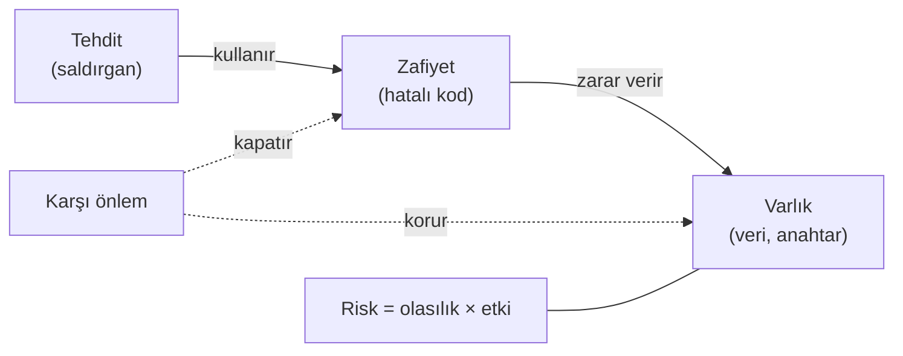
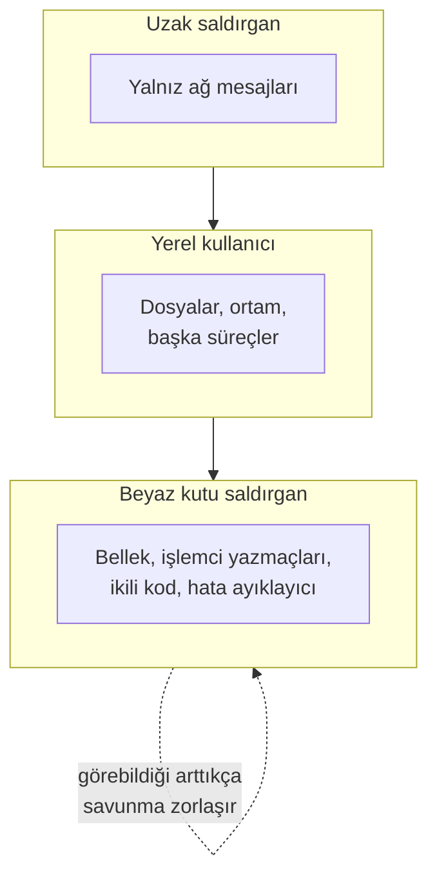
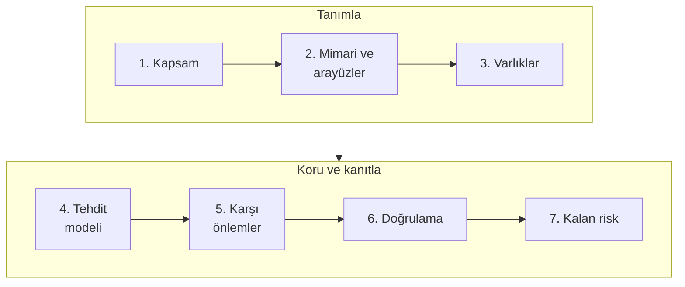
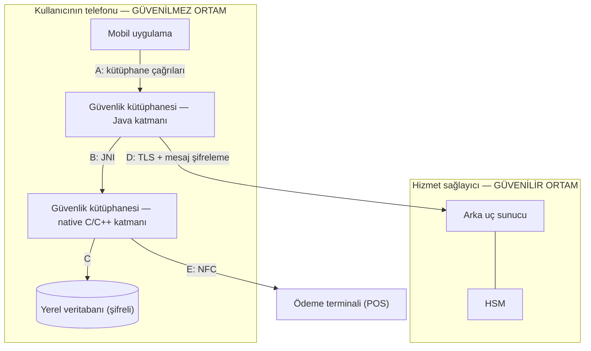
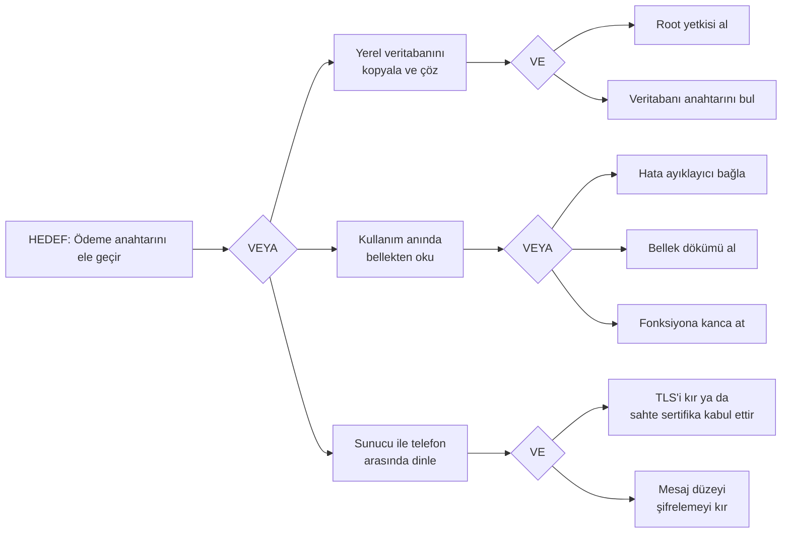
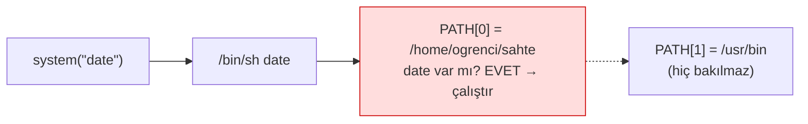

# Hafta 1 — Güvenli Programlamaya Giriş ve Uygulama Koruma Planı

| | |
| --- | --- |
| **Tarih** | 18.09.2026 (telafi: 30.09.2026) |
| **Öğrenme çıktıları** | ÖÇ.1 (zafiyetleri tanır ve sınıflandırır) · ÖÇ.5 (güvenli tasarım ilkeleriyle yazılım planı oluşturur) |
| **Süre** | 3 saat (3 × 50 dakika) |
| **Ön bilgi** | C'de fonksiyon, dizi, işaretçi; PowerShell ya da Linux terminalinde `cd`, `ls` |
| **Uygulamalar** | [`code/week-01`](https://github.com/ucoruh/cen429-secure-programming/tree/main/code/week-01) — 4 demo; Windows'ta `.\demo.ps1`, WSL / Linux'ta `sh demo.sh`; Visual Studio 2022 Community ile de açılır |

<!-- materyal:basla -->

<div class="materyal" markdown>

[:material-file-pdf-box: Ders notu (PDF)](cen429-week-1-ders-notu.pdf){ .md-button download="cen429-week-1-ders-notu.pdf" }
[:material-file-word-box: Ders notu (DOCX)](cen429-week-1-ders-notu.docx){ .md-button download="cen429-week-1-ders-notu.docx" }
[:material-presentation: Sunum (PDF)](cen429-week-1-sunum.pdf){ .md-button download="cen429-week-1-sunum.pdf" }
[:material-microsoft-powerpoint: Sunum (PPTX)](cen429-week-1-sunum.pptx){ .md-button download="cen429-week-1-sunum.pptx" }
[:material-language-html5: Sunum (HTML, çevrimdışı)](cen429-week-1-sunum.html){ .md-button download="cen429-week-1-sunum.html" }
[:material-folder-zip: Tümünü indir (ZIP)](cen429-week-1-materyal.zip){ .md-button download="cen429-week-1-materyal.zip" }
[:material-fullscreen: Sunumu tam ekran aç](cen429-week-1-sunum.html){ .md-button .md-button--primary target=_blank }

</div>

<div class="sunum-cercevesi">
<iframe src="../cen429-week-1-sunum.html" title="Hafta 1 — Güvenli Programlamaya Giriş ve Uygulama Koruma Planı" loading="lazy" allowfullscreen></iframe>
</div>

<p class="sunum-ipucu">Sunumun içine tıklayıp ok tuşlarıyla ilerleyin; tam ekran için sunumun sağ altındaki düğmeyi ya da yukarıdaki "Sunumu tam ekran aç" bağlantısını kullanın.</p>

<!-- materyal:bitis -->

!!! abstract "Bu haftanın sonunda şunları yapabileceksiniz"
    1. Gizlilik, bütünlük, erişilebilirlik kavramlarını ve **varlık–tehdit–zafiyet–risk** zincirini kendi
       örneklerinizle açıklamak.
    2. Bir yazılım için **saldırgan modelini** seçmek; özellikle "cihaz saldırganın elindeyse" ne değiştiğini söylemek.
    3. Küçük bir uygulama için **uygulama koruma planının** ilk bölümlerini (kapsam, mimari, varlıklar, tehditler)
       yazmak.
    4. **STRIDE** ile bir veri akış diyagramından tehdit çıkarmak ve bir **saldırı ağacı** çizmek.
    5. Bir programın **başlarken** devraldığı tehlikeleri (ortam değişkenleri, bellek dökümü) ve **bellekte kalan
       sırları** göstermek ve düzeltmek.
    6. **Arabellek taşması** ile **işaretli/işaretsiz tamsayı** hatasını çalışan bir örnekte göstermek, derleyici ve
       sanitizer araçlarıyla yakalamak ve düzeltmek.

??? info "Ders akışı (öğretim üyesi için zaman planı)"
    | Zaman | Bölüm | Ne yapılıyor |
    | --- | --- | --- |
    | 0:00–0:15 | Tanışma | İzlence, dönem projesi, değerlendirme, laboratuvar kurulumu |
    | 0:15–0:50 | [1–4](#1-guvenlik-nedir) | Güvenlik kavramları, saldırgan modelleri, tasarım ilkeleri (tartışmalı anlatım) |
    | 0:50–1:00 | Ara | |
    | 1:00–1:35 | [5–6](#5-uygulama-koruma-plani) | Uygulama koruma planı, arayüz ve varlık tabloları, STRIDE ve saldırı ağacı — **sınıf alıştırması** |
    | 1:35–1:50 | [7–8](#7-program-baslarken-guvenilmeyen-ortam) | **Demo 1** (PATH ile kandırma), **Demo 2** (bellekte kalan parola) |
    | 1:50–2:00 | Ara | |
    | 2:00–2:40 | [9–11](#9-surec-bellegi-verileriniz-nerede-duruyor) | Süreç belleği, **Demo 3** (taşmayla yetki yükseltme), **Demo 4** (işaretli uzunluk) |
    | 2:40–3:00 | [12–15](#13-donem-projesi-bu-hafta) | Proje başlangıcı, kendi başına çalışma, kendini sınama |

!!! tip "Laboratuvarı önceden hazırlayın"
    Bütün demolar **Windows**'ta (Visual Studio 2022 Community ya da PowerShell), **WSL**'de ve **Linux**'ta çalışır.
    Kurulum, Visual Studio'da açma ve güvenlik kuralları:
    [`code/README.md`](https://github.com/ucoruh/cen429-secure-programming/blob/main/code/README.md). Kısaca:

    === "Windows"

        Visual Studio 2022 Community'yi **C++ ile masaüstü geliştirme** iş yüküyle kurun. Sonra PowerShell'de:

        ```powershell
        mkdir C:\Dersler; cd C:\Dersler
        git clone https://github.com/ucoruh/cen429-secure-programming.git
        cd cen429-secure-programming\code
        .\build.ps1
        cd week-01\01-path-kandirma
        .\demo.ps1
        ```

        Visual Studio'da: **Dosya > Aç > Klasör** → `code` → yapılandırma **Windows (MSVC)** → **Derle > Tümünü Derle**.

    === "WSL / Linux"

        ```bash
        sudo apt install -y build-essential cmake gdb valgrind binutils
        git clone https://github.com/ucoruh/cen429-secure-programming.git
        cd cen429-secure-programming/code
        ./build.sh
        cd week-01/01-path-kandirma
        sh demo.sh
        ```

!!! warning "Etik kural — bu derste her hafta geçerli"
    Bu derste saldırıları **görerek** öğreniyoruz. Bütün demolar yalnız kendi klasörlerinde çalışır, yönetici yetkisi
    istemez ve bilgisayarınızın hiçbir ayarını değiştirmez. Öğrendiğiniz teknikleri **yalnız kendi bilgisayarınızda ve
    verilen demolar üzerinde** deneyin. Başkasına ait bir sistemde izinsiz denemek suçtur.

---

## 1. Güvenlik nedir?

Bir bankanın kasasını düşünün. Kasanın içindeki para **varlıktır**. Parayı çalmak isteyen biri **tehdittir**.
Kasanın kilidinin arızalı olması bir **zafiyettir**. Hırsızın o arızalı kilidi kullanması bir **saldırıdır**.
**Risk** ise "bu olay ne kadar olası ve olursa ne kadar zarar verir?" sorusunun cevabıdır.

Yazılımda da aynı zincir vardır; yalnız kasanın yerinde program, paranın yerinde veri durur.

| Kavram | Tanım | Kasa örneği | Yazılım örneği |
| --- | --- | --- | --- |
| **Varlık** (asset) | Korumaya değer her şey | Kasadaki para | Kullanıcı parolası, ödeme anahtarı, müşteri kayıtları |
| **Tehdit** (threat) | Varlığa zarar verebilecek olası olay ya da kişi | Hırsız | Parolayı çalmak isteyen biri |
| **Zafiyet** (vulnerability) | Tehdidin kullanabileceği zayıflık | Arızalı kilit | Uzunluğu denetlenmeyen bir `strcpy` |
| **Saldırı** (attack/exploit) | Zafiyetin fiilen kullanılması | Kilidin açılması | Uzun bir kullanıcı adıyla yönetici olmak |
| **Karşı önlem** (countermeasure) | Riski azaltan önlem | Yeni kilit, alarm | Uzunluk denetimi, derleyici koruması |
| **Risk** | Olasılık × etki | "Bu mahallede bu kilitle yılda bir soygun olur" | "Bu hata bulunursa bütün hesaplar ele geçer" |



### Güvenliğin üç hedefi: CIA

Güvenlikten söz ettiğimizde neredeyse her zaman şu üç şeyi korumaya çalışırız:

| Hedef | Soru | Bozulursa ne olur? | Tipik önlem |
| --- | --- | --- | --- |
| **Gizlilik** (Confidentiality) | Veriyi yalnız yetkili olanlar görebiliyor mu? | Parolalar, kart bilgileri sızar | Şifreleme, erişim denetimi |
| **Bütünlük** (Integrity) | Veri yetkisiz biçimde değiştirilebiliyor mu? | Bakiye, not, fiyat değiştirilir | Özet (hash), MAC, dijital imza |
| **Erişilebilirlik** (Availability) | Hizmet gerektiğinde çalışıyor mu? | Sistem çöker, kimse kullanamaz | Yedeklilik, kaynak sınırlama |

Bunlara sıklıkla üç kavram daha eklenir: **kimlik doğrulama** (sen gerçekten o musun?), **yetkilendirme** (bunu
yapmaya iznin var mı?) ve **hesap verebilirlik / inkâr edilemezlik** (bunu kim yaptı, sonradan inkâr edebilir mi?).

!!! example "Sınıfta tartışalım (5 dakika)"
    Telefonunuzdaki bankacılık uygulamasını düşünün. Aşağıdakilerin her biri CIA'nın hangi hedefini bozar?

    1. Uygulama hesap bakiyenizi şifrelemeden telefonun belleğine yazıyor.
    2. Biri, para transferindeki alıcı IBAN'ını yolda değiştirebiliyor.
    3. Bayram gecesi sunucu aşırı yükten çöküyor.

    ??? success "Cevaplar"
        1\. Gizlilik · 2. Bütünlük · 3. Erişilebilirlik

### Hata ile zafiyet arasındaki fark

Her yazılım hatası bir güvenlik açığı değildir; ama **güvenlik açıklarının çok büyük kısmı sıradan yazılım
hatalarıdır**. Bir hata, bir saldırganın kendi istediği sonucu elde etmesine izin veriyorsa artık bir **zafiyettir**.

!!! quote "Gerçek dünyadan: Heartbleed (2014)"
    OpenSSL kütüphanesindeki bir "kalp atışı" mesajında, istemcinin söylediği uzunluk ile gerçekten gönderdiği verinin
    uzunluğu karşılaştırılmıyordu. Saldırgan "bana 64 KB geri yolla" diyip yalnız birkaç bayt gönderince, sunucu
    belleğindeki komşu veriyi — parolalar, oturum çerezleri, hatta özel anahtarlar — geri yolluyordu (CVE-2014-0160).
    Tek bir eksik uzunluk denetimi, internetin önemli bir kısmını etkiledi. Bu hafta [Demo 4](#11-tamsayilar-ve-isaretli-uzunluk-hatasi)'te
    aynı aileden bir hatayı kendi elimizle göreceğiz.

---

## 2. Neden "güvenli programlama"?

Güvenlik duvarları, antivirüsler, ağ izleme… Bunların hepsi önemlidir; ama **hatalı yazılmış bir programı
kurtaramazlar**. Saldırgan izin verilen kapıdan — yani programın kendisinden — içeri girer. Güvenli programlama,
güvenliği sonradan eklenen bir katman olarak değil, **kodu yazarken verilen kararlar** olarak ele alır:

- Girdiye güvenme; **her girdiyi doğrula** (uzunluk, tür, aralık, izin verilen karakterler).
- Sırları **mümkün olan en kısa süre** bellekte tut, işin bitince **güvenle sil**.
- Programın çalıştığı ortama (ortam değişkenleri, dosya izinleri, çağırdığı programlar) **güvenme**.
- Hata olursa **güvenli tarafta** kal: reddet, kapat, sızdırma.
- Derleyicinin ve işletim sisteminin sunduğu korumaları **aç** ve araçlarla (sanitizer, fuzzing) **sına**.

Dönem boyunca bu ilkeleri önce C/C++'ta, sonra Java'da; ardından "program saldırganın elindeyse" dünyasında (çalışma
zamanı koruması, kod gizleme, whitebox kriptografi) uygulayacağız.

---

## 3. Saldırgan kim, neye erişebiliyor?

Bir güvenlik önlemini değerlendirmenin ilk sorusu şudur: **"Kime karşı?"** Aynı önlem bir saldırgana karşı yeterli,
başka birine karşı işe yaramaz olabilir. Bu yüzden her projede önce **saldırgan modeli** yazılır.

| Saldırgan | Neye erişebilir? | Neler yapabilir? | Örnek | Savunmanın ağırlığı |
| --- | --- | --- | --- | --- |
| **Uzaktaki saldırgan** | Yalnız ağ üzerinden gönderdiği mesajlar | Bozuk/uzun girdi gönderir, trafiği dinler | Web sunucusuna saldıran biri | Girdi doğrulama, TLS |
| **Yerel kullanıcı** | Aynı bilgisayarda sıradan bir hesap | Dosyaları okur, ortam değişkenlerini değiştirir, programları çalıştırır | Paylaşılan sunucudaki başka bir öğrenci | İzinler, güvenli başlatma |
| **Kötü niyetli içeriden kişi** | Kaynak koda, sunuculara yetkili erişim | Arka kapı ekler, veri sızdırır | Görevini kötüye kullanan çalışan | Ayrıcalık ayrımı, denetim kaydı |
| **Cihazın sahibi saldırgan** (beyaz kutu, "Man-At-The-End") | Programın kendisine **tam** erişim | Hata ayıklayıcıyla adım adım izler, belleği döker, ikili dosyayı değiştirir | Mobil ödeme uygulamasını kendi telefonunda kırmaya çalışan biri | Çalışma zamanı koruması, kod gizleme, whitebox kriptografi |



!!! note "Bu dersin farkı"
    Klasik güvenlik dersleri çoğunlukla ilk iki saldırganla ilgilenir. Bu derste son satıra — **programın saldırganın
    cihazında çalıştığı** duruma — özellikle ağırlık vereceğiz. Mobil ödeme, dijital içerik koruma (DRM), oyun hilelerine
    karşı koruma ve lisans denetimi bu dünyadadır. Burada "anahtarı gizle, olur biter" demek yetmez: saldırgan belleği
    okuyabilir, kodu değiştirebilir, programı istediği gibi durdurup başlatabilir.

---

## 4. Güvenli tasarımın temel ilkeleri

1975'te Saltzer ve Schroeder'in yazdığı ilkeler bugün de güvenli tasarımın omurgasıdır. Her birini tek cümlelik bir
örnekle aklınızda tutun:

| İlke | Anlamı | Örnek |
| --- | --- | --- |
| **En az ayrıcalık** | Her bileşen işini yapmaya yetecek kadar yetkiyle çalışır | Rapor programı yönetici olarak değil, sıradan kullanıcıyla çalışır |
| **Güvenli varsayılan** | Varsayılan durum "izin yok"tur | Yeni kullanıcının `yonetici` alanı 0 ile başlar |
| **Tam aracılık** | Her erişim her seferinde denetlenir | Yetki bir kez bakılıp önbelleğe yazılmaz |
| **Açık tasarım** | Güvenlik, tasarımın gizli kalmasına değil anahtarın gizliliğine dayanır (Kerckhoffs) | Kendi şifreleme algoritmanızı yazmazsınız |
| **Mekanizma ekonomisi** | Basit tasarım daha az hata içerir | 20 satırlık açık bir denetim, 500 satırlık "akıllı" bir denetimden iyidir |
| **Ayrıcalıkların ayrılması** | Kritik işlem için birden fazla koşul gerekir | Para transferi için hem parola hem SMS kodu |
| **En az ortak mekanizma** | Kullanıcılar arasında paylaşılan kaynaklar azaltılır | Her oturumun kendi geçici dosyası olur |
| **Psikolojik kabul edilebilirlik** | Güvenlik kullanılabilir olmalıdır, yoksa atlatılır | Her 5 dakikada parola sormak, parolanın kâğıda yazılmasına yol açar |

Bunlara modern bir ilke ekleyelim: **Derinlemesine savunma** (defense in depth). Tek bir önleme güvenmeyiz; birbirini
tamamlayan **katmanlar** kurarız. Biri aşılırsa diğeri devreye girer. 3. haftada hassas bir anahtarın tam **dört ayrı
koruma katmanı** (güvenlik kabuğu) içinde nasıl taşındığını göreceğiz.

---

## 5. Uygulama koruma planı

Bir yazılımın güvenliği şansa bırakılmaz; **yazılı bir planla** yönetilir. Bağımsız bir laboratuvarın güvenlik
sertifikasyonundan geçen ürünlerde bu plan, yüzlerce sayfalık bir **güvenlik kılavuzuna** dönüşür. Bu derste siz de
dönem projeniz için bunun küçük bir sürümünü yazacaksınız. Planın omurgası şudur:



Plan bir kez yazılıp bırakılmaz: ürün her değiştiğinde (yeni özellik, hata düzeltmesi, yeni sürüm) 1. adıma dönülür
ve plan güncellenir.

1. **Kapsam:** Neyi değerlendiriyoruz? Yalnız "sürüm 2.1" demek yetmez; hangi ikili dosya, hangi kaynak kod, hangi
   özet değeri? Sertifikasyonda buna **değerlendirme hedefi** denir.
2. **Mimari ve arayüzler:** Bileşenler neler, birbirleriyle hangi kanaldan konuşuyor, her kanalda kimlik nasıl
   doğrulanıyor?
3. **Varlıklar:** Korunacak her veri tek tek listelenir: nerede durur, ne zaman oluşur, ne zaman silinir, **gizlilik
   (C)** mi **bütünlük (I)** mü gerekir?
4. **Tehditler:** Saldırgan kim (bkz. bölüm 3), her varlığa hangi yoldan ulaşabilir?
5. **Karşı önlemler:** Her tehdit için hangi önlem, hangi katmanda?
6. **Doğrulama:** Her önlemin çalıştığı nasıl kanıtlanıyor — birim testi, atlatma denemesi?
7. **Kalan risk:** Kapatılamayan ya da bilerek kabul edilen riskler ve nedenleri (ör. performans).

### Planın iki temel aracı: arayüz tablosu ve varlık tablosu

Planın 2. ve 3. adımları iki tabloyla yazılır; bu derste bütün dönem boyunca aynı yöntemi kullanacağız. Yöntemi bir
örnek mimari üzerinde görelim: telefonun NFC'si üzerinden temassız ödeme yapan bir mobil uygulama ve onun kritik
işlerini yapan bir **güvenlik kütüphanesi**. Kütüphanenin bir kısmı Java'da, güvenlik açısından en hassas kısmı ise
**C/C++ ile yazılmış yerel (native) katmanda** çalışır.



Bu şemada iki şeye dikkat edin:

- Telefon kutusunun başlığı **"güvenilmez ortam"**. Telefon, kullanıcının — yani potansiyel saldırganın — elinde.
  Root yetkisi alınmış olabilir, hata ayıklayıcı bağlanmış olabilir. Bu yüzden tasarım baştan **"telefona
  güvenmiyorum"** varsayımıyla yapılır.
- Harflerle gösterilen her ok bir **arayüzdür**. Her arayüz için şu tablo doldurulur:

| Arayüz | Uç A | Uç B | Kimlik doğrulama | Gizlilik / bütünlük |
| --- | --- | --- | --- | --- |
| A | Mobil uygulama | Kütüphane (Java) | Çağıran uygulamanın imzası doğrulanır | Aynı süreç içi; hassas veri geçmez |
| B | Kütüphane (Java) | Kütüphane (native) | Karşılıklı bütünlük denetimi | Veriler şifreli ve örtülü geçer |
| C | Kütüphane (native) | Yerel veritabanı | — | Şifreleme + bütünlük kodu (MAC), anahtar cihaza bağlı |
| D | Kütüphane | Arka uç sunucu | Sertifika sabitleme + sunucu doğrulama kodu | TLS **ve** ayrıca mesaj düzeyinde şifreleme |
| E | Kütüphane | Ödeme terminali | Ödeme protokolü | Tek kullanımlık ödeme anahtarı |

Ve **varlık tablosundan** bir kesit (değerler sentetiktir):

| Varlık | Tür | Nerede | Oluşma → silinme | Koruma |
| --- | --- | --- | --- | --- |
| Tek kullanımlık ödeme anahtarı | Kriptografik, dinamik | Veritabanı (şifreli), kullanım anında bellek | Sunucudan iner → tek ödemede kullanılır → silinir | C, I |
| Cihaz parmak izi | Dinamik | Bellek, iki ayrı parçada | Uygulama açılışında hesaplanır | I |
| Oturum anahtarı | Kriptografik, dinamik | Yalnız bellek | Sunucuyla oturum kurulurken türetilir → oturum sonunda silinir | C, I |
| İşlem sayacı | Dinamik | Veritabanı | Her ödemede artar | I |
| Sunucu açık anahtarı | Kriptografik, statik | Uygulamaya gömülü | Derleme anında | I |

!!! note "Neden bu kadar ayrıntı?"
    Bir değerlendirici ilk iş olarak bu listeye bakar ve her satır için sorar: "Bu varlık **nerede ve ne zaman**
    açığa çıkıyor?" Listede olmayan bir varlık korunmuyor demektir. Sizin projenizde de her varlık bu tabloda yer
    alacak.

!!! tip "Bu yöntemin devamı"
    Bu dönem her hafta, bu tablolardaki varlıkları koruyan yöntemlerden birini açacağız: katmanlı veri koruması ve
    güvenlik kabukları (3. hafta), native kod sağlamlaştırma (4. ve 9. haftalar), Java tarafı sağlamlaştırma
    (5. hafta), çalışma zamanı öz koruması (6. hafta), kripto yöntemleri ve anahtar hiyerarşisi (10. hafta), whitebox
    kriptografi (11. hafta), sertifikasyon ve gereksinim eşlemesi (12–13. haftalar).

---

## 6. Tehdit modelleme: STRIDE ve saldırı ağaçları

Tehdit modelleme, "saldırgan olsaydım buraya nasıl saldırırdım?" sorusunu **düzenli** biçimde sormaktır. En yaygın
yöntemlerden biri Microsoft'un geliştirdiği **STRIDE**'dır: her harf bir tehdit ailesi ve bozduğu güvenlik özelliğidir.

| Harf | Tehdit | Bozduğu özellik | Örnek (mobil ödeme mimarisi) |
| --- | --- | --- | --- |
| **S** | Spoofing — kimlik taklidi | Kimlik doğrulama | Sahte bir uygulamanın kendini asıl uygulama gibi gösterip güvenlik kütüphanesini çağırması |
| **T** | Tampering — kurcalama | Bütünlük | Native kütüphanedeki bir denetimin ikili dosyada değiştirilmesi |
| **R** | Repudiation — inkâr | İnkâr edilemezlik | Kullanıcının "bu ödemeyi ben yapmadım" demesi ve kanıt olmaması |
| **I** | Information disclosure — bilgi sızması | Gizlilik | Ödeme anahtarının bellek dökümünden okunması |
| **D** | Denial of service — hizmet engelleme | Erişilebilirlik | Sunucuya binlerce sahte kayıt isteği |
| **E** | Elevation of privilege — yetki yükseltme | Yetkilendirme | Sıradan kullanıcının yönetici işlevine erişmesi |

Uygulaması basittir: sistemin **veri akış diyagramını** çizin (dış varlıklar, süreçler, veri depoları, veri akışları
ve **güven sınırları**), sonra her öğe için altı harfi tek tek sorun. Güven sınırını geçen her ok, en çok tehdidin
çıktığı yerdir.

### Saldırı ağacı

Saldırı ağacında kök, saldırganın **hedefidir**; alt dallar o hedefe ulaşmanın yollarıdır. **VEYA** düğümünde
dallardan biri yeter, **VE** düğümünde hepsi gerekir. Ağaç çizildiğinde en ucuz yol ve savunulacak kilit noktalar
kendiliğinden ortaya çıkar.



Bu ağaçtan hemen şu sonuçlar çıkar: (1) C yolu **iki** katmanı birden kırmayı gerektirdiği için pahalıdır — işte
derinlemesine savunma. (2) B yolunun üç alternatifi var; demek ki **bellekteki anahtar** en zayıf nokta ve buna
karşı özel önlemler (bu hafta Demo 2, 6. hafta çalışma zamanı koruması, 11. hafta whitebox) gerekir.

!!! example "Sınıf alıştırması (15 dakika, 3–4 kişilik gruplar)"
    Bir **"öğrenci not sistemi"** düşünün: öğretim üyesi not girer, öğrenci notunu görür, veriler bir sunucuda durur.

    1. Veri akış diyagramını çizin; güven sınırlarını kesikli çizgiyle işaretleyin.
    2. En az **altı** STRIDE tehdidi yazın (her harften bir tane).
    3. "Notumu 45'ten 85'e çıkar" hedefi için bir saldırı ağacı çizin. En ucuz yol hangisi?

    ??? tip "İpucu"
        Güven sınırları: tarayıcı ↔ sunucu, sunucu ↔ veritabanı, öğrenci rolü ↔ öğretim üyesi rolü. "E" harfi için
        öğrencinin not girme sayfasına doğrudan adres yazarak ulaşmasını düşünün; "R" için "bu notu kim, ne zaman
        değiştirdi?" kaydının olmamasını.

---

## 7. Program başlarken: güvenilmeyen ortam

Bir program çalışmaya başladığında **boş bir sayfayla** başlamaz. Onu çalıştıran kişiden birçok şey devralır:
**ortam değişkenleri** (`PATH`, `LD_PRELOAD`, `IFS`...), **açık dosya tanıtıcıları**, çalışma dizini, `umask`,
kaynak sınırları. Program bunlara güvenirse, onları kontrol eden kişi programın davranışını da kontrol eder.
Kaynak kitabımızın ilk bölümü (Viega & Messier, tarif 1.1–1.9) tam olarak bu "güvenli başlatma" konusunu işler.

### Demo 1 — PATH ile kandırma

!!! info "Demo 1 · `code/week-01/01-path-kandirma` · CWE-426 (güvenilmeyen arama yolu)"
    Program bir sistem komutunu çağırıyor: Linux'ta tarihi yazan `date`, Windows'ta bilgisayar adını yazan
    `hostname`. Soru: **hangi** `date`, **hangi** `hostname`?

Kabuk bir komutu mutlak yolu olmadan çağırdığınızda, programı `PATH` değişkenindeki klasörlerde **soldan sağa**
arar ve **ilk bulduğunu** çalıştırır:



Windows'ta durum daha da kötüdür: `cmd.exe` komutu `PATH`'ten **önce çalışma klasöründe** arar ve `.bat`, `.cmd`
gibi uzantıları da dener. Programı hangi klasörden çalıştırdığınız bile hangi dosyanın çalışacağını değiştirir.

Hatalı kod:

```c title="rapor.c"
#ifdef _WIN32
#define KOMUT "hostname"
#else
#define KOMUT "date"
#endif

int main(void)
{
    printf("=== Aylik Satis Raporu ===\n");
    fflush(stdout);

    /* HATA: çıplak komut adı + kabuk + devralınan ortam (PATH, ...) */
    int durum = system(KOMUT);
    ...
}
```

Demoyu çalıştırın:

=== "Windows (PowerShell)"

    ```powershell
    cd code\week-01\01-path-kandirma
    .\demo.ps1
    ```

=== "WSL / Linux"

    ```bash
    cd code/week-01/01-path-kandirma
    sh demo.sh
    ```

```text title="Çıktı — WSL (kısaltılmış; Windows'ta aynı akış hostname ile)"
ADIM 1 — Normal calisma: program gercek date'i buluyor
=== Aylik Satis Raporu ===
Rapor tarihi: Sat Sep 19 19:11:32 +03 2026

ADIM 2 — Saldiri: PATH'in basina sahte/ klasoru ekleniyor
$ PATH="$PWD/sahte:$PATH" ./bin/linux/rapor
=== Aylik Satis Raporu ===
Rapor tarihi:
  !!! SAHTE 'date' calisti !!!
  Program PATH uzerinden kandirildi. ...

ADIM 3 — Duzeltilmis surum ayni saldiri altinda
=== Aylik Satis Raporu ===
Rapor tarihi: Sat Sep 19 19:11:32 +03 2026
```

Sahte `date` burada yalnız bir mesaj basıyor. Gerçek bir saldırgan aynı noktada **programı çalıştıran kişinin bütün
yetkileriyle** istediği her şeyi yapabilirdi. Program yüksek yetkiyle çalışıyorsa (ör. bir sistem servisi), bu doğrudan
yetki yükseltmedir.

Düzeltilmiş kod üç şeyi birden yapar: **1)** mutlak yol, **2)** kabuk yok, **3)** küçük, bilinen ortam.

=== "Linux (posix_spawn)"

    ```c title="rapor_guvenli.c"
    char *const arguman[]     = { "date", NULL };
    char *const temiz_ortam[] = { "PATH=/usr/bin:/bin", "LANG=C", NULL };

    pid_t pid;
    int hata = posix_spawn(&pid, "/bin/date", NULL, NULL,
                           arguman, temiz_ortam);
    ```

=== "Windows (CreateProcessW)"

    ```c title="rapor_guvenli.c"
    /* 1) C:\Windows\System32\hostname.exe — tam yol */
    GetSystemDirectoryW(sistem, MAX_PATH);
    swprintf(program, MAX_PATH, L"%ls\\hostname.exe", sistem);

    /* 3) ortam bloğunda yalnız SystemRoot */
    swprintf(ortam, MAX_PATH + 16, L"SystemRoot=%ls", kok);

    /* 2) cmd.exe yok: program doğrudan başlatılır */
    CreateProcessW(program, komut_satiri, NULL, NULL, FALSE,
                   CREATE_UNICODE_ENVIRONMENT, ortam, NULL, &si, &pi);
    ```

!!! success "Kural"
    Başka bir program çalıştırmanız gerekiyorsa: **mutlak yol** kullanın, **kabuk üzerinden çalıştırmayın**
    (`system`, `popen` yerine Linux'ta `posix_spawn`/`execve`, Windows'ta `CreateProcessW`) ve çocuk sürece
    **temizlenmiş, bilinen** bir ortam verin. En iyisi: başka program çalıştırmaya hiç gerek bırakmayın — tarihi
    `time()` ve `strftime()` ile, bilgisayar adını `gethostname()` ya da `GetComputerNameW()` ile kendiniz alın.

---

## 8. Bellekte kalan sırlar

Bir parolayı kullandıktan sonra ne olur? Değişken kapsam dışına çıkar ama **bellek silinmez**; o baytlar üzerine
başka bir şey yazılana kadar orada durur. Bir saldırgan o belleği görebilirse sırrı okur. Belleğin görülebildiği
durumlar sandığınızdan çoktur:

- Program çöktüğünde oluşan **çökme dökümü** (core dump) dosyası,
- İşletim sisteminin belleği diske yazdığı **takas alanı** (swap) ve uyku (hibernation) dosyası,
- Bir **hata ayıklayıcının** sürece bağlanması,
- Aynı belleği sonradan kullanan başka bir kod parçasının eski içeriği okuması.

### Demo 2 — Bellekte kalan parola

!!! info "Demo 2 · `code/week-01/02-bellekte-parola` · CWE-14 (derleyicinin silme kodunu kaldırması), CWE-316"
    Program parolayı `parola.txt` dosyasından okuyor, onunla bir anahtar hesaplıyor, sonra parolayı silmeye
    çalışıyor. Demo, programın belleğini bir dosyaya döküp içinde parolayı arıyor: Linux'ta `gdb`'nin `gcore`
    komutuyla, Windows'ta programın kendi belleğini `MiniDumpWriteDump` ile yazmasıyla. Üç sürüm var: **hiç
    silmeyen**, **`memset` ile silen** ve **`explicit_bzero` / `SecureZeroMemory` ile silen**.

```c title="parola.c (özü)"
unsigned long giris_yap(const char *dosya)
{
    char parola[64];
    /* düşük düzey okuma: parola yalnız bu dizide durur */
    int fd = dosya_ac(dosya);
    int n = (int)dosya_oku(fd, parola, sizeof(parola) - 1);
    ...
    unsigned long anahtar = anahtar_turet(parola, (size_t)n);

#if SILME == 1
    memset(parola, 0, sizeof(parola));         /* "ölü yazma" */
#elif SILME == 2
  #ifdef _WIN32
    SecureZeroMemory(parola, sizeof(parola));  /* kaldırılamaz */
  #else
    explicit_bzero(parola, sizeof(parola));    /* kaldırılamaz */
  #endif
#endif
    return anahtar;
}
```

=== "Windows (PowerShell)"

    ```powershell
    cd code\week-01\02-bellekte-parola
    .\demo.ps1
    ```

=== "WSL / Linux"

    ```bash
    cd code/week-01/02-bellekte-parola
    sh demo.sh
    ```

```text title="sh demo.sh — çıktı (Windows'ta sonuç aynıdır)"
ADIM 1 — Parolayi hic silmeyen surum
  SONUC: parola dokumde 1 yerde BULUNDU  ->  Gizli-Parola-2026

ADIM 2 — memset ile silen surum (-O2)
  SONUC: parola dokumde 1 yerde BULUNDU  ->  Gizli-Parola-2026

ADIM 3 — explicit_bzero ile silen surum (-O2)
  SONUC: parola dokumde bulunamadi

Neden? giris_yap() fonksiyonunun makine kodu:
  memset surumunde silme komutu sayisi    ->  0
  explicit surumunde explicit_bzero cagrisi ->  1
```

**İkinci adım şaşırtıcıdır:** kodda açıkça `memset` yazıyor, ama parola hâlâ bellekte! Nedeni derleyicinin
optimizasyonudur. Derleyici şöyle düşünür: *"`parola` dizisi bu satırdan sonra hiç okunmuyor; ona sıfır yazmanın
programın sonucuna hiçbir etkisi yok. Öyleyse bu yazma gereksiz, silebilirim."* Buna **ölü yazma giderme** (dead
store elimination) denir. Normal programlarda hız kazandıran bu optimizasyon, güvenlik kodunda sırrın bellekte
kalmasına yol açar. Bu yalnız GCC'ye özgü değildir: Windows'ta MSVC `/O2` ile de aynı sonuç çıkar. Makine koduna
kendiniz bakın: Linux'ta `objdump -d bin/linux/parola_memset | less` ile `giris_yap`'ı arayın; Visual Studio'da
`giris_yap`'a kesme noktası koyup **Hata Ayıkla > Pencereler > Ayrıştırılmış Kod** (*Disassembly*) penceresini açın.
`memset`'e ait tek bir komut bile yoktur.

!!! success "Kural"
    Sırları silmek için derleyicinin kaldıramayacağı fonksiyonları kullanın:
    Linux/glibc'de `explicit_bzero`, Windows'ta `SecureZeroMemory`, C11 Ek K destekleyen derleyicilerde `memset_s`,
    OpenSSL'de `OPENSSL_cleanse`. Ek katmanlar: çökme dökümünü kapatmak (`setrlimit(RLIMIT_CORE, 0)`), belleğin diske
    yazılmasını engellemek (`mlock`), sırrı mümkün olan en kısa süre tutmak ve kopyalarını çoğaltmamak.

!!! note "Sahada nasıl uygulanır?"
    Mobil ödeme gibi yüksek güvenlik gerektiren yazılımlarda tek kullanımlık ödeme anahtarı yalnız ödeme anında ve
    yalnız native katmanda açılır; kullanımdan hemen sonra tampon **rastgele veriyle** üzerine yazılarak silinir. Java
    tarafında hassas veri, silinemeyen `String` yerine silinebilen `byte[]` dizilerinde tutulur. Bağımsız bir
    değerlendirici bunu, ödeme sırasında ve sonrasında bellek dökümü alıp anahtarı arayarak test eder — tam olarak
    Demo 2'de yaptığımız gibi.

---

## 9. Süreç belleği: verileriniz nerede duruyor?

Taşma hatalarını anlamak için önce bir programın belleğinin nasıl düzenlendiğini bilmemiz gerekir. Linux'ta çalışan
bir sürecin sanal belleği kabaca şöyledir:

```text
 yüksek adres
 +-----------------+
 | Yığın (stack)   |  <- yerel değişkenler, dönüş adresleri
 |       |         |     (aşağı doğru büyür)
 |       v         |
 |                 |
 |       ^         |
 |       |         |
 | Öbek (heap)     |  <- malloc ile alınan bellek
 +-----------------+     (yukarı doğru büyür)
 | .bss / .data    |  <- küresel ve static değişkenler
 +-----------------+
 | .text           |  <- makine kodu (salt okunur)
 +-----------------+
 düşük adres
```

Bir fonksiyon çağrıldığında yığında ona bir **çerçeve** (stack frame) ayrılır. Yerel değişkenler, bu çerçevede
**yan yana** durur. C, bir dizinin sonuna gelindiğini **denetlemez**: `ad[16]` dizisine 17. baytı yazarsanız, C bunu
engellemez ve o bayt bellekte hemen arkada ne varsa onun üzerine yazılır.

Demo 3'teki yapıya bakalım:

```c
struct oturum {
    char ad[16];
    int  yonetici;   /* 0 = normal kullanıcı */
};
```

```text
 ofset    0  1  2  3  4  5  6  7  8  9 10 11 12 13 14 15   16 17 18 19
         +-----------------------------------------------+ +-----------+
 önce    | a  y  s  e \0  .  .  .  .  .  .  .  .  .  .  .| |00 00 00 00|
         +-----------------------------------------------+ +-----------+
          <------------------ ad[16] ------------------->   yonetici=0

 17 karakterlik "AAAAAAAAAAAAAAAAB" kopyalanınca:
         +-----------------------------------------------+ +-----------+
 sonra   | A  A  A  A  A  A  A  A  A  A  A  A  A  A  A  A| |42 00 00 00|
         +-----------------------------------------------+ +-----------+
                                                   'B' ve '\0' ^^ ^^
                                                    yonetici = 0x42 = 66
```

x86-64 işlemciler **küçük uçlu** (little-endian) çalışır: bir tamsayının en düşük baytı en düşük adreste durur. Bu
yüzden `yonetici`'nin ilk baytına yazılan `'B'` (0x42) tamsayıyı 66 yapar — sıfır olmayan her değer "yönetici" demektir.

---

## 10. Demo 3 — Arabellek taşmasıyla yetki yükseltme

!!! info "Demo 3 · `code/week-01/03-tasma-giris` · CWE-121 (yığın tabanlı taşma), CWE-787 (sınır dışına yazma)"

```c title="giris.c (hatalı)"
struct oturum o;
o.yonetici = 0;

strcpy(o.ad, argv[1]);  /* HATA: hedefin 16 bayt olduğu hiç denetlenmiyor */

if (o.yonetici)
    printf(">>> YONETICI paneline erisim verildi! <<<\n");
```

Demo aynı hatalı kodu dört farklı biçimde derler ve aynı saldırıyı dener:

| Sürüm | Linux / WSL (GCC) | Windows (MSVC) | Ne görmeyi bekliyoruz? |
| --- | --- | --- | --- |
| `giris` | `-O0`, koruma yok | `/Od` | Saldırı başarılı |
| `giris_asan` | `-fsanitize=address` | `/fsanitize=address` | AddressSanitizer yakalar mı? |
| `giris_denetimli` | `-O2 -D_FORTIFY_SOURCE=2` | `/O2` + `strcpy_s` | Kütüphanenin boyut denetimi yakalar mı? |
| `giris_guvenli` | Düzeltilmiş kod | Düzeltilmiş kod | Girdi reddedilir |

=== "Windows (PowerShell)"

    ```powershell
    cd code\week-01\03-tasma-giris
    .\demo.ps1
    ```

=== "WSL / Linux"

    ```bash
    cd code/week-01/03-tasma-giris
    sh demo.sh
    ```

```text title="sh demo.sh — çıktı"
ADIM 1 — Normal giris
$ ./bin/linux/giris ayse
Hos geldin, ayse
yonetici alani = 0 (0x00000000)
Normal kullanici oturumu.

ADIM 2 — Saldiri: 16 bayttan 1 bayt fazla ad (17 karakter)
$ ./bin/linux/giris AAAAAAAAAAAAAAAAB
Hos geldin, AAAAAAAAAAAAAAAAB
yonetici alani = 66 (0x00000042)
>>> YONETICI paneline erisim verildi! <<<

ADIM 3 — Ayni saldiri, AddressSanitizer ile derlenmis surumde
$ ./bin/linux/giris_asan AAAAAAAAAAAAAAAAB
Hos geldin, AAAAAAAAAAAAAAAAB
yonetici alani = 66 (0x00000042)
>>> YONETICI paneline erisim verildi! <<<
   ^ ASan sessiz kaldi: tasma yapinin ICINDE kaldi.

ADIM 4 — Yapinin disina tasan uzun ad, ASan surumu
==1750==ERROR: AddressSanitizer: stack-buffer-overflow on address ...
WRITE of size 41 at 0x7fffffffe8c4 thread T0

ADIM 5 — Ayni kisa saldiri, _FORTIFY_SOURCE=2 ile derlenmis surumde
$ ./bin/linux/giris_denetimli AAAAAAAAAAAAAAAAB
*** buffer overflow detected ***: terminated
   (program, derleyicinin ekledigi denetimle durduruldu)

ADIM 6 — Duzeltilmis surum
$ ./bin/linux/giris_guvenli AAAAAAAAAAAAAAAAB
Reddedildi: ad 1-15 karakter; yalniz harf, rakam, _ ve - olabilir.
```

Windows'ta akış aynıdır. Yalnız 5. adımda `strcpy_s`, hedefin 16 bayt olduğunu bildiği için taşmayı görür ve
programı durdurur:

```text title=".\demo.ps1 — 5. adım"
> .\bin\windows\giris_denetimli.exe AAAAAAAAAAAAAAAAB
*** Guvenli kutuphane islevi tasmayi algiladi: program durduruldu ***
   (cikis kodu: 3)
```

Bu demodan çıkan üç ders:

1. **Tek bir baytlık taşma bile yeterlidir.** Saldırganın programı çökertmesi gerekmez; bir bayrağı değiştirmesi
   yetki yükseltmek için yeterli olabilir.
2. **Araçların sınırı vardır.** AddressSanitizer bellekte her **nesnenin** etrafına "yasak bölge" koyar; ama taşma
   aynı yapının **içinde** kaldığı için (ad → yonetici) bunu göremedi. Taşma yapının dışına çıkınca hemen yakaladı.
   `_FORTIFY_SOURCE` (Linux) ve `strcpy_s` (Windows) ise hedefin (`o.ad`) 16 bayt olduğunu bildiği için kısa
   taşmayı da yakaladı. Tek bir araca güvenmeyin.
3. **Asıl düzeltme koddadır.** Araçlar hatayı bulur; hatayı gidermek programcının işidir.

```c title="giris_guvenli.c (özü)"
/* İzin listesi: 1–15 karakter; harf, rakam, '_' ve '-' */
static int ad_gecerli_mi(const char *s)
{
    size_t n = strnlen(s, 16);
    if (n == 0 || n >= 16)
        return 0;
    for (size_t i = 0; i < n; i++) {
        unsigned char c = (unsigned char)s[i];
        if (!isalnum(c) && c != '_' && c != '-')
            return 0;
    }
    return 1;
}
...
if (!ad_gecerli_mi(argv[1])) { /* reddet */ }
struct oturum o = { .yonetici = 0 };          /* güvenli varsayılan */
snprintf(o.ad, sizeof(o.ad), "%s", argv[1]);  /* boyutu bilen kopya */
```

!!! note "Gerçek saldırılarda ne olur?"
    Burada taşan baytlar bir bayrağı değiştirdi. Yığında yerel değişkenlerin ardından fonksiyonun **dönüş adresi**
    de durur; taşma oraya kadar uzanırsa saldırgan programın akışını değiştirebilir. Modern sistemler buna karşı
    katmanlı önlemler alır: **stack canary** (dönüş adresinden önce konan ve taşmada bozulan gizli değer),
    **DEP/NX** (yığındaki veriyi kod olarak çalıştırmayı yasaklar) ve **ASLR** (adresleri her çalıştırmada
    değiştirir). Bunları 4. haftada ayrıntılı işleyeceğiz; önemli olan, bunların **hatayı düzeltmediğini, yalnız
    sömürmeyi zorlaştırdığını** bilmek.

---

## 11. Tamsayılar ve işaretli uzunluk hatası

C'de `int` **işaretli**, `size_t` ise **işaretsiz** bir tamsayıdır. Bilgisayar negatif sayıları **ikiye tümleyen**
(two's complement) biçiminde saklar: `-1`'in 64 bitlik gösterimi `0xFFFFFFFFFFFFFFFF`'tir. Aynı bit dizisi işaretsiz
okunursa **18.446.744.073.709.551.615** olur. `memcpy`, `malloc`, `read` gibi fonksiyonların boyut parametresi
`size_t`'dir; bu yüzden negatif bir `int` onlara geçtiği anda dev bir sayıya dönüşür.

### Demo 4 — İşaretli uzunluk hatası

!!! info "Demo 4 · `code/week-01/04-isaretli-uzunluk` · CWE-195 (işaretliden işaretsize dönüşüm hatası)"

```c title="kopya.c (hatalı)"
#define KAYIT_BOYUTU 16

static int kaydi_kopyala(char *hedef, const char *kaynak, int uzunluk)
{
    /* HATA: alt sınır (negatif değer) denetlenmiyor */
    if (uzunluk > KAYIT_BOYUTU)
        return -1;
    memcpy(hedef, kaynak, uzunluk);   /* int -> size_t: -1 -> 2^64 - 1 */
    return 0;
}
```

=== "Windows (PowerShell)"

    ```powershell
    cd code\week-01\04-isaretli-uzunluk
    .\demo.ps1
    ```

=== "WSL / Linux"

    ```bash
    cd code/week-01/04-isaretli-uzunluk
    sh demo.sh
    ```

```text title="sh demo.sh — çıktı"
ADIM 0 — Derleyici bu hatayi goruyor mu?
$ gcc -Wall -Wextra -fsyntax-only -I../../common kopya.c
   -> Uyari yok: -Wall -Wextra bu donusumu bildirmez.
$ gcc -Wsign-conversion -fsyntax-only -I../../common kopya.c
kopya.c:21:27: warning: conversion to 'size_t' from 'int'
               may change the sign of the result [-Wsign-conversion]

ADIM 1 — Normal kullanim
$ ./bin/linux/kopya 8
Kopyalandi: ORNEK-KA

ADIM 2 — Cok buyuk uzunluk: denetim yakalar
$ ./bin/linux/kopya 100
Reddedildi: uzunluk cok buyuk.

ADIM 3 — Saldiri: negatif uzunluk denetimi atlatir
$ ./bin/linux/kopya -1
Segmentation fault
   (cikis kodu: 139 — 139 = bellek hatasi, SIGSEGV)

ADIM 4 — Ayni saldiri, AddressSanitizer ile
==1823==ERROR: AddressSanitizer: negative-size-param: (size=-1)

ADIM 5 — Duzeltilmis surum
$ ./bin/linux/kopya_guvenli -1 ; ./bin/linux/kopya_guvenli 12abc ; ./bin/linux/kopya_guvenli 8
Reddedildi: uzunluk 0-16 arasinda bir tamsayi olmali.
Reddedildi: uzunluk 0-16 arasinda bir tamsayi olmali.
Kopyalandi (8 bayt): ORNEK-KA
```

Windows'ta iki fark görürsünüz. 3. adımda program `0xC0000409` koduyla biter: Windows yığının bozulduğunu fark edip
süreci anında sonlandırır. 0. adımda ise MSVC'nin C derleyicisi `/Wall` ile bile **hiç uyarmaz**; aynı kod C++
olarak derlenince uyarı çıkar:

```text title=".\demo.ps1 — 0. adım"
> cl /Zs /W4 kopya.c                 (C olarak derle)
   -> Uyari yok: MSVC'nin C derleyicisi bu donusumu /Wall ile bile bildirmez.
> cl /Zs /W4 /w44365 /TP kopya.c     (ayni kod, C++ olarak)
kopya.c(21): warning C4365: 'argument': conversion from 'int' to 'size_t', signed/unsigned mismatch
```

Denetim `uzunluk > 16` sorusunu soruyor; `-1` bu soruya "hayır" dediği için geçiyor. Ağdan gelen bir paketteki
uzunluk alanı, bir dosya başlığındaki kayıt boyutu — saldırganın kontrol ettiği her sayı bu hataya yol açabilir.
Derleyici bizi **uyarabilirdi**, ama yalnız istersek: GCC'de `-Wsign-conversion` varsayılan uyarılarda yoktur,
MSVC'nin C derleyicisinde hiç yoktur. Hangi uyarıların açık olduğunu bilmek ve onları okumak, bedava bir güvenlik
aracıdır; araçların sessizliği ise kodun doğru olduğunu göstermez.

```c title="kopya_guvenli.c (özü)"
static int uzunluk_oku(const char *metin, size_t *sonuc)
{
    char *son;
    errno = 0;
    long deger = strtol(metin, &son, 10);
    if (errno != 0 || son == metin || *son != '\0')
        return -1;                       /* sayı değil ya da taştı */
    if (deger < 0 || deger > KAYIT_BOYUTU)
        return -1;                       /* hem alt hem üst sınır */
    *sonuc = (size_t)deger;
    return 0;
}
```

!!! success "Kural"
    Boyut ve uzunlukları baştan **`size_t`** ile tutun. Dışarıdan gelen bir sayıyı **hem alt hem üst sınırla**
    denetleyin. `atoi` yerine hatayı bildiren `strtol` kullanın. Derlerken `-Wall -Wextra -Wconversion
    -Wsign-conversion` açık olsun.

---

## 12. Bu haftanın araç kutusu

| Araç / bayrak | Ne işe yarar? | Bu hafta nerede gördük? |
| --- | --- | --- |
| `-Wall -Wextra -Wsign-conversion` | Şüpheli kod için derleme uyarıları | Demo 4 |
| `-D_FORTIFY_SOURCE=2` (+ `-O2`) | Boyutu bilinen tamponlara yazan kütüphane çağrılarını çalışma anında denetler | Demo 3 |
| `-fsanitize=address` (ASan) | Sınır dışı erişim, serbest bırakılmış belleğin kullanımı gibi hataları çalışma anında yakalar | Demo 3, 4 |
| `gdb`, `gcore` | Hata ayıklayıcı; çalışan sürecin belleğini dosyaya döker | Demo 2 |
| `strings`, `objdump -d` | İkili dosyadaki metinleri ve makine kodunu gösterir | Demo 2 |
| `explicit_bzero` / `SecureZeroMemory` | Derleyicinin kaldıramayacağı bellek silme | Demo 2 |
| `posix_spawn` + mutlak yol + temiz ortam | Başka bir programı güvenle çalıştırma | Demo 1 |

---

## 13. Dönem projesi: bu hafta

Dönem projesinde bir C/C++ uygulamasını **"bir güvenlik sertifikasyonundan geçecekmiş gibi"** geliştirip bir
**güvenlik kılavuzu** yazacaksınız (20–30 sayfa). Bu hafta yapılacaklar:

- [ ] Takımınızı kurun (bireysel ya da en fazla 4 kişi) ve konunuzu seçin (konu listesi proje rehberinde).
- [ ] GitHub'da proje deposunu ve **proje planını** (iş paketleri, takvim, görev dağılımı) oluşturun; planı onaylatın.
- [ ] Güvenlik kılavuzunun ilk bölümlerinin taslağını yazın:
    - **S0** Kapak ve sürüm geçmişi
    - **S2** Ürün genel bakışı — uygulamanız ne yapıyor?
    - **S3** Mimari ve **arayüz tablosu** (bölüm 5'teki tablo biçimiyle)
    - **S4** Saldırgan modeli, **STRIDE tablosu** ve bir **saldırı ağacı**

```markdown title="S3 arayüz tablosu şablonu"
| ID | Uç A | Uç B | Kimlik doğrulama | Gizlilik / bütünlük | Açıklama |
| -- | ---- | ---- | ---------------- | ------------------- | -------- |
| A  | Konsol uyg. | Güvenlik DLL'i | ... | ... | ... |
```

---

## 14. Kendi başına çalış

Bu alıştırmalar not verilmez; dersi pekiştirmeniz içindir. Hepsi `code/week-01` klasöründeki demoların üzerinde,
yalnız kendi bilgisayarınızda yapılır.

??? question "Alıştırma 1 — Kolay: PATH tuzağının başka bir hali"
    Linux'ta `rapor.c`'deki `date` komutunu `ls -l rapor.c` yapın; Windows'ta `hostname` komutunu `whoami` yapın.
    Sahte bir `ls` (ya da `whoami.bat`) hazırlayıp `PATH` ile çalıştırın. Sonra `rapor_guvenli.c`'yi gerçek
    programı tam yoluyla çalıştıracak biçimde değiştirin.

    ??? tip "İpucu"
        Sahte dosyayı `sahte/` klasörüne koyun; Linux'ta `chmod +x sahte/ls` ile çalıştırılabilir yapın. Güvenli
        sürümde Linux'ta argüman dizisi `{ "ls", "-l", "rapor.c", NULL }` ve yol `/bin/ls` olur; Windows'ta yol
        `GetSystemDirectoryW` + `\whoami.exe` olur. Komut satırından yeniden derleyin (`.\build.ps1` ya da
        `./build.sh`) ve demoyu yeniden çalıştırın.

??? question "Alıştırma 2 — Kolay: Optimizasyonun etkisi"
    Demo 2'nin `CMakeLists.txt` dosyasında `parola_memset` satırındaki `MOD optimize`'ı `MOD korumasiz` yapın
    (GCC `-O0`, MSVC `/Od`), yeniden derleyip demoyu çalıştırın. `memset` sürümü bu kez parolayı silebiliyor mu? Neden?

    ??? success "Beklenen sonuç"
        `-O0`'da derleyici optimizasyon yapmadığı için `memset` kalır ve parola silinir. Bu, **güvenliğin optimizasyon
        düzeyine bağlı olmaması gerektiğini** gösterir: sürüm (release) derlemeleri her zaman optimizasyonludur, bu
        yüzden `explicit_bzero` kullanılmalıdır.

??? question "Alıştırma 3 — Orta: Taşmanın tam sınırı"
    Demo 3'te `giris` programına (`bin/linux/giris` ya da `bin\windows\giris.exe`) 16, 17, 18, 19 ve 20 karakterlik
    adlar verin. Her birinde `yonetici` alanının
    değerini tabloya yazın ve bölüm 9'daki bellek çizimiyle açıklayın. 16 karakterlik ad neden de tehlikelidir?

    ??? tip "İpucu"
        `strcpy` sonlandırıcı `'\0'` karakterini de kopyalar. 16 karakterlik adın `'\0'`'ı nereye yazılıyor?

??? question "Alıştırma 4 — Orta: Yeni bir yetki alanı"
    `struct oturum`'a `int bakiye;` alanını `ad`'dan sonra ekleyin. Taşmayla bakiyeyi 1000'in üzerine çıkarabilir
    misiniz? Sonra `giris_guvenli.c`'nin bunu nasıl engellediğini gösterin.

??? question "Alıştırma 5 — Orta: Tehdit modeli"
    Kendi dönem projeniz için bir veri akış diyagramı çizin ve her güven sınırını geçen akış için STRIDE'ın altı
    harfini sorun. En az 8 tehdit yazın ve her birine bir karşı önlem önerin.

??? question "Alıştırma 6 — Zor: Gerçek bir zafiyet raporu okuyun"
    Heartbleed (CVE-2014-0160) için yayımlanmış bir teknik açıklamayı okuyun. (a) Hangi uzunluk denetimi eksikti?
    (b) Demo 4 ile ortak noktası nedir? (c) Hangi CWE kategorisine girer? (d) Düzeltme hangi satırları ekledi?

    ??? tip "İpucu"
        Aranacak kavram: "out-of-bounds read" (CWE-125). Düzeltmede, mesajda bildirilen uzunluğun gerçek kayıt
        uzunluğunu aşıp aşmadığı denetlenmiştir.

---

## 15. Kendini sınama

??? question "1. Varlık, tehdit ve zafiyet arasındaki farkı bir örnekle açıklayın."
    **Varlık** korunan şeydir (kullanıcı parolası). **Tehdit** ona zarar verebilecek olası olay/kişidir (parolayı
    çalmak isteyen biri). **Zafiyet** tehdidin kullanabileceği zayıflıktır (parolanın bellekte silinmeden kalması).

??? question "2. Bir para transferinde alıcı hesabın yolda değiştirilmesi CIA'nın hangi hedefini bozar? Hangi önlem bunu engeller?"
    **Bütünlük.** Mesaj kimlik doğrulama kodu (MAC) ya da dijital imza; ayrıca TLS.

??? question "3. 'Beyaz kutu' saldırganı uzaktaki saldırgandan ayıran nedir? Bir örnek verin."
    Beyaz kutu saldırganı programın çalıştığı cihaza tam erişime sahiptir: belleği okur, hata ayıklayıcı bağlar, ikili
    dosyayı değiştirir. Örnek: mobil ödeme uygulamasını kendi (root'lu) telefonunda analiz eden kişi.

??? question "4. STRIDE'daki 'E' harfi hangi tehdidi anlatır? Bu haftaki hangi demo bunun örneğidir?"
    **Yetki yükseltme** (Elevation of privilege). Demo 3: uzun kullanıcı adıyla `yonetici` bayrağının değiştirilmesi.

??? question "5. Saldırı ağacında VE düğümü ile VEYA düğümünün farkı nedir? Savunma açısından hangisi daha iyidir?"
    VEYA'da tek bir dal yeterlidir, VE'de bütün dallar gerekir. Saldırganı VE düğümlerine zorlamak (birden çok katmanı
    birlikte kırmak zorunda bırakmak) savunma açısından daha iyidir; derinlemesine savunmanın mantığı budur.

??? question "6. `date` komutunu `system()` ile çağırmak neden tehlikelidir? Üç düzeltme sayın."
    Kabuk `date`'i PATH üzerinden arar; PATH'i kontrol eden kişi hangi programın çalışacağını seçer. Düzeltmeler:
    mutlak yol (`/bin/date`), kabuksuz çalıştırma (`posix_spawn`/`execve`), temizlenmiş ortam.

??? question "7. Demo 2'de `memset` neden parolayı silemedi?"
    Derleyici, dizinin `memset`'ten sonra hiç okunmadığını görüp bu yazmayı "ölü yazma" olarak kaldırdı (dead store
    elimination). `explicit_bzero` derleyicinin kaldıramayacağı biçimde tanımlanmıştır.

??? question "8. Demo 3'te AddressSanitizer 17 karakterlik saldırıyı neden yakalayamadı?"
    ASan sınır denetimini **nesne** düzeyinde yapar; taşma aynı yapının içinde (`ad` → `yonetici`) kaldığı için yasak
    bölgeye değmedi. Taşma yapının dışına çıkınca yakaladı. `_FORTIFY_SOURCE` ise hedef alanın boyutunu bildiği için
    kısa taşmayı da yakaladı.

??? question "9. `int uzunluk = -1;` değeri `memcpy`'ye verildiğinde ne olur?"
    `memcpy`'nin boyut parametresi `size_t`'dir; -1 işaretsize dönüşünce 2⁶⁴ − 1 olur, fonksiyon dev bir alanı
    kopyalamaya çalışır ve bellek hatasıyla çöker (ya da daha kötüsü, belleği bozar).

??? question "10. Derinlemesine savunma nedir? Bu haftaki mobil ödeme mimarisinden bir örnek verin."
    Tek bir önleme güvenmeyip birbirini tamamlayan katmanlar kurmaktır. Örnek mimaride sunucu–telefon trafiği hem TLS
    hem de ayrıca mesaj düzeyinde şifrelemeyle korunur; saldırganın ikisini birlikte kırması gerekir.

---

## 16. Kaynaklar ve ileri okuma

**Ders kitabı** — J. Viega, M. Messier, *Secure Programming Cookbook for C and C++*, O'Reilly, 2003:

- Tarif 1.1 (ortamı temizleme), 1.2–1.4 (ayrıcalıkları kısıtlama ve ayırma), 1.5 (dosya tanıtıcıları), 1.9 (çökme
  dökümünü engelleme)
- Tarif 3.3 (arabellek taşmasını önleme), 3.5 (tamsayı dönüşümü ve taşması)
- Tarif 13.2 (bellekten güvenli silme), 13.3 (belleğin diske yazılmasını önleme)
- Tarif 12.1 (yazılım korumasını anlamak)

**Açık kaynaklar**

- J. H. Saltzer, M. D. Schroeder, "The Protection of Information in Computer Systems", 1975.
- OWASP Threat Modeling; Microsoft STRIDE.
- MITRE CWE: CWE-14, CWE-121, CWE-195, CWE-316, CWE-426, CWE-787.
- SEI CERT C Coding Standard: STR31-C (dize kopyalarken yer ayırma), INT31-C (tamsayı dönüşümleri), MSC06-C
  (derleyici optimizasyonlarına dikkat), ENV33-C (`system()` çağırmama).

??? abstract "Sözlük"
    | Terim | Türkçe | Kısa tanım |
    | --- | --- | --- |
    | Asset | Varlık | Korunmaya değer veri ya da kaynak |
    | Threat model | Tehdit modeli | Saldırganın kim olduğu, neye erişebildiği ve neyi hedeflediğinin yazılı tanımı |
    | Attack tree | Saldırı ağacı | Bir saldırı hedefine ulaşma yollarını gösteren VE/VEYA ağacı |
    | Trust boundary | Güven sınırı | Farklı güven düzeyindeki bileşenlerin ayrıldığı çizgi |
    | Buffer overflow | Arabellek taşması | Bir tamponun sınırından öteye yazma |
    | Dead store elimination | Ölü yazma giderme | Sonucu hiç okunmayan yazmaların derleyicice kaldırılması |
    | Sanitizer | Sanitizer | Programı çalışma anında hatalara karşı izleyen derleyici aracı |
    | Core dump | Çökme dökümü | Çöken sürecin belleğinin diske yazılmış kopyası |
    | Least privilege | En az ayrıcalık | Her bileşenin yalnız gereken yetkiyle çalışması |
    | Defense in depth | Derinlemesine savunma | Birbirini tamamlayan koruma katmanları |
