# Week 10 — Certificates and Cryptographic Methods

| | |
| --- | --- |
| **Date** | 20.11.2026 |
| **Learning outcomes** | LO.2, 4 |
| **Duration** | 3 hours |
| **Prerequisites** | AES-GCM, HMAC, key derivation and what TLS does, from [Week 3](../week-3/cen429-week-3.md); being able to run the `openssl` command in a terminal |
| **Labs** | [`code/week-10`](https://github.com/ucoruh/cen429-secure-programming/tree/main/code/week-10) — 2 demos; requires OpenSSL 3; `sh demo.sh` in each demo folder |

<!-- materyal:basla -->

<div class="materyal" markdown>

[:material-file-pdf-box: Lecture notes (PDF)](cen429-week-10-ders-notu.pdf){ .md-button download="cen429-week-10-ders-notu.pdf" }
[:material-file-word-box: Lecture notes (DOCX)](cen429-week-10-ders-notu.docx){ .md-button download="cen429-week-10-ders-notu.docx" }
[:material-presentation: Slides (PDF)](cen429-week-10-sunum.pdf){ .md-button download="cen429-week-10-sunum.pdf" }
[:material-microsoft-powerpoint: Slides (PPTX)](cen429-week-10-sunum.pptx){ .md-button download="cen429-week-10-sunum.pptx" }
[:material-language-html5: Slides (HTML, offline)](cen429-week-10-sunum.html){ .md-button download="cen429-week-10-sunum.html" }
[:material-folder-zip: Download all (ZIP)](cen429-week-10-materyal.zip){ .md-button download="cen429-week-10-materyal.zip" }
[:material-fullscreen: Open slides full screen](cen429-week-10-sunum.html){ .md-button .md-button--primary target=_blank }

</div>

<div class="sunum-cercevesi">
<iframe src="../cen429-week-10-sunum.html" title="Week 10 — Certificates and Cryptographic Methods" loading="lazy" allowfullscreen></iframe>
</div>

<p class="sunum-ipucu">Click inside the slides and use the arrow keys; use the button at the bottom right of the slides or the link above for full screen.</p>

<!-- materyal:bitis -->

!!! example "This week's working demo"
    `code/week-10/01-pki-zincir` — root->intermediate->server chain with OpenSSL; `verify` errors without the intermediate certificate, OK once it's added.
    · `code/week-10/02-imza-dogrulama` — Ed25519 signature/verification: the correct signature is accepted, a tampered one is rejected; the `==1` trap.

    To run: `sh demo.sh` (Linux/WSL) or build with CMake and run from `bin/`. Entirely synthetic and safe; it does not harm the student's computer.


!!! tip "Run the demo yourself — step by step (copy-paste)"
    These two demos use **OpenSSL** and a shell script; on Windows open **WSL** or **Git Bash**. From the **`code`** folder:

    ```sh
    # WSL / Linux / Git Bash
    cd week-10/01-pki-zincir
    sh demo.sh            # kök CA → ara CA → sunucu sertifikası üretir ve zinciri doğrular

    cd ../02-imza-dogrulama
    sh demo.sh            # Ed25519 ile imzala → doğrula → tek bayt kurcala → doğrulama reddetsin
    ```

    **Expected output:** The first demo builds a three-link **chain**; `openssl verify` finds the chain **valid**, and **verification fails once the intermediate certificate is removed** (this week's "missing intermediate certificate" rule). The second demo signs a file and verifies it (**OK**), then changes a single byte, and verification **rejects** it — this is how signature integrity catches tampering.

!!! abstract "By the end of this week you will be able to"
    1. Choose an **algorithm, key length, and mode** for an application and base the choice on current standards
       (NIST SP 800-57, SP 800-131A).
    2. Compare block cipher **modes** (ECB, CBC, CTR, GCM) and **padding**; explain why the padding oracle attack
       is possible.
    3. Use **HMAC** correctly; combine encryption and the MAC in the right order and protect against **replay**.
    4. Perform encryption, signing, and key exchange with **RSA** (OAEP, PSS) and **elliptic-curve** (Ed25519,
       X25519) algorithms; show why signed Diffie–Hellman is necessary.
    5. Explain **PKI** components (CA, RA, chain, trust store); build and validate a **root → intermediate → leaf**
       certificate chain with OpenSSL.
    6. Explain certificate **revocation** (CRL, OCSP, OCSP stapling) and know the rationale for storing keys in a
       software HSM (**SoftHSM**, PKCS#11).

??? info "Class schedule (timing plan for the instructor)"
    | Time | Section | What happens |
    | --- | --- | --- |
    | 0:00–0:15 | 1 | Map of cryptography; algorithm and key-length selection |
    | 0:15–0:50 | 2–3 | Block cipher modes and padding; MAC, HMAC, encrypt-then-MAC, replay |
    | 0:50–1:00 | Break | |
    | 1:00–1:30 | 4–5 | RSA (OAEP, PSS) and elliptic curves; creating and verifying digital signatures (OpenSSL) |
    | 1:30–1:50 | 6 | Key exchange: Diffie–Hellman, man-in-the-middle, signed DH |
    | 1:50–2:00 | Break | |
    | 2:00–2:40 | 7–9 | PKI components; X.509 structure; building a certificate chain with OpenSSL — **class activity** |
    | 2:40–2:55 | 10–11 | Revocation (CRL, OCSP); key storage (PKCS#11, SoftHSM, HSM) |
    | 2:55–3:00 | 12+ | Look at post-quantum cryptography, project step, self-check |

!!! tip "Prepare the lab in advance"
    This week's commands require **OpenSSL 3** (the `openssl` that ships with Git for Windows, or your package
    manager on WSL/Linux). Produce all files in an empty working folder; the keys you generate are **for the
    course only** and must never be used on any real system. The SoftHSM section is optional.

    === "Windows"

        ```powershell
        openssl version
        mkdir C:\Courses\h10; cd C:\Courses\h10
        ```

    === "WSL / Linux"

        ```bash
        sudo apt install -y openssl softhsm2 opensc
        openssl version
        mkdir -p ~/h10 && cd ~/h10
        ```

!!! warning "Ethics rule — applies every week in this course"
    All of this week's keys and certificates are ones we generate ourselves, **synthetic**, and for the lab only.
    Adding a root certificate you generated to the trust store of someone else's computer, or producing a fake
    certificate carrying the name of a real certificate authority, is unacceptable. Man-in-the-middle examples are
    only ever done on your own computer, on `localhost`.

---

## 0. Basic concepts (from scratch)

This section prepares you for the week. It first briefly recalls the earlier topics this week builds on; it then
defines each of this week's concepts in one sentence and links it to the section where it is explained in full.

### What we bring from earlier weeks

- **Symmetric and asymmetric encryption** — symmetric encryption runs fast with a single key shared by both
  parties; asymmetric encryption uses a public/private key pair, which makes key distribution easy but is slow
  ([Week 3, §2.2](../week-3/cen429-week-3.md#22-symmetric-or-asymmetric-answer-both-hybrid)). This week we go
  deeper into the asymmetric side's mathematics (RSA, ECC — §4) and the symmetric side's correct choice of mode and
  padding (§2).
- **AEAD** — authenticated encryption gives confidentiality and integrity together, in a single call, by producing
  a tag that also proves the data has not changed
  ([Week 3, §2.1](../week-3/cen429-week-3.md#21-authenticated-encryption-aead-confidentiality-integrity-in-one-call)).
  This week we show why the mode inside AEAD (GCM) and the alternatives you should stay away from (ECB, CBC) give
  such different security (§2).
- **Digest (hash), MAC, and digital signature** — a digest is a one-way fingerprint computed from data; a MAC
  proves a message has not changed using a shared key, and a digital signature does the same with a public/private
  key pair ([Week 3, §2.4](../week-3/cen429-week-3.md#24-hash-mac-and-signature-which-one-when)). This week we
  cover HMAC's internal construction and the correct order for combining it with encryption (§3), and the
  practical pitfalls of signature verification (§5).
- **Forward secrecy** — deleting a session's derived key right after use, so that even if today's key leaks, past
  sessions cannot be decrypted
  ([Week 3, §7.1](../week-3/cen429-week-3.md#71-forward-secrecy)). This week we build the Diffie–Hellman key
  exchange and its authentication — the mechanism underneath forward secrecy — from scratch (§6).
- **TLS certificate validation** — the client checking a server certificate's chain, validity dates, intended
  usage, and name
  ([Week 3, §9.2](../week-3/cen429-week-3.md#92-the-three-layers-of-validation-and-the-most-dangerous-trap)). This
  week we build the PKI, X.509, and revocation (CRL/OCSP) machinery this validation rests on, from the ground up
  (§7–10).

### This week's concept map

| Concept | In one sentence | Detail |
| --- | --- | --- |
| Block cipher modes and padding | A block cipher encrypts a fixed-size block; the way we apply it to a longer message is called a mode, and if the message isn't a multiple of the block size it is completed with padding; the choice of mode and padding matters as much as the algorithm itself. | [§2](#2-block-cipher-modes-and-padding-recipe-54-511) |
| MAC and HMAC | A MAC is a function that produces a short tag from a secret key and a message, proving the message hasn't changed; HMAC is the standard way to build one from a hash function using two nested calls. | [§3](#3-mac-hmac-and-combining-integrity-with-encryption-recipe-64-610-618-621) |
| Asymmetric cryptography: RSA and ECC | RSA relies on the difficulty of factoring large integers, while elliptic curve cryptography (ECC) relies on the difficulty of the discrete logarithm problem on a curve; ECC gives the same security with a much shorter key. | [§4](#4-asymmetric-cryptography-rsa-and-elliptic-curves-recipe-7173) |
| Digital signature | A mechanism proving a message was created by the holder of a specific private key and has not been altered, verifiable by anyone with the public key; unlike a MAC, it also provides non-repudiation. | [§5](#5-digital-signature-creation-verification-and-where-its-used) |
| Diffie–Hellman (DH) | A key-exchange method that lets two parties agree on a shared secret over an insecure channel without ever sharing a prior secret; without authentication it is open to a man-in-the-middle attack. | [§6](#6-key-exchange-diffiehellman-and-man-in-the-middle-recipe-816818) |
| PKI and CA | Public key infrastructure (PKI) is the set of rules, roles, and documents that lets you verify, through certificate authorities (CAs), that a public key really belongs to the party who claims it. | [§7](#7-public-key-infrastructure-pki-who-trusts-whom-recipe-101) |
| Certificate and X.509 | X.509 is the standard format for certificates that bind a public key to an identity and carry a CA's signature; it contains the subject, public key, validity dates, and extensions (SAN, key usage). | [§8](#8-the-structure-of-an-x509-certificate) |
| CRL and OCSP | A CRL is a CA-signed list of revoked certificates; OCSP is a protocol for querying a certificate's revocation status on the spot. | [§10](#10-certificate-revocation-crl-ocsp-and-stapling-recipe-10101012) |
| HSM, PKCS#11, SoftHSM | An HSM is a tamper-resistant hardware module that generates and operates on keys without ever releasing them; PKCS#11 is the standard interface for talking to such modules, and SoftHSM is a software simulation of one for testing. | [§11](#11-storing-the-key-in-hardware-hsm-pkcs11-and-softhsm) |
| Post-quantum cryptography (PQC) | New algorithms built on different mathematical problems, such as lattices, as a hedge against the assumption that a sufficiently large quantum computer could efficiently solve the problems RSA and elliptic curves rely on. | [§12](#12-a-look-at-post-quantum-cryptography) |

### How do the concepts connect?

The terms above are not a random list; each one sits on top of the previous ones. The table below shows the
relationship "to understand this, I first need to know that" — if you forget a term, go back to the
"prerequisite" column in the table.

| Term | Prerequisite | Covered in depth in |
| --- | --- | --- |
| Block cipher / mode | Symmetric cryptography | Section 2 |
| Padding | Block cipher / mode | Section 2 |
| AEAD | Block cipher, MAC | Sections 2–3 |
| MAC / HMAC | Digest (hash), symmetric key | Section 3 |
| Digital signature | Asymmetric cryptography, digest | Sections 4–5 |
| RSA / ECC | Asymmetric cryptography | Section 4 |
| Diffie–Hellman | Asymmetric cryptography, signature | Section 6 |
| PKI / CA | Digital signature, trust | Section 7 |
| Certificate / X.509 | PKI, signature, digest | Sections 8–9 |
| CRL / OCSP | Certificate, CA | Section 10 |
| HSM / PKCS#11 | The concept of a private key | Section 11 |
| PQC | The math problems RSA/ECC rely on | Section 12 |

The direction in which this table is read matters: **to understand the term at the start of a row, you must
first know the term in the "prerequisite" column.** For example, before reading the "certificate revocation"
(CRL/OCSP) section, the concepts of "certificate" and "CA" need to already be settled; otherwise the question
"why does the CA sign the revocation list?" is left hanging.

!!! tip "How should you read this week?"
    Sections build on each other **in order**: 1 → 2 → 3 (symmetric tools), 4 → 5 → 6 (asymmetric tools), 7 → 8 →
    9 → 10 (fitting these into PKI), 11 (storing the key), 12 (a look ahead). If you skip a section and move on,
    sentences in a later section like "recall X from Week 3" or "Y from the previous section" will be
    meaningless. Re-read a section that feels hard a second time, then move on.

## 1. The map of cryptography and algorithm selection

We ended Week 9 with a warning: obfuscating code does **not** store a key, it only makes the surroundings harder to
work with ([Week 9, §3](../week-9/cen429-week-9.md#3-what-does-obfuscation-give-and-what-does-it-not-give)). This
week we move on to the actual fix — instead of hiding keys, we protect them **for real** with the right algorithm
choice, the right protocol, and, where needed, hardware-backed storage (PKI, HSM). In Week 3 we used cryptography
as a **tool** to protect data in transit, at rest, and in use
([Week 3, §1](../week-3/cen429-week-3.md#1-the-three-states-of-data-and-the-security-shell)); this week we look
inside those same tools: which algorithm does which job, why some were abandoned, how to choose, and how a
certificate authority (CA) fits into this structure. The book's Chapters 4–8 and 10–11 cover these topics in more
than 55 recipes; since most of the algorithms have changed since 2003, we give each one its current equivalent.

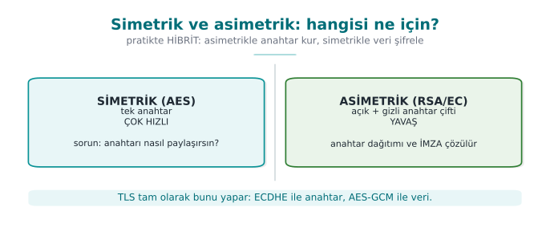

!!! note "A brief history: keys, certificates, and PKI"
    - **1976–77** — Diffie–Hellman and **RSA**: public-key cryptography solves the problem of "talking securely
      with someone you've never met."
    - **1988** — the **X.509** certificate format is standardized; identity is carried by a **CA signature**.
    - **1995** — the first commercial CAs (VeriSign) and **PKI** become widespread; the revocation mechanisms
      **CRL** and **OCSP** follow.
    - **2014** — **Heartbleed** and POODLE tighten the TLS ecosystem; **2015** **Let's Encrypt** makes HTTPS
      widespread with free certificates; **2018** TLS 1.3.
    - **2022–2024** — NIST selects the **post-quantum** algorithms (Kyber/ML-KEM, Dilithium/ML-DSA).

    All of this week's rules (the right mode, the right padding, chain validation, revocation) come from the
    painful lessons of this timeline.

### Five basic jobs, five tool families

| Job | Tool | Current choice | Abandoned |
| --- | --- | --- | --- |
| **Confidentiality** (symmetric) | Block and stream ciphers | AES-256-GCM, ChaCha20-Poly1305 | DES, 3DES, RC4, Blowfish |
| **Integrity + identity** (symmetric) | MAC | HMAC-SHA-256, CMAC, GCM's tag | CBC-MAC (variable-length), MD5-based MACs |
| **Fingerprint** | Hash function | SHA-256, SHA-384, SHA-3 | MD5, SHA-1 |
| **Key exchange** | Diffie–Hellman, RSA key transport | X25519, ECDHE (P-256) | 1024-bit DH, RSA key transport (removed in TLS 1.3) |
| **Signature** (asymmetric) | Digital signature | Ed25519, ECDSA P-256, RSA-PSS ≥ 3072 | DSA, RSA PKCS#1 v1.5 signature (in new designs) |

### Key length: security level

The key lengths of different algorithms cannot be compared directly. NIST SP 800-57 compares them at an
**equivalent security level** (in bits):

| Security level | Symmetric | Digest (collision resistance) | RSA / DH | Elliptic curve |
| --- | --- | --- | --- | --- |
| 112 bit | 3DES (legacy systems only) | SHA-224 | 2048 | 224 |
| **128 bit** | **AES-128** | **SHA-256** | **3072** | **256 (P-256, Ed25519/X25519)** |
| 192 bit | AES-192 | SHA-384 | 7680 | 384 |
| 256 bit | AES-256 | SHA-512 | 15360 | 512 |

Today, the floor for a new design is the **128-bit security level**. This means 3072 bits for RSA, 256 bits for
elliptic curve; 2048-bit RSA is not considered sufficient for new use after 2030 in NIST's transition timeline.
The table's most important lesson is that elliptic curves provide the same security with **much shorter** keys;
that is why they are preferred on mobile and embedded systems.

!!! info "Its counterpart in the book"
    The book covers algorithm and key-length selection in Recipes 5.2 and 5.3, digest and MAC selection in 6.3
    and 6.4, and public-key algorithm and length selection in 7.2 and 7.3. The principle it recommends still holds
    today: **choose a well-studied, standard algorithm and use it through a high-level, error-resistant API**
    (Recipe 5.16). Only the algorithms themselves have changed.


#### The weakest-link rule

A system uses more than one cryptographic layer: key exchange with one algorithm, data encryption with another.
The system's security level equals the **lowest** of these layers — not the strongest. If you transport a key
with RSA-2048 and encrypt the data with AES-256, the attacker doesn't try to break 256-bit AES; they target the
≈112-bit RSA layer. So evaluate the layers **together**, by the lowest level, not one at a time.

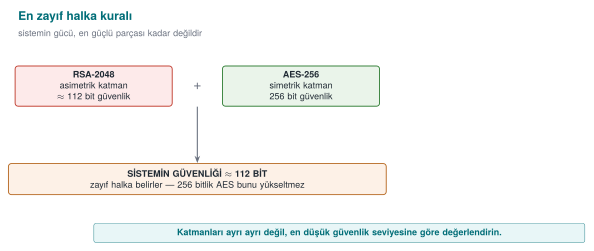

### One rule: don't write your own crypto — or your own protocol

Even if every algorithm is correct, combining them (choosing what order to encrypt and MAC in, where to get the
nonce from, how to separate the keys) requires a separate kind of expertise. All of this week's examples will
show that almost all real-world mistakes are **in the combination, not the algorithm**. Wherever possible, use
ready-made, proven constructions (TLS 1.3, AEAD, HPKE, Noise).

### Worked example: how big is the difference between "128 bit" and "112 bit"?

The bit counts in the table can stay abstract; let's make them concrete. A security level of "n bits" means the
attacker needs, on average, **2ⁿ⁻¹** attempted operations (2ⁿ is used as the upper bound). The difference between
RSA-2048 (112 bit) and AES-128 (128 bit) is far larger than it looks:

```text title="Hand calculation (exponential growth)"
2^112 ≈ 5,19 × 10^33   (RSA-2048's equivalent difficulty)
2^128 ≈ 3,40 × 10^38   (AES-128's key space)
2^128 / 2^112 = 2^16 = 65.536   → breaking AES-128 is 65.536 TIMES harder than breaking RSA-2048 at "equivalent" difficulty
```

Let's convert this into time. Let's take, as an **optimistic** upper bound, 10¹⁸ (quintillion; exascale supercomputer) operations per
second for today's fastest supercomputers — in real attacks this number is much lower, because breaking a cipher
is not a single arithmetic operation but a far more costly one. Still, let's calculate with the upper bound:

```text title="How long does 2^112 operations take at 10^18 operations/second?"
2^112 operations ÷ 10^18 operations/second ≈ 1,6 × 10^8 years  (≈ 165 million years)
Comparison: recorded human history ≈ 5.000 years → 165 million years is ~33.000 times that
2^128 operations ÷ 10^18 operations/second ≈ 1,08 × 10^13 years
Comparison: the age of the universe ≈ 1,38 × 10^10 years → 2^128 takes ~780 times the age of the universe
```

The lesson to draw has two parts. First, **even 112 bits cannot practically be brute-forced today**; the reason
RSA-2048 is considered "insufficient" for use after 2030 is not brute force, but (a) hardware getting cheaper
over time, (b) the need to protect data that must be kept for a long time with a **margin** against future
attacks, and (c) the fact that quantum computers will be able to break RSA far faster than brute force (see
Section 12). Second, the seemingly small difference between 112 bits and 128 bits (16 bits) cuts the attacker's
work down to **one in 65,536** — you must read bit counts **exponentially**, not linearly.

!!! danger "Common mistake: thinking it's enough to say 'we use AES'"
    Writing only the algorithm's name (`AES`) in an algorithm inventory says nothing. `AES-128-ECB` and
    `AES-256-GCM` are members of the same family but worlds apart in terms of security: one (ECB) leaks patterns
    (Section 2), the other (GCM) also provides integrity. In an algorithm inventory, **algorithm + mode + key
    length + the standard it rests on** must be written together (the book's Recipe 5.16 and this week's "S8"
    template in Section 13).

!!! success "Rule"
    Document a cryptographic choice not just by the algorithm's name, but by the **(algorithm, key length, mode,
    library, standard)** quintuple. "We use AES" is not an answer; "AES-256-GCM, OpenSSL EVP, NIST SP 800-38D" is.

[In Week 3](../week-3/cen429-week-3.md#2-encryption-fundamentals-which-tool-protects-what) we only saw the "which
tool do I use when" part of this map (AEAD, the hybrid scheme, random numbers).
This week we see **why** the same map is drawn this way — which mathematical problem gives which security, why
each algorithm was abandoned. The next two sections look inside the symmetric tools (mode, padding, MAC);
Sections 4–6 look inside the asymmetric tools (RSA, ECC, DH); Sections 7–10 will look at how these come together
in PKI.

---

## 2. Block cipher modes and padding (Recipe 5.4, 5.11)

AES is a **block cipher**: it turns exactly a 16-byte block into another 16-byte block. To encrypt a longer
message you need a **mode of operation** that chains the blocks together. The choice of mode is as important as
the choice of algorithm; recall [the ECB penguin from Week 3](../week-3/cen429-week-3.md#52-ecb-leaks-patterns).

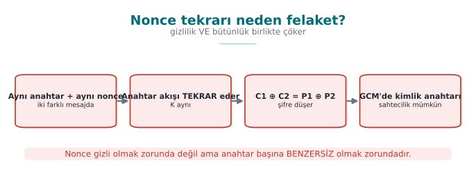

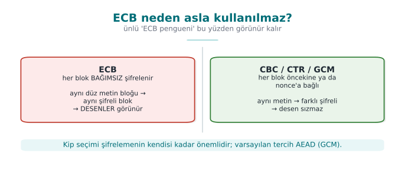

| Mode | How it works | Confidentiality | Integrity | Parallel | Padding | Assessment |
| --- | --- | :-: | :-: | :-: | :-: | --- |
| **ECB** | Each block is encrypted independently | ✗ (leaks patterns) | ✗ | ✓ | Required | **Do not use** |
| **CBC** | Each block is XORed with the previous ciphertext block | ✓ (if the IV is unpredictable) | ✗ | Decryption only | Required | With a separate MAC; watch for the padding oracle |
| **CTR** | A counter is encrypted to produce a keystream | ✓ (if the nonce is unique) | ✗ | ✓ | Not required | With a separate MAC |
| **GCM** | CTR + multiplication-based authentication | ✓ | ✓ | ✓ | Not required | **Recommended** (AEAD) |
| **ChaCha20-Poly1305** | Stream cipher + Poly1305 MAC | ✓ | ✓ | ✓ | Not required | **Recommended**; fast on devices without AES hardware support |

### Padding and the padding oracle

ECB and CBC require the message length to be a multiple of the block size; the missing part is filled in with
**padding**. The most common padding is PKCS#7: if the number of missing bytes is `n`, `n` bytes each with the
value `n` are appended (e.g., if 3 bytes are missing, `03 03 03`). The decrypting party reads the last byte and
drops that many bytes; but first it checks whether the padding is **valid**.

This is where the problem begins: if a decryption failure is **distinguishable** as "invalid padding" versus
"invalid MAC" (a different error message, a different response time), an attacker can change bytes of the
ciphertext and, by observing the server's reaction, decrypt the message byte by byte. This is called the
**padding oracle** attack; it was described in 2002, and it kept reappearing in the following years in web
frameworks and in TLS (POODLE, Lucky Thirteen).

Defences:

1. **Use AEAD** (GCM, ChaCha20-Poly1305): there is no padding; if the tag doesn't match, nothing is decrypted.
2. If CBC is mandatory, **encrypt first, then MAC** (next section) and verify the MAC **before checking the
   padding**.
3. Return all decryption errors as a **single, identical** error, in the same amount of time.

!!! note "How it's done in the field"
    In the algorithm inventory of a certified mobile payment library, AES is seen used in CBC and CTR modes with
    a separate SHA-256-based MAC; for the cryptogram computation of the payment schemes, a DES-based MAC
    algorithm resting on ISO/IEC 9797-1 (with the padding methods the schemes specify) is used. These choices
    come from scheme specifications that must be complied with. For internal communication that the scheme does
    not specify, AEAD is preferred today
    ([the critical reading from Week 3](../week-3/cen429-week-3.md#critical-reading-the-door-that-opens-silently-fail-open)).

### Worked example: tracing PKCS#7 padding by hand

Let's not leave the rule "if 3 bytes are missing, `03 03 03` is appended" abstract; let's trace it step by step
with a real OpenSSL run. Let's encrypt the 13-byte text `"MERHABA DUNYA"` with AES-128-CBC using a fixed 16-byte
key and an IV that counts up from zero (only for this example; in a real system the IV is generated randomly for
every message):

```bash title="Tracing PKCS#7 padding by hand (real output)"
K=00112233445566778899aabbccddeeff   # 16 bytes (32 hex characters) — fixed only for this demonstration
IV=000102030405060708090a0b0c0d0e0f  # 16 bytes — fixed only for this demonstration
printf 'MERHABA DUNYA' | openssl enc -aes-128-cbc -K "$K" -iv "$IV" -out cikti.bin
xxd -p cikti.bin
```

Output (the actually produced value):

```text
4b354371f98acde5bed95d59a8135538
```

The input was 13 bytes; AES's block size is 16 bytes; the output is also exactly **16 bytes** (32 hex characters)
— so a 3-byte padding was added. To see the padding's **content**, let's decrypt with `-nopad` (we would normally
never do this; here only for teaching purposes):

```bash
openssl enc -d -aes-128-cbc -K "$K" -iv "$IV" -in cikti.bin -nopad | xxd
```

```text
00000000: 4d45 5248 4142 4120 4455 4e59 4103 0303  MERHABA DUNYA...
```

The last three bytes are **`03 03 03`** — exactly as the PKCS#7 rule says: as many bytes as the missing count
(16 − 13 = 3) were added, each with that value. A normal `openssl enc -d` (without the no-padding flag)
automatically reads and drops these three bytes and returns exactly `"MERHABA DUNYA"` to you — verify this too:

```bash
openssl enc -d -aes-128-cbc -K "$K" -iv "$IV" -in cikti.bin
```

```text
MERHABA DUNYA
```

The padding oracle attack kicks in exactly at this point: the attacker changes the last bytes of the ciphertext
and sends it to the server; if the server returns "invalid padding" (e.g., the last byte is `07` but the
preceding 7 bytes are not `07`) and "padding valid but MAC invalid" as **different** errors, the attacker can
distinguish these two cases and reconstruct the plaintext byte by byte — without ever needing the key.

### Worked example: seeing why ECB leaks patterns

In ECB, every 16-byte block is encrypted **independently**; the same plaintext block always produces the same
ciphertext block. Let's encrypt a plaintext that repeats over 48 bytes ("AAAAAAAAAAAAAAAA" three times) with
AES-128-ECB:

```bash title="Repeating block in ECB = repeating ciphertext (real output)"
K2=$(openssl rand -hex 16)
printf 'AAAAAAAAAAAAAAAAAAAAAAAAAAAAAAAAAAAAAAAAAAAAAAAA' | head -c 48 > duz.txt   # 48 bytes = 3 blocks, all the same
openssl enc -aes-128-ecb -K "$K2" -in duz.txt -out cikti_ecb.bin -nopad
xxd cikti_ecb.bin
```

The output of an example run (since the key is random, you will see different byte values, but the **pattern
will stay the same**):

```text
00000000: f5cf 4879 d8fe 9c90 1975 2de6 eb9f 59a1  ..Hy.....u-...Y.
00000010: f5cf 4879 d8fe 9c90 1975 2de6 eb9f 59a1  ..Hy.....u-...Y.
00000020: f5cf 4879 d8fe 9c90 1975 2de6 eb9f 59a1  ..Hy.....u-...Y.
```

All three blocks are **identical**. Even an observer who doesn't know the key learns the information "these three
blocks contain the same plaintext" — which is often a leak in its own right (e.g., an image's background, a
form's fixed fields, a repeating record structure). If you repeat the same experiment with AES-128-CBC (with a
random IV), all three blocks come out **different**; because each block is chained by being XORed with the
previous one.

!!! danger "Common mistake: saying 'we used AES, so we're secure'"
    A call made in a codebase without specifying the mode (e.g., `Cipher.getInstance("AES")` in Java) can
    **silently fall back to ECB** depending on the library (in Java, the `"AES"` shorthand means
    `"AES/ECB/PKCS5Padding"`). This is a mistake that is easy to miss in code review but leaks real data in
    production. Rule: the mode must **always be written explicitly**, and calls using ECB must be rejected at the
    static-analysis/build stage.

!!! success "Rule"
    **Never** leave the mode name to the default; write it out with its full name, like `AES-256-GCM`. Never use
    ECB under any circumstances (file encryption, a DB field, even for "unimportant" data) — it always leaks the
    pattern. If CBC is mandatory, protect the padding with the encrypt-then-MAC rule from Section 3.

In [Week 2](../week-2/cen429-week-2.md#18-term-project-this-week-s4)'s threat modelling, "integrity" was an asset-protection goal; this section made concrete **why** that
goal cannot be achieved by encryption alone. The next section covers the tool that correctly provides integrity —
MAC/HMAC — and the right order for combining it.

---

## 3. MAC, HMAC, and combining integrity with encryption (Recipe 6.4, 6.10, 6.18, 6.21)

### How does HMAC work?

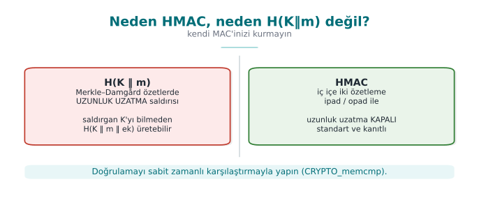

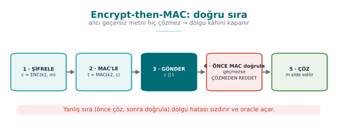

**Encrypt-then-MAC**: because the receiver never decrypts invalid ciphertext, the "error leak" that a padding
oracle needs never arises. AES-GCM does these two steps in a single operation.

A **MAC** (message authentication code) produces a short tag from a secret key and a message; someone who
doesn't know the key cannot produce a valid tag. **HMAC** is the standard way of building a MAC from a hash
function (SHA-256) (RFC 2104):

```text
HMAC(K, m) = H( (K ⊕ opad) ‖ H( (K ⊕ ipad) ‖ m ) )
```

The two nested digests remove the **length-extension** weakness of the plain `H(K ‖ m)` construction: in
Merkle–Damgård-structured digests like SHA-256, if `H(K ‖ m)` is known, `H(K ‖ m ‖ extra)` can be computed
without knowing the key. So **don't derive your own MAC from a digest**; use HMAC (the warning in Recipe 6.19).

```bash title="HMAC-SHA-256 with OpenSSL"
printf 'tutar=100;alici=TR00' | openssl dgst -sha256 -mac HMAC -macopt hexkey:$(openssl rand -hex 32)
```

### Three ways to combine encryption with a MAC

| Method | How? | Example | Assessment |
| --- | --- | --- | --- |
| **Encrypt-then-MAC** | Encrypt first, then take the MAC of the **ciphertext** | IPsec ESP, TLS's EtM extension | **The correct way**: the MAC is verified first; if invalid, the ciphertext is never decrypted |
| MAC-then-Encrypt | Take the MAC of the plaintext, encrypt both together | Old TLS (CBC modes) | Exposed to the padding oracle; avoid |
| Encrypt-and-MAC | Encrypt the plaintext, separately attach the MAC **of the plaintext** | Old SSH | The MAC can leak information about the plaintext; avoid |

AEAD modes make this choice correctly on your behalf. If you must do your own combination (Recipe 6.18): use
**two separate keys** (one for encryption, one for the MAC; both can be derived from a single secret with HKDF),
follow the encrypt-then-MAC order, include the IV and context information in the MAC as well, and make the
comparison constant-time.

### Replay: a valid but old message

A MAC proves that a message has **not been changed**, but not that it is **new**. An attacker can record a valid
"send 100 TL" message and resend it ten times; the MAC is valid every time. The defences the book describes in
Recipe 6.21:

| Method | How? | Note |
| --- | --- | --- |
| **Counter** | Every message carries a number larger than the previous counter; the receiver stores the last counter | Simplest and most reliable; the counter must be inside the MAC |
| **Timestamp** | The message must fall within a short validity window | Requires clock synchronization; needs an extra measure against repeats within the window |
| **Nonce** (one-time value) | The server gives a new value for every request, the client includes it in the MAC | The server remembers the values used |

!!! example "The counter in payments"
    In contactless card transactions, every transaction is signed with a cryptogram that contains the card's
    **transaction counter** (ATC); the server does not accept the same counter a second time. In mobile payment
    libraries, each one-time key is also used in only one transaction, and the counter is kept in a database.
    This is why the "rollback of the usage counter" threat has the asset-protection class **I+** in [Week 2](../week-2/cen429-week-2.md#18-term-project-this-week-s4)'s
    threat table.

### Worked example: computing HMAC by hand and seeing the avalanche effect

Without leaving the rules abstract, let's trace a real HMAC-SHA-256 computation end to end. Let's use a fixed
(only for this example) 32-byte key and compute the HMAC of a payment instruction:

```bash title="HMAC-SHA-256 (real output)"
ANAHTAR=0000000000000000000000000000000000000000000000000000000000000001   # 32 bytes, fixed only for this demonstration
printf 'tutar=100;alici=TR00' | openssl dgst -sha256 -mac HMAC -macopt hexkey:$ANAHTAR
```

```text
SHA2-256(stdin)= a08fb1159871e3b8110dedf3e3524cab7bea06f4795f2119394e11c42ac5f9a1
```

Now let the attacker change the amount from `100` to `900`; with the real key, the original message's HMAC
changes as follows:

```bash
printf 'tutar=900;alici=TR00' | openssl dgst -sha256 -mac HMAC -macopt hexkey:$ANAHTAR
```

```text
SHA2-256(stdin)= 8a786eacbef7863d44533b9ebcbcf288e5136204080258e838e283f1f91a46be
```

A single-character change (`1`→`9`) produced **completely different** 32 bytes for the tag — this is a good
hash function's "avalanche effect": a single-bit change in the input changes roughly half of the output. Since
the attacker doesn't know the key, they cannot change the message and produce a **valid** new tag; the receiver
compares the tags and catches the mismatch.

### Constant-time comparison: why `memcmp` is not enough

On the receiving side, HMAC verification requires **comparing** the computed tag with the tag that arrived. An
ordinary `memcmp(a, b, 32)` compares bytes left to right and **stops at the first differing byte**; this means
the function's running time varies depending on how many bytes matched. An attacker who can make enough attempts
over a network can guess the correct tag **byte by byte** from microsecond differences in response times (a
timing attack).

```c title="Incorrect and correct comparison"
/* WRONG: an early exit creates a timing difference */
if (memcmp(hesaplanan, gelen, 32) == 0) { /* accept */ }

/* CORRECT: constant-time, always walks through all 32 bytes */
if (CRYPTO_memcmp(hesaplanan, gelen, 32) == 0) { /* accept */ }   /* OpenSSL */
/* or: sodium_memcmp (libsodium), hmac.compare_digest (Python) */
```

!!! danger "Common mistake: comparing a MAC/tag with `==` or `memcmp`"
    If a comparison like `strcmp(hesaplanan_imza, gelen_imza) == 0` is seen in a web service's API signature
    verification code, this is not a theoretical but a **usable** timing-attack risk: with enough requests
    (thousands to tens of thousands), an attacker can discover the correct signature byte by byte. Rule: **no**
    secret-value comparison is ever done with an early-exit function.

!!! success "Rule"
    Always compare secret values such as a MAC, a signature, or a password hash with a constant-time function
    (`CRYPTO_memcmp`, `sodium_memcmp`, the language's own "constant-time compare" function). Don't write your own
    comparison function; this is another appearance of this week's "don't write your own crypto" rule (Section 1).

[In Week 3](../week-3/cen429-week-3.md#21-authenticated-encryption-aead-confidentiality-integrity-in-one-call) we
introduced AEAD as "the tool that gives confidentiality + integrity in a single package"; this
section showed the correct order and the correct comparison for when you are forced to provide integrity
**separately** (an old protocol where you can't use AEAD, a hardware constraint, etc.). The next section moves on
to the asymmetric tools that give what a MAC cannot — **non-repudiation**.

---

## 4. Asymmetric cryptography: RSA and elliptic curves (Recipe 7.1–7.3)

Symmetric cryptography's only difficulty is that the two parties must share the same key **in advance**. In
asymmetric (public-key) cryptography, each party has a **key pair**: a **public key** given to everyone, and a
**private key** known only to its owner. What is encrypted with the public key can only be decrypted with the
private key; what is signed with the private key can be verified by everyone with the public key.

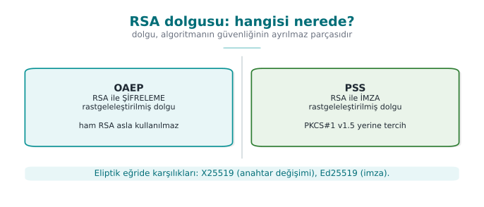

Asymmetric operations are hundreds, thousands of times slower than symmetric ones. This is why asymmetric
cryptography is used for only two jobs (Recipe 7.1): **carrying or agreeing on a short symmetric key** and
**signing**. The data itself is always protected with a symmetric cipher
([the hybrid scheme from Week 3](../week-3/cen429-week-3.md#22-symmetric-or-asymmetric-answer-both-hybrid)).

### RSA: with the right padding

RSA's mathematics in its plain form ("textbook RSA") is insecure: the same message always gives the same
ciphertext, and its mathematical structure is open to attacks. Secure use depends on the **correct padding
scheme**:

| Job | Correct scheme | Obsolete scheme | Why? |
| --- | --- | --- | --- |
| Encryption | **RSA-OAEP** (SHA-256) | PKCS#1 v1.5 encryption | Padding-oracle attacks against v1.5 encryption (since 1998, with recurring variants) |
| Signature | **RSA-PSS** | PKCS#1 v1.5 signature | v1.5 signing is still widespread and not broken, but PSS is the scheme with a security proof |

The book's "raw" RSA operations in Recipes 7.10–7.13 are there to help you understand how unpadded RSA works;
they are not used in production. The warning in Recipe 7.14 still matters, though: combining **sign-and-encrypt**
needs care; if the signature is not bound to the recipient and context of the encrypted content, the recipient
can re-encrypt the signed message and forward it to someone else.

```bash title="RSA-3072 with OpenSSL 3: key, OAEP encryption, PSS signature"
openssl genpkey -algorithm RSA -pkeyopt rsa_keygen_bits:3072 -out rsa_ozel.pem
openssl pkey -in rsa_ozel.pem -pubout -out rsa_acik.pem

# Encrypt a short session key with OAEP (SHA-256)
openssl rand -out oturum.key 32
openssl pkeyutl -encrypt -pubin -inkey rsa_acik.pem -in oturum.key -out oturum.enc \
    -pkeyopt rsa_padding_mode:oaep -pkeyopt rsa_oaep_md:sha256

# Sign and verify with PSS
openssl dgst -sha256 -sign rsa_ozel.pem -sigopt rsa_padding_mode:pss -out belge.sig belge.txt
openssl dgst -sha256 -verify rsa_acik.pem -sigopt rsa_padding_mode:pss -signature belge.sig belge.txt
```

### Elliptic curves: the same security, a shorter key

Elliptic-curve cryptography (ECC) provides the security level of 3072-bit RSA with a 256-bit key; its
operations are faster, and its keys and signatures are much shorter.

| Algorithm | Job | Note |
| --- | --- | --- |
| **Ed25519** | Signature | Deterministic (does not require a random number), fast, carefully designed against side channels |
| **X25519** | Key agreement | The default for protocols like TLS 1.3, SSH, Signal |
| ECDSA (P-256) | Signature | Widespread and standard; but requires a **unique and secret** random value on every signature |
| ECDH (P-256) | Key agreement | Widespread on FIPS-approved systems |

!!! danger "ECDSA and the random number"
    ECDSA uses a secret random value (`k`) on every signature. If the same `k` is used in two different
    signatures, or if it can be predicted, the **private key** can be computed from the two signatures. In 2010,
    a game console's signing key was exposed exactly this way because the manufacturer used the same `k` on every
    signature; in 2013, some mobile crypto wallets suffered the same kind of loss because of a weak random
    generator. This is the most striking proof of
    [Week 3's](../week-3/cen429-week-3.md#3-random-numbers-the-invisible-foundation-of-cryptography) sentence
    "random numbers are the invisible foundation
    of cryptography." Ed25519 and the deterministic ECDSA in RFC 6979 remove this risk.

```bash title="Ed25519 signature with OpenSSL 3"
openssl genpkey -algorithm ED25519 -out ed_ozel.pem
openssl pkey -in ed_ozel.pem -pubout -out ed_acik.pem
openssl pkeyutl -sign   -inkey ed_ozel.pem -rawin -in belge.txt -out belge.ed.sig
openssl pkeyutl -verify -pubin -inkey ed_acik.pem -rawin -in belge.txt -sigfile belge.ed.sig
```

### Worked example: measuring RSA-3072 against Ed25519

Let's confirm the sentence "ECC gives the same security with a smaller key" with real bytes. Both are at
~128-bit security level (see the table in Section 1):

```bash title="Measuring key and signature sizes (real output)"
wc -c rsa_acik.pem ed_acik.pem
openssl dgst -sha256 -sign rsa_ozel.pem -sigopt rsa_padding_mode:pss -out belge.rsa.sig belge.txt
openssl pkeyutl -sign -inkey ed_ozel.pem -rawin -in belge.txt -out belge.ed.sig
wc -c belge.rsa.sig belge.ed.sig
```

```text
  636 rsa_acik.pem
  116 ed_acik.pem
  384 belge.rsa.sig
   64 belge.ed.sig
```

The public key file (PEM, Base64-encoded) is **636 bytes** for RSA, **116 bytes** for Ed25519 — roughly 5.5
times smaller. The signature is **384 bytes** for RSA (3072 bits = 384 bytes; an RSA signature is exactly the
size of the modulus), **64 bytes** for Ed25519 — 6 times smaller. When you consider the data an IoT device sends
on every handshake, the number of certificates an embedded system stores in flash, or the number of signatures
carried by every transaction on a blockchain, this difference accumulates and grows; this is why ECC is the
default in mobile/embedded systems and in new protocols (TLS 1.3, SSH, Signal).

### Worked example: why is OAEP's randomness necessary?

In Section 2 we saw that ECB produces the same ciphertext for the same plaintext block, and that this is a
pattern leak. "Textbook RSA" (raw, unpadded) carries the same disease: the same message always produces the
same ciphertext. OAEP fixes this by mixing a **random** value into the message before encryption. Let's encrypt
the same message twice with OAEP:

```bash title="OAEP: same message, two different ciphertexts (real output)"
echo MERHABA > kisa.txt
openssl pkeyutl -encrypt -pubin -inkey rsa_acik.pem -in kisa.txt -out c1.bin \
    -pkeyopt rsa_padding_mode:oaep -pkeyopt rsa_oaep_md:sha256
openssl pkeyutl -encrypt -pubin -inkey rsa_acik.pem -in kisa.txt -out c2.bin \
    -pkeyopt rsa_padding_mode:oaep -pkeyopt rsa_oaep_md:sha256
cmp c1.bin c2.bin && echo "AYNI" || echo "FARKLI"
```

```text
c1.bin c2.bin differ: char 1, line 1
FARKLI
```

Same public key, same plaintext, but **different** ciphertext — because OAEP uses a new random value on every
encryption (the RSA counterpart of Section 1's "random numbers are the invisible foundation of cryptography"
principle). If you run the same experiment with unpadded ("raw") RSA, the two outputs come out **byte-for-byte
identical**; mathematically, `c = m^e mod n` is a deterministic operation. This is why raw RSA is never used
directly for encryption.

!!! danger "Common mistake: using an RSA key for both encryption and signing"
    Using the same RSA key pair for both "encrypt the data" and "sign the data" overloads two different
    mathematical operations onto the same key; in some attack scenarios (e.g., a signing request being turned
    into a decryption request by appearing to sign a carefully chosen "plaintext") this sharing can be abused.
    Rule: **a key's usage purpose is singular** — the certificate's `keyUsage` field (Section 8) enforces this
    too: `keyEncipherment` and `digitalSignature` are separate bits, and a single key should not carry both.

!!! success "Rule"
    Always use **OAEP** for encryption and **PSS** for signing; PKCS#1 v1.5 is only considered when compatibility
    with an old system is mandatory, and even then only for signing (never for new encryption designs). In a new
    design, prefer Ed25519/X25519 over RSA where possible.

[In Week 3](../week-3/cen429-week-3.md#9-data-in-transit-tls-13-certificate-validation-and-pinning) we used
asymmetric cryptography (RSA or ECDHE back then) as a black box in TLS's key setup. This
section opened up that black box: which padding, which curve, which size. The next section goes deeper into the
**signature** leg of these tools; then in Section 6 we move on to the **key exchange** leg.

---

## 5. Digital signature: creation, verification, and where it's used

A **digital signature** proves that a message (1) was created by the owner of a specific private key, and (2)
has not been altered afterward. Unlike a MAC, verification is done with the **public key**: anyone can verify,
but only the owner of the private key can sign. This is why a signature provides **non-repudiation** (the R in
STRIDE), a MAC does not.

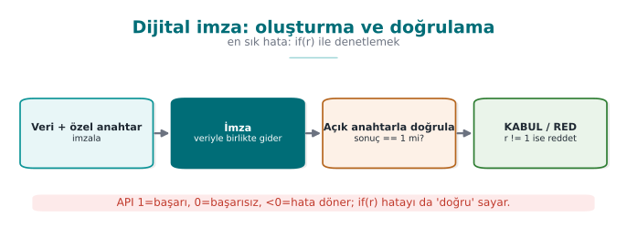

### Where are signatures used?

| Use | What is signed? | Where it appears in this course |
| --- | --- | --- |
| Software update | The update package | [Week 1's "Vault" example, threat T6](../week-1/cen429-week-1.md#9-worked-example-writing-a-protection-plan-step-by-step) |
| Code signing | Executable file, mobile app package | [Week 6 signature verification](../week-6/cen429-week-6.md#8-rootprivileged-environment-and-component-signature-verification) |
| Certificate | Public key + identity information (the CA signs) | PKI, this week |
| TLS handshake | Handshake digest (the server signs) | [Week 3's](../week-3/cen429-week-3.md#91-the-tls-13-handshake) `CertificateVerify` |
| Document and transaction | Contract, payment approval | Electronic-signature regulation |

### Verifying a signature in code: OpenSSL EVP

```c title="Verifying an Ed25519 signature (OpenSSL 3)"
#include <openssl/evp.h>
#include <openssl/pem.h>

/* 1: valid, 0: invalid, -1: error. Called BEFORE running the update package. */
int imza_dogrula(EVP_PKEY *acik, const unsigned char *veri, size_t n,
                 const unsigned char *imza, size_t imza_n)
{
    EVP_MD_CTX *ctx = EVP_MD_CTX_new();
    int sonuc = -1;
    if (ctx == NULL) return -1;
    if (EVP_DigestVerifyInit(ctx, NULL, NULL, NULL, acik) == 1)   /* Ed25519: digest is NULL */
        sonuc = EVP_DigestVerify(ctx, imza, imza_n, veri, n);      /* 1 or 0 */
    EVP_MD_CTX_free(ctx);
    return sonuc == 1 ? 1 : (sonuc == 0 ? 0 : -1);
}
```

!!! warning "The three traps of signature verification"
    1. **The return value:** `EVP_DigestVerify` returns 1 on success, 0 if the signature is invalid, and a
       negative value on error. A check like `if (sonuc)` treats **a negative error value as "valid."** The check
       must always be `== 1`.
    2. **What is signed:** If the signature only covers the package's content, an attacker can restore an
       **old and vulnerable** but validly signed package (a rollback). The version number and the target product
       must also be part of the signed content, and the client must reject an older version.
    3. **Which key:** Verifying the signature with a public key that comes **bundled inside the package itself**
       proves nothing. The verification key must be embedded in the application beforehand (with its own
       integrity protected) or come from a trusted chain.

### Worked example: tracing signature verification in three cases from the command line

You can see the logic of the C code above with `openssl pkeyutl -verify` too, without needing to compile — the
CLI produces the same three outcomes (valid / invalid / error):

```bash title="1) Correct document, correct signature"
openssl pkeyutl -verify -pubin -inkey ed_acik.pem -rawin -in belge.txt -sigfile belge.ed.sig
echo "cikis kodu: $?"
```

```text
Signature Verified Successfully
cikis kodu: 0
```

```bash title="2) Document changed, signature unchanged"
echo "MERHABA DEGISTI" > belge2.txt
openssl pkeyutl -verify -pubin -inkey ed_acik.pem -rawin -in belge2.txt -sigfile belge.ed.sig
echo "cikis kodu: $?"
```

```text
Signature Verification Failure
cikis kodu: 1
```

The moment a single byte of the document changed, verification **failed** and the exit code went from 0 to 1 —
if your update mechanism doesn't check this code (or if the C code interprets `EVP_DigestVerify`'s return with
`if (sonuc)`), you have made a tampered package **executable**.

### Rollback: the signature is valid but the content is old

Let's make the "scope of the signature" trap concrete. Suppose an application update server signs each version
separately:

| Version | Content | Signature |
| --- | --- | --- |
| v1.0 | (contains a known vulnerability) | `imza_v1` — still mathematically **valid** |
| v2.0 | closes the vulnerability | `imza_v2` — valid |

After the server publishes v2.0, v1.0's signature is **not revoked** — signatures do not have a revocation
mechanism like CRL/OCSP (the mechanism we will see for certificates in Section 10). If an attacker who has
obtained the v1.0 package presents it along with `imza_v1` to the client, the client only asks "is the signature
valid?", gets the answer **yes**, and installs the vulnerable version. This is why the signed data must not be
only the file's content, but the **version number + target product name**, and the client must additionally
enforce, **on its own**, the rule "do not accept a version older than the highest one I have seen" — the
signature does not do this for you.

!!! danger "Common mistake: only asking 'is it signed or not'"
    A client asking only a binary question like `is_signed(package)` (without asking which key, for which
    version, for which target it was signed) leaves the door open to rollback and **target confusion** attacks
    (a package signed for one product being presented for another).

!!! success "Rule"
    Signed data should always carry its **context**: version, target product/device, timestamp, or validity
    window. A client must ask not just "is this signature valid," but "is this signature valid **for this**
    context and for the **most current** version."

In [Week 1's "Vault" example](../week-1/cen429-week-1.md#9-worked-example-writing-a-protection-plan-step-by-step)
we saw that accepting an update package without a signature leads to the T6 threat;
this section showed that even the **existence** of a signature alone is not enough — its scope must also be
designed correctly. The next section covers how we use signatures and asymmetric cryptography in **key
exchange** — and what goes wrong if we don't.

---

## 6. Key exchange: Diffie–Hellman and man-in-the-middle (Recipe 8.16–8.18)

**Diffie–Hellman** (DH) lets two parties agree on a shared secret over an insecure channel, with no previously
shared secret at all. Each party picks a private value and sends the public value derived from it; both parties
compute the **same** shared secret from the other party's public value and their own private value. An
eavesdropper sees the public values but cannot compute the shared secret. Today's form of this is **ECDH** over
an elliptic curve (X25519).

### The weakness of unauthenticated DH: man-in-the-middle

DH does not say **who** you agreed with. An attacker in the middle of the channel performs DH **separately**
with each of the two parties:

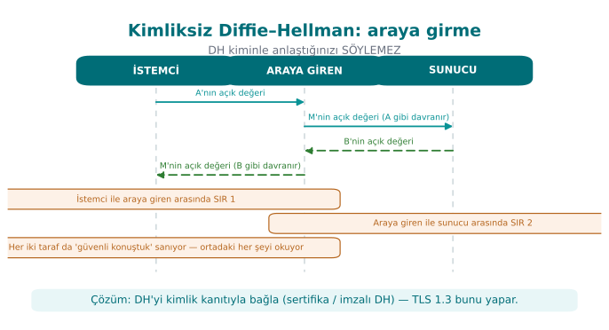

Both parties think "I have a secure channel"; in reality every message passes through the attacker's hands.

### The fix: authenticated key exchange

The public values are **signed** with a key whose identity is known in advance (the current version of Recipe
8.18's "DH and DSA together" idea: ECDHE + Ed25519/ECDSA/RSA-PSS). In TLS 1.3, the server signs the handshake
digest — which also includes the ephemeral ECDHE public value — with the private key in its certificate
(`CertificateVerify`); the client verifies the certificate by chain and by name
([Week 3](../week-3/cen429-week-3.md#92-the-three-layers-of-validation-and-the-most-dangerous-trap)). This way:

- **Identity:** The signature proves that whoever sent the public value really is the certificate's owner.
- **Forward secrecy:** DH values are freshly generated and discarded for every session; even if the long-lived
  signing key is stolen later, past sessions' keys cannot be computed
  ([Week 3](../week-3/cen429-week-3.md#71-forward-secrecy)).

!!! info "Identity without PKI"
    Not every scenario has a certificate authority. The "authentication without PKI" paths the book describes in
    Recipe 8.19 are still used today: learning the key on first connection and warning if it later changes
    (TOFU, SSH), verifying the key's fingerprint over a separate channel (the "safety number" comparison in
    secure messaging), or password-authenticated key exchange from a secret both parties shared in advance
    (PAKE, Recipe 8.15; today protocols like OPAQUE, SPAKE2).

### Worked example: two parties reaching the same secret with X25519

Let's confirm Diffie–Hellman's sentence "two parties reach the same shared value, without a previously shared
secret" with real keys. Alice and Bob each independently generate an X25519 key pair and exchange only their
**public** keys:

```bash title="X25519 key agreement: Alice and Bob (real output)"
openssl genpkey -algorithm X25519 -out alice.key
openssl genpkey -algorithm X25519 -out bob.key
openssl pkey -in alice.key -pubout -out alice.pub
openssl pkey -in bob.key -pubout -out bob.pub

# Alice: her own private key + Bob's public key
openssl pkeyutl -derive -inkey alice.key -peerkey bob.pub -out alice_sir.bin
# Bob: his own private key + Alice's public key
openssl pkeyutl -derive -inkey bob.key -peerkey alice.pub -out bob_sir.bin

xxd -p alice_sir.bin
xxd -p bob_sir.bin
cmp alice_sir.bin bob_sir.bin && echo "AYNI" || echo "FARKLI"
```

```text
8c53744a000c1a6ffc2183a0c134c2cf8167110314e8a06dd3d453080bbc1376
8c53744a000c1a6ffc2183a0c134c2cf8167110314e8a06dd3d453080bbc1376
AYNI
```

The two parties, without ever knowing each other's private key, reached the **same** 32-byte shared secret,
passing only public keys over the network. This shared secret is not used directly for data encryption; it is
passed through a KDF
([HKDF, the key-derivation topic from Week 3](../week-3/cen429-week-3.md#7-deriving-keys-from-a-master-secret-session-keys-and-forward-secrecy))
and session keys are derived from it. A
third-party eavesdropper sees only `alice.pub` and `bob.pub`; computing the shared secret from these (without
solving the elliptic-curve discrete logarithm problem) is not possible.

### Worked example: how many steps does a man-in-the-middle take to set up?

Man-in-the-middle against unauthenticated DH requires **two separate** DH agreements — the attacker's
computational load is no different from the victims', just twice the operations:

1. The attacker (M) connects to Alice and sends their own public value as `pub_M1`; Alice thinks this is Bob's
   public value.
2. M connects to Bob and sends `pub_M2`; Bob thinks this is Alice's public value.
3. M computes `sir_A = DH(özel_M1, pub_Alice)` with Alice and `sir_B = DH(özel_M2, pub_Bob)` with Bob — obtaining
   **two different** shared secrets.
4. Alice sends an encrypted message with `sir_A` to "Bob" (actually M); M decrypts it, reads it, re-encrypts it
   with `sir_B`, and forwards it to the real Bob. Both parties believe the secret they computed is shared with
   the **correct** other party.

The attacker's extra cost is only **twice the X25519 operations** (on the order of microseconds) — without
authentication, this attack is essentially free computationally. This is why unsigned DH is never used alone in
any modern protocol such as TLS 1.3.

!!! danger "Common mistake: using DH output directly as a key"
    Using the raw bytes produced by `pkeyutl -derive` (`alice_sir.bin` in the example above) directly as an AES
    key is a common mistake. Raw DH output is **not uniformly random** (it carries biases coming from the
    curve's mathematical structure) and produces a single key; whereas encryption and the MAC generally need
    **separate** keys (Section 3). Rule: always pass DH output through a KDF (HKDF-SHA-256) and derive as many
    keys as you need.

!!! success "Rule"
    Never trust an unauthenticated DH/ECDH result; public values must always be signed or must be part of a
    previously validated certificate (TLS 1.3's `CertificateVerify`). Never use raw DH output directly as an
    encryption key; pass it through HKDF.

In [Week 3's](../week-3/cen429-week-3.md#91-the-tls-13-handshake) TLS 1.3 handshake we asked "what would happen if
someone in the middle could swap the keys"; this
section answered that question with concrete steps. The next three sections (7–9) build, from scratch, the
identity infrastructure — PKI — that signed DH rests on.

---

## 7. Public key infrastructure (PKI): who trusts whom? (Recipe 10.1)

The previous section showed that public keys need to be bound to an identity through a signature. But this
raises a question: how do we know that a server's public key **really** belongs to that server? **Public key
infrastructure** (PKI) is the set of rules, roles, and documents that answers this question through trusted
third parties.

### Components

| Component | Role | Example |
| --- | --- | --- |
| **Certificate authority (CA)** | Issues a **certificate** by signing the public key of an identity-verified entity | Commercial and public CAs, an in-house CA |
| **Registration authority (RA)** | Verifies the identity of a certificate requester; tells the CA "issue a certificate to this person" | An organisation's HR department, an automated system that checks ownership of a domain (ACME) |
| **Root CA** | The self-signed CA at the top of the chain; usually kept offline | The roots in the operating system's and browsers' trust stores |
| **Intermediate CA** | A CA signed by the root that issues day-to-day certificates | So the root can stay offline |
| **Leaf certificate** | A certificate belonging to a server, a person, or a device | A TLS certificate for `sunucu.ornek` |
| **Trust store** | The list of trusted root certificates | The operating system's store, a store embedded in the application |
| **Revocation services** | Announce revoked certificates | CRL distribution point, OCSP responder |

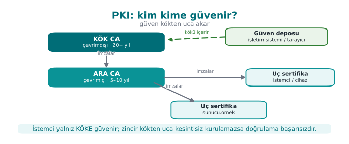

Why an intermediate CA? If the root CA's private key is compromised, the **entire** chain becomes untrusted, and
removing the root from every trust store in the world takes years. This is why the root key sits in an HSM,
offline, in a physically protected location, and is used only to sign intermediate CA certificates, in
controlled meetings called a key ceremony. The intermediate CA does the day-to-day work; if it is compromised,
only that intermediate CA is revoked.

### Validating a certificate: four questions (Recipe 10.4)

Before a client accepts a certificate, it asks the following:

1. **Chain:** Starting from the leaf certificate, is every certificate's signature verified with the one above
   it's public key, and does the chain reach a root in the trust store?
2. **Validity:** Are we within the validity dates of every certificate in the chain?
3. **Usage:** Was this certificate issued for this job? (The key usage and extended key usage fields; the
   `CA:TRUE` basic constraint on an intermediate CA.)
4. **Name and revocation:** Is the certificate for **this** server (SAN)? Has it been revoked?

In [Week 3](../week-3/cen429-week-3.md#10-wiring-up-tls-correctly-in-code-a-step-by-step-client-pinning-and-common-mistakes)
we saw how the first and fourth questions are asked in code (`SSL_CTX_set_verify`, `SSL_set1_host`).
In this section we build the same chain ourselves.

### Worked example: asking the "four questions" from the command line

Let's see how a client asks the "four questions" **concretely**, using the root → intermediate → server chain we
will build in Section 9 (if you don't have these three files yet, run Section 9 first; here we are only reading
the same files from different angles).

**Question 1 — Chain:** every certificate's `issuer` field must match, **exactly**, the `subject` field of the
one above it:

```bash
openssl x509 -in sunucu.crt -noout -issuer -subject
openssl x509 -in ara.crt    -noout -issuer -subject
openssl x509 -in kok.crt    -noout -issuer -subject
```

```text
issuer=CN=CEN429 Lab Ara CA     subject=CN=localhost
issuer=CN=CEN429 Lab Kok CA     subject=CN=CEN429 Lab Ara CA
issuer=CN=CEN429 Lab Kok CA     subject=CN=CEN429 Lab Kok CA
```

The chain reads: `sunucu`'s issuer = `ara`'s subject; `ara`'s issuer = `kok`'s subject; `kok`'s issuer is
**itself** (the root signs itself — which is why the chain stops here).

**Question 2 — Validity:**

```bash
openssl x509 -in sunucu.crt -noout -dates
openssl x509 -in sunucu.crt -noout -checkend 0
```

```text
notBefore=Sep 23 06:01:46 2026 GMT
notAfter=Dec 22 06:01:46 2026 GMT
Certificate will not expire
```

`-checkend 0` asks "will this expire within 0 seconds from now?"; TLS clients perform this check automatically
on every connection.

**Question 3 — Usage:**

```bash
openssl x509 -in sunucu.crt -noout -ext basicConstraints,keyUsage,extendedKeyUsage
openssl x509 -in ara.crt    -noout -ext basicConstraints,keyUsage
```

```text
X509v3 Basic Constraints: CA:FALSE
X509v3 Key Usage: critical / Digital Signature
X509v3 Extended Key Usage: TLS Web Server Authentication
---
X509v3 Basic Constraints: critical / CA:TRUE, pathlen:0
X509v3 Key Usage: critical / Certificate Sign, CRL Sign
```

`sunucu.crt` having `CA:FALSE` guarantees that this certificate **cannot sign another certificate** — even if
an attacker obtains this certificate's private key, they cannot use it to produce and sign a new certificate.
`ara.crt` is the opposite: `CA:TRUE` and `pathlen:0` (there can be no other intermediate CA below it, it can
only sign leaf certificates).

**Question 4 — Name:** the SAN field is already visible above via `-ext subjectAltName`
(`DNS:localhost, IP Address:127.0.0.1`); the client compares the name it connected to against this list
(covered in detail in Section 8).

A client library (OpenSSL, Windows CryptoAPI, Java's `X509TrustManager`) asks these four questions **on your
behalf**; disabling the `verify` functions
([Week 3's](../week-3/cen429-week-3.md#10-wiring-up-tls-correctly-in-code-a-step-by-step-client-pinning-and-common-mistakes)
`SSL_CTX_set_verify`) or swallowing errors means these four
questions are never asked at all.

!!! danger "Common mistake: assuming 'it connected, so it must be secure'"
    A developer's assumption that "the TLS connection was established, so the certificate must have been
    validated" is wrong. The connection is also established when validation has been **turned off**
    ([Week 3's](../week-3/cen429-week-3.md#the-most-common-tls-mistakes-in-real-applications)
    `SSL_VERIFY_NONE` / `InsecureSkipVerify` mistake). A successful connection is not proof that the four
    questions were **asked**; you must **separately** check in the code that validation is turned on.

!!! success "Rule"
    Explicitly set the validation mode (`SSL_VERIFY_PEER`, `CERT_REQUIRED`, etc.) when setting up a client
    library, and in a test, deliberately present an invalid certificate and verify that the connection is
    **rejected** — a test of "I can connect with a valid certificate" alone is not enough; you also need a test
    of "I cannot connect with an invalid certificate."

In the previous section we saw that signed DH proves "who I'm talking to" with a signature; this section
explained how we trust **whose** signature that is (PKI, the CA hierarchy). The next two sections look at the
**document itself** that carries this trust (the X.509 certificate) and at building it **by hand**.

---

## 8. The structure of an X.509 certificate

An X.509 v3 certificate consists of the **signed part** (TBSCertificate) and the CA's **signature** over that
part:

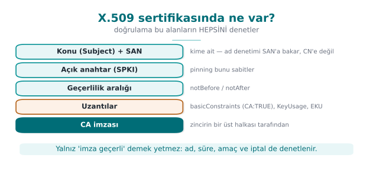

| Field | Meaning |
| --- | --- |
| Version | v3 (required for extensions) |
| Serial number | Unique within the CA; revocation lists use this number |
| Signature algorithm | e.g., `ecdsa-with-SHA256`, `sha256WithRSAEncryption` |
| Issuer | The name of the CA that signed the certificate |
| Validity | `notBefore` – `notAfter` |
| Subject | The certificate's owner |
| Subject public key info (SPKI) | Algorithm + public key; the [**pinning** from Week 3](../week-3/cen429-week-3.md#93-pinning-and-tofu) uses the digest of this |
| **Extensions** | Basic constraints (`CA:TRUE/FALSE`, path length), key usage, extended key usage (server/client authentication, code signing), **SAN** (alternative names: DNS names, IP), CRL distribution point, OCSP address (AIA) |

Certificates are stored in binary **DER** encoding, or in **PEM**, its Base64-wrapped text form (Recipe 7.16,
7.17): files starting with `-----BEGIN CERTIFICATE-----` are PEM.

!!! warning "Name checking is done against the SAN, not the CN"
    Older applications used to look for the server name in the subject's `CN` (Common Name) field. Today
    browsers and RFC 6125 look **only** at the **SAN** extension; a server certificate without a SAN is rejected
    by modern clients. Don't forget to add a SAN when generating your own certificates.

### Worked example: reading a real certificate field by field

Let's read the `openssl x509 -text` output of the `sunucu.crt` we will generate in Section 9, matching it
against every field in the table above (this is exactly the real output of the command
`openssl x509 -in sunucu.crt -noout -text`):

```text title="openssl x509 -in sunucu.crt -noout -text (real output)"
Certificate:
    Data:
        Version: 3 (0x2)
        Serial Number:
            35:e2:f6:8d:d2:e3:90:f3:74:ff:16:a9:ec:5f:07:e9:21:69:76:e7
        Signature Algorithm: ecdsa-with-SHA256
        Issuer: CN=CEN429 Lab Ara CA
        Validity
            Not Before: Sep 23 06:01:46 2026 GMT
            Not After : Dec 22 06:01:46 2026 GMT
        Subject: CN=localhost
        Subject Public Key Info:
            Public Key Algorithm: id-ecPublicKey
                Public-Key: (256 bit)
                ASN1 OID: prime256v1
                NIST CURVE: P-256
        X509v3 extensions:
            X509v3 Basic Constraints:
                CA:FALSE
            X509v3 Key Usage: critical
                Digital Signature
            X509v3 Extended Key Usage:
                TLS Web Server Authentication
            X509v3 Subject Alternative Name:
                DNS:localhost, IP Address:127.0.0.1
            X509v3 Subject Key Identifier:
                EA:59:FF:05:1B:BA:D2:ED:D3:B8:2D:CF:12:32:F6:52:27:CD:98:87
            X509v3 Authority Key Identifier:
                F5:BA:39:86:1F:A1:D0:79:C8:DA:83:7D:AE:2C:87:9D:56:45:CE:25
    Signature Algorithm: ecdsa-with-SHA256
    Signature Value:
        30:46:02:21:00:8e:a3:91:48:0a:d5:8a:9d:a7:ee:08:ae:27:...
```

Line by line: **Version 3** shows we can use the extension fields (the X509v3 block). The **Serial Number** is
unique among the certificates this CA has issued — when a certificate is revoked, this number is listed in the
CRL (Section 10). The **Issuer** (`CN=CEN429 Lab Ara CA`) tells you **who signed** this certificate — this is
where the answer to Section 7's "Question 1" lives. **Validity** is Section 7's "Question 2." The **Subject**
(`CN=localhost`) is the identity the certificate **claims** to belong to — but you must check the SAN before
trusting this claim (see above). **Subject Public Key Info** is the public key this certificate **validates**
itself (a point on the 256-bit P-256 curve). **Basic Constraints: CA:FALSE** is the answer to Section 7's
"Question 3": this certificate cannot sign another certificate. **Subject Alternative Name** is the answer to
Section 7's "Question 4." **Authority Key Identifier** is the fingerprint of the public key of the CA that
signed this certificate; the client uses it, while building the chain, to avoid the confusion of "a fake
intermediate certificate with the same issuer name but signed with a different key." At the bottom,
**Signature Value** is the signature produced over all these fields (the TBSCertificate) **with the CA's private
key** — exactly the signing mechanism we learned in Section 5.

### Worked example: how many bytes is a certificate?

```bash
openssl x509 -in sunucu.crt -outform DER | wc -c
wc -c sunucu.crt
```

The DER (binary) form is generally around 500–900 bytes (since curve-based keys are smaller than RSA); the PEM
form is roughly 33% larger than this because of Base64 encoding (Base64 turns every 3 binary bytes into 4 text
characters). In a TLS handshake, the certificate **chain** the server sends (leaf + intermediate) is the sum of
these sizes; this is why a chain using RSA-3072 certificates can be **many times larger** than an ECC
(P-256/Ed25519) chain — the reflection, in PKI, of Section 4's size comparison.

!!! danger "Common mistake: trusting the `CN` in `Subject`"
    The `Subject: CN=localhost` field is only a **claim**; the CA signed the certificate because it verified
    this claim, but the client must perform **name checking** against the SAN, not this field (see the warning
    box above). Old code samples and some teaching materials still show code that looks at the CN; this is an
    approach abandoned with RFC 6125.

!!! success "Rule"
    When inspecting a certificate by hand, always use `openssl x509 -noout -text` (or `-ext subjectAltName`) and
    read the **SAN, validity, basicConstraints, and issuer/subject chain** quartet (Section 7) together; don't
    look at a single field and decide.

Section 7 explained the **trust a certificate carries**; this section showed **in which bytes** that trust is
encoded. The next section switches to the CA's role and **builds this document by hand**.

---

## 9. Building a certificate chain with OpenSSL

The steps below build a three-layer chain in your own lab. All files are created in the working folder; **never
add the root certificate to any trust store**.

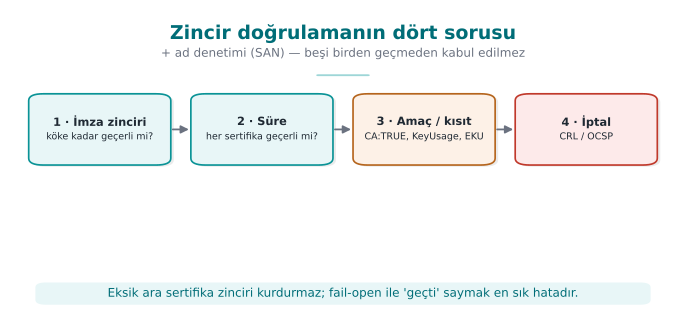

```bash title="1. Root CA (self-signed)"
openssl genpkey -algorithm EC -pkeyopt ec_paramgen_curve:P-256 -out kok.key
openssl req -x509 -new -key kok.key -sha256 -days 3650 -out kok.crt \
  -subj "/CN=CEN429 Lab Kok CA" \
  -addext "basicConstraints=critical,CA:TRUE" \
  -addext "keyUsage=critical,keyCertSign,cRLSign"
```

```bash title="2. Intermediate CA (signed by the root, path length 0: no CA can exist beneath it)"
openssl genpkey -algorithm EC -pkeyopt ec_paramgen_curve:P-256 -out ara.key
openssl req -new -key ara.key -out ara.csr -subj "/CN=CEN429 Lab Ara CA"
openssl x509 -req -in ara.csr -CA kok.crt -CAkey kok.key -CAcreateserial -days 1825 -sha256 \
  -out ara.crt -extfile <(printf "basicConstraints=critical,CA:TRUE,pathlen:0\nkeyUsage=critical,keyCertSign,cRLSign")
```

```bash title="3. Server certificate (signed by the intermediate CA, with SAN)"
openssl genpkey -algorithm EC -pkeyopt ec_paramgen_curve:P-256 -out sunucu.key
openssl req -new -key sunucu.key -out sunucu.csr -subj "/CN=localhost"
openssl x509 -req -in sunucu.csr -CA ara.crt -CAkey ara.key -CAcreateserial -days 90 -sha256 \
  -out sunucu.crt -extfile <(printf "basicConstraints=CA:FALSE\nkeyUsage=critical,digitalSignature\nextendedKeyUsage=serverAuth\nsubjectAltName=DNS:localhost,IP:127.0.0.1")
```

```bash title="4. Verify and inspect"
openssl verify -CAfile kok.crt -untrusted ara.crt sunucu.crt      # sunucu.crt: OK
openssl x509 -in sunucu.crt -noout -text | less                    # inspect the fields
openssl verify -CAfile kok.crt sunucu.crt                          # without the intermediate: ERROR (chain incomplete)
```

!!! tip "On Windows"
    The `<( ... )` process-substitution syntax is specific to Bash. On Windows PowerShell, write the extensions
    to a file (`ara.ext`, `sunucu.ext`) and pass it as `-extfile ara.ext`; the rest of the commands are the same.

The last command producing an error is instructive: a client can only build the chain if the intermediate
certificate is also presented. Servers sending only the leaf certificate and forgetting the intermediate is a
configuration mistake commonly seen in the field.

### Class activity: breaking the chain

Note the `openssl verify` output at every step:

1. Sign the server certificate with the **root** but leave the intermediate CA in the chain. What changes?
2. Produce the intermediate CA with `CA:FALSE` and sign the server certificate with it. What does validation
   say?
3. Produce a certificate that expires immediately with `-days 0`.
4. Set the SAN to `DNS:baska.ornek` and try it with `openssl s_client -verify_hostname localhost`.

### Worked example: solving two scenarios of the class activity from start to finish

Let's solve the first two of the four scenarios above together; you will complete scenarios 3 and 4 yourself.

**Scenario 1 — Signing the server certificate directly with the root (skipping the intermediate CA):**

```bash
openssl x509 -req -in sunucu.csr -CA kok.crt -CAkey kok.key -CAcreateserial -days 90 -sha256 \
  -out sunucu_kok.crt -extfile sunucu.ext
openssl verify -CAfile kok.crt -untrusted ara.crt sunucu_kok.crt
```

```text
sunucu_kok.crt: OK
```

This may be surprising: even though we also supplied `ara.crt`, validation **passed**, because OpenSSL could
build the chain from `sunucu_kok.crt` **directly** to `kok.crt`; `ara.crt` was never used on this path, it just
sat in the pool as an available candidate. The lesson here is **operational, not cryptographic**: mathematically,
the root CA can directly sign any certificate it wants. But we **must not do this**, because if the root CA's
private key sits on a system used every day (the "why an intermediate CA" explanation in Section 7), the risk of
compromise increases and the whole chain collapses.

**Scenario 2 — Producing the intermediate CA with `CA:FALSE`:**

```bash
printf "basicConstraints=critical,CA:FALSE\nkeyUsage=critical,keyCertSign,cRLSign\n" > ara_yanlis.ext
openssl x509 -req -in ara.csr -CA kok.crt -CAkey kok.key -CAcreateserial -days 1825 -sha256 \
  -out ara_yanlis.crt -extfile ara_yanlis.ext

openssl x509 -req -in sunucu.csr -CA ara_yanlis.crt -CAkey ara.key -CAcreateserial -days 90 -sha256 \
  -out sunucu_yanlis.crt -extfile sunucu.ext

openssl verify -CAfile kok.crt -untrusted ara_yanlis.crt sunucu_yanlis.crt
```

```text
CN=CEN429 Lab Ara CA
error 79 at 1 depth lookup: invalid CA certificate
error sunucu_yanlis.crt: verification failed
```

This time validation was **rejected** — because `ara_yanlis.crt`'s `basicConstraints` is `CA:FALSE`, even
though the mathematical signature is correct, OpenSSL sees that this certificate has **no authority to sign
another certificate** and treats the chain as invalid at "depth 1" (the middle layer). This is proof that the
`Basic Constraints` field from Section 8 is an extension that **actually changes behaviour** — not a fancy text
field.

Compare Scenario 1 with Scenario 2: both build a "wrong" chain, but one (**signing directly with the root**) is
cryptographically valid and only an operational mistake; the other (**signing with `CA:FALSE`**) is rejected at
the protocol level. When an evaluator inspects your PKI setup, this is exactly the distinction they look for:
"does the chain technically work" and "does the chain follow the design rules" are two separate questions.

---

## 10. Certificate revocation: CRL, OCSP, and stapling (Recipe 10.10–10.12)

If a certificate's private key is stolen, or the certificate was issued incorrectly, it must be **revoked**
before its validity period expires. There are three ways for the client to learn this:

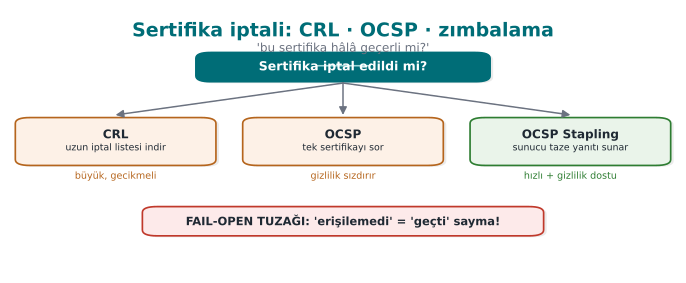

| Method | How? | Pro | Con |
| --- | --- | --- | --- |
| **CRL** (revocation list) | The CA regularly publishes a signed list of revoked serial numbers | Simple, can be cached offline | The list grows; a revocation is not noticed within the update interval |
| **OCSP** | The client asks the CA's responder "is this serial number valid?" | Instant | Latency, privacy (the CA learns which site was visited), what happens if the responder is unreachable? |
| **OCSP stapling** | The server attaches a fresh OCSP response for its own certificate to the handshake | Privacy and speed | Requires server configuration |

```bash title="Revocation and CRL check with the lab CA (summary)"
# producing a CRL with the intermediate CA requires 'openssl ca' configuration; then:
openssl ca -config ara.cnf -revoke sunucu.crt
openssl ca -config ara.cnf -gencrl -out ara.crl
openssl verify -crl_check -CAfile kok.crt -untrusted ara.crt -CRLfile ara.crl sunucu.crt   # "certificate revoked"
```

!!! danger "Soft-fail"
    Most browsers **accept** a certificate when they cannot reach the OCSP responder; otherwise a brief outage of
    the responder would make every site unreachable. But this means an attacker in the middle can bypass
    revocation checking simply by blocking the OCSP request: the PKI counterpart of
    [Week 3's](../week-3/cen429-week-3.md#critical-reading-the-door-that-opens-silently-fail-open) **fail-open**
    pattern. In critical applications, "a stapled response is mandatory" (OCSP Must-Staple) or short-lived
    certificates (days, weeks) reduce this problem; this is why certificate lifetimes are getting shorter and
    shorter.

### Worked example: revoking a certificate and validating it against a CRL (end to end)

Let's trace the full version of the "summary" commands above, actually run, step by step. First, the minimal
database and configuration file that `openssl ca` needs is set up (this is a heavily scaled-down version of a
real CA):

```bash title="1. Setting up a minimal CA database"
mkdir -p demoCA/newcerts
touch demoCA/index.txt          # the "ledger" where every issued/revoked certificate is recorded
echo 1000 > demoCA/crlnumber    # the next CRL's version number
echo 1000 > demoCA/serial       # the next certificate's serial number
```

```ini title="ara.cnf"
[ ca ]
default_ca = ara_ca

[ ara_ca ]
dir              = demoCA
database         = $dir/index.txt
new_certs_dir    = $dir/newcerts
certificate      = ara.crt
private_key      = ara.key
serial           = $dir/serial
crlnumber        = $dir/crlnumber
default_md       = sha256
default_days     = 90
default_crl_days = 30
policy           = policy_any
email_in_dn      = no

[ policy_any ]
commonName = supplied
```

```bash title="2. Revoke, generate CRL, verify (real output)"
openssl ca -config ara.cnf -revoke sunucu.crt
```

```text
Using configuration from ara.cnf
Adding Entry with serial number 35E2F68D...76E7 to DB for /CN=localhost
Revoking Certificate 35E2F68D...76E7.
Database updated
```

```bash
openssl ca -config ara.cnf -gencrl -out ara.crl
openssl verify -crl_check -CAfile kok.crt -untrusted ara.crt -CRLfile ara.crl sunucu.crt
```

```text
CN=localhost
error 23 at 0 depth lookup: certificate revoked
error sunucu.crt: verification failed
```

Step by step, what happened: (1) `-revoke` recorded the certificate's **serial number** (Section 8's
`Serial Number` field — here `35E2F68D...76E7`) as "revoked" in the `index.txt` ledger; the certificate itself
was not changed or deleted in any way — only a **record** was added. (2) `-gencrl` collected all the revocation
records in this ledger and produced a list (`ara.crl`) **signed with the intermediate CA's own private key** —
the CRL itself is also a signed document, protected against forgery by the same mechanism from Section 5.
(3) With `-crl_check`, validation now checked not only the chain but also the CRL, saw that the serial number
was on the list, and rejected it with the **"certificate revoked"** error — even though the certificate's
validity date has not yet expired.

This is the complete solution to Exercise 6; repeat the same steps in your own lab and inspect the contents of
`index.txt` (`cat demoCA/index.txt`) — every line carries a certificate's record (status, date, serial number,
subject name).

### Worked example: how big does a CRL get?

If a CA issues 10,000 certificates a year and 1% of them (100) are revoked, since every CRL entry carries
~40–60 bytes (serial number + revocation date + reason code), the CRL size is ~4–6 KB — that looks small. But
for a large public CA (millions of certificates, hundreds of thousands of revocations), the CRL can reach
**tens of megabytes**; every client downloading this periodically is not practical. OCSP solves this scaling
problem by "asking a single question" instead of "downloading the entire list" — but then the privacy and
availability trade-off above reappears.

!!! danger "Common mistake: testing revocation checking only in a development environment and taking it to production as-is"
    A client written without `-crl_check` (or the OCSP equivalent) turned on accepts, without any problem, a
    certificate that has not expired but **has been revoked**. Because a CRL/OCSP server is usually not set up
    in a test environment, this mistake is easy to overlook, and it is carried into production "with revocation
    checking off." Rule: make revocation checking an **explicit configuration option**, and confirm on your
    deployment checklist that it is turned on.

!!! success "Rule"
    The shorter a certificate's lifetime, the less you need a revocation mechanism — this is why the industry
    (Let's Encrypt and similar) is moving toward shortening certificate lifetimes. If you use long-lived
    certificates, **make sure** to enable and test CRL or OCSP stapling.

In Section 9 we learned to **build** a chain; in this section we learned to **invalidate** one link in a chain.
The next section covers how we protect the most valuable piece of this chain — the private keys themselves.

---

## 11. Storing the key in hardware: HSM, PKCS#11, and SoftHSM

A stolen private key destroys all of PKI's guarantees. This is why valuable keys (CA keys, payment keys, code
signing keys) are generated inside **hardware security modules** (HSM) and never leave them. The application
never sees the key; it tells the HSM "sign this with that key."

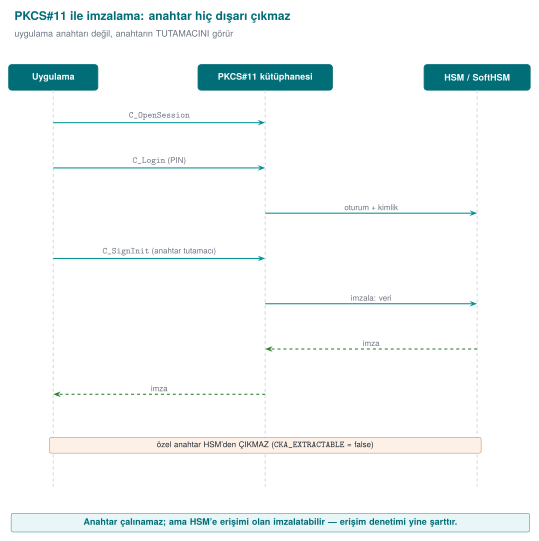

| Concept | Explanation |
| --- | --- |
| **HSM** | Tamper-resistant, certified (FIPS 140-3, Common Criteria) hardware; does not export the key |
| **PKCS#11** (Cryptoki) | The standard C API for accessing HSMs, smart cards, and cryptographic tokens |
| **Object and attributes** | Keys are marked "not exportable" with attributes such as `CKA_SENSITIVE`, `CKA_EXTRACTABLE=false` |
| **Session and PIN** | The application opens a session to a slot and authenticates with the user's PIN |
| **SoftHSM** | An open-source HSM simulation that provides the PKCS#11 interface in software; for development and testing |

```bash title="Generating and listing a key with SoftHSM (WSL/Linux)"
export SOFTHSM2_CONF=$PWD/softhsm2.conf
mkdir -p belirtecler && echo "directories.tokendir = $PWD/belirtecler" > softhsm2.conf
softhsm2-util --init-token --free --label "cen429" --pin 1234 --so-pin 5678
pkcs11-tool --module /usr/lib/softhsm/libsofthsm2.so --login --pin 1234 \
            --keypairgen --key-type EC:prime256v1 --label imza-anahtari
pkcs11-tool --module /usr/lib/softhsm/libsofthsm2.so --login --pin 1234 --list-objects
```

!!! warning "SoftHSM is not an HSM"
    SoftHSM stores keys on disk, in a file; there is no hardware protection. Its value is that it lets you write
    your application **against the PKCS#11 interface**: the same code connects, in production, to a real HSM or
    smart card just by changing the module path. We will look at software-based security modules again from this
    angle in [Week 11](../week-11/cen429-week-11.md#5-wbcs-place-in-layered-defence).

!!! note "How it's done in the field"
    In payment systems, the keys at the top of the key hierarchy (the card issuer's master keys, the keys that
    generate device keys) sit in HSMs on the server side; in the mobile payment platform's back end, the HSM
    appears as a separate component in the architecture diagram
    ([the example architecture from Week 1](../week-1/cen429-week-1.md#9-worked-example-writing-a-protection-plan-step-by-step)).
    The keys
    that land on the phone are generated on the server with an HSM, encrypted for binding to the device, and the
    library itself never **generates** an account key. The guide contains an algorithm inventory that lists every
    algorithm it uses together with the standard it rests on (NIST FIPS, ISO/IEC 9797-1, EMV specifications).

### End to end: how is a signing request processed inside an HSM?

Let's make the sentence "the key never leaves" concrete. The PKCS#11 standard (OASIS Cryptoki v3) defines the
following steps for an application to have an HSM sign something **without ever sending or receiving a raw key
byte**:

1. **Open a session:** The application connects to a "slot" in the HSM with `C_OpenSession`.
2. **Authenticate:** The PIN is sent with `C_Login`; if the PIN is **wrong**, the HSM locks itself after a
   certain number of attempts (hardware-level protection against brute force — an easy safeguard to forget in
   software).
3. **Find the key:** The **handle** of a previously generated key object (a reference number inside the HSM, not
   the key itself) is obtained with `C_FindObjectsInit` / `C_FindObjects`.
4. **Sign:** The call `C_SignInit` + `C_Sign(handle, data, …)` sends the data to the HSM; the HSM processes the
   data with the key **inside itself** and returns only the **signature**. The private key's bytes **never**
   enter the application code's memory at any point.
5. **Close the session:** `C_Logout` / `C_CloseSession`.

```c title="The shape of the PKCS#11 C_Sign call (OASIS Cryptoki v3, reference)"
CK_RV C_Sign(
    CK_SESSION_HANDLE hSession,   /* open session */
    CK_BYTE_PTR       pData,      /* data to be signed */
    CK_ULONG          ulDataLen,
    CK_BYTE_PTR       pSignature, /* output buffer filled by the HSM: only the signature, not the key */
    CK_ULONG_PTR      pulSignatureLen
);
```

Compare this flow with an ordinary OpenSSL call (`EVP_DigestSign`, Section 5): both **interfaces** carry the
same idea ("give the data, get the signature"), but in OpenSSL the key (if read from a file) **sits in process
memory**; in PKCS#11 the key **never** enters the application's address space. Moving Section 5's
`imza_dogrula` function to an HSM only means routing the signing side to a `C_Sign` call — the **verification**
side already only needs the public key, so it does not need the HSM.

### Why is `CKA_EXTRACTABLE` the most critical attribute?

When a PKCS#11 key object is generated (`C_GenerateKeyPair`), the attributes `CKA_EXTRACTABLE=false` and
`CKA_SENSITIVE=true` are given **at key-generation time** and **cannot be changed afterward**. These two flags
prevent, **at the hardware level**, the HSM from ever giving out the key in plaintext, even if a function like
`C_WrapKey` is called.

!!! danger "Common mistake: generating a key with default attributes"
    Some PKCS#11 libraries and tools leave `CKA_EXTRACTABLE` as **true** unless explicitly specified (for
    compatibility). In this case, even though the key is technically generated in an HSM, someone with the right
    permissions can **export** it — the assurance "we use an HSM" becomes an empty sentence. In code review, look
    for `CKA_EXTRACTABLE = CK_FALSE` being given **explicitly** in the attribute template of the
    `C_GenerateKeyPair` call.

!!! success "Rule"
    When generating a valuable key (a CA root key, a code-signing key, a payment master key), `CKA_EXTRACTABLE=false`
    and `CKA_SENSITIVE=true` must be explicitly set, and right after generation you must **verify** with
    `pkcs11-tool --list-objects` (or its equivalent) that these attributes were actually applied — don't trust
    the default.

We will look again, in [Week 11](../week-11/cen429-week-11.md#5-wbcs-place-in-layered-defence), at software-based
security modules (structures like the Secure Enclave/TEE on
mobile devices) through the PKCS#11 logic of this section; the principle you learned here — "work through a
handle, never move the raw key" — is the foundation of that entire discussion. The next and final technical
section looks at why the RSA/ECC we consider secure today needs to change in the future.

---

## 12. A look at post-quantum cryptography

A sufficiently large quantum computer can efficiently solve the mathematical problems RSA and elliptic curves
rest on (factoring, discrete logarithm). Such a computer does not exist yet; but the idea that encrypted traffic
recorded today could be decrypted years from now ("harvest now, decrypt later") puts the transition on the
agenda starting today.

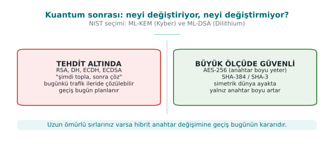

| Item | What's changing? |
| --- | --- |
| Symmetric ciphers and digests | Limited impact: AES-256 and SHA-384/512 are considered sufficient |
| Key agreement | NIST standardized **ML-KEM** (FIPS 203) in 2024; **hybrid** use alongside X25519 is becoming widespread in TLS |
| Signature | The **ML-DSA** (FIPS 204) and **SLH-DSA** (FIPS 205) standards have been published |
| Timeline | NIST's transition plan foresees phasing out RSA and elliptic-curve algorithms after 2030 |

For this course's project, the practical outcome is a single sentence: **crypto agility**. Don't hard-code
algorithm names everywhere in your code; use formats that carry a key version and algorithm identifier (the key
version field from [Week 3](../week-3/cen429-week-3.md#8-dynamic-key-management-lifecycle-hierarchy-and-renewal)),
so that when the algorithm changes, only configuration and re-encryption are
needed.

### Worked example: generating post-quantum keys today

OpenSSL 3.5 supports the standardized post-quantum algorithms **directly**; you can generate them today, on
your own machine, and compare their sizes with classical algorithms:

```bash title="ML-KEM-768 (key agreement) and ML-DSA-65 (signature) — real output"
openssl genpkey -algorithm ML-KEM-768 -out mlkem.pem
openssl pkey -in mlkem.pem -pubout -out mlkem_pub.pem
wc -c mlkem_pub.pem

openssl genpkey -algorithm ML-DSA-65 -out mldsa.pem
openssl pkey -in mldsa.pem -pubout -out mldsa_pub.pem
echo hello > belge.txt
openssl pkeyutl -sign -inkey mldsa.pem -rawin -in belge.txt -out belge.mldsa.sig
wc -c mldsa_pub.pem belge.mldsa.sig
openssl pkeyutl -verify -pubin -inkey mldsa_pub.pem -rawin -in belge.txt -sigfile belge.mldsa.sig
```

```text
1714 mlkem_pub.pem
2770 mldsa_pub.pem
3309 belge.mldsa.sig
Signature Verified Successfully
```

Compare with the table in Section 4:

| Algorithm | Public key (PEM, bytes) | Signature (bytes) | Security basis |
| --- | --- | --- | --- |
| Ed25519 (classical) | 116 | 64 | Elliptic-curve discrete logarithm |
| RSA-3072 (classical) | 636 | 384 | Factoring |
| **ML-DSA-65** (PQC) | **2,770** | **3,309** | Lattice-based problem (Module-LWE) |
| ML-KEM-768 (PQC, key agreement) | **1,714** | — | Lattice-based problem (Module-LWE) |

The difference is striking: ML-DSA-65's public key is **~24 times** larger than Ed25519's, and its signature is
**~52 times** larger. This shows that the move to PQC is not just "changing an algorithm name" — many places,
such as the TLS handshake, certificate size, and the number of network packets, must account for this growth.
NIST's recommended **hybrid** approach for TLS (like `X25519MLKEM768`, the version of Section 6's X25519
agreement run together with PQC) exists precisely to manage this transition cost: classical and PQC keys are
used **at the same time**; if the classical side is broken, PQC still protects; if the PQC side (new,
not-yet-proven math) is broken, the classical side keeps protecting.

### Why lattice problems? A short intuition

RSA's security rests on "the difficulty of factoring a large number," ECC's security rests on "the difficulty of
taking a discrete logarithm on a curve" — Shor's algorithm efficiently solves **both** on a sufficiently large
quantum computer. ML-KEM and ML-DSA instead rest on **lattice** problems: in a multi-dimensional space, in a
structure formed by regularly spaced points (a lattice), "finding the lattice point closest to a given point" or
"solving a system of equations with small error terms" (Learning With Errors, LWE) is computationally very hard
at high dimensions, and **so far**, no efficient solution has been found for either classical or quantum
computers. "Not having been found so far" does not mean "will never be found" — which is why the hybrid approach
is recommended.

!!! danger "Common mistake: saying 'there's no quantum computer yet, no rush'"
    Traffic encrypted and recorded today with RSA/ECC (e.g., an intelligence record, a long-term medical record,
    a government document that must stay confidential for 20–30 years) can be recorded today and decrypted once a
    quantum computer matures, under the "harvest now, decrypt later" strategy. For a system with a
    confidentiality window of 10–20 years, the transition decision must be made **today**, not once a quantum
    computer exists.

!!! success "Rule"
    If you are designing a new protocol, support a **hybrid** (classical + PQC) key agreement from now on where
    possible, or at least, with the crypto-agility principle from Section 1 (formats carrying an algorithm
    identifier/version), make a future transition to PQC possible **without a rewrite**.

This section was the **final stop** on the map we drew in Section 1: which algorithm, which problem, how secure,
until when. From Section 13 onward you pour this knowledge into your own project's algorithm inventory.

---

## 13. Term project: this week

Draft the **S8** and **S11** sections expected at the final checkpoint:

- [ ] **S8 — Algorithm inventory:** for every algorithm used in your project, its purpose, key length, mode, the
      standard it rests on, and the library. If the table contains an obsolete algorithm, give its justification
      and a migration plan.
- [ ] **S8 — Key lifecycle table:** for every key, where it is generated, where it is stored, its crypto-period,
      and its renewal and destruction
      ([Week 3](../week-3/cen429-week-3.md#8-dynamic-key-management-lifecycle-hierarchy-and-renewal)).
- [ ] **S11 — Secure communication:** TLS version and validation; if pinning is used, the SPKI and backup pin;
      message-level protection.
- [ ] If your project has an update or configuration file, add **signature verification** (Ed25519 recommended)
      and reject rollbacks.
- [ ] Optional: use this week's root → intermediate → leaf chain for your project's test certificates; **do not**
      put the root key in the repository.

### Worked example: filling in the S8 table for a sample component

Facing a blank table, it can be unclear what to write; let's see how S8 would be filled in for a sample project
component ("user session token generation") — replace the rows with your own components in your own project:

| Job | Algorithm | Key length | Mode/Padding | Library | Standard it rests on | Note |
| --- | --- | --- | --- | --- | --- | --- |
| Session data encryption | AES-256 | 256 bit | GCM (AEAD) | OpenSSL EVP 3.x | NIST SP 800-38D | Section 2 |
| Session integrity | — (GCM tag) | — | — | OpenSSL EVP | SP 800-38D | Inside AEAD, no separate MAC |
| Key agreement | X25519 | 128-bit level | ECDH | OpenSSL EVP | RFC 7748 | Section 6 |
| Server authentication | ECDSA P-256 | 128-bit level | — | OpenSSL/TLS | FIPS 186-5 | TLS certificate, Sections 7–9 |
| Update package signature | Ed25519 | 128-bit level | — | OpenSSL EVP | RFC 8032 | Section 5, version field signed |

The key lifecycle table (this week's counterpart to
[Week 3's key management topic](../week-3/cen429-week-3.md#8-dynamic-key-management-lifecycle-hierarchy-and-renewal))
for the same component:

| Key | Where generated | Where stored | Crypto-period | Renewal | Destruction |
| --- | --- | --- | --- | --- | --- |
| Session key (AES-256) | Server, on every session | In memory only | Single session | New on every session | Erased from memory when the session closes |
| TLS server private key | Server, HSM/SoftHSM | HSM (Section 11) | 90 days (certificate lifetime) | Automatic renewal (ACME) | Never leaves the HSM, via `CKA_EXTRACTABLE=false` |
| Update signing key | Offline, via a ceremony | HSM, offline backup | For the life of the product | Annual review | Per organizational policy |

These two tables bring together, in a single place, every concept you've seen in Sections 1–12 of this week
("which mode," "which standard," "where it's stored," "when it's renewed") — an evaluator, at the final
checkpoint, looks for exactly these two tables.

!!! tip "When adapting the table to your own project"
    Tie every row to a **real** call in your own codebase (you can even give the file name and line number); write
    a traceable reference like "`auth.c:142`, `EVP_EncryptInit_ex` with AES-256-GCM" instead of a generic sentence
    like "we use AES." This is the final-checkpoint counterpart of Section 1's rule that "the algorithm name alone
    is not enough."

---

## 14. Work on your own

??? question "Exercise 1 — Easy: HMAC and length extension"
    For the same message and key, compute an HMAC with `openssl dgst -sha256 -mac HMAC` and a plain digest with
    `printf 'anahtar+mesaj' | openssl dgst -sha256`. Explain why the plain `H(K ‖ m)` construction is insecure,
    using the concept of length extension.

??? question "Exercise 2 — Easy: comparing RSA and Ed25519"
    Generate a 3072-bit RSA key and an Ed25519 key. Compare the sizes of the public key files, the signatures, and
    the time it takes to perform 100 signing operations (`openssl speed rsa3072 ed25519` can also be used).

??? question "Exercise 3 — Medium: the return value of signature verification"
    Run the `imza_dogrula` function from the "Digital signature" section. Try it first with a correct signature,
    then with a signature with one byte changed, then with an invalid key object. Show under which condition the
    difference between `if (sonuc)` and `if (sonuc == 1)` turns into a security vulnerability.

??? question "Exercise 4 — Medium: breaking the chain"
    Carry out the four scenarios from the "Class activity" section and record the `openssl verify` and
    `openssl s_client` error messages for each one in a table.

??? question "Exercise 5 — Medium: TLS server and the chain"
    Start a local TLS server with the server certificate you produced
    (`openssl s_server -cert sunucu.crt -key sunucu.key -cert_chain ara.crt -accept 8443`) and connect with
    `openssl s_client -connect localhost:8443 -CAfile kok.crt -verify_return_error`. What happens if the server
    does not send the intermediate certificate?

??? question "Exercise 6 — Medium: revocation"
    Prepare an `openssl ca` configuration for your lab's intermediate CA, revoke the server certificate, produce
    a CRL, and show, with `openssl verify -crl_check`, that the revocation is detected.

??? question "Exercise 7 — Hard: a replay-resistant message"
    Write two programs: one encrypts a message in the form `counter ‖ data` with AES-GCM (let the counter be the
    AAD) and sends it, the other receives it and rejects a counter it has seen before or one that is smaller.
    Resend a recorded message and show that it is rejected.

??? question "Exercise 8 — Hard: signing with PKCS#11"
    Sign a file with `pkcs11-tool --sign` using the key you generated in SoftHSM, and verify the signature with
    OpenSSL from the public key. Try to export the private key from SoftHSM; how does the `CKA_EXTRACTABLE`
    attribute prevent this?

---

## 15. Self-check

??? question "1. What is the key length for RSA and for elliptic curve at the 128-bit security level?"
    RSA 3072 bits, elliptic curve 256 bits (P-256, Ed25519/X25519).

??? question "2. Under what condition is the padding oracle attack possible? Give two defences."
    When the decoder reports "invalid padding" in a way distinguishable from other errors (a different message or
    timing). Using AEAD; if CBC is mandatory, encrypt-then-MAC and verifying the MAC before the padding, and
    returning all errors in the same form.

??? question "3. Why is HMAC used instead of H(K ‖ m)?"
    In Merkle–Damgård-structured digests, H(K ‖ m) is exposed to length-extension attacks; HMAC's nested
    construction prevents this.

??? question "4. Why is encrypt-then-MAC the correct order?"
    The MAC is computed over the ciphertext and verified before decryption; an invalid message is never
    decrypted, so no padding oracle or plaintext leak occurs.

??? question "5. Why doesn't a MAC alone prevent replay? How is it prevented?"
    A MAC proves the message was not altered, not that it is new. A counter, timestamp, or a server-issued
    one-time value is included in the MAC, and the receiver rejects repeats.

??? question "6. Which padding schemes are recommended for RSA encryption and signing?"
    OAEP (SHA-256) for encryption, PSS for signing.

??? question "7. Why is reusing the same random value in two ECDSA signatures a disaster?"
    The private key can be computed from the two signatures. Ed25519 or deterministic ECDSA (RFC 6979) removes
    this risk.

??? question "8. Why is checking the result of `EVP_DigestVerify` with `if (sonuc)` incorrect?"
    Negative error values are also counted as true; on an error the signature is treated as valid. The check
    must be `== 1`.

??? question "9. Why is unauthenticated Diffie–Hellman open to man-in-the-middle? How does TLS 1.3 fix it?"
    DH does not say who you agreed with; someone in the middle can perform DH separately with each party. In TLS
    1.3, the server signs the handshake digest — which also includes the ephemeral DH values — with the key in
    its certificate; the client validates the certificate.

??? question "10. Why is the root CA kept offline, and why does an intermediate CA exist?"
    Compromise of the root key collapses the entire chain, and removing the root from trust stores takes years.
    The intermediate CA does the day-to-day work; if it is compromised, only that one is revoked.

??? question "11. Why is name checking done against the SAN, not the CN?"
    Current standards and clients consider only the SAN extension; looking at the CN is an old and ambiguous
    method.

??? question "12. What is 'soft-fail' in OCSP, and why is it dangerous?"
    Accepting the certificate when the responder cannot be reached. An attacker in the middle can bypass
    revocation checking by blocking the OCSP request (fail-open). Mandatory stapling or short-lived certificates
    reduce this.

??? question "13. How does SoftHSM differ from a real HSM? Why is it used anyway?"
    It stores keys on disk, with no hardware protection. It lets you write your application against the PKCS#11
    interface; in production, the same code connects to a real HSM.

??? question "14. What is crypto agility, and how does it relate to the post-quantum transition?"
    Keeping algorithms replaceable through formats that carry a version and algorithm identifier, instead of
    hard-coding them everywhere in the code. Moving to new algorithms like ML-KEM and ML-DSA can then be done
    with only configuration and re-encryption.

??? question "15. Explain why brute-forcing an AES key at the 128-bit security level is impractical, even with a hypothetical computer capable of 10¹⁸ operations per second."
    2^128 operations are required (≈3.40 × 10^38). Even at this speed it takes ≈1.08 × 10^13 years — about 780
    times the age of the universe (≈1.38 × 10^10 years). This is why AES-128 is considered secure against brute
    force today and for the foreseeable future.

??? question "16. If a 13-byte message is encrypted in a 16-byte block under PKCS#7 padding, how many bytes is the padding and what is its value?"
    3 bytes; each with the value `03` (16 − 13 = 3, as many bytes as are missing, each with that value).

??? question "17. Why do repeating plaintext blocks in ECB mode produce repeating ciphertext blocks? How does CBC prevent this?"
    ECB encrypts every block independently with the same key; the same input always gives the same output. CBC
    chains each block by XORing it with the previous one (the IV for the first block); so identical plaintext
    blocks produce different ciphertext depending on the different preceding blocks.

??? question "18. How much of the tag does a single-character change alter in HMAC? What is this property called?"
    Roughly half. This is called the avalanche effect.

??? question "19. Why is a constant-time function used instead of `memcmp` when comparing a MAC/signature?"
    `memcmp` stops at the first differing byte; this makes the comparison time proportional to the number of
    correct bytes. An attacker who can make enough attempts can discover the correct value byte by byte from the
    difference in response time (a timing attack). A constant-time function (like `CRYPTO_memcmp`) always walks
    through all the bytes.

??? question "20. Why do you get different ciphertexts when you encrypt the same plaintext twice with RSA-OAEP?"
    OAEP mixes a random value into the padding on every encryption. Raw/unpadded RSA is deterministic
    (`c = m^e mod n`) and always gives the same output for the same input; this is why raw RSA is never used
    directly for encryption.

??? question "21. How do you verify that Alice and Bob reach the same shared secret with X25519? Should this secret be used directly as an AES key?"
    `pkeyutl -derive` is run separately on both sides and the output files are compared (`cmp`); both reach the
    same secret. No — raw DH output is not uniformly random and is generally a single value; it must first be
    passed through a KDF (HKDF) to derive as many keys as needed.

??? question "22. What happens when `openssl verify` is given both a correct and an irrelevant intermediate certificate?"
    OpenSSL builds the chain along any valid path it can (e.g., directly to the root); the irrelevant certificate
    just remains an unused candidate, and validation can still succeed. This is an operational, not a
    cryptographic, situation.

??? question "23. What happens if an intermediate CA certificate's `basicConstraints` field is `CA:FALSE`?"
    This certificate no longer has the authority to sign other certificates; validation of any certificate signed
    with it is rejected with an "invalid CA certificate" error.

??? question "24. Does `openssl ca -revoke` delete a certificate from disk?"
    No. The certificate file does not change; only a revocation record is added to the CA's `index.txt` ledger.
    This record is later turned into a signed CRL with `-gencrl`.

??? question "25. What does the `CKA_EXTRACTABLE=false` attribute do, and when must it be set?"
    It prevents an HSM/PKCS#11 key from being exported in plaintext, at the hardware level. It must be set
    explicitly when the key is generated (`C_GenerateKeyPair`); it cannot be changed afterward.

??? question "26. State how many times larger the ML-DSA-65 signature is than the Ed25519 signature (in this week's measurement), and explain the practical consequence."
    About 52 times larger (3,309 bytes / 64 bytes). The TLS handshake, certificate size, and network traffic all
    grow; this is why hybrid approaches and crypto agility matter during the transition.

---

## 16. Resources and further reading

**Course textbook** — J. Viega, M. Messier, *Secure Programming Cookbook for C and C++*, O'Reilly, 2003:

- Recipe 5.2–5.4 (algorithm, key length, and mode selection), 5.11 (padding), 5.16 (an error-resistant API)
- Recipe 6.3–6.4 (digest and MAC selection), 6.10 (HMAC), 6.18 (combining encryption and integrity), 6.19 (rolling
  your own MAC — a warning), 6.21 (a MAC against replay)
- Recipe 7.1–7.3 (public-key usage and selection), 7.10–7.14 (RSA encryption, signing, and secure combination),
  7.16–7.17 (DER and PEM)
- Recipe 8.15–8.19 (password-based key exchange, authenticated key exchange with RSA, Diffie–Hellman, DH +
  signature, authentication without PKI)
- Recipe 10.1, 10.4–10.5 (PKI and X.509 validation), 10.10–10.12 (CRL and OCSP)

**Open standards and resources**

- NIST SP 800-57 Part 1 (key management and security levels), SP 800-131A (algorithm transitions), SP 800-38A/D
  (modes, GCM), FIPS 186-5 (digital signature), FIPS 203/204/205 (post-quantum).
- RFC 2104 (HMAC), RFC 8017 (PKCS#1 v2.2: OAEP, PSS), RFC 8032 (Ed25519), RFC 7748 (X25519), RFC 5280 (X.509 and
  CRL), RFC 6960 (OCSP), RFC 6979 (deterministic ECDSA), RFC 8446 (TLS 1.3).
- OASIS PKCS#11 v3; SoftHSM documentation; OpenSSL 3 man pages (`genpkey`, `req`, `x509`, `verify`, `ca`,
  `pkeyutl`).
- MITRE CWE: CWE-327 (broken algorithm), CWE-326 (insufficient key length), CWE-295 (improper certificate
  validation), CWE-299 (missing revocation check), CWE-347 (improper verification of a signature), CWE-294
  (authentication bypass by replay).

??? abstract "Glossary"
    | Term | Turkish | Short definition |
    | --- | --- | --- |
    | Mode of operation | Çalışma kipi | How a block cipher is applied to long messages |
    | Padding oracle | Dolgu kâhini | Decrypting by distinguishing the padding error |
    | Encrypt-then-MAC | Şifrele-sonra-MAC | Encrypting first, then taking the MAC of the ciphertext |
    | Replay | Yeniden oynatma | Resending a valid old message |
    | OAEP / PSS | — | RSA's secure encryption and signature paddings |
    | Key agreement | Anahtar anlaşması | Two parties producing a shared secret (DH, ECDH) |
    | CA / RA | Sertifika / kayıt otoritesi | The party that issues certificates / verifies identity |
    | SAN | Konu alternatif adı | The domain names and IPs a certificate is valid for |
    | CRL / OCSP | İptal listesi / çevrimiçi durum protokolü | Ways of announcing certificate revocation |
    | Stapling | Zımbalama | The server attaching its OCSP response to the handshake |
    | HSM | Donanım güvenlik modülü | Tamper-resistant hardware that never gives out the key |
    | PKCS#11 | — | The standard API for accessing cryptographic tokens |
    | Crypto agility | Kripto çevikliği | Being able to swap out algorithms easily |

!!! info "Next week"
    **[Week 11](../week-11/cen429-week-11.md) — Whitebox cryptography.** This week we saw the "entrust it to hardware" path for protecting a key
    (HSM, PKCS#11, `CKA_EXTRACTABLE=false`, §11). Week 11 asks the same question with no hardware available: how
    do you protect a key inside an application that is pure software, with no access to any HSM? Table-based
    whitebox AES and the attacks built against it (BGE, DCA, DFA) are the software-side counterpart of this
    week's "the key must never be exposed" principle.
