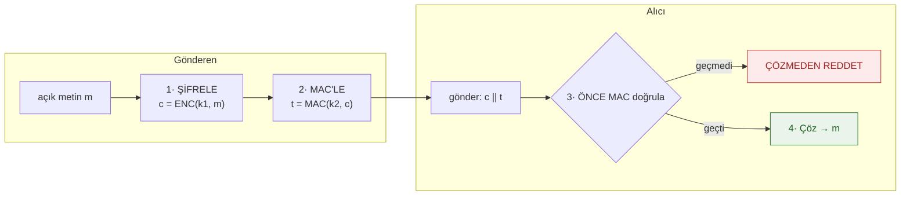
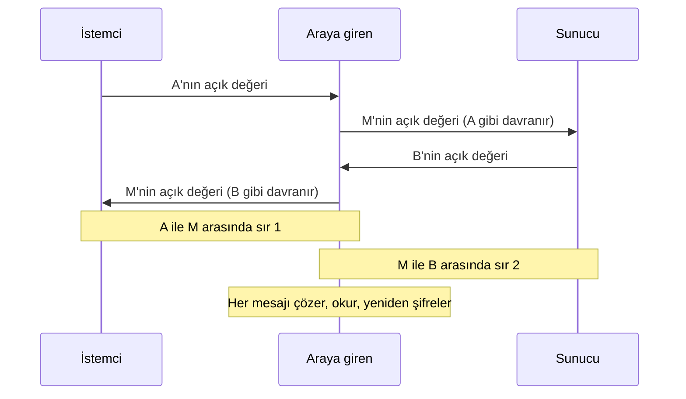
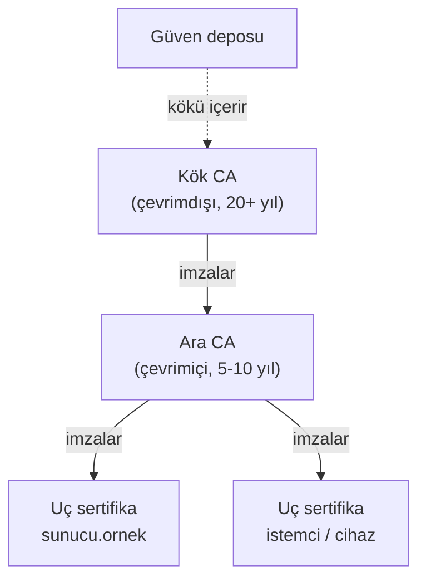
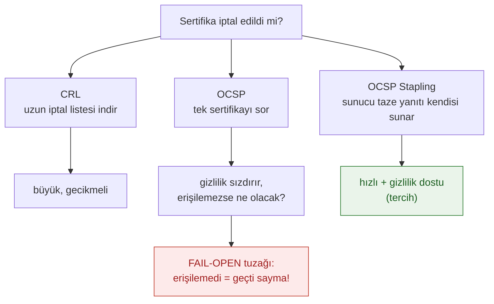

# Hafta 10 — Sertifikalar ve Kriptografik Yöntemler

| | |
| --- | --- |
| **Tarih** | 20.11.2026 |
| **Öğrenme çıktıları** | ÖÇ.2, 4 |
| **Süre** | 3 saat |

<!-- materyal:basla -->

<div class="materyal" markdown>

[:material-file-pdf-box: Ders notu (PDF)](cen429-week-10-ders-notu.pdf){ .md-button download="cen429-week-10-ders-notu.pdf" }
[:material-file-word-box: Ders notu (DOCX)](cen429-week-10-ders-notu.docx){ .md-button download="cen429-week-10-ders-notu.docx" }
[:material-presentation: Sunum (PDF)](cen429-week-10-sunum.pdf){ .md-button download="cen429-week-10-sunum.pdf" }
[:material-microsoft-powerpoint: Sunum (PPTX)](cen429-week-10-sunum.pptx){ .md-button download="cen429-week-10-sunum.pptx" }
[:material-language-html5: Sunum (HTML, çevrimdışı)](cen429-week-10-sunum.html){ .md-button download="cen429-week-10-sunum.html" }
[:material-folder-zip: Tümünü indir (ZIP)](cen429-week-10-materyal.zip){ .md-button download="cen429-week-10-materyal.zip" }
[:material-fullscreen: Sunumu tam ekran aç](cen429-week-10-sunum.html){ .md-button .md-button--primary target=_blank }

</div>

<div class="sunum-cercevesi">
<iframe src="../cen429-week-10-sunum.html" title="Hafta 10 — Sertifikalar ve Kriptografik Yöntemler" loading="lazy" allowfullscreen></iframe>
</div>

<p class="sunum-ipucu">Sunumun içine tıklayıp ok tuşlarıyla ilerleyin; tam ekran için sunumun sağ altındaki düğmeyi ya da yukarıdaki "Sunumu tam ekran aç" bağlantısını kullanın.</p>

<!-- materyal:bitis -->

!!! example "Bu haftanın çalışan demosu"
    `code/week-10/01-pki-zincir` — OpenSSL ile kok->ara->sunucu zinciri; ara sertifika olmadan `verify` hatasi, ekleyince OK.
    · `code/week-10/02-imza-dogrulama` — Ed25519 imza/doğrulama: doğru imza kabul, kurcalanan reddedilir; `==1` tuzağı.

    Çalıştırma: `sh demo.sh` (Linux/WSL) ya da CMake ile derleyip `bin/` altından. Tümüyle sentetik ve güvenlidir; öğrenci bilgisayarına zarar vermez.


!!! tip "Demoyu kendiniz çalıştırın — adım adım (kopyala-yapıştır)"
    Bu iki demo **OpenSSL** ve kabuk betiği kullanır; Windows'ta **WSL** ya da **Git Bash** açın. **`code`** klasöründen:

    ```sh
    # WSL / Linux / Git Bash
    cd week-10/01-pki-zincir
    sh demo.sh            # kök CA → ara CA → sunucu sertifikası üretir ve zinciri doğrular

    cd ../02-imza-dogrulama
    sh demo.sh            # Ed25519 ile imzala → doğrula → tek bayt kurcala → doğrulama reddetsin
    ```

    **Beklenen çıktı:** Birinci demo üç halkalı bir **zincir** kurar; `openssl verify` zinciri **geçerli** bulur, **ara sertifika çıkarılınca doğrulama başarısız** olur (bu haftanın "eksik ara sertifika" kuralı). İkinci demo bir dosyayı imzalayıp doğrular (**OK**), sonra tek bir baytı değiştirir ve doğrulama **reddeder** — imza bütünlüğü böyle yakalar.

!!! abstract "Bu haftanın sonunda şunları yapabileceksiniz"
    1. Bir uygulama için **algoritma, anahtar uzunluğu ve kip** seçmek ve seçimi güncel standartlara (NIST SP 800-57,
       SP 800-131A) dayandırmak.
    2. Blok şifre **kiplerini** (ECB, CBC, CTR, GCM) ve **dolguyu** karşılaştırmak; dolgu kâhini saldırısının neden
       mümkün olduğunu açıklamak.
    3. **HMAC**'i doğru kullanmak; şifreleme ile MAC'i doğru sırada birleştirmek ve **yeniden oynatmaya** karşı
       korumak.
    4. **RSA** (OAEP, PSS) ve **eliptik eğri** (Ed25519, X25519) algoritmalarıyla şifreleme, imzalama ve anahtar
       değişimi yapmak; imzalı Diffie–Hellman'ın neden gerektiğini göstermek.
    5. **PKI** bileşenlerini (CA, RA, zincir, güven deposu) açıklamak; OpenSSL ile **kök → ara → uç** sertifika zinciri
       kurmak ve doğrulamak.
    6. Sertifika **iptalini** (CRL, OCSP, OCSP zımbalama) açıklamak ve anahtarları bir yazılım HSM'inde (**SoftHSM**,
       PKCS#11) saklamanın mantığını bilmek.

??? info "Ders akışı (öğretim üyesi için zaman planı)"
    | Zaman | Bölüm | Ne yapılıyor |
    | --- | --- | --- |
    | 0:00–0:15 | 1 | Kriptografinin haritası; algoritma ve anahtar uzunluğu seçimi |
    | 0:15–0:50 | 2–3 | Blok şifre kipleri ve dolgu; MAC, HMAC, şifrele-sonra-MAC, yeniden oynatma |
    | 0:50–1:00 | Ara | |
    | 1:00–1:30 | 4–5 | RSA (OAEP, PSS) ve eliptik eğriler; dijital imza oluşturma ve doğrulama (OpenSSL) |
    | 1:30–1:50 | 6 | Anahtar değişimi: Diffie–Hellman, araya girme, imzalı DH |
    | 1:50–2:00 | Ara | |
    | 2:00–2:40 | 7–9 | PKI bileşenleri; X.509 yapısı; OpenSSL ile sertifika zinciri kurmak — **sınıf etkinliği** |
    | 2:40–2:55 | 10–11 | İptal (CRL, OCSP); anahtar saklama (PKCS#11, SoftHSM, HSM) |
    | 2:55–3:00 | 12+ | Kuantum sonrası kriptografiye bakış, proje adımı, kendini sınama |

!!! tip "Laboratuvarı önceden hazırlayın"
    Bu haftanın komutları **OpenSSL 3** ister (Windows'ta Git for Windows ile gelen `openssl`, WSL/Linux'ta paket
    yöneticisi). Bütün dosyaları boş bir çalışma klasöründe üretin; üretilen anahtarlar **yalnız ders içindir**, hiçbir
    gerçek sistemde kullanılmaz. SoftHSM bölümü isteğe bağlıdır.

    === "Windows"

        ```powershell
        openssl version
        mkdir C:\Dersler\h10; cd C:\Dersler\h10
        ```

    === "WSL / Linux"

        ```bash
        sudo apt install -y openssl softhsm2 opensc
        openssl version
        mkdir -p ~/h10 && cd ~/h10
        ```

!!! warning "Etik kural — bu derste her hafta geçerli"
    Bu haftanın bütün anahtarları ve sertifikaları kendi ürettiğimiz, **sentetik** ve yalnız laboratuvar içindir.
    Kendi ürettiğiniz bir kök sertifikayı başkasının bilgisayarının güven deposuna eklemek ya da bir sertifika
    otoritesinin adını taşıyan sahte sertifika üretmek kabul edilemez. Araya girme örnekleri yalnız kendi bilgisayarınızda,
    `localhost` üzerinde yapılır.

---

## 0. Temel kavramlar (sıfırdan)

Bu bölüm **hiçbir ön bilgi varsaymaz**. Haftanın geri kalanında kullanacağımız terimleri sıfırdan tanımlıyoruz. Bir terimi bilmiyorsanız önce burayı okuyun; sonraki bölümler bunların üzerine kurulur.

### Simetrik vs asimetrik (hatırlatma)

- **Simetrik:** tek anahtar, şifrele ve çöz (AES). Hızlı.
- **Asimetrik:** açık + gizli anahtar çifti (RSA, ECC). Yavaş ama anahtar dağıtımı kolay.
- Pratikte **birlikte**: asimetrik ile anahtar taşı, simetrik ile veri şifrele.

### Blok şifre ve kip

- **Blok şifre:** sabit boyutlu bloğu şifreler (AES: 16 bayt).
- **Kip (mode):** blokları **nasıl** zincirleyeceğimiz (CBC, GCM…).
- Kip seçimi güvenliğin **kalbidir**.

### Dolgu (padding)

- **Dolgu:** veri blok boyutunun katı değilse tamamlama.
- Bazı kiplerde gerekir (CBC), bazılarında **yok** (GCM).
- Yanlış dolgu işleme → **dolgu kâhini** saldırısı.

### AEAD nedir?

- **AEAD (Authenticated Encryption with Associated Data):** gizlilik **+** bütünlüğü **birlikte** veren şifreleme.
- Örnek: AES-GCM, ChaCha20-Poly1305.
- Modern tercih: ayrı MAC uğraşma, AEAD kullan.

### MAC ve HMAC

- **MAC (Message Authentication Code):** bir mesajın **değişmediğini** ve doğru taraftan geldiğini kanıtlayan etiket (simetrik).
- **HMAC:** özet fonksiyonuna dayalı yaygın bir MAC.
- Bütünlük için.

### Özet (hash)

- **Özet:** veriden hesaplanan sabit parmak izi (SHA-256).
- Tek yönlü: özetten veri geri gelmez.
- İmza ve MAC'in yapı taşı.

### Dijital imza

- **İmza:** asimetrik; **gizli** anahtarla imzala, **açık** anahtarla doğrula.
- Sağlar: bütünlük + **inkâr edilemezlik** (kim imzaladı).
- MAC'ten farkı: asimetrik, herkes doğrulayabilir.

### RSA ve eliptik eğri (ECC)

- **RSA:** klasik asimetrik; büyük anahtarlar (2048+ bit).
- **ECC:** eliptik eğri; aynı güvenlik **daha küçük** anahtarla (Ed25519, X25519).
- Modern tercih giderek ECC.

### Diffie–Hellman (DH)

- **DH:** iki tarafın, gizli anahtar **paylaşmadan** ortak bir sır türetmesi.
- Ağ üzerinden anahtar anlaşması.
- Kimlik doğrulanmazsa **araya girme** (MITM) riski.

### PKI ve CA

- **PKI (Public Key Infrastructure):** "hangi açık anahtar kime ait?" sorusunu çözen güven sistemi.
- **CA (Certificate Authority):** sertifikaları imzalayan güvenilir taraf.
- Kök CA → ara CA → sunucu sertifikası.

### Sertifika ve X.509

- **Sertifika:** bir açık anahtarı bir kimliğe (alan adı) bağlayan, CA'nın imzaladığı belge.
- **X.509:** sertifikaların standart biçimi.
- İçinde: konu, açık anahtar, geçerlilik, imza, SAN.

### CRL ve OCSP

- **CRL (Certificate Revocation List):** iptal edilmiş sertifikaların **listesi**.
- **OCSP:** bir sertifikanın iptal durumunu **anlık** sorma.
- "Bu sertifika hâlâ geçerli mi?" sorusu.

### HSM, PKCS#11, SoftHSM

- **HSM:** anahtarları saklayan/işleten özel **donanım**; anahtar dışarı çıkmaz.
- **PKCS#11:** anahtar modülleriyle konuşmanın standart arayüzü.
- **SoftHSM:** HSM'in yazılım benzetimi (test için).

### Kuantum sonrası (PQC)

- **PQC (Post-Quantum Cryptography):** kuantum bilgisayara dayanıklı algoritmalar.
- Bugünkü RSA/ECC gelecekte tehdit altında.
- Standartlaşma sürüyor (ör. ML-KEM).

### Şimdi hazırız

Terimler:

simetrik/asimetrik · blok şifre/kip · dolgu · AEAD · MAC/HMAC · özet · imza · RSA/ECC · DH · PKI/CA · sertifika/X.509 · CRL/OCSP · HSM/PKCS#11 · PQC

Şimdi: doğru algoritma ve anahtar seçimi.

## 1. Kriptografinin haritası ve algoritma seçimi

Üçüncü haftada veriyi aktarımda, beklemede ve kullanımda korumak için kriptografiyi bir **araç** olarak kullandık. Bu hafta
aynı araçların içine bakıyoruz: hangi algoritma hangi işi yapar, neden bazıları terk edildi, nasıl seçilir ve bir
sertifika otoritesi (CA) bu yapıya nasıl oturur. Kitabın 4–8. ve 10–11. bölümleri, 55'ten fazla tarifle bu konuları
işler; 2003'ten beri algoritmaların çoğu değiştiği için her birini güncel karşılığıyla veriyoruz.

!!! note "Kısa tarihçe: anahtarlar, sertifikalar ve PKI"
    - **1976–77** — Diffie–Hellman ve **RSA**: açık anahtar, "tanımadığın biriyle güvenli konuşma" sorununu çözer.
    - **1988** — **X.509** sertifika biçimi standartlaşır; kimliği bir **CA imzası** taşır.
    - **1995** — ilk ticari CA'lar (VeriSign) ve **PKI** yaygınlaşır; ardından iptal mekanizmaları **CRL** ve **OCSP** gelir.
    - **2014** — **Heartbleed** ve POODLE, TLS ekosistemini sıkılaştırır; **2015** **Let's Encrypt** ücretsiz sertifikayla HTTPS'i yaygınlaştırır; **2018** TLS 1.3.
    - **2022–2024** — NIST **kuantum sonrası** algoritmaları seçer (Kyber/ML-KEM, Dilithium/ML-DSA).

    Bu haftanın tüm kuralları (doğru kip, doğru dolgu, zincir doğrulama, iptal) bu çizginin acı derslerinden çıkmıştır.

### Beş temel iş, beş araç ailesi

| İş | Araç | Güncel seçim | Terk edilen |
| --- | --- | --- | --- |
| **Gizlilik** (simetrik) | Blok ve akış şifreleri | AES-256-GCM, ChaCha20-Poly1305 | DES, 3DES, RC4, Blowfish |
| **Bütünlük + kimlik** (simetrik) | MAC | HMAC-SHA-256, CMAC, GCM'in etiketi | CBC-MAC (değişken uzunlukta), MD5 tabanlı MAC'ler |
| **Parmak izi** | Özet fonksiyonu | SHA-256, SHA-384, SHA-3 | MD5, SHA-1 |
| **Anahtar değişimi** | Diffie–Hellman, RSA ile anahtar taşıma | X25519, ECDHE (P-256) | 1024 bit DH, RSA ile anahtar taşıma (TLS 1.3'te kaldırıldı) |
| **İmza** (asimetrik) | Dijital imza | Ed25519, ECDSA P-256, RSA-PSS ≥ 3072 | DSA, RSA PKCS#1 v1.5 imzası (yeni tasarımlarda) |

### Anahtar uzunluğu: güvenlik düzeyi

Farklı algoritmaların anahtar uzunlukları doğrudan karşılaştırılamaz. NIST SP 800-57, bunları **eşdeğer güvenlik
düzeyinde** (bit cinsinden) karşılaştırır:

| Güvenlik düzeyi | Simetrik | Özet (çakışma direnci) | RSA / DH | Eliptik eğri |
| --- | --- | --- | --- | --- |
| 112 bit | 3DES (yalnız eski sistemler) | SHA-224 | 2048 | 224 |
| **128 bit** | **AES-128** | **SHA-256** | **3072** | **256 (P-256, Ed25519/X25519)** |
| 192 bit | AES-192 | SHA-384 | 7680 | 384 |
| 256 bit | AES-256 | SHA-512 | 15360 | 512 |

Bugün yeni bir tasarım için alt sınır **128 bit güvenlik düzeyidir**. Bu, RSA'da 3072 bit, eliptik eğride 256 bit
demektir; 2048 bitlik RSA, NIST'in geçiş planında 2030'dan sonra yeni kullanım için yeterli sayılmaz. Tablonun en önemli
dersi, eliptik eğrilerin aynı güvenliği **çok daha kısa** anahtarlarla sağlamasıdır; mobil ve gömülü sistemlerde tercih
edilmelerinin nedeni budur.

!!! info "Kitaptaki karşılığı"
    Kitap Tarif 5.2 ve 5.3'te algoritma ve anahtar uzunluğu seçimini, 6.3 ve 6.4'te özet ve MAC seçimini, 7.2 ve 7.3'te
    açık anahtar algoritması ve uzunluğu seçimini işler. Önerdiği ilke bugün de geçerlidir: **iyi incelenmiş, standart
    bir algoritma seçin ve onu yüksek düzeyli, hata yapmaya dirençli bir API ile kullanın** (Tarif 5.16). Değişen yalnız
    algoritmaların kendisidir.

### Bir kural: kendi kriptonuzu yazmayın, kendi protokolünüzü de

Algoritmaların hepsi doğru olsa bile, onları birleştirmek (hangi sırayla şifreleyip MAC'leyeceğinizi, nonce'u nereden
alacağınızı, anahtarları nasıl ayıracağınızı seçmek) ayrı bir uzmanlık ister. Bu haftanın bütün örnekleri, sahadaki
hataların neredeyse hepsinin **algoritmada değil, birleştirmede** olduğunu gösterecek. Mümkün olan her yerde hazır,
kanıtlanmış yapıları (TLS 1.3, AEAD, HPKE, Noise) kullanın.

---

## 2. Blok şifre kipleri ve dolgu (Tarif 5.4, 5.11)

AES bir **blok şifredir**: tam olarak 16 baytlık bir bloğu, 16 baytlık başka bir bloğa çevirir. Daha uzun bir mesajı
şifrelemek için blokları birbirine bağlayan bir **kip** (mode of operation) gerekir. Kip seçimi, algoritma seçimi kadar
önemlidir; 3. haftadaki ECB penguenini hatırlayın.

| Kip | Nasıl çalışır? | Gizlilik | Bütünlük | Paralel | Dolgu | Değerlendirme |
| --- | --- | :-: | :-: | :-: | :-: | --- |
| **ECB** | Her blok bağımsız şifrelenir | ✗ (desen sızar) | ✗ | ✓ | Gerekir | **Kullanmayın** |
| **CBC** | Her blok önceki şifreli blokla XOR'lanır | ✓ (IV tahmin edilemezse) | ✗ | Yalnız çözme | Gerekir | Ayrı MAC ile; dolgu kâhinine dikkat |
| **CTR** | Sayaç şifrelenip anahtar akışı üretilir | ✓ (nonce benzersizse) | ✗ | ✓ | Gerekmez | Ayrı MAC ile |
| **GCM** | CTR + çarpım tabanlı kimlik doğrulama | ✓ | ✓ | ✓ | Gerekmez | **Önerilen** (AEAD) |
| **ChaCha20-Poly1305** | Akış şifresi + Poly1305 MAC | ✓ | ✓ | ✓ | Gerekmez | **Önerilen**; AES donanım desteği olmayan cihazlarda hızlı |

### Dolgu ve dolgu kâhini

ECB ve CBC, mesaj uzunluğunun blok boyutunun katı olmasını ister; eksik kısım **dolgu** ile tamamlanır. En yaygın
dolgu PKCS#7'dir: eksik bayt sayısı `n` ise, `n` adet `n` değerli bayt eklenir (ör. 3 bayt eksikse `03 03 03`). Çözen
taraf son baytı okuyup o kadar baytı atar; ama önce dolgunun **geçerli** olup olmadığını denetler.

Sorun burada başlar: çözme hatası "dolgu geçersiz" ve "MAC geçersiz" olarak **ayırt edilebiliyorsa** (farklı hata
iletisi, farklı yanıt süresi), saldırgan şifreli metnin baytlarını değiştirip sunucunun tepkisini gözleyerek mesajı
bayt bayt çözebilir. Buna **dolgu kâhini** (padding oracle) saldırısı denir; 2002'de tanımlandı, sonraki yıllarda web
çerçevelerinde ve TLS'te (POODLE, Lucky Thirteen) tekrar tekrar karşımıza çıktı.

Savunmalar:

1. **AEAD kullanın** (GCM, ChaCha20-Poly1305): dolgu yoktur, etiket tutmazsa hiçbir şey çözülmez.
2. CBC zorunluysa **önce şifrele, sonra MAC'le** (bir sonraki bölüm) ve MAC'i **dolguyu denetlemeden önce** doğrulayın.
3. Bütün çözme hatalarını **tek ve aynı** hata olarak, aynı sürede döndürün.

!!! note "Sahada nasıl uygulanır?"
    Sertifikasyondan geçmiş bir mobil ödeme kütüphanesinin algoritma envanterinde AES'in CBC ve CTR kiplerinde, ayrı bir
    SHA-256 tabanlı MAC ile kullanıldığı görülür; ödeme şemalarının kriptogram hesabı için ise ISO/IEC 9797-1'e dayanan,
    DES tabanlı bir MAC algoritması (şemaların belirlediği dolgu yöntemleriyle) kullanılır. Bu seçimler, uyulması gereken
    şema belirtimlerinden gelir. Şemanın belirlemediği iç iletişimde ise bugün AEAD tercih edilir (3. haftadaki eleştirel
    okuma).

---

## 3. MAC, HMAC ve şifreleme ile bütünlüğün birleştirilmesi (Tarif 6.4, 6.10, 6.18, 6.21)

### HMAC nasıl çalışır?



**Encrypt-then-MAC**: alıcı geçersiz metni hiç çözmediği için dolgu kâhini (padding oracle) için gereken
"hata sızıntısı" oluşmaz. AES-GCM bu iki adımı tek işlemde yapar.

**MAC** (mesaj kimlik doğrulama kodu), gizli bir anahtar ve bir mesajdan kısa bir etiket üretir; anahtarı bilmeyen biri
geçerli bir etiket üretemez. **HMAC**, bir özet fonksiyonundan (SHA-256) MAC üretmenin standart yoludur (RFC 2104):

```text
HMAC(K, m) = H( (K ⊕ opad) ‖ H( (K ⊕ ipad) ‖ m ) )
```

İç içe iki özet, düz `H(K ‖ m)` yapısının **uzunluk uzatma** zayıflığını ortadan kaldırır: SHA-256 gibi Merkle–Damgård
yapısındaki özetlerde `H(K ‖ m)` biliniyorsa, anahtarı bilmeden `H(K ‖ m ‖ ek)` hesaplanabilir. Bu yüzden **kendi MAC'inizi
özetten türetmeyin**; HMAC kullanın (Tarif 6.19'un uyarısı).

```bash title="OpenSSL ile HMAC-SHA-256"
printf 'tutar=100;alici=TR00' | openssl dgst -sha256 -mac HMAC -macopt hexkey:$(openssl rand -hex 32)
```

### Şifreleme ile MAC'i birleştirmenin üç yolu

| Yöntem | Nasıl? | Örnek | Değerlendirme |
| --- | --- | --- | --- |
| **Şifrele-sonra-MAC** (Encrypt-then-MAC) | Önce şifrele, sonra **şifreli metnin** MAC'ini al | IPsec ESP, TLS'in EtM uzantısı | **Doğru yol**: MAC önce doğrulanır, geçersizse şifre hiç çözülmez |
| MAC-sonra-şifrele (MAC-then-Encrypt) | Düz metnin MAC'ini al, ikisini birlikte şifrele | Eski TLS (CBC kipleri) | Dolgu kâhinine açık; kaçının |
| Şifrele-ve-MAC (Encrypt-and-MAC) | Düz metni şifrele, **düz metnin** MAC'ini ayrıca ekle | Eski SSH | MAC düz metin hakkında bilgi sızdırabilir; kaçının |

AEAD kipleri bu seçimi sizin yerinize doğru yapar. Kendi birleştirmenizi yapmak zorundaysanız (Tarif 6.18): **iki ayrı
anahtar** kullanın (biri şifreleme, biri MAC için; HKDF ile tek sırdan türetilebilir), şifrele-sonra-MAC sırasını izleyin,
MAC'e IV'yi ve bağlam bilgisini de katın, karşılaştırmayı sabit zamanlı yapın.

### Yeniden oynatma: geçerli ama eski mesaj

Bir MAC mesajın **değiştirilmediğini** kanıtlar, ama **yeni** olduğunu kanıtlamaz. Saldırgan geçerli bir "100 TL
gönder" iletisini kaydedip on kez yeniden gönderebilir; her seferinde MAC geçerlidir. Kitabın Tarif 6.21'de anlattığı
savunmalar:

| Yöntem | Nasıl? | Not |
| --- | --- | --- |
| **Sayaç** | Her ileti bir önceki sayaçtan büyük bir sayı taşır; alıcı son sayacı saklar | En basit ve güvenilir; sayaç MAC'in içinde olmalı |
| **Zaman damgası** | İleti kısa bir geçerlilik penceresi içinde olmalı | Saat eşzamanlılığı gerekir; pencere içinde tekrar için ek önlem |
| **Tek kullanımlık değer** (nonce) | Sunucu her istek için yeni bir değer verir, istemci bunu MAC'e katar | Sunucu kullanılan değerleri hatırlar |

!!! example "Ödemede sayaç"
    Temassız kart işlemlerinde her işlem, kartın **işlem sayacını** (ATC) içeren bir kriptogramla imzalanır; sunucu aynı
    sayacı ikinci kez kabul etmez. Mobil ödeme kütüphanelerinde her tek kullanımlık anahtar da yalnız bir işlemde
    kullanılır ve sayaç veritabanında tutulur. 2. haftadaki tehdit tablosunda "kullanım sayacının geri sarılması"
    tehdidinin varlık koruma sınıfının **I+** olması bu yüzdendir.

---

## 4. Asimetrik kriptografi: RSA ve eliptik eğriler (Tarif 7.1–7.3)

Simetrik kriptografinin tek zorluğu, iki tarafın aynı anahtarı **önceden** paylaşmasıdır. Asimetrik (açık anahtarlı)
kriptografide her tarafın bir **anahtar çifti** vardır: herkese verilen **açık anahtar** ve yalnız sahibinin bildiği
**özel anahtar**. Açık anahtarla şifrelenen yalnız özel anahtarla çözülür; özel anahtarla imzalanan herkesçe açık
anahtarla doğrulanır.

Asimetrik işlemler simetrik olanlardan yüzlerce, binlerce kat yavaştır. Bu yüzden asimetrik kriptografi yalnız iki iş
için kullanılır (Tarif 7.1): **kısa bir simetrik anahtarı taşımak ya da anlaşmak** ve **imzalamak**. Verinin kendisi
her zaman simetrik şifreyle korunur (3. haftadaki hibrit şema).

### RSA: doğru dolguyla

RSA'nın matematiği yalın haliyle ("ders kitabı RSA") güvensizdir: aynı mesaj her zaman aynı şifreli metni verir ve
matematiksel yapısı saldırılara açıktır. Güvenli kullanım, **doğru dolgu şemasına** bağlıdır:

| İş | Doğru şema | Eskimiş şema | Neden? |
| --- | --- | --- | --- |
| Şifreleme | **RSA-OAEP** (SHA-256) | PKCS#1 v1.5 şifreleme | v1.5 şifrelemesine yönelik dolgu kâhini saldırıları (1998'den beri, yeniden ortaya çıkan varyantlarıyla) |
| İmza | **RSA-PSS** | PKCS#1 v1.5 imza | v1.5 imzası hâlâ yaygın ve kırık değil, ama PSS güvenlik kanıtı olan şemadır |

Kitabın Tarif 7.10–7.13'teki "ham" RSA işlemleri, dolgusuz RSA'nın nasıl çalıştığını anlamak içindir; üretimde
kullanılmaz. Tarif 7.14'teki uyarı ise hâlâ önemlidir: **imzala-ve-şifrele** birleştirmesi dikkat ister; imza, şifrelenen
içeriğin alıcısına ve bağlamına bağlanmazsa, alıcı imzalı mesajı başka birine yeniden şifreleyip iletebilir.

```bash title="OpenSSL 3 ile RSA-3072: anahtar, OAEP şifreleme, PSS imza"
openssl genpkey -algorithm RSA -pkeyopt rsa_keygen_bits:3072 -out rsa_ozel.pem
openssl pkey -in rsa_ozel.pem -pubout -out rsa_acik.pem

# OAEP (SHA-256) ile kısa bir oturum anahtarını şifrele
openssl rand -out oturum.key 32
openssl pkeyutl -encrypt -pubin -inkey rsa_acik.pem -in oturum.key -out oturum.enc \
    -pkeyopt rsa_padding_mode:oaep -pkeyopt rsa_oaep_md:sha256

# PSS ile imzala ve doğrula
openssl dgst -sha256 -sign rsa_ozel.pem -sigopt rsa_padding_mode:pss -out belge.sig belge.txt
openssl dgst -sha256 -verify rsa_acik.pem -sigopt rsa_padding_mode:pss -signature belge.sig belge.txt
```

### Eliptik eğriler: aynı güvenlik, daha kısa anahtar

Eliptik eğri kriptografisi (ECC), 256 bitlik anahtarla 3072 bitlik RSA'nın güvenlik düzeyini sağlar; işlemleri daha
hızlı, anahtarları ve imzaları çok daha kısadır.

| Algoritma | İş | Not |
| --- | --- | --- |
| **Ed25519** | İmza | Deterministik (rastgele sayı gerektirmez), hızlı, yan kanallara karşı dikkatle tasarlanmış |
| **X25519** | Anahtar anlaşması | TLS 1.3, SSH, Signal gibi protokollerin varsayılanı |
| ECDSA (P-256) | İmza | Yaygın ve standart; ama her imzada **benzersiz ve gizli** bir rastgele değer ister |
| ECDH (P-256) | Anahtar anlaşması | FIPS onaylı sistemlerde yaygın |

!!! danger "ECDSA ve rastgele sayı"
    ECDSA her imzada gizli bir rastgele değer (`k`) kullanır. Aynı `k` iki farklı imzada kullanılırsa ya da tahmin
    edilebilirse, iki imzadan **özel anahtar** hesaplanabilir. 2010'da bir oyun konsolunun imza anahtarı, üreticinin her
    imzada aynı `k`'yi kullanması yüzünden bu yolla ortaya çıktı; 2013'te bazı mobil kripto para cüzdanları, zayıf bir
    rastgele üreteç yüzünden aynı şekilde kayıp yaşadı. 3. haftadaki "rastgele sayılar kriptografinin görünmez temelidir"
    cümlesinin en çarpıcı kanıtıdır. Ed25519 ve RFC 6979'daki deterministik ECDSA bu riski ortadan kaldırır.

```bash title="OpenSSL 3 ile Ed25519 imza"
openssl genpkey -algorithm ED25519 -out ed_ozel.pem
openssl pkey -in ed_ozel.pem -pubout -out ed_acik.pem
openssl pkeyutl -sign   -inkey ed_ozel.pem -rawin -in belge.txt -out belge.ed.sig
openssl pkeyutl -verify -pubin -inkey ed_acik.pem -rawin -in belge.txt -sigfile belge.ed.sig
```

---

## 5. Dijital imza: oluşturma, doğrulama ve kullanım yerleri

**Dijital imza**, bir mesajın (1) belirli bir özel anahtarın sahibi tarafından oluşturulduğunu ve (2) sonradan
değiştirilmediğini kanıtlar. MAC'ten farkı, doğrulamanın **açık anahtarla** yapılmasıdır: herkes doğrulayabilir ama
yalnız özel anahtarın sahibi imzalayabilir. Bu yüzden imza **inkâr edilemezlik** sağlar (STRIDE'daki R), MAC sağlamaz.

### İmza nerelerde kullanılır?

| Kullanım | Ne imzalanır? | Bu dersteki yeri |
| --- | --- | --- |
| Yazılım güncellemesi | Güncelleme paketi | 1. hafta "Kasa" örneği, T6 tehdidi |
| Kod imzalama | Çalıştırılabilir dosya, mobil uygulama paketi | 6. hafta imza doğrulaması |
| Sertifika | Açık anahtar + kimlik bilgisi (CA imzalar) | Bu hafta PKI |
| TLS el sıkışması | El sıkışma özeti (sunucu imzalar) | 3. hafta `CertificateVerify` |
| Belge ve işlem | Sözleşme, ödeme onayı | Elektronik imza mevzuatı |

### Kodda imza doğrulama: OpenSSL EVP

```c title="Ed25519 imzasını doğrulamak (OpenSSL 3)"
#include <openssl/evp.h>
#include <openssl/pem.h>

/* 1: geçerli, 0: geçersiz, -1: hata. Güncelleme paketini ÇALIŞTIRMADAN önce çağrılır. */
int imza_dogrula(EVP_PKEY *acik, const unsigned char *veri, size_t n,
                 const unsigned char *imza, size_t imza_n)
{
    EVP_MD_CTX *ctx = EVP_MD_CTX_new();
    int sonuc = -1;
    if (ctx == NULL) return -1;
    if (EVP_DigestVerifyInit(ctx, NULL, NULL, NULL, acik) == 1)   /* Ed25519: özet NULL */
        sonuc = EVP_DigestVerify(ctx, imza, imza_n, veri, n);      /* 1 ya da 0 */
    EVP_MD_CTX_free(ctx);
    return sonuc == 1 ? 1 : (sonuc == 0 ? 0 : -1);
}
```

!!! warning "İmza doğrulamasının üç tuzağı"
    1. **Dönüş değeri:** `EVP_DigestVerify` başarıda 1, imza geçersizse 0, hata durumunda negatif döner. `if (sonuc)`
       gibi bir denetim, **negatif hata değerini "geçerli"** sayar. Denetim her zaman `== 1` olmalıdır.
    2. **Neyin imzalandığı:** İmza yalnız paketin içeriğini kapsıyorsa, saldırgan **eski ve zafiyetli** ama geçerli
       imzalı bir paketi geri yükleyebilir (sürüm geri alma). Sürüm numarası ve hedef ürün de imzalı içeriğin
       parçası olmalı ve istemci eski sürümü reddetmeli.
    3. **Hangi anahtarla:** İmzayı, paketin **kendi içinde gelen** bir açık anahtarla doğrulamak hiçbir şey kanıtlamaz.
       Doğrulama anahtarı uygulamaya önceden gömülü (ve bütünlüğü korunan) ya da güvenilir bir zincirden gelmelidir.

---

## 6. Anahtar değişimi: Diffie–Hellman ve araya girme (Tarif 8.16–8.18)

**Diffie–Hellman** (DH), iki tarafın güvensiz bir kanal üzerinden, hiç önceden paylaşılmış sır olmadan ortak bir sır
üzerinde anlaşmasını sağlar. Her taraf bir özel değer seçer, bundan türettiği açık değeri gönderir; iki taraf da
karşısındakinin açık değeri ve kendi özel değeriyle **aynı** ortak sırrı hesaplar. Dinleyen biri açık değerleri görür ama
ortak sırrı hesaplayamaz. Bugün kullanılan biçimi eliptik eğri üzerindeki **ECDH**'dir (X25519).

### Kimliksiz DH'nin zayıflığı: araya girme

DH **kimin** ile anlaşıldığını söylemez. Kanalın ortasındaki bir saldırgan, iki tarafla **ayrı ayrı** DH yapar:



İki taraf da "güvenli bir kanalım var" sanır; aslında her mesaj saldırganın elinden geçer.

### Çözüm: kimliği doğrulanmış anahtar değişimi

Açık değerler, kimliği önceden bilinen bir anahtarla **imzalanır** (Tarif 8.18'deki "DH ve DSA birlikte" fikrinin güncel
hali: ECDHE + Ed25519/ECDSA/RSA-PSS). TLS 1.3'te sunucu, geçici (ephemeral) ECDHE açık değerini de içeren el sıkışma
özetini sertifikasındaki özel anahtarla imzalar (`CertificateVerify`); istemci sertifikayı zincir ve ad açısından
doğrular (3. hafta). Böylece:

- **Kimlik:** İmza, açık değeri gönderenin gerçekten sertifikanın sahibi olduğunu kanıtlar.
- **İleri gizlilik:** DH değerleri her oturum için yeniden üretilir ve silinir; uzun ömürlü imza anahtarı ileride
  çalınsa bile geçmiş oturumların anahtarları hesaplanamaz (3. hafta).

!!! info "PKI olmadan kimlik"
    Her senaryoda bir sertifika otoritesi yoktur. Kitabın Tarif 8.19'da anlattığı "PKI olmadan kimlik doğrulama" yolları
    bugün de kullanılır: ilk bağlantıda anahtarı öğrenip sonra değişirse uyarmak (TOFU, SSH), anahtarın parmak izini
    ayrı bir kanaldan doğrulamak (güvenli mesajlaşmadaki "güvenlik numarası" karşılaştırması) ya da her iki tarafın önceden
    paylaştığı bir paroladan kimlik doğrulamalı anahtar değişimi (PAKE, Tarif 8.15; bugün OPAQUE, SPAKE2 gibi
    protokoller).

---

## 7. Açık anahtar altyapısı (PKI): kim kime güvenir? (Tarif 10.1)

Önceki bölüm açık anahtarların imzayla kimliğe bağlanması gerektiğini gösterdi. Ama bu bir soru doğurur: sunucunun
açık anahtarının **gerçekten** o sunucuya ait olduğunu nereden bileceğiz? **Açık anahtar altyapısı** (PKI), bu soruya
güvenilen üçüncü taraflar aracılığıyla cevap veren kurallar, roller ve belgeler bütünüdür.

### Bileşenler

| Bileşen | Görevi | Örnek |
| --- | --- | --- |
| **Sertifika otoritesi (CA)** | Kimliği doğrulanmış bir varlığın açık anahtarını imzalayarak **sertifika** çıkarır | Ticari ve kamu CA'ları, kurum içi CA |
| **Kayıt otoritesi (RA)** | Sertifika isteyenin kimliğini doğrular; CA'ya "bu kişiye sertifika ver" der | Kurumun insan kaynakları, bir alan adının sahipliğini denetleyen otomatik sistem (ACME) |
| **Kök CA** | Zincirin tepesindeki, kendini imzalayan CA; genellikle çevrimdışı tutulur | İşletim sistemi ve tarayıcıların güven deposundaki kökler |
| **Ara CA** | Kök tarafından imzalanmış, günlük sertifikaları çıkaran CA | Kök çevrimdışı kalabilsin diye |
| **Uç (leaf) sertifika** | Bir sunucuya, kişiye ya da cihaza ait sertifika | `sunucu.ornek` için TLS sertifikası |
| **Güven deposu** (trust store) | Güvenilen kök sertifikaların listesi | İşletim sistemi deposu, uygulamaya gömülü depo |
| **İptal hizmetleri** | İptal edilmiş sertifikaları bildirir | CRL dağıtım noktası, OCSP yanıtlayıcı |



Neden ara CA? Kök CA'nın özel anahtarı ele geçirilirse **bütün** zincir güvenilmez olur ve kökü dünyadaki bütün güven
depolarından çıkarmak yıllar sürer. Bu yüzden kök anahtar bir HSM'de, çevrimdışı ve fiziksel olarak korunan bir yerde
durur; yalnız ara CA sertifikalarını imzalamak için, tören (key ceremony) denen denetimli toplantılarda kullanılır.
Günlük işi ara CA yapar; ele geçirilirse yalnız o ara CA iptal edilir.

### Sertifika doğrulama: dört soru (Tarif 10.4)

Bir istemci bir sertifikayı kabul etmeden önce şunları sorar:

1. **Zincir:** Uç sertifikadan başlayarak her sertifikanın imzası, bir üsttekinin açık anahtarıyla doğrulanıyor mu ve
   zincir güven deposundaki bir köke ulaşıyor mu?
2. **Geçerlilik:** Zincirdeki her sertifikanın geçerlilik tarihleri içinde miyiz?
3. **Kullanım:** Sertifika bu iş için mi çıkarılmış? (Anahtar kullanımı ve genişletilmiş anahtar kullanımı alanları;
   ara CA'da `CA:TRUE` temel kısıtı.)
4. **Ad ve iptal:** Sertifika **bu** sunucu için mi (SAN)? İptal edilmiş mi?

Üçüncü haftada ilk ve dördüncü sorunun kodda nasıl sorulduğunu gördük (`SSL_CTX_set_verify`, `SSL_set1_host`). Bu bölümde
aynı zinciri kendimiz kuruyoruz.

---

## 8. X.509 sertifikasının yapısı

Bir X.509 v3 sertifikası, **imzalanan kısım** (TBSCertificate) ile CA'nın bu kısım üzerindeki **imzasından** oluşur:

| Alan | Anlamı |
| --- | --- |
| Sürüm | v3 (uzantılar için gerekli) |
| Seri numarası | CA içinde benzersiz; iptal listeleri bu numarayı kullanır |
| İmza algoritması | ör. `ecdsa-with-SHA256`, `sha256WithRSAEncryption` |
| Düzenleyen (Issuer) | Sertifikayı imzalayan CA'nın adı |
| Geçerlilik | `notBefore` – `notAfter` |
| Konu (Subject) | Sertifikanın sahibi |
| Konu açık anahtar bilgisi (SPKI) | Algoritma + açık anahtar; 3. haftadaki **sabitleme bunun özetini** kullanır |
| **Uzantılar** | Temel kısıtlar (`CA:TRUE/FALSE`, yol uzunluğu), anahtar kullanımı, genişletilmiş anahtar kullanımı (sunucu/istemci kimlik doğrulama, kod imzalama), **SAN** (alternatif adlar: DNS adları, IP), CRL dağıtım noktası, OCSP adresi (AIA) |

Sertifikalar ikili **DER** kodlamasıyla ya da onun Base64 ile sarılmış metin biçimi olan **PEM** ile saklanır (Tarif 7.16,
7.17): `-----BEGIN CERTIFICATE-----` ile başlayan dosyalar PEM'dir.

!!! warning "Ad denetimi CN'ye değil SAN'a yapılır"
    Eski uygulamalar sunucu adını konunun `CN` (Common Name) alanında arardı. Bugün tarayıcılar ve RFC 6125 yalnız **SAN**
    uzantısına bakar; SAN'ı olmayan bir sunucu sertifikası modern istemcilerde reddedilir. Kendi sertifikalarınızı
    üretirken SAN eklemeyi unutmayın.

---

## 9. OpenSSL ile sertifika zinciri kurmak

Aşağıdaki adımlar, kendi laboratuvarınızda üç katmanlı bir zincir kurar. Bütün dosyalar çalışma klasöründe oluşur;
kök sertifikayı **hiçbir güven deposuna eklemeyin**.

```bash title="1. Kök CA (kendi kendini imzalar)"
openssl genpkey -algorithm EC -pkeyopt ec_paramgen_curve:P-256 -out kok.key
openssl req -x509 -new -key kok.key -sha256 -days 3650 -out kok.crt \
  -subj "/CN=CEN429 Lab Kok CA" \
  -addext "basicConstraints=critical,CA:TRUE" \
  -addext "keyUsage=critical,keyCertSign,cRLSign"
```

```bash title="2. Ara CA (kök imzalar, yol uzunluğu 0: altında başka CA olamaz)"
openssl genpkey -algorithm EC -pkeyopt ec_paramgen_curve:P-256 -out ara.key
openssl req -new -key ara.key -out ara.csr -subj "/CN=CEN429 Lab Ara CA"
openssl x509 -req -in ara.csr -CA kok.crt -CAkey kok.key -CAcreateserial -days 1825 -sha256 \
  -out ara.crt -extfile <(printf "basicConstraints=critical,CA:TRUE,pathlen:0\nkeyUsage=critical,keyCertSign,cRLSign")
```

```bash title="3. Sunucu sertifikası (ara CA imzalar, SAN ile)"
openssl genpkey -algorithm EC -pkeyopt ec_paramgen_curve:P-256 -out sunucu.key
openssl req -new -key sunucu.key -out sunucu.csr -subj "/CN=localhost"
openssl x509 -req -in sunucu.csr -CA ara.crt -CAkey ara.key -CAcreateserial -days 90 -sha256 \
  -out sunucu.crt -extfile <(printf "basicConstraints=CA:FALSE\nkeyUsage=critical,digitalSignature\nextendedKeyUsage=serverAuth\nsubjectAltName=DNS:localhost,IP:127.0.0.1")
```

```bash title="4. Doğrula ve incele"
openssl verify -CAfile kok.crt -untrusted ara.crt sunucu.crt      # sunucu.crt: OK
openssl x509 -in sunucu.crt -noout -text | less                    # alanları inceleyin
openssl verify -CAfile kok.crt sunucu.crt                          # ara olmadan: HATA (zincir eksik)
```

!!! tip "Windows'ta"
    `<( ... )` süreç yerine koyma sözdizimi Bash'e özgüdür. Windows PowerShell'de uzantıları bir dosyaya yazıp
    (`ara.ext`, `sunucu.ext`) `-extfile ara.ext` biçiminde verin; komutların geri kalanı aynıdır.

Son komutun hata vermesi öğreticidir: istemci zinciri ancak ara sertifika da sunulursa kurabilir. Sunucuların yalnız uç
sertifikayı gönderip ara sertifikayı unutması, sahada sık görülen bir yapılandırma hatasıdır.

### Sınıf etkinliği: zinciri bozmak

Her adımda `openssl verify` çıktısını not edin:

1. Sunucu sertifikasını **kök** ile imzalayın ama ara CA'yı zincirde bırakın. Ne değişir?
2. Ara CA'yı `CA:FALSE` ile üretip sunucu sertifikasını onunla imzalayın. Doğrulama ne der?
3. `-days 0` ile süresi hemen dolan bir sertifika üretin.
4. SAN'ı `DNS:baska.ornek` yapıp `openssl s_client -verify_hostname localhost` ile deneyin.

---

## 10. Sertifika iptali: CRL, OCSP ve zımbalama (Tarif 10.10–10.12)

Bir sertifikanın özel anahtarı çalınırsa ya da sertifika hatalı çıkarılmışsa, geçerlilik süresi dolmadan **iptal**
edilmesi gerekir. İstemcinin bunu öğrenmesinin üç yolu vardır:



| Yöntem | Nasıl? | Artı | Eksi |
| --- | --- | --- | --- |
| **CRL** (iptal listesi) | CA, iptal edilen seri numaralarının imzalı listesini düzenli yayımlar | Basit, çevrimdışı önbelleklenebilir | Liste büyür; güncelleme aralığında iptal fark edilmez |
| **OCSP** | İstemci CA'nın yanıtlayıcısına "bu seri numarası geçerli mi?" diye sorar | Anlık | Gecikme, gizlilik (CA hangi siteye gidildiğini öğrenir), yanıtlayıcı erişilemezse ne olacak? |
| **OCSP zımbalama** (stapling) | Sunucu kendi sertifikasının taze OCSP yanıtını el sıkışmaya ekler | Gizlilik ve hız | Sunucunun yapılandırması gerekir |

```bash title="Laboratuvar CA'sıyla iptal ve CRL denetimi (özet)"
# ara CA ile bir CRL üretmek için 'openssl ca' yapılandırması gerekir; sonra:
openssl ca -config ara.cnf -revoke sunucu.crt
openssl ca -config ara.cnf -gencrl -out ara.crl
openssl verify -crl_check -CAfile kok.crt -untrusted ara.crt -CRLfile ara.crl sunucu.crt   # "certificate revoked"
```

!!! danger "Yumuşak başarısızlık (soft-fail)"
    Tarayıcıların çoğu, OCSP yanıtlayıcısına ulaşamadığında sertifikayı **kabul eder**; aksi halde yanıtlayıcının kısa
    bir kesintisi bütün siteleri erişilemez kılardı. Ama bu, araya giren bir saldırganın OCSP isteğini engelleyerek iptal
    denetimini atlatabileceği anlamına gelir: 3. haftadaki **fail-open** örüntüsünün PKI'deki karşılığı. Kritik
    uygulamalarda "zımbalanmış yanıt zorunlu" (OCSP Must-Staple) ya da kısa ömürlü sertifikalar (günler, haftalar) bu
    sorunu azaltır; bu yüzden sertifika ömürleri giderek kısalmaktadır.

---

## 11. Anahtarı donanımda saklamak: HSM, PKCS#11 ve SoftHSM

Özel anahtarın çalınması PKI'nin bütün güvencesini yok eder. Bu yüzden değerli anahtarlar (CA anahtarları, ödeme
anahtarları, kod imzalama anahtarları) **donanım güvenlik modüllerinde** (HSM) üretilir ve oradan hiç çıkmaz. Uygulama
anahtarı hiç görmez; HSM'e "şu anahtarla şunu imzala" der.

| Kavram | Açıklama |
| --- | --- |
| **HSM** | Kurcalamaya dayanıklı, sertifikalı (FIPS 140-3, Ortak Kriterler) donanım; anahtarı dışa aktarmaz |
| **PKCS#11** (Cryptoki) | HSM'lere, akıllı kartlara ve kriptografik belirteçlere erişim için standart C API'si |
| **Nesne ve öznitelikler** | Anahtarlar `CKA_SENSITIVE`, `CKA_EXTRACTABLE=false` gibi özniteliklerle "dışa aktarılamaz" işaretlenir |
| **Oturum ve PIN** | Uygulama bir yuvaya (slot) oturum açar ve kullanıcı PIN'iyle kimlik doğrular |
| **SoftHSM** | PKCS#11 arayüzünü yazılımla sunan açık kaynak bir HSM benzetimi; geliştirme ve test için |

```bash title="SoftHSM ile bir anahtar üretmek ve listelemek (WSL/Linux)"
export SOFTHSM2_CONF=$PWD/softhsm2.conf
mkdir -p belirtecler && echo "directories.tokendir = $PWD/belirtecler" > softhsm2.conf
softhsm2-util --init-token --free --label "cen429" --pin 1234 --so-pin 5678
pkcs11-tool --module /usr/lib/softhsm/libsofthsm2.so --login --pin 1234 \
            --keypairgen --key-type EC:prime256v1 --label imza-anahtari
pkcs11-tool --module /usr/lib/softhsm/libsofthsm2.so --login --pin 1234 --list-objects
```

!!! warning "SoftHSM bir HSM değildir"
    SoftHSM anahtarları diskte, bir dosyada saklar; donanım koruması yoktur. Değeri, uygulamanızı **PKCS#11 arayüzüne
    göre** yazmanızı sağlamasıdır: aynı kod, üretimde gerçek bir HSM'e ya da akıllı karta yalnız modül yolu değiştirilerek
    bağlanır. 11. haftada yazılım tabanlı güvenlik modüllerine bu açıdan yeniden bakacağız.

!!! note "Sahada nasıl uygulanır?"
    Ödeme sistemlerinde anahtar hiyerarşisinin tepesindeki anahtarlar (kart çıkaran kurumun ana anahtarları, cihaz
    anahtarlarını üreten anahtarlar) sunucu tarafında HSM'lerde durur; mobil ödeme platformunun arka ucunda HSM, ayrı bir
    bileşen olarak mimari şemada yer alır (1. haftadaki örnek mimari). Telefona inen anahtarlar sunucuda HSM ile üretilir,
    cihaza bağlanarak şifrelenir ve kütüphanenin kendisi hesap anahtarı **üretmez**. Kılavuz, kullandığı her algoritmayı
    dayandığı standartla (NIST FIPS, ISO/IEC 9797-1, EMV belirtimleri) birlikte listeleyen bir algoritma envanteri içerir.

---

## 12. Kuantum sonrası kriptografiye bakış

Yeterince büyük bir kuantum bilgisayar, RSA'nın ve eliptik eğrilerin dayandığı matematiksel problemleri (çarpanlara
ayırma, ayrık logaritma) verimli biçimde çözebilir. Böyle bir bilgisayar henüz yoktur; ama bugün kaydedilen şifreli
trafiğin yıllar sonra çözülebileceği ("şimdi topla, sonra çöz") düşüncesi, geçişi bugünden gündeme getirir.

| Durum | Ne değişiyor? |
| --- | --- |
| Simetrik şifreler ve özetler | Etkisi sınırlı: AES-256 ve SHA-384/512 yeterli sayılır |
| Anahtar anlaşması | NIST 2024'te **ML-KEM**'i (FIPS 203) standartlaştırdı; TLS'te X25519 ile birlikte **karma** kullanım yaygınlaşıyor |
| İmza | **ML-DSA** (FIPS 204) ve **SLH-DSA** (FIPS 205) standartları yayımlandı |
| Takvim | NIST'in geçiş planı RSA ve eliptik eğri algoritmalarını 2030'dan sonra aşamalı olarak bırakmayı öngörür |

Bu dersin projesi için pratik sonucu tek cümledir: **kripto çevikliği** (crypto agility). Algoritma adlarını kodun her
yerine gömmeyin; anahtar sürümü ve algoritma kimliği taşıyan biçimler (3. haftadaki anahtar sürümü alanı) kullanın ki
algoritma değiştiğinde yalnız yapılandırma ve yeniden şifreleme gereksin.

---

## 13. Dönem projesi: bu hafta

Final kontrolünde beklenen **S8** ve **S11** bölümlerinin taslağını yazın:

- [ ] **S8 — Algoritma envanteri:** projenizde kullanılan her algoritma için amaç, anahtar uzunluğu, kip, dayandığı
      standart ve kütüphane. Tabloda eskimiş bir algoritma varsa gerekçesi ve geçiş planı.
- [ ] **S8 — Anahtar yaşam döngüsü tablosu:** her anahtar için üretildiği yer, saklandığı yer, kripto-periyot, yenileme
      ve imha (3. hafta).
- [ ] **S11 — Güvenli iletişim:** TLS sürümü ve doğrulama; sabitleme varsa SPKI ve yedek pin; mesaj düzeyi koruma.
- [ ] Projenizde bir güncelleme ya da yapılandırma dosyası varsa, **imza doğrulamasını** ekleyin (Ed25519 önerilir) ve
      sürüm geri almayı reddedin.
- [ ] İsteğe bağlı: projenizin test sertifikaları için bu haftanın kök → ara → uç zincirini kullanın; kök anahtarı
      depoya **koymayın**.

---

## 14. Kendi başına çalış

??? question "Alıştırma 1 — Kolay: HMAC ve uzunluk uzatma"
    Aynı mesaj ve anahtar için `openssl dgst -sha256 -mac HMAC` ile HMAC ve `printf 'anahtar+mesaj' | openssl dgst
    -sha256` ile düz özet hesaplayın. Düz `H(K ‖ m)` yapısının neden güvensiz olduğunu uzunluk uzatma kavramıyla
    açıklayın.

??? question "Alıştırma 2 — Kolay: RSA ve Ed25519 karşılaştırması"
    3072 bitlik bir RSA anahtarı ve bir Ed25519 anahtarı üretin. Açık anahtar dosyalarının, imzaların boyutlarını ve
    100 imzalama işleminin süresini karşılaştırın (`openssl speed rsa3072 ed25519` de kullanılabilir).

??? question "Alıştırma 3 — Orta: İmza doğrulamasının dönüş değeri"
    "Dijital imza" bölümündeki `imza_dogrula` fonksiyonunu çalıştırın. Önce doğru bir imzayla, sonra bir baytı
    değiştirilmiş imzayla, sonra hatalı bir anahtar nesnesiyle deneyin. `if (sonuc)` ile `if (sonuc == 1)` arasındaki
    farkın hangi durumda güvenlik açığına dönüştüğünü gösterin.

??? question "Alıştırma 4 — Orta: Zinciri bozmak"
    "Sınıf etkinliği" bölümündeki dört senaryoyu uygulayın ve her birinde `openssl verify` ile `openssl s_client`
    hata iletilerini bir tabloya yazın.

??? question "Alıştırma 5 — Orta: TLS sunucusu ve zincir"
    Oluşturduğunuz sunucu sertifikasıyla yerel bir TLS sunucusu başlatın (`openssl s_server -cert sunucu.crt -key
    sunucu.key -cert_chain ara.crt -accept 8443`) ve `openssl s_client -connect localhost:8443 -CAfile kok.crt
    -verify_return_error` ile bağlanın. Sunucu ara sertifikayı göndermezse ne olur?

??? question "Alıştırma 6 — Orta: İptal"
    Laboratuvar ara CA'nız için bir `openssl ca` yapılandırması hazırlayın, sunucu sertifikasını iptal edin, CRL üretin
    ve `openssl verify -crl_check` ile iptalin fark edildiğini gösterin.

??? question "Alıştırma 7 — Zor: Yeniden oynatmaya dayanıklı ileti"
    İki program yazın: biri `sayaç ‖ veri` biçiminde iletiyi AES-GCM ile şifreleyip (sayaç AAD olsun) gönderir, diğeri
    alır ve daha önce görülen ya da daha küçük bir sayacı reddeder. Kaydedilen bir iletiyi yeniden gönderip reddedildiğini
    gösterin.

??? question "Alıştırma 8 — Zor: PKCS#11 ile imza"
    SoftHSM'de ürettiğiniz anahtarla `pkcs11-tool --sign` kullanarak bir dosyayı imzalayın ve imzayı OpenSSL ile açık
    anahtardan doğrulayın. Özel anahtarı SoftHSM'den dışa aktarmaya çalışın; `CKA_EXTRACTABLE` özniteliği bunu nasıl
    engelliyor?

---

## 15. Kendini sınama

??? question "1. 128 bit güvenlik düzeyi için RSA ve eliptik eğride anahtar uzunluğu nedir?"
    RSA 3072 bit, eliptik eğri 256 bit (P-256, Ed25519/X25519).

??? question "2. Dolgu kâhini saldırısı hangi koşulda mümkündür? İki savunma verin."
    Çözücü "dolgu geçersiz" ile başka hataları (farklı ileti ya da süreyle) ayırt edilebilir biçimde bildiriyorsa. AEAD
    kullanmak; CBC zorunluysa şifrele-sonra-MAC ve MAC'i dolgudan önce doğrulamak, bütün hataları aynı biçimde döndürmek.

??? question "3. Neden HMAC kullanılır da H(K ‖ m) kullanılmaz?"
    Merkle–Damgård yapısındaki özetlerde H(K ‖ m) uzunluk uzatma saldırısına açıktır; HMAC'in iç içe yapısı bunu önler.

??? question "4. Şifrele-sonra-MAC neden doğru sıradır?"
    MAC şifreli metin üzerinden hesaplanır ve çözmeden önce doğrulanır; geçersiz ileti hiç çözülmez, dolgu kâhini ve
    düz metin sızıntısı oluşmaz.

??? question "5. MAC yeniden oynatmayı neden tek başına önlemez? Nasıl önlenir?"
    MAC iletinin değiştirilmediğini kanıtlar, yeni olduğunu kanıtlamaz. Sayaç, zaman damgası ya da sunucunun verdiği tek
    kullanımlık değer MAC'e katılır ve alıcı tekrarları reddeder.

??? question "6. RSA şifrelemede ve imzada hangi dolgu şemaları önerilir?"
    Şifrelemede OAEP (SHA-256), imzada PSS.

??? question "7. ECDSA'da aynı rastgele değerin iki imzada kullanılması neden felakettir?"
    İki imzadan özel anahtar hesaplanabilir. Ed25519 ya da deterministik ECDSA (RFC 6979) bu riski ortadan kaldırır.

??? question "8. `EVP_DigestVerify` sonucunu `if (sonuc)` ile denetlemek neden hatalıdır?"
    Negatif hata değerleri de doğru sayılır; hata durumunda imza geçerli kabul edilir. Denetim `== 1` olmalıdır.

??? question "9. Kimliksiz Diffie–Hellman neden araya girmeye açıktır? TLS 1.3 bunu nasıl çözer?"
    DH kiminle anlaşıldığını söylemez; aradaki biri iki tarafla ayrı ayrı DH yapabilir. TLS 1.3'te sunucu, geçici DH
    değerlerini de içeren el sıkışma özetini sertifikasındaki anahtarla imzalar; istemci sertifikayı doğrular.

??? question "10. Kök CA neden çevrimdışı tutulur ve ara CA neden vardır?"
    Kök anahtarın ele geçirilmesi bütün zinciri çökertir ve kökü güven depolarından çıkarmak yıllar sürer. Günlük işi ara
    CA yapar; ele geçirilirse yalnız o iptal edilir.

??? question "11. Ad denetimi neden CN'ye değil SAN'a yapılır?"
    Güncel standartlar ve istemciler yalnız SAN uzantısını dikkate alır; CN'ye bakmak eski ve belirsiz bir yöntemdir.

??? question "12. OCSP'de 'yumuşak başarısızlık' nedir ve neden tehlikelidir?"
    Yanıtlayıcıya ulaşılamazsa sertifikanın kabul edilmesidir. Araya giren saldırgan OCSP isteğini engelleyerek iptal
    denetimini atlatabilir (fail-open). Zımbalama zorunluluğu ya da kısa ömürlü sertifikalar bunu azaltır.

??? question "13. SoftHSM'in gerçek bir HSM'den farkı nedir? Neden yine de kullanılır?"
    Anahtarları diskte saklar, donanım koruması yoktur. Uygulamayı PKCS#11 arayüzüne göre yazmayı sağlar; üretimde aynı
    kod gerçek HSM'e bağlanır.

??? question "14. Kripto çevikliği nedir ve kuantum sonrası geçişle ilişkisi nedir?"
    Algoritmaları kodun her yerine gömmeden, sürüm ve algoritma kimliği taşıyan biçimlerle değiştirilebilir tutmak. ML-KEM
    ve ML-DSA gibi yeni algoritmalara geçiş, yalnız yapılandırma ve yeniden şifrelemeyle yapılabilir.

---

## 16. Kaynaklar ve ileri okuma

**Ders kitabı** — J. Viega, M. Messier, *Secure Programming Cookbook for C and C++*, O'Reilly, 2003:

- Tarif 5.2–5.4 (algoritma, anahtar uzunluğu ve kip seçimi), 5.11 (dolgu), 5.16 (hata yapmaya dirençli API)
- Tarif 6.3–6.4 (özet ve MAC seçimi), 6.10 (HMAC), 6.18 (şifreleme ve bütünlüğün birleştirilmesi), 6.19 (kendi MAC'ini
  yapma — uyarı), 6.21 (yeniden oynatmaya karşı MAC)
- Tarif 7.1–7.3 (açık anahtar kullanımı ve seçimi), 7.10–7.14 (RSA şifreleme, imza ve güvenli birleştirme), 7.16–7.17
  (DER ve PEM)
- Tarif 8.15–8.19 (parola tabanlı anahtar değişimi, RSA ile kimlikli anahtar değişimi, Diffie–Hellman, DH + imza, PKI'siz
  doğrulama)
- Tarif 10.1, 10.4–10.5 (PKI ve X.509 doğrulama), 10.10–10.12 (CRL ve OCSP)

**Açık standartlar ve kaynaklar**

- NIST SP 800-57 Part 1 (anahtar yönetimi ve güvenlik düzeyleri), SP 800-131A (algoritma geçişleri), SP 800-38A/D
  (kipler, GCM), FIPS 186-5 (dijital imza), FIPS 203/204/205 (kuantum sonrası).
- RFC 2104 (HMAC), RFC 8017 (PKCS#1 v2.2: OAEP, PSS), RFC 8032 (Ed25519), RFC 7748 (X25519), RFC 5280 (X.509 ve CRL),
  RFC 6960 (OCSP), RFC 6979 (deterministik ECDSA), RFC 8446 (TLS 1.3).
- OASIS PKCS#11 v3; SoftHSM belgeleri; OpenSSL 3 kılavuz sayfaları (`genpkey`, `req`, `x509`, `verify`, `ca`,
  `pkeyutl`).
- MITRE CWE: CWE-327 (kırık algoritma), CWE-326 (yetersiz anahtar uzunluğu), CWE-295 (yanlış sertifika doğrulama),
  CWE-299 (iptal denetimi eksik), CWE-347 (imzanın yanlış doğrulanması), CWE-294 (yeniden oynatmayla kimlik atlatma).

??? abstract "Sözlük"
    | Terim | Türkçe | Kısa tanım |
    | --- | --- | --- |
    | Mode of operation | Çalışma kipi | Blok şifresini uzun mesajlara uygulama yöntemi |
    | Padding oracle | Dolgu kâhini | Dolgu hatasını ayırt ederek şifreyi çözme saldırısı |
    | Encrypt-then-MAC | Şifrele-sonra-MAC | Önce şifreleyip şifreli metnin MAC'ini alma |
    | Replay | Yeniden oynatma | Geçerli eski bir iletiyi tekrar gönderme |
    | OAEP / PSS | — | RSA'nın güvenli şifreleme ve imza dolguları |
    | Key agreement | Anahtar anlaşması | İki tarafın ortak sır üretmesi (DH, ECDH) |
    | CA / RA | Sertifika / kayıt otoritesi | Sertifika çıkaran / kimlik doğrulayan taraf |
    | SAN | Konu alternatif adı | Sertifikanın geçerli olduğu alan adları ve IP'ler |
    | CRL / OCSP | İptal listesi / çevrimiçi durum protokolü | Sertifika iptalini bildirme yolları |
    | Stapling | Zımbalama | Sunucunun OCSP yanıtını el sıkışmaya eklemesi |
    | HSM | Donanım güvenlik modülü | Anahtarı dışa vermeyen kurcalamaya dayanıklı donanım |
    | PKCS#11 | — | Kriptografik belirteçlere erişim için standart API |
    | Crypto agility | Kripto çevikliği | Algoritmaları kolayca değiştirebilme |
