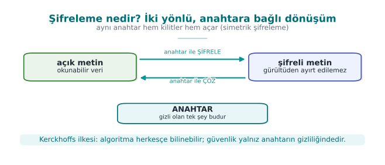
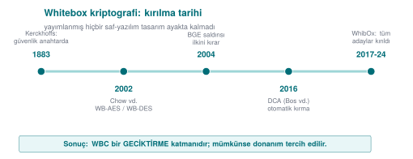
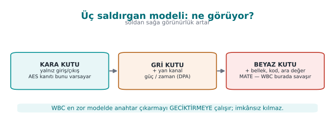
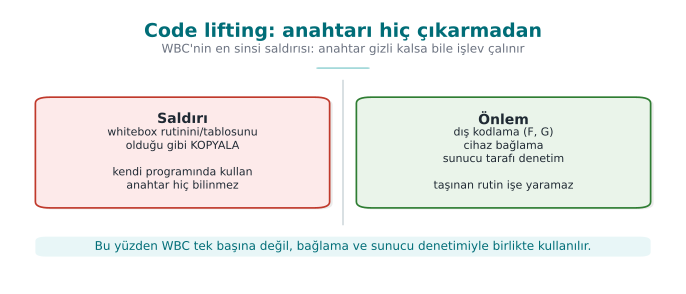
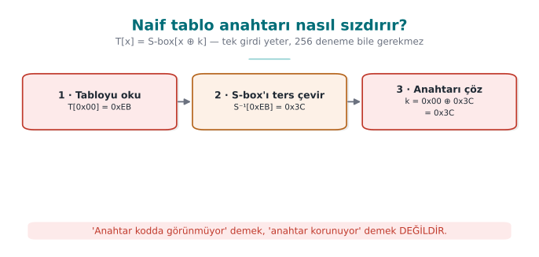
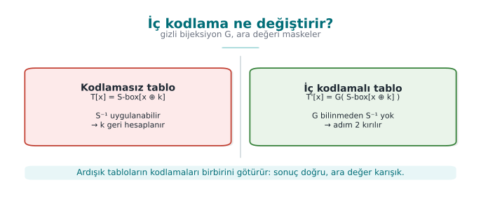
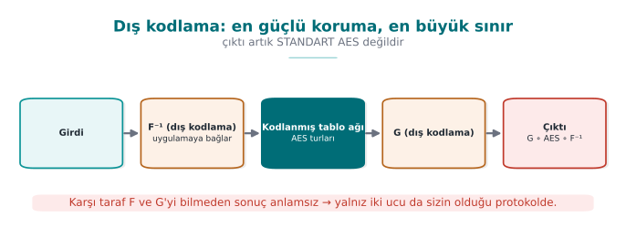
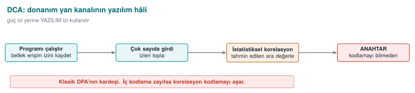
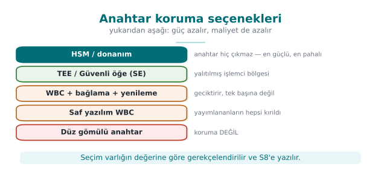
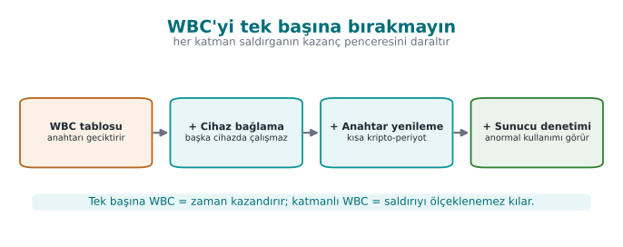

# Hafta 11 — Whitebox Kriptografi

| | |
| --- | --- |
| **Tarih** | 27.11.2026 |
| **Öğrenme çıktıları** | ÖÇ.2, 3 |
| **Süre** | 3 saat |
| **Ön bilgi** | [Hafta 3](../week-3/cen429-week-3.md)'ten simetrik şifreleme ve anahtar yönetimi; [Hafta 9](../week-9/cen429-week-9.md)'dan gizleme kuralları (K-01…K-12); C'de dizi ve XOR işlemi |
| **Uygulamalar** | [`code/week-11`](https://github.com/ucoruh/cen429-secure-programming/tree/main/code/week-11) — 2 demo; `code` klasöründe bir kez derleyin, sonra `bin/linux` (Windows'ta `bin\windows`) altından çalıştırın |

<!-- materyal:basla -->

<div class="materyal" markdown>

[:material-file-pdf-box: Ders notu (PDF)](cen429-week-11-ders-notu.pdf){ .md-button download="cen429-week-11-ders-notu.pdf" }
[:material-file-word-box: Ders notu (DOCX)](cen429-week-11-ders-notu.docx){ .md-button download="cen429-week-11-ders-notu.docx" }
[:material-presentation: Sunum (PDF)](cen429-week-11-sunum.pdf){ .md-button download="cen429-week-11-sunum.pdf" }
[:material-microsoft-powerpoint: Sunum (PPTX)](cen429-week-11-sunum.pptx){ .md-button download="cen429-week-11-sunum.pptx" }
[:material-language-html5: Sunum (HTML, çevrimdışı)](cen429-week-11-sunum.html){ .md-button download="cen429-week-11-sunum.html" }
[:material-folder-zip: Tümünü indir (ZIP)](cen429-week-11-materyal.zip){ .md-button download="cen429-week-11-materyal.zip" }
[:material-fullscreen: Sunumu tam ekran aç](cen429-week-11-sunum.html){ .md-button .md-button--primary target=_blank }

</div>

<div class="sunum-cercevesi">
<iframe src="../cen429-week-11-sunum.html" title="Hafta 11 — Whitebox Kriptografi" loading="lazy" allowfullscreen></iframe>
</div>

<p class="sunum-ipucu">Sunumun içine tıklayıp ok tuşlarıyla ilerleyin; tam ekran için sunumun sağ altındaki düğmeyi ya da yukarıdaki "Sunumu tam ekran aç" bağlantısını kullanın.</p>

<!-- materyal:bitis -->

!!! example "Bu haftanın çalışan demosu"
    `code/week-11/01-oyuncak-tablo` — Oyuncak whitebox: kodlanmamis tablo anahtari sizdirir, kodlanmis tablo naif okumayi durdurur.
    · `code/week-11/02-gomulu-anahtar` — Gömülü (naif) anahtar ikilide fiziksel olarak bulunur → yazılımdaki anahtar korunmaz.

    Çalıştırma: `code` klasöründe bir kez `./build.sh` (Windows'ta `.\build.ps1`), sonra demo klasöründeki `bin/linux` (Windows'ta `bin\windows`) altından. Adım adım komutlar aşağıdaki kutuda. Tümüyle sentetik ve güvenlidir; öğrenci bilgisayarına zarar vermez.


!!! tip "Demoyu kendiniz çalıştırın — adım adım (kopyala-yapıştır)"
    İlk derleme `code/README.md`'de anlatılır. **`code`** klasöründen:

    ```powershell
    # Windows (PowerShell)
    .\build.ps1
    cd week-11\01-oyuncak-tablo
    .\bin\windows\oyuncak_wb.exe
    cd ..\02-gomulu-anahtar
    .\bin\windows\gomulu.exe --tara
    ```

    ```sh
    # WSL / Linux
    ./build.sh
    cd week-11/01-oyuncak-tablo && ./bin/linux/oyuncak_wb
    cd ../02-gomulu-anahtar && ./bin/linux/gomulu --tara
    ```

    **Beklenen çıktı:** Naif tablo `T[x]=S[x⊕k]` gizli anahtarı (`0x3C`) **sızdırır**; kodlanmış tablo **sızdırmaz** (aynı şifreleme, farklı iç yapı). İkinci demo kendi ikilisine gömülü anahtarı **entropi taramasıyla** bulur → "diziye anahtar gömmek koruma değildir".

!!! abstract "Bu haftanın sonunda şunları yapabileceksiniz"
    1. **Kara kutu**, **gri kutu** ve **beyaz kutu** saldırgan modellerini ayırmak; whitebox kriptografinin (WBC)
       çözmeye çalıştığı problemi — "anahtar ve kod aynı anda saldırganın elindeyken" — tanımlamak.
    2. WBC saldırganın yeteneklerini (belleği okuma, akışı izleme, tek turu çalıştırma, hata enjeksiyonu) ve bir
       yazılım anahtarının neden **matematiksel olarak** gizlenemeyeceğini açıklamak.
    3. **Tablo tabanlı** WBC gerçekleştirimini (Chow AES) kavram düzeyinde çözümlemek: kısmi değerlendirme, iç ve dış
       kodlamalar, karıştırıcı bijeksiyonlar; ve bunun **maliyetini** (tablo boyutu, hız) tahmin etmek.
    4. Yayımlanmış WBC tasarımlarının **saldırı geçmişini** (BGE, DCA, DFA) bir güvenlik kuralı olarak okumak: "saf
       yazılım WBC tek başına yeterli değildir".
    5. WBC'yi **katmanlı savunmada doğru yere** koymak: gizleme, RASP, anahtar yenileme, cihaz/sürüm bağlama ve
       sunucu tarafı risk denetimiyle birlikte; ve donanım alternatiflerini (TEE, güvenli öğe, HSM/SoftHSM) tanımak.

??? info "Ders akışı (öğretim üyesi için zaman planı)"
    | Zaman | Bölüm | Ne yapılıyor |
    | --- | --- | --- |
    | 0:00–0:25 | 1 | Kara/gri/beyaz kutu modelleri; WBC saldırgan yetenekleri; problem neden zor? |
    | 0:25–0:50 | 1 | Naif çözümlerin çöküşü: gömülü anahtar, entropi saldırısı, kod sökme (code lifting) |
    | 0:50–0:55 | Ara | |
    | 0:55–1:40 | 2 | Tablo tabanlı WBC (Chow AES): kısmi değerlendirme, iç/dış kodlama, bijeksiyonlar, tablo boyutu ve hız |
    | 1:40–1:45 | Ara | |
    | 1:45–2:20 | 3 | Saldırı geçmişi: BGE, DCA, DFA, WhibOx yarışmaları; "hepsi kırıldı" ve karşı önlemler |
    | 2:20–2:45 | 4 | WBC'nin katmanlı savunmadaki yeri; donanım alternatifleri (TEE/SE, HSM/SoftHSM) |
    | 2:45–3:00 | 5+ | Hatalı→saldırı→koruma örneği; proje S8; kendini sınama |

!!! info "Bu haftanın kaynakları hakkında"
    Bu hafta iki ana kaynağa dayanır: (1) **güvenli programlama teknik kılavuzu** — WBC saldırgan modelini ve bir
    üründe whitebox AES'in nasıl konumlandığını (anahtarların "güvence altına alınması ve/veya gizlenmesi"
    gereksinimi) anlatır; (2) alanın **temel akademik kaynakları** (Chow vd. 2002; kriptanaliz için BGE, DCA, DFA).
    WBC saldırgan yeteneklerini burada **savunmayı sınamak** için öğreniriz; çalışan saldırı kodu yazmayız. Bütün
    örnekler ve anahtarlar **sentetiktir**. Bu hafta 3. haftadaki "gizlilik kriptografinin işidir" ve 9. haftadaki
    "gizleme anahtarı korumaz" kurallarının doğal devamıdır.

---

## 0. Başlamadan önce

Bu bölüm, bu haftayı hangi temeller üzerine kurduğumuzu gösterir: önce önceki haftalardan getirdiğimiz kavramları
kısaca hatırlatır, sonra yalnız bu haftaya özgü yeni terimleri (S-box'tan GF(2)'ye) sıfırdan tanımlar; gövdedeki
bölümler bu terimleri artık bildiğinizi varsayarak ilerler.

### Önceki haftalardan gelenler



- **Şifreleme, anahtar ve simetrik/asimetrik şifreleme** — açık metni bir anahtarla okunamaz şifreli metne
  dönüştürmek şifrelemedir; simetrik şifreleme (ör. AES) aynı anahtarı kullanıp hızlı çalışır, asimetrik (ör. RSA)
  açık/gizli anahtar çiftiyle yavaş ama anahtar dağıtımı kolay çalışır; güvenlik anahtarın gizliliğine dayanır,
  algoritmanın gizliliğine değil (Kerckhoffs ilkesi)
  ([Hafta 3, §2](../week-3/cen429-week-3.md#2-sifreleme-temelleri-hangi-arac-neyi-korur)). Bu hafta bu ilkeyi beyaz
  kutu ortamına taşıyoruz: burada algoritma da anahtar da saldırganın elindedir (§1).
- **AES ve bit güvenlik düzeyi** — AES en yaygın simetrik şifreleme algoritmasıdır; 16 baytlık bloklar üzerinde,
  turlar hâlinde bayt değiştirme, satır/sütun karıştırma ve anahtar ekleme adımlarıyla çalışır (ayrıntı bu hafta
  sınavda sorulmayacak, whitebox için gereken fikir düzeyi yeterlidir). "n-bit güvenlik", bir anahtarı kırmak için
  kabaca 2ⁿ deneme gerektiği anlamına gelir; AES-128, 128 bit güvenlik sağlar
  ([Hafta 10, §1](../week-10/cen429-week-10.md#1-kriptografinin-haritasi-ve-algoritma-secimi)). Bu hafta ağırlıklı
  AES üstünden gideceğiz; bit-güvenlik ölçüsünü ise anahtarın kendisi için değil, whitebox tablolarının
  **boyut/hız maliyetini** tahmin etmek için yeniden kullanacağız (§3).
- **XOR** — bitler farklıysa 1, aynıysa 0 veren işlem; `a XOR b XOR b == a` olduğu için geri alınabilirdir
  ([Hafta 5, §12](../week-5/cen429-week-5.md#12-dize-gizleme-ve-dinamik-yontem-cagrisi); [9. haftada](../week-9/cen429-week-9.md) dize gizlemede
  de kullanılmıştı). AES'te "anahtar ekleme" adımı bir XOR'dur (`durum XOR anahtar`); bu hafta hem Chow AES'in
  kurulumunda (§3) hem de "yalnız XOR ile karıştırmanın neden işe yaramadığını" gösteren sayısal örnekte (§2)
  merkezî rol oynar.
- **Entropi** — bir veri bloğunun ne kadar rastgele/öngörülemez göründüğünün ölçüsü; yüksek entropili bloklar
  genelde şifreli/rastgele veri, düşük entropili bloklar sıradan metin/veridir
  ([Hafta 2, §6](../week-2/cen429-week-2.md#demo-02-entropi-olcer-sifrelipaketli-icerik-nasil-anlasilir); 9.
  haftada ikili dosya analizinde de görmüştük). Bu hafta **entropi taraması**, sabit bir diziye gömülmüş bir
  anahtarı saniyeler içinde bulan statik analiz tekniği olarak karşımıza çıkıyor (§1, §2).
- **Hata ayıklayıcı (debugger)** — bir programı adım adım çalıştırmanıza, o an bellekte olan her değeri ve işlemci
  kayıtlarını okumanıza izin veren araç (ör. `gdb`, `x64dbg`)
  ([Hafta 6, §4](../week-6/cen429-week-6.md#4-hata-ayiklayici-debugger-algilama)). Bu hafta beyaz kutu saldırganın
  "çalışmayı gözlemleme" ve "yalnız bir turu çalıştırma" yeteneğinin somut karşılığı tam olarak budur (§1).
- **Statik ve dinamik analiz** — statik analiz programı çalıştırmadan, dinamik analiz çalıştırarak yapılan
  incelemedir ([Hafta 4, §9](../week-4/cen429-week-4.md#9-statik-analiz-kodu-calistirmadan-hata-aramak)). Bu hafta
  bu ayrımı saldırıları sınıflamak için kullanıyoruz: entropi taraması ve BGE **statiktir** (§2, §4), DCA ve DFA
  **dinamiktir** (§3, §4).
- **Enstrümantasyon ve emülatör** — enstrümantasyon bir programı çalışırken belirli noktalarda neyin işlendiğini
  otomatik kaydedecek şekilde donatmaktır; emülatör gerçek işlemciyi yazılımla taklit eden bir araçtır
  ([Hafta 6, §5](../week-6/cen429-week-6.md#5-ortam-algilama-sanal-makine-ve-emulator)–[§6](../week-6/cen429-week-6.md#6-kanca-ve-enstrumantasyon-algilama-ld_preload-frida)).
  Bu hafta bir saldırganın whitebox rutinini binlerce kez otomatik çalıştırıp her arama tablosu erişimini
  kaydetmesinin — yani **DCA**'nın ön koşulunun — aracı bu ikisidir (§1, §3–§4).
- **HSM ve SoftHSM** — HSM, anahtarları saklayıp işleyen, anahtarın hiç dışarı çıkmadığı özel donanımdır; SoftHSM
  aynı arayüzü (PKCS#11) yazılımla taklit eder ama donanım koruması sağlamaz
  ([Hafta 10, §11](../week-10/cen429-week-10.md#11-anahtari-donanimda-saklamak-hsm-pkcs11-ve-softhsm)). Bu hafta
  bunları whitebox'ın **sunucu tarafı** karşılığı olarak, anahtar koruma seçeneklerinin en güçlü ucunda yeniden ele
  alıyoruz (§5).

### Ön bilgi: S-box ve arama tablosu

Bir **arama tablosu (lookup table)**, her girdiye karşılık önceden hesaplanmış bir çıktı veren bir dizidir:
`T[x]` biçiminde hesap yapmak yerine doğrudan tablodan okursunuz, bu da işlemi hızlandırır. AES'in "bayt değiştirme"
adımında kullanılan **S-box (substitution box)** böyle bir tablodur: her baytı sabit bir kurala göre başka bir
baytla değiştirir — ör. `S-box[0x53] = 0xED` gibi 256 girişli bir eşleme. Bu tabloyu aklınızda tutun; whitebox'ın
kalbi budur.

### Ön bilgi: yan kanal ve DPA

Bir **yan kanal (side channel)**, algoritmanın matematiğini değil, çalışırken sızdırdığı fiziksel/dolaylı bilgiyi
(harcanan zaman, güç tüketimi, elektromanyetik yayım) kullanan bir saldırı türüdür; akıllı kartlara karşı klasik
bir tekniktir. **DPA (Differential Power Analysis)** bunun somut bir örneğidir: bir cihazın güç tüketimi
ölçümlerine istatistik uygulayarak, cihazın içine hiç bakmadan anahtarı çıkarır. Bu fikri aklınızda tutun;
whitebox'ın en güçlü saldırısı (DCA, §4) DPA'nın yazılım hâlidir.

### Ön bilgi: bijeksiyon ve permütasyon

Bir **bijeksiyon (birebir-örten eşleme)**, her girdiyi tam bir çıktıya eşleyen ve tersi alınabilen bir dönüşümdür;
ör. `f(x) = x ^ 0x5A` bir bijeksiyondur (tersi yine kendisidir). Bir **permütasyon**, sonlu bir kümenin elemanlarını
yeniden sıralayan özel bir bijeksiyondur: her eleman tam olarak bir kez, başka bir elemanın yerine geçer — ör.
`{0,1,2,3}` kümesi üzerinde `0→2, 1→0, 2→3, 3→1` bir permütasyondur, hiçbir değer atlanmamış ya da tekrar
edilmemiştir. S-box, sabit boyutlu bayt değerleri kümesinin bir permütasyonudur; §3'te kuracağımız oyuncak S-box da
aynı fikrin küçük (4 elemanlı) bir örneğidir. Whitebox, tabloları tam olarak bu tür gizli bijeksiyonlarla sarar.

### Ön bilgi: TEE ve güvenli öğe (SE)

**TEE (Trusted Execution Environment)**, telefon işlemcisinin işletim sisteminden yalıtılmış güvenli bölgesidir;
**güvenli öğe (SE)** ise anahtarları saklayan, ayrı ve kurcalamaya dirençli bir donanım çipidir. İkisi de anahtar
için en güçlü korumadır; whitebox kriptografi tam olarak bunların **bulunmadığı** durumlar için geliştirilmiştir
(§5).

### Ön bilgi: yürütme izi ve korelasyon

Bir **yürütme izi (execution trace)**, bir çalıştırma boyunca kaydedilen ara değerler dizisidir — hangi bellek
adresi okundu, hangi değer yazıldı, hangi komut çalıştı. Kara kutuda saldırgan yalnız son çıktıyı görürken, beyaz
kutuda isterse tüm izi kaydedebilir. **Korelasyon**, iki değişkenin (ör. gözlenen bir değer ile bir anahtar
hipoteziyle hesaplanan tahmini değer) birlikte, tutarlı biçimde değişip değişmediğinin ölçüsüdür; yüksek korelasyon
iki değişkenin birbirine bağlı olduğunu gösterir. DPA ve onun yazılım hâli DCA (§1, §3–§4), doğru anahtar
hipotezini yanlışlarından ayırmak için tam olarak bu ikisini birlikte kullanır: çok sayıda yürütme izi toplanır,
sonra her hipotez için gözlenenle tahmin edilen arasındaki korelasyon ölçülür.

### Ön bilgi: GF(2) ve matris

Bir **sonlu cisim (finite field)**, üzerinde toplama ve çarpma tanımlı, sınırlı sayıda elemanı olan bir sayı
sistemidir. **GF(2)**, yalnız `{0, 1}` elemanlarından oluşan en küçük sonlu cisimdir; bu cisimde toplama tam olarak
**XOR**, çarpma ise AND işlemidir. Bir **matris**, sayıların (burada yalnız 0 ve 1'lerin) dikdörtgen bir düzende
dizilişidir; girdinin bitlerini böyle bir matrisle "çarpmak" aslında seçili bitleri XOR'lamaktır (**doğrusal
dönüşüm**). Bir matris **tekil değilse (non-singular)**, yani tersi varsa, uyguladığı dönüşüm geri alınabilirdir —
bilgi kaybolmaz, yalnız karışır; bir matrisin kaç bağımsız satır/sütuna sahip olduğunun ölçüsüne **rank** denir,
"tam rank" bir matrisin tekil olmadığı anlamına gelir. Whitebox'ın §3'te (Adım 4) göreceğimiz karıştırıcı
matrisleri her zaman tekil olmayan seçilir; aksi hâlde şifre çözülemez hale gelirdi. Ayrıntılı sonlu cisim
aritmetiği sınav kapsamı dışıdır; GF(2)'yi yalnız "XOR'larla çalışan, geri alınabilir bir doğrusal işlem dünyası"
olarak hatırlamanız yeterlidir.

### Kavramlar birbirine nasıl bağlanır?

Bu terimler hafta boyunca **tek başlarına** değil, birbirine **bağlı zincirler** halinde kullanılacak. Üç ana
zinciri şimdiden görelim, çünkü bölümler ilerledikçe bu zincirlerin **her halkasına** döneceğiz:

- **Kurma zinciri:** anahtar → S-box → arama tablosu (kısmi değerlendirme) → bijeksiyon (iç/dış kodlama) → GF(2)
  matrisi (karıştırma). Bu zincir Bölüm 3'te, oyuncak S-box'ımızla **elle** kurulacak.
- **Saldırı zinciri:** statik/dinamik analiz → entropi taraması / hata ayıklayıcı → yürütme izi → korelasyon.
  Bu zincir Bölüm 1, 3 ve 4'te, önce beyaz kutu saldırganın oturumunda, sonra DCA örneğinde **somutlaşacak**.
- **Savunma zinciri:** TEE/SE/HSM → WBC (kurma zincirinin ürünü) → anahtar yenileme + cihaz bağlama + sunucu
  denetimi. Bu zincir Bölüm 5 ve 6'da bir araya gelecek.

Bir terimi tek başına ezberlemek yerine, **hangi zincirin hangi halkasında** olduğunu hatırlamaya çalışın; bu,
dersin sonundaki (Bölüm 8) terimler sözlüğünde de aynı mantıkla düzenlenmiştir.

Şimdi asıl soruya: **anahtar saldırganın elindeyken ne yaparız?**

## 1. Üç saldırgan modeli: kara, gri, beyaz kutu

Kriptografiyi 3. ve 10. haftalarda **kara kutu** varsayımıyla ele aldık: saldırgan yalnız girdiyi ve çıktıyı görür,
anahtarı ve algoritmanın iç durumunu göremez. AES, RSA, HMAC gibi standart algoritmaların güvenlik kanıtları bu
varsayıma dayanır. Ama bu varsayım, kodu kullanıcıya teslim ettiğimizde çöker.

!!! note "Kısa tarihçe: whitebox kriptografi nereden geldi?"
    - **1883** — Kerckhoffs ilkesi: güvenlik **anahtarda** olmalı, sistemin gizliliğinde değil. Beyaz kutu düşüncesinin kökü budur.
    - **2002** — Chow, Eisen, Johnson, van Oorschot ilk **whitebox AES** ve **whitebox DES**'i (DRM için) yayımlar. WBC'nin doğuşu.
    - **2004** — Billet–Gilbert–Ech-Chatbi (**BGE saldırısı**) ilk WB-AES'i kırar → "hepsi kırılır" kuralının başlangıcı.
    - **2016** — Bos vd. **DCA** (Differential Computation Analysis): donanımdaki DPA'yı yazılıma taşır, birçok WBC'yi **otomatik** kırar.
    - **2017–2024** — **WhibOx** yarışmalarında yayımlanan tüm saf-yazılım WB-AES adayları kırıldı → bugünkü kural: WBC bir **geciktirme katmanıdır**; mümkünse donanım (TEE/SE/HSM) tercih edilir.





Görünürlük soldan sağa artar; WBC en zor (beyaz kutu) modelde anahtar çıkarmayı **geciktirmeye** çalışır.

| Model | Saldırgan neyi görür/yapar? | Tipik ortam |
| --- | --- | --- |
| **Kara kutu** | Yalnız girdi ve çıktı | Uzak sunucu; ağ saldırganı |
| **Gri kutu** | Girdi/çıktı + **yan kanallar** (zaman, güç, elektromanyetik) | Akıllı kart, gömülü cihaz (yan kanal saldırıları) |
| **Beyaz kutu** | **Her şey**: kod, bellek, ara değerler; ayrıca değiştirebilir | Yazılım, saldırganın kendi cihazında |

Whitebox kriptografi (WBC), **beyaz kutu** ortamda çalışan bir şifreleme algoritmasının güvenlik sorunlarını
inceler. Kaynağın diliyle: WBC saldırgan modeli Chow ve arkadaşları tarafından 2002'de tanımlanmıştır ve saldırganın
şu yetenekleri vardır (bunları savunmanın **karşı koyması gerekenler** olarak okuyun):

- **Çalışmayı gözlemleme:** o an işlenen komutlara erişim, algoritma akışını izleme, kullanılan belleği görme.
- **Ortamı denetleme / çalışma anında değiştirme:** program belleğini kurcalama, algoritmanın **yalnız bir parçasını**
  (ör. şifrenin bir turunu) çalıştırma, if koşullarını değiştirme, döngü sayaçlarını değiştirme, **hata enjekte etme**.

!!! quote "Kaynağın gereksinimi"
    Teknik kılavuz bu bölümü bir uyum maddesiyle açar: *"Kriptografik anahtarlar, gizlilik ve bütünlüğü korumak için
    güvence altına alınmalı ve/veya gizlenmelidir."* Ama hemen ekler: bu saldırgan yeteneklerine karşı uygulamayı ve
    varlıkları koruyan şey **yalnız WBC değil, kod sağlamlaştırma (9. hafta) ve RASP ([6. hafta](../week-6/cen429-week-6.md)) yöntemleridir.** Yani
    WBC daha ilk cümlede **tek başına bir çözüm olarak sunulmaz.**

### Somut örnek: bir beyaz kutu saldırganın bir oturumu (adım adım anlatı)

Yukarıdaki yetenek listesi soyut kalmasın; bir saldırganın **gerçekte ne yaptığını**, baştan sona, tek tek
izleyelim. Senaryo tamamen **kavramsal ve sentetiktir**; hiçbir gerçek araç komutu ya da gerçek uygulama adı
kullanılmaz — amaç adımların **sırasını ve mantığını** görmektir.

1. **Edinme.** Saldırgan, hedef mobil uygulamanın kurulum dosyasını (ör. bir `.apk`/`.ipa`) kendi bilgisayarına
   indirir. Bu, beyaz kutu modelinin **başlangıç koşuludur**: kod artık saldırganın **kendi cihazındadır**, sunucuda
   değil.
2. **Statik analiz.** Saldırgan önce programı **çalıştırmadan** inceler: paketi açar, bir ayrıştırıcıyla
   fonksiyonları listeler, `strings` benzeri bir araçla metin sabitlerini tarar. Az önce Bölüm 0'da tanımladığımız
   **entropi taraması** da burada devreye girer: yüksek entropili bloklar (olası anahtarlar/sabitler) işaretlenir.
3. **Dinamik analiz — hata ayıklayıcıya bağlanma.** Saldırgan uygulamayı kendi cihazında **çalıştırır** ve bir hata
   ayıklayıcıya bağlar. Şifreleme fonksiyonunun çağrıldığı noktaya bir **kesme noktası (breakpoint)** koyar. Bu,
   saldırgan modelindeki "çalışmayı gözlemleme" yeteneğinin somut karşılığıdır.
4. **Ara durumu okuma.** Program kesme noktasında durduğunda, saldırgan o anki **kayıtları (register)** ve **belleği**
   okur. Eğer anahtar düz bir değişkende duruyorsa, burada **doğrudan görünür**. Bu, "belleği okuma" yeteneğinin
   somut karşılığıdır.
5. **Kısmi çalıştırma / kurcalama.** Saldırgan isterse şifrelemenin yalnız **bir turunu** çalıştırıp durdurabilir,
   bir koşulu (`if`) atlayabilir ya da bir değeri elle değiştirip devam ettirebilir (**hata enjeksiyonu**). Bu, 4.
   bölümde göreceğimiz **DFA** saldırısının ön koşuludur.
6. **Tekrar ve otomasyon.** Saldırgan bu adımları **binlerce farklı girdi** için otomatikleştirir (Bölüm 0'daki
   enstrümantasyon/emülatör), her seferinde ara değerleri bir **yürütme izi** olarak kaydeder. Bu, 4. bölümdeki
   **DCA** saldırısının ön koşuludur.

**Kritik gözlem:** Bu altı adımın hiçbirinde saldırgan **ağdan** bir şey dinlemedi; hepsi **kendi cihazında, kendi
kopyasında** oldu. Kara kutu modelinin varsaydığı "saldırgan yalnız girdi/çıktı görür" varsayımı burada baştan
**geçersizdir** — çünkü saldırgan aynı zamanda **kullanıcıdır**.

!!! danger "Sık yapılan hata → sonuç → kural"
    **Hata:** İstemci tarafı (mobil/masaüstü) kod için de "saldırgan yalnız girdi/çıktıyı görür" (kara kutu)
    varsayımıyla tasarım yapmak — ör. "AES anahtarını C kodunda tutarım, kaynak kodu kimse görmez" demek.

    **Sonuç:** Yukarıdaki altı adım saldırganı **dakikalar içinde** anahtara götürür; kaynak kodun "görünmemesi"
    hiçbir şeyi durdurmaz, çünkü saldırgan **derlenmiş ikiliyi** okur/çalıştırır, kaynağı değil.

    **Kural:** İstemci tarafında çalışan her bileşen için saldırgan modelini **beyaz kutu** kabul edin. Bir
    varlığın (anahtar, algoritma, iş mantığı) istemcide "gizli" kalacağını varsaymayın; ya donanıma (TEE/SE, Bölüm 5)
    taşıyın ya da WBC + katmanlı savunmayla (Bölüm 3–5) **maliyetini artırın**, ya da varlığı hiç istemciye
    koymayın (sunucuda tutun).

### Karşılaştırma için: bir gri kutu saldırganın oturumu neye benzer?

Beyaz kutu saldırganın altı adımını gri kutuyla karşılaştırmak, aradaki farkı netleştirir. Gri kutu saldırgan,
**akıllı kart ya da gömülü cihaz** gibi bir ortamda çalışır — kod onun elinde **değildir**, ama cihaz onun elinin
altındadır:

1. **Erişim.** Saldırgan, hedef cihazın (ör. bir ödeme kartının) **fiziksel bir kopyasını** edinir. Kodu okuyamaz,
   belleğe giremez (kara kutuya benzer bu yönüyle) — ama cihazı **çalıştırabilir ve dışarıdan gözlemleyebilir**.
2. **Ölçüm düzeneği kurma.** Saldırgan, kart çalışırken çektiği **gücü** (ya da yaydığı elektromanyetik sinyali)
   ölçen bir düzenek kurar. Bu, Bölüm 0'daki **yan kanal** tanımının fiziksel karşılığıdır.
3. **Çok sayıda çalıştırma.** Saldırgan karta **farklı** girdiler (ör. farklı açık metinler) vererek, her biri için
   şifreleme işlemini tetikler ve **her çalıştırmanın güç izini** kaydeder — beyaz kutudaki "yürütme izi"nin
   fiziksel karşılığı, ama saldırgan kodu değil **cihazın dışarıdan ölçülebilir davranışını** kaydeder.
4. **İstatistiksel analiz (DPA).** Toplanan izler, farklı anahtar hipotezleriyle karşılaştırılır; doğru hipotez,
   izlerdeki bir örüntüyle **istatistiksel olarak korele** çıkar (Bölüm 0'daki korelasyon tanımı). Bu, klasik
   **DPA**'dır.

**Fark nerede?** Beyaz kutu saldırgan **koda ve belleğe doğrudan erişir** (adım 3–4'te hata ayıklayıcıyla); gri
kutu saldırgan **hiçbir zaman kodu görmez**, yalnız cihazın **fiziksel yan etkilerini** (güç, zaman, elektromanyetik
yayım) ölçer. Ortak nokta ise adım 3–4'ün mantığıdır: **çok sayıda çalıştırma + istatistiksel karşılaştırma**. Bu
ortak mantık, Bölüm 3 ve 4'te göreceğimiz **DCA**'nın (DPA'nın **yazılım** hâli) neden "whitebox'ın DPA'sı" olarak
anıldığını açıklar — DCA, gri kutunun bu istatistiksel fikrini, beyaz kutunun **doğrudan gözlemlenebilen** yürütme
izlerine uygular; fiziksel bir ölçüm düzeneğine hiç ihtiyaç duymaz.

!!! note "Neden gri kutu saldırgan whitebox'ı doğrudan kıramaz?"
    Gri kutu saldırganın elinde **yalnız fiziksel bir cihaz** vardır; whitebox saf yazılımdır (ör. bir mobil
    uygulama), fiziksel bir "güç tüketimi" ölçülecek ayrı bir donanım değildir — yazılım, kullanıcının **kendi**
    telefonunda, kendi işletim sisteminin kaynaklarını kullanarak çalışır. Bu yüzden whitebox'a yönelik saldırı
    (DCA), gri kutunun **istatistiksel fikrini** ödünç alır ama gri kutunun **fiziksel ölçüm ortamını** değil;
    bunun yerine Bölüm 0'daki enstrümantasyon/emülatörle üretilen **yazılım izlerini** kullanır.

!!! danger "Sık yapılan hata → sonuç → kural"
    **Hata:** Üç modeli birbirinin **yerine geçebilir** sanmak — ör. "yan kanal saldırılarına karşı önlem aldık
    (gri kutu), demek ki whitebox saldırılarına karşı da korumalıyız" ya da tam tersi, "kodumuzu sağlamlaştırdık
    (beyaz kutuya karşı statik analiz), demek ki yan kanal saldırılarına karşı da güvendeyiz" demek.

    **Sonuç:** Gri kutu savunması (ör. sabit zamanlı karşılaştırma, 3. hafta) **statik analize karşı hiçbir şey**
    yapmaz; kod sağlamlaştırma (9. hafta, statik analize karşı) da **dinamik** saldırılara (DCA, DFA) karşı **tek
    başına** yetmez (Bölüm 4). Model karıştırmak, bir tehdide karşı önlem alıp **başka bir tehdidi unutmakla**
    sonuçlanır.

    **Kural:** Her savunma önlemi için "bu, **hangi modeldeki** hangi yeteneğe karşı?" sorusunu açıkça sorun.
    Bölüm 4'teki "hangi karşı önlem hangi saldırıyı zorlaştırır?" tablosu tam olarak bu karışıklığı önlemek için
    kuruldu.

### Bu üç model önceki haftalarla nasıl bağlanıyor?

Bu ayrım havadan gelmiyor; 3., 9. ve 10. haftalarda kurduğumuz kuralların **doğal devamıdır**:

- **[3. hafta — Kerckhoffs ilkesi](../week-3/cen429-week-3.md#2-sifreleme-temelleri-hangi-arac-neyi-korur).**
  "Güvenlik anahtarın gizliliğine dayanmalı, algoritmanın gizliliğine değil" ilkesini öğrenmiştik. Beyaz kutu modeli
  bunu bir adım öteye taşır: burada **algoritma da anahtar da** saldırganın elindedir; geriye yalnız "anahtarı
  çıkarmayı ne kadar pahalılaştırabilirim" sorusu kalır.
- **[9. hafta — gizleme kuralları (K-01…K-08)](../week-9/cen429-week-9.md#5-kontrol-akisi-kurallari-ileri).** O
  hafta kontrol akışını (K-04), sabitleri (K-02, K-07) ve boole değerlerini (K-08) gizleyen kuralları görmüştük;
  hepsi **kod sağlamlaştırma**ydı, yani beyaz kutu saldırganın **statik analizini** zorlaştırıyordu. WBC bunun
  kriptografiye özel, çok daha güçlü bir türüdür: yalnız kodu değil, **anahtarı** kodun matematiğine gömer.
- **[10. hafta — algoritmalar ve anahtar yönetimi](../week-10/cen429-week-10.md#1-kriptografinin-haritasi-ve-algoritma-secimi).**
  Standart AES/RSA/HMAC'ın güvenlik kanıtları **kara kutu** modelinde yazılır. Bu hafta öğreneceğimiz şey, aynı AES
  algoritmasının **beyaz kutu** bir ortamda çalıştırılması gerektiğinde, o kara kutu güvenlik kanıtının **artık
  geçerli olmadığıdır** — WBC, bu boşluğu (kısmen ve pahalı bir şekilde) kapatmaya çalışır.

!!! tip "Bir cümlede özet"
    Kara kutu = "içeri bakamazsın". Gri kutu = "içeri bakamazsın ama dışarıdan sızıntı dinleyebilirsin". Beyaz kutu
    = "her şeyi görebilir, hatta değiştirebilirsin". WBC, üçüncü modelin **matematiksel** bir yanıtıdır.

## 2. Problem neden bu kadar zor?

Beyaz kutuda temel gerilim şudur: program şifrelemeyi yapabilmek için anahtara **erişebilmek** zorundadır; ama
saldırgan da programın gördüğü her şeyi görür. Yani anahtar, bir noktada, saldırganın da görebildiği bir yerdedir.
WBC'nin fikri, anahtarı **hiçbir zaman açıkça var olmayacak** biçimde algoritmanın içine "pişirmektir": anahtar,
önceden hesaplanmış **arama tablolarının** içine gömülür, böylece bellekte "işte anahtar bu" diyebileceğiniz bir
bayt dizisi bulunmaz.



Bu, gizliliği kriptografiden gizlemeye taşımaz; **matematiksel bir dönüşümle** anahtarı tablolara dağıtmaya çalışır.
Amaç yine bir **maliyet kuralıdır** (9. haftadaki gibi): anahtarı tablolardan geri çıkarmayı, onu düz saklamaktan
çok daha pahalı hale getirmek.

### Naif çözümlerin neden çöktüğü (kurallar)

WBC'ye neden ihtiyaç olduğunu görmek için, işe yaramayan "kolay" çözümleri ve onları kıran saldırıları bilmek
gerekir. Her biri bir güvenli programlama kuralına dönüşür:

- **Kural — Anahtarı sabit diziye gömme.** En naif çözüm anahtarı bir `static const uint8_t key[16]` dizisine
  koymaktır. Bu, `strings` ve **entropi taraması** (Shamir–van Someren'in gözlemi: kriptografik anahtarlar yüksek
  entropili bloklardır ve ikili dosyada öyle görünürler) ile saniyeler içinde bulunur; bir hata ayıklayıcıyla
  doğrulanır. **Sonuç:** düz gömülü anahtar bir anahtar koruması değildir.
- **Kural — Anahtarı yalnız XOR/whitening ile "karıştırma".** Anahtarı bir maskeyle XOR'layıp saklamak da işe
  yaramaz: maske de ikili dosyadadır, program onu çözebiliyorsa saldırgan da çözer.
- **Kod sökme (code lifting) tehdidi.** WBC anahtarı tablolara gömse bile, saldırgan **anahtarı çıkarmadan**
  şifreleme/çözme yapan kod parçasını (tablolar + yorumlayıcı) olduğu gibi kopyalayıp kendi programında
  kullanabilir. Anahtarı hiç bilmeden onun işlevini çalar. **Sonuç:** WBC'nin tek başına "anahtarı gizledim"
  demesi yetmez; kod sökmeye karşı **cihaz/sürüm bağlama** (bölüm 4) gerekir.
- **Kural — "Test/hata ayıklama anahtarını" unutmak.** Çok yaygın bir gerçek dünya hatası: geliştirici test
  aşamasında kolaylık olsun diye gerçek anahtarın yerine **sabit bir "test anahtarı"** koyar (`static const
  uint8_t k[16] = {0x00, 0x01, ...}` gibi, ya da bir yapılandırma dosyasında düz metin) ve bunu üretime **taşımayı
  unutur** ya da "zaten geçici" diye önemsemez. **Sonuç:** Bu, Bölüm 2'nin ilk kuralıyla (düz gömülü anahtar)
  **birebir aynı** zafiyettir — yalnız "test amaçlı" etiketi, gerçek riskini **azaltmaz**. Bir değerlendirici
  ([12. hafta](../week-12/cen429-week-12.md)) test/hata ayıklama yollarını da üretim koduyla **aynı ciddiyette** tarar.

!!! danger "Bu haftanın ana kuralı, baştan"
    Yayımlanmış hiçbir saf yazılım whitebox tasarımı bugüne kadar kırılmadan kalmamıştır. O yüzden WBC'yi **"anahtarı
    güvene alan sihir"** olarak değil, **"anahtar çıkarmayı geciktiren ve diğer katmanlarla birlikte anlam kazanan
    bir katman"** olarak öğreneceğiz. Bu, 9. haftanın gizleme kurallarının kriptografiye uygulanmış halidir.

### Sayısal mikro-örnek: "yalnız XOR ile karıştırma" neden işe yaramaz?

Yukarıdaki ikinci kuralı ("anahtarı yalnız XOR/whitening ile karıştırmak işe yaramaz") havada bırakmayalım; küçük
ama gerçek baytlarla, **tek tek** görelim.

**Kurulum.** Bir geliştirici, gizli anahtar baytı `k = 0x3C`'yi ikilide **düz** tutmak yerine, rastgele bir
maskeyle XOR'layıp saklamaya karar verir. Maske `m = 0x5A` olsun. Kodda saklanan değer:

```text
kodlanmis_k = k XOR m = 0x3C XOR 0x5A
```

**Adım 1 — XOR'u bit bit hesaplayalım.**

```text
0x3C = 0011 1100
0x5A = 0101 1010
      ----------- XOR
      = 0110 0110 = 0x66
```

Yani ikilide `kodlanmis_k = 0x66` olarak duruyor. Geliştirici "anahtar artık düz görünmüyor, gizlendi" diye
düşünür.

**Adım 2 — Programın kendisi maskeyi de içermek zorunda.** Program, şifreleme anında gerçek anahtara ihtiyaç
duyar; yani bir yerde şu hesabı yapmak **zorundadır**:

```c
uint8_t k_gercek = kodlanmis_k ^ m;   /* m de ikilide bir yerde olmalı! */
```

`m = 0x5A` sabiti de ikilinin içinde, `kodlanmis_k = 0x66` sabitinin **yanı başında** durur (ikisi de statik
verilerdir).

**Adım 3 — Saldırganın yaptığı işlem.** Saldırgan ikiliden iki baytı da okur (`0x66` ve `0x5A`) ve aynı XOR'u
**kendisi** yapar:

```text
k = kodlanmis_k XOR m = 0x66 XOR 0x5A
  = 0110 0110
  ^ 0101 1010
  -----------
  = 0011 1100 = 0x3C        ← ANAHTAR YİNE BULUNDU
```

**Sonuç.** Maskeleme, anahtarın ikilideki **bit örüntüsünü** değiştirir ama korumayı değiştirmez: program maskeyi
çözebiliyorsa, aynı hesabı okuyabilen saldırgan da çözer. Bu, tam olarak
[9. haftanın **K-07 (statik dize (string)/sabit kodlama)**](../week-9/cen429-week-9.md#kural-k-07-statik-dizelerin-kodlanmasi)
kuralının sınırıyla aynı derstir — kodlama tek başına, **çözme anahtarı da yanında duruyorsa**, hiçbir şey
kazandırmaz.

!!! danger "Çıkarılan kural"
    Bir gizli değeri, **çözülmesi için gereken bütün bilgiyle birlikte** aynı ikilide taşımak, gizleme değildir —
    yalnız **görünümü** değiştirir. Whitebox'ın Bölüm 3'te göreceğimiz iç/dış kodlamaları bu tuzağa düşmez, çünkü
    kodlama bijeksiyonları (`G`, `F`) hiçbir yerde **açık bir sabit olarak saklanmaz**; kodun kendi **yapısına**
    (tabloların birbirine nasıl bağlandığına) dağıtılır. Bu farkı Bölüm 3'te elle kuracağımız örnekte göreceğiz.

### Kod sökme (code lifting) — biraz daha derin

Yukarıda kod sökmeyi tanımladık: saldırganın anahtarı hiç çıkarmadan, tabloları ve onları çalıştıran yorumlayıcıyı
**olduğu gibi kopyalayıp** başka bir programda kullanması. Bunun neden ciddi bir tehdit olduğunu bir örnekle
somutlaştıralım:

!!! example "Kavramsal senaryo: kod sökme"
    Bir ödeme uygulaması, bir işlemi onaylamak için whitebox AES ile şifrelenmiş bir belirteç (token) üretiyor
    olsun. Saldırgan anahtarı **hiç bilmeden**, whitebox rutinini (tablolar + onu çağıran kod) uygulamadan
    **bütünüyle kopyalayıp** kendi programına yapıştırır. Artık kendi programı da **geçerli belirteçler**
    üretebilir — sanki anahtarı biliyormuş gibi. Saldırgan anahtarı hiçbir zaman "görmedi"; yalnız **işlevi
    çaldı**.

Bunun WBC'ye özgü olmasının nedeni şudur: normal bir programda (anahtar apaçık bir değişkende) saldırgan zaten
anahtarı **çıkarıp** istediği yerde kullanabilir; kod sökmeye gerek yoktur. WBC'de ise anahtar **çıkarılamıyor
olabilir** (dış kodlamalar güçlüyse), ama tablolar yine de **çalışan bir makine** oluşturur — ve çalışan bir
makineyi kopyalamak, onun matematiğini çözmekten çoğu zaman **çok daha kolaydır**.
[9. haftanın **K-06 (çağrı ve bağımlılık gizleme)**](../week-9/cen429-week-9.md#kural-k-06-fonksiyon-cagrilarinin-ve-dis-kutuphane-bagimliliginin-gizlenmesi)
kuralı burada kısmen yardımcı olur (rutini bulmayı zorlaştırır) ama **tek başına yetmez** —
rutin bulunduktan sonra kopyalanması hâlâ mümkündür. Asıl çözüm Bölüm 5'te göreceğimiz **cihaz/sürüm bağlamadır**:
tablolar yalnız belirli bir bağlamda (ör. cihaz kimliğiyle karıştırılmış girdi/çıktıyla) anlamlı sonuç verir.

### WBC ile 9. haftanın "kod sağlamlaştırması" aynı şey mi?

Bu ikisi sık karıştırılır, çünkü ikisi de "saldırganı zorlaştırma" hedefiyle çalışır. Ama **neyi** zorlaştırdıkları
farklıdır:

| | 9. hafta — kod sağlamlaştırma (K-01…K-08) | Bu hafta — WBC |
| --- | --- | --- |
| **Neyi hedefler?** | Programın **mantığını/kontrol akışını** okumayı zorlaştırır | **Anahtarı** matematiksel olarak gizler |
| **Tipik teknik** | Opak yüklemler, düzleştirme, dize kodlama | Kısmi değerlendirme, iç/dış kodlama, karıştırıcı matris |
| **Neye karşı en güçlü?** | Statik analiz (kaynak/akış okuma) | Anahtarı doğrudan bellekte/kodda arama |
| **Neye karşı zayıf?** | Dinamik analiz (çalıştırıp izleme) çoğu zaman aşabilir | DCA/DFA gibi dinamik saldırılar (Bölüm 4) |
| **Anahtarla ilişkisi** | Anahtarı **korumaz**; yalnız etrafındaki kodu okumayı zorlaştırır | Anahtarın **kendisini** koruma hedefiyle tasarlanmıştır |

**Neden birlikte kullanılıyorlar?** Çünkü birbirini tamamlarlar: WBC anahtarı tablolara gömer, kod
sağlamlaştırma da bu tabloları çağıran kodun **nasıl çalıştığını** okumayı zorlaştırır (ör. K-06 whitebox
rutinini bulmayı, K-04 hangi tablonun ne zaman çağrıldığını takip etmeyi zorlaştırır). Kaynak kılavuzun Bölüm
1'de alıntıladığımız cümlesi tam olarak bunu söylüyor: WBC'yi koruyan şey **kod sağlamlaştırma ve RASP ile
birlikte** olmasıdır.

### Maliyet dengesi: saldırgan ucuza kazanırken savunmacı pahalı öder

Bu bölümü bir **maliyet** gözlemiyle kapatalım, çünkü bu haftanın her bölümünde tekrar edecek bir örüntüdür:

| Taraf | Naif korumaya karşı maliyet | Neden |
| --- | --- | --- |
| **Saldırgan** | Saniyeler–dakikalar | Entropi taraması otomatik, XOR çözme tek satır kod |
| **Geliştirici (naif koruma)** | Neredeyse sıfır | `static const` dizi ya da tek XOR eklemek kolaydır — ve **bu tam olarak sorundur** |
| **Geliştirici (WBC + katmanlar)** | Yüksek (tasarım, tablo üretimi, test, hız/boyut cezası) | Bölüm 3'te göreceğimiz gibi yüz kata varan boyut/hız maliyeti |

Bu asimetri (**savunmacı ucuz önlem alırsa saldırgan da ucuza kırar**) whitebox kriptografinin var olma nedenidir:
amaç, saldırganın maliyetini **savunmacının kabul edebileceği bir maliyetle** olabildiğince yükseltmektir — hiçbir
zaman sıfıra indirmek değil.

---

## 3. Tablo tabanlı WBC nasıl çalışır? (Chow AES, kavram)

WBC'nin klasik fikri, Chow ve arkadaşlarının 2002'deki AES gerçekleştirimidir. Ayrıntılı matematiği (sonlu cisim
işlemleri, matris kurulumları) bu dersin sınavında sorulmayacak; ama **fikri** ve özellikle **maliyetini** ve
**sınırını** anlamanız gerekir. Adım adım ve kavramsal gidiyoruz.

### Adım 1 — Kısmi değerlendirme: anahtarı tabloya "pişir"

AES bir turda önce durum baytını tur anahtarıyla XOR'lar, sonra S-box'tan geçirir. Bu iki işlem, sabit bir anahtar
için **tek bir arama tablosuna** birleştirilebilir:

```text
Normal:   çıktı = S-box[ x XOR k ]     (k tur anahtarının baytı)
WBC:      T[x] = S-box[ x XOR k ]      → 256 girişli bir tablo, k tablonun İÇİNDE
```

Artık kodda `k` diye bir değişken yoktur; `k` tablonun içeriğine gömülmüştür. Ama bu **tek başına güvensizdir**:
saldırgan tabloyu S-box ile karşılaştırıp `k`'yı geri çıkarabilir (tablo, `S-box`'ın `x XOR k` ile ötelenmiş
halidir). O yüzden tablolar **kodlanır**.

#### Sayısal mikro-örnek: anahtar tablodan nasıl sızıyor? (uçtan uca)

Yukarıdaki cümle ("saldırgan `k`'yı geri çıkarabilir") havada kalmasın; **gerçek sayılarla, tek tek** yapalım.
Elimizde yalnız şunlar var: herkesin bildiği **AES S-box**'ı ve saldırganın ikili dosyadan okuduğu **tablo**.



**Kurulum.** Gizli anahtar baytı `k = 0x3C` olsun (saldırgan bunu **bilmiyor**). Geliştirici Adım 1'i uygulayıp
şu tabloyu üretmiş: `T[x] = S-box[x XOR k]`.

**Adım 1 — Tablodan tek bir değer oku.** Saldırgan `x = 0x00` girişine bakar:

```text
T[0x00] = S-box[0x00 XOR 0x3C] = S-box[0x3C] = 0xEB
```

Yani ikili dosyada okuduğu değer: `T[0x00] = 0xEB`.

**Adım 2 — S-box'ı tersine çevir.** S-box herkese açık ve **birebirdir**; tersi de bilinir:

```text
S-box⁻¹[0xEB] = 0x3C        (çünkü S-box[0x3C] = 0xEB)
```

**Adım 3 — Anahtarı çöz.** Tanım gereği `S-box⁻¹[T[x]] = x XOR k` olduğundan:

```text
x XOR k = 0x3C
0x00 XOR k = 0x3C
k = 0x3C XOR 0x00 = 0x3C        ← ANAHTAR BULUNDU
```

**Sonuç.** Saldırgan **tek bir tablo girdisiyle**, 256 deneme bile yapmadan anahtarı buldu. "Anahtar kodda
görünmüyor" demek, "anahtar korunuyor" demek **değildir**.

!!! danger "Çıkarılan kural"
    Kısmi değerlendirme **tek başına** anahtarı gizlemez; çünkü tablo, bilinen S-box'ın `k` kadar **ötelenmiş**
    hâlidir ve bu öteleme geri alınabilir. Tabloyu güvenli kılan şey Adım 3'teki **iç kodlamalardır**.

**Peki kodlama ne değiştirir?** Tabloyu gizli bir bijeksiyon `G` ile sararsak: `T'[x] = G( S-box[x XOR k] )`.
Saldırgan artık `S-box⁻¹[T'[x]]` hesaplayamaz, çünkü önce `G`'yi kaldırması gerekir ama `G`'yi bilmiyor. Adım 2
kırılır, dolayısıyla Adım 3 de çalışmaz.

!!! tip "Bunu demoda kendi gözünüzle görün"
    `code/week-11/01-oyuncak-tablo` demosu tam bu iki tabloyu üretir: **naif** tabloda yukarıdaki üç adım anahtarı
    (`0x3C`) bulur, **kodlanmış** tabloda aynı adımlar başarısız olur. Çalıştırma komutları bu sayfanın başındaki
    "Demoyu kendiniz çalıştırın" kutusunda.

### Elle bütünüyle kurulan örnek: 4 elemanlı bir "oyuncak S-box"

Gerçek AES S-box'ı 256 girdilidir; elle **tamamını** taramak pratik değildir (yukarıda tek bir girdiyle yetindik).
Şimdi görevi **4 elemanlı** bir oyuncak S-box'a küçültüp, tabloyu **baştan sona, dört girdinin de** elle
hesaplandığı tam bir saldırı yürütelim. Fikir birebir aynıdır; yalnız elle takip edilebilir küçüklüktedir.

**Kurulum.** Girdilerimiz 2 bitliktir: `x ∈ {0, 1, 2, 3}` (ikilik: `00, 01, 10, 11`). Oyuncak S-box'ımız, bu dört
değeri **birebir-örten** biçimde (bir permütasyon, Bölüm 0) karıştıran sabit bir tablodur:

| x | 0 (00) | 1 (01) | 2 (10) | 3 (11) |
| --- | --- | --- | --- | --- |
| **S[x]** | 3 (11) | 1 (01) | 0 (00) | 2 (10) |

Kontrol: çıktılar `{3,1,0,2}` — yani `{0,1,2,3}` kümesinin tamamı, her biri tam bir kez. Demek ki S bir bijeksiyondur
(Bölüm 0), tıpkı gerçek AES S-box'ı gibi.

Gizli anahtarımız (saldırganın **bilmediği**) `k = 2` (ikilik: `10`) olsun.

**Adım A — `T[x] = S[x XOR k]` tablosunu dört girdi için de elle kuralım.**

```text
x=0:  0 XOR 2 = 10 (2)   →  S[2] = 0     →  T[0] = 0
x=1:  1 XOR 2 = 11 (3)   →  S[3] = 2     →  T[1] = 2
x=2:  2 XOR 2 = 00 (0)   →  S[0] = 3     →  T[2] = 3
x=3:  3 XOR 2 = 01 (1)   →  S[1] = 1     →  T[3] = 1
```

Sonuç: **saldırganın ikilide okuduğu tam tablo** `T = [0, 2, 3, 1]` (yani `T[0]=0, T[1]=2, T[2]=3, T[3]=1`).

**Adım B — S-box'ın tersini çıkaralım.** S herkese açık olduğu için tersi de hesaplanabilir: "hangi girdi hangi
çıktıyı üretti?" sorusunu S tablosundan tersine okuruz (`S[0]=3` demek `S⁻¹[3]=0` demektir, vb.):

| y | 0 | 1 | 2 | 3 |
| --- | --- | --- | --- | --- |
| **S⁻¹[y]** | 2 | 1 | 3 | 0 |

**Adım C — Saldırgan anahtarı DÖRT girdinin de üzerinden doğrulasın.** Kural, gerçek AES örneğindeki Adım 3 ile
birebir aynıdır: `S⁻¹[T[x]] = x XOR k`, dolayısıyla `k = x XOR S⁻¹[T[x]]`.

```text
x=0:  T[0]=0  →  S⁻¹[0]=2   →  k = 0 XOR 2 = 2
x=1:  T[1]=2  →  S⁻¹[2]=3   →  k = 1 XOR 3 = 2      (01 XOR 11 = 10)
x=2:  T[2]=3  →  S⁻¹[3]=0   →  k = 2 XOR 0 = 2
x=3:  T[3]=1  →  S⁻¹[1]=1   →  k = 3 XOR 1 = 2      (11 XOR 01 = 10)
```

**Dört girdinin de tamamı aynı anahtarda (`k = 2`) birleşiyor.** Bu, gerçek AES'te 256 girdinin tamamını taramanın
küçük ölçekli birebir karşılığıdır: saldırgan tek bir girdiyle bile yetinebilirdi (yukarıdaki gerçek AES örneğinde
öyle yaptık), ama **tutarlılık** (bütün girdilerin aynı `k`'de birleşmesi) sonucu ayrıca doğrular.

!!! danger "Çıkarılan kural (tekrar, küçük ölçekte doğrulanmış)"
    Boyut önemli değildir — 4 girdilik oyuncak tablo da, 256 girdilik gerçek AES T-box'ı da **aynı zayıflığı**
    taşır: tablo `S[x XOR k]` biçimindeyse, herkese açık `S` ile karşılaştırılarak `k` **cebirsel olarak** geri
    hesaplanır. Tablonun boyutu saldırıyı yavaşlatmaz; yalnız kaç girdi kontrol edileceğini değiştirir.

### İç kodlama eklenince: aynı saldırı neden çöküyor?

Şimdi Adım 3'te (bir sonraki alt bölüm değil, birazdan geleceğiz) sözünü ettiğimiz **iç kodlamayı** aynı oyuncak
örnek üzerinde, yine elle uygulayalım. Tabloyu bilinmeyen bir bijeksiyon `G` ile sarıyoruz: `T'[x] = G(T[x])`.

**`G`'yi tanımlayalım (saldırgan bunu bilmiyor):**

| y | 0 | 1 | 2 | 3 |
| --- | --- | --- | --- | --- |
| **G[y]** | 1 | 3 | 0 | 2 |

Kontrol: çıktılar `{1,3,0,2}` — yine `{0,1,2,3}`'ün tamamı, `G` de bir bijeksiyon.

**`T'[x] = G(T[x])` tablosunu kuralım** (bir önceki `T = [0, 2, 3, 1]` tablosunun üzerine `G` uygulanır):

```text
T'[0] = G(T[0]) = G(0) = 1
T'[1] = G(T[1]) = G(2) = 0
T'[2] = G(T[2]) = G(3) = 2
T'[3] = G(T[3]) = G(1) = 3
```

Sonuç: `T' = [1, 0, 2, 3]`. Saldırganın ikilide gördüğü tablo **artık bu**; `T` değil.

**Saldırgan aynı üç adımı (A–C) tekrar dener** — hâlâ `G`'nin var olduğunu **bilmiyor**, bu yüzden gene
`S⁻¹[T'[x]] = x XOR k` varsayımıyla ilerliyor:

```text
x=0:  T'[0]=1  →  S⁻¹[1]=1   →  k_tahmin = 0 XOR 1 = 1
x=1:  T'[1]=0  →  S⁻¹[0]=2   →  k_tahmin = 1 XOR 2 = 3      (01 XOR 10 = 11)
x=2:  T'[2]=2  →  S⁻¹[2]=3   →  k_tahmin = 2 XOR 3 = 1      (10 XOR 11 = 01)
x=3:  T'[3]=3  →  S⁻¹[3]=0   →  k_tahmin = 3 XOR 0 = 3
```

**Sonuç: `1, 3, 1, 3` — dört girdi DÖRT AYRI (ve birbiriyle çelişen) "anahtar" veriyor, üstelik hiçbiri gerçek
anahtar olan `2`'ye bile eşit değil.** Adım C'deki "tüm girdiler aynı anahtarda birleşir" tutarlılık testi burada
**açıkça başarısız oluyor** — saldırgan, elindeki tablonun artık basit `S[x XOR k]` biçiminde olmadığını anlar,
ama `G`'yi bilmediği için `k`'yi bu yoldan **çıkaramaz**.

!!! success "Neden çalışmadı? (mekanizma)"
    Saldırının Adım B'si (`S⁻¹[T[x]] = x XOR k`) yalnızca `T[x]` **gerçekten** `S[x XOR k]`'ye eşitse geçerlidir.
    `T'[x] = G(S[x XOR k])` olduğunda, `S⁻¹[T'[x]]` artık `x XOR k` **değil**, `S⁻¹(G(S[x XOR k]))` gibi anlamsız
    bir bileşimdir. Saldırgan bunu çözebilmek için önce `G`'yi (ya da tersini) bilmesi/bulması gerekir — ve `G`
    hiçbir yerde açık bir sabit olarak durmaz (Bölüm 2'deki "yalnız XOR ile karıştırma" örneğinin aksine); tablonun
    **yapısına** gömülüdür. Gerçek Chow AES'te bu fikir 256 girdilik tablolara, çok sayıda zincirlenmiş `G`'ye ve
    üstüne bir de karıştırıcı matrislere (Adım 4) genişler.

!!! tip "Bunu demoda kendi gözünüzle görün (tekrar)"
    `code/week-11/01-oyuncak-tablo` demosundaki **kodlanmış tablo**, yukarıdaki `T'` mantığının gerçek AES
    ölçeğindeki hâlidir: aynı üç adımlı saldırı denenir ve tutarsız/yanlış sonuçlar üretir — tıpkı burada elle
    gördüğümüz `1, 3, 1, 3` gibi.

### DCA'nın izlerini nasıl topladığını küçük bir tabloyla görelim

Bölüm 0'da **yürütme izi**, **enstrümantasyon** ve **korelasyon** terimlerini tanımlamıştık; Bölüm 4'te tam olarak
işleyeceğimiz **DCA (Differential Computation Analysis)** saldırısı bunları birleştirir. Burada saldırının **veri
toplama mekanizmasını**, aynı oyuncak tablo üzerinde, küçük bir izleme tablosuyla görelim. Amaç saldırıyı
uygulamak değil, **neden algebrik Adım A–C'den farklı bir strateji gerektiğini** göstermektir.

**Önce kodlama olmasaydı ne olurdu? (temel fikir)** DCA'nın mantığı şudur: bir anahtar hipotezi (`k_h`) seçilir,
her açık metin baytı `p` için **gerçek hesabın ne üreteceği tahmin edilir** (`S[p XOR k_h]`), sonra bu tahmin,
**gerçekten gözlenen** ara değerle karşılaştırılır. Kodlama yokken (yani `T` tablosu doğrudan görünür durumdayken)
bu karşılaştırma **birebir eşleşme** ile yapılabilir:

| Deneme (p) | Gözlenen ara değer (`T[p]`) | Tahmin, `k_h = 2` (doğru) → `S[p⊕2]` | Eşleşiyor mu? | Tahmin, `k_h = 0` (yanlış) → `S[p⊕0]` | Eşleşiyor mu? |
| --- | --- | --- | --- | --- | --- |
| 0 | 0 | 0 | ✅ | 3 | ❌ |
| 1 | 2 | 2 | ✅ | 1 | ❌ |
| 2 | 3 | 3 | ✅ | 0 | ❌ |
| 3 | 1 | 1 | ✅ | 2 | ❌ |

Doğru hipotez (`k_h=2`) **4/4** eşleşir (tanım gereği — çünkü `T[p]` zaten `S[p⊕2]`'nin ta kendisidir); yanlış
hipotez (`k_h=0`) **0/4** eşleşir. Kodlama yokken, doğru anahtarı yanlışlardan ayırmak bu kadar kolaydır.

**Şimdi kodlamayı (`T'`) geri koyalım — aynı iki hipotezi sınayalım:**

| Deneme (p) | Gözlenen ara değer (`T'[p]`) | Tahmin, `k_h = 2` (doğru) | Eşleşiyor mu? | Tahmin, `k_h = 0` (yanlış) | Eşleşiyor mu? |
| --- | --- | --- | --- | --- | --- |
| 0 | 1 | 0 | ❌ | 3 | ❌ |
| 1 | 0 | 2 | ❌ | 1 | ❌ |
| 2 | 2 | 3 | ❌ | 0 | ❌ |
| 3 | 3 | 1 | ❌ | 2 | ❌ |

**Çarpıcı sonuç:** kodlama devredeyken **doğru hipotez de 0/4, yanlış hipotez de 0/4** — birebir eşleşme testi,
gizli `G` yüzünden artık doğruyu yanlıştan **ayırt edemiyor**. Bu, "iç kodlama saldırıyı durdurur" cümlesinin neden
doğru olduğunun aynı zamanda **DCA'nın neden basit bir eşleşme testi olmadığının** da kanıtıdır.

!!! note "DCA gerçekte nasıl devam eder? (kavramsal, ayrıntı kapsam dışı)"
    Gerçek DCA, tek bir izle ya da birebir eşleşmeyle yetinmez: **yüzlerce–binlerce** farklı açık metin için iz
    toplar ve her anahtar hipotezi için, tahmin edilen değerle gözlenen (kodlanmış) değer arasında **istatistiksel
    bir korelasyon** arar (Bölüm 0) — Bos, Hubain, Michiels, Teuwen'in 2016 çalışması (Bölüm 4) tam olarak budur.
    Kodlama `G` her çalıştırmada **aynı** (sabit) kaldığı için, çok sayıda izde biriken ince istatistiksel
    örüntüler, tek bir izde görünmeyen bir sinyali ortaya çıkarabilir. Bu istatistiğin matematiği bu haftanın
    kapsamı dışındadır; sizin taşımanız gereken fikir şudur: **"anlık eşleşme yok" demek "saldırı imkânsız" demek
    değildir** — savunmanın gerçek gücü, Bölüm 4'te göreceğimiz karşı önlemlerdedir.

### Adım 2 — Tabloları birleştir ve genişlet (T-box + MixColumns)

Tek bir bayt eşlemesi yerine, S-box ile AES'in doğrusal karıştırma adımı (MixColumns) birleştirilir; 8 bitlik girdiden
32 bitlik çıktı üreten daha büyük tablolar (T-box'lar) elde edilir. Baytlar arası XOR işlemleri de küçük **XOR
tabloları** (4 bitlik) haline getirilir. Böylece bütün tur, bir **arama tabloları ağına** dönüşür; hiçbir yerde açık
bir aritmetik anahtar işlemi görünmez.

#### Fikri oyuncak ölçekte görelim: iki işlemi tek tabloya birleştirmek

Gerçek T-box'lar (S-box + MixColumns) 8 bit girdi, 32 bit çıktı taşır; elle takip etmek pratik değildir. Ama
**"iki ayrı işlemi tek bir tabloda birleştirme"** fikrini, oyuncak S-box'ımız üzerinde küçük bir uzantıyla
gösterebiliriz.

Normalde whitebox olmayan bir uygulamada, `x` girdisi için **iki ayrı adım** çalışır:

```text
Adım 1: y = S[x XOR k]        (bizim oyuncak S-box'ımız, anahtarla)
Adım 2: z = y XOR c            (c: sonraki turdan gelen sabit bir "karıştırma" değeri, ör. c = 1)
```

Bu iki adım **iki ayrı komut** olarak çalışırsa, saldırgan aradaki `y` değerini (ara sonucu) hata ayıklayıcıda
**ayrıca** gözlemleyebilir — her adım kendi başına bir gözlem noktasıdır. T-box fikri, bu iki adımı **tek bir
tabloya önceden pişirmektir**:

```text
Birleşik tablo: U[x] = S[x XOR k] XOR c
```

`k = 2`, `c = 1` alalım ve `U[x]`'i dört girdi için kuralım (önceki `T[x] = S[x XOR k]` tablomuzu, `[0,2,3,1]`,
hatırlayın — yalnız sonuna `XOR 1` ekliyoruz):

```text
U[0] = T[0] XOR 1 = 0 XOR 1 = 1
U[1] = T[1] XOR 1 = 2 XOR 1 = 3      (10 XOR 01 = 11)
U[2] = T[2] XOR 1 = 3 XOR 1 = 2      (11 XOR 01 = 10)
U[3] = T[3] XOR 1 = 1 XOR 1 = 0
```

Sonuç: `U = [1, 3, 2, 0]`. Artık kodda ne `S[...]` çağrısı ne de ayrı bir `XOR c` komutu görünür — ikisi de tek
bir tablo okumasına (`U[x]`) **indirgenmiştir**. Saldırganın hata ayıklayıcıda görebileceği **ara adım sayısı**
azalır: eskiden iki gözlem noktası varken (Adım 1 sonrası `y`, Adım 2 sonrası `z`), şimdi yalnız **bir** tane
vardır (`U[x]`).

!!! note "Bu tek başına yeterli mi?"
    Hayır — `U[x]` hâlâ `S[x XOR k]` ile aynı zayıflığı taşır (yalnız sonuna sabit bir `XOR c` eklenmiştir);
    saldırgan `U[x] XOR c`'yi hesaplayıp Adım A–C'deki saldırıyı **aynen** uygulayabilir (çünkü `c` sabiti,
    tıpkı Bölüm 2'deki maske gibi, bir yerde bilinir ya da tahmin edilebilir olabilir). T-box birleştirmenin asıl
    değeri, gözlem noktası sayısını azaltmasıdır; **gerçek koruma**, birazdan göreceğimiz Adım 3'ün iç
    kodlamalarından gelir. Bu yüzden Chow'un tasarımında T-box birleştirme **tek başına değil, iç kodlamayla
    birlikte** kullanılır.

Gerçek AES'te bu fikir çok daha büyük ölçekte uygulanır: bir turun **tamamı** (16 bayt S-box + MixColumns +
turanahtarı ekleme) birbirine bağlı T-box'lar ağına dönüşür; saldırganın ara adımları tek tek izleyebileceği
nokta sayısı, açık kodda onlarca iken tabloya pişirilince **çok azalır** — ama sıfıra inmez, çünkü tablolar arası
geçişler yine gözlemlenebilir. Tam koruma, Adım 3–5'in kodlamalarıyla gelir.

### Adım 3 — İç kodlamalar (internal encodings)

Her tablonun çıkışına gizli bir bijeksiyon (birebir-örten eşleme) uygulanır ve bir sonraki tablonun girişinde onun
tersi uygulanır. Ardışık tabloların kodlamaları birbirini götürür; sonuç doğrudur ama **ara değerler karışıktır**.
Bu, bir tabloyu tek başına inceleyen saldırganı durdurmayı amaçlar.



#### "Sonuç doğrudur" iddiasını elle doğrulayalım

Yukarıdaki cümle ("kodlamalar birbirini götürür, sonuç doğrudur") bir iddiadan ibaret kalmasın; oyuncak
örneğimizle **kanıtlayalım**. Daha önce kurduğumuz `T = [0, 2, 3, 1]` (gerçek ara değerler) ve
`T' = G(T) = [1, 0, 2, 3]` (Tablo 1'in **kodlanmış çıktısı**, saldırganın gördüğü) tablolarını hatırlayın.

Zincirdeki bir sonraki tablo (Tablo 2), girdisi olarak `T'[x]`'i alır. Doğru sonucu üretebilmesi için **önce**
kodlamayı geri almalı, yani `G⁻¹` uygulamalıdır. `G⁻¹`'i çıkaralım (G'nin tersi — hangi çıktı hangi girdiden
geldi):

| y | 0 | 1 | 2 | 3 |
| --- | --- | --- | --- | --- |
| **G⁻¹[y]** | 2 | 0 | 3 | 1 |

**Dört girdinin de tamamı için `G⁻¹(T'[x])`'i hesaplayıp `T[x]` ile karşılaştıralım:**

```text
x=0:  G⁻¹(T'[0]) = G⁻¹(1) = 0   ==  T[0] = 0   ✓
x=1:  G⁻¹(T'[1]) = G⁻¹(0) = 2   ==  T[1] = 2   ✓
x=2:  G⁻¹(T'[2]) = G⁻¹(2) = 3   ==  T[2] = 3   ✓
x=3:  G⁻¹(T'[3]) = G⁻¹(3) = 1   ==  T[3] = 1   ✓
```

**Dört girdinin dördünde de `G⁻¹(G(T[x])) = T[x]` doğrulandı.** Bu, Adım 3'ün iddiasının tam kanıtıdır: Tablo
2, girdisini alır almaz `G⁻¹`'i uygulayarak **gerçek** ara değeri (`T[x]`) geri kazanır ve hesaba **doğru yerden**
devam eder — sonuç, sanki kodlama hiç yokmuş gibi doğru çıkar. Ama bu geri kazanım **Tablo 2'nin içinde, saklı**
biçimde olur; saldırgan yalnızca `T'[x]`'i (Tablo 1 çıkışını) tek başına görürse, `G`'yi bilmediği için bu geri
kazanımı **yapamaz** — tıpkı Bölüm 3'ün başındaki "İç kodlama eklenince" örneğinde gördüğümüz gibi.

!!! success "Zincirleme fikrinin özeti"
    Her tablo çifti arasında bir "kodla → çöz" adımı vardır: çıkan tablo `G` ile kodlar, giren tablo `G⁻¹` ile
    çözer. Zincirin **ortasına** bakan bir saldırgan (yalnız `T'[x]`'i görüp `T[x]`'e ulaşamayan biri) doğru
    sonucu göremez; ama zincirin **başından sonuna** doğru çalışan gerçek program, her adımda kodlamayı geri
    alarak **doğru** sonuca ulaşır. Chow AES'te bu fikir onlarca tablo boyunca, her seferinde **farklı** bir
    bijeksiyonla tekrarlanır.

### Adım 4 — Karıştırıcı bijeksiyonlar (mixing bijections)

İç kodlamalara ek olarak, GF(2) üzerinde doğrusal karıştırıcı matrisler (ör. 8×8 ve 32×32) eklenir; bunlar bilgiyi
tablolar arasında **yayar**, böylece bir tablodan sızan bilgi tek başına anlamlı olmaz. Chow'un tablo tipleri
(literatürde I–IV) bu kodlanmış ve karıştırılmış tabloların türleridir.

#### Elle çözülebilir minik bir GF(2) matris örneği

Bölüm 0'da tanımladığımız **doğrusal dönüşüm** ve **tekil olmayan matris** fikirlerini somutlaştıralım. 2 bitlik
bir değeri `(v₁, v₀)` (ör. `v₁v₀ = 11` ikilik gösterimi 3 sayısıdır) karıştıran şu minik matrisi ele alalım:

```text
M = | 1 1 |     yeni_v1 = v1 XOR v0
    | 0 1 |     yeni_v0 = v0
```

Bu, GF(2) üzerinde **doğrusal bir dönüşümdür**: her yeni bit, eski bitlerin seçili bir XOR'udur (Bölüm 0'daki
GF(2) tanımını hatırlayın: toplama = XOR).

**Örnek girdi: `v = 11` (yani `v₁=1, v₀=1`, ondalık 3).**

```text
yeni_v1 = v1 XOR v0 = 1 XOR 1 = 0
yeni_v0 = v0        = 1
```

Sonuç: `M·v = 01` (ondalık 1). Tek başına bakan biri, "3 sayısı 1'e dönüştü" der ama **hangi matrisle** olduğunu
bilmeden bunu tersine çeviremez.

**Bu dönüşüm gerçekten tersinir mi (tekil değil mi)?** `M`'yi aynı girdiye **ikinci kez** uygulayarak sınayalım —
eğer özgün değere dönersek, `M`'nin kendi kendinin tersi (bir involüsyon) olduğunu doğrularız:

```text
girdi: 01  (yeni_v1=0, yeni_v0=1)
yeni_v1' = 0 XOR 1 = 1
yeni_v0' = 1
sonuç: 11  ← özgün değere (3) geri döndük
```

**Doğrulandı:** `M` tekil olmayan bir matristir (tersi vardır — burada tesadüfen kendisidir), yani bilgi
**kaybolmaz**, yalnız **karışır**. Chow AES'teki gerçek karıştırıcı matrisler 8×8 ve 32×32 boyutundadır ve rastgele
seçilir, ama fikir birebir aynıdır: her biri tekil olmayan seçilir ki şifre çözme sırasında **tam olarak geri
alınabilsin**; saldırgan içinse tek bir tablodaki değerlerin gerçek AES ara değerleriyle **doğrudan** ilişkisi
görünmez hale gelir, çünkü değerler birçok bitin XOR'una **yayılmıştır**.

!!! note "Neden yalnız tek bir bijeksiyon (G) yetmiyor da matris de ekleniyor?"
    Bir önceki alt bölümdeki `G` gibi tek bir tablo-çıkışı bijeksiyonu, yalnız **o tablonun kendi çıktısını**
    karıştırır. Karıştırıcı matris ise bilgiyi **birden fazla bitin/bayt'ın arasına** yayar; bu yüzden bir
    saldırganın yalnızca **bir** tabloya bakarak (diğerlerini görmeden) anlamlı bir örüntü bulması daha da
    zorlaşır. İkisi birlikte kullanılır — biri tek başına yeterli değildir; bu da 9. haftanın "tek bir gizleme
    kuralı yetmez, katmanlayın" dersinin buradaki karşılığıdır.

### Adım 5 — Dış kodlamalar (external encodings): F ve G

En dış katmanda, tüm şifre iki gizli bijeksiyonla sarılır. Kaynak kılavuzun anlattığı gibi, whitebox AES işlemi
**F ve G** adlı iki rastgele tekil-olmayan matrisle kapsüllenir (128 rank, "rastgele bijeksiyon"). Yani ağ artık saf
AES değil, `G ∘ AES ∘ F⁻¹` hesaplar:



```text
Girdi --F⁻¹--> [ kodlanmış AES tabloları ağı ] --G--> Çıktı
```

**Bu adım hem en güçlü korumadır hem de en büyük sınırdır:**

- **Güç:** Dış kodlama, tek başına tablolara bakarak yapılan pek çok cebirsel/istatistiksel saldırıyı (BGE, DCA
  türevleri) çok zorlaştırır; çünkü saldırganın gördüğü giriş/çıkış standart AES'in giriş/çıkışı değildir.
- **Sınır:** `G ∘ AES ∘ F⁻¹` **standart AES değildir.** Karşı tarafın (sunucu ya da başka bir uç) `F` ve `G`'yi
  bilip geri almadan sonuç anlamsızdır. Bu yüzden dış kodlamalı WBC, ancak **iki ucu da sizin kontrolünüzde olan**
  bir protokolde kullanılabilir; EMV gibi standart AES bekleyen bir protokolde kullanılamayabilir.

#### Oyuncak örnekte dış kodlama: neden code lifting'i zorlaştırır?

Bölüm 2'de tanımladığımız kod sökme tehdidiyle dış kodlamayı birbirine bağlayalım. Oyuncak whitebox'ımıza bir
girdi dış kodlaması `F` ekleyelim; saldırgan artık fonksiyona **doğrudan** `x` değil, `F(x)` besler:

| x | 0 | 1 | 2 | 3 |
| --- | --- | --- | --- | --- |
| **F[x]** | 2 | 0 | 3 | 1 |

Tam ağ artık `çıktı = G(T[F⁻¹(girdi)])` biçiminde çalışır (girdi önce `F⁻¹` ile "çözülür", tablo uygulanır, çıktı
`G` ile "kodlanır"). **Bunu çağıran uygulama**, girdiyi göndermeden önce kendi `F` kodlamasını uygulamak, çıktıyı
aldıktan sonra da kendi `G⁻¹` kodlamasını çözmek **zorundadır** — yani rutin artık **yalnız bu uygulamanın
bildiği** bir sözleşmeyle çalışır.

**Şimdi Bölüm 2/6'daki saldırganın gözünden bakalım:** saldırgan whitebox tablo ağını (`T`, `G`, dolaylı olarak
`F⁻¹`'in etkisini) olduğu gibi kopyalayıp kendi programına yapıştırsa bile, kendi programı **girdiyi `F` ile
kodlamıyorsa ve çıktıyı `G⁻¹` ile çözmüyorsa**, elde ettiği sonuç **anlamsız** bayt dizileridir — orijinal
uygulamanın beklediği biçimde bir şifreli metin/belirteç değildir. Saldırgan işlevi çalabilir ama **doğru
kullanamaz**, çünkü F ve G'nin ne olduğunu bilmeden onları da kopyalaması ve kendi programına **doğru sırayla**
uygulaması gerekir — ki bunlar genelde uygulamanın geri kalanına (Bölüm 4/5'teki cihaz/sürüm bağlamayla) sıkı
sıkıya örülüdür.

!!! success "Kısa özet"
    İç kodlama (Adım 3) ve karıştırıcı matris (Adım 4) tek bir tabloya bakan saldırganı yorar; dış kodlama
    (Adım 5) ise **bütün rutini** başka bir bağlama taşımaya çalışan saldırganı (kod sökme) yorar. İkisi
    **farklı tehditlere** karşı çalışır — bu yüzden Bölüm 6'da iki ayrı senaryo işledik.

### Maliyet: WBC bedava değildir

Kavramı bir kural olarak bitirelim: WBC'nin maliyeti yüksektir. Chow AES'in tipik büyüklük mertebesi (literatürden):

| Ölçüt | Yaklaşık değer (mertebe) |
| --- | --- |
| Tablo boyutu | Yüzlerce KB (ör. ~770 KB) — karşılaştırma: standart AES anahtarı 16–32 bayt |
| Tur başına tablo okuması | Binlerce arama (ör. ~3000) |
| Hız | Standart AES'e göre onlarca kat yavaş (ör. ~50×) |

!!! note "Sınav için ölçü hissi"
    Bir tabloların boyutunu tahmin edebilmelisiniz: ör. 288 tablo × 1 KB ≈ 294.912 bayt. Amaç kesin sayı değil,
    **mertebeyi** ve bunun neden yalnız seçili, küçük ve kritik işlemler için kullanıldığını görmektir. Bu,
    [9. haftadaki sanallaştırma kuralının (K-10)](../week-9/cen429-week-9.md#kural-k-10-sanallastirma-tabanli-gizleme-kavram)
    maliyet mantığının aynısıdır.

#### Alıştırma: kendi mertebe tahmininizi yapın

Ölçü hissini pekiştirmek için, aynı fikri **kendi elinizle** bir kez daha hesaplayalım — bu sefer farklı, basit
sayılarla. Diyelim ki bir geliştirici, bir whitebox AES gerçekleştiriminde toplam **160 tablo** kullanıyor ve her
tablo ortalama **900 bayt** yer kaplıyor:

```text
Toplam boyut ≈ 160 tablo × 900 bayt/tablo = 144.000 bayt ≈ 140,6 KB
```

Karşılaştırma: standart (whitebox olmayan) bir AES gerçekleştiriminde saklanması gereken tek şey **16–32 baytlık
bir anahtardır**. Yani bu örnekte whitebox tabloları, düz anahtara göre kabaca **4.500–9.000 kat** daha fazla yer
kaplıyor (`144.000 ÷ 32 = 4.500`, `144.000 ÷ 16 = 9.000`).

!!! warning "Bu hesap neyi göstermiyor?"
    Bu, **gerçek** Chow AES'in kesin boyutu değildir — yalnız "tablo sayısı × tablo boyutu" çarpımının nasıl
    **hızla büyüdüğünü** gösteren bir alıştırmadır. Sınavda sizden istenen, ezberlenmiş bir sayı değil, verilen
    tablo sayısı/boyutuyla **bu çarpımı kurabilmenizdir**.

### Bölüm 3'ü kapatırken: beş adımı tek cümlede toplayalım

Oyuncak S-box'ımızla kurduğumuz beş adımı bir kez daha, tek bir zincir halinde sıralayalım: **anahtarı tabloya
pişir (Adım 1) → tabloları birleştirip gözlem noktalarını azalt (Adım 2) → her tablo çiftini gizli bir
bijeksiyonla sar (Adım 3, elle kanıtladık: `G⁻¹(G(T[x])) = T[x]`) → bilgiyi matrislerle yay (Adım 4, GF(2)
örneğiyle gördük) → bütün rutini uygulamaya bağlayan bir dış zarfla kapat (Adım 5).** Her adım, kendinden önceki
adımın **tek başına yetersiz kaldığı** noktayı kapatır — bu yüzden beşi de **birlikte** kullanılır, hiçbiri
tek başına "WBC" değildir.

!!! success "Bölüm 3'ün tek cümlelik özeti"
    Whitebox AES, anahtarı **saklamaz** — anahtarı, sökülmesi (matematiksel olarak) pahalı olacak şekilde
    **tabloların yapısına dağıtır**. Bölüm 4, bu dağıtmanın **ne kadar pahalı** olduğunun zaman içinde nasıl
    ucuzladığını (kırıldığını) anlatacak.

---

## 4. Saldırı geçmişi: neden "hepsi kırıldı" bir kuraldır

WBC'yi doğru konumlandırmak için en dürüst yol, tarihine bakmaktır. Aşağıdaki kronolojiyi **saldırı öğretmek için
değil**, "bu korumaya ne kadar güvenebilirim?" sorusunu yanıtlamak için veriyoruz. Her satır, savunmacı için bir
karşı önlem çıkarımıdır.



| Yıl | Kilometre taşı | Savunmacı için çıkarım |
| --- | --- | --- |
| 2002 | Chow vd. WB-AES ve WB-DES tasarımları | WBC fikrinin doğuşu; tablo tabanlı yaklaşım |
| 2004 | **BGE saldırısı** (Billet–Gilbert–Ech-Chatbi): Chow AES pratik sürede kırıldı (~2³⁰) | İç kodlamalar tek başına yetmez |
| 2007 | Goubin/Wyseur vd.: WB-DES ve harici kodlamalı türevler kırıldı | DES tabanlı WBC bırakılır |
| 2010'lar | Karroumi'nin "çift AES" güçlendirmesi de kırıldı (~2²²) | "Daha çok tablo" güç demek değildir |
| 2015 | **DFA** ("Unboxing the White-Box", Black Hat EU): hata enjeksiyonu, tasarımın iç matematiğini bilmeden anahtarı çıkarır | Genel (gri kutu) saldırılar WBC'ye de uygulanır |
| 2016 | **DCA** (Differential Computation Analysis, CHES): yürütme izlerine güç analizi (DPA) benzeri istatistik uygulanır; iç kodlamaları görmezden gelir | Klasik yan kanal savunmaları WBC için de gerekli |
| 2017–2024 | **WhibOx** yarışmaları: akademi ve endüstrinin gönderdiği tasarımların **tamamı** kırıldı | Bugün için: kırılmadan kalan yayımlanmış saf-yazılım WBC yok |

**2007 satırı neden önemli?** İlk bakışta "DES kırıldı, biz zaten AES kullanıyoruz" diye geçiştirilebilir. Ama
asıl ders farklıdır: 2004'te AES tabanlı whitebox kırılınca, alanın bir kısmı "belki sorun AES'in kendi
yapısındadır, başka bir şifreyle (DES) dener miyiz" diye düşündü. 2007'de DES tabanlı tasarımların (ve harici
kodlama eklenmiş türevlerinin) de kırılması gösterdi ki: **sorun AES'e özgü değildi.** Zayıflık, kullanılan
şifrenin kimliğinde değil, **iç kodlamaların matematiksel yapısındaydı** — tıpkı Karroumi'nin "daha çok tablo"
denemesinde olduğu gibi, **şifreyi değiştirmek** de kök nedeni düzeltmedi.

**"Daha çok tablo, daha çok güvenlik" neden yanlıştır?** Karroumi'nin satırındaki çıkarımı biraz açalım, çünkü
sezgiye aykırı görünebilir. "Çift AES" fikri, iki bağımsız AES hesaplamasını **art arda ya da yan yana** çalıştırıp
whitebox tablolarını **ikiye katlamaktı** — mantık şuydu: "saldırgan artık iki kat tabloyu çözmek zorunda, demek
ki iki kat zor." Ama güvenlik, tablo **sayısıyla** değil, kodlamaların **matematiksel yapısıyla** ilgilidir. Eğer
ek tablolar da **aynı türden** (afin) kodlamalar kullanıyorsa, BGE benzeri bir algoritma onları da **aynı yöntemle**
çözer — yalnız biraz daha fazla hesaplama gerekir (`~2²²`), tasarımı **kırılmaz** yapmaz. Bu, Bölüm 3'ün maliyet
tartışmasına ters bir örnektir: burada **maliyeti artırmak** (daha çok tablo) **güvenliği artırmadı**, çünkü
artırılan şey saldırganın gerçek zorlandığı nokta (kodlamanın yapısı) değildi.

!!! danger "Çıkarılan kural"
    Bir korumayı güçlendirmenin doğru yolu, **miktarını artırmak değil**, saldırının **gerçekte neye dayandığını**
    hedef almaktır. WBC bağlamında bu, rastgele/afin olmayan kodlamalar, dış kodlama ve katmanlı savunma (Bölüm 4
    "Karşı önlemler") demektir — yalnızca "daha fazla tablo" eklemek değil.

**DCA ve DFA neden önemli?** Çünkü bunlar tasarımın gizli matematiğini çözmeye çalışmaz. DCA, çalışırken üretilen
ara değerlerin izini toplar ve tıpkı bir donanım güç analizinde (DPA) olduğu gibi istatistiksel korelasyonla anahtarı
çıkarır; iç kodlamalar bu istatistiği çoğu zaman bozmaz. DFA ise çalışma anında bir değere **hata enjekte edip**
bozulan çıktıdan anahtarı geri hesaplar. İkisi de "kutuyu açmadan" çalışır — bu yüzden yeni tasarımları da vurur.

### BGE saldırısı: ilk kırılma nasıl oldu? (kavramsal)

Chow'un 2002 tasarımı bugün bakınca "sağlam" görünebilir: her tablo gizli bir bijeksiyonla (Bölüm 3'teki `G`
gibi) sarılıdır, saldırgan tabloları tek tek incelerken **rastgele** görünen değerler bulur. BGE'nin (2004) fikri
şuydu: Chow'un kullandığı iç kodlamalar **rastgele bijeksiyonlar değil**, matematiksel olarak daha yapılı
(**doğrusal + sabit**, yani **afin**) dönüşümlerdi. Bir dönüşüm afin olduğunda, komşu tablolar arasındaki
**cebirsel ilişkiler** yapılandırılabilir bir denklem sistemine dönüşür; BGE bu sistemi çözen bir algoritmayla
(literatürde "afin eşdeğerlik algoritması") kodlamaları **tek tek geri kazandı** — bizim Bölüm 3'te "saldırgan `G`'yi
bilmediği için Adım B çöker" dediğimiz noktayı, `G`'nin özel (afin) yapısını kullanarak aştı.

!!! note "Bu bizim oyuncak örneğimizle çelişmiyor mu?"
    Hayır. Bölüm 3'teki oyuncak `G`'yi **rastgele bir permütasyon** olarak seçtik; saldırgan onu yalnızca kaba
    kuvvetle (4 olası permütasyonu deneyerek) bulabilirdi. BGE'nin gösterdiği şey, **gerçek Chow tasarımının**
    kodlamalarının rastgele değil **özel yapılı (afin)** olması ve bu yapının kaba kuvvete gerek kalmadan
    **çözülebilir** olmasıydı. Ders: bir korumanın "matematiksel olarak karmaşık görünmesi", onu **kırılmaz**
    yapmaz; kırılganlık genelde yapının **öngörülebilir** (burada: afin) olmasından gelir.

### DFA: hata enjeksiyonu nasıl bir saldırıya dönüşür? (kavramsal, klasik DFA'nın yazılım hâli)

Bölüm 1'deki saldırgan oturumunun 5. adımını hatırlayın: beyaz kutu saldırgan, çalışma anında bir ara değeri
**değiştirebilir**. Klasik (donanım) DFA, AES'te uzun süredir bilinen bir teknik ailesidir; whitebox bağlamındaki
2015 çalışması ("Unboxing the White-Box") aynı fikri **yazılıma** taşır. Adım adım mantığı:

1. **Referans çalıştırma.** Saldırgan seçtiği bir açık metni şifreletir, **doğru** şifreli metni kaydeder (hata
   yok).
2. **Hatalı çalıştırma.** Aynı açık metni tekrar şifreletir, ama bu kez çalışma anında (Bölüm 1'deki "kısmi
   çalıştırma/kurcalama" yeteneğiyle) belirli bir turdaki bir ara değere **kasıtlı bir hata enjekte eder** (ör.
   bir baytı çevirir). **Hatalı** şifreli metni kaydeder.
3. **Fark alma.** Doğru ve hatalı şifreli metinler karşılaştırılır. Aradaki fark, hatanın enjekte edildiği
   noktadaki **ara değere ve dolayısıyla o noktada kullanılan anahtar malzemesine** bağlıdır — hatanın etkisi
   rastgele değil, AES'in son turlarının **doğrusal olmayan yapısı** yüzünden **anahtar hakkında bilgi taşıyan**
   bir farktır.
4. **Tekrarla ve daralt.** Farklı hata noktaları/değerleriyle adım 1–3 tekrarlanır; her tekrar olası anahtar
   adaylarını **daraltır**, sonunda tek bir anahtara iner.

**Neden whitebox'a özel bir sorun?** Çünkü DFA, tasarımın iç kodlamalarını (`G`, `F`, karıştırıcı matrisler)
**hiç umursamaz** — yalnız **girdi/çıktı çiftlerindeki farkla** ilgilenir. Bölüm 3'teki bütün emeğimiz (iç kodlama,
karıştırıcı matris, dış kodlama) DFA'nın 3. adımındaki "fark, anahtar hakkında bilgi taşır" ilişkisini **ortadan
kaldırmaz** — çünkü kodlamalar sabit kalsa da AES'in kendi matematiği (S-box'ın doğrusal olmayışı) hâlâ oradadır.

!!! danger "Sık yapılan hata → sonuç → kural"
    **Hata:** "WBC yayımlandığı anda saldırıya dayanıklıydı, bugün de dayanıklıdır" varsayımı — yani bir korumanın
    **doğum anındaki** gücünü, **süresiz** kabul etmek.

    **Sonuç:** WhibOx yarışmalarının (2017–2024) gösterdiği gibi, saf yazılım WB-AES tasarımlarının **tamamı**
    zamanla kırıldı; BGE 2002 tasarımını, DCA/DFA de sonraki nesil karşı önlemleri sırayla düşürdü. "Bugün kırılmadı"
    ile "kırılamaz" **aynı şey değildir**.

    **Kural:** WBC'yi **süresi olan bir savunma** gibi tasarlayın: anahtar yenileme takvimiyle, izleme/telemetriyle
    (saldırı belirtisi var mı?) ve "bir gün bu tasarım da düşecek, o zaman ne yaparız?" planıyla birlikte. Bu,
    [10. haftanın](../week-10/cen429-week-10.md) kripto-periyodu fikrinin whitebox'a uygulanmış hâlidir.

### WhibOx: bağımsız bir sınav neden önemli?

WhibOx, akademisyenlerin ve şirketlerin kendi WB-AES tasarımlarını **herkese açık** olarak gönderip, dünyanın
her yerinden araştırmacının bunları kırmaya çalıştığı bir yarışma dizisidir. Bunun önemi şudur: bir şirketin **kendi
iç ekibiyle** test ettiği bir tasarımın "kırılmadı" demesiyle, **bağımsız, çok sayıda ve motivasyonlu** saldırganın
önüne konmuş bir tasarımın "kırılmadı" demesi **aynı güven düzeyinde değildir**. WhibOx ikincisini sağlar.
[12. haftada](../week-12/cen429-week-12.md#1-neden-bagimsiz-degerlendirme) göreceğimiz "bağımsız değerlendirme"
fikrinin whitebox'taki karşılığı budur.

### Sıkça karıştırılan üç kısaltma: BGE, DCA, DFA

Zayıf ön bilgiyle bu üç kısaltmayı birbirine karıştırmak çok kolaydır — üçü de "whitebox'ı kırma" başlığı altında
anılır. Aşağıdaki tablo onları **birbirinden ayıran tek soruyu** verir:

| Saldırı | Ne yapar? (bir cümle) | Statik mi, dinamik mi? (Bölüm 0) | Ayırt edici soru |
| --- | --- | --- | --- |
| **BGE** (2004) | İç kodlamaların **afin** (doğrusal+sabit) yapısını cebirsel bir algoritmayla çözer | **Statik** — yalnız ikiliyi okur, çalıştırmaz | "Anahtar, **denklem çözerek** mi bulundu?" |
| **DCA** (2016) | Çalıştırma **izlerine** (Bölüm 0) DPA benzeri istatistiksel korelasyon uygular | **Dinamik** — programı çok kez çalıştırıp izler | "Anahtar, **çok sayıda izin istatistiğinden** mi çıkarıldı?" |
| **DFA** (2015) | Çalışma anında **hata enjekte edip** doğru/hatalı çıktı farkından anahtar çıkarır | **Dinamik** — programı çalıştırır **ve bozar** | "Anahtar, **kasıtlı bir hatanın etkisinden** mi çıkarıldı?" |

!!! tip "Tek cümlelik ayırt edici"
    **BGE = matematik (denklem çöz); DCA = istatistik (çok izi karşılaştır); DFA = sabotaj (hata ver, farkı
    ölç).** Üçü de whitebox'ı hedefler ama **hiçbiri aynı yöntemi kullanmaz** — bu yüzden Bölüm 4'teki karşı
    önlem tablosunda hiçbir satır üçünü birden kapatmıyordu.

### Karşı önlemler (savunma kuralları)

Araştırma durmadı; DCA/DFA'ye karşı önlemler geliştirildi. Ama hiçbiri "artık güvenli" demez; hepsi **maliyeti
artırır**:

- **Statik rastgelelik ve doğrusal olmayan maskeleme** (ör. Biryukov–Udovenko 2018): DCA'nın dayandığı doğrusal
  korelasyonu bozmaya çalışır.
- **Dış kodlama (F, G):** DCA/DFA/BGE'yi zorlaştırır — ama gördüğümüz sınırla: standart AES uyumluluğunu kırar.
- **Katmanlı savunma:** WBC'nin çevresine [9. haftanın](../week-9/cen429-week-9.md) gizleme kuralları, [6. haftanın](../week-6/cen429-week-6.md) RASP'ı (anti-debug, kurcalama
  ve bütünlük denetimi) konur; amaç, saldırganın izleri toplamasını (DCA) ve hata enjekte etmesini (DFA)
  zorlaştırmaktır.
- **Anahtar yenileme ve kısa ömür:** Anahtar sık yenilenirse, bir anahtarı çıkarmanın değeri düşer (10. hafta,
  kripto-periyot).
- **Cihaz/sürüm bağlama:** Kod sökmeye (code lifting) karşı; tablolar yalnız belirli bir cihazda/sürümde anlamlı
  olur.
- **Sunucu tarafı risk denetimi:** Uçtaki koruma ne olursa olsun, işlemin sunucuda ayrıca değerlendirilmesi (hız
  sınırı, anomali, ATC/sayaç denetimi) son ve en güvenilir savunmadır.
- **Donanım köküne taşıma:** Mümkünse anahtarı hiç yazılıma koymamak — TEE, güvenli öğe (SE), HSM (bölüm 5).

### Hangi karşı önlem hangi saldırıyı zorlaştırır? (özet tablo)

Yukarıdaki listeyi saldırılarla eşleştirelim — bir karşı önlem "her şeyi" durdurmaz, **belirli** bir saldırı
sınıfını zorlaştırır:

| Karşı önlem | BGE'yi zorlaştırır mı? | DCA'yı zorlaştırır mı? | DFA'yı zorlaştırır mı? | Code lifting'i durdurur mu? |
| --- | --- | --- | --- | --- |
| Doğrusal olmayan maskeleme | Evet (afin yapıyı bozar) | Kısmen | Hayır | Hayır |
| Dış kodlama (F, G) | Evet | Kısmen | Kısmen | Kısmen (uygulamaya bağlarsa) |
| RASP / anti-debug (6. hafta) | Hayır (doğrudan) | Evet (iz toplamayı zorlaştırır) | Evet (hata enjeksiyonunu zorlaştırır) | Hayır |
| Anahtar yenileme | Hayır | Hayır | Hayır | Hayır — ama **etkisini kısaltır** |
| Cihaz/sürüm bağlama | Hayır | Hayır | Hayır | **Evet** |
| Sunucu tarafı risk denetimi | Hayır | Hayır | Hayır | Dolaylı (anormal kullanım yakalanır) |
| Donanım köküne taşıma (TEE/SE/HSM) | Tartışmasız — sorunu **ortadan kaldırır** | Aynı | Aynı | Aynı |

!!! tip "Bu tablodan çıkan ders"
    Hiçbir tek karşı önlem satırı **bütün sütunları** yeşile boyamıyor. Bu yüzden savunma her zaman **birden
    fazla satırın toplamıdır** — tıpkı 9. haftada tek bir gizleme kuralının (K-01…K-08) yetmediğini, hepsinin
    birlikte kullanılması gerektiğini öğrendiğimiz gibi.

### Saldırının maliyeti saldırgan açısından: hangi teknik ne gerektirir?

Bölüm 2'de savunmacının maliyetinden söz etmiştik; şimdi aynı tabloyu **saldırgan tarafından** kuralım. Bir
karşı önlemin "ne kadar işe yaradığını" değerlendirirken, saldırının **gerektirdiği erişim ve beceri düzeyini**
de hesaba katmak gerekir — çünkü bir savunmanın amacı saldırıyı imkânsız kılmak değil, onu **gereken beceri ve
çabayı yükselterek** çoğu saldırgan için **karlı olmaktan çıkarmaktır**.

| Teknik | Gereken erişim | Gereken beceri | Otomatikleştirilebilir mi? |
| --- | --- | --- | --- |
| Entropi taraması (Bölüm 2) | İkiliye salt okunur erişim (statik) | Düşük — hazır araçlarla | Evet, kolayca |
| Cebirsel tablo saldırısı (Bölüm 3, Adım A–C) | İkiliye salt okunur erişim (statik) | Orta — S-box cebirini anlamak | Evet |
| BGE (afin eşdeğerlik) | İkiliye salt okunur erişim (statik) | Yüksek — özel algoritma gerekir | Kısmen (belirli tasarımlara özel) |
| DCA | Programı **çalıştırma** + enstrümantasyon (dinamik) | Orta-yüksek — istatistik bilgisi | Evet, büyük ölçüde |
| DFA | Programı çalıştırma + **değiştirme** (dinamik, kurcalama) | Yüksek — hata enjeksiyon noktalarını bulmak | Kısmen |
| Kod sökme (code lifting) | İkiliyi kopyalama (statik, en düşük çaba) | Düşük — anahtar bilgisi bile gerekmez | Evet |

!!! note "Bu tablo neyi öğretiyor?"
    Dikkat edin: **en ucuz** saldırı (kod sökme) en gelişmiş kriptanalitik bilgiyi gerektirmiyor — yalnız
    kopyalama. Bu yüzden Bölüm 6'daki iki senaryonun **ikisi de** derste yer alıyor: bir sistem yalnız BGE/DCA/DFA'ya
    karşı sağlamlaştırılıp kod sökmeye karşı **savunmasız** bırakılabilir. Savunma tasarlarken "hangi saldırı en
    **ucuz**?" sorusunu da sormak gerekir, yalnız "hangi saldırı en **etkileyici**?" değil.

!!! danger "Ana kural (tekrar): WBC bir katmandır, çözüm değil"
    Kaynak kılavuzun ilk cümlesini hatırlayın: WBC saldırgan yeteneklerine karşı uygulamayı koruyan şey **kod
    sağlamlaştırma ve RASP ile birlikte** WBC'dir. WBC'yi tek başına "anahtarı güvene aldım" diye sunmak, bu
    dersteki en ciddi değerlendirme hatasıdır. Doğru ifade: "anahtar çıkarmayı şu kadar geciktiriyorum; asıl
    güvencem anahtar yenileme, cihaz bağlama ve sunucu risk denetiminde."

---

## 5. WBC'nin katmanlı savunmadaki yeri

Bir güvenli programlama kuralı olarak WBC'yi nereye koyacağımızı netleştirelim. Aşağıdaki tablo, bir anahtarı korumak
için seçeneklerin **güç/maliyet** sırasını verir:



| Seçenek | Anahtar nerede? | Güç | Ne zaman? |
| --- | --- | --- | --- |
| Sabit dizide düz anahtar | Yazılımda, açık | Yok | Asla (naif) |
| Gizlenmiş/parçalanmış anahtar | Yazılımda, gizlenmiş | Çok düşük | Yalnız düşük değerli, kısa ömürlü sırlar |
| **WBC + katmanlı savunma** | Yazılımda, tablolara gömülü | Orta (geciktirir) | Donanım kökü yoksa; anahtar yenileme + sunucu denetimiyle |
| **TEE / Güvenli Öğe (SE)** | Donanımla yalıtılmış | Yüksek | Cihaz destekliyorsa tercih edilir |
| **HSM / SoftHSM (PKCS#11)** | Donanım (ya da yazılım benzetimi) modülünde | Yüksek | Sunucu tarafı; anahtar hiç dışarı çıkmaz |

!!! note "Dört kısaltmayı karıştırmayın: TEE, SE, HSM, SoftHSM"
    - **TEE** — bir **işlemcinin içindeki** yalıtılmış bölge; **istemci** (telefon/cihaz) tarafında.
    - **SE (Güvenli Öğe)** — **ayrı, bağımsız bir çip**; yine istemci tarafında, TEE'den de fiziksel olarak daha
      izole.
    - **HSM** — **sunucu** tarafında, anahtar işlemlerini yapan özel donanım kutusu/kartı.
    - **SoftHSM** — HSM'in **yazılım benzetimi**; yalnız **arayüz** (PKCS#11) aynıdır, donanım güvencesi **yoktur**
      (yalnız geliştirme/test).

    Kısaca: **TEE/SE = istemci tarafı donanım kökü; HSM/SoftHSM = sunucu tarafı donanım (benzetimi) kökü.**

Tablonun her satırını tek tek açalım, çünkü sınavda "hangi seçenek ne zaman doğrudur" sorusu **gerekçesiyle**
sorulabilir:

- **Sabit dizide düz anahtar.** Bölüm 2'de gördük: entropi taraması ve doğrudan okuma ile saniyeler içinde bulunur.
  Hiçbir üretim sisteminde kabul edilebilir değildir.
- **Gizlenmiş/parçalanmış anahtar.** Bölüm 2'deki "yalnız XOR ile karıştırma" örneği gibi teknikler; çözme
  bilgisi anahtarla **aynı ikilide** olduğu için güç eklemez. Yalnız **çok düşük değerli, çok kısa ömürlü** sırlar
  için (ör. saniyeler süren bir geçici belirteç) kabul edilebilir, çünkü saldırganın kazancı zaten sınırlıdır.
- **WBC + katmanlı savunma.** Bölüm 3–4'te gördüğümüz gibi anahtarı **matematiksel olarak** tablolara dağıtır;
  tek başına değil, anahtar yenileme + cihaz bağlama + sunucu denetimiyle birlikte kullanılınca **orta düzeyde**
  bir gecikme sağlar. Donanım kökü yokken en iyi seçenektir.
- **TEE / Güvenli Öğe (SE).** Anahtar hiçbir zaman normal işletim sistemi belleğine **açık biçimde** çıkmaz; bu
  yüzden yazılım tabanlı bütün saldırılara (entropi taraması, cebirsel çözüm, DCA, DFA, code lifting) karşı
  **yapısal olarak** dirençlidir. Cihaz destekliyorsa tercih nedeni budur.
- **HSM / SoftHSM.** Bölüm 5'in az önceki alt bölümünde gördüğümüz gibi, **sunucu tarafı** için aynı fikrin
  karşılığıdır; gerçek HSM'de anahtar donanımdan hiç çıkmaz, SoftHSM'de ise yalnız **arayüz** aynıdır, güvence
  düzeyi düşüktür (geliştirme/test dışında kullanılmamalı).

!!! tip "Karar kuralı"
    **Anahtarı yazılıma koymak zorunda değilseniz, koymayın.** Donanım kökü (TEE/SE/HSM) varsa tercih edin. WBC,
    donanım kökünün **olmadığı** ya da her cihaza güvenilemediği durumlarda, anahtar çıkarmayı geciktiren bir
    **ödünleşim** çözümüdür — ve her zaman anahtar yenileme, cihaz/sürüm bağlama ve sunucu risk denetimiyle birlikte.

### İşlenmiş örnek: karar kuralını üç varlığa uygulayalım

Kuralı soyut bırakmayalım; hayali (sentetik) bir mobil uygulamanın **üç farklı varlığı** için, sırayla karar
verelim. Her varlık için üç soru soracağız: (1) Varlığın değeri ne kadar yüksek? (2) Cihazda bir donanım kökü
(TEE/SE) var mı/güvenilir mi? (3) Varlık ne kadar sık/uzun süre kullanılacak?

| Varlık | Değer | Donanım kökü var mı? | Karar | Gerekçe |
| --- | --- | --- | --- | --- |
| **1. Oturum belirteci şifreleme anahtarı** (kısa ömürlü, dakikalarca geçerli) | Düşük–orta | Bilinmiyor (her cihaz desteklemeyebilir) | **Gizlenmiş anahtar** yeter (WBC gerekmez) | Kısa ömür zaten saldırganın kazancını sınırlar; WBC'nin maliyetine değmez |
| **2. Yerel veritabanı şifreleme anahtarı** (aylarca geçerli, kullanıcı verisi) | Yüksek | Telefonların çoğunda TEE var, ama **her modelde değil** | **TEE varsa TEE; yoksa WBC + cihaz bağlama + sık yenileme** | Tek bir korumaya güvenmemek; donanım varsa onu tercih etmek (Bölüm 3'teki maliyet tablosu) |
| **3. Sunucuya giden ödeme imzalama anahtarı** | Çok yüksek | Sunucu tarafında donanım kökü **var** (HSM) | **HSM, anahtar hiç istemciye gelmez** | En yüksek değerli varlık için en güçlü seçenek; istemciye hiç taşımamak WBC'ye bile gerek bırakmaz |

**Gözlenen örüntü:** WBC, tablo sadece **2. satırda** ortaya çıkıyor — yani "donanım kökü güvenilir biçimde yok"
ve "değer düşük değil" kesişiminde. 1. satırda WBC **gereksiz maliyet**; 3. satırda WBC **gereksiz risk** (madem
anahtarı hiç istemciye koymaya gerek yok, koymamak her zaman daha güvenlidir).

### "Donanım kökü var ama güvenilir değil" ne demek?

Yukarıdaki tablonun ikinci satırındaki "TEE varsa TEE; yoksa WBC" kararının içinde gizli bir varsayım var:
**TEE'nin varlığı, ona güvenilebileceği anlamına gelmez.** Bunu açalım:

- **Cihaz kök erişimine (root/jailbreak) sahipse:** işletim sistemi seviyesindeki birçok koruma devre dışı
  bırakılabilir. TEE, işlemcinin **ayrı** bir güvenlik sınırı olduğu için genelde yine de dirençlidir — ama
  TEE'ye erişimi yöneten arabirimler **güvenilmeyen işletim sisteminden** çağrıldığı için, uygulamanın "TEE'yi
  doğru kullandığından" ekstra emin olunması gerekir.
- **Eski/düşük maliyetli cihaz modelleri:** TEE desteği iddia etseler bile, üretici tarafından **yeterince test
  edilmemiş** ya da güncel olmayan bir TEE gerçekleştirimi sunabilirler.
- **Uygulamanın kontrol edemediği bir değişken:** bir mobil uygulama, çalıştığı **binlerce farklı cihaz modelini**
  tek tek doğrulayamaz; bu yüzden "TEE var" bilgisini **koşulsuz güvenilir** kabul etmek risklidir.

**Pratik sonuç:** Gerçekçi bir tasarım, "TEE varsa kesin güvenli" demez; TEE'yi **tercih eder** ama Bölüm 5'in geri
kalan katmanlarını (anahtar yenileme, sunucu risk denetimi) **TEE olsa bile tamamen bırakmaz** — yalnız saf
yazılım (WBC) durumundaki kadar ağır uygulamayabilir. Bu, "tek katman = kırılgan katman" kuralının (Bölüm 6)
donanım köküne bile uygulanmasıdır.

!!! danger "Sık yapılan hata → sonuç → kural"
    **Hata:** Bir projede "whitebox kullandık" demeyi, **her** anahtar için otomatik bir güvenlik artışı sanmak —
    yani WBC'yi seçici değil, **varsayılan** koruma olarak uygulamak.

    **Sonuç:** Düşük değerli, kısa ömürlü bir varlığa WBC uygulamak yalnızca **boyut/hız maliyeti** (Bölüm 3) katar,
    güvenlik kazandırmaz; yüksek değerli bir varlığı (ör. 3. satır) istemciye hiç koymamak yerine WBC ile
    "korumak", gereksiz bir risk yüzeyi (code lifting, DCA/DFA) yaratır.

    **Kural:** Her varlık için **ayrı ayrı** karar verin (yukarıdaki üç tablo satırı gibi). "Hepsini WBC'ye
    gömdük" bir güvenlik iddiası değil, çoğu zaman bir **tasarım tembelliği** işaretidir.

### SoftHSM ve PKCS#11 (sunucu tarafı köprü, 10. haftadan)

[Onuncu haftada](../week-10/cen429-week-10.md) anahtar saklama için PKCS#11 ve SoftHSM'den söz etmiştik. Sunucu tarafında anahtar, standart bir PKCS#11
arayüzü ardında tutulur; uygulama anahtarın değerini hiç görmez, yalnız "şunu imzala/şifrele" der. SoftHSM, gerçek
bir HSM'in yazılım benzetimidir; **aynı arayüzü** sunar, bu yüzden geliştirme ve test için kullanılır ama gerçek
donanım koruması sağlamaz. WBC'nin uçtaki (istemci) problemine karşılık, bu sunucudaki anahtar problemine yanıttır.

#### Bir imzalama isteği PKCS#11 ardında adım adım nasıl işlenir?

Fikri somutlaştırmak için, sunucu tarafındaki bir uygulamanın bir işlemi **imzalattığı** anı adım adım izleyelim
(kavramsal akış; gerçek bir API çağrısı dizisi değil):

1. **Uygulama bir istek hazırlar.** "Şu 32 baytlık özet değerini, `anahtar-kimliği=7` ile imzala" der. Uygulama
   anahtarın **değerini** hiçbir zaman görmez, yalnız bir **kimlik (ID)** ile referans verir.
2. **PKCS#11 katmanı isteği modüle iletir.** İstek, standart PKCS#11 arayüzü üzerinden ya gerçek bir HSM'e ya da
   (geliştirme/test ortamında) SoftHSM'e gider.
3. **Modül anahtarı kendi sınırları içinde kullanır.** Modül (HSM ya da SoftHSM), `anahtar-kimliği=7`'ye karşılık
   gelen özel anahtarla imzalama işlemini **kendi içinde** yapar; özel anahtar modülün **dışına hiçbir zaman
   çıkmaz**.
4. **Yalnız sonuç döner.** Uygulamaya yalnızca **imza** (sonuç) döner; anahtarın kendisi asla ağ üzerinden ya da
   bellek arasında **düz biçimde** dolaşmaz.

**Gerçek HSM ile SoftHSM arasındaki fark tam olarak burada devreye girer:** gerçek bir HSM'de 3. adım, **kurcalamaya
dirençli, dışarıdan erişilemeyen bir donanım çip içinde** olur — işletim sistemi seviyesinde bir saldırgan bile
anahtarı çıkaramaz. SoftHSM'de ise aynı 3. adım, **sunucunun kendi belleğinde, normal bir işlem olarak** çalışır;
arayüz (API) aynıdır ama **altındaki güvence düzeyi tamamen farklıdır** — sunucuyu ele geçiren bir saldırgan,
SoftHSM'in bellek alanına da erişebilir.

!!! danger "Sık yapılan hata → sonuç → kural"
    **Hata:** "PKCS#11 arayüzünü kullanıyoruz, o yüzden HSM güvenliğindeyiz" demek — SoftHSM ile gerçek HSM'i
    **arayüz aynı olduğu için** eş değer güvenlikte saymak.

    **Sonuç:** Üretimde SoftHSM kullanan bir sistem, sunucusu ele geçirilirse anahtarını **normal bir dosya/bellek
    sızıntısı** kadar kolay kaybedebilir; "HSM kullanıyoruz" cümlesi yanlış bir güven duygusu yaratır.

    **Kural:** SoftHSM'i **yalnız geliştirme ve test** için kullanın; üretimde, yüksek değerli anahtarlar için
    **gerçek** donanım HSM'e (ya da bulut sağlayıcısının donanım destekli anahtar yönetim hizmetine) geçin. Arayüz
    aynı kalabilir (kod değişmez); **altındaki güvence** değişmelidir.

## 6. Hatalı → saldırı → koruma (özet senaryo)

Bu haftanın kurallarını tek bir hikâyede toplayalım (sentetik, savunma amaçlı):



1. **Hatalı tasarım:** İstemci uygulaması bir veri şifreleme anahtarını `static const uint8_t k[16]` olarak gömer.
2. **Saldırı (kavramsal):** `strings` ve entropi taraması yüksek entropili 16 baytlık bloğu bulur; bir hata
   ayıklayıcı, şifreleme çağrısında bu bloğun anahtar olarak kullanıldığını doğrular. Anahtar dakikalar içinde
   çıkar.
3. **Koruma (katmanlı):**
   - Anahtarı mümkünse **TEE/SE**'ye taşı; değilse **WBC tablolarına** göm (düz bayt dizisi kalmasın).
   - WBC'yi [9. haftanın](../week-9/cen429-week-9.md) **gizleme** kurallarıyla ve [6. haftanın](../week-6/cen429-week-6.md) **RASP**'ıyla (anti-debug, kurcalama tespiti) sar;
     böylece DCA izleri toplamak ve DFA hata enjekte etmek zorlaşır.
   - **Cihaz/sürüm bağla:** tablolar başka cihaza kopyalanınca (code lifting) işe yaramasın.
   - **Anahtarı sık yenile** (kısa kripto-periyot) ve **sunucuda risk denetimi** uygula.
4. **Dürüst kalan risk:** Yeterince kararlı bir saldırgan tek bir cihazda anahtarı yine de çıkarabilir; ama artık
   bir kopyayı kırmak bütün sistemi açmaz ve çıkarılan anahtarın ömrü kısadır.

### İkinci senaryo: kod sökmeye (code lifting) karşı katmanlar (sentetik)

Aynı yapıyı, bu kez Bölüm 2'de tanımladığımız **kod sökme** tehdidine karşı işleyelim — çünkü bu tehdit, "anahtarı
düz gömme" hatasından **farklı bir hata sınıfına** karşılık gelir ve farklı katmanlar gerektirir.

1. **Hatalı tasarım.** Bir dijital içerik uygulaması (sentetik: bir "lisans doğrulama" bileşeni), whitebox AES
   rutinini **dış kodlama olmadan** (yalnız Bölüm 3'teki iç kodlama + karıştırıcı matrislerle) kurar. Rutin,
   herhangi bir uygulamadan çağrılabilecek **bağımsız bir fonksiyon** gibi tasarlanmıştır: girdi/çıktı standart
   AES girdi/çıktısıyla **aynı** biçimdedir (Bölüm 3, Adım 5'teki "dış kodlama olmadan `AES` işlevini birebir
   hesaplar" durumu).
2. **Saldırı (kavramsal).** Saldırgan anahtarı **hiç çıkarmaya çalışmaz** (BGE/DCA/DFA gerekmez). Bunun yerine,
   whitebox tablolarını ve onları çağıran kodu **olduğu gibi kopyalar**, kendi sahte uygulamasına yapıştırır.
   Sahte uygulama artık **geçerli lisans yanıtları** üretebilir — anahtarı hiç bilmeden, yalnızca **işlevi
   çalarak**.
3. **Koruma (katmanlı).**
   - **Dış kodlama (F, G) ekle** (Bölüm 3, Adım 5): rutinin girdi/çıktısını **uygulamaya özgü** bir biçime bağla;
     artık rutin "genel AES" hesaplamaz, yalnız **bu uygulamanın beklediği** kodlanmış girdi/çıktıyla anlamlı
     sonuç verir.
   - **Cihaz/sürüm bağlama ekle** (Bölüm 4/5): dış kodlamanın parametreleri, cihaz kimliği ya da sürüm bilgisiyle
     türetilsin; tablolar başka bir cihaza kopyalanınca **farklı** (yanlış) sonuç üretsin.
   - **Sunucu tarafı doğrulama ekle:** lisans yanıtı, sunucuda **ayrıca** denetlensin (ör. beklenmedik cihaz
     sayısından aynı lisansın kullanılması, anomali olarak işaretlensin).
4. **Dürüst kalan risk.** Dış kodlama ve cihaz bağlama, kod sökmeyi **o cihaza özgü hale getirerek**
   zorlaştırır; ama saldırgan **o cihazın kendisini** ele geçirirse (ör. cihazın tamamını kopyalarsa), yine de
   çalışan bir kopya elde edebilir. Bu yüzden 3. adımdaki sunucu tarafı denetim, **son savunma hattı** olarak
   kalır — tıpkı ilk senaryodaki gibi.

### Her iki senaryo için kaba bir zaman çizelgesi

Sayısal bir kesinlik iddia etmeden, "hangi adım ne kadar sürer" konusunda **mertebe hissi** vermek faydalıdır —
Bölüm 4'teki "saldırının maliyeti" tablosuyla aynı ruhta:

| Adım | Kabaca ne kadar sürer? | Neden |
| --- | --- | --- |
| Entropi taraması / statik analiz (Senaryo 1) | Dakikalar | Otomatik araçlarla tek geçiş |
| Whitebox rutinini bulup kopyalama (Senaryo 2) | Dakikalar–saatler | Rutini kod tabanında bulmak (K-06 varsa biraz daha uzun) zaman alır, kopyalama hızlıdır |
| BGE tarzı cebirsel çözüm | Saatler–günler | Özelleşmiş algoritma ve araç gerektirir |
| DCA (çok sayıda iz toplama + istatistik) | Saatler–günler | Binlerce çalıştırma + analiz otomasyonu kurmak zaman alır |
| DFA (hata noktası bulma + tekrarlama) | Günler | Doğru hata noktasını bulmak deneme-yanılma gerektirir |
| Savunmayı tasarlayıp uygulamak (geliştirici) | Haftalar–aylar | Tasarım, test, performans ayarı, bağımsız değerlendirme (12. hafta) |

!!! note "Bu tablodan ne çıkarmalı?"
    En **ucuz** saldırılar (entropi taraması, kod sökme) aynı zamanda en **hızlı** olanlardır — bu yüzden Bölüm
    2 ve 6'da bunlara özel önem verdik. Savunmayı tasarlamak saldırmaktan **çok daha uzun** sürer; bu asimetri
    (Bölüm 2'deki maliyet dengesi) zaman ekseninde de geçerlidir ve savunmacının **neden erken davranması**
    gerektiğini (proje teslim tarihini beklememesi) açıklar.

### İki senaryonun ortak dersi

Önce iki senaryoyu yan yana koyup **farklarını** görelim:

| | Senaryo 1: düz gömülü anahtar | Senaryo 2: dış kodlamasız rutin |
| --- | --- | --- |
| **Hatalı tasarım** | Anahtar `static const` dizide, açık | Whitebox rutini standart AES girdi/çıktısıyla çalışıyor |
| **İlk saldırı** | Entropi taraması + hata ayıklayıcı doğrulaması | Rutini/tabloları olduğu gibi kopyalama |
| **Saldırgan anahtarı biliyor mu?** | Saldırının **sonunda** evet | **Hiçbir zaman** — anahtarı hiç görmeden işlevi çalıyor |
| **Hangi bölümün konusu** | Bölüm 2 (naif çözümler) | Bölüm 2 (kod sökme) + Bölüm 3, Adım 5 (dış kodlama) |
| **Anahtar katman** | TEE/SE ya da WBC tabloları | Dış kodlama (F, G) + cihaz/sürüm bağlama |
| **Son savunma hattı** | Sunucu risk denetimi | Sunucu risk denetimi |

İki senaryo da **farklı hatalarla** başlıyor (düz gömülü anahtar vs. dış kodlamasız rutin) ve **farklı ilk
saldırılarla** ilerliyor (entropi taraması/cebirsel çözüm vs. doğrudan kopyalama) ama **aynı yerde bitiyor**:
tek bir teknik katman (yalnız WBC, yalnız cihaz bağlama, yalnız sunucu denetimi) **hiçbirinde tek başına
yetmiyor**. Bu, dersin baştan beri işlediği örüntüyü doğrular:

- **[3. hafta](../week-3/cen429-week-3.md):** "Gizlilik kriptografinin işidir, algoritmanın gizliliğine güvenmeyin" (Kerckhoffs).
- **9. hafta:** "Tek bir gizleme kuralı yetmez, K-01…K-08'i katmanlayın."
- **11. hafta (bu hafta):** "Tek bir whitebox tasarımı yetmez; anahtar yenileme + cihaz bağlama + sunucu denetimi +
  (mümkünse) donanım köküyle katmanlayın."

Üç haftanın da ortak cümlesi: **"tek katman = kırılgan katman."**

### Bu haftanın büyük resmi: baştan sona tek bir bakış

Proje bölümünüzü yazmadan önce, bu haftanın yedi bölümünün (0–6) nasıl **tek bir hikâye** oluşturduğunu, baştan
sona, kısaca gözden geçirelim. Amaç yeni bir şey öğretmek değil, öğrendiklerinizin **birbirine nasıl bağlandığını**
bir kez daha görmenizdir.

1. **Bölüm 0 — Temel kavramlar.** Sıfırdan başladık: şifreleme, anahtar, S-box, arama tablosu, XOR, bijeksiyon,
   entropi, iz, korelasyon, GF(2)... Bunların hiçbiri whitebox'a özel değildi; hepsi **araçlarımızdı**. Bölüm 1'den
   itibaren bu araçları kullandık.
2. **Bölüm 1 — Üç saldırgan modeli.** 3. haftadaki kara kutu varsayımının, istemci tarafı kodda **çöktüğünü**
   gördük. Beyaz kutu saldırganın altı adımlık oturumunu (edinme → statik analiz → hata ayıklayıcı → bellek okuma
   → kurcalama → otomasyon) izledik. Bu altı adım, Bölüm 4'teki bütün saldırıların (BGE=statik, DCA/DFA=dinamik)
   **ön koşuluydu**.
3. **Bölüm 2 — Problem neden zor?** Naif çözümlerin (düz anahtar, yalnız XOR) neden çöktüğünü **elle hesapladık**
   (`0x3C XOR 0x5A` örneği). Kod sökme tehdidini tanıdık. WBC'nin, "9. haftanın gizleme kurallarının kriptografiye
   uygulanmış hâli" olduğunu gördük.
4. **Bölüm 3 — Chow AES, adım adım.** Beş adımı (kısmi değerlendirme → T-box birleştirme → iç kodlama → karıştırıcı
   matris → dış kodlama) **oyuncak bir S-box üzerinde tamamen elle** kurduk: önce anahtarı 4 girdiden de tutarlı
   biçimde çıkardık (Adım A–C), sonra iç kodlama `G` ekleyince aynı saldırının **çelişkili ve yanlış** sonuçlar
   verdiğini gördük, sonra DCA'nın bunu neden basit bir eşleşme testiyle değil **istatistikle** aştığını bir
   tabloyla izledik. Bölümü, boyut/hız maliyetinin **mertebesini** hesaplayarak kapattık.
5. **Bölüm 4 — Saldırı geçmişi.** BGE (matematik), DCA (istatistik) ve DFA (sabotaj) saldırılarını **birbirinden
   ayırt etmeyi** öğrendik; WhibOx'un neden bağımsız bir sınav olduğunu gördük; her karşı önlemin **yalnız belirli**
   saldırıları zorlaştırdığını bir tabloyla doğruladık.
6. **Bölüm 5 — Katmanlı savunmadaki yer.** Üç somut varlık (oturum belirteci, yerel DB anahtarı, ödeme imzalama
   anahtarı) üzerinden, WBC'nin **ne zaman** doğru seçim olduğuna karar verdik. SoftHSM'in yalnız **arayüz**
   sağladığını, gerçek güvenceyi sağlamadığını gördük.
7. **Bölüm 6 — İki senaryo.** Aynı "hatalı → saldırı → koruma" iskeletini, iki **farklı** hataya (düz anahtar,
   dış kodlamasız rutin) uyguladık; ikisi de aynı derste bitti: **tek katman yetmez**.

**Sonraki adım (Bölüm 7):** şimdi bu bilgiyi **kendi projenize** uygulayacaksınız — bir anahtar seçip, onun için
aynı zinciri (varlık değeri → tehdit modeli → seçilen katmanlar → dürüst kalan risk) kendi cümlelerinizle
yazacaksınız.

!!! info "İleriye bakış: bu bilgi 12–13. haftada nasıl kullanılacak?"
    Bu hafta bir korumanın (WBC) **ne kadar dayandığını** kendi başımıza, kavramsal olarak değerlendirdik.
    [12. haftada](../week-12/cen429-week-12.md#1-neden-bagimsiz-degerlendirme) bunu **bağımsız bir
    sertifikasyon/sızma testi sürecine** ve bulguları derecelendiren
    [saldırı potansiyeli puanlamasına](../week-12/cen429-week-12.md#5-saldiri-potansiyeli-ve-bulgu-derecelendirme)
    (bir saldırının ne kadar "kolay" olduğunu sayısal olarak derecelendiren bir yönteme),
    [13. haftada](../week-13/cen429-week-13.md#4-ortak-kriterler-isoiec-15408) ise aynı puanlamanın Ortak
    Kriterler'deki standart hâline (zafiyet değerlendirmesi, AVA_VAN) bağlayacağız. Bugün Bölüm 4'te elle
    kurduğumuz "saldırı erişim/beceri" tablosu, o puanlama mantığının **basitleştirilmiş bir öncüsüdür**.

## 7. Dönem projesi: bu hafta (S8 — anahtar koruma gerekçesi)

Projenizin S8 (kripto ve anahtarlar) bölümüne **en az bir hassas anahtar** için bir koruma kararı ve **gerekçesi**
ekleyin:

1. Anahtarın nerede durduğu, nasıl korunduğu (düz saklanmıyorsa: TEE/SE, WBC, gizleme — hangisi ve neden).
2. Koruma yeterli değilse (ör. saf yazılımdaysanız) bunu **açıkça** yazın ve telafi eden katmanları belirtin:
   anahtar yenileme periyodu, cihaz/sürüm bağlama, sunucu risk denetimi.
3. Kullanmıyorsanız (ör. WBC uygulamadıysanız) **neden** kullanmadığınızın gerekçesi (maliyet, donanım kökü var,
   varlık değeri düşük). Gerekçeli bir "kullanmadık" tam bir yanıttır.

### İşlenmiş örnek: doldurulmuş bir S8 gerekçe metni

Ne yazacağınızı somutlaştırmak için, **sentetik** bir örnek proje üzerinden S8 bölümünün nasıl doldurulacağını
adım adım gösterelim (bu metni birebir kopyalamayın; kendi projenizin varlıklarına göre yazın):

!!! example "Örnek proje: 'Kampüs Cüzdan' mobil uygulaması (sentetik)"
    **Varlık:** Kullanıcının bakiye bilgisini yerel veritabanında saklayan `DEK` (veri şifreleme anahtarı),
    AES-256-GCM ile kullanılıyor ([3. hafta](../week-3/cen429-week-3.md)).

    **1. Anahtar nerede duruyor, nasıl korunuyor?**
    DEK, cihazda TEE desteği varsa TEE destekli anahtar deposunda tutuluyor. TEE'nin desteklenmediği eski
    cihazlarda (uygulamanın test matrisinin ~%15'i), DEK bir whitebox AES tablo ağına gömülü; tablo ağı Bölüm 3,
    Adım 3–5'teki gibi iç kodlama + karıştırıcı matris + dış kodlama içeriyor.

    **2. Koruma yeterli değilse hangi katmanlar telafi ediyor?**
    Saf-yazılım whitebox yolu (TEE'siz cihazlar) için: DEK **30 günde bir** yenileniyor (kripto-periyot, 10.
    hafta); dış kodlama parametreleri cihaz kimliğinden türetiliyor (cihaz bağlama, Bölüm 4/5); istemci 9.
    haftanın K-04 (kontrol akışı düzleştirme) ve K-06 (çağrı gizleme) kurallarıyla sağlamlaştırılmış; sunucu
    tarafında aynı hesaptan beklenmedik sayıda cihazdan istek gelirse işlem işaretleniyor (sunucu risk denetimi).

    **3. Kullanılmayan bir koruma var mı, neden?**
    Donanım HSM istemci tarafında **kullanılmıyor** — çünkü mobil cihazlarda HSM yoktur (HSM yalnız sunucu
    tarafında, ödeme imzalama anahtarı için kullanılıyor, bkz. Bölüm 5'teki 3. varlık örneği). Bu, maliyet değil,
    **teknik imkânsızlık** gerekçesidir ve S8'de böyle belirtiliyor.

**Bu örnekte neyin doğru yapıldığına dikkat edin:** metin hiçbir yerde "whitebox kullandık, güvenliyiz" demiyor;
her cümle **hangi tehdide karşı hangi katmanın** konduğunu ve **neden yeterli/yetersiz** olduğunu söylüyor. Bir
değerlendirici için asıl önemli olan budur.

### Kendi kendinize kontrol: S8 taslağınız hazır mı?

Projenizin S8 bölümünü yazmadan/teslim etmeden önce şu kısa listeyi işaretleyin:

- [ ] En az bir **hassas anahtar** adı ve **neyi koruduğu** açıkça yazılı mı?
- [ ] Anahtarın **nerede durduğu** (TEE/SE, WBC, gizlenmiş, düz — hangisi) belirtilmiş mi?
- [ ] Saf yazılım koruma (WBC ya da gizleme) kullanılıyorsa, **en az iki** telafi edici katman (yenileme, cihaz
      bağlama, sunucu denetimi, RASP) adı geçiyor mu?
- [ ] Bir koruma **kullanılmadıysa**, gerekçe (maliyet/donanım yok/değer düşük) **açıkça** yazılmış mı — yoksa
      sessizce mi geçilmiş?
- [ ] Metinde hiçbir yerde "WBC = güvenli" gibi bu haftanın ana kuralıyla **çelişen** bir cümle yok mu?
- [ ] Depoda/örneklerde **gerçek** bir anahtar, parola ya da sır **yok** mu (aşağıdaki uyarı)?

### Zayıf ve güçlü bir S8 gerekçesi yan yana

Bu haftaki en sık geri bildirim, gerekçelerin **çok kısa ve genel** yazılmasıdır. Aynı varlık için zayıf ve güçlü
bir yanıtı yan yana koyalım, aradaki farkı görün:

!!! danger "Zayıf gerekçe (kaçının)"
    *"Anahtarımızı whitebox ile koruduk, bu yüzden güvenli."*

    **Neden zayıf?** (1) Hangi anahtar, hangi varlık belli değil. (2) "Whitebox = güvenli" bu haftanın **ana
    kuralıyla doğrudan çelişiyor** (Bölüm 4). (3) Hiçbir telafi edici katmandan (yenileme, bağlama, sunucu
    denetimi) söz edilmiyor. (4) Maliyet/sınır tartışması yok — sanki WBC bedavaymış gibi yazılmış.

!!! success "Güçlü gerekçe (hedefleyin)"
    *"Yerel veritabanı şifreleme anahtarımız (DEK), TEE desteklemeyen eski cihazlarda whitebox AES tablo ağına
    gömülüdür (iç/dış kodlama + karıştırıcı matrisle, Bölüm 3). Bunun tek başına yeterli olmadığını biliyoruz
    (Bölüm 4); bu yüzden anahtar 30 günde bir yenileniyor, dış kodlama cihaz kimliğine bağlı ve sunucu tarafında
    anormal cihaz sayısı denetleniyor. TEE destekleyen cihazlarda WBC yerine doğrudan TEE kullanılıyor."*

    **Neden güçlü?** Varlık **isimlendirilmiş**, koruma **gerekçelendirilmiş**, sınır **kabul edilmiş**, telafi
    edici katmanlar **sayılmış**, donanım varken tercih edilen alternatif **belirtilmiş**.

**Kısa formül:** *varlık adı + nerede korunuyor + hangi tehdide karşı + sınırı ne + telafi eden katmanlar.* Beş
öğeden biri eksikse, gerekçe muhtemelen **zayıf** kategoridedir.

### Sık sorulan sorular (S8 hakkında)

??? question "WBC hiç uygulamadık; proje puanımız düşer mi?"
    Hayır — Bölüm 7'nin 3. maddesini hatırlayın: **gerekçeli bir 'kullanmadık' tam bir yanıttır.** Değerlendirilen
    şey, WBC'nin varlığı değil, **doğru kararın gerekçeli biçimde verilmiş olmasıdır**. "Varlık değerimiz düşük,
    donanım kökü (TEE) zaten var, bu yüzden WBC'ye gerek görmedik" gibi bir cümle, gerekçesiz "WBC kullandık"
    cümlesinden **daha güçlü** bir yanıttır.

??? question "Whitebox tablomuzu gerçekten Chow'un beş adımıyla mı kurmalıyız?"
    Hayır, bu dersin kapsamında **beklenmez**. Bölüm 3'teki beş adım (kısmi değerlendirme → T-box → iç kodlama →
    karıştırıcı matris → dış kodlama) **kavram düzeyinde** anlaşılmalıdır; projede tam bir Chow AES
    gerçekleştirimi yazmanız istenmiyor. Demodaki (`01-oyuncak-tablo`) basit kodlanmış tablo fikri, projenizde
    göstermeniz beklenen **düzeydeki** bir örnektir.

??? question "Anahtarımızı bir ortam değişkeninde (environment variable) tutuyoruz; bu S8 için yeterli mi?"
    Ortam değişkeni, **sabit koda gömülü anahtardan biraz daha iyidir** (ikili dosyada entropi taramasıyla
    doğrudan bulunmaz) ama süreç ortamını okuyabilen biri (ör. aynı makinede çalışan başka bir süreç, bir
    hata ayıklayıcı) için yine de **düz metin** olarak görünür. S8'de bunu "anahtar yönetimi" olarak değil,
    Bölüm 5'teki tablo eşliğinde **hangi kategoriye girdiğini** (muhtemelen "gizlenmiş/düz" ile "WBC" arası bir
    yer) açıkça belirtin.

!!! warning "Depoda gerçek anahtar bulunmasın"
    Bütün anahtar dosyaları, tablolar ve örnekler **sentetik** olmalıdır. Bir sertifikasyon değerlendirmesinde
    depoda gerçek bir anahtar bulunması en ağır bulgulardan biridir; projede de öyle sayılır.

## 8. Kendini sınama


??? question "1. Kara, gri ve beyaz kutu saldırgan modellerini bir cümleyle ayırın. Standart AES'in güvenlik kanıtı hangisini varsayar?"
    **Kara kutu:** saldırgan yalnız giriş/çıkışı görür. **Gri kutu:** ayrıca yan kanalı (güç/zaman) gözler. **Beyaz kutu:** belleğe, koda ve ara değerlere tam erişimi vardır. Standart AES'in güvenlik kanıtı **kara kutu** modelini varsayar.

??? question "2. WBC saldırganın 'yalnız bir turu çalıştırma' ve 'hata enjekte etme' yeteneği hangi saldırılara (DCA/DFA) zemin hazırlar?"
    Ara değerleri izleyip istatistiksel çözmek **DCA**'ya (Differential Computation Analysis), kasıtlı hata verip çıktıyı karşılaştırmak **DFA**'ya (Differential Fault Analysis) zemin hazırlar.

??? question "3. Anahtarı sabit diziye gömmek neden koruma değildir? Entropi taraması burada ne işe yarar?"
    Anahtar, ikili içinde **yüksek entropili** bir bayt bloğu olarak durur; kodun içine koymak yalnızca konumunu değiştirir, gizlemez. Entropi taraması ikilideki yüksek-entropili (anahtar benzeri) bölgeleri bulur; demo `--tara` bunu gösterir.

??? question "4. Kod sökme (code lifting) nedir? WBC, anahtarı hiç bilmeyen bir saldırgana karşı neden savunmasız olabilir? Hangi önlem bunu kapatır?"
    **Code lifting:** saldırgan whitebox tabloyu/rutini olduğu gibi kopyalayıp başka bir yerde kullanır — anahtarı hiç çıkarmadan şifreleme/çözme yapar. Bunu **dış kodlama (external encoding)** kapatır: fonksiyonun giriş/çıkışı uygulamaya bağlanır, taşınan rutin başka bağlamda işe yaramaz (ek olarak cihaz bağlama).

??? question "5. Kısmi değerlendirme `T[x] = S-box[x ⊕ k]` tek başına neden güvensizdir?"
    Tablo doğrudan `k`'ye bağlıdır; saldırgan tabloyu bilinen S-box ile karşılaştırıp `x ⊕ k` eşlemesinden **`k`'yi geri hesaplar**. Güvenli olması için tablo giriş/çıkışları gizli iç kodlamalarla maskelenmelidir.

??? question "6. İç kodlamalar ile dış kodlamalar (F, G) arasındaki fark nedir? Dış kodlamanın en büyük sınırı nedir?"
    **İç kodlamalar** tablolar arası ara değerleri gizli bijeksiyonlarla maskeler (bileşen içi). **Dış kodlamalar (F, G)** fonksiyonun giriş ve çıkışını dönüştürür ve uygulamaya bağlar (code lifting'i zorlaştırır). En büyük sınır: giriş/çıkış değiştiği için **çağıran tarafın da eşleşmesi** gerekir → çıktı artık standart AES değildir, her yerde kullanılamaz.

??? question "7. Yaklaşık tablo boyutunu ve hız maliyetini mertebe olarak söyleyin. Bu neden WBC'yi yalnız seçili işlemlerle sınırlar?"
    Tablolaştırılmış WB-AES tabloları **megabayt** mertebesindedir ve kara kutu AES'e göre **onlarca-yüzlerce kat** yavaştır. Bu boyut/hız cezası yüzünden WBC yalnız seçili, kritik işlemlere uygulanır; tüm kripto akışına değil.

??? question "8. 'Yayımlanmış bütün saf-yazılım WBC tasarımları kırıldı' ifadesi, WBC'yi projede kullanma kararınızı nasıl etkiler?"
    WBC'yi **tek başına** anahtar koruması olarak görmeyiz; onu anahtar çıkarmayı **geciktiren bir katman** olarak, anahtar yenileme + cihaz bağlama + sunucu tarafı denetimle birlikte kullanırız. Mümkünse donanım destekli koruma (TEE/SE/HSM) tercih edilir.

??? question "9. DCA klasik hangi donanım saldırısına benzer? İç kodlamalar neden onu her zaman durdurmaz?"
    **DPA**'ya (Differential Power Analysis) benzer; DCA güç izinin yerine **yazılım izini** (bellek erişimleri/ara değerler) koyar. İç kodlamalar doğrusal ya da zayıfsa istatistiksel korelasyon kodlamayı aşabilir; bu yüzden DCA'yı her zaman durdurmaz.

??? question "10. Bir anahtarı korumak için seçenekleri (düz → gizli → WBC → TEE/SE → HSM) güç/maliyet ekseninde sıralayın."
    Zayıf/ucuzdan güçlü/pahalıya: **düz gömülü anahtar < gizlenmiş/kodlanmış tablo (saf-yazılım WBC) < WBC + bağlama/yenileme < TEE/güvenli öğe (SE) < HSM/donanım**. Güç ve maliyet aynı yönde artar; seçim varlık değerine göre yapılır.

??? question "11. WBC kullanıyorsanız, onu tek başına bırakmamak için eklemeniz gereken en az üç katmanı sayın."
    **Anahtar yenileme (rotation)**, **cihaz/uygulama bağlama (binding)** ve **sunucu tarafı kullanım denetimi/iptal**. Buna RASP/bütünlük denetimi de eklenir.

??? question "12. Projenizdeki bir anahtar için S8 koruma gerekçesini üç cümleyle yazın."
    Örnek: 'Bu DEK, beklemedeki kullanıcı verisini AES-256-GCM ile korur. Anahtar SoftHSM/PKCS#11 ile üretilip saklanır ve düz biçimde bellekte tutulmaz. Saf-yazılım whitebox tasarımları kırıldığı ve varlık değeri yüksek olduğu için donanım destekli koruma seçilmiştir.'

??? question "13. Bölüm 3'teki oyuncak S-box örneğinde gerçek anahtar k=2, tablo T=[0,2,3,1]. x=2 girdisini kullanarak anahtarı adım adım yeniden hesaplayın."
    `T[2]=3` → `S⁻¹[3]=0` (çünkü `S[0]=3`) → `k = x XOR S⁻¹[T[x]] = 2 XOR 0 = 2`. Gerçek anahtarla (`k=2`) eşleşir.

??? question "14. Aynı örnekte iç kodlama `G` eklendikten sonra (`T'=[1,0,2,3]`), x=3 girdisi için naif saldırı hangi 'anahtarı' tahmin eder? Bu neden gerçek anahtarla uyuşmuyor?"
    `T'[3]=3` → `S⁻¹[3]=0` → `k_tahmin = 3 XOR 0 = 3`. Gerçek anahtar `2` değil, çünkü saldırgan `T'[x] = G(S[x XOR k])` biçimini `S[x XOR k]` sanıp hesaplıyor; `G`'nin varlığını hesaba katmıyor, bu yüzden tahmin anlamsızlaşıyor.

??? question "15. Bölüm 3'teki DCA örnek tablosunda, kodlanmamış (`T`) ve kodlanmış (`T'`) durumlarda doğru/yanlış anahtar hipotezlerinin eşleşme oranları nedir? Bu ne anlatır?"
    Kodlanmamışta: doğru hipotez **4/4**, yanlış hipotez **0/4** (net ayrım). Kodlanmışta: doğru hipotez de yanlış hipotez de **0/4** — birebir eşleşme testi artık ayırt edemiyor. Bu, DCA'nın neden tek bir izle değil, **çok sayıda iz üzerinde istatistiksel korelasyonla** çalıştığını gösterir.

??? question "16. GF(2) karıştırıcı matris örneğinde (`yeni_v1 = v1 XOR v0`, `yeni_v0 = v0`), girdi `10` (v1=1, v0=0) için çıktıyı hesaplayın. Matrisin tekil olmadığı nasıl doğrulanır?"
    `yeni_v1 = 1 XOR 0 = 1`, `yeni_v0 = 0` → çıktı `10` (bu girdi için değişmez, çünkü v0=0). Tekil olmama: aynı matris ikinci kez uygulandığında özgün değere dönüldüğü gösterilerek (bu örnekte matris kendi kendinin tersi) doğrulanır — yani dönüşüm **bilgi kaybetmiyor**.

??? question "17. BGE saldırısının Chow'un 2002 tasarımını kırmasının temel nedeni neydi (bir cümlede)?"
    İç kodlamaların rastgele değil, **afin (doğrusal + sabit)** yapıda olması; bu özel yapı, komşu tablolar arasındaki cebirsel ilişkileri çözen bir algoritmayla (afin eşdeğerlik algoritması) geri kazanılabildi.

??? question "18. DFA saldırısının dört adımını sırayla sayın."
    (1) Doğru (referans) çalıştırmadan doğru şifreli metni al. (2) Aynı açık metni, bir ara değere hata enjekte ederek tekrar çalıştır, hatalı şifreli metni al. (3) İki çıktı arasındaki farkı incele; fark anahtar hakkında bilgi taşır. (4) Farklı hata noktalarıyla tekrarla, anahtar adaylarını daralt.

??? question "19. WhibOx yarışmasının 'bir şirketin kendi test ettiği tasarım' iddiasından neden daha güvenilir olduğu düşünülür?"
    WhibOx, tasarımı **bağımsız, çok sayıda ve motivasyonlu** dış araştırmacının saldırısına halka açık biçimde sunar; bir şirketin kendi iç ekibiyle yaptığı sınırlı testten çok daha geniş ve tarafsız bir sınavdır.

??? question "20. SoftHSM ile gerçek bir HSM aynı PKCS#11 arayüzünü sunar; güvenlik açısından temel farkları nedir?"
    Gerçek HSM'de anahtar işlemi **kurcalamaya dirençli, izole bir donanım çip** içinde yapılır. SoftHSM'de aynı işlem **sunucunun normal belleğinde/işleminde** çalışır; arayüz aynı olsa da, sunucu ele geçirilirse SoftHSM'deki anahtar da risk altındadır.

??? question "21. Bölüm 6'daki ikinci senaryoda (kod sökme), ilk senaryodan (düz gömülü anahtar) farklı olarak saldırgan hangi adımı hiç atmaz ve neden?"
    Saldırgan **anahtarı çıkarma** adımını hiç atmaz (BGE/DCA/DFA'ya gerek duymaz); whitebox rutinini/tabloları anahtarı hiç bilmeden **olduğu gibi kopyalayarak** işlevi çalar.

??? question "22. Bölüm 5'teki üç varlık örneğinde (oturum belirteci, yerel DB anahtarı, ödeme imzalama anahtarı) WBC hangi satırda tercih ediliyor? Diğer iki satırda neden değil?"
    WBC yalnız **2. satırda** (yerel DB anahtarı, donanım kökü her cihazda garanti değilken) tercih ediliyor. 1. satırda (kısa ömürlü oturum belirteci) WBC gereksiz maliyet katar; 3. satırda (sunucu imzalama anahtarı) anahtarı hiç istemciye koymamak (HSM) WBC'den daha güvenlidir.

??? question "23. 'Saldırgan ucuza kazanırken savunmacı pahalı öder' maliyet asimetrisi, WBC'nin var olma nedenini nasıl açıklar?"
    Naif korumalar (düz anahtar, tek XOR) saniyeler-dakikalar içinde kırılır; WBC bu asimetriyi tersine çevirmeye, saldırganın maliyetini savunmacının kabul edebileceği bir ek maliyet karşılığında **yükseltmeye** çalışır — asimetriyi sıfırlamaz, yalnız dengeyi değiştirir.

??? question "24. Entropi taraması statik mi dinamik bir analiz tekniğidir? DCA hangisidir?"
    Entropi taraması **statiktir** — program hiç çalıştırılmadan ikili dosya üzerinde yapılır. DCA **dinamiktir** — programı gerçekten (çoklu kez) çalıştırıp yürütme izlerini toplamayı gerektirir.

??? question "25. Bölüm 2'deki 'yalnız XOR ile karıştırma' örneğinde `k=0x3C`, `m=0x5A`. Kodlanmış değer nedir ve saldırgan anahtarı nasıl geri çıkarır?"
    `kodlanmis_k = 0x3C XOR 0x5A = 0x66`. Saldırgan ikilide hem `0x66`'yı hem maske `0x5A`'yı bulur; `0x66 XOR 0x5A = 0x3C` hesaplayarak anahtarı geri çıkarır — çünkü çözme bilgisi (maske) anahtarla **aynı yerde** duruyordu.

??? question "26. Bu haftanın iki senaryosunu (Bölüm 6) ve 3./9. haftaların kurallarını birleştiren ortak cümle nedir?"
    **"Tek katman = kırılgan katman."** Ne yalnız Kerckhoffs ilkesine uymak ([3. hafta](../week-3/cen429-week-3.md)), ne yalnız gizleme kuralları ([9. hafta](../week-9/cen429-week-9.md), K-01…K-08), ne de yalnız WBC (bu hafta) tek başına yeterlidir; güvenlik her zaman **katmanların toplamından** gelir.

??? question "27. Bölüm 3, Adım 3'teki `G⁻¹(T'[x]) = T[x]` doğrulamasında x=1 için işlemi gösterin."
    `T'[1] = 0` → `G⁻¹[0] = 2` → sonuç `2`. Gerçek değer `T[1] = 2`. Eşleşiyor (`2 == 2`); bu, Tablo 2'nin kodlamayı geri alıp doğru ara değeri geri kazandığını doğrular.

??? question "28. Karroumi'nin 'çift AES' güçlendirmesi neden kırıldı? Buradan çıkan genel ders nedir?"
    Ek tablolar da aynı türden (afin) kodlamalar kullandığı için, BGE benzeri bir algoritma onları da aynı yöntemle (biraz daha fazla hesapla) çözdü. Ders: bir korumayı güçlendirmenin yolu **miktarını artırmak değil**, saldırının gerçekte dayandığı **zayıf yapıyı** değiştirmektir.

??? question "29. TEE, SE, HSM ve SoftHSM'i istemci/sunucu tarafı ayrımına göre gruplandırın."
    **İstemci tarafı:** TEE (işlemci içi yalıtılmış bölge), SE (ayrı güvenli çip). **Sunucu tarafı:** HSM (donanım), SoftHSM (HSM'in yazılım benzetimi, yalnız geliştirme/test için).

??? question "30. 'Test/hata ayıklama anahtarını' üretime taşımayı unutmak neden Bölüm 2'nin ilk kuralıyla aynı zafiyettir?"
    Her ikisi de anahtarın **düz, sabit** biçimde ikilide durmasıdır; "test amaçlı" etiketi saldırganın onu entropi taramasıyla bulmasını **engellemez**. Bir değerlendirici test/hata ayıklama yollarını da üretim koduyla aynı ciddiyette tarar.

??? question "31. 'Yan kanal saldırılarına karşı önlem aldık, demek ki whitebox saldırılarına karşı da korumalıyız' cümlesi neden hatalıdır?"
    Üç saldırgan modelini (kara/gri/beyaz kutu) birbirinin yerine geçebilir sanmaktır. Gri kutu savunması (ör. sabit zamanlı karşılaştırma) **statik/dinamik whitebox analizine karşı hiçbir şey yapmaz**; her savunma, hangi modeldeki hangi yeteneğe karşı olduğu **açıkça belirtilerek** değerlendirilmelidir.

??? question "32. Bölüm 6'daki iki senaryoda 'son savunma hattı' olarak hangi katman ortaktır?"
    **Sunucu tarafı risk denetimi.** Hem düz gömülü anahtar senaryosunda hem de dış kodlamasız rutin (kod sökme) senaryosunda, istemci tarafındaki bütün katmanlar aşılsa bile, sunucudaki anormal kullanım denetimi son savunma hattı olarak kalır.

??? question "33. Bölüm 3'ün beş adımını (kısmi değerlendirme → T-box → iç kodlama → karıştırıcı matris → dış kodlama), her birinin bir önceki adımın hangi eksiğini kapattığını belirterek sırayla özetleyin."
    Adım 1 anahtarı tabloya gömer ama tablo tek başına S-box ile karşılaştırılıp çözülebilir; Adım 2 gözlem noktası sayısını azaltır ama tek başına yetmez; Adım 3 (iç kodlama) tabloyu tek başına bakan saldırgana karşı maskeler; Adım 4 (karıştırıcı matris) bilgiyi birden çok bit/bayta yayarak tek tabloya bakmayı daha da zorlaştırır; Adım 5 (dış kodlama) bütün rutini uygulamaya bağlayarak kod sökmeyi zorlaştırır. Beşi birlikte kullanılır.

??? question "34. Bölüm 5'teki 'donanım kökü var ama güvenilir değil' tartışmasında, kök erişimi (root/jailbreak) alınmış bir cihazda TEE'nin kendisi neden hâlâ dirençli olabilir?"
    TEE, işlemcinin normal işletim sisteminden **ayrı, yalıtılmış** bir güvenlik sınırıdır; işletim sistemi seviyesindeki bir kök erişimi bu sınırı otomatik olarak **aşmaz**. Ama TEE'ye erişimi yöneten arabirimler güvenilmeyen işletim sisteminden çağrıldığı için, uygulamanın bu arabirimi **doğru ve dikkatli** kullanması yine de gerekir.

??? question "35. Bölüm 0'daki 'kurma zinciri', 'saldırı zinciri' ve 'savunma zinciri' ayrımını kısaca özetleyin; her biri hangi bölümlerde işlendi?"
    **Kurma zinciri** (anahtar → S-box → tablo → iç/dış kodlama → GF(2) matrisi) Bölüm 3'te elle kuruldu. **Saldırı zinciri** (statik/dinamik analiz → entropi taraması/hata ayıklayıcı → yürütme izi → korelasyon) Bölüm 1, 3 ve 4'te somutlaştı. **Savunma zinciri** (TEE/SE/HSM → WBC → yenileme + cihaz bağlama + sunucu denetimi) Bölüm 5 ve 6'da bir araya geldi.

??? question "36. Demo `01-oyuncak-tablo`'nun naif ve kodlanmış tablolarını, bu haftanın hangi elle çözülmüş örneğiyle eşleştirebilirsiniz?"
    **Naif tablo**, Bölüm 3'teki `T[x] = S[x XOR k]` (gerçek anahtarı 4 girdiden de tutarlı biçimde veren, Adım A–C) örneğiyle aynı fikirdir. **Kodlanmış tablo**, `T'[x] = G(T[x])` örneğiyle (aynı saldırının artık `1, 3, 1, 3` gibi çelişkili ve yanlış sonuçlar vermesi) aynı fikirdir.

### Sınavdan önce hızlı tekrar: terimler sözlüğü

Kendini sınama sorularını çözmeden ya da sınava girmeden önce, bu haftanın bütün terimlerini **tek bakışta**
gözden geçirmek için aşağıdaki tabloyu kullanın. Her terim, ilk tanımlandığı bölüme işaret eder — takıldığınız bir
terim olursa o bölüme dönüp **bağlamıyla birlikte** okuyun.

| Terim | Kısa tanım | Nerede tanımlandı/kullanıldı |
| --- | --- | --- |
| Kara/gri/beyaz kutu | Saldırganın görme/erişim düzeyine göre üç tehdit modeli | Bölüm 1 |
| WBC (whitebox kriptografi) | Beyaz kutu ortamda çalışan şifreleme algoritmalarının güvenliğini inceleyen alan | Bölüm 1 |
| Hata ayıklayıcı / statik-dinamik analiz | Bir programı adım adım izleme aracı; çalıştırmadan/çalıştırarak inceleme | Bölüm 0 |
| Enstrümantasyon / yürütme izi | Programı otomatik izleyip ara değerleri kaydetme; kaydedilen ara değerler dizisi | Bölüm 0 |
| Entropi / entropi taraması | Rastgelelik ölçüsü; ikilide yüksek entropili (anahtar benzeri) blokları arama | Bölüm 0, 2 |
| Kısmi değerlendirme | Anahtar + S-box'ı tek bir arama tablosuna önceden hesaplama | Bölüm 3, Adım 1 |
| Permütasyon / bijeksiyon | Birebir-örten, tersi olan eşleme; oyuncak S-box'ımızın temeli | Bölüm 0, 3 |
| İç kodlama | Tablolar arası ara değerleri gizli bijeksiyonlarla maskeleme | Bölüm 3, Adım 3 |
| GF(2) / karıştırıcı matris / tekil olmayan matris | XOR tabanlı doğrusal cebir; bilgiyi bitler arasında yayan, tersi olan matris | Bölüm 0, 3 (Adım 4) |
| Dış kodlama (F, G) | Fonksiyonun giriş/çıkışını uygulamaya bağlayan en dış katman | Bölüm 3, Adım 5 |
| Kod sökme (code lifting) | Anahtarı bilmeden whitebox rutinini kopyalayıp işlevi çalma | Bölüm 2, 6 |
| BGE saldırısı | Afin iç kodlamaları cebirsel olarak çözen ilk kırılma (2004) | Bölüm 4 |
| DCA | Yürütme izlerine istatistiksel (DPA benzeri) analiz uygulayan saldırı | Bölüm 3, 4 |
| DFA | Hata enjekte edip çıktı farkından anahtar çıkaran saldırı | Bölüm 4 |
| Korelasyon | Tahmin edilen değerle gözlenenin birlikte tutarlı değişip değişmediği ölçüsü | Bölüm 0, 3, 4 |
| WhibOx | Whitebox tasarımlarının halka açık, bağımsız sınandığı yarışma dizisi | Bölüm 4 |
| TEE / SE | İşlemcinin/donanımın yalıtılmış, anahtar saklamaya uygun güvenli bölgesi | Bölüm 0, 5 |
| HSM / SoftHSM / PKCS#11 | Anahtar saklayan özel donanım / onun yazılım benzetimi / standart arayüz | Bölüm 0, 5 |
| Kripto-periyot / anahtar yenileme | Bir anahtarın kullanım ömrü; kısaltmak çıkarılan anahtarın değerini düşürür | [10. hafta](../week-10/cen429-week-10.md), Bölüm 4, 5 |
| Cihaz/sürüm bağlama | Kodlamaları cihaza özgü hale getirip kod sökmeyi işe yaramaz kılma | Bölüm 4, 5, 6 |

!!! tip "Sözlüğü nasıl kullanmalısınız?"
    Bir terimi görüp anlamını **hemen** hatırlayamıyorsanız, bu bir eksiklik değil — normaldir. Tabloda "Nerede
    tanımlandı" sütununa gidip o bölümü **yeniden okuyun**; tek başına tanımı ezberlemek yerine, terimi **bağlamı
    içinde** (hangi örnekte, hangi saldırıda geçtiğini) hatırlamak kalıcı öğrenmeyi sağlar.

## 9. Kaynaklar ve ileri okuma

- **Güvenli programlama teknik kılavuzu** (ders kaynağı) — WBC saldırgan modeli ve whitebox AES'in bir üründe
  konumu; "anahtarlar güvence altına alınmalı ve/veya gizlenmelidir" gereksinimi.
- S. Chow, P. Eisen, H. Johnson, P. van Oorschot — "White-Box Cryptography and an AES Implementation" (SAC 2002) ve
  WB-DES (DRM 2002) — tablo tabanlı WBC'nin temeli.
- B. Wyseur — "White-Box Cryptography: Hiding Keys in Software" (kısa giriş) — öğrenciye uygun genel bakış.
- Billet, Gilbert, Ech-Chatbi — BGE saldırısı (SAC 2004).
- Bos, Hubain, Michiels, Teuwen — "Differential Computation Analysis" (CHES 2016).
- Sanfelix, Mune, de Haas — "Unboxing the White-Box" (Black Hat EU 2015) — DFA/DPA.
- **WhibOx** yarışması sonuçları (2017–2024) — yayımlanmış tasarımların durumu.

!!! tip "Bu kaynakları nasıl okumalısınız?"
    Sınav ya da proje için bu kaynakların **tamamını** okumanız beklenmez. Öncelik sırası şöyle olmalıdır: (1)
    teknik kılavuzun ilgili bölümü — çünkü projenizin S8 gerekçesi buna dayanır; (2) Wyseur'ün kısa girişi — Bölüm
    3'teki beş adımı, bu haftanın notlarından **farklı bir anlatımla** pekiştirmek için; (3) Chow vd.'nin orijinal
    makalesi ve saldırı makaleleri (BGE, DCA, DFA) yalnız **merak eden** ya da konuyu ileride (ör. bitirme
    projesinde) derinleştirmek isteyenler için. Bu haftanın notları, hiçbirini okumadan da **kendi başına yeterli**
    olacak şekilde yazılmıştır.

!!! info "Bir sonraki hafta"
    **[12. hafta](../week-12/cen429-week-12.md) — Sertifikasyon ve sızma testi planlaması.** Bu hafta bir korumanın "ne kadar dayandığını" ölçmenin
    önemini gördük; 12. haftada bunu bağımsız bir değerlendirmenin süreç ve raporlamasına bağlayacağız (saldırı
    potansiyeli puanlaması, [13. hafta](../week-13/cen429-week-13.md)).
