# Week 12 — Security Certifications and Penetration Test Planning

| | |
| --- | --- |
| **Date** | 04.12.2026 |
| **Learning outcomes** | LO.5, 6, 7 |
| **Duration** | 3 hours |
| **Prerequisites** | CVSS and vulnerability classification from Week 2; the cost/benefit framework of the obfuscation rules from Week 9; the idea of a unit test |
| **Labs** | [`code/week-12`](https://github.com/ucoruh/cen429-secure-programming/tree/main/code/week-12) — 2 demos; build once in the `code` folder, then run from `bin/linux` (`bin\windows` on Windows) |

<!-- materyal:basla -->

<div class="materyal" markdown>

[:material-file-pdf-box: Lecture notes (PDF)](cen429-week-12-ders-notu.pdf){ .md-button download="cen429-week-12-ders-notu.pdf" }
[:material-file-word-box: Lecture notes (DOCX)](cen429-week-12-ders-notu.docx){ .md-button download="cen429-week-12-ders-notu.docx" }
[:material-presentation: Slides (PDF)](cen429-week-12-sunum.pdf){ .md-button download="cen429-week-12-sunum.pdf" }
[:material-microsoft-powerpoint: Slides (PPTX)](cen429-week-12-sunum.pptx){ .md-button download="cen429-week-12-sunum.pptx" }
[:material-language-html5: Slides (HTML, offline)](cen429-week-12-sunum.html){ .md-button download="cen429-week-12-sunum.html" }
[:material-folder-zip: Download all (ZIP)](cen429-week-12-materyal.zip){ .md-button download="cen429-week-12-materyal.zip" }
[:material-fullscreen: Open slides full screen](cen429-week-12-sunum.html){ .md-button .md-button--primary target=_blank }

</div>

<div class="sunum-cercevesi">
<iframe src="../cen429-week-12-sunum.html" title="Week 12 — Security Certifications and Penetration Test Planning" loading="lazy" allowfullscreen></iframe>
</div>

<p class="sunum-ipucu">Click inside the slides and use the arrow keys; use the button at the bottom right of the slides or the link above for full screen.</p>

<!-- materyal:bitis -->

!!! example "This week's working demos"
    `code/week-12/01-birim-test` — Unit test runner: verifies security functions with test cards (S16 results).
    · `code/week-12/02-saldiri-potansiyeli` — Attack-potential calculator: five factors → resistance level (low = serious finding).

    Run: once in the `code` folder run `./build.sh` (`.\build.ps1` on Windows), then from `bin/linux` (`bin\windows` on
    Windows) inside the demo folder. Step-by-step commands are in the box below. Fully synthetic and safe; it will not
    harm a student's computer.


!!! tip "Run the demo yourself — step by step (copy-paste)"
    The first build is described in `code/README.md`. From the **`code`** folder:

    ```powershell
    # Windows (PowerShell)
    .\build.ps1
    cd week-12\01-birim-test
    .\bin\windows\birim_test.exe
    cd ..\02-saldiri-potansiyeli
    .\bin\windows\saldiri_potansiyeli.exe
    ```

    ```sh
    # WSL / Linux
    ./build.sh
    cd week-12/01-birim-test && ./bin/linux/birim_test
    cd ../02-saldiri-potansiyeli && ./bin/linux/saldiri_potansiyeli
    ```

    **Expected output:** the unit test runner checks two security functions with **test cards**; for each test it
    prints the purpose/observed/decision and the **exit code equals the number of failed tests** (0 if all pass —
    S16's "not a plan, a **result**" logic). The second demo computes the **total score and grade** from five factors
    (time · expertise · knowledge · opportunity · equipment).

!!! abstract "By the end of this week you will be able to"
    1. Explain, end to end and step by step, how a product goes through a security evaluation at an **independent
       laboratory**.
    2. Distinguish what kind of security testing ETSI, EMV, PCI DSS, and ISO/IEC 27001 each require.
    3. Use code review, static and dynamic analysis, fuzzing, and penetration testing in the right order within a
       **vulnerability assessment**.
    4. Write a **penetration test plan**: scope, rules (rules of engagement), methodology (OWASP WSTG/MASTG, PTES,
       NIST SP 800-115), and reporting.
    5. Rate a finding with **attack potential** and CVSS; explain the finding–recommendation–action cycle and
       **security impact analysis / delta assessment**.

??? info "Class schedule (timing plan for the instructor)"
    | Time | Section | What happens |
    | --- | --- | --- |
    | 0:00–0:20 | 1 | Why independent evaluation? The standards and certification landscape |
    | 0:20–0:50 | 2 | The evaluation process: 13 steps from target definition to delta assessment |
    | 0:50–1:00 | Break | |
    | 1:00–1:30 | 3–4 | Vulnerability-assessment tools; the tests the standards ask for |
    | 1:30–1:50 | 5 | Attack potential and finding rating |
    | 1:50–2:00 | Break | |
    | 2:00–2:35 | 6 | Penetration test plan: scope, rules, methodology, test template — **team activity** |
    | 2:35–2:50 | 7–8 | Reporting; critical-reading exercise |
    | 2:50–3:00 | 9+ | Project step (S16 test plan), self-check |

!!! warning "Ethical and legal framework"
    Penetration testing cannot be done without **written permission** and a contract with an explicitly defined
    scope. Unauthorized testing is a crime, whatever the intent. All of this week's activities are carried out as
    on-paper **planning** on your own term projects and course demos; testing another team's project happens only
    with that team's and the instructor's consent, within the course setting.

---

## 0. Basic concepts (from scratch)

This section **assumes no prior knowledge**. We define, from scratch, the terms we'll use for the rest of the week.
If you don't know a term, read this section first; the following sections build on it.

### Why this section?

This week terms such as "evaluation," "certification," "penetration test" will come up.

Let's first define all of them, **one by one**, so the topic doesn't stay abstract.

### What is a security evaluation?

- **Security evaluation:** an **independent** party **testing** a product's security claims.
- Saying "I am secure" is not enough; **evidence** and **testing** are required.

### What is certification?

- **Certification:** an authorized party **documenting** that a product/organization complies with a given
  **standard**.
- If the evaluation succeeds, a **certificate** is issued.

### Who is the laboratory (evaluator)?

- **Evaluation laboratory:** the independent, accredited organization that tests the product.
- It is **not** the organization that develops the product (for impartiality).
- It has access to all source code and documentation.

### What is a standard?

- **Standard:** a common set of rules defining what should be done and how.
- Examples: ISO/IEC 27001, Common Criteria, FIPS 140-3, PCI, OWASP MASVS.
- Each measures something different (more on this shortly).

### What is a vulnerability?

- **Vulnerability:** a **weak point** in a system that can be abused (e.g., an unbounded buffer).
- Vulnerability + abuse = security incident.

### What is a finding?

- **Finding:** a problem or improvement point identified during evaluation.
- Every finding needs: evidence, severity, a **recommendation**.

### White-box vs. black-box testing

- **White-box testing:** the tester has access to **source code + documentation**.
- **Black-box testing:** the tester accesses the system only from the outside (like a user).
- The evaluator usually works **white-box** (sees everything).

### What is SAST?

- **SAST (Static Application Security Testing):** a tool that analyzes source **without running it**.
- Finds dangerous patterns and possible memory errors.
- Fast and broad; but produces **false positives**.

*(We saw this in week 4 as "static analysis.")*

### What is DAST?

- **DAST (Dynamic Application Security Testing):** tests the program **while running it**.
- Catches memory-access errors and undefined behavior (e.g., with sanitizers).

*(ASan/UBSan in week 4.)*

### What is fuzzing?

- **Fuzzing:** feeding a program **unexpected/random inputs** to look for crashes/corruption.
- Finds inputs a human would never think of.

*(The libFuzzer/AFL concept in week 4.)*

### What is a penetration test (pentest)?

- **Penetration test:** attempting to break into a system from an attacker's point of view, **with permission** and
  **in a planned way**.
- **Combines** the methods above; the last and the most expensive step.

### What is a TOE?

- **TOE (Target of Evaluation):** **exactly what** is being evaluated?
- A Common Criteria term.
- Identified uniquely: version + binary + source + hash value.

### What is CVSS?

- **CVSS (Common Vulnerability Scoring System):** expresses a vulnerability's **impact** as a standard score (0–10).
- Higher score = more severe impact.
- Used for prioritization.

### What is attack potential?

- **Attack potential:** **how difficult** it is to carry out an attack.
- Scored with factors such as time, expertise, and equipment.
- Low potential (an easy attack) = a serious finding.

### Attack potential — five factors

The score is the sum of five factors; each one measures "how much harder does this make the attacker's job?":

| Factor | What it measures |
| --- | --- |
| **Elapsed time** | How long does the attack take (hours or months)? |
| **Expertise** | Is an ordinary user enough, or is a domain expert needed? |
| **Knowledge of the target** | Is public information enough, or are internal design documents needed? |
| **Opportunity (access)** | How long and how closely must the attacker reach the device? |
| **Equipment** | An ordinary computer, or specialised laboratory hardware? |

The total is mapped to a **resistance level**. Note the direction: a **low** score means the attack is **easy**, so a
low score is a serious finding. Section 5 gives the full factor table and two worked calculations.

### Impact analysis and delta assessment

- **Security impact analysis:** a report **documenting** the security impact of a change.
- **Delta assessment:** re-evaluating **only the changed part**.

We'll see these in detail in section 5.

### What is risk? (vulnerability, finding, and risk are not the same thing)

The three words used in the definitions above — vulnerability, finding, risk — are used interchangeably in everyday
language, but in evaluation **they are three separate things**:

- **Risk:** a joint assessment of a vulnerability's **probability of being exploited** and the **impact** that would
  result if it were — roughly "how likely × how bad."
- Not every vulnerability carries the same risk: if exploiting it is nearly impossible (e.g., a server in a locked
  room, never connected to a network), the risk is low; the same vulnerability on a server exposed to the internet
  carries high risk — **same vulnerability, different risk.**
- **Residual risk:** the risk that still cannot be closed after all mitigations; a good report writes this
  **explicitly**, it does not hide it (we'll see an example in sections 6 and 12).

*(In short: a **vulnerability** is a technical weakness, a **finding** is that weakness documented with evidence
during an evaluation, and **risk** is the contextual answer to the question "how dangerous is this weakness,
really?")*

### Telling the terms apart: a small end-to-end example

The definitions above make sense one by one, but the differences between them stay abstract until you see them in a
single example. Consider the following synthetic function:

```c title="oturum_ac.c (sentetik, hatalı)"
int oturum_ac(const char *kullanici, const char *sifre)
{
    char sorgu[256];
    /* HATA: kullanici ve sifre dogrudan sorguya ekleniyor */
    sprintf(sorgu, "SELECT * FROM kullanicilar WHERE ad='%s' AND sifre='%s'",
            kullanici, sifre);
    return veritabani_calistir(sorgu);   /* 1 = giris basarili */
}
```

In this function, anyone who types `' OR '1'='1` into the `kullanici` field can log in without knowing the password
(a classic **SQL injection**, CWE-89). Now let's track, line by line, how (and how well) each method catches this
single bug — this is the first concrete example of section 3's "which method finds what" question:

| Method | Does it find this bug? | Why |
| --- | --- | --- |
| **Code review (manual)** | **Yes, reliably** | The reviewer sees, **in context**, that `sprintf` inserts user input directly into SQL; they conclude "this input is untrusted, a parameterized query is needed." |
| **SAST** | Usually yes | Most SAST tools recognize the "user input → query string" data flow (taint analysis) and flag it; but it depends on the tool's rule set — some SAST tools can miss it. |
| **DAST** | Only with an SQLi-specific test | A generic DAST scan running random inputs may **miss** the bug; a scanner specific to SQLi (trying payloads like `' OR '1'='1`) catches it. |
| **Fuzzing** | Low probability | Random byte sequences have a low probability of producing valid SQL syntax (`' OR '1'='1`); fuzzing is weak at this kind of **logic** bug, strong at memory bugs. |
| **Penetration test** | **Yes, with evidence** | From an attacker's viewpoint, `' OR '1'='1` is tried directly, a real bypass is **observed** and proven (screenshot/log). |

**Now let's place the terms using this example:**

- **Vulnerability:** building an unparameterized SQL query with `sprintf` — a technical weak point.
- **Finding:** the evaluator's written documentation of it: "T-14: the `oturum_ac` function is vulnerable to SQL
  injection, evidence: screenshot, CWE-89."
- **Risk:** if this application is exposed to the internet and holds real user data behind it, the risk is **high**
  (high probability × high impact); if it's a prototype running only on a closed test network, the same
  vulnerability's risk can be assessed as lower.
- **Recommendation:** use a parameterized query (prepared statement).

!!! danger "Common mistake: concluding 'SAST/DAST came back clean, so we're secure'"
    No single tool catches every class of bug: SAST sometimes misses logic errors, DAST never sees a path that
    wasn't exercised, fuzzing is weak on structured input like SQL. **Consequence:** a "clean" report from one tool
    does not mean "no vulnerabilities." **Rule:** an evaluation uses these methods **in sequence and
    complementarily** (section 3); none is considered sufficient evidence on its own.

### Standard or certificate? A frequently confused pair

- A **standard** is a rule: it says "key derivation should be done this way." The standard itself **approves** no
  product; it only defines the criterion.
- A **certificate** is the document proving that a product or organization **meets** that rule. There is no
  certificate without a standard; but reading a standard (or "designing to" it) does not by itself mean you have
  **obtained** a certificate — an independent verification (evaluation) is required.

!!! warning "Common mistake: equating 'we designed to the standard' with 'we are certified'"
    A team can read a standard's requirements and design accordingly — that is a **good start**, but it is not a
    certificate. A certificate is issued only after an independent laboratory **verifies this claim by testing it**.
    **Rule:** keep the sentences "designed to comply with the standard" and "certified against the standard"
    clearly separate.

### The Kerckhoffs principle: where does the evaluator's assumption come from?

In the coming sections we'll often see the sentence "the evaluator assumes the attacker fully knows the system."
This assumption has a name:

- **Kerckhoffs's principle:** a system's security must rest **not on the design staying secret**, but only on the
  **key** staying secret. In other words, the defense "nobody knows our algorithm, so we're secure" is **invalid**
  — you must design assuming the attacker knows the source code, the design, even the manual.
- The evaluator's working **white-box** (below) is exactly a natural consequence of this principle: since a real
  attacker can sooner or later learn the design, the evaluator should see everything from the start too.

### Why is white-box preferred? A short comparison

| | White-box | Black-box |
| --- | --- | --- |
| Access | Source code + documentation + internal design | Only from the outside, like a user |
| Type of bug found | Deep logic errors, design flaws | Only externally observable behavior |
| Time/cost | Faster (looks directly) | Slower (must discover first) |
| Represents a real attacker? | Partially — most attackers don't see the source | Yes — close to a day-one attacker's experience |

!!! info "Why are the two used together?"
    Evaluation is mostly done **white-box** (per Kerckhoffs, on the assumption "the attacker can learn"), but the
    penetration-testing step (section 7) usually also adds a **black-box component**: the question "how far can a
    real attacker get on day one, with no internal knowledge at all?" is answered separately too. Together they
    show both the "worst case" (white-box) and the "realistic day one" (black-box).

### Let's put all the terms together in a single sentence

Let's see the terms we've defined one by one so far in a single flow of a real process — this is the **one-sentence
summary** of the rest of the week:

> A **standard** states which **requirements** must be met; an **evaluation laboratory**, with **white-box** access
> (per Kerckhoffs's principle, assuming the attacker knows everything), examines the product; it finds
> **vulnerabilities** through code review, **SAST**, **DAST**, **fuzzing**, and **penetration testing**; it turns
> each vulnerability, with evidence, into a **finding**; it rates each finding with **attack potential** and
> **CVSS**; once the developer fixes it, the laboratory re-examines only the changed part through **delta
> assessment**; in the end, a **certification** authority issues the certificate for a specific **TOE** identity.

If you can read this single paragraph and recognize every term, you've already built the **skeleton** of everything
we'll see from section 1 through 9; the remaining sections will fill in this skeleton's **flesh**.

### Now we're ready

The terms we know:

evaluation · certification · laboratory · standard · vulnerability · finding · risk · white/black box ·
Kerckhoffs's principle · SAST · DAST · fuzzing · penetration test · TOE · CVSS · attack potential · impact
analysis/delta

Now: **why independent evaluation?**

## 1. Why independent evaluation?

The team that writes a piece of software is not its best tester: it shares the design's assumptions, and it never
tries the paths it thinks "surely won't happen." That is why, in domains such as payments, identity, health, and the
public sector, products go through evaluation by an **independent laboratory**. At the end of the evaluation a
certificate (or approval) is issued; the certificate does not say "this product cannot be broken," it says "this
product met such-and-such requirements of such-and-such standard, against such-and-such attacker model, as of
such-and-such date."

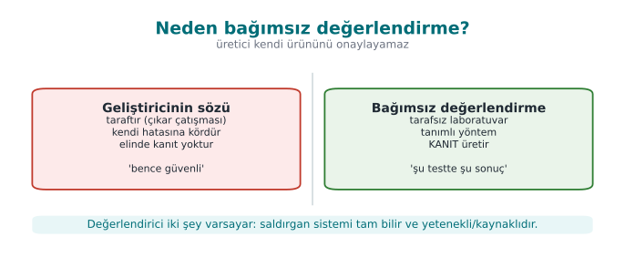

!!! note "A short history: security evaluation and certification"
    - **1985** — the US **TCSEC** ("Orange Book"): the first formal security-evaluation criteria.
    - **1991–1993** — European **ITSEC** and Canadian **CTCPEC**.
    - **1999** — these merge under **Common Criteria (ISO/IEC 15408)**; the **EAL** assurance scale comes from here
      (week 13).
    - **2001** — **OWASP** is founded (application security testing culture); **PTES** and **NIST SP 800-115**
      later standardize penetration-testing methodologies.
    - **2005 → 2023** — the **CVSS** vulnerability severity score (v2 → v3.1 → v4.0).
    - **2010s** — **OWASP MASVS/MASTG** for mobile, **ETSI EN 303 645** for consumer IoT.

    The common idea in one sentence: **a vendor cannot approve its own product** — independent, evidence-based
    evaluation is required.

We've designed this course's project from the start "as if it will go through a certification." This week we work
through that process itself, step by step, through an evaluator's eyes.

### The standards and certification landscape

| Standard / scheme | Domain | What is evaluated? | Where it appears in this course |
| --- | --- | --- | --- |
| **Common Criteria** (ISO/IEC 15408) + **CEM** (ISO/IEC 18045) | General IT products | Security target (ST), protection profile (PP), EAL levels; vulnerability analysis and attack potential | Week 13 |
| **FIPS 140-3** | Cryptographic modules | The module's crypto algorithms, key management, physical security, self-tests | Week 13 |
| **EMVCo** documents | Payment cards, terminals, mobile payments | Security evaluation of chip- and software-based payment solutions | Weeks 3, 6, 11, 13 |
| **PCI** standards (DSS, PIN, MPoC, SSF) | Organizations and software handling card data | Protecting card data; secure software development; testing and scanning requirements | This week |
| **ISO/IEC 27001** | An organization's information security management system | Processes, risk management, controls (Annex A); certifies the **organization**, not a product | This week |
| **ETSI** (EN 303 645, TS 103 732, etc.) | Consumer IoT, telecom, mobile | Baseline device security requirements, test specifications | Week 13 |
| **OWASP ASVS / MASVS** | Web and mobile applications | Application security verification levels (a test framework, not a certificate) | Weeks 5, 6 |

!!! info "Product, or process?"
    ISO/IEC 27001 certifies an **organization** (its information security management system); Common Criteria,
    FIPS 140-3, and EMVCo evaluations certify a **product**. PCI DSS audits the compliance of an environment that
    handles card data. Don't mix this up in a project guide: "our product is ISO 27001 certified" is wrong; "our
    product is developed within an organization that is ISO 27001 certified" is correct.

### What does certification say, and not say?

The most common mistake a reader of a certificate makes is equating the word "certified" with "unbreakable." A
certificate actually says four things **together**; if any one of the four is missing, the sentence becomes
meaningless:

1. **Which product** — the TOE's full identity: version + binary file + source code + hash value (we'll see this in
   section 2).
2. **Against which standard** — e.g., Common Criteria, EMVCo, PCI.
3. **Against which attacker model** — e.g., "a moderately skilled attacker with no physical access, attacking over
   the network."
4. **As of which date** — once the software is updated, the certificate remains valid for that **old** version; the
   new version must either go through delta assessment or be considered uncertified.

!!! danger "Common mistake: saying 'X certified' without stating the product, version, or date"
    Saying "our library is Common Criteria certified" in a project presentation is incomplete and misleading:
    without stating **which version**, **which assurance level**, and **against which attacker model**, this
    sentence is no different from a marketing claim. **Rule:** a certification claim is always written together
    with a version number + standard name + (if any) assurance level; this is exactly why the version-identity
    discipline from week 1 is needed.

### Why can't the developer approve its own product?

This is not a matter of skill, but of **point of view**. The team that writes a product carries three biases at
once:

- It **shares the design's assumptions** — a developer who says "a user will never type 300 characters into this
  field" also writes their test to that assumption; they never try an out-of-range input.
- It **never looks** at the paths it thinks "nobody touches this" — because in its own mental model that path is
  already closed.
- It is **reluctant to criticize its own code** — under time pressure, "it's probably secure" is not evidence, but
  human nature leans toward it.

An independent laboratory shares **none** of these three biases: it reads the developer's documentation but
questions its boundaries, makes the path marked "nobody touches this" the first thing it checks, and — having no
stake in the product's success — does not accept the sentence "probably secure." It demands **evidence**.

!!! success "Rule: claim is not evidence"
    The same discipline applies in this course's project: the sentence "it's secure" alone proves nothing. Every
    security claim is backed by a **test result** (S16), by **evidence** (screen output, a log, a test card). In
    the midterm/final evaluation, the instructor plays exactly the role of the independent laboratory.

### Same product, different tests under different schemes: a short example

The same mobile payment application may need to go through **different** evaluations depending on its target
market:

- If the application will be sold to a **bank**: the bank's information security management system likely falls
  under **ISO/IEC 27001** — but that certifies the bank's **processes**, not the application itself.
- If the application **processes card data**: it falls under **PCI DSS** (organization) and/or **PCI MPoC/SSF**
  (software) — how the software processes, stores, and transmits card data is tested.
- If the application will carry a **payment scheme's** (e.g., a card network's) brand: it must go through an
  **EMVCo** evaluation — the security of the chip/software-based payment flows is tested by a laboratory
  penetration test.
- If the application makes a general **mobile security** claim: it can be tested against the **OWASP MASVS** level
  — not a certificate, but a recognized **test framework**.

The same codebase is tested through four different lenses with four different questions. In your project, the
answer to "which standard are we closest to?" determines **which columns** of the requirement template in S17 you
fill in.

### The cost of certification: why isn't every product certified?

Independent evaluation is **not free** — it requires laboratory time, expert engineer-hours, sometimes special
equipment; the process can take weeks to months. That's why not every piece of software is certified against every
standard; a team asks the question: "is this certificate's **cost** worth the **trust** it provides?"

- For a payment library that will be sold to a bank, the answer is usually **yes**: without the certificate the
  bank may not buy the library at all; the certificate's cost is much smaller than the sale it would otherwise lose.
- For an internal company tool (used only by its own employees, never sold externally), a full-scope Common
  Criteria evaluation is generally **disproportionate**; a lighter internal security review (code review + SAST +
  basic penetration test) is preferred instead.

!!! tip "The trade-off applies here too"
    The trade-off discipline from week 1 also operates in the certification decision: "a fully-scoped certificate"
    is not always the right answer. The right question is "given our target market, the value of our assets, and
    our attacker model, what **depth** of verification is enough?" — this is exactly what section 4's "test depth"
    table shows deciding.

### The historical driving force behind certification: why did it emerge?

Let's read the short history at the start of this section again, this time with the "why" question — each step is
actually a response to a real **trust crisis**:

- Before TCSEC (1985), the US government could not find a **common criterion** to evaluate security claims; every
  vendor used its own definition of "secure" — comparison was impossible.
- Common Criteria (1999) was created to solve a problem caused by the US/European/Canadian criteria
  (TCSEC/ITSEC/CTCPEC) being **separately** developed and **incomparable** with each other — so that the same
  product would not need to be re-evaluated in every country for international trade.
- CVE/CWE/CVSS (as we saw in week 2), between 1999 and 2006, arose as a response to the chaos created by
  vulnerabilities being reported in **unnamed** and **incomparable** ways.

!!! success "Rule: every standard is an answer to a real problem"
    Instead of memorizing a standard, asking "what problem does this answer?" is a much sturdier compass when
    choosing which standard fits your project.

### Frequently asked question: is a certificate indefinite?

A point weaker students often skip but which matters: a certificate does not say "this product is secure forever."
A certificate can lose validity over time, or need to be re-reviewed, for three separate reasons:

1. **The product changes** — a new version is released; the delta assessment from section 2 kicks in, and the
   certificate must move to the **new TOE identity**.
2. **Attack techniques advance** — an attack that requires "multiple experts, months" today can, a few years later,
   drop to "an ordinary user, one day" with cheap tools (the scoring in section 5 can **change** over time).
3. **The standard is updated** — a new version of a standard can decide that a control once deemed sufficient is no
   longer enough.

!!! danger "Common mistake: saying 'we got certified once, that's it'"
    Marketing a product with a certificate obtained years ago ignores **as of which date, against which threat
    model** it was issued (the four pieces of information at the start of section 1). **Rule:** for long-lived
    products, certificates are generally **periodically re-reviewed** or renewed after some time; the sentence
    "we're certified" should always be read together with a **date**.

---

## 2. The evaluation process: 13 steps

The flow below is a generalized version of a software component (e.g., a mobile payment library) being evaluated
at a third-party laboratory. Product, organization, and scheme names have been removed; the steps are similar
across many schemes.

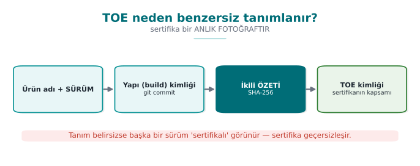

### TOE identity: why doesn't "version 3.2.0" suffice?

The first of the 13 steps we're about to see demands a **far more precise** definition than a version number. Let's
see why with an example: a team says "version 3.2.0," but three different binaries can exist under that same
version number — one built with debug symbols (debug build), one an optimized release build, and one a copy a
developer produced locally with different compiler flags. Their **behavior** (debug output, timing, even the
presence of some security checks) can differ. That is why a TOE identity consists of four parts (the figure above):

1. **Version label** — for human readers (e.g., "3.2.0").
2. **Binary** — which build (release/debug, which architecture: ARM64/x86_64).
3. **Source code** — which commit/tag (git tag/commit hash).
4. **Hash value** — the SHA-256 of the binary; proves whether even a **single byte** has changed.

!!! danger "Common mistake: assuming 'same version number, same product'"
    A developer might say "nothing has changed, it's still 3.2.0," but if the build environment (compiler version,
    optimization flag) has changed, the **binary is different**, and the previous certificate no longer covers that
    binary. **Rule:** TOE identity is always verified with a hash value, never trusted to a version number — this is
    exactly what the "version identity" practice from week 1 is for.

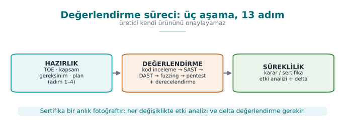

Let's name the three phases in this figure: **Preparation** (steps 1–4: TOE, documents, template, workshop),
**Evaluation** (steps 5–9: code review → vulnerability analysis → penetration test → functional conformance →
findings), **Continuity** (steps 10–13: impact analysis → delta assessment → trade-off/residual risk → change
management). The certificate is issued at the end of the Evaluation phase; but the Continuity phase **never ends**
for the life of the product.

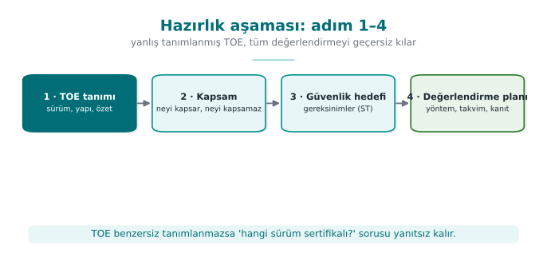

| Step | What happens? | Output | In your project |
| --- | --- | --- | --- |
| **1. Target of evaluation** | What is to be evaluated is defined **uniquely**: a version number is not enough; binary + source code + hash value or version label. Out-of-scope components are written down. Assumption: **the platform is untrusted** | TOE definition | S0, S1 (week 1 version identity) |
| **2. Delivery of documents** | Source code, API documentation, the **security guide**, debug and release builds are delivered over a secure channel | Delivery list | Your repo + guide |
| **3. Requirement template** | The standard's numbered requirements; for each: the requirement text, **test coverage**, the developer's **compliance rationale and document reference**; status: met / transferred / not met | Filled-in template | S17 compliance matrix (week 13) |
| **4. Workshop** | It is planned which control meets which requirement, and how gaps will be closed | Document-update plan | — |
| **5. Source code review** | All source is reviewed at the laboratory in a **white-box** context: dangerous patterns, incorrect crypto, leak points | Code-review findings | Week 4 CERT, static analysis |
| **6. Vulnerability analysis** | Assets and key hierarchy are extracted; for every asset the question "where, in what state, is it exposed?" is asked | Finding list + **penetration test plan** | S4, S5, S16 |
| **7. Penetration test** | Every item in the plan is carried out with the eight-field template and rated with **attack potential** | Test result tables | S16 |
| **8. Functional conformance** | The product's standard functions (e.g., payment flows) are tested with the scheme's test suite | Execution report | Unit tests |
| **9. Findings and fixes** | For every finding, the laboratory produces a recommendation, the developer produces an action; some findings are closed as "not a security issue, a good-practice suggestion" | Finding–action table | Week 7 finding list |
| **10. Security impact analysis** | When fixes produce a new version: change category (new feature / improvement / bug fix), affected files, security impact | Impact-analysis document | S13, week 1 change management |
| **11. Delta assessment** | Only the changed part is re-evaluated; the laboratory asks for the marked-up documents, the impact analysis, the file list, and the new TOE identity | Delta report | — |
| **12. Trade-off and residual risk** | The cost of every protection is measured, decisions are justified, residual risk is written explicitly | Trade-off record | Week 1 |
| **13. Change management** | Baseline → request → classification → approval → development and testing → release → verification | Process records | S13 |

!!! note "How it's done in the field"
    The guide that is the source of the "How it's done in the field" notes we see every week of this course is
    exactly the **security guide** delivered at step 2: its primary reader is the evaluation laboratory. Every
    section of the guide opens with a requirement block ("requirement — status"), followed by how the product meets
    that requirement. The guide you write for your term project is a scaled-down version of this document.

### What does the "secure channel" in step 2 mean?

The table's phrase "delivered over a secure channel" isn't there for nothing: the source code and the security
guide are the **most sensitive** pieces of information for a product that isn't certified yet. Sending them as an
email attachment or a generic file-sharing link damages the product's confidentiality before the evaluation even
begins.

- **Encrypted transfer:** files are encrypted with AEAD (week 3) and the key is shared over a separate channel; or
  an end-to-end encrypted enterprise file-sharing system is used.
- **Integrity check:** a hash value of the delivered package is also communicated separately; when the laboratory
  receives the file it **verifies** the hash — to detect any corruption or tampering in transit (the enterprise
  counterpart of the AEAD tag verification from week 3).
- **Access log:** a record is kept of who downloaded which file and when; this makes it possible to later detect
  unauthorized copying of the source code.

!!! note "How it's done in the field"
    Your course project isn't expected to set up such a heavy secure channel; but restricting your repo access to
    **only** team members and the instructor, and never committing a real secret (API key, password) (the secret
    management rules from weeks 1 and 10), is the course-scale counterpart of the same principle.

### End-to-end example: "GüvenPay Wallet SDK v3.2.0" goes through a laboratory

The table above summarizes the 13 steps; but reading a table and **living** through a process are not the same
thing. Below we walk a completely fictional product ("GüvenPay Wallet SDK," version 3.2.0 — a mobile wallet
application's card-storage and payment library) through these 13 steps **without skipping**. The goal is to see
concretely, at each step, who does what, and which document passes from hand to hand.

**Step 1 — Target of evaluation (TOE).** The GüvenPay team writes to the laboratory: "Product to be evaluated:
GüvenPay Wallet SDK, version 3.2.0, Android ARM64 build, SHA-256 hash `a1b2c3...` (the version-identity discipline
from week 1 returns here). Out of scope: the mobile operating system hosting the application, the user's device."
As soon as the evaluator reads this line, they ask their first question: "so, is the platform trusted?" The answer
is no — **that is the assumption** (we'll see this below).

**Step 2 — Delivery of documents.** GüvenPay sends the source code, the API documentation, and — most importantly
— the **security guide** to the laboratory over an encrypted channel. In the guide, sentences such as "the card
number is stored encrypted only with AES-256-GCM" are each written with a **requirement reference** (see week 3
AEAD, week 10 version signing).

**Step 3 — Requirement template.** The laboratory pours the numbered requirements of the chosen standard (here,
assumed: an EMVCo + PCI MPoC mix) into a template: "Requirement 4.2 — Card data must be encrypted at rest. Status:
GüvenPay says 'met,' evidence: guide section 3.1, source code `kart_deposu.c` lines 40–85." This is a small example
of the S17 compliance matrix in your project.

**Step 4 — Workshop.** The laboratory and the GüvenPay team review the template together in a meeting (in person or
online): "There's no evidence yet for Requirement 6.1 (key rotation) — how will you close this?" GüvenPay presents a
document-update plan.

**Step 5 — Source code review.** Two of the laboratory's engineers read `kart_deposu.c`, `anahtar_yonetimi.c`, and
the network layer **line by line** (white-box). One engineer notices a fixed salt used in key derivation — this is
noted as the **first finding candidate** before moving on to the vulnerability-analysis step.

**Step 6 — Vulnerability analysis.** The laboratory extracts GüvenPay's asset list (card number, CVV, session key;
we defined this asset concept in week 1) and asks, for each one, "where, in what state (in memory/on disk/on the
network), can it be exposed?" Result: a **penetration test plan** (section 7) is prepared; the fixed-salt finding is
also added to the plan as a test item.

**Step 7 — Penetration test.** Every item in the plan is carried out with the eight-field test card (section 7).
For the fixed-salt item: the same key-derivation function is run on two different devices, and the **same** key is
observed to come out (evidence). This finding is rated with attack potential (section 5) — knowledge of target is
public (a constant in the source code), equipment is standard, time is short → **low attack potential → serious
finding**.

**Step 8 — Functional conformance.** The laboratory also tests GüvenPay's **expected functions** with the standard
test suite: does the payment flow send the correct amount, does it correctly reject a wrong PIN entry? This is a
step separate from, but complementary to, security testing — a product that is secure but **doesn't work** cannot
be certified either.

**Step 9 — Findings and fixes.** The laboratory report: "Finding F-03: key derivation uses a fixed salt, evidence:
the same key from two devices. Recommendation: a random salt per device (the CSPRNG rule from week 3) + KDF."
GüvenPay responds: "Accepted, will be fixed in v3.2.1." Some minor findings (e.g., "log messages aren't in English")
are closed as "not a security issue, a good-practice suggestion."

**Step 10 — Security impact analysis.** While preparing v3.2.1, GüvenPay writes a document: "Change type: bug fix
(security). Affected file: `anahtar_yonetimi.c`. Security impact: key derivation now uses a random salt per device;
the weakness in the previous version is closed, no other asset is affected."

**Step 11 — Delta assessment.** The laboratory does not review the whole product from scratch; it reviews only the
`anahtar_yonetimi.c` file, the impact analysis, and the **new** TOE identity (v3.2.1, new hash value). The test from
step 7 is repeated: this time it is verified that the two devices produce **different** keys → the finding is
closed.

**Step 12 — Trade-off and residual risk.** The report writes one remaining risk explicitly: "Key rotation frequency
is once a year; more frequent rotation is recommended, but GüvenPay has documented, with its reasons, that it
**accepts** this risk because of the performance cost." This is the certification counterpart of the trade-off
discipline from week 1.

**Step 13 — Change management.** GüvenPay's release of v3.2.1 is classified, approved, tested, released, and
verified by the laboratory according to its own baseline; this cycle repeats with **every version, for the life**
of the product — a certificate is not a document obtained once and forgotten, it is a **maintained** state.

!!! success "One sentence out of the 13 steps"
    A certificate is not a **snapshot**, it is a defined version + a defined standard + a repeatable process. The
    moment the product changes, that snapshot **goes stale**; that's why steps 10–11 (impact analysis + delta
    assessment) show that certification is not a "one-time" thing but a **continuous** one.

### The evaluator's basic stance

The evaluator works with two assumptions: (1) it has access to all source code and documentation (a **white-box**
context) and (2) the platform the product runs on is untrusted. That's why a control merely **existing** is not
enough; **how easily it is bypassed** is measured. It doesn't report on a single control but on how long it takes
to bypass controls **together**; in a well-designed product, the attacker is forced to **chain** several controls.

### Roles in the process: who is who?

In the GüvenPay example we said "laboratory" and "GüvenPay team," but a real evaluation has at least four separate
parties; mixing them up, especially on "who decides what," causes confusion:

| Role | Who? | Task |
| --- | --- | --- |
| **Developer (TOE owner)** | The team that writes the product (GüvenPay) | Delivers documents and source code; produces actions for findings |
| **Sponsor** | Usually the developer itself (sometimes a customer/bank) | **Requests** and funds the evaluation |
| **Evaluation laboratory** | An independent, accredited organization | Reviews code, runs tests, reports findings — **does not decide**, it produces evidence |
| **Certification authority (scheme owner)** | The organization running the national/international scheme | Reviews the laboratory's report, **formally issues the certificate** |

!!! note "How it's done in the field"
    An evaluation laboratory itself is also usually **accredited** by an independent body (against a general
    framework such as ISO/IEC 17025, which defines the competence of testing and calibration laboratories) — that
    is, the question "is the laboratory trustworthy?" also has its own independent answering mechanism. This is the
    principle from section 1 ("a vendor cannot approve its own product") carried up one level: a laboratory cannot
    accredit itself either.

!!! danger "Common mistake: thinking the laboratory 'decides'"
    The laboratory does **not** issue the certificate; it only tests and reports its findings **with evidence**.
    The party that formally issues the certificate is the **certification authority** (the scheme-owning
    organization). Writing "the laboratory certified us" in a project report is common but technically wrong.

### Why in this order? (Preparation → Evaluation → Continuity)

We split the 13 steps into three phases; let's think about **why** the order is this way — each phase builds on
the one before it and cannot be skipped:

- **Preparation comes first, because** if what is to be tested (the TOE) is undefined, no test can be
  **repeatable**. A laboratory first wants a precise answer to "what exactly am I examining?"; starting a code
  review without this answer means working without even knowing which file is in scope.
- **Evaluation comes in the middle, because** without the requirement template from preparation (step 3), the
  question "is this a finding, or is it normal?" cannot be answered — a finding is defined **against a
  requirement**, not in a vacuum.
- **Continuity comes last, because** the concept of a "change" can only be discussed once a certificate/decision
  **exists**; for a not-yet-certified product, "delta assessment" is meaningless — there is no baseline to change
  from.

!!! tip "The counterpart in your project"
    The same order works in your own term: first you clarified your project's scope and requirements (weeks 1–7,
    S0–S13), then you're at the test/evaluation stage (this week, S16); if you make a fix after the final, that's
    your own small "continuity" loop too.

---

## 3. Vulnerability-assessment methods

Steps 5 and 6 of the evaluation process (code review and vulnerability analysis) require using a set of methods
**in the right order**. We approach these defensively, with the question "how do I test my own product before I
deliver it?" Order matters: you start with cheap, broad-coverage methods and move toward expensive, deep ones.

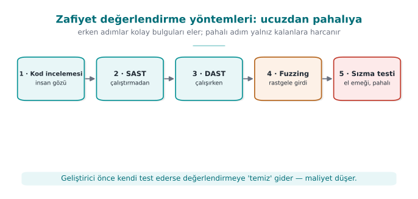

| Order | Method | What does it find? | Where it appears in this course |
| --- | --- | --- | --- |
| 1 | **Source code review** (manual) | Design and logic errors, incorrect crypto use, leak points | Week 4 CERT/CWE |
| 2 | **Static analysis (SAST)** | Without running the source: memory errors, dangerous calls, patterns | Week 4 (static analysis) |
| 3 | **Dynamic analysis (DAST) + sanitizers** | While running: memory-access errors, UB, leaks | Week 4 (ASan/UBSan) |
| 4 | **Fuzzing** | Crash/corruption paths through unexpected inputs | Week 4 (libFuzzer/AFL concept) |
| 5 | **Penetration test** | Exploitability from an attacker's viewpoint, combining the above | This week, section 6 |

!!! tip "Why this order?"
    Static analysis is cheap and scans broadly but produces **false positives**; manual review is expensive but
    sees context; fuzzing requires running the program but finds inputs a human would never think of; a
    penetration test is the most expensive and comes last. Clearing "easy" findings with cheap methods first frees
    up the penetration test's time for real, combined problems. This is the evaluation counterpart of week 4's
    "secure build pipeline" (SAST + sanitizer + fuzz in CI).

### Code review: where the evaluator looks

Code review finds **logic** errors that automated tools miss. The places the evaluator prioritizes (all from
previous weeks):

- **Crypto usage:** is the right algorithm/mode/padding used? Where does the key come from, where is it written,
  when is it erased? (weeks 3, 10, 11)
- **Input validation and memory:** bounds checking, integer overflow, format string, UAF (week 4 CERT).
- **Error and secret leakage:** sensitive data in logs, internal state in error messages (weeks 4, 6).
- **Control-bypass paths:** a security check that can be bypassed with a single branch or a single return value
  (week 9 opaque boolean, random exit).

Why is each item on this list? Because they're all bugs that **automated tools miss**: a SAST tool can say "here
`AES_encrypt` is being called," but it generally can't answer "was the right **mode** used" (the AES-GCM/CBC/CTR
distinction from week 3, which is the week for section 3's material) — that's a job for a **human** who
understands context.

!!! note "How it's done in the field"
    In a real evaluation, code review, SAST, and sanitizers are usually already embedded in the developer's
    **CI/CD pipeline** (the secure build pipeline from week 4); the laboratory first asks for this pipeline's
    **outputs** (historical run logs), then does its own independent scan. The two results being **consistent**
    (what the laboratory finds matching what the developer's own CI finds) is an additional trust signal; if there
    is inconsistency (the laboratory finds something the CI never found), the CI configuration is questioned.

### Static and dynamic analysis, fuzzing

We saw these three methods in week 4 as part of the secure build pipeline. In evaluation, the same tools are run
this time by an **independent** party. What matters is that the developer has already run these tools **itself**
and presented its results (S16): the evaluator sees a big difference between "no one has ever tested this product"
and "the developer ran these tools, closed these findings."

### Tracking a memory bug with five methods

In section 0 we compared five methods on a **logic** bug (SQL injection); now let's do the opposite and track a
**memory** bug — because the methods are strong in different areas.

```c title="tampon_kopyala.c (sentetik, hatalı)"
void tampon_kopyala(char *hedef, const char *kaynak)
{
    strcpy(hedef, kaynak);   /* HATA: hedefin boyutu kontrol edilmiyor */
}

void isle(const char *disaridan_gelen)
{
    char arabellek[64];
    tampon_kopyala(arabellek, disaridan_gelen);   /* disaridan_gelen 64 bayttan uzunsa tasma */
}
```

| Order | Method | Does it find this bug? | Why |
| --- | --- | --- | --- |
| 1 | Code review | An experienced reviewer **yes**, finds it | The `strcpy` + fixed-size-buffer pattern is familiar to anyone who knows the CERT rules (week 4) |
| 2 | SAST | Mostly **yes** | "Dangerous function" patterns like `strcpy`, `sprintf`, `gets` are in almost every SAST rule set |
| 3 | DAST + sanitizer | **Yes, with evidence** | If the program is **run** with an input of 65+ bytes, ASan instantly catches the overflow and shows exactly which line it's on (week 4) |
| 4 | Fuzzing | **Yes, often the strongest method here** | Fuzzing tries inputs of random length; a memory bug is usually triggered within **minutes to hours** — fuzzing is far more effective at this class of bug than at SQLi |
| 5 | Penetration test | **Yes, but the most expensive route** | The attacker investigates whether crashing the program with a long input can be turned into **executable code injection** |

**Comparison:** logic bugs like SQLi are strong for code review and SAST, weak for fuzzing; memory bugs are very
strong for fuzzing and sanitizers. **That's why section 3's order (code review → SAST → DAST/sanitizer → fuzzing →
penetration test) passes every bug class through at least one point where a method is strong.**

!!! danger "Common mistake: running fuzzing for a few seconds and saying 'no findings'"
    Fuzzing works by **accumulating coverage**; in the first few seconds only shallow paths are tried. Saying
    "clean" after a short run actually means "it hasn't gone deep yet." **Rule:** the fuzzing duration and the code
    coverage reached (as a `%`) are written into the report together, in the form "ran for X hours, reached Y%
    coverage, found N crashes." A fuzzing result with no duration stated is **meaningless** to an evaluator.

!!! success "Rule: choose the method by the type of bug"
    The assumption "one tool finds everything" is wrong. Manual review and SAST give reliable results for logic
    errors; sanitizers and fuzzing for memory/UB errors; penetration testing for combined/real-world scenarios.
    When filling in S16 in your own project, ask, for every test item, "which method is best suited to finding this
    bug?"

### False positives and false negatives: two risks of automated tools

Let's unpack the section-opening sentence "SAST is fast but produces false positives" — these two terms come up
constantly in evaluation:

- **False positive:** a case where the tool says "there's a problem here" but there actually **isn't** a problem.
  Example: SAST flags a `strcpy` call the moment it sees it; but if the target buffer is already allocated safely
  large, this is a false positive. A large number of false positives leads the developer to **disable** the tool
  (alert fatigue).
- **False negative:** a real problem the tool **misses**. Example: if a SAST tool only checks against a known list
  of dangerous functions, it misses the same bug made by a custom wrapper function not on that list. A false
  negative is **more dangerous** than a false positive: the trust of "the tool said it's clean" turns out to be
  false.

!!! warning "Which is worse?"
    A false positive wastes time; a false negative **hides a security vulnerability**. That's why an evaluator
    never blindly trusts any automated tool's output — manual review (section 3, method 1) always remains an
    **independent** layer of checking.

### Why "cheap to expensive" order is a matter of cost

Let's also read the section-opening order (code review → SAST → DAST/sanitizer → fuzzing → penetration test) from
the angle of **relative cost**. The table below is **not a real measurement**, only an **illustrative** ranking
given to make the idea concrete:

| Method | Relative effort per finding (illustrative) | How broadly does it scan? |
| --- | --- | --- |
| SAST | Very low (automatic, minutes) | Very broad (the whole codebase) |
| Code review | Medium (human-hours) | Medium (as much as the reviewer looks at) |
| DAST + sanitizer | Low-medium (test run + automatic detection) | Only the paths that are run |
| Fuzzing | Medium (machine-hours, little human time) | Expands over time (depends on coverage) |
| Penetration test | High (expert human-days) | Narrow but **realistic** (a real attacker scenario) |

!!! note "Why is this table 'illustrative'?"
    Real costs vary widely with codebase size, team experience, and tool maturity. What matters here is the
    **order**: cheap/broad methods first, expensive/deep methods later — this ordering **itself** is a universal
    principle, not the numbers in the table.

### How do the methods verify each other? Cross-checking

**Verifying** something one method finds with another method increases confidence in an evaluation. Example: SAST
flags a **candidate** integer overflow (it might be a false positive); if DAST/sanitizer **runs** the same path
with a real input and shows the overflow **actually** occurs, it is no longer a false positive — it's a **verified**
finding. A penetration test usually **combines** (chains) these verified findings into a real attack scenario — two
findings that look low-impact on their own can form a serious chain when used together.

!!! danger "Common mistake: confusing 'SAST flagged it' with 'verified'"
    Writing a SAST warning straight into the report as a "finding" without verifying it inflates the report with
    false positives. **Rule:** every candidate flagged by an automated tool, wherever possible, must be **verified**
    with another method (code review or by running it) before it counts as a confirmed finding.

!!! example "Checklist for applying section 3 in your own project"
    - [ ] Was code review done — specifically for crypto usage, input validation, error/secret leakage,
      control-bypass paths (the four items above)?
    - [ ] Were SAST and DAST/sanitizer (the secure build pipeline from week 4) run, and were the results added to
      S16?
    - [ ] If fuzzing was run, is its **duration** and the coverage reached written down (otherwise the result is
      meaningless)?
    - [ ] Was every SAST/fuzzing finding **verified** with another method (code review or by running it)?
    - [ ] Were the methods applied **in order** (cheap to expensive), or was there a direct jump to a penetration
      test?

## 4. The tests the standards demand

Different standards emphasize different types of testing. Knowing which requirement family your project is closest
to determines which tests you'll prioritize.

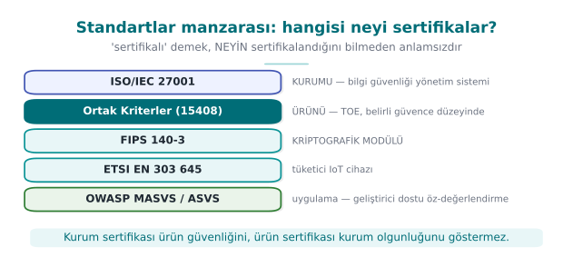

| Standard / framework | Test it primarily expects | Short note |
| --- | --- | --- |
| **ISO/IEC 27001** | Process and management audit | Certifies the **organization**, not the product; control evidence instead of testing |
| **Common Criteria** (ISO/IEC 15408) | Source review + vulnerability analysis + penetration test; rating by **attack potential** | Depth increases with EAL (week 13) |
| **FIPS 140-3** | Cryptographic module tests (algorithm validation, self-test) | Covers only the module (week 13) |
| **ETSI EN 303 645** | Verifying baseline IoT security requirements | Light, broad coverage |
| **EMVCo / PCI** | Functional conformance + laboratory penetration test + attack potential | The payment domain; strict |
| **OWASP MASVS + MASTG** | Mobile application security testing (static + dynamic) | The most directly applicable guide for your project |

!!! note "Testing-methodology guides"
    There are mature, public guides for **how** a penetration test should be run: **OWASP WSTG** for web, **OWASP
    MASTG** for mobile, **PTES** and **NIST SP 800-115** for the general process. These are not an "attack recipe";
    they are **test methodologies** that standardize scope and method, making a finding repeatable and comparable.

### A concrete test example for every standard

Let's make the table's "test it primarily expects" row concrete — **one example test question** for every standard:

- **ISO/IEC 27001:** "Is the list of employees who have access to card data current, is access reviewed every
  quarter?" — this is not a **code** question, it's a **process** question; the evidence is an access log, not a
  test card.
- **Common Criteria:** "In how many hours, at what level of expertise, can the key-derivation function be broken by
  reverse engineering?" — directly section 5's attack-potential question.
- **FIPS 140-3:** "Does the module self-test at startup (power-up self-test), does it run with an
  algorithm-validated implementation?" — an algorithm **validation** question, not an attack scenario.
- **ETSI EN 303 645:** "Does the device have a default/guessable password?" — a baseline, broad-coverage control
  question; it doesn't expect an in-depth penetration test.
- **EMVCo / PCI:** "How long does card data stay exposed in memory, is it erased when the transaction ends?" —
  requires both code review and a laboratory penetration test.
- **OWASP MASVS:** "Does the application protect sensitive data while running on a rooted/jailbroken device?" —
  requires both static and dynamic testing.

!!! tip "Which standard is 'closest' for your project?"
    When choosing your own project's requirement family, ask this question: "are we evaluating an **organization**,
    a **cryptographic module**, a **general product**, or a **mobile application**?" This course's project mostly
    falls into the third and fourth categories (general product / mobile application); that's why **OWASP
    MASVS/MASTG** is the most directly applicable guide, but we borrow the attack-potential concept from the
    **Common Criteria** tradition.

### What does it look like if GüvenPay's six questions are answered one by one?

Let's apply the six example questions above to GüvenPay and see how the same product looks through **different
lenses** — this is the concrete form of the "the same product can pass four different exams" idea (section 1):

| Question | GüvenPay's answer (fictional) |
| --- | --- |
| Is the access log current? (ISO 27001) | Not GüvenPay itself — the IT department of the company hosting GüvenPay answers this question |
| How many hours does it take to break key derivation? (Common Criteria) | Before the F-03 fix: hours (BASIC). After: months (HIGH) |
| Does the module self-test? (FIPS 140-3) | GüvenPay is **not** a cryptographic module, it's an application SDK — out of scope for this question |
| Is there a default password? (ETSI) | GüvenPay is not an IoT device; this question is also out of scope |
| How long does card data stay exposed in memory? (EMVCo/PCI) | Memory is zeroed after use (evidence: PT-05) |
| Is data protected on a rooted device? (MASVS) | Yes — test card PT-07 proves this (section 7) |

!!! note "The lesson from this table"
    We see that GüvenPay isn't "close" to **every** standard to the same degree: the FIPS 140-3 and ETSI questions
    came out out of scope, but the Common Criteria, EMVCo/PCI, and MASVS questions were directly applicable. Doing
    the same exercise for your own project clarifies which standard you're **really** close to.

### Two separate scopes in the payment domain: software, or organization?

In the payment-security domain, "PCI" is not a single standard, it's a **family of standards**; which one applies
depends on "what" is being evaluated:

- **PCI DSS (Data Security Standard):** audits the compliance of an **organization/environment** that processes
  card data — servers, network segmentation, access logs. It's not the software itself that's in scope, but the
  **environment the software runs in**. Like ISO/IEC 27001 (section 1), it is **process and environment**
  oriented.
- **PCI software standards (e.g., SSF — Software Security Framework, MPoC — Mobile Payments on COTS):** evaluate
  whether the **software itself** (how it processes, stores, deletes card data) is securely designed — this is
  closer to the scope of an SDK like GüvenPay.
- **EMVCo:** evaluates, through a laboratory penetration test, whether chip- and software-based payment **flows**
  (transaction verification, cryptographic protocol steps) are correctly implemented.

!!! warning "Common mistake: not stating which PCI you mean when saying 'we're PCI compliant'"
    The sentence "we're PCI compliant" is incomplete: PCI **DSS** compliance concerns a business's environment,
    PCI **SSF/MPoC** compliance concerns the software itself. For a team building a mobile payment SDK, the correct
    sentence might be "our software targets PCI MPoC requirements"; saying "we're PCI DSS compliant" — because DSS
    is a corporate-environment standard — says nothing about the SDK itself.

### Test depth isn't the same across every standard

The same phrase "penetration test" can mean work at **very different depths** from standard to standard:

| Depth | Typical duration | Example context |
| --- | --- | --- |
| Surface scan | Hours | Baseline IoT control |
| Focused functional test | Days | OWASP MASVS L1 |
| Deep, expert team | Weeks | Common Criteria high assurance levels (week 13), EMVCo |
| Continuous/repeated independent third party | Repeated over months | PCI DSS annual assessment cycle |

!!! note "Why does depth vary?"
    The higher the **value of the asset** a standard targets and the attacker model it assumes, the greater the
    expected depth. The baseline security of an IoT light bulb and the key hierarchy of a payment card are not
    tested with the same rigor — because the consequences of their being broken are **not on the same scale**. This
    is the groundwork for week 13's discussion of assurance levels.

### The same requirement, six different words: a comparison

A single security requirement like "card data must be encrypted" shows up in different standards with **different
wording**, but the same underlying idea. Seeing this similarity will help a lot when filling in the compliance
matrix in week 13:

| Standard | How does it express the same idea? |
| --- | --- |
| ISO/IEC 27001 | "Policy on the use of cryptographic controls" (an Annex A item) — the organization must have an encryption **policy** |
| Common Criteria | The "confidentiality" security functional requirement (the FCS family) — defines **which** cryptographic function the TOE provides and **how** |
| FIPS 140-3 | Using an approved algorithm, with an approved mode and key management |
| ETSI EN 303 645 | "Sensitive security parameters must be stored securely" (a baseline requirement) |
| EMVCo / PCI | **Encryption** of card data at rest and in transit, key management processes |
| OWASP MASVS | The "MASVS-CRYPTO" control family — the application using the right cryptographic primitives |

!!! success "Rule: understand a requirement's 'spirit' first, then translate it into a standard"
    All six of these lines say **the same thing**: "protect sensitive data with strong, correctly used
    cryptography." Understanding this common idea first, before learning which words each standard uses when
    filling in a requirement template, is far more durable than memorizing.

### Who writes and updates the standards?

A question weaker students often ask but rarely get an answer to: "who's making up these standards?" Short answer:
none of them is the product of a single person or company; each is created through the **joint work of many
organizations** in that field and is regularly updated (usually every few years) — much like CVSS, which we saw in
week 2, evolving from v2 to v3.1 to v4.0. The reason for these updates is usually either (a) a new attack technique
emerging, or (b) clarifying an item in the previous version that was found ambiguous or inconsistent.

!!! info "Why does this matter?"
    When a project says "we comply with standard X," it needs to state **which version** it means — just as a TOE
    identity requires a version + hash (section 2). A requirement template designed against an old version may not
    reflect the current threat model.

---

## 5. Attack potential and finding rating

We said a control's mere "existing" isn't enough, that "how easily it's bypassed" must be measured. Common
Criteria and payment schemes make this measurement with **attack potential** scoring. A finding's severity is
determined by the answer to the question "what did it take to break it?" This is the formal, evaluation-side version
of week 9's "measuring obfuscation" (strength, resilience) framework.

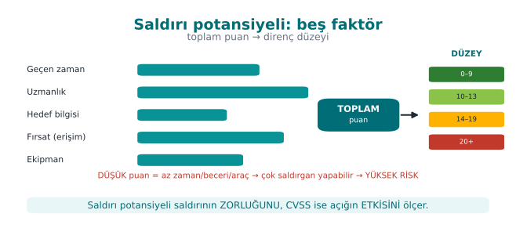

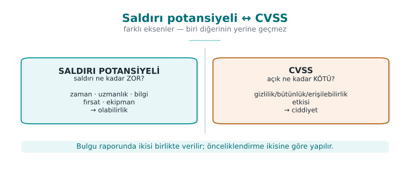

### Attack potential factors

We score the effort required to carry out an attack with five to six factors; each factor's points are summed, and
the total maps to a resistance level (e.g., "basic / moderate / high / very high").

| Factor | Question | Low score | High score |
| --- | --- | --- | --- |
| **Elapsed time** | How long did the attack take? | A day | Months |
| **Expertise** | What level of skill was needed? | An ordinary user | A domain expert |
| **Knowledge of TOE** | What did you need to know about the product? | Publicly available | Internal/confidential documents |
| **Window of opportunity** | How much access/how many attempts were needed? | Unlimited/remote | Restricted physical access |
| **Equipment** | What tools were needed? | Standard, free | Custom, expensive |

**Interpretation:** if the total score is **high**, the attack is hard; the control is good. If the score is **low**
(e.g., an ordinary user, in an hour, with free tools), this is a serious finding. The logic here is the same as
week 9's four criteria: the strength of a defense is measured by the cost of overcoming it.

### Why does each factor exist? The reasoning, one by one

The five factors are not chosen at random; each represents a **different type of cost** a real attacker faces. This
is the point weaker students confuse the most — the answer to "why these five, and not others?":

- **Elapsed time:** an attacker's **time** is not infinite; even a well-resourced attacker usually budgets days, not
  months, to find a flaw. As duration increases, the **number of people who would actually try** this attack in the
  real world **shrinks**.
- **Expertise:** not everyone can do reverse engineering or cryptanalysis. As the required expertise level rises,
  the **pool of people** who could carry out the attack **narrows** — "an ordinary user" covers millions of people,
  while "multiple experts" covers maybe a few hundred.
- **Knowledge of target:** an attack that can be carried out with publicly available information (e.g., a general
  API document) is **far more accessible** than one that requires internal/confidential documents — because the
  attacker doesn't first need to **leak or steal** that information.
- **Opportunity (window of access):** is an attack carried out with unlimited attempts (e.g., on your own device,
  offline), or within a restricted window (e.g., three minutes of access to an ATM)? If the number of attempts is
  limited, the attacker must **succeed on the first try** — which is far harder.
- **Equipment:** an attack that can be carried out with a standard, free tool (e.g., a debugger) is in a completely
  different category of **accessibility** than one requiring custom-adapted, expensive laboratory equipment (e.g.,
  a focused ion beam).

!!! success "Rule: each factor narrows the question 'how many people can do this' from a different angle"
    The sum of the five factors indirectly answers the question: "how many people/organizations in the real world
    could carry out this attack?" Low score = many people can do it = widespread risk. High score = almost no one
    can do it = a narrow, expert threat pool.

!!! example "Example (synthetic)"
    "A license check in a release build depended on a branch that a moderately skilled user could find and bypass
    with a single-byte patch, using a free disassembler, in an hour." → time: low, expertise: moderate, knowledge:
    public, equipment: free → **low attack potential → serious finding.** Recommendation: an opaque boolean +
    random exit (week 9) and a server-side check.

### Score table (the simplified scale we'll use in class)

The table above says "low/high"; scoring requires **numbers**. In class (and in the demo) we use the following
simplified Common Criteria/JIL scale:

| Factor | Level 0 | Level 1 | Level 2 | Level 3 |
| --- | --- | --- | --- | --- |
| **Elapsed time** | < 1 day → **0** | < 1 week → **4** | < 1 month → **10** | months → **19** |
| **Expertise** | layman → **0** | proficient → **3** | expert → **6** | multiple experts → **8** |
| **Knowledge of TOE** | public → **0** | restricted → **3** | sensitive → **7** | critical → **11** |
| **Opportunity** | unlimited/remote → **0** | restricted → **4** | very restricted → **10** | — |
| **Equipment** | standard/free → **0** | specialized → **4** | bespoke → **7** | — |

What the total score maps to:

| Total | Level |
| --- | --- |
| **0–9** | **BASIC** — low resistance → **serious finding** |
| 10–13 | MODERATE |
| 14–19 | HIGH |
| 20–24 | VERY HIGH |
| 25+ | BEYOND (only a highly capable attacker) |

#### End-to-end example: scoring a finding from start to finish

**Scenario.** "A license check in a release build depended on a branch that a **proficient** (not expert) user
could find and bypass with a **single-byte patch**, in **one hour**, using a free disassembler."

Let's read and score the five factors one by one:

| # | Factor | What it maps to in the scenario | Level | Score |
| --- | --- | --- | --- | --- |
| 1 | Elapsed time | one hour | < 1 day | **0** |
| 2 | Expertise | proficient user | proficient | **3** |
| 3 | Knowledge of TOE | binary downloaded from the store, no documentation needed | public | **0** |
| 4 | Opportunity | unlimited attempts on own device | unlimited/remote | **0** |
| 5 | Equipment | free disassembler | standard/free | **0** |

```text
Toplam = 0 + 3 + 0 + 0 + 0 = 3        →  3 ≤ 9  →  TEMEL
```

**Result: BASIC level = low resistance = serious finding.** In the report, this is written as "close this first."

**Now let's add a control and re-score.** We put week 9's opaque boolean + random exit on top, plus a server-side
check. The same attack now: takes a week (4), requires an **expert** (6), learning the internal behavior needs
**restricted knowledge** (3), the server-side check makes attempts **restricted** (4), equipment is still free (0):

```text
Toplam = 4 + 6 + 3 + 4 + 0 = 17       →  14 ≤ 17 ≤ 19  →  YÜKSEK
```

So the control moved the finding from level **BASIC (3)** to level **HIGH (17)**. Instead of saying "I added a
control," we spoke **with a measurement** — this is exactly the sentence to write into S16.

!!! tip "Produce the same numbers in the demo"
    The `code/week-12/02-saldiri-potansiyeli` demo implements this scale. Give the factor levels as arguments (in
    order: time expertise knowledge opportunity equipment):

    ```sh
    ./bin/linux/saldiri_potansiyeli 0 1 0 0 0     # korumasız hâl  -> puan 3  (TEMEL)
    ./bin/linux/saldiri_potansiyeli 1 2 1 1 0     # korumalı hâl   -> puan 17 (YÜKSEK)
    ```

    On Windows: `.\bin\windows\saldiri_potansiyeli.exe 0 1 0 0 0`. Run it with no arguments and it scores three
    built-in example findings (license patch · WBC key extraction · secure-element cracking).

#### Second end-to-end example: a scenario at the opposite end of the scale ("secure-element cracking")

In the first example (the license check) the attack was **very easy**. Now let's look at the other end of the
scale, at the demo's third built-in example ("Secure element (SE) cracking") — this time to see **how hard** an
attack can be.

**Scenario B.** "Extracting the symmetric master key from a payment card's secure element, via a hardware-level
side-channel/fault-injection attack. The attacker needs a **team** with expertise in multiple domains (hardware +
cryptanalysis), access to the chip manufacturer's internal documents, and specially adapted laboratory equipment
(e.g., a precision measurement probe, a focused ion beam); the attack takes months and needs **very restricted**
physical access to the device."

Let's score the five factors one by one with the same simplified scale (the score table above):

| # | Factor | What it maps to in the scenario | Level | Score |
| --- | --- | --- | --- | --- |
| 1 | Elapsed time | the attack takes months | months (Level 3) | **19** |
| 2 | Expertise | hardware + cryptanalysis, multiple experts | multiple experts (Level 3) | **8** |
| 3 | Knowledge of TOE | needs the chip manufacturer's internal documents | critical (Level 3) | **11** |
| 4 | Opportunity | very restricted physical access to the device | very restricted (Level 2) | **10** |
| 5 | Equipment | focused ion beam, special measurement probe | bespoke (Level 2) | **7** |

```text
Toplam = 19 + 8 + 11 + 10 + 7 = 55        →  55 >= 25  →  OTESI (yalniz cok yetenekli saldirgan)
```

**Result: BEYOND level = very high resistance = low-priority finding** (still not zero risk — a highly resourced
attacker may have access; the report writes this as "residual risk," as we'll see in sections 6 and 12).

!!! tip "Verify it in the demo"
    Run the `code/week-12/02-saldiri-potansiyeli` demo **with no arguments**; the third built-in example ("Guvenli
    oge (SE) kirma") computes exactly `SURE[3] + UZMAN[3] + BILGI[3] + FIRSAT[2] + EKIPMAN[2] = 19+8+11+10+7 = 55`
    and prints `puan=55 -> OTESI` to the screen — producing **exactly** the same result as the hand calculation
    above.

**Comparing the three results:**

| | Scenario A (license, unprotected) | Scenario A (license, protected) | Scenario B (SE cracking) |
| --- | --- | --- | --- |
| Total score | 3 | 17 | 55 |
| Level | BASIC | HIGH | BEYOND |
| Meaning | Serious finding, close it immediately | Acceptable, monitor continuously | Can be disregarded under a realistic threat model |

#### Extra exercise: let's hand-verify the demo's third built-in example

We saw the two extreme examples (3 and 55); let's also hand-calculate the demo's second built-in finding ("WBC key
extraction") and compare it with the tool's output.

"Extracting a key from a white-box cryptography implementation; the attacker applies a differential analysis
technique (DCA — differential computation analysis) that requires **multiple-expert**-level knowledge, needs
**sensitive** (not available to the general public) documentation about the product's internal structure, the
attack takes about **a month**, access to the device is **restricted**, and it uses **specialized** (a commercially
available analysis tool) equipment."

| # | Factor | Level | Score |
| --- | --- | --- | --- |
| 1 | Elapsed time | < 1 month (Level 2) | **10** |
| 2 | Expertise | multiple experts (Level 3) | **8** |
| 3 | Knowledge of TOE | sensitive (Level 2) | **7** |
| 4 | Opportunity | restricted (Level 1) | **4** |
| 5 | Equipment | specialized (Level 1) | **4** |

```text
Toplam = 10 + 8 + 7 + 4 + 4 = 33        ->  33 >= 25  ->  OTESI
```

In the demo, the command `./bin/linux/saldiri_potansiyeli 2 3 2 1 1` (order: time expertise knowledge opportunity
equipment) verifies the same result (`puan=33 -> OTESI`) — matching exactly the "WBC anahtar cikarma (DCA)" example
embedded in the code. This shows that even a scenario that at first glance seems "much harder than the license
patch but not as extreme as SE cracking" can quickly climb into the **BEYOND** band once the five factors are
summed together; the numbers can come out **higher** than the intuitive "moderately hard" feeling — which is why
this needs calculation, not guessing.

### Rating with CVSS

Where attack potential asks "how hard is it to break?", **CVSS** (Common Vulnerability Scoring System) gives a
standard score to the question "how big is this vulnerability's impact?" The two measures complement each other:
one weighs **likelihood** (the attack's difficulty), the other weighs **impact** (loss of confidentiality/integrity/
availability). A finding report usually gives both; prioritization is done accordingly.

#### The same finding, two different scores: why does CVSS come out different from attack potential?

Let's now score the **same** finding (Scenario B — extracting a key from a secure element) both with attack
potential (above: **55, BEYOND**) and with CVSS, and see step by step **why** the two don't give the same number.

The CVSS v3.1 base score is computed from eight metrics (introduced in week 2); here we use the relevant four:

- **Attack vector (AV):** where does the attacker access from? Network (N) · Adjacent (A) · Local (L) ·
  **Physical (P)**. Scenario B requires physical access → **AV:P**.
- **Attack complexity (AC):** do conditions outside the attacker's control make it harder? Low (L) · **High (H)**.
  A hardware attack requiring special equipment + an expert team → **AC:H**.
- **Privileges required (PR) / user interaction (UI):** does the attacker need a pre-existing account or a user
  action? Neither is needed here → **PR:N, UI:N**.
- **Impact (C/I/A):** how bad is the outcome if it succeeds? If the master key is captured, the confidentiality,
  integrity, and the trustworthiness of transaction approval collapse for **all** cards → **C:H, I:H, A:H**
  (total loss).

Vector: **AV:P/AC:H/PR:N/UI:N/S:U/C:H/I:H/A:H**

The CVSS v3.1 formula combines two sub-scores: the **Impact** sub-score is computed only from C/I/A, the
**Exploitability** sub-score from AV/AC/PR/UI. Let's add up the numbers ourselves:

```text
Etki alt puani (Scope: Degismedi, C=H, I=H, A=H -> her biri 0.56):
  ISS    = 1 - [(1-0.56) x (1-0.56) x (1-0.56)]
         = 1 - (0.44 x 0.44 x 0.44)
         = 1 - 0.085184
         = 0.914816
  Impact = 6.42 x ISS = 6.42 x 0.914816 = 5.873   (ara deger)

Somurulebilirlik alt puani (AV:P=0.20, AC:H=0.44, PR:N=0.85, UI:N=0.85):
  Exploitability = 8.22 x 0.20 x 0.44 x 0.85 x 0.85 = 0.523   (ara deger)

Taban puan = yukari_yuvarla( min(5.873 + 0.523, 10) )
           = yukari_yuvarla(6.396)
           = 6.4   ->  "Orta" bandi (NVD: 4.0-6.9)
```

**Now let's compare the same impact (C:H/I:H/A:H) but with a different access form** — this is only a comparison
for teaching purposes, **no such flaw is claimed** in the GüvenPay product. If it were a **hypothetical** flaw
achieving the same result over the network, with low complexity (**AV:N/AC:L/PR:N/UI:N/S:U/C:H/I:H/A:H**):

```text
Exploitability = 8.22 x 0.85 x 0.77 x 0.85 x 0.85 = 3.887
Taban puan     = yukari_yuvarla( min(5.873 + 3.887, 10) ) = yukari_yuvarla(9.760) = 9.8  -> "Kritik"
```

| | Scenario B (real, physical) | Hypothetical (comparison only) |
| --- | --- | --- |
| CVSS base score | **6.4** (Medium) | **9.8** (Critical) |
| Attack potential | **55** (BEYOND) | — |

**Why does it come out different?** Because the two measures answer **different questions** at **different
resolutions**:

- CVSS's AV/AC metrics are **coarse, categorical** options (N/A/L/P; L/H) — saying "physical access and high
  complexity" does **not distinguish** whether the attack takes a week or six months, or whether it needs one
  person or a team spanning five specialties.
- Attack potential, on the other hand, sums time, expertise, knowledge, opportunity, and equipment **separately, at
  a fine grain** (from 0 up to 19) — it is **designed precisely to capture** the difference between "six months +
  five experts + a special ion beam" and "one day + a single user + a free tool."
- CVSS measures **impact** (what happens if this flaw is realized); attack potential measures **cost** (what it
  costs to carry out this flaw). Both can come out "high" (as in Scenario B: catastrophic impact but very high
  cost), or both can come out "low" (as in the license-patch example).

!!! success "Rule: read the two together, don't substitute one for the other"
    Seeing only CVSS 9.8 in a report and saying "urgent, must close immediately" can overlook the fact that the
    attack potential is **55/BEYOND** (that it actually requires a very high-cost attack) — resources get
    misprioritized. The reverse also happens: a finding with low CVSS but BASIC attack potential (easy, low impact,
    but **very frequently** exploitable) can cause more total damage. **Rule:** prioritization always looks at both
    **together**; no certification scheme reduces it to a single number.

!!! danger "Common mistake: confusing CVSS with attack potential"
    "CVSS 9.8, very dangerous" and "attack potential BASIC, very easy" are **not the same thing**. If a student
    writes only CVSS in S16 and skips attack potential (or vice versa), the report's reader never sees one of the
    **cost** or **impact** dimensions. **Rule:** both are written for every serious finding; the fact that they come
    out different is not a mistake, it is an **expected** situation (they answer different questions).

### Chained attacks: combining multiple vulnerabilities

At the end of section 2 we said "in a well-designed product, the attacker is forced to **chain** several controls";
let's unpack this in the language of attack potential. Even a control with **very high** resistance on its own
(e.g., BEYOND) can see its total resistance drop once it's **combined** with **another** vulnerability. Example:
Scenario B's secure element (BEYOND, score 55) is nearly unexploitable on its own; but if the device's operating
system is also an old version with a known root exploit, the attacker can first gain full access to the device
through that **easier** flaw, then turn the "very restricted" opportunity needed for the hardware attack into
"unlimited" — which drops the opportunity factor from 10 to 0 and brings the total score down from **55 to 45**
(still BEYOND, but an easier BEYOND).

!!! warning "Common mistake: assessing every finding alone, in isolation"
    Scoring a vulnerability only on its own overlooks what happens when it's **combined** with another
    vulnerability. **Rule:** at the vulnerability-analysis step (step 6), the evaluator looks not only at individual
    vulnerabilities but also at possible **chains**; a finding report sometimes also includes a **combined
    scenario** such as "if F-04 and F-09 are used together..."

## 6. Finding → recommendation → action, and impact analysis

Evaluation is not a "pass/fail" stamp, it's an **improvement cycle**. For every finding:

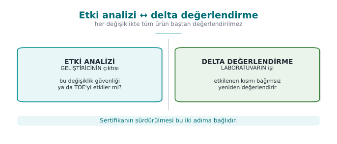

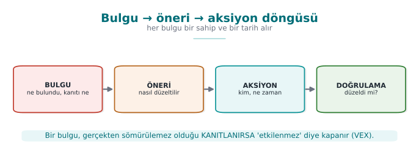

1. **Finding:** what the laboratory found (with evidence, in a repeatable form).
2. **Recommendation:** the fix direction the laboratory suggests.
3. **Action:** what the developer did (or why they didn't — a justified acceptance is also an action).
4. **Closure:** some findings can also close as "not a security vulnerability, a good-practice suggestion."

This cycle is the source of the **finding–action list** (week 7) expected in your post-midterm project.

### Security impact analysis and delta assessment

When fixes produce a new version, re-evaluating everything from scratch is expensive. That's why two documents come
into play (steps 10 and 11 of the process):

- **Security impact analysis:** classifies the changes in the new version (new feature / improvement / bug fix),
  lists the affected files, and writes the **security impact** of every change.
- **Delta assessment:** based on this document, the laboratory re-evaluates **only the changed part**; it asks for
  the marked-up documents, the change log, the file list, and the **new TOE identity**.

!!! warning "Two concepts that get confused"
    **Impact analysis** *documents* a change's security impact; **delta assessment** *re-evaluates only what
    changed*, based on that document. One is the developer's output, the other is the laboratory's work. If the
    version identity and hash values aren't consistent, delta assessment cannot be done (the product being
    evaluated becomes ambiguous).

### End-to-end example: from a finding's birth to its closure

Let's trace the "F-03: key derivation with a fixed salt" finding from the GüvenPay example in section 2 concretely
through **each** of the four steps — this is the full example of how your project's finding–action table should be
filled in.

1. **Finding (laboratory, November 12):** "In `anahtar_yonetimi.c` line 22, the key-derivation function uses a
   fixed string (`\"guvenpay_tuz_2024\"`). Evidence: running with the same input on two different test devices
   produced the **same** 64-byte key (screen output attached). Attack potential: time < 1 day (visible in the
   source code), expertise ordinary, knowledge public, opportunity unlimited, equipment free → **total 0, BASIC**
   (using section 5's score table)."
2. **Recommendation (laboratory, same report):** "Use a unique salt generated from a CSPRNG (week 3) for every
   device; store the salt in the device's secure storage; derive the key with HKDF."
3. **Action (GüvenPay, November 15):** "Accepted. In `anahtar_yonetimi.c`, a 32-byte random salt is now generated
   with the operating system's CSPRNG (week 3) and written to the device's secure storage. The change went into
   v3.2.1."
4. **Closure (laboratory, after delta assessment, November 22):** "Verified: the two devices now produce
   **different** keys. Finding **closed**."

For comparison, let's also see an example closed as "not a security vulnerability, a good-practice suggestion":
"Finding F-07: log messages are only in English, no Turkish error message." GüvenPay's response: "This is not a
security vulnerability, the log messages contain no sensitive data (evidence: the log output was also checked
during the F-03 review) — noted as a usability suggestion, removed from the security finding list." The laboratory
accepts this justification and closes the finding as **"not affected."**

!!! danger "Common mistake: saying 'accepted' and changing nothing"
    Marking a finding "accepted" and making **no change at all** to the source code shows up immediately at delta
    assessment (step 11) — the laboratory reruns the same test and finds the finding is still **open**. **Rule:**
    "accepted" is a commitment to act; the action column is always written in the past tense, describing what
    **was done**, not "to be done" (S16 wants a "result" at the final, section 9).

### End-to-end example: a security impact analysis document

Let's write step 10's impact analysis exactly for GüvenPay's v3.2.0 → v3.2.1 transition (this is a scaled-down
version of the document you'll fill in when you make a fix after the midterm in your own project):

| Field | Content |
| --- | --- |
| Previous version / new version | 3.2.0 (hash: `a1b2...`) → 3.2.1 (hash: `f9e8...`) |
| Change type | Bug fix (security) |
| Affected files | `anahtar_yonetimi.c` (changed); `kart_deposu.c`, network layer (unchanged) |
| Change summary | Replaced fixed salt with a per-device CSPRNG salt + storage in secure storage |
| Security impact | Closes finding F-03; does **not negatively affect** any other asset (backward compatibility was tested with a separate migration script) |
| Delta assessment needed? | Yes — only `anahtar_yonetimi.c` and a rerun of the F-03 test |

!!! success "Rule: impact analysis answers 'how did it affect security,' not just 'what changed'"
    Writing only "file X changed" is not enough; **which asset, in which direction** it affected (did it improve
    it, introduce a new risk, or is it neutral) must be stated explicitly. A change can sometimes also introduce a
    **new** vulnerability — impact analysis's job is exactly to catch this early.

### Residual risk: not everything closes; what doesn't close is written explicitly

Let's make the **residual risk** concept we defined in section 0 concrete here. Consider GüvenPay's F-08 finding
(key rotation once a year): the laboratory recommends doing it more often, but GüvenPay **accepts** the risk,
citing performance and user-experience cost as its justification. The report writes this as: "F-08: key rotation
frequency is once a year. Attack potential: HIGH (17) — not easy, but not impossible either. GüvenPay has **accepted**
this risk, citing performance cost; the residual risk has been **recorded** by the laboratory, not closed."

!!! danger "Common mistake: never writing residual risk into the report"
    Silently skipping every finding that doesn't close gives the reader the impression that "everything is closed"
    — this is **misleading**. **Rule:** every finding that doesn't close is written into the **residual risk** list
    together with its justification; your final project (section 9, item 5) explicitly asks for this list.

### F-03's full life cycle: on a timeline

We've seen the F-03 finding from different angles across many sections this week — how it was found in section 2,
the finding-action cycle in this section, the test cards in section 7 (PT-03/PT-07). Let's gather all of it into a
single timeline; this is the complete picture of how a finding is traced **from start to finish**:

| Date | Step | What happened | Document/evidence |
| --- | --- | --- | --- |
| ~Nov 5 | Step 5 (code review) | Fixed salt noticed, noted as a finding candidate | Evaluator's note |
| ~Nov 8 | Step 6 (vulnerability analysis) | Fixed salt added to the penetration test plan as PT-03 | Penetration test plan |
| Nov 10–14 | Step 7 (penetration test) | PT-03 run, the same key observed on two devices | PT-03 test card (FAIL) |
| Nov 12 | Step 9 (findings) | Finding formally reported: F-03 | Finding report |
| Nov 15 | Finding-action (section 6) | GüvenPay added the fix to v3.2.1 | Source code commit |
| ~Nov 18 | Step 10 (impact analysis) | GüvenPay wrote the impact analysis document | Impact analysis document |
| Nov 22 | Step 11 (delta assessment) | PT-07 run, different keys verified | PT-07 test card (PASS) |
| Nov 22 | Closure (section 6) | F-03 formally closed | Finding report update |

!!! success "Rule: a finding's traceability lives in a chain, not a single document"
    Notice: F-03's story doesn't live in a single file, it lives across multiple **cross-referencing** documents
    (the penetration test plan, test cards, the finding report, the impact analysis document, source code history).
    If this traceability chain is kept unbroken, even a year later the question "why and how was this finding
    closed?" can be answered in seconds — week 13's traceability/compliance matrix is exactly this discipline,
    generalized.

### Scope creep in delta assessment

A common trap when making a fix: the developer, thinking "I was already in there," fixes F-03 while also making
other unrelated small changes (e.g., updating an interface string, deleting an unused function). If the impact
analysis document only describes F-03, the laboratory sees an **unexpected** file change during delta assessment.

!!! warning "Common mistake: not writing 'small, unrelated' changes into the impact analysis"
    Every line changed under the thought "I was already in that file, I changed one more small thing" **must be**
    written into the impact analysis document — you don't get to decide it's minor, the laboratory decides. **Rule:**
    the impact analysis lists **every file that actually changed**; a line skipped as "unimportant" can narrow the
    scope of delta assessment and open the door to a vulnerability going unnoticed.

### When does a fix introduce a new vulnerability?

Step 10's impact analysis document is always explained with "it improved" examples; but in reality a fix can also
introduce a **new problem**. A fictional example: while closing F-03, GüvenPay writes the salt to secure storage
but accidentally leaves a line in a debug build that also writes the salt to the **log**. During delta assessment
the laboratory doesn't just ask "is the salt unique now?" but also looks at the **whole** `anahtar_yonetimi.c` file
and notices this new log line — recording it as a new finding (F-11).

!!! danger "Common mistake: assuming a fix is 'only' good"
    Assuming a change **only** closes an old finding is dangerous; every change can also cause new behavior
    **around** the code it changed. **Rule:** delta assessment asks not only "did the old finding close?" but also
    "is there a **new** problem in the changed file?" — this is why delta assessment doesn't just rerun the old
    test, it re-examines the **entire** changed file.

---

## 7. Penetration test plan

A penetration test is a **planned** and **permitted** activity that combines the methods above from an attacker's
viewpoint. "Planned" and "permitted" are not optional words: a test whose scope and rules aren't written down is
not legitimate security work. A plan contains at least the following four headings.

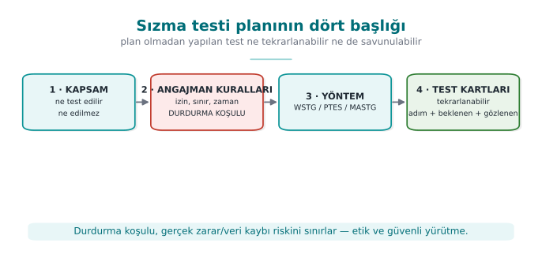

### 1. Scope

What will be tested, and what **won't**, is written down explicitly: which binary/version, which components, which
environment (test environment, or production), which data (only synthetic). What's excluded is also written down
(e.g., third-party servers, real user data).

!!! example "GüvenPay scope item (example text)"
    "Scope: GüvenPay Wallet SDK v3.2.1, Android ARM64 build, test environment (not production), only synthetic
    card data. **Out of scope:** the operating system kernel, the third-party payment gateway, real user accounts."

### 2. Rules of engagement

- **Written permission** and an authorized signature; the test window (date/time).
- Allowed and **forbidden** methods (e.g., excluding tests that would cause a service outage).
- Data-handling rule: no real personal data is used; findings are kept confidential.
- Kill switch: if a critical impact is observed, the test stops and is reported immediately.
- Communication and escalation points.

!!! example "GüvenPay rules-of-engagement item (example text)"
    "Test window: Nov 10–14, 09:00–18:00. Forbidden method: denial-of-service (DoS) attempts against the production
    server. Kill switch: if real user data is encountered, the test stops **immediately** and GüvenPay's security
    team is notified. Point of contact: the security team lead."

### 3. Methodology

A recognized methodology is chosen and followed: **OWASP MASTG/MASVS** for mobile, **OWASP WSTG** for web, **PTES**
or **NIST SP 800-115** for the general process. Choosing a methodology makes the result **repeatable** and
**comparable**.

!!! example "GüvenPay methodology item (example text)"
    "Methodology: based on OWASP MASTG's storage and cryptography test categories."

### 4. Test template (eight fields)

Every test in the evaluation is written with the same template; this is also the skeleton of your project's S16
section:

| Field | Content |
| --- | --- |
| Test ID | Unique number |
| Related requirement | Which requirement/asset it tests (link to S17) |
| Purpose | What is being verified |
| Preconditions | Environment, version, data |
| Method/steps | In a repeatable form |
| Expected result | What the secure behavior should be |
| Observed result | What happened (with evidence) |
| Attack potential / decision | Scoring + pass/fail + recommendation |

None of the eight fields is chosen at random; each answers a question necessary for the test to be **repeatable**
and **debatable**:

- **Test ID:** you need to know which finding (section 6) or which report line (section 8) a given test is tied to
  — a test without an ID is a claim without evidence.
- **Related requirement:** if a test isn't tied to any requirement, it can't answer "why are we doing this test?" —
  this field is the **bridge** to the S17 compliance matrix.
- **Purpose:** without the sentence "what is being verified," a reader can't understand what the test is **trying
  to prove**.
- **Preconditions:** if which version, which environment, which data the test was run with isn't written down,
  nobody else can **repeat** the same test (this is vital in delta assessment).
- **Method/steps:** a test not written step by step carries the risk of "I don't remember how I did it";
  repeatability is the keyword here too.
- **Expected result:** if it isn't written beforehand, the person running the test may be tempted to interpret the
  result **however they like** (cognitive bias, the small-scale version of section 1's "developer can't approve its
  own product" logic).
- **Observed result:** an unevidenced "it worked" sentence isn't even a **finding** in the sense we defined in
  section 0.
- **Attack potential/decision:** turns the test's result into a **priority** (the priority matrix in section 8).

!!! example "Team activity (in class)"
    Each team picks one asset from its own project (e.g., a sensitive record in the local database) and fills in
    **one** test card for it: purpose, precondition, steps, expected/observed result, attack potential. The goal
    isn't to find a flaw, it's to learn **how to write a proper test card**.

### An example of a filled-in test card

Below is a **truly filled-in** version of the eight-field template — a test directly tied to week 3's AES-GCM/AEAD
demo:

| Field | Content |
| --- | --- |
| Test ID | **PT-07** |
| Related requirement | S5 / R-12: "Card fields in the local database are encrypted with AEAD" (week 3, linked to S17) |
| Purpose | To determine whether card data can be captured as plaintext by directly reading the local database file on a rooted device, and whether a tampered record is **rejected** |
| Preconditions | The test device is rooted; GüvenPay v3.2.1 is installed; the database contains only **synthetic** test card data (no real PAN, per this week's ethics rule) |
| Method/steps | (1) The application's `.db` file is pulled from the device's data directory. (2) The file is examined in a hex editor, searching for a 16-digit PAN pattern. (3) If not found, the last byte of an encrypted record's tag is modified. (4) The application is restarted, behavior is observed. |
| Expected result | No field should appear as plaintext in the file (AEAD-encrypted); the tampered record must be **rejected** on startup (fail-closed, week 3's rule) |
| Observed result | The file was examined: all sensitive fields appear as random-looking byte sequences (encrypted), **no** pattern match. When the tampered record's tag was changed, the application logged "integrity verification failed" and **deleted** the record; it did not crash, nor did it silently return wrong data. |
| Attack potential / decision | Since direct file reading fails, the attacker is forced toward key extraction — this falls into the same class as **Scenario B** in section 5 (physical + specialized equipment, score 55, BEYOND). **Decision: PASS.** |

!!! note "Why is this table S16's skeleton?"
    Notice: the "observed result" row is written **with evidence** (log output, file-examination result), it
    contains no assumption such as "probably working." This is exactly what's expected of S16 at the final (section
    9) — **not a plan, but a result.**

### Let's also see a FAIL (failed) example

PT-07 **passed**; but the section is incomplete without also seeing a test card that **fails** — because one of the
most common student mistakes is showing only passing tests. In GüvenPay's first version (v3.2.0, before F-03 was
fixed), the same test would have resulted like this:

| Field | Content |
| --- | --- |
| Test ID | **PT-03** (the source of F-03) |
| Related requirement | R-11: "Key derivation must be unique on every device" |
| Purpose | To verify whether key derivation with the same input on two different devices produces **different** keys |
| Preconditions | Two test devices, GüvenPay v3.2.0, the same synthetic user data |
| Method/steps | (1) The application is freshly installed on both devices. (2) Key derivation is triggered with the same user data. (3) The produced keys are exported and compared. |
| Expected result | The two devices should produce **different** keys (thanks to a device-specific random salt) |
| Observed result | Both devices produced the **same** 64-byte key (screen output attached, byte-for-byte match). Examining the source code showed the salt was a fixed string. |
| Attack potential / decision | Time < 1 day, expertise ordinary, knowledge public, opportunity unlimited, equipment free → **total 0, BASIC**. **Decision: FAIL.** This is the test that gave rise to the F-03 finding (section 6). |

!!! success "Rule: FAIL is not a failure, it's proof the process works"
    Seeing **no** FAIL at all in a test plan usually means not "no vulnerabilities," but "not enough depth was
    used." A good S16 should contain at least a few FAILs, each showing how it was **closed** (through the
    finding-action cycle in section 6) — this is exactly what we saw in the PT-03 → F-03 → PT-07 chain.

!!! note "How it's done in the field? Why is written permission so strict?"
    The "written permission" item in the rules of engagement isn't decorative: attempting to access an unauthorized
    system, regardless of intent (a course project, "well-meaning" research), is considered a **crime** in many
    countries. That's why real laboratories don't run **a single command** before a signed contract exists. In your
    course project, to fully eliminate this risk, penetration-test work is planned on paper, on your **own**
    project only (see the ethics-and-legal-framework box above).

## 8. Reporting

A good security report is not a "you failed" list, it's a **decision-ready** document:

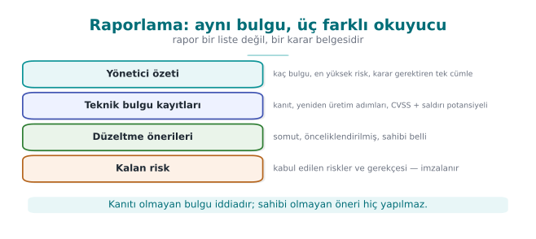

- **Executive summary:** the overall status and the top three most critical findings, for a non-technical reader.
  The reader is usually a manager or a client; it answers not "how many findings are there" but "are we ready for
  production" **directly**.
- **Methodology and scope:** what was tested, what wasn't, with which methodology. **Why** anything excluded is
  out of scope is also written — otherwise the reader can't tell "wasn't tested" from "was forgotten."
- **Findings:** each with evidence, attack potential and CVSS, and a recommendation. Findings are listed in order
  of severity (most serious first); each should be understandable even read on its own.
- **Finding–action table:** the developer's response and closure status. This is the report's counterpart of
  section 6's four-step cycle (finding → recommendation → action → closure).
- **Residual risk:** risks that weren't closed or were transferred, with justification. This section **cannot be
  skipped**: the part of a report that earns the most trust is actually not "we solved everything" but the sentence
  "we couldn't solve this, here's why."

!!! tip "Critical-reading exercise"
    Read a short finding text given to you as a class together: was this finding's attack potential rated
    correctly? Is the recommendation actionable? Does a line that says "met" have evidence? This reading is a
    rehearsal for week 13's compliance-matrix reading.

### A report serves multiple readers

To understand why all five of the sections above are needed, let's ask **who will read** the same report — each
section is actually written for a different reader:

| Section | Who reads it? | What are they looking for? |
| --- | --- | --- |
| Executive summary | Manager, client, bank | "Are we ready for production, yes/no?" |
| Methodology and scope | The next evaluator, an auditor | "Is this test **repeatable**, what didn't it cover?" |
| Findings | Development-team lead | "In what order should we fix these?" |
| Finding–action table | Project manager, future maintenance team | "Has this problem been seen before, what was done?" |
| Residual risk | Senior management, insurance/legal | "What exactly is the risk we've accepted, who approved it?" |

!!! note "How it's done in the field"
    That's why real reports usually aren't written in **a single register**: the executive summary in plain,
    jargon-free language; the findings section in technical terms (CWE ID, attack-potential score). Writing a
    report for a single reader (only the manager, or only the engineer) fails to meet the other readers' needs.

### Example: an executive-summary paragraph

!!! example "GüvenPay evaluation report — executive summary (example)"
    "GüvenPay Wallet SDK v3.2.1 was evaluated against the OWASP MASVS L2 target. Of a total of 9 findings, 7 have
    been closed, 1 has been accepted as low priority, and 1 (F-03, fixed salt) has been fixed and **verified**. The
    three most critical findings: (1) F-03 — fixed salt in key derivation [closed], (2) F-05 — debug logs remaining
    active in the release build [closed], (3) F-08 — low key-rotation frequency [residual risk, justified
    acceptance]. The product is assessed as **ready** for production."

### Example: a finding-row report format

Every row in the findings table is written with the same discipline — evidence, attack potential/CVSS, and
recommendation together:

| Finding no. | Description | Evidence | Attack pot. | CVSS* | Recommendation | Status |
| --- | --- | --- | --- | --- | --- | --- |
| F-03 | Key derivation with a fixed salt | Same key from 2 devices (Annex A) | 0 (BASIC) | 5.9 (Medium) | CSPRNG salt + HKDF | Closed (verified with PT-03) |
| F-08 | Annual key rotation | Guide section 6.1 | 17 (HIGH) | 4.2 (Medium) | Rotate more frequently | Residual risk (accepted) |

*(\*The CVSS values in this example are for illustration; real scoring is done with the AV/AC/PR/UI/C/I/A choices
from section 5 and a standard CVSS calculator.)*

!!! warning "Common mistake: writing 'closed' with no evidence"
    Marking a finding "closed" without writing **which test verified it** makes it impossible for the reader (and
    for the next evaluator) to trust this claim. **Rule:** every "closed" row points to the test ID that verified
    it (e.g., "verified with PT-07").

### Prioritizing findings: a simple priority matrix

We saw in section 5 that CVSS measures **impact** and attack potential measures **cost**. If a report has dozens of
findings, which one to look at first comes from the **combination** of these two. The matrix below is not a formal
standard, it's **a simple teaching tool we use for this course** — real schemes have more detailed priority rules,
but the idea is the same:

| | Attack pot. BASIC/MODERATE (easy) | Attack pot. HIGH/VERY HIGH | Attack pot. BEYOND (very hard) |
| --- | --- | --- | --- |
| **CVSS Critical/High (large impact)** | 🔴 Urgent — close immediately | 🟠 High priority | 🟡 Monitor, not urgent |
| **CVSS Medium (limited impact)** | 🟠 High priority | 🟡 Medium priority | 🟢 Low priority |
| **CVSS Low (small impact)** | 🟡 Medium priority | 🟢 Low priority | 🟢 Low priority |

Let's apply it to the GüvenPay example: **F-03** (CVSS Medium, attack potential BASIC) falls into the "high
priority" cell in the table — exactly why it was the first finding closed. **F-08** (CVSS Medium, attack potential
HIGH) falls into the "medium priority" cell — which is why it's reasonable for it to be accepted as a residual risk.

!!! success "Rule: single-axis prioritization misleads"
    Ranking by CVSS alone (or by attack potential alone) means reading only one row or one column of the matrix.
    **Rule:** the priority decision is always given by the **intersection of the two axes**.

### How long should a report be?

A weaker student often falls into one of two extremes: either writing a one-page, evidence-free "everything's
secure" report, or dumping every single detail (every SAST warning, every unverified candidate finding) one after
another. Both are wrong:

- **Too short a report:** the reader can't see what a decision **is based on**; the word "secure" is not evidence
  (the "claim is not evidence" rule from section 1).
- **Too long, unfiltered a report:** dumping dozens of unverified SAST warnings as-is causes the reader to **lose**
  the real three-to-five critical findings **in the noise** (the reporting-level counterpart of the
  false-positive discussion in section 3).

!!! success "Rule: traceability matters, not length"
    The right measure isn't page count: it's that every claim is tied to evidence, and every piece of evidence is
    tied to a test ID. An executive summary can be half a page, a findings section can be as long as there are
    findings — what matters is that **no sentence is left without evidence**.

## 9. Term project: this week (S16 — test plan and results)

1. **Test plan:** write eight-field test cards for the two–three most critical assets/requirements (linked to
   S17).
2. **Methodology:** state which methodology (MASTG/WSTG/PTES/NIST SP 800-115) you're basing it on.
3. **Results:** run the tests and write the **observed results** — at the final, a plan is not expected, a
   **result** is.
4. **Finding–action:** pour your midterm feedback into a finding–action table.
5. **Residual risk:** write down the risks you haven't closed and why.

### Why item 4 matters especially: your midterm feedback is already a set of "findings"

Every piece of feedback the instructor gave in your midterm presentation is, in this week's language, actually a
**finding**: a weakness, an observation marked with evidence (the observation made during the presentation). Apply
this week's four-step cycle (section 6) directly to your own project:

1. **Finding:** the concrete sentence the instructor said at the midterm (e.g., "input validation is missing").
2. **Recommendation:** the concrete fix direction that follows from that feedback.
3. **Action:** what you **did** by the final (code change, commit reference).
4. **Closure:** a test that proves the fix (a new or updated test card).

!!! tip "This is your project's counterpart of the F-03 chain in the GüvenPay example"
    The "PT-03 (FAIL) → F-03 → fix → PT-07 (PASS)" chain we traced in sections 2, 6, and 7 was a fictional example;
    what's expected at the final is that you build a **real** chain for your own midterm feedback: which feedback,
    which change, verified by which test?

!!! warning "Ethical and legal framework (repeated)"
    Penetration testing is done only on your **own** project and systems you are authorized on. Testing someone
    else's system without permission is a crime, whatever the intent. All data must be synthetic; no real secret or
    personal data may be in the repo.

!!! example "Checklist for filling in S16 in your own project"
    - [ ] Are **all** eight fields filled in on every test card (section 7)?
    - [ ] Does the "observed result" field contain **evidence** (screen output, log, file) — or does it only say "it
      worked"?
    - [ ] Has attack potential been computed with the **five factors** for every serious finding (section 5)?
    - [ ] Does every row in the finding–action table have a **status** (closed / residual risk / not affected)?
    - [ ] Are residual risks written **with justification**, or silently skipped?
    - [ ] Is the methodology used (MASTG/WSTG/PTES/NIST SP 800-115) explicitly stated?

## 10. Self-check


??? question "1. Outline the 13 steps in an independent evaluation of a product. What do the preparation, evaluation, and continuity phases cover?"
    **Preparation (1–4):** defining the target of evaluation (TOE), scope, security target/requirements, planning. **Evaluation:** applying the methods (code review → SAST → DAST → fuzzing → penetration test), rating findings with attack potential, reporting. **Continuity:** the decision/certificate, then, on every change, impact analysis + delta assessment and version maintenance.

??? question "2. What two assumptions does the evaluator work with? Why does this produce the conclusion 'a control merely existing is not enough'?"
    (1) The attacker **fully knows** the system (Kerckhoffs), (2) the attacker is **capable and resourced**. That's why it's not enough for a control to merely exist; it must rest on a specific **attack potential**, and this must be shown **with evidence**.

??? question "3. Why do we apply the vulnerability-assessment methods (code review, SAST, DAST, fuzzing, penetration test) in this order?"
    From cheap/automatic/broad-coverage methods toward expensive/manual/deep methods. Early, cheap scans filter out easy findings; expensive manual effort (fuzzing, penetration testing) is spent only on the remaining deep problems → budget and time are used efficiently.

??? question "4. How do ISO/IEC 27001's and Common Criteria's testing expectations differ? What does each one certify?"
    ISO/IEC 27001 audits and certifies the **organization's information security management system** (process/organization). Common Criteria (ISO/IEC 15408) technically evaluates and certifies **a specific product (TOE)** at a defined assurance level.

??? question "5. List attack potential's five factors. Why is low attack potential a serious finding?"
    **Elapsed time, expertise, knowledge of the product, opportunity (access/window), equipment.** Low attack potential means it can be exploited with little time/skill/tools → many attackers could succeed → a broad and likely threat, i.e., high risk.

??? question "6. What do attack potential and CVSS each measure? Why are the two given together?"
    **Attack potential** measures the **difficulty/cost** of carrying out the attack; **CVSS** measures the flaw's **severity/impact**. Given together, you see both "how easy" and "how bad," and prioritization is done soundly.

??? question "7. Explain the finding–recommendation–action cycle. How can a finding close as 'not a security vulnerability'?"
    Every finding is assigned a **fix recommendation** and a responsible **action**, then the fix is **verified**. If a finding is proven to genuinely be **unexploitable**, due to context or compensating controls, it is closed with the justification 'not affected / risk accepted' (VEX-like).

??? question "8. What is the difference between security impact analysis and delta assessment? Which is the developer's output, which is the laboratory's?"
    **Impact analysis is the developer's** output: does the change made affect security/the TOE? **Delta assessment is the laboratory's** job: it independently re-evaluates the affected part (not the whole product from scratch).

??? question "9. Write the four headings of a penetration test plan (scope, rules of engagement, methodology, test template) and the purpose of each."
    **Scope:** what will and won't be tested. **Rules of engagement:** permissions, boundaries, timing, kill switch. **Methodology:** the methodology and tools (WSTG/PTES, etc.). **Test template:** repeatable test cards. Purpose: a safe, ethical, repeatable test with a clear scope.

??? question "10. Why does a 'kill switch' exist in the rules of engagement?"
    To limit the risk of real harm, data loss, or service disruption. At a defined threshold (e.g., production impact or a critical flaw) the test is **stopped immediately** → ensures safe and ethical execution.

??? question "11. List the fields of the eight-field test card. Which field ties to the S17 compliance matrix?"
    E.g.: **ID/number, related requirement-target, precondition, steps, expected result, observed result, decision (pass/fail), evidence/attachment.** The 'related requirement / decision' field is tied as evidence to the **S17 compliance matrix**.

??? question "12. What does it mean that S16 is expected to deliver a 'result,' not a 'plan,' at the final?"
    It's not enough to just write how the test will be done; the tests must actually be **run** and their observed results (pass/fail, evidence, screen output) reported. In other words, it's not the plan that's delivered, but the **observed results**.

??? question "13. What is risk, and how are the terms vulnerability, finding, and risk distinguished from each other?"
    **Risk** is a joint assessment of a vulnerability's **probability** of being exploited and the **impact** that would result if it were. A **vulnerability** is a technical weakness (e.g., using a fixed salt); a **finding** is that weakness documented with evidence during evaluation; **risk** is the answer to "how dangerous is this weakness, really" (it varies with contextual factors such as access, environment, and data value).

??? question "14. What is the difference between a false positive and a false negative? Which is more dangerous?"
    A **false positive** is when a tool says "there's a problem" but there really isn't (wastes time, causes alert fatigue). A **false negative** is a real problem the tool **misses**, and it is more dangerous; because the trust of "the tool said it's clean" creates a false sense of security and the real flaw goes unnoticed.

??? question "15. Why can't TOE identity consist of just a version number?"
    Different builds (debug/release, different compiler flags) can exist under the same version number, and their behavior can differ. That's why a TOE identity has four parts: version label + binary (build type/architecture) + source code (commit/tag) + **hash value**; the hash reveals even a single-byte difference.

??? question "16. What values can CVSS's AV (attack vector) and AC (attack complexity) metrics take?"
    **AV (Attack Vector):** Network · Adjacent · Local · Physical. **AC (Attack Complexity):** Low · High. These are coarse, categorical options; they operate at a different resolution than attack potential's numeric, fine-grained scoring.

??? question "17. In section 5's 'secure-element cracking' example (Scenario B), write the five factors' scores and their total. Which level does it correspond to?"
    Elapsed time (months) = 19, expertise (multiple experts) = 8, knowledge of target (critical) = 11, opportunity (very restricted) = 10, equipment (bespoke) = 7. **Total = 19+8+11+10+7 = 55** → since 55 ≥ 25, this is the **BEYOND** level (only a very capable/resourced attacker).

??? question "18. For the same finding, the CVSS base score comes out at 6.4 (physical/high complexity), and the attack potential comes out at 55/BEYOND. How do you explain this difference?"
    CVSS measures **impact** (what happens if this flaw is realized) with coarse categorical metrics (2–4 options, like AV/AC); attack potential measures **cost** (time, expertise, knowledge, opportunity, equipment) with a fine-grained, additive score. Since the two answer different questions at different resolutions, the numbers don't have to match; this is not a mistake, it's an expected situation.

??? question "19. What is the difference between 'scope' and 'rules of engagement' in a penetration test plan?"
    **Scope** defines WHAT will and won't be tested (which version, environment, data). **Rules of engagement** constrain HOW the test will be carried out: permission, time window, forbidden methods, kill switch, communication points. One answers "what," the other answers "how."

??? question "20. Why is it risky in the finding-action cycle to write 'accepted' and make no change at all to the source code?"
    At the delta assessment stage (step 11) the laboratory reruns the same test; if no change was made, the finding still comes out **open** and trust is lost. Rule: "accepted" is a **commitment** to an action; the action column is always written in the past tense, describing what **was done**, with evidence, not "to be done."

??? question "21. Why does 'code coverage' matter in a fuzzing result?"
    Fuzzing works by reaching more code paths over time (accumulating coverage); a short run only tries shallow paths. A "clean" result given without stated coverage can mean the tool has **never** gone deep at all; that's why duration and the percentage of coverage reached are reported together.

??? question "22. When is delta assessment needed, and how does it differ from evaluating the whole product from scratch?"
    It's needed when a fix/update produces a new version. Instead of evaluating the whole product from scratch, the laboratory re-evaluates only the **changed part** (based on the impact analysis document, the changed files, and the new TOE identity); this is both fast and ensures **continuity** without requiring a full certification cycle for every version.

??? question "23. What does a standard's (e.g., Common Criteria's) test depth depend on?"
    It depends on the targeted asset's **value** and the assumed **attacker model**: the baseline security of an IoT light bulb and the key hierarchy of a payment card are not tested with the same rigor, because the consequences of their being broken are not on the same scale. This depth difference is formalized in Common Criteria through assurance levels (week 13).

??? question "24. Why is writing 'F-03 closed' in a report line alone insufficient?"
    If it doesn't state **which test verified** this closure (e.g., "verified with PT-07"), the reader can't trust the claim. Rule: every 'closed' record must be explicitly tied to the test ID or evidence that verifies it — otherwise the next evaluator (or the instructor) has to redo the same test from scratch.

??? question "25. How do code review and penetration testing compare in their power to find a SQL-injection bug? Why is fuzzing weak at this bug?"
    Code review and penetration testing are strong at this kind of **logic** bug (one finds it by reading context, the other by trying it directly). Fuzzing works with random byte sequences; since the probability of producing valid SQL syntax (like `' OR '1'='1`) is low, it is **weak** at this kind of structured logic bug — fuzzing is much stronger at memory/UB bugs.

??? question "26. What four pieces of information must a complete sentence about a 'certified' product include?"
    (1) **Which product/version** (TOE identity, including hash), (2) **against which standard** (e.g., Common Criteria, EMVCo), (3) **against which attacker model** (e.g., a moderately skilled attacker with no physical access), (4) **as of which date** — because once the product is updated the certificate remains valid for that old version, and the new version must go through delta assessment.

### This week's terms: side-by-side comparison

Let's put the five most commonly confused term pairs from this week side by side one last time before the exam:

| Pair | First | Second | Distinguishing question |
| --- | --- | --- | --- |
| Vulnerability / Finding / Risk | Vulnerability: a technical weakness | Finding: its form documented with evidence | Risk: "how dangerous is it, really?" (probability × impact) |
| SAST / DAST | Analysis **without running** the source | Analysis **by running** the program | "Is the code being read, or is behavior being observed?" |
| Attack potential / CVSS | The **cost/difficulty** of the attack | The flaw's **impact/severity** | "How hard is it?" vs. "how bad is it if it happens?" |
| Impact analysis / Delta assessment | The developer's **document** | The laboratory's **re-test** | "Who wrote it, who verified it?" |
| Scope / Rules of engagement | **What** is tested | **How** it is tested | "What's being tested?" vs. "within which boundaries?" |

!!! success "Final check before the exam"
    If you can cover the five rows of this table and, looking only at the "Distinguishing question" column, recall
    both sides of every pair, you have built this week's conceptual skeleton.

## 11. Resources and further reading

- **The secure-programming technical guide** (course resource) — the structure of the delivered security guide and
  the change/impact-analysis documents; the requirement block and status ("met / transferred / not met").
- **OWASP MASVS** and **MASTG** — mobile application security requirements and testing guide.
- **OWASP WSTG** — web application security testing guide.
- **PTES** (Penetration Testing Execution Standard) and **NIST SP 800-115** — penetration-testing process
  methodologies.
- **Common Criteria (ISO/IEC 15408)** and related attack-potential guides — a bridge to week 13.
- **CVSS** — vulnerability severity scoring; the detailed calculation steps of the base-score formula are published
  in the CVSS v3.1 Specification (FIRST.org).

### This week in one paragraph

A product is examined at an independent laboratory with **white-box** access, in the order code review → SAST →
DAST → fuzzing → penetration test; every vulnerability becomes, with evidence, a **finding**; every finding turns
into a **priority** via **attack potential** (five factors: time, expertise, knowledge, opportunity, equipment) and
**CVSS** (impact); once the developer makes a fix, the laboratory re-examines only the changed part through **delta
assessment**; every risk that isn't closed is written down **explicitly**; and this whole chain — finding, test
card, impact analysis, action — stays **traceable** by cross-referencing itself. The F-03 chain we traced end to end
in the GüvenPay example (Step 5 → PT-03 → finding → fix → PT-07 → closure) is a single real-time example of this
paragraph.

!!! info "Next week"
    **Week 13 — Security requirements.** This week we saw the "requirement template" and "compliance matrix" as
    part of the process; in week 13 we'll cover in detail how a good requirement is written, the
    traceability/compliance matrix, and the requirement sets of Common Criteria, FIPS 140-3, ETSI, EMVCo, PCI, and
    MASVS.
