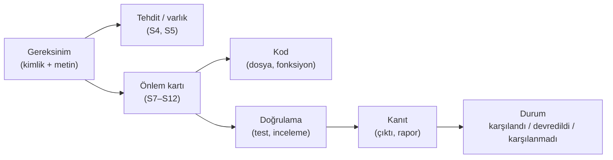
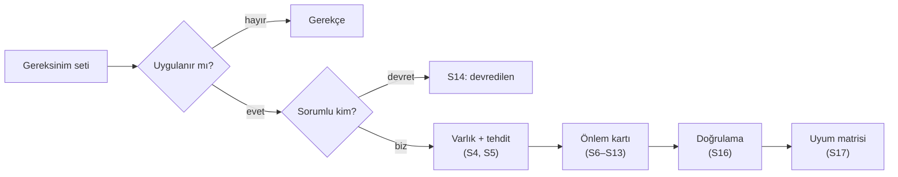

# Hafta 13 — Güvenlik Gereksinimleri

| | |
| --- | --- |
| **Tarih** | 11.12.2026 |
| **Öğrenme çıktıları** | ÖÇ.5, 7 |
| **Süre** | 3 saat |

<!-- materyal:basla -->

<div class="materyal" markdown>

[:material-file-pdf-box: Ders notu (PDF)](cen429-week-13-ders-notu.pdf){ .md-button download="cen429-week-13-ders-notu.pdf" }
[:material-file-word-box: Ders notu (DOCX)](cen429-week-13-ders-notu.docx){ .md-button download="cen429-week-13-ders-notu.docx" }
[:material-presentation: Sunum (PDF)](cen429-week-13-sunum.pdf){ .md-button download="cen429-week-13-sunum.pdf" }
[:material-microsoft-powerpoint: Sunum (PPTX)](cen429-week-13-sunum.pptx){ .md-button download="cen429-week-13-sunum.pptx" }
[:material-language-html5: Sunum (HTML, çevrimdışı)](cen429-week-13-sunum.html){ .md-button download="cen429-week-13-sunum.html" }
[:material-folder-zip: Tümünü indir (ZIP)](cen429-week-13-materyal.zip){ .md-button download="cen429-week-13-materyal.zip" }
[:material-fullscreen: Sunumu tam ekran aç](cen429-week-13-sunum.html){ .md-button .md-button--primary target=_blank }

</div>

<div class="sunum-cercevesi">
<iframe src="../cen429-week-13-sunum.html" title="Hafta 13 — Güvenlik Gereksinimleri" loading="lazy" allowfullscreen></iframe>
</div>

<p class="sunum-ipucu">Sunumun içine tıklayıp ok tuşlarıyla ilerleyin; tam ekran için sunumun sağ altındaki düğmeyi ya da yukarıdaki "Sunumu tam ekran aç" bağlantısını kullanın.</p>

<!-- materyal:bitis -->

!!! example "Bu haftanın çalışan demosu"
    `code/week-13/01-uyum-matrisi` — Uyum matrisi dogrulayici: kanitsiz 'karsilandi' satirlarini bulgu olarak isaretler (S17).
    · `code/week-13/02-gereksinim-kalite` — Gereksinim kalitesi denetleyicisi: belirsiz/doğrulanamaz gereksinimi işaretler.

    Çalıştırma: `sh demo.sh` (Linux/WSL) ya da CMake ile derleyip `bin/` altından. Tümüyle sentetik ve güvenlidir; öğrenci bilgisayarına zarar vermez.


!!! tip "Demoyu kendiniz çalıştırın — adım adım (kopyala-yapıştır)"
    İlk derleme `code/README.md`'de anlatılır. **`code`** klasöründen:

    ```powershell
    # Windows (PowerShell)
    .\build.ps1
    cd week-13\01-uyum-matrisi
    .\bin\windows\uyum.exe
    cd ..\02-gereksinim-kalite
    .\bin\windows\gereksinim_kalite.exe
    ```

    ```sh
    # WSL / Linux
    ./build.sh
    cd week-13/01-uyum-matrisi && ./bin/linux/uyum
    cd ../02-gereksinim-kalite && ./bin/linux/gereksinim_kalite
    ```

    **Beklenen çıktı:** Birinci demo bir **uyum matrisini** satır satır okur ve **kanıtı olmayan "karşılandı"** satırlarını kırmızı bayrakla işaretler. İkinci demo örnek gereksinimleri tarar; "güvenli olmalı", "uygun şekilde" gibi **belirsiz/ölçülemez** ifadeleri **ZAYIF** diye işaretler ve **çıkış kodu = zayıf gereksinim sayısı** olur.

!!! abstract "Bu haftanın sonunda şunları yapabileceksiniz"
    1. İyi bir **güvenlik gereksinimini** kötüsünden ayırmak; gereksinimi tasarıma, önleme, teste ve kanıta bağlayan bir
       **izlenebilirlik matrisi** kurmak.
    2. Gereksinim durumlarını (**karşılandı / devredildi / karşılanmadı**) doğru kullanmak; bir yazılım bileşeninin
       işletim sistemine ve üst uygulamaya **devrettiği** gereksinimleri yazmak.
    3. **Ortak Kriterler**'in (ISO/IEC 15408) temel kavramlarını (TOE, ST, PP, SFR, SAR, EAL) ve **FIPS 140-3**'ün güvenlik
       düzeylerini açıklamak.
    4. ETSI, GSMA, EMVCo ve PCI'ın mobil ve gömülü sistemler için yayımladığı gereksinim setlerinin ne istediğini
       karşılaştırmak.
    5. Dersin gereksinim ailelerini kullanarak kendi projeniz için bir **uyum matrisi** (S17) ve **devredilen
       gereksinimler** bölümü (S14) yazmak.

??? info "Ders akışı (öğretim üyesi için zaman planı)"
    | Zaman | Bölüm | Ne yapılıyor |
    | --- | --- | --- |
    | 0:00–0:20 | 1 | Gereksinim nedir, iyi gereksinim nasıl yazılır? |
    | 0:20–0:50 | 2–3 | Gereksinimden kanıta izlenebilirlik; gereksinim bloğu kalıbı ve devredilen gereksinimler |
    | 0:50–1:00 | Ara | |
    | 1:00–1:30 | 4 | Ortak Kriterler: TOE, ST, PP, SFR/SAR, EAL |
    | 1:30–1:50 | 5 | FIPS 140-3 ve kriptografik modül doğrulaması |
    | 1:50–2:00 | Ara | |
    | 2:00–2:25 | 6 | ETSI, GSMA, EMVCo, PCI MPoC, OWASP MASVS |
    | 2:25–2:50 | 7–8 | Gereksinimleri plana ve varlık yönetimine aktarmak; dersin gereksinim aileleri — **uyum matrisi etkinliği** |
    | 2:50–3:00 | 9+ | Proje adımı (S14, S17), kendini sınama |

!!! info "Bu haftanın kaynakları hakkında"
    Kart şemalarının gereksinim metinleri kuruma özeldir ve gizlilik anlaşmasıyla paylaşılır. Bu yüzden bu haftada
    şemaların metinleri yerine **açık standartlar** (Ortak Kriterler, FIPS 140-3, ETSI EN 303 645, OWASP MASVS) ve bunlardan
    uyarlanmış **dersin kendi gereksinim kimlikleri** kullanılır. Yapılar ve yöntemler sahadaki belgelerle aynıdır.

---

## 1. Güvenlik gereksinimi nedir? İyi gereksinim nasıl yazılır?

Dönem boyunca her önlemi bir **tehdide** bağladık: "şu varlığı, şu saldırgana karşı koruyoruz." Sertifikasyon dünyasında
aynı bağ bir adım daha uzar: her önlem bir **gereksinime** bağlanır. Gereksinim, ürünün **ne yapması gerektiğini**
söyler; nasıl yapacağını söylemez. Tasarım ve kod "nasıl"ı cevaplar; değerlendirici ise "gereksinim karşılanmış mı, kanıtı
nerede?" diye sorar.

!!! note "Kısa tarihçe: güvenlik gereksinimleri nasıl standartlaştı?"
    - **1985** — **TCSEC** ("Orange Book") güvenlik **gereksinim düzeylerini** ilk kez resmîleştirir.
    - **1994** — **FIPS 140** kriptografik modül gereksinimleri (bugün **140-3**, 2019).
    - **1999** — **Ortak Kriterler (ISO/IEC 15408)**: **PP/ST**, **SFR/SAR** ve **EAL** kavramları buradan gelir (12. hafta süreci).
    - **2010'lar** — sektöre özgü setler: mobil için **OWASP MASVS/MASTG**, tüketici IoT için **ETSI EN 303 645**, ödeme için **EMVCo/PCI**.

    Değişmeyen ilke: iyi gereksinim **ölçülebilir** ve **izlenebilir** olmalıdır; kanıtsız "karşılandı" geçersizdir.

### Üç tür gereksinim

| Tür | Soru | Örnek |
| --- | --- | --- |
| **İşlevsel güvenlik gereksinimi** | Ürün hangi güvenlik işlevini yerine getirmeli? | "Uygulama, yerel veritabanındaki hassas verileri kimlik doğrulamalı şifrelemeyle korumalıdır." |
| **Güvence gereksinimi** | Ürünün bu işlevi doğru yerine getirdiğine nasıl güveneceğiz? | "Geliştirici, kaynak kodun statik analiz raporunu ve güvenlik testlerinin sonuçlarını sunmalıdır." |
| **Süreç gereksinimi** | Ürünü üreten kurum nasıl çalışmalı? | "Her değişiklik, birleştirilmeden önce en az bir başka geliştirici tarafından incelenmelidir." |

### Kötü ve iyi gereksinim

| Kötü | Neden kötü? | İyi |
| --- | --- | --- |
| "Uygulama güvenli olmalıdır." | Doğrulanamaz | "Uygulama, sürüm derlemesinde yığın koruyucu, PIE ve tam RELRO etkin olarak derlenmelidir." |
| "Veriler şifrelenmelidir." | Hangi veri, hangi durumda, hangi güçte? | "Varlık tablosunda C olarak işaretlenen her varlık, beklemede en az 128 bit güvenlik düzeyinde bir AEAD algoritmasıyla şifrelenmelidir." |
| "Anahtarlar korunmalı ve iyi yönetilmelidir." | İki gereksinim birden, ölçütsüz | (1) "Her anahtarın amacı, kripto-periyodu ve imha anı belgelenmelidir." (2) "Anahtarlar iş bitince bellekten silinmelidir." |
| "Uygulama saldırıları algılamaya çalışmalıdır." | "Çalışmalı" ölçülemez | "Uygulama, hata ayıklayıcı bağlandığında hassas işlemleri reddetmeli ve olayı bildirmelidir." |

İyi bir gereksinimin özellikleri: **tekil** (bir cümle, bir gereksinim), **doğrulanabilir** (bir test ya da inceleme ile
karşılandığı gösterilebilir), **izlenebilir** (bir kimliği vardır ve bir tehdide ya da standarda bağlıdır), **uygulanabilir**
(teknik olarak mümkündür) ve **nasıl değil ne** (çözümü dayatmaz; ama güvenlik düzeyi gibi ölçütleri verir).

!!! tip "Zorunluluk sözcükleri"
    Standartlar zorunluluk düzeyini sabit sözcüklerle ifade eder (RFC 2119 / ISO yönergeleri): **-malıdır / -meli**
    (MUST, SHALL) zorunlu; **-malı (önerilir)** (SHOULD) güçlü öneri, uyulmazsa gerekçe gerekir; **-abilir** (MAY)
    isteğe bağlı. Kendi gereksinimlerinizde bu ayrımı tutarlı kullanın; "should" bir gereksinimi karşılamamanın
    gerekçesini yazmadan geçmek, değerlendiricinin gözünde bir eksikliktir.

---

## 2. Gereksinimden kanıta: izlenebilirlik

Bir gereksinim ancak **kanıtıyla** karşılanmış sayılır. Sertifikasyonda her gereksinim için şu zincir kurulur:



Bu zincirin tablo haline **uyum matrisi** (compliance matrix) denir:

| Kimlik | Gereksinim | Durum | Önlem (kılavuz bölümü) | Doğrulama | Kanıt |
| --- | --- | --- | --- | --- | --- |
| CEN429-DR-01 | Beklemedeki hassas veri AEAD ile şifrelenmelidir | Karşılandı | S7.2 "Kasa dosyası şifreleme" | Birim testi: bir bayt değiştirilince açma reddedilir | `test_butunluk.c` çıktısı |
| CEN429-AP-03 | Sürüm derlemesinde hata ayıklama günlüğü bulunmamalıdır | Karşılandı | S12.1 | `strings` taraması | Tarama çıktısı, CI kaydı |
| CEN429-AP-07 | Uygulama güvenli biçimde kurulmalı ve güncellenmelidir | **Devredildi** | S14.2 (dağıtım platformuna) | — | Gerekçe |
| CEN429-DT-04 | Sunucu sertifikası sabitlenmelidir | Karşılanmadı | — | — | Kalan risk: S16.4 |

Matrisin iki yönü vardır: **ileri izlenebilirlik** (her gereksinim bir önleme ve teste gidiyor mu?) ve **geri
izlenebilirlik** (her önlem bir gereksinime ya da tehdide dayanıyor mu, yoksa gereksiz mi?). Değerlendirici önce ileri
yönü okur: karşılanmış denen ama kanıtı olmayan bir satır, ilk bulgudur.

---

## 3. Gereksinim bloğu kalıbı ve devredilen gereksinimler

### Kılavuzda gereksinim bloğu

Sertifikasyondan geçen güvenlik kılavuzlarında her bölüm, o bölüme düşen gereksinimlerle açılır. Her gereksinim şu
kalıpta yazılır:

```text
[Standart/şema] Gereksinim kimliği — DURUM
Gereksinimin metni (standarttan).
Ürünün bu gereksinimi nasıl karşıladığının açıklaması; ilgili önlem kartlarına ve bölümlere başvuru.
```

Sahada bir mobil ödeme kütüphanesinin kılavuzunda "beklemede veri", "kullanımda veri", "aktarımda veri", "raporlama",
"kripto yöntemleri ve anahtarlar" gibi her bölüm, iki kart şemasının bu konudaki gereksinimleriyle açılır ve her biri
**karşılandı** ya da **üst uygulamaya devredildi** olarak işaretlenir. Bu kalıbın gücü, değerlendiricinin gereksinimden
kanıta tek bakışta gidebilmesidir.

### Devredilen gereksinimler: sorumluluğun sınırı

Bir yazılım bileşeni (ör. başka uygulamaların içine gömülen bir kütüphane) her gereksinimi tek başına karşılayamaz.
Uygulamanın kurulması, güncellenmesi, kullanıcıya bildirim göstermesi ya da kendi kaynak kodunu koruması, bileşenin değil
onu kullanan uygulamanın işidir. Bu gereksinimler **devredilir** ve kılavuzun "dış bileşenlerden beklenen güvenlik"
bölümünde açıkça yazılır.

| Kime devredilir? | Tipik gereksinim | Kılavuzda nasıl yazılır? |
| --- | --- | --- |
| **Üst uygulama** | Güvenli kurulum ve güncelleme | "Uygulamanın dağıtım ve güncelleme mekanizması üst uygulamanın sorumluluğundadır." |
| **Üst uygulama** | Uzlaşmanın arka uca ve kullanıcıya bildirilmesi | "Kütüphane algıladığı saldırıyı üst uygulamaya bildirir (yöntem: …); arka uca ve kullanıcıya iletmek üst uygulamanın görevidir." |
| **Üst uygulama** | Kendi kaynak kodunu gizleme ve koruma | "Kütüphane yalnız kendi kodunu korur; üst uygulama kendi koruma önlemlerini almalıdır." |
| **Üst uygulama** | Kütüphaneye parametre olarak verilen varlıkların korunması | Sunucu adresi, sertifika ve sabitleme değerleri gibi parametreler tek tek listelenir |
| **İşletim sistemi** | Uygulama yalıtımı, desteklenen en düşük sürüm | "Desteklenen en düşük işletim sistemi sürümü …; işletim sisteminden bunun dışında bir güvenlik beklentisi yoktur." |
| **Donanım** | Güvenli eleman, TEE | Kullanılmıyorsa açıkça "donanımdan beklenti yoktur" yazılır |

!!! warning "Devretmek, yok saymak değildir"
    Devredilen her gereksinim için **kime**, **neden** devredildiği ve üst tarafın bunu **nasıl** karşılayabileceği
    yazılır. Belirsiz bırakılan sorumluluk, iki tarafın da "öbürü yapıyordur" dediği bir boşluğa dönüşür. Sahada bir
    kütüphanenin uzlaşmayı üst uygulamaya bildirmek için iki seçeneği (bütün verileri silip bir bayrak dosyası yazmak ya
    da üst uygulamanın kendi dosyasını silmek) artı ve eksileriyle tartışıp birini gerekçesiyle seçtiği görülür; bu tartışma
    kılavuza yazılır.

### Proje için: S14 "Varsayımlar ve devredilen gereksinimler"

Projeniz tek başına çalışan bir uygulama olsa bile varsayımları vardır: desteklenen işletim sistemleri, kullanıcının
yönetici olmadığı, derleme ortamının güvenilir olduğu, sunucunun ayrı bir ekip tarafından korunduğu. Bunları **açıkça**
yazmak, değerlendiricinin kapsamı doğru anlamasını sağlar ve "bu tehdit neden kapsam dışı?" sorusunu önceden cevaplar.

---

## 4. Ortak Kriterler (ISO/IEC 15408)

**Ortak Kriterler** (Common Criteria, CC), BT ürünlerinin güvenlik değerlendirmesi için uluslararası standarttır.
Değerlendirme yöntemi ayrı bir belgede (CEM, ISO/IEC 18045) tanımlanır. Ortak Kriterleri Tanıma Anlaşması (CCRA) sayesinde
bir ülkede verilen sertifika, anlaşmaya taraf diğer ülkelerde de tanınır.

### Temel kavramlar

| Kavram | Anlamı | Dersteki karşılığı |
| --- | --- | --- |
| **TOE** (Target of Evaluation) | Değerlendirilen ürün ve belgeleri; benzersiz tanımlanır | Değerlendirme hedefi (1. hafta, S0/S1) |
| **ST** (Security Target) | Ürüne özgü güvenlik hedefi belgesi: tehditler, varsayımlar, güvenlik amaçları, gereksinimler | Güvenlik kılavuzunuz |
| **PP** (Protection Profile) | Bir ürün sınıfı için (ör. mobil cihaz, güvenlik duvarı) ortak gereksinim seti; ürünler buna uyduğunu iddia eder | Dersin gereksinim aileleri |
| **SFR** (Security Functional Requirement) | İşlevsel güvenlik gereksinimleri; standart bir katalogdan seçilir (ör. FCS kriptografik destek, FDP kullanıcı verisi koruma, FIA kimlik doğrulama) | İşlevsel gereksinimler |
| **SAR** (Security Assurance Requirement) | Güvence gereksinimleri (ör. ADV geliştirme, ATE test, AVA zafiyet değerlendirmesi) | Güvence gereksinimleri |
| **EAL** (Evaluation Assurance Level) | Önceden tanımlanmış SAR paketleri: EAL1'den EAL7'ye | — |

### EAL düzeyleri

| Düzey | Adı | Tipik kullanım |
| --- | --- | --- |
| EAL1 | İşlevsel olarak test edilmiş | Tehdidin düşük olduğu durumlar |
| EAL2 | Yapısal olarak test edilmiş | Temel güvence |
| EAL3 | Yöntemli test edilmiş ve denetlenmiş | Orta düzey |
| **EAL4** | Yöntemli tasarlanmış, test edilmiş ve gözden geçirilmiş | Ticari ürünlerde en yaygın üst düzey (işletim sistemleri, ağ cihazları) |
| EAL5 | Yarı biçimsel tasarlanmış ve test edilmiş | Akıllı kartlar ve güvenli elemanlar (çoğu zaman EAL5+ / EAL6+) |
| EAL6 | Yarı biçimsel doğrulanmış tasarım | Yüksek riskli ortamlar |
| EAL7 | Biçimsel doğrulanmış tasarım | Çok yüksek riskli, küçük sistemler |

EAL yüksekliği ürünün "daha güvenli" olduğu anlamına gelmez; **değerlendirmenin daha derin** yapıldığı anlamına gelir.
EAL4 bir ürün, EAL2 bir üründen daha güvensiz olabilir; önemli olan ST'deki güvenlik amaçlarının ve tehditlerin
kapsamıdır. "+" işareti (EAL4+), pakete ek güvence bileşenleri eklendiğini gösterir; en sık eklenen, zafiyet
değerlendirmesinin derinliğini artıran bileşendir.

### Zafiyet değerlendirmesi ve saldırı potansiyeli

CC'nin zafiyet değerlendirmesi bileşeni (AVA_VAN), ürünün hangi **saldırı potansiyeline** sahip bir saldırgana karşı
dayanması gerektiğini belirler: temel (Basic), gelişmiş temel (Enhanced-Basic), orta (Moderate) ve yüksek (High).
Saldırı potansiyeli CEM'de beş etkenle puanlanır: **geçen süre**, **uzmanlık**, **ürün hakkında bilgi**, **fırsat penceresi**
ve **ekipman**. Puanların toplamı, başarılı bir saldırının hangi potansiyel düzeyini gerektirdiğini gösterir; ürün, ST'de
iddia ettiği düzeyin altındaki saldırganlara karşı dayanmalıdır. Ödeme ürünlerinin değerlendirmelerinde de aynı fikrin
uyarlanmış biçimleri kullanılır.

---

## 5. FIPS 140-3: kriptografik modüllerin doğrulanması

**FIPS 140-3**, ABD NIST'in kriptografik modüller için güvenlik standardıdır; içeriği uluslararası ISO/IEC 19790 standardına
dayanır. Doğrulama, NIST ile Kanada'nın ortak yürüttüğü **Kriptografik Modül Doğrulama Programı** (CMVP) kapsamında,
akredite laboratuvarlarca yapılır. Kitabın Tarif 11.18'de andığı FIPS 140-1/140-2'nin yerini almıştır; FIPS 140-2
sertifikaları 2026 itibarıyla tarihsel listeye alınmaktadır.

### Güvenlik düzeyleri

| Düzey | Öne çıkan gereksinim | Tipik modül |
| --- | --- | --- |
| **1** | Onaylı algoritmalar, üretim kalitesinde bileşenler; fiziksel koruma gerekmez | Yazılım kripto kütüphaneleri |
| **2** | Kurcalama **izi** (mühür, kaplama), rol tabanlı kimlik doğrulama | Güvenli belirteçler, bazı donanım modülleri |
| **3** | Kurcalamaya **direnç** ve yanıt (anahtarı silme), kimlik tabanlı kimlik doğrulama | Ağa bağlı HSM'ler |
| **4** | Ortam koşullarındaki (gerilim, sıcaklık) saldırılara karşı tam koruma | Fiziksel saldırının beklendiği ortamlar |

### Bir modülün FIPS 140-3'te yapması gerekenler (özet)

- Yalnız **onaylı algoritmaları** (AES, SHA-2/3, HMAC, RSA, ECDSA, onaylı rastgele üreteçler; 2024'ten itibaren kuantum sonrası
  algoritmalar) "onaylı kip"te kullanmak; her algoritmanın ayrıca algoritma doğrulama programından (CAVP) sertifikası olması.
- Açılışta ve koşullu **öz testler** yapmak (bilinen cevap testleri, bütünlük denetimi); başarısızsa hata durumuna geçip
  kripto hizmeti vermemek.
- **Roller ve hizmetler** tanımlamak (kullanıcı, yetkili); her hizmetin hangi kritik güvenlik parametresine (anahtar)
  eriştiğini belgelemek.
- Kritik güvenlik parametrelerini güvenli üretmek, girip çıkarmak ve iş bitince **sıfırlamak** (zeroization).
- Bir **güvenlik politikası** belgesi yayımlamak.

!!! tip "FIPS doğrulaması ne demek değildir?"
    Bir uygulamanın "FIPS doğrulanmış bir kütüphane kullanması", uygulamanın kendisinin doğrulandığı anlamına gelmez.
    Kütüphaneyi yanlış kullanmak (nonce tekrarı, anahtarı bellekte bırakmak, doğrulamayı kapatmak) 3. ve 10. haftalarda
    gördüğümüz bütün hataları yeniden getirir. Projenizde "OpenSSL'in FIPS sağlayıcısını kullanıyoruz" diyorsanız, bunun
    hangi gereksinimi karşıladığını ve neyi karşılamadığını ayrıca yazın.

---

## 6. ETSI, GSMA, EMVCo, PCI ve OWASP: sektöre özgü gereksinim setleri

### ETSI EN 303 645: tüketici nesnelerin interneti

Avrupa Telekomünikasyon Standartları Enstitüsü'nün (ETSI) bu standardı, internete bağlanan tüketici cihazları için temel
bir güvenlik çizgisi tanımlar ve Avrupa'daki düzenlemelerin dayanağı olmuştur. On üç başlığı, dönem boyunca gördüğümüz
konuların kısa bir özeti gibidir:

| # | Başlık | Dersteki karşılığı |
| --- | --- | --- |
| 5.1 | Evrensel varsayılan parola kullanmamak | 1. hafta kimlik doğrulama |
| 5.2 | Zafiyet bildirimlerini yönetmek için bir yol sunmak | 12. hafta |
| 5.3 | Yazılımı güncel tutmak | 1. hafta güncelleme imzası, 10. hafta |
| 5.4 | Hassas güvenlik parametrelerini güvenle saklamak | 3, 10, 11. haftalar |
| 5.5 | Güvenli iletişim kurmak | 3, 10. haftalar |
| 5.6 | Açık saldırı yüzeyini en aza indirmek | 1. hafta, 5. hafta küçültme |
| 5.7 | Yazılım bütünlüğünü sağlamak | 6. hafta |
| 5.8 | Kişisel verilerin güvenliğini sağlamak | 3. hafta maskeleme |
| 5.9 | Kesintilere dayanıklı olmak | Erişilebilirlik |
| 5.10 | Sistem telemetrisini incelemek | 2. hafta denetim kaydı |
| 5.11 | Kullanıcının verisini kolayca silebilmesi | 3. hafta imha |
| 5.12 | Kurulumu ve bakımı kolaylaştırmak | Psikolojik kabul edilebilirlik |
| 5.13 | Girdi verisini doğrulamak | 4, 5. haftalar |

### GSMA

Mobil operatörlerin birliği GSMA, IoT cihazları ve hizmetleri için **IoT Güvenlik Yönergeleri**'ni, SIM ve eSIM üretimi
ile abonelik yönetimi tesisleri için **Güvenlik Akreditasyon Şeması**'nı (SAS) ve ağ ekipmanları için bir değerlendirme
şemasını (NESAS) yürütür. SAS, ürünün değil **üretim ve yönetim tesisinin** denetlenmesine bir örnektir: fiziksel güvenlik,
personel, süreçler, anahtar yönetimi.

### EMVCo ve PCI: ödeme

| Belge | Kapsam | Öne çıkan gereksinim aileleri |
| --- | --- | --- |
| **EMVCo yazılım tabanlı mobil ödeme güvenlik gereksinimleri** | Telefonun güvenli elemanını kullanmayan (kartı yazılımla taklit eden) ödeme çözümleri | Uygulama koruması, kimlik doğrulama ve cihaz bağlama, varlık koruması, beklemede/kullanımda/aktarımda veri, raporlama, kripto ve anahtarlar, geliştirme süreci |
| **PCI MPoC** | Ticari telefon ve tabletlerin ödeme kabul terminali olarak kullanılması | Uygulama ve arka uç birlikte; izleme ve doğrulama (attestation) hizmetleri |
| **PCI DSS** | Kart verisi işleyen ortamlar | Veri koruma, erişim denetimi, günlükleme, test ve tarama |
| **PCI Yazılım Güvenliği Çerçevesi** | Ödeme yazılımlarının güvenli geliştirilmesi | Güvenli yaşam döngüsü, yazılımın kendi güvenliği |

Yukarıdaki EMVCo aile listesine dikkat edin: dönem boyunca her haftanın konusu bu ailelerden birine karşılık geliyordu.
Dersin gereksinim aileleri (8. bölüm) bu yapıdan uyarlanmıştır.

### OWASP MASVS: uygulanabilir bir kontrol listesi

Resmî bir sertifika vermese de OWASP'ın **Mobil Uygulama Güvenliği Doğrulama Standardı** (MASVS), mobil uygulamalar için
en yaygın kullanılan açık kontrol listesidir. Kontrol grupları: depolama (MASVS-STORAGE), kripto (MASVS-CRYPTO), kimlik
doğrulama (MASVS-AUTH), ağ (MASVS-NETWORK), platform (MASVS-PLATFORM), kod (MASVS-CODE), dayanıklılık (MASVS-RESILIENCE)
ve gizlilik (MASVS-PRIVACY). Test yöntemleri ayrı bir rehberde (MASTG) verilir. Dayanıklılık grubu, 4., 5., 6. ve 9.
haftaların konularını kapsar.

---

## 7. Gereksinimleri yazılım planına ve varlık yönetimine aktarmak

Bir gereksinim setini okumak işin kolay kısmıdır. Asıl iş, onu ürünün planına **dönüştürmektir**. Adımlar:

1. **Uygulanabilirlik:** Setteki her gereksinim için "bu ürüne uygulanır mı?" sorusu sorulur. Uygulanmayanlar gerekçesiyle
   işaretlenir (ör. "ürün ağ bağlantısı kullanmaz, aktarımda veri gereksinimleri uygulanmaz").
2. **Sorumluluk:** Uygulananlar "biz karşılarız" ve "devrederiz" olarak ayrılır (3. bölüm).
3. **Varlıklara bağlama:** Her gereksinim, varlık tablosundaki ilgili varlıklara bağlanır. "Kripto anahtarları iş bitince
   silinmeli" gereksinimi, varlık tablosundaki **her** anahtarın "oluşma → silinme" sütununun dolu olmasını gerektirir.
4. **Tehditlere bağlama:** Her gereksinim en az bir tehdide karşılık gelmelidir; karşılık gelmiyorsa ya tehdit modeli eksiktir
   ya da gereksinim bu ürün için gereksizdir.
5. **Önlem ve doğrulama:** Her gereksinim için önlem kartı ve doğrulama yöntemi (test, inceleme, analiz) planlanır.
6. **Sürüm planı:** Hangi gereksinimin hangi sürümde karşılanacağı proje planına işlenir; karşılanamayanlar kalan riske
   yazılır.



!!! note "Sahada nasıl uygulanır?"
    Bir kütüphanenin kılavuzunda varlık tablosu, gereksinimlerin doğrudan yansımasıdır: her varlık için boyutu, kaynağı,
    oluşturulma ve imha zamanı, varsayılan değeri ve koruma sınıfı (C, I, I+, N) yazılır; çünkü gereksinimler "her varlık
    için gizlilik ve bütünlük ihtiyacı tanımlanmalı" ve "varlıklar işlenirken, taşınırken ve saklanırken korunmalı" der.
    Değerlendirici, gereksinimden varlık tablosuna, oradan güvenlik kabuğu matrisine ve önlem kartlarına gider.

---

## 8. Dersin gereksinim aileleri

Dönem projeniz için, açık standartlardan (ETSI EN 303 645, OWASP MASVS, NIST SSDF, Ortak Kriterler katalogları) ve sektör
belgelerinin yapısından uyarlanmış bir gereksinim seti kullanıyoruz. Kimlikler `CEN429-<aile>-<numara>` biçimindedir.

| Aile | Konu | Örnek gereksinimler (özet) |
| --- | --- | --- |
| **CEN429-AP** | Uygulama koruması | AP-01 sürüm derlemesi derleyici korumaları etkin olarak üretilmelidir · AP-02 hassas kod bölümleri gizlenmelidir · AP-03 sürümde hata ayıklama günlüğü bulunmamalıdır · AP-04 uygulama çalışma anında kendi bütünlüğünü denetlemelidir · AP-05 hata ayıklayıcı ve kanca algılandığında tanımlı bir tepki verilmelidir · AP-06 sürüm geri alma reddedilmelidir · AP-07 kurulum ve güncelleme güvenli yapılmalıdır |
| **CEN429-ID** | Kimlik doğrulama ve bağlama | ID-01 uygulamanın kimlik doğruladığı bütün varlıklar listelenmelidir · ID-02 sunucu ile karşılıklı kimlik doğrulama yapılmalıdır · ID-03 hassas veri cihaza ve sürüme bağlanmalıdır |
| **CEN429-AS** | Varlık koruması | AS-01 her varlık için konum, yaşam döngüsü ve C/I/I+ sınıfı tanımlanmalıdır · AS-02 tek bir kopyanın ele geçirilmesi diğer kopyaları etkilememelidir (ortak statik anahtar yok) · AS-03 statik analize karşı hassas sabitler korunmalıdır |
| **CEN429-DR** | Beklemede veri | DR-01 hassas veri AEAD ile şifrelenmelidir · DR-02 veri artık gerekmediğinde ve uzlaşmada güvenle silinmelidir |
| **CEN429-DU** | Kullanımda veri | DU-01 hassas veri yalnız işlem süresince açık tutulmalıdır · DU-02 oturum verisi işlemden hemen sonra bellekten silinmelidir |
| **CEN429-DT** | Aktarımda veri | DT-01 aktarım en az TLS 1.2 ile, sertifika ve ad doğrulamasıyla yapılmalıdır · DT-02 veri yalnız tanımlı arayüzlerden geçmelidir · DT-03 hassas veri TLS'e ek olarak mesaj düzeyinde korunmalıdır |
| **CEN429-RP** | Raporlama | RP-01 hassas veri açık olarak günlüğe yazılmamalıdır · RP-02 hata kodları saldırgana yardım edecek bilgi vermemelidir · RP-03 uygulama hata ayıklama ya da test kipinde çalışmamalıdır |
| **CEN429-CR** | Kripto ve anahtarlar | CR-01 yalnız standart algoritmalar güvenli yapılandırmayla kullanılmalıdır · CR-02 her anahtarın hiyerarşisi, amacı ve kripto-periyodu tanımlanmalıdır · CR-03 anahtarlar iş bitince silinmelidir · CR-04 rastgele sayılar yeterli entropili bir kaynaktan alınmalıdır |
| **CEN429-DV** | Geliştirme süreci | DV-01 kaynak kod sürüm denetiminde, korumalı dallarla tutulmalıdır · DV-02 her değişiklik incelenmelidir · DV-03 her sürüm benzersiz biçimde tanımlanmalıdır · DV-04 bağımlılıklar SBOM ile izlenmelidir · DV-05 güvenlik testleri sürekli entegrasyonda çalıştırılmalıdır |

!!! example "Uyum matrisi etkinliği (25 dakika, takımlar)"
    1. Yukarıdaki ailelerden projenize uygulanan en az **15** gereksinimi seçin; uygulanmayanları gerekçesiyle işaretleyin.
    2. Her biri için durum (karşılandı / devredildi / karşılanmadı), kılavuz bölümü ve doğrulama yöntemini yazın.
    3. "Karşılandı" dediğiniz her satır için kanıtın **şu anda** nerede olduğunu gösterin. Gösteremediğiniz satırın durumunu
       değiştirin.
    4. İki takım matrislerini değiştirip birbirinin üç satırını "değerlendirici gibi" sorgulasın.

---

## 9. Dönem projesi: bu hafta

- [ ] **S17 — Uyum matrisi:** dersin gereksinim ailelerinden projenize uygulananların tamamı; her satırda durum, bölüm,
      doğrulama ve kanıt.
- [ ] **S14 — Varsayımlar ve devredilen gereksinimler:** desteklenen platformlar, kapsam dışı bileşenler, kullanıcı ve
      ortam varsayımları; devredilen her gereksinim için kime, neden ve nasıl.
- [ ] **S1 — Kaynaklar:** hangi standartlara dayandığınızı (ETSI EN 303 645, OWASP MASVS, NIST SSDF, CERT) belirtin.
- [ ] Varlık tablonuzu (S5) gereksinimlere göre gözden geçirin: her varlığın yaşam döngüsü ve koruma sınıfı dolu mu?

---

## 10. Kendi başına çalış

??? question "Alıştırma 1 — Kolay: Gereksinimi düzeltin"
    Şu gereksinimleri "iyi gereksinim" ölçütlerine göre yeniden yazın: "Sistem saldırılara dayanıklı olmalıdır",
    "Parolalar güvenli saklanmalıdır", "Uygulama hızlı ve güvenli olmalıdır".

??? question "Alıştırma 2 — Kolay: ETSI eşlemesi"
    ETSI EN 303 645'in on üç başlığından projenize uygulananları seçin ve her biri için projenizde hangi önlemin karşılık
    geldiğini yazın.

??? question "Alıştırma 3 — Orta: Devredilen gereksinimler"
    Projenizi başka bir uygulamanın içine gömülen bir kütüphane olarak düşünün. Hangi gereksinimleri üst uygulamaya
    devretmeniz gerekir? Her biri için üst uygulama geliştiricisine yazacağınız bir paragraflık yönergeyi hazırlayın.

??? question "Alıştırma 4 — Orta: Güvenlik hedefi iskeleti"
    Projeniz için bir Ortak Kriterler güvenlik hedefi (ST) iskeleti çıkarın: TOE tanımı, varsayımlar, tehditler, güvenlik
    amaçları ve bunlara karşılık gelen gereksinimler. Güvenlik kılavuzunuzun hangi bölümleri hangi ST bölümüne karşılık
    geliyor?

??? question "Alıştırma 5 — Zor: FIPS 140-3 açığı analizi"
    Projenizdeki kripto kodunu FIPS 140-3'ün "onaylı algoritma, öz test, rol ve hizmet, sıfırlama" beklentilerine göre
    inceleyin. Projeniz bir kriptografik modül olsaydı, düzey 1 için neler eksik kalırdı?

---

## 11. Kendini sınama

??? question "1. İşlevsel güvenlik gereksinimi ile güvence gereksinimi arasındaki fark nedir?"
    İşlevsel gereksinim ürünün hangi güvenlik işlevini yerine getireceğini, güvence gereksinimi bu işlevin doğru yerine
    getirildiğine nasıl güvenileceğini (inceleme, test, belge) tanımlar.

??? question "2. İyi bir gereksinimin beş özelliği nedir?"
    Tekil, doğrulanabilir, izlenebilir, uygulanabilir ve "nasıl" değil "ne" odaklı.

??? question "3. Uyum matrisinde ileri ve geri izlenebilirlik neyi sorar?"
    İleri: her gereksinim bir önleme ve doğrulamaya gidiyor mu? Geri: her önlem bir gereksinime ya da tehdide dayanıyor mu?

??? question "4. 'Devredildi' durumu ne zaman kullanılır? Nasıl yazılmalıdır?"
    Gereksinimi bileşen değil başka bir taraf (üst uygulama, işletim sistemi) karşılayabiliyorsa. Kime, neden devredildiği
    ve karşı tarafın nasıl karşılayacağı açıkça yazılmalıdır.

??? question "5. EAL4 bir ürün, EAL2 bir üründen her zaman daha güvenli midir?"
    Hayır. EAL değerlendirmenin derinliğini gösterir; güvenlik, güvenlik hedefindeki tehditlere ve amaçlara bağlıdır.

??? question "6. ST ile PP arasındaki fark nedir?"
    PP bir ürün sınıfı için ortak gereksinim setidir; ST belirli bir ürünün güvenlik hedefidir ve bir PP'ye uyduğunu iddia
    edebilir.

??? question "7. CEM'de saldırı potansiyeli hangi etkenlerle puanlanır?"
    Geçen süre, uzmanlık, ürün hakkında bilgi, fırsat penceresi ve ekipman.

??? question "8. FIPS 140-3'te düzey 2 ile düzey 3'ün farkı nedir?"
    Düzey 2 kurcalama izi ve rol tabanlı kimlik doğrulama ister; düzey 3 kurcalamaya direnç ve yanıt (anahtarın silinmesi)
    ile kimlik tabanlı kimlik doğrulama ister.

??? question "9. 'FIPS doğrulanmış bir kütüphane kullanıyoruz' demek neden yetmez?"
    Uygulama kütüphaneyi yanlış kullanabilir (nonce tekrarı, doğrulamayı kapatma, anahtarı bellekte bırakma); doğrulama
    modülü kapsar, uygulamanın kendisini değil.

??? question "10. ISO/IEC 27001 ile Ortak Kriterler neyi sertifikalar?"
    ISO/IEC 27001 kurumun bilgi güvenliği yönetim sistemini; Ortak Kriterler bir ürünü.

---

## 12. Kaynaklar ve ileri okuma

**Ders kitabı** — J. Viega, M. Messier, *Secure Programming Cookbook for C and C++*, O'Reilly, 2003: Tarif 11.18
(istatistiksel rastgelelik testleri ve FIPS 140 bağlamı; bugün FIPS 140-3 ve NIST SP 800-90B/22).

**Açık standartlar ve kaynaklar**

- ISO/IEC 15408 (Ortak Kriterler) ve ISO/IEC 18045 (CEM); commoncriteriaportal.org'daki koruma profilleri.
- FIPS 140-3, ISO/IEC 19790 ve 24759; NIST SP 800-140 serisi; CMVP ve CAVP.
- ETSI EN 303 645 ve ETSI TS 103 701 (uygunluk değerlendirmesi).
- GSMA IoT Security Guidelines; GSMA SAS.
- EMVCo yazılım tabanlı mobil ödeme belgeleri (genel yapı); PCI MPoC, PCI DSS v4.0, PCI Secure Software Framework.
- OWASP MASVS ve MASTG; NIST SP 800-218 (SSDF).
- RFC 2119 / RFC 8174 (zorunluluk sözcükleri).

??? abstract "Sözlük"
    | Terim | Türkçe | Kısa tanım |
    | --- | --- | --- |
    | Compliance matrix | Uyum matrisi | Gereksinim → önlem → doğrulama → kanıt → durum tablosu |
    | Deferred requirement | Devredilen gereksinim | Başka bir tarafın karşılaması gereken gereksinim |
    | TOE | Değerlendirme hedefi | Değerlendirilen ürün ve belgeleri |
    | Security Target (ST) | Güvenlik hedefi | Ürüne özgü tehdit, amaç ve gereksinim belgesi |
    | Protection Profile (PP) | Koruma profili | Ürün sınıfı için ortak gereksinim seti |
    | SFR / SAR | İşlevsel / güvence gereksinimi | CC gereksinim türleri |
    | EAL | Değerlendirme güvence düzeyi | CC'nin güvence paketleri (1–7) |
    | Attack potential | Saldırı potansiyeli | Başarılı saldırı için gereken kaynakların puanı |
    | Zeroization | Sıfırlama | Kritik parametrelerin güvenle silinmesi |
