# Hafta 13 — Güvenlik Gereksinimleri

| | |
| --- | --- |
| **Tarih** | 11.12.2026 |
| **Öğrenme çıktıları** | ÖÇ.5, 7 |
| **Süre** | 3 saat |
| **Ön bilgi** | [Hafta 1](../week-1/cen429-week-1.md)'den varlık, tehdit ve karşı önlem; [Hafta 12](../week-12/cen429-week-12.md)'den değerlendirme ve kanıt kavramları; dönem projesinin S bölümlerinin ne işe yaradığı |
| **Uygulamalar** | [`code/week-13`](https://github.com/ucoruh/cen429-secure-programming/tree/main/code/week-13) — 2 demo; `code` klasöründe bir kez derleyin, sonra `bin/linux` (Windows'ta `bin\windows`) altından çalıştırın |

<!-- materyal:basla -->

<div class="materyal" markdown>

[:material-file-pdf-box: Ders notu (PDF)](cen429-week-13-ders-notu.pdf){ .md-button download="cen429-week-13-ders-notu.pdf" }
[:material-file-word-box: Ders notu (DOCX)](cen429-week-13-ders-notu.docx){ .md-button download="cen429-week-13-ders-notu.docx" }
[:material-presentation: Sunum (PDF)](cen429-week-13-sunum.pdf){ .md-button download="cen429-week-13-sunum.pdf" }
[:material-microsoft-powerpoint: Sunum (PPTX)](cen429-week-13-sunum.pptx){ .md-button download="cen429-week-13-sunum.pptx" }
[:material-language-html5: Sunum (HTML, çevrimdışı)](cen429-week-13-sunum.html){ .md-button download="cen429-week-13-sunum.html" }
[:material-folder-zip: Tümünü indir (ZIP)](cen429-week-13-materyal.zip){ .md-button download="cen429-week-13-materyal.zip" }
[:material-fullscreen: Sunumu tam ekran aç](cen429-week-13-sunum.html){ .md-button .md-button--primary target=_blank }

</div>

<div class="sunum-cercevesi">
<iframe src="../cen429-week-13-sunum.html" title="Hafta 13 — Güvenlik Gereksinimleri" loading="lazy" allowfullscreen></iframe>
</div>

<p class="sunum-ipucu">Sunumun içine tıklayıp ok tuşlarıyla ilerleyin; tam ekran için sunumun sağ altındaki düğmeyi ya da yukarıdaki "Sunumu tam ekran aç" bağlantısını kullanın.</p>

<!-- materyal:bitis -->

!!! example "Bu haftanın çalışan demosu"
    `code/week-13/01-uyum-matrisi` — Uyum matrisi dogrulayici: kanitsiz 'karsilandi' satirlarini bulgu olarak isaretler (S17).
    · `code/week-13/02-gereksinim-kalite` — Gereksinim kalitesi denetleyicisi: belirsiz/doğrulanamaz gereksinimi işaretler.

    Çalıştırma: `code` klasöründe bir kez `./build.sh` (Windows'ta `.\build.ps1`), sonra demo klasöründeki `bin/linux` (Windows'ta `bin\windows`) altından. Adım adım komutlar aşağıdaki kutuda. Tümüyle sentetik ve güvenlidir; öğrenci bilgisayarına zarar vermez.


!!! tip "Demoyu kendiniz çalıştırın — adım adım (kopyala-yapıştır)"
    İlk derleme `code/README.md`'de anlatılır. **`code`** klasöründen:

    ```powershell
    # Windows (PowerShell)
    .\build.ps1
    cd week-13\01-uyum-matrisi
    .\bin\windows\uyum.exe
    cd ..\02-gereksinim-kalite
    .\bin\windows\gereksinim_kalite.exe
    ```

    ```sh
    # WSL / Linux
    ./build.sh
    cd week-13/01-uyum-matrisi && ./bin/linux/uyum
    cd ../02-gereksinim-kalite && ./bin/linux/gereksinim_kalite
    ```

    **Beklenen çıktı:** Birinci demo bir **uyum matrisini** satır satır okur ve **kanıtı olmayan "karşılandı"** satırlarını kırmızı bayrakla işaretler. İkinci demo örnek gereksinimleri tarar; "güvenli olmalı", "uygun şekilde" gibi **belirsiz/ölçülemez** ifadeleri **ZAYIF** diye işaretler ve **çıkış kodu = zayıf gereksinim sayısı** olur.

!!! abstract "Bu haftanın sonunda şunları yapabileceksiniz"
    1. İyi bir **güvenlik gereksinimini** kötüsünden ayırmak; gereksinimi tasarıma, önleme, teste ve kanıta bağlayan bir
       **izlenebilirlik matrisi** kurmak.
    2. Gereksinim durumlarını (**karşılandı / devredildi / karşılanmadı**) doğru kullanmak; bir yazılım bileşeninin
       işletim sistemine ve üst uygulamaya **devrettiği** gereksinimleri yazmak.
    3. **Ortak Kriterler**'in (ISO/IEC 15408) temel kavramlarını (TOE, ST, PP, SFR, SAR, EAL) ve **FIPS 140-3**'ün güvenlik
       düzeylerini açıklamak.
    4. ETSI, GSMA, EMVCo ve PCI'ın mobil ve gömülü sistemler için yayımladığı gereksinim setlerinin ne istediğini
       karşılaştırmak.
    5. Dersin gereksinim ailelerini kullanarak kendi projeniz için bir **uyum matrisi** (S17) ve **devredilen
       gereksinimler** bölümü (S14) yazmak.

??? info "Ders akışı (öğretim üyesi için zaman planı)"
    | Zaman | Bölüm | Ne yapılıyor |
    | --- | --- | --- |
    | 0:00–0:20 | 1 | Gereksinim nedir, iyi gereksinim nasıl yazılır? |
    | 0:20–0:50 | 2–3 | Gereksinimden kanıta izlenebilirlik; gereksinim bloğu kalıbı ve devredilen gereksinimler |
    | 0:50–1:00 | Ara | |
    | 1:00–1:30 | 4 | Ortak Kriterler: TOE, ST, PP, SFR/SAR, EAL |
    | 1:30–1:50 | 5 | FIPS 140-3 ve kriptografik modül doğrulaması |
    | 1:50–2:00 | Ara | |
    | 2:00–2:25 | 6 | ETSI, GSMA, EMVCo, PCI MPoC, OWASP MASVS |
    | 2:25–2:50 | 7–8 | Gereksinimleri plana ve varlık yönetimine aktarmak; dersin gereksinim aileleri — **uyum matrisi etkinliği** |
    | 2:50–3:00 | 9+ | Proje adımı (S14, S17), kendini sınama |

!!! info "Bu haftanın kaynakları hakkında"
    Kart şemalarının gereksinim metinleri kuruma özeldir ve gizlilik anlaşmasıyla paylaşılır. Bu yüzden bu haftada
    şemaların metinleri yerine **açık standartlar** (Ortak Kriterler, FIPS 140-3, ETSI EN 303 645, OWASP MASVS) ve bunlardan
    uyarlanmış **dersin kendi gereksinim kimlikleri** kullanılır. Yapılar ve yöntemler sahadaki belgelerle aynıdır.

---

## 0. Başlamadan önce

Bu bölüm haftaya hazırlık içindir. Önce bu haftanın dayandığı önceki konuları kısaca hatırlatır; sonra bu haftanın
kavramlarını birer cümleyle tanımlayıp her birini ayrıntılı anlatıldığı bölüme bağlar.

### Önceki haftalardan gelenler

- **Varlık, tehdit ve uygulama koruma planı** — bir yazılımın güvenliğini yöneten yazılı plan: kapsam, mimari ve
  arayüzler, varlıklar, tehditler, karşı önlemler, doğrulama, kalan risk; her varlık için nerede durduğu, ne zaman
  oluşup silindiği ve hangi korumayı (C/I) gerektirdiği bir **varlık tablosunda** listelenir
  ([Hafta 1, §6](../week-1/cen429-week-1.md#6-uygulama-koruma-plani)). Bu hafta §2'de her gereksinimi bu tabloya
  ve tehdit modeline bağlıyoruz, §7'de bu bağlamayı bir karar sürecine dönüştürüyoruz.
- **Bağımsız değerlendirme, bulgu ve kanıt** — bir ürünün geliştiricisi değil bağımsız bir laboratuvarın kanıta
  dayalı olarak yürüttüğü değerlendirme süreci; değerlendiricinin belgelediği her eksiklik bir **bulgudur**
  ([Hafta 12, §2](../week-12/cen429-week-12.md#2-degerlendirme-sureci-13-adim)). Bu hafta §2'de aynı disiplini
  "gereksinimden kanıta izlenebilirlik zinciri" olarak, §9'da ise dönem projenizin S17/S14 bölümleri olarak
  kullanıyoruz.

### Bu haftanın kavram haritası

| Kavram | Bir cümlede | Ayrıntısı |
| --- | --- | --- |
| Gereksinim | Sistemin karşılaması gereken, doğrulanabilir bir koşuldur; ürünün ne yapması gerektiğini söyler, nasıl yapacağını söylemez. | [§1](#1-guvenlik-gereksinimi-nedir-iyi-gereksinim-nasil-yazilir) |
| Üç tür gereksinim | Gereksinimler işlevsel (hangi güvenlik işlevi), güvence (buna nasıl güveneceğiz) ve süreç (kurum nasıl çalışmalı) olmak üzere üçe ayrılır. | [§1](#uc-tur-gereksinim) |
| İyi ve kötü gereksinim | İyi bir gereksinim tekil, doğrulanabilir, izlenebilir, uygulanabilir ve "nasıl" değil "ne" odaklıdır; "uygulama güvenli olmalıdır" gibi bir cümle bunların hiçbirini sağlamadığı için kötüdür. | [§1](#kotu-ve-iyi-gereksinim) |
| İzlenebilirlik | Her gereksinimi bir önleme, bir teste ve bir kanıta bağlama disiplinidir; "bu gereksinim nerede karşılandı, nasıl doğrulandı?" sorusuna cevap verir. | [§2](#2-gereksinimden-kanita-izlenebilirlik) |
| Uyum matrisi | Kimlik, gereksinim, durum, önlem, doğrulama ve kanıt sütunlarını bir arada tutan, değerlendiricinin ilk açtığı tablodur (proje bölümü S17). | [§2](#2-gereksinimden-kanita-izlenebilirlik) |
| Gereksinim durumları | Bir gereksinim karşılandı (ürün kendisi sağlıyor), devredildi (başka bir taraf sağlıyor), karşılanmadı (uygulanır ama eksik) ya da uygulanmaz (ürüne hiç uygulanmıyor) olarak işaretlenir. | [§2](#2-gereksinimden-kanita-izlenebilirlik) |
| Devredilen gereksinim | Bir bileşenin tek başına karşılayamadığı, üst uygulamaya, işletim sistemine ya da donanıma kime/neden/nasıl belirtilerek aktarıldığı gereksinimdir (proje bölümü S14). | [§3](#devredilen-gereksinimler-sorumlulugun-siniri) |
| Ortak Kriterler (CC) | ISO/IEC 15408; bilgi teknolojisi ürünlerinin güvenlik değerlendirmesi için uluslararası standarttır. | [§4](#4-ortak-kriterler-isoiec-15408) |
| TOE, ST, PP | TOE değerlendirilen üründür; ST bu ürüne özgü güvenlik hedefi belgesidir; PP bir ürün sınıfı için ortak gereksinim setidir. | [§4](#temel-kavramlar) |
| SFR, SAR, EAL | SFR işlevsel, SAR güvence gereksinimleridir; EAL (1–7) ürünün ne kadar güvenli olduğunu değil, değerlendirmenin ne kadar derin yapıldığını gösterir. | [§4](#temel-kavramlar) |
| FIPS 140-3 | Kriptografik **modüllerin** doğrulanması için NIST standardıdır; güvenlik düzeyleri (1–4) vardır ve yalnız modülü kapsar, uygulamanın tamamını değil. | [§5](#5-fips-140-3-kriptografik-modullerin-dogrulanmasi) |
| Sektör standartları | ETSI EN 303 645 tüketici IoT'sini, GSMA mobil/SIM ekosistemini, EMVCo ve PCI ödemeyi, OWASP MASVS mobil uygulamaları hedefleyen, sektöre özgü gereksinim setleridir. | [§6](#6-etsi-gsma-emvco-pci-ve-owasp-sektore-ozgu-gereksinim-setleri) |

### Neden bu kadar çok terim var? (gerekçe)

Sertifikasyon dünyası kendi kelime dağarcığını kullanır çünkü değerlendirici sizin projenizi değil, **belgenizi**
okur. Belgede "gereksinim" dediğiniz şey aslında bir "önlem"se, değerlendirici ikisini birbirine karıştırıp yanlış
soru sorar: "Bu önlemin kanıtı nerede?" yerine "Bu gereksinim neden bir önlem gibi yazılmış, ne karşılıyor?" diye
sorması gerekir. Terimler tutarlı kullanılmazsa izlenebilirlik zinciri (2. bölüm) kurulamaz; her kelime başka bir
kutuya (gereksinim mi, önlem mi, kanıt mı) karşılık gelir ve bu kutular birbirine karışırsa matris anlamsızlaşır.
Bu yüzden bu dersin gerektirdiği disiplin, önce **doğru kelimeyi doğru yerde kullanmaktır**; teknik çözüm ikinci
adımdır.

!!! danger "Sık hata: gereksinim ile önlemi karıştırmak"
    Yeni başlayanlar sık sık şunu yazar: "Gereksinim: AES-256-GCM kullanılmalıdır." Bu aslında bir **önlemdir**
    (bir çözüm), gereksinim değil. Gereksinim şu olmalıydı: "Beklemedeki hassas veri, kimlik doğrulamalı
    şifrelemeyle (AEAD) korunmalıdır." Önlem ise bu gereksinimi **nasıl** karşıladığınızdır: "AES-256-GCM ile,
    S7.2'de anlatılan şekilde." Gereksinim sabittir (standarttan ya da tehdit modelinden gelir); önlem projeden
    projeye değişebilir — aynı gereksinimi bir proje AES-GCM ile, başka bir proje ChaCha20-Poly1305 ile
    karşılayabilir; ikisi de aynı gereksinimi doğru karşılar.

    **Sonuç:** Gereksinim sütununa çözüm yazan bir uyum matrisi, değerlendiriciye "siz zaten kararı vermişsiniz,
    alternatif düşünmediniz" izlenimi verir; ayrıca gereksinim standarttan koptuğu için hangi standart maddesine
    karşılık geldiği kaybolur ve izlenebilirlik zinciri kırılır.

!!! success "Kural"
    Gereksinim sütununa her zaman **ne** istendiğini (bir standart ya da tehdit modelinden gelen koşul) yazın;
    **nasıl** karşıladığınızı (hangi algoritma, hangi kod, hangi kütüphane) her zaman ayrı bir "önlem" sütununa ya
    da cümlesine yazın. Bir cümlede ürün adı, kütüphane adı ya da algoritma adı geçiyorsa, o cümle büyük olasılıkla
    önlemdir, gereksinim değil.

### 'Gereksinim ailesi' ile 'standart' farkı

Bu derste iki farklı kaynaktan gelen iki farklı şey kullanılır ve bunları karıştırmak yaygın bir hatadır:

- **Standart:** dışarıdan gelen, dersin yazmadığı bir belge (ör. ETSI EN 303 645, Ortak Kriterler, FIPS 140-3,
  OWASP MASVS). Kendi madde numaraları ve kendi kurumu vardır.
- **Dersin gereksinim ailesi:** bu standartlardan **uyarlanmış**, `CEN429-<aile>-<numara>` kimlikli, dersin kendi
  kısa listesi (8. bölüm). Amacı, farklı standartların ortak paydasını tek bir çalışılabilir listede toplamaktır.

Bir gereksinimi yazarken "hangi standarda dayanıyor" (kaynak) ile "dersin hangi ailesine giriyor" (kimlik) iki
ayrı sorudur; ikisini de S1 (kaynaklar) ve S17 (uyum matrisi) bölümlerinde ayrı ayrı belirtirsiniz. 6. bölümde bu
ikisinin aynı ihtiyacı nasıl farklı sözcüklerle ifade ettiğini dört standart üzerinden göreceğiz.

### 'Karşılanmadı' ile 'uygulanmaz' farkı

Bu iki durum sık karıştırılır ama çok farklı anlamlara gelir; ikisini de doğru kullanmak, matrisin güvenilirliği
için gereksinim durumları kadar önemlidir:

- **Karşılanmadı:** gereksinim ürüne **uygulanıyor** ama henüz **sağlanmıyor**. Bu bir **eksikliktir**, kalan
  riske yazılır ve bir sonraki sürüm planına girer.
- **Uygulanmaz:** gereksinim ürüne **hiç uygulanmıyor** (ör. ürün ağ bağlantısı kullanmıyorsa "aktarımda veri"
  gereksinimleri uygulanmaz). Bu bir eksiklik değildir, ama **gerekçesiz** yazılırsa değerlendirici bunu
  "gereksinim atlanmış, kontrol edilmemiş" sayar.

Bu ayrımın sık yapılan hatasını ve kuralını, gereksinimleri projeye aktarırken 7. bölümde tekrar göreceğiz.

### Bu bölümde gördüğümüz altı durum/karar kelimesi

Bölüm boyunca gördüğümüz durum ve karar kelimelerini bir arada toplayalım; bunlar dönem projenizde S17 ve S14'ü
doldururken tekrar tekrar kullanacağınız kelimelerdir:

| Kelime | Ne zaman kullanılır | Yanında ne yazılmalı |
| --- | --- | --- |
| **Karşılandı** | Ürün gereksinimi kendisi sağlıyor | Önlem + doğrulama + kanıt (2. bölüm) |
| **Devredildi** | Başka bir taraf sağlıyor | Kime + neden + nasıl (3. bölüm) |
| **Karşılanmadı** | Uygulanır ama henüz sağlanmıyor | Kalan risk + planlanan düzeltme |
| **Uygulanmaz** | Ürüne hiç uygulanmıyor | Gerekçe |
| **-malıdır (MUST)** | Zorunlu | Karşılanmazsa doğrudan bulgu |
| **-malı (SHOULD)** | Güçlü öneri | Karşılanmazsa yazılı gerekçe |

Bu tabloyu aklınızda tutmak, ilerideki bölümlerde göreceğiniz bütün örnekleri okurken size bir referans noktası
verecektir.

## 1. Güvenlik gereksinimi nedir? İyi gereksinim nasıl yazılır?

Dönem boyunca her önlemi bir **tehdide** bağladık: "şu varlığı, şu saldırgana karşı koruyoruz." Sertifikasyon dünyasında
aynı bağ bir adım daha uzar: her önlem bir **gereksinime** bağlanır. Gereksinim, ürünün **ne yapması gerektiğini**
söyler; nasıl yapacağını söylemez. Tasarım ve kod "nasıl"ı cevaplar; değerlendirici ise "gereksinim karşılanmış mı, kanıtı
nerede?" diye sorar.

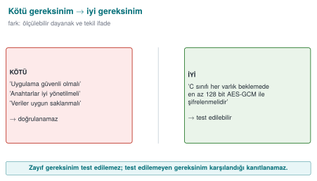

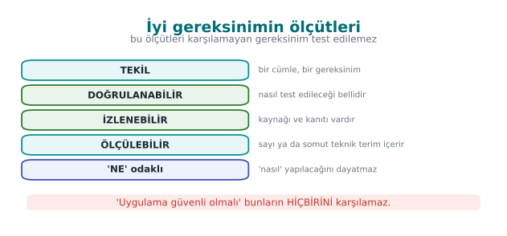

!!! note "Kısa tarihçe: güvenlik gereksinimleri nasıl standartlaştı?"
    - **1985** — **TCSEC** ("Orange Book") güvenlik **gereksinim düzeylerini** ilk kez resmîleştirir.
    - **1994** — **FIPS 140** kriptografik modül gereksinimleri (bugün **140-3**, 2019).
    - **1999** — **Ortak Kriterler (ISO/IEC 15408)**: **PP/ST**, **SFR/SAR** ve **EAL** kavramları buradan gelir ([12. hafta](../week-12/cen429-week-12.md) süreci).
    - **2010'lar** — sektöre özgü setler: mobil için **OWASP MASVS/MASTG**, tüketici IoT için **ETSI EN 303 645**, ödeme için **EMVCo/PCI**.

    Değişmeyen ilke: iyi gereksinim **ölçülebilir** ve **izlenebilir** olmalıdır; kanıtsız "karşılandı" geçersizdir.

Bir gereksinim yazmaya başlamadan önce hangi türden söz ettiğimizi netleştirmek gerekir; gereksinimler üç ana türe
ayrılır:

### Üç tür gereksinim

| Tür | Soru | Örnek |
| --- | --- | --- |
| **İşlevsel güvenlik gereksinimi** | Ürün hangi güvenlik işlevini yerine getirmeli? | "Uygulama, yerel veritabanındaki hassas verileri kimlik doğrulamalı şifrelemeyle korumalıdır." |
| **Güvence gereksinimi** | Ürünün bu işlevi doğru yerine getirdiğine nasıl güveneceğiz? | "Geliştirici, kaynak kodun statik analiz raporunu ve güvenlik testlerinin sonuçlarını sunmalıdır." |
| **Süreç gereksinimi** | Ürünü üreten kurum nasıl çalışmalı? | "Her değişiklik, birleştirilmeden önce en az bir başka geliştirici tarafından incelenmelidir." |

### Kötü ve iyi gereksinim

| Kötü | Neden kötü? | İyi |
| --- | --- | --- |
| "Uygulama güvenli olmalıdır." | Doğrulanamaz | "Uygulama, sürüm derlemesinde yığın koruyucu, PIE ve tam RELRO etkin olarak derlenmelidir." |
| "Veriler şifrelenmelidir." | Hangi veri, hangi durumda, hangi güçte? | "Varlık tablosunda C olarak işaretlenen her varlık, beklemede en az 128 bit güvenlik düzeyinde bir AEAD algoritmasıyla şifrelenmelidir." |
| "Anahtarlar korunmalı ve iyi yönetilmelidir." | İki gereksinim birden, ölçütsüz | (1) "Her anahtarın amacı, kripto-periyodu ve imha anı belgelenmelidir." (2) "Anahtarlar iş bitince bellekten silinmelidir." |
| "Uygulama saldırıları algılamaya çalışmalıdır." | "Çalışmalı" ölçülemez | "Uygulama, hata ayıklayıcı bağlandığında hassas işlemleri reddetmeli ve olayı bildirmelidir." |

İyi bir gereksinimin özellikleri: **tekil** (bir cümle, bir gereksinim), **doğrulanabilir** (bir test ya da inceleme ile
karşılandığı gösterilebilir), **izlenebilir** (bir kimliği vardır ve bir tehdide ya da standarda bağlıdır), **uygulanabilir**
(teknik olarak mümkündür) ve **nasıl değil ne** (çözümü dayatmaz; ama güvenlik düzeyi gibi ölçütleri verir).

!!! tip "Zorunluluk sözcükleri"
    Standartlar zorunluluk düzeyini sabit sözcüklerle ifade eder (RFC 2119 / ISO yönergeleri): **-malıdır / -meli**
    (MUST, SHALL) zorunlu; **-malı (önerilir)** (SHOULD) güçlü öneri, uyulmazsa gerekçe gerekir; **-abilir** (MAY)
    isteğe bağlı. Kendi gereksinimlerinizde bu ayrımı tutarlı kullanın; "should" bir gereksinimi karşılamamanın
    gerekçesini yazmadan geçmek, değerlendiricinin gözünde bir eksikliktir.

### İşlenmiş örnek: kötü bir gereksinimi adım adım iyileştirmek

Yukarıdaki tabloda bitmiş hâlleri gördünüz; şimdi **süreci** görelim. Başlangıç cümlesi gerçek bir kılavuz
taslağından alınmış gibi düşünülebilir:

> "Uygulama, kullanıcı verilerini korumalıdır."

**Adım 1 — Belirsiz kelimeleri işaretleyin.** "Kullanıcı verileri" (hangi veri?) ve "korumalıdır" (neye karşı,
hangi düzeyde?) ölçülemez. Bir değerlendirici bu cümleyi okuduğunda test edecek hiçbir şey bulamaz; "korunuyor"
demek için hangi kanıtı isteyeceğini bilemez. Bu, "iyi vs kötü gereksinim" tablosundaki ilk satırın ("uygulama
güvenli olmalıdır") aynı hastalığıdır: cümle her şeyi ve hiçbir şeyi söylüyor.

> Ara adım: "Uygulama, kullanıcı verilerini korumalıdır." → hangi veri, hangi tehdide karşı belli değil.

**Adım 2 — Varlık tablosuna bağlayın ([1. hafta](../week-1/cen429-week-1.md)).** "Kullanıcı verileri" tek bir şey değildir; varlık tablosunda
ayrı ayrı satırlardır: oturum belirteci, profil bilgisi, ödeme jetonu, günlük kayıtları... Her biri farklı bir
gizlilik/bütünlük sınıfına (C/I/I+/N) sahiptir ve farklı bir gereksinim gerektirir. Bu adımda tek cümleyi, varlık
tablosundaki **C sınıfı** işaretli olan "yerel veritabanındaki hassas alanlar" ile sınırlıyoruz.

> Ara adım: "Yerel veritabanındaki C sınıfı alanlar korunmalıdır." → hâlâ "korunmalı" ölçülemez.

**Adım 3 — Koruma hedefini (gizlilik mi, bütünlük mü, ikisi mi) netleştirin.** Tehdit modelinde (1. hafta) bu
veriye yönelik tehdit "cihazı ele geçiren saldırganın veritabanı dosyasını okuması"dır — yani **gizlilik**
tehdidi. Ama saldırgan dosyayı değiştirip uygulamayı kandırabilir mi diye de sorarız — evet, o zaman **bütünlük**
de gerekir. İki hedefin de aynı anda gerekli olduğunu fark etmek, bir sonraki adımı belirler.

> Ara adım: "Yerel veritabanındaki C sınıfı alanların gizliliği ve bütünlüğü korunmalıdır." → "nasıl" hâlâ yok,
> ölçülebilir bir kriter yok.

**Adım 4 — Ölçülebilir bir teknik kriter ekleyin ([9. hafta](../week-9/cen429-week-9.md) koruma kurallarına bağlanarak).** 9. haftada gördüğümüz
kural: gizlilik ve bütünlüğü **aynı anda** istiyorsanız doğru araç sınıfı AEAD'dir (bkz. [3. hafta](../week-3/cen429-week-3.md)). Bu, gereksinime
somut, teknolojiden bağımsız bir ölçüt katar; hâlâ belirli bir kütüphane adı vermiyoruz.

> Ara adım: "Yerel veritabanındaki C sınıfı alanlar kimlik doğrulamalı şifrelemeyle (AEAD) korunmalıdır." → hangi
> güç, ne zaman doğrulanacak henüz yazılmadı.

**Adım 5 — Durumu (beklemede/kullanımda/aktarımda) ve zorunluluk sözcüğünü ekleyin.** Veri burada
**beklemededir** (disk üzerinde duruyor, aktarılmıyor). Zorunluluk sözcüğü olarak "-malıdır" (MUST) seçiyoruz
çünkü bu, tehdide karşı vazgeçilmez bir koşul; "-abilir" (MAY) olsaydı değerlendirici bunu isteğe bağlı sayardı ve
karşılanmasa bile bulgu yazmazdı.

> Ara adım: "Beklemedeki C sınıfı hassas veri, kimlik doğrulamalı şifrelemeyle (AEAD) korunmalıdır." → doğrulama
> yöntemi hâlâ yazılmadı; bu, gereksinim metninin kendisinde değil izlenebilirlik matrisinde (2. bölüm) belirtilir.

**Adım 6 — Kimlik verin ve tehdide bağlayın.** Son olarak gereksinime dersin aile şemasından bir kimlik veriyoruz
(8. bölüm) ve hangi tehdide karşılık geldiğini not ediyoruz; kimliksiz bir gereksinim izlenebilirlik zincirine hiç
girmez.

> **Son hâl:** `CEN429-DR-01` — "Beklemedeki C sınıfı hassas veri, kimlik doğrulamalı şifrelemeyle (AEAD)
> korunmalıdır." *(Tehdit: T-03 "cihazı ele geçiren saldırgan veritabanı dosyasını okur/değiştirir", 1. hafta
> tehdit modeli.)*

Altı adımın her biri belirsizliğin bir türünü giderdi: **hangi veri** (varlık tablosu), **hangi tehdide karşı**
(tehdit modeli), **hangi hedef** (gizlilik/bütünlük), **hangi araç sınıfı** (AEAD — çözümün kendisi değil, sınıfı),
**hangi durum** (beklemede) ve **hangi zorunluluk** (MUST). Bu altısından biri eksik kalırsa gereksinim yine
tartışmaya açık kalır ve değerlendirici geri gönderir.

### İkinci örnek: sürecin hız testi

Süreci daha hızlı uygulamak için aynı altı adımı çok daha kısa bir örnekte tekrar görelim; bu kez tablo hâlinde:

| Adım | Soru | Bu örnekte |
| --- | --- | --- |
| 1 | Belirsiz kelime hangisi? | "Uygulama hızlı ve güvenli olmalıdır." → "hızlı" ve "güvenli" ikisi de ölçülemez, ayrıca **iki** ayrı gereksinim tek cümlede. |
| 2 | Hangi varlık/işlev? | "Güvenli" kelimesi hangi işlevi kapsıyor? Diyelim ki kimlik doğrulama akışı. |
| 3 | Hangi hedef? | Kimlik doğrulamanın **atlatılamaz** olması (bypass edilememesi). |
| 4 | Hangi teknik kriter? | Sunucu tarafında doğrulama; istemci tarafı kontrolü tek başına yeterli değil. |
| 5 | Hangi durum/zorunluluk? | Her oturum açma denemesinde, MUST. |
| 6 | Kimlik ve tehdit? | `CEN429-ID-04`, tehdit: "istemci tarafı kontrolünü atlayan saldırgan" |

> **Son hâl:** `CEN429-ID-04` — "Her oturum açma denemesi sunucu tarafında doğrulanmalıdır; istemci tarafı
> kontrolü tek başına yeterli kabul edilmemelidir."

"Hızlı" kelimesi ayrı bir performans gereksinimi olarak ele alınır (bu ders kapsamı dışında) — bu da **tekillik**
kuralının bir başka yüzüdür: güvenlik ve performans gereksinimlerini aynı cümlede karıştırmak, hangisinin
karşılanıp hangisinin karşılanmadığını belirsizleştirir; ikisi ayrı hızda ilerleyebilir.

!!! danger "Sık hata: 'nasıl'ı 'ne' sanıp erken karara varmak"
    Adım 4'te "AEAD kullanılmalıdır" demek yerine doğrudan "AES-256-GCM kullanılmalıdır" yazan ekipler, gereksinimi
    tek bir kütüphane sürümüne kilitler. Sonraki yıl proje ChaCha20-Poly1305'e geçse bile kılavuz hâlâ
    "AES-256-GCM" yazdığı için ya kılavuz güncellenmesi unutulur ya da gereksinim yanlışlıkla "karşılanmadı" gibi
    görünür. **Sonuç:** gereksiz kılavuz revizyonları ve yanlış "karşılanmadı" bulguları.

!!! success "Kural"
    Gereksinim metninde **araç sınıfını** (AEAD, CSPRNG, TLS 1.2+) yazın; belirli bir kütüphane/sürüm adını
    gereksinime değil, **önlem** açıklamasına (kılavuz bölümüne) koyun. Böylece araç değişse bile gereksinim metni
    sabit kalır, yalnızca önlem güncellenir.

!!! question "Değerlendirici nasıl test eder?"
    Bir değerlendirici gereksinimler listesini okurken her cümleye şu üç soruyu sorar: "Bu cümle tek bir koşul mu
    içeriyor?", "Bunu doğrulamak için hangi testi çalıştırırım?", "Bu cümlenin karşılandığını kim, nasıl kanıtlar?"
    Üç sorudan birine bile net cevap veremiyorsa, gereksinim yeniden yazılmalıdır.

### Zorunluluk sözcüklerini örnekle pekiştirelim

| Sözcük | Anlamı | Örnek cümle | Karşılanmazsa ne olur? |
| --- | --- | --- | --- |
| **-malıdır (MUST)** | Zorunlu, istisnasız | "Oturum belirteci TLS 1.2+ ile taşınmalıdır." | Doğrudan bulgu (finding); kalan riske yazılır |
| **-malı, önerilir (SHOULD)** | Güçlü öneri, gerekçeyle atlanabilir | "Anahtarlar donanım güvenli elemanında saklanmalıdır (önerilir)." | Karşılanmıyorsa **neden** karşılanmadığının yazılı gerekçesi istenir |
| **-abilir (MAY)** | İsteğe bağlı | "Uygulama ek bir PIN kilidi sunabilir." | Karşılanmasa da bulgu değildir |

Bu üç sözcüğü karıştırmanın somut sonucu: bir SHOULD gereksinimini MUST gibi yazıp karşılayamazsanız, aslında
gerekçe yazmanız yeterliyken kendinizi gereksiz yere "karşılanmadı / kalan risk" durumuna sokmuş olursunuz. Tersi
de olur: bir MUST'ı SHOULD gibi yumuşatıp karşılamazsanız, değerlendirici bunu ciddi bir eksiklik sayar.

### Üçüncü örnek: bir süreç gereksinimini iyileştirmek

Fonksiyonel gereksinimlerin yanında **süreç gereksinimleri** de aynı disiplini ister. Kötü hâli:

> "Kod incelemesi yapılmalıdır."

- Hangi değişiklik? (Her değişiklik mi, yalnız büyük olanlar mı?)
- Kim inceleyecek? (Yazarın kendisi sayılır mı?)
- Ne zaman? (Birleştirmeden önce mi, sonra mı?)

İyi hâli: "Her değişiklik, ana dala (main/master) birleştirilmeden önce, değişikliği yazan geliştirici dışında en
az bir kişi tarafından incelenmeli ve inceleme onayı sürüm kontrol sisteminde kayıt altına alınmalıdır." Bu cümle
artık doğrulanabilir: sürüm kontrol geçmişinde her birleştirme isteğinin (pull request) en az bir onay kaydı var
mı diye bakılır — otomatik olarak bile denetlenebilir.

### Gereksinimi yazmak yetmez: sıradaki soru "nasıl doğrularım?"

Bu bölümde bir gereksinimi **iyi** yazmayı öğrendik; ama iyi yazılmış bir gereksinim bile tek başına hiçbir şey
kanıtlamaz. Bir sonraki soru her zaman şudur: "Bu gereksinimin karşılandığını hangi somut adımla gösteririm?" Bu
soru bizi 2. bölümdeki izlenebilirlik zincirine götürür.

---

## 2. Gereksinimden kanıta: izlenebilirlik

Bir gereksinim ancak **kanıtıyla** karşılanmış sayılır. Bu disipline **izlenebilirlik** denir: her gereksinimi bir
önleme, bir teste ve bir kanıta bağlamak; "bu gereksinim nerede karşılandı, nasıl doğrulandı?" sorusuna her zaman
cevap verebilmektir. Sertifikasyonda her gereksinim için şu zincir kurulur:

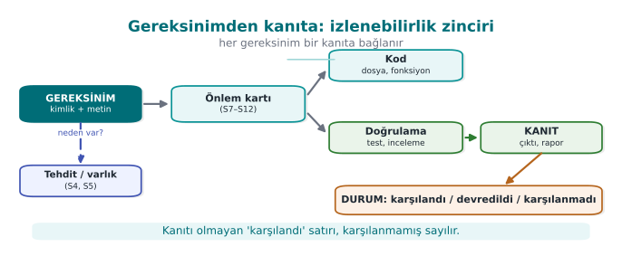

Bu zincirin tablo haline **uyum matrisi** (compliance matrix) denir:

| Kimlik | Gereksinim | Durum | Önlem (kılavuz bölümü) | Doğrulama | Kanıt |
| --- | --- | --- | --- | --- | --- |
| CEN429-DR-01 | Beklemedeki hassas veri AEAD ile şifrelenmelidir | Karşılandı | S7.2 "Kasa dosyası şifreleme" | Birim testi: bir bayt değiştirilince açma reddedilir | `test_butunluk.c` çıktısı |
| CEN429-AP-03 | Sürüm derlemesinde hata ayıklama günlüğü bulunmamalıdır | Karşılandı | S12.1 | `strings` taraması | Tarama çıktısı, CI kaydı |
| CEN429-AP-07 | Uygulama güvenli biçimde kurulmalı ve güncellenmelidir | **Devredildi** | S14.2 (dağıtım platformuna) | — | Gerekçe |
| CEN429-DT-04 | Sunucu sertifikası sabitlenmelidir | Karşılanmadı | — | — | Kalan risk: S16.4 |

Matrisin iki yönü vardır: **ileri izlenebilirlik** (her gereksinim bir önleme ve teste gidiyor mu?) ve **geri
izlenebilirlik** (her önlem bir gereksinime ya da tehdide dayanıyor mu, yoksa gereksiz mi?). Değerlendirici önce ileri
yönü okur: karşılanmış denen ama kanıtı olmayan bir satır, ilk bulgudur.

### İşlenmiş örnek: bir varlıktan kanıta, uçtan uca

Zincirin nasıl kurulduğunu tek bir varlık üzerinden başından sonuna kadar dolduralım.

**1. Varlık ([1. hafta](../week-1/cen429-week-1.md) varlık tablosundan).**

| Alan | Değer |
| --- | --- |
| Varlık | Kullanıcının oturum belirteci (session token) |
| Konum | İstemci belleği; sunucuya her istekte HTTP başlığında taşınır |
| Sınıf | **C** (gizlilik) — ele geçirilirse saldırgan kullanıcı gibi davranır |
| Yaşam döngüsü | Oturum açılışında üretilir → her istekte kullanılır → çıkışta ya da zaman aşımında geçersiz kılınır |

**2. Tehdit (1. hafta tehdit modelinden).** Ağ üzerinde konumlanan bir saldırgan (ör. aynı halka açık Wi-Fi'de),
şifrelenmemiş bir bağlantıdan belirteci dinleyip yakalayabilir ve kendi isteklerinde kullanarak kullanıcı gibi
davranabilir (STRIDE: **Spoofing** + **Information Disclosure**, 1. hafta terminolojisi).

**3. Gereksinim (bu haftanın konusu).** Tehdide karşı sistemin ne yapması gerektiğini yazıyoruz; 1. bölümdeki altı
adımı kısaca tekrar uyguluyoruz: varlık (oturum belirteci) → tehdit (ağ dinleme) → hedef (gizlilik + kimlik) →
araç sınıfı (şifreli kanal + sunucu kimlik doğrulaması) → durum (aktarımda) → zorunluluk (MUST).

> `CEN429-DT-01` — "Oturum belirteci yalnız TLS 1.2 ve üzeri, sunucu sertifikası doğrulanmış bir kanaldan
> taşınmalıdır."

**4. Önlem (kılavuzda hangi bölüm, ne yapılıyor).** Kılavuzun S10.3 "Aktarım güvenliği" bölümünde: "İstemci,
sunucuya her bağlantıda TLS 1.2+ el sıkışması yapar; sertifika zinciri ve ana bilgisayar adı doğrulanır (bkz.
[Hafta 10](../week-10/cen429-week-10.md)). Kanal kurulmadan hiçbir istek gönderilmez."

**5. Doğrulama (nasıl test edildi).** Güvenlik testi ekibi bir MITM (ortadaki adam) aracı ile bağlantıyı araya
girmeye çalışır: (a) geçersiz/kendinden imzalı bir sertifika sunarak bağlantının **reddedildiğini**, (b) düz metin
(TLS'siz) bağlantı denemesinin **reddedildiğini** doğrular.

**6. Kanıt (nerede, kim tarafından üretildi).** Test aracının günlük çıktısı (`mitm_test_2026-11-03.log`), CI
çalıştırma kaydı (#617) ve bağlantı sırasında yakalanan TLS handshake paket dökümü (`handshake.pcapng`), proje
deposunun `evidence/week13/` klasöründe saklanır ve uyum matrisinde bu dosya adlarıyla referans verilir.

Bu altı adım tamamlandığında uyum matrisindeki satır şöyle dolar:

| Kimlik | Gereksinim | Durum | Önlem | Doğrulama | Kanıt |
| --- | --- | --- | --- | --- | --- |
| CEN429-DT-01 | Oturum belirteci TLS 1.2+ ile, sertifika doğrulanarak taşınmalıdır | Karşılandı | S10.3 "Aktarım güvenliği" | MITM testi: geçersiz sertifika ve düz metin denemesi reddedilir | `mitm_test_2026-11-03.log`, CI #617, `handshake.pcapng` |

Zincirin altı halkasından **biri eksik olsaydı** ne olurdu?

- Varlık tanımsız olsaydı → gereksinimin "hangi veri" sorusuna cevabı olmazdı.
- Tehdit bağlanmasaydı → gereksinim keyfi görünürdü, "neden bu gereksinim var?" sorusuna cevap yoktu.
- Önlem yazılmasaydı → "karşılandı" iddiası desteksiz kalırdı.
- Doğrulama tanımlanmasaydı → "nasıl test edildi?" sorusuna cevap olmazdı.
- Kanıt olmasaydı → satır, değerlendiricinin ilk bulgusu olurdu (bkz. aşağıdaki kural).

Aynı gereksinim üzerinden "devredildi" durumunu da görelim: ürün bir kütüphane olsaydı ve TLS bağlantısını üst
uygulama kuruyor olsaydı, `CEN429-DT-01` üst uygulamaya **devredilir** ve S14'e "kime: üst uygulama; neden:
kütüphane ağ bağlantısı açmıyor; nasıl: üst uygulama TLS 1.2+ ve sertifika doğrulamasıyla bağlanmalı" yazılırdı.
Devretmenin kuralları [§3](#3-gereksinim-blogu-kalibi-ve-devredilen-gereksinimler)'te.

### Geri izlenebilirlik: fazladan bir önlem bulmak

İleri izlenebilirliği yukarıda gördük. **Geri izlenebilirlik** tam tersini sorar: kılavuzda yazan her önlem bir
gereksinime dayanıyor mu? Diyelim ki kılavuzda şu cümle var: "Uygulama başlangıçta rastgele bir gecikme uygular."
Bu önlem hangi gereksinime bağlanıyor? Eğer ekip bunun **CEN429-AP-05** ("hata ayıklayıcı ve kanca algılandığında
tanımlı bir tepki verilmelidir") gereksinimine dayandığını gösteremiyorsa, bu ya (a) tehdit modelinde eksik bir
tehdit vardır (gecikme neden gerekliydi, hangi saldırıyı yavaşlatıyor?) ya da (b) önlem **gereksiz**dir ve
kılavuzdan çıkarılmalıdır. Geri izlenebilirlik, kılavuzu şişiren ama hiçbir şeyi karşılamayan "kendiliğinden iyi
fikir" önlemleri temizlemenin yoludur; her sayfa, değerlendiricinin okuması gereken bir sayfadır, gereksiz önlem
değerlendirme süresini uzatır.

!!! danger "Sık hata: zincirin son halkasını (kanıt) atlamak"
    Ekipler çoğu zaman gereksinim, önlem ve doğrulama yöntemini güzelce yazar ama kanıt sütununu boş bırakır ya da
    "test edildi" gibi genel bir ifadeyle geçiştirir. Değerlendirici için "test edildi" bir kanıt değildir; **hangi**
    test, **ne zaman**, **hangi sonuçla** çalıştı sorusuna somut bir dosya/kayıt/ekran görüntüsüyle cevap vermek
    gerekir. Kanıtsız "karşılandı" satırı, ders akışı kutusunda da belirtildiği gibi demo aracının
    (`01-uyum-matrisi`) ilk işaretlediği bulgu türüdür.

!!! success "Kural"
    Her "karşılandı" satırının kanıt sütununda **bulunabilir, adlandırılmış** bir referans olmalıdır: bir dosya
    adı, bir CI çalıştırma numarası, bir test raporu bölümü. "Var", "test edildi", "kontrol edildi" gibi ifadeler
    kanıt değil, kanıt **vaadi**dir; uyum matrisi vaat değil kanıt ister.

### İzlenebilirlik ile 12. hafta değerlendirmesi arasındaki bağ

Geçen hafta ([12. hafta](../week-12/cen429-week-12.md)) gördüğünüz değerlendirme süreci, aslında bu matrisin **okunma** biçimidir: bir değerlendirici
projenizi incelerken rastgele kod satırlarını okumaz; önce uyum matrisini açar, "karşılandı" satırlarını seçer,
her birinin kanıtını talep eder ve kanıtı **bağımsız olarak** doğrular (12. haftadaki "bağımsız doğrulama"
ilkesi). Matrisiniz ne kadar iyi kurulmuşsa, değerlendirme o kadar hızlı ve o kadar az soru işaretiyle ilerler;
kötü kurulmuş bir matris, değerlendiricinin her satırda durup "bunu nereden biliyoruz?" diye sormasına yol açar
ve süreci uzatır.

### İşlenmiş örnek: 'karşılanmadı' durumunun tam zinciri

Zincir yalnız "karşılandı" satırları için değil, "karşılanmadı" satırları için de kurulur — fark, son iki
halkadadır.

| Halka | Karşılandı örneği (yukarıda) | Karşılanmadı örneği |
| --- | --- | --- |
| Varlık | Oturum belirteci | Sunucu sertifikası |
| Tehdit | Ağ dinleme | Sahte sunucu sertifikası ile MITM (sertifika sabitleme yoksa) |
| Gereksinim | CEN429-DT-01 | CEN429-DT-04 "Sunucu sertifikası sabitlenmelidir" |
| Durum | Karşılandı | **Karşılanmadı** |
| Önlem | S10.3 | — (henüz yok) |
| Doğrulama | MITM testi geçti | — |
| Kanıt | Test günlüğü | **Kalan risk:** S16.4'e "sertifika sabitleme henüz uygulanmadı, MITM riski açık; v1.1'de planlandı" olarak yazılır |

Bu, dersin başındaki uyum matrisi tablosunda gördüğümüz `CEN429-DT-04` satırının açılımıdır. "Karşılanmadı"
durumunda önlem ve doğrulama sütunları boş kalabilir ama **kanıt** sütunu boş kalamaz — orada gerçek bir kanıt
değil, kalan riskin **nerede belgelendiği** yazılır. Boş bırakmak, riskin unutulduğu izlenimini verir.

### Neden 'liste' değil 'matris'?

Bir kontrol listesi (checklist) yalnız "yapıldı/yapılmadı" der. Uyum **matrisi** altı boyutu (kimlik, gereksinim,
durum, önlem, doğrulama, kanıt) bir arada tuttuğu için "matris" denir: her satır bir gereksinim, her sütun
izlenebilirlik zincirinin bir halkasıdır. Bir hücre eksikse, o satırın o boyutta **doğrulanamaz** olduğu anlamına
gelir — liste bunu gösteremez, matris gösterir.

### Değerlendiricinin sık yazdığı beş bulgu türü

Uyum matrisini okuyan bir değerlendirici genelde şu beş bulgu türünden birini yazar; kendi matrisinizi teslim
etmeden önce bu beşini kontrol edin:

1. **Kanıtsız "karşılandı".** En sık görülen bulgu; bu bölümün ana kuralı.
2. **Tutarsız kimlik.** Aynı gereksinime kılavuzun farklı yerlerinde farklı kimlikler verilmiş (ör. bir yerde
   CEN429-DR-01, başka yerde DR01) — izlenebilirlik yazılım araçlarıyla otomatik kontrol edilemez hâle gelir.
3. **Bağlanmamış önlem (geri izlenebilirlik).** Kılavuzda bir önlem var ama hangi gereksinimi karşıladığı
   belirtilmemiş.
4. **Gerekçesiz "uygulanmaz".** Bu haftanın 0. ve 7. bölümlerinde işlenen hata.
5. **Genel/kopyala-yapıştır kanıt.** 8. bölümdeki işlenmiş örnekte görülen hata.

Demo aracı `01-uyum-matrisi` yalnız birinci türü (kanıtsız "karşılandı") otomatik tarar; diğer dördü şu an için
elle, bir değerlendirici gibi okuyarak bulunur.

### İzlenebilirliği kod düzeyinde de sürdürmek

Uyum matrisi genelde ayrı bir belge (tablo) olarak tutulur, ama izlenebilirliği **kaynak kodun içine** de
taşımak mümkündür ve büyük projelerde yaygındır: kritik bir fonksiyonun üstüne "bu fonksiyon CEN429-DR-01'i
karşılar" biçiminde bir yorum satırı eklemek, kodu okuyan bir sonraki geliştiricinin (ya da bir yıl sonraki
kendinizin) "bu satır neden burada?" sorusuna anında cevap bulmasını sağlar. Bu, 3. bölümdeki gereksinim
bloğunun kod tarafındaki küçük bir yansımasıdır:

```c title="Kod içinde izlenebilirlik yorumu (örnek)"
/* CEN429-DR-01: beklemedeki kasa dosyası AEAD ile şifrelenir. */
int kasa_dosyasi_sifrele(const unsigned char *anahtar, ...) {
    ...
}
```

Böyle bir yorum, kanıt sütununun yerine geçmez (kanıt hâlâ bir test/kayıt olmalıdır) ama gereksinim ile kodu
birbirine **görsel olarak** bağlar; kod incelemesi yapan biri, gereksinimi karşılayan kodu ararken bu yorumları
tarayabilir.

---

## 3. Gereksinim bloğu kalıbı ve devredilen gereksinimler

### Kılavuzda gereksinim bloğu

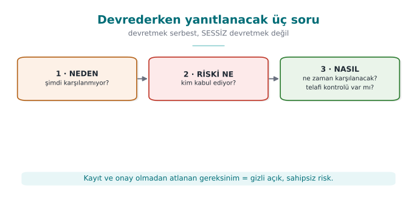

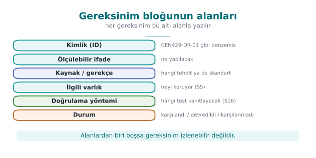

Sertifikasyondan geçen güvenlik kılavuzlarında her bölüm, o bölüme düşen gereksinimlerle açılır. Her gereksinim şu
kalıpta yazılır:

```text
[Standart/şema] Gereksinim kimliği — DURUM
Gereksinimin metni (standarttan).
Ürünün bu gereksinimi nasıl karşıladığının açıklaması; ilgili önlem kartlarına ve bölümlere başvuru.
```

Sahada bir mobil ödeme kütüphanesinin kılavuzunda "beklemede veri", "kullanımda veri", "aktarımda veri", "raporlama",
"kripto yöntemleri ve anahtarlar" gibi her bölüm, iki kart şemasının bu konudaki gereksinimleriyle açılır ve her biri
**karşılandı** ya da **üst uygulamaya devredildi** olarak işaretlenir. Bu kalıbın gücü, değerlendiricinin gereksinimden
kanıta tek bakışta gidebilmesidir.

### Devredilen gereksinimler: sorumluluğun sınırı

Bir yazılım bileşeni (ör. başka uygulamaların içine gömülen bir kütüphane) her gereksinimi tek başına karşılayamaz.
Uygulamanın kurulması, güncellenmesi, kullanıcıya bildirim göstermesi ya da kendi kaynak kodunu koruması, bileşenin değil
onu kullanan uygulamanın işidir. Bu gereksinimler **devredilir** ve kılavuzun "dış bileşenlerden beklenen güvenlik"
bölümünde açıkça yazılır.

| Kime devredilir? | Tipik gereksinim | Kılavuzda nasıl yazılır? |
| --- | --- | --- |
| **Üst uygulama** | Güvenli kurulum ve güncelleme | "Uygulamanın dağıtım ve güncelleme mekanizması üst uygulamanın sorumluluğundadır." |
| **Üst uygulama** | Uzlaşmanın arka uca ve kullanıcıya bildirilmesi | "Kütüphane algıladığı saldırıyı üst uygulamaya bildirir (yöntem: …); arka uca ve kullanıcıya iletmek üst uygulamanın görevidir." |
| **Üst uygulama** | Kendi kaynak kodunu gizleme ve koruma | "Kütüphane yalnız kendi kodunu korur; üst uygulama kendi koruma önlemlerini almalıdır." |
| **Üst uygulama** | Kütüphaneye parametre olarak verilen varlıkların korunması | Sunucu adresi, sertifika ve sabitleme değerleri gibi parametreler tek tek listelenir |
| **İşletim sistemi** | Uygulama yalıtımı, desteklenen en düşük sürüm | "Desteklenen en düşük işletim sistemi sürümü …; işletim sisteminden bunun dışında bir güvenlik beklentisi yoktur." |
| **Donanım** | Güvenli eleman, TEE | Kullanılmıyorsa açıkça "donanımdan beklenti yoktur" yazılır |

!!! warning "Devretmek, yok saymak değildir"
    Devredilen her gereksinim için **kime**, **neden** devredildiği ve üst tarafın bunu **nasıl** karşılayabileceği
    yazılır. Belirsiz bırakılan sorumluluk, iki tarafın da "öbürü yapıyordur" dediği bir boşluğa dönüşür. Sahada bir
    kütüphanenin uzlaşmayı üst uygulamaya bildirmek için iki seçeneği (bütün verileri silip bir bayrak dosyası yazmak ya
    da üst uygulamanın kendi dosyasını silmek) artı ve eksileriyle tartışıp birini gerekçesiyle seçtiği görülür; bu tartışma
    kılavuza yazılır.

### Proje için: S14 "Varsayımlar ve devredilen gereksinimler"

Projeniz tek başına çalışan bir uygulama olsa bile varsayımları vardır: desteklenen işletim sistemleri, kullanıcının
yönetici olmadığı, derleme ortamının güvenilir olduğu, sunucunun ayrı bir ekip tarafından korunduğu. Bunları **açıkça**
yazmak, değerlendiricinin kapsamı doğru anlamasını sağlar ve "bu tehdit neden kapsam dışı?" sorusunu önceden cevaplar.

### İşlenmiş örnek: gereksinim bloğunu baştan sona doldurmak

Kalıbı gerçek bir örnekle dolduralım; bu, 2. bölümdeki `CEN429-DR-01` zincirinin kılavuza **yazılmış hâlidir**:

```text
[CEN429-DR] CEN429-DR-01 — KARŞILANDI
Gereksinim: Beklemedeki C sınıfı hassas veri, kimlik doğrulamalı şifrelemeyle (AEAD) korunmalıdır.
Karşılama: Yerel kasa dosyası AES-256-GCM ile şifrelenir (bkz. S7.2 "Kasa dosyası şifreleme"). Şifreleme
anahtarı, cihazın güvenli depolama biriminden (Android Keystore / iOS Keychain) türetilir ve bellek dışında
düz metin olarak hiç saklanmaz. Doğrulama: birim testi (test_butunluk.c), şifreli dosyanın tek baytını
değiştirip çözmenin reddedildiğini kontrol eder. Kanıt: CI çalıştırma kaydı #482, test çıktısı
evidence/week13/test_butunluk_ci482.log.
```

Bloğun her satırı bir amaca hizmet eder: **başlık satırı** (`[Aile] Kimlik — Durum`) değerlendiricinin gözünü
hızlıca nereye götüreceğini söyler; **Gereksinim** satırı standarttan ya da tehdit modelinden gelen "ne"yi
tekrarlar (kopyala-yapıştır, yeniden yorumlanmaz); **Karşılama** paragrafı "nasıl"ı, somut dosya ve bölüm
adlarıyla anlatır; **Doğrulama** ve **Kanıt** cümleleri 2. bölümdeki zincirin son iki halkasını tamamlar.

Şimdi aynı kalıbı bir **devredilen** gereksinim için dolduralım — bu kez ürünün kendisi değil üst uygulama
karşılıyor:

```text
[CEN429-AP] CEN429-AP-07 — DEVREDİLDİ (üst uygulamaya)
Gereksinim: Uygulama güvenli biçimde kurulmalı ve güncellenmelidir.
Karşılama: Kütüphane kendi başına bir dağıtım/güncelleme mekanizmasına sahip değildir; bu, kütüphaneyi
paketleyen üst uygulamanın sorumluluğundadır. Üst uygulama geliştiricisine önerilen yöntem: (1) resmî
uygulama mağazasının imza doğrulamasını kullanmak, (2) kendi güncelleme kanalı kullanılıyorsa güncelleme
paketlerini Hafta 6'da anlatılan imzalama şemasıyla imzalamak. Kime: üst uygulama geliştiricisi. Neden:
kütüphane ağ/dosya sistemi seviyesinde kurulum işlemine erişmez, yalnız API olarak çağrılır. Nasıl:
yukarıdaki iki yöntemden biri, kılavuzun "Dış bileşenlerden beklenen güvenlik" bölümünde ayrıntılandırılır.
```

Dikkat edin: "devredildi" bloğu da **Karşılama** alanına sahiptir — ama bu alan "biz nasıl yaptık" değil "karşı
taraf nasıl yapmalı ve biz bunu neden kendimiz yapmıyoruz" sorularını cevaplar. Devretmek, o alanı boş bırakmak
değildir; tam tersine daha fazla açıklama ister, çünkü sorumluluk sınırının nerede olduğunu kanıtlamanız gerekir.

### S14'ü doldururken sık karşılaşılan üç varsayım

Projeler genelde şu üç varsayımı unutur; S14'e eklerken kontrol edin:

1. **Derleme ortamı güvenilir mi?** "Derleme sunucusuna saldırgan erişemez" varsayımı genelde yazılmaz ama her
   projenin dayandığı bir temeldir ([6. hafta](../week-6/cen429-week-6.md) tedarik zinciri güvenliği).
2. **Kullanıcı cihazı kök/jailbreak yapılmamış mı?** Yapılmışsa hangi önlemlerin geçersiz kaldığı (ör. güvenli
   depolama artık güvenli olmayabilir) açıkça yazılmalıdır.
3. **Sunucu tarafı ayrı bir ekip tarafından mı korunuyor?** Öyleyse hangi gereksinimlerin (ör. sunucu tarafı
   erişim denetimi) bu projenin **kapsamı dışında** olduğu net yazılmalıdır; aksi hâlde değerlendirici bunları
   da bu projeden bekler.

!!! danger "Sık hata: karşılama metnini pazarlama diliyle doldurmak"
    "Ürünümüz endüstri standardı şifreleme kullanır ve verilerinizi güvenle korur" gibi bir cümle, karşılama
    alanına yazılan ama hiçbir şeyi **doğrulanabilir** kılmayan tipik bir hatadır. Hangi dosya, hangi bölüm, hangi
    test — bunlardan hiçbiri yoksa cümle güzel görünür ama değerlendirici için işe yaramaz; matris demo aracı
    (`02-gereksinim-kalite`) bu tür "belirsiz/doğrulanamaz" ifadeleri tam olarak bu yüzden ZAYIF diye işaretler.

!!! success "Kural"
    Karşılama metni her zaman **somut bir referansla bitmelidir**: bir dosya adı, bir kod bölümü, bir kılavuz alt
    başlığı, bir test adı. Cümlede ürün pazarlama sıfatları ("güçlü", "endüstri standardı", "en iyi uygulama")
    varsa ama arkasında bir referans yoksa, o cümleyi yeniden yazın.

### Neden devretmek kötü bir şey değildir (gerekçe)

Yeni geliştiriciler "devretmek" kelimesini bir zayıflık gibi algılar ve her şeyi kendi bileşenlerinde karşılamaya
çalışır — bu da genelde bileşenin **yapamayacağı** işleri (kurulum, işletim sistemi düzeyinde izolasyon, kullanıcı
arayüzü uyarıları) üstlenmeye çalışmasına, ya da daha kötüsü, bu işleri hiç ele almadan sessizce atlamasına yol
açar. Sertifikasyon dünyasında sınırları **açıkça çizmek**, sınırları **belirsiz bırakmaktan** her zaman daha iyi
bir puan alır: bir değerlendirici, kime ne devredildiğini bilen bir kılavuza güvenir; "her şeyi biz hallederiz"
diyen ama kanıt sunamayan bir kılavuza güvenmez.

### İşlenmiş örnek: 'karşılanmadı' durumunda gereksinim bloğu

Bazı gereksinimler henüz ne karşılanmış ne de devredilmiştir — proje bilinçli olarak bu riski taşımaya karar
vermiştir. Bloğun bu durumdaki hâli:

```text
[CEN429-DT] CEN429-DT-04 — KARŞILANMADI
Gereksinim: Sunucu sertifikası sabitlenmelidir (certificate pinning).
Durum: Şu anda uygulanmıyor; yalnız standart TLS sertifika zinciri doğrulaması yapılıyor (CEN429-DT-01
karşılanıyor, ama sabitleme yok). Kalan risk: bir saldırganın, güvenilir bir kök sertifika yetkilisinden
sahte bir sertifika alabilmesi durumunda MITM mümkün olabilir (bkz. S16.4). Planlanan düzeltme: v1.1
sürümünde sabitleme eklenecek (bkz. proje planı, görev #217).
```

"Karşılanmadı" bloğu **Karşılama** yerine **Durum** ve **Kalan risk** alanlarını doldurur; bu, gereksinimin
gelecekte karşılanacağını ama şu an karşılanmadığını dürüstçe belirtir. Bunu hiç yazmamak (satırı matristen
çıkarmak) daha kötüdür: değerlendirici gereksinimi kendisi bulur ve "bunu neden atladınız?" diye sorar.

### Zor bir devretme kararı: donanım ne zaman devreder, ne zaman devretmez?

"Donanım güvenli elemanı (secure element/TEE) yoksa gereksinim donanıma devredilemez" — bu basit kural bazen
yanlış uygulanır. Örneğin "anahtar fiziksel saldırıya karşı korunmalıdır" gereksinimini ele alalım:

- Cihazda bir güvenli eleman **varsa**: gereksinim donanıma devredilebilir; kılavuzda "anahtar üretimi ve
  saklaması cihazın güvenli elemanına devredilmiştir, uygulama yalnız API'yi çağırır" yazılır.
- Cihazda güvenli eleman **yoksa**: gereksinim devredilemez, çünkü devredilecek bir taraf yoktur. Bu durumda
  ürünün kendisi **yazılım tabanlı** bir önlem (ör. beyazkutu kriptografi, kod gizleme) uygulamalı ya da
  gereksinimi "karşılanmadı" olarak işaretleyip kalan riski yazmalıdır.

Yaygın hata, ikinci durumda da "donanıma devredildi" yazmaktır — devredilecek somut bir taraf olmadığı için bu
**geçersiz bir devretmedir** ve değerlendirici tarafından reddedilir.

!!! danger "Sık hata: devretmenin karşı tarafı gerçekten var mı diye sormamak"
    "İşletim sistemine devredildi" ya da "donanıma devredildi" yazan bir ekip, o işletim sistemi sürümünün ya da
    donanımın gerçekten bu gereksinimi karşılayacak bir özelliğe sahip olup olmadığını kontrol etmeyebilir. Ör.
    "uygulama izolasyonu işletim sistemine devredilmiştir" demek, eğer desteklenen en düşük işletim sistemi
    sürümü bu izolasyonu sağlamıyorsa, boş bir iddiadır.

!!! success "Kural"
    Bir gereksinimi devretmeden önce, karşı tarafın (üst uygulama, işletim sistemi, donanım) bunu **gerçekten
    karşılayabileceğini** doğrulayın — desteklenen en düşük sürüm/donanım için bile. Devretmek "birinin
    yapacağını ummak" değil, "kimin, hangi somut mekanizmayla yapacağını bilmek"tir.

!!! question "Değerlendirici nasıl test eder?"
    Değerlendirici "karşılanmadı" satırlarını özellikle arar; bunlar projenin **dürüstlük göstergesidir**. Hiç
    "karşılanmadı" ya da "uygulanmaz" satırı olmayan, her şeyin "karşılandı" göründüğü bir matris, deneyimli bir
    değerlendiricide kuşku uyandırır — gerçek projelerde neredeyse her zaman en az birkaç eksik ya da devredilmiş
    gereksinim vardır.

---

## 4. Ortak Kriterler (ISO/IEC 15408)

**Ortak Kriterler** (Common Criteria, CC), BT ürünlerinin güvenlik değerlendirmesi için uluslararası standarttır.
Değerlendirme yöntemi ayrı bir belgede (CEM, ISO/IEC 18045) tanımlanır. Ortak Kriterleri Tanıma Anlaşması (CCRA) sayesinde
bir ülkede verilen sertifika, anlaşmaya taraf diğer ülkelerde de tanınır.

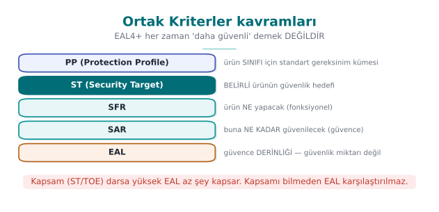

### Temel kavramlar

| Kavram | Anlamı | Dersteki karşılığı |
| --- | --- | --- |
| **TOE** (Target of Evaluation) | Değerlendirilen ürün ve belgeleri; benzersiz tanımlanır | Değerlendirme hedefi ([1. hafta](../week-1/cen429-week-1.md), S0/S1) |
| **ST** (Security Target) | Ürüne özgü güvenlik hedefi belgesi: tehditler, varsayımlar, güvenlik amaçları, gereksinimler | Güvenlik kılavuzunuz |
| **PP** (Protection Profile) | Bir ürün sınıfı için (ör. mobil cihaz, güvenlik duvarı) ortak gereksinim seti; ürünler buna uyduğunu iddia eder | Dersin gereksinim aileleri |
| **SFR** (Security Functional Requirement) | İşlevsel güvenlik gereksinimleri; standart bir katalogdan seçilir (ör. FCS kriptografik destek, FDP kullanıcı verisi koruma, FIA kimlik doğrulama) | İşlevsel gereksinimler |
| **SAR** (Security Assurance Requirement) | Güvence gereksinimleri (ör. ADV geliştirme, ATE test, AVA zafiyet değerlendirmesi) | Güvence gereksinimleri |
| **EAL** (Evaluation Assurance Level) | Önceden tanımlanmış SAR paketleri: EAL1'den EAL7'ye | — |

### EAL düzeyleri

| Düzey | Adı | Tipik kullanım |
| --- | --- | --- |
| EAL1 | İşlevsel olarak test edilmiş | Tehdidin düşük olduğu durumlar |
| EAL2 | Yapısal olarak test edilmiş | Temel güvence |
| EAL3 | Yöntemli test edilmiş ve denetlenmiş | Orta düzey |
| **EAL4** | Yöntemli tasarlanmış, test edilmiş ve gözden geçirilmiş | Ticari ürünlerde en yaygın üst düzey (işletim sistemleri, ağ cihazları) |
| EAL5 | Yarı biçimsel tasarlanmış ve test edilmiş | Akıllı kartlar ve güvenli elemanlar (çoğu zaman EAL5+ / EAL6+) |
| EAL6 | Yarı biçimsel doğrulanmış tasarım | Yüksek riskli ortamlar |
| EAL7 | Biçimsel doğrulanmış tasarım | Çok yüksek riskli, küçük sistemler |

EAL yüksekliği ürünün "daha güvenli" olduğu anlamına gelmez; **değerlendirmenin daha derin** yapıldığı anlamına gelir.
EAL4 bir ürün, EAL2 bir üründen daha güvensiz olabilir; önemli olan ST'deki güvenlik amaçlarının ve tehditlerin
kapsamıdır. "+" işareti (EAL4+), pakete ek güvence bileşenleri eklendiğini gösterir; en sık eklenen, zafiyet
değerlendirmesinin derinliğini artıran bileşendir.

### Zafiyet değerlendirmesi ve saldırı potansiyeli

CC'nin zafiyet değerlendirmesi bileşeni (AVA_VAN), ürünün hangi **saldırı potansiyeline** sahip bir saldırgana karşı
dayanması gerektiğini belirler: temel (Basic), gelişmiş temel (Enhanced-Basic), orta (Moderate) ve yüksek (High).
Saldırı potansiyeli CEM'de beş etkenle puanlanır: **geçen süre**, **uzmanlık**, **ürün hakkında bilgi**, **fırsat penceresi**
ve **ekipman**. Puanların toplamı, başarılı bir saldırının hangi potansiyel düzeyini gerektirdiğini gösterir; ürün, ST'de
iddia ettiği düzeyin altındaki saldırganlara karşı dayanmalıdır. Ödeme ürünlerinin değerlendirmelerinde de aynı fikrin
uyarlanmış biçimleri kullanılır.

### İşlenmiş örnek: projeniz için bir ST iskeleti doldurmak

Bir güvenlik hedefi (ST) baştan yazmak korkutucu görünebilir; aslında dönem boyunca topladığınız belgelerin
yeniden düzenlenmesidir. Aşağıda örnek bir mobil ödeme bileşeni için üç adımda dolduruyoruz.

**Adım 1 — TOE'yi tanımlayın (neyi değerlendiriyoruz, neyi değerlendirmiyoruz).**

> TOE: "CEN429-Pay" kütüphanesi, sürüm 1.0, yalnız Android ARM64 derlemesi. **Kapsam dışı:** üst uygulamanın
> kullanıcı arayüzü, sunucu tarafı bileşenler, işletim sistemi çekirdeği.

TOE'yi tanımlarken kapsam dışını yazmak en az kapsamı yazmak kadar önemlidir — 3. bölümdeki "devredilen
gereksinimler" fikriyle doğrudan bağlantılıdır: kapsam dışı bırakılan her şey, ST'de "varsayım" olarak yeniden
karşımıza çıkar.

**Adım 2 — Tehditleri ve varsayımları listeleyin (1. hafta tehdit modelinden).**

| Kod | Tehdit/Varsayım |
| --- | --- |
| T.EAVESDROP | Ağ üzerinde konumlanan saldırgan trafiği dinler |
| T.TAMPER | Cihaza fiziksel erişimi olan saldırgan uygulama belleğini/dosyalarını değiştirir |
| A.PLATFORM | İşletim sistemi uygulama yalıtımını doğru uygular (varsayım, kanıtlanmaz) |

**Adım 3 — Güvenlik amaçlarını ve karşılık gelen SFR ailelerini eşleyin.**

| Tehdit | Güvenlik amacı | SFR ailesi | Dersteki gereksinim |
| --- | --- | --- | --- |
| T.EAVESDROP | Aktarılan veri gizli ve bütünlüklü kalmalı | FCS (kriptografik destek), FTP (güvenilir kanal) | CEN429-DT-01 |
| T.TAMPER | Uygulama kendi bütünlüğünü denetlemeli | FPT (TSF koruması) | CEN429-AP-04 |
| — | Kullanıcı/sunucu kimliği doğrulanmalı | FIA (kimlik doğrulama) | CEN429-ID-02 |

Bu tablo, ST'nin kalbidir: her satır "neden bu gereksinim var" (tehdit) ile "hangi kanıt istenir" (SFR ailesi,
sonra SAR ile test edilir) arasındaki köprüdür. Hedef EAL'i seçmek son adımdır: bu proje için ekip "ticari
ürünlerde en yaygın üst düzey" olan EAL4 benzeri bir güvence derinliğini **hedef olarak** seçebilir (gerçek bir CC
değerlendirmesi yaptırmadan, yalnız kendi iç disiplinini o seviyeye göre kurmak için).

!!! danger "Sık hata: TOE sınırını belirsiz bırakmak"
    "TOE = uygulamamız" gibi bir tanım, değerlendiricinin "uygulamanız neyi içeriyor, sunucu da dahil mi, üçüncü
    taraf kütüphaneler de dahil mi?" sorusunu açık bırakır. Sınır belirsizse iki takım aynı ST'yi okuyup farklı
    kapsamlar anlayabilir; bu da değerlendirme sürecinin en baştan tıkanmasına yol açar.

!!! success "Kural"
    TOE tanımı her zaman **hem içerdiklerini hem de açıkça dışarıda bıraktıklarını** listeler; mümkünse bir sınır
    diyagramıyla (bu ürünün hangi bileşenleri kapsıyor, hangi arayüzlerden dışarıyla konuşuyor) desteklenir.

!!! question "Değerlendirici nasıl test eder?"
    Değerlendirici önce ST'deki her tehdidin en az bir güvenlik amacına, her amacın en az bir SFR'ye bağlandığını
    kontrol eder (yukarıdaki tablodaki gibi bir eşleme ister). Bağlantısı olmayan bir tehdit ya da karşılığı olmayan
    bir SFR, ilk sorulacak sorudur.

### CC'nin kökeni: neden birden fazla ülke aynı standardı kullanıyor?

Ortak Kriterler'den önce ABD, Avrupa ve Kanada'nın kendi ayrı değerlendirme ölçütleri vardı (ABD'de Orange
Book/TCSEC, Avrupa'da ITSEC, Kanada'da CTCPEC). Her ülke kendi ölçütüne göre sertifika verdiği için, bir ülkede
sertifikalı bir ürün başka bir ülkede yeniden değerlendirilmek zorunda kalıyordu. Ortak Kriterler bu üç yaklaşımı
**birleştirerek** tek bir uluslararası standart (ISO/IEC 15408) hâline getirdi; CCRA (Ortak Kriterleri Tanıma
Anlaşması) sayesinde bir ülkedeki sertifika, anlaşmaya taraf diğer ülkelerde tekrar değerlendirmeye gerek
kalmadan tanınır. Bu, tıpkı farklı ülkelerin farklı priz standartları yerine tek bir ortak standarda geçmesi
gibidir: uyumluluk maliyeti düşer, karşılaştırma kolaylaşır.

### SFR'ler neden uydurulmaz, katalogdan seçilir

Ortak Kriterler'in ilgili bölümünde önceden tanımlanmış bir SFR kataloğu vardır (FCS, FDP, FIA, FAU, FMT, FPT,
FTP gibi aileler ve bunların alt bileşenleri). Bir ST yazarken yeni bir SFR **icat etmek** yerine bu katalogdan
seçim yapılır; katalogda tam karşılığı olmayan bir ihtiyaç varsa "genişletilmiş bileşen" olarak ayrıca tanımlanıp
gerekçelendirilir. Bunun nedeni tutarlılıktır: iki farklı ürünün ST'si aynı kataloğu kullanırsa, bir
değerlendirici ikisini karşılaştırabilir; her ürün kendi terminolojisini uydursaydı karşılaştırma imkânsız olurdu.

!!! question "Değerlendirici nasıl test eder?"
    Bir ST'de kataloğa ait olmayan, "uydurulmuş" bir SFR görürse (ör. standart dışı, kataloğa uymayan bir kod),
    değerlendirici bunun genişletilmiş bileşen olarak usulüne uygun tanımlanıp tanımlanmadığını (bağımlılıklar,
    gerekçe, değerlendirme yöntemi) sorgular; usulsüz bir "uydurma" bileşen ST'yi geçersiz kılabilir.

### EAL seçimi: pratik bir karar rehberi

Öğrenciler sık sık "projemiz için hangi EAL'i yazmalıyız?" diye sorar. Gerçek bir CC sertifikasyonu
yaptırmayacaksanız bile (ki dönem projesi için yaptırmayacaksınız), EAL kavramını **iç disiplin hedefi** olarak
kullanmak faydalıdır:

| Projenizin durumu | Uygun hedef | Neden |
| --- | --- | --- |
| Küçük, tek geliştiricili, ders projesi | EAL1–EAL2 benzeri disiplin (işlevsel test + yapısal test) | Kapsamlı belgeleme altyapısı yok |
| Takım projesi, kod incelemesi ve CI var | EAL3–EAL4 benzeri disiplin (yöntemli tasarım, test, inceleme) | Bu ders boyunca kurduğunuz süreçler ([6. hafta](../week-6/cen429-week-6.md) CI, [12. hafta](../week-12/cen429-week-12.md) inceleme) tam bu düzeye karşılık gelir |
| Ödeme/kimlik doğrulama gibi yüksek riskli bir bileşen | EAL5+ benzeri disiplin (yarı biçimsel tasarım) | Saha örneklerinde akıllı kart ve güvenli eleman ürünleri bu düzeyde değerlendirilir |

Bu tablo bir **CC sertifikası** vaat etmez; yalnızca "ne kadar titiz belgeleme ve test sürecine ihtiyacımız var"
sorusuna kaba bir kıyas sunar.

### PP ile ST'yi yeniden kullanmak

Bir ürün sınıfı için PP zaten varsa (ör. "mobil cihaz" ya da "güvenlik duvarı" PP'leri), yeni bir ürün geliştiren
ekip ST'sini **sıfırdan yazmaz**; PP'nin gereksinimlerini alır, kendi TOE'sine uyarlar ve "bu PP'ye uyduğumuzu
iddia ediyoruz" der. Bu, 8. bölümdeki dersin gereksinim ailelerinin mantığıyla aynıdır: PP bir **şablon**, ST o
şablonun **belirli bir ürüne uygulanmış** hâlidir. Kendi projeniz için dersin gereksinim aileleri, gayrı resmî bir
"mini PP" gibi düşünülebilir.

### CC süreci ile 12. haftanın değerlendirme sürecini karşılaştırmak

Geçen hafta (12. hafta) gördüğünüz bağımsız değerlendirme adımları (belge incelemesi, kod incelemesi, test
tekrarı, zafiyet analizi) aslında CC'nin CEM'de tanımladığı değerlendirme faaliyetlerinin ders ölçeğine
indirgenmiş hâlidir: CC'de ADV (geliştirme) belgeleri incelenir, ATE (test) sonuçları bağımsız olarak
tekrarlanır, AVA (zafiyet değerlendirmesi) ile saldırı potansiyeli analiz edilir. Akredite bir laboratuvar
aylarca süren bu süreci, sizin geçen haftaki bir oturumluk değerlendirmeniz küçük ölçekte taklit eder — aynı
disiplin, farklı ölçek.

---

## 5. FIPS 140-3: kriptografik modüllerin doğrulanması

**FIPS 140-3**, ABD NIST'in kriptografik modüller için güvenlik standardıdır; içeriği uluslararası ISO/IEC 19790 standardına
dayanır. Doğrulama, NIST ile Kanada'nın ortak yürüttüğü **Kriptografik Modül Doğrulama Programı** (CMVP) kapsamında,
akredite laboratuvarlarca yapılır. Kitabın Tarif 11.18'de andığı FIPS 140-1/140-2'nin yerini almıştır; FIPS 140-2
sertifikaları 2026 itibarıyla tarihsel listeye alınmaktadır.

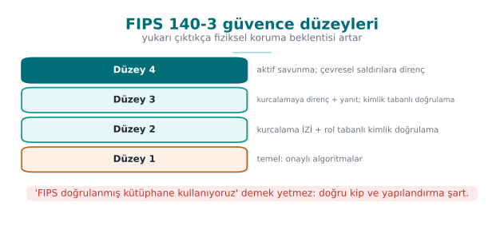

### Güvenlik düzeyleri

| Düzey | Öne çıkan gereksinim | Tipik modül |
| --- | --- | --- |
| **1** | Onaylı algoritmalar, üretim kalitesinde bileşenler; fiziksel koruma gerekmez | Yazılım kripto kütüphaneleri |
| **2** | Kurcalama **izi** (mühür, kaplama), rol tabanlı kimlik doğrulama | Güvenli belirteçler, bazı donanım modülleri |
| **3** | Kurcalamaya **direnç** ve yanıt (anahtarı silme), kimlik tabanlı kimlik doğrulama | Ağa bağlı HSM'ler |
| **4** | Ortam koşullarındaki (gerilim, sıcaklık) saldırılara karşı tam koruma | Fiziksel saldırının beklendiği ortamlar |

### Bir modülün FIPS 140-3'te yapması gerekenler (özet)

- Yalnız **onaylı algoritmaları** (AES, SHA-2/3, HMAC, RSA, ECDSA, onaylı rastgele üreteçler; 2024'ten itibaren kuantum sonrası
  algoritmalar) "onaylı kip"te kullanmak; her algoritmanın ayrıca algoritma doğrulama programından (CAVP) sertifikası olması.
- Açılışta ve koşullu **öz testler** yapmak (bilinen cevap testleri, bütünlük denetimi); başarısızsa hata durumuna geçip
  kripto hizmeti vermemek.
- **Roller ve hizmetler** tanımlamak (kullanıcı, yetkili); her hizmetin hangi kritik güvenlik parametresine (anahtar)
  eriştiğini belgelemek.
- Kritik güvenlik parametrelerini güvenli üretmek, girip çıkarmak ve iş bitince **sıfırlamak** (zeroization).
- Bir **güvenlik politikası** belgesi yayımlamak.

!!! tip "FIPS doğrulaması ne demek değildir?"
    Bir uygulamanın "FIPS doğrulanmış bir kütüphane kullanması", uygulamanın kendisinin doğrulandığı anlamına gelmez.
    Kütüphaneyi yanlış kullanmak (nonce tekrarı, anahtarı bellekte bırakmak, doğrulamayı kapatmak) 3. ve [10. haftalarda](../week-10/cen429-week-10.md)
    gördüğümüz bütün hataları yeniden getirir. Projenizde "OpenSSL'in FIPS sağlayıcısını kullanıyoruz" diyorsanız, bunun
    hangi gereksinimi karşıladığını ve neyi karşılamadığını ayrıca yazın.

### İşlenmiş örnek: bir modülü FIPS 140-3 düzey 1'e göre denetlemek

Yukarıdaki "özet" listesini gerçek (ama basitleştirilmiş) bir projeye uygulayalım. Diyelim ki projenizin kripto
katmanı şöyle: OpenSSL'in standart `EVP` arayüzünü kullanıyor, AES-256-GCM ile şifreliyor, anahtarları
`getrandom()`'dan üretiyor ([3. hafta](../week-3/cen429-week-3.md)), hata durumunda sessizce varsayılan bir anahtara düşüyor. Düzey 1
beklentilerini tek tek işaretleyelim:

| Düzey 1 beklentisi | Bu projede durum | Neden |
| --- | --- | --- |
| Yalnız onaylı algoritmalar, onaylı kipte | **Kısmen** | AES-GCM onaylı bir algoritma/kip, ama kullanılan OpenSSL derlemesinin CAVP sertifikası yoksa iddia edilemez |
| Açılış ve koşullu öz testler | **Karşılanmadı** | Proje kendi öz testini çalıştırmıyor, yalnız kütüphaneye güveniyor |
| Roller ve hizmetler tanımlı | **Karşılanmadı** | Kod herhangi bir rol ayrımı yapmıyor |
| Kritik parametrelerin güvenli girişi/çıkışı ve sıfırlanması | **Karşılanmadı** | Hata durumunda "varsayılan anahtara düşmek", tam tersi bir davranış: sıfırlamak yerine öngörülebilir bir anahtar kullanmak |
| Güvenlik politikası belgesi | **Karşılanmadı** | Böyle bir belge yok |

Bu tablo, projenin FIPS 140-3 düzey 1'den bile **uzak** olduğunu, en kritik açığın "hata durumunda sessizce
varsayılan anahtara düşmek" olduğunu gösterir — bu, tam olarak sıfırlama (zeroization) ilkesinin **tersidir** ve
3. haftada gördüğümüz "rastgele üreteç başarısız olursa dur, devam etme" kuralının ihlalidir.

!!! danger "Sık hata: 'FIPS onaylı algoritma listesindeyiz' demek, sertifikasız"
    AES ve SHA-2'nin FIPS onaylı algoritmalar **olması**, sizin kullandığınız **derlemenin** doğrulandığı anlamına
    gelmez. CMVP'de her modülün kendi sertifika numarası ve kapsamı vardır (hangi işletim sistemi, hangi derleyici,
    hangi sürüm). "AES kullanıyoruz, o yüzden FIPS'e uyuyoruz" cümlesi, hangi somut sertifikaya dayandığı
    sorulduğunda çöker.

!!! success "Kural"
    Bir FIPS iddiasının arkasında her zaman bir **CMVP sertifika numarası ve kapsamı** olmalı; yoksa iddiayı "FIPS
    onaylı algoritmalar kullanıyoruz (doğrulanmış modül değil)" şeklinde dürüstçe daraltın.

!!! question "Değerlendirici nasıl test eder?"
    Değerlendirici önce kullanılan kripto kütüphanesinin sürümünü ve derleme bayraklarını CMVP'nin genel listesiyle
    karşılaştırır; sonra kaynak kodda açılış öz testi çağrısı, hata durumunda durma davranışı ve anahtar sıfırlama
    (bellek silme) çağrılarını arar. Bunlardan biri eksikse iddia geçersiz sayılır.

### FIPS doğrulama sürecinin adımları (kabaca)

Bir kriptografik modülü FIPS 140-3'e göre doğrulatmak, tek seferlik bir onay değil, adımlı bir süreçtir:

1. **Geliştirici** modülü onaylı algoritmalarla, güvenlik politikası belgesiyle birlikte hazırlar.
2. **CAVP** (Cryptographic Algorithm Validation Program) her algoritmanın (AES, SHA-2, HMAC, RSA...) **ayrı ayrı**
   doğru uygulandığını test eder ve algoritma sertifikası verir.
3. **Akredite laboratuvar**, modülü FIPS 140-3'ün fiziksel, mantıksal ve süreç gereksinimlerine göre test eder.
4. **CMVP**, laboratuvarın raporunu inceler ve modül sertifikasını yayımlar; sertifika modülün **tam sürümünü ve
   çalıştığı platformu** belirtir.
5. Modül ya da platform değişirse (ör. yeni bir işletim sistemi sürümü), sertifika **yeniden doğrulama**
   gerektirebilir.

Bu adım sırası, "AES kullanıyoruz" cümlesinin FIPS iddiası için neden yetersiz olduğunu gösterir: 2. adım yalnız
algoritmayı, 3-4. adımlar ise **bütün modülü** (algoritma + öz testler + roller + sıfırlama) kapsar. Sertifika,
4. adım tamamlanmadan verilmez.

### Bir CMVP sertifikasında ne yazar?

Gerçek bir CMVP sertifikası genel olarak şunları belirtir: modülün adı ve sürümü, hangi işletim sistemi/donanım
üzerinde test edildiği, hangi güvenlik düzeyinde doğrulandığı ve doğrulanan algoritmaların CAVP sertifika
numaraları. Bir proje "FIPS doğrulanmış X kütüphanesini kullanıyoruz" derken, aslında bu sertifikadaki **tam
sürüm ve platform eşleşmesinin** kendi ürünündeki kullanımla birebir aynı olduğunu kontrol etmelidir; sertifika
Linux x86-64 için verilmişse, aynı kütüphanenin Android ARM derlemesi **aynı sertifikayı** otomatik miras almaz.

### FIPS düzeyleri ile CC EAL'i karıştırmayın

Her ikisi de küçük sayılarla (1'den 4'e ya da 1'den 7'ye) ifade edildiği için öğrenciler bu iki ölçeği karıştırır:

| | FIPS 140-3 düzeyi (1–4) | CC EAL (1–7) |
| --- | --- | --- |
| Neyi ölçer? | Bir **kriptografik modülün** fiziksel/mantıksal koruması | Bir **ürünün bütününün** değerlendirme **derinliği** |
| Kapsam | Yalnız kripto modülü | Ürünün ST'de tanımladığı bütün TOE |
| Sayı artınca ne değişir? | Daha fazla fiziksel saldırıya direnç | Daha derin, daha titiz değerlendirme (daha "güvenli" değil) |

Bir ürün aynı anda hem "FIPS 140-3 düzey 2" hem "CC EAL4" iddia edebilir — bunlar **birbirini dışlamaz**, farklı
boyutları ölçer. Biri diğerinin yerine geçmez.

!!! danger "Sık hata: platform/sürüm uyuşmazlığını fark etmemek"
    Bir ekip "OpenSSL FIPS sağlayıcısı doğrulanmış, biz de OpenSSL kullanıyoruz" der ama kendi derledikleri sürüm,
    derleme bayrakları ya da hedef platform sertifikadakiyle **aynı değildir**. FIPS doğrulaması, tam olarak test
    edilen ikili dosyaya (binary) bağlıdır; kaynak kodu aynı olsa bile farklı derlenmiş bir ikili dosya
    doğrulanmamış sayılır.

!!! success "Kural"
    Bir FIPS iddiası yazarken sertifikadaki **modül sürümü, platform ve derleme yapılandırmasının** projenizdeki
    kullanımla birebir eştiğini doğrulayın; eşleşmiyorsa iddiayı yazmayın.

### FIPS uyumluluğunu iddia etmeden önce sorulacak üç soru

Projenizde bir FIPS iddiası yazmadan önce şu üç soruyu sırayla sorun:

1. **Hangi modülün** sertifikası var — işletim sisteminin kripto kütüphanesi mi, uygulamanın gömdüğü ayrı bir
   kütüphane mi?
2. Bu sertifika **sizin kullandığınız tam sürüm ve platformu** kapsıyor mu (yukarıdaki "platform/sürüm
   uyuşmazlığı" hatası)?
3. Kullandığınız **her** algoritma çağrısı, modülün "onaylı kip"inde mi çalışıyor, yoksa modülün onaylanmamış bir
   yardımcı fonksiyonunu mu kullanıyorsunuz?

Üç soruya da "evet" diyemiyorsanız, iddianızı "FIPS onaylı algoritmalar kullanıyoruz" gibi daha dar, dürüst bir
cümleye indirin (bu bölümün başındaki uyarı kutusunda görüldüğü gibi).

### Bu haftanın demosuyla bağlantı

Bu haftanın `01-uyum-matrisi` demosu, kanıtsız "karşılandı" satırlarını otomatik bulur; bir FIPS iddiasının
kanıtsız yazılması da aynı sınıfta bir hatadır. Kendi projenizde "FIPS 140-3'e uyumluyuz" gibi bir cümle
yazıyorsanız, bunu uyum matrisinizde ayrı bir satır olarak ele alın ve kanıt sütununa sertifika numarasını (ya da
"sertifika yok, yalnız onaylı algoritma kullanıyoruz" dürüstlüğünü) yazın.

---

## 6. ETSI, GSMA, EMVCo, PCI ve OWASP: sektöre özgü gereksinim setleri

### ETSI EN 303 645: tüketici nesnelerin interneti

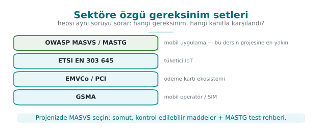

Avrupa Telekomünikasyon Standartları Enstitüsü'nün (ETSI) bu standardı, internete bağlanan tüketici cihazları için temel
bir güvenlik çizgisi tanımlar ve Avrupa'daki düzenlemelerin dayanağı olmuştur. On üç başlığı, dönem boyunca gördüğümüz
konuların kısa bir özeti gibidir:

| # | Başlık | Dersteki karşılığı |
| --- | --- | --- |
| 5.1 | Evrensel varsayılan parola kullanmamak | [1. hafta](../week-1/cen429-week-1.md) kimlik doğrulama |
| 5.2 | Zafiyet bildirimlerini yönetmek için bir yol sunmak | [12. hafta](../week-12/cen429-week-12.md) |
| 5.3 | Yazılımı güncel tutmak | 1. hafta güncelleme imzası, [10. hafta](../week-10/cen429-week-10.md) |
| 5.4 | Hassas güvenlik parametrelerini güvenle saklamak | 3, 10, [11. haftalar](../week-11/cen429-week-11.md) |
| 5.5 | Güvenli iletişim kurmak | 3, 10. haftalar |
| 5.6 | Açık saldırı yüzeyini en aza indirmek | 1. hafta, [5. hafta](../week-5/cen429-week-5.md) küçültme |
| 5.7 | Yazılım bütünlüğünü sağlamak | [6. hafta](../week-6/cen429-week-6.md) |
| 5.8 | Kişisel verilerin güvenliğini sağlamak | [3. hafta](../week-3/cen429-week-3.md) maskeleme |
| 5.9 | Kesintilere dayanıklı olmak | Erişilebilirlik |
| 5.10 | Sistem telemetrisini incelemek | [2. hafta](../week-2/cen429-week-2.md) denetim kaydı |
| 5.11 | Kullanıcının verisini kolayca silebilmesi | 3. hafta imha |
| 5.12 | Kurulumu ve bakımı kolaylaştırmak | Psikolojik kabul edilebilirlik |
| 5.13 | Girdi verisini doğrulamak | 4, 5. haftalar |

### GSMA

Mobil operatörlerin birliği GSMA, IoT cihazları ve hizmetleri için **IoT Güvenlik Yönergeleri**'ni, SIM ve eSIM üretimi
ile abonelik yönetimi tesisleri için **Güvenlik Akreditasyon Şeması**'nı (SAS) ve ağ ekipmanları için bir değerlendirme
şemasını (NESAS) yürütür. SAS, ürünün değil **üretim ve yönetim tesisinin** denetlenmesine bir örnektir: fiziksel güvenlik,
personel, süreçler, anahtar yönetimi.

### EMVCo ve PCI: ödeme

| Belge | Kapsam | Öne çıkan gereksinim aileleri |
| --- | --- | --- |
| **EMVCo yazılım tabanlı mobil ödeme güvenlik gereksinimleri** | Telefonun güvenli elemanını kullanmayan (kartı yazılımla taklit eden) ödeme çözümleri | Uygulama koruması, kimlik doğrulama ve cihaz bağlama, varlık koruması, beklemede/kullanımda/aktarımda veri, raporlama, kripto ve anahtarlar, geliştirme süreci |
| **PCI MPoC** | Ticari telefon ve tabletlerin ödeme kabul terminali olarak kullanılması | Uygulama ve arka uç birlikte; izleme ve doğrulama (attestation) hizmetleri |
| **PCI DSS** | Kart verisi işleyen ortamlar | Veri koruma, erişim denetimi, günlükleme, test ve tarama |
| **PCI Yazılım Güvenliği Çerçevesi** | Ödeme yazılımlarının güvenli geliştirilmesi | Güvenli yaşam döngüsü, yazılımın kendi güvenliği |

Yukarıdaki EMVCo aile listesine dikkat edin: dönem boyunca her haftanın konusu bu ailelerden birine karşılık geliyordu.
Dersin gereksinim aileleri (8. bölüm) bu yapıdan uyarlanmıştır.

### OWASP MASVS: uygulanabilir bir kontrol listesi

Resmî bir sertifika vermese de OWASP'ın **Mobil Uygulama Güvenliği Doğrulama Standardı** (MASVS), mobil uygulamalar için
en yaygın kullanılan açık kontrol listesidir. Kontrol grupları: depolama (MASVS-STORAGE), kripto (MASVS-CRYPTO), kimlik
doğrulama (MASVS-AUTH), ağ (MASVS-NETWORK), platform (MASVS-PLATFORM), kod (MASVS-CODE), dayanıklılık (MASVS-RESILIENCE)
ve gizlilik (MASVS-PRIVACY). Test yöntemleri ayrı bir rehberde (MASTG) verilir. Dayanıklılık grubu, 4., 5., 6. ve 9.
haftaların konularını kapsar.

### İşlenmiş örnek: aynı gereksinimin dört standarttaki karşılığı

Standartlar birbirinden bağımsız yazılmış olsa da genelde **aynı güvenlik ihtiyacını farklı sözcüklerle** ifade
eder. İki gereksinimi, dört standart boyunca izleyelim.

**Örnek 1 — Beklemedeki hassas veri şifrelemesi**

| Standart | Bu ihtiyacın karşılığı |
| --- | --- |
| **Ortak Kriterler** | SFR ailesi **FCS** (kriptografik destek, ör. FCS_COP kriptografik işlem) + **FDP** (kullanıcı verisi koruma) bileşenleri, ST'de bu veriye özel tanımlanır |
| **FIPS 140-3** | Şifrelemeyi yapan modülün düzey 1 gereksinimleri: onaylı algoritma, öz test, anahtar sıfırlama |
| **ETSI EN 303 645** | Madde 5.4 "Hassas güvenlik parametrelerini güvenle saklamak" (bu haftanın başındaki tabloda) |
| **OWASP MASVS** | MASVS-STORAGE grubu (yerel depolamanın korunması) |
| **Dersin ailesi** | `CEN429-DR-01` |

**Örnek 2 — Varsayılan/zayıf kimlik doğrulamanın engellenmesi**

| Standart | Bu ihtiyacın karşılığı |
| --- | --- |
| **Ortak Kriterler** | SFR ailesi **FIA** (kimlik tanıma ve doğrulama) bileşenleri (ör. kimlik doğrulama başarısızlığı işleme) |
| **FIPS 140-3** | Düzey 2'nin istediği **rol tabanlı kimlik doğrulama** |
| **ETSI EN 303 645** | Madde 5.1 "Evrensel varsayılan parola kullanmamak" |
| **OWASP MASVS** | MASVS-AUTH grubu |
| **Dersin ailesi** | `CEN429-ID-01` / `CEN429-ID-02` |

Bu iki tablonun gösterdiği şey şudur: bir ürün EMVCo/PCI belgesi için "beklemede veri şifreleme" gereksinimini
karşılayacak kanıtı zaten hazırlamışsa, aynı kanıtın büyük kısmı MASVS-STORAGE denetiminde de **yeniden
kullanılabilir** — çünkü ikisi de aynı temel ihtiyacı (şifrelenmiş, sıfırlanabilir, sızdırmayan depolama) sorar.
Ama "yeniden kullanılabilir" demek "otomatik karşılanır" demek değildir; her standardın **kendi ölçütü** (ör.
MASVS ayrıca anahtarın işletim sisteminin güvenli depolama API'siyle korunmasını da ister) ayrı doğrulanmalıdır.

### Standartları nasıl seçer, nasıl önceliklendirirsiniz?

Bir proje bu beş kaynağın (CC, FIPS, ETSI, GSMA/EMVCo/PCI, MASVS) **hepsine birden** uymaya çalışmaz; hangi
standardın uygulanacağı ürünün **türüne** ve **pazarına** bağlıdır:

- Tüketici IoT cihazı satıyorsanız → ETSI EN 303 645 (bazı pazarlarda yasal zorunluluk).
- Mobil uygulama geliştiriyorsanız → OWASP MASVS (fiilî endüstri standardı, sertifika şartı olmasa da).
- Ödeme işleyen bir uygulama/kütüphaneyseniz → EMVCo ve/veya PCI belgeleri (kart şemalarının şartı).
- Devlet/savunma alıcısına satış yapıyorsanız → Ortak Kriterler sertifikası (çoğu zaman ihale şartı).
- Kriptografik bir modül/kütüphane satıyorsanız → FIPS 140-3 (ABD federal alıcılar için zorunlu).

Dersin gereksinim aileleri (8. bölüm) bu beşinden **ortak paydaları** çıkarır; kendi projenizde hangi sektöre
girdiğinizi belirleyip S1 (kaynaklar) bölümünde hangi standartlara dayandığınızı açıkça yazmanız beklenir.

!!! danger "Sık hata: bir standarda uymayı diğerine otomatik saymak"
    "FIPS doğrulanmış bir modül kullanıyoruz, o yüzden MASVS-CRYPTO'yu da karşılıyoruz" cümlesi tehlikelidir. FIPS
    yalnız **algoritmanın** doğru uygulandığını doğrular; MASVS-CRYPTO ayrıca anahtarların **nerede saklandığını**,
    uygulamanın kendi anahtarını sabit kodlayıp kodlamadığını, anahtar üretiminin platformun güvenli rastgele
    üretecini kullanıp kullanmadığını da sorar. Bir modülün kendisi doğru olsa bile, **kullanımı** yanlış olabilir
    (tıpkı 5. bölümdeki "FIPS doğrulaması ne demek değildir?" kutusunda görüldüğü gibi).

!!! success "Kural"
    Standartlar arası örtüşmeyi **kanıt toplama işini hızlandırmak** için kullanın (aynı testi/belgeyi birden çok
    matriste referans gösterin) ama her standardın kontrol listesini **ayrı ayrı** işaretleyin. Bir uyum matrisi
    satırını "zaten X standardında karşıladık" diyerek kanıtsız "karşılandı" yapmayın.

### İşlenmiş örnek: ETSI EN 303 645 madde 5.13'ü projeye uygulamak

Madde 5.13 "girdi verisini doğrulamak" der; bunu 4. ve 5. haftalarda gördüğümüz girdi doğrulama/temizleme
konusuyla birebir eşleyelim:

1. **Madde:** "Cihaz yazılımı, kullanıcı arayüzlerinden veya ağdan gelen verinin doğrulanması yoluyla verinin
   bozulmasını veya cihazın çökmesini önlemelidir."
2. **Dersin gereksinimi:** Bu madde, dersin `CEN429-AP` ailesine ya da yeni bir girdi doğrulama ailesine
   uyarlanabilir: "Ağdan veya kullanıcıdan gelen her girdi, işlenmeden önce uzunluk, tip ve aralık kontrolünden
   geçirilmelidir (bkz. Hafta 4–5)."
3. **Önlem:** Kılavuzda hangi ayrıştırma (parsing) fonksiyonlarının sınır denetimi yaptığı listelenir.
4. **Doğrulama:** Bulanıklaştırma (fuzzing) testi ya da sınır değer testleriyle geçersiz girdilerin güvenle
   reddedildiği gösterilir ([Hafta 4](../week-4/cen429-week-4.md)'teki bulanıklaştırma demosuna bağlanır).
5. **Kanıt:** Fuzz testi çalıştırma raporu, çökme (crash) sayısının sıfır olduğunu gösteren özet.

Bu örnek, ETSI maddesinin soyut cümlesinin nasıl **somut bir dersin gereksinimine, önlemine ve testine**
dönüştüğünü gösterir — tıpkı 2. bölümdeki izlenebilirlik zincirinde olduğu gibi.

### GSMA NESAS ve PCI DSS düzeyleri hakkında kısa not

- **GSMA NESAS** (Network Equipment Security Assurance Scheme), mobil şebeke ekipmanı üreticilerinin güvenli
  geliştirme süreçlerini ve ürünlerinin güvenlik testlerini değerlendirir; SAS'ın (tesis odaklı) aksine hem
  **süreç** hem **ürün** odaklıdır.
- **PCI DSS**, kart verisi işleyen kuruluşları işlem hacimlerine göre düzeylere ayırır (en yüksek hacimli
  kuruluşlar en sıkı denetime tabidir); bu ders kapsamında düzey ayrıntılarına girmiyoruz, ama "büyüklüğe göre
  denetim sıklığı/derinliği değişir" fikri CC'deki EAL mantığıyla benzerdir: risk ne kadar büyükse, güvence o
  kadar derin olmalıdır.

### Sektör setlerini karşılaştırmalı özetleyen bir tablo

| Set | Hangi kurum | Hangi ürün türü | Resmî sertifika var mı? |
| --- | --- | --- | --- |
| ETSI EN 303 645 | ETSI (Avrupa) | Tüketici IoT cihazları | Bazı ülkelerde yasal uygunluk beyanı |
| GSMA IoT Security Guidelines / SAS / NESAS | GSMA | IoT cihaz/hizmet, SIM tesisleri, şebeke ekipmanı | SAS/NESAS evet, yönergeler hayır |
| EMVCo yazılım tabanlı mobil ödeme | EMVCo | Kart taklit eden yazılım ödeme çözümleri | Evet (EMVCo listesi) |
| PCI MPoC / DSS / SSF | PCI SSC | Ödeme kabul, kart verisi işleme, ödeme yazılımı | Evet |
| OWASP MASVS | OWASP (kâr amacı gütmeyen topluluk) | Mobil uygulamalar | Hayır (fiilî standart, resmî sertifika yok) |
| Ortak Kriterler | ISO/IEC, çok uluslu (CCRA) | Her türlü BT ürünü | Evet (uluslararası tanınan) |
| FIPS 140-3 | NIST (ABD) | Kriptografik modüller | Evet (CMVP) |

Bu tablo, dersin en başında sorduğumuz "kim, neyi, nasıl sertifikalıyor?" sorusunun bu haftaki cevabıdır ve
6. bölümü kapatan bir özet görevi görür.

### Bir ürün birden fazla sette birden yer alabilir mi?

Evet, hatta çoğu gerçek ürün öyledir. Örneğin bir mobil ödeme uygulaması aynı anda şunları hedefleyebilir: kart
şemasının EMVCo gereksinimlerini (çünkü kart verisiyle çalışıyor), OWASP MASVS'yi (çünkü bir mobil uygulama) ve
kullandığı kripto kütüphanesi üzerinden dolaylı olarak FIPS 140-3'ü (çünkü o kütüphane FIPS doğrulanmış olabilir).
Bu ürün için Ortak Kriterler sertifikası genelde **gerekli değildir** çünkü CC daha çok devlet/savunma alıcıları
tarafından istenir, tüketici ödeme uygulamalarında nadiren aranır. Kendi projeniz için de aynı analiz geçerlidir:
"biz hangi pazara satıyoruz, o pazar hangi standardı arıyor?" sorusunun cevabı, hangi standartları S1'e
yazacağınızı belirler — hepsini yazmak zorunda değilsiniz, yalnız **ilgili** olanları.

---

## 7. Gereksinimleri yazılım planına ve varlık yönetimine aktarmak

Bir gereksinim setini okumak işin kolay kısmıdır. Asıl iş, onu ürünün planına **dönüştürmektir**. Adımlar:

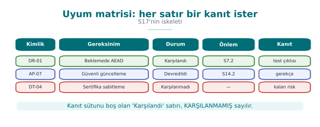

1. **Uygulanabilirlik:** Setteki her gereksinim için "bu ürüne uygulanır mı?" sorusu sorulur. Uygulanmayanlar gerekçesiyle
   işaretlenir (ör. "ürün ağ bağlantısı kullanmaz, aktarımda veri gereksinimleri uygulanmaz").
2. **Sorumluluk:** Uygulananlar "biz karşılarız" ve "devrederiz" olarak ayrılır (3. bölüm).
3. **Varlıklara bağlama:** Her gereksinim, varlık tablosundaki ilgili varlıklara bağlanır. "Kripto anahtarları iş bitince
   silinmeli" gereksinimi, varlık tablosundaki **her** anahtarın "oluşma → silinme" sütununun dolu olmasını gerektirir.
4. **Tehditlere bağlama:** Her gereksinim en az bir tehdide karşılık gelmelidir; karşılık gelmiyorsa ya tehdit modeli eksiktir
   ya da gereksinim bu ürün için gereksizdir.
5. **Önlem ve doğrulama:** Her gereksinim için önlem kartı ve doğrulama yöntemi (test, inceleme, analiz) planlanır.
6. **Sürüm planı:** Hangi gereksinimin hangi sürümde karşılanacağı proje planına işlenir; karşılanamayanlar kalan riske
   yazılır.

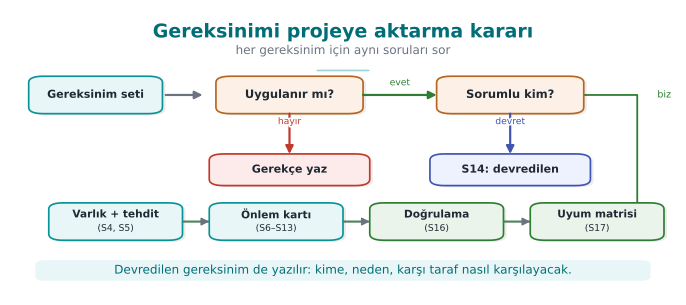

!!! note "Sahada nasıl uygulanır?"
    Bir kütüphanenin kılavuzunda varlık tablosu, gereksinimlerin doğrudan yansımasıdır: her varlık için boyutu, kaynağı,
    oluşturulma ve imha zamanı, varsayılan değeri ve koruma sınıfı (C, I, I+, N) yazılır; çünkü gereksinimler "her varlık
    için gizlilik ve bütünlük ihtiyacı tanımlanmalı" ve "varlıklar işlenirken, taşınırken ve saklanırken korunmalı" der.
    Değerlendirici, gereksinimden varlık tablosuna, oradan güvenlik kabuğu matrisine ve önlem kartlarına gider.

### İşlenmiş örnek: altı adımı tek bir gereksinimde uygulamak

Bu bölümün başındaki altı adımı (uygulanabilirlik → sorumluluk → varlıklara bağlama → tehditlere bağlama → önlem
ve doğrulama → sürüm planı), `CEN429-CR-03` ("anahtarlar iş bitince silinmelidir") gereksinimi üzerinden uçtan uca
uygulayalım.

**1. Uygulanabilirlik.** Proje kripto anahtarı kullanıyor mu? Evet — oturum anahtarı ve kasa dosyası anahtarı var.
Gereksinim **uygulanır**.

**2. Sorumluluk.** Anahtarı üreten ve kullanan kod projenin kendi kodu; devretmek için bir neden yok. Ekip **biz
karşılarız** kararını verir.

**3. Varlıklara bağlama.** Varlık tablosunda (S5) iki anahtar satırı var: "oturum anahtarı" ve "kasa dosyası
anahtarı". Her ikisinin de "oluşma → kullanım → silinme" sütunu doldurulmalı; şu an "kasa dosyası anahtarı"
satırında silinme zamanı boş. Bu **eksiklik** burada fark edilir.

**4. Tehditlere bağlama.** Hangi tehdit bu gereksinimi gerektiriyor? [1. haftanın](../week-1/cen429-week-1.md) tehdit modelinde "cihaza fiziksel
erişimi olan saldırgan bellek dökümü (memory dump) alır" tehdidi var; anahtar iş bittikten sonra bellekte kalırsa
bu tehdit gerçekleşebilir. Gereksinim bu tehdide **bağlanır**; bağlanamasaydı ya tehdit modeli eksikti ya da
gereksinim bu ürün için gereksizdi (yukarıdaki 4. madde).

**5. Önlem ve doğrulama.** Önlem: anahtar kullanımdan hemen sonra `sifreleme_bellek_sil()` çağrılır (sıfırlarla
üzerine yazma, derleyicinin bu çağrıyı optimize ederek silmediğinden emin olunur — [9. hafta](../week-9/cen429-week-9.md) koruma kurallarına
bağlanır). Doğrulama: bellek analiz aracı (ör. bir bellek dökümü alıp anahtar baytlarını aramak) ile anahtarın iş
bitiminden sonra bellekte **bulunmadığı** doğrulanır.

**6. Sürüm planı.** Oturum anahtarı için bu önlem zaten v0.9'da var (karşılandı). Kasa dosyası anahtarı için
eksik; ekip bunu v1.0 sürüm planına ekler ve o güne kadar durumu uyum matrisinde **karşılanmadı**, kalan riske
"kasa dosyası anahtarı iş bitiminde bellekte kalabilir, düzeltme v1.0'da" olarak yazar.

Altı adımın sonunda hem uyum matrisi satırı hem de proje planındaki bir görev (kasa dosyası anahtarını v1.0'da
sıfırlama) ortaya çıkmış olur — bu, "gereksinimi okumak" ile "gereksinimi projeye dönüştürmek" arasındaki farktır.

!!! danger "Sık hata: 'uygulanmaz' kararını gerekçesiz bırakmak"
    Bir takım "aktarımda veri" ailesindeki bütün gereksinimleri "ürünümüz ağ kullanmıyor" diyerek tek cümleyle
    uygulanmaz işaretler, ama bu cümleyi doğrulayacak hiçbir kanıt (ör. kod taramasında ağ API'si çağrısı olmadığını
    gösteren bir rapor) sunmaz. Değerlendirici bu iddiayı sorgular: "Gerçekten hiç ağ bağlantısı yok mu, yoksa siz
    mi kontrol etmediniz?"

!!! success "Kural"
    Her "uygulanmaz" kararı, gerekçesini destekleyen bir kanıtla (kod taraması, mimari diyagram, bağımlılık
    listesi) birlikte yazılmalıdır. Gerekçesiz "uygulanmaz", gerekçesiz "karşılandı" kadar güvenilmezdir — ikisi de
    "kontrol edilmedi" anlamına gelebilir.

### İkinci örnek: aynı altı adımı bir süreç gereksinimine uygulamak

Adımlar yalnız teknik gereksinimler için değil, süreç gereksinimleri için de aynı şekilde işler. `CEN429-DV-02`
("her değişiklik incelenmelidir") üzerinden hızlıca geçelim:

1. **Uygulanabilirlik:** Proje bir sürüm kontrol sistemi kullanıyor mu? Evet → uygulanır.
2. **Sorumluluk:** Ekip kendi süreciyle karşılar (devredilecek bir taraf yok).
3. **Varlıklara bağlama:** Doğrudan bir "varlığa" değil, **geliştirme sürecine** bağlanır; S5'te değil, kılavuzun
   "geliştirme yaşam döngüsü" bölümünde belgelenir.
4. **Tehditlere bağlama:** Tehdit: "kötü niyetli ya da hatalı bir değişikliğin fark edilmeden ana dala girmesi"
   ([6. hafta](../week-6/cen429-week-6.md) tedarik zinciri güvenliği).
5. **Önlem ve doğrulama:** Önlem: birleştirme isteği (pull request) kuralı, en az bir onay zorunlu. Doğrulama:
   sürüm kontrol geçmişinde son 20 birleştirmenin en az bir onay kaydına sahip olduğu kontrol edilir.
6. **Sürüm planı:** Bu süreç zaten yürürlükte; "karşılandı", sürekli izlenmesi gereken bir kural olarak not
   düşülür (bir kerelik değil, her birleştirmede geçerli).

Bu ikinci örnek, altı adımın yalnız "kripto gereksinimleri" için değil, **her** gereksinim türü (işlevsel, güvence,
süreç) için aynı şekilde çalıştığını gösterir.

### Sürüm planına işlemek: küçük bir örnek

Altıncı adımın ("hangi gereksinimin hangi sürümde karşılanacağı") somut bir proje planı satırına dönüşmüş hâli:

| Gereksinim | Hedef sürüm | Sorumlu | Durum (bu hafta) |
| --- | --- | --- | --- |
| CEN429-CR-03 (kasa dosyası anahtarı silme) | v1.0 | Ahmet | Devam ediyor |
| CEN429-DT-04 (sertifika sabitleme) | v1.1 | Aslı | Planlandı |
| CEN429-DV-02 (kod incelemesi) | Sürekli | Ekip | Karşılandı |

Bu tablo, S17'deki (uyum matrisi) "karşılanmadı" satırlarının proje yönetimi tarafındaki karşılığıdır; S17'yi
güncelleyen kişi, aynı oturumda bu tabloyu da güncellemelidir — aksi hâlde iki belge birbirinden **ayrışır** ve
biri diğerini yalanlar.

!!! question "Bu adımların sorumlusu kim olmalı?"
    Küçük bir takımda uyum matrisini tek bir kişi (ör. takım lideri) güncel tutmalı ama her geliştirici kendi
    yazdığı önlem için hangi gereksinimi karşıladığını **o özelliği yazarken** not etmelidir. Bunu haftalar sonra
    hatırlamaya çalışmak, çoğu zaman yanlış ya da eksik eşlemeye yol açar.

### Neden bu altı adımı atlamak cazip ama yanlıştır

Bir gereksinim listesini okuyup doğrudan "hepsi karşılanıyor" demek, altı adımı atlamanın en hızlı yoludur — ve
tam olarak bu yüzden en sık yapılan hatadır. Zaman baskısı altındaki takımlar üçüncü adımı (varlıklara bağlama)
ve dördüncü adımı (tehditlere bağlama) atlar çünkü bunlar "yazı işi" gibi görünür. Ama bu iki adım atlandığında,
geriye kalan "karşılandı" iddiası hiçbir şeye dayanmaz; 9. bölümdeki proje kontrol listesi bu yüzden S5 (varlık
tablosu) ile S17'yi (uyum matrisi) birlikte gözden geçirmeyi ister.

---

## 8. Dersin gereksinim aileleri

Dönem projeniz için, açık standartlardan (ETSI EN 303 645, OWASP MASVS, NIST SSDF, Ortak Kriterler katalogları) ve sektör
belgelerinin yapısından uyarlanmış bir gereksinim seti kullanıyoruz. Kimlikler `CEN429-<aile>-<numara>` biçimindedir.

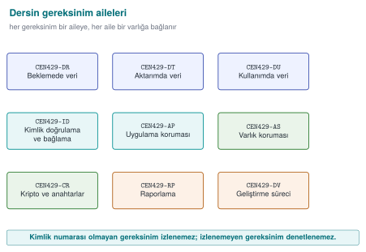

| Aile | Konu | Örnek gereksinimler (özet) |
| --- | --- | --- |
| **CEN429-AP** | Uygulama koruması | AP-01 sürüm derlemesi derleyici korumaları etkin olarak üretilmelidir · AP-02 hassas kod bölümleri gizlenmelidir · AP-03 sürümde hata ayıklama günlüğü bulunmamalıdır · AP-04 uygulama çalışma anında kendi bütünlüğünü denetlemelidir · AP-05 hata ayıklayıcı ve kanca algılandığında tanımlı bir tepki verilmelidir · AP-06 sürüm geri alma reddedilmelidir · AP-07 kurulum ve güncelleme güvenli yapılmalıdır |
| **CEN429-ID** | Kimlik doğrulama ve bağlama | ID-01 uygulamanın kimlik doğruladığı bütün varlıklar listelenmelidir · ID-02 sunucu ile karşılıklı kimlik doğrulama yapılmalıdır · ID-03 hassas veri cihaza ve sürüme bağlanmalıdır |
| **CEN429-AS** | Varlık koruması | AS-01 her varlık için konum, yaşam döngüsü ve C/I/I+ sınıfı tanımlanmalıdır · AS-02 tek bir kopyanın ele geçirilmesi diğer kopyaları etkilememelidir (ortak statik anahtar yok) · AS-03 statik analize karşı hassas sabitler korunmalıdır |
| **CEN429-DR** | Beklemede veri | DR-01 hassas veri AEAD ile şifrelenmelidir · DR-02 veri artık gerekmediğinde ve uzlaşmada güvenle silinmelidir |
| **CEN429-DU** | Kullanımda veri | DU-01 hassas veri yalnız işlem süresince açık tutulmalıdır · DU-02 oturum verisi işlemden hemen sonra bellekten silinmelidir |
| **CEN429-DT** | Aktarımda veri | DT-01 aktarım en az TLS 1.2 ile, sertifika ve ad doğrulamasıyla yapılmalıdır · DT-02 veri yalnız tanımlı arayüzlerden geçmelidir · DT-03 hassas veri TLS'e ek olarak mesaj düzeyinde korunmalıdır |
| **CEN429-RP** | Raporlama | RP-01 hassas veri açık olarak günlüğe yazılmamalıdır · RP-02 hata kodları saldırgana yardım edecek bilgi vermemelidir · RP-03 uygulama hata ayıklama ya da test kipinde çalışmamalıdır |
| **CEN429-CR** | Kripto ve anahtarlar | CR-01 yalnız standart algoritmalar güvenli yapılandırmayla kullanılmalıdır · CR-02 her anahtarın hiyerarşisi, amacı ve kripto-periyodu tanımlanmalıdır · CR-03 anahtarlar iş bitince silinmelidir · CR-04 rastgele sayılar yeterli entropili bir kaynaktan alınmalıdır |
| **CEN429-DV** | Geliştirme süreci | DV-01 kaynak kod sürüm denetiminde, korumalı dallarla tutulmalıdır · DV-02 her değişiklik incelenmelidir · DV-03 her sürüm benzersiz biçimde tanımlanmalıdır · DV-04 bağımlılıklar SBOM ile izlenmelidir · DV-05 güvenlik testleri sürekli entegrasyonda çalıştırılmalıdır |

!!! example "Uyum matrisi etkinliği (25 dakika, takımlar)"
    1. Yukarıdaki ailelerden projenize uygulanan en az **15** gereksinimi seçin; uygulanmayanları gerekçesiyle işaretleyin.
    2. Her biri için durum (karşılandı / devredildi / karşılanmadı), kılavuz bölümü ve doğrulama yöntemini yazın.
    3. "Karşılandı" dediğiniz her satır için kanıtın **şu anda** nerede olduğunu gösterin. Gösteremediğiniz satırın durumunu
       değiştirin.
    4. İki takım matrislerini değiştirip birbirinin üç satırını "değerlendirici gibi" sorgulasın.

### İşlenmiş örnek: bir uyum matrisi satırını baştan sona, hatalarıyla birlikte doldurmak

Bir takımın `CEN429-AP-04` ("uygulama çalışma anında kendi bütünlüğünü denetlemelidir") için matris satırını nasıl
doldurduğunu, **ilk taslaktan** düzeltilmiş hâline kadar izleyelim; bu, 1. bölümdeki "kötüden iyiye" fikrinin bir
uyum matrisi satırına uygulanmış hâlidir.

**İlk taslak (yetersiz):**

| Kimlik | Gereksinim | Durum | Önlem | Doğrulama | Kanıt |
| --- | --- | --- | --- | --- | --- |
| CEN429-AP-04 | Uygulama çalışma anında kendi bütünlüğünü denetlemelidir | Karşılandı | Bütünlük kontrolü var | Test edildi | — |

Bu satırın üç sorunu var: (1) "Bütünlük kontrolü var" bir **önlem açıklaması değil**, gereksinimin tekrarı; hangi
mekanizma (checksum mı, imza doğrulama mı, hata ayıklayıcı algılama mı) belirtilmiyor. (2) "Test edildi"
**doğrulama yöntemi değil**, doğrulamanın var olduğunun iddiası. (3) Kanıt sütunu **boş**.

**Düzeltme adım adım:**

1. Ekip önlemi somutlaştırır: uygulama açılışta kendi kod bölümünün bir özetini (hash) hesaplar ve derleme
   zamanında gömülen beklenen özetle karşılaştırır; uyuşmazsa çalışmayı durdurur. Bu, kılavuzun S12.3 bölümünde
   anlatılır.
2. Doğrulama yöntemi netleştirilir: bir test aracı, ikili dosyanın (binary) bir baytını değiştirip uygulamanın
   **başlamayı reddettiğini** doğrular.
3. Kanıt eklenir: bu testin CI'da otomatik çalıştığı iş (`ci-integrity-check`), son çalıştırma kaydı ve çıktı
   günlüğü.

**Düzeltilmiş satır:**

| Kimlik | Gereksinim | Durum | Önlem | Doğrulama | Kanıt |
| --- | --- | --- | --- | --- | --- |
| CEN429-AP-04 | Uygulama çalışma anında kendi bütünlüğünü denetlemelidir | Karşılandı | S12.3: açılışta kod bölümü özeti hesaplanır, gömülü beklenen özetle karşılaştırılır, uyuşmazlıkta çalışma durur | Otomatik test: ikili dosyanın bir baytı değiştirilip başlamanın reddedildiği doğrulanır | CI işi `ci-integrity-check`, çalıştırma #391, `integrity_test.log` |

Fark, satırın **uzunluğunda** değil, her hücrenin **somutluğundadır**. İlk taslak da "dolu" görünüyordu; ama
hiçbir hücresi bağımsız olarak doğrulanamazdı.

!!! danger "Sık hata: aynı kanıtı bütün satırlara kopyalamak"
    Bazı takımlar tek bir genel test raporunu ("bkz. genel-test-raporu.pdf") matrisin **her** satırına kanıt olarak
    yapıştırır. Değerlendirici raporu açtığında o gereksinime özel bir test bulamazsa, bütün matrisin
    güvenilirliği sorgulanır — tek bir kopyala-yapıştır kanıt, matrisin geri kalanını da şüpheli hâle getirir.

!!! success "Kural"
    Her satırın kanıtı **o satıra özgü** olmalıdır: belirli bir test adı, belirli bir CI çalıştırma numarası,
    belirli bir günlük dosyası. Genel bir rapora referans veriliyorsa, raporun **hangi bölümü/sayfası** olduğu da
    belirtilmelidir.

### Ailelerin arkasındaki mantık: neden dokuz aile?

Sekiz aile (AP, ID, AS, DR, DU, DT, RP, CR) artı süreç ailesi (DV), sektördeki gerçek kılavuzlarda tekrar eden
dokuz soruya karşılık gelir: "Uygulama kendini nasıl koruyor (AP)? Kime güveniyor (ID)? Neyi koruyor (AS)? O
korunan şey nerede duruyor — diskte (DR), bellekte (DU) yoksa ağda mı (DT)? Bir şeyler ters giderse ne
söylüyor/söylemiyor (RP)? Bunların hepsini hangi kriptografik araçlarla yapıyor (CR)? Ve bunu üreten ekip nasıl
çalışıyor (DV)?" Bu dokuz soru, EMVCo'nun yazılım tabanlı mobil ödeme belgesindeki bölüm başlıklarıyla neredeyse
birebir örtüşür (6. bölümde görüldüğü gibi) çünkü sektördeki neredeyse her güvenlik kılavuzu aynı dokuz soruyu
farklı sırayla sorar.

### Aile seçerken sık yapılan bir hata: yanlış aileye yazmak

Bir gereksinimi yanlış aileye koymak (ör. "anahtar iş bitince silinmelidir" gereksinimini CR yerine DU'ya yazmak)
büyük bir hata değildir ama **tutarlılığı** bozar: aynı türden gereksinimleri ararken değerlendirici belirli bir
aileye bakar; gereksinim yanlış ailede duruyorsa gözden kaçabilir.

!!! danger "Sık hata: yeni bir gereksinimi mevcut ailelerden birine zorlamak"
    Projenizde ailelerin hiçbirine tam oturmayan bir gereksinim ortaya çıkabilir (ör. çoklu kullanıcı desteği
    gerektiren bir yetkilendirme kuralı). Bunu zorla CR ya da ID ailesine sıkıştırmak, hem kimlik numaralamasını
    hem de matrisin okunabilirliğini bozar.

!!! success "Kural"
    Mevcut dokuz aileden hiçbiri uymuyorsa, kendi kısa aile önekinizi (ör. `CEN429-AZ` yetkilendirme için)
    tanımlayın ve S1'de bu yeni ailenin neyi kapsadığını bir cümleyle açıklayın; var olan bir aileyi zorla germeyin.

### AS ailesi ile DR/DU/DT aileleri arasındaki fark

Yeni başlayanlar sık sık "AS (varlık koruması) ile DR (beklemede veri) aynı şey değil mi?" diye sorar. Fark
şudur: **AS**, varlığın kendisiyle ilgilidir (hangi varlık var, nasıl sınıflandırılmış, kopyası ele geçirilirse ne
olur); **DR/DU/DT** ise aynı varlığın **hangi durumda** (beklemede/kullanımda/aktarımda) olduğuyla ilgilidir. Aynı
varlık (ör. bir kripto anahtarı) hem bir AS gereksiniminin (ör. "her anahtar için konum ve yaşam döngüsü
tanımlanmalı") hem bir DU gereksiniminin (ör. "oturum verisi işlemden hemen sonra bellekten silinmelidir") konusu
olabilir — biri varlığın **envanterini**, diğeri varlığın **belirli bir andaki durumunu** sorar.

### Dokuz aileyi tek bakışta hatırlamak

AP-ID-AS-DR-DU-DT-RP-CR-DV sırası akılda tutulması zor olabilir; şu soru zincirini hatırlamak yardımcı olabilir:
"Kendini koruyor mu (AP)? Kime güveniyor (ID)? Neyi koruyor (AS)? O şey nerede — beklemede (DR), kullanımda (DU),
aktarımda (DT)? Sorun olursa ne diyor (RP)? Hangi araçla (CR)? Kim üretti, nasıl (DV)?" Bu, [1. haftadan](../week-1/cen429-week-1.md) beri
takip ettiğimiz "varlık → tehdit → önlem" zincirinin dokuz parçaya bölünmüş hâlidir.

---

## 9. Dönem projesi: bu hafta

- [ ] **S17 — Uyum matrisi:** dersin gereksinim ailelerinden projenize uygulananların tamamı; her satırda durum, bölüm,
      doğrulama ve kanıt.
- [ ] **S14 — Varsayımlar ve devredilen gereksinimler:** desteklenen platformlar, kapsam dışı bileşenler, kullanıcı ve
      ortam varsayımları; devredilen her gereksinim için kime, neden ve nasıl.
- [ ] **S1 — Kaynaklar:** hangi standartlara dayandığınızı (ETSI EN 303 645, OWASP MASVS, NIST SSDF, CERT) belirtin.
- [ ] Varlık tablonuzu (S5) gereksinimlere göre gözden geçirin: her varlığın yaşam döngüsü ve koruma sınıfı dolu mu?

### Bu haftaki teslimi 45 dakikada hazırlamanın yolu

S17 ve S14, değerlendiricinin **ilk açtığı** belgelerdir (bu haftanın başındaki bilgi kutusunda da belirtildiği
gibi); bu yüzden dağınık bırakmak, projenin geri kalanı iyi olsa bile kötü bir ilk izlenim yaratır. Önerilen sıra:

1. **8. bölümdeki aile tablosundan** projenize uygulanan gereksinimleri işaretleyin (kopyala-yapıştır, sonra
   uygulanmayanları silmek yerine "uygulanmaz, gerekçe: ..." olarak bırakın — 7. bölümdeki kural).
2. Her biri için **2. bölümdeki altı sütunu** (kimlik, gereksinim, durum, önlem, doğrulama, kanıt) doldurun; kanıt
   sütununu doldurmadan "karşılandı" yazmayın.
3. "Devredildi" işaretlediğiniz her satırı S14'e taşıyın; kime/neden/nasıl üçlüsünü **3. bölümdeki örnek gibi** tam
   cümlelerle yazın.
4. Varlık tablonuzu (S5) açın; her gereksinimin bağlandığı varlığın satırını bulun. Bağlanamıyorsa ya varlık
   eksiktir ya da gereksinim bu ürüne uygulanmaz.
5. S1'e (kaynaklar) hangi standartlara dayandığınızı yazın — 6. bölümdeki "standartları nasıl seçersiniz"
   rehberine bakın.

!!! danger "Sık hata: S17'yi son gece doldurup S5'i hiç güncellememek"
    Uyum matrisini teslimden hemen önce tek oturumda yazan takımlar, gereksinimleri varlık tablosuna **bağlamayı**
    atlar (7. bölümün 3. adımı). Sonuç: matris "tamam" görünür ama hiçbir satır gerçek bir varlığa dayanmaz;
    değerlendirici ilk sorguladığında bağlantı kurulamaz.

!!! success "Kural"
    S17'yi güncellediğiniz her oturumda S5'i de açık tutun; yeni bir gereksinim eklediğinizde ilgili varlık
    satırının var olduğunu, yoksa eklenmesi gerektiğini kontrol edin.

### Kanıt klasörünüzü nasıl düzenlemelisiniz

Uyum matrisindeki her kanıt referansının **gerçekten bulunabilir** olması için basit bir klasör düzeni önerilir:

```text
evidence/
  week13/
    test_butunluk_ci482.log
    mitm_test_2026-11-03.log
    handshake.pcapng
    integrity_test.log
  README.md   <- her dosyanın hangi gereksinimin kanıtı olduğunu bir satırla listeler
```

`README.md` dosyası, uyum matrisindeki kanıt sütununun **aynasıdır**: matriste "kanıt: X dosyası" yazan her satır,
bu klasörde gerçekten bulunabilmelidir. Klasör boşsa ya da dosya eksikse, matris kanıtsız sayılır — tıpkı
2. bölümdeki kuralda anlatıldığı gibi.

### Zamanınız yetmiyorsa: öncelik sırası

Bu hafta teslim edilecek çok şey var; zaman kısıtlıysa şu sırayla ilerleyin (en çok puanı en az zamanla kazandıran
sıra):

1. Önce **en az 15 gereksinimlik** bir S17 iskeleti çıkarın (kimlik + gereksinim + durum sütunları dolu, önlem/
   doğrulama/kanıt boş olabilir) — boş bir S17'den çok daha iyidir.
2. Sonra "karşılandı" dediğiniz satırlardan **kanıtı gerçekten elinizde olanları** tamamlayın; kanıtı olmayanları
   dürüstçe "karşılanmadı" yapın.
3. Sonra devredilen satırları S14'e taşıyın.
4. Son olarak kalan satırların önlem/doğrulama sütunlarını doldurun.

Bu sıra, "az ama dürüst" bir matrisin "çok ama kanıtsız" bir matristen her zaman daha iyi puan aldığı ilkesine
dayanır (bkz. 2. ve 8. bölümlerdeki kanıt kuralları).

### Bu hafta neden acele etmemelisiniz

S17 ve S14, dönem projesinin yalnızca son haftasına değil, her hafta biraz büyüyen bir belgeye dönüşmelidir.
Dönem boyunca her yeni önlem eklediğinizde ("bu haftaki proje adımı" bölümlerinde), o önlemin hangi gereksinimi
karşıladığını da not ederseniz, bu haftaya geldiğinizde S17 zaten yarı dolu olur. Bu haftanın gerçek işi, o zaman
yalnızca **eksik satırları** tamamlamak ve **tutarlılığı** kontrol etmek olur.

---

## 10. Kendi başına çalış

??? question "Alıştırma 1 — Kolay: Gereksinimi düzeltin"
    Şu gereksinimleri "iyi gereksinim" ölçütlerine göre yeniden yazın: "Sistem saldırılara dayanıklı olmalıdır",
    "Parolalar güvenli saklanmalıdır", "Uygulama hızlı ve güvenli olmalıdır".

??? question "Alıştırma 2 — Kolay: ETSI eşlemesi"
    ETSI EN 303 645'in on üç başlığından projenize uygulananları seçin ve her biri için projenizde hangi önlemin karşılık
    geldiğini yazın.

??? question "Alıştırma 3 — Orta: Devredilen gereksinimler"
    Projenizi başka bir uygulamanın içine gömülen bir kütüphane olarak düşünün. Hangi gereksinimleri üst uygulamaya
    devretmeniz gerekir? Her biri için üst uygulama geliştiricisine yazacağınız bir paragraflık yönergeyi hazırlayın.

??? question "Alıştırma 4 — Orta: Güvenlik hedefi iskeleti"
    Projeniz için bir Ortak Kriterler güvenlik hedefi (ST) iskeleti çıkarın: TOE tanımı, varsayımlar, tehditler, güvenlik
    amaçları ve bunlara karşılık gelen gereksinimler. Güvenlik kılavuzunuzun hangi bölümleri hangi ST bölümüne karşılık
    geliyor?

??? question "Alıştırma 5 — Zor: FIPS 140-3 açığı analizi"
    Projenizdeki kripto kodunu FIPS 140-3'ün "onaylı algoritma, öz test, rol ve hizmet, sıfırlama" beklentilerine göre
    inceleyin. Projeniz bir kriptografik modül olsaydı, düzey 1 için neler eksik kalırdı?

### Bu alıştırmaları neden kendi başınıza çözmelisiniz

Yukarıdaki bölümlerde gördüğünüz işlenmiş örnekler (kötü→iyi gereksinim, uçtan uca izlenebilirlik zinciri, ST
iskeleti, FIPS denetimi, standartlar arası eşleme, uyum matrisi satırı) hepsi **başka** gereksinimler ve **başka**
varlıklar üzerinden anlatıldı. Amaç, yöntemi göstermekti; şimdi aynı yöntemi **kendi projenizin** varlıklarına ve
gereksinimlerine uygulamanız gerekiyor. Bir yöntemi yalnız izleyerek değil, bir kez de kendi başınıza uygulayarak
öğrenirsiniz — özellikle Alıştırma 1 ve 3'te, hangi kelimenin belirsiz olduğunu **siz** fark etmelisiniz; bu beceri
ancak pratikle gelir.

!!! tip "Takılırsanız hangi bölüme dönün"
    Alıştırma 1 → 1. bölümdeki altı adımlı örneği yeniden okuyun. Alıştırma 2 → 6. bölümdeki eşleme tablolarına
    bakın. Alıştırma 3 → 3. bölümdeki devredilen gereksinim örneğine bakın. Alıştırma 4 → 4. bölümdeki ST iskeleti
    örneğine bakın. Alıştırma 5 → 5. bölümdeki FIPS denetim tablosuna bakın.

!!! danger "Sık hata: alıştırmayı tek cümlede 'çözmek'"
    "Sistem saldırılara dayanıklı olmalıdır" cümlesini "Sistem güvenli olmalıdır" gibi başka bir belirsiz cümleyle
    değiştirmek, alıştırmayı çözmüş gibi görünür ama aynı hatayı tekrarlar. 1. bölümdeki altı adımın **hepsini**
    uygulamadan bir gereksinim "iyi" sayılmaz.

!!! success "Kural"
    Her alıştırma cevabınızı bitirdikten sonra kendinize sorun: "Bu cümleyi bir test/inceleme ile doğrulayabilir
    miyim?" Cevap "hayır" ya da "belki" ise, gereksinim henüz hazır değildir.

### Kendi cevabınızı değerlendirmek için bir mini kontrol listesi

Her alıştırmayı bitirdikten sonra şu beşliyi kontrol edin (2. bölümdeki "değerlendiricinin sık yazdığı beş bulgu
türü" listesinin ters çevrilmiş hâlidir):

- [ ] Cevabımda kanıtsız bir "karşılandı" var mı?
- [ ] Kimlikler tutarlı mı (aynı gereksinime her yerde aynı kimlik)?
- [ ] Yazdığım her önlem bir gereksinime bağlı mı?
- [ ] "Uygulanmaz" dediğim yerlerde gerekçe var mı?
- [ ] Kanıt olarak genel bir cümle mi, yoksa somut bir referans mı yazdım?

Bu beş maddenin hepsine "hayır" (yani sorun yok) diyebiliyorsanız, cevabınız değerlendirici standardına yakındır.

### Alıştırma 1 için başlangıç şablonu

Hâlâ nereden başlayacağınızı bilmiyorsanız, şu boşluk doldurma şablonunu kullanın (1. bölümdeki altı adımın
sıkıştırılmış hâli):

> "[Hangi varlık], [hangi tehdide karşı], [hangi hedefle: gizlilik/bütünlük/kullanılabilirlik], [hangi araç
> sınıfıyla], [hangi durumda: beklemede/kullanımda/aktarımda], [MUST/SHOULD] korunmalıdır."

Her köşeli parantezi doldurduğunuzda, elinizde 1. bölümdeki örneklere benzer bir gereksinim olur. Boşluklardan
biri doldurulamıyorsa (ör. "hangi tehdide karşı" sorusuna cevap veremiyorsanız), bu, gereksinimin henüz olgun
olmadığının bir işaretidir — tehdit modelinize geri dönün ([1. hafta](../week-1/cen429-week-1.md)).

---

## 11. Kendini sınama

??? question "1. İşlevsel güvenlik gereksinimi ile güvence gereksinimi arasındaki fark nedir?"
    İşlevsel gereksinim ürünün hangi güvenlik işlevini yerine getireceğini, güvence gereksinimi bu işlevin doğru yerine
    getirildiğine nasıl güvenileceğini (inceleme, test, belge) tanımlar.

??? question "2. İyi bir gereksinimin beş özelliği nedir?"
    Tekil, doğrulanabilir, izlenebilir, uygulanabilir ve "nasıl" değil "ne" odaklı.

??? question "3. Uyum matrisinde ileri ve geri izlenebilirlik neyi sorar?"
    İleri: her gereksinim bir önleme ve doğrulamaya gidiyor mu? Geri: her önlem bir gereksinime ya da tehdide dayanıyor mu?

??? question "4. 'Devredildi' durumu ne zaman kullanılır? Nasıl yazılmalıdır?"
    Gereksinimi bileşen değil başka bir taraf (üst uygulama, işletim sistemi) karşılayabiliyorsa. Kime, neden devredildiği
    ve karşı tarafın nasıl karşılayacağı açıkça yazılmalıdır.

??? question "5. EAL4 bir ürün, EAL2 bir üründen her zaman daha güvenli midir?"
    Hayır. EAL değerlendirmenin derinliğini gösterir; güvenlik, güvenlik hedefindeki tehditlere ve amaçlara bağlıdır.

??? question "6. ST ile PP arasındaki fark nedir?"
    PP bir ürün sınıfı için ortak gereksinim setidir; ST belirli bir ürünün güvenlik hedefidir ve bir PP'ye uyduğunu iddia
    edebilir.

??? question "7. CEM'de saldırı potansiyeli hangi etkenlerle puanlanır?"
    Geçen süre, uzmanlık, ürün hakkında bilgi, fırsat penceresi ve ekipman.

??? question "8. FIPS 140-3'te düzey 2 ile düzey 3'ün farkı nedir?"
    Düzey 2 kurcalama izi ve rol tabanlı kimlik doğrulama ister; düzey 3 kurcalamaya direnç ve yanıt (anahtarın silinmesi)
    ile kimlik tabanlı kimlik doğrulama ister.

??? question "9. 'FIPS doğrulanmış bir kütüphane kullanıyoruz' demek neden yetmez?"
    Uygulama kütüphaneyi yanlış kullanabilir (nonce tekrarı, doğrulamayı kapatma, anahtarı bellekte bırakma); doğrulama
    modülü kapsar, uygulamanın kendisini değil.

??? question "10. ISO/IEC 27001 ile Ortak Kriterler neyi sertifikalar?"
    ISO/IEC 27001 kurumun bilgi güvenliği yönetim sistemini; Ortak Kriterler bir ürünü.

??? question "11. Devredilen bir gereksinimde 'kime, neden, nasıl' üçlüsünün her biri neden gereklidir?"
    Kime: sorumluluğun kime kaydığı net olmalı. Neden: değerlendiricinin gerekçeyi sorgulayabilmesi için
    bileşenin bunu neden karşılayamadığı açıklanmalı. Nasıl: karşı tarafın bunu gerçekten karşılayabileceği somut
    bir yol gösterilmeli; üçü eksikse devretmek "sorumluluğu havada bırakmak" olur.

??? question "12. S17 (uyum matrisi) ile S14 (varsayımlar ve devredilen gereksinimler) arasındaki ilişki nedir?"
    S17'de "devredildi" işaretlenen her satır, S14'te kime/neden/nasıl detayıyla açıklanır; ikisi birbirini
    tamamlar ve tutarlı olmalıdır.

??? question "13. CEM (Common Evaluation Methodology) nedir, CC ile ilişkisi nedir?"
    ISO/IEC 18045; Ortak Kriterler'in (ISO/IEC 15408) bir değerlendirmede nasıl uygulanacağını, değerlendiricinin
    hangi adımları izleyeceğini tanımlayan yöntem belgesidir.

??? question "14. AVA_VAN bileşeni ne için kullanılır?"
    Zafiyet değerlendirmesi için; ürünün hangi saldırı potansiyeline (temel, gelişmiş temel, orta, yüksek) sahip
    bir saldırgana karşı dayanması gerektiğini belirler.

??? question "15. Zeroization (sıfırlama) nedir, FIPS 140-3'te neden istenir?"
    Kritik güvenlik parametrelerinin (anahtar gibi) iş bittiğinde bellekten/depodan güvenle silinmesidir;
    saldırgan cihaza fiziksel ya da mantıksal olarak eriştiğinde eski anahtarları bulamamalıdır.

??? question "16. ETSI EN 303 645 hangi tür ürünler için yazılmıştır?"
    Tüketici nesnelerin interneti (IoT) cihazları için; internete bağlanan tüketici/ev ürünlerinin temel güvenlik
    çizgisini tanımlar.

??? question "17. GSMA SAS neyi denetler; bir ürünü mü yoksa bir tesisi mi?"
    Bir tesisi: SIM/eSIM üretimi ve abonelik yönetimi yapılan tesislerin fiziksel güvenliğini, personelini,
    süreçlerini ve anahtar yönetimini denetler.

??? question "18. EMVCo yazılım tabanlı mobil ödeme gereksinimleri ile PCI MPoC arasındaki temel fark nedir?"
    EMVCo, telefonun güvenli elemanını kullanmayan (kartı yazılımla taklit eden) ödeme çözümlerinin uygulama
    düzeyi güvenliğini kapsar; PCI MPoC ticari telefon/tabletlerin ödeme kabul terminali olarak kullanılmasını,
    uygulama ve arka ucu birlikte, izleme ve doğrulama hizmetleriyle kapsar.

??? question "19. OWASP MASVS'nin kontrol gruplarından hangisi hata ayıklayıcı algılama ve kod bütünlüğü gibi 'saldırı altında dayanıklılık' konularını kapsar?"
    MASVS-RESILIENCE.

??? question "20. Bir gereksinim 'uygulanmaz' diye işaretlendiğinde ne yazılmalıdır?"
    Ürünün o gereksinimin kapsamına neden girmediğinin gerekçesi (ör. ağ bağlantısı yoksa aktarımda veri
    gereksinimleri uygulanmaz) açıkça belgelenmelidir; gerekçesiz "uygulanmaz" bir bulgu sayılır.

??? question "21. Zorunluluk sözcüklerinden SHOULD (-malı, önerilir) kullanılan bir gereksinim karşılanmazsa ne yapılmalıdır?"
    Karşılanmama gerekçesi yazılı olarak belgelenmelidir; aksi hâlde değerlendirici bunu eksiklik sayar.

??? question "22. İyi bir gereksinimin 'tekil' olması ne demektir, neden önemlidir?"
    Bir cümlede yalnız bir koşul bulunmalıdır; birden fazla koşul birleştirilirse (ör. "hızlı ve güvenli
    olmalıdır") biri karşılanıp diğeri karşılanmadığında durumun ne olduğu belirsizleşir.

??? question "23. Aynı güvenlik ihtiyacı birden fazla standartta karşılığını buluyorsa, bir standarda uymak diğerine otomatik uyum sağlar mı?"
    Hayır. Örtüşme kanıt toplama işini kolaylaştırır ama her standardın kendi ölçütü ayrı ayrı doğrulanmalıdır;
    aksi hâlde "bir standarda uyduk, o yüzden diğerini de karşılıyoruz" gibi kanıtsız bir varsayım yapılmış olur.

??? question "24. Bir uyum matrisi satırında kanıt sütunu neden 'test raporu var' gibi genel bir ifadeyle değil, dosya/test adıyla doldurulmalıdır?"
    Değerlendirici kanıtı bulup bağımsız olarak doğrulayabilmelidir; genel bir ifade izlenebilirliği kırar ve
    satırı fiilen kanıtsız bırakır.

??? question "25. CAVP ile CMVP arasındaki fark nedir?"
    CAVP tek tek algoritmaların (AES, SHA-2 gibi) doğru uygulandığını test eder; CMVP bütün kriptografik modülü
    (algoritmalar + öz testler + roller + sıfırlama + güvenlik politikası) değerlendirip modül sertifikası verir.

??? question "26. Bir FIPS sertifikasındaki platform/sürüm bilgisi neden önemlidir?"
    Doğrulama, test edilen tam ikili dosyaya (binary) bağlıdır; aynı kaynak kod farklı bir platformda ya da
    derleme yapılandırmasında derlenirse, o derleme aynı sertifikayı otomatik miras almaz.

??? question "27. GSMA NESAS, GSMA SAS'tan hangi yönüyle ayrılır?"
    SAS tesisleri (üretim/yönetim) denetlerken, NESAS mobil şebeke ekipmanı üreticilerinin hem geliştirme
    sürecini hem de ürünün kendisini değerlendirir.

??? question "28. AS (varlık koruması) ailesi ile DR/DU/DT aileleri arasındaki temel fark nedir?"
    AS varlığın kendisiyle (envanteri, sınıflandırması) ilgilidir; DR/DU/DT aynı varlığın hangi durumda
    (beklemede/kullanımda/aktarımda) olduğuyla ilgilidir. Aynı varlık her iki tür gereksinime de konu olabilir.

??? question "29. Ortak Kriterler'den önce hangi ülkelerin kendi ayrı değerlendirme ölçütleri vardı?"
    ABD'nin TCSEC'i (Orange Book), Avrupa'nın ITSEC'i ve Kanada'nın CTCPEC'i; CC bu üçünü birleştirerek tek bir
    uluslararası standart hâline getirdi ve CCRA ile ülkeler arası tanınmayı sağladı.

??? question "30. Zaman kısıtlıyken S17'yi doldururken hangi öncelik sırası izlenmelidir?"
    Önce iskelet (kimlik/gereksinim/durum), sonra elde gerçek kanıtı olan satırları tamamlamak, sonra devredilen
    satırları S14'e taşımak, son olarak kalan önlem/doğrulama sütunlarını doldurmak; "az ama dürüst" bir matris
    "çok ama kanıtsız" olandan daha iyidir.

??? question "31. Kod içine 'bu satır CEN429-DR-01'i karşılar' gibi bir yorum eklemek, kanıt sütununun yerine geçer mi?"
    Hayır. Böyle bir yorum yalnız gereksinim ile kodu görsel olarak bağlar, okumayı kolaylaştırır; kanıt hâlâ
    ayrı bir test/kayıt/günlük dosyası olmalıdır.

??? question "32. Bir gereksinimin hem AS (varlık koruması) hem DU (kullanımda veri) ailesine girmesi mümkün müdür?"
    Evet. AS varlığın envanterini/sınıflandırmasını, DU aynı varlığın kullanım anındaki durumunu sorar; aynı
    varlık (ör. bir anahtar) her iki türden gereksinime de konu olabilir.

??? question "33. Bir standarda uyduğunuzu iddia ederken sürüm/yıl belirtmemenin somut riski nedir?"
    Değerlendirici hangi kontrol listesiyle karşılaştırma yapacağını bilemez; standardın eski ve yeni sürümleri
    arasında madde numaraları ve gruplandırmalar değişebileceği için iddia doğrulanamaz hâle gelir.

---

## 12. Kaynaklar ve ileri okuma

**Ders kitabı** — J. Viega, M. Messier, *Secure Programming Cookbook for C and C++*, O'Reilly, 2003: Tarif 11.18
(istatistiksel rastgelelik testleri ve FIPS 140 bağlamı; bugün FIPS 140-3 ve NIST SP 800-90B/22).

**Açık standartlar ve kaynaklar**

- ISO/IEC 15408 (Ortak Kriterler) ve ISO/IEC 18045 (CEM); commoncriteriaportal.org'daki koruma profilleri.
- FIPS 140-3, ISO/IEC 19790 ve 24759; NIST SP 800-140 serisi; CMVP ve CAVP.
- ETSI EN 303 645 ve ETSI TS 103 701 (uygunluk değerlendirmesi).
- GSMA IoT Security Guidelines; GSMA SAS.
- EMVCo yazılım tabanlı mobil ödeme belgeleri (genel yapı); PCI MPoC, PCI DSS v4.0, PCI Secure Software Framework.
- OWASP MASVS ve MASTG; NIST SP 800-218 (SSDF).
- RFC 2119 / RFC 8174 (zorunluluk sözcükleri).

### Bu kaynakları neden böyle seçtik

Bu haftanın kaynak listesi kasıtlı olarak **açık ve ücretsiz erişilebilir** standartlardan oluşur (kart
şemalarının kendi metinleri hariç, çünkü onlar gizlilik anlaşmasıyla paylaşılır — bkz. sayfa başındaki bilgi
kutusu). Amaç, bu dersten sonra da erişebileceğiniz, projenizde doğrudan referans verebileceğiniz kaynaklar
sunmaktır; sınavda ya da projede "standart X şöyle diyor" dediğinizde, o standardın gerçekten erişilebilir
olduğundan emin olmak istiyoruz.

!!! danger "Sık hata: standardın hangi sürümüne baktığınızı belirtmemek"
    Standartlar zamanla güncellenir (FIPS 140-2 → 140-3, MASVS v1 → v2, ETSI EN 303 645'in ilk sürümü → sonraki
    revizyonlar). "OWASP MASVS'e göre..." demek, hangi sürüme göre olduğunu belirtmezse değerlendirici hangi
    kontrol listesinin kullanıldığını bilemez; iki sürüm arasında madde numaraları ve gruplandırmalar
    değişebilir.

!!! success "Kural"
    Kılavuzunuzda ve S1 (kaynaklar) bölümünde her standart referansına **sürüm ve/veya yıl** ekleyin (ör. "OWASP
    MASVS v2.0", "FIPS 140-3 (2019)", "PCI DSS v4.0"). Bu, değerlendiricinin doğru kontrol listesiyle
    karşılaştırma yapmasını sağlar.

### Kaynakları S1'de nasıl biçimlendirirsiniz (örnek)

```text
S1 — Kaynaklar (örnek biçim)
[1] ETSI EN 303 645 V2.1.1, "Cyber Security for Consumer Internet of Things: Baseline Requirements."
[2] ISO/IEC 15408-1:2022, Common Criteria for Information Technology Security Evaluation.
[3] OWASP Mobile Application Security Verification Standard (MASVS) v2.0.
[4] NIST FIPS 140-3 (2019), Security Requirements for Cryptographic Modules.
```

Her kaynağın **sürüm/tarih** bilgisiyle listelenmesi, bu bölümün başındaki kuralın doğrudan uygulamasıdır; aynı
biçim, kılavuzunuzdaki gereksinim bloklarında (3. bölüm) standarda referans verirken de kullanılabilir.

### Bu haftanın kısa özeti

Bu hafta bir gereksinimi sıfırdan iyi yazmayı (1. bölüm), onu kanıta kadar izlemeyi (2. bölüm), kılavuza doğru
biçimde yazmayı (3. bölüm) ve büyük standart ailelerinin (Ortak Kriterler, FIPS 140-3, ETSI/GSMA/EMVCo/PCI/
MASVS) aynı ihtiyaçları nasıl farklı sözcüklerle ifade ettiğini (4-6. bölümler) gördük. 7-8. bölümlerde bunları
projenize nasıl aktaracağınızı, 9. bölümde bu haftaki somut teslimi adım adım nasıl hazırlayacağınızı işledik.
Dönem başından beri topladığınız varlık tablosu ([1. hafta](../week-1/cen429-week-1.md)), koruma kuralları ([9. hafta](../week-9/cen429-week-9.md)) ve değerlendirme süreci
(geçen hafta) bilgileri, bu hafta tek bir belgede (uyum matrisi) birleşiyor — gelecek haftalarda bu belge,
projenizin değerlendiriciye sunacağınız ilk ve en önemli sayfası olacak.

??? abstract "Sözlük"
    | Terim | Türkçe | Kısa tanım |
    | --- | --- | --- |
    | Compliance matrix | Uyum matrisi | Gereksinim → önlem → doğrulama → kanıt → durum tablosu |
    | Deferred requirement | Devredilen gereksinim | Başka bir tarafın karşılaması gereken gereksinim |
    | TOE | Değerlendirme hedefi | Değerlendirilen ürün ve belgeleri |
    | Security Target (ST) | Güvenlik hedefi | Ürüne özgü tehdit, amaç ve gereksinim belgesi |
    | Protection Profile (PP) | Koruma profili | Ürün sınıfı için ortak gereksinim seti |
    | SFR / SAR | İşlevsel / güvence gereksinimi | CC gereksinim türleri |
    | EAL | Değerlendirme güvence düzeyi | CC'nin güvence paketleri (1–7) |
    | Attack potential | Saldırı potansiyeli | Başarılı saldırı için gereken kaynakların puanı |
    | Zeroization | Sıfırlama | Kritik parametrelerin güvenle silinmesi |

!!! info "Bir sonraki hafta"
    **[14. hafta](../week-14/cen429-week-14.md) — Tigress ve çeşitlendirme.** Bu hafta tanımladığımız dersin gereksinim ailelerinden **CEN429-AP**
    (uygulama koruması) grubundaki "hassas kod bölümleri gizlenmelidir" gibi gereksinimlerin somut karşılığını,
    yani **önlem** tarafını, 14. haftada göreceğiz: Tigress aracıyla kod gizleme ve çeşitlendirme dönüşümlerini
    uygulayıp bunları uyum matrisinizin (S17) ilgili satırlarına bağlayacaksınız.
