# Week 14 — Tigress and Diversification

| | |
| --- | --- |
| **Date** | 18.12.2026 |
| **Learning outcomes** | LO.3 |
| **Duration** | 3 hours |
| **Prerequisites** | Obfuscation rules and the measurement framework from Week 9; compiling C; a Linux/WSL terminal (Tigress runs on Linux only) |
| **Labs** | [`code/week-14`](https://github.com/ucoruh/cen429-secure-programming/tree/main/code/week-14) — 1 demos; on WSL/Linux `sh tigress-hatti.sh`; if Tigress is not installed the script shows the same flow with a clean derivative |

<!-- materyal:basla -->

<div class="materyal" markdown>

[:material-file-pdf-box: Lecture notes (PDF)](cen429-week-14-ders-notu.pdf){ .md-button download="cen429-week-14-ders-notu.pdf" }
[:material-file-word-box: Lecture notes (DOCX)](cen429-week-14-ders-notu.docx){ .md-button download="cen429-week-14-ders-notu.docx" }
[:material-presentation: Slides (PDF)](cen429-week-14-sunum.pdf){ .md-button download="cen429-week-14-sunum.pdf" }
[:material-microsoft-powerpoint: Slides (PPTX)](cen429-week-14-sunum.pptx){ .md-button download="cen429-week-14-sunum.pptx" }
[:material-language-html5: Slides (HTML, offline)](cen429-week-14-sunum.html){ .md-button download="cen429-week-14-sunum.html" }
[:material-folder-zip: Download all (ZIP)](cen429-week-14-materyal.zip){ .md-button download="cen429-week-14-materyal.zip" }
[:material-fullscreen: Open slides full screen](cen429-week-14-sunum.html){ .md-button .md-button--primary target=_blank }

</div>

<div class="sunum-cercevesi">
<iframe src="../cen429-week-14-sunum.html" title="Week 14 — Tigress and Diversification" loading="lazy" allowfullscreen></iframe>
</div>

<p class="sunum-ipucu">Click inside the slides and use the arrow keys; use the button at the bottom right of the slides or the link above for full screen.</p>

<!-- materyal:bitis -->

!!! example "This week's working demo"
    `code/week-14/01-kaynaktan-kaynaga` — Tigress transform pipeline (if installed) or a local example + download instructions; measures the function's cost.

    Run it: in the `code/week-14/01-kaynaktan-kaynaga` folder, run `sh tigress-hatti.sh` (Linux/WSL; use WSL on Windows). If Tigress is not installed, the script shows the same flow with a clean derivative. Step by step in the box below. Entirely synthetic and safe; it does not harm the student's computer.


!!! tip "Run the demo yourself — step by step (copy-paste)"
    This demo requires **Tigress** (a source-to-source C obfuscator). From the **`code`** folder:

    ```sh
    # WSL / Linux (Windows'ta WSL kullanın)
    cd week-14/01-kaynaktan-kaynaga
    sh tigress-hatti.sh
    ```

    **Expected output:** if Tigress is installed, the `erisim_ver` function is obfuscated source-to-source: **transform pipeline → behaviour verification** (output unchanged) → **cost measurement** with `objdump` → a different binary with **two seeds** (diversification). If Tigress is not installed, the script shows the same flow with a **clean derivative**. Installation: <https://tigress.wtf> (free for academic use).

!!! abstract "By the end of this week you will be able to"
    1. Explain what **source-to-source** obfuscation is and describe Tigress as the **automatic** counterpart of
       week 9's manual rules.
    2. Map Tigress's transform families (control, data, function, integrity, anti-analysis) onto week 9's rules,
       and describe how to build a **transform pipeline** (applying several transforms in sequence).
    3. Produce **diversification** with a tool: explain the logic of using a seed (`--Seed`) and randomised
       transforms to produce binaries from the same source that are different but behaviourally equivalent.
    4. **Measure the effectiveness** of obfuscation and diversification: cost (size, speed) and resilience
       (resistance to symbolic execution); apply week 9's potency/resilience/cost framework on top of the tool.
    5. Place obfuscation into a **build and deployment pipeline** (S15): which functions, why, and at what cost;
       together with signing and build identity.

??? info "Class schedule (timing plan for the instructor)"
    | Time | Section | What happens |
    | --- | --- | --- |
    | 0:00–0:20 | 1 | Source-to-source obfuscation; what Tigress is and where it fits; installation and licensing |
    | 0:20–0:50 | 2 | Mapping transform families onto week 9's rules; building a transform pipeline |
    | 0:50–0:55 | Break | |
    | 0:55–1:35 | 2 | Worked pipeline: flatten a check + encode data + scramble functions (concept, synthetic) |
    | 1:35–1:40 | Break | |
    | 1:40–2:10 | 3 | Diversification: seeds and randomised transforms; diversification in space/time |
    | 2:10–2:40 | 3–4 | Measurement: size/speed cost; resilience to symbolic execution (Tigress + KLEE study) |
    | 2:40–3:00 | 4+ | Placing it into the build pipeline (S15); limits and ethics; project; self-check |

!!! info "About this week's sources and the Tigress license"
    This week applies week 9's rules **with a tool**. The main source is Tigress's own worksheets/lecture material.
    Tigress is a **source-to-source C obfuscator/diversifier**; its current version is **v4** (Linux, macOS, Windows,
    Android; Intel/ARM/WebAssembly). License: **free** for **non-profit** use; commercial use requires a license
    from the University of Arizona. **This is why the course does not distribute a Tigress binary or an old
    version;** students download the current version themselves from the official site (`tigress.wtf`) and verify
    the license terms there. All examples are **synthetic** and are applied only to your own code.

---

## 0. Basic concepts (from scratch)

This section **assumes no prior knowledge**. We define, from scratch, the terms we will use for the rest of the
week. If you don't know a term, read this section first; later sections build on it.

### Why does this section exist?

Today terms such as "source-to-source," "transform," "seed," and "build pipeline" will come up.

Let's first define all of them **one by one**.

### Reminder · source, compiler, binary

- **Source code:** the program text a human writes (a C file).
- **Compiler:** the program that translates source into machine code (gcc/clang).
- **Binary file:** the resulting executable.

### Reminder · obfuscation

- **Code obfuscation:** making code **hard to understand** without changing its behaviour.
- Goal: raise the cost for the attacker (week 9).

### Source-to-source

- Input: C source. Output: **C source again** — but obfuscated.
- It is then compiled with your normal compiler.

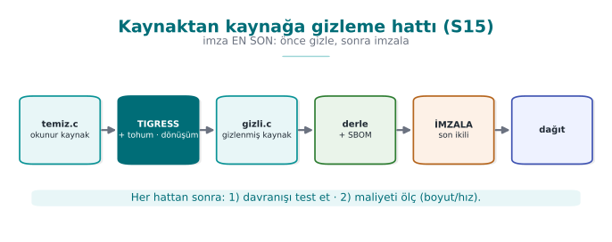

### What is a transform?

- **Transform:** a single obfuscation operation applied to the source (e.g., flattening).
- The tool offers many transforms; you choose which one, and where.

### Transform pipeline

- **Pipeline:** applying several transforms **in sequence**.
- Each transform is applied to the output of the previous one.
- Order matters.

### What is a seed?

- **Seed:** a starting number that governs randomness.
- Same transform + different seed = **different** obfuscated output.
- This is the key to diversification.

### Diversification

- **Diversification:** producing **behaviourally equivalent, structurally different** binaries from the same
  source.
- An attack written against one copy does not work on another (week 9, Rule 2).

### What is a CLI (command line)?

- **CLI (Command-Line Interface):** an interface where you run things by typing commands.
- Tigress is a CLI tool: `tigress --Transform=... dosya.c`.

### Unit test

- **Unit test:** a small test that automatically checks that a function works correctly.
- The same tests must pass **after** obfuscation (behaviour must be preserved).

### CFG reminder

- **CFG (Control Flow Graph):** a diagram that turns basic blocks into nodes and transitions into edges.
- We measure the **potency** of obfuscation by the number of nodes/edges (week 9).

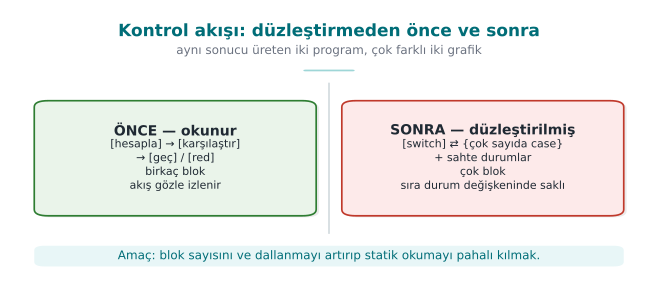

### Symbolic execution (briefly)

- **Symbolic execution:** automated analysis that solves program paths as mathematical constraints (e.g., KLEE).
- It is a **deobfuscation** method used against obfuscation; we test resilience with it.

### Now we're ready

Terms:

source-to-source · transform · pipeline · seed · diversification · CLI · unit test · CFG · symbolic execution

Now: what is Tigress, and how does it work?

### What are `objdump` and instruction/branch counting?

This week's demo script (`tigress-hatti.sh`) uses a tool called `objdump` to measure how much **a single function**
inside a binary has grown. Let's define it from scratch:

- **`objdump`:** a command-line tool that opens a binary file (`.exe`, ELF, ...) and dumps the **assembly
  instructions** inside it in human-readable form (part of the GNU Binutils package; comes preinstalled on
  Linux/WSL).
- **`objdump -d file`:** means "disassemble"; it converts the binary's **code section** from machine code to
  assembly and prints it.
- **Instruction count:** how many **lines** of instructions appear in a function's assembly output — each line is
  a single processor instruction such as `mov`, `cmp`, or `add`.
- **Branch/call count:** how many of these instructions are a **jump** (`jmp`, `je`, `jne`, ... starting with `j`)
  or a **call** — that is, how many points exist where the program decides to "go somewhere else."

The measurement function in the demo script does exactly this (`tigress-hatti.sh`, the `olc()` function):

```sh title="Ölçüm mantığı (tigress-hatti.sh içinden, kısaltılmış)"
objdump -d "$f" | awk '/<erisim_ver>:/{a=1;next} /^$/{a=0} a{n++; if($0 ~ /\t(j|call)/)b++} END{printf "%d komut, %d dal/cagri", n, b}'
```

Line by line, this is what it does: `objdump -d` converts the whole binary to assembly; the `awk` script reads only
the section that begins with the `<erisim_ver>:` label (the `a=1` flag), and stops when it reaches a blank line
(the end of the function, `a=0`); it adds every line it reads to the `n` counter, and if a line has `j...` or
`call` after a tab, it also increments the `b` counter. Result: **how many instructions belong to that function,
and how many of them are branches/calls.**

This number is the **automatic and finer-grained** counterpart of the "basic block" and "CFG node/edge" count we
measured by hand in week 9: week 9 drew the CFG from source code by hand and counted nodes/edges (see week 9,
section 0, the `denetim` function example: 3 nodes, 2 edges); here we count the same idea **on the compiled
binary**, automatically, with a tool. Both ask the same question: *"how much work is it to read/analyse this
function?"*

!!! tip "Why isn't instruction count enough on its own — why do we also need the branch count?"
    Adding only **plain, non-branching** instructions to a function (e.g., a few unnecessary `mov`s) increases the
    instruction count but doesn't make the analyst's job much harder — a flat list is easy to read. The real
    difficulty comes from an increase in the **branch count**: every new branch is a **new path** the analyst has
    to trace (recall section 7's cyclomatic complexity formula, `branch_count + 1`). This is why the measurement
    always reports **both together**; giving only the instruction count is an incomplete measurement.

### What are CI (continuous integration) and the build pipeline?

- **CI (Continuous Integration):** a system that runs build, test, and (in this course's context) obfuscation
  steps **automatically** on every code change (e.g., GitHub Actions, GitLab CI, Jenkins).
- **Build pipeline:** the **sequence of ordered steps** from source code to a deployable product: build → test →
  obfuscate (if applicable) → sign → package.

This term comes up again in section 9 ("Placing obfuscation into the build and deployment pipeline"): obfuscation
should not be a separate, manually run step, but **part of CI** — so that every release is automatically
obfuscated, tested, and measured; nothing gets forgotten.

### Build identity and the hash value (briefly)

- **Build identity (version identity):** a label that shows **exactly which state** of a piece of software is
  being evaluated/deployed (e.g., `v3.2.1`).
- **Hash value:** a fixed-length number computed from a file's content, **unique** to that content (e.g.,
  SHA-256). If the content changes by even one bit, the hash changes completely.

These two concepts are the building blocks of week 12's **TOE (Target of Evaluation)** identity: week 12 defines a
product's TOE identity as the quadruple "version + binary + source code + hash value" and stresses that just
saying "version 3.2.0" is **not enough** — because two binaries compiled with the same version number but a
different compiler flag can behave **differently**. The obfuscation + diversification we learn this week **makes
this warning even stronger**: two binaries produced from the same source, with the same version label, but
different seeds, are **deliberately different** — which is why section 9 will record each release's seed and hash
value **separately**.

### What is the Tigress environment (`--Environment`)?

- **`--Environment`:** the flag that tells Tigress the target platform; it specifies the processor architecture,
  operating system, and compiler version (in the demo script: `--Environment=x86_64:Linux:Gcc:11` → 64-bit
  Intel/AMD architecture, Linux, GCC version 11).
- Why is it needed? Some transforms (especially virtualisation and low-level opaque-predicate kinds) must know
  **compiler-specific** details; source generated with the wrong environment information may **fail to compile**
  on the target machine, or may behave incorrectly.

### What is a transform dependency (briefly)?

- **Transform dependency:** the fact that some transforms can only run if **another transform has already run
  first** (e.g., `AddOpaque` needing `InitOpaque` — we'll see this in detail in section 3).
- This means that section 4's "order matters" rule is sometimes not just about *improving the result*, but about
  being a *precondition for the transform to work at all*.

### Quick glossary: this week's new English terms

The following are added this week to week 9's glossary (Obfuscation, Reverse engineering, Decompiler, ...); you
will meet these terms by these English names in Tigress's official documentation and on the command line:

| Term (as used this week) | Full form / as seen in tools & papers |
| --- | --- |
| Source-to-source (obfuscation) | Source-to-source (obfuscation) |
| Transform | Transform |
| Transform pipeline | Transform pipeline |
| Seed | Seed |
| Environment (target platform) | Environment |
| Opaque predicate (init / add / update) | (Init / Add / Update) Opaque |
| Virtualisation-based obfuscation | Virtualization-based obfuscation |
| Continuous integration | Continuous Integration (CI) |
| Target of evaluation | Target of Evaluation (TOE) |
| Function splitting / merging | Split / Merge |
| Just-in-time code generation | Just-In-Time (Jit) |
| Random function/argument | Random functions / arguments |

### What is the difference between `diff` and `cmp`?

We'll use both in section 6; let's clarify the difference here:

- **`cmp`:** compares two files **byte by byte**, and only tells you "same or different" (and, optionally, the
  location of the first difference). It gives a **single** result for the whole file.
- **`diff`:** compares two text/source files **line by line**, and lists in detail which lines were
  added/removed/changed. For text broken into lines, such as assembly output, it is more **informative** than
  `cmp`.

Section 6's flow of "a coarse check with `cmp` first, then a targeted verification with `objdump`+`diff`" rests on
the idea that these two tools **complement each other**: `cmp` is fast but coarse, `diff` is slow but detailed.

### Additional terms: reinforcement

Together with the definitions above, our full term list for this section has now grown to:

`objdump` · instruction count · branch/call count · CI (continuous integration) · build pipeline · build identity ·
hash value · `--Environment` · transform dependency

We will use these terms again in sections 3, 7 (measurement), and 9 (the S15 pipeline); come back here if you get
stuck.

## 1. What is source-to-source obfuscation?

In week 9 we applied obfuscation rules **by hand**: opaque predicates, flattening, string encoding, dead branches.
Manual obfuscation is instructive, but it has three problems: (1) it is **error-prone** — hand-written obfuscation
code can break behaviour; (2) it is **hard to maintain** — the source becomes unreadable; (3) it **cannot be
diversified** — you cannot differentiate every copy by hand. The solution is to have a **tool** do the obfuscation.

!!! note "A short history: source-to-source obfuscation and diversification"
    - **1993** — Cohen introduces the idea of **diversification** with "program evolution": same function,
      different binary.
    - **1997** — Collberg et al.'s obfuscation taxonomy (the foundation of week 9).
    - **2013** — **Obfuscator-LLVM (O-LLVM)**: compiler-based obfuscation.
    - **2010s** — **Tigress** (Christian Collberg): a **source-to-source** obfuscator for C, plus virtualisation
      and diversification; the de facto standard for measuring resilience in research.
    - **2016–2017** — Banescu et al. **measure the resilience** of transforms with Tigress + KLEE → the
      "**resilience ↔ cost**" rule.

### Let's unpack the history a little more

- **1993 — Cohen, "program evolution":** Fred Cohen (the researcher who also gave the computer virus concept its
  academic definition) showed that a program's **structure could be changed automatically without changing its
  function**; this is the academic origin of the idea that "every copy should look different" — this week's
  diversification.
- **1997 — Collberg, Thomborson, Low:** they published the five-family taxonomy we use in week 9 today (layout,
  data, control flow, preventive, virtualisation) and the potency/resilience/stealth/cost framework; this paper is
  still the field's reference point, and it is the basis of this week's mapping table (section 3).
- **2013 — Obfuscator-LLVM (O-LLVM):** an open-source obfuscation pass added to the LLVM compiler infrastructure;
  it applies techniques such as flattening and opaque predicates **at compile time**, without a separate
  source-to-source step (week 9, K-11). Its difference from Tigress is that it operates on the compiler's
  intermediate representation (IR) rather than on source code — so you cannot view O-LLVM's output as "C source
  again"; it produces a binary directly.
- **2010s — Tigress:** Christian Collberg and his team turned the 1997 taxonomy into a **working source-to-source
  tool**; it became the de facto test platform for academic resilience research (including the Banescu study
  below) — so learning Tigress this week means learning not just a tool, but the field's **shared measurement
  language**.
- **2016–2017 — Banescu et al.:** they systematically **broke** the transforms Tigress produces using KLEE, and
  measured how long each transform combination took to solve; this is the **experimental evidence** for the
  "resilience ↔ cost" relationship we will revisit in section 7 this week.

These five points are, in fact, parts of a single line: **idea (1993) → classification (1997) → two different
implementation routes: compiler-based (2013) and source-to-source (2010s) → the scientific testing of that
implementation (2016–2017).** This week we apply the **last two steps** of that line (using Tigress, and
understanding how to evaluate it with Banescu's method — section 7).

**Source-to-source** obfuscation means a tool takes **C source as input and produces C source again**; the
generated source is behaviourally identical but far harder to read, and it is compiled with your normal compiler.
The best-known tool for this approach is **Tigress**.

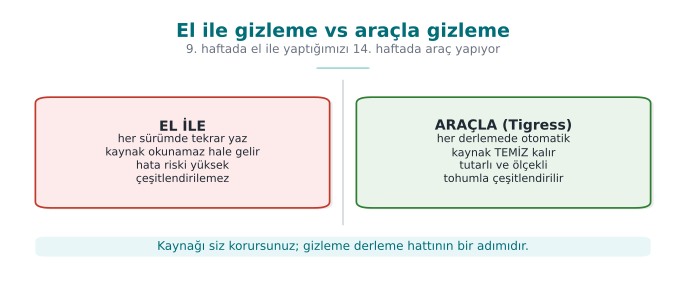

The important difference: you keep and maintain the **readable** source; obfuscation runs as an automatic step
**in the build pipeline**. This largely solves week 9's "every obfuscation brings a maintenance cost" problem: the
maintenance cost stays with the readable source, while the distributed source is obfuscated.

### What is Tigress, and where does it fit?

Tigress is a **source-to-source C obfuscator and diversifier** developed by Christian Collberg and his team at the
University of Arizona. Its place in this course:

- It is the **automatic counterpart of week 9's manual rules**: flattening, opaque predicates, data encoding,
  virtualisation — each as a transform.
- It is cross-platform (Linux, macOS, Windows, Android; Intel/ARM/WebAssembly) and works with GCC/Clang/MSVC.
- Its current version is **v4**.

!!! warning "License and use in the course"
    Tigress is free for **non-profit** (academic/research) use; **commercial** use requires a license from the
    University of Arizona. Its source code is not open; researchers may request access to an encrypted source.
    This is why **the course does not distribute a Tigress binary or an old version.** Students download the
    current version themselves from the official site (`tigress.wtf`) and **verify the license terms there.** In
    assignments, Tigress is applied only to the student's **own** code, on the student's own machine.

### Why a tool, not by hand?

| Manual obfuscation (week 9) | Tool-based obfuscation (Tigress) |
| --- | --- |
| Instructive, shows the concept | Scales, used in production |
| Error-prone (can break behaviour) | Transforms preserve behaviour (tested) |
| Source becomes unreadable | Readable source stays with you |
| Diversification isn't feasible by hand | Automatic diversification via seed |
| Uniform, recognisable | Varies with the transform and seed combination |

!!! note "But a tool is not magic"
    Week 9's core rule applies here too: Tigress does not grant unbreakability either — it raises **cost**.
    Moreover, the patterns a well-known tool produces can become recognisable over time; that's why
    **diversification** (section 6) and **layered defence** (RASP, server-side checks) are still essential.
    Tigress itself is also the main subject of research (section 7) that measures how much the transforms rely on
    resistance to symbolic execution.


#### How much obfuscation for which code? (decision flow)

Obfuscating every function is both unnecessary and expensive: it increases size and running time, and makes
debugging harder. The decision is made with two questions. First, **is it sensitive** — code that interests an
attacker, such as license checking, key handling, or payment logic? If not, obfuscation isn't needed. If it is
sensitive, **how valuable is it** — for medium-value code, constant obfuscation, arithmetic transforms, flattening,
and opaque predicates are enough; for a high-value, **small** core, virtualisation is added on top (virtualisation
is slow, so it's applied only to small sections). In every case the result is **diversified**, **measured**,
**tested**, and the reasoning for the decision is written into the S9/S15 records.

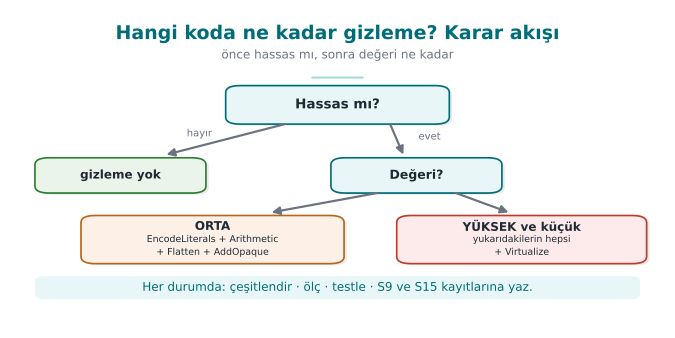

### Worked example: let's compare the same function by hand and with a tool

In week 9, when we applied rule K-07 (string encoding) **by hand**, the source code itself changed: instead of a
constant string, we wrote XOR'd bytes and a decode loop. Let's now do the same idea with a **source-to-source**
tool — the input and output are still both C, but you **don't write** the output, the tool produces it.

```c title="ÖNCE — temiz.c (K-07 uygulanmadan, elle yazılmış hâliyle aynı başlangıç noktası)"
int erisim_ver(const char *jeton) {
    if (jeton_gecerli(jeton)) return IZIN;   /* tek dal, tek dönüş: kolay hedef */
    return RED;
}
```

```c title="SONRA — kavramsal gösterim: EncodeLiterals uygulanmış gibi (gerçek çıktı sürüme göre değişir)"
int erisim_ver(const char *jeton) {
    /* IZIN ve RED artık düz sabit değil; çalışma anında bir kod-çözme adımından geçer.
       Fikir 9. haftadaki K-07 ile birebir aynıdır (bkz. 0x41 XOR 0x5A örneği); farkı
       çözme kodunu SİZİN değil, ARACIN üretmiş olmasıdır. */
    if (jeton_gecerli(jeton)) return _cozul_sabit_0x9F2A();  /* == IZIN, ama kaynakta IZIN yazmıyor */
    return _cozul_sabit_0x117C();                            /* == RED */
}
```

The second block **is not real Tigress output** — the generated code changes with the version, compiler, and
`--Seed` value; it is only meant to show the **idea** of EncodeLiterals (just like this document's other
"conceptual flow" blocks show the syntax of the commands without claiming to be real output). The important
**difference** is this: in week 9, you would write a function like `_cozul_sabit_0x9F2A()` by hand, test it by
hand, and write it **again** each time you moved to the next function. Here, the tool applies this step
automatically to every function you mark with `--Functions=erisim_ver`.

!!! danger "Common mistake: hand-editing the `gizli.c` file that Tigress produces"
    A developer who opens an obfuscated source file (`gizli.c`) wanting to "fix a line" or "make it a bit more
    readable" breaks two things: (1) the hand-made change **disappears** on the next obfuscation run (the tool
    regenerates it from `temiz.c`), (2) it can break the internal structure the transform assumes (e.g., the
    interdependence of the flattened `switch` state values), which can **break the behaviour**. **Rule:** edit
    only `temiz.c` (the original, readable source); `gizli.c` is always a **regenerated, hands-off** output — just
    as you would never hand-edit the `.o` file a compiler produces.

### How much time does it save? A rough comparison (hypothetical)

Let's also look at the why-a-tool question from a time perspective. The numbers below are **hypothetical**, meant
only to show the order of magnitude:

| | By hand (week 9's method) | With a tool (Tigress) |
| --- | --- | --- |
| Applying K-07 to 1 function | ~15 minutes (write the encoding + decode function, test it) | ~1 minute (add `--Transform=EncodeLiterals --Functions=f`) |
| Applying the same rule to 10 functions | ~150 minutes (each one separate, error-prone) | ~1 minute (same flag, 10 names in the `--Functions` list) |
| Producing a second copy with a new seed | Not possible (you'd have to write it differently by hand each time) | ~seconds (change the `--Seed` value and rerun) |

The real gain here is a difference that grows **not linearly, but multiplicatively**: as the number of functions
increases, the manual method's cost grows proportionally, while the tool method's cost stays almost **constant**.
This is the practical reason behind section 9's recommendation to "add an obfuscation step to CI in S15."

### Worked example: a one-year maintenance scenario (hypothetical)

Let's spread the "how much time does it save?" table over a year. Say a product releases **12 versions in 12
months**, and on average **3 functions** newly become sensitive with each release (e.g., a new payment flow, a new
license check):

| | By hand (week 9's method) | With a tool (Tigress, inside CI) |
| --- | --- | --- |
| Monthly work per added function | ~15 minutes/function × 3 = 45 minutes | Adding 3 names to the `--Functions` list, ~2 minutes |
| Yearly total (12 months) | 45 × 12 = **540 minutes (9 hours)** | 2 × 12 = **24 minutes** |
| Diversification (a different seed per release) | Not done in practice (section 6's "common mistake") | Part of CI, **requires no extra effort** (section 9) |
| Risk of forgetting (a function skipping obfuscation) | High (tracked by hand) | Low (the `--Functions` list is visible in code review) |

This table is **hypothetical**, but it correctly reflects two real trends: (1) the manual method's cost grows
**linearly** with the number of functions and releases, while the tool method's cost stays **almost constant**
(the scaled-up version of the first table above); (2) in the manual method, the "risk of forgetting" is a real
security vulnerability — if a newly sensitive function skips obfuscation and it goes unnoticed in code review, it
can ship **completely unprotected**; in the tool method, this risk is reduced because the `--Functions` list is
itself an **auditable document**.

!!! success "Rule: make the `--Functions` list part of code review"
    When a new sensitive function is added, your code review process must **explicitly ask** "was this function
    added to the `--Functions` list?" — just like "was a unit test added for this function?" This is the
    obfuscation-specific counterpart of week 12's rule that "every change requires an impact analysis."

## 2. Basic flow: obfuscating a program step by step

Tigress runs from the command line: you tell it which transforms to apply, to which functions, and in what order;
the output is an obfuscated C file. Conceptual flow (the syntax may change with the version — verify against the
official documentation):

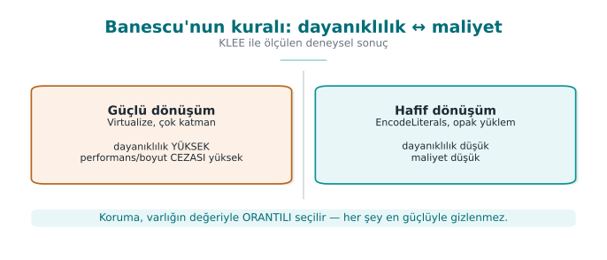

```bash title="Kavramsal akış (tek dönüşüm)"
# girdi: temiz.c  → çıktı: gizli.c  (sonra normal derlenir)
tigress --Transform=Flatten --Functions=erisim_ver \
        --out=gizli.c temiz.c
cc -o program gizli.c
```

The three ideas here are the foundation of all Tigress usage:

1. **`--Transform=...`** says which transform to apply (Flatten = control-flow flattening, week 9 K-04).
2. **`--Functions=...`** says **which functions** the transform applies to — because we apply obfuscation only to
   sensitive functions (the cost rule).
3. The output is C again; you compile it **with your own compiler**. Obfuscation is a step added to the build
   pipeline.

### Why is `--Functions` so important? Let's compare selective and blanket obfuscation

A flag like `--Functions=erisim_ver` means "apply only to this function." Let's consider the opposite —
obfuscating **every** function in a file — and compare the two approaches:

| | Selective (`--Functions=erisim_ver`) | Blanket (the whole file) |
| --- | --- | --- |
| Cost | Only the sensitive function | Every function (most aren't sensitive) |
| Debugging | Easy: unobfuscated code stays readable | Hard: the whole program is obfuscated, even logs are unreadable |
| Value/cost ratio | High (the goal of section 0's decision flow) | Low — you protect an unnecessarily large surface |
| Writing a rationale in S9/S15 | Easy: "this function, for this reason" | Hard: "I obfuscated everything" is not a rationale |

!!! danger "Common mistake: thinking 'if I don't specify `--Functions`, it's more secure'"
    If the `--Functions` flag is **skipped** (or every function name in the file is unthinkingly added to the
    list), the transform is also applied to non-sensitive helper functions such as `main`. This means skipping
    section 0's decision flow (is it sensitive, how valuable is it); the result is **not more secure, just a
    bigger and slower** program. **Rule:** always fill in the `--Functions` list **deliberately and with a
    rationale**; don't expand it on the logic of "it might come in handy."

### End to end: let's read the `tigress-hatti.sh` script line by line

To make the conceptual flow concrete, let's read this week's real demo script
(`code/week-14/01-kaynaktan-kaynaga/tigress-hatti.sh`) from start to finish, step by step. The script consists of
four steps; let's go through all of them without skipping any.

**Step 0 — Setup.** The script first moves into the folder it's running from (`cd "$(dirname "$0")"`) and picks a
compiler (`CC=cc`, falling back to `gcc` if not found). This guarantees that the script will be **self-sufficient**
no matter which machine it runs on — an example of the "resolve environment differences inside the script" habit
we have seen since week 1.

**STEP 1 — Build and run the clean version.**

```sh
"$CC" -O2 -o ornek_temiz ornek.c && ./ornek_temiz "CEN429-OK" && ./ornek_temiz "yanlis"
```

This line compiles `ornek.c` (the actual file containing the `erisim_ver` function we defined in section 0) **with
no obfuscation applied**, and runs it twice: once with the correct token (`CEN429-OK`), once with the wrong token
(`yanlis`). Expected output:

```text title="Beklenen çıktı — ADIM 1"
erisim_ver("CEN429-OK") = IZIN
erisim_ver("yanlis") = RED
```

This is the **reference behaviour before obfuscation** — the correctness of every obfuscation done in section 3
and after is tested by comparing it against these two lines (was the behaviour preserved?).

**STEP 2 — Checking for Tigress and the transform pipeline.** The script first checks whether Tigress is installed
with `command -v tigress`. **There are two paths:**

=== "If Tigress is installed"

    ```sh title="Betiğin çalıştırdığı gerçek komut (tigress-hatti.sh içinden)"
    tigress --Environment=x86_64:Linux:Gcc:11 \
            --Transform=EncodeLiterals --Functions=erisim_ver \
            --Transform=EncodeArithmetic --Functions=erisim_ver \
            --Transform=Flatten --Functions=erisim_ver \
            --Transform=InitOpaque --Functions=main \
            --Transform=AddOpaque --Functions=erisim_ver --AddOpaqueKinds=call \
            --out=gizli.c ornek.c
    ```

    This single command applies **five** transforms in sequence (the subject of section 4): first strings/constants
    are encoded (`EncodeLiterals`), then arithmetic is encoded (`EncodeArithmetic`), then control flow is flattened
    (`Flatten`), then the infrastructure needed for opaque predicates is prepared on the `main` function
    (`InitOpaque` — a preparation transform in Tigress that must be called once before adding opaque predicates),
    and finally call-based opaque predicates are added to `erisim_ver` (`AddOpaque --AddOpaqueKinds=call`). The
    `--Environment` flag specifies the target platform (here, 64-bit Linux, GCC 11); for some transforms Tigress
    needs to know compiler-specific details (the "Tigress environment" definition in section 0).

    The obfuscated source is then compiled normally (`"$CC" -O2 -o ornek_gizli gizli.c`), and its behaviour is
    compared in **STEP 3**.

=== "If Tigress is not installed"

    The script does not raise a real error; instead it prints installation/license instructions and points the
    student to week 9's **manual** working demo:

    ```text title="Beklenen çıktı — Tigress yoksa (tigress-hatti.sh'nin gerçek metni)"
    ADIM 2 - Tigress KURULU DEGIL.
      Tigress'i resmi siteden indirin: https://tigress.wtf
      Lisans: kar amaci gutmeyen (akademik) kullanim UCRETSIZ; ticari icin Arizona Univ. lisansi.
      Kurulumdan sonra 'tigress' PATH'te olunca bu betik hatti otomatik uygular ve olcer.

      Tigress olmadan bile: ayni kurallarin EL ILE surumu ve olcumu week-09'da CALISIR:
        cd ../../week-09/01-manuel-gizleme && sh demo.sh
    ```

    This is a concrete application of this course's general principle: **if the tool is missing, the lesson
    doesn't stop** — it switches to the manual working version of the same concept.

**STEP 3 — Verify behaviour.** If Tigress was found, the script does this:

```sh
[ "$(./ornek_temiz CEN429-OK)" = "$(./ornek_gizli CEN429-OK)" ] && echo "  ✓ ayni cikti" || echo "  ✗ FARK"
```

It compares whether the clean and obfuscated versions produce **the same output for the same input**. If
`✓ ayni cikti` isn't printed, the obfuscation pipeline has broken the behaviour — this is the script's counterpart
of section 4's "order and test rule."

**STEP 4 — Diversification.** Two separate binaries are produced with two different seeds (`--Seed=1001`,
`--Seed=2002`) and compared byte by byte with `cmp -s A B`; if the two differ, the script prints
`✓ iki tohum farkli ikili uretti`. This is the subject of section 6.

!!! success "Rule: verify the output after running each step; don't move on without seeing the result"
    The script's four steps are deliberately **dependent** on each other: if STEP 2 doesn't run, there is no
    `ornek_gizli` for STEP 3 to compare; if STEP 3 prints "✗ FARK", the binaries STEP 4 diversifies are already
    **faulty**. The same discipline applies in your own project: after running a transform pipeline, **first
    verify behaviour**, then measure cost, then diversify — skipping the order means you notice the error late.

### `--out`, and obfuscating several functions at once

The `--out=gizli.c` flag specifies **which file** the generated obfuscated source is written to; if not specified,
Tigress uses a default name (verify against the official documentation). All the examples we've seen this week
have focused on a **single** function (`erisim_ver`); but `--Functions` can take a **list**. Say your project has,
alongside `erisim_ver`, a function called `anahtar_turet`, and both are sensitive:

```bash title="Kavramsal: aynı dönüşümü iki fonksiyona birden uygulamak"
tigress --Transform=Flatten --Functions=erisim_ver,anahtar_turet \
        --Transform=AddOpaque --Functions=erisim_ver,anahtar_turet \
        --out=gizli.c proje.c
```

`--Functions=erisim_ver,anahtar_turet` (a comma-separated list) applies **the same** transform to both functions.
This is the concrete syntax for section 1's "applying the same rule to 10 functions" comparison: in the manual
method you'd have to write separate encoding for each function; here it's enough to add one more name to a single
flag.

!!! note "Different functions may need different transforms"
    `erisim_ver` and `anahtar_turet` might not be at the same **value** level — perhaps `anahtar_turet` is more
    critical and also needs Virtualize, while `erisim_ver` is satisfied with Flatten+AddOpaque (the decision flow
    from section 1). In that case, instead of applying **the same thing to all of them** in a single command, you
    use **a separate `--Transform`/`--Functions` pair for each function** (or a separate Tigress call); the
    assumption of "one pipeline for everyone" is an extension of section 2's "why is `--Functions` so important"
    discussion — selectivity applies not only to *which* functions, but also to *how much* obfuscation.

---

## 3. Transform families and mapping onto week 9's rules

Tigress transforms correspond to the obfuscation families we saw in week 9. The table below gives the most
commonly used transforms and their counterparts in the course (transform names should be verified against the
official documentation; there may be small differences between versions):

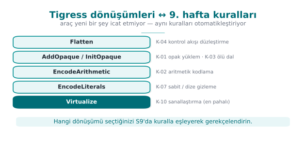

| Tigress transform | What it does | Week 9 counterpart |
| --- | --- | --- |
| **Flatten** | Flattens control flow (switch dispatcher) | K-04 control-flow flattening |
| **InitOpaque / AddOpaque / UpdateOpaque** | Adds opaque predicates; bogus branches | K-01 opaque predicate, K-03 dead branch |
| **EncodeArithmetic** | Replaces arithmetic operations with equivalent, complex expressions (MBA) | K-02 arithmetic encoding |
| **EncodeLiterals** | Encodes constants and strings | K-07 string encoding, K-08 constant transform |
| **EncodeData** | Encodes the representation of variables | K-09 variable splitting/encoding |
| **Split / Merge** | Splits / merges functions (obscures structure) | K-06 call/structure hiding |
| **Virtualize** | Turns a function into a custom VM bytecode | K-10 virtualisation |
| **Jit** | Generates code at run time (dynamic) | K-12 dynamic (concept) |
| **AntiBranchAnalysis / AntiAliasAnalysis / AntiTaintAnalysis** | Makes static analysis techniques harder | Preventive family |
| **RandomFuns / RndArgs** | Adds random functions / bogus parameters | Diversification, K-06 bogus parameter |

!!! tip "Families and cost"
    Think about these transforms in week 9's cost order: EncodeArithmetic/EncodeLiterals are **cheap**; Flatten and
    opaque predicates are **moderate**; Virtualize is **expensive** (tens of times slower). That's why you apply
    Virtualize only to the most critical, small functions — selecting the target with `--Functions` in Tigress
    exists exactly for this.

### Worked example: let's map K-01 onto a Tigress transform, step by step

Let's not leave the mapping table abstract; let's connect K-01 (week 9, opaque predicate/loop) end to end to
Tigress.

1. **Week 9's definition:** K-01 is adding a bogus branch with a condition (opaque predicate) whose truth value is
   **constant** but **looks uncertain** to the attacker — example: the expression `((x*(x+1)) & 1) == 0` is
   *always* true (because `x*(x+1)` is the product of two consecutive integers, one of which is always even), but
   seeing this is not instant for a human.
2. **Its counterpart in Tigress is two steps, not one:** as seen in the demo script's real command, first
   `--Transform=InitOpaque --Functions=main` runs, **then** `--Transform=AddOpaque --Functions=erisim_ver
   --AddOpaqueKinds=call`. `InitOpaque` prepares the **hidden state variables** the opaque predicates will rely on
   (usually initialised inside `main`, as we saw in section 2); `AddOpaque` uses that state to add the real opaque
   conditions to the target function (`erisim_ver`). `--AddOpaqueKinds=call` selects the **kind** of opaque
   predicate to add (here, a "call"-based kind).
3. **Result:** K-01's definition of a "constant-true but uncertain-looking condition" matches exactly the
   conditions `AddOpaque` produces; `InitOpaque` shows the fact that K-01 isn't enough on its own — it requires a
   **preparation** step.

!!! danger "Common mistake: skipping the `InitOpaque` step and running `AddOpaque` directly"
    A student trying to shorten the transform pipeline might write only `--Transform=AddOpaque
    --Functions=erisim_ver` and skip the `InitOpaque` step. This either raises an error, or produces an
    **unexpected** result because the state structure the opaque predicates depend on is missing. **Rule:**
    transforms can have **dependencies** between them (in this demo, `InitOpaque` → `AddOpaque`); don't assume a
    transform is "enough on its own" without reading the official documentation. This shows that section 4's
    "order matters" rule extends beyond just *which order*, to *which transform requires which transform* (the
    "transform dependency" definition in section 0).

### Worked example: let's map K-07 onto `EncodeLiterals`

Let's repeat the same steps for K-07 (string encoding), since this rule is also used in the demo script:

1. **Week 9's definition:** K-07 means **not leaving** a string like `"CEN429-OK"` as **plain text** in the
   binary; storing it with a reversible encoding such as XOR and decoding it only at the moment of use (recall the
   `0x41 ^ 0x5A` example from section 0 — see week 9, section 0).
2. **Its Tigress counterpart:** `--Transform=EncodeLiterals --Functions=erisim_ver`. This transform encodes the
   constant strings and numeric constants in the target function, and generates code that decodes them at run
   time — the automated counterpart of K-07's "hand-written" form (the "BEFORE/AFTER" example in section 2).
3. **Verification:** a `strings` check like the one in the demo script (as in week 9's demo) verifies that the
   text `CEN429-OK` is **no longer visible** in the obfuscated binary; this is K-07's "success criterion."

These two examples (K-01 → `InitOpaque`+`AddOpaque`, K-07 → `EncodeLiterals`) show how to read the rest of the
table too: for each row, **first recall week 9's definition, then find which flag(s) produce it, then identify a
way to verify it.**

### Worked example: let's see how `Flatten` applies K-04, in code

After K-01 and K-07, let's make the table's most powerful control-flow transform — `Flatten` — concrete at the code
level. Let's take section 2's `erisim_ver` as our base:

```c title="ÖNCE — erisim_ver (düzleştirilmemiş)"
int erisim_ver(const char *jeton) {
    if (jeton_gecerli(jeton)) return IZIN;
    return RED;
}
```

```c title="SONRA — kavramsal gösterim: Flatten uygulanmış gibi (gerçek çıktı sürüme/derleyiciye göre değişir)"
int erisim_ver(const char *jeton) {
    int _durum = 7341;          /* dağınık, öngörülemez başlangıç durumu */
    int _sonuc;
    while (1) {
        switch (_durum) {
            case 7341:
                _durum = jeton_gecerli(jeton) ? 2098 : 5560;   /* karar burada gizlendi */
                break;
            case 2098:
                _sonuc = IZIN;
                _durum = 9999;
                break;
            case 5560:
                _sonuc = RED;
                _durum = 9999;
                break;
            case 9999:
                return _sonuc;
        }
    }
}
```

This second block, too, **is not real Tigress output**; it only shows the **idea** of `Flatten`. Note three
points:

1. **The original `if`/`return` structure is gone**; in its place is a `switch` **dispatcher** inside a single
   `while(1)` loop. In a decompiler, this loop is **not instantly readable** the way `if (jeton_gecerli(...))` was.
2. **The state constants** (`7341`, `2098`, `5560`, `9999`) are **scattered, not sequential** — this is the
   concrete counterpart of the earlier note that "values should be produced with K-02, or as random, scattered
   constants"; sequential constants (`1, 2, 3, 4`) are instantly recognised in a decompiler as the signature of "a
   flattened dispatcher."
3. **The branch count increased:** the original had a single `if` (1 branch point); the flattened version has 4
   `case`s inside the `switch` and the transitions between them — this is exactly the source of the "branch count
   only jumps at Flatten" observation in sections 5 and 7.

!!! danger "Common mistake: seeing the flattened code and thinking 'the logic is now completely gone'"
    Someone who looks carefully at the example above can still see that there are **two** exit states (`2098`→IZIN,
    `5560`→RED) and that the decision between them is made in `case 7341` — flattening **does not destroy** the
    logic entirely, it only **removes its direct visibility**. That's why week 9's K-04 rule doesn't consider
    Flatten **sufficient on its own**; the state constants themselves must also be encoded (with K-02) and the
    decision points hidden with opaque predicates (K-01) — this is exactly why this week's transform pipeline
    (`EncodeLiterals → EncodeArithmetic → Flatten → AddOpaque`) uses four transforms together.

### Let's unpack the transforms one by one: the idea behind each row

Let's unpack the table's ten rows in order, referring back to their week 9 definitions. For each one we answer
three questions: **what it does, which K rule it automates, and when it's preferred.**

**1. `Flatten` — control-flow flattening.** Turns a function's `if`/`else`/loop structure into a `switch`
**dispatcher** inside a single `while` loop; every original block becomes a `case`, and transitions between blocks
are done by changing the `case` number. It is the exact automatic counterpart of week 9's K-04 (section 5, "RULE
K-04 — Control-flow flattening"). As we saw in section 5's `erisim_ver` example, it's a **moderate**-cost,
**moderate-to-high**-potency first step for easy targets like "single branch, single return."

**2. `InitOpaque` / `AddOpaque` / `UpdateOpaque` — the opaque predicate family.** The automatic form of K-01
(opaque predicate/loop). Splitting it into three separate commands is deliberate: `InitOpaque` **prepares** (sets
up state variables, usually in `main`), `AddOpaque` **adds** (places the real conditions into the target function),
and `UpdateOpaque` is used to **update/diversify** opaque structures that have already been added (across multiple
obfuscation rounds). We detailed this above.

**3. `EncodeArithmetic` — arithmetic encoding (MBA).** The automatic form of K-02 (week 9, section 6: "encoding
arithmetic instructions"); it turns a simple operation like `a + b` into a **mixed boolean-arithmetic** expression
that gives the same result but is hard to read (recall week 9's `(a^b) + 2·(a&b) = a+b` example). It is **low**
cost; but week 9's warning that "MBA can be undone with simplifiers" applies here too (section 7).

**4. `EncodeLiterals` — constant and string encoding.** The automatic form of K-07 (string encoding); we covered it
in detail above. **Very low** cost, but **weak** on its own (it is exposed in memory while running — week 9's
"obfuscation does not store a key" warning).

**5. `EncodeData` — variable representation encoding.** The closest automatic counterpart of K-09 (week 9, section
6: "variable splitting, merging, and array restructuring"); it changes a variable's **representation** in memory
(e.g., a split/encoded structure instead of a single 32-bit integer). The goal is that the value does not appear
**directly** in a memory dump.

**6. `Split` / `Merge` — function splitting/merging.** Part of K-06 (week 9, section 5: "hiding function calls and
external library dependencies"); `Split` breaks a function into several smaller pieces, `Merge` combines several
functions into **one** large function. Both blur the function's **boundaries** — in a decompiler, this makes the
question "is this a single logical operation or a combination of several?" harder to answer.

**7. `Virtualize` — virtualisation-based obfuscation.** The automatic form of K-10 (week 9, section 7); it turns a
function into a custom virtual machine's bytecode. It is the **most expensive** row in the table (the "tens of
times slower" warning in the "Families and cost" box above); it is applied only to **small, critical** functions
(the decision flow from section 1, "Step 5" in section 5).

**8. `Jit` — run-time code generation.** The conceptual counterpart of K-12 (week 9, section 7: "self-modifying
code and dynamic encryption"); part of the code is generated **at run time, not compile time**. Week 9's warning
for K-12 (that it can conflict with the operating system's memory protections — DEP/NX, W^X) applies here too;
that's why it's marked "(concept)" in the table — it is **not applied** in this course, only recognised.

**9. `AntiBranchAnalysis` / `AntiAliasAnalysis` / `AntiTaintAnalysis` — the anti-analysis family.** The direct
automatic counterpart of week 9's "preventive" family (one of the five families in section 2); these three
respectively target and make harder the tools that perform **branch analysis**, **alias analysis**, and **taint
analysis** (techniques used by a decompiler or a symbolic executor). Concrete examples of K-06's note that
"targeting the analysis tools themselves is more laborious."

**10. `RandomFuns` / `RndArgs` — random function/parameter addition.** As we'll see in section 6's
"Diversification" note, these don't serve a single K rule on their own — they serve **diversification** and K-06's
"bogus parameter" idea: `RandomFuns` adds random, functionless (but real-looking) functions; `RndArgs` adds bogus
parameters to existing functions. Both, when **combined with a seed**, differentiate every copy.

!!! success "Rule: ask the three questions in order as you read each row"
    When you encounter a new Tigress transform (in the official documentation), repeat this section's discipline:
    **(1) which week 9 family does this belong to? (2) which K rule is closest? (3) is its cost low, moderate, or
    high?** These three questions let you place a transform you've never seen into the right **category** and the
    right **cost budget**.

### Worked example: how `EncodeData` splits a variable (conceptual)

Let's make `EncodeData`, the automatic counterpart of K-09 (week 9: variable splitting/merging), concrete. Say
there is an "attempt counter" variable inside `erisim_ver`:

```c title="ÖNCE — tek parça, doğrudan okunabilir bir değişken"
int deneme_sayaci = 0;
...
deneme_sayaci++;
if (deneme_sayaci > 3) return KILITLI;
```

```c title="SONRA — kavramsal gösterim: EncodeData uygulanmış gibi (gerçek çıktı sürüme göre değişir)"
struct { unsigned char alt; unsigned char ust; } _sayac_parcalari = {0, 0};
...
/* deneme_sayaci++ karşılığı: alt baytı artır, taşarsa üst baytı güncelle */
_sayac_parcalari.alt++;
if (_sayac_parcalari.alt == 0) _sayac_parcalari.ust++;
/* deneme_sayaci > 3 karşılığı: iki parçayı birleştirip karşılaştır */
if (((_sayac_parcalari.ust << 8) | _sayac_parcalari.alt) > 3) return KILITLI;
```

In a memory dump (e.g., pausing the program with a debugger and reading memory), instead of appearing as a
**single, whole 32-bit integer**, `deneme_sayaci` sits as two independent bytes, scattered inside a `struct` — this
matches exactly section 0's goal that "the value should not appear directly in a memory dump."

!!! danger "Common mistake: merging the pieces back together right after use and storing them"
    If a developer, out of performance concerns, caches `_sayac_parcalari` into **a single variable**
    (`int birlesik = (...) << 8 | (...)`) before every comparison and keeps that variable **for the whole
    function**, there is once again a single, whole, recognisable 32-bit block — K-09's advantage is lost (this
    matches exactly week 9's warning on the same topic). **Rule:** merge only at **the exact moment it's needed**,
    discard it right after use; don't keep a persistent "merged" copy.

### Worked example: how `Split` divides a function (conceptual)

Let's make the `Split` transform concrete too. Say `erisim_ver` performs two logical steps back to back: a length
check and a content comparison (exactly what the real `erisim_ver` in `ornek.c` does — the code in section 0).

```c title="ÖNCE — tek fonksiyon, iki adım art arda"
int erisim_ver(const char *jeton) {
    if (strlen(jeton) != strlen(GECERLI)) return 0;
    unsigned fark = 0;
    for (unsigned i = 0; i < sizeof GECERLI - 1; i++)
        fark |= (unsigned)((unsigned char)jeton[i] ^ (unsigned char)GECERLI[i]);
    return fark == 0;
}
```

```c title="SONRA — kavramsal gösterim: Split uygulanmış gibi (gerçek çıktı sürüme göre değişir)"
static int _adim_a(const char *jeton) {          /* yalnız uzunluk kontrolü */
    return strlen(jeton) == strlen(GECERLI);
}
static unsigned _adim_b(const char *jeton) {      /* yalnız fark hesabı */
    unsigned fark = 0;
    for (unsigned i = 0; i < sizeof GECERLI - 1; i++)
        fark |= (unsigned)((unsigned char)jeton[i] ^ (unsigned char)GECERLI[i]);
    return fark;
}
int erisim_ver(const char *jeton) {
    if (!_adim_a(jeton)) return 0;
    return _adim_b(jeton) == 0;
}
```

The result is two new, generically named helper functions (`_adim_a`, `_adim_b`); a decompiler now sees **three**
separate symbols (recall the "symbol table" definition in section 0), and `erisim_ver` **itself** is now just two
calls — the actual logic has been **spread** across other functions. `Merge` does the exact opposite: it combines
several small functions into a single, large function; the result makes the question "is this one operation, or
the sum of several?" harder in the reverse direction.

!!! note "Why do function boundaries matter with Split?"
    A reverse engineer usually starts by drawing a "map" from function boundaries (name, number of parameters,
    inputs/outputs — recall week 9's decompiler example in section 0). `Split` makes this **map itself**
    misleading: small, generically named functions like `_adim_a` and `_adim_b` can be numerous and small enough
    to distract an engineer's attention. This row's counterpart of K-06 (function hiding) is exactly this.

## 4. Transform pipeline: combining several transforms

Week 9's most important rule was "not a single technique, but together." In Tigress this means applying transforms
**in sequence** (as a pipeline). Every `--Transform` is applied to the previous one's output; order matters.

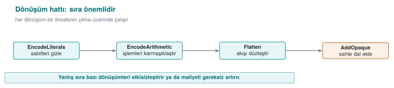

Signing comes **last** (obfuscate first, sign after); after every pipeline, **test the behaviour** and **measure
the cost**.

```bash title="Kavramsal hat (birden çok dönüşüm sırayla)"
tigress \
  --Transform=EncodeLiterals --Functions=erisim_ver \
  --Transform=EncodeArithmetic --Functions=erisim_ver \
  --Transform=Flatten        --Functions=erisim_ver \
  --Transform=AddOpaque      --Functions=erisim_ver \
  --out=gizli.c temiz.c
```

This pipeline first encodes the constants/strings of a single check (`erisim_ver`), then encodes its arithmetic,
then flattens it, then strengthens it with opaque predicates. The result is the automatic version of what week 9's
K-04 called "reinforced flattening."

!!! warning "Order and test rule"
    Transform order affects the result, and some orders unnecessarily hurt performance. **Rule:** after every
    transform pipeline, run the program's **unit tests** (was the behaviour preserved?) and measure size/speed.
    Obfuscation must never change behaviour; if it does, the pipeline is wrong. This connects directly to week 12's
    "S16 test results."

### Let's concretely compare two different orders

Let's not leave the sentence "order matters" abstract. Let's think through the same four transforms
(`EncodeLiterals`, `EncodeArithmetic`, `Flatten`, `AddOpaque`) in **two different orders**, and trace **what covers
what** in each order. The rule is simple but its consequences differ: **a transform can only transform what
already exists in the source at the moment it runs; it cannot see the new code a transform coming after it
produces.**

**Order 1 (this section's pipeline, the order the demo script uses):**

```text
EncodeLiterals → EncodeArithmetic → Flatten → AddOpaque
```

Because `EncodeLiterals` runs first, it only encodes the constants/strings **in the original source** (`ornek.c`).
When `Flatten` runs third, `EncodeLiterals` can **no longer see** the new state constants (`case 1`, `case 2`, ...)
that the flattened `switch` dispatcher **produces itself** — because that step has already passed. This is **not a
problem**, because Flatten already produces its own state values as scattered/unpredictable (the note in section 5:
"values should be produced with K-02, or as random, scattered constants" — here that job falls to Flatten itself).
The gain in this order is this: by the time `Flatten` runs, the arithmetic **inside** every `case` of the
dispatcher has already been complicated (thanks to `EncodeArithmetic`) — that is, the flattened code is hard to
read both in **structure** and in **content**.

**Order 2 (structural transforms first, encoding transforms after):**

```text
Flatten → AddOpaque → EncodeArithmetic → EncodeLiterals
```

Here `EncodeLiterals` is the **last step**; it can now see and encode not only the constants in the original
source, but also the state constants `Flatten` produced and the opaque condition constants `AddOpaque` added —
**a wider scope**. But it has a cost: since `EncodeArithmetic` also runs fourth, it must now encode arithmetic
**spread across** `Flatten`'s dispatcher logic and `AddOpaque`'s added conditions, not just a **single small
function**'s arithmetic — the transform's job grows, and so does the generated code and cost.

| | Order 1 (encode → structure) | Order 2 (structure → encode) |
| --- | --- | --- |
| What does `EncodeLiterals` cover? | Only the constants in the original source | Original + the new constants `Flatten`/`AddOpaque` produce |
| The arithmetic `Flatten` sees | Already encoded (harder-to-read `case` contents) | Raw, plain (easier-to-read `case` contents) |
| Expected cost | Moderate | Probably higher (later steps apply to a bigger surface) |

**Takeaway:** there is no single "correct" order; order is a **scope/cost trade-off**. This week we take Order 1,
the one the demo script uses, as our baseline because it is simple and predictable; but if you try a different
order in your own project, don't say "this order is better" without running section 7's measurement steps
**separately for each order** and comparing them — this is exactly what the "order and test rule" above means in
practice.

!!! danger "Common mistake: extending the pipeline only on the logic 'more transforms = more secure'"
    While placing four transforms in sequence is available, some students say "10 transforms is more secure" and
    repeatedly add more from the same family (e.g., several different opaque predicate transforms one after
    another). This both grows the cost unnecessarily, and some transform pairs can **cancel each other out** or
    just inflate size without any additional benefit. **Rule:** build the pipeline to include **one representative
    from each family** (control flow + data + preventive); add more than one transform from the same family only
    if it's justified by measurement (section 7).

### Worked example: what happens if the signing order breaks?

Let's test the "signing comes last" rule with a concrete scenario. Say a developer accidentally reversed the order:

1. `temiz.c` is compiled → `program` (unsigned).
2. `program` is **signed** → `program.imzali` (a digital signature, bound to the file's **current** byte content).
3. Then the "forgotten" obfuscation step is noticed; `gizli.c` is produced from `temiz.c`, recompiled, and the
   resulting new binary is copied **over** the old signed file.

Result: the new binary produced in step 3 is **different** from the byte content signed in step 2 (obfuscation can
change every byte of the file — recall the instruction count increase in sections 5/7). The verifying party (e.g.,
a loader, a store) finds the signature **invalid** and **rejects** the program — in a production environment, this
means "the release could not ship."

!!! danger "Common mistake: thinking 'I added obfuscation afterward, so recomputing the signature is enough'"
    When some teams notice this mistake, they think recomputing just the signature solves the problem —
    technically true (the new content matches the new signature), but the **process** is still wrong: this means
    the rule "signing must be the **last** step in CI" has become a manual exception that has to be remembered
    over and over. **Rule:** in the CI skeleton (section 9), the `sign` stage is **structurally** defined **after**
    the `obfuscate` and `measure` stages; keeping this order should be left not to human memory, but to **CI's own
    definition.**

## 5. Step-by-step example: reinforcing a check (synthetic)

Let's take a single synthetic access check and reinforce it layer by layer. The goal is to see what each step
**adds**, and **how much it costs**.

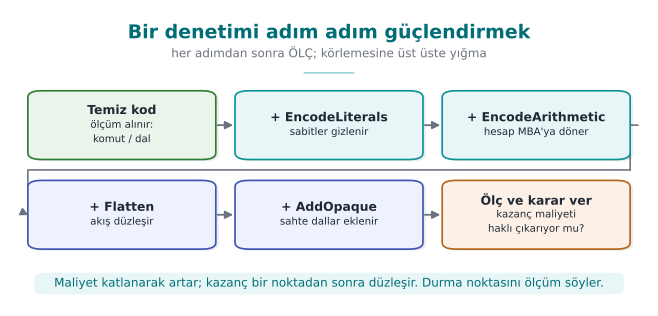

```c title="Başlangıç: temiz.c (okunur, korumasız)"
int erisim_ver(const char *jeton) {
    if (jeton_gecerli(jeton)) return IZIN;   /* tek dal, tek dönüş: kolay hedef */
    return RED;
}
```

| Step | Transform applied | What changes? | Cost |
| --- | --- | --- | --- |
| 0 | (none) | `strings`, single branch, bypassable with a single-byte patch | — |
| 1 | EncodeLiterals | `IZIN`/`RED` and strings no longer appear in plain form | Very low |
| 2 | EncodeArithmetic | The comparison/computation turns into a complex expression | Low |
| 3 | Flatten | The single branch is no longer visible; a switch dispatcher | Moderate |
| 4 | AddOpaque | Bogus branches and opaque conditions are added | Moderate |
| 5 | (Virtualize, only if needed) | The function turns into VM bytecode | High |

**Takeaway:** each step makes the attack a little more expensive; but each step also adds a cost. You decide where
to stop based on the value of the protected asset and the cost you measure (section 4). Step 5 (Virtualize) is
unnecessary for most checks; it's applied only to the most critical, small functions.

### Let's trace the step-by-step cost increase with a numeric example (hypothetical)

Let's fill the table above with numbers. The instruction/branch counts below are **hypothetical** (a real
measurement can't be taken while Tigress isn't installed); they are meant only to show the **order of magnitude**
of each step and **how the arithmetic is verified**. For real numbers, run `tigress-hatti.sh` while Tigress is
installed and read the `objdump` output the script prints (recall the "instruction/branch counting" definition in
section 0).

| Step | Instructions | Branches | Increase over previous step | Cumulative increase over step 0 |
| --- | --- | --- | --- | --- |
| 0 — clean | 22 | 2 | — | — |
| 1 — + EncodeLiterals | 30 | 2 | `(30−22)/22×100 ≈ 36.4%` | 36.4% |
| 2 — + EncodeArithmetic | 46 | 2 | `(46−30)/30×100 ≈ 53.3%` | `(46−22)/22×100 ≈ 109.1%` |
| 3 — + Flatten | 78 | 5 | `(78−46)/46×100 ≈ 69.6%` | `(78−22)/22×100 ≈ 254.5%` |
| 4 — + AddOpaque | 101 | 7 | `(101−78)/78×100 ≈ 29.5%` | `(101−22)/22×100 ≈ 359.1%` |

Three observations:

1. **The branch count only jumps at Flatten** (2 → 5): this is expected, because flattening logic, by nature,
   builds a multi-way `switch` dispatcher instead of a single `if` (the direct source of section 7's "potency"
   metric).
2. **The cumulative increase is not the sum of the step increases** — each percentage is added **multiplicatively**
   on top of the previous one (36.4% followed by 53.3% gives a total of 109.1%, not 36.4%+53.3%=89.7%). This is a
   common arithmetic mistake when computing percentages; compute each row with **its own denominator** (the
   previous step's number).
3. **A large cumulative number like 359%** is the **expected** result of stacking four transforms on top of each
   other; it should not be confused with the cost of a **single** transform (the real **82%** measured in week 9's
   hand-applied Flatten+AddOpaque example) — here four transforms are counted together.

!!! danger "Common mistake: applying Step 5 (Virtualize) on the logic 'since I'm here, let's add everything'"
    After seeing a cumulative cost like 359% in the table above, thinking "it's already grown a lot, let me also
    add Virtualize" is a common mistake. Virtualize is **many times** more expensive than the sum of the other four
    transforms (section 1's "Families and cost" box: "tens of times slower") — it is measured not in percentages,
    but in **multiples**. While a 359% growth for a check function is often acceptable, adding a further 10-50x
    slowdown on top is meaningless for most products. **Rule:** make the Virtualize decision separately; don't add
    it automatically on the logic "I already obfuscated it" — go back to section 1's decision flow (is it
    sensitive, how valuable is it).

### Worked example: a single transform, or four transforms together? A numeric comparison

Let's test section 1's rationale for "using them together" against the numbers above. What would have happened if
we'd applied **only a single transform** to the same `erisim_ver` function, versus what happened when we applied
four transforms **together** — let's put the two side by side (the numbers are taken from the table
above/hypothetical):

| Approach | Instructions | Branches | Cost increase (over step 0) | How many different analysis techniques are challenged? |
| --- | --- | --- | --- | --- |
| Only `EncodeLiterals` | 30 | 2 | 36.4% | Only static string scanning (`strings`) |
| Only `Flatten` (hypothetical, if applied on its own) | ~54 | 5 | ~145.5% | Only pattern recognition/CFG reading |
| Four transforms together (this week's pipeline) | 101 | 7 | 359.1% | String scanning **+** pattern recognition **+** MBA simplification **+** opaque-predicate solving |

The last column is the real point: applying only `EncodeLiterals` neutralises just **one** of the attacker's tools
(`strings`); the attacker can still read the control flow directly. Applying four transforms together requires the
attacker to defeat **four different** analysis techniques **at the same time** and in a **mutually dependent** way
(the numeric rationale for week 9's rule that "two weak layers together are stronger than one layer").

!!! success "Rule: report not the cost increase, but 'how many different techniques it challenges'"
    In your S9/S15, just saying "it grew 359%" is incomplete. As in the last column of the table above, also write
    which transform counters **which analysis technique** (read together with section 7's "measured against which
    tool" table). This shows an evaluator not just a number, but the **breadth of the defence**.

---

## 6. Diversification: different binaries from the same source

Recall week 9's "Rule 2 — break automation" principle: if an attacker can crack one copy and distribute the attack
to every copy, one crack opens everything. **Diversification** means producing **behaviourally identical but
structurally different** binaries from the same source. Tigress does this with a **seed**: if you run the same
transforms with different seeds, the opaque predicates, bogus branches, and flattening states vary from copy to
copy.

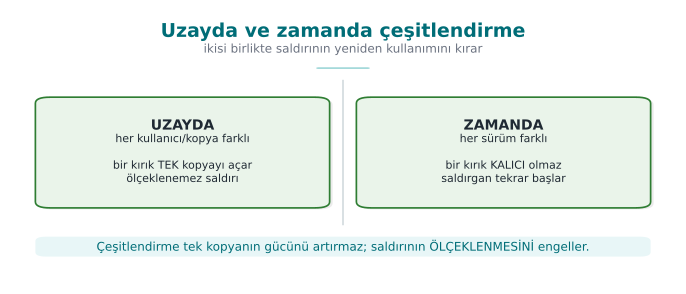

```bash title="Kavramsal: iki tohum, iki farklı ikili"
tigress --Seed=1001 --Transform=Flatten --Transform=AddOpaque \
        --Functions=erisim_ver --out=gizli_a.c temiz.c
tigress --Seed=2002 --Transform=Flatten --Transform=AddOpaque \
        --Functions=erisim_ver --out=gizli_b.c temiz.c
# gizli_a.c ve gizli_b.c aynı işi yapar; makine kodları farklıdır
```

Two kinds of diversification (from week 9):

- **Diversification in space:** distributing copies produced with different seeds to different users/devices. An
  automated attack written against one copy does not work on another.
- **Diversification in time:** producing every release with a new seed. An attack found against an old release
  breaks on the new one. This works together with your week 10 key/version renewal policy.

!!! note "Related transforms"
    In Tigress, `RandomFuns` adds random bogus functions and `RndArgs` adds bogus parameters; combined with a seed,
    every structure looks different. Diversification does not raise obfuscation's **potency** (it's still possible
    to crack one copy) but it prevents it from **scaling** — this distinction was week 9's core idea.

### Worked example: let's compare the binaries produced with two seeds, step by step

The demo script's STEP 4 does exactly this: it produces two separate `erisim_ver` builds from the same `ornek.c`
with `--Seed=1001` and `--Seed=2002`, compiles them, and compares them byte by byte with `cmp -s A B`. Let's trace
the steps one by one:

1. **Same source, two commands:**

   ```sh
   tigress --Seed=1001 --Transform=Flatten --Transform=AddOpaque --Functions=erisim_ver --out=a.c ornek.c
   tigress --Seed=2002 --Transform=Flatten --Transform=AddOpaque --Functions=erisim_ver --out=b.c ornek.c
   ```

   Note: the `--Transform` list is **exactly the same** in both (`Flatten`, `AddOpaque`); the only difference is
   the `--Seed` value.
2. **Compile:** `a.c` and `b.c` are compiled with the same compiler and flags (`-O2`) into two separate binaries
   (`A`, `B`).
3. **Compare behaviour (this first!):** both binaries must be run with the `CEN429-OK` input and verified to give
   the **same** output (`IZIN`) — diversification must **never** change behaviour (section 4's rule applies here
   too).
4. **Compare structure:** `cmp -s A B` compares the two files byte by byte; if `$?` (the exit code) is `0`, the
   files are **identical** (bad — it means diversification didn't work), if it's `1`, they are **different** (the
   expected result).

**Let's quantify the difference ratio (hypothetical, in a form similar to week 9's real 66.4% example).** Say the
flattened + opaque-predicate version of `erisim_ver` takes up **160 bytes** in both binaries; comparing byte by
byte, we measured that **96 bytes** came out different:

```text
fark_orani = degisen_bayt / toplam_bayt × 100
           = 96 / 160 × 100
           = %60
```

Interpretation: **60% of the two copies are different**, **40%** is shared (likely parts the compiler keeps fixed,
such as function entry/exit — the same reason for the remaining 33.6% in week 9's 512-byte example). The 66.4%
measured in week 9's manual diversification and the 60% Tigress produces this week with `--Seed` are **the same
order of magnitude** — this is expected, because both apply the same idea (changing structure with random
choices); the exact number will, of course, differ between hand-written and tool-generated code.

!!! danger "Common mistake: saying 'different, so diversification happened' without reading `cmp`'s output"
    `cmp -s A B` only tells you whether the files are **identical or not**; it does not show **what** is different.
    Two binaries can be different, but the difference might be in an **insignificant** spot only (e.g., a compile
    timestamp, uncompressed debug information); the protected function (`erisim_ver`) itself might have stayed the
    same. **Rule:** prove a diversification claim not just with `cmp`, but by comparing **the target function**
    itself separately (with section 0's `objdump` method, taking only what's under the `<erisim_ver>:` label).

!!! success "Rule: always record the seed"
    If you don't **record** the `--Seed` value you used to produce a binary, you can **never** produce that exact
    same binary again (this is a problem if you need to recompile that release for a debugging session). This is
    exactly why section 9's S15 pipeline rule says "every release is diversified with a seed; the seed and the
    build identity are recorded."

### Worked example: let's compare the target function directly instead of `cmp`

Let's apply the correct method the "common mistake" box above recommends. `cmp -s A B` only says "different/same";
to see whether the target (`erisim_ver`) itself is different, we apply section 0's `objdump` method **to both
binaries** and compare only that function's section:

```sh title="Kavramsal: yalnız hedef fonksiyonun bölümünü ayıklayıp karşılaştırma"
# Her iki ikiliden yalnız <erisim_ver>: etiketinin altını çıkar
objdump -d A | awk '/<erisim_ver>:/{a=1} a{print} /^$/{if(a)exit}' > erisim_A.asm
objdump -d B | awk '/<erisim_ver>:/{a=1} a{print} /^$/{if(a)exit}' > erisim_B.asm
diff erisim_A.asm erisim_B.asm | wc -l    # 0 ise hedef fonksiyon AYNI kalmış demektir
```

If `diff`'s output is **empty** (line count 0), this means the two seeds produced **no difference at all** in
`erisim_ver` — that is, section 6's claim (diversification happened) is **false**, and the difference `cmp` found
across the whole file was only in an insignificant spot (e.g., a compile timestamp). If `diff`'s output is
**non-empty**, the target function itself has really changed — only then can we say "diversification is proven."
This two-step verification (first "is something different?" with `cmp`, then "is the target itself different?"
with `objdump`+`diff`) **completes** the demo-script account at the start of section 6.

!!! success "Rule: write the claim and the verification command together"
    In your S9/S15, the sentence "I diversified with two seeds" is not enough on its own; also write, as above,
    **which command you verified it with**. This is another concrete application of week 12's "result, not plan"
    rule: a claim must be backed by a runnable command.

### How many users, how many seeds? Let's think about diversification in space at scale (hypothetical)

Let's make the "diversification in space" definition from the start of section 6 concrete with a deployment
scenario. Say a mobile application has **10,000** users, and **a different** seed is used for every install:

| Scenario | Number of seeds | Share of users a single crack affects |
| --- | --- | --- |
| No diversification (one binary, same for everyone) | 1 | 100% (10,000/10,000) |
| Weak diversification (only 2 fixed variants, e.g. `-O2`/`-O3`) | 2 | ~50% (cracking one variant affects **everyone** using that variant — the numeric counterpart of section 6's "common mistake" box) |
| Real diversification (a unique `--Seed` per install) | 10,000 | `1/10,000 = 0.01%` (only that **one** cracked copy) |

The calculation in the third row is simple: even if an attacker cracks a single copy and produces a byte patch
specific to that copy, the patch only works on binaries **produced with the same seed**; if every user has a
different seed, the patch works on no other copy. **These numbers are hypothetical** (the real impact also depends
on how well the attacker can generalise the patch — e.g., a patch that targets only a specific byte offset has an
even narrower effect, while one based on a behavioural pattern might be a bit wider); the goal is only to show the
relationship that "as the number of seeds grows, a crack's **spreading surface** shrinks."

### Worked example: let's trace diversification in time on a timeline (hypothetical)

Let's also make **diversification in time**, the twin of the "diversification in space" example above, concrete
with a release calendar. Say a product releases a new version every month, and every release is obfuscated in CI
(section 9's rule) with **a new seed**:

| Month | Version | Seed | Status |
| --- | --- | --- | --- |
| January | v1.0 | 1001 | Released |
| February | v1.1 | 4832 | Released; an attacker cracked v1.0 in mid-February (the byte patch spread) |
| March | v1.2 | 9214 | Released; February's patch **no longer works** (different seed, different structure) |

The "lifetime" of February's crack lasted only **one month** (from v1.1's release date to v1.2's release date) —
this is the numeric counterpart of section 1's "Rule 3 — buy the other layers time" principle. If the product had
**never changed** the seed (no diversification in time) and kept the same obfuscation structure even while adding
new features every month, February's crack would have stayed valid **indefinitely**.

This cycle's **cost is nearly zero**, because section 9's CI skeleton runs obfuscation + measurement + signing
**automatically** on every release (recall section 2's "tool or by hand" comparison); if diversification had been
done by hand, obfuscation would have had to be rewritten by hand every month — which would not have been
sustainable in practice at all.

!!! note "Is diversification in time enough on its own?"
    No — section 1's "Rule 3" says obfuscation **buys the other layers time**, not that it is a permanent solution.
    In the time it takes for the new release to ship at the end of the month, the attacker can still harm users who
    are on the February release. This is why diversification in time is used **together with** RASP (week 6,
    detecting an intrusion attempt at run time) and server-side checks (e.g., rejecting old/cracked releases).

## 7. Measuring obfuscation and diversification

In week 9 we learned to measure obfuscation along four dimensions (potency, resilience, stealth, cost). Tigress's
greatest teaching value is that it lets you make these measurements **concrete**: you obfuscate the same program
and measure it before/after.

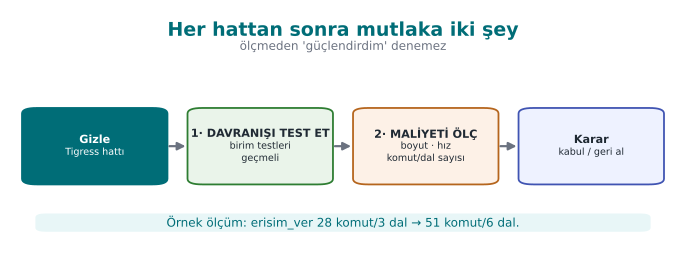

### Cost measurement (easy and mandatory)

Measure the following for every transform pipeline and write them into S9/S15:

| Metric | How | Expectation |
| --- | --- | --- |
| Binary size | `ls -l` / `size` | Obfuscation increases size |
| Running time | Run an operation many times and average it | Flatten/Virtualize slow it down |
| Source/CFG complexity | Basic block count in a decompiler (e.g., Ghidra) | An increase before/after |

```bash title="Basit maliyet ölçümü (kavram)"
size ./program_temiz ./program_gizli        # boyut farkı
# süre: aynı girdiyle N kez çalıştır, ortalamayı karşılaştır
```

### Resilience measurement (advanced, conceptual)

In week 9 we said resilience is "a measured quantity, not a claim." Tigress is at the centre of academic work on
this: the study by Banescu and colleagues measures how much Tigress's transforms resist **symbolic execution**
(like KLEE). The finding is an important rule for this course:

- A single transform (Flatten alone) can usually be undone with symbolic execution.
- **Combining** transforms and growing the state space (tying opaque predicates to structures that are expensive
  to solve) can make the solver's job exponentially harder.
- But this also raises the **cost**. That is, resilience and cost trade off exactly as we said in week 9.

!!! tip "Measurement rule (S9/S15)"
    Defend an obfuscation decision in your project not by calling it "strong," but **with a measurement**: "The
    Flatten + AddOpaque pipeline grew the binary size by X%, slowed the operation down by Y%; in return, the
    target function's basic block count rose Z-fold." Unmeasured obfuscation is, in the eyes of week 12's
    evaluator, a claim, not evidence.

### Let's complete the size and time measurement: adding to section 5's numbers

In section 5 we traced, step by step, the increase in a single function's (`erisim_ver`) instruction and branch
counts (a hypothetical 359.1% cumulative instruction increase, going from 2 branches at step 0 to 7 branches at
step 4). Let's now distribute these numbers across Collberg's four metrics (the table above) and also add **size**
and **time**.

**Potency, using week 9's cyclomatic complexity formula (`branch_count + 1`):**

```text
Adım 0 (temiz)  : 2 dal + 1 = 3
Adım 4 (tam hat): 7 dal + 1 = 8
Artış           : (8 − 3) / 3 × 100 ≈ %166,7
```

**Cost, the instruction-count increase from section 5:** we already computed it, **359.1%** (cumulative, four
transforms together).

**Size:** an important warning is needed at this point.

!!! danger "Common mistake: measuring the whole `.exe`/binary's size (`ls -l`) and concluding 'it barely changed'"
    In a **small, synthetic** program like this week's demo, the **total file size** measured with
    `ls -l ornek_temiz ornek_gizli` often comes out nearly the same — because most of the file (a few KB) consists
    of ELF/PE headers, dynamic linking tables, and references to the run-time library; a single small function
    growing by 79 instructions **gets lost in the statistical noise** next to this fixed overhead. Seeing this and
    concluding "obfuscation doesn't increase size" is wrong. **Rule:** in small/synthetic demos, for the size
    metric, measure **not the whole file, but the target function's own code size** (by converting section 0's
    `objdump` instruction count to bytes). In a real, large product (with hundreds of functions obfuscated), this
    effect becomes visible in the total file size too; it not being visible in a small demo is **expected**, not
    proof of an error.

**Time:** a similar warning applies to time — a single call to such a small function takes far less time than the
operating system's timer resolution (usually sub-millisecond); to see a meaningful time difference, you need to
call the function **a large number of times** (e.g., a million) in a loop and measure the total time:

```bash title="Kavramsal: süre ölçümü (çok sayıda çağrıyla anlamlı hâle getirme)"
# Sözde kod: gerçek ölçüm aracı platforma göre değişir (ör. `time`, bir kıyaslama döngüsü)
for i in $(seq 1 1000000); do ./ornek_temiz CEN429-OK >/dev/null; done   # zaman ölçülür
for i in $(seq 1 1000000); do ./ornek_gizli CEN429-OK >/dev/null; done  # zaman ölçülür, karşılaştırılır
```

Note: the loop above actually also measures the cost of **starting a new process** each time (`fork`/`exec`),
which can overshadow the real function time; in a real measurement, the function is called millions of times
**inside** a loop, in the same process, and only that loop's duration is measured. This distinction — "the cost of
starting a process" versus "the function's own time" — is a point that is often confused in small demos.

### Let's gather the four metrics in a single table

| Metric | Value for this week's demo | Source |
| --- | --- | --- |
| Potency | ~166.7% complexity increase (3→8) | The calculation above, branch count + 1 |
| Cost | ~359.1% instruction increase (22→101, four transforms together) | Section 5 |
| Resilience | Not measured in this demo; the subject of the subsection below | Below |
| Stealth | Not measured in this demo; requires statistical distinguishability | Week 9, section 9 |

!!! success "Rule: report all four, not just the easy one to measure"
    Week 9's warning "common mistake: measuring only cost and calling it 'strong'" applies here too. This demo
    gives only potency and cost **directly as numbers**; resilience and stealth need a separate tool (a symbolic
    executor like KLEE, or a statistical distinguishability test). Write all four into your S9/S15; also state
    clearly which two were **not measured** — this is a more honest sentence than "I didn't measure it": "not yet
    measured, can be measured with such-and-such a tool."

### Let's make resilience a bit more concrete: how does symbolic execution break the condition `AddOpaque` produces?

The section above said "resilience measurement (advanced, conceptual)" and referred to the Banescu et al. study;
week 9 walked through this mechanism step by step on a classic opaque predicate (`((x*(x+1)) & 1) == 0`). Let's
apply the same reasoning to a **tool-generated** opaque predicate — this week's subject (one of the conditions
Tigress's `AddOpaque` adds, conceptually):

1. A symbolic execution tool (like KLEE) runs the program not with **concrete** values, but by keeping the input
   as an unknown **symbol**.
2. When it reaches a branch `AddOpaque` has added, the question the tool has to ask is the same: *"does this
   condition give the same result for **every** value of the input, or is there an input that breaks it?"*
3. It hands this question off to a **constraint solver** (an SMT solver). If the condition `AddOpaque` produces
   rests on a **mathematically simple, well-known pattern**, like week 9's `x*(x+1)` example, the solver solves it
   in seconds and proves that branch is "dead" (never runs).
4. Result: being tool-generated does **not automatically** make an opaque predicate more resilient — the
   **mathematical structure** of the generated condition is still what determines this. This shows that week 9's
   warning that "not every technique resists every tool equally" also applies to Tigress's own output.

!!! note "So does Tigress add nothing at all?"
    It does add something — but its contribution isn't **making a single opaque predicate unbreakable**, it is (1)
    adding a large number of opaque predicates **automatically and consistently** (writing hundreds of predicates
    by hand isn't practical), (2) **diversifying** them with a seed (section 6), (3) **combining** them with other
    transforms (Flatten, EncodeArithmetic) — stacking individually weak layers to make the solver's job harder
    (week 9's rule that "two weak layers together are stronger than one layer"). So the gain comes **not from the
    mathematical strength of a single predicate, but from scale and combination**.

### Connection to week 12's measurement/evidence discipline

Week 12 taught that a security claim must be backed only by a **test result** (S16), that a "result, not a plan" is
expected; the same discipline applies here. This week's four-metric table (potency, resilience, stealth, cost)
should appear in your S9/S15 document not as a standalone **claim**, but as a **result** tied to its own
**evidence** (a measurement table, `cmp` output, a symbolic-execution attempt). Don't forget to also add to week
12's TOE identity (section 0) **which seed and which transform pipeline** produced the binary this measurement
table belongs to — otherwise an evaluator cannot tell which measurement describes which binary.

### Worked example: let's conceptualise the stealth metric

Recall week 9's entropy example (section 0: `[0x41,0x41,0x41,0x41]` is low-entropy, `[0x3F,0xA1,0x08,0xC7]` is
high-entropy). **Stealth** asks whether obfuscated code is **statistically distinguishable from normal code** —
and this distinguishability often comes precisely from a difference in entropy/density.

A hypothetical example: say a tool scanning a binary file measures the **branch-instruction density** in every
256-byte window:

| Region | Branch instructions per 256 bytes | Interpretation |
| --- | --- | --- |
| An ordinary helper function | ~8 | The expected range for a normal C function |
| `erisim_ver` (before obfuscation) | ~6 | Within the normal range |
| `erisim_ver` (after Flatten+AddOpaque) | ~34 | **Many times above** the normal range — draws attention |

Interpretation: the obfuscated `erisim_ver`'s branch density is **statistically markedly different** from the
file's other ordinary functions. Without having to scan the whole binary, an attacker can go **straight** to
`erisim_ver` just by looking for "abnormally branch-dense regions" — this means "stealth is dropping": while
potency and cost increase (section 7's first table), stealth has **decreased**.

### A numeric example: hypothetical solver time for different transform combinations

Let's show the **shape** of Banescu et al.'s method (not their real numbers) with a table; the times below are
**entirely hypothetical**, meant only to show the shape of the relationship "more layers = longer time for the
solver":

| Transform combination | Hypothetical solver time (with a KLEE-like tool) |
| --- | --- |
| None (clean code) | Instant (the branch is already open) |
| Only `AddOpaque` (a classic predicate) | Seconds (like week 9's `x*(x+1)` example) |
| `Flatten` + `AddOpaque` | Minutes (the dispatcher + the opaque condition must be solved together) |
| `EncodeArithmetic` + `Flatten` + `AddOpaque` | Hours (MBA simplification + CFG recovery + opaque predicate together) |
| The above + diversification (a different seed per copy) | Must **start over** for every copy — total attacker effort multiplies by the number of copies |

The last row is the reflection, on the resilience metric, of section 6's rule that "diversification doesn't raise
potency, it prevents scaling": the hours-scale solver effort spent on one copy must be spent **again from scratch
for the next copy** — because a different seed produces different opaque-predicate constants.

!!! warning "This table is not a real measurement"
    The times above are meant only to show **order of magnitude**; how long a real symbolic execution tool takes
    against a specific function varies hugely with the hardware, the tool itself, and the transform's exact
    configuration. If you use a table like this in your S9/S15, **actually run and measure** the numbers; otherwise
    clearly mark them "hypothetical" (as we have done throughout this week).

!!! danger "Common mistake: thinking 'the more I obfuscate, the better'"
    The large percentages in sections 5 and 7 (359% instruction increase, 166.7% complexity increase) may look
    impressive, but this section shows that **overly heavy obfuscation can give away its own presence**. In a real
    product, lightly obfuscating not just `erisim_ver` but also some **unimportant** functions around it (or adding
    bogus functions with `RandomFuns` — section 3) **flattens** the branch-density map and hides the target.
    **Rule:** think about potency and stealth together; obfuscating a single function excessively is like marking
    that function on a map.

---

## 8. In-class flow: obfuscate, compare, measure, diversify

This week's exercise is done on the student's **own** small program, on the student's own machine (they download
Tigress themselves from the official site). The flow is entirely defensive in purpose: you protect your own code
and measure the cost of protecting it.

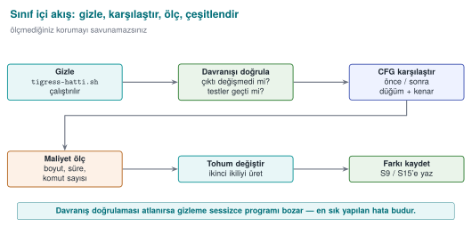

1. **Setup:** write a small, synthetic program (e.g., an `erisim_ver` check). Show that it works correctly with
   unit tests.
2. **Obfuscate:** apply a transform pipeline (EncodeLiterals → EncodeArithmetic → Flatten → AddOpaque).
3. **Verify behaviour:** run the same unit tests against the obfuscated version — the result must be **exactly the
   same**. If not, the pipeline is wrong.
4. **Compare:** compare the clean and obfuscated versions' control flow in a decompiler (e.g., Ghidra/objdump);
   note the increase in basic block count.
5. **Measure:** measure binary size and running time before/after.
6. **Diversify:** run the same pipeline with two different seeds; show that the two binaries are different.
7. **Report:** write the findings into a table (transform, size, time, block count, seed difference) — this table
   goes directly into S9/S15.

!!! warning "Ethical and safe use"
    Tigress is applied only to **your own** code. The goal is not to analyse someone else's program, but to learn
    to protect **your own** code and measure the cost of doing so. The example program does not harm the student's
    computer; it does not change system settings, and it does nothing on the network. All values are synthetic.

### Common mistake: skipping step 3 (verify behaviour) and going straight to step 5 (measure)

Under time pressure, some students run the transform pipeline, immediately measure the binary size, and jump to
the conclusion "obfuscation worked" — without ever doing the behaviour verification (step 3). This is dangerous
because a function that is **larger but broken** also looks "successful" on the size metric; the real question is
not size, but **whether correctness was preserved**.

!!! danger "Common mistake: measuring before verifying behaviour"
    If a transform pipeline has broken behaviour (e.g., `Flatten` misconfigured, a `case` missing), the resulting
    binary is usually **larger and slower** (broken code usually contains unnecessary instructions) — that is,
    someone looking only at the size/speed metric might not notice this, and might even think it's "well
    obfuscated." **Rule:** the step order **never** changes: **behaviour** first (step 3), then **measurement**
    (step 5). There is no point measuring a broken protection.

!!! success "Rule summarising the seven steps in one line"
    Prepare → obfuscate → **verify** → compare → measure → diversify → report. Every arrow in this sequence
    **takes the previous step's output as its input**; skipping one step makes the rest of the chain meaningless —
    just like in section 4's transform pipeline (here the idea of a "pipeline" is applied not just to technical
    transforms, but to **the in-class process itself**).

### Worked example: let's trace the seven steps in a real student scenario (hypothetical)

Let's summarise, with a short record table, how a student applied these seven steps to their own small "PIN
verification" function (the numbers are hypothetical, meant only to show the **shape** of the process):

| Step | What the student did | Evidence recorded |
| --- | --- | --- |
| 1. Setup | `pin_dogrula.c` was written, 4 unit tests added | Test file + "4/4 passed" output |
| 2. Obfuscate | The `EncodeLiterals → Flatten → AddOpaque` pipeline was run | The command line used |
| 3. Verify behaviour | The same 4 tests were run against the obfuscated version | "4/4 passed" output (unchanged) |
| 4. Compare | Clean/obfuscated `pin_dogrula` compared with `objdump` | 3 branches → 6 branches |
| 5. Measure | Instruction count and (approximate) time measured | Instructions: 18 → 34 (88.9% increase) |
| 6. Diversify | Two binaries produced with two seeds, compared with `cmp` | "different" result |
| 7. Report | The six rows above copied into S9/S15 | This table itself |

This table format is a template you can **copy directly** into your term project's S9/S15 section; you just need
to replace the numbers with your own measurements.

### Worked example: how skipping one step breaks the chain (hypothetical)

Let's make the seven-step flow's warning that "skipping a step makes the rest of the chain meaningless" concrete
with a table:

| Step skipped | What goes unnoticed? | Result |
| --- | --- | --- |
| 1. Setup (no tests) | There is **no** verifiable reference for behaviour at all | Step 3 becomes meaningless: "same" compared to what? |
| 3. Verify behaviour | A broken obfuscation goes unnoticed | The measurement in step 5 shows a **broken** program as "successful" (the "common mistake" above) |
| 5. Measure | Cost is unknown | Unmeasured claims like "unbreakable" appear in S9/S15 (week 9, section 1) |
| 6. Diversify | A single binary is distributed to everyone | The 100% impact scenario from section 6's "diversification in space" example plays out |
| 7. Report | What was done goes undocumented | An evaluator (week 12) cannot verify anything; the claim stays unsupported |

This table shows that **none** of the seven steps is optional: each row points to **which later step** is made
meaningless by skipping the one before it — just like in section 4's transform pipeline, here too the idea of a
"pipeline" is applied to the process itself.

## 9. Placing obfuscation into the build and deployment pipeline (S15)

Obfuscation should not be "a job done by hand at the very end," but a step in the **build pipeline**. Your
project's S15 section, after the midterm, documents exactly this:

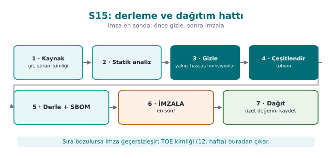

- **Only sensitive functions** are obfuscated (`--Functions`); the rationale is written down.
- Every release is diversified with a **seed**; the seed and the build identity are recorded.
- Signing happens **after** obfuscation; the build identity and hash values (week 12's TOE identity) stay
  consistent.
- The pipeline runs in continuous integration (CI); unit tests + size/speed measurement run automatically on every
  release.

!!! note "Weeks 9, 11, and 14 together"
    These three weeks form a whole: week 9 gives obfuscation's **rules**, week 11 gives the **whitebox** limit for
    keys, week 14 gives their **automatic and diversified** application. Their shared rule is the same: obfuscation
    does not grant unbreakability, it raises cost; its strength comes from layered defence (RASP, key renewal,
    server-side checks) and from being measured.

### Let's read the S15 pipeline step by step

Let's unpack the four boxes in the figure (h14-07) (obfuscation, signing, build identity, CI) into a sequential
list — each step is the **input** to the next, just like in section 4's transform pipeline:

1. **Build (clean):** `temiz.c` (the readable source) is compiled normally; unit tests are run against this build.
2. **Obfuscate:** the agreed transform pipeline (section 7) is applied only to the **sensitive** functions marked
   with `--Functions`; **a new `--Seed`** is generated (section 6's "always record the seed" rule kicks in here —
   CI must write the seed it used to a log/artefact).
3. **Rebuild (obfuscated):** `gizli.c` is compiled normally; the **same** unit tests are run against this build as
   well (the CI counterpart of section 2's STEP 3 — if behaviour hasn't changed, the tests pass; if it has, CI
   must **fail**).
4. **Measure:** size/instructions/branches (sections 5, 7) are measured automatically and compared against the
   previous release; a sudden, unexplained deviation (e.g., unexpectedly shrinking) can point to a bug.
5. **Sign:** only the binary that **passes** the test + measurement steps is signed — the CI counterpart of
   section 4's "signing comes last" rule.
6. **Record the build identity:** the seed used, the transform pipeline, the hash value, and the signature are
   written together into a record (the S15 document) — this is a direct application of week 12's **TOE identity**
   definition (version + binary + source + hash); the difference is that a **fifth** field (the seed used) is
   added to the four components here, because the same source+version label can produce **deliberately different**
   binaries with different seeds (recall the "build identity and hash value" definition in section 0).

Let's write these six steps as a CI script's **conceptual** skeleton (not the syntax of a specific CI product, but
pseudocode showing the order of the steps):

```text title="Kavramsal CI iskeleti (belirli bir araca özgü sözdizimi değil)"
asama derle_temiz:
    cc -O2 -o cikti/temiz temiz.c
    calistir_birim_testleri cikti/temiz

asama gizle:
    tohum = yeni_rastgele_tohum()
    tigress --Seed=$tohum --Transform=... --Functions=... --out=gizli.c temiz.c
    kaydet tohum -> gunluk/surum-$SURUM.txt

asama derle_gizli:
    cc -O2 -o cikti/gizli gizli.c
    calistir_birim_testleri cikti/gizli   # basarisizsa CI DURUR

asama olc:
    objdump -d cikti/gizli | olc_komut_dal erisim_ver >> gunluk/surum-$SURUM.txt

asama imzala:
    imzala cikti/gizli -> cikti/gizli.imzali

asama kaydet_surum:
    ozet = sha256(cikti/gizli.imzali)
    kaydet SURUM, tohum, ozet, donusum_hatti -> TOE-kayit-$SURUM.txt
```

Every line of this skeleton corresponds to a section from this week: `derle_temiz` → section 2, STEP 1; `gizle` →
section 4 (pipeline) + section 6 (seed); the test step of `derle_gizli` → section 2, STEP 3; `olc` → sections 0/5/7;
`imzala` → this section's "signing last" rule; `kaydet_surum` → week 12's TOE identity.

!!! danger "Common mistake: keeping the seed only on the developer's own machine, outside CI"
    If a developer runs obfuscation by hand on their own computer and, out of habit, uses a fixed value like
    `--Seed=42` every time, two things break: (1) this is no longer **diversification** (the same problem as
    section 6's "common mistake" box — a fixed value produces a single, predictable variant), (2) the official
    release CI produces and the release the developer produces on their desktop can be **different binaries**;
    which one was tested becomes unclear. **Rule:** the seed is generated **only inside CI**, new on every run, and
    **recorded in CI's own log**; no obfuscated binary is ever distributed by hand from a developer's personal
    machine.

### Worked example: a TOE record across three releases

Let's make the "build identity + seed" idea from section 0 and this section concrete with a filled-in record table
for three consecutive releases (hypothetical):

| Release | Seed | Transform pipeline | Hash (SHA-256, truncated) | Signature status |
| --- | --- | --- | --- | --- |
| v1.0 | 1001 | EncodeLiterals→EncodeArithmetic→Flatten→AddOpaque | `a1b2c3...` | Valid |
| v1.1 | 4832 | Same pipeline, new seed | `f9e8d7...` | Valid |
| v1.2 | 9214 | Same pipeline + `RandomFuns` added | `4c5b6a...` | Valid |

This table is the **S15-document counterpart** of section 6's "diversification in time" example: each row proves
**exactly which binary** that release is (via seed + pipeline + hash), and that binary is **signed and tested**.
The "pipeline change" in v1.2 (`RandomFuns` added) is also recorded — this is the information week 12's "delta
evaluation" (re-evaluating only the changed part) needs: an evaluator can read **directly** from this table what
changed from v1.1 to v1.2, without having to compare the source code line by line.

## 10. Term project: this week (S9 advanced + S15 pipeline)

1. Choose **a transform pipeline** and write it into S9: which functions, which transforms, in what order, **why**.
2. **Measurement table:** size, time, and (if available) block count — before/after.
3. **Diversification:** production with two seeds and the difference metric; if you won't apply it, the rationale.
4. **The S15 pipeline:** document the obfuscation + signing + build identity steps with a diagram.
5. **Evidence of behaviour:** show that the obfuscated version passes the unit tests (the link to S16).

!!! example "Checklist: what should this week's submission include?"
    - [ ] Is **every step** of the chosen transform pipeline written down, along with **why it's in that order**?
      (section 4)
    - [ ] Is **behaviour verification** (unit test result) documented after every step? (section 2, STEP 3)
    - [ ] Does the measurement table contain **at least** the instruction/branch count; were size and time also
      added if possible? (section 7)
    - [ ] If diversification was applied, is there **proof that the binaries produced with the two seeds are
      different** (e.g., `cmp` output)? If it wasn't applied, was the **rationale** written down? (section 6)
    - [ ] In the S15 diagram, is the **order** of the obfuscation, signing, and build-identity steps correct?
      (section 9)
    - [ ] Was a phrase like "unbreakable" **avoided**; are all claims written as measurable statements? (week 9,
      section 1)

### A filled-in example: the "RULE" template for S9/S15

Week 9's section 4 taught writing every protection decision with the template "What it protects / How / Cost /
Limit." Let's fill in the same template for this week's Tigress pipeline:

```text title="KURAL K-04+K-01+K-07-Tigress-uygulama: erisim_ver fonksiyonuna otomatik dönüşüm hattı"
Neyi korur?       : Sentetik erişim denetiminin mantığını (hangi jetonun geçerli sayıldığı)
                     tersine mühendisliğe karşı geciktirir.
Nasıl?            : Tigress --Transform=EncodeLiterals,EncodeArithmetic,Flatten,InitOpaque,AddOpaque
                     (bölüm 2 ADIM 2'deki tam komut), --Seed her sürümde yeni üretilir (bölüm 6).
Maliyet           : ~%359,1 komut artışı, ~%166,7 karmaşıklık (güç) artışı (bölüm 7, varsayımsal
                     demo sayılarıyla; gerçek sayılar `tigress-hatti.sh` ile ölçülür).
Sınır             : Dayanıklılık ve gizlilik bu demoda ölçülmedi (bölüm 7); tek başına Virtualize
                     olmadan whitebox düzeyinde bir koruma iddia edilmez (11. hafta ile karşılaştırın).
```

Repeat this filled-in example in your own project, with **your own function and your own measured numbers**; none
of the template's four lines should be left blank.

### An example filled-in mini-report (a starting template for S9/S15)

Let's combine all of this week's pieces (transform pipeline, measurement, diversification, S15 pipeline) into one
example report. The text below is a starting point you can carry **directly** into your S9/S15 section by
replacing the numbers with your own measurements (all numbers are consistent with this week's hypothetical
examples):

```text title="Örnek S9/S15 girişi (varsayımsal sayılarla; kendi ölçümünüzle değiştirin)"
Fonksiyon         : erisim_ver
Neden hassas?     : Sentetik jeton denetimi (bölüm 1'deki karar akışı: hassas + orta değerli)
Dönüşüm hattı     : EncodeLiterals -> EncodeArithmetic -> Flatten -> InitOpaque(main) -> AddOpaque
Tohum (surum 1.0) : 1001
Davranış kanıtı   : Temiz ve gizli sürüm CEN429-OK / yanlis girdileriyle aynı çıktıyı verdi (ADIM 3: ayni cikti)
Maliyet           : Komut 22->101 (%359,1), dal 2->7, karmaşıklık (güç) 3->8 (%166,7)
Çeşitlendirme     : Seed=1001 ve Seed=2002 ile üretilen ikililer %60 bayt farkı gösterdi (cmp: farklı)
Dayanıklılık      : Ölçülmedi bu turda; bir sonraki iterasyonda KLEE ile sınanacak (bölüm 7)
Gizlilik          : Ölçülmedi bu turda; dal yoğunluğu haritası çıkarılacak (bölüm 7)
S15 durumu        : CI'de gizle->test->ölç->imzala->kaydet adımları tanımlı; sürüm kaydı TOE-kayit-1.0.txt
Sınır             : Tek başına whitebox düzeyinde koruma iddia edilmiyor (11. hafta ile karşılaştırın)
```

Every line of this template corresponds to a section from this week (read it together with the "A filled-in
example: the RULE template" section above): **Function/Why sensitive** → section 1; **Transform pipeline/Seed** →
sections 4, 6, 9; **Evidence of behaviour** → section 2, STEP 3; **Cost** → sections 5, 7; **Diversification** →
section 6; **Resilience/Stealth** → section 7; **S15 status** → section 9; **Limit** → sections 1, 9, 11.

!!! danger "Common mistake: writing an unmeasured value like 'Resilience: high'"
    Notice that the "Resilience" and "Stealth" lines in the example above say **'not measured'** — this is a
    deliberate choice. A student might be tempted to write a subjective value like "high" or "strong" into these
    lines; this **violates** section 7's "report all four together" rule. **Rule:** leaving an unmeasured metric
    blank, or writing "not measured, can be measured with such-and-such a method," is always more correct than
    writing a made-up value — both academically and in front of an evaluator.

### The week's big picture: how do the sections connect?

After seeing so many new terms and examples, it can become hard to see them all as **a single chain**. The table
below summarises this week's eleven sections in order; each row explains **what it adds** to the one before it:

| Section | What it adds to the previous one |
| --- | --- |
| 0 | Terms (source-to-source, transform, seed, `objdump`, CI, TOE) |
| 1 | Answers "why a tool, not by hand" with those terms |
| 2 | The real command line of the tool (Tigress), step by step |
| 3 | Ties every flag on the command line to week 9's K rules |
| 4 | Combines several flags into a **pipeline** (an ordered sequence of transforms) |
| 5 | Traces the pipeline end to end on a single function, with numbers |
| 6 | Runs the same pipeline with different seeds and **diversifies** it |
| 7 | Spreads sections 5 and 6's numbers across four metrics (potency/resilience/stealth/cost) and **measures** |
| 8 | Orders sections 2–7 into an in-class **seven-step process** |
| 9 | Moves section 8's process into a **CI pipeline** (automation) |
| 10 | Turns everything into a **term-project submission** (S9/S15) |

This table gives a quick answer to "which section did I forget?" when preparing for an exam or a project: if you
can't explain what a section **adds** to the one before it, reread that section; if one link in the chain is
missing, the rest loses its meaning too — just like in section 4's transform pipeline.

## 11. Self-check

??? question "1. What is source-to-source obfuscation? What are its three advantages over manual obfuscation?"
    A transform is applied to the source code, producing **new source code (C again)**, which is then compiled
    normally. Its advantages: **repeatable/automatic** (on every build), **consistent and scalable** (across many
    functions), **the original source stays clean** (easy to maintain) — plus diversification via seed.

??? question "2. What is Tigress's place in this course; under what license, and why isn't its binary distributed in the course?"
    Tigress is a source-to-source C obfuscator; even though it's academic/free, it is distributed under its own
    license/usage terms, so **everyone downloads it themselves**; the binary isn't shared in the course. The demos
    are written so that they still work with a clean derivative/fallback if Tigress is absent.

??? question "3. Map the following transforms onto week 9's rules: Flatten, EncodeArithmetic, EncodeLiterals, Virtualize, AddOpaque."
    **Flatten** = control-flow flattening; **EncodeArithmetic** = arithmetic obfuscation; **EncodeLiterals** =
    constant/string obfuscation; **Virtualize** = virtualisation (strongest, most expensive); **AddOpaque** =
    adding an opaque predicate/dead branch.

??? question "4. Why is a transform pipeline stronger than a single transform? Why does order matter?"
    Different transforms protect against different analysis techniques; together they form **layered resistance**.
    Order matters: for example, you need to flatten first and then add opaque predicates; the wrong order can
    neutralise some transforms or needlessly raise the cost.

??? question "5. Which two things do you **always** do after every transform pipeline? (Hint: behaviour + cost)"
    (1) **You test that behaviour hasn't changed** (unit tests must pass — obfuscation must not break the
    function), (2) **you measure the cost** (size/speed/instruction count; compared before and after).

??? question "6. Why is Virtualize applied only to small and critical functions?"
    Virtualisation brings a large **performance** and **size** penalty; it can't be applied everywhere. That's why
    it's used only on high-value, small, critical functions — where the cost is justified.

??? question "7. How does the seed (`--Seed`) enable diversification? What is the difference between diversification in space and in time?"
    When the same source is obfuscated with a different **seed**, the tool makes different random choices → a
    different binary (same behaviour). **Diversification in space:** different copies/users are different (one
    crack doesn't crack everyone). **Diversification in time:** it changes across releases (one crack doesn't stay
    valid forever).

??? question "8. Does diversification prevent obfuscation's potency, or its ability to scale?"
    It prevents its ability to **scale**: it doesn't raise a single copy's potency, but it prevents an attack from
    spreading (being reused) across all copies/users.

??? question "9. What is the main rule for this course from the Banescu et al. study? (Resilience ↔ cost)"
    A stronger transform gives more **resilience**, but it also raises the **performance/size cost**. Protection is
    chosen in proportion to the asset's value; not everything is obfuscated with the strongest transform.

??? question "10. When placing obfuscation into the build pipeline, why does signing come **after** obfuscation?"
    The signature protects the **final binary**. If you sign first and obfuscate after, the binary changes and the
    signature becomes invalid. The correct order: **build → obfuscate → (package) → sign**.

??? question "11. What is the rationale for S15's rule that 'only sensitive functions are obfuscated'?"
    Obfuscating everything blows up performance/size, and most of the code isn't sensitive anyway. Concentrating
    protection on **critical** functions lowers the cost and raises the impact.

??? question "12. Write, in one sentence, the shared rule of weeks 9, 11, and 14."
    Protection provides not unbreakability but **delay**; its strength comes from being **combined**,
    **diversified**, and **measured**.

??? question "13. What do the 'instruction count' and 'branch count' measured with objdump represent; what is their relationship to week 9's CFG node/edge count?"
    `objdump -d` converts a binary into assembly; every line after the target function's label (`<erisim_ver>:`)
    gives the **instruction count**, and the ones among them starting with `j...`/`call` give the **branch/call
    count**. This is the **automatic, finer-grained, compiled-binary** counterpart of the CFG node/edge count drawn
    by hand from source code in week 9; both measure the question 'how much work is it to analyse this function?'

??? question "14. Why are `InitOpaque` and `AddOpaque` two separate transforms; which one must run first?"
    `InitOpaque` **prepares** the hidden state variables the opaque predicates will rely on (usually inside
    `main`); `AddOpaque` uses that state to **add** the real opaque conditions to the target function. If
    `InitOpaque` is skipped, the infrastructure `AddOpaque` relies on stays missing; that's why the order is
    **`InitOpaque` first, then `AddOpaque`** (this is the real order in the demo script).

??? question "15. What is the basic difference in scope between Order 1 (EncodeLiterals→EncodeArithmetic→Flatten→AddOpaque) and Order 2 (Flatten→AddOpaque→EncodeArithmetic→EncodeLiterals)?"
    In Order 1, since `EncodeLiterals` runs first, it only encodes the constants **in the original source**; it
    does not cover the state constants `Flatten` produces later. In Order 2, since `EncodeLiterals` runs **last**,
    it can also encode the new constants `Flatten` and `AddOpaque` produce, but `EncodeArithmetic` now has to
    process arithmetic spread across the dispatcher, which can grow the cost. There is no definitively 'better'
    order; the decision is made by measurement (section 7).

??? question "16. Why is it wrong to compute the cumulative increase in section 5's table by adding the per-step increase percentages (like 36.4% + 53.3%)?"
    The percentages rest on different denominators (each on the absolute number of a different previous step), so
    they cannot be added directly. The correct method is to recompute the cumulative increase **always over step
    0's absolute number**: `(46−22)/22×100 ≈ 109.1%` is correct; the sum `36.4%+53.3%=89.7%` is wrong.

??? question "17. Which formula computes section 7's potency metric; what is the result with this week's demo numbers?"
    Cyclomatic complexity ≈ `branch_count + 1`. Step 0 (clean): `2+1=3`. Step 4 (full pipeline): `7+1=8`. Increase:
    `(8−3)/3×100 ≈ 166.7%`.

??? question "18. Why isn't it a bug that the whole binary's size (`ls -l`) barely changes in a small demo; how is the measurement done correctly?"
    In small programs, most of the file consists of fixed headers, dynamic linking tables, and library references;
    a single function growing by a few dozen instructions stays invisible next to this fixed overhead. For a
    meaningful measurement, **not the whole file, but the target function's own code size** (via `objdump`'s
    instruction count) must be measured.

??? question "19. Why is a 'seed' field also added to the TOE identity (week 12: version+binary+source+hash) in the S15 pipeline?"
    Because the diversification we learned this week can produce **deliberately different** binaries from the same
    source and the same version label. To tell which binary was produced with which seed, the seed must also be
    added to the TOE record; otherwise, different binaries under the same version label can get mixed up.

??? question "20. In the diversification example, if 96/160 bytes differ, what is the difference ratio; what does this ratio alone not prove?"
    `96/160×100=60%`. This ratio only shows how different the two binaries are; it does not show whether the
    difference is **inside the target function** or in an **insignificant** spot like a timestamp — for that, the
    target function must be separately compared with `objdump` (`cmp` alone isn't enough).

??? question "21. What are the two basic advantages of putting the obfuscation step inside CI, compared to running it by hand?"
    (1) The seed is generated automatically and freshly on every release; it isn't forgotten or fixed (real
    diversification is guaranteed). (2) The official binary CI produces and the binary that is tested are the
    same; there's no confusion with a different binary a developer produced by hand on their desktop.

??? question "22. If STEP 3 in the demo script prints 'FARK' (difference), why is it wrong to move on to STEP 4 (diversification)?"
    STEP 3 verifies that behaviour was preserved. Printing 'FARK' means the transform pipeline broke the behaviour;
    diversifying a broken binary only produces **different copies of the broken behaviour**, it doesn't fix the
    problem. The pipeline must be fixed first, behaviour re-verified, and only then diversified.

??? question "23. Why is it a mistake to automatically add Virtualize on the logic 'since I'm obfuscating anyway, let's add everything'?"
    Virtualize is **many times** (tens of times) more expensive than the sum of the other transforms; it's
    measured not in percentages but in **multiples**. While a growth like 359% may be acceptable for a function,
    adding a further 10-50x slowdown on top is meaningless for most products; the decision must be made
    **separately**, with section 1's 'is it sensitive, how valuable is it' flow.

??? question "24. Why doesn't this week's demo script raise an error when Tigress isn't installed; what does it do instead?"
    The script first checks with `command -v tigress`; if it isn't installed, it prints installation/license
    instructions (`tigress.wtf`, free for academic use) and points the student to week 9's manual working demo
    (`week-09/01-manuel-gizleme`) — the lesson doesn't stop, it switches to the manual working path of the same
    concept.

??? question "25. In the diversification-in-space example (10,000 users), how does moving from a single seed to a unique seed per user change a crack's rate of impact?"
    With a single seed, one crack affects **100%** of users. When every user gets a unique seed, one crack affects
    only **that one copy**: `1/10,000×100=0.01%`. The numbers are hypothetical, but the relationship (as the
    number of seeds grows, the spreading surface shrinks) is general.

??? question "26. Why isn't diversification in time a sufficient defence on its own?"
    Section 1's 'Rule 3' says obfuscation only **buys the other layers time**, not that it's a permanent solution.
    In the time before the next release ships, the attacker can still harm users on the old release; that's why
    diversification in time must be used **together with** RASP and server-side checks (rejecting old/cracked
    releases).

??? question "27. Why does the stealth metric conflict with the logic 'the more I obfuscate, the better'?"
    Overly heavy obfuscation (e.g., an abnormally high branch density) makes the protected function **statistically
    distinguishable** from the file's other functions; this makes it easier for an attacker to go straight to that
    function. Stealth can **decrease** while potency and cost increase — all four must be balanced together.

??? question "28. Explain why the state constants (like 7341, 2098, ...) in a function with `Flatten` applied are chosen scattered rather than sequential."
    Sequential constants (like `1, 2, 3, 4`) are instantly recognised in a decompiler as the signature of 'a
    flattened dispatcher' (pattern recognition — section 4/week 9, section 10). Scattered/unpredictable values make
    this recognition harder; moreover, these values themselves can also be encoded with K-02 (arithmetic encoding),
    combining two layers.

??? question "29. What are the four lines of the 'RULE' template in S9/S15? How did we fill them in for `erisim_ver` this week?"
    The template has four lines: **What it protects / How / Cost / Limit**. In section 10's filled-in example: what
    it protects → the access check's logic; how → the five-transform Tigress pipeline + seed; cost → a hypothetical
    359.1% instruction / 166.7% complexity increase; limit → resilience/stealth not measured, whitebox-level
    protection isn't claimed on its own.

??? question "30. Does this week's 'signing comes last' rule conflict with week 9's 'obfuscation does not store a key' rule?"
    No, they describe different layers. 'Signing comes last' is an **order** rule in the build pipeline: the
    obfuscated binary must be signed unchanged (sections 4, 9). 'Does not store a key' says obfuscation does not
    carry a **mathematical secrecy claim** (K-07 is an encoding, not encryption — week 9, section 0). Both are
    different faces of the theme 'obfuscation provides discipline and measured cost, not unbreakability.'

??? question "31. How does `EncodeData` protect a variable; what is the common mistake that nullifies this protection?"
    It splits/encodes a variable's representation in memory (e.g., two byte pieces inside a struct instead of a
    single 32-bit integer); the value does not appear **directly** in a memory dump. Common mistake: merging the
    pieces back together right after use and storing them in a single variable for the whole function — this
    recreates a single, recognisable block and nullifies the protection.

??? question "32. Is the difference between applying only `EncodeLiterals` and applying four transforms together just about cost?"
    No. Only `EncodeLiterals` neutralises just **one** of the attacker's techniques (`strings` scanning); the
    control flow is still directly readable. Applying four transforms together requires the attacker to defeat
    **several different** analysis techniques **at the same time** (string scanning + pattern recognition + MBA
    simplification + opaque-predicate solving) — the real gain comes not just from cost, but from **how many
    different techniques are challenged**.

??? question "33. Why is a change in the transform pipeline column from v1.1 to v1.2 (adding `RandomFuns`) also recorded in the TOE record table?"
    Week 12's delta evaluation asks for re-evaluating only the changed part; this column lets an evaluator see
    **what** changed between the two releases without comparing the source code line by line.

??? question "34. Why isn't it a sufficient fix to sign before obfuscating and then say 'I'll just recompute the signature'?"
    Technically the new content matches the new signature, but the **process** is still flawed: the correct order
    is left to human memory, and the mistake can recur. The rule is that signing is defined **structurally** after
    the obfuscation and measurement steps in CI, so that an order mistake becomes impossible.

??? question "35. Why is the last row of the (hypothetical) solver-time resilience table ('+ diversification') especially important?"
    It shows that diversification does not eliminate the attacker effort (on the order of hours) spent on a single
    copy, but requires that effort **from scratch** for every new copy — this is the reflection, on the resilience
    metric, of section 6's rule 'doesn't raise potency, prevents scaling.'

??? question "36. How does the `Split` transform disrupt a reverse engineer's 'map'?"
    A reverse engineer usually draws a map by looking at function boundaries (name, number of parameters,
    inputs/outputs); `Split` makes this map misleading by spreading a single logical operation across several
    small, generically named functions (e.g., `_adim_a`, `_adim_b`) — understanding how many functions are actually
    part of **one** operation takes extra effort.

??? question "37. What is the difference between `cmp -s A B` and an `objdump`-based comparison of the target function; which one actually proves diversification?"
    `cmp` only says whether the two files are **as a whole** the same/different, it doesn't show what's different.
    Extracting only the target function's (`erisim_ver`) section with `objdump` and running `diff` on it shows
    whether the difference is really **inside the protected function**; only this second method actually proves
    diversification.

??? question "38. In the one-year maintenance scenario, why is the 'risk of forgetting' higher in the manual method?"
    In the manual method, every new sensitive function needs a separate, hand-written obfuscation step; this step
    may not be clearly visible in code review and can be forgotten. In the tool method, the `--Functions` list is
    an auditable document, directly visible in code review, and it's easier to notice a gap.

??? question "39. Is using a list like `--Functions=erisim_ver,anahtar_turet` always correct? When could it be wrong?"
    It's correct only if the two functions are of **the same value/sensitivity** and deserve the same transform
    pipeline. Applying the same pipeline with the same list to functions of different value (e.g., one critical and
    needing Virtualize, the other light) means skipping section 1's decision flow (is it sensitive, how valuable is
    it).

??? question "40. Why is writing 'Resilience: not measured' in the example mini-report better engineering practice than writing 'Resilience: high'?"
    'High' is a subjective, unsupported claim (a mistake in the same category as week 9's 'unbreakable' warning).
    'Not measured' is an honest state; if it also states which method could measure it (e.g., with KLEE), it lets
    an evaluator see the next step — this is consistent with week 12's 'result, not plan' discipline.

??? question "41. What is the basic difference between `cmp` and `diff`; in section 6's two-step verification flow, which one plays which role?"
    `cmp` compares two files byte by byte and only says 'same or different' (coarse but fast); `diff` performs a
    detailed text/line-level comparison (slow but informative). In section 6's flow, a coarse check is done first
    with `cmp`; if a difference is found, `diff` is run on the `objdump` output to verify whether the target
    function **really** changed.

??? question "42. According to section 10's 'the week's big picture' table, what exactly does section 9 add to section 8?"
    Section 8 defines a seven-step process followed by hand in class (prepare → obfuscate → verify → compare →
    measure → diversify → report). Section 9 **automates** this same process and moves it into a CI pipeline: the
    seed is generated automatically on every release, tests run automatically, measurement and signing are done
    automatically — reliance on human memory disappears.

??? question "43. Is `erisim_ver` in this week's demo script (`ornek.c`) the same function as the simplified `temiz.c` example in section 5? Why did we use both representations together?"
    Not exactly: the real `erisim_ver` in `ornek.c` performs a length check and a constant-time XOR comparison (the
    real code in section 0); the `temiz.c` in sections 4-5 is a simplified, instructive representation with a
    `jeton_gecerli(...)` call. We used both together because the simplified representation (the `if`/`return`
    structure) is clearer for showing the transforms' **idea**; the real code defines what you'll see when you
    **actually run** the script. Section 3's `Split` example uses the real code, most of the other examples use the
    simplified representation — which one is used is always noted in the title.

??? question "44. Why does every 'AFTER' code block's title this week always carry the phrase 'conceptual representation'; why does this matter?"
    Because Tigress's real output varies with the version, the compiler, and the `--Seed` value; the 'AFTER' blocks
    shown in this week's notes (the `EncodeLiterals`, `Flatten`, `EncodeData`, `Split` examples) are not the
    **exact** output of a real Tigress command, but instructive representations that convey the transform's
    **idea**. Not clearly stating this distinction would push students into thinking the real output looks exactly
    like this — which would amount to giving made-up information. **Rule:** to see the real output, run
    `tigress-hatti.sh` while Tigress is installed and read the `gizli.c` file.

??? question "45. Are all of this week's numeric cost/potency/diversification examples (like 359.1%, 166.7%, 60%) real measurements?"
    No, as clearly stated, they are **hypothetical** — because Tigress was not installed while preparing this note,
    real `objdump`/`cmp` output could not be obtained. These numbers are meant only to show how the arithmetic is
    set up and the orders of magnitude involved. **Rule:** use these table formats in your own project, but
    **measure the numbers yourself** by running `tigress-hatti.sh` while Tigress is installed; presenting a
    hypothetical number as if it were measured is a dishonesty mistake in the same category as week 9's
    'unbreakable' warning.

## 12. Resources and further reading

- The **Tigress** official site and worksheets (`tigress.wtf`) — transforms, syntax, current version (v4), and
  license. Students verify the current version and terms here.
- C. Collberg, J. Nagra, *Surreptitious Software* — the obfuscation taxonomy and measurement framework (shared with
  week 9).
- S. Banescu, C. Collberg et al. — measuring the resilience of Tigress transforms to symbolic execution (KLEE).
- Obfuscator-LLVM (O-LLVM) — an alternative to compiler-based obfuscation (week 9, K-11).

!!! info "Next week"
    **Week 15 — Final project presentations (RAP2).** The term's content is complete; the final report is expected
    to include this week's pipeline (S15) and measurements (S9). Quiz 2 (weeks 9–14) is in week 16.
