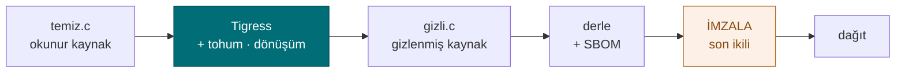

# Hafta 14 — Tigress ve Çeşitlendirme

| | |
| --- | --- |
| **Tarih** | 18.12.2026 |
| **Öğrenme çıktıları** | ÖÇ.3 |
| **Süre** | 3 saat |

<!-- materyal:basla -->

<div class="materyal" markdown>

[:material-file-pdf-box: Ders notu (PDF)](cen429-week-14-ders-notu.pdf){ .md-button download="cen429-week-14-ders-notu.pdf" }
[:material-file-word-box: Ders notu (DOCX)](cen429-week-14-ders-notu.docx){ .md-button download="cen429-week-14-ders-notu.docx" }
[:material-presentation: Sunum (PDF)](cen429-week-14-sunum.pdf){ .md-button download="cen429-week-14-sunum.pdf" }
[:material-microsoft-powerpoint: Sunum (PPTX)](cen429-week-14-sunum.pptx){ .md-button download="cen429-week-14-sunum.pptx" }
[:material-language-html5: Sunum (HTML, çevrimdışı)](cen429-week-14-sunum.html){ .md-button download="cen429-week-14-sunum.html" }
[:material-folder-zip: Tümünü indir (ZIP)](cen429-week-14-materyal.zip){ .md-button download="cen429-week-14-materyal.zip" }
[:material-fullscreen: Sunumu tam ekran aç](cen429-week-14-sunum.html){ .md-button .md-button--primary target=_blank }

</div>

<div class="sunum-cercevesi">
<iframe src="../cen429-week-14-sunum.html" title="Hafta 14 — Tigress ve Çeşitlendirme" loading="lazy" allowfullscreen></iframe>
</div>

<p class="sunum-ipucu">Sunumun içine tıklayıp ok tuşlarıyla ilerleyin; tam ekran için sunumun sağ altındaki düğmeyi ya da yukarıdaki "Sunumu tam ekran aç" bağlantısını kullanın.</p>

<!-- materyal:bitis -->

!!! example "Bu haftanın çalışan demosu"
    `code/week-14/01-kaynaktan-kaynaga` — Tigress donusum hatti (kuruluysa) ya da yerel ornek + indirme yonergesi; fonksiyon maliyetini olcer.

    Çalıştırma: `sh demo.sh` (Linux/WSL) ya da CMake ile derleyip `bin/` altından. Tümüyle sentetik ve güvenlidir; öğrenci bilgisayarına zarar vermez.


!!! tip "Demoyu kendiniz çalıştırın — adım adım (kopyala-yapıştır)"
    Bu demo **Tigress** ister (kaynaktan kaynağa C gizleyici). **`code`** klasöründen:

    ```sh
    # WSL / Linux (Windows'ta WSL kullanın)
    cd week-14/01-kaynaktan-kaynaga
    sh tigress-hatti.sh
    ```

    **Beklenen çıktı:** Tigress kuruluysa `erisim_ver` fonksiyonu kaynaktan kaynağa gizlenir: **dönüşüm hattı → davranış doğrulama** (çıktı değişmedi) → `objdump` ile **maliyet ölçümü** → **iki tohumla** farklı ikili (çeşitlendirme). Tigress yoksa betik **temiz bir türevle** aynı akışı gösterir. Kurulum: <https://tigress.wtf> (akademik kullanım ücretsiz).

!!! abstract "Bu haftanın sonunda şunları yapabileceksiniz"
    1. **Kaynaktan kaynağa** (source-to-source) gizlemenin ne olduğunu ve 9. haftadaki el ile kuralların **otomatik**
       karşılığını (Tigress) açıklamak.
    2. Tigress'in dönüşüm ailelerini (kontrol, veri, fonksiyon, bütünlük, analiz-önleme) 9. haftanın kurallarıyla
       eşlemek ve bir **dönüşüm hattı** (birden çok dönüşümün sırayla uygulanması) kurmayı tarif etmek.
    3. **Çeşitlendirmeyi** araçla üretmek: tohum (`--Seed`) ve rastgeleleştirilmiş dönüşümlerle aynı kaynaktan farklı
       ama eş-davranışlı ikili dosyalar üretmenin mantığını anlatmak.
    4. Gizlemenin ve çeşitlendirmenin **etkinliğini ölçmek**: maliyet (boyut, hız) ve dayanıklılık (sembolik yürütmeye
       direnç); 9. haftadaki güç/dayanıklılık/maliyet çerçevesini araç üstünde uygulamak.
    5. Gizlemeyi bir **derleme ve dağıtım hattına** (S15) yerleştirmek: hangi fonksiyonlara, neden, hangi maliyetle;
       imzalama ve sürüm kimliğiyle birlikte.

??? info "Ders akışı (öğretim üyesi için zaman planı)"
    | Zaman | Bölüm | Ne yapılıyor |
    | --- | --- | --- |
    | 0:00–0:20 | 1 | Kaynaktan kaynağa gizleme; Tigress nedir, nereye oturur; kurulum ve lisans |
    | 0:20–0:50 | 2 | Dönüşüm aileleri ve 9. hafta kurallarıyla eşleme; dönüşüm hattı kurma |
    | 0:50–0:55 | Ara | |
    | 0:55–1:35 | 2 | Örnek hat: bir denetimi düzleştir + veri kodla + fonksiyonları karıştır (kavram, sentetik) |
    | 1:35–1:40 | Ara | |
    | 1:40–2:10 | 3 | Çeşitlendirme: tohum ve rastgele dönüşümler; uzayda/zamanda çeşitlendirme |
    | 2:10–2:40 | 3–4 | Ölçme: boyut/hız maliyeti; sembolik yürütmeye dayanıklılık (Tigress + KLEE çalışması) |
    | 2:40–3:00 | 4+ | Derleme hattına yerleştirme (S15); sınırlar ve etik; proje; kendini sınama |

!!! info "Bu haftanın kaynakları ve Tigress lisansı hakkında"
    Bu hafta 9. haftadaki kuralları **araçla** uygular. Ana kaynak Tigress'in kendi çalışma sayfaları/derslerdir.
    Tigress bir **kaynaktan kaynağa C gizleyici/çeşitlendiricidir**; güncel sürümü **v4**'tür (Linux, macOS, Windows,
    Android; Intel/ARM/WebAssembly). Lisans: **kâr amacı gütmeyen** kullanım için ücretsizdir; ticari kullanım için
    Arizona Üniversitesi'nden lisans gerekir. **Bu yüzden derste bir Tigress ikilisi ya da eski bir sürüm
    dağıtılmaz;** öğrenciler güncel sürümü resmî siteden (`tigress.wtf`) kendileri indirir ve lisans koşullarını orada
    doğrular. Bütün örnekler **sentetiktir** ve yalnız kendi kodunuza uygulanır.

---

## 1. Kaynaktan kaynağa gizleme nedir?

Dokuzuncu haftada gizleme kurallarını **el ile** uyguladık: opak yüklem, düzleştirme, dize kodlama, sahte dal. El ile
gizleme öğreticidir ama üç sorunu vardır: (1) **hataya açıktır** — el ile yazılan gizleme kodu davranışı bozabilir;
(2) **bakımı zordur** — kaynak okunamaz hale gelir; (3) **çeşitlendirilemez** — her kopyayı el ile farklılaştıramazsınız.
Çözüm, gizlemeyi bir **araca** yaptırmaktır.

!!! note "Kısa tarihçe: kaynaktan kaynağa gizleme ve çeşitlendirme"
    - **1993** — Cohen, "program evolution" ile **çeşitlendirme** fikrini ortaya atar: aynı işlev, farklı ikili.
    - **1997** — Collberg vd. gizleme taksonomisi (9. hafta'nın temeli).
    - **2013** — **Obfuscator-LLVM (O-LLVM)**: derleyici tabanlı gizleme.
    - **2010'lar** — **Tigress** (Christian Collberg): C için **kaynaktan kaynağa** gizleyici + sanallaştırma + çeşitlendirme; araştırmada dayanıklılık ölçümünün fiili standardı.
    - **2016–2017** — Banescu vd. Tigress + KLEE ile dönüşüm **dayanıklılığını ölçer** → "**dayanıklılık ↔ maliyet**" kuralı.

**Kaynaktan kaynağa** (source-to-source) gizleme, bir aracın **C kaynağını girdi alıp yine C kaynağı** üretmesidir;
üretilen kaynak, davranışça özdeş ama okunması çok daha zordur ve normal derleyicinizle derlenir. Bu yaklaşımın en
bilinen aracı **Tigress**'tir.

```text
Sizin kaynağınız (okunur)  ──►  [ Tigress: dönüşümleri uygula ]  ──►  Gizlenmiş kaynak (C)  ──►  derleyici  ──►  ikili
        ^ bakımı siz yaparsınız                                              ^ bu dağıtılır
```

Önemli fark: siz **okunur** kaynağı korur ve bakımını yaparsınız; gizleme, **derleme hattında** otomatik bir adım
olarak çalışır. Bu, 9. haftadaki "her gizleme bakım maliyeti getirir" sorununu büyük ölçüde çözer: bakım maliyeti
okunur kaynakta kalır, dağıtılan kaynak gizlidir.

### Tigress nedir, nereye oturur?

Tigress, Arizona Üniversitesi'nden Christian Collberg ve ekibinin geliştirdiği bir **kaynaktan kaynağa C gizleyici ve
çeşitlendiricidir**. Bu dersteki yeri:

- 9. haftadaki **el ile kuralların otomatik karşılığıdır**: düzleştirme, opak yüklem, veri kodlama, sanallaştırma —
  hepsi birer dönüşüm (transform) olarak.
- Çok platformludur (Linux, macOS, Windows, Android; Intel/ARM/WebAssembly) ve GCC/Clang/MSVC ile çalışır.
- Güncel sürümü **v4**'tür.

!!! warning "Lisans ve derste kullanım"
    Tigress, **kâr amacı gütmeyen** (akademik/araştırma) kullanım için ücretsizdir; **ticari** kullanım için Arizona
    Üniversitesi'nden lisans gerekir. Kaynak kodu açık değildir; araştırmacılar şifreli kaynağa erişim isteyebilir.
    Bu yüzden **derste bir Tigress ikilisi ya da eski bir sürüm dağıtılmaz.** Öğrenciler güncel sürümü resmî
    siteden (`tigress.wtf`) kendileri indirir ve **lisans koşullarını orada doğrular.** Ödevlerde Tigress yalnız
    öğrencinin **kendi** koduna, kendi makinesinde uygulanır.

### Neden bir araç, el ile değil?

| El ile gizleme (9. hafta) | Araçla gizleme (Tigress) |
| --- | --- |
| Öğreticidir, kavramı gösterir | Ölçeklenir, üretimde kullanılır |
| Hataya açık (davranışı bozabilir) | Dönüşümler davranışı korur (test edilmiş) |
| Kaynak okunamaz hale gelir | Okunur kaynak sizde kalır |
| Çeşitlendirme el ile olmaz | Tohumla otomatik çeşitlendirme |
| Tek tip, tanınabilir | Dönüşüm ve tohum kombinasyonuyla değişken |

!!! note "Ama araç sihir değildir"
    9. haftanın ana kuralı burada da geçerlidir: Tigress de kırılamazlık vermez, **maliyet** yükseltir. Üstelik iyi
    bilinen bir aracın ürettiği kalıplar zamanla tanınabilir; bu yüzden **çeşitlendirme** (bölüm 3) ve **katmanlı
    savunma** (RASP, sunucu denetimi) yine şarttır. Tigress'in kendisi de dönüşümlerin sembolik yürütmeye ne kadar
    dayandığını ölçen araştırmaların (bölüm 4) baş öznesidir.

## 2. Temel akış: bir programı adım adım gizlemek

Tigress komut satırından çalışır: hangi dönüşümlerin, hangi fonksiyonlara, hangi sırayla uygulanacağını
söylersiniz; çıktı gizlenmiş bir C dosyasıdır. Kavramsal akış (sözdizimi sürümle değişebilir, resmî belgeden
doğrulayın):

```bash title="Kavramsal akış (tek dönüşüm)"
# girdi: temiz.c  → çıktı: gizli.c  (sonra normal derlenir)
tigress --Transform=Flatten --Functions=erisim_ver \
        --out=gizli.c temiz.c
cc -o program gizli.c
```

Buradaki üç fikir, bütün Tigress kullanımının temelidir:

1. **`--Transform=...`** hangi dönüşümün uygulanacağını söyler (Flatten = kontrol akışı düzleştirme, 9. hafta K-04).
2. **`--Functions=...`** dönüşümün **hangi fonksiyonlara** uygulanacağını söyler — çünkü gizlemeyi yalnız hassas
   fonksiyonlara uygularız (maliyet kuralı).
3. Çıktı yine C'dir; **kendi derleyicinizle** derlersiniz. Gizleme, derleme hattına eklenen bir adımdır.

---

## 3. Dönüşüm aileleri ve 9. hafta kurallarıyla eşleme

Tigress dönüşümleri, 9. haftada gördüğümüz gizleme ailelerine karşılık gelir. Aşağıdaki tablo, en çok kullanılan
dönüşümleri ve dersteki karşılıklarını verir (dönüşüm adları resmî belgeden doğrulanmalıdır; sürümle küçük
farklar olabilir):

| Tigress dönüşümü | Ne yapar? | 9. hafta karşılığı |
| --- | --- | --- |
| **Flatten** | Kontrol akışını düzleştirir (switch dağıtıcı) | K-04 kontrol akışı düzleştirme |
| **InitOpaque / AddOpaque / UpdateOpaque** | Opak yüklemler ekler; sahte dallar | K-01 opak yüklem, K-03 ölü dal |
| **EncodeArithmetic** | Aritmetik işlemleri denk karmaşık ifadelerle değiştirir (MBA) | K-02 aritmetik kodlama |
| **EncodeLiterals** | Sabitleri ve dizgeleri kodlar | K-07 dize kodlama, K-08 sabit dönüşümü |
| **EncodeData** | Değişkenlerin gösterimini kodlar | K-09 değişken bölme/kodlama |
| **Split / Merge** | Fonksiyonları böler / birleştirir (yapıyı bulanıklaştırır) | K-06 çağrı/yapı gizleme |
| **Virtualize** | Fonksiyonu özel bir VM bayt koduna çevirir | K-10 sanallaştırma |
| **Jit** | Kodu çalışma anında üretir (dinamik) | K-12 dinamik (kavram) |
| **AntiBranchAnalysis / AntiAliasAnalysis / AntiTaintAnalysis** | Statik analiz tekniklerini zorlaştırır | Önleyici aile |
| **RandomFuns / RndArgs** | Rastgele fonksiyonlar / sahte parametreler ekler | Çeşitlendirme, K-06 sahte parametre |

!!! tip "Aileler ve maliyet"
    Bu dönüşümleri 9. haftadaki maliyet sırasıyla düşünün: EncodeArithmetic/EncodeLiterals **ucuzdur**; Flatten ve
    opak yüklemler **orta**; Virtualize **pahalıdır** (onlarca kat yavaşlama). O yüzden Virtualize'ı yalnız en kritik,
    küçük fonksiyonlara uygularsınız — Tigress'te `--Functions` ile hedef seçmek tam da bunun içindir.

## 4. Dönüşüm hattı: birden çok dönüşümü birleştirmek

Dokuzuncu haftanın en önemli kuralı "tek teknik değil, birlikte" idi. Tigress'te bu, dönüşümleri **sırayla** (bir hat olarak)
uygulamak demektir. Her `--Transform` bir öncekinin çıktısına uygulanır; sıra önemlidir.



İmza **en son** gelir (önce gizle, sonra imzala); her hattan sonra **davranışı test et** ve **maliyeti ölç**.

```bash title="Kavramsal hat (birden çok dönüşüm sırayla)"
tigress \
  --Transform=EncodeLiterals --Functions=erisim_ver \
  --Transform=EncodeArithmetic --Functions=erisim_ver \
  --Transform=Flatten        --Functions=erisim_ver \
  --Transform=AddOpaque      --Functions=erisim_ver \
  --out=gizli.c temiz.c
```

Bu hat, tek bir denetimi (`erisim_ver`) önce sabit/dize kodlar, sonra aritmetiğini kodlar, sonra düzleştirir, sonra
opak yüklemlerle güçlendirir. Sonuç, 9. haftada K-04'ün "güçlendirilmiş düzleştirme" dediği şeyin otomatik halidir.

!!! warning "Sıra ve test kuralı"
    Dönüşüm sırası sonucu etkiler ve bazı sıralar başarımı gereksiz bozar. **Kural:** her dönüşüm hattından sonra
    programın **birim testlerini** çalıştırın (davranış korunmuş mu?) ve boyut/hız ölçün. Gizleme, davranışı asla
    değiştirmemelidir; değiştiriyorsa hat yanlıştır. Bu, 12. haftadaki "S16 test sonuçları"na doğrudan bağlanır.

## 5. Adım adım örnek: bir denetimi güçlendirmek (sentetik)

Tek bir sentetik erişim denetimini alıp katman katman güçlendirelim. Amaç, her adımın **ne eklediğini** ve
**ne kadara mal olduğunu** görmektir.

```c title="Başlangıç: temiz.c (okunur, korumasız)"
int erisim_ver(const char *jeton) {
    if (jeton_gecerli(jeton)) return IZIN;   /* tek dal, tek dönüş: kolay hedef */
    return RED;
}
```

| Adım | Uygulanan dönüşüm | Ne değişir? | Maliyet |
| --- | --- | --- | --- |
| 0 | (yok) | `strings`, tek dal, tek bayt yamasıyla atlanabilir | — |
| 1 | EncodeLiterals | `IZIN`/`RED` ve dizgeler düz görünmez | Çok düşük |
| 2 | EncodeArithmetic | Karşılaştırma/hesap karmaşık ifadeye döner | Düşük |
| 3 | Flatten | Tek dal görünmez; switch dağıtıcı | Orta |
| 4 | AddOpaque | Sahte dallar, opak koşullar eklenir | Orta |
| 5 | (Virtualize, yalnız gerekirse) | Fonksiyon VM bayt koduna döner | Yüksek |

**Çıkarım:** Her adım saldırıyı biraz daha pahalı yapar; ama her adım bir maliyet ekler. Nerede duracağınıza,
korunan varlığın değerine ve ölçtüğünüz maliyete göre karar verirsiniz (bölüm 4). Adım 5 (Virtualize) çoğu denetim
için gereksizdir; yalnız en kritik ve küçük fonksiyonlara uygulanır.

---

## 6. Çeşitlendirme: aynı kaynaktan farklı ikili dosyalar

Dokuzuncu haftanın "Kural 2 — otomasyonu kır" ilkesini hatırlayın: bir saldırgan bir kopyayı kırıp saldırısını bütün
kopyalara dağıtabiliyorsa, bir kırık her yeri açar. **Çeşitlendirme** (diversification), aynı kaynaktan **davranışça
özdeş ama yapıca farklı** ikili dosyalar üretmektir. Tigress bunu bir **tohum** (seed) ile yapar: aynı dönüşümleri
farklı tohumlarla çalıştırırsanız, opak yüklemler, sahte dallar ve düzleştirme durumları kopyadan kopyaya değişir.

```bash title="Kavramsal: iki tohum, iki farklı ikili"
tigress --Seed=1001 --Transform=Flatten --Transform=AddOpaque \
        --Functions=erisim_ver --out=gizli_a.c temiz.c
tigress --Seed=2002 --Transform=Flatten --Transform=AddOpaque \
        --Functions=erisim_ver --out=gizli_b.c temiz.c
# gizli_a.c ve gizli_b.c aynı işi yapar; makine kodları farklıdır
```

İki tür çeşitlendirme (9. haftadan):

- **Uzayda çeşitlendirme:** farklı kullanıcılara/cihazlara farklı tohumla üretilmiş kopyalar dağıtmak. Bir kopyaya
  yazılan otomatik saldırı, başka kopyada çalışmaz.
- **Zamanda çeşitlendirme:** her sürümü yeni bir tohumla üretmek. Eski sürüme karşı bulunan saldırı, yeni sürümde
  bozulur. Bu, 10. haftadaki anahtar/sürüm yenileme politikanızla birlikte çalışır.

!!! note "İlgili dönüşümler"
    Tigress'te `RandomFuns` rastgele sahte fonksiyonlar, `RndArgs` sahte parametreler ekler; tohumla birleşince her
    yapı farklı görünür. Çeşitlendirme gizlemenin **gücünü** artırmaz (bir kopyayı kırmak yine mümkündür) ama
    **ölçeklenmesini** engeller — bu ayrım 9. haftanın çekirdek fikriydi.

## 7. Gizlemeyi ve çeşitlendirmeyi ölçmek

Dokuzuncu haftada gizlemeyi dört boyutta (güç, dayanıklılık, gizlilik, maliyet) ölçmeyi öğrendik. Tigress'in en büyük
öğretim değeri, bu ölçümleri **somut** yapabilmenizdir: aynı programı gizleyip önce/sonra ölçersiniz.

### Maliyet ölçümü (kolay ve zorunlu)

Her dönüşüm hattı için şunları ölçün ve S9/S15'e yazın:

| Ölçüt | Nasıl | Beklenti |
| --- | --- | --- |
| İkili boyut | `ls -l` / `size` | Gizleme boyutu büyütür |
| Çalışma süresi | Bir işlemi çok kez çalıştırıp ortalama | Flatten/Virtualize yavaşlatır |
| Kaynak/CFG karmaşıklığı | Tersine derleyicide (ör. Ghidra) temel blok sayısı | Önce/sonra artış |

```bash title="Basit maliyet ölçümü (kavram)"
size ./program_temiz ./program_gizli        # boyut farkı
# süre: aynı girdiyle N kez çalıştır, ortalamayı karşılaştır
```

### Dayanıklılık ölçümü (ileri, kavramsal)

Dokuzuncu haftada dayanıklılığın "bir iddia değil, ölçülen bir nicelik" olduğunu söylemiştik. Tigress bu konuda akademik
çalışmanın merkezindedir: Banescu ve arkadaşlarının çalışması, Tigress dönüşümlerinin **sembolik yürütmeye**
(KLEE gibi) ne kadar dayandığını ölçer. Bulgu, ders için önemli bir kuraldır:

- Tek bir dönüşüm (yalnız Flatten) sembolik yürütmeyle çoğu zaman geri açılabilir.
- Dönüşümleri **birleştirmek** ve durum uzayını büyütmek (opak yüklemleri çözmesi pahalı yapılara bağlamak)
  çözücünün işini üstel olarak zorlaştırabilir.
- Ama bu, **maliyeti** de artırır. Yani dayanıklılık ve maliyet, tam da 9. haftada dediğimiz gibi ödünleşir.

!!! tip "Ölçüm kuralı (S9/S15)"
    Projenizde bir gizleme kararını "güçlü" diye değil, **ölçüyle** savunun: "Flatten + AddOpaque hattı ikili boyutu
    %X büyüttü, işlemi %Y yavaşlattı; buna karşılık hedef fonksiyonun temel blok sayısı Z katına çıktı." Ölçülmemiş
    gizleme, 12. haftadaki değerlendiricinin gözünde bir iddiadır, kanıt değil.

---

## 8. Sınıf içi akış: gizle, karşılaştır, ölç, çeşitlendir

Bu haftanın uygulaması, öğrencinin **kendi** küçük programı üzerinde, kendi makinesinde yapılır (Tigress'i resmî
siteden kendisi indirir). Akış tümüyle savunma amaçlıdır: kendi kodunuzu koruyup korumanın maliyetini ölçersiniz.

1. **Hazırlık:** Küçük, sentetik bir program yazın (ör. bir `erisim_ver` denetimi). Birim testleriyle doğru
   çalıştığını gösterin.
2. **Gizle:** Bir dönüşüm hattı uygulayın (EncodeLiterals → EncodeArithmetic → Flatten → AddOpaque).
3. **Davranışı doğrula:** Aynı birim testlerini gizlenmiş sürümde çalıştırın — sonuç **birebir aynı** olmalı.
   Değilse hat yanlıştır.
4. **Karşılaştır:** Tersine derleyicide (ör. Ghidra/objdump) temiz ve gizli sürümün kontrol akışını karşılaştırın;
   temel blok sayısındaki artışı not edin.
5. **Ölç:** İkili boyut ve çalışma süresini önce/sonra ölçün.
6. **Çeşitlendir:** Aynı hattı iki farklı tohumla çalıştırın; iki ikilinin farklı olduğunu gösterin.
7. **Raporla:** Bulguları bir tabloya dökün (dönüşüm, boyut, süre, blok sayısı, tohum farkı) — bu tablo doğrudan
   S9/S15'e girer.

!!! warning "Etik ve güvenli kullanım"
    Tigress yalnız **kendi** kodunuza uygulanır. Amaç, başkasının programını analiz etmek değil, **kendi** kodunuzu
    korumayı ve bunun maliyetini ölçmeyi öğrenmektir. Örnek program öğrencinin bilgisayarına zarar vermez; sistem
    ayarı değiştirmez, ağa bir şey yapmaz. Bütün değerler sentetiktir.

## 9. Gizlemeyi derleme ve dağıtım hattına yerleştirmek (S15)

Gizleme, "en sonda elle yapılan bir iş" değil, **derleme hattının** bir adımı olmalıdır. Vize sonrası projenizin S15
bölümü tam olarak bunu belgeler:

```text
kaynak → (Tigress dönüşüm hattı) → gizli kaynak → derleyici → ikili
       → imzalama (sürüm imzası) → sürüm kimliği + özet → dağıtım
```

- **Yalnız hassas fonksiyonlar** gizlenir (`--Functions`); gerekçesi yazılır.
- Her sürüm bir **tohumla** çeşitlendirilir; tohum ve sürüm kimliği kaydedilir.
- Gizlemeden **sonra** imzalama yapılır; sürüm kimliği ve özet değerleri (12. haftadaki TOE kimliği) tutarlı olur.
- Hat, sürekli entegrasyonda (CI) çalışır; her sürümde birim testleri + boyut/hız ölçümü otomatik koşar.

!!! note "9, 11 ve 14. haftalar birlikte"
    Bu üç hafta bir bütündür: 9. hafta gizleme **kurallarını**, 11. hafta anahtar için **whitebox** sınırını, 14.
    hafta bunların **otomatik ve çeşitlendirilmiş** uygulamasını verir. Üçünün ortak kuralı aynıdır: gizleme
    kırılamazlık vermez, maliyet yükseltir; gücü katmanlı savunmadan (RASP, anahtar yenileme, sunucu denetimi) ve
    ölçülmüş olmaktan gelir.

## 10. Dönem projesi: bu hafta (S9 ileri + S15 hat)

1. **Bir dönüşüm hattı** seçin ve S9'a yazın: hangi fonksiyonlar, hangi dönüşümler, hangi sırayla, **neden**.
2. **Ölçüm tablosu:** boyut, süre ve (varsa) blok sayısı — önce/sonra.
3. **Çeşitlendirme:** iki tohumla üretim ve fark ölçütü; uygulamayacaksanız gerekçesi.
4. **S15 hattı:** gizleme + imzalama + sürüm kimliği adımlarını bir diyagramla belgeleyin.
5. **Davranış kanıtı:** gizlenmiş sürümün birim testlerini geçtiğini gösterin (S16 ile bağ).

## 11. Kendini sınama


??? question "1. Kaynaktan kaynağa gizleme nedir? El ile gizlemeye göre üç avantajı nedir?"
    Kaynak koda dönüşüm uygulanıp **yeni kaynak kod (yine C)** üretilir, sonra normal derlenir. Avantajları: **tekrarlanabilir/otomatik** (her derlemede), **tutarlı ve ölçekli** (çok fonksiyona), **orijinal kaynak temiz kalır** (bakım kolay) — ayrıca tohumla çeşitlendirme.

??? question "2. Tigress'in dersteki yeri nedir; hangi lisansla, neden derste ikilisi dağıtılmaz?"
    Tigress kaynaktan kaynağa çalışan bir C gizleyicidir; akademik/ücretsiz olsa da kendi lisans/kullanım koşullarıyla dağıtılır, bu yüzden **herkes kendisi indirir**, derste ikilisi paylaşılmaz. Demolar Tigress yoksa temiz türev/fallback ile de çalışacak biçimde yazılmıştır.

??? question "3. Şu dönüşümleri 9. hafta kurallarıyla eşleyin: Flatten, EncodeArithmetic, EncodeLiterals, Virtualize, AddOpaque."
    **Flatten** = kontrol akışı düzleştirme; **EncodeArithmetic** = aritmetik gizleme; **EncodeLiterals** = sabit/dize gizleme; **Virtualize** = sanallaştırma (en güçlü, en pahalı); **AddOpaque** = opak yüklem/ölü dal ekleme.

??? question "4. Bir dönüşüm hattı neden tek bir dönüşümden güçlüdür? Sıra neden önemlidir?"
    Farklı dönüşümler farklı analiz tekniklerine karşı korur; birlikte **katmanlı direnç** oluştururlar. Sıra önemlidir: örn. önce düzleştirip sonra opak yüklem eklemek gerekir; yanlış sıra bazı dönüşümleri etkisizleştirebilir veya maliyeti gereksiz yere artırabilir.

??? question "5. Her dönüşüm hattından sonra hangi iki şeyi **mutlaka** yaparsınız? (İpucu: davranış + maliyet)"
    (1) **Davranışın değişmediğini test edersiniz** (birim testleri geçmeli — gizleme işlevi bozmamalı), (2) **maliyeti ölçersiniz** (boyut/hız/komut sayısı; önce ve sonra karşılaştırılır).

??? question "6. Virtualize neden yalnız küçük ve kritik fonksiyonlara uygulanır?"
    Sanallaştırma büyük **performans** ve **boyut** cezası getirir; her yere uygulanamaz. Bu yüzden yalnız değeri yüksek, küçük ve kritik fonksiyonlarda — maliyetin haklı çıktığı yerlerde — kullanılır.

??? question "7. Tohum (`--Seed`) çeşitlendirmeyi nasıl sağlar? Uzayda ve zamanda çeşitlendirme farkı nedir?"
    Aynı kaynak farklı **tohum**la gizlendiğinde araç farklı rastgele seçimler yapar → farklı ikili (aynı davranış). **Uzayda çeşitlendirme:** farklı kopyalar/kullanıcılar farklıdır (bir kırık herkesi kırmaz). **Zamanda çeşitlendirme:** sürümler arası değişir (bir kırık kalıcı olmaz).

??? question "8. Çeşitlendirme gizlemenin gücünü mü, ölçeklenmesini mi engeller?"
    **Ölçeklenmesini** engeller: tek bir kopyanın gücünü artırmaz ama bir saldırının tüm kopyalara/kullanıcılara yayılmasını (yeniden kullanımını) engeller.

??? question "9. Banescu vd. çalışmasının ders için ana kuralı nedir? (Dayanıklılık ↔ maliyet)"
    Daha güçlü dönüşüm daha çok **dayanıklılık** verir ama **performans/boyut maliyeti** de artar. Koruma, varlığın değeriyle orantılı seçilir; her şey en güçlü dönüşümle gizlenmez.

??? question "10. Gizlemeyi derleme hattına koyarken imzalama neden gizlemeden **sonra** gelir?"
    İmza **son ikiliyi** korur. Önce imzalanıp sonra gizlenirse ikili değişir ve imza geçersizleşir. Doğru sıra: **derle → gizle → (paketle) → imzala**.

??? question "11. S15'te 'yalnız hassas fonksiyonlar gizlenir' kuralının gerekçesi nedir?"
    Bütünü gizlemek performans/boyutu patlatır ve kodun çoğu zaten hassas değildir. Korumayı **kritik** fonksiyonlara yoğunlaştırmak maliyeti düşürür ve etkiyi artırır.

??? question "12. 9, 11 ve 14. haftaların ortak kuralını bir cümleyle yazın."
    Koruma kırılamazlık değil **gecikme** sağlar; gücü **birliktelikten**, **çeşitlendirmeden** ve **ölçülmüş** olmaktan gelir.


## 12. Kaynaklar ve ileri okuma

- **Tigress** resmî sitesi ve çalışma sayfaları (`tigress.wtf`) — dönüşümler, sözdizimi, güncel sürüm (v4) ve lisans.
  Öğrenciler güncel sürümü ve koşulları buradan doğrular.
- C. Collberg, J. Nagra, *Surreptitious Software* — gizleme taksonomisi ve ölçme çerçevesi (9. haftayla ortak).
- S. Banescu, C. Collberg vd. — Tigress dönüşümlerinin sembolik yürütmeye (KLEE) dayanıklılığının ölçülmesi.
- Obfuscator-LLVM (O-LLVM) — derleyici tabanlı gizlemeye alternatif (9. hafta K-11).

!!! info "Bir sonraki hafta"
    **15. hafta — Final proje gösterimleri (RAP2).** Dönem içeriği tamamlandı; final raporunda bu haftanın hattı
    (S15) ve ölçümleri (S9) beklenir. 16. haftada Quiz-2 (9–14. haftalar).
