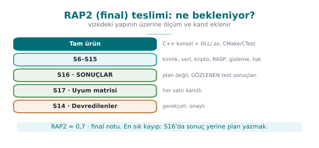
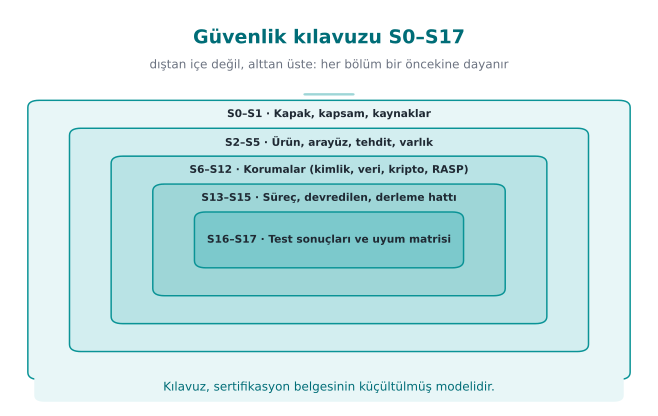
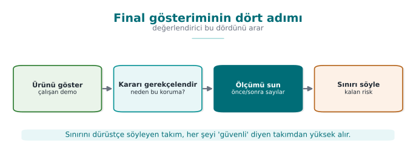
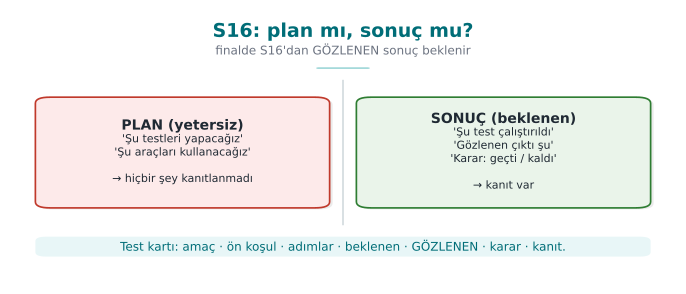

# Hafta 15 — Final Proje Gösterimleri

| | |
| --- | --- |
| **Tarih** | 25.12.2026 |
| **Öğrenme çıktıları** | ÖÇ.1–7 |
| **Süre** | 3 saat |

<!-- materyal:basla -->

[:material-file-pdf-box: Ders notu (PDF)](cen429-week-15-ders-notu.pdf){ .md-button download="cen429-week-15-ders-notu.pdf" }
[:material-file-word-box: Ders notu (DOCX)](cen429-week-15-ders-notu.docx){ .md-button download="cen429-week-15-ders-notu.docx" }
[:material-presentation: Sunum (PDF)](cen429-week-15-sunum.pdf){ .md-button download="cen429-week-15-sunum.pdf" }
[:material-microsoft-powerpoint: Sunum (PPTX)](cen429-week-15-sunum.pptx){ .md-button download="cen429-week-15-sunum.pptx" }
[:material-language-html5: Sunum (HTML, çevrimdışı)](cen429-week-15-sunum.html){ .md-button download="cen429-week-15-sunum.html" }
[:material-folder-zip: Tümünü indir (ZIP)](cen429-week-15-materyal.zip){ .md-button download="cen429-week-15-materyal.zip" }
[:material-fullscreen: Sunumu tam ekran aç](cen429-week-15-sunum.html){ .md-button .md-button--primary target=_blank }

<iframe src="../cen429-week-15-sunum.html" title="Hafta 15 — Final Proje Gösterimleri" loading="lazy" allowfullscreen></iframe>

Sunumun içine tıklayıp ok tuşlarıyla ilerleyin; tam ekran için sunumun sağ altındaki düğmeyi ya da yukarıdaki "Sunumu tam ekran aç" bağlantısını kullanın.

<!-- materyal:bitis -->

!!! abstract "Bu hafta ne oluyor?"
    Bu hafta ders anlatılmaz. Dönem projesinin **ikinci kontrolü (RAP2)** yapılır: her takım final raporunu (güvenlik
    kılavuzunun tamamı) teslim eder, korumalı uygulamasını ve test sonuçlarını gösterir. RAP2, final notunun **%70'idir**;
    kalan %30 final dönemindeki Quiz-2'dir (`Not_Final = 0,7·RAP2 + 0,3·QUIZ2`). Başarı notu
    `0,4·Not_Vize + 0,6·Not_Final` ile hesaplanır. Ayrıntılı rubrik proje rehberindedir.

!!! warning "Teslim ve süre kuralları"
    Geç teslim kabul edilmez (izlence, bölüm G). Gösterim sırası, takım başına süre ve teslim saati ders sınıfında
    duyurulur. Vize kontrolünde aldığınız geri bildirimlerin nasıl kapatıldığını gösterecek bir bulgu–aksiyon listesi
    hazırlayın.

---

## 1. Final kontrolü neyi ölçer?

İzlencedeki final kontrolü rubriğinin kriterleri ve güvenlik kılavuzunuzda karşılık gelen bölümler:

| Kriter | Öğrenme çıktısı | Kılavuzda nerede? | Hangi haftalar? |
| --- | --- | --- | --- |
| **Kriptografi uygulaması** | ÖÇ.2 | S8 algoritma envanteri, anahtar yaşam döngüsü ve hiyerarşisi, rastgele sayı | 3, 10 |
| **Güvenli iletişim** | ÖÇ.4 | S6 kimlik doğrulama ve bağlama · S11 TLS, sabitleme, mesaj düzeyi koruma | 3, 10 |
| **Varlık yönetimi** | ÖÇ.5 | S5 varlık listesi (tam) · S8 anahtarlar | 1, 3, 13 |
| **İkili uygulama korumaları** | ÖÇ.3 | S9 kod sağlamlaştırma (ileri) · S15 derleme, imzalama ve dağıtım hattı | 4, 5, 6, 9, 14 |
| **Güvenlik testi ve birim testleri** | ÖÇ.6 | S16 test ve doğrulama sonuçları | 4, 12 |
| **Güvenlik standartları** | ÖÇ.7 | S1 kaynaklar · S14 varsayımlar ve devredilenler · S17 uyum matrisi | 12, 13 |
| **Final rapor ve sunum** | ÖÇ.7 | Bütün bölümler; belge düzeni, tutarlılık, sunum | Tümü |

### Final raporunda bulunması gereken bölümler

Final kontrolünde bütün bölümler **tam** olarak beklenir:

| No | Bölüm | Vizeden farkı |
| --- | --- | --- |
| S0 | Kapak, belge kontrolü, sürüm geçmişi | Sürüm geçmişi güncel; değişiklikler işaretli |
| S1 | Kapsam, hedef kitle, kısaltmalar, kaynaklar | Tam |
| S2–S4 | Ürün, mimari, tehdit modeli | Vize geri bildirimleriyle güncel |
| S5 | Varlık listesi ve koruma şeması | **Tam**: her varlığın yaşam döngüsü ve C/I/I+ |
| S6 | Kimlik doğrulama, tanımlama, cihaz/sürüm bağlama | Yeni |
| S7 | Veri güvenliği + güvenlik kabuğu matrisi | Güncel |
| S8 | Kripto yöntemleri, anahtar yaşam döngüsü ve hiyerarşisi | Yeni |
| S9 | Kod sağlamlaştırma | **İleri** (gizleme dahil) |
| S10 | RASP + tepki politikası | Güncel |
| S11 | Güvenli iletişim | Yeni |
| S12 | Raporlama ve günlükleme politikası | Tam |
| S13 | Geliştirme süreci, SBOM, değişiklik yönetimi | Güncel SBOM |
| S14 | Varsayımlar ve devredilen gereksinimler | Yeni |
| S15 | Derleme, imzalama ve dağıtım hattı | Yeni |
| S16 | Güvenlik testi ve doğrulama | **Sonuçlar** (plan değil) |
| S17 | Gereksinim uyum matrisi | Tam |

---

## 2. Hazırlık kontrol listesi (9–14. haftalar)

??? success "9. ve 14. haftalar — İleri kod sağlamlaştırma (S9, S15)"
    - [ ] Gizlemenin hangi fonksiyonlara, neden uygulandığı; maliyet ölçümü (süre, boyut) öncesi/sonrası tablosu.
    - [ ] Derleme hattında gizleme ve imzalama adımları; sürüm kimliği ve özet değerleri.
    - [ ] Gizleme öncesi ve sonrası için ölçütler (anlamlı ad oranı, düz metin hassas dizge sayısı).

??? success "10. hafta — Kripto ve PKI (S8, S11)"
    - [ ] Algoritma envanteri: amaç, anahtar uzunluğu, kip, standart, kütüphane.
    - [ ] Anahtar yaşam döngüsü tablosu: üretim, saklama, kripto-periyot, yenileme, imha.
    - [ ] TLS doğrulaması; varsa SPKI sabitleme ve yedek pin; güncelleme dosyasında imza doğrulaması.

??? success "11. hafta — Anahtar koruması (S8)"
    - [ ] En az bir hassas varlık için koruma yöntemi ve gerekçesi (ör. cihaza bağlama, katmanlı koruma); kullanılmıyorsa
          neden kullanılmadığının gerekçesi.

??? success "12. hafta — Test ve değerlendirme (S16)"
    - [ ] Test planı ve **sonuçları**: her test için amaç, yöntem, beklenen ve gözlenen sonuç.
    - [ ] Birim testleri (kripto ve koruma fonksiyonları için) ve sürekli entegrasyon kaydı.
    - [ ] Vize geri bildirimlerinin bulgu–aksiyon listesi.

??? success "13. hafta — Gereksinimler (S14, S17)"
    - [ ] Uyum matrisi: uygulanan her gereksinim için durum, bölüm, doğrulama, kanıt.
    - [ ] Varsayımlar ve devredilen gereksinimler: kime, neden, nasıl.

---

## 3. Gösterim: önerilen akış

1. **Özet:** Ürün, mimari ve en kritik üç varlık (tek şema).
2. **Vizeden bu yana:** Geri bildirimler ve nasıl kapatıldıkları (bulgu–aksiyon listesi).
3. **Canlı gösterim:** Korumalı sürümü çalıştırın; kripto, güvenli iletişim ve en az bir koruma katmanını **çalışırken**
   gösterin (ör. kurcalanmış bir dosyanın ya da imzası bozuk bir güncellemenin reddedilmesi).
4. **Kanıt:** Testlerin, koruma tablosunun, SBOM'un ve uyum matrisinin kendisi; "şu komutla şu çıktı".
5. **Kalan risk:** Neyi bilerek kapsam dışı bıraktınız, neyi karşılayamadınız ve neden?

### Gösterimde sorulabilecek örnek sorular

- Bu anahtar hangi anahtardan türetiliyor, nerede duruyor, ne zaman siliniyor?
- Sertifika zincirinizi nasıl doğruluyorsunuz? Ad denetimi nerede yapılıyor?
- İmza doğrulamanız başarısız olursa ne oluyor? Eski ama geçerli imzalı bir sürüm yüklenebilir mi?
- Gizlemenin maliyetini ölçtünüz mü? Hangi fonksiyonları neden gizlediniz?
- Uyum matrisinizde "karşılandı" dediğiniz şu satırın kanıtı nerede?
- Hangi gereksinimi devrettiniz ve karşı taraf bunu nasıl karşılayacak?

### Sık yapılan hatalar

| Hata | Neden sorun? |
| --- | --- |
| Test planı var ama sonuç yok | Final kontrolünde S16'nın **sonuçları** beklenir |
| Uyum matrisinde kanıtsız "karşılandı" | Değerlendirici gözünde karşılanmamış sayılır |
| Kılavuz ile kod arasında sürüm farkı | Değerlendirilen ürün belirsizleşir; sürüm kimliği ve özet değerleri tutarlı olmalı |
| Kalan risk bölümünün boş olması | Hiçbir ürünün kalan riski sıfır değildir; boş bölüm eksik analiz demektir |
| Vize geri bildirimlerinin yok sayılması | Bulgu–aksiyon döngüsü sürecin parçasıdır |
| Depoda gerçek sır ya da kişisel veri | Ciddi güvenlik hatası; bütün değerler sentetik olmalı |

---

## 4. Akademik dürüstlük

İzlencenin "Akademik Dürüstlük" bölümü projede de geçerlidir. Teslim ettiğiniz her satırı açıklayabiliyor olmalısınız;
gösterimde takımın her üyesine soru sorulabilir. Başkasının kodunu ya da metnini kullandıysanız kaynağını belirtin.

---

## 5. Dönem sonunda

- Güvenlik kılavuzunuz, sertifikasyondan geçen ürünlerin belgelerinin küçültülmüş bir modelidir; iş başvurularında bir
  **portfolyo** öğesi olarak kullanabilirsiniz (gizli bilgi içermediğinden emin olun).
- Quiz-2 final döneminde yapılır; kapsam 9–14. haftalardır (16. hafta sayfası).
