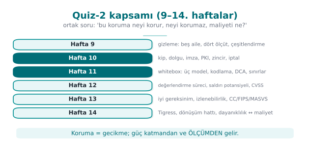
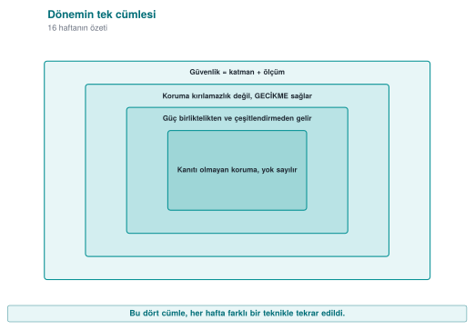
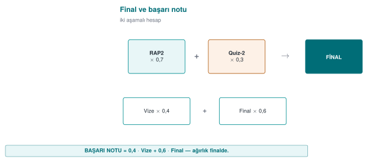
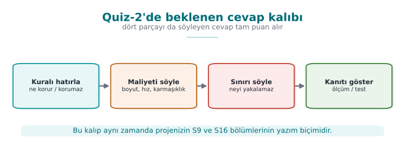

# Week 16 — Final Exam Period: Quiz-2

| | |
| --- | --- |
| **Date** | 04–17.01.2027 |
| **Learning outcomes** | LO.2–7 |
| **Duration** | 3 hours |

<!-- materyal:basla -->

<div class="materyal" markdown>

[:material-file-pdf-box: Lecture notes (PDF)](cen429-week-16-ders-notu.pdf){ .md-button download="cen429-week-16-ders-notu.pdf" }
[:material-file-word-box: Lecture notes (DOCX)](cen429-week-16-ders-notu.docx){ .md-button download="cen429-week-16-ders-notu.docx" }
[:material-presentation: Slides (PDF)](cen429-week-16-sunum.pdf){ .md-button download="cen429-week-16-sunum.pdf" }
[:material-microsoft-powerpoint: Slides (PPTX)](cen429-week-16-sunum.pptx){ .md-button download="cen429-week-16-sunum.pptx" }
[:material-language-html5: Slides (HTML, offline)](cen429-week-16-sunum.html){ .md-button download="cen429-week-16-sunum.html" }
[:material-folder-zip: Download all (ZIP)](cen429-week-16-materyal.zip){ .md-button download="cen429-week-16-materyal.zip" }
[:material-fullscreen: Open slides full screen](cen429-week-16-sunum.html){ .md-button .md-button--primary target=_blank }

</div>

<div class="sunum-cercevesi">
<iframe src="../cen429-week-16-sunum.html" title="Week 16 — Final Exam Period: Quiz-2" loading="lazy" allowfullscreen></iframe>
</div>

<p class="sunum-ipucu">Click inside the slides and use the arrow keys; use the button at the bottom right of the slides or the link above for full screen.</p>

<!-- materyal:bitis -->

!!! abstract "What happens this week?"
    **Quiz-2** is held in the final exam period. The scope is the topics of **weeks 9–14**; Quiz-2 is **30% of the
    final grade** (`Grade_Final = 0.7·RAP2 + 0.3·QUIZ2`). The date, time, place, duration and question format are
    announced in class. This page is a **study guide**.

!!! tip "The most effective way to study"
    Answer each week's "Self-check" questions without looking at the answers; redo [Week 10](../week-10/cen429-week-10.md)'s OpenSSL steps and Week
    13's compliance-matrix exercise yourself once more. What is measured is not memorization but the **why**.

---

## 1. Topic map: weeks 9–14

| Week | Topics (syllabus) | Focus while studying |
| --- | --- | --- |
| [**9** Advanced code obfuscation and diversification](../week-9/cen429-week-9.md) | Obfuscation taxonomy; opaque predicates, bogus control flow, dead code; data encoding; virtualisation-based obfuscation; measuring obfuscation (potency, resilience, cost) | The purpose and cost of obfuscation; measurement metrics; the basic techniques from [Week 4](../week-4/cen429-week-4.md) |
| [**10** Certificates and cryptographic methods](../week-10/cen429-week-10.md) | Choosing algorithms and key lengths; modes and padding; HMAC, encrypt-then-MAC, replay; RSA-OAEP/PSS, Ed25519/X25519; digital signatures; Diffie–Hellman and man-in-the-middle; PKI, X.509, chains; CRL/OCSP; PKCS#11/SoftHSM; post-quantum | The security-level table; the correct mode and padding; pitfalls of signature verification; the four questions of chain validation |
| [**11** White-box cryptography](../week-11/cen429-week-11.md) | White-box and black-box attacker models; table-based implementation; key protection; known attack families and countermeasures; software security modules | Attacker models; where white-box fits in layered defence, and its limits |
| [**12** Certification and penetration-test planning](../week-12/cen429-week-12.md) | The 13 steps of independent assessment; the testing expectations of standards; vulnerability assessment; penetration test plan and reporting | Target of evaluation, requirement template, finding–action, impact analysis, delta assessment |
| [**13** Security requirements](../week-13/cen429-week-13.md) | What makes a good requirement; traceability and the compliance matrix; deferred requirements; Common Criteria, EAL; FIPS 140-3; ETSI, GSMA, EMVCo, PCI, MASVS | The requirement → control → verification → evidence chain; CC and FIPS concepts |
| [**14** Tigress and diversification](../week-14/cen429-week-14.md) | Source-to-source obfuscation; composing transformations; seed-based diversification; evaluating resilience | The purpose of diversification; measuring cost and effectiveness |



---

## 2. Frequently confused concepts

| Concept A | Concept B | Difference |
| --- | --- | --- |
| CBC | GCM | CBC provides confidentiality only and needs padding; GCM provides confidentiality + integrity (AEAD), no padding |
| MAC | Signature | A MAC is symmetric; a signature is asymmetric and provides non-repudiation |
| Encrypt-then-MAC | MAC-then-encrypt | The former is the correct order; the latter is open to padding-oracle attacks |
| RSA-OAEP | RSA-PSS | OAEP is an encryption padding scheme, PSS is a signature padding scheme |
| Ed25519 | X25519 | Ed25519 is for signatures, X25519 is for key agreement |
| Root CA | Intermediate CA | The root is offline and self-signed; the intermediate CA issues day-to-day certificates |
| CN | SAN | Hostname verification is performed against the SAN |
| CRL | OCSP | A periodic list / a live query; stapling provides privacy and speed |
| HSM | SoftHSM | Hardware-backed protection / a software simulation (same PKCS#11 interface) |
| ST | PP | A product-specific security target / a common requirement set for a product class |
| EAL | Attack potential | The depth of the assessment / the resources an attacker requires |
| FIPS 140-3 Level 2 | Level 3 | Tamper evidence / tamper resistance and response |
| Met | Deferred | The product meets it itself / another party meets it (to whom, why and how it is written up) |
| ISO/IEC 27001 | Common Criteria | Certifies the organisation / certifies the product |
| Security impact analysis | Delta assessment | Documents the security impact of a change / re-assesses only the changed part |





---

## 3. Sample questions

### Cryptography and PKI (Week 10)



??? question "1. A design uses RSA-2048 together with AES-256. What would you say about its security level?"
    A system is only as strong as its weakest link: RSA-2048 provides roughly 112 bits of security, so AES-256's
    256-bit level goes to waste. If 128 bits is the target, RSA-3072 or X25519/Ed25519 should be used instead.

??? question "2. On decryption failures a server returns two different messages, 'invalid padding' and 'invalid MAC.' What is the risk?"
    A padding oracle: by modifying the ciphertext and watching which message comes back, an attacker can decrypt the
    message. A single, identical error should be returned instead, preferably by using AEAD.

??? question "3. What is wrong with this signature-verification code?"
    ```c
    int r = EVP_DigestVerify(ctx, imza, imza_n, veri, n);
    if (r) guncellemeyi_kur();
    ```

    Negative error values also evaluate as true; the check should be `r == 1`. In addition, the signed content
    should cover the version number, and older versions should be rejected.

??? question "4. `openssl verify -CAfile kok.crt sunucu.crt` fails, but adding `-untrusted ara.crt` makes it succeed. Why? What does this correspond to in the field?"
    The chain cannot reach the root without the intermediate certificate. In the field, a server failing to send its
    intermediate certificate is a common configuration mistake.

??? question "5. Accepting a certificate when the OCSP responder cannot be reached is which pattern? How is it mitigated?"
    Fail-open (soft-fail). Mandatory stapling (Must-Staple), or short-lived certificates.

??? question "6. How is a man-in-the-middle attack prevented against unauthenticated Diffie–Hellman?"
    The DH values are signed with a key of known identity (`CertificateVerify` in TLS 1.3), and the other party
    verifies that identity.

### Assessment and requirements (weeks 12–13)

??? question "7. Why must the target of evaluation (TOE) be defined 'uniquely'?"
    The report is valid only for the exact binary that was examined; a version number alone does not guarantee it
    is the same file. The binary, the source and a digest value are provided together.

??? question "8. What is the relationship between a security impact analysis and a delta assessment?"
    The impact analysis documents the security effect of the changes (the change log, the affected files); building
    on that document, the delta assessment re-assesses only the part that changed.

??? question "9. Why is 'the application must be secure' a bad requirement? How would you fix it?"
    It cannot be verified. It should be written to be measurable and singular: e.g., "the release build must be
    produced with a stack canary, PIE and full RELRO."

??? question "10. What does a row marked 'met' in the compliance matrix, but with no evidence, mean to an assessor?"
    It is treated as unmet; it becomes one of the first findings.

??? question "11. If a library cannot meet the 'secure installation and update' requirement, what should it do?"
    It should defer the requirement to the parent application, and the guide should state to whom and why it was
    deferred, and how the parent application will meet it.

??? question "12. Is it correct to say that an EAL4+ product 'is more secure than' an EAL2 product?"
    No. EAL is the depth of the assessment; security depends on the threats and objectives in the security target.
    The "+" indicates additional assurance components.

??? question "13. Is an application that uses a FIPS 140-3 validated library itself FIPS compliant?"
    Not on its own: the validation covers the module. The application must use the module in an approved mode and
    correctly, and must manage keys correctly.

??? question "14. Which sections of your project does ETSI EN 303 645's requirement to 'securely store sensitive security parameters' correspond to?"
    S5 asset list, S7 data security and the shell matrix, S8 key lifecycle.

!!! info "Weeks 9, 11 and 14"
    Sample questions for these weeks will be added to this section once their lecture notes are published. Until
    then, review [Week 4](../week-4/cen429-week-4.md)'s "Introduction to code obfuscation" and "Control-flow flattening" sections, and [Week 3](../week-3/cen429-week-3.md)'s
    "Introduction to white-box cryptography" section for the related topics.
