# Week 2 — Computer Viruses and Security Models

| | |
| --- | --- |
| **Date** | 25.09.2026 |
| **Learning outcomes** | LO.1 |
| **Duration** | 3 hours |
| **Prerequisites** | Week 1 (CIA, attacker models, STRIDE, attack trees); reading files in C; `cd` and `ls` in PowerShell or a Linux terminal |
| **Labs** | [`code/week-02`](https://github.com/ucoruh/cen429-secure-programming/tree/main/code/week-02) — 14 demos; runs on Windows (MSVC), WSL and Linux |

<!-- materyal:basla -->

<div class="materyal" markdown>

[:material-file-pdf-box: Lecture notes (PDF)](cen429-week-2-ders-notu.pdf){ .md-button download="cen429-week-2-ders-notu.pdf" }
[:material-file-word-box: Lecture notes (DOCX)](cen429-week-2-ders-notu.docx){ .md-button download="cen429-week-2-ders-notu.docx" }
[:material-presentation: Slides (PDF)](cen429-week-2-sunum.pdf){ .md-button download="cen429-week-2-sunum.pdf" }
[:material-microsoft-powerpoint: Slides (PPTX)](cen429-week-2-sunum.pptx){ .md-button download="cen429-week-2-sunum.pptx" }
[:material-language-html5: Slides (HTML, offline)](cen429-week-2-sunum.html){ .md-button download="cen429-week-2-sunum.html" }
[:material-folder-zip: Download all (ZIP)](cen429-week-2-materyal.zip){ .md-button download="cen429-week-2-materyal.zip" }
[:material-fullscreen: Open slides full screen](cen429-week-2-sunum.html){ .md-button .md-button--primary target=_blank }

</div>

<div class="sunum-cercevesi">
<iframe src="../cen429-week-2-sunum.html" title="Week 2 — Computer Viruses and Security Models" loading="lazy" allowfullscreen></iframe>
</div>

<p class="sunum-ipucu">Click inside the slides and use the arrow keys; use the button at the bottom right of the slides or the link above for full screen.</p>

<!-- materyal:bitis -->

!!! abstract "By the end of this week you will be able to"
    1. Distinguish **malware** (virus, worm, trojan horse, ransomware, rootkit, bot) by behaviour, and show a
       virus's three parts (infection mechanism, trigger, payload) in one example.
    2. Explain **why and how malware hides** (encryption, oligomorphism, polymorphism, metamorphism) and see
       in a working demo why this makes signature-based detection harder.
    3. Discuss **countermeasures** (signature, heuristic, behaviour-based detection, sandboxing, emulation) and
       the false-positive/false-negative limits of each.
    4. Write an access policy with an **access control matrix**; state the difference between **DAC / MAC /
       RBAC**.
    5. Show the rules of the **Bell–LaPadula, Biba and Clark–Wilson** models and what each protects
       (confidentiality/integrity) in a simulator; connect them to the **Unix and Windows** access models.
    6. Map a vulnerability to a **CWE** family, and explain the role of the **CWE Top 25 / OWASP Top 10 /
       MASVS** lists.
    7. Give a base **CVSS v3.1** score to a vulnerability (know the difference from v4.0) and associate it with
       a **CVE** identifier.
    8. Describe the **vulnerability lifecycle** (discovery → disclosure → patch → public release) and
       **responsible disclosure**.

??? info "Course flow (timing plan for the instructor)"
    | Time | Section | What happens |
    | --- | --- | --- |
    | 0:00–0:10 | Warm-up | Recap of last week; discussion of "what is malware, is everything a virus?" |
    | 0:10–0:35 | 1–4 | History, anatomy, types of malware; epidemic model — **Demo 09** |
    | 0:35–0:50 | 5–7 | Concealment and countermeasures — **Demo 01**, **02**, **07**, **08**; incident case studies |
    | 0:50–1:00 | Break | |
    | 1:00–1:30 | 8–9 | Attack trees — **Demo 04**; audit logging — **Demo 10**, **11** |
    | 1:30–1:50 | 10–12 | Access control and formal models — **Demo 03**, **14** (class activity) |
    | 1:50–2:00 | Break | |
    | 2:00–2:20 | 12 | Unix and Windows models — **Demo 12**, **13**, **06** |
    | 2:20–2:50 | 13–16 | CWE / OWASP / MASVS / CVE / CVSS / lifecycle — **Demo 05**, class activity |
    | 2:50–3:00 | 17–24 | Checklist, project contribution (S4), self-check; remaining exercises left to students |

!!! tip "Prepare the lab in advance"
    The demos compile on both **Windows** (Visual Studio 2022 Community, MSVC) and **WSL/Linux** (GCC). One
    source, two platforms: for SHA-256 and AES, Windows uses the operating system's BCrypt library and Linux
    uses OpenSSL (`code/common/cen429_kripto.h`); on Windows you do not need to install OpenSSL separately.

    === "Windows (PowerShell)"
        ```powershell
        git clone https://github.com/ucoruh/cen429-secure-programming.git
        cd cen429-secure-programming\code
        .\build.ps1
        cd week-02\01-imza-tarayici ; .\demo.ps1
        ```

    === "WSL / Linux"
        ```bash
        sudo apt install -y build-essential cmake libssl-dev python3
        git clone https://github.com/ucoruh/cen429-secure-programming.git
        cd cen429-secure-programming/code && ./build.sh
        cd week-02/01-imza-tarayici && sh demo.sh
        ```

    In Visual Studio: **File > Open > Folder** → `code` → select the **Windows (MSVC)** or **WSL (GCC)**
    configuration from the top bar → **Build > Build All**. The TOCTOU demo (Demo 6) only runs on WSL/Linux.

!!! warning "Ethics rule — especially important this week"
    This week we learn about malware **conceptually**. **No demo contains real malware, self-replicating
    code, file deletion/encryption, or network attacks.** All demos are **safe simulations** that run only
    inside their own folders, without administrator privileges (a toy file format, a simulator, a calculator).
    Try what you learn **only on your own computer and only on the given demos**. Writing, spreading, or
    infecting someone else's system with malware is a crime.

---

## 0. Basic concepts (from zero)

This section **assumes no prior knowledge**. We define, from zero, the terms we will use for the rest of the
week. If you do not know a term, read this section first; the following sections build on these.

### Why this section?

This week terms like "polymorphic virus", "Bell–LaPadula", "CVSS" will come up.

We assume you know none of them.

Let's first define each one **one by one**.

### Malware

- **Malware:** a program written to cause harm.
- "Virus" is one subtype; not everything is a virus.
- Types: virus, worm, trojan horse, ransomware, spyware…

### Virus, worm, trojan horse

- **Virus:** spreads by **infecting** another program.
- **Worm:** **copies itself** over the network, on its own.
- **Trojan horse:** looks useful while secretly carrying something harmful.

### Ransomware and others

- **Ransomware:** encrypts files and demands a ransom.
- **Spyware:** secretly collects information.
- **Backdoor:** leaves behind hidden access.

### A virus's three parts

- **Infection mechanism:** how it spreads.
- **Trigger:** when it activates.
- **Payload:** what it does.

### Concealment: polymorphic/metamorphic

- **Polymorphic:** encrypts itself **differently** in every copy (evades signatures).
- **Metamorphic:** **rewrites** its own code in every copy.
- Goal: evade signature-based detection.

### Detection: signature vs heuristic

- **Signature-based:** looks for the fingerprint of a known malware sample (fast, misses new ones).
- **Heuristic/behaviour-based:** looks for suspicious **behaviour** (finds new ones, false alarms).

### Entropy (randomness)

- **Entropy:** how random data appears to be.
- Encrypted/packed code has **high entropy**.
- Detection clue: a high-entropy region is suspicious.

### Access control

- **Access control:** who (subject), on what (object), can do what (right)?
- Modelled with a **matrix**.
- Models: DAC, MAC, RBAC.

### DAC / MAC / RBAC

- **DAC:** the owner decides the permissions (Unix file permissions).
- **MAC:** the system imposes mandatory rules (labelled).
- **RBAC:** permissions are tied to **roles**.

### Formal models

- **Bell–LaPadula:** **confidentiality** (no read up).
- **Biba:** **integrity** (no read down — the reverse of BLP).
- **Clark–Wilson:** commercial integrity (well-formed transactions).

### Audit log

- **Audit log:** who did what and when — a log kept as **evidence**.
- Must be tamper-resistant.
- Watch out for log injection (CWE-117).

### CWE, CVE, CVSS

- **CWE:** a catalogue of weakness **types** (e.g. CWE-416).
- **CVE:** a **specific** flaw in a specific product (e.g. CVE-2024-xxxx).
- **CVSS:** a vulnerability's **severity score** (0–10).

### OWASP and the vulnerability lifecycle

- **OWASP Top 10 / MASVS:** common vulnerabilities and mobile requirements.
- **Responsible disclosure:** reporting a vulnerability to the vendor first.
- Flaw lifecycle: discovery → notification → patch → release.

### Now we are ready

Terms:

malware · virus/worm/trojan/ransomware · a virus's three parts · polymorphic · signature/heuristic detection ·
entropy · access control (DAC/MAC/RBAC) · BLP/Biba · audit log · CWE/CVE/CVSS · OWASP

Now: the big picture of threat, model, and classification.

### Today's plan (3 hours)

| Hour | Topic |
| --- | --- |
| 1 | Malware: history, anatomy, types · concealment |
| 2 | **Demo 1–2** · countermeasures · attack tree (**Demo 4**) · access and models (**Demo 3, 6**) |
| 3 | CWE · OWASP · CVE · CVSS (**Demo 5**) · lifecycle · project |

**Demos:** `code/week-02` — Windows `.\demo.ps1` · WSL/Linux `sh demo.sh`

### Brief history — malware and security models

- **1949** — von Neumann: theory of **self-replicating** automata (the mathematical root of the virus)
- **1971** Creeper · **1986** Brain (first PC virus) · **1988** **Morris Worm** halts the internet
- **1973–77** — **Bell–LaPadula** (confidentiality), **Biba** (integrity); **1987** Clark–Wilson
- **1999 → 2006** — **CVE** · **CWE** · **CVSS**: a common classification language

> Two separate strands: **recognising malware** + **modelling access**. Today we cover both at once.

### Learning outcome and scope

- **LO.1:** Identifies and classifies common software security vulnerabilities.
- This week combines three topics:
  - **Threat:** malware types and concealment
  - **Defence:** access control and formal models
  - **Common language:** CWE · CVE · CVSS · OWASP · MASVS

> ⚠️ **Ethics:** No demo contains real malware. All of them are **safe simulations** that run in their own
> folder, without administrator privileges.

## 1. This week's big picture: threat, model, classification

Last week we built the language of security: asset, threat, vulnerability, risk; the attacker model; STRIDE
and the attack tree. This week we fill in three columns of that language:

!!! note "Brief history: malware and security models"
    - **1949** — von Neumann establishes the theory of **self-replicating** automata: the mathematical root of
      the virus idea.
    - **1971** — Creeper (first experimental worm) · **1986** Brain (first PC virus) · **1988** the **Morris
      Worm** halts a large part of the internet and puts security on the agenda.
    - **1973–1977** — the **Bell–LaPadula** (confidentiality) and **Biba** (integrity) access models; **1987**
      Clark–Wilson (commercial integrity).
    - **1999 → 2006** — a common classification language: **CVE** (a concrete flaw), **CWE** (weakness type),
      **CVSS** (severity score).

    So "recognising malware" and "modelling access" are two separate strands; this week we cover both at once.

- **Threat side — malware:** We will break the attacker's most visible tool, malicious software, into types
  (virus, worm, trojan horse, ransomware) and see **how it hides**. Because part of the answer to "what is
  ranged against us?" when designing a defence is this.
- **Defence side — security models:** We will learn to answer "who can access what?" not arbitrarily, but with
  a **formal model** (access matrix, DAC/MAC/RBAC, Bell–LaPadula, Biba, Clark–Wilson). These models are the
  foundation of the permission architecture of operating systems (Unix, Windows).
- **Common language — classification:** When we find a vulnerability we must name it in a language everyone
  understands and be able to measure its severity. That is why we have **CWE** (flaw type), **CVE** (specific
  flaw), **CVSS** (severity score), and **OWASP/MASVS** (priority lists).

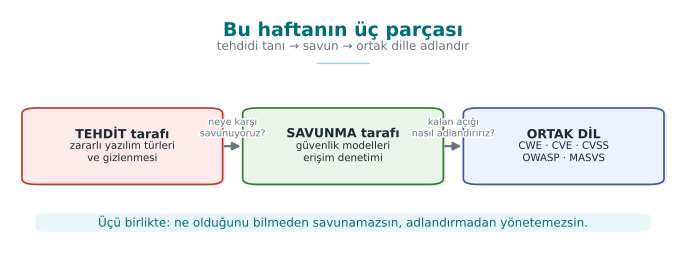

These three are linked: without recognising malware you cannot build a model against it, without building the
model you cannot see the remaining flaws, and without naming flaws in a common language you cannot know which
threat to prioritise.

!!! note "This course's point of view"
    A classic "virus course" teaches you to use antivirus software. We look at it from a **programmer's**
    point of view: a piece of malware's concealment technique (polymorphism, entropy) and our own technique
    for **protecting** our code (code obfuscation, encrypted constants — Weeks 9 and 11) are, most of the
    time, **the same techniques**. Attacker and defender pull tools out of the same box; the difference is
    intent and context.

---

## 2. What is malware? A brief history

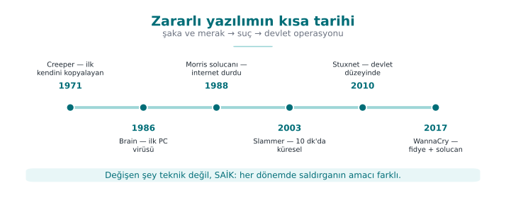

**Malware** ("malicious software") is any program written to cause harm, steal data, use resources, or seize
control without the owner's permission and knowledge. In everyday language "virus" is used for all of these;
however, a virus is only **one type**. To see the distinction, let's first look at a few milestones.

| Year | Event | Type | Why does it matter? |
| --- | --- | --- | --- |
| 1971 | Creeper | Experimental worm | First experimental self-copying program on ARPANET ("I'm the creeper") |
| 1984 | Fred Cohen's definition | Theory | First formal definition of a computer virus and the proof that "complete detection is impossible" |
| 1986 | Brain | Boot sector virus | First widespread PC virus; infected the boot sector of a floppy disk |
| 1988 | Morris worm | Worm | First major self-propagating incident on the internet; slowed down thousands of machines |
| 1999 | Melissa | Macro virus | Spread rapidly via Word documents and email |
| 2000 | ILOVEYOU | Worm/trojan | Affected millions of machines via an email attachment; the power of social engineering |
| 2001 | Code Red | Worm | Used a buffer overflow flaw in a web server and spread in memory |
| 2008 | Conficker | Worm/bot | Built a botnet out of millions of machines |
| 2010 | Stuxnet | Targeted worm | Targeted industrial controllers (PLCs); the symbol of a sophisticated, state-sponsored attack |
| 2013+ | CryptoLocker | Ransomware | Popularised the model of encrypting files and demanding a ransom |
| 2017 | WannaCry | Ransomware + worm | Ransomware that self-propagated via a network flaw; affected hospitals/companies worldwide |
| 2017 | NotPetya | Destructive (wiper) | Looked like ransomware but actually destroyed data permanently; caused enormous economic damage |

!!! quote "Fred Cohen (1984) and the proof of the detection limit"
    Cohen defined a virus as "a program that can copy itself (possibly by modifying itself) into other
    programs" and proved an important theoretical result: **it is impossible to write a general algorithm
    that correctly answers the question "is this program a virus?" in every case** (it reduces from the
    halting problem). The practical consequence is this: no antivirus detects 100%; every method has false
    positives (flagging something clean) and false negatives (missing something malicious). This week we will
    see this with our own eyes in [Demo 01](#demo-01-signature-polymorphism-heuristic-analysis-emulation).

!!! info "Term: 'in the wild'"
    The situation where a piece of malware is circulating on real users' computers — spreading in the field,
    not only in a laboratory. In this course we work with **no** in-the-wild sample whatsoever; we use only
    the concepts and safe simulations.

!!! quote "Real incident: WannaCry (2017) — one week's lesson for a programmer"
    WannaCry is instructive because it combines three different topics in a single incident. (1)
    **Propagation:** it spread like a **worm**, without the user doing anything, by exploiting a buffer
    overflow flaw (EternalBlue) in a network file-sharing protocol — that is, the overflow class we will see
    this week (Week 1) directly became a worm's engine. (2) **Payload:** on machines it reached, it demanded
    a ransom by **encrypting** files; this is exactly the trace this payload leaves behind — the **entropy
    spike** we will see in [Demo 2](#demo-02-entropy-meter-how-is-encryptedpacked-content-recognised). (3)
    **Patch gap:** the patch for the exploited flaw had been released **weeks before** the attack;
    nonetheless, hundreds of thousands of machines that had not updated (including hospitals and factories)
    were affected. Three lessons for the programmer: overflow flaws do not stay theoretical, defence must
    also watch behaviour, and releasing a patch is not enough — it must be applied. These three threads are
    exactly this week's backbone.

---

## 3. The anatomy and types of malware

### A virus's three parts

The easiest way to understand a virus is to split it into three functions. Using a disease analogy:

| Part | Also known as | What it does | Disease analogy |
| --- | --- | --- | --- |
| **Infection mechanism** | infection mechanism | Copies itself into another carrier | The virus entering a cell and multiplying |
| **Trigger** | trigger / logic bomb | The condition for "when do I activate?" (date, counter, event) | Incubation period |
| **Payload** | payload | The part that does the actual damage (delete data, steal, encrypt) | Symptoms |

Not all three parts have to be present: there are viruses with no payload that only spread (they still
consume resources and constitute a vulnerability). Code that waits for the trigger condition and then goes
off is called a **logic bomb**.

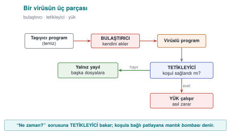

### Types: by propagation style

The most useful way to distinguish malware is by **how it spreads and what it does**:

=== "Virus"
    Attaches itself to **another program or file**; running requires that carrier to be executed (by the
    user). Subtypes:

    - **Program (file) virus:** Infects executable files (`.exe`, ELF); when the file runs, the virus runs
      too.
    - **Macro virus:** Written in the macro language inside office documents (Word, Excel); runs when the
      document is opened. Melissa spread this way in 1999. Today, the "enable macros" trap is still an
      attack vector.
    - **Boot sector virus:** Infects the disk's first sector (boot sector / MBR); runs **before** the
      operating system while the computer is starting up. Brain in 1986 was like this. Modern UEFI Secure
      Boot has made this class much harder.

=== "Worm"
    Spreads over the network **on its own, without needing a carrier or user interaction**. Usually exploits
    a flaw (e.g. an overflow) in a network service. Morris (1988), Code Red (2001), WannaCry (2017) spread
    this way. A worm's danger is its **speed of propagation**: it can reach hundreds of thousands of machines
    within minutes.

=== "Trojan horse"
    Software that looks like a useful or innocent program while causing harm in the background. It **does
    not copy itself**; it relies on the user willingly running it (social engineering). A "free game" or a
    "fake update" is very often a trojan horse.

=== "Ransomware"
    A payload type that **encrypts** the user's files and demands money for the decryption key. There are
    variants that spread like a worm (WannaCry) or infect like a trojan horse. In [Demo
    02](#demo-02-entropy-meter-how-is-encryptedpacked-content-recognised) we will safely see the **entropy
    trace** ransomware leaves behind — without actually encrypting a single file.

=== "Others"
    - **Rootkit:** **Hides** itself and other malware from the operating system (removes itself from file,
      process, and network connection listings). The hardest class to detect.
    - **Bot / botnet:** A network of machines taking remote commands; used for DDoS, spam, and cryptomining.
    - **Spyware / adware:** Collects data or displays advertisements.
    - **Wiper:** Looks like ransomware but **permanently destroys** data (NotPetya). The goal is not money
      but destruction.

!!! example "Quick classification in class (3 minutes)"
    Which type are the following? (Answers are in the hidden box.)

    1. The "invoice.pdf.exe" email attachment runs when opened and mails itself to everyone in the address
       book.
    2. It exploits an overflow flaw in a web server and infects vulnerable servers on the internet on its
       own.
    3. A "free video player" is installed and secretly sends out browser passwords in the background.
    4. It encrypts the files it opens and leaves a "pay up" note on the screen.

    ??? success "Answers"
        1. Worm/trojan mix (the user opens it → it spreads) · 2. Worm · 3. Trojan horse (+ spyware) ·
        4. Ransomware.

## 4. How fast do worms spread? The epidemic model

What determines a worm's danger is its **speed**, far more than its payload. Releasing a patch, distributing
a signature, writing a firewall rule takes hours, sometimes days; a worm, on the other hand, can reach
saturation within minutes. To see this speed through calculation rather than intuition, we use a simple model
borrowed from epidemiology.

### The SI model: susceptible and infected

We split the vulnerable machines on the network into two groups: **susceptible** (S, not yet infected) and
**infected** (I). Every infected machine scans random addresses per unit time; if the scanned address happens
to hit a susceptible machine, it infects it too. If `i` is the number of infected machines and `N` is the
total number of vulnerable machines:

```text
i(t + dt) = i(t) + beta * i(t) * (1 - i(t) / N) * dt
```

- `beta * i(t)`: the more infected machines there are, the faster scanning happens (growth is
  **exponential**).
- `(1 - i(t) / N)`: as susceptible machines run out, the hit probability drops (growth **saturates**).

The result is an S-shaped curve: a long, quiet opening phase, followed by a sudden explosion, then
saturation. The opening phase is the defender's only window of opportunity; once the explosion starts, a
human-speed response can no longer keep up.

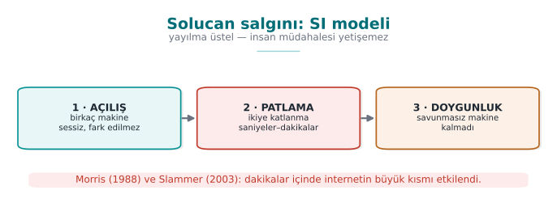

### Real numbers

| Event | Entry path | Speed |
| --- | --- | --- |
| Code Red (July 2001) | IIS `.ida` buffer overflow (CVE-2001-0500) | ~359,000 servers by 19 July; doubling time ~37 minutes |
| SQL Slammer (January 2003) | SQL Server resolution service, UDP 1434, a single 404-byte packet (CVE-2002-0649) | Doubled roughly every ~8.5 seconds in the first minute; ~90% of vulnerable machines within ~10 minutes |

Two things made Slammer this fast: a single UDP packet was enough (no waiting to establish a connection), and
it scanned the network as fast as possible to find targets. Ironically, the reason it slowed down after the
first minute was not the defence — it was that **the network bandwidth had filled up**.

### Demo 09 — Worm Epidemic Simulation

!!! info "Demo 09 · `code/week-02/09-salgin-simulasyonu` · calculation only, no network"
    The program computes the SI equation above step by step and plots the curve of three scenarios as an
    ASCII chart: Code-Red-like (slow random scanning), Slammer-like (fast random scanning), and a
    **hitlist** (the attacker starts with 10,000 pre-prepared targets). It performs no network operations
    and writes no files.

=== "Windows (PowerShell)"

    ```powershell
    cd code\week-02\09-salgin-simulasyonu
    .\demo.ps1
    ```

=== "WSL / Linux"

    ```bash
    cd code/week-02/09-salgin-simulasyonu
    sh demo.sh
    ```

```text title="sh demo.sh — çıktı (kısaltılmış; Windows'ta aynı)"
  Senaryo: Slammer benzeri (rastgele tarama, hizli UDP)
    N=75000 savunmasiz  i0=1  ikilenme=8.50 s
      zaman        enfekte    oran
          54 s          78    0.1% |..............................|
         1.5 dk       1430    1.9% |#.............................|
         2.1 dk      19700   26.3% |########......................|
         2.4 dk      45601   60.8% |##################............|
         2.7 dk      65251   87.0% |##########################....|
         3.3 dk      74429   99.2% |##############################|
      -> %90 doygunluk:    2.7 dk

  KARSILASTIRMA (%90 doygunluga ulasma):
    Code Red benzeri : 48013 s (~13.3 saat)
    Slammer benzeri  : 165 s (~2.7 dakika)
    Hitlist          : 50 s (~0.8 dakika)
```

When reading the output, look at three things:

1. **Opening phase:** in the Slammer-like scenario, only 78 machines are infected in the first 54 seconds.
   Nothing seems to be happening on the chart; yet the explosion begins a minute and a half later. Saying
   "it's little for now" is the most expensive mistake you can make with exponential growth.
2. **Speed (`beta`):** in the same model, merely increasing the scanning speed brings the saturation time
   down **from hours to minutes**. That is why defence against a worm has to be automatic: a firewall rule,
   network segmentation, a patch applied in advance.
3. **Hitlist:** if the attacker skips the opening phase with a pre-prepared target list, the defender's
   already narrow window of opportunity closes completely.

!!! success "A lesson for the programmer"
    The programmer does not determine the propagation speed; but the programmer does make **the mistake
    that makes the first infection possible**. Code Red, Slammer, and Blaster all spread because of code
    that copied network-supplied data into a buffer without bounds checking. In the age of the worm, a
    single overflow bug means hundreds of thousands of machines within minutes. Also: every network port you
    listen on is an attack surface; never opening an unused service is the cheapest countermeasure.

!!! question "Try it yourself"
    Halve the `beta` value in `salgin.c` (e.g. a network with a high patch rate, or a firewall that limits
    scanning speed). How does the saturation time change? In the hitlist scenario, if you lower `i0` to 100,
    how much difference is left?

## 5. Propagation and Concealment: How Does It Go Unnoticed?

A virus constantly tries to **change** so as not to get caught. This has a four-step ladder; each step makes
signature-based detection a little harder:

| Method | What changes? | What does the antivirus do? |
| --- | --- | --- |
| **Encryption** (encrypted) | The body is encrypted with a different key in every copy; the **decryptor stays constant** | Signs the constant decryptor |
| **Oligomorphism** | The decryptor has several (dozens of) different forms | Signs all decryptor forms |
| **Polymorphism** | The decryptor is **regenerated** in every copy (infinite variation), the body stays encrypted | Tries to decrypt it (emulation) |
| **Metamorphism** | **No encryption**; the **entire** code is rewritten in every copy (register swapping, junk code, instruction substitution) | Looks at behaviour; very hard |

The key idea is this: **the encrypted body looks completely different in every copy but is always the same
once decrypted.** This is exactly why encrypted/packed content has a tell: **high entropy** (see [Demo
02](#demo-02-entropy-meter-how-is-encryptedpacked-content-recognised)). In a polymorphic virus, the changing
decryptor still has to decrypt the body in the end; defence rests exactly on this point — **emulation**.

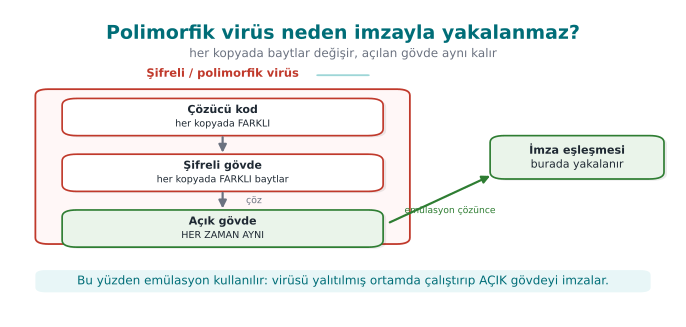

### Demo 01 — Signature, Polymorphism, Heuristic Analysis, Emulation

!!! info "Demo 01 · `code/week-02/01-imza-tarayici` · Book: Recipe 12.1"
    Shows how the four scanning methods work — **and where each falls short** — with working code. There is
    **no** real malware. Instead, this demo uses a **non-executable** "CAPSULE" data format invented for
    this demo: a magic header + a "decryptor" command line + a (plain or scrambled) body. This structure
    mimics the skeleton of real encrypted/polymorphic malware, but it contains only harmless text.

The capsule format (completely harmless, a toy format we invented ourselves):

```text
KAPSUL/1
COZUCU: ALGO=xs32 TOHUM=1a2b3c4d UZUNLUK=3782 COZ
<3782 bayt karıştırılmış gövde...>
```

The sample generator writes six files: a captured sample (`ornek_a.bin`), a copy of it that differs by
**a single byte**, and three "polymorphic" copies of **the same body** with different keys/decryptors. Now
let's try each method in turn:

Compile and run it (`.\build.ps1` or `./build.sh` inside `code/`, then in the demo folder):

=== "Windows"
    ```powershell
    cd code\week-02\01-imza-tarayici ; .\demo.ps1
    ```

=== "WSL / Linux"
    ```bash
    cd code/week-02/01-imza-tarayici && sh demo.sh
    ```

**Step 2 — Hash signature.** Compares the file's SHA-256 digest against a digest in the database.

```text title="demo — Adım 2"
ADIM 2 — Hash (ozet) imzasi: birebir ayni dosyayi yakalar
  temiz.txt          TEMIZ      sha256=ce1f848e3795ae86...
  ornek_a.bin        YAKALANDI  Ornek.MaviKedi.A
  ornek_a_1bayt.bin  TEMIZ      sha256=a4220c8a0a41a9ff...
   ^ Tek bir bayt degisince ozet bambaska: hash imzasi atlatildi.
```

A hash signature is **exact but brittle**: when a single byte changes, the digest changes completely (the
avalanche effect). That is why an attacker can evade a hash signature just by appending one meaningless byte
to the file.

**Step 3 — Pattern (byte-sequence) signature.** Checks whether a known byte sequence occurs inside the file.

```text title="demo — Adım 3"
ADIM 3 — Desen (bayt dizisi) imzasi: kucuk degisikliklere dayanikli
  ornek_a.bin        YAKALANDI  Ornek.MaviKedi.A
  ornek_a_1bayt.bin  YAKALANDI  Ornek.MaviKedi.A
  poli_1.bin         YAKALANDI  Ornek.Cozucu.xs32
  poli_2.bin         YAKALANDI  Ornek.Cozucu.xs32
  poli_3.bin         TEMIZ
   ^ poli_1 ve poli_2 cozucu deseniyle yakalandi; cozucusu
     degisen poli_3 hic yakalanamadi.
```

A pattern signature is resistant to a single-byte change, and it catches `poli_1`/`poli_2` by signing the
**decryptor code**. But `poli_3` (a different algorithm, a different instruction order), whose decryptor has
also changed, cannot be caught at all — this is exactly **polymorphism's** power against signature-based
detection.

**Step 4 — Same body, different key.** The first body bytes of the three polymorphic copies:

```text title="demo — Adım 4"
  poli_1.bin   ilk 16 govde bayti: 6f 57 bc 28 e2 81 dd 85 87 e1 f4 3d ...
  poli_2.bin   ilk 16 govde bayti: 83 b7 07 06 d8 38 3d 53 27 06 bc e8 ...
  poli_3.bin   ilk 16 govde bayti: bd 2c 85 32 f4 1f 3a 57 7f 6b 08 c0 ...
```

All three carry **the same harmless body**, but their bytes are completely different. Writing a signature for
this is close to impossible.

**Step 5 — Heuristic analysis.** When there is no signature, it scores **suspicious features**: high entropy
(+50), decryptor code that runs before the body (+30), meaningless "junk" instructions (+20).

```text title="demo — Adım 5"
  temiz.txt          TEMIZ      puan=  0 H=4.29
  ornek_a.bin        TEMIZ      puan=  0 H=4.71
  poli_1.bin         SUPHELI    puan= 80 H=7.95 entropi cozucu
  poli_3.bin         SUPHELI    puan=100 H=7.95 entropi cozucu cop-komut
  arsiv.bin          SUPHELI    puan= 50 H=7.88 entropi
   ^ arsiv.bin zararsiz yuksek-entropili dosya: YANLIS POZITIF.
     ornek_a.bin ise sezgisel olarak gozden kacti (yanlis negatif).
```

Heuristic analysis caught the polymorphic copies without a signature — but it made two mistakes: it flagged
a harmless, high-entropy file (`arsiv.bin`) as **suspicious** (a **false positive**), and it missed the
plain-bodied `ornek_a.bin` (a **false negative**). This is exactly the uncertainty Cohen was talking about.

**Step 6 — Emulation.** Runs the capsule's decryptor in a **safe "virtual machine"** (not real machine code,
a toy language with 6 instructions), then scans the decrypted body again with the pattern:

```text title="demo — Adım 6"
  temiz.txt          TEMIZ      kapsul degil
  ornek_a.bin        YAKALANDI  Ornek.MaviKedi.A | cozucu yok (duz govde)
  poli_1.bin         YAKALANDI  Ornek.MaviKedi.A | 5 komut, 0 BOS, xs32
  poli_2.bin         YAKALANDI  Ornek.MaviKedi.A | 5 komut, 0 BOS, xs32
  poli_3.bin         YAKALANDI  Ornek.MaviKedi.A | 8 komut, 4 BOS, lcg8
  arsiv.bin          TEMIZ      kapsul degil
```

Emulation caught **all of them**: once the body was decrypted, all three polymorphic copies reduced to the
same signature. Real antivirus products also "run" a suspicious file in an isolated virtual environment and
scan its decrypted form. This is powerful but expensive, and if the malware detects it (anti-emulation), it
can hide.

!!! success "Lesson"
    A single method is not enough. Modern protection is **layered**: hash (fast, exact) → pattern
    (resilient) → heuristic (signature-free) → emulation/sandbox (deep) → behaviour monitoring (while
    running). Each layer exists to catch what the previous one missed — just like last week's **defence in
    depth**.

!!! note "How is this applied in the field?"
    The other side of the coin, from the standpoint of protecting your own code: a mobile payment
    application keeps sensitive strings and constants **encrypted** to make reverse engineering harder, and
    decrypts them at the moment of use. That is, legitimate software also uses the "encrypted body +
    decryptor" pattern (Weeks 9 and 11). The difference is that here it protects your asset, while in a
    virus it evades signatures. This is exactly why a security assessor looks for **high-entropy regions**:
    "there's something encrypted here, where's the decryptor, how does it find the key?"

!!! danger "A common mistake"
    The idea that "my signature database is up to date, so I'm safe." Signature-based detection **only**
    catches known malware; a polymorphic/metamorphic or never-before-seen (zero-day) sample evades the
    signature. That is why defence **starts** with a signature **but does not end there**.

---

## 6. Countermeasures: How Do We Catch It?

We saw four methods in the demo above. Let's now pull the whole family of countermeasures together:

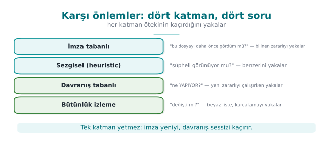

| Method | How does it work? | Strength | Weakness |
| --- | --- | --- | --- |
| **Signature-based** | Looks for a known malware sample's digest/pattern | Fast, low false-positive rate | Misses unknown and polymorphic samples |
| **Heuristic** | Suspicious features are scored | Finds new samples without a signature | Produces false positives/negatives |
| **Behaviour-based** | What the program does **while running** is monitored (file encryption, hooking, network) | Resistant to concealment | Some damage may already have occurred; evasion techniques exist |
| **Sandbox** | The suspicious file is run in an isolated environment | Sees real behaviour | Slow; malware may detect "I'm in a VM" and go dormant |
| **Emulation** | Code is stepped through a simulator that is like a sandbox but lighter | Unpacks the decryptor | Can be evaded with anti-emulation techniques |
| **Reputation / cloud** | The file's prevalence, source, and signer are queried | Good against fast-spreading threats | Requires connectivity and raises privacy concerns |

Modern endpoint protection (EDR/XDR) combines all of these and gives particular weight to **behaviour**. For
example, "a process that reads hundreds of files in a short time and writes them back in a high-entropy form"
is nearly certain evidence of ransomware — from behaviour alone, **without looking inside** the files.

!!! note "How is this applied in the field? — defence and attack, the same toolbox"
    The techniques malware uses to hide and the techniques legitimate software uses to **protect itself**
    are very often the same. A mobile payment library keeps sensitive strings encrypted to slow down reverse
    engineering and decrypts them at runtime (Weeks 9, 11); this is exactly a polymorphic malware's
    "encrypted body + decryptor" pattern. The difference is **intent and context**: one protects your asset,
    the other evades signatures. That is why, when a security assessor sees high-entropy regions in your
    binary, they say "there's something encrypted here" and ask the natural question: where is the
    decryptor, where does it get the key from, how long does the key stay exposed in memory? The very same
    entropy measurement is the tool behind both an antivirus's question "is it packed?" and an assessor's
    question "is your protection real?" Seeing this symmetry explains why the protection methods we will
    cover throughout the term concern both the attacker and the defender.

### Demo 02 — Entropy Meter: How Is Encrypted/Packed Content Recognised?

!!! info "Demo 02 · `code/week-02/02-entropi` · Book: Recipe 12.1"
    Measures Shannon entropy (0 = uniform, 8 = random bit/byte) on our own files. It does not touch any
    file, it only reads.

$$
H = -\sum_{b=0}^{255} p(b)\,\log_2 p(b)
$$

Here, \(p(b)\) is the probability of byte `b` occurring in the file. Plain text uses a small number of
characters frequently (low H); encrypted/compressed data uses all bytes equally (H ≈ 8).

=== "Windows"
    ```powershell
    cd code\week-02\02-entropi ; .\demo.ps1
    ```

=== "WSL / Linux"
    ```bash
    cd code/week-02/02-entropi && sh demo.sh
    ```

Sample files are generated the same way on both platforms (no external tool required): uniform, plain text,
synthetic machine-code-like data, AES-256-GCM-encrypted, and random files.

```text title="demo — Adım 1 ve 2"
ADIM 1 — Farkli turde dosyalarin entropisi (0 = tekduze, 8 = rastgele)
  tekduze.txt      4096  0.00 |........................| tekduze
  belge.txt        3360  4.17 |#############...........| dusuk
  kod.bin          2048  6.23 |###################.....| orta
  sifreli.bin      3376  7.95 |########################| YUKSEK
  rastgele.bin     4096  7.95 |########################| YUKSEK

ADIM 2 — Ayni icerik uc halde: duz -> makine-kodu-benzeri -> sifreli
  belge.txt        3360  4.17 |#############...........| dusuk
  kod.bin          2048  6.23 |###################.....| orta
  sifreli.bin      3376  7.95 |########################| YUKSEK
   ^ Sifreli ve rastgele veri entropiye bakarak AYIRT EDILEMEZ.
```

Two important conclusions: (1) Entropy alone **does not answer** the question "is it malicious?" — encrypted,
compressed, and random data are all close to 8; so are a `.zip` or a `.png`. Plain text comes out low (~4),
compiled machine code medium (~6). (2) But high entropy **in an unexpected place** is a clue. Step 3 shows
this: an encrypted section hidden in the middle of a text shows up as a "hot region" in a windowed scan — the
same "small unpacking stub + high-entropy body" pattern that is typical of packed programs.

```text title="demo — Adım 3 (kısaltılmış)"
    1024-  1535  4.14 |#################...............| dusuk
    1536-  2047  7.56 |##############################..| YUKSEK   <-- gizli bölge
    2048-  2559  7.66 |###############################.| YUKSEK
    3072-  3583  4.17 |#################...............| dusuk
```

!!! note "How does an assessor test this?"
    A security lab splits your binary into sections and measures each section's entropy. If the `.text`
    (code) section is much higher than expected, they say "this is packed/encrypted" and look for the
    unpacker. If your project uses encrypted constants, this is normal; but the **key** sitting in a
    low-entropy, predictable location is a finding. In other words, "I encrypted it, done" is not enough;
    where the key sits is critical (Weeks 3 and 11).

!!! example "Class activity 1 — Compare the methods (10 minutes)"
    Keep Demo 01 open. Three groups discuss three questions and answer each in one sentence:

    1. How does an attacker evade an antivirus that only uses a **hash** signature? (What is the cheapest
       way?)
    2. Why is evading a **pattern** signature more expensive? What does polymorphism provide here?
    3. What can malware do to evade **emulation**? (Hint: how does it tell "I'm in a virtual machine"?)

### Demo 07 — Rule-Based Detection: A Small Rule Engine

An advanced form of signature-based detection is to use a **rule** instead of a single byte sequence. The
most common tool for this in the industry is YARA: a rule defines a few **strings** (text, or a hexadecimal
pattern with wildcards) and a **condition** over those strings. Demo 07 shows this idea with a small engine
written from scratch, using only **harmless patterns we made up ourselves**.

!!! info "Demo 07 · `code/week-02/07-kural-motoru` · our own harmless patterns"
    The rule file (`kurallar.txt`) contains five rules. For example:

    ```text
    kural Kelime_Baglam {
      dizge $a = "indir"
      dizge $b = "calistir"
      dizge $sihir = "KAPSUL/1"
      kosul ($a and $b) and $sihir
    }
    ```

    The engine counts how many times each string occurs in each file, then evaluates the condition (`and`,
    `or`, `not`, counting, "n of them"). In hexadecimal patterns, `??` matches any byte (a wildcard).

=== "Windows (PowerShell)"

    ```powershell
    cd code\week-02\07-kural-motoru
    .\demo.ps1
    ```

=== "WSL / Linux"

    ```bash
    cd code/week-02/07-kural-motoru
    sh demo.sh
    ```

```text title="sh demo.sh — çıktı (kısaltılmış; Windows'ta aynı)"
ADIM 2 — Bes dosyayi bes kuralla tara
  temiz.txt     (eslesme yok)
  kilavuz.txt   Kelime_Cifti
  kapsul.bin    Kapsul_Bicimi, Isaret_Hex, Kelime_Cifti, Kelime_Baglam
  varyant.bin   Isaret_Hex
  notlar.txt    Cok_Tekrar

ADIM 3 — Yanlis pozitif: zararsiz kilavuz neden eslesti?
    Kelime_Cifti           $a=1 $b=1 -> ESLESTI
    Kelime_Baglam          $a=1 $b=1 $sihir=0 -> -
   ^ Kelime_Cifti kelimelere bakti, BAGLAMA bakmadi: YANLIS POZITIF.

ADIM 4 — Degistirilmis varyant: joker (??) ne kazandirdi?
    Kapsul_Bicimi          $sihir=1 $coz=0 -> -
    Isaret_Hex             $h=1 -> ESLESTI

ADIM 5 — Kural dosyasi da girdidir: bozuk dosya reddedilir
satir 4: metin bos, uzun ya da kapanmamis
kural dosyasi REDDEDILDI (hatali ya da eksik)
```

Four lessons from this demo:

1. **A narrow rule misses, a broad rule raises false alarms.** `Kelime_Cifti` also caught a harmless guide
   because it only looked at two words (a false positive). `Kelime_Baglam`, which combines the same words
   **with context** (`$sihir`), did not make this mistake. Writing a rule means balancing precision against
   coverage.
2. **A wildcard tolerates the changing part.** `varyant.bin` evaded the `Kapsul_Bicimi` rule because it broke
   the familiar structure; but the hexadecimal pattern that skips the variable bytes with `??` still caught
   it. When writing a rule against polymorphism, you need to target the skeleton that does not change.
3. **A rule engine is also a parser.** The rule file comes from the outside; if the engine accepted a
   malformed file, the detection tool itself would become an attack surface. The demo catches the faulty
   line and **rejects the file entirely** (default deny). Parsing bugs in security tools have been exploited
   many times in the real world.
4. **A rule catches what is known.** There is no rule for a never-before-seen piece of malware; that is why
   rule-based detection is used together with heuristic and behaviour-based methods.

### Demo 08 — Integrity Monitoring: Whitelist Logic

A blacklist says "recognise the bad"; a **whitelist** says "recognise the good, and be suspicious of
everything else." Integrity monitoring is the file-level form of this: while the system is in a known-good
state, every file's cryptographic digest is written into a **manifest**; it is then recomputed and compared
regularly. Tools like Tripwire, application whitelists (AppLocker/WDAC on Windows), and operating systems'
code-signing checks all rest on the same idea.

!!! info "Demo 08 · `code/week-02/08-butunluk-izleme` · an updated version of Recipe 12.2"
    The program writes a SHA-256 manifest for the sample files in the demo folder, seals the manifest with
    **HMAC-SHA256** using a separately kept key, then reports changes as `TAMAM` (OK), `DEGISTI` (CHANGED),
    `SILINDI` (DELETED), `YENI` (NEW). `code/common/cen429_kripto.h` is used for the digest and HMAC
    (OpenSSL on Linux, BCrypt on Windows). The book did the same job with CRC32; CRC does not protect against
    a deliberate change.

=== "Windows (PowerShell)"

    ```powershell
    cd code\week-02\08-butunluk-izleme
    .\demo.ps1
    ```

=== "WSL / Linux"

    ```bash
    cd code/week-02/08-butunluk-izleme
    sh demo.sh
    ```

```text title="sh demo.sh — çıktı (kısaltılmış; HMAC anahtarı her çalıştırmada rastgele)"
ADIM 4 — Benzetim: bir 'saldirgan' dosyalara dokunur
  TAMAM    ayar.conf        fa747caed81475dc...
  DEGISTI  kutuphane.bin    c603d7c61459... -> 64b8f2b2c00e... (49->65 B)
  SILINDI  veri.txt         (manifestte var, klasorde yok)
  YENI     gizli.bin        6eb16b9b1e293479... (taban cizgisinde yok)
  SONUC: 3 sapma bulundu -> incele!

ADIM 5 — Saldirgan izini ortmek icin manifesti de yeniden yazar
  TAMAM    gizli.bin        6eb16b9b1e293479...
  TAMAM    kutuphane.bin    64b8f2b2c00effa2...
  SONUC: butunluk korunmus (4 dosya)
   ^ Manifest korunmazsa izleyici KANDIRILIR: hepsi TAMAM gorunuyor.

ADIM 6 — Ama muhur (HMAC) anahtarsiz yeniden uretilemez
  MUHUR GECERSIZ: manifest anahtarsiz biri tarafindan
  degistirilmis -> manifeste GUVENME
```

The demo's real lesson is in steps 5 and 6: **the digest catches a change, but the expected values must also
be protected.** If someone who can modify the files can also modify the manifest, the monitor says
"everything is fine." The fix is to seal the manifest with a keyed digest (HMAC) or a digital signature and
not keep the key in the same place as the monitored files. The comparison is also done in constant time;
otherwise a timing difference could leak how many bytes matched.

!!! note "How is this applied in the field?"
    The same principle comes back in Week 6 as **runtime integrity checking**: an application that needs
    high security computes the digest of its own code section while running and compares it against an
    expected value embedded after compilation. Where and how the expected value is stored matters just as
    much as the check itself.

!!! tip "How does an assessor test this?"
    An independent assessor first modifies a monitored file and checks whether it is detected; they then try
    to evade the check itself by also modifying the expected values (the manifest, the embedded digest). If
    the second test cannot be passed, the integrity check only protects against accidents, not against an
    attacker.

## 7. Incident Case Studies: Which Programming Error, Which Countermeasure?

Almost every major epidemic in history was built on a **programming or configuration error**. In the table
below we read each incident not by what the malware did, but by **how it got in**; because this course's
subject is closing that entry point.

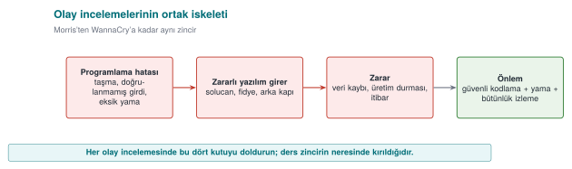

| Incident | Entry path | Error class | What should the programmer have done? |
| --- | --- | --- | --- |
| Morris worm (2 November 1988) | Unbounded read into a 512-byte buffer with `gets()` in `fingerd`; DEBUG mode left enabled in `sendmail`; `rsh`/`rexec` trust relationships; password guessing | CWE-120 / CWE-242, CWE-489, CWE-287, CWE-521 | Bounds-checked reading (`fgets`); not leaving debug code in a release; not relying on address-based trust; password policy |
| Code Red (July 2001) | Buffer overflow in the IIS `.ida` handler (CVE-2001-0500) | CWE-120 | Validating network input length before copying; disabling the unused handler |
| SQL Slammer (January 2003) | Stack overflow in the SQL Server resolution service via a single UDP packet (CVE-2002-0649) | CWE-121 | Bounds checking; not exposing an unnecessary service; applying the patch (it had existed for months) |
| Blaster (August 2003) | Windows RPC/DCOM buffer overflow (MS03-026, CVE-2003-0352) | CWE-120 | Bounds checking; blocking RPC ports at the network boundary |
| Conficker (November 2008) | Path-handling overflow in the Server service (MS08-067, CVE-2008-4250); weak passwords | CWE-119, CWE-521 | Safe string handling; strong authentication; automatic patching |
| Stuxnet (2010) | Code loading via displaying a shortcut (`.lnk`) file (CVE-2010-2568) plus three more zero-day flaws; stolen driver signing certificates | Loading code from untrusted content; signing keys not being protected | Not executing code while displaying content; protecting signing keys in hardware (an HSM) |
| WannaCry (12 May 2017) | Memory corruption in the SMBv1 server (EternalBlue, CVE-2017-0144); the patch had been released on 14 March 2017 | Input validation / memory safety | Bounds checking in the parser; disabling the legacy protocol; not leaving the patch unapplied for two months |
| NotPetya (27 June 2017) | Distributed through an accounting software's update server; followed by lateral movement via EternalBlue/EternalRomance and credential harvesting | CWE-494 (downloading code without integrity check) | Signing updates and verifying the signature on the client; protecting the update infrastructure |
| SUNBURST (December 2020) | A monitoring software's build environment was breached and a backdoor was inserted into a signed library; ~18,000 customers affected | Supply chain: build environment security | Protecting the build environment, reproducible builds, comparing the build output against the source (the SBOM and integrity topic in Week 5) |

Reading the table from top to bottom, a trend appears: most epidemics between 1988 and 2008 spread through
**a single buffer overflow**. After 2017, the entry point increasingly shifted to **update and build
processes**: instead of breaking the code, the attacker seized the path by which the code reaches the user.
This course's two ends come from exactly this: on one side, bounds checking and safe memory management
(Weeks 1 and 4); on the other, signed updates, integrity verification, and supply-chain security (Weeks 3, 5,
and 10).

!!! warning "Patch delay"
    The patch for the flaw WannaCry used had been released two months before the epidemic; Slammer's had
    existed for months too. What this means for your own software is this: the update mechanism is part of
    the security feature. A product whose updates are hard, slow, or dependent on the user keeps even fixed
    bugs open for months.

!!! question "Discussion"
    Since 2022, Office blocks macros in documents that come from the internet by default. Which weakness of
    old epidemics like Melissa and ILOVEYOU does this decision close? Why is the effect of a default setting
    on security greater than user training?

---

## 8. Attack Trees

We drew an attack tree last week; this week we will put it into **numbers**. The root is the attacker's goal;
the branches are the ways to reach it. At an **OR** node, one branch is enough; at an **AND** node, all of
them are required. If we write a **cost** (person-days, equipment, expertise) on every leaf, we can solve the
tree bottom-up and find **the cheapest attack**:

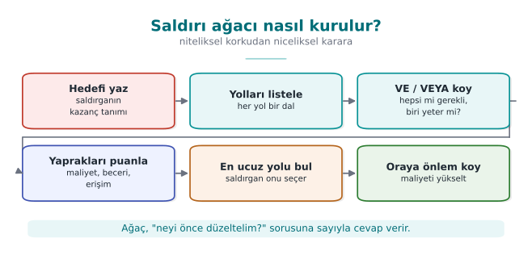

- OR node: the **cheapest** of the children (whichever suits the attacker).
- AND node: the **sum** of the children (since all are required).

### Demo 04 — Attack Tree Cost Calculator

!!! info "Demo 04 · `code/week-02/04-saldiri-agaci`"
    Reads an attack tree written with indentation, computes the cheapest cost for every node, and prints the
    weakest chain to defend. It carries out no attack; it only adds up numbers.

Windows: `cd code\week-02\04-saldiri-agaci ; .\demo.ps1` · WSL/Linux:
`cd code/week-02/04-saldiri-agaci && sh demo.sh` (build once inside `code/` first).

```text title="demo — Adım 1 (kısaltılmış)"
  [VEYA] Odeme anahtarini ele gecir  (maliyet=2)
    [VE] Yerel veritabanini kopyala ve coz [hepsi gerekir]  (maliyet=9)
    [VEYA] Kullanim aninda bellekten oku [biri yeter]  (maliyet=2)
      Hata ayiklayici ile bellekten oku  (maliyet=2)
    [VE] Sunucu ile telefon arasinda dinle [hepsi gerekir]  (maliyet=15)

  EN UCUZ SALDIRI = 2 birim. ... en zayif nokta:
  -> Kullanim aninda bellekten oku -> Hata ayiklayici ile bellekten oku
```

The cheapest path is **2 units**: reading the key from memory. The second tree shows what happens when
**RASP** (debugger and hook detection — Week 6) is added to this branch:

```text title="demo — Adım 2 (kısaltılmış)"
  [VEYA] Odeme anahtarini ele gecir  (maliyet=8)
    [VEYA] Kullanim aninda bellekten oku [biri yeter]  (maliyet=8)
      Bellek dokumu (rastgele silme'yi as)  (maliyet=8)
  EN UCUZ SALDIRI = 8 birim.
```

The defence raised the cheapest attack **from 2 to 8**; the weakest point changed. This is how you justify a
security investment **with a number**: "this countermeasure makes the cheapest attack 4 times more
expensive." AND nodes force the attacker to break multiple layers together — the quantitative counterpart of
defence in depth.

!!! tip "Connection to the project"
    In the **S4** section of your term project you will draw an attack tree. Use this demo's input format to
    write your own tree; find the cheapest path and show which countermeasure adds the most cost there.

## 9. Security Audit Logging: The Log as Evidence

The attack tree asks "where does the attacker come from?"; the **audit log** answers "did they get in, and
what did they do?" A reliable record is the only way to understand what happened after an incident, find who
is responsible, and prevent it from happening again. The book covers this topic in Recipe 13.11; the
recommendations there still hold today, only the tools have been updated.

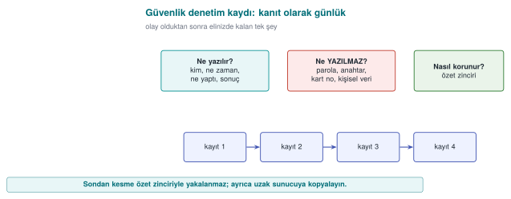

### What Is Logged, and What Should Never Be Logged?

| Log this | Never log this |
| --- | --- |
| Authentication attempts (successful and failed), who, when, from where | Password, PIN, session token, private key |
| Permission changes, role assignments, configuration changes | The full card number, ID number, and other personal data (mask if needed) |
| Sensitive operations (payment approval, data export, deletion) | The decrypted form of encrypted data |
| The result of security checks (signature failure, integrity failure, RASP alert) | Debug output (completely removed in a release build) |

Logging is designed assuming that an attacker might also read it. Every secret written to the log has, in
effect, been handed to anyone who can access the log file. This is why one of the instructor's methods is to
remove debug logging from the code entirely in a release build: logging code that is merely silenced with a
disabled flag still remains in the binary, leaking information through its strings and remaining
re-enablable.

### Demo 10 — Log Injection (CWE-117)

A log line very often contains a field that comes from the user: a username, a filename, a request path. If
this field contains a **line break** (`\n`, `\r`) or a **terminal control character** (an ESC sequence), an
attacker can make the log print an event that never happened, or hide a real line on screen.

!!! info "Demo 10 · `code/week-02/10-gunluk-enjeksiyonu` · CWE-117"
    The program writes a login audit log with four sample inputs: one normal, one that injects a fake
    `admin ... BASARILI` (SUCCESS) line via a line break, one that erases part of the line on screen via an
    ESC sequence, and one that is excessively long. The unsafe version runs first, then the safe version.
    Files are only written under `calisma/` inside the demo folder.

=== "Windows (PowerShell)"

    ```powershell
    cd code\week-02\10-gunluk-enjeksiyonu
    .\demo.ps1
    ```

=== "WSL / Linux"

    ```bash
    cd code/week-02/10-gunluk-enjeksiyonu
    sh demo.sh
    ```

```text title="sh demo.sh — çıktı (kısaltılmış)"
ADIM 1 - GUVENSIZ gunluk: alan denetlenmeden yaziliyor
  DENETIM giris kullanici=ayse sonuc=BASARISIZ
  DENETIM giris kullanici=kayra
  DENETIM giris kullanici=admin sonuc=BASARILI sonuc=BASARISIZ
  DENETIM giris kullanici=deniz^[[2K^Mgizli sonuc=BASARISIZ
ADIM 2 - Sahte satiri say:
  Gunluk: 4 satir; sahte 'admin BASARILI' satiri: 1
ADIM 3 - GUVENLI gunluk: kacislama + sinir + sabit bicim dizgesi
  DENETIM giris kullanici=kayra\x0A2026-... kullanici=admin ...
  DENETIM giris kullanici=deniz\x1B[2K\x0Dgizli sonuc=BASARISIZ
  DENETIM giris kullanici=AAAAAAAAAAAAAAAA... sonuc=BASARISIZ
ADIM 4 - Sahte satiri say (guvenli):
  Gunluk: 4 satir; sahte 'admin BASARILI' satiri: 0
```

In the unsafe version, three inputs produced four lines: a line break hidden inside the name `kayra` added
**an administrator login that never happened** to the log. An administrator or an automated alerting system
reading this log reacts to a fake event; the real attack, meanwhile, gets lost in the noise. The safe version
does three things:

1. **Escaping:** every unprintable byte (`\n`, `\r`, ESC) is written in `\xNN` form; every input stays on a
   single line.
2. **Bounding:** the field is truncated at a fixed length (`...`); the log file cannot be inflated with a
   single input.
3. **A fixed format string:** the field is never passed as the format string of `printf`/`syslog`. The
   mistake `syslog(LOG_INFO, kullanici_girdisi)` that the book warns about in Recipe 13.11 is a **format
   string vulnerability** (CWE-134; covered in detail in Week 4): the correct form is
   `syslog(LOG_INFO, "%s", kullanici_girdisi)`.

!!! tip "How does an assessor test this?"
    An independent assessor puts line breaks, ESC sequences, and format specifiers like `%n`/`%x` into every
    field that ends up in the log, such as a username or filename; they then open the log and check whether
    the line count increased, the screen got corrupted, or the program crashed. They also search log files
    for passwords, keys, and personal data.

### Tamper-Resistant Logging

Preventing injection ensures the log is written **correctly**; but it does not stop an attacker who has
breached the system from **changing it afterwards** to cover their tracks. The log does not need to be
unmodifiable; it is enough that a modification is **noticed**. There are two classic ways to do this:

- **Digest chain:** every record contains the digest of the previous record. Changing a record in the middle
  breaks the chain of every record after it. However, an attacker can recompute the whole chain from
  scratch; there is no key.
- **HMAC chain and key evolution:** every record is sealed with a keyed digest; moreover, the key **evolves**
  through a one-way function after every record, and the old key is deleted (Schneier–Kelsey, 1999). The
  instant an attacker seizes the machine, they only find **the current** key; they cannot go backward from it
  to the keys that sealed earlier records. This protects the records that predate the breach (forward
  security).

The verifier keeps the initial key in a separate, secure (offline) place, and validates every record by
recomputing the chain from the start.

### Demo 11 — Tamper-Resistant Logging: HMAC Chain and Key Evolution

!!! info "Demo 11 · `code/week-02/11-kurcalamaya-dayanikli-gunluk` · an updated version of Recipe 13.11"
    The program generates the same six-record log twice: once with an **evolving key**, once with a
    **static key**. Every record carries a sequence number and an HMAC-SHA256 (`code/common/cen429_kripto.h`).
    It then tries four attacks: modifying a record, deleting a record, reordering records, and rewriting
    history with a captured key. The records are synthetic; files are only created inside the demo folder.

=== "Windows (PowerShell)"

    ```powershell
    cd code\week-02\11-kurcalamaya-dayanikli-gunluk
    .\demo.ps1
    ```

=== "WSL / Linux"

    ```bash
    cd code/week-02/11-kurcalamaya-dayanikli-gunluk
    sh demo.sh
    ```

```text title="sh demo.sh — çıktı (kısaltılmış)"
ADIM 2 - Saglam gunlugu dogrula (evrim):
  #1 seq=1 "cuzdan acildi"  MAC:OK
  ...
  >>> SONUC: gunluk BUTUNLUKLU (tum kayitlar dogrulandi).
ADIM 3 - Ham kurcalama: seq=4 mesajini degistir (MAC eski)
  #4 seq=4 "odeme onaylandi tutar=9999"  MAC:BOZUK
  >>> SONUC: gunluk KURCALANMIS (dogrulama basarisiz).
ADIM 4 - Kayit SILME: seq=5 silinir
  #5 seq=6 "oturum kapandi"  MAC:BOZUK  SIRA:BOZUK
```

When a record is modified, the MAC no longer matches; when a record is deleted, both the MAC and the sequence
number break. The demo's final steps show the real difference: when the attacker tries to rewrite the log
with the key found on the machine, in the **static-key** log they can reseal the whole history and fool the
verifier; in the **evolving-key** log, they can only touch the records after the moment of capture, because
the earlier keys no longer exist anywhere.

!!! success "Rule"
    Write user data to the log by escaping and bounding it; never log secrets; seal the log with a keyed
    chain, evolve the key at every record, and delete the old key; do not keep the verification key on the
    machine where the log lives. Whenever possible, send records to a separate log server immediately: the
    copy the attacker cannot reach is the strongest evidence.

!!! note "How is this applied in the field?"
    In applications like mobile payments, the on-device log is kept to a minimum and contains no sensitive
    field; security events (integrity failure, debugger detection) are reported to the server. This is the
    "reporting" leg of the RASP countermeasures we will see in Week 6.

---

## 10. Access Control: Who Can Do What, to What?

We now move to the defence side. One of security's most fundamental questions is: **"Can this subject
perform this operation on this object?"** We organise this with three concepts:

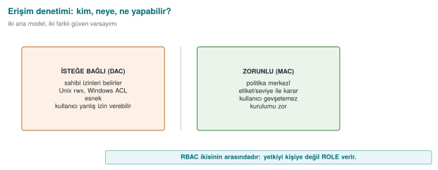

- **Subject:** the one performing the operation (a user, a process).
- **Object:** the thing the operation is performed on (a file, a record, memory).
- **Right/permission:** the operation that can be performed (read, write, execute).

### The Access Control Matrix

The most general model is a **matrix** where rows are subjects, columns are objects, and every cell holds the
permissions:

| | `odeme_anahtari` | `gunluk` |
| --- | --- | --- |
| **application** | — | write |
| **library** | read, write | write |
| **attacker** | — | — |

This matrix is conceptual; in reality it is stored in two forms:

- **Access control list (ACL):** the matrix is stored **column by column** — every object keeps a list of
  "who can access me." Unix file permissions and the Windows DACL work this way.
- **Capability:** the matrix is stored **row by row** — every subject keeps tickets for "what can I access."

### DAC, MAC, RBAC

| Model | Who decides? | Example | Strengths/weaknesses |
| --- | --- | --- | --- |
| **DAC** (discretionary) | The **owner of the object** decides the permissions | Unix `chmod`, Windows DACL | Flexible; but a leak occurs if the owner grants the wrong permission or a program is tricked (a "confused deputy") |
| **MAC** (mandatory) | The **system/policy** decides; the owner cannot change it | Bell–LaPadula, Biba, SELinux | Strict, prevents leaks systemically; hard to administer |
| **RBAC** (role-based) | Permissions are given to **roles**, users are assigned to roles | The "Accountant" role | Scales well; the standard method in large organisations |

Real systems use these **together**: DAC provides the owner's wishes, MAC the system's mandatory boundary,
and RBAC administrative convenience. The effective decision is usually **the intersection of all of them**
("both the owner must permit it and the system policy must permit it").

### Demo 03 — Access Matrix and Model Simulator (together with Section 11)

We will run this demo together with the formal models in the next section; but its first step is the **DAC
matrix alone**:

Windows: `cd code\week-02\03-erisim-modeli ; .\demo.ps1` · WSL/Linux:
`cd code/week-02/03-erisim-modeli && sh demo.sh`.

```text title="demo — Adım 0 (salt DAC)"
ADIM 0 — Salt DAC (erisim denetim matrisi): karar sahibin izninde
  kutuphane(D   ) OKU odeme_anahtari(D   )  DAC:VAR ...  => IZIN
  uygulama(D   ) OKU odeme_anahtari(D   )  DAC:yok ...  => RED
  saldirgan(D   ) OKU odeme_anahtari(D   )  DAC:yok ...  => RED
   ^ uygulama OKU odeme_anahtari: matriste yok -> RED (en az ayricalik)
```

No subject that has no right in the matrix can access it — a direct application of the **principle of least
privilege**. Not even the application has direct access to the payment key; only the security library can
access it.

---

## 11. Formal Security Models

DAC says "whatever the owner says goes"; but this cannot prevent a leak **systemically**. For example, a
program that can read a confidential document can write that information to a publicly readable file — DAC
does not prevent this. **Mandatory (MAC)** models close exactly this gap. We will look at three classic
models.

### Bell–LaPadula (BLP) — Confidentiality

Designed in 1973 for military secrecy. Objects and subjects are given **confidentiality levels** (Unclassified
< Confidential < Top Secret). Two rules:

- **The simple security property ("no read up"):** a subject **cannot read** an object **more confidential**
  than its own level. (A clerk cannot see a top-secret document.)
- **The star (\*) property ("no write down"):** a subject **cannot write** to an object **less confidential**
  than its own level. (A general cannot write top-secret information into an unclassified document and leak
  it.)

In short, BLP says **"read down, write up"**: read what is below, write above. Its purpose is to protect
**confidentiality**.

### Biba — Integrity

In 1977, Biba **inverted** BLP. This time the levels are **trustworthiness/integrity** levels (External <
Application < Kernel). The rules are symmetric:

- **"No read down":** a subject **cannot read** an object **less trustworthy** than itself. (Business logic
  does not directly trust unvalidated external input.)
- **"No write up":** a subject **cannot write** to an object **more trustworthy** than itself. (A component
  that receives data from the network cannot corrupt a signed configuration.)

So Biba says **"read up, write down"** and protects **integrity**: dirty data cannot corrupt clean data.

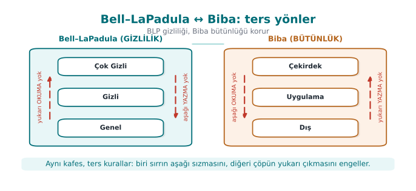

!!! note "Two models, opposite directions"
    BLP says "confidential information must not leak down" (it forbids reading up and writing down). Biba
    says "dirty information must not rise up" (it forbids reading down and writing up). If a piece of data
    must be both confidential and trustworthy (both at once), that data can only be processed **at its own
    level** — this is the conclusion most practical designs arrive at.

### Clark–Wilson — Commercial Integrity

In 1987, Clark and Wilson proposed a different integrity model for **commercial** systems such as banks.
Instead of military levels, it is built on **well-formed transactions** and **separation of duties**:

- **Constrained data items (CDI):** data whose integrity must be preserved (an account balance).
- **Transformation procedures (TP):** only **approved, well-formed transactions** may change a CDI (no
  direct writes). For example, a balance can only change through a "deposit/withdraw" procedure.
- **Integrity verification procedures (IVP):** regularly check that the data is consistent ("debits =
  credits").
- **Separation of duty:** the person who initiates a transaction and the person who approves it are
  different people.

The spirit of Clark–Wilson transfers directly into today's software: **touch data only through verified
transactions, never directly; do not tie a critical step to a single person or a single path.** It is the
formal form of last week's "separation of privileges" principle.

!!! note "How is this applied in the field? — the code equivalent of the models"
    Although these models look abstract, they have everyday code equivalents. The **Biba** principle means
    "do not directly trust data coming from the outside"; in practice, this means treating every piece of
    external input as **untrusted** and passing it through a validation layer (the input validation from
    Week 1). Bell–LaPadula's "no write down" rule turns, in a mobile payment library, into a ban on "writing
    a sensitive key into a less protected log or the clipboard" — it prevents secrets from accidentally
    leaking into a low-security channel. Clark–Wilson's "well-formed transaction" idea means changing a
    balance or a transaction counter only through an audited function instead of updating it **directly**;
    this way, skipping or rewinding the counter can be prevented in a single place.

!!! note "How does an assessor test this? — access and authority"
    An independent assessor concretely tests the question "who can access what?" in your code: is least
    privilege actually applied, or does every component run with more authority than it needs? If a
    component is compromised, how far can it reach into the others (lateral movement)? Is a sensitive
    operation tied to a single flag/single branch — that is, can it be evaded by changing one byte? These
    questions are answered by looking directly at your **interface and asset table** (S3, S5) and your
    **attacker model** (S4); an authority path that is not in the list is a path that is not audited.

| Model | Year | Protects | Core idea |
| --- | --- | --- | --- |
| Bell–LaPadula | 1973 | Confidentiality | No read up, no write down |
| Biba | 1977 | Integrity | No read down, no write up |
| Clark–Wilson | 1987 | Integrity (commercial) | Well-formed transaction + separation of duty + verification |

### Demo 03 — Compare the Models

```text title="demo — Adım 1 (Bell–LaPadula)"
  memur  (Gene) OKU operasyon(CokG)  DAC:VAR BLP:RED ...  => RED
  general(CokG) YAZ ilan     (Gene)  DAC:VAR BLP:RED ...  => RED
   ^ memur OKU operasyon: yukari okuma -> RED (gizli bilgiyi goremez)
     general YAZ ilan: asagi yazma -> RED (sizinti onlenir)
```

```text title="demo — Adım 2 (Biba)"
  aglayici(Dis ) YAZ kayit    (Uygu)  ... BIBA:RED  => RED
  islemci(Uygu) OKU gelen    (Dis )  ... BIBA:RED  => RED
   ^ aglayici YAZ kayit: yukari yazma -> RED (kirli veri temizi bozmasin)
     islemci OKU gelen: asagi okuma -> RED (guvenilmez girdiye guvenme)
```

Notice: DAC is **VAR** (the owner has granted permission) in both cases; it is the **system** that brings the
mandatory model into play. Because the effective decision is `DAC AND MAC`, the model can still deny access
even when the owner permits it. You can open the policy files (`politika-gizlilik.txt`,
`politika-butunluk.txt`) and write your own rules.

!!! example "Class activity 2 — Choose the model (10 minutes)"
    Which model fits the following systems, and why?

    1. A hospital's patient records (no one without authorisation should **see** them).
    2. An aircraft's flight control software (data coming from outside must **not corrupt** critical
       commands).
    3. A bank's ledger (must only change through approved transactions, and must be recorded).

    ??? success "Answers"
        1. Bell–LaPadula (confidentiality) · 2. Biba (integrity) · 3. Clark–Wilson (well-formed transaction +
        verification).

---

## 12. Unix and Windows Access Control Models

These classic models did not stay on paper; the permission architecture of operating systems is their
practical form.

### The Unix Model (Recipe 2.1)

Unix implements DAC with **user/group identities** and **permission bits**. Every process has three
identities: **effective** (used in permission checks), **real** (the actual owner), and **saved** (for
temporarily dropping and later reclaiming privilege). Every file has three groups of permission bits —
owner, group, others — each with read/write/execute:

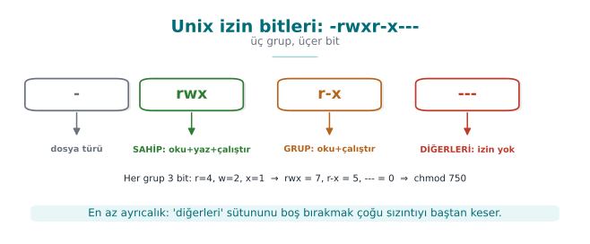

In addition there are the **setuid/setgid** bits (the program runs with the authority of its owner) and the
**sticky** bit (prevents deleting someone else's file in a shared directory like `/tmp`). A `setuid root`
program runs **with root authority** no matter who runs it — powerful but dangerous; this is exactly why last
week's "least privilege" is critical.

!!! danger "TOCTOU: the classic trap of Unix access control"
    If a program **first checks and then opens** — asking "is it safe for me to write to this file?" — an
    attacker can replace the file with a symbolic link between the two operations. This is called **TOCTOU**
    (Time-Of-Check, Time-Of-Use; **CWE-367**). The book's Recipe 2.3 describes exactly this race. We will see
    this safely in [Demo 06](#demo-06-toctou-race-condition).

### The Windows Model (Recipe 2.2)

Windows uses a more detailed **ACL** model. Every object (file, registry key, mutex) has a security
descriptor. There are two lists:

- **DACL** (Discretionary ACL): holds the **access** rules — who can do what. It contains a series of
  **ACEs** (access control entries); each ACE is a **SID** (a user/group identity), a right, and an
  "allow / deny" flag.
- **SACL** (System ACL): holds the **audit** rules — which accesses get logged.

An important trap: a **NULL DACL** (a list with no entries at all) means "full rights for everyone" — never a
good idea. Windows picks the best-matching ACE; "deny" entries are generally evaluated before "allow" ones.

| Concept | Unix | Windows |
| --- | --- | --- |
| Identity | UID / GID | SID |
| Permission carrier | Mode bits (rwx × 3) | ACEs inside the DACL |
| Audit | syslog (external) | SACL (built in) |
| "Open to everyone" danger | `chmod 777` | NULL DACL |
| Privilege escalation | setuid | Impersonation, tokens |

Modern Windows also adds mandatory boundaries similar to Biba with **integrity levels** (Mandatory Integrity
Control) and **AppContainer** — so formal models are still alive in practice.

### Demo 06 — TOCTOU Race Condition

!!! info "Demo 06 · `code/week-02/06-toctou` · CWE-367 · Book: Recipe 2.3"
    A "log writer" checks "is the target safe?" before writing. The **unsafe** version first looks with
    `lstat()` and then opens with `fopen()`; if the target is replaced with a symbolic link between the two
    operations, it writes to a different file. The **safe** version opens with `O_NOFOLLOW` and rejects
    symbolic links. Everything happens under `calisma/` inside the demo folder; no system file is touched.

WSL / Linux (this demo only runs here): `cd code/week-02/06-toctou && sh demo.sh` (run `./build.sh` inside
`code/` first). On Windows, `.\demo.ps1` prints how to run it in WSL.

```text title="demo (kısaltılmış)"
ADIM 1 — GUVENSIZ surum: once denetle, sonra ac (yaris acigi)
  guvensiz: 'SAHTE-KAYIT-...' -> calisma/gunluk.txt (yazildi)
  --- Sonuc: gizli_hedef.txt icerigi ---
    iceride onemli veri var
    SAHTE-KAYIT-tarafimizca-eklendi
  >>> SALDIRI BASARILI: yaziyi baska dosyaya yonlendirdik!

ADIM 2 — GUVENLI surum: O_NOFOLLOW ile tek adimda ac
  reddedildi: hedef sembolik bag (O_NOFOLLOW)
  >>> Saldiri engellendi: gizli_hedef.txt bozulmadi.
```

!!! success "Rule"
    Do the check and the use in **a single atomic step**: open the file with `O_NOFOLLOW`/`O_EXCL` and work
    **through the open descriptor (fd)**; do not repeatedly operate on it by name (path). Use `mkstemp` for a
    temporary file (CWE-377). This replaces the "`access()` first, then `open()`" pattern.

### Demo 12 — Windows Access Control Algorithm: How Are ACEs Evaluated?

Windows evaluates a request to access an object by comparing the SIDs (users and groups) in the requesting
process's **access token** against the ACEs in the object's **DACL**, **in order** (Recipe 2.2). The rule is
simple, but the outcomes are surprising:

1. ACEs are examined **in list order**; an ACE belonging to a SID not in the token is skipped.
2. If a **DENY** ACE matching one of the requested rights is found, the request is denied immediately.
3. **ALLOW** ACEs accumulate the requested rights; once all are granted, the request is accepted.
4. If the list ends and rights are still missing, the request is denied (**default deny**).
5. **Canonical order:** explicit DENY → explicit ALLOW → inherited DENY → inherited ALLOW. Windows' own
   tools write ACEs in this order; an order broken by hand or by faulty code can cause a DENY to never be
   read at all.
6. A **NULL DACL** (no DACL at all) grants every right to everyone; an **empty DACL** (no ACEs) grants no
   right to anyone. The object's owner, however, can read and change permissions no matter what the DACL
   says.

!!! info "Demo 12 · `code/week-02/12-ace-degerlendirme` · Recipe 2.2"
    The program implements this algorithm from scratch: it reads the token (user, groups, integrity level)
    and the object (owner, label, DACL) from scenario files, evaluates the request step by step, and prints
    which ACE decided it. It touches no system setting; it is pure calculation. In the last step, it shows
    the demo's **own** file's real ACL by only reading it — with `icacls` on Windows, with `stat` on Linux.

=== "Windows (PowerShell)"

    ```powershell
    cd code\week-02\12-ace-degerlendirme
    .\demo.ps1
    ```

=== "WSL / Linux"

    ```bash
    cd code/week-02/12-ace-degerlendirme
    sh demo.sh
    ```

```text title="sh demo.sh — çıktı (kısaltılmış; Windows'ta aynı)"
== SENARYO: 1a - kitaptaki DACL, ayse Pazarlama uyesi ==
    1. RET  Herkes         TAM
    2. IZIN Pazarlama      YAZ
    3. IZIN Herkes         OKU
  Istek YAZ:
    ACE 1 RET  Herkes        -> eslesti; YAZ reddedildi
  => RED  (ACE 1: sonraki ACE'lere bakilmaz)
== SENARYO: 1b - ayni ACE'ler, IZIN once (kanonik degil) ==
    ACE 1 IZIN Pazarlama     -> verildi YAZ (eksik: -)
  => IZIN  (tum istenen haklar verildi)
== SENARYO: 2a - NULL DACL, istegi yapan yabanci bir hesap ==
  => IZIN  (TEHLIKE: SAHIP_AL ve IZIN_YAZ dahil!)
== SENARYO: 2b - BOS DACL, ayni yabanci hesap ==
  => RED  (eksik: OKU)
== SENARYO: 3b - kalitim kesildi (sil) ==
  => RED  (liste bitti; eksik: OKU)
```

In the first two scenarios the ACEs are **identical**, only their order differs: in canonical order `ayse` is
denied, in the broken order the same request is accepted. The second step shows one of the most common
mistakes programmers make: creating an object's security descriptor with a `NULL` DACL so that "everyone can
access it" grants everyone not just read, but also the right to **take ownership and change permissions**.
The correct approach is to write a DACL that explicitly grants the rights that are needed. The third step
shows inheritance: explicit ACEs are evaluated before inherited ACEs; cutting inheritance and deleting the
inherited ACEs can lead to an unexpected default deny.

!!! tip "How does an assessor test this?"
    They list the DACLs of the files, registry keys, named pipes, and shared-memory objects the application
    creates (with tools like `icacls`, `accesschk`); they look for write rights for `Everyone`/`Users`, a
    NULL DACL, and non-canonical order.

### Demo 13 — Unix Permissions, umask, and setuid Traps

Three subtleties of the Unix model (Recipe 2.1) explain most real-world bugs:

- **The first matching class decides.** The kernel first asks "is the requester the file's owner?"; if so,
  **only** the owner bits apply, and the group and other bits are never even looked at. If not the owner but
  a group member, only the group bits are used; if neither, the other bits are used.
- **umask** narrows a new file's permissions: `actual permission = requested & ~umask`. `fopen()` always
  requests `0666`; if umask is `000`, the file becomes **writable by everyone**. A sensitive file should be
  opened with `open(..., 0600)` (Recipe 2.7, Week 1).
- A **setuid** program runs with the authority of the **file's owner**, not the person running it. A program
  that does not know the distinction between real, effective, and saved user IDs can think it has "dropped"
  its privilege while leaving it recoverable through the saved identity (Recipe 1.3).

!!! info "Demo 13 · `code/week-02/13-unix-izin-umask` · Recipe 2.1, 2.7, 1.3"
    The program first shows the kernel's permission algorithm, umask, setuid identity transitions, and the
    sticky bit **by simulation**; it creates no real setuid file and requests no administrator privilege. It
    then tests the same rules with real files under the demo folder's `cikti/` subfolder, shows the POSIX
    ACL, and **only lists** the setuid programs on the system. On Windows the simulation steps run exactly
    the same way; then the Windows equivalent of umask, **permission inheritance from the parent folder**, is
    shown with `icacls`. For the real Unix steps (umask, chmod, ACL), the script recommends WSL.

=== "Windows (PowerShell)"

    ```powershell
    cd code\week-02\13-unix-izin-umask
    .\demo.ps1
    ```

=== "WSL / Linux"

    ```bash
    cd code/week-02/13-unix-izin-umask
    sh demo.sh
    ```

```text title="sh demo.sh — çıktı (kısaltılmış)"
A) Cekirdek izin denetimi: ilk eslesen sinif karar verir
  surec   istek dosya         sahip:grup     izinler     sinif -> karar
  mehmet  yaz   rapor.txt     ayse:muhasebe  rw-r-----   grup -> RED
  ayse    oku   paradoks.txt  ayse:muhasebe  ---rwxrwx   sahip -> RED
  zeynep  oku   paradoks.txt  ayse:muhasebe  ---rwxrwx   diger -> IZIN
   ^ ayse paradoks.txt'yi OKUYAMAZ: sahip sinifi secildi ve
     sahip bitleri '---'; grup/diger bitlerine hic bakilmaz.
B) umask: gercek izin = istenen & ~umask (Tarif 2.7)
  istenen   umask 000    umask 022    umask 077
  0666      rw-rw-rw-    rw-r--r--    rw-------
C) setuid benzetimi: sahibi root olan setuid bir programi
   ayse (uid 1001) calistiriyor. exec: etkin=sakli=0 olur.
    seteuid(1001)                  r/e/s=1001/1001/0 g=1001 tamam
```

The `paradoks.txt` example runs against intuition: `ayse`, the file's owner, cannot read it, yet `zeynep`, who
has no relation to it at all, can. The authentication logic of "first look at who you are, then apply only
that class's rule" requires thinking through each class separately when writing permissions. The setuid step
shows that a temporary drop done with `seteuid()` leaves the saved identity at `0`, meaning the privilege can
be reclaimed; a permanent drop requires changing all three identities with `setresuid()` and verifying the
result.

### Demo 14 — RBAC, Separation of Duty, and Clark–Wilson

The Clark–Wilson model's two core ideas are the **well-formed transaction** (only certified transactions may
touch data) and **separation of duty** (whoever initiates a task cannot approve it). RBAC, meanwhile, grants
authority to roles rather than to people; **static separation of duty** (SSD) forbids **assigning** one person
to two conflicting roles, and **dynamic separation of duty** (DSD) forbids activating both of them at once in
the **same session**.

!!! info "Demo 14 · `code/week-02/14-rbac-clark-wilson` · a bank simulation"
    The program reads roles, users, constraints, two accounts (CDIs), and certified transactions (TPs) from a
    scenario file; it then evaluates a series of requests against the Clark–Wilson rules (C1–C5, E1–E4).
    Transfers over 5,000 units require a second person's approval; the **IVP** (integrity verification
    procedure) compares account totals against the ledger.

=== "Windows (PowerShell)"

    ```powershell
    cd code\week-02\14-rbac-clark-wilson
    .\demo.ps1
    ```

=== "WSL / Linux"

    ```bash
    cd code/week-02/14-rbac-clark-wilson
    sh demo.sh
    ```

```text title="sh demo.sh — çıktı (kısaltılmış; Windows'ta aynı)"
== 1 - RBAC: rol atama ve gorev ayriligi (SSD/DSD) ==
[01] ATA cem GISE
     SSD(GISE,ONAYCI): cem ikisini birden tasiyamaz -> RED
[04] OTURUM deniz GISE,DENETCI
     DSD(GISE,DENETCI): ayni oturumda ikisi birden etkin olamaz -> RED
[05] OTURUM deniz DENETCI
     oturum acildi; etkin: DENETCI
== 2 - Clark-Wilson: CDI'ya yalniz sertifikali TP dokunur ==
== 3 - Gorev ayriligi: buyuk havaleye ikinci kisi onayi ==
[20] deniz IVP
     IVP defterden beklenen toplam 20250, bulunan 20250
== 4 - Hatali bir TP sertifikalanirsa IVP yakalar ==
```

The fourth step is the model's most instructive part: if the certifier certifies a faulty transaction, the
enforcement rules (E1–E4) cannot notice it, because the transaction looks "authorised." What catches the
error is the independently running **IVP**: the totals do not match the ledger. Lesson for the programmer:
authority checking alone is not enough; you also need a mechanism that separately verifies the consistency of
the data.

!!! note "How is this applied in the field?"
    In payment systems, the "four eyes" principle (the person who prepares a transaction and the person who
    approves it are different people), "split knowledge and dual control" in key management (no single person
    knows the whole key), and daily reconciliation procedures are direct counterparts of Clark–Wilson's
    separation of duty and IVP ideas.

---

## 13. Classifying Software Security Vulnerabilities: CWE

When you find a vulnerability, you must **name** it so that others understand it, it is not rediscovered from
scratch, and a countermeasure can be taken. The first tool is **CWE** (Common Weakness Enumeration): a
numbered catalogue of **weakness types**, maintained by MITRE. If a CVE is a specific flaw in a specific
product, CWE is its **type**.

| CWE | Weakness type | Where in this course? |
| --- | --- | --- |
| CWE-787 | Out-of-bounds write | Week 1 Demo 03 (overflow) |
| CWE-125 | Out-of-bounds read | The Heartbleed family |
| CWE-89 | SQL injection | Week 5 |
| CWE-79 | Cross-site scripting (XSS) | Web vulnerabilities |
| CWE-416 | Use after free | Week 4 |
| CWE-20 | Improper input validation | Every week |
| CWE-367 | TOCTOU race condition | This week, Demo 06 |
| CWE-798 | Hardcoded credentials | Weeks 3, 10 |
| CWE-327 | Use of a broken/risky cryptographic algorithm | Week 10 |
| CWE-326 | Inadequate encryption strength | Weeks 10, 11 |

The **CWE Top 25** is the list of the 25 most common and most dangerous weaknesses of the year; it is computed
from real CVE data by combining frequency and severity. It is a good first answer to a security programme's
question "what should I look at first?" Out-of-bounds write (CWE-787), XSS (CWE-79), and SQL injection
(CWE-89) have topped the list for years.

!!! note "CWE is hierarchical"
    CWEs are linked like a tree: **pillar → class → base → variant**. For example, under a very general
    "improper input validation" (CWE-20) there are more concrete entries like "path traversal" (CWE-22) or
    "OS command injection" (CWE-78). Mapping a finding to the **most concrete possible** CWE also clarifies
    the fix.

!!! note "How does an assessor look at this? — weakness categories → CWE"
    A security assessor looks for specific **weakness families** in your product and ties every finding to a
    CWE. Typical families and their counterparts:

    | What the assessor looks for | Possible CWE |
    | --- | --- |
    | Secrets left exposed (a hardcoded key, a secret left in cleartext in memory) | CWE-798, CWE-316 |
    | Weak/incorrect cryptography (ECB, uncertified, a weak checksum) | CWE-327, CWE-326 |
    | Bypassable RASP (a check tied to a single point, hookable detection) | CWE-693 (protection mechanism failure) |
    | Code/data "lifting" (using a whitebox table as an oracle) | CWE collection: insufficient protection |
    | Logging leaks (a log left in the release build, an error code that gives a hint) | CWE-532, CWE-209 |

    In your term project's **S4** table you will tie every threat to a CWE like this.

---

## 14. OWASP Top 10 and MASVS

CWE catalogues all weaknesses; **OWASP**, on the other hand, turns these into **priority lists** and
**verification standards** for specific domains.

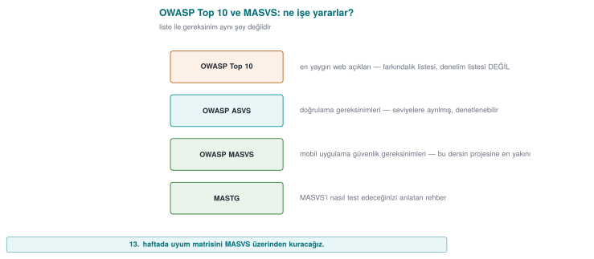

- **OWASP Top 10:** the ten most critical risk categories in web applications (e.g. broken access control,
  cryptographic failures, injection, insecure design). It is an **awareness** and **prioritisation** document;
  each item covers many CWEs.
- **OWASP ASVS** (Application Security Verification Standard): a detailed, levelled **checklist** for the
  web, answering the question "which checks must be passed to be considered secure?"
- **OWASP MASVS** (Mobile Application Security Verification Standard): the **mobile** counterpart of the same
  idea. Since this course focuses heavily on mobile protection, MASVS is especially important for us. Its
  categories (briefly): STORAGE, CRYPTO, AUTH (authentication), NETWORK, PLATFORM, CODE (code quality), and
  **RESILIENCE** (protection against reverse engineering and tampering). The test guide that accompanies
  MASVS is **MASTG**.

| Document | Scope | Type |
| --- | --- | --- |
| CWE / Top 25 | All software | Weakness catalogue / priority |
| OWASP Top 10 | Web | Awareness / priority |
| OWASP ASVS | Web | Verification standard |
| OWASP MASVS + MASTG | Mobile | Verification standard + test guide |

!!! tip "Connection to this course: MASVS-RESILIENCE"
    The topics we will cover throughout the term — code obfuscation (Weeks 9, 14), RASP (Week 6), and
    whitebox (Week 11) — are the direct counterpart of MASVS's **RESILIENCE** category. In other words, every
    protection you learn maps onto an item of a recognised standard.

!!! example "Class activity 3 — Classify the finding (10 minutes)"
    Map the following three short findings to (a) a CWE, (b) an OWASP Top 10 / MASVS category if possible:

    1. A mobile application never verifies the server certificate; a fake certificate is accepted.
    2. An API key hardcoded in the source code is identical across all copies.
    3. There is a login form that inserts the username directly into a SQL query.

    ??? success "Answers"
        1. CWE-295 (improper certificate validation) · OWASP A02 cryptographic failures / MASVS-NETWORK.
        2. CWE-798 (hardcoded credentials) · MASVS-STORAGE/CRYPTO. 3. CWE-89 (SQL injection) · OWASP A03
        injection.

---

## 15. CVE and CVSS: Which Flaw, How Severe?

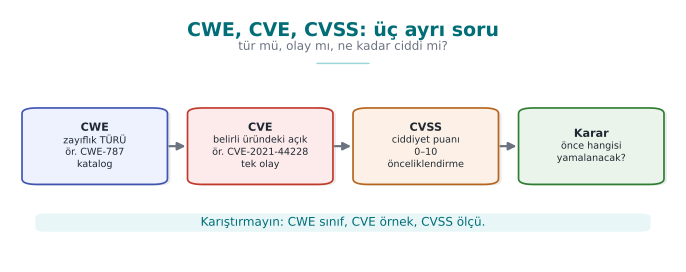

- **CVE** (Common Vulnerabilities and Exposures): the unique identifier of **a specific flaw in a specific
  product**, e.g. `CVE-2014-0160` (Heartbleed). A CVE is a **name**, not a severity. A CVE belongs to one or
  more CWE types.
- **CVSS** (Common Vulnerability Scoring System): a system that turns a flaw's **severity** into a number
  between 0.0 and 10.0. It is maintained by FIRST. There are three groups of metrics: **Base** (the flaw's
  own properties, unchanging), **Temporal** (does exploit code exist, has a patch been released),
  **Environmental** (how important it is in your environment). In this course we will focus on the **Base
  score**.

CVSS v3.1's eight Base score metrics:

| Metric | Its question | Values |
| --- | --- | --- |
| **AV** Attack vector | From where is it exploited? | Network / Adjacent network / Local / Physical |
| **AC** Complexity | How difficult is it? | Low / High |
| **PR** Privileges required | Is prior authority needed? | None / Low / High |
| **UI** User interaction | Does the victim have to do something? | None / Required |
| **S** Scope | Does the impact spill beyond the vulnerable component? | Unchanged / Changed |
| **C / I / A** Impact | How much are confidentiality / integrity / availability broken? | High / Low / None |

### Demo 05 — CVSS v3.1 Base Score Calculator

!!! info "Demo 05 · `code/week-02/05-cvss` (Python) · FIRST v3.1 formulas"
    Takes a CVSS vector and computes the base score from scratch; `test_cvss.py` validates the result by
    comparing it against known values from the FIRST document. It makes no network requests; it needs no
    compilation (Python 3.8+).

Windows: `cd code\week-02\05-cvss ; .\demo.ps1` · WSL/Linux: `cd code/week-02/05-cvss && sh demo.sh`.
By hand: `python3 cvss.py --ornekler` (on Windows `py -3 cvss.py --ornekler`).

```text title="demo — örnekler (kısaltılmış)"
  1) Uzaktan, kimlik gerektirmeyen tam ele gecirme
  CVSS:3.1/AV:N/AC:L/PR:N/UI:N/S:U/C:H/I:H/A:H
    TEMEL PUAN = 9.8  |####################|  Kritik (Critical)

  2) Ayni ama KAPSAM degisti (kutu disina cikan etki) -> daha yuksek
  CVSS:3.1/AV:N/AC:L/PR:N/UI:N/S:C/C:H/I:H/A:H
    TEMEL PUAN = 10.0  |####################|  Kritik (Critical)

  4) Yerel yetki yukseltme (cihaz saldirganin elinde) -> yuksek
  CVSS:3.1/AV:L/AC:L/PR:L/UI:N/S:U/C:H/I:H/A:H
    TEMEL PUAN = 7.8  |################....|  Yuksek (High)
```

Even with the same impact (C:H/I:H/A:H), a **remote + unauthenticated** flaw (9.8) scores higher than a
**local + privileged** one (7.8); when the scope changes it goes up to 10.0. We convert scores into severity
bands:

| Score | Band |
| --- | --- |
| 0.0 | None |
| 0.1–3.9 | Low |
| 4.0–6.9 | Medium |
| 7.0–8.9 | High |
| 9.0–10.0 | Critical |

!!! note "CVSS v4.0 in brief"
    v4.0, released in 2023, fixes some of v3.1's weaknesses: the **Base score is now called `CVSS-B`**; the
    "scope" metric was removed and replaced with **separate Vulnerable System Impact (VC/VI/VA)** and
    **Subsequent System Impact (SC/SI/SA)**; with exploit maturity (E) and threat/environmental metrics,
    **CVSS-BTE** can be computed. The goal is to better reflect real risk. In this course we wrote the
    calculator for v3.1, because it is still the most common in the field; v4.0's logic is the same, the
    weights differ.

!!! danger "CVSS's common mistake"
    "CVSS is 9.8, let's patch it right away; 4.0 can wait." The base score **does not know the context**: a
    4.0 flaw is more important to you than a 9.8 one if it is exactly the door to your most valuable asset.
    This is why there are **Environmental** metrics and your **asset table** (S5). The score is a starting
    point for prioritisation, not the final word.

!!! note "How does an assessor test this? — from finding to score"
    When a security lab finds an issue, it does not just leave it at "bad"; it grades it **reproducibly**.
    First it maps the finding to the most concrete **CWE**; then, while constructing a **CVSS** vector, it
    asks concrete questions: can the attacker use this over the network, or only while holding the device
    (AV)? Is prior authority or user interaction required beforehand (PR, UI)? Does the impact stay inside
    the vulnerable component or spill outside it (S)? In this course's context (the program runs on the
    attacker's device), most findings come out **local** (AV:L); so even when the CVSS score is low, the risk
    does not decrease — the assessor writes the **attack potential** (time spent, expertise, equipment) next
    to the score. In your project you will record every finding this way, with CWE + CVSS + a short
    justification (S4, S16).

---

## 16. The Vulnerability Lifecycle and Responsible Disclosure

A flaw goes through a **lifecycle** from the moment it is discovered to the moment it is made public. How
this cycle is managed determines how long users remain at risk.

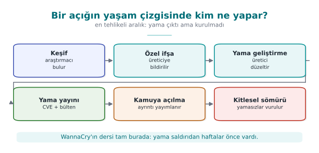

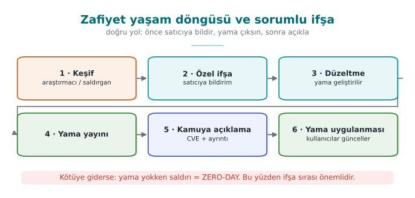

Key concepts:

- **Zero-day:** a flaw the vendor **does not yet know about**, or for which there is no patch. The most
  dangerous situation, because there is no defence.
- **Responsible disclosure (coordinated disclosure):** the researcher reports the flaw **to the vendor
  first**, waits a reasonable period (usually 90 days) for a patch, then discloses it publicly. The goal is
  to protect users while also getting the vendor to act.
- **Full disclosure:** disclosing the flaw publicly right away. It pressures the vendor but puts users at
  risk; it is controversial.
- **Bug bounty programmes:** programmes in which companies reward researchers who responsibly report flaws.
  They encourage responsible disclosure.
- **Patch gap:** the moment a patch is released, the flaw becomes **public**; anyone can reverse-engineer the
  patch and learn the flaw. Users who do not update are vulnerable in this gap — WannaCry spread to machines
  that still had not updated **after** the patch had already come out.

!!! note "How is this applied in the field?"
    For a product team, this cycle is a **process**: a channel that accepts vulnerability reports
    (`security.txt`, a security email), a responsible person, a patch SLA (how quickly it will be fixed), and
    a release/patch announcement mechanism. An independent assessment asks not only about the product's code
    but also about this **process**: "if a flaw is reported, what happens, who does what, and how quickly?"
    In your project you will address this in the **development process** (S13) and **reporting policy** (S12)
    sections.

---

## 17. Common Mistakes and Checklists

This week we covered four big topics together: malware and detection, attacker mindset and audit logging,
access control models, and vulnerability classification and prioritisation. Below, for each cluster, you will
find first the **most common misconceptions**, then a **checklist** you can use to test yourself. Every
mistake item also includes a short answer to "why is this wrong?"; if you can explain every checklist item to
a friend **in your own words**, you have learned that topic.

### Malware and Detection

!!! danger "Common mistakes"
    - **"All malware is a virus."** A virus is only one type: it attaches to a carrier and runs when the
      carrier runs. A worm needs no carrier, a trojan horse does not copy itself. Getting the type wrong
      leads to the wrong defence being chosen (a network patch against a worm, user training and an
      allow-list against a trojan horse).
    - **"My signature database is up to date, so I'm safe."** A signature only catches **what is known**. A
      single-byte change evades a hash signature; a polymorphic copy whose decryptor has changed evades a
      pattern signature (Demo 01).
    - **"High entropy = malicious."** Encrypted, compressed, and random data are all close to 8; so are a
      `.zip`, a `.png`, an encrypted backup. Entropy is only a meaningful clue **in an unexpected place**
      (Demo 02).
    - **"The sandbox came back clean, so it's clean."** Malware can sense the virtual environment and go
      dormant, or wait for a date or user interaction. A sandbox result means "it did nothing under these
      conditions," not "it is harmless."
    - **"Emulation defeats metamorphic malware."** Emulation catches the moment an encrypted body is
      decrypted; metamorphic code has no fixed body that gets decrypted. Behaviour-based detection is needed
      here.
    - **"We'll buy a product that detects 100%."** According to Cohen's result, there is no algorithm that
      correctly answers "is this program a virus?" in every case; every detection method strikes a balance
      between false positives and false negatives.
    - **"I did integrity monitoring with a plain SHA-256 list."** Just as an attacker can modify the file,
      they can update the list too. The baseline values must be keyed (HMAC) or signed and must sit somewhere
      the attacker cannot reach (Demo 08).
    - **"The patch was released, job done."** The patch for the flaw WannaCry used had come out roughly two
      months before the attack. The risk continues until the patch is **applied**; a released patch also
      shows the attacker the way.

!!! success "Checklist — Malware"
    - [ ] I can distinguish virus, worm, trojan horse, ransomware, rootkit, bot, spyware, and wiper by
      **propagation** and **purpose**.
    - [ ] I can show a virus's infection mechanism, trigger, and payload parts in one scenario.
    - [ ] I can say what changes at every step of the encrypted → oligomorphic → polymorphic → metamorphic
      ladder, and which detection method it makes harder.
    - [ ] I can explain the purpose of packers and anti-analysis techniques (VM detection, dormancy, debugger
      detection).
    - [ ] I can state the **strength and weakness** of a hash signature, a pattern signature, a YARA rule, a
      fuzzy hash, heuristics, behaviour/EDR, a sandbox, emulation, and an allow-list, each in one sentence.
    - [ ] I can show that the doubling time in the SI epidemic model is `ln 2 / β`, and why a hitlist
      shortens the opening phase (Demo 09).
    - [ ] I can state **one** lesson left for the programmer by each of the Morris, Code Red, Slammer,
      Stuxnet, WannaCry, NotPetya, and SolarWinds incidents.

### Attacker Mindset, Attack Trees, and Audit Logging

!!! danger "Common mistakes"
    - **"The user cannot modify our application."** Recipe 12.1's basic assumption is the opposite: the
      attacker can **fully** control the device's hardware, operating system, and tools. Protection is not
      unbreakability, it is raising the cost of the attack.
    - **"A single attacker model is enough."** The capabilities of a remote attacker, a malicious app on the
      same device, and the device owner (white-box) attacker are very different. If the threat table is
      filled in before the models are written, the rows become arbitrary.
    - **"It doesn't matter whether it's AND or OR in an attack tree."** At an OR node the cheapest child is
      taken, at an AND node the children's **sum** is taken. Mixing these up finds the wrong cheapest path
      and sends the defence budget to the wrong branch.
    - **"Let's reinforce the most expensive branch."** The attacker picks the cheapest path. If the defence
      does not make the cheapest path at the root more expensive, the cost of the cheapest attack does not
      change at all (Demo 04).
    - **"Adding a countermeasure to the attack–defence tree is enough."** Every countermeasure can itself be
      evaded; if you do not write the ways to defeat it (a counter-countermeasure) underneath the
      countermeasure node, the calculation comes out overly optimistic.
    - **"Let's log everything."** A password, PIN, key, or full card number **never** goes into the log
      (CWE-532). A record carries just enough information to reconstruct the event: who, what, when, where,
      outcome.
    - **"I wrote the username into the log as-is."** An input containing a line break produces a fake log
      line (CWE-117). Control characters must be escaped, or a structured (field-by-field) log must be used.
    - **"I appended a digest to the end of the log file, so tampering will be noticed."** An attacker can
      recompute an unkeyed digest. An HMAC chain catches insertion and modification; to catch **truncation
      from the end**, the last chain value must also be kept separately (on a remote server) (Demo 11,
      Recipe 13.11).

!!! success "Checklist — Attacker and Audit Log"
    - [ ] I can list the five validation approaches from Recipe 12.1 (input, hardware, network, environment,
      integrity), and how each is evaded.
    - [ ] I can write at least three attacker models (capability, access, goal) for my project.
    - [ ] I can solve an attack tree bottom-up using cost, probability, and "is special equipment required"
      attributes.
    - [ ] I can show countermeasure and counter-countermeasure nodes in an attack–defence tree.
    - [ ] I can compute a countermeasure's annual net benefit using SLE, ARO, and ALE.
    - [ ] I can map the weakness families an assessor looks for (exposed secrets, weak cryptography,
      bypassable RASP, code extraction, logging leaks) to concrete CWE identifiers.
    - [ ] I can list what should and should not be in an audit log line, and say what an HMAC chain can and
      cannot catch.

### Access Control and Security Models

!!! danger "Common mistakes"
    - **"First `access()`, then `open()`."** There is a race window in between (CWE-367), and `access()`
      checks the real identity while `open()` checks the effective identity. The check and the use must
      happen in a single atomic step (Recipe 2.3, Demo 06).
    - **"If there's an error let's allow it, so the user isn't hurt."** Saltzer–Schroeder's **fail-safe
      defaults** principle says the opposite: if the policy cannot be read, the answer must be **deny**
      (CWE-636).
    - **"We verified identity, so we've verified authority too."** Authentication is "who are you?",
      authorisation is "can you do this?" CWE-862, ranked fourth in the 2025 CWE Top 25, is exactly this
      missing check.
    - **"BLP and Biba say the same thing."** Their directions are opposite: BLP forbids reading up and
      writing down for confidentiality; Biba forbids reading down and writing up for integrity.
    - **"A NULL DACL and an empty DACL are the same."** A NULL DACL means **full access for everyone**; an
      empty DACL with no ACEs at all means **no access for anyone**. The former is a serious vulnerability
      (CWE-732).
    - **"ACE order doesn't matter."** Windows evaluates ACEs in order and stops at the first decisive entry;
      in canonical order, explicit deny entries come before allow entries. A manually mis-ordered DACL can
      neutralise an intended deny (Demo 12).
    - **"`chmod 777` fixed the problem."** The problem is not "fixed" by opening permissions to everyone, it
      is made bigger. Secrets should be created with `0600`, and `umask` should be set deliberately at the
      start of the program (Recipe 2.7, Demo 13).
    - **"We set up RBAC, so separation of duty comes for free."** If the same person is given both the
      "initiate refund" and "approve refund" roles, RBAC does not provide separation of duty; a static or
      dynamic separation-of-duty constraint must be defined separately (Demo 14).

!!! success "Checklist — Access Control"
    - [ ] I can list Saltzer–Schroeder's eight design principles and give a code example for each.
    - [ ] I know the reference monitor's three properties (invoked on every access, tamper-proof, verifiably
      small).
    - [ ] I can convert an access matrix into an ACL and a capability list and compare them in terms of
      revocation; I know what the HRU result says.
    - [ ] I can distinguish DAC, MAC, RBAC, and ABAC by the question "who decides?"
    - [ ] I can apply the BLP, Biba, Clark–Wilson, and Chinese Wall rules to a scenario.
    - [ ] I can interpret `ls -l` output, the `setuid`/`sticky` bits, and a `umask` calculation (Recipe 2.1).
    - [ ] I can explain the concepts of token, SID, DACL, SACL, ACE order, NULL DACL, integrity level, and
      UAC on Windows (Recipe 2.2).
    - [ ] I can connect the mobile permission model (per-app sandboxing, runtime permissions) to least
      privilege.

### Vulnerability Classification and Prioritisation

!!! danger "Common mistakes"
    - **"CWE and CVE are the same thing."** CWE is a weakness **type** (CWE-125, out-of-bounds read); CVE is
      the **identifier** of a specific flaw in a specific product (CVE-2014-0160, Heartbleed).
    - **"Picking the most general CWE is safe."** High-level entries like CWE-20 (input validation) or
      CWE-693 do not describe the fix. Rule: pick the **most concrete** entry possible (preferably at base
      level).
    - **"The CVSS score is the risk."** The base score measures the flaw's own properties; it does not know
      the value of your asset, whether exploit code exists, or whether the system is exposed to the internet.
    - **"Flaws on the device score low, so they're unimportant."** In white-box scenarios the vector usually
      comes out `AV:L` and `PR:H`, lowering the score. But this is exactly this course's attacker model; the
      attack potential and asset value must be written next to the score.
    - **"I'll enter a CVSS v3.1 vector into a v4.0 calculator."** v4.0 has no Scope (S); it has AT, VC/VI/VA,
      and SC/SI/SA metrics, and UI takes three values (N/P/A). Vectors are not converted into each other,
      they are rebuilt.
    - **"EPSS is high, so CVSS must be high too."** EPSS measures the **probability** of exploitation (within
      30 days), CVSS measures **severity**; they answer different questions and are read together.
    - **"If it's not in KEV, it's not being exploited."** KEV only contains records with **proven** exploits
      and that meet the criteria (a CVE identifier, proof of exploitation, a clear remediation action); not
      being on the list is not proof of safety.
    - **"OWASP Top 10 is a checklist."** The Top 10 is an awareness document; verifiable requirements are in
      ASVS for the web, and in MASVS and MASTG for mobile.

!!! success "Checklist — Classification"
    - [ ] I know the CWE abstraction levels (pillar, class, base, variant) and the "most concrete entry"
      rule.
    - [ ] I can state the first five of the 2025 CWE Top 25 and how the list is computed (frequency ×
      average CVSS).
    - [ ] I can distinguish the roles of OWASP Top 10:2025, ASVS 5.0, and MASVS v2; I can list MASVS's eight
      control groups.
    - [ ] I can construct a CVSS v3.1 vector for a finding and compute the score by hand or with Demo 05; I
      can state the differences from v4.0.
    - [ ] I can propose a patch order by using CVSS, EPSS, KEV, and SSVC together (Demo 05).
    - [ ] I can explain the vulnerability lifecycle, the concepts of zero-day, n-day, and patch gap, and
      coordinated disclosure.

---

## 18. Term Project: This Week (S4)

Last week you built the skeleton of your security guide's **S4 — Threat model and attacker model** section:
you derived threats with STRIDE and wrote a rough attack table. This week you turn that table into something
an assessor can read: every row will be **named in a common language** (CWE), **measured** (CVSS), and for
your most critical asset the **cheapest attack path** will be shown with an attack tree.

!!! abstract "What to add to S4 this week"
    - [ ] **Attacker models table:** at least three models; capability, access, and goal for each.
    - [ ] **For every row of the threat table**: the most concrete CWE identifier, a CVSS v3.1 vector, and
      the base score.
    - [ ] For every row, which attacker model you assumed (the vector is built accordingly).
    - [ ] **An attack tree** (at least 8 leaves) for your most critical asset, the cheapest path, and the
      countermeasure that raises that path's cost the most.
    - [ ] A **priority order** with its justification: CVSS score + asset value + position in the attack
      tree.
    - [ ] For any third-party components you use (e.g. SQLite, OpenSSL), the relevant real CVEs, if any, and
      whether they affect your version.
    - [ ] A one-paragraph justification of the access model appropriate for your system (is DAC enough, or
      is RBAC or a mandatory boundary required?).

### Step-by-Step Method

1. **Write the attacker models.** Define the attacker before the threat; otherwise you will score the same
   threat with different assumptions on different rows. In this course's context there should be at least
   these three: a remote attacker, a malicious application on the same device, and the device owner
   (white-box) attacker.
2. **Derive threats from the interfaces.** For every row of your S3 interface table (client–server,
   application–library, library–local database...) ask STRIDE's six letters. Every S5 asset must appear in
   at least one threat; if it doesn't, either the asset is unnecessary or the table is incomplete.
3. **Map to CWE.** Name the threat's **root cause** (the weakness), not its consequence. "The key is stolen"
   is a consequence; the root cause might be "the key is hardcoded into the code" (CWE-321/CWE-798) or "the
   key stays exposed in memory" (CWE-316). Check the entry's "Mapping" note on cwe.mitre.org: some high-level
   entries are not recommended for mapping.
4. **Build the CVSS vector according to the attacker model.** The same weakness gives `AV:N` for a remote
   attacker and `AV:L/PR:H` for the device owner. Write which model you assumed in the column. Compute the
   score with Demo 05 or FIRST's calculator, and write the vector **in full** so the assessor can reproduce
   it.
5. **Link the countermeasure and the section.** Every threat's countermeasure is described in another
   section of the guide (S5, S7, S9, S10, S11, S12). The section column is also the basis of the S17
   compliance matrix.
6. **Justify the priority.** Do not order priority by score alone; the cheapest path in the attack tree and
   the asset's value decide it together. Write the justification as a paragraph.

### A Fully Filled-In Synthetic Example

The example below is written for the course's common example architecture, **"a mobile payment application +
a security library."** The application manages the user interface, communication with the server, and the
local database. The security library (native C) carries session keys, one-time payment key counters, and
integrity/RASP checks. All values are **made up**; they exist to show the table format and the way of
thinking.

**S4.1 — Attacker Models**

| Code | Model | Capability | Access | Goal |
| --- | --- | --- | --- | --- |
| **SM1** | Remote attacker | Sends requests to the server API, downloads and examines the app | Network only | Transacting on someone else's behalf, data collection |
| **SM2** | Nearby network attacker | Sets up a rogue access point, redirects traffic | Same local network | Hijacking the session, altering the transaction |
| **SM3** | Malicious app on the device | Runs with normal permissions, no root | Same phone | Reading logs/files, tampering with a temporary file |
| **SM4** | Device owner / white-box | Root, debugger, hooking tool, binary patching | The entire device | Extracting keys, evading protections, cloning |

**S4.2 — Threat Table (with CWE and CVSS v3.1 added)**

All vectors are read with the `CVSS:3.1/` prefix; the scores were computed with Demo 05.

| ID | Threat (STRIDE) | Asset | Attacker / path | CWE | CVSS v3.1 vector | Score | Countermeasure | Section |
| --- | --- | --- | --- | --- | --- | --- | --- | --- |
| T1 | Reading the session key from memory at the moment of use (I) | Session key (C, I) | SM4 · debugger, memory dump | CWE-316 | `AV:L/AC:L/PR:H/UI:N/S:U/C:H/I:N/A:N` | 4.4 Medium | Short lifetime + secure erasure, anti-debug, whitebox later | S5, S7, S10 |
| T2 | Extracting the API key hardcoded in the binary (I) | Server API key | SM1 · download the app, search strings | CWE-798 | `AV:N/AC:L/PR:N/UI:N/S:U/C:L/I:L/A:N` | 6.5 Medium | Per-device credential obtained via registration; rate limiting on the server | S6, S8 |
| T3 | Man-in-the-middle due to unverified certificate (T, I) | Transaction messages, session token | SM2 · rogue access point | CWE-295 | `AV:N/AC:H/PR:N/UI:N/S:U/C:H/I:H/A:N` | 7.4 High | Chain + hostname validation, pinning, message-level AEAD | S11 |
| T4 | Patching the library binary to bypass the PIN/root check (T, E) | Native code integrity | SM4 · `jne` → `jmp` | CWE-693 | `AV:L/AC:L/PR:H/UI:N/S:U/C:N/I:H/A:N` | 4.4 Medium | Multi-point, overlapping integrity checks; feeding the result into key derivation | S9, S10 |
| T5 | Card data and token in logging left in the release build (I) | Card data (synthetic), session token | SM3 · shared log/crash report | CWE-532 | `AV:L/AC:L/PR:L/UI:N/S:U/C:H/I:N/A:N` | 5.5 Medium | Removing logging in the release build, masking, logging policy | S12 |
| T6 | Rolling back the usage counter in the local database (T) | One-time key counter (I+) | SM4 · editing SQLite with root | CWE-642 | `AV:L/AC:L/PR:H/UI:N/S:C/C:N/I:H/A:N` | 6.0 Medium | Counter carries a MAC and is synced with the server; rollback detection | S5, S7 |
| T7 | Accessing another user's transaction on the server API (E) | Transaction history, receipts | SM1 · log in with own account + change the transaction number | CWE-639 | `AV:N/AC:L/PR:L/UI:N/S:U/C:H/I:N/A:N` | 6.5 Medium | Object-level ownership check, unguessable identifiers | S3, S6 |
| T8 | Injecting a fake record into the audit log with a line break (R) | Audit log (I) | SM1 · `\n` in the username field | CWE-117 | `AV:N/AC:L/PR:N/UI:N/S:U/C:N/I:L/A:N` | 5.3 Medium | Escaping control characters, HMAC chain, remote logging | S12 |
| T9 | Out-of-bounds write while parsing a payment request link (E) | The library process, all assets | SM1 · a malicious link, opened by the user | CWE-787 | `AV:N/AC:L/PR:N/UI:R/S:U/C:H/I:H/A:H` | 8.8 High | Length checking, fuzz testing, compiler hardening | S9, S16 |

!!! note "Two deliberate choices in the table"
    **T1 and T4 were scored with `PR:H`**, because they require root. This is correct from a CVSS
    standpoint, and it lowers the score to 4.4. But this course's assumption is "the platform is untrusted,
    the attacker may own the device"; so these two rows sit **higher** in the priority order than their
    scores would suggest. **T6 was taken to have a changed scope (`S:C`)**: a rolled-back counter deceives
    not just the application, but also the server side (a separate security authority) that accepts the
    one-time key.

**S4.3 — Priority and Justification (example paragraph)**

> By base score, the order is T9 (8.8) → T3 (7.4) → T2/T7 (6.5). However, the attack tree (S4.4) for the
> "payment from someone else's account" goal shows the cheapest path is T7 (3 units), followed by T3
> (6 units). Exploiting T9 requires high expertise (9 units in the tree). Therefore the priority order was
> set as **T7 → T3 → T9 → T1**. T1 and T4's low scores come from the fact that, in our attacker model (SM4),
> root is already in the attacker's hands; these two threats will be addressed together with the RASP and
> secure-erasure countermeasures in the midterm submission.

### Attack Tree (Example)

Root goal: **"Make a payment from someone else's account."** Leaf costs are sample person-day effort. The T
numbers in parentheses are the leaf's row in the threat table.

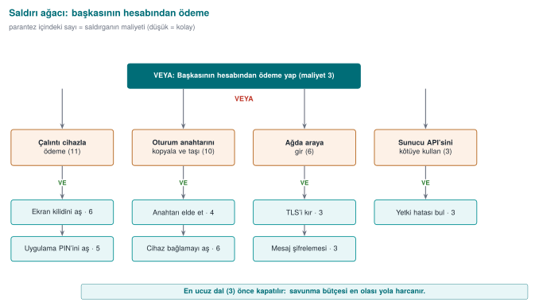

The same tree in Demo 04's input format (`agac-s4.txt`):

```text
HEDEF: Baskasinin hesabindan odeme yap
  VE Calinti cihazla odeme yap
    YAPRAK Ekran kilidini as                  maliyet=6
    YAPRAK Uygulama PIN'ini as                maliyet=5
  VE Oturum anahtarini kopyala ve tasi
    VEYA Anahtari elde et
      YAPRAK Root + hata ayiklayici (T1)      maliyet=4
      YAPRAK Yerel DB'yi kopyala ve coz       maliyet=8
      YAPRAK Zararli baglantiyla kod (T9)     maliyet=9
    YAPRAK Cihaz baglamayi as                 maliyet=6
  VE Agda araya gir
    YAPRAK Sahte erisim noktasi kur           maliyet=1
    YAPRAK Sertifika dogrulamasini as (T3)    maliyet=2
    YAPRAK Oturum belirtecini yeniden oynat   maliyet=3
  VE Sunucu API'sini kotuye kullan
    YAPRAK Kendi hesabiyla giris yap          maliyet=1
    YAPRAK Islem numarasini degistir (T7)     maliyet=2
```

The end of the output we get when we run this through Demo 04's calculator:

```text title="agac agac-s4.txt (son kısım)"
  EN UCUZ SALDIRI = 3 birim. Savunmacinin oncelikle kirmasi
  gereken zincir (en zayif nokta):

  -> Baskasinin hesabindan odeme yap (maliyet=3)
    -> Sunucu API'sini kotuye kullan [hepsi gerekir] (maliyet=3)
      -> Kendi hesabiyla giris yap (maliyet=1)
      -> Islem numarasini degistir (T7) (maliyet=2)
```

When we applied the countermeasures in order, the cheapest path changed as follows (the same program, with
leaf costs updated):

| Countermeasure applied | Leaf changed | New cheapest path | Cheapest attack |
| --- | --- | --- | --- |
| — (start) | — | Server API (T7) | 3 |
| Object-level ownership check | T7: 2 → 20 | MITM on the network (T3) | 6 |
| Certificate validation + pinning | T3: 2 → 12 | Extract the session key (T1) | 10 |

This table is S4's strongest piece of evidence: two countermeasures raised the cheapest attack **from 3 to
10** and showed, with a number, where the next investment should go (the key in memory: RASP, secure
erasure, device binding). Notice: T9, the most severe row by CVSS, is not the cheapest path for this goal —
this is exactly why the two tools are read together.

### Grading Criteria

S4 is the main part of the **security analysis** criterion in the midterm submission. The table below is
used for grading.

| Criterion | Weak | Adequate | Good |
| --- | --- | --- | --- |
| Attacker model | None, or one sentence | Three models, capabilities written | Every model's access and goal are explicit; every threat row is tied to a model |
| Coverage | A few random threats | STRIDE applied to every interface | Every S5 asset appears in at least one threat; exclusions are justified |
| CWE mapping | Missing, or always high-level entries | A CWE on every row | Most concrete entry; root cause separated from consequence |
| CVSS | Score only, no vector | Full vector + score | Vector consistent with the attacker model; debatable metrics (S, PR) justified |
| Attack tree | Missing, or AND/OR wrong | Correctly computed, cheapest path stated | Before/after countermeasure comparison and a suggestion for the next investment |
| Priority | None | Ordered by score | Score, asset value, and attack tree jointly justified |
| Traceability | No countermeasure | Countermeasure on every row | Countermeasure → guide section → S17 requirement ID chain established |

!!! tip "Common project mistakes"
    Writing the **consequence** in the table ("data is stolen"), copying the same vector into every row,
    writing the CVSS score but not the vector, picking the smallest child at an AND node in the attack tree,
    and writing a single word like "encryption" in the countermeasure column (which algorithm, which key,
    which section?). An assessor must be able to reproduce every row.

---

## 19. Class Activities

Activities are not graded; they exist to reinforce the topics in class. Each one's duration, group setup, and
expected output are given. Which activity is done in which class hour is in the "Course flow" plan; anything
that does not fit is left for the student's own study.

!!! example "Activity 1 — Classify the Malware, Pick the Layer (12 min · groups of 3–4)"
    **Goal:** to use type classification and the boundaries of detection layers together.

    **Steps:**

    1. Every group gets two of the six scenarios below (3 min reading).
    2. For every scenario, the group fills in these four fields: **type** (virus/worm/trojan
       horse/ransomware/rootkit/wiper), **propagation path**, **the layer that would catch it first** (hash,
       pattern, YARA, heuristic, behaviour/EDR, sandbox, emulation, allow-list), and **that layer's likely
       mistake in this scenario** (a false positive, or a false negative?).
    3. Every group presents one scenario to the class in 1 minute.

    Scenarios: (a) the "invoice.pdf.exe" attachment mails itself to the address book when opened; (b) it
    self-propagates through an overflow flaw in a service exposed to the internet; (c) a "free video player"
    sends out browser passwords in the background once installed; (d) it loads as a kernel driver and removes
    its own processes from the listings; (e) it encrypts files and leaves a note, but never stores the key at
    all; (f) a backdoor inserted into a software's official update during the build.

    **Expected output:** A six-row table. Example: (e) wiper; propagation via a network flaw or an update;
    caught first by behaviour/EDR ("rewriting many files with high entropy in a short time"); a hash
    signature gives a false negative on the new copy.

    **Instructor's note:** in scenario (f), **both** the signature and the allow-list fail, because the file
    is validly signed; discuss here why supply-chain attacks are frightening. For (d), ask "how does a
    scanner at the same privilege level trust a kernel that lies to it?"

!!! example "Activity 2 — Think Like an Attacker: Attack Tree Duel (15 min · paired groups)"
    **Goal:** to apply Recipe 12.1's "never underestimate the attacker" principle and AND/OR arithmetic.

    **Steps:**

    1. In 6 minutes, every group draws an attack tree with at least 6 leaves for the goal "change a grade in
       the exam system"; they write a cost (person-days) on the leaves.
    2. Groups swap trees. In 4 minutes, the other group tries to find a path that is **not in the tree and is
       cheaper** (e.g. an insider, a backup file, the password-reset flow).
    3. The original group adds the found path, rewrites the tree in Demo 04's format, and computes the
       cheapest path.

    **Expected output:** Two versions of the tree, and an answer to "by how many units did the other group's
    path lower the cheapest path?"

    **Instructor's note:** students almost always write technical branches and forget social-engineering and
    process branches. Once the found path is added, the root's cost is usually cut in half; write the
    conclusion "an attack tree is never finished" on the board.

!!! example "Activity 3 — From Matrix to Model (15 min · pairs)"
    **Goal:** to express the same policy as an access matrix, an ACL, a capability list, and BLP/Biba labels.

    **Policy:** the subjects are `uygulama` (application), `kutuphane` (library), `raporlayici` (reporter);
    the objects are `oturum_anahtari` (session key), `islem_kaydi` (transaction log), `hata_raporu` (error
    report). The library reads/writes the key and writes to the transaction log; the application reads the
    transaction log and writes to the error report; the reporter only reads the error report.

    **Steps:**

    1. Draw the access matrix (3 min).
    2. Convert the matrix into ACLs (column by column) and capability lists (row by row) (4 min).
    3. Give the objects a confidentiality level (`oturum_anahtari`: Confidential, the others: Unclassified)
       and label the subjects. Which cell is **denied** according to BLP? (4 min)
    4. Give Biba trustworthiness levels (`hata_raporu` has an external source: Low). Which cell is denied?
       (4 min)

    **Expected output:** Four small tables and one sentence: "If the library is at the Confidential level,
    its writing to the Unclassified `islem_kaydi` violates BLP's *-property; so either the log only receives
    non-confidential fields, or the library is split into two parts."

    **Instructor's note:** the resulting contradiction is deliberate: practical systems need a "trusted
    subject" exception or a split component. You can have the same rules written into Demo 03's policy file
    and compare the result.

!!! example "Activity 4 — From Finding to Patch Order (15 min · groups of 3)"
    **Goal:** to combine CWE, CVSS, EPSS, KEV, and SSVC into a single decision.

    **Findings (synthetic):**

    | No | Finding | System | EPSS | KEV |
    | --- | --- | --- | --- | --- |
    | B1 | No length check in the library's parser, remote code execution | Exposed to the internet | 0.62 | Yes |
    | B2 | CSRF in the admin panel | Internal network only | 0.03 | No |
    | B3 | Full card number in logging | All clients | 0.01 | No |
    | B4 | Session cookie missing the `Secure` flag | Exposed to the internet | 0.08 | No |
    | B5 | Local privilege escalation in the driver | Employee computers | 0.41 | Yes |

    **Steps:**

    1. Write the most concrete CWE for each finding (3 min).
    2. Build a CVSS v3.1 vector and score it with Demo 05 (5 min).
    3. Rank them first by CVSS alone, then also taking EPSS and KEV into account (4 min).
    4. For B1 and B5, fill in the SSVC decision points (exploitation, automatability, technical impact,
       mission prevalence, public well-being) and write the Track/Track*/Attend/Act decision (3 min).

    **Expected output:** Two rankings and a one-sentence explanation of the difference. B1 comes first in
    both rankings; B5 might sit in the middle by CVSS alone but rises because it is in KEV.

    **Instructor's note:** likely CWEs: B1 CWE-787 (or CWE-120), B2 CWE-352, B3 CWE-532, B4 CWE-614, B5
    CWE-269 or a more concrete entry depending on the driver's root cause. Tie the discussion back to "the
    score is a starting point, the decision is made with context" (Demo 05).

!!! example "Activity 5 — Tamper With the Audit Log (10 min · pairs)"
    **Goal:** to experimentally see what an HMAC chain catches and what it cannot catch (Recipe 13.11).

    **Steps:**

    1. Manually change the amount in one line of the chained log file that Demo 11 produced, and run the
       verifier. From which line onward did it report an error?
    2. Delete a line, then add a line. What happens?
    3. Delete the last three lines (truncation from the end). Did the verifier notice? Why?
    4. Write two countermeasures for the question "what happens if the attacker also captures the HMAC key?"

    **Expected output:** modification, deletion, and insertion are caught; truncation from the end is only
    caught if the last chain value or the line count is also kept separately (on a remote server). If the key
    is captured, the whole chain can be recomputed; recommended countermeasures are sending records to the
    remote server immediately, and updating the key with a one-way function after every record (forward-secure
    key evolution).

    **Instructor's note:** remind students here of Recipe 13.11's warning that "syslog sends over UDP,
    unencrypted and unauthenticated"; today, syslog over TLS (RFC 5425) and centralised logging systems are
    used.

!!! example "Activity 6 — Code-Reading Tournament (15 min · teams of 4)"
    **Goal:** to recognise this week's CWEs in code.

    **Steps:**

    1. The instructor projects four snippets from the "Code reading exercises" section on the screen (with
       the answer boxes closed).
    2. In 2 minutes per snippet, teams write down the **CWE identifier**, **a one-sentence attack**, and
       **the fix** on paper.
    3. Scoring: correct CWE 2 points (a more general CWE in the same family 1 point), a working attack
       1 point, a correct fix 2 points.

    **Expected output:** a team score table; the two most commonly confused CWEs written on the board.

    **Instructor's note:** a good foursome: Reading 1 (TOCTOU), Reading 9 (fail-open), Reading 13
    (out-of-bounds read), Java 3 (default ECB). Students most often write CWE-20 as a "wildcard"; do not give
    full marks without asking for a more concrete entry.

!!! example "Activity 7 — Incident Autopsy (10 min · groups of 3–4)"
    **Goal:** to describe malware incidents in the language of classification.

    **Steps:** every group picks one incident: Heartbleed, WannaCry, or Log4Shell. They fill in these fields:
    CVE, CWE, the CVSS v3.1 score (NVD), the flaw's disclosure date, the patch date, the date of widespread
    exploitation, and the lesson for the programmer.

    **Expected output (for the instructor to check):**

    | Incident | CVE | CWE (NVD) | CVSS v3.1 (NVD) | Note |
    | --- | --- | --- | --- | --- |
    | Heartbleed | CVE-2014-0160 | CWE-125 | 7.5 | Out-of-bounds read; a key can leak from memory |
    | WannaCry (EternalBlue) | CVE-2017-0144 | No NVD data | 8.8 | Patch MS17-010 (14 March 2017), attack 12 May 2017 |
    | Log4Shell | CVE-2021-44228 | CWE-917 (Apache: CWE-20, 400, 502) | 10.0 | Expression injection in a logging library |

    **Instructor's note:** open the scores from the NVD page together with the class; show, using the
    Log4Shell example, that the NVD's CWE mapping can differ from the product owner's (CNA).

---

## 20. Code Reading Exercises: Find the Vulnerability

Each of the code snippets below has a vulnerability. Find its type (CWE) and its fix; the answers are in the
hidden box.

??? question "Snippet 1 — Access Control"
    ```c
    /* Kullanıcının dosyaya erişimi var mı? */
    if (access(dosya, W_OK) == 0) {
        FILE *f = fopen(dosya, "w");     /* ... */
        fprintf(f, "%s\n", kayit);
        fclose(f);
    }
    ```
    What is this code's vulnerability? Which CWE? How is it fixed?

    ??? success "Answer"
        **CWE-367 (TOCTOU).** The file can be replaced with a symbolic link between `access()` and
        `fopen()` (see Demo 06). Also, `access()` uses the **real** identity while `fopen()` uses the
        **effective** identity — in a setuid program these differ. Fix: skip the check and open with
        `open(dosya, O_WRONLY|O_CREAT|O_NOFOLLOW, 0600)`, then work through the fd.

??? question "Snippet 2 — Integrity Check"
    ```c
    uint32_t beklenen = 0x1a2b3c4d;
    uint32_t bulunan  = crc32(kod_bolgesi, boyut);
    if (bulunan != beklenen)
        return HATA;   /* kurcalanmış */
    calistir();
    ```
    An integrity (anti-tampering) check. It has two serious weaknesses; find them.

    ??? success "Answer"
        (1) **CRC32 is not cryptographic** (CWE-327/CWE-354): an attacker can modify the code and force the
        CRC back to its old value (collisions are easy). A cryptographic digest (SHA-256) or a signature is
        needed. (2) The check is tied to a **single branch** (`if`): an attacker evades it by turning `jne`
        into `jmp`. Fix: use the digest's result **in the decision flow** (e.g. in key derivation), not tied
        to a single branch. (Week 6.)

??? question "Snippet 3 — Access Default"
    ```c
    struct kullanici k;
    strncpy(k.ad, girdi, sizeof k.ad);
    /* k.yonetici alanı hiç atanmadı */
    if (k.yonetici) ver_yonetici_paneli();
    ```
    Which principle is violated here?

    ??? success "Answer"
        A violation of **fail-safe defaults** (CWE-1188 / CWE-665: improper initialisation). Because
        `k.yonetici` is never initialised, the garbage value on the stack can be nonzero → an accidental
        administrator. Fix: start **explicitly on the safe side** with `struct kullanici k = {0};` or
        `.yonetici = 0`.

---

## 21. Work on Your Own

Not graded; it exists to reinforce the lesson. All of it is done on `code/week-02`, only on your own
computer.

??? question "Exercise 1 — Easy: A Fourth Polymorphic Copy"
    Look at `ornek_uret.c` in Demo 01. `poli_3` used a different algorithm. Write a capsule file by hand
    (with a text editor) and show it to the `pattern` method. Does emulation catch it?

    ??? tip "Hint"
        Capsule format: line 1 is `KAPSUL/1`, line 2 is the decryptor commands, then the body. Emulation
        catches it if it decrypts the body and looks for the `MAVI-KEDI-42` marker.

??? question "Exercise 2 — Easy: The Entropy Threshold"
    In Demo 02, measure a `.png`, a `.zip`, and a `.txt` file from your own computer. Which harmless files
    does the rule "suspicious if entropy is greater than 7.2" flag incorrectly?

    ??? success "Expected result"
        Because `.png` and `.zip` are compressed, they come out above 7.2 → **a false positive**. Entropy
        alone is not a sufficient criterion; it must be combined with context (file type, location).

??? question "Exercise 3 — Medium: BLP + Biba Together"
    In Demo 03, write `MODEL BLP+BIBA` in a policy file. How must you set the levels so that a subject can
    **both read and write** an object? Interpret the result.

    ??? success "Answer"
        Both must be at the same level. BLP requires `os ≥ ns` for reading and `os ≤ ns` for writing; Biba
        requires the reverse. Both are satisfied only when `os = ns`. Conclusion: data requiring both high
        confidentiality and high integrity can only be processed **at its own level**.

??? question "Exercise 4 — Medium: Defence in the Attack Tree"
    In Demo 04, copy `agac-odeme.txt` and make the "decrypt the database" branch cheaper (lower its costs).
    Does the cheapest path change? **Where** should you place a defence to raise the cheapest attack's cost
    the most?

    ??? tip "Hint"
        The cheapest path is always the lowest-cost branch of the OR at the root. Adding a defence to
        **that** branch is most effective; adding it to another branch does not change the cheapest path.

??? question "Exercise 5 — Medium: The Effect of CVSS Metrics"
    In Demo 05, change the `AV:N/AC:L/PR:N/UI:N/S:U/C:H/I:H/A:H` (9.8) vector one metric at a time and watch
    the score: `AV:N→L`, `PR:N→H`, `S:U→C`. Which change lowers/raises the score the most?

    ??? success "Expected result"
        `S:U→C` raises the score (the scope widens). `AV:N→L` and `PR:N→H` lower it (remote + unauthenticated
        is the most dangerous case). This is a good lead-in to the discussion "if the device is in the
        attacker's hands (local access), even though the score drops, the risk to you does not decrease."

??? question "Exercise 6 — Medium: TOCTOU Without a Delay"
    In Demo 06, remove the `export TOCTOU_GECIKME_US=...` line from `saldiri.sh` (set the delay to 0). Does
    the unsafe attack still work? Why do real attackers automate the attempt?

    ??? success "Expected result"
        Without the delay, winning the race becomes harder; the attack sometimes does not work. This is why
        real attackers try **thousands of times** — even working once is enough. Race condition flaws are
        "dangerous once automated, even if they don't work every time."

??? question "Exercise 7 — Hard: What Is Metamorphism?"
    Polymorphism encrypts the body and changes the decryptor. **In metamorphism** there is no encryption; the
    **entire** code is rewritten in every copy. What would happen to Demo 01's entropy? Do the signature and
    emulation methods still work?

    ??? tip "Hint"
        Metamorphic code's entropy stays like normal code (not encrypted) → entropy gives no clue. Since
        there is no fixed "decrypted body," emulation cannot converge on a single signature either. That is
        why **behaviour-based** detection is needed against metamorphic malware.

??? question "Exercise 8 — Hard: Work Through a Real CVE"
    Find a CVE record for an open-source library (of your own choosing). (a) Which CWE type is it? (b) Enter
    the CVSS vector into Demo 05 and verify the score. (c) What did the patch change? (d) Is this an example
    of a "patch gap"?

---

## 22. Self-Check

??? question "1. Explain the difference between a virus, a worm, and a trojan horse, one sentence each."
    A **virus** attaches itself to another file and needs its carrier to be run. A **worm** spreads over the
    network on its own, without user interaction. A **trojan horse** looks innocent while causing harm in the
    background, and does not copy itself.

??? question "2. What are a virus's three parts? Which one looks at the 'when' question?"
    The infection mechanism (copies itself), the trigger (the condition — "when"), the payload (the actual
    damage). The **trigger** looks at the "when" question; code that goes off based on a condition is called
    a logic bomb.

??? question "3. What is the difference between polymorphism and metamorphism?"
    In polymorphism, the body is encrypted and the **decryptor** changes in every copy; once decrypted, the
    body is always the same. In metamorphism there is no encryption; the **entire** code is rewritten in
    every copy. Metamorphic code cannot be reduced to a single signature by emulation.

??? question "4. Does high entropy prove a file is malicious?"
    No. Encrypted, compressed, and random data are all high-entropy too; so are harmless files like
    `.zip`/`.png`. Entropy is only a **clue**; high entropy specifically **in an unexpected place** raises
    suspicion.

??? question "5. What are the two fundamental limits of signature-based detection?"
    (1) It only catches **known** malware; it misses a never-before-seen (zero-day) sample. (2)
    Polymorphic/metamorphic malware evades the signature by changing it. This is why a signature alone is
    not enough.

??? question "6. How does emulation catch a polymorphic virus? What is its limit?"
    It "runs" the suspicious file in an isolated environment, waits for the decryptor to unpack the body,
    then signs the decrypted body. Its limit: it is slow, and if the malware detects "I'm in a virtual
    machine" (anti-emulation), it can hide its behaviour.

??? question "7. What is the difference between DAC and MAC? Give an example."
    In DAC, the permissions are decided by the **owner of the object** (Unix `chmod`); it is flexible but
    cannot prevent a leak systemically. In MAC, permissions are decided by the **system/policy** and the
    owner cannot change them (Bell–LaPadula, SELinux); it is strict but provides a mandatory boundary.

??? question "8. What are Bell–LaPadula's two rules, and what do they protect?"
    "No read up" (cannot read something more confidential than itself) and "no write down" (cannot write to
    something less confidential than itself). It protects **confidentiality**: confidential information
    cannot leak downward.

??? question "9. How does Biba differ from BLP?"
    Biba protects **integrity** and its rules are reversed: "no read down" (do not trust dirty data) and "no
    write up" (do not corrupt clean data). BLP is for confidentiality, Biba is for integrity.

??? question "10. What is the core idea of the Clark–Wilson model?"
    Critical data (a CDI) is touched not **directly**, but only through **approved, well-formed
    transactions** (TPs); integrity is checked regularly (an IVP), and a critical operation is split across
    multiple people through **separation of duty**. It is designed for commercial (banking) integrity.

??? question "11. What does the setuid bit do on Unix? Why is it dangerous?"
    `setuid` makes a program run with the authority of the **file's owner** (often root), no matter who runs
    it. It is dangerous because a small flaw in the program turns directly into privilege escalation; this
    is why least privilege and dropping privilege early are critical.

??? question "12. What does a NULL DACL mean on Windows, and why is it dangerous?"
    A DACL with no ACEs at all grants **full access to everyone** on the object (including taking ownership
    and changing the DACL). This is an "open to everyone" state that can easily be abused.

??? question "13. What is the difference between CWE and CVE?"
    **CWE** is the weakness's **type** (e.g. SQL injection, CWE-89). **CVE** is the **identifier** of a
    specific flaw in a specific product (e.g. Heartbleed, CVE-2014-0160). A CVE belongs to one or more CWE
    types.

??? question "14. What does the CVSS Base score not measure? Why might a 4.0 flaw be more important to you than a 9.8 one?"
    The base score does not measure **context** (the value of your asset, your environment); it measures the
    flaw's own properties. If a 4.0 affects exactly your most valuable asset, it takes priority over some
    other 9.8 for you. This is what the Environmental metrics and your asset table are for.

??? question "15. What is responsible disclosure (coordinated disclosure), and why does it matter?"
    It is the researcher reporting the flaw **to the vendor first**, waiting a reasonable period (e.g. 90
    days) for a patch, and then disclosing it publicly. It protects users while also getting the vendor to
    act; it reduces the risk of full disclosure (disclosing immediately).

??? question "16. Explain the concepts of 'zero-day' and 'patch gap'."
    A **zero-day** is a flaw the vendor does not know about, or for which there is no patch (there is no
    defence). The **patch gap** is the period, after the patch is released, during which anyone can study
    the patch and learn the flaw, and users who have not updated remain vulnerable.

??? question "17. Which topics of this course does MASVS-RESILIENCE relate to?"
    With resilience against reverse engineering and tampering: code obfuscation (Weeks 9, 14), RASP (Week
    6), and whitebox cryptography (Week 11). The protections we learn in this course are the direct
    counterpart of this category.

??? question "18. Which CWEs does a security assessor look at for 'exposed secrets'?"
    **CWE-798** for a hardcoded credential/key, **CWE-316** for sensitive data left exposed in memory; they
    test these with source/binary analysis and a memory dump (as in Week 1 Demo 02).

---

## 23. Sample Quiz-1-Style Questions

Quiz-1 (Week 8) contains short-answer and code-reading questions of this kind. Try them; verify the answers
against the sections above.

1. Split the following types into two groups, "requires user interaction / does not require it": virus,
   worm, trojan horse, macro virus.
2. Write the base score and band of the vector `CVSS:3.1/AV:N/AC:L/PR:N/UI:R/S:C/C:L/I:L/A:N`. (Hint: a
   typical XSS. Verify with Demo 05.)
3. Which model satisfies a system's requirement "no one without authorisation should see the confidential
   document"? Write its two rules.
4. What is the flaw in the `access()` then `open()` pattern (with its CWE number), and what is its one-line
   fix?
5. Why does a signature-based scanner miss a polymorphic sample? Which method catches it?

---

## 24. Resources and Further Reading

**Course textbook** — J. Viega, M. Messier, *Secure Programming Cookbook for C and C++*, O'Reilly, 2003:

- Recipe 2.1 (the Unix access control model), 2.2 (the Windows access control model)
- Recipe 2.3 (checking a user's access to a file; TOCTOU)
- Recipe 12.1 (the problem of software protection — attacker and defender using the same methods)
- Recipe 13.11 (audit logging — the SACL/syslog context)

!!! note "Updating the book's 2003 content"
    The book's account of the access model is fundamentally still valid; however, the Windows side was
    written for the XP/2003 era. Today, **Mandatory Integrity Control (MIC)** and **AppContainer**
    (Biba-like mandatory boundaries) are added to it. On the Unix side, **POSIX ACLs, capabilities
    (`CAP_*`)**, and **SELinux/AppArmor** (MAC layers) have joined the classic permission bits.

**Open sources (may be cited by name)**

- F. Cohen, "Computer Viruses — Theory and Experiments", 1984 (the definition of a virus and the detection
  limit).
- D. E. Bell, L. J. LaPadula, security model reports, 1973 (the confidentiality model).
- K. J. Biba, "Integrity Considerations for Secure Computer Systems", 1977 (the integrity model).
- D. Clark, D. Wilson, "A Comparison of Commercial and Military Computer Security Policies", 1987.
- B. Schneier, "Attack Trees", 1999.
- MITRE **CWE** and **CWE Top 25**; MITRE **CVE**; FIRST's **CVSS v3.1** and **v4.0** documents.
- **OWASP** Top 10, ASVS, MASVS, and MASTG.
- Real incidents (for date verification): Brain (1986), the Morris worm (1988), ILOVEYOU (2000), Code Red
  (2001), Stuxnet (2010), WannaCry (2017), NotPetya (2017).

??? abstract "Glossary"
    | Term | Turkish | Short definition |
    | --- | --- | --- |
    | Malware | Zararlı yazılım | Any program written to cause harm or steal data |
    | Payload | Yük | The part of the malware that does the actual damage |
    | Polymorphism | Polimorfizm | Malware whose decryptor changes in every copy, with an encrypted body |
    | Metamorphism | Metamorfizm | Malware whose entire code is rewritten in every copy |
    | Entropy | Entropi | A measure of how random/mixed data is (0–8 bits/byte) |
    | Sandbox | Kum havuzu | Running suspicious code in an isolated environment |
    | Heuristic | Sezgisel | Detection by scoring suspicious features without a signature |
    | Access matrix | Erişim denetim matrisi | A subject × object permission table |
    | DAC / MAC / RBAC | İsteğe bağlı / zorunlu / rol tabanlı erişim | The decision is made by the owner / the system / the role |
    | Bell–LaPadula | — | Confidentiality model (no read up, no write down) |
    | Biba | — | Integrity model (no read down, no write up) |
    | Clark–Wilson | — | Commercial integrity through well-formed transactions + separation of duty |
    | TOCTOU | Denetim/kullanım yarışı | The race flaw between check and use (CWE-367) |
    | CWE | Zayıflık kataloğu | A numbered list of software weakness types |
    | CVE | Zafiyet kimliği | The unique identifier of a specific flaw in a specific product |
    | CVSS | Zafiyet puanı | A flaw's severity score, from 0 to 10 |
    | Responsible disclosure | Sorumlu ifşa | Reporting the flaw to the vendor first and waiting for a patch |
    | Zero-day | Sıfırıncı gün | A flaw the vendor does not know about / has no patch for |
