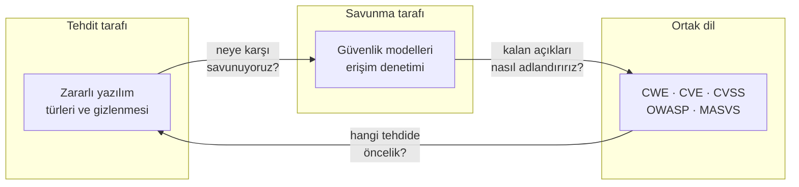
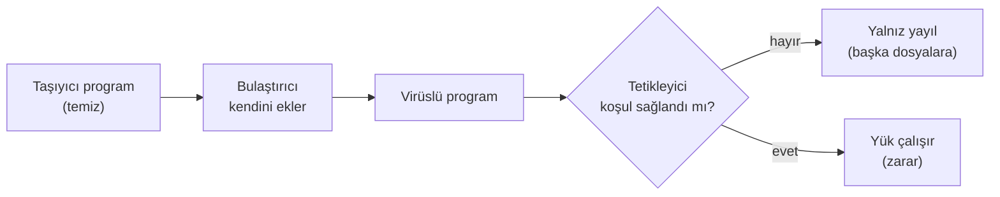
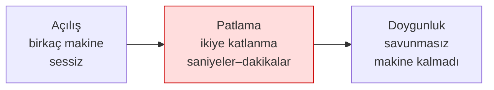
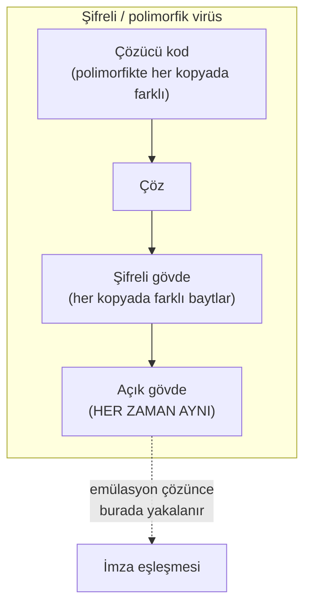
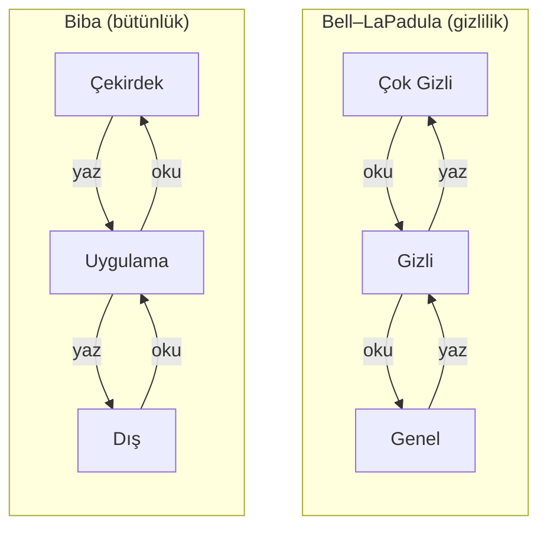
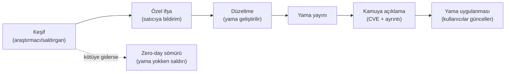
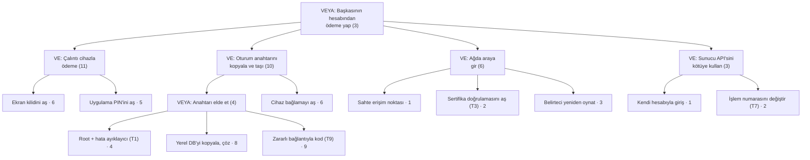

# Hafta 2 — Bilgisayar Virüsleri ve Güvenlik Modelleri

| | |
| --- | --- |
| **Tarih** | 25.09.2026 |
| **Öğrenme çıktısı** | ÖÇ.1 (yaygın yazılım güvenlik açıklarını tanımlar ve sınıflandırır) |
| **Süre** | 3 saat (3 × 50 dakika) |
| **Ön bilgi** | Hafta 1 (CIA, saldırgan modeli, STRIDE, saldırı ağacı); C'de dosya okuma; PowerShell ya da Linux terminalinde `cd`, `ls` |
| **Uygulamalar** | [`code/week-02`](https://github.com/ucoruh/cen429-secure-programming/tree/main/code/week-02) — 14 demo; Windows (MSVC), WSL ve Linux'ta çalışır |

<!-- materyal:basla -->

<div class="materyal" markdown>

[:material-file-pdf-box: Ders notu (PDF)](cen429-week-2-ders-notu.pdf){ .md-button download="cen429-week-2-ders-notu.pdf" }
[:material-file-word-box: Ders notu (DOCX)](cen429-week-2-ders-notu.docx){ .md-button download="cen429-week-2-ders-notu.docx" }
[:material-presentation: Sunum (PDF)](cen429-week-2-sunum.pdf){ .md-button download="cen429-week-2-sunum.pdf" }
[:material-microsoft-powerpoint: Sunum (PPTX)](cen429-week-2-sunum.pptx){ .md-button download="cen429-week-2-sunum.pptx" }
[:material-language-html5: Sunum (HTML, çevrimdışı)](cen429-week-2-sunum.html){ .md-button download="cen429-week-2-sunum.html" }
[:material-folder-zip: Tümünü indir (ZIP)](cen429-week-2-materyal.zip){ .md-button download="cen429-week-2-materyal.zip" }
[:material-fullscreen: Sunumu tam ekran aç](cen429-week-2-sunum.html){ .md-button .md-button--primary target=_blank }

</div>

<div class="sunum-cercevesi">
<iframe src="../cen429-week-2-sunum.html" title="Hafta 2 — Bilgisayar Virüsleri ve Güvenlik Modelleri" loading="lazy" allowfullscreen></iframe>
</div>

<p class="sunum-ipucu">Sunumun içine tıklayıp ok tuşlarıyla ilerleyin; tam ekran için sunumun sağ altındaki düğmeyi ya da yukarıdaki "Sunumu tam ekran aç" bağlantısını kullanın.</p>

<!-- materyal:bitis -->

!!! abstract "Bu haftanın sonunda şunları yapabileceksiniz"
    1. **Zararlı yazılımları** (virüs, solucan, truva atı, fidye yazılımı, rootkit, bot) davranışlarına göre
       ayırmak ve bir virüsün üç parçasını (bulaştırıcı, tetikleyici, yük) bir örnekte göstermek.
    2. Bir zararlının **neden ve nasıl gizlendiğini** (şifreleme, oligomorfizm, polimorfizm, metamorfizm)
       açıklamak ve bunun imza tabanlı tespiti neden zorlaştırdığını çalışan bir demoda görmek.
    3. **Karşı önlemleri** (imza, sezgisel, davranış tabanlı tespit, kum havuzu, emülasyon) ve her birinin
       yanlış pozitif/negatif sınırlarını tartışmak.
    4. Bir erişim politikasını **erişim denetim matrisi** ile yazmak; **DAC / MAC / RBAC** farkını söylemek.
    5. **Bell–LaPadula, Biba ve Clark–Wilson** modellerinin kurallarını ve neyi (gizlilik/bütünlük) koruduğunu
       bir simülatörde göstermek; **Unix ve Windows** erişim modelleriyle bağ kurmak.
    6. Bir zafiyeti **CWE** ailesine eşlemek, **CWE Top 25 / OWASP Top 10 / MASVS** listelerinin işlevini açıklamak.
    7. Bir açığa **CVSS v3.1** taban puanı vermek (v4.0 farkını bilmek) ve **CVE** kimliğiyle ilişkilendirmek.
    8. **Zafiyet yaşam döngüsünü** (keşif → ifşa → yama → kamuya açılma) ve **sorumlu ifşayı** anlatmak.

??? info "Ders akışı (öğretim üyesi için zaman planı)"
    | Zaman | Bölüm | Ne yapılıyor |
    | --- | --- | --- |
    | 0:00–0:10 | Isınma | Geçen hafta özeti; "kötü yazılım nedir, virüs mü her şey?" tartışması |
    | 0:10–0:35 | 1–4 | Zararlı yazılım tarihçesi, anatomisi, türleri; salgın modeli — **Demo 09** |
    | 0:35–0:50 | 5–7 | Gizlenme ve karşı önlemler — **Demo 01**, **02**, **07**, **08**; olay incelemeleri |
    | 0:50–1:00 | Ara | |
    | 1:00–1:30 | 8–9 | Saldırı ağaçları — **Demo 04**; denetim kaydı — **Demo 10**, **11** |
    | 1:30–1:50 | 10–12 | Erişim denetimi ve biçimsel modeller — **Demo 03**, **14** (sınıf etkinliği) |
    | 1:50–2:00 | Ara | |
    | 2:00–2:20 | 12 | Unix ve Windows modelleri — **Demo 12**, **13**, **06** |
    | 2:20–2:50 | 13–16 | CWE / OWASP / MASVS / CVE / CVSS / yaşam döngüsü — **Demo 05**, sınıf etkinliği |
    | 2:50–3:00 | 17–24 | Kontrol listesi, projeye katkı (S4), kendini sınama; kalan alıştırmalar öğrenciye |

!!! tip "Laboratuvarı önceden hazırlayın"
    Demolar hem **Windows** (Visual Studio 2022 Community, MSVC) hem **WSL/Linux** (GCC) üzerinde derlenir. Tek
    bir kaynak, iki platform: SHA-256 ve AES için Windows'ta işletim sisteminin BCrypt kütüphanesi, Linux'ta
    OpenSSL kullanılır (`code/common/cen429_kripto.h`); Windows'ta ayrıca OpenSSL kurmanız gerekmez.

    === "Windows (PowerShell)"
        ```powershell
        git clone https://github.com/ucoruh/cen429-secure-programming.git
        cd cen429-secure-programming\code
        .\build.ps1
        cd week-02\01-imza-tarayici ; .\demo.ps1
        ```

    === "WSL / Linux"
        ```bash
        sudo apt install -y build-essential cmake libssl-dev python3
        git clone https://github.com/ucoruh/cen429-secure-programming.git
        cd cen429-secure-programming/code && ./build.sh
        cd week-02/01-imza-tarayici && sh demo.sh
        ```

    Visual Studio ile: **Dosya > Aç > Klasör** → `code` → üstten **Windows (MSVC)** ya da **WSL (GCC)**
    yapılandırmasını seçin → **Derle > Tümünü Derle**. TOCTOU demosu (Demo 6) yalnız WSL/Linux'ta çalışır.

!!! warning "Etik kural — bu hafta özellikle önemli"
    Bu hafta zararlı yazılımı **kavramsal** olarak öğreniyoruz. **Hiçbir demoda gerçek zararlı yazılım, kendini
    çoğaltan kod, dosya silme/şifreleme ya da ağ saldırısı yoktur.** Bütün demolar yalnız kendi klasörlerinde,
    yönetici yetkisi olmadan çalışan **güvenli benzetimlerdir** (oyuncak bir dosya biçimi, bir simülatör, bir
    hesap makinesi). Öğrendiklerinizi **yalnız kendi bilgisayarınızda ve verilen demolar üzerinde** deneyin.
    Zararlı yazılım yazmak, yaymak ya da başkasının sistemine bulaştırmak suçtur.

---

## 1. Bu haftanın büyük resmi: tehdit, model, sınıflandırma

Geçen hafta güvenliğin dilini kurduk: varlık, tehdit, zafiyet, risk; saldırgan modeli; STRIDE ve saldırı ağacı.
Bu hafta o dilin üç sütununu dolduruyoruz:

!!! note "Kısa tarihçe: zararlı yazılım ve güvenlik modelleri"
    - **1949** — von Neumann **kendini çoğaltan** otomata teorisini kurar: virüs fikrinin matematiksel kökü.
    - **1971** — Creeper (ilk deneysel solucan) · **1986** Brain (ilk PC virüsü) · **1988** **Morris Worm** internetin büyük kısmını durdurur ve güvenliği gündeme oturtur.
    - **1973–1977** — **Bell–LaPadula** (gizlilik) ve **Biba** (bütünlük) erişim modelleri; **1987** Clark–Wilson (ticari bütünlük).
    - **1999 → 2006** — ortak sınıflandırma dili: **CVE** (somut açık), **CWE** (zayıflık türü), **CVSS** (ciddiyet puanı).

    Yani "zararlıyı tanıma" ve "erişimi modelleme" iki ayrı koldur; bu hafta ikisini birden görüyoruz.

- **Tehdit tarafı — zararlı yazılım:** Saldırganın en görünür aracı olan kötü yazılımı türlere ayıracağız
  (virüs, solucan, truva atı, fidye yazılımı) ve **nasıl gizlendiğini** göreceğiz. Çünkü bir savunmayı
  tasarlarken "bize karşı ne var?" sorusunun cevabının bir kısmı budur.
- **Savunma tarafı — güvenlik modelleri:** "Kim neye erişebilir?" sorusunu rastgele değil, **biçimsel bir
  modelle** yanıtlamayı öğreneceğiz (erişim matrisi, DAC/MAC/RBAC, Bell–LaPadula, Biba, Clark–Wilson). Bu
  modeller, işletim sistemlerinin (Unix, Windows) izin mimarisinin temelidir.
- **Ortak dil — sınıflandırma:** Bir açığı bulduğumuzda onu herkesin anladığı bir dille adlandırmalı ve
  ciddiyetini ölçebilmeliyiz. Bunun için **CWE** (açık türü), **CVE** (belirli açık), **CVSS** (ciddiyet puanı)
  ve **OWASP/MASVS** (öncelik listeleri) vardır.



Bu üçü birbirine bağlıdır: zararlı yazılımı tanımadan ona karşı model kuramaz, modeli kurmadan kalan açıkları
göremez, açıkları ortak bir dille adlandırmadan da hangi tehdide öncelik vereceğinizi bilemezsiniz.

!!! note "Bu dersin bakış açısı"
    Klasik "virüs dersi" antivirüs kullanmayı öğretir. Biz **programcı** gözüyle bakıyoruz: bir zararlının
    gizlenme yöntemi (polimorfizm, entropi) ile bizim kendi kodumuzu **koruma** yöntemimiz (kod gizleme,
    şifreli sabitler — 9. ve 11. hafta) çoğu zaman **aynı tekniklerdir**. Saldıran ve savunan aynı kutudan
    alet çıkarır; fark, niyet ve bağlamdadır.

---

## 2. Zararlı yazılım nedir? Kısa bir tarih

**Zararlı yazılım** (malware, "malicious software"), sahibinin izni ve bilgisi dışında zarar vermek, veri
çalmak, kaynak kullanmak ya da kontrolü ele geçirmek için yazılmış her programdır. "Virüs" günlük dilde bunların
hepsi için kullanılır; oysa virüs yalnızca **bir türdür**. Ayrımı görmek için önce birkaç dönüm noktasına bakalım.

| Yıl | Olay | Türü | Neden önemli? |
| --- | --- | --- | --- |
| 1971 | Creeper | Deneysel solucan | ARPANET'te kendini kopyalayan ilk deneysel program ("I'm the creeper") |
| 1984 | Fred Cohen'in tanımı | Kuram | Bilgisayar virüsünün ilk biçimsel tanımı ve "tam tespit imkânsızdır" kanıtı |
| 1986 | Brain | Önyükleme sektörü virüsü | İlk yaygın PC virüsü; disketin önyükleme sektörüne bulaşırdı |
| 1988 | Morris solucanı | Solucan | İnternette kendi kendine yayılan ilk büyük olay; binlerce makineyi yavaşlattı |
| 1999 | Melissa | Makro virüsü | Word belgeleri ve e-posta ile hızla yayıldı |
| 2000 | ILOVEYOU | Solucan/truva | E-posta ekiyle milyonlarca makineyi etkiledi; sosyal mühendislik gücü |
| 2001 | Code Red | Solucan | Web sunucusundaki bir taşma açığını kullanıp bellekte yayıldı |
| 2008 | Conficker | Solucan/bot | Milyonlarca makineden bir botnet kurdu |
| 2010 | Stuxnet | Hedefli solucan | Endüstriyel denetleyicileri (PLC) hedef aldı; devlet destekli sofistike saldırının simgesi |
| 2013+ | CryptoLocker | Fidye yazılımı | Dosyaları şifreleyip fidye isteme modelini yaygınlaştırdı |
| 2017 | WannaCry | Fidye + solucan | Bir ağ açığıyla kendi kendine yayılan fidye yazılımı; dünya çapında hastane/şirket etkiledi |
| 2017 | NotPetya | Yıkıcı (silici) | Fidye gibi görünüp aslında veriyi kalıcı yok eden, çok büyük ekonomik zarar veren saldırı |

!!! quote "Fred Cohen (1984) ve tespit sınırının kanıtı"
    Cohen, bir virüsü "kendini (belki değiştirerek) başka programlara kopyalayabilen program" olarak tanımladı
    ve önemli bir teorik sonuç gösterdi: **"Bu program bir virüs mü?" sorusunu her durumda doğru cevaplayan
    genel bir algoritma yazmak imkânsızdır** (durma probleminden indirgenir). Pratik sonucu şudur: hiçbir
    antivirüs %100 tespit edemez; her yöntemin yanlış pozitifleri (temizi yakalama) ve yanlış negatifleri
    (zararlıyı kaçırma) vardır. Bu hafta bunu [Demo 01](#4-yayilma-ve-gizlenme-nasil-fark-edilmez)'de kendi
    gözümüzle göreceğiz.

!!! info "Terim: 'in the wild' (doğada)"
    Bir zararlının gerçek kullanıcıların bilgisayarlarında dolaştığı, yalnız laboratuvarda değil sahada
    yayıldığı durum. Bu derste **hiçbir** doğadaki örnekle çalışmayız; yalnız kavramları ve güvenli benzetimleri
    kullanırız.

!!! quote "Gerçek olay: WannaCry (2017) — bir haftada bir programcı dersi"
    WannaCry, üç farklı konuyu tek olayda birleştirdiği için öğreticidir. (1) **Yayılma:** bir ağ dosya paylaşım
    protokolündeki bir taşma açığını (EternalBlue) kullanarak, kullanıcı hiçbir şey yapmadan, **solucan** gibi
    yayıldı — yani bu hafta göreceğimiz taşma sınıfı (Hafta 1) doğrudan bir solucanın motoru oldu. (2) **Yük:**
    ulaştığı makinelerde dosyaları **şifreleyerek** fidye istedi; işte bu yükün bıraktığı iz, [Demo
    2](#5-karsi-onlemler-nasil-yakalariz)'de göreceğimiz **entropi sıçramasıdır**. (3) **Yama boşluğu:** Kullanılan
    açığın yaması saldırıdan **haftalar önce** yayımlanmıştı; buna rağmen güncellememiş yüz binlerce makine
    (hastaneler, fabrikalar dahil) etkilendi. Programcı için üç ders: taşma açıkları teoride kalmaz, savunma
    davranışa da bakmalı, ve yama yayımlamak yeterli değildir — uygulanması gerekir. Bu üç iş parçacığı bu haftanın
    tam da omurgasıdır.

---

## 3. Zararlı yazılımın anatomisi ve türleri

### Bir virüsün üç parçası

Bir virüsü anlamanın en kolay yolu onu üç işleve ayırmaktır. Bir hastalık benzetmesiyle:

| Parça | İngilizcesi | İşi | Hastalık benzetmesi |
| --- | --- | --- | --- |
| **Bulaştırıcı** | infection mechanism | Kendini başka bir taşıyıcıya kopyalar | Virüsün hücreye girip çoğalması |
| **Tetikleyici** | trigger / logic bomb | "Ne zaman etkinleşeyim?" koşulu (tarih, sayaç, olay) | Kuluçka süresi |
| **Yük** | payload | Asıl zararı yapan kısım (veri sil, çal, şifrele) | Semptomlar |

Her üç parça da bulunmak zorunda değildir: yükü olmayan, yalnız yayılan bir virüs de vardır (yine de kaynak
tüketir ve bir zafiyettir). Tetikleyici koşulu bekleyen ve sonra patlayan koda **mantık bombası** (logic bomb)
denir.



### Türleri: yayılma biçimine göre

Zararlı yazılımları en yararlı biçimde **nasıl yayıldıklarına ve ne yaptıklarına** göre ayırırız:

=== "Virüs"
    Kendini **başka bir programa ya da dosyaya** iliştirir; çalışması için o taşıyıcının çalıştırılması
    (kullanıcı tarafından) gerekir. Alt türleri:

    - **Program (dosya) virüsü:** Çalıştırılabilir dosyalara (`.exe`, ELF) bulaşır; dosya çalışınca virüs de
      çalışır.
    - **Makro virüsü:** Ofis belgelerinin (Word, Excel) içindeki makro diline yazılır; belge açılınca çalışır.
      1999'da Melissa böyle yayıldı. Bugün de "makroları etkinleştir" tuzağı bir saldırı yoludur.
    - **Önyükleme sektörü virüsü:** Diskin ilk sektörüne (boot sector / MBR) bulaşır; bilgisayar açılırken
      işletim sisteminden **önce** çalışır. 1986'daki Brain böyleydi. Modern UEFI Secure Boot bu sınıfı büyük
      ölçüde zorlaştırdı.

=== "Solucan (worm)"
    Kendi başına, **taşıyıcıya ve kullanıcı etkileşimine ihtiyaç duymadan** ağ üzerinden yayılır. Genellikle
    bir ağ servisindeki bir açığı (ör. taşma) kullanır. Morris (1988), Code Red (2001), WannaCry (2017) böyle
    yayıldı. Solucanın tehlikesi **yayılma hızıdır**: dakikalar içinde yüz binlerce makineye ulaşabilir.

=== "Truva atı (trojan)"
    Yararlı ya da masum bir programmış gibi görünüp arka planda zarar veren yazılımdır. **Kendini kopyalamaz**;
    kullanıcının onu isteyerek çalıştırmasına güvenir (sosyal mühendislik). "Bedava oyun" ya da "sahte
    güncelleme" çoğu zaman truva atıdır.

=== "Fidye yazılımı (ransomware)"
    Kullanıcının dosyalarını **şifreleyip** çözme anahtarı için para isteyen yük türüdür. Solucan gibi yayılan
    (WannaCry) ya da truva atı gibi bulaşan türleri vardır. [Demo 02](#5-karsi-onlemler-nasil-yakalariz)'de
    fidye yazılımının bıraktığı **entropi izini** güvenle göreceğiz — hiçbir dosyayı gerçekten şifrelemeden.

=== "Diğerleri"
    - **Rootkit:** Kendini ve diğer zararlıları işletim sisteminden **gizler** (dosya, süreç, ağ bağlantısı
      listelerinden siler). Tespiti en zor sınıftır.
    - **Bot / botnet:** Uzaktan komut alan makineler ağı; DDoS, spam, kripto madenciliği için kullanılır.
    - **Casus yazılım (spyware) / reklam yazılımı (adware):** Veri toplar ya da reklam gösterir.
    - **Silici (wiper):** Fidye gibi görünüp veriyi **kalıcı yok eder** (NotPetya). Amaç para değil, yıkımdır.

!!! example "Sınıfta hızlı ayrım (3 dakika)"
    Aşağıdakiler hangi tür? (Cevaplar gizli kutuda.)

    1. E-posta ekindeki "fatura.pdf.exe" açılınca çalışıp adres defterindeki herkese kendini yollar.
    2. Bir web sunucusundaki taşma açığını kullanıp internetteki savunmasız sunuculara kendi kendine bulaşır.
    3. "Ücretsiz video oynatıcı" kurulunca arka planda tarayıcı parolalarını dışarı gönderir.
    4. Açılan dosyaları şifreler ve ekrana "ödeme yapın" notu bırakır.

    ??? success "Cevaplar"
        1. Solucan/truva karışımı (kullanıcı açar → yayılır) · 2. Solucan · 3. Truva atı (+ casus yazılım) ·
        4. Fidye yazılımı.

## 4. Solucanlar ne kadar hızlı yayılır? Salgın modeli

Bir solucanın tehlikesini belirleyen şey, yükünden çok **hızıdır**. Yama yayımlamak, imza dağıtmak, ağ
kuralı yazmak saatler, bazen günler alır; solucan ise dakikalar içinde doygunluğa ulaşabilir. Bu hızı
sezgiyle değil, hesapla görmek için epidemiyolojiden ödünç alınan basit bir model kullanılır.

### SI modeli: duyarlı ve enfekte

Ağdaki savunmasız makineleri iki gruba ayırırız: **duyarlı** (S, henüz bulaşmamış) ve **enfekte** (I).
Her enfekte makine birim zamanda rastgele adresleri tarar; taradığı adres duyarlı bir makineye denk
gelirse onu da enfekte eder. Enfekte makine sayısı `i`, toplam savunmasız makine sayısı `N` ise:

```text
i(t + dt) = i(t) + beta * i(t) * (1 - i(t) / N) * dt
```

- `beta * i(t)`: enfekte makine ne kadar çoksa, o kadar hızlı taranır (büyüme **üsteldir**).
- `(1 - i(t) / N)`: duyarlı makineler azaldıkça isabet olasılığı düşer (büyüme **doyar**).

Sonuç, S biçimli bir eğridir: uzun ve sessiz bir açılış evresi, ardından ani bir patlama, sonra doygunluk.
Açılış evresi savunmacının tek fırsat penceresidir; patlama başladığında insan hızında tepki artık yetişmez.



### Gerçek sayılar

| Olay | Giriş yolu | Hız |
| --- | --- | --- |
| Code Red (Temmuz 2001) | IIS `.ida` arabellek taşması (CVE-2001-0500) | 19 Temmuz'da ~359.000 sunucu; ikiye katlanma ~37 dakika |
| SQL Slammer (Ocak 2003) | SQL Server çözümleme hizmeti, UDP 1434, tek 404 baytlık paket (CVE-2002-0649) | İlk dakikada ~8,5 saniyede ikiye katlandı; ~10 dakikada savunmasız makinelerin ~%90'ı |

Slammer'ı bu kadar hızlı yapan iki şey vardı: tek bir UDP paketi yeterliydi (bağlantı kurma beklemesi yok)
ve hedef bulmak için ağı olabildiğince hızlı tarıyordu. İronik biçimde, ilk dakikadan sonra yavaşlamasının
nedeni savunma değil, **ağ bant genişliğinin dolmasıydı**.

### Demo 09 — Solucan salgın simülasyonu

!!! info "Demo 09 · `code/week-02/09-salgin-simulasyonu` · yalnız hesaplama, ağ yok"
    Program yukarıdaki SI denklemini adım adım hesaplar ve üç senaryonun eğrisini ASCII grafik olarak
    çizer: Code Red benzeri (yavaş rastgele tarama), Slammer benzeri (hızlı rastgele tarama) ve **hitlist**
    (saldırgan önceden hazırladığı 10.000 hedefle başlar). Hiçbir ağ işlemi yapmaz, hiçbir dosya yazmaz.

=== "Windows (PowerShell)"

    ```powershell
    cd code\week-02\09-salgin-simulasyonu
    .\demo.ps1
    ```

=== "WSL / Linux"

    ```bash
    cd code/week-02/09-salgin-simulasyonu
    sh demo.sh
    ```

```text title="sh demo.sh — çıktı (kısaltılmış; Windows'ta aynı)"
  Senaryo: Slammer benzeri (rastgele tarama, hizli UDP)
    N=75000 savunmasiz  i0=1  ikilenme=8.50 s
      zaman        enfekte    oran
          54 s          78    0.1% |..............................|
         1.5 dk       1430    1.9% |#.............................|
         2.1 dk      19700   26.3% |########......................|
         2.4 dk      45601   60.8% |##################............|
         2.7 dk      65251   87.0% |##########################....|
         3.3 dk      74429   99.2% |##############################|
      -> %90 doygunluk:    2.7 dk

  KARSILASTIRMA (%90 doygunluga ulasma):
    Code Red benzeri : 48013 s (~13.3 saat)
    Slammer benzeri  : 165 s (~2.7 dakika)
    Hitlist          : 50 s (~0.8 dakika)
```

Çıktıyı okurken üç şeye bakın:

1. **Açılış evresi:** Slammer benzeri senaryoda ilk 54 saniyede yalnız 78 makine enfekte. Grafikte hiçbir
   şey görünmüyor; oysa bir buçuk dakika sonra patlama başlıyor. "Şimdilik az" demek, üstel büyümede en
   pahalı yanılgıdır.
2. **Hız (`beta`):** Aynı modelde yalnız tarama hızını artırmak, doygunluk süresini **saatlerden dakikalara**
   indiriyor. Bu yüzden solucana karşı savunma otomatik olmak zorundadır: güvenlik duvarı kuralı, ağ
   bölümlemesi, önceden uygulanmış yama.
3. **Hitlist:** Saldırgan açılış evresini önceden hazırladığı hedef listesiyle atlarsa, savunmacının zaten
   dar olan fırsat penceresi tamamen kapanır.

!!! success "Programcıya ders"
    Yayılma hızını programcı belirlemez; ama **ilk bulaşmayı mümkün kılan hatayı** programcı yapar. Code Red,
    Slammer ve Blaster'ın hepsi ağdan gelen veriyi sınır denetimi yapmadan bir arabelleğe kopyalayan kod
    sayesinde yayıldı. Solucan çağında tek bir taşma hatası, dakikalar içinde yüz binlerce makine demektir.
    Ayrıca: dinlediğiniz her ağ portu bir saldırı yüzeyidir; kullanılmayan hizmeti hiç açmamak en ucuz önlemdir.

!!! question "Kendiniz deneyin"
    `salgin.c` içindeki `beta` değerini yarıya indirin (ör. yama oranı yüksek bir ağ ya da tarama hızını
    sınırlayan bir güvenlik duvarı). Doygunluk süresi nasıl değişiyor? Hitlist senaryosunda `i0`'ı 100'e
    indirince fark ne kadar kalıyor?

## 5. Yayılma ve gizlenme: nasıl fark edilmez?

Bir virüs yakalanmamak için sürekli **değişmeye** çalışır. Bunun dört aşamalı bir merdiveni vardır; her basamak
imza tabanlı tespiti biraz daha zorlaştırır:

| Yöntem | Ne değişir? | Antivirüs ne yapar? |
| --- | --- | --- |
| **Şifreleme** (encrypted) | Gövde her kopyada farklı anahtarla şifreli; **çözücü sabit** kalır | Sabit çözücüyü imzalar |
| **Oligomorfizm** | Çözücünün birkaç (onlarca) farklı biçimi var | Tüm çözücü biçimlerini imzalar |
| **Polimorfizm** | Çözücü her kopyada **yeniden üretilir** (sonsuz varyasyon), gövde şifreli | Çözemeye çalışır (emülasyon) |
| **Metamorfizm** | **Şifreleme yok**; kodun **tamamı** her kopyada yeniden yazılır (kayıt değişimi, çöp kod, komut değiştirme) | Davranışa bakar; çok zor |

Önemli fikir şudur: **şifreli gövde her kopyada bambaşka görünür ama çözüldüğünde hep aynıdır.** İşte bu yüzden
şifreli/paketli içeriğin bir belirtisi vardır: **yüksek entropi** (bkz. [Demo 02](#5-karsi-onlemler-nasil-yakalariz)).
Polimorfik virüste değişen çözücü de sonunda gövdeyi çözmek zorundadır; savunma tam bu noktaya —
**emülasyona** — dayanır.



### Demo 01 — İmza, polimorfizm, sezgisel analiz, emülasyon

!!! info "Demo 01 · `code/week-02/01-imza-tarayici` · Kitap: Tarif 12.1"
    Dört tarama yönteminin nasıl çalıştığını **ve nerede yetersiz kaldığını** çalışan kodla gösterir. Gerçek
    zararlı yazılım **yoktur**. Bunun yerine bu demo için uydurulmuş, **çalıştırılamayan** bir "KAPSÜL" veri
    biçimi kullanılır: sihirli başlık + bir "çözücü" komut satırı + (düz ya da karıştırılmış) gövde. Bu yapı
    gerçek şifreli/polimorfik zararlıların iskeletini taklit eder ama içinde yalnız zararsız metin vardır.

Kapsül biçimi (tamamen zararsız, kendi uydurduğumuz oyuncak biçim):

```text
KAPSUL/1
COZUCU: ALGO=xs32 TOHUM=1a2b3c4d UZUNLUK=3782 COZ
<3782 bayt karıştırılmış gövde...>
```

Örnek üretici altı dosya yazar: yakalanmış bir örnek (`ornek_a.bin`), onun **tek bayt farklı** bir kopyası ve
**aynı gövdenin** farklı anahtar/çözücülerle üç "polimorfik" kopyası. Şimdi her yöntemi sırayla deneyelim:

Derleyip çalıştırın (`code/` içinde `.\build.ps1` ya da `./build.sh`, sonra demo klasöründe):

=== "Windows"
    ```powershell
    cd code\week-02\01-imza-tarayici ; .\demo.ps1
    ```

=== "WSL / Linux"
    ```bash
    cd code/week-02/01-imza-tarayici && sh demo.sh
    ```

**Adım 2 — Hash (özet) imzası.** Dosyanın SHA-256 özetini veritabanındaki bir özetle karşılaştırır.

```text title="demo — Adım 2"
ADIM 2 — Hash (ozet) imzasi: birebir ayni dosyayi yakalar
  temiz.txt          TEMIZ      sha256=ce1f848e3795ae86...
  ornek_a.bin        YAKALANDI  Ornek.MaviKedi.A
  ornek_a_1bayt.bin  TEMIZ      sha256=a4220c8a0a41a9ff...
   ^ Tek bir bayt degisince ozet bambaska: hash imzasi atlatildi.
```

Hash imzası **kesindir ama kırılgandır**: tek bir bayt değişince özet tamamen değişir (çığ etkisi). Bu yüzden
saldırgan dosyaya anlamsız bir bayt eklemekle bile hash imzasını atlatır.

**Adım 3 — Desen (bayt dizisi) imzası.** Dosyanın içinde bilinen bir bayt dizisinin geçip geçmediğine bakar.

```text title="demo — Adım 3"
ADIM 3 — Desen (bayt dizisi) imzasi: kucuk degisikliklere dayanikli
  ornek_a.bin        YAKALANDI  Ornek.MaviKedi.A
  ornek_a_1bayt.bin  YAKALANDI  Ornek.MaviKedi.A
  poli_1.bin         YAKALANDI  Ornek.Cozucu.xs32
  poli_2.bin         YAKALANDI  Ornek.Cozucu.xs32
  poli_3.bin         TEMIZ
   ^ poli_1 ve poli_2 cozucu deseniyle yakalandi; cozucusu
     degisen poli_3 hic yakalanamadi.
```

Desen imzası tek bayt değişikliğine dayanıklıdır ve **çözücü kodunu** imzalayarak `poli_1`/`poli_2`'yi yakalar.
Ama çözücüsü de değişmiş olan `poli_3` (başka algoritma, farklı komut sırası) hiç yakalanamaz — işte
**polimorfizmin** imza tabanlı tespite karşı gücü budur.

**Adım 4 — Aynı gövde, farklı anahtar.** Üç polimorfik kopyanın ilk gövde baytları:

```text title="demo — Adım 4"
  poli_1.bin   ilk 16 govde bayti: 6f 57 bc 28 e2 81 dd 85 87 e1 f4 3d ...
  poli_2.bin   ilk 16 govde bayti: 83 b7 07 06 d8 38 3d 53 27 06 bc e8 ...
  poli_3.bin   ilk 16 govde bayti: bd 2c 85 32 f4 1f 3a 57 7f 6b 08 c0 ...
```

Üçü de **aynı zararsız gövdeyi** taşır ama baytları tamamen farklıdır. Bir imza yazmak imkânsıza yakındır.

**Adım 5 — Sezgisel (heuristic) analiz.** İmza yoksa **şüpheli özelliklere** puan verir: yüksek entropi (+50),
gövdeden önce çalışan çözücü kod (+30), anlamsız "çöp" komutlar (+20).

```text title="demo — Adım 5"
  temiz.txt          TEMIZ      puan=  0 H=4.29
  ornek_a.bin        TEMIZ      puan=  0 H=4.71
  poli_1.bin         SUPHELI    puan= 80 H=7.95 entropi cozucu
  poli_3.bin         SUPHELI    puan=100 H=7.95 entropi cozucu cop-komut
  arsiv.bin          SUPHELI    puan= 50 H=7.88 entropi
   ^ arsiv.bin zararsiz yuksek-entropili dosya: YANLIS POZITIF.
     ornek_a.bin ise sezgisel olarak gozden kacti (yanlis negatif).
```

Sezgisel analiz polimorfik kopyaları imza olmadan yakaladı — ama iki hata yaptı: zararsız, yüksek entropili bir
dosyayı (`arsiv.bin`) **şüpheli** işaretledi (**yanlış pozitif**) ve düz gövdeli `ornek_a.bin`'i kaçırdı
(**yanlış negatif**). İşte Cohen'in dediği belirsizlik burada.

**Adım 6 — Emülasyon.** Kapsülün çözücüsünü **güvenli bir "sanal makinede"** çalıştırır (gerçek makine kodu
değil, 6 komutluk oyuncak bir dil), çözülen gövdeyi yeniden desenle tarar:

```text title="demo — Adım 6"
  temiz.txt          TEMIZ      kapsul degil
  ornek_a.bin        YAKALANDI  Ornek.MaviKedi.A | cozucu yok (duz govde)
  poli_1.bin         YAKALANDI  Ornek.MaviKedi.A | 5 komut, 0 BOS, xs32
  poli_2.bin         YAKALANDI  Ornek.MaviKedi.A | 5 komut, 0 BOS, xs32
  poli_3.bin         YAKALANDI  Ornek.MaviKedi.A | 8 komut, 4 BOS, lcg8
  arsiv.bin          TEMIZ      kapsul degil
```

Emülasyon **hepsini** yakaladı: gövdeyi çözünce üç polimorfik kopya da aynı imzaya döndü. Gerçek antivirüsler de
şüpheli dosyayı yalıtılmış bir sanal ortamda "çalıştırıp" çözülmüş halini tarar. Bu güçlüdür ama pahalıdır ve
zararlı bunu anlarsa (anti-emülasyon) gizlenebilir.

!!! success "Ders"
    Tek bir yöntem yetmez. Modern korumalar **katmanlıdır**: hash (hızlı, kesin) → desen (dayanıklı) → sezgisel
    (imzasız) → emülasyon/kum havuzu (derin) → davranış izleme (çalışırken). Her katman bir öncekinin kaçırdığını
    yakalamak içindir — tıpkı geçen haftaki **derinlemesine savunma** gibi.

!!! note "Sahada nasıl uygulanır?"
    Kendi kodunuzu koruma açısından madalyonun öbür yüzü: bir mobil ödeme uygulaması, tersine mühendisliği
    zorlaştırmak için hassas dizeleri ve sabitleri **şifreli** tutar, kullanım anında çözer. Yani meşru bir
    yazılım da "şifreli gövde + çözücü" desenini kullanır (9. ve 11. hafta). Fark, bunun sizin varlığınızı
    koruması; virüste ise imzadan kaçmasıdır. Bir güvenlik değerlendiricisi tam bu yüzden **yüksek entropili
    bölgeleri** arar: "burada şifreli bir şey var, çözücü nerede, anahtarı nasıl buluyor?"

!!! danger "Sık yapılan hata"
    "İmza veritabanım güncel, o hâlde güvendeyim" düşüncesi. İmza tabanlı tespit **yalnız bilinen** zararlıyı
    yakalar; polimorfik/metamorfik ya da hiç görülmemiş (zero-day) bir örnek imzayı atlatır. Bu yüzden savunma
    imzayla **başlar ama bitmez**.

---

## 6. Karşı önlemler: nasıl yakalarız?

Yukarıdaki demoda dört yöntemi gördük. Şimdi bütün karşı önlem ailesini toparlayalım:

| Yöntem | Nasıl çalışır? | Güçlü yanı | Zayıf yanı |
| --- | --- | --- | --- |
| **İmza tabanlı** | Bilinen zararlının özeti/deseni aranır | Hızlı, düşük yanlış pozitif | Bilinmeyeni ve polimorfiği kaçırır |
| **Sezgisel (heuristic)** | Şüpheli özelliklere puan verilir | İmzasız yeni örnekleri bulur | Yanlış pozitif/negatif üretir |
| **Davranış tabanlı** | Program **çalışırken** yaptıkları izlenir (dosya şifreleme, kanca, ağ) | Gizlenmeye dirençli | Zararın bir kısmı olabilir; kaçınma teknikleri var |
| **Kum havuzu (sandbox)** | Şüpheli dosya yalıtılmış ortamda çalıştırılır | Gerçek davranışı görür | Yavaş; zararlı "sanal makinedeyim" diye anlayıp uyuyabilir |
| **Emülasyon** | Kod, kumhavuzu gibi ama daha hafif bir simülatörde adımlanır | Çözücüyü açar | Anti-emülasyon teknikleriyle atlatılabilir |
| **İtibar / bulut** | Dosyanın yaygınlığı, kaynağı, imzası sorgulanır | Hızlı yayılan tehdide iyi | Gizlilik ve bağlantı gerektirir |

Modern uç nokta koruma (EDR/XDR) bunların hepsini birleştirir ve özellikle **davranışa** ağırlık verir. Örneğin
"kısa sürede yüzlerce dosyayı okuyup yüksek entropili haliyle geri yazan süreç" neredeyse kesin bir fidye
yazılımı belirtisidir — dosyaların **içine bakmadan**, yalnız davranıştan.

!!! note "Sahada nasıl uygulanır? — savunma ve saldırı aynı alet kutusu"
    Bir zararlının gizlenmek için kullandığı teknikler ile meşru bir yazılımın **kendini korumak** için
    kullandığı teknikler çoğu zaman aynıdır. Bir mobil ödeme kütüphanesi, tersine mühendisliği yavaşlatmak için
    hassas dizeleri şifreli tutar ve çalışma anında çözer (Hafta 9, 11); bu tam da polimorfik bir zararlının
    "şifreli gövde + çözücü" desenidir. Fark **niyet ve bağlamdadır**: biri sizin varlığınızı korur, diğeri
    imzadan kaçar. Bu yüzden bir güvenlik değerlendiricisi ikili dosyanızda yüksek entropili bölgeler gördüğünde
    "burada şifreli bir şey var" der ve doğal soruyu sorar: çözücü nerede, anahtarı nereden alıyor, anahtar
    bellekte ne kadar açık kalıyor? Aynı entropi ölçümü, hem bir antivirüsün "paketli mi?" sorusunun hem de bir
    değerlendiricinin "korumanız gerçek mi?" sorusunun aracıdır. Bu simetriyi görmek, dönem boyunca işleyeceğimiz
    koruma yöntemlerinin neden hem saldırganı hem savunmacıyı ilgilendirdiğini açıklar.

### Demo 02 — Entropi ölçer: şifreli/paketli içerik nasıl anlaşılır?

!!! info "Demo 02 · `code/week-02/02-entropi` · Kitap: Tarif 12.1"
    Shannon entropisini (0 = tekdüze, 8 = rastgele bit/bayt) kendi dosyalarımız üzerinde ölçer. Hiçbir dosyaya
    dokunmaz, yalnız okur.

$$
H = -\sum_{b=0}^{255} p(b)\,\log_2 p(b)
$$

Burada \(p(b)\), `b` baytının dosyadaki görülme olasılığıdır. Düz metin az sayıda karakteri sık kullanır (düşük
H); şifreli/sıkışık veri tüm baytları eşit kullanır (H ≈ 8).

=== "Windows"
    ```powershell
    cd code\week-02\02-entropi ; .\demo.ps1
    ```

=== "WSL / Linux"
    ```bash
    cd code/week-02/02-entropi && sh demo.sh
    ```

Örnek dosyalar iki platformda da aynı biçimde üretilir (harici araç gerekmez): tekdüze, düz metin, makine kodu
benzeri sentetik veri, AES-256-GCM ile şifreli ve rastgele dosyalar.

```text title="demo — Adım 1 ve 2"
ADIM 1 — Farkli turde dosyalarin entropisi (0 = tekduze, 8 = rastgele)
  tekduze.txt      4096  0.00 |........................| tekduze
  belge.txt        3360  4.17 |#############...........| dusuk
  kod.bin          2048  6.23 |###################.....| orta
  sifreli.bin      3376  7.95 |########################| YUKSEK
  rastgele.bin     4096  7.95 |########################| YUKSEK

ADIM 2 — Ayni icerik uc halde: duz -> makine-kodu-benzeri -> sifreli
  belge.txt        3360  4.17 |#############...........| dusuk
  kod.bin          2048  6.23 |###################.....| orta
  sifreli.bin      3376  7.95 |########################| YUKSEK
   ^ Sifreli ve rastgele veri entropiye bakarak AYIRT EDILEMEZ.
```

İki önemli sonuç: (1) Entropi tek başına "zararlı mı?" sorusunu **yanıtlamaz** — şifreli, sıkıştırılmış ve
rastgele veri hep 8'e yakındır; bir `.zip` ya da `.png` de öyle. Düz metin düşük (~4), derlenmiş makine kodu
orta (~6) çıkar. (2) Ama **beklenmedik yerde** yüksek entropi bir ipucudur. Adım 3 bunu gösterir: bir metnin
ortasına gizlenmiş şifreli bölüm, pencereli taramada "sıcak bölge" olarak ortaya çıkar — paketlenmiş
programlarda da tipik olan "küçük açıcı kod + yüksek entropili gövde" deseni.

```text title="demo — Adım 3 (kısaltılmış)"
    1024-  1535  4.14 |#################...............| dusuk
    1536-  2047  7.56 |##############################..| YUKSEK   <-- gizli bölge
    2048-  2559  7.66 |###############################.| YUKSEK
    3072-  3583  4.17 |#################...............| dusuk
```

!!! note "Değerlendirici nasıl test eder?"
    Bir güvenlik laboratuvarı, ikili dosyanızı bölümlere ayırıp her bölümün entropisini ölçer. `.text` (kod)
    bölümü beklenenden çok yüksekse "burası paketli/şifreli" der ve açıcıyı arar. Sizin projenizde şifreli
    sabitler kullanıyorsanız bu normaldir; ama **anahtarın** düşük entropili ve tahmin edilebilir bir yerde
    durması bir bulgudur. Yani "şifreledim, bitti" yetmez; anahtarın nerede durduğu kritiktir (3. ve 11. hafta).

!!! example "Sınıf etkinliği 1 — Yöntemleri kıyasla (10 dakika)"
    Demo 01'i açık tutun. Üç grup, üç soruyu tartışıp bir cümleyle yanıtlasın:

    1. Bir saldırgan yalnızca **hash** imzası kullanan bir antivirüsü nasıl atlatır? (En ucuz yol nedir?)
    2. **Desen** imzasını atlatmak neden daha pahalıdır? Polimorfizm burada ne sağlar?
    3. **Emülasyonu** atlatmak için zararlı ne yapabilir? (İpucu: "sanal makinedeyim" nasıl anlar?)

### Demo 07 — Kural tabanlı tespit: küçük bir kural motoru

İmza tabanlı tespitin gelişmiş biçimi, tek bir bayt dizisi yerine **kural** kullanmaktır. Sektörde bunun
en yaygın aracı YARA'dır: bir kural birkaç **dizge** (metin ya da joker içeren onaltılık desen) ve bu
dizgeler üzerinde bir **koşul** tanımlar. Demo 07, bu fikri sıfırdan yazılmış küçük bir motorla ve yalnız
**kendi uydurduğumuz zararsız desenlerle** gösterir.

!!! info "Demo 07 · `code/week-02/07-kural-motoru` · kendi zararsız desenlerimiz"
    Kural dosyası (`kurallar.txt`) beş kural içerir. Örneğin:

    ```text
    kural Kelime_Baglam {
      dizge $a = "indir"
      dizge $b = "calistir"
      dizge $sihir = "KAPSUL/1"
      kosul ($a and $b) and $sihir
    }
    ```

    Motor her dosyada her dizgenin kaç kez geçtiğini sayar, sonra koşulu (`and`, `or`, `not`, sayım,
    "n of them") değerlendirir. Onaltılık desenlerde `??` herhangi bir baytla eşleşir (joker).

=== "Windows (PowerShell)"

    ```powershell
    cd code\week-02\07-kural-motoru
    .\demo.ps1
    ```

=== "WSL / Linux"

    ```bash
    cd code/week-02/07-kural-motoru
    sh demo.sh
    ```

```text title="sh demo.sh — çıktı (kısaltılmış; Windows'ta aynı)"
ADIM 2 — Bes dosyayi bes kuralla tara
  temiz.txt     (eslesme yok)
  kilavuz.txt   Kelime_Cifti
  kapsul.bin    Kapsul_Bicimi, Isaret_Hex, Kelime_Cifti, Kelime_Baglam
  varyant.bin   Isaret_Hex
  notlar.txt    Cok_Tekrar

ADIM 3 — Yanlis pozitif: zararsiz kilavuz neden eslesti?
    Kelime_Cifti           $a=1 $b=1 -> ESLESTI
    Kelime_Baglam          $a=1 $b=1 $sihir=0 -> -
   ^ Kelime_Cifti kelimelere bakti, BAGLAMA bakmadi: YANLIS POZITIF.

ADIM 4 — Degistirilmis varyant: joker (??) ne kazandirdi?
    Kapsul_Bicimi          $sihir=1 $coz=0 -> -
    Isaret_Hex             $h=1 -> ESLESTI

ADIM 5 — Kural dosyasi da girdidir: bozuk dosya reddedilir
satir 4: metin bos, uzun ya da kapanmamis
kural dosyasi REDDEDILDI (hatali ya da eksik)
```

Bu demodan çıkan dört ders:

1. **Dar kural kaçırır, geniş kural yanlış alarm verir.** `Kelime_Cifti` yalnız iki kelimeye baktığı için
   zararsız bir kılavuzu da yakaladı (yanlış pozitif). Aynı kelimeleri **bağlamla** (`$sihir`) birleştiren
   `Kelime_Baglam` bu hatayı yapmadı. Kural yazmak, hassasiyet ile kapsam arasında denge kurmaktır.
2. **Joker, değişen parçayı tolere eder.** `varyant.bin` tanıdık yapısını bozduğu için `Kapsul_Bicimi`
   kuralını atlattı; ama değişken baytları `??` ile atlayan onaltılık desen onu yine yakaladı. Polimorfizme
   karşı kural yazarken değişmeyen iskeleti hedeflemek gerekir.
3. **Kural motoru da bir ayrıştırıcıdır.** Kural dosyası dışarıdan gelir; motor bozuk bir dosyayı
   kabul etseydi, tespit aracının kendisi saldırı yüzeyi olurdu. Demo, hatalı satırı yakalayıp dosyayı
   **tamamen reddediyor** (varsayılan ret). Güvenlik araçlarındaki ayrıştırma hataları gerçek dünyada
   defalarca istismar edilmiştir.
4. **Kural, bilinen şeyi yakalar.** Hiç görülmemiş bir zararlı için kural yoktur; bu yüzden kural
   tabanlı tespit sezgisel ve davranış tabanlı yöntemlerle birlikte kullanılır.

### Demo 08 — Bütünlük izleme: beyaz liste mantığı

Kara liste "kötü olanı tanı" der; **beyaz liste** ise "iyi olanı tanı, geri kalan her şeyden şüphelen"
der. Bütünlük izleme bunun dosya düzeyindeki biçimidir: sistem bilinen iyi durumdayken her dosyanın
kriptografik özeti bir **manifeste** yazılır; sonra düzenli olarak yeniden hesaplanıp karşılaştırılır.
Tripwire gibi araçlar, uygulama beyaz listeleri (Windows'ta AppLocker/WDAC) ve işletim sistemlerinin kod
imzalama denetimleri aynı fikre dayanır.

!!! info "Demo 08 · `code/week-02/08-butunluk-izleme` · Tarif 12.2'nin güncel hali"
    Program demo klasöründeki örnek dosyalar için SHA-256 manifesti yazar, manifesti ayrı tutulan bir
    anahtarla **HMAC-SHA256** ile mühürler, sonra değişiklikleri `TAMAM`, `DEGISTI`, `SILINDI`, `YENI`
    olarak raporlar. Özet ve HMAC için `code/common/cen429_kripto.h` kullanılır (Linux'ta OpenSSL,
    Windows'ta BCrypt). Kitap aynı işi CRC32 ile yapıyordu; CRC kasıtlı değişikliğe karşı koruma sağlamaz.

=== "Windows (PowerShell)"

    ```powershell
    cd code\week-02\08-butunluk-izleme
    .\demo.ps1
    ```

=== "WSL / Linux"

    ```bash
    cd code/week-02/08-butunluk-izleme
    sh demo.sh
    ```

```text title="sh demo.sh — çıktı (kısaltılmış; HMAC anahtarı her çalıştırmada rastgele)"
ADIM 4 — Benzetim: bir 'saldirgan' dosyalara dokunur
  TAMAM    ayar.conf        fa747caed81475dc...
  DEGISTI  kutuphane.bin    c603d7c61459... -> 64b8f2b2c00e... (49->65 B)
  SILINDI  veri.txt         (manifestte var, klasorde yok)
  YENI     gizli.bin        6eb16b9b1e293479... (taban cizgisinde yok)
  SONUC: 3 sapma bulundu -> incele!

ADIM 5 — Saldirgan izini ortmek icin manifesti de yeniden yazar
  TAMAM    gizli.bin        6eb16b9b1e293479...
  TAMAM    kutuphane.bin    64b8f2b2c00effa2...
  SONUC: butunluk korunmus (4 dosya)
   ^ Manifest korunmazsa izleyici KANDIRILIR: hepsi TAMAM gorunuyor.

ADIM 6 — Ama muhur (HMAC) anahtarsiz yeniden uretilemez
  MUHUR GECERSIZ: manifest anahtarsiz biri tarafindan
  degistirilmis -> manifeste GUVENME
```

Demonun asıl dersi 5. ve 6. adımlardadır: **özet değişikliği yakalar, ama beklenen değerler de
korunmalıdır.** Dosyaları değiştirebilen biri manifesti de değiştirebiliyorsa izleyici "her şey yolunda"
der. Çözüm, manifesti anahtarlı bir özetle (HMAC) ya da dijital imzayla mühürlemek ve anahtarı
izlenen dosyalarla aynı yerde tutmamaktır. Karşılaştırma da sabit zamanlı yapılır; aksi halde süre farkı
doğru baytların sayısını sızdırabilir.

!!! note "Sahada nasıl uygulanır?"
    Aynı ilke 6. haftada **çalışma zamanı bütünlük denetimi** olarak geri gelecek: yüksek güvenlik gerektiren
    bir uygulama kendi kod bölümünün özetini çalışırken hesaplar ve derleme sonrasında gömülen beklenen
    değerle karşılaştırır. Beklenen değerin nerede ve nasıl saklandığı, denetimin kendisi kadar önemlidir.

!!! tip "Değerlendirici nasıl test eder?"
    Bağımsız bir değerlendirici önce izlenen bir dosyayı değiştirip tespit edilip edilmediğine bakar; sonra
    beklenen değerleri (manifest, gömülü özet) de değiştirerek denetimin kendisini atlatmaya çalışır. İkinci
    test geçilemiyorsa bütünlük denetimi yalnız kazaya karşı koruyordur, saldırgana karşı değil.

## 7. Olay incelemeleri: hangi programlama hatası, hangi önlem?

Tarihteki büyük salgınların neredeyse hepsi, bir **programlama ya da yapılandırma hatasının** üzerine
kurulmuştur. Aşağıdaki tabloda her olayı zararlının ne yaptığıyla değil, **içeri nasıl girdiğiyle**
okuyoruz; çünkü bu dersin konusu o giriş kapısını kapatmaktır.

| Olay | İçeri giriş yolu | Hata sınıfı | Programcı ne yapmalıydı? |
| --- | --- | --- | --- |
| Morris solucanı (2 Kasım 1988) | `fingerd`'de `gets()` ile 512 baytlık tampona sınırsız okuma; `sendmail`'de açık bırakılmış DEBUG kipi; `rsh`/`rexec` güven ilişkileri; parola tahmini | CWE-120 / CWE-242, CWE-489, CWE-287, CWE-521 | Sınır denetimli okuma (`fgets`); hata ayıklama kodunu sürümde bırakmamak; adres tabanlı güvene dayanmamak; parola politikası |
| Code Red (Temmuz 2001) | IIS `.ida` işleyicisinde arabellek taşması (CVE-2001-0500) | CWE-120 | Ağ girdisinin uzunluğunu kopyalamadan önce doğrulamak; kullanılmayan işleyiciyi kapatmak |
| SQL Slammer (Ocak 2003) | SQL Server çözümleme hizmetine tek UDP paketiyle yığın taşması (CVE-2002-0649) | CWE-121 | Sınır denetimi; gerekmeyen hizmeti dışarı açmamak; yamayı uygulamak (yama aylar önce vardı) |
| Blaster (Ağustos 2003) | Windows RPC/DCOM arabellek taşması (MS03-026, CVE-2003-0352) | CWE-120 | Sınır denetimi; RPC portlarını ağ sınırında engellemek |
| Conficker (Kasım 2008) | Server hizmetinde yol işleme taşması (MS08-067, CVE-2008-4250); zayıf parolalar | CWE-119, CWE-521 | Güvenli dize işleme; güçlü kimlik doğrulama; otomatik yama |
| Stuxnet (2010) | Kısayol (`.lnk`) dosyasının görüntülenmesiyle kod yükleme (CVE-2010-2568) ve üç sıfırıncı gün açığı daha; çalınmış sürücü imzaları | Güvenilmeyen içerikten kod yükleme; imza anahtarlarının korunmaması | Görüntüleme sırasında kod çalıştırmamak; imza anahtarlarını donanımda (HSM) korumak |
| WannaCry (12 Mayıs 2017) | SMBv1 sunucusunda bellek bozulması (EternalBlue, CVE-2017-0144); yama 14 Mart 2017'de yayımlanmıştı | Girdi doğrulama / bellek güvenliği | Ayrıştırıcıda sınır denetimi; eski protokolü kapatmak; yamayı iki ay bekletmemek |
| NotPetya (27 Haziran 2017) | Bir muhasebe yazılımının güncelleme sunucusu üzerinden dağıtım; ardından EternalBlue/EternalRomance ve kimlik bilgisi toplama ile yanal hareket | CWE-494 (bütünlüğü doğrulanmayan kod indirme) | Güncellemeleri imzalamak ve imzayı istemcide doğrulamak; güncelleme altyapısını korumak |
| SUNBURST (Aralık 2020) | Bir izleme yazılımının derleme ortamına sızılıp imzalı bir kütüphanenin içine arka kapı eklenmesi; ~18.000 müşteri etkilendi | Tedarik zinciri: derleme ortamı güvenliği | Derleme ortamını korumak, tekrarlanabilir derleme, derleme çıktısını kaynakla karşılaştırmak (5. haftadaki SBOM ve bütünlük konusu) |

Tabloyu yukarıdan aşağı okuyunca bir eğilim görülür: 1988–2008 arasındaki salgınların çoğu **tek bir
arabellek taşmasıyla** yayıldı. 2017'den sonra ise giriş kapısı giderek **güncelleme ve derleme
süreçlerine** kaydı: saldırgan kodu kırmak yerine, kodun kullanıcıya ulaştığı yolu ele geçirdi. Bu dersin
iki ucu buradan çıkar: bir yanda sınır denetimi ve güvenli bellek yönetimi (1. ve 4. hafta), öbür yanda
imzalı güncelleme, bütünlük doğrulaması ve tedarik zinciri güvenliği (3., 5. ve 10. hafta).

!!! warning "Yama gecikmesi"
    WannaCry'ın kullandığı açığın yaması, salgından iki ay önce yayımlanmıştı; Slammer'ınki de aylar öncesinden
    vardı. Kendi yazılımınız için bunun anlamı şudur: güncelleme mekanizması güvenlik özelliğinin bir
    parçasıdır. Güncellemesi zor, yavaş ya da kullanıcıya bağlı olan bir ürün, düzeltilmiş hataları bile
    aylarca açık tutar.

!!! question "Tartışma"
    Office, 2022'den beri internetten gelen belgelerdeki makroları varsayılan olarak engelliyor. Bu karar,
    Melissa ve ILOVEYOU gibi eski salgınların hangi zayıflığını kapatıyor? Varsayılan ayarın güvenlik
    üzerindeki etkisi neden kullanıcı eğitiminden daha büyüktür?

---

## 8. Saldırı ağaçları

Saldırı ağacını geçen hafta çizmiştik; bu hafta **niceliğe** dökeceğiz. Kök, saldırganın hedefidir; dallar ona
ulaşma yollarıdır. **VEYA** düğümünde bir dal yeter, **VE** düğümünde hepsi gerekir. Her yaprağa bir **maliyet**
(gün-adam, ekipman, uzmanlık) yazarsak, ağacı aşağıdan yukarı çözerek **en ucuz saldırıyı** bulabiliriz:

- VEYA düğümü: çocukların **en ucuzu** (saldırganın işine gelen).
- VE düğümü: çocukların **toplamı** (hepsi gerektiği için).

### Demo 04 — Saldırı ağacı maliyet hesaplayıcı

!!! info "Demo 04 · `code/week-02/04-saldiri-agaci`"
    Girintiyle yazılmış bir saldırı ağacını okur, her düğümün en ucuz maliyetini hesaplar ve savunulacak en
    zayıf zinciri yazar. Hiçbir saldırı yapmaz; yalnız sayı toplar.

Windows: `cd code\week-02\04-saldiri-agaci ; .\demo.ps1` · WSL/Linux:
`cd code/week-02/04-saldiri-agaci && sh demo.sh` (önce `code/` içinde bir kez derleyin).

```text title="demo — Adım 1 (kısaltılmış)"
  [VEYA] Odeme anahtarini ele gecir  (maliyet=2)
    [VE] Yerel veritabanini kopyala ve coz [hepsi gerekir]  (maliyet=9)
    [VEYA] Kullanim aninda bellekten oku [biri yeter]  (maliyet=2)
      Hata ayiklayici ile bellekten oku  (maliyet=2)
    [VE] Sunucu ile telefon arasinda dinle [hepsi gerekir]  (maliyet=15)

  EN UCUZ SALDIRI = 2 birim. ... en zayif nokta:
  -> Kullanim aninda bellekten oku -> Hata ayiklayici ile bellekten oku
```

En ucuz yol **2 birim**: bellekteki anahtarı okumak. İkinci ağaç, bu dala **RASP** (hata ayıklayıcı ve kanca
algılama — 6. hafta) eklendiğinde ne olduğunu gösterir:

```text title="demo — Adım 2 (kısaltılmış)"
  [VEYA] Odeme anahtarini ele gecir  (maliyet=8)
    [VEYA] Kullanim aninda bellekten oku [biri yeter]  (maliyet=8)
      Bellek dokumu (rastgele silme'yi as)  (maliyet=8)
  EN UCUZ SALDIRI = 8 birim.
```

Savunma, en ucuz saldırıyı **2'den 8'e** çıkardı; en zayıf nokta değişti. Bu, güvenlik yatırımını **sayıyla**
gerekçelendirmenin yoludur: "Şu önlem, en ucuz saldırıyı 4 kat pahalılaştırıyor." VE düğümleri saldırganı birden
çok katmanı birlikte kırmaya zorlar — derinlemesine savunmanın niceliksel karşılığı.

!!! tip "Projeye bağlantı"
    Dönem projenizin **S4** bölümünde bir saldırı ağacı çizeceksiniz. Bu demonun girdi biçimini kullanıp kendi
    ağacınızı yazın; en ucuz yolu bulun ve oraya hangi önlemin en çok maliyet eklediğini gösterin.

## 9. Güvenlik denetim kaydı: kanıt olarak günlük

Saldırı ağacı "saldırgan nereden gelir?" sorusunu sorar; **denetim kaydı** (audit log) ise "geldi mi, ne
yaptı?" sorusunu cevaplar. Bir olaydan sonra neyin olduğunu anlamanın, sorumluyu bulmanın ve bir daha
olmasını önlemenin tek yolu güvenilir kayıttır. Kitap bu konuyu Tarif 13.11'de işler; oradaki öneriler
bugün de geçerlidir, yalnız araçlar güncellenmiştir.

### Ne kaydedilir, ne asla kaydedilmez?

| Kaydet | Asla kaydetme |
| --- | --- |
| Kimlik doğrulama denemeleri (başarılı ve başarısız), kim, ne zaman, nereden | Parola, PIN, oturum belirteci, özel anahtar |
| Yetki değişiklikleri, rol atamaları, ayar değişiklikleri | Kart numarasının tamamı, kimlik numarası gibi kişisel veriler (gerekirse maskele) |
| Hassas işlemler (ödeme onayı, veri dışa aktarma, silme) | Şifreli verinin çözülmüş hali |
| Güvenlik denetimlerinin sonucu (imza hatası, bütünlük hatası, RASP uyarısı) | Hata ayıklama çıktısı (sürüm derlemesinde tamamen kaldırılır) |

Kayıt, bir saldırganın da okuyabileceği varsayılarak tasarlanır. Günlüğe yazılan her sır, günlük
dosyasına erişen herkese verilmiş demektir. Bu yüzden öğretim üyesinin yöntemlerinden biri, sürüm
derlemesinde hata ayıklama günlüğünü koddan tamamen çıkarmaktır: kapalı bir bayrakla susturulmuş günlük
kodu ikili dosyada kalır ve hem dizgeleriyle bilgi sızdırır hem de yeniden açılabilir.

### Demo 10 — Günlük enjeksiyonu (CWE-117)

Günlük satırı çoğu zaman kullanıcıdan gelen bir alan içerir: kullanıcı adı, dosya adı, istek yolu. Bu alan
**satır sonu** (`\n`, `\r`) ya da **terminal kontrol karakteri** (ESC dizileri) içeriyorsa, saldırgan günlüğe
hiç yaşanmamış bir olayı yazdırabilir ya da gerçek bir satırı ekranda gizleyebilir.

!!! info "Demo 10 · `code/week-02/10-gunluk-enjeksiyonu` · CWE-117"
    Program dört örnek girdiyle bir giriş denetimi günlüğü yazar: biri normal, biri satır sonuyla sahte
    bir `admin ... BASARILI` satırı ekleyen, biri ESC dizisiyle satırın bir kısmını ekranda silen, biri de
    aşırı uzun. Önce güvensiz, sonra güvenli sürüm çalışır. Dosyalar yalnız demo klasöründeki `calisma/`
    altına yazılır.

=== "Windows (PowerShell)"

    ```powershell
    cd code\week-02\10-gunluk-enjeksiyonu
    .\demo.ps1
    ```

=== "WSL / Linux"

    ```bash
    cd code/week-02/10-gunluk-enjeksiyonu
    sh demo.sh
    ```

```text title="sh demo.sh — çıktı (kısaltılmış)"
ADIM 1 - GUVENSIZ gunluk: alan denetlenmeden yaziliyor
  DENETIM giris kullanici=ayse sonuc=BASARISIZ
  DENETIM giris kullanici=kayra
  DENETIM giris kullanici=admin sonuc=BASARILI sonuc=BASARISIZ
  DENETIM giris kullanici=deniz^[[2K^Mgizli sonuc=BASARISIZ
ADIM 2 - Sahte satiri say:
  Gunluk: 4 satir; sahte 'admin BASARILI' satiri: 1
ADIM 3 - GUVENLI gunluk: kacislama + sinir + sabit bicim dizgesi
  DENETIM giris kullanici=kayra\x0A2026-... kullanici=admin ...
  DENETIM giris kullanici=deniz\x1B[2K\x0Dgizli sonuc=BASARISIZ
  DENETIM giris kullanici=AAAAAAAAAAAAAAAA... sonuc=BASARISIZ
ADIM 4 - Sahte satiri say (guvenli):
  Gunluk: 4 satir; sahte 'admin BASARILI' satiri: 0
```

Güvensiz sürümde üç girdi dört satır üretti: `kayra` adının içine gizlenmiş satır sonu, günlüğe **hiç
gerçekleşmemiş bir yönetici girişi** ekledi. Bu günlüğü okuyan bir yönetici ya da otomatik uyarı sistemi
yanlış bir olaya tepki verir; gerçek saldırı ise gürültünün arasında kaybolur. Güvenli sürüm üç şey yapar:

1. **Kaçışlama:** yazdırılamayan her bayt (`\n`, `\r`, ESC) `\xNN` biçiminde yazılır; her girdi tek satır kalır.
2. **Sınır:** alan belirli bir uzunlukta kırpılır (`...`); günlük dosyası bir girdiyle şişirilemez.
3. **Sabit biçim dizgesi:** alan hiçbir zaman `printf`/`syslog`'un biçim dizgesi olarak verilmez. Kitabın
   Tarif 13.11'de uyardığı `syslog(LOG_INFO, kullanici_girdisi)` hatası bir **biçim dizgesi açığıdır**
   (CWE-134; 4. haftada ayrıntılı): doğrusu `syslog(LOG_INFO, "%s", kullanici_girdisi)`.

!!! tip "Değerlendirici nasıl test eder?"
    Kullanıcı adı, dosya adı gibi günlüğe düşen her alana satır sonu, ESC dizisi ve `%n`/`%x` gibi biçim
    belirteçleri koyar; sonra günlüğü açıp satır sayısının arttığına, ekranın bozulduğuna ya da programın
    çöktüğüne bakar. Ayrıca günlük dosyalarında parola, anahtar ve kişisel veri arar.

### Kurcalamaya dayanıklı günlük

Enjeksiyonu önlemek günlüğün **doğru** yazılmasını sağlar; ama sisteme sızan bir saldırganın izini
silmek için günlüğü **sonradan değiştirmesini** engellemez. Günlüğün değiştirilemez olması gerekmez;
değiştirildiğinin **fark edilmesi** yeterlidir. Bunun iki klasik yolu vardır:

- **Özet zinciri:** her kayıt bir önceki kaydın özetini içerir. Ortadan bir kaydı değiştirmek, sonraki
  bütün kayıtların zincirini bozar. Ancak saldırgan bütün zinciri baştan hesaplayabilir; anahtar yoktur.
- **HMAC zinciri ve anahtar evrimi:** her kayıt anahtarlı bir özetle mühürlenir; üstelik anahtar her
  kayıttan sonra tek yönlü bir fonksiyonla **evrilir** ve eski anahtar silinir (Schneier–Kelsey, 1999).
  Saldırgan makineyi ele geçirdiği anda yalnız **o anki** anahtarı bulur; ondan geriye, önceki kayıtları
  mühürleyen anahtarlara dönemez. Böylece ele geçirmeden önceki kayıtlar korunur (ileriye güvenlik).

Doğrulayıcı, başlangıç anahtarını ayrı ve güvenli bir yerde (çevrimdışı) tutar ve zinciri baştan
yeniden hesaplayarak her kaydı doğrular.

### Demo 11 — Kurcalamaya dayanıklı günlük: HMAC zinciri ve anahtar evrimi

!!! info "Demo 11 · `code/week-02/11-kurcalamaya-dayanikli-gunluk` · Tarif 13.11'in güncel hali"
    Program aynı altı kayıtlık günlüğü iki kez üretir: biri **anahtar evrimli**, biri **statik anahtarlı**.
    Her kayıt sıra numarası ve HMAC-SHA256 taşır (`code/common/cen429_kripto.h`). Ardından dört saldırı
    dener: kayıt değiştirme, kayıt silme, sıra değiştirme ve ele geçirilen anahtarla geçmişi yeniden
    yazma. Kayıtlar sentetiktir; dosyalar yalnız demo klasöründe oluşur.

=== "Windows (PowerShell)"

    ```powershell
    cd code\week-02\11-kurcalamaya-dayanikli-gunluk
    .\demo.ps1
    ```

=== "WSL / Linux"

    ```bash
    cd code/week-02/11-kurcalamaya-dayanikli-gunluk
    sh demo.sh
    ```

```text title="sh demo.sh — çıktı (kısaltılmış)"
ADIM 2 - Saglam gunlugu dogrula (evrim):
  #1 seq=1 "cuzdan acildi"  MAC:OK
  ...
  >>> SONUC: gunluk BUTUNLUKLU (tum kayitlar dogrulandi).
ADIM 3 - Ham kurcalama: seq=4 mesajini degistir (MAC eski)
  #4 seq=4 "odeme onaylandi tutar=9999"  MAC:BOZUK
  >>> SONUC: gunluk KURCALANMIS (dogrulama basarisiz).
ADIM 4 - Kayit SILME: seq=5 silinir
  #5 seq=6 "oturum kapandi"  MAC:BOZUK  SIRA:BOZUK
```

Kayıt değiştirildiğinde MAC tutmuyor; kayıt silindiğinde hem MAC hem sıra numarası bozuluyor. Demonun
son adımları asıl farkı gösterir: saldırgan makinede bulduğu anahtarla günlüğü yeniden yazmaya
çalıştığında, **statik anahtarlı** günlükte bütün geçmişi yeniden mühürleyip doğrulayıcıyı kandırabilir;
**anahtar evrimli** günlükte ise yalnız ele geçirme anından sonraki kayıtlara dokunabilir, çünkü önceki
anahtarlar artık hiçbir yerde yoktur.

!!! success "Kural"
    Günlüğe kullanıcı verisini kaçışlayarak ve sınırlayarak yazın; sırları asla yazmayın; günlüğü
    anahtarlı bir zincirle mühürleyin, anahtarı her kayıtta evriltin ve eski anahtarı silin; doğrulama
    anahtarını günlüğün bulunduğu makinede tutmayın. Mümkünse kayıtları anında ayrı bir günlük sunucusuna
    gönderin: saldırganın ulaşamadığı kopya en güçlü kanıttır.

!!! note "Sahada nasıl uygulanır?"
    Mobil ödeme gibi uygulamalarda cihaz üzerindeki günlük en az tutulur ve hassas alan içermez; güvenlik
    olayları (bütünlük hatası, hata ayıklayıcı algılama) sunucuya raporlanır. 6. haftada göreceğimiz RASP
    önlemlerinin "raporlama" ayağı budur.

---

## 10. Erişim denetimi: kim, neye, ne yapabilir?

Şimdi savunma tarafına geçiyoruz. Güvenliğin en temel sorularından biri: **"Bu özne, bu nesne üzerinde bu işlemi
yapabilir mi?"** Bunu üç kavramla düzenleriz:

- **Özne (subject):** işlemi yapan (kullanıcı, süreç).
- **Nesne (object):** üzerinde işlem yapılan (dosya, kayıt, bellek).
- **Hak/izin (right):** yapılabilen işlem (oku, yaz, çalıştır).

### Erişim denetim matrisi

En genel model, satırların özne, sütunların nesne olduğu ve her hücrede izinlerin yazdığı bir **matristir**:

| | `odeme_anahtari` | `gunluk` |
| --- | --- | --- |
| **uygulama** | — | yaz |
| **kutuphane** | oku, yaz | yaz |
| **saldirgan** | — | — |

Bu matris kavramsaldır; gerçekte iki biçimde saklanır:

- **Erişim denetim listesi (ACL):** Matris **sütun sütun** saklanır — her nesne "bana kimler erişebilir"
  listesini tutar. Unix dosya izinleri ve Windows DACL böyledir.
- **Yetenek (capability):** Matris **satır satır** saklanır — her özne "nelere erişebilirim" biletlerini tutar.

### DAC, MAC, RBAC

| Model | Kim karar verir? | Örnek | Güçlü/zayıf |
| --- | --- | --- | --- |
| **DAC** (isteğe bağlı) | **Nesnenin sahibi** izinleri belirler | Unix `chmod`, Windows DACL | Esnek; ama sahip yanlış izin verirse ya da bir program kandırılırsa ("confused deputy") sızıntı olur |
| **MAC** (zorunlu) | **Sistem/politika** belirler; sahip değiştiremez | Bell–LaPadula, Biba, SELinux | Katı, sızıntıyı sistemsel önler; yönetimi zor |
| **RBAC** (rol tabanlı) | İzinler **rollere** verilir, kullanıcılar role atanır | "Muhasebeci" rolü | Ölçeklenir; büyük kurumların standart yöntemi |

Gerçek sistemler bunları **birlikte** kullanır: DAC sahibin isteğini, MAC sistemin zorunlu sınırını, RBAC de
yönetim kolaylığını sağlar. Etkin karar genellikle **hepsinin kesişimidir** ("hem sahip izin vermeli hem sistem
politikası izin vermeli").

### Demo 03 — Erişim matrisi ve model simülatörü (bölüm 8 ile birlikte)

Bu demoyu bir sonraki bölümde biçimsel modellerle birlikte çalıştıracağız; ama ilk adımı **salt DAC matrisidir**:

Windows: `cd code\week-02\03-erisim-modeli ; .\demo.ps1` · WSL/Linux:
`cd code/week-02/03-erisim-modeli && sh demo.sh`.

```text title="demo — Adım 0 (salt DAC)"
ADIM 0 — Salt DAC (erisim denetim matrisi): karar sahibin izninde
  kutuphane(D   ) OKU odeme_anahtari(D   )  DAC:VAR ...  => IZIN
  uygulama(D   ) OKU odeme_anahtari(D   )  DAC:yok ...  => RED
  saldirgan(D   ) OKU odeme_anahtari(D   )  DAC:yok ...  => RED
   ^ uygulama OKU odeme_anahtari: matriste yok -> RED (en az ayricalik)
```

Matriste hakkı olmayan hiçbir özne erişemez — **en az ayrıcalık** ilkesinin doğrudan uygulaması. Uygulamanın
bile ödeme anahtarına doğrudan erişimi yoktur; yalnız güvenlik kütüphanesi erişebilir.

---

## 11. Biçimsel güvenlik modelleri

DAC "sahip ne derse o" der; ama bu bir sızıntıyı **sistemsel** olarak önleyemez. Örneğin gizli bir belgeyi
okuyabilen bir program, o bilgiyi herkese açık bir dosyaya yazabilir — DAC buna engel değildir. **Zorunlu
(MAC)** modeller tam bu boşluğu kapatır. Üç klasik modeli göreceğiz.

### Bell–LaPadula (BLP) — gizlilik

1973'te askeri gizlilik için tasarlandı. Nesnelere ve öznelere **gizlilik seviyeleri** verilir (Genel < Gizli <
Çok Gizli). İki kural:

- **Basit güvenlik özelliği ("yukarı okuma yok"):** Bir özne, kendi seviyesinden **daha gizli** bir nesneyi
  **okuyamaz**. (Memur çok gizli belgeyi göremez.)
- **Yıldız (\*) özelliği ("aşağı yazma yok"):** Bir özne, kendi seviyesinden **daha az gizli** bir nesneye
  **yazamaz**. (General, çok gizli bilgiyi genel bir belgeye yazıp sızdıramaz.)

Özetle BLP **"read down, write up"** der: aşağıyı oku, yukarı yaz. Amacı **gizliliği** korumaktır.

### Biba — bütünlük

1977'de Biba, BLP'yi **tersine çevirdi**. Bu kez seviyeler **güvenilirlik/bütünlük** düzeyidir (Dış < Uygulama <
Çekirdek). Kurallar simetriktir:

- **"Aşağı okuma yok":** Bir özne, kendinden **daha az güvenilir** bir nesneyi **okuyamaz**. (İş mantığı,
  doğrulanmamış dış girdiye doğrudan güvenmez.)
- **"Yukarı yazma yok":** Bir özne, kendinden **daha güvenilir** bir nesneye **yazamaz**. (Ağdan veri alan
  bileşen, imzalı yapılandırmayı bozamaz.)

Yani Biba **"read up, write down"** der ve **bütünlüğü** korur: kirli veri, temiz veriyi bozamaz.



!!! note "İki model, ters yön"
    BLP "gizli bilgi aşağı sızmasın" der (yukarı okumayı, aşağı yazmayı yasaklar). Biba "kirli bilgi yukarı
    çıkmasın" der (aşağı okumayı, yukarı yazmayı yasaklar). Bir veri hem gizli hem güvenilir olmalıysa (ikisi
    birden), o veri yalnız **kendi seviyesinde** işlenebilir — bu, çoğu pratik tasarımın vardığı sonuçtur.

### Clark–Wilson — ticari bütünlük

1987'de Clark ve Wilson, banka gibi **ticari** sistemler için farklı bir bütünlük modeli önerdi. Askeri
seviyeler yerine **iyi biçimli işlemler** ve **görev ayrılığı** üzerine kuruludur:

- **Kısıtlı veri öğeleri (CDI):** Bütünlüğü korunması gereken veriler (hesap bakiyesi).
- **Dönüşüm yordamları (TP):** CDI'yi yalnız **onaylı, iyi biçimli işlemler** değiştirebilir (doğrudan yazma
  yok). Örneğin bakiye ancak "para yatır/çek" yordamıyla değişir.
- **Bütünlük doğrulama yordamları (IVP):** Verinin tutarlı olduğunu düzenli olarak denetler ("borç = alacak").
- **Görev ayrılığı (separation of duty):** İşlemi başlatan ile onaylayan farklı kişilerdir.

Clark–Wilson'ın ruhu bugünkü yazılıma doğrudan geçer: **veriye doğrudan değil, doğrulanmış işlemlerle dokun;
kritik adımı tek kişiye/tek yola bağlama.** Geçen haftaki "ayrıcalıkların ayrılması" ilkesinin biçimsel halidir.

!!! note "Sahada nasıl uygulanır? — modellerin kod karşılığı"
    Bu modeller soyut görünse de günlük kodda karşılıkları vardır. **Biba** ilkesi, "dışarıdan gelen veriye
    doğrudan güvenme" demektir; pratikte bu, her dış girdiyi **güvenilmez** kabul edip doğrulama katmanından
    geçirmektir (Hafta 1'deki girdi doğrulama). **Bell–LaPadula**'nın "aşağı yazma yok" kuralı, bir mobil ödeme
    kütüphanesinde "hassas bir anahtarı, daha az korunan bir günlüğe ya da panoya (clipboard) yazma" yasağına
    dönüşür — sırların yanlışlıkla düşük güvenlikli bir kanala sızmasını önler. **Clark–Wilson**'ın "iyi biçimli
    işlem" fikri, bir bakiyeyi ya da işlem sayacını **doğrudan** güncellemek yerine yalnız denetlenen bir
    fonksiyon üzerinden değiştirmektir; sayacın atlanması ya da geri sarılması bu sayede tek bir yerde
    engellenebilir.

!!! note "Değerlendirici nasıl test eder? — erişim ve yetki"
    Bir bağımsız değerlendirici, kodunuzda "kim neye erişebiliyor?" sorusunu somutça sınar: en az ayrıcalık
    gerçekten uygulanmış mı, yoksa her bileşen gereğinden fazla yetkiyle mi çalışıyor? Bir bileşen düşürülse
    (compromise) diğerlerine ne kadar ulaşabilir (yanal hareket)? Hassas bir işlem tek bir bayrağa/tek bir dala
    mı bağlı — yani bir baytı değiştirerek atlatılabilir mi? Bu sorular doğrudan sizin **arayüz ve varlık
    tablonuza** (S3, S5) ve **saldırgan modelinize** (S4) bakılarak yanıtlanır; listede olmayan bir yetki yolu,
    denetlenmeyen bir yol demektir.

| Model | Yıl | Korur | Ana fikir |
| --- | --- | --- | --- |
| Bell–LaPadula | 1973 | Gizlilik | Yukarı okuma yok, aşağı yazma yok |
| Biba | 1977 | Bütünlük | Aşağı okuma yok, yukarı yazma yok |
| Clark–Wilson | 1987 | Bütünlük (ticari) | İyi biçimli işlem + görev ayrılığı + denetim |

### Demo 03 — Modelleri karşılaştır

```text title="demo — Adım 1 (Bell–LaPadula)"
  memur  (Gene) OKU operasyon(CokG)  DAC:VAR BLP:RED ...  => RED
  general(CokG) YAZ ilan     (Gene)  DAC:VAR BLP:RED ...  => RED
   ^ memur OKU operasyon: yukari okuma -> RED (gizli bilgiyi goremez)
     general YAZ ilan: asagi yazma -> RED (sizinti onlenir)
```

```text title="demo — Adım 2 (Biba)"
  aglayici(Dis ) YAZ kayit    (Uygu)  ... BIBA:RED  => RED
  islemci(Uygu) OKU gelen    (Dis )  ... BIBA:RED  => RED
   ^ aglayici YAZ kayit: yukari yazma -> RED (kirli veri temizi bozmasin)
     islemci OKU gelen: asagi okuma -> RED (guvenilmez girdiye guvenme)
```

Dikkat edin: DAC her iki durumda da **VAR** (sahip izin vermiş); zorunlu modeli devreye sokan **sistemdir**.
Etkin karar `DAC VE MAC` olduğu için, sahip izin verse bile model reddedebilir. Politika dosyalarını
(`politika-gizlilik.txt`, `politika-butunluk.txt`) açıp kendi kurallarınızı yazabilirsiniz.

!!! example "Sınıf etkinliği 2 — Modeli seç (10 dakika)"
    Aşağıdaki sistemlerde hangi model uygundur, neden?

    1. Bir hastanenin hasta kayıtları (kimse yetkisi olmadan **görmemeli**).
    2. Bir uçağın uçuş kontrol yazılımı (dışarıdan gelen veri kritik komutları **bozmamalı**).
    3. Bir bankanın hesap defteri (yalnız onaylı işlemlerle değişmeli, kayıt tutulmalı).

    ??? success "Cevaplar"
        1. Bell–LaPadula (gizlilik) · 2. Biba (bütünlük) · 3. Clark–Wilson (iyi biçimli işlem + denetim).

---

## 12. Unix ve Windows erişim denetimi modelleri

Bu klasik modeller kâğıt üzerinde kalmadı; işletim sistemlerinin izin mimarisi onların pratik halidir.

### Unix modeli (Tarif 2.1)

Unix, DAC'ı **kullanıcı/grup kimlikleri** ve **izin bitleriyle** uygular. Her sürecin üç kimliği vardır:
**effective** (izin denetimlerinde kullanılan), **real** (gerçek sahip) ve **saved** (geçici düşürüp geri
almak için). Her dosyanın üç grup izin biti vardır — sahip, grup, diğerleri — her birinde oku/yaz/çalıştır:

```text
 -rwxr-x---   sahip: rwx   grup: r-x   diğerleri: ---
  │└┬┘└┬┘└┬┘
  │ │  │  └─ diğerleri (herkes): izin yok
  │ │  └──── grup: oku + çalıştır
  │ └─────── sahip: oku + yaz + çalıştır
  └───────── dosya türü (- = normal dosya)
```

Ek olarak **setuid/setgid** bitleri (program, sahibinin yetkisiyle çalışır) ve **sticky** biti (`/tmp` gibi
paylaşılan dizinlerde başkasının dosyasını silememe) vardır. `setuid root` bir program, çalıştıran kim olursa
olsun **root yetkisiyle** çalışır — güçlü ama tehlikeli; geçen haftaki "en az ayrıcalık" bu yüzden kritiktir.

!!! danger "TOCTOU: Unix erişim denetiminin klasik tuzağı"
    Bir program "bu dosyaya yazmam güvenli mi?" diye **önce denetleyip sonra açarsa**, iki işlem arasında
    saldırgan dosyayı bir sembolik bağla değiştirebilir. Buna **TOCTOU** (Time-Of-Check, Time-Of-Use;
    **CWE-367**) denir. Kitabın Tarif 2.3'ü tam bu yarışı anlatır. [Demo 06](#demo-6-toctou-yaris-durumu)'da
    bunu güvenle göreceğiz.

### Windows modeli (Tarif 2.2)

Windows daha ayrıntılı bir **ACL** modeli kullanır. Her nesnenin (dosya, kayıt defteri anahtarı, mutex) bir
güvenlik tanımlayıcısı vardır. İki liste bulunur:

- **DACL** (Discretionary ACL): **erişim** kurallarını tutar — kim ne yapabilir. Bir dizi **ACE** (erişim
  denetim girdisi) içerir; her ACE bir **SID** (kullanıcı/grup kimliği), bir hak ve "izin ver / reddet"
  bilgisidir.
- **SACL** (System ACL): **denetim** kurallarını tutar — hangi erişimler günlüğe yazılsın.

Önemli bir tuzak: **NULL DACL** (hiç girdisi olmayan liste) "herkese tam yetki" demektir — asla iyi bir fikir
değildir. Windows en iyi eşleşen ACE'yi seçer; "reddet" girdileri genellikle "izin ver"den önce değerlendirilir.

| Kavram | Unix | Windows |
| --- | --- | --- |
| Kimlik | UID / GID | SID |
| İzin taşıyıcı | Mod bitleri (rwx × 3) | DACL içindeki ACE'ler |
| Denetim (audit) | syslog (harici) | SACL (yerleşik) |
| "Herkese açık" tehlikesi | `chmod 777` | NULL DACL |
| Yetki yükseltme | setuid | Öykünme (impersonation), token |

Modern Windows ayrıca **bütünlük seviyeleri** (Mandatory Integrity Control) ve **AppContainer** ile Biba'ya
benzer zorunlu sınırlar ekler — yani biçimsel modeller pratikte hâlâ yaşıyor.

### Demo 06 — TOCTOU yarış durumu

!!! info "Demo 06 · `code/week-02/06-toctou` · CWE-367 · Kitap: Tarif 2.3"
    Bir "günlük yazıcısı", yazmadan önce "hedef güvenli mi?" diye denetler. **Güvensiz** sürüm önce `lstat()`
    ile bakıp sonra `fopen()` ile açar; iki işlem arasında hedef bir sembolik bağla değiştirilirse başka dosyaya
    yazar. **Güvenli** sürüm `O_NOFOLLOW` ile açar ve sembolik bağı reddeder. Her şey demo klasöründeki
    `calisma/` altında olur; hiçbir sistem dosyasına dokunulmaz.

WSL / Linux (bu demo yalnız burada çalışır): `cd code/week-02/06-toctou && sh demo.sh` (önce `code/` içinde
`./build.sh`). Windows'ta `.\demo.ps1` WSL'de nasıl çalıştıracağınızı yazar.

```text title="demo (kısaltılmış)"
ADIM 1 — GUVENSIZ surum: once denetle, sonra ac (yaris acigi)
  guvensiz: 'SAHTE-KAYIT-...' -> calisma/gunluk.txt (yazildi)
  --- Sonuc: gizli_hedef.txt icerigi ---
    iceride onemli veri var
    SAHTE-KAYIT-tarafimizca-eklendi
  >>> SALDIRI BASARILI: yaziyi baska dosyaya yonlendirdik!

ADIM 2 — GUVENLI surum: O_NOFOLLOW ile tek adimda ac
  reddedildi: hedef sembolik bag (O_NOFOLLOW)
  >>> Saldiri engellendi: gizli_hedef.txt bozulmadi.
```

!!! success "Kural"
    Denetim ile kullanımı **tek atomik adımda** yapın: dosyayı `O_NOFOLLOW`/`O_EXCL` ile açın ve **açık
    tanıtıcı (fd) üzerinden** çalışın; adla (path) tekrar tekrar işlem yapmayın. Geçici dosya için `mkstemp`
    kullanın (CWE-377). Bu, "önce `access()` sonra `open()`" kalıbının yerine geçer.

### Demo 12 — Windows erişim denetimi algoritması: ACE'ler nasıl değerlendirilir?

Windows bir nesneye erişim isteğini, isteyen sürecin **erişim belirtecindeki** SID'leri (kullanıcı ve
gruplar) nesnenin **DACL**'ındaki ACE'lerle **sırayla** karşılaştırarak değerlendirir (Tarif 2.2). Kural
basit ama sonuçları şaşırtıcıdır:

1. ACE'ler **listedeki sırayla** incelenir; belirteçte olmayan SID'e ait ACE atlanır.
2. İstenen haklardan birini içeren bir **RET** ACE'i eşleşirse istek hemen reddedilir.
3. **İZİN** ACE'leri istenen hakları biriktirir; hepsi verilince istek kabul edilir.
4. Liste biter ve haklar hâlâ eksikse istek reddedilir (**varsayılan ret**).
5. **Kanonik sıra:** açık RET → açık İZİN → miras RET → miras İZİN. Windows'un araçları ACE'leri bu sırayla
   yazar; elle ya da hatalı kodla bozulan sıra, RET'in hiç okunmamasına yol açabilir.
6. **NULL DACL** (hiç DACL yok) herkese her hakkı verir; **boş DACL** (ACE'siz) kimseye hiçbir hak vermez.
   Nesnenin sahibi ise DACL ne derse desin izinleri okuyup değiştirebilir.

!!! info "Demo 12 · `code/week-02/12-ace-degerlendirme` · Tarif 2.2"
    Program bu algoritmayı sıfırdan uygular: senaryo dosyalarından belirteci (kullanıcı, gruplar, bütünlük
    seviyesi) ve nesneyi (sahip, etiket, DACL) okur, isteği adım adım değerlendirip hangi ACE'nin karar
    verdiğini yazar. Hiçbir sistem ayarına dokunmaz; saf hesaplamadır. Son adımda Windows'ta demonun
    **kendi** dosyasının gerçek ACL'ini `icacls` ile, Linux'ta `stat` ile yalnız okuyarak gösterir.

=== "Windows (PowerShell)"

    ```powershell
    cd code\week-02\12-ace-degerlendirme
    .\demo.ps1
    ```

=== "WSL / Linux"

    ```bash
    cd code/week-02/12-ace-degerlendirme
    sh demo.sh
    ```

```text title="sh demo.sh — çıktı (kısaltılmış; Windows'ta aynı)"
== SENARYO: 1a - kitaptaki DACL, ayse Pazarlama uyesi ==
    1. RET  Herkes         TAM
    2. IZIN Pazarlama      YAZ
    3. IZIN Herkes         OKU
  Istek YAZ:
    ACE 1 RET  Herkes        -> eslesti; YAZ reddedildi
  => RED  (ACE 1: sonraki ACE'lere bakilmaz)
== SENARYO: 1b - ayni ACE'ler, IZIN once (kanonik degil) ==
    ACE 1 IZIN Pazarlama     -> verildi YAZ (eksik: -)
  => IZIN  (tum istenen haklar verildi)
== SENARYO: 2a - NULL DACL, istegi yapan yabanci bir hesap ==
  => IZIN  (TEHLIKE: SAHIP_AL ve IZIN_YAZ dahil!)
== SENARYO: 2b - BOS DACL, ayni yabanci hesap ==
  => RED  (eksik: OKU)
== SENARYO: 3b - kalitim kesildi (sil) ==
  => RED  (liste bitti; eksik: OKU)
```

İlk iki senaryoda ACE'ler **aynıdır**, yalnız sırası farklıdır: kanonik sırada `ayse` reddedilir,
bozuk sırada aynı istek kabul edilir. İkinci adım, programcıların en sık yaptığı hatalardan birini
gösterir: bir nesneye "herkes erişsin" diye güvenlik tanımlayıcısını `NULL` DACL ile oluşturmak,
herkese yalnız okuma değil, **sahipliği alma ve izinleri değiştirme** hakkı da verir. Doğrusu, gerekli
hakları açıkça veren bir DACL yazmaktır. Üçüncü adım kalıtımı gösterir: açık ACE'ler miras ACE'lerden
önce değerlendirilir; kalıtımı kesip miras ACE'leri silmek, beklenmedik bir varsayılan rede yol açabilir.

!!! tip "Değerlendirici nasıl test eder?"
    Uygulamanın oluşturduğu dosya, kayıt defteri anahtarı, adlandırılmış kanal ve paylaşılan bellek
    nesnelerinin DACL'larını listeler (`icacls`, `accesschk` gibi araçlarla); `Everyone`/`Users` için yazma
    hakkı, NULL DACL ve kanonik olmayan sıra arar.

### Demo 13 — Unix izinleri, umask ve setuid tuzakları

Unix modelinin (Tarif 2.1) üç inceliği, gerçek hataların çoğunu açıklar:

- **İlk eşleşen sınıf karar verir.** Çekirdek önce "istek yapan dosyanın sahibi mi?" diye bakar; sahipse
  **yalnız** sahip bitleri geçerlidir, grup ve diğerleri bitlerine hiç bakılmaz. Sahip değil ama grup
  üyesiyse yalnız grup bitleri, hiçbiri değilse diğerleri bitleri kullanılır.
- **umask**, yeni dosyanın izinlerini daraltır: `gerçek izin = istenen & ~umask`. `fopen()` her zaman
  `0666` ister; umask `000` ise dosya **herkese yazılabilir** olur. Hassas dosya `open(..., 0600)` ile
  açılmalıdır (Tarif 2.7, 1. hafta).
- **setuid** program, çalıştıran kişinin değil **dosya sahibinin** yetkisiyle çalışır. Gerçek, etkin ve
  saklı kullanıcı kimliği ayrımını bilmeyen bir program, yetkisini "bıraktığını" sanırken saklı kimlik
  üzerinden geri alınabilir durumda bırakır (Tarif 1.3).

!!! info "Demo 13 · `code/week-02/13-unix-izin-umask` · Tarif 2.1, 2.7, 1.3"
    Program önce çekirdeğin izin algoritmasını, umask'ı, setuid kimlik geçişlerini ve yapışkan biti (sticky
    bit) **benzetimle** gösterir; gerçek setuid dosyası oluşturmaz, yönetici yetkisi istemez. Ardından aynı
    kuralları demo klasörünün `cikti/` alt klasöründe gerçek dosyalarla sınar, POSIX ACL'i gösterir ve
    sistemdeki setuid programları **yalnız listeler**. Windows'ta benzetim adımları aynen çalışır; ardından
    umask'ın Windows karşılığı olan **üst klasörden izin kalıtımı** `icacls` ile gösterilir. Gerçek Unix
    adımları (umask, chmod, ACL) için betik WSL'i önerir.

=== "Windows (PowerShell)"

    ```powershell
    cd code\week-02\13-unix-izin-umask
    .\demo.ps1
    ```

=== "WSL / Linux"

    ```bash
    cd code/week-02/13-unix-izin-umask
    sh demo.sh
    ```

```text title="sh demo.sh — çıktı (kısaltılmış)"
A) Cekirdek izin denetimi: ilk eslesen sinif karar verir
  surec   istek dosya         sahip:grup     izinler     sinif -> karar
  mehmet  yaz   rapor.txt     ayse:muhasebe  rw-r-----   grup -> RED
  ayse    oku   paradoks.txt  ayse:muhasebe  ---rwxrwx   sahip -> RED
  zeynep  oku   paradoks.txt  ayse:muhasebe  ---rwxrwx   diger -> IZIN
   ^ ayse paradoks.txt'yi OKUYAMAZ: sahip sinifi secildi ve
     sahip bitleri '---'; grup/diger bitlerine hic bakilmaz.
B) umask: gercek izin = istenen & ~umask (Tarif 2.7)
  istenen   umask 000    umask 022    umask 077
  0666      rw-rw-rw-    rw-r--r--    rw-------
C) setuid benzetimi: sahibi root olan setuid bir programi
   ayse (uid 1001) calistiriyor. exec: etkin=sakli=0 olur.
    seteuid(1001)                  r/e/s=1001/1001/0 g=1001 tamam
```

`paradoks.txt` örneği sezgiye ters düşer: dosyanın sahibi olan `ayse` onu okuyamaz, ama hiç ilgisi
olmayan `zeynep` okuyabilir. Kimlik doğrulamada "önce kim olduğuna bak, sonra yalnız o sınıfın kuralını
uygula" mantığı, izinleri yazarken her sınıfı ayrı ayrı düşünmeyi gerektirir. Setuid adımı ise
`seteuid()` ile yapılan geçici bırakmanın saklı kimliği `0` bıraktığını, yani yetkinin geri
alınabileceğini gösterir; kalıcı bırakma için `setresuid()` ile üç kimliğin de değiştirilmesi ve
sonucun doğrulanması gerekir.

### Demo 14 — RBAC, görev ayrılığı ve Clark–Wilson

Clark–Wilson modelinin iki temel fikri **iyi biçimli işlem** (veriye yalnız sertifikalı işlemler dokunur)
ve **görev ayrılığıdır** (bir işi başlatan onu onaylayamaz). RBAC ise yetkileri kişilere değil rollere
verir; **statik görev ayrılığı** (SSD) bir kişinin çelişen iki role **atanmasını**, **dinamik görev
ayrılığı** (DSD) ise aynı **oturumda** ikisini birden etkinleştirmesini yasaklar.

!!! info "Demo 14 · `code/week-02/14-rbac-clark-wilson` · banka benzetimi"
    Program bir senaryo dosyasından rolleri, kullanıcıları, kısıtları, iki hesabı (CDI) ve sertifikalı
    işlemleri (TP) okur; sonra bir dizi isteği Clark–Wilson kurallarına (C1–C5, E1–E4) göre değerlendirir.
    5.000 birimin üzerindeki havaleler ikinci bir kişinin onayını ister; **IVP** (bütünlük doğrulama
    işlemi) hesap toplamlarını defterle karşılaştırır.

=== "Windows (PowerShell)"

    ```powershell
    cd code\week-02\14-rbac-clark-wilson
    .\demo.ps1
    ```

=== "WSL / Linux"

    ```bash
    cd code/week-02/14-rbac-clark-wilson
    sh demo.sh
    ```

```text title="sh demo.sh — çıktı (kısaltılmış; Windows'ta aynı)"
== 1 - RBAC: rol atama ve gorev ayriligi (SSD/DSD) ==
[01] ATA cem GISE
     SSD(GISE,ONAYCI): cem ikisini birden tasiyamaz -> RED
[04] OTURUM deniz GISE,DENETCI
     DSD(GISE,DENETCI): ayni oturumda ikisi birden etkin olamaz -> RED
[05] OTURUM deniz DENETCI
     oturum acildi; etkin: DENETCI
== 2 - Clark-Wilson: CDI'ya yalniz sertifikali TP dokunur ==
== 3 - Gorev ayriligi: buyuk havaleye ikinci kisi onayi ==
[20] deniz IVP
     IVP defterden beklenen toplam 20250, bulunan 20250
== 4 - Hatali bir TP sertifikalanirsa IVP yakalar ==
```

Dördüncü adım modelin en öğretici yanıdır: sertifikacı hatalı bir işlemi sertifikalarsa, zorlama
kuralları (E1–E4) bunu fark edemez, çünkü işlem "yetkili" görünmektedir. Hatayı yakalayan, bağımsız
çalışan **IVP**'dir: toplamlar defterle tutmaz. Programcı için ders: yetki denetimi tek başına yetmez;
verinin tutarlılığını ayrıca doğrulayan bir mekanizma gerekir.

!!! note "Sahada nasıl uygulanır?"
    Ödeme sistemlerinde "dört göz" ilkesi (bir işlemi hazırlayan ile onaylayan farklı kişiler), anahtar
    yönetiminde "bölünmüş bilgi ve çift denetim" (tek kişinin anahtarın tamamını bilmemesi) ve günlük
    mutabakat işlemleri, Clark–Wilson'ın görev ayrılığı ve IVP fikirlerinin doğrudan karşılığıdır.

---

## 13. Yazılım güvenlik açıklarının sınıflandırılması: CWE

Bir açık bulduğunuzda onu **adlandırmalısınız** ki başkaları anlasın, tekrar bulunmasın ve önlem alınabilsin.
İlk araç **CWE**'dir (Common Weakness Enumeration): MITRE'ın yürüttüğü, **zayıflık türlerinin** numaralı
kataloğu. CVE belirli bir üründeki belirli bir açıksa, CWE onun **türüdür**.

| CWE | Zayıflık türü | Bu derste nerede? |
| --- | --- | --- |
| CWE-787 | Sınır dışına yazma | Hafta 1 Demo 03 (taşma) |
| CWE-125 | Sınır dışından okuma | Heartbleed ailesi |
| CWE-89 | SQL enjeksiyonu | Hafta 5 |
| CWE-79 | Siteler arası betik (XSS) | Web zafiyetleri |
| CWE-416 | Serbest bırakılan belleğin kullanımı | Hafta 4 |
| CWE-20 | Yetersiz girdi doğrulama | Her hafta |
| CWE-367 | TOCTOU yarış durumu | Bu hafta Demo 06 |
| CWE-798 | Gömülü (hardcoded) kimlik bilgisi | Hafta 3, 10 |
| CWE-327 | Zayıf/yanlış kripto kullanımı | Hafta 10 |
| CWE-326 | Yetersiz şifreleme gücü | Hafta 10, 11 |

**CWE Top 25**, o yıl en çok görülen ve en tehlikeli 25 zayıflığın listesidir; gerçek CVE verisinden, sıklık ve
ciddiyet birleştirilerek hesaplanır. Bir güvenlik programının "önce neye bakmalıyım?" sorusuna iyi bir başlangıç
cevabıdır. Yıllardır ilk sıralarda sınır dışı yazma (CWE-787), XSS (CWE-79) ve SQL enjeksiyonu (CWE-89) yer alır.

!!! note "CWE hiyerarşiktir"
    CWE'ler ağaç gibi bağlıdır: **pillar → class → base → variant**. Örneğin çok genel bir "uygunsuz girdi
    doğrulama" (CWE-20) altında daha somut "yol geçişi" (CWE-22) ya da "OS komut enjeksiyonu" (CWE-78) bulunur.
    Bir bulguyu **mümkün olan en somut** CWE'ye eşlemek, düzeltmeyi de netleştirir.

!!! note "Değerlendirici nasıl bakar? — zayıflık kategorileri → CWE"
    Bir güvenlik değerlendiricisi, ürününüzde belli **zayıflık ailelerini** arar ve her bulguyu bir CWE'ye
    bağlar. Tipik aileler ve karşılıkları:

    | Değerlendiricinin aradığı | Olası CWE |
    | --- | --- |
    | Sırların açıkta olması (gömülü anahtar, bellekte açık kalan sır) | CWE-798, CWE-316 |
    | Zayıf/yanlış kripto (ECB, sertifikalanmamış, zayıf checksum) | CWE-327, CWE-326 |
    | Atlatılabilir RASP (tek noktaya bağlı kontrol, kancalanabilir tespit) | CWE-693 (koruma atlatma) |
    | Kod/veri "lifting" (whitebox tablosunu oracle olarak kaçırma) | CWE-collection: koruma yetersizliği |
    | Loglama sızıntısı (sürümde kalan log, ipucu veren hata kodu) | CWE-532, CWE-209 |

    Sizin dönem projenizin **S4** tablosunda her tehdidi böyle bir CWE'ye bağlayacaksınız.

---

## 14. OWASP Top 10 ve MASVS

CWE tüm zayıflıkları kataloglar; **OWASP** ise bunları belirli alanlarda **öncelik listelerine** ve **doğrulama
standartlarına** çevirir.

- **OWASP Top 10:** Web uygulamalarında en kritik on risk kategorisi (ör. erişim denetimi kırılması, kripto
  hataları, enjeksiyon, güvensiz tasarım). Bir **farkındalık** ve **öncelik** belgesidir; her madde birçok
  CWE'yi kapsar.
- **OWASP ASVS** (Application Security Verification Standard): "Güvenli sayılmak için hangi denetimleri
  geçmeli?" sorusunun web için ayrıntılı, seviyeli **kontrol listesidir**.
- **OWASP MASVS** (Mobile Application Security Verification Standard): Aynı fikrin **mobil** karşılığı. Bu ders
  mobil koruma ağırlıklı olduğundan MASVS bizim için özellikle önemlidir. Kategorileri (kısaca): STORAGE
  (depolama), CRYPTO, AUTH (kimlik doğrulama), NETWORK, PLATFORM, CODE (kod kalitesi), **RESILIENCE**
  (dayanıklılık — tersine mühendislik ve kurcalamaya karşı koruma). MASVS'in eşlik ettiği test kılavuzu
  **MASTG**'dir.

| Belge | Kapsam | Türü |
| --- | --- | --- |
| CWE / Top 25 | Tüm yazılım | Zayıflık kataloğu / öncelik |
| OWASP Top 10 | Web | Farkındalık / öncelik |
| OWASP ASVS | Web | Doğrulama standardı |
| OWASP MASVS + MASTG | Mobil | Doğrulama standardı + test kılavuzu |

!!! tip "Bu dersle bağ: MASVS-RESILIENCE"
    Dönem boyunca işleyeceğimiz kod gizleme (9, 14. hafta), RASP (6. hafta) ve whitebox (11. hafta) konuları,
    doğrudan MASVS'in **RESILIENCE** kategorisinin karşılığıdır. Yani öğrendiğiniz her koruma, tanınmış bir
    standardın bir maddesine oturuyor.

!!! example "Sınıf etkinliği 3 — Bulguyu sınıfla (10 dakika)"
    Aşağıdaki üç kısa bulguyu (a) bir CWE'ye, (b) mümkünse bir OWASP Top 10 / MASVS kategorisine eşleyin:

    1. Bir mobil uygulama, sunucu sertifikasını hiç doğrulamıyor; sahte sertifika kabul ediliyor.
    2. Kaynak koda gömülü, tüm kopyalarda aynı bir API anahtarı bulunuyor.
    3. Kullanıcı adını doğrudan SQL sorgusuna ekleyen bir giriş formu var.

    ??? success "Cevaplar"
        1. CWE-295 (yanlış sertifika doğrulama) · OWASP A02 kripto / MASVS-NETWORK. 2. CWE-798 (gömülü kimlik) ·
        MASVS-STORAGE/CRYPTO. 3. CWE-89 (SQL enjeksiyonu) · OWASP A03 enjeksiyon.

---

## 15. CVE ve CVSS: hangi açık, ne kadar ciddi?

- **CVE** (Common Vulnerabilities and Exposures): **Belirli bir üründeki belirli bir açığın** benzersiz kimliği,
  ör. `CVE-2014-0160` (Heartbleed). CVE bir **isim**dir, ciddiyet değil. Bir CVE, bir ya da birden çok CWE
  türüne aittir.
- **CVSS** (Common Vulnerability Scoring System): Bir açığın **ciddiyetini** 0.0–10.0 arasında bir sayıya çeviren
  sistem. FIRST tarafından yürütülür. Üç grup metrik vardır: **Temel** (açığın kendi özellikleri, değişmez),
  **Zamansal** (sömürü kodu var mı, yama çıktı mı), **Çevresel** (sizin ortamınızda ne kadar önemli). Bu derste
  **Temel puana** odaklanacağız.

CVSS v3.1 Temel puanın sekiz metriği:

| Metrik | Sorusu | Değerler |
| --- | --- | --- |
| **AV** Saldırı vektörü | Nereden sömürülür? | Ağ / Bitişik ağ / Yerel / Fiziksel |
| **AC** Karmaşıklık | Ne kadar zor? | Düşük / Yüksek |
| **PR** Gerekli ayrıcalık | Önceden yetki gerekir mi? | Yok / Düşük / Yüksek |
| **UI** Kullanıcı etkileşimi | Kurban bir şey yapmalı mı? | Yok / Gerekli |
| **S** Kapsam | Etki, açığın olduğu bileşeni aşıyor mu? | Değişmedi / Değişti |
| **C / I / A** Etki | Gizlilik / Bütünlük / Erişilebilirlik ne kadar bozulur? | Yüksek / Düşük / Yok |

### Demo 05 — CVSS v3.1 taban puan hesaplayıcı

!!! info "Demo 05 · `code/week-02/05-cvss` (Python) · FIRST v3.1 formülleri"
    Bir CVSS vektörünü alıp taban puanı sıfırdan hesaplar; `test_cvss.py` sonucu FIRST belgesindeki bilinen
    değerlerle karşılaştırarak doğrular. Ağ isteği yapmaz; derleme gerektirmez (Python 3.8+).

Windows: `cd code\week-02\05-cvss ; .\demo.ps1` · WSL/Linux: `cd code/week-02/05-cvss && sh demo.sh`.
Elle: `python3 cvss.py --ornekler` (Windows'ta `py -3 cvss.py --ornekler`).

```text title="demo — örnekler (kısaltılmış)"
  1) Uzaktan, kimlik gerektirmeyen tam ele gecirme
  CVSS:3.1/AV:N/AC:L/PR:N/UI:N/S:U/C:H/I:H/A:H
    TEMEL PUAN = 9.8  |####################|  Kritik (Critical)

  2) Ayni ama KAPSAM degisti (kutu disina cikan etki) -> daha yuksek
  CVSS:3.1/AV:N/AC:L/PR:N/UI:N/S:C/C:H/I:H/A:H
    TEMEL PUAN = 10.0  |####################|  Kritik (Critical)

  4) Yerel yetki yukseltme (cihaz saldirganin elinde) -> yuksek
  CVSS:3.1/AV:L/AC:L/PR:L/UI:N/S:U/C:H/I:H/A:H
    TEMEL PUAN = 7.8  |################....|  Yuksek (High)
```

Aynı etki (C:H/I:H/A:H) olsa bile, **uzaktan + kimliksiz** bir açık (9.8) **yerel + yetkili** bir açıktan (7.8)
daha yüksek puan alır; kapsam değişince 10.0'a çıkar. Puanları ciddiyet bandına çeviririz:

| Puan | Bant |
| --- | --- |
| 0.0 | Yok |
| 0.1–3.9 | Düşük |
| 4.0–6.9 | Orta |
| 7.0–8.9 | Yüksek |
| 9.0–10.0 | Kritik |

!!! note "CVSS v4.0 kısaca"
    2023'te gelen v4.0, v3.1'in bazı zayıflıklarını giderir: **Temel puan artık `CVSS-B`** olarak anılır;
    "kapsam" metriği kaldırılıp yerine **ayrı Zafiyet Etkisi (VC/VI/VA)** ve **Sonraki Sistem Etkisi
    (SC/SI/SA)** getirildi; sömürü olgunluğu (E) ve tehdit/çevre metrikleriyle **CVSS-BTE** hesaplanabiliyor.
    Amaç, gerçek riski daha iyi yansıtmaktır. Bu derste hesap makinesini v3.1 için yazdık çünkü sahada hâlâ en
    yaygın olan odur; v4.0'ın mantığı aynıdır, ağırlıklar farklıdır.

!!! danger "CVSS'in sık yapılan hatası"
    "CVSS 9.8, hemen yamalayalım; 4.0, beklesin." Temel puan **bağlamı bilmez**: 4.0'lık bir açık, tam sizin en
    değerli varlığınızın kapısıysa sizin için 9.8'den önemlidir. Bu yüzden **Çevresel** metrikler ve sizin
    **varlık tablonuz** (S5) vardır. Puan önceliklendirmeye başlangıçtır, son söz değildir.

!!! note "Değerlendirici nasıl test eder? — bulgudan puana"
    Bir güvenlik laboratuvarı bir bulgu bulduğunda onu yalnız "kötü" diye bırakmaz; **tekrarlanabilir** biçimde
    derecelendirir. Önce bulguyu en somut **CWE**'ye eşler; sonra bir **CVSS** vektörü kurarken şu somut soruları
    sorar: saldırgan bunu ağdan mı yoksa yalnız cihaz elindeyken mi kullanabiliyor (AV)? Önceden bir yetki ya da
    kullanıcı etkileşimi gerekiyor mu (PR, UI)? Etki, açığın olduğu bileşende mi kalıyor yoksa dışına mı taşıyor
    (S)? Bu dersin bağlamında (program saldırganın cihazında çalışıyor) çoğu bulgu **yerel** (AV:L) çıkar; bu
    yüzden CVSS puanı düşse bile risk azalmaz — değerlendirici puanın yanına **saldırı potansiyeli**ni (harcanan
    süre, uzmanlık, ekipman) da yazar. Sizin projenizde her bulguyu böyle CWE + CVSS + kısa gerekçeyle
    kaydedeceksiniz (S4, S16).

---

## 16. Zafiyet yaşam döngüsü ve sorumlu ifşa

Bir açık keşfedildiği andan kamuya açıldığı ana kadar bir **yaşam döngüsünden** geçer. Bu döngünün nasıl
yönetildiği, kullanıcıların risk altında kaldığı süreyi belirler.



Anahtar kavramlar:

- **Zero-day (sıfırıncı gün):** Satıcının **henüz bilmediği** ya da yamasının olmadığı açık. En tehlikeli
  durum, çünkü savunma yoktur.
- **Sorumlu ifşa (coordinated disclosure):** Araştırmacı açığı **önce satıcıya** bildirir, makul bir süre
  (genellikle 90 gün) yama için bekler, sonra kamuya açıklar. Amaç, kullanıcıları korurken satıcıyı da
  harekete geçirmektir.
- **Tam ifşa (full disclosure):** Açığın hemen kamuya açıklanması. Satıcıyı zorlar ama kullanıcıları riske atar;
  tartışmalıdır.
- **Hata ödül programları (bug bounty):** Şirketlerin, açıkları sorumlu biçimde bildiren araştırmacılara ödül
  verdiği programlar. Sorumlu ifşayı teşvik eder.
- **Yama boşluğu (patch gap):** Yama yayınlandığı an açık **kamuya** açılır; herkes yamayı tersine mühendislikle
  inceleyip açığı öğrenebilir. Güncellemeyen kullanıcılar bu boşlukta savunmasızdır — WannaCry, yama çıktıktan
  **sonra** hâlâ güncellememiş makinelere yayıldı.

!!! note "Sahada nasıl uygulanır?"
    Bir ürün ekibi için bu döngü bir **süreçtir**: açık bildirimlerini kabul eden bir kanal (`security.txt`,
    güvenlik e-postası), bir sorumlu, bir yama SLA'sı (ne kadar sürede düzeltilecek) ve bir sürüm/yama duyuru
    mekanizması. Bağımsız bir değerlendirme, ürünün yalnız kodunu değil bu **süreci** de sorar: "Bir açık
    bildirilse ne olur, kim ne kadar sürede ne yapar?" Sizin projenizde bunu **geliştirme süreci** (S13) ve
    **raporlama politikası** (S12) bölümlerinde ele alacaksınız.

---

## 17. Sık yapılan hatalar ve kontrol listeleri

Bu hafta dört büyük konuyu birlikte işledik: zararlı yazılım ve tespit, saldırgan zihniyeti ve denetim kaydı,
erişim denetimi modelleri, zafiyet sınıflandırma ve önceliklendirme. Aşağıda her küme için önce **en sık düşülen
yanılgıları**, sonra kendinizi sınayabileceğiniz bir **kontrol listesini** bulacaksınız. Hata maddelerinin her biri
"neden yanlış?" sorusunun kısa cevabını da içerir; kontrol listesindeki her maddeyi bir arkadaşınıza **kendi
cümlelerinizle** anlatabiliyorsanız o konuyu öğrenmişsiniz demektir.

### Zararlı yazılım ve tespit

!!! danger "Sık yapılan hatalar"
    - **"Her zararlı bir virüstür."** Virüs yalnız bir türdür: bir taşıyıcıya iliştirilir ve taşıyıcı çalışınca
      çalışır. Solucan taşıyıcı gerektirmez, truva atı kendini kopyalamaz. Türü yanlış koymak yanlış savunmayı
      seçtirir (solucana karşı ağ yaması, truva atına karşı kullanıcı eğitimi ve izin listesi).
    - **"İmza veritabanım güncel, güvendeyim."** İmza yalnız **bilineni** yakalar. Tek baytlık değişiklik özet
      imzasını, çözücüsü değişen polimorfik kopya desen imzasını atlatır (Demo 01).
    - **"Yüksek entropi = zararlı."** Şifreli, sıkıştırılmış ve rastgele veri hep 8'e yakındır; `.zip`, `.png`,
      şifreli yedek de öyle. Entropi yalnız **beklenmedik yerde** anlamlı bir ipucudur (Demo 02).
    - **"Kum havuzunda temiz çıktı, o hâlde temiz."** Zararlı sanal ortamı sezip uyuyabilir, tarih ya da kullanıcı
      etkileşimi bekleyebilir. Kum havuzu sonucu "bu koşullarda bir şey yapmadı" demektir, "zararsızdır" değil.
    - **"Metamorfik zararlıyı emülasyon çözer."** Emülasyon, şifreli gövdenin çözüldüğü anı yakalar; metamorfik
      kodda çözülen sabit bir gövde yoktur. Burada davranış tabanlı tespit gerekir.
    - **"%100 tespit eden bir ürün alırız."** Cohen'in sonucuna göre "bu program virüs mü?" sorusunu her
      durumda doğru yanıtlayan bir algoritma yoktur; her tespit yöntemi yanlış pozitif ile yanlış negatif
      arasında bir denge kurar.
    - **"Bütünlük izlemesini düz SHA-256 listesiyle yaptım."** Saldırgan dosyayı değiştirdiği gibi listeyi de
      güncelleyebilir. Temel değerler anahtarlı (HMAC) ya da imzalı olmalı ve saldırganın erişemeyeceği yerde
      durmalıdır (Demo 08).
    - **"Yama yayımlandı, iş bitti."** WannaCry'ın kullandığı açığın yaması saldırıdan yaklaşık iki ay önce
      çıkmıştı. Yama **uygulanana** kadar risk sürer; yayımlanan yama saldırgana da yol gösterir.

!!! success "Kontrol listesi — zararlı yazılım"
    - [ ] Virüs, solucan, truva atı, fidye yazılımı, rootkit, bot, casus yazılım ve siliciyi **yayılma** ve
      **amaç** ölçütüyle ayırabiliyorum.
    - [ ] Bir virüsün bulaştırıcı, tetikleyici ve yük parçalarını bir senaryoda gösterebiliyorum.
    - [ ] Şifreli → oligomorfik → polimorfik → metamorfik merdiveninde her basamağın neyi değiştirdiğini ve hangi
      tespiti zorlaştırdığını söyleyebiliyorum.
    - [ ] Paketleyicinin ve anti-analiz tekniklerinin (sanal makine sezme, uyuma, hata ayıklayıcı sezme) amacını
      açıklayabiliyorum.
    - [ ] Özet imzası, desen imzası, YARA kuralı, bulanık özet, sezgisel, davranış/EDR, kum havuzu, emülasyon ve
      izin listesinin **güçlü ve zayıf yanını** birer cümleyle söyleyebiliyorum.
    - [ ] SI salgın modelinde ikilenme süresinin `ln 2 / β` olduğunu ve hedef listesinin (hitlist) açılış
      evresini neden kısalttığını gösterebiliyorum (Demo 09).
    - [ ] Morris, Code Red, Slammer, Stuxnet, WannaCry, NotPetya ve SolarWinds olaylarının her birinden
      programcıya kalan **bir** dersi söyleyebiliyorum.

### Saldırgan zihniyeti, saldırı ağaçları ve denetim kaydı

!!! danger "Sık yapılan hatalar"
    - **"Kullanıcı bizim uygulamamızı değiştiremez."** Tarif 12.1'in temel varsayımı tersidir: saldırgan
      cihazın donanımını, işletim sistemini ve araçlarını **tamamen** denetleyebilir. Koruma kırılmazlık değil,
      saldırının maliyetini yükseltmektir.
    - **"Tek bir saldırgan modeli yeter."** Uzak saldırgan, aynı cihazdaki kötü amaçlı uygulama ve cihaz sahibi
      (beyaz kutu) saldırganın yetenekleri çok farklıdır. Model yazılmadan tehdit tablosu doldurulursa satırlar
      rastgele olur.
    - **"Saldırı ağacında VE ile VEYA fark etmez."** VEYA düğümünde en ucuz çocuk, VE düğümünde çocukların
      **toplamı** alınır. Karıştırmak en ucuz yolu yanlış buldurur ve savunma parası yanlış dala gider.
    - **"En pahalı dalı güçlendirelim."** Saldırgan en ucuz yolu seçer. Savunma, kökteki en ucuz yolu
      pahalılaştırmıyorsa en ucuz saldırının maliyeti hiç değişmez (Demo 04).
    - **"Saldırı–savunma ağacında önlem eklemek yeter."** Her önlemin kendisi de atlatılabilir; önlem düğümünün
      altına onu aşma yollarını (karşı-karşı önlem) yazmadan hesap iyimser çıkar.
    - **"Denetim kaydına her şeyi yazalım."** Parola, PIN, anahtar ve tam kart numarası kayda **asla** girmez
      (CWE-532). Kayıt, olayı yeniden kurmaya yetecek kadar bilgi taşır: kim, ne, ne zaman, nerede, sonuç.
    - **"Kullanıcı adını olduğu gibi kayda yazdım."** İçinde satır sonu olan bir girdi sahte kayıt satırı
      üretir (CWE-117). Denetim karakterleri kaçışlanmalı ya da yapılandırılmış (alan alan) kayıt kullanılmalıdır.
    - **"Kayıt dosyasının sonuna özet ekledim, kurcalama anlaşılır."** Anahtarsız özeti saldırgan yeniden
      hesaplar. HMAC zinciri araya ekleme ve değiştirmeyi yakalar; **sondan kesmeyi** yakalamak için son zincir
      değeri ayrıca (uzak sunucuda) tutulmalıdır (Demo 11, Tarif 13.11).

!!! success "Kontrol listesi — saldırgan ve denetim kaydı"
    - [ ] Tarif 12.1'deki beş doğrulama yaklaşımını (girdi, donanım, ağ, ortam, bütünlük) ve her birinin nasıl
      atlatıldığını sayabiliyorum.
    - [ ] Projem için en az üç saldırgan modeli (yetenek, erişim, amaç) yazabiliyorum.
    - [ ] Bir saldırı ağacını maliyet, olasılık ve "özel ekipman gerekir mi" öznitelikleriyle aşağıdan yukarı
      çözebiliyorum.
    - [ ] Saldırı–savunma ağacında önlem ve karşı-karşı önlem düğümlerini gösterebiliyorum.
    - [ ] SLE, ARO ve ALE ile bir önlemin yıllık net faydasını hesaplayabiliyorum.
    - [ ] Değerlendiricinin aradığı zayıflık ailelerini (sırlar açıkta, zayıf kripto, atlatılabilir RASP, kod
      kaçırma, kayıt sızıntısı) somut CWE kimliklerine eşleyebiliyorum.
    - [ ] Bir denetim kaydı satırında olması ve olmaması gerekenleri sayabiliyor, HMAC zincirinin neyi yakalayıp
      neyi yakalayamadığını söyleyebiliyorum.

### Erişim denetimi ve güvenlik modelleri

!!! danger "Sık yapılan hatalar"
    - **"Önce `access()`, sonra `open()`."** Arada bir yarış penceresi vardır (CWE-367) ve `access()` gerçek
      (real) kimliği, `open()` etkin (effective) kimliği sınar. Denetim ile kullanım tek atomik adımda olmalıdır
      (Tarif 2.3, Demo 06).
    - **"Hata olursa izin verelim, kullanıcı mağdur olmasın."** Saltzer–Schroeder'in **güvenli varsayılan**
      ilkesi tersini söyler: politika okunamıyorsa cevap **ret** olmalıdır (CWE-636).
    - **"Kimliği doğruladık, yetkiyi de doğrulamış olduk."** Kimlik doğrulama "sen kimsin?", yetkilendirme
      "bunu yapabilir misin?" sorusudur. 2025 CWE Top 25'te dördüncü sıradaki CWE-862 tam bu eksikliktir.
    - **"BLP ile Biba aynı şeyi söyler."** Yönleri terstir: BLP gizlilik için yukarı okumayı ve aşağı yazmayı,
      Biba bütünlük için aşağı okumayı ve yukarı yazmayı yasaklar.
    - **"NULL DACL ile boş DACL aynı."** NULL DACL **herkese tam erişim**, hiç ACE içermeyen boş DACL ise
      **kimseye erişim yok** demektir. İlki ciddi bir zafiyettir (CWE-732).
    - **"ACE sırası önemli değil."** Windows ACE'leri sırayla değerlendirir ve ilk belirleyici girdide durur;
      kanonik sırada açık ret girdileri izinlerden önce gelir. Elle yanlış sıralanmış bir DACL, niyet edilen
      reddi etkisiz bırakabilir (Demo 12).
    - **"`chmod 777` ile sorun çözüldü."** Sorun, izinlerin herkese açılmasıyla "çözülmez", büyütülür. Sırlar
      `0600` ile oluşturulmalı, `umask` programın başında bilinçli olarak ayarlanmalıdır (Tarif 2.7, Demo 13).
    - **"RBAC kurduk, görev ayrılığı kendiliğinden gelir."** Aynı kişiye hem "iade başlat" hem "iade onayla"
      rolü verilirse RBAC görev ayrılığını sağlamaz; statik ya da dinamik görev ayrılığı kısıtı ayrıca
      tanımlanmalıdır (Demo 14).

!!! success "Kontrol listesi — erişim denetimi"
    - [ ] Saltzer–Schroeder'in sekiz tasarım ilkesini sayıp her birine bir kod örneği verebiliyorum.
    - [ ] Başvuru izleyicisinin üç özelliğini (her erişimde çağrılma, kurcalanamazlık, doğrulanabilir küçüklük)
      biliyorum.
    - [ ] Bir erişim matrisini ACL'ye ve yetenek listesine dönüştürüp iptal (revocation) açısından
      karşılaştırabiliyorum; HRU sonucunun ne dediğini biliyorum.
    - [ ] DAC, MAC, RBAC ve ABAC'ı "kararı kim verir?" sorusuyla ayırabiliyorum.
    - [ ] BLP, Biba, Clark–Wilson ve Chinese Wall kurallarını bir senaryoya uygulayabiliyorum.
    - [ ] `ls -l` çıktısını, `setuid`/`sticky` bitlerini ve `umask` hesabını yorumlayabiliyorum (Tarif 2.1).
    - [ ] Windows'ta belirteç, SID, DACL, SACL, ACE sırası, NULL DACL, bütünlük düzeyi ve UAC kavramlarını
      açıklayabiliyorum (Tarif 2.2).
    - [ ] Mobil izin modelinin (uygulama başına kum havuzu, çalışma anı izinleri) en az ayrıcalıkla bağını
      kurabiliyorum.

### Zafiyet sınıflandırma ve önceliklendirme

!!! danger "Sık yapılan hatalar"
    - **"CWE ile CVE aynı şey."** CWE bir zayıflık **türüdür** (CWE-125, sınır dışı okuma); CVE belirli bir
      üründeki belirli bir açığın **kimliğidir** (CVE-2014-0160, Heartbleed).
    - **"En genel CWE'yi seçmek güvenlidir."** CWE-20 (girdi doğrulama) ya da CWE-693 gibi üst düzey girdiler
      düzeltmeyi anlatmaz. Kural: mümkün olan **en somut** (tercihen base düzeyi) girdiyi seçin.
    - **"CVSS puanı risktir."** Temel puan açığın kendi özelliklerini ölçer; sizin varlığınızın değerini,
      istismar kodunun varlığını, sistemin internete açık olup olmadığını bilmez.
    - **"Cihazdaki açıklar düşük puan alıyor, o hâlde önemsiz."** Beyaz kutu senaryolarında vektör çoğunlukla
      `AV:L` ve `PR:H` çıkar ve puan düşer. Oysa bu dersin saldırgan modeli tam da budur; puanın yanına saldırı
      potansiyeli ve varlık değeri yazılmalıdır.
    - **"CVSS v3.1 vektörünü v4.0 hesap makinesine girerim."** v4.0'da Kapsam (S) yoktur; AT, VC/VI/VA ve
      SC/SI/SA metrikleri vardır ve UI üç değer alır (N/P/A). Vektörler birbirine çevrilmez, yeniden kurulur.
    - **"EPSS yüksek, o hâlde CVSS de yüksektir."** EPSS istismar **olasılığını** (30 gün içinde), CVSS
      **ciddiyeti** ölçer; ikisi farklı sorulara cevap verir ve birlikte okunur.
    - **"KEV'de yoksa istismar edilmiyordur."** KEV yalnız **kanıtlanmış** istismarları ve ölçütleri sağlayan
      (CVE kimliği, istismar kanıtı, açık düzeltme yönergesi) kayıtları içerir; listede olmamak güvenlik kanıtı
      değildir.
    - **"OWASP Top 10 bir kontrol listesidir."** Top 10 bir farkındalık belgesidir; doğrulanabilir gereksinimler
      web için ASVS'de, mobil için MASVS ve MASTG'dedir.

!!! success "Kontrol listesi — sınıflandırma"
    - [ ] CWE soyutlama düzeylerini (pillar, class, base, variant) ve "en somut girdi" kuralını biliyorum.
    - [ ] 2025 CWE Top 25'in ilk beşini ve listenin nasıl hesaplandığını (sıklık × ortalama CVSS)
      söyleyebiliyorum.
    - [ ] OWASP Top 10:2025, ASVS 5.0 ve MASVS v2'nin işlevlerini ayırabiliyorum; MASVS'in sekiz kontrol grubunu
      sayabiliyorum.
    - [ ] Bir bulguya CVSS v3.1 vektörü kurup puanı elle ya da Demo 05 ile hesaplayabiliyorum; v4.0 farklarını
      söyleyebiliyorum.
    - [ ] CVSS, EPSS, KEV ve SSVC'yi birlikte kullanarak bir yama sırası önerebiliyorum (Demo 16).
    - [ ] Zafiyet yaşam döngüsünü, sıfırıncı gün, n-gün ve yama boşluğu kavramlarını ve eşgüdümlü ifşayı
      anlatabiliyorum.

---

## 18. Dönem projesi: bu hafta (S4)

Geçen hafta güvenlik kılavuzunuzun **S4 — Tehdit modeli ve saldırgan modeli** bölümünün iskeletini kurdunuz:
STRIDE ile tehditleri çıkardınız ve kaba bir saldırı tablosu yazdınız. Bu hafta o tabloyu bir değerlendiricinin
okuyabileceği hâle getiriyorsunuz: her satır **ortak bir dille adlandırılacak** (CWE), **ölçülecek** (CVSS) ve
en kritik varlık için **en ucuz saldırı yolu** bir saldırı ağacıyla gösterilecek.

!!! abstract "Bu hafta S4'e eklenecekler"
    - [ ] **Saldırgan modelleri tablosu:** en az üç model; her biri için yetenek, erişim ve amaç.
    - [ ] **Tehdit tablosunun her satırına** en somut CWE kimliği, CVSS v3.1 vektörü ve taban puanı.
    - [ ] Her satır için hangi saldırgan modelini varsaydığınız (vektör buna göre kurulur).
    - [ ] En kritik varlığınız için **bir saldırı ağacı** (en az 8 yaprak), en ucuz yol ve bu yolu en çok
      pahalılaştıran önlem.
    - [ ] Bir **öncelik sırası** ve gerekçesi: CVSS puanı + varlık değeri + saldırı ağacındaki yer.
    - [ ] Kullandığınız üçüncü taraf bileşenlerde (ör. SQLite, OpenSSL) varsa ilgili gerçek CVE'ler ve bunların
      sizin sürümünüzü etkileyip etkilemediği.
    - [ ] Sisteminiz için uygun erişim modelinin (DAC yeterli mi, RBAC ya da zorunlu sınır gerekir mi?) bir
      paragraflık gerekçesi.

### Adım adım yöntem

1. **Saldırgan modellerini yazın.** Tehditten önce saldırganı tanımlayın; yoksa aynı tehdidi farklı satırlarda
   farklı varsayımlarla puanlarsınız. Bu dersin bağlamında en az şu üçü bulunmalıdır: uzak saldırgan, aynı
   cihazdaki kötü amaçlı uygulama ve cihaz sahibi (beyaz kutu) saldırgan.
2. **Tehditleri arayüzlerden çıkarın.** S3'teki arayüz tablonuzun her satırı (istemci–sunucu, uygulama–kütüphane,
   kütüphane–yerel veritabanı...) için STRIDE'ın altı harfini sorun. S5'teki her varlık en az bir tehditte
   görünmelidir; görünmüyorsa ya varlık gereksizdir ya tablo eksiktir.
3. **CWE eşleyin.** Tehdidin **kök nedenini** (zayıflığı) adlandırın, sonucunu değil. "Anahtar çalınır" bir
   sonuçtur; kök neden "anahtar kodun içine gömülü" (CWE-321/CWE-798) ya da "anahtar bellekte açık kalıyor"
   (CWE-316) olabilir. cwe.mitre.org'da girdinin "Mapping" notuna bakın: bazı üst düzey girdilerin eşlemede
   kullanılması önerilmez.
4. **CVSS vektörünü saldırgan modeline göre kurun.** Aynı zayıflık, uzak saldırganda `AV:N`, cihaz sahibinde
   `AV:L/PR:H` verir. Hangi modeli varsaydığınızı sütuna yazın. Puanı Demo 05 ile ya da FIRST'ün hesap
   makinesiyle hesaplayın ve vektörü **tam** yazın ki değerlendirici tekrarlayabilsin.
5. **Önlemi ve bölümü bağlayın.** Her tehdidin önlemi kılavuzun başka bir bölümünde anlatılır (S5, S7, S9, S10,
   S11, S12). Bölüm sütunu, S17 uyum matrisinin de temelidir.
6. **Önceliği gerekçelendirin.** Önceliği yalnız puana göre sıralamayın; saldırı ağacındaki en ucuz yol ve
   varlığın değeri birlikte karar verir. Gerekçeyi bir paragrafla yazın.

### Tamamen doldurulmuş sentetik örnek

Aşağıdaki örnek, dersin ortak örnek mimarisi olan **"mobil ödeme uygulaması + güvenlik kütüphanesi"** için
yazılmıştır. Uygulama; kullanıcı arayüzünü, sunucu ile iletişimi ve yerel veritabanını yönetir. Güvenlik
kütüphanesi (native C) oturum anahtarlarını, tek kullanımlık ödeme anahtarı sayaçlarını ve bütünlük/RASP
denetimlerini taşır. Bütün değerler **uydurmadır**; tablo biçimini ve düşünme yolunu göstermek içindir.

**S4.1 — Saldırgan modelleri**

| Kod | Model | Yetenek | Erişim | Amaç |
| --- | --- | --- | --- | --- |
| **SM1** | Uzak saldırgan | Sunucu API'sine istek gönderir, uygulamayı indirip inceler | Yalnız ağ | Başkası adına işlem, veri toplama |
| **SM2** | Yakın ağ saldırganı | Sahte erişim noktası kurar, trafiği yönlendirir | Aynı yerel ağ | Oturumu ele geçirme, işlemi değiştirme |
| **SM3** | Cihazdaki kötü amaçlı uygulama | Normal izinlerle çalışır, root yok | Aynı telefon | Kayıt/dosya okuma, geçici dosyaya müdahale |
| **SM4** | Cihaz sahibi / beyaz kutu | Root, hata ayıklayıcı, kanca aracı, ikili yamalama | Cihazın tamamı | Anahtar çıkarma, korumaları atlatma, klonlama |

**S4.2 — Tehdit tablosu (CWE ve CVSS v3.1 eklenmiş)**

Vektörlerin tamamı `CVSS:3.1/` önekiyle okunur; puanlar Demo 05 ile hesaplanmıştır.

| ID | Tehdit (STRIDE) | Varlık | Saldırgan / yol | CWE | CVSS v3.1 vektörü | Puan | Önlem | Bölüm |
| --- | --- | --- | --- | --- | --- | --- | --- | --- |
| T1 | Oturum anahtarının kullanım anında bellekten okunması (I) | Oturum anahtarı (C, I) | SM4 · hata ayıklayıcı, bellek dökümü | CWE-316 | `AV:L/AC:L/PR:H/UI:N/S:U/C:H/I:N/A:N` | 4.4 Orta | Kısa ömür + güvenli silme, anti-debug, ileride whitebox | S5, S7, S10 |
| T2 | İkiliye gömülü API anahtarının çıkarılması (I) | Sunucu API anahtarı | SM1 · uygulamayı indir, dizeleri ara | CWE-798 | `AV:N/AC:L/PR:N/UI:N/S:U/C:L/I:L/A:N` | 6.5 Orta | Cihaz başına kayıtla alınan kimlik; sunucuda hız sınırı | S6, S8 |
| T3 | Sertifika doğrulanmadığı için araya girme (T, I) | İşlem mesajları, oturum belirteci | SM2 · sahte erişim noktası | CWE-295 | `AV:N/AC:H/PR:N/UI:N/S:U/C:H/I:H/A:N` | 7.4 Yüksek | Zincir + ana makine adı doğrulama, sabitleme, mesaj düzeyi AEAD | S11 |
| T4 | Kütüphane ikilisini yamalayıp PIN/root denetimini atlatma (T, E) | Native kod bütünlüğü | SM4 · `jne` → `jmp` | CWE-693 | `AV:L/AC:L/PR:H/UI:N/S:U/C:N/I:H/A:N` | 4.4 Orta | Çok noktalı, örtüşen bütünlük denetimi; sonucu anahtar türetmede kullanma | S9, S10 |
| T5 | Sürüm derlemesinde kalan kayıtta kart verisi ve belirteç (I) | Kart verisi (sentetik), oturum belirteci | SM3 · paylaşılan kayıt/hata raporu | CWE-532 | `AV:L/AC:L/PR:L/UI:N/S:U/C:H/I:N/A:N` | 5.5 Orta | Sürümde kayıt kaldırma, maskeleme, kayıt politikası | S12 |
| T6 | Yerel veritabanındaki kullanım sayacının geri sarılması (T) | Tek kullanımlık anahtar sayacı (I+) | SM4 · root ile SQLite düzenleme | CWE-642 | `AV:L/AC:L/PR:H/UI:N/S:C/C:N/I:H/A:N` | 6.0 Orta | Sayaç MAC'li ve sunucuyla eşleşik; geri sarma tespiti | S5, S7 |
| T7 | Sunucu API'sinde başka kullanıcının işlemine erişim (E) | İşlem geçmişi, makbuzlar | SM1 · kendi hesabıyla giriş + işlem numarasını değiştirme | CWE-639 | `AV:N/AC:L/PR:L/UI:N/S:U/C:H/I:N/A:N` | 6.5 Orta | Nesne düzeyinde sahiplik denetimi, tahmin edilemez kimlik | S3, S6 |
| T8 | Denetim kaydına satır sonuyla sahte kayıt ekleme (R) | Denetim kaydı (I) | SM1 · kullanıcı adı alanına `\n` | CWE-117 | `AV:N/AC:L/PR:N/UI:N/S:U/C:N/I:L/A:N` | 5.3 Orta | Denetim karakteri kaçışlama, HMAC zinciri, uzak kayıt | S12 |
| T9 | Ödeme isteği bağlantısını ayrıştırırken sınır dışı yazma (E) | Kütüphane süreci, tüm varlıklar | SM1 · kötü niyetli bağlantı, kullanıcı açar | CWE-787 | `AV:N/AC:L/PR:N/UI:R/S:U/C:H/I:H/A:H` | 8.8 Yüksek | Uzunluk denetimi, bulanıklaştırma testi, derleyici sertleştirmesi | S9, S16 |

!!! note "Tablodaki iki bilinçli tercih"
    **T1 ve T4, `PR:H` ile puanlandı**, çünkü root gerektirir. CVSS açısından bu doğrudur ve puan 4.4'e düşer.
    Ama bu dersin varsayımı "platform güvenilmezdir, saldırgan cihazın sahibi olabilir"dir; bu yüzden bu iki satır
    öncelik sırasında puanlarının gösterdiğinden **yukarıdadır**. **T6'da kapsam değişti (`S:C`)** kabul edildi:
    geri sarılan sayaç yalnız uygulamayı değil, tek kullanımlık anahtarı kabul eden sunucu tarafını (ayrı bir
    güvenlik otoritesini) de yanıltır.

**S4.3 — Öncelik ve gerekçe (örnek paragraf)**

> Taban puana göre sıra T9 (8.8) → T3 (7.4) → T2/T7 (6.5) şeklindedir. Ancak "başkasının hesabından ödeme"
> hedefinin saldırı ağacı (S4.4) en ucuz yolun T7 (3 birim), ardından T3 (6 birim) olduğunu gösteriyor. T9'un
> istismarı yüksek uzmanlık gerektiriyor (ağaçta 9 birim). Bu yüzden öncelik sırası **T7 → T3 → T9 → T1** olarak
> belirlendi. T1 ve T4'ün düşük puanı, saldırgan modelimizde (SM4) root'un zaten saldırganın elinde olmasından
> kaynaklanır; bu iki tehdit, vize teslimindeki RASP ve güvenli silme önlemleriyle birlikte ele alınacaktır.

### Saldırı ağacı (örnek)

Kök hedef: **"Başkasının hesabından ödeme yap."** Yaprak maliyetleri örnek gün-adam eforudur. Parantez içindeki
T numaraları, yaprağın tehdit tablosundaki satırıdır.



Aynı ağaç Demo 04'ün girdi biçimiyle (`agac-s4.txt`):

```text
HEDEF: Baskasinin hesabindan odeme yap
  VE Calinti cihazla odeme yap
    YAPRAK Ekran kilidini as                  maliyet=6
    YAPRAK Uygulama PIN'ini as                maliyet=5
  VE Oturum anahtarini kopyala ve tasi
    VEYA Anahtari elde et
      YAPRAK Root + hata ayiklayici (T1)      maliyet=4
      YAPRAK Yerel DB'yi kopyala ve coz       maliyet=8
      YAPRAK Zararli baglantiyla kod (T9)     maliyet=9
    YAPRAK Cihaz baglamayi as                 maliyet=6
  VE Agda araya gir
    YAPRAK Sahte erisim noktasi kur           maliyet=1
    YAPRAK Sertifika dogrulamasini as (T3)    maliyet=2
    YAPRAK Oturum belirtecini yeniden oynat   maliyet=3
  VE Sunucu API'sini kotuye kullan
    YAPRAK Kendi hesabiyla giris yap          maliyet=1
    YAPRAK Islem numarasini degistir (T7)     maliyet=2
```

Demo 04'ün hesap makinesiyle çalıştırdığımızda aldığımız çıktının sonu:

```text title="agac agac-s4.txt (son kısım)"
  EN UCUZ SALDIRI = 3 birim. Savunmacinin oncelikle kirmasi
  gereken zincir (en zayif nokta):

  -> Baskasinin hesabindan odeme yap (maliyet=3)
    -> Sunucu API'sini kotuye kullan [hepsi gerekir] (maliyet=3)
      -> Kendi hesabiyla giris yap (maliyet=1)
      -> Islem numarasini degistir (T7) (maliyet=2)
```

Önlemleri sırayla uyguladığımızda en ucuz yol şöyle değişti (aynı program, yaprak maliyetleri güncellenerek):

| Uygulanan önlem | Değişen yaprak | Yeni en ucuz yol | En ucuz saldırı |
| --- | --- | --- | --- |
| — (başlangıç) | — | Sunucu API'si (T7) | 3 |
| Nesne düzeyinde sahiplik denetimi | T7: 2 → 20 | Ağda araya gir (T3) | 6 |
| Sertifika doğrulama + sabitleme | T3: 2 → 12 | Oturum anahtarını taşı (T1) | 10 |

Bu tablo S4'ün en güçlü kanıtıdır: iki önlem en ucuz saldırıyı **3'ten 10'a** çıkardı ve bir sonraki yatırımın
nereye yapılacağını (bellekteki anahtar: RASP, güvenli silme, cihaz bağlama) sayıyla gösterdi. Dikkat edin:
CVSS'e göre en ciddi satır olan T9 bu hedef için en ucuz yol değildir; iki aracın birlikte okunmasının nedeni
budur.

### Değerlendirme ölçütleri

S4 vize teslimindeki **güvenlik analizi** ölçütünün ana parçasıdır. Değerlendirmede aşağıdaki tablo kullanılır.

| Ölçüt | Zayıf | Yeterli | İyi |
| --- | --- | --- | --- |
| Saldırgan modeli | Yok ya da tek cümle | Üç model, yetenekler yazılı | Her modelin erişim ve amacı açık; her tehdit satırı bir modele bağlı |
| Kapsam | Birkaç rastgele tehdit | Her arayüzde STRIDE uygulanmış | Her S5 varlığı en az bir tehditte; kapsam dışı bırakılanlar gerekçeli |
| CWE eşlemesi | Eksik ya da hep üst düzey girdiler | Her satırda bir CWE | En somut girdi; kök neden ile sonuç ayrılmış |
| CVSS | Yalnız puan, vektör yok | Tam vektör + puan | Vektör saldırgan modeliyle tutarlı; tartışmalı metrikler (S, PR) gerekçeli |
| Saldırı ağacı | Yok ya da VE/VEYA hatalı | Doğru hesaplanmış, en ucuz yol belirtilmiş | Önlem öncesi/sonrası karşılaştırması ve bir sonraki yatırım önerisi |
| Öncelik | Yok | Puana göre sıralı | Puan, varlık değeri ve saldırı ağacı birlikte gerekçelendirilmiş |
| İzlenebilirlik | Önlem yok | Her satırda önlem | Önlem → kılavuz bölümü → S17 gereksinim kimliği zinciri kurulmuş |

!!! tip "Yaygın proje hataları"
    Tabloya **sonucu** yazmak ("veri çalınır"), bütün satırlara aynı vektörü kopyalamak, CVSS puanını yazıp
    vektörü yazmamak, saldırı ağacında VE düğümünde en küçük çocuğu seçmek ve önlem sütununa "şifreleme" gibi
    tek sözcük yazmak (hangi algoritma, hangi anahtar, hangi bölüm?). Bir değerlendirici her satırı tekrar
    üretebilmelidir.

---

## 19. Sınıf etkinlikleri

Etkinlikler not verilmez; derste konuları pekiştirmek içindir. Her birinin süresi, grup düzeni ve beklenen çıktısı
yazılıdır. Hangi etkinliğin hangi ders saatinde yapılacağı "Ders akışı" planındadır; yetişmeyenler öğrencinin
kendi çalışmasına bırakılır.

!!! example "Etkinlik 1 — Zararlıyı sınıfla, katmanı seç (12 dk · 3–4 kişilik gruplar)"
    **Amaç:** Tür ayrımını ve tespit katmanlarının sınırlarını birlikte kullanmak.

    **Adımlar:**

    1. Her gruba aşağıdaki altı senaryodan ikisi verilir (3 dk okuma).
    2. Grup her senaryo için şu dört satırı doldurur: **tür** (virüs/solucan/truva atı/fidye/rootkit/silici),
       **yayılma yolu**, **ilk yakalayacak katman** (özet, desen, YARA, sezgisel, davranış/EDR, kum havuzu,
       emülasyon, izin listesi) ve **o katmanın bu senaryodaki olası hatası** (yanlış pozitif mi, negatif mi?).
    3. Her grup bir senaryoyu 1 dakikada sınıfa anlatır.

    Senaryolar: (a) "fatura.pdf.exe" eki açılınca adres defterine kendini yollar; (b) internete açık bir
    hizmetteki taşma açığıyla kendi kendine yayılır; (c) "ücretsiz video oynatıcı" kurulunca tarayıcı
    parolalarını dışarı gönderir; (d) çekirdek sürücüsü olarak yüklenip kendi süreçlerini listelerden siler;
    (e) dosyaları şifreleyip not bırakır ama anahtarı hiç saklamaz; (f) bir yazılımın resmî güncellemesine
    derleme sırasında eklenmiş arka kapı.

    **Beklenen çıktı:** Altı satırlık bir tablo. Örnek: (e) silici; yayılma ağ açığı ya da güncelleme; ilk
    yakalayan davranış/EDR ("kısa sürede çok dosyayı yüksek entropiyle yeniden yazma"); özet imzası yeni
    kopyada yanlış negatif verir.

    **Öğretim üyesi notu:** (f) senaryosunda imza ve izin listesinin **ikisi de** başarısız olur, çünkü dosya
    geçerli imzalıdır; tedarik zinciri saldırısının neden korkutucu olduğunu burada tartıştırın. (d) için
    "aynı ayrıcalıktaki bir tarayıcı kendisine yalan söyleyen çekirdeğe nasıl güvenir?" sorusunu sorun.

!!! example "Etkinlik 2 — Saldırgan gibi düşün: saldırı ağacı düellosu (15 dk · iki gruplu eşleşme)"
    **Amaç:** Tarif 12.1'in "saldırganı küçümseme" ilkesini ve VE/VEYA hesabını uygulamak.

    **Adımlar:**

    1. Her grup 6 dakikada "sınav sisteminde notu değiştir" hedefi için en az 6 yapraklı bir saldırı ağacı
       çizer; yapraklara maliyet (gün-adam) yazar.
    2. Gruplar ağaçlarını değiştirir. Karşı grup 4 dakikada **ağaçta olmayan ve daha ucuz** bir yol bulmaya
       çalışır (ör. içeriden biri, yedek dosyası, parola sıfırlama akışı).
    3. Asıl grup, bulunan yolu ekleyip ağacı Demo 04 biçiminde yeniden yazar ve en ucuz yolu hesaplar.

    **Beklenen çıktı:** İki sürüm ağaç ve "karşı grubun bulduğu yol en ucuz yolu kaç birim düşürdü?" sorusunun
    cevabı.

    **Öğretim üyesi notu:** Öğrenciler hemen her zaman teknik dalları yazar, sosyal mühendislik ve süreç
    dallarını unutur. Bulunan yol eklenince kökün maliyeti genelde yarıya iner; "saldırı ağacı hiçbir zaman
    bitmiş değildir" sonucunu tahtaya yazın.

!!! example "Etkinlik 3 — Matristen modele (15 dk · ikili)"
    **Amaç:** Aynı politikayı erişim matrisi, ACL, yetenek listesi ve BLP/Biba etiketleriyle ifade etmek.

    **Politika:** Özneler `uygulama`, `kutuphane`, `raporlayici`; nesneler `oturum_anahtari`, `islem_kaydi`,
    `hata_raporu`. Kütüphane anahtarı okur/yazar ve işlem kaydına yazar; uygulama işlem kaydını okur ve hata
    raporuna yazar; raporlayıcı yalnız hata raporunu okur.

    **Adımlar:**

    1. Erişim matrisini çizin (3 dk).
    2. Matrisi ACL'lere (sütun sütun) ve yetenek listelerine (satır satır) dönüştürün (4 dk).
    3. Nesnelere gizlilik düzeyi verin (`oturum_anahtari`: Gizli, diğerleri: Genel) ve özneleri etiketleyin.
       BLP'ye göre hangi hücre **ret** olur? (4 dk)
    4. Biba için güvenilirlik düzeyi verin (`hata_raporu` dış kaynaklı: Düşük). Hangi hücre ret olur? (4 dk)

    **Beklenen çıktı:** Dört küçük tablo ve bir cümle: "Kütüphane Gizli düzeydeyse Genel `islem_kaydi`na yazması
    BLP'nin *-özelliğini ihlal eder; bu yüzden ya kayda yalnız gizli olmayan alanlar yazılır ya da kütüphane iki
    parçaya bölünür."

    **Öğretim üyesi notu:** Çıkan çelişki kasıtlıdır: pratik sistemlerde "güvenilir özne" istisnası ya da
    bileşeni bölme gerekir. Demo 03'ün politika dosyasına aynı kuralları yazdırıp sonucu karşılaştırabilirsiniz.

!!! example "Etkinlik 4 — Bulgudan yama sırasına (15 dk · 3 kişilik gruplar)"
    **Amaç:** CWE, CVSS, EPSS, KEV ve SSVC'yi tek kararda birleştirmek.

    **Bulgular (sentetik):**

    | No | Bulgu | Sistem | EPSS | KEV |
    | --- | --- | --- | --- | --- |
    | B1 | Kütüphane ayrıştırıcısında uzunluk denetimi yok, uzaktan kod çalıştırma | İnternete açık | 0,62 | Evet |
    | B2 | Yönetim panelinde CSRF | Yalnız iç ağ | 0,03 | Hayır |
    | B3 | Kayıtta tam kart numarası | Tüm istemciler | 0,01 | Hayır |
    | B4 | Oturum çerezinde `Secure` bayrağı yok | İnternete açık | 0,08 | Hayır |
    | B5 | Sürücüde yerel yetki yükseltme | Çalışan bilgisayarları | 0,41 | Evet |

    **Adımlar:**

    1. Her bulguya en somut CWE'yi yazın (3 dk).
    2. Bir CVSS v3.1 vektörü kurup Demo 05 ile puanlayın (5 dk).
    3. Önce yalnız CVSS'e göre, sonra EPSS ve KEV'i de hesaba katarak sıralayın (4 dk).
    4. B1 ve B5 için SSVC karar noktalarını (istismar, otomatikleştirilebilirlik, teknik etki, görev yaygınlığı,
       kamu esenliği) doldurup Track/Track*/Attend/Act kararını yazın (3 dk).

    **Beklenen çıktı:** İki sıralama ve farkın bir cümlelik açıklaması. B1 her iki sıralamada da birincidir;
    B5 CVSS'e göre ortalarda kalabilir ama KEV'de olduğu için öne çıkar.

    **Öğretim üyesi notu:** Olası CWE'ler: B1 CWE-787 (ya da CWE-120), B2 CWE-352, B3 CWE-532, B4 CWE-614, B5
    CWE-269 ya da sürücüdeki kök nedene göre daha somut bir girdi. Tartışmayı "puan bir başlangıçtır, karar
    bağlamla verilir" cümlesine bağlayın (Demo 16).

!!! example "Etkinlik 5 — Denetim kaydını kurcala (10 dk · ikili)"
    **Amaç:** HMAC zincirinin neyi yakaladığını ve neyi yakalayamadığını deneyerek görmek (Tarif 13.11).

    **Adımlar:**

    1. Demo 11'in ürettiği zincirli kayıt dosyasında bir satırdaki tutarı elle değiştirip doğrulayıcıyı
       çalıştırın. Hangi satırdan itibaren hata verdi?
    2. Bir satırı silin, sonra bir satır ekleyin. Sonuç?
    3. Son üç satırı silin (sondan kesme). Doğrulayıcı fark etti mi? Neden?
    4. "Saldırgan HMAC anahtarını da ele geçirirse ne olur?" sorusuna iki önlem yazın.

    **Beklenen çıktı:** Değiştirme, silme ve ekleme yakalanır; sondan kesme yalnız son zincir değeri ya da
    satır sayısı ayrıca (uzak sunucuda) tutuluyorsa yakalanır. Anahtar ele geçerse bütün zincir yeniden
    hesaplanabilir; önlem olarak kayıtların anında uzak sunucuya gönderilmesi ve her kayıttan sonra anahtarın
    tek yönlü bir fonksiyonla güncellenmesi (ileri güvenli anahtar evrimi) önerilir.

    **Öğretim üyesi notu:** Tarif 13.11'in "syslog UDP ile şifresiz ve kimlik doğrulamasız gönderir" uyarısını
    burada hatırlatın; bugün TLS üzerinden syslog (RFC 5425) ve merkezi kayıt sistemleri kullanılır.

!!! example "Etkinlik 6 — Kod okuma turnuvası (15 dk · 4 kişilik takımlar)"
    **Amaç:** Bu haftanın CWE'lerini kodda tanımak.

    **Adımlar:**

    1. Öğretim üyesi "Kod okuma alıştırmaları" bölümünden dört parçayı perdeye yansıtır (cevap kutuları
       kapalı).
    2. Takımlar her parça için 2 dakikada kâğıda **CWE kimliği**, **bir cümlelik saldırı** ve **düzeltme**
       yazar.
    3. Puanlama: doğru CWE 2 puan (aynı ailede ama daha genel bir CWE 1 puan), çalışan saldırı 1 puan, doğru
       düzeltme 2 puan.

    **Beklenen çıktı:** Takım puan tablosu; en çok karıştırılan iki CWE'nin tahtaya yazılması.

    **Öğretim üyesi notu:** İyi bir dörtlü: Okuma 1 (TOCTOU), Okuma 9 (fail-open), Okuma 13 (sınır dışı okuma),
    Java 3 (varsayılan ECB). Öğrenciler en sık CWE-20'yi "joker" olarak yazar; daha somut girdiyi sormadan
    tam puan vermeyin.

!!! example "Etkinlik 7 — Olay otopsisi (10 dk · 3–4 kişilik gruplar)"
    **Amaç:** Zararlı yazılım olaylarını sınıflandırma diliyle anlatmak.

    **Adımlar:** Her grup bir olay seçer: Heartbleed, WannaCry ya da Log4Shell. Şu satırları doldurur: CVE,
    CWE, CVSS v3.1 puanı (NVD), açığın duyurulma tarihi, yamanın tarihi, yaygın istismarın tarihi, olayın
    programcıya dersi.

    **Beklenen çıktı (öğretim üyesi için kontrol):**

    | Olay | CVE | CWE (NVD) | CVSS v3.1 (NVD) | Not |
    | --- | --- | --- | --- | --- |
    | Heartbleed | CVE-2014-0160 | CWE-125 | 7.5 | Sınır dışı okuma; bellekten anahtar sızabilir |
    | WannaCry (EternalBlue) | CVE-2017-0144 | NVD bilgi yok | 8.8 | Yama MS17-010 (14.03.2017), saldırı 12.05.2017 |
    | Log4Shell | CVE-2021-44228 | CWE-917 (Apache: CWE-20, 400, 502) | 10.0 | Kayıt kütüphanesinde ifade enjeksiyonu |

    **Öğretim üyesi notu:** Puanları NVD sayfasından birlikte açın; NVD ile ürün sahibinin (CNA) CWE
    eşlemesinin farklı olabildiğini Log4Shell örneğinde gösterin.

---

## 20. Kod okuma alıştırmaları: zafiyeti bul

Aşağıdaki kod parçalarında birer zafiyet var. Türünü (CWE) ve düzeltmesini bulun; cevaplar gizli kutuda.

??? question "Parça 1 — Erişim denetimi"
    ```c
    /* Kullanıcının dosyaya erişimi var mı? */
    if (access(dosya, W_OK) == 0) {
        FILE *f = fopen(dosya, "w");     /* ... */
        fprintf(f, "%s\n", kayit);
        fclose(f);
    }
    ```
    Bu kodun zafiyeti nedir? Hangi CWE? Nasıl düzeltilir?

    ??? success "Cevap"
        **CWE-367 (TOCTOU).** `access()` ile `fopen()` arasında dosya bir sembolik bağla değiştirilebilir
        (bkz. Demo 06). Ayrıca `access()` **real** kimliği, `fopen()` **effective** kimliği kullanır — setuid
        programda ikisi farklıdır. Düzeltme: denetimi atlayıp `open(dosya, O_WRONLY|O_CREAT|O_NOFOLLOW, 0600)`
        ile açmak ve fd üzerinden çalışmak.

??? question "Parça 2 — Bütünlük denetimi"
    ```c
    uint32_t beklenen = 0x1a2b3c4d;
    uint32_t bulunan  = crc32(kod_bolgesi, boyut);
    if (bulunan != beklenen)
        return HATA;   /* kurcalanmış */
    calistir();
    ```
    Bir bütünlük (anti-tampering) denetimi. İki ciddi zayıflığı var; bulun.

    ??? success "Cevap"
        (1) **CRC32 kriptografik değildir** (CWE-327/CWE-354): saldırgan kodu değiştirip CRC'yi eski değere
        döndürebilir (çakışma kolay). Kriptografik özet (SHA-256) ya da imza gerekir. (2) Denetim **tek bir
        dala** bağlı (`if`): saldırgan `jne`'yi `jmp`'a çevirerek denetimi atlar. Düzeltme: özet sonucunu
        **karar akışında** kullanmak (ör. anahtar türetmede), tek dala bağlamamak. (6. hafta.)

??? question "Parça 3 — Erişim varsayılanı"
    ```c
    struct kullanici k;
    strncpy(k.ad, girdi, sizeof k.ad);
    /* k.yonetici alanı hiç atanmadı */
    if (k.yonetici) ver_yonetici_paneli();
    ```
    Burada hangi ilke ihlal ediliyor?

    ??? success "Cevap"
        **Güvenli varsayılan** ihlali (CWE-1188 / CWE-665: hatalı ilklendirme). `k.yonetici` ilklendirilmediği
        için yığındaki çöp değer sıfırdan farklı olabilir → istemeden yönetici. Düzeltme: `struct kullanici k =
        {0};` ya da `.yonetici = 0` ile **açıkça güvenli tarafta** başlamak.

---

## 21. Kendi başına çalış

Not verilmez; dersi pekiştirmek içindir. Hepsi `code/week-02` üzerinde, yalnız kendi bilgisayarınızda yapılır.

??? question "Alıştırma 1 — Kolay: Dördüncü polimorfik kopya"
    Demo 01'de `ornek_uret.c`'ye bakın. `poli_3` başka bir algoritma kullanıyordu. Elle (metin düzenleyiciyle)
    bir kapsül dosyası yazıp `desen` yöntemine gösterin. Emülasyon onu yakalıyor mu?

    ??? tip "İpucu"
        Kapsül biçimi: 1. satır `KAPSUL/1`, 2. satır çözücü komutları, sonra gövde. Emülasyon gövdeyi çözüp
        `MAVI-KEDI-42` işaretini ararsa yakalar.

??? question "Alıştırma 2 — Kolay: Entropi eşiği"
    Demo 02'de kendi bilgisayarınızdan bir `.png`, bir `.zip` ve bir `.txt` dosyası ölçün. "Entropi 7,2'den
    büyükse şüpheli" kuralı hangi zararsız dosyaları yanlış işaretler?

    ??? success "Beklenen sonuç"
        `.png` ve `.zip` sıkıştırılmış oldukları için 7,2'nin üstündedir → **yanlış pozitif**. Entropi tek
        başına yeterli bir ölçüt değildir; bağlamla (dosya türü, konum) birleştirilmelidir.

??? question "Alıştırma 3 — Orta: BLP + Biba birlikte"
    Demo 03'te bir politika dosyasında `MODEL BLP+BIBA` yazın. Bir öznenin bir nesneyi **hem okuyup hem
    yazabilmesi** için seviyeleri nasıl ayarlamalısınız? Sonucu yorumlayın.

    ??? success "Cevap"
        İkisinin aynı seviyede olması gerekir. BLP okuma için `os ≥ ns`, yazma için `os ≤ ns` ister; Biba
        bunun tersini. İkisi birden ancak `os = ns` olduğunda sağlanır. Sonuç: yüksek gizlilik + yüksek bütünlük
        gerektiren veri, yalnız **kendi seviyesinde** işlenir.

??? question "Alıştırma 4 — Orta: Saldırı ağacında savunma"
    Demo 04'te `agac-odeme.txt`'i kopyalayıp "veritabanını çöz" dalını ucuzlatın (maliyetleri düşürün). En ucuz
    yol değişiyor mu? Bir savunmayı **nereye** koyarsanız en ucuz saldırıyı en çok pahalılaştırırsınız?

    ??? tip "İpucu"
        En ucuz yol her zaman kökteki VEYA'nın en düşük maliyetli dalıdır. Savunmayı **o** dala eklemek en
        etkilidir; başka dala eklemek en ucuz yolu değiştirmez.

??? question "Alıştırma 5 — Orta: CVSS metriklerinin etkisi"
    Demo 05'te `AV:N/AC:L/PR:N/UI:N/S:U/C:H/I:H/A:H` (9.8) vektöründe tek tek metrik değiştirip puanı gözleyin:
    `AV:N→L`, `PR:N→H`, `S:U→C`. Hangi değişiklik puanı en çok düşürür/artırır?

    ??? success "Beklenen sonuç"
        `S:U→C` puanı artırır (kapsam genişler). `AV:N→L` ve `PR:N→H` düşürür (uzaktan+kimliksiz en tehlikeli
        durumdur). Bu, "cihaz saldırganın elindeyse (yerel erişim) puan düşse de sizin için risk azalmaz"
        tartışmasına iyi bir giriştir.

??? question "Alıştırma 6 — Orta: TOCTOU gecikmesiz"
    Demo 06'da `saldiri.sh`'ten `export TOCTOU_GECIKME_US=...` satırını çıkarın (gecikmeyi 0 yapın). Güvensiz
    saldırı hâlâ tutuyor mu? Neden gerçek saldırganlar denemeyi otomatikleştirir?

    ??? success "Beklenen sonuç"
        Gecikme olmadan yarışı yakalamak zorlaşır; saldırı bazen tutmaz. Gerçek saldırganlar bu yüzden **binlerce
        kez** dener — bir kez bile tutması yeterlidir. Yarış açıkları "her seferinde çalışmasa da otomatikleşince
        tehlikelidir."

??? question "Alıştırma 7 — Zor: Metamorfizm nedir?"
    Polimorfizm gövdeyi şifreler, çözücüyü değiştirir. **Metamorfizmde** şifreleme yoktur; kodun **tamamı**
    her kopyada yeniden yazılır. Demo 01'in entropisine ne olurdu? İmza ve emülasyon hâlâ işe yarar mı?

    ??? tip "İpucu"
        Metamorfik kodun entropisi normal kod gibi kalır (şifreli değil) → entropi ipucu vermez. Sabit bir
        "çözülmüş gövde" olmadığı için emülasyon da tek bir imzaya varamaz. Bu yüzden metamorfik zararlıya karşı
        **davranış tabanlı** tespit gerekir.

??? question "Alıştırma 8 — Zor: Gerçek bir CVE'yi çöz"
    Bir açık kaynak kütüphanenin (kendi seçtiğiniz) bir CVE kaydını bulun. (a) Hangi CWE türü? (b) CVSS
    vektörünü Demo 05'e girip puanı doğrulayın. (c) Yama neyi değiştirmiş? (d) Bu bir "yama boşluğu" örneği mi?

---

## 22. Kendini sınama

??? question "1. Virüs, solucan ve truva atı arasındaki farkı birer cümleyle açıklayın."
    **Virüs** kendini başka bir dosyaya iliştirir ve taşıyıcının çalıştırılmasına ihtiyaç duyar. **Solucan**
    kendi başına, kullanıcı etkileşimi olmadan ağ üzerinden yayılır. **Truva atı** masum görünüp arka planda
    zarar verir ve kendini kopyalamaz.

??? question "2. Bir virüsün üç parçası nedir? Hangisi 'ne zaman' sorusuna bakar?"
    Bulaştırıcı (kendini kopyalar), tetikleyici (koşul — "ne zaman"), yük (asıl zarar). "Ne zaman" sorusuna
    **tetikleyici** bakar; koşula bağlı patlayan koda mantık bombası denir.

??? question "3. Polimorfizm ile metamorfizm arasındaki fark nedir?"
    Polimorfizmde gövde şifrelidir ve **çözücü** her kopyada değişir; çözülünce gövde hep aynıdır.
    Metamorfizmde şifreleme yoktur, kodun **tamamı** her kopyada yeniden yazılır. Metamorfik kod emülasyonla tek
    imzaya indirgenemez.

??? question "4. Yüksek entropi bir dosyanın zararlı olduğunu kanıtlar mı?"
    Hayır. Şifreli, sıkıştırılmış ve rastgele veri de yüksek entropilidir; `.zip`/`.png` gibi zararsız dosyalar
    da öyle. Entropi yalnız bir **ipucudur**; özellikle **beklenmedik yerde** yüksek entropi şüphe uyandırır.

??? question "5. İmza tabanlı tespitin iki temel sınırı nedir?"
    (1) Yalnız **bilinen** zararlıyı yakalar; hiç görülmemiş (zero-day) örneği kaçırır. (2) Polimorfik/metamorfik
    zararlı imzayı değiştirerek atlatır. Bu yüzden imza tek başına yetmez.

??? question "6. Emülasyon polimorfik virüsü nasıl yakalar? Sınırı nedir?"
    Şüpheli dosyayı yalıtılmış bir ortamda "çalıştırıp" çözücünün gövdeyi açmasını bekler, sonra açık gövdeyi
    imzalar. Sınırı: yavaştır ve zararlı "sanal makinedeyim" diye anlarsa (anti-emülasyon) davranışını
    saklayabilir.

??? question "7. DAC ile MAC arasındaki fark nedir? Bir örnek verin."
    DAC'ta izinleri **nesnenin sahibi** belirler (Unix `chmod`); esnektir ama sızıntıyı sistemsel önleyemez.
    MAC'ta izinleri **sistem/politika** belirler ve sahip değiştiremez (Bell–LaPadula, SELinux); katıdır ama
    zorunlu sınır sağlar.

??? question "8. Bell–LaPadula'nın iki kuralı nedir ve neyi korur?"
    "Yukarı okuma yok" (kendinden gizli olanı okuyamaz) ve "aşağı yazma yok" (kendinden az gizli olana
    yazamaz). **Gizliliği** korur: gizli bilgi aşağı sızamaz.

??? question "9. Biba, BLP'den nasıl ayrılır?"
    Biba **bütünlüğü** korur ve kuralları terstir: "aşağı okuma yok" (kirli veriye güvenme) ve "yukarı yazma
    yok" (temiz veriyi bozma). BLP gizlilik, Biba bütünlük içindir.

??? question "10. Clark–Wilson modelinin ana fikri nedir?"
    Kritik veriye (CDI) **doğrudan** değil, yalnız **onaylı, iyi biçimli işlemlerle** (TP) dokunulur; bütünlük
    düzenli olarak denetlenir (IVP) ve kritik işlem **görev ayrılığıyla** birden çok kişiye bölünür. Ticari
    (banka) bütünlük için tasarlanmıştır.

??? question "11. Unix'te setuid biti ne yapar? Neden tehlikelidir?"
    `setuid` bir programın, çalıştıran kim olursa olsun **dosya sahibinin** (çoğu zaman root) yetkisiyle
    çalışmasını sağlar. Tehlikelidir çünkü programdaki küçük bir açık doğrudan yetki yükseltmeye dönüşür; bu
    yüzden en az ayrıcalık ve ayrıcalığı erken düşürme kritiktir.

??? question "12. Windows'ta NULL DACL ne demektir ve neden tehlikelidir?"
    Hiç ACE'si olmayan bir DACL, nesneye **herkesin tam erişimini** verir (sahipliği devralma ve DACL değiştirme
    dahil). Bu, "herkese açık" ve kolayca kötüye kullanılabilir bir durumdur.

??? question "13. CWE ile CVE arasındaki fark nedir?"
    **CWE** zayıflığın **türüdür** (ör. SQL enjeksiyonu, CWE-89). **CVE** belirli bir üründeki belirli bir
    açığın **kimliğidir** (ör. Heartbleed, CVE-2014-0160). Bir CVE bir ya da birden çok CWE türüne aittir.

??? question "14. CVSS Temel puanı neyi ölçmez? Neden 4.0'lık bir açık sizin için 9.8'den önemli olabilir?"
    Temel puan **bağlamı** (sizin varlığınızın değeri, ortamınız) ölçmez; açığın kendi özelliklerini ölçer. Bir
    4.0, tam sizin en değerli varlığınızı etkiliyorsa sizin için 9.8'lik bir başkasından önceliklidir. Bunun
    için Çevresel metrikler ve varlık tablonuz vardır.

??? question "15. Sorumlu ifşa (coordinated disclosure) nedir ve neden önemlidir?"
    Araştırmacının açığı önce **satıcıya** bildirip yama için makul bir süre (ör. 90 gün) beklemesi, sonra
    kamuya açıklamasıdır. Kullanıcıları korurken satıcıyı da harekete geçirir; tam ifşanın (hemen açıklama)
    riskini azaltır.

??? question "16. 'Zero-day' ve 'yama boşluğu' kavramlarını açıklayın."
    **Zero-day**, satıcının bilmediği ya da yamasının olmadığı açıktır (savunma yoktur). **Yama boşluğu**, yama
    yayınlandıktan sonra herkesin yamayı inceleyip açığı öğrenebildiği; güncellemeyen kullanıcıların savunmasız
    kaldığı süredir.

??? question "17. MASVS-RESILIENCE bu dersin hangi konularıyla ilgilidir?"
    Tersine mühendislik ve kurcalamaya karşı dayanıklılıkla: kod gizleme (9, 14. hafta), RASP (6. hafta) ve
    whitebox kriptografi (11. hafta). Bu derste öğrendiğimiz korumalar doğrudan bu kategorinin karşılığıdır.

??? question "18. Bir güvenlik değerlendiricisi 'sırların açıkta olması' için hangi CWE'lere bakar?"
    Gömülü kimlik/anahtar için **CWE-798**, bellekte açık kalan hassas veri için **CWE-316**; bunları
    kaynak/ikili analizi ve bellek dökümüyle test eder (Hafta 1 Demo 02'deki gibi).

---

## 23. Quiz-1 tarzı örnek sorular

Quiz-1 (8. hafta) bu tarz kısa cevaplı ve kod okuma soruları içerir. Deneyin; cevapları yukarıdaki bölümlerden
doğrulayın.

1. Aşağıdaki türleri "kullanıcı etkileşimi gerektirir / gerektirmez" diye ikiye ayırın: virüs, solucan, truva
   atı, makro virüsü.
2. `CVSS:3.1/AV:N/AC:L/PR:N/UI:R/S:C/C:L/I:L/A:N` vektörünün taban puanını ve bandını yazın. (İpucu: tipik bir
   XSS. Demo 05 ile doğrulayın.)
3. Bir sistemin "yetkisi olmayan kimse gizli belgeyi görmemeli" gereksinimi hangi modelle karşılanır? İki
   kuralını yazın.
4. `access()` sonra `open()` kalıbının açığı nedir (CWE numarasıyla) ve tek satırlık düzeltmesi nedir?
5. İmza tabanlı bir tarayıcının bir polimorfik örneği kaçırmasının nedeni nedir? Hangi yöntem bunu yakalar?

---

## 24. Kaynaklar ve ileri okuma

**Ders kitabı** — J. Viega, M. Messier, *Secure Programming Cookbook for C and C++*, O'Reilly, 2003:

- Tarif 2.1 (Unix erişim denetimi modeli), 2.2 (Windows erişim denetimi modeli)
- Tarif 2.3 (bir kullanıcının dosyaya erişimini denetleme; TOCTOU)
- Tarif 12.1 (yazılım korumasının sorunu — saldıran ve savunanın aynı yöntemleri kullanması)
- Tarif 13.11 (denetim günlükleme — SACL/syslog bağlamı)

!!! note "Kitabın 2003 içeriğinin güncellenmesi"
    Kitabın erişim modeli anlatımı temelde geçerlidir; ancak Windows tarafı XP/2003 dönemine göre yazılmıştır.
    Bugün buna **Zorunlu Bütünlük Denetimi (MIC)** ve **AppContainer** (Biba benzeri zorunlu sınırlar) eklenir.
    Unix tarafında ise klasik izin bitlerinin yanına **POSIX ACL'leri, capabilities (`CAP_*`)** ve
    **SELinux/AppArmor** (MAC katmanları) gelmiştir.

**Açık kaynaklar (adıyla anılabilir)**

- F. Cohen, "Computer Viruses — Theory and Experiments", 1984 (virüs tanımı ve tespit sınırı).
- D. E. Bell, L. J. LaPadula, güvenlik modeli raporları, 1973 (gizlilik modeli).
- K. J. Biba, "Integrity Considerations for Secure Computer Systems", 1977 (bütünlük modeli).
- D. Clark, D. Wilson, "A Comparison of Commercial and Military Computer Security Policies", 1987.
- B. Schneier, "Attack Trees", 1999.
- MITRE **CWE** ve **CWE Top 25**; MITRE **CVE**; FIRST **CVSS v3.1** ve **v4.0** belgeleri.
- **OWASP** Top 10, ASVS, MASVS ve MASTG.
- Gerçek olaylar (tarih doğrulaması için): Brain (1986), Morris solucanı (1988), ILOVEYOU (2000), Code Red
  (2001), Stuxnet (2010), WannaCry (2017), NotPetya (2017).

??? abstract "Sözlük"
    | Terim | Türkçe | Kısa tanım |
    | --- | --- | --- |
    | Malware | Zararlı yazılım | Zarar/veri hırsızlığı için yazılmış her program |
    | Payload | Yük | Zararlının asıl zararı yapan kısmı |
    | Polymorphism | Polimorfizm | Çözücüsü her kopyada değişen, gövdesi şifreli zararlı |
    | Metamorphism | Metamorfizm | Kodun tamamı her kopyada yeniden yazılan zararlı |
    | Entropy | Entropi | Verinin ne kadar rastgele/karışık olduğunun ölçüsü (0–8 bit/bayt) |
    | Sandbox | Kum havuzu | Şüpheli kodun yalıtılmış ortamda çalıştırılması |
    | Heuristic | Sezgisel | İmza olmadan şüpheli özelliklere puan vererek tespit |
    | Access matrix | Erişim denetim matrisi | Özne × nesne izin tablosu |
    | DAC / MAC / RBAC | İsteğe bağlı / zorunlu / rol tabanlı erişim | Kararı sahip / sistem / rol verir |
    | Bell–LaPadula | — | Gizlilik modeli (yukarı okuma yok, aşağı yazma yok) |
    | Biba | — | Bütünlük modeli (aşağı okuma yok, yukarı yazma yok) |
    | Clark–Wilson | — | İyi biçimli işlem + görev ayrılığıyla ticari bütünlük |
    | TOCTOU | Denetim/kullanım yarışı | Denetim ile kullanım arasındaki yarış açığı (CWE-367) |
    | CWE | Zayıflık kataloğu | Yazılım zayıflık türlerinin numaralı listesi |
    | CVE | Zafiyet kimliği | Belirli üründeki belirli açığın benzersiz kimliği |
    | CVSS | Zafiyet puanı | Açığın ciddiyetinin 0–10 arası puanı |
    | Responsible disclosure | Sorumlu ifşa | Açığı önce satıcıya bildirip yama için bekleme |
    | Zero-day | Sıfırıncı gün | Satıcının bilmediği/yamasının olmadığı açık |
