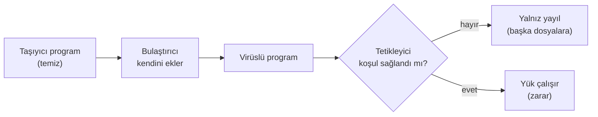
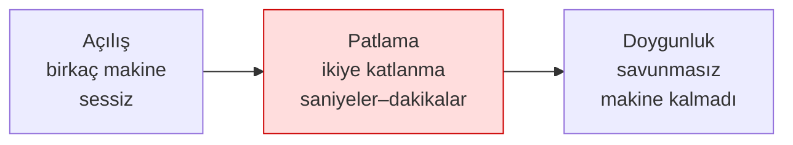
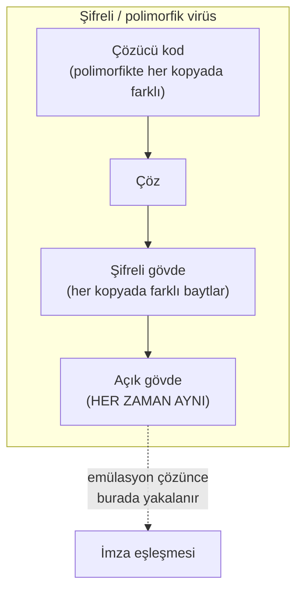

## Zararlı yazılım nedir? Kısa bir tarih

**Zararlı yazılım** (malware, "malicious software"), sahibinin izni ve bilgisi dışında zarar vermek, veri
çalmak, kaynak kullanmak ya da kontrolü ele geçirmek için yazılmış her programdır. "Virüs" günlük dilde bunların
hepsi için kullanılır; oysa virüs yalnızca **bir türdür**. Ayrımı görmek için önce birkaç dönüm noktasına bakalım.

| Yıl | Olay | Türü | Neden önemli? |
| --- | --- | --- | --- |
| 1971 | Creeper | Deneysel solucan | ARPANET'te kendini kopyalayan ilk deneysel program ("I'm the creeper") |
| 1984 | Fred Cohen'in tanımı | Kuram | Bilgisayar virüsünün ilk biçimsel tanımı ve "tam tespit imkânsızdır" kanıtı |
| 1986 | Brain | Önyükleme sektörü virüsü | İlk yaygın PC virüsü; disketin önyükleme sektörüne bulaşırdı |
| 1988 | Morris solucanı | Solucan | İnternette kendi kendine yayılan ilk büyük olay; binlerce makineyi yavaşlattı |
| 1999 | Melissa | Makro virüsü | Word belgeleri ve e-posta ile hızla yayıldı |
| 2000 | ILOVEYOU | Solucan/truva | E-posta ekiyle milyonlarca makineyi etkiledi; sosyal mühendislik gücü |
| 2001 | Code Red | Solucan | Web sunucusundaki bir taşma açığını kullanıp bellekte yayıldı |
| 2008 | Conficker | Solucan/bot | Milyonlarca makineden bir botnet kurdu |
| 2010 | Stuxnet | Hedefli solucan | Endüstriyel denetleyicileri (PLC) hedef aldı; devlet destekli sofistike saldırının simgesi |
| 2013+ | CryptoLocker | Fidye yazılımı | Dosyaları şifreleyip fidye isteme modelini yaygınlaştırdı |
| 2017 | WannaCry | Fidye + solucan | Bir ağ açığıyla kendi kendine yayılan fidye yazılımı; dünya çapında hastane/şirket etkiledi |
| 2017 | NotPetya | Yıkıcı (silici) | Fidye gibi görünüp aslında veriyi kalıcı yok eden, çok büyük ekonomik zarar veren saldırı |

!!! quote "Fred Cohen (1984) ve tespit sınırının kanıtı"
    Cohen, bir virüsü "kendini (belki değiştirerek) başka programlara kopyalayabilen program" olarak tanımladı
    ve önemli bir teorik sonuç gösterdi: **"Bu program bir virüs mü?" sorusunu her durumda doğru cevaplayan
    genel bir algoritma yazmak imkânsızdır** (durma probleminden indirgenir). Pratik sonucu şudur: hiçbir
    antivirüs %100 tespit edemez; her yöntemin yanlış pozitifleri (temizi yakalama) ve yanlış negatifleri
    (zararlıyı kaçırma) vardır. Bu hafta bunu [Demo 01](#4-yayilma-ve-gizlenme-nasil-fark-edilmez)'de kendi
    gözümüzle göreceğiz.

!!! info "Terim: 'in the wild' (doğada)"
    Bir zararlının gerçek kullanıcıların bilgisayarlarında dolaştığı, yalnız laboratuvarda değil sahada
    yayıldığı durum. Bu derste **hiçbir** doğadaki örnekle çalışmayız; yalnız kavramları ve güvenli benzetimleri
    kullanırız.

!!! quote "Gerçek olay: WannaCry (2017) — bir haftada bir programcı dersi"
    WannaCry, üç farklı konuyu tek olayda birleştirdiği için öğreticidir. (1) **Yayılma:** bir ağ dosya paylaşım
    protokolündeki bir taşma açığını (EternalBlue) kullanarak, kullanıcı hiçbir şey yapmadan, **solucan** gibi
    yayıldı — yani bu hafta göreceğimiz taşma sınıfı (Hafta 1) doğrudan bir solucanın motoru oldu. (2) **Yük:**
    ulaştığı makinelerde dosyaları **şifreleyerek** fidye istedi; işte bu yükün bıraktığı iz, [Demo
    2](#5-karsi-onlemler-nasil-yakalariz)'de göreceğimiz **entropi sıçramasıdır**. (3) **Yama boşluğu:** Kullanılan
    açığın yaması saldırıdan **haftalar önce** yayımlanmıştı; buna rağmen güncellememiş yüz binlerce makine
    (hastaneler, fabrikalar dahil) etkilendi. Programcı için üç ders: taşma açıkları teoride kalmaz, savunma
    davranışa da bakmalı, ve yama yayımlamak yeterli değildir — uygulanması gerekir. Bu üç iş parçacığı bu haftanın
    tam da omurgasıdır.

---

## Zararlı yazılımın anatomisi ve türleri

### Bir virüsün üç parçası

Bir virüsü anlamanın en kolay yolu onu üç işleve ayırmaktır. Bir hastalık benzetmesiyle:

| Parça | İngilizcesi | İşi | Hastalık benzetmesi |
| --- | --- | --- | --- |
| **Bulaştırıcı** | infection mechanism | Kendini başka bir taşıyıcıya kopyalar | Virüsün hücreye girip çoğalması |
| **Tetikleyici** | trigger / logic bomb | "Ne zaman etkinleşeyim?" koşulu (tarih, sayaç, olay) | Kuluçka süresi |
| **Yük** | payload | Asıl zararı yapan kısım (veri sil, çal, şifrele) | Semptomlar |

Her üç parça da bulunmak zorunda değildir: yükü olmayan, yalnız yayılan bir virüs de vardır (yine de kaynak
tüketir ve bir zafiyettir). Tetikleyici koşulu bekleyen ve sonra patlayan koda **mantık bombası** (logic bomb)
denir.



### Türleri: yayılma biçimine göre

Zararlı yazılımları en yararlı biçimde **nasıl yayıldıklarına ve ne yaptıklarına** göre ayırırız:

=== "Virüs"
    Kendini **başka bir programa ya da dosyaya** iliştirir; çalışması için o taşıyıcının çalıştırılması
    (kullanıcı tarafından) gerekir. Alt türleri:

    - **Program (dosya) virüsü:** Çalıştırılabilir dosyalara (`.exe`, ELF) bulaşır; dosya çalışınca virüs de
      çalışır.
    - **Makro virüsü:** Ofis belgelerinin (Word, Excel) içindeki makro diline yazılır; belge açılınca çalışır.
      1999'da Melissa böyle yayıldı. Bugün de "makroları etkinleştir" tuzağı bir saldırı yoludur.
    - **Önyükleme sektörü virüsü:** Diskin ilk sektörüne (boot sector / MBR) bulaşır; bilgisayar açılırken
      işletim sisteminden **önce** çalışır. 1986'daki Brain böyleydi. Modern UEFI Secure Boot bu sınıfı büyük
      ölçüde zorlaştırdı.

=== "Solucan (worm)"
    Kendi başına, **taşıyıcıya ve kullanıcı etkileşimine ihtiyaç duymadan** ağ üzerinden yayılır. Genellikle
    bir ağ servisindeki bir açığı (ör. taşma) kullanır. Morris (1988), Code Red (2001), WannaCry (2017) böyle
    yayıldı. Solucanın tehlikesi **yayılma hızıdır**: dakikalar içinde yüz binlerce makineye ulaşabilir.

=== "Truva atı (trojan)"
    Yararlı ya da masum bir programmış gibi görünüp arka planda zarar veren yazılımdır. **Kendini kopyalamaz**;
    kullanıcının onu isteyerek çalıştırmasına güvenir (sosyal mühendislik). "Bedava oyun" ya da "sahte
    güncelleme" çoğu zaman truva atıdır.

=== "Fidye yazılımı (ransomware)"
    Kullanıcının dosyalarını **şifreleyip** çözme anahtarı için para isteyen yük türüdür. Solucan gibi yayılan
    (WannaCry) ya da truva atı gibi bulaşan türleri vardır. [Demo 02](#5-karsi-onlemler-nasil-yakalariz)'de
    fidye yazılımının bıraktığı **entropi izini** güvenle göreceğiz — hiçbir dosyayı gerçekten şifrelemeden.

=== "Diğerleri"
    - **Rootkit:** Kendini ve diğer zararlıları işletim sisteminden **gizler** (dosya, süreç, ağ bağlantısı
      listelerinden siler). Tespiti en zor sınıftır.
    - **Bot / botnet:** Uzaktan komut alan makineler ağı; DDoS, spam, kripto madenciliği için kullanılır.
    - **Casus yazılım (spyware) / reklam yazılımı (adware):** Veri toplar ya da reklam gösterir.
    - **Silici (wiper):** Fidye gibi görünüp veriyi **kalıcı yok eder** (NotPetya). Amaç para değil, yıkımdır.

!!! example "Sınıfta hızlı ayrım (3 dakika)"
    Aşağıdakiler hangi tür? (Cevaplar gizli kutuda.)

    1. E-posta ekindeki "fatura.pdf.exe" açılınca çalışıp adres defterindeki herkese kendini yollar.
    2. Bir web sunucusundaki taşma açığını kullanıp internetteki savunmasız sunuculara kendi kendine bulaşır.
    3. "Ücretsiz video oynatıcı" kurulunca arka planda tarayıcı parolalarını dışarı gönderir.
    4. Açılan dosyaları şifreler ve ekrana "ödeme yapın" notu bırakır.

    ??? success "Cevaplar"
        1. Solucan/truva karışımı (kullanıcı açar → yayılır) · 2. Solucan · 3. Truva atı (+ casus yazılım) ·
        4. Fidye yazılımı.

## Solucanlar ne kadar hızlı yayılır? Salgın modeli

Bir solucanın tehlikesini belirleyen şey, yükünden çok **hızıdır**. Yama yayımlamak, imza dağıtmak, ağ
kuralı yazmak saatler, bazen günler alır; solucan ise dakikalar içinde doygunluğa ulaşabilir. Bu hızı
sezgiyle değil, hesapla görmek için epidemiyolojiden ödünç alınan basit bir model kullanılır.

### SI modeli: duyarlı ve enfekte

Ağdaki savunmasız makineleri iki gruba ayırırız: **duyarlı** (S, henüz bulaşmamış) ve **enfekte** (I).
Her enfekte makine birim zamanda rastgele adresleri tarar; taradığı adres duyarlı bir makineye denk
gelirse onu da enfekte eder. Enfekte makine sayısı `i`, toplam savunmasız makine sayısı `N` ise:

```text
i(t + dt) = i(t) + beta * i(t) * (1 - i(t) / N) * dt
```

- `beta * i(t)`: enfekte makine ne kadar çoksa, o kadar hızlı taranır (büyüme **üsteldir**).
- `(1 - i(t) / N)`: duyarlı makineler azaldıkça isabet olasılığı düşer (büyüme **doyar**).

Sonuç, S biçimli bir eğridir: uzun ve sessiz bir açılış evresi, ardından ani bir patlama, sonra doygunluk.
Açılış evresi savunmacının tek fırsat penceresidir; patlama başladığında insan hızında tepki artık yetişmez.



### Gerçek sayılar

| Olay | Giriş yolu | Hız |
| --- | --- | --- |
| Code Red (Temmuz 2001) | IIS `.ida` arabellek taşması (CVE-2001-0500) | 19 Temmuz'da ~359.000 sunucu; ikiye katlanma ~37 dakika |
| SQL Slammer (Ocak 2003) | SQL Server çözümleme hizmeti, UDP 1434, tek 404 baytlık paket (CVE-2002-0649) | İlk dakikada ~8,5 saniyede ikiye katlandı; ~10 dakikada savunmasız makinelerin ~%90'ı |

Slammer'ı bu kadar hızlı yapan iki şey vardı: tek bir UDP paketi yeterliydi (bağlantı kurma beklemesi yok)
ve hedef bulmak için ağı olabildiğince hızlı tarıyordu. İronik biçimde, ilk dakikadan sonra yavaşlamasının
nedeni savunma değil, **ağ bant genişliğinin dolmasıydı**.

### Demo 09 — Solucan salgın simülasyonu

!!! info "Demo 09 · `code/week-02/09-salgin-simulasyonu` · yalnız hesaplama, ağ yok"
    Program yukarıdaki SI denklemini adım adım hesaplar ve üç senaryonun eğrisini ASCII grafik olarak
    çizer: Code Red benzeri (yavaş rastgele tarama), Slammer benzeri (hızlı rastgele tarama) ve **hitlist**
    (saldırgan önceden hazırladığı 10.000 hedefle başlar). Hiçbir ağ işlemi yapmaz, hiçbir dosya yazmaz.

=== "Windows (PowerShell)"

    ```powershell
    cd code\week-02\09-salgin-simulasyonu
    .\demo.ps1
    ```

=== "WSL / Linux"

    ```bash
    cd code/week-02/09-salgin-simulasyonu
    sh demo.sh
    ```

```text title="sh demo.sh — çıktı (kısaltılmış; Windows'ta aynı)"
  Senaryo: Slammer benzeri (rastgele tarama, hizli UDP)
    N=75000 savunmasiz  i0=1  ikilenme=8.50 s
      zaman        enfekte    oran
          54 s          78    0.1% |..............................|
         1.5 dk       1430    1.9% |#.............................|
         2.1 dk      19700   26.3% |########......................|
         2.4 dk      45601   60.8% |##################............|
         2.7 dk      65251   87.0% |##########################....|
         3.3 dk      74429   99.2% |##############################|
      -> %90 doygunluk:    2.7 dk

  KARSILASTIRMA (%90 doygunluga ulasma):
    Code Red benzeri : 48013 s (~13.3 saat)
    Slammer benzeri  : 165 s (~2.7 dakika)
    Hitlist          : 50 s (~0.8 dakika)
```

Çıktıyı okurken üç şeye bakın:

1. **Açılış evresi:** Slammer benzeri senaryoda ilk 54 saniyede yalnız 78 makine enfekte. Grafikte hiçbir
   şey görünmüyor; oysa bir buçuk dakika sonra patlama başlıyor. "Şimdilik az" demek, üstel büyümede en
   pahalı yanılgıdır.
2. **Hız (`beta`):** Aynı modelde yalnız tarama hızını artırmak, doygunluk süresini **saatlerden dakikalara**
   indiriyor. Bu yüzden solucana karşı savunma otomatik olmak zorundadır: güvenlik duvarı kuralı, ağ
   bölümlemesi, önceden uygulanmış yama.
3. **Hitlist:** Saldırgan açılış evresini önceden hazırladığı hedef listesiyle atlarsa, savunmacının zaten
   dar olan fırsat penceresi tamamen kapanır.

!!! success "Programcıya ders"
    Yayılma hızını programcı belirlemez; ama **ilk bulaşmayı mümkün kılan hatayı** programcı yapar. Code Red,
    Slammer ve Blaster'ın hepsi ağdan gelen veriyi sınır denetimi yapmadan bir arabelleğe kopyalayan kod
    sayesinde yayıldı. Solucan çağında tek bir taşma hatası, dakikalar içinde yüz binlerce makine demektir.
    Ayrıca: dinlediğiniz her ağ portu bir saldırı yüzeyidir; kullanılmayan hizmeti hiç açmamak en ucuz önlemdir.

!!! question "Kendiniz deneyin"
    `salgin.c` içindeki `beta` değerini yarıya indirin (ör. yama oranı yüksek bir ağ ya da tarama hızını
    sınırlayan bir güvenlik duvarı). Doygunluk süresi nasıl değişiyor? Hitlist senaryosunda `i0`'ı 100'e
    indirince fark ne kadar kalıyor?

## Yayılma ve gizlenme: nasıl fark edilmez?

Bir virüs yakalanmamak için sürekli **değişmeye** çalışır. Bunun dört aşamalı bir merdiveni vardır; her basamak
imza tabanlı tespiti biraz daha zorlaştırır:

| Yöntem | Ne değişir? | Antivirüs ne yapar? |
| --- | --- | --- |
| **Şifreleme** (encrypted) | Gövde her kopyada farklı anahtarla şifreli; **çözücü sabit** kalır | Sabit çözücüyü imzalar |
| **Oligomorfizm** | Çözücünün birkaç (onlarca) farklı biçimi var | Tüm çözücü biçimlerini imzalar |
| **Polimorfizm** | Çözücü her kopyada **yeniden üretilir** (sonsuz varyasyon), gövde şifreli | Çözemeye çalışır (emülasyon) |
| **Metamorfizm** | **Şifreleme yok**; kodun **tamamı** her kopyada yeniden yazılır (kayıt değişimi, çöp kod, komut değiştirme) | Davranışa bakar; çok zor |

Önemli fikir şudur: **şifreli gövde her kopyada bambaşka görünür ama çözüldüğünde hep aynıdır.** İşte bu yüzden
şifreli/paketli içeriğin bir belirtisi vardır: **yüksek entropi** (bkz. [Demo 02](#5-karsi-onlemler-nasil-yakalariz)).
Polimorfik virüste değişen çözücü de sonunda gövdeyi çözmek zorundadır; savunma tam bu noktaya —
**emülasyona** — dayanır.



### Demo 01 — İmza, polimorfizm, sezgisel analiz, emülasyon

!!! info "Demo 01 · `code/week-02/01-imza-tarayici` · Kitap: Tarif 12.1"
    Dört tarama yönteminin nasıl çalıştığını **ve nerede yetersiz kaldığını** çalışan kodla gösterir. Gerçek
    zararlı yazılım **yoktur**. Bunun yerine bu demo için uydurulmuş, **çalıştırılamayan** bir "KAPSÜL" veri
    biçimi kullanılır: sihirli başlık + bir "çözücü" komut satırı + (düz ya da karıştırılmış) gövde. Bu yapı
    gerçek şifreli/polimorfik zararlıların iskeletini taklit eder ama içinde yalnız zararsız metin vardır.

Kapsül biçimi (tamamen zararsız, kendi uydurduğumuz oyuncak biçim):

```text
KAPSUL/1
COZUCU: ALGO=xs32 TOHUM=1a2b3c4d UZUNLUK=3782 COZ
<3782 bayt karıştırılmış gövde...>
```

Örnek üretici altı dosya yazar: yakalanmış bir örnek (`ornek_a.bin`), onun **tek bayt farklı** bir kopyası ve
**aynı gövdenin** farklı anahtar/çözücülerle üç "polimorfik" kopyası. Şimdi her yöntemi sırayla deneyelim:

Derleyip çalıştırın (`code/` içinde `.\build.ps1` ya da `./build.sh`, sonra demo klasöründe):

=== "Windows"
    ```powershell
    cd code\week-02\01-imza-tarayici ; .\demo.ps1
    ```

=== "WSL / Linux"
    ```bash
    cd code/week-02/01-imza-tarayici && sh demo.sh
    ```

**Adım 2 — Hash (özet) imzası.** Dosyanın SHA-256 özetini veritabanındaki bir özetle karşılaştırır.

```text title="demo — Adım 2"
ADIM 2 — Hash (ozet) imzasi: birebir ayni dosyayi yakalar
  temiz.txt          TEMIZ      sha256=ce1f848e3795ae86...
  ornek_a.bin        YAKALANDI  Ornek.MaviKedi.A
  ornek_a_1bayt.bin  TEMIZ      sha256=a4220c8a0a41a9ff...
   ^ Tek bir bayt degisince ozet bambaska: hash imzasi atlatildi.
```

Hash imzası **kesindir ama kırılgandır**: tek bir bayt değişince özet tamamen değişir (çığ etkisi). Bu yüzden
saldırgan dosyaya anlamsız bir bayt eklemekle bile hash imzasını atlatır.

**Adım 3 — Desen (bayt dizisi) imzası.** Dosyanın içinde bilinen bir bayt dizisinin geçip geçmediğine bakar.

```text title="demo — Adım 3"
ADIM 3 — Desen (bayt dizisi) imzasi: kucuk degisikliklere dayanikli
  ornek_a.bin        YAKALANDI  Ornek.MaviKedi.A
  ornek_a_1bayt.bin  YAKALANDI  Ornek.MaviKedi.A
  poli_1.bin         YAKALANDI  Ornek.Cozucu.xs32
  poli_2.bin         YAKALANDI  Ornek.Cozucu.xs32
  poli_3.bin         TEMIZ
   ^ poli_1 ve poli_2 cozucu deseniyle yakalandi; cozucusu
     degisen poli_3 hic yakalanamadi.
```

Desen imzası tek bayt değişikliğine dayanıklıdır ve **çözücü kodunu** imzalayarak `poli_1`/`poli_2`'yi yakalar.
Ama çözücüsü de değişmiş olan `poli_3` (başka algoritma, farklı komut sırası) hiç yakalanamaz — işte
**polimorfizmin** imza tabanlı tespite karşı gücü budur.

**Adım 4 — Aynı gövde, farklı anahtar.** Üç polimorfik kopyanın ilk gövde baytları:

```text title="demo — Adım 4"
  poli_1.bin   ilk 16 govde bayti: 6f 57 bc 28 e2 81 dd 85 87 e1 f4 3d ...
  poli_2.bin   ilk 16 govde bayti: 83 b7 07 06 d8 38 3d 53 27 06 bc e8 ...
  poli_3.bin   ilk 16 govde bayti: bd 2c 85 32 f4 1f 3a 57 7f 6b 08 c0 ...
```

Üçü de **aynı zararsız gövdeyi** taşır ama baytları tamamen farklıdır. Bir imza yazmak imkânsıza yakındır.

**Adım 5 — Sezgisel (heuristic) analiz.** İmza yoksa **şüpheli özelliklere** puan verir: yüksek entropi (+50),
gövdeden önce çalışan çözücü kod (+30), anlamsız "çöp" komutlar (+20).

```text title="demo — Adım 5"
  temiz.txt          TEMIZ      puan=  0 H=4.29
  ornek_a.bin        TEMIZ      puan=  0 H=4.71
  poli_1.bin         SUPHELI    puan= 80 H=7.95 entropi cozucu
  poli_3.bin         SUPHELI    puan=100 H=7.95 entropi cozucu cop-komut
  arsiv.bin          SUPHELI    puan= 50 H=7.88 entropi
   ^ arsiv.bin zararsiz yuksek-entropili dosya: YANLIS POZITIF.
     ornek_a.bin ise sezgisel olarak gozden kacti (yanlis negatif).
```

Sezgisel analiz polimorfik kopyaları imza olmadan yakaladı — ama iki hata yaptı: zararsız, yüksek entropili bir
dosyayı (`arsiv.bin`) **şüpheli** işaretledi (**yanlış pozitif**) ve düz gövdeli `ornek_a.bin`'i kaçırdı
(**yanlış negatif**). İşte Cohen'in dediği belirsizlik burada.

**Adım 6 — Emülasyon.** Kapsülün çözücüsünü **güvenli bir "sanal makinede"** çalıştırır (gerçek makine kodu
değil, 6 komutluk oyuncak bir dil), çözülen gövdeyi yeniden desenle tarar:

```text title="demo — Adım 6"
  temiz.txt          TEMIZ      kapsul degil
  ornek_a.bin        YAKALANDI  Ornek.MaviKedi.A | cozucu yok (duz govde)
  poli_1.bin         YAKALANDI  Ornek.MaviKedi.A | 5 komut, 0 BOS, xs32
  poli_2.bin         YAKALANDI  Ornek.MaviKedi.A | 5 komut, 0 BOS, xs32
  poli_3.bin         YAKALANDI  Ornek.MaviKedi.A | 8 komut, 4 BOS, lcg8
  arsiv.bin          TEMIZ      kapsul degil
```

Emülasyon **hepsini** yakaladı: gövdeyi çözünce üç polimorfik kopya da aynı imzaya döndü. Gerçek antivirüsler de
şüpheli dosyayı yalıtılmış bir sanal ortamda "çalıştırıp" çözülmüş halini tarar. Bu güçlüdür ama pahalıdır ve
zararlı bunu anlarsa (anti-emülasyon) gizlenebilir.

!!! success "Ders"
    Tek bir yöntem yetmez. Modern korumalar **katmanlıdır**: hash (hızlı, kesin) → desen (dayanıklı) → sezgisel
    (imzasız) → emülasyon/kum havuzu (derin) → davranış izleme (çalışırken). Her katman bir öncekinin kaçırdığını
    yakalamak içindir — tıpkı geçen haftaki **derinlemesine savunma** gibi.

!!! note "Sahada nasıl uygulanır?"
    Kendi kodunuzu koruma açısından madalyonun öbür yüzü: bir mobil ödeme uygulaması, tersine mühendisliği
    zorlaştırmak için hassas dizeleri ve sabitleri **şifreli** tutar, kullanım anında çözer. Yani meşru bir
    yazılım da "şifreli gövde + çözücü" desenini kullanır (9. ve 11. hafta). Fark, bunun sizin varlığınızı
    koruması; virüste ise imzadan kaçmasıdır. Bir güvenlik değerlendiricisi tam bu yüzden **yüksek entropili
    bölgeleri** arar: "burada şifreli bir şey var, çözücü nerede, anahtarı nasıl buluyor?"

!!! danger "Sık yapılan hata"
    "İmza veritabanım güncel, o hâlde güvendeyim" düşüncesi. İmza tabanlı tespit **yalnız bilinen** zararlıyı
    yakalar; polimorfik/metamorfik ya da hiç görülmemiş (zero-day) bir örnek imzayı atlatır. Bu yüzden savunma
    imzayla **başlar ama bitmez**.

---

## Karşı önlemler: nasıl yakalarız?

Yukarıdaki demoda dört yöntemi gördük. Şimdi bütün karşı önlem ailesini toparlayalım:

| Yöntem | Nasıl çalışır? | Güçlü yanı | Zayıf yanı |
| --- | --- | --- | --- |
| **İmza tabanlı** | Bilinen zararlının özeti/deseni aranır | Hızlı, düşük yanlış pozitif | Bilinmeyeni ve polimorfiği kaçırır |
| **Sezgisel (heuristic)** | Şüpheli özelliklere puan verilir | İmzasız yeni örnekleri bulur | Yanlış pozitif/negatif üretir |
| **Davranış tabanlı** | Program **çalışırken** yaptıkları izlenir (dosya şifreleme, kanca, ağ) | Gizlenmeye dirençli | Zararın bir kısmı olabilir; kaçınma teknikleri var |
| **Kum havuzu (sandbox)** | Şüpheli dosya yalıtılmış ortamda çalıştırılır | Gerçek davranışı görür | Yavaş; zararlı "sanal makinedeyim" diye anlayıp uyuyabilir |
| **Emülasyon** | Kod, kumhavuzu gibi ama daha hafif bir simülatörde adımlanır | Çözücüyü açar | Anti-emülasyon teknikleriyle atlatılabilir |
| **İtibar / bulut** | Dosyanın yaygınlığı, kaynağı, imzası sorgulanır | Hızlı yayılan tehdide iyi | Gizlilik ve bağlantı gerektirir |

Modern uç nokta koruma (EDR/XDR) bunların hepsini birleştirir ve özellikle **davranışa** ağırlık verir. Örneğin
"kısa sürede yüzlerce dosyayı okuyup yüksek entropili haliyle geri yazan süreç" neredeyse kesin bir fidye
yazılımı belirtisidir — dosyaların **içine bakmadan**, yalnız davranıştan.

!!! note "Sahada nasıl uygulanır? — savunma ve saldırı aynı alet kutusu"
    Bir zararlının gizlenmek için kullandığı teknikler ile meşru bir yazılımın **kendini korumak** için
    kullandığı teknikler çoğu zaman aynıdır. Bir mobil ödeme kütüphanesi, tersine mühendisliği yavaşlatmak için
    hassas dizeleri şifreli tutar ve çalışma anında çözer (Hafta 9, 11); bu tam da polimorfik bir zararlının
    "şifreli gövde + çözücü" desenidir. Fark **niyet ve bağlamdadır**: biri sizin varlığınızı korur, diğeri
    imzadan kaçar. Bu yüzden bir güvenlik değerlendiricisi ikili dosyanızda yüksek entropili bölgeler gördüğünde
    "burada şifreli bir şey var" der ve doğal soruyu sorar: çözücü nerede, anahtarı nereden alıyor, anahtar
    bellekte ne kadar açık kalıyor? Aynı entropi ölçümü, hem bir antivirüsün "paketli mi?" sorusunun hem de bir
    değerlendiricinin "korumanız gerçek mi?" sorusunun aracıdır. Bu simetriyi görmek, dönem boyunca işleyeceğimiz
    koruma yöntemlerinin neden hem saldırganı hem savunmacıyı ilgilendirdiğini açıklar.

### Demo 02 — Entropi ölçer: şifreli/paketli içerik nasıl anlaşılır?

!!! info "Demo 02 · `code/week-02/02-entropi` · Kitap: Tarif 12.1"
    Shannon entropisini (0 = tekdüze, 8 = rastgele bit/bayt) kendi dosyalarımız üzerinde ölçer. Hiçbir dosyaya
    dokunmaz, yalnız okur.

$$
H = -\sum_{b=0}^{255} p(b)\,\log_2 p(b)
$$

Burada \(p(b)\), `b` baytının dosyadaki görülme olasılığıdır. Düz metin az sayıda karakteri sık kullanır (düşük
H); şifreli/sıkışık veri tüm baytları eşit kullanır (H ≈ 8).

=== "Windows"
    ```powershell
    cd code\week-02\02-entropi ; .\demo.ps1
    ```

=== "WSL / Linux"
    ```bash
    cd code/week-02/02-entropi && sh demo.sh
    ```

Örnek dosyalar iki platformda da aynı biçimde üretilir (harici araç gerekmez): tekdüze, düz metin, makine kodu
benzeri sentetik veri, AES-256-GCM ile şifreli ve rastgele dosyalar.

```text title="demo — Adım 1 ve 2"
ADIM 1 — Farkli turde dosyalarin entropisi (0 = tekduze, 8 = rastgele)
  tekduze.txt      4096  0.00 |........................| tekduze
  belge.txt        3360  4.17 |#############...........| dusuk
  kod.bin          2048  6.23 |###################.....| orta
  sifreli.bin      3376  7.95 |########################| YUKSEK
  rastgele.bin     4096  7.95 |########################| YUKSEK

ADIM 2 — Ayni icerik uc halde: duz -> makine-kodu-benzeri -> sifreli
  belge.txt        3360  4.17 |#############...........| dusuk
  kod.bin          2048  6.23 |###################.....| orta
  sifreli.bin      3376  7.95 |########################| YUKSEK
   ^ Sifreli ve rastgele veri entropiye bakarak AYIRT EDILEMEZ.
```

İki önemli sonuç: (1) Entropi tek başına "zararlı mı?" sorusunu **yanıtlamaz** — şifreli, sıkıştırılmış ve
rastgele veri hep 8'e yakındır; bir `.zip` ya da `.png` de öyle. Düz metin düşük (~4), derlenmiş makine kodu
orta (~6) çıkar. (2) Ama **beklenmedik yerde** yüksek entropi bir ipucudur. Adım 3 bunu gösterir: bir metnin
ortasına gizlenmiş şifreli bölüm, pencereli taramada "sıcak bölge" olarak ortaya çıkar — paketlenmiş
programlarda da tipik olan "küçük açıcı kod + yüksek entropili gövde" deseni.

```text title="demo — Adım 3 (kısaltılmış)"
    1024-  1535  4.14 |#################...............| dusuk
    1536-  2047  7.56 |##############################..| YUKSEK   <-- gizli bölge
    2048-  2559  7.66 |###############################.| YUKSEK
    3072-  3583  4.17 |#################...............| dusuk
```

!!! note "Değerlendirici nasıl test eder?"
    Bir güvenlik laboratuvarı, ikili dosyanızı bölümlere ayırıp her bölümün entropisini ölçer. `.text` (kod)
    bölümü beklenenden çok yüksekse "burası paketli/şifreli" der ve açıcıyı arar. Sizin projenizde şifreli
    sabitler kullanıyorsanız bu normaldir; ama **anahtarın** düşük entropili ve tahmin edilebilir bir yerde
    durması bir bulgudur. Yani "şifreledim, bitti" yetmez; anahtarın nerede durduğu kritiktir (3. ve 11. hafta).

!!! example "Sınıf etkinliği 1 — Yöntemleri kıyasla (10 dakika)"
    Demo 01'i açık tutun. Üç grup, üç soruyu tartışıp bir cümleyle yanıtlasın:

    1. Bir saldırgan yalnızca **hash** imzası kullanan bir antivirüsü nasıl atlatır? (En ucuz yol nedir?)
    2. **Desen** imzasını atlatmak neden daha pahalıdır? Polimorfizm burada ne sağlar?
    3. **Emülasyonu** atlatmak için zararlı ne yapabilir? (İpucu: "sanal makinedeyim" nasıl anlar?)

### Demo 07 — Kural tabanlı tespit: küçük bir kural motoru

İmza tabanlı tespitin gelişmiş biçimi, tek bir bayt dizisi yerine **kural** kullanmaktır. Sektörde bunun
en yaygın aracı YARA'dır: bir kural birkaç **dizge** (metin ya da joker içeren onaltılık desen) ve bu
dizgeler üzerinde bir **koşul** tanımlar. Demo 07, bu fikri sıfırdan yazılmış küçük bir motorla ve yalnız
**kendi uydurduğumuz zararsız desenlerle** gösterir.

!!! info "Demo 07 · `code/week-02/07-kural-motoru` · kendi zararsız desenlerimiz"
    Kural dosyası (`kurallar.txt`) beş kural içerir. Örneğin:

    ```text
    kural Kelime_Baglam {
      dizge $a = "indir"
      dizge $b = "calistir"
      dizge $sihir = "KAPSUL/1"
      kosul ($a and $b) and $sihir
    }
    ```

    Motor her dosyada her dizgenin kaç kez geçtiğini sayar, sonra koşulu (`and`, `or`, `not`, sayım,
    "n of them") değerlendirir. Onaltılık desenlerde `??` herhangi bir baytla eşleşir (joker).

=== "Windows (PowerShell)"

    ```powershell
    cd code\week-02\07-kural-motoru
    .\demo.ps1
    ```

=== "WSL / Linux"

    ```bash
    cd code/week-02/07-kural-motoru
    sh demo.sh
    ```

```text title="sh demo.sh — çıktı (kısaltılmış; Windows'ta aynı)"
ADIM 2 — Bes dosyayi bes kuralla tara
  temiz.txt     (eslesme yok)
  kilavuz.txt   Kelime_Cifti
  kapsul.bin    Kapsul_Bicimi, Isaret_Hex, Kelime_Cifti, Kelime_Baglam
  varyant.bin   Isaret_Hex
  notlar.txt    Cok_Tekrar

ADIM 3 — Yanlis pozitif: zararsiz kilavuz neden eslesti?
    Kelime_Cifti           $a=1 $b=1 -> ESLESTI
    Kelime_Baglam          $a=1 $b=1 $sihir=0 -> -
   ^ Kelime_Cifti kelimelere bakti, BAGLAMA bakmadi: YANLIS POZITIF.

ADIM 4 — Degistirilmis varyant: joker (??) ne kazandirdi?
    Kapsul_Bicimi          $sihir=1 $coz=0 -> -
    Isaret_Hex             $h=1 -> ESLESTI

ADIM 5 — Kural dosyasi da girdidir: bozuk dosya reddedilir
satir 4: metin bos, uzun ya da kapanmamis
kural dosyasi REDDEDILDI (hatali ya da eksik)
```

Bu demodan çıkan dört ders:

1. **Dar kural kaçırır, geniş kural yanlış alarm verir.** `Kelime_Cifti` yalnız iki kelimeye baktığı için
   zararsız bir kılavuzu da yakaladı (yanlış pozitif). Aynı kelimeleri **bağlamla** (`$sihir`) birleştiren
   `Kelime_Baglam` bu hatayı yapmadı. Kural yazmak, hassasiyet ile kapsam arasında denge kurmaktır.
2. **Joker, değişen parçayı tolere eder.** `varyant.bin` tanıdık yapısını bozduğu için `Kapsul_Bicimi`
   kuralını atlattı; ama değişken baytları `??` ile atlayan onaltılık desen onu yine yakaladı. Polimorfizme
   karşı kural yazarken değişmeyen iskeleti hedeflemek gerekir.
3. **Kural motoru da bir ayrıştırıcıdır.** Kural dosyası dışarıdan gelir; motor bozuk bir dosyayı
   kabul etseydi, tespit aracının kendisi saldırı yüzeyi olurdu. Demo, hatalı satırı yakalayıp dosyayı
   **tamamen reddediyor** (varsayılan ret). Güvenlik araçlarındaki ayrıştırma hataları gerçek dünyada
   defalarca istismar edilmiştir.
4. **Kural, bilinen şeyi yakalar.** Hiç görülmemiş bir zararlı için kural yoktur; bu yüzden kural
   tabanlı tespit sezgisel ve davranış tabanlı yöntemlerle birlikte kullanılır.

### Demo 08 — Bütünlük izleme: beyaz liste mantığı

Kara liste "kötü olanı tanı" der; **beyaz liste** ise "iyi olanı tanı, geri kalan her şeyden şüphelen"
der. Bütünlük izleme bunun dosya düzeyindeki biçimidir: sistem bilinen iyi durumdayken her dosyanın
kriptografik özeti bir **manifeste** yazılır; sonra düzenli olarak yeniden hesaplanıp karşılaştırılır.
Tripwire gibi araçlar, uygulama beyaz listeleri (Windows'ta AppLocker/WDAC) ve işletim sistemlerinin kod
imzalama denetimleri aynı fikre dayanır.

!!! info "Demo 08 · `code/week-02/08-butunluk-izleme` · Tarif 12.2'nin güncel hali"
    Program demo klasöründeki örnek dosyalar için SHA-256 manifesti yazar, manifesti ayrı tutulan bir
    anahtarla **HMAC-SHA256** ile mühürler, sonra değişiklikleri `TAMAM`, `DEGISTI`, `SILINDI`, `YENI`
    olarak raporlar. Özet ve HMAC için `code/common/cen429_kripto.h` kullanılır (Linux'ta OpenSSL,
    Windows'ta BCrypt). Kitap aynı işi CRC32 ile yapıyordu; CRC kasıtlı değişikliğe karşı koruma sağlamaz.

=== "Windows (PowerShell)"

    ```powershell
    cd code\week-02\08-butunluk-izleme
    .\demo.ps1
    ```

=== "WSL / Linux"

    ```bash
    cd code/week-02/08-butunluk-izleme
    sh demo.sh
    ```

```text title="sh demo.sh — çıktı (kısaltılmış; HMAC anahtarı her çalıştırmada rastgele)"
ADIM 4 — Benzetim: bir 'saldirgan' dosyalara dokunur
  TAMAM    ayar.conf        fa747caed81475dc...
  DEGISTI  kutuphane.bin    c603d7c61459... -> 64b8f2b2c00e... (49->65 B)
  SILINDI  veri.txt         (manifestte var, klasorde yok)
  YENI     gizli.bin        6eb16b9b1e293479... (taban cizgisinde yok)
  SONUC: 3 sapma bulundu -> incele!

ADIM 5 — Saldirgan izini ortmek icin manifesti de yeniden yazar
  TAMAM    gizli.bin        6eb16b9b1e293479...
  TAMAM    kutuphane.bin    64b8f2b2c00effa2...
  SONUC: butunluk korunmus (4 dosya)
   ^ Manifest korunmazsa izleyici KANDIRILIR: hepsi TAMAM gorunuyor.

ADIM 6 — Ama muhur (HMAC) anahtarsiz yeniden uretilemez
  MUHUR GECERSIZ: manifest anahtarsiz biri tarafindan
  degistirilmis -> manifeste GUVENME
```

Demonun asıl dersi 5. ve 6. adımlardadır: **özet değişikliği yakalar, ama beklenen değerler de
korunmalıdır.** Dosyaları değiştirebilen biri manifesti de değiştirebiliyorsa izleyici "her şey yolunda"
der. Çözüm, manifesti anahtarlı bir özetle (HMAC) ya da dijital imzayla mühürlemek ve anahtarı
izlenen dosyalarla aynı yerde tutmamaktır. Karşılaştırma da sabit zamanlı yapılır; aksi halde süre farkı
doğru baytların sayısını sızdırabilir.

!!! note "Sahada nasıl uygulanır?"
    Aynı ilke 6. haftada **çalışma zamanı bütünlük denetimi** olarak geri gelecek: yüksek güvenlik gerektiren
    bir uygulama kendi kod bölümünün özetini çalışırken hesaplar ve derleme sonrasında gömülen beklenen
    değerle karşılaştırır. Beklenen değerin nerede ve nasıl saklandığı, denetimin kendisi kadar önemlidir.

!!! tip "Değerlendirici nasıl test eder?"
    Bağımsız bir değerlendirici önce izlenen bir dosyayı değiştirip tespit edilip edilmediğine bakar; sonra
    beklenen değerleri (manifest, gömülü özet) de değiştirerek denetimin kendisini atlatmaya çalışır. İkinci
    test geçilemiyorsa bütünlük denetimi yalnız kazaya karşı koruyordur, saldırgana karşı değil.

## Olay incelemeleri: hangi programlama hatası, hangi önlem?

Tarihteki büyük salgınların neredeyse hepsi, bir **programlama ya da yapılandırma hatasının** üzerine
kurulmuştur. Aşağıdaki tabloda her olayı zararlının ne yaptığıyla değil, **içeri nasıl girdiğiyle**
okuyoruz; çünkü bu dersin konusu o giriş kapısını kapatmaktır.

| Olay | İçeri giriş yolu | Hata sınıfı | Programcı ne yapmalıydı? |
| --- | --- | --- | --- |
| Morris solucanı (2 Kasım 1988) | `fingerd`'de `gets()` ile 512 baytlık tampona sınırsız okuma; `sendmail`'de açık bırakılmış DEBUG kipi; `rsh`/`rexec` güven ilişkileri; parola tahmini | CWE-120 / CWE-242, CWE-489, CWE-287, CWE-521 | Sınır denetimli okuma (`fgets`); hata ayıklama kodunu sürümde bırakmamak; adres tabanlı güvene dayanmamak; parola politikası |
| Code Red (Temmuz 2001) | IIS `.ida` işleyicisinde arabellek taşması (CVE-2001-0500) | CWE-120 | Ağ girdisinin uzunluğunu kopyalamadan önce doğrulamak; kullanılmayan işleyiciyi kapatmak |
| SQL Slammer (Ocak 2003) | SQL Server çözümleme hizmetine tek UDP paketiyle yığın taşması (CVE-2002-0649) | CWE-121 | Sınır denetimi; gerekmeyen hizmeti dışarı açmamak; yamayı uygulamak (yama aylar önce vardı) |
| Blaster (Ağustos 2003) | Windows RPC/DCOM arabellek taşması (MS03-026, CVE-2003-0352) | CWE-120 | Sınır denetimi; RPC portlarını ağ sınırında engellemek |
| Conficker (Kasım 2008) | Server hizmetinde yol işleme taşması (MS08-067, CVE-2008-4250); zayıf parolalar | CWE-119, CWE-521 | Güvenli dize işleme; güçlü kimlik doğrulama; otomatik yama |
| Stuxnet (2010) | Kısayol (`.lnk`) dosyasının görüntülenmesiyle kod yükleme (CVE-2010-2568) ve üç sıfırıncı gün açığı daha; çalınmış sürücü imzaları | Güvenilmeyen içerikten kod yükleme; imza anahtarlarının korunmaması | Görüntüleme sırasında kod çalıştırmamak; imza anahtarlarını donanımda (HSM) korumak |
| WannaCry (12 Mayıs 2017) | SMBv1 sunucusunda bellek bozulması (EternalBlue, CVE-2017-0144); yama 14 Mart 2017'de yayımlanmıştı | Girdi doğrulama / bellek güvenliği | Ayrıştırıcıda sınır denetimi; eski protokolü kapatmak; yamayı iki ay bekletmemek |
| NotPetya (27 Haziran 2017) | Bir muhasebe yazılımının güncelleme sunucusu üzerinden dağıtım; ardından EternalBlue/EternalRomance ve kimlik bilgisi toplama ile yanal hareket | CWE-494 (bütünlüğü doğrulanmayan kod indirme) | Güncellemeleri imzalamak ve imzayı istemcide doğrulamak; güncelleme altyapısını korumak |
| SUNBURST (Aralık 2020) | Bir izleme yazılımının derleme ortamına sızılıp imzalı bir kütüphanenin içine arka kapı eklenmesi; ~18.000 müşteri etkilendi | Tedarik zinciri: derleme ortamı güvenliği | Derleme ortamını korumak, tekrarlanabilir derleme, derleme çıktısını kaynakla karşılaştırmak (5. haftadaki SBOM ve bütünlük konusu) |

Tabloyu yukarıdan aşağı okuyunca bir eğilim görülür: 1988–2008 arasındaki salgınların çoğu **tek bir
arabellek taşmasıyla** yayıldı. 2017'den sonra ise giriş kapısı giderek **güncelleme ve derleme
süreçlerine** kaydı: saldırgan kodu kırmak yerine, kodun kullanıcıya ulaştığı yolu ele geçirdi. Bu dersin
iki ucu buradan çıkar: bir yanda sınır denetimi ve güvenli bellek yönetimi (1. ve 4. hafta), öbür yanda
imzalı güncelleme, bütünlük doğrulaması ve tedarik zinciri güvenliği (3., 5. ve 10. hafta).

!!! warning "Yama gecikmesi"
    WannaCry'ın kullandığı açığın yaması, salgından iki ay önce yayımlanmıştı; Slammer'ınki de aylar öncesinden
    vardı. Kendi yazılımınız için bunun anlamı şudur: güncelleme mekanizması güvenlik özelliğinin bir
    parçasıdır. Güncellemesi zor, yavaş ya da kullanıcıya bağlı olan bir ürün, düzeltilmiş hataları bile
    aylarca açık tutar.

!!! question "Tartışma"
    Office, 2022'den beri internetten gelen belgelerdeki makroları varsayılan olarak engelliyor. Bu karar,
    Melissa ve ILOVEYOU gibi eski salgınların hangi zayıflığını kapatıyor? Varsayılan ayarın güvenlik
    üzerindeki etkisi neden kullanıcı eğitiminden daha büyüktür?
