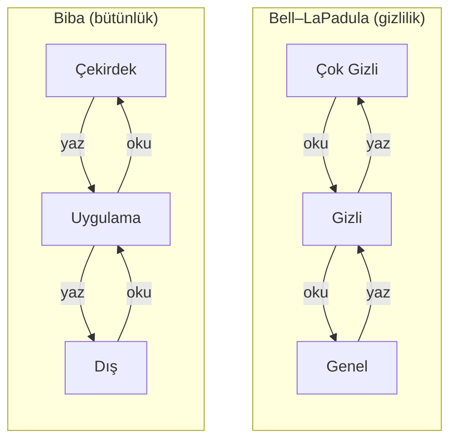

## Erişim denetimi: kim, neye, ne yapabilir?

Şimdi savunma tarafına geçiyoruz. Güvenliğin en temel sorularından biri: **"Bu özne, bu nesne üzerinde bu işlemi
yapabilir mi?"** Bunu üç kavramla düzenleriz:

- **Özne (subject):** işlemi yapan (kullanıcı, süreç).
- **Nesne (object):** üzerinde işlem yapılan (dosya, kayıt, bellek).
- **Hak/izin (right):** yapılabilen işlem (oku, yaz, çalıştır).

### Erişim denetim matrisi

En genel model, satırların özne, sütunların nesne olduğu ve her hücrede izinlerin yazdığı bir **matristir**:

| | `odeme_anahtari` | `gunluk` |
| --- | --- | --- |
| **uygulama** | — | yaz |
| **kutuphane** | oku, yaz | yaz |
| **saldirgan** | — | — |

Bu matris kavramsaldır; gerçekte iki biçimde saklanır:

- **Erişim denetim listesi (ACL):** Matris **sütun sütun** saklanır — her nesne "bana kimler erişebilir"
  listesini tutar. Unix dosya izinleri ve Windows DACL böyledir.
- **Yetenek (capability):** Matris **satır satır** saklanır — her özne "nelere erişebilirim" biletlerini tutar.

### DAC, MAC, RBAC

| Model | Kim karar verir? | Örnek | Güçlü/zayıf |
| --- | --- | --- | --- |
| **DAC** (isteğe bağlı) | **Nesnenin sahibi** izinleri belirler | Unix `chmod`, Windows DACL | Esnek; ama sahip yanlış izin verirse ya da bir program kandırılırsa ("confused deputy") sızıntı olur |
| **MAC** (zorunlu) | **Sistem/politika** belirler; sahip değiştiremez | Bell–LaPadula, Biba, SELinux | Katı, sızıntıyı sistemsel önler; yönetimi zor |
| **RBAC** (rol tabanlı) | İzinler **rollere** verilir, kullanıcılar role atanır | "Muhasebeci" rolü | Ölçeklenir; büyük kurumların standart yöntemi |

Gerçek sistemler bunları **birlikte** kullanır: DAC sahibin isteğini, MAC sistemin zorunlu sınırını, RBAC de
yönetim kolaylığını sağlar. Etkin karar genellikle **hepsinin kesişimidir** ("hem sahip izin vermeli hem sistem
politikası izin vermeli").

### Demo 03 — Erişim matrisi ve model simülatörü (bölüm 8 ile birlikte)

Bu demoyu bir sonraki bölümde biçimsel modellerle birlikte çalıştıracağız; ama ilk adımı **salt DAC matrisidir**:

Windows: `cd code\week-02\03-erisim-modeli ; .\demo.ps1` · WSL/Linux:
`cd code/week-02/03-erisim-modeli && sh demo.sh`.

```text title="demo — Adım 0 (salt DAC)"
ADIM 0 — Salt DAC (erisim denetim matrisi): karar sahibin izninde
  kutuphane(D   ) OKU odeme_anahtari(D   )  DAC:VAR ...  => IZIN
  uygulama(D   ) OKU odeme_anahtari(D   )  DAC:yok ...  => RED
  saldirgan(D   ) OKU odeme_anahtari(D   )  DAC:yok ...  => RED
   ^ uygulama OKU odeme_anahtari: matriste yok -> RED (en az ayricalik)
```

Matriste hakkı olmayan hiçbir özne erişemez — **en az ayrıcalık** ilkesinin doğrudan uygulaması. Uygulamanın
bile ödeme anahtarına doğrudan erişimi yoktur; yalnız güvenlik kütüphanesi erişebilir.

---

## Biçimsel güvenlik modelleri

DAC "sahip ne derse o" der; ama bu bir sızıntıyı **sistemsel** olarak önleyemez. Örneğin gizli bir belgeyi
okuyabilen bir program, o bilgiyi herkese açık bir dosyaya yazabilir — DAC buna engel değildir. **Zorunlu
(MAC)** modeller tam bu boşluğu kapatır. Üç klasik modeli göreceğiz.

### Bell–LaPadula (BLP) — gizlilik

1973'te askeri gizlilik için tasarlandı. Nesnelere ve öznelere **gizlilik seviyeleri** verilir (Genel < Gizli <
Çok Gizli). İki kural:

- **Basit güvenlik özelliği ("yukarı okuma yok"):** Bir özne, kendi seviyesinden **daha gizli** bir nesneyi
  **okuyamaz**. (Memur çok gizli belgeyi göremez.)
- **Yıldız (\*) özelliği ("aşağı yazma yok"):** Bir özne, kendi seviyesinden **daha az gizli** bir nesneye
  **yazamaz**. (General, çok gizli bilgiyi genel bir belgeye yazıp sızdıramaz.)

Özetle BLP **"read down, write up"** der: aşağıyı oku, yukarı yaz. Amacı **gizliliği** korumaktır.

### Biba — bütünlük

1977'de Biba, BLP'yi **tersine çevirdi**. Bu kez seviyeler **güvenilirlik/bütünlük** düzeyidir (Dış < Uygulama <
Çekirdek). Kurallar simetriktir:

- **"Aşağı okuma yok":** Bir özne, kendinden **daha az güvenilir** bir nesneyi **okuyamaz**. (İş mantığı,
  doğrulanmamış dış girdiye doğrudan güvenmez.)
- **"Yukarı yazma yok":** Bir özne, kendinden **daha güvenilir** bir nesneye **yazamaz**. (Ağdan veri alan
  bileşen, imzalı yapılandırmayı bozamaz.)

Yani Biba **"read up, write down"** der ve **bütünlüğü** korur: kirli veri, temiz veriyi bozamaz.



!!! note "İki model, ters yön"
    BLP "gizli bilgi aşağı sızmasın" der (yukarı okumayı, aşağı yazmayı yasaklar). Biba "kirli bilgi yukarı
    çıkmasın" der (aşağı okumayı, yukarı yazmayı yasaklar). Bir veri hem gizli hem güvenilir olmalıysa (ikisi
    birden), o veri yalnız **kendi seviyesinde** işlenebilir — bu, çoğu pratik tasarımın vardığı sonuçtur.

### Clark–Wilson — ticari bütünlük

1987'de Clark ve Wilson, banka gibi **ticari** sistemler için farklı bir bütünlük modeli önerdi. Askeri
seviyeler yerine **iyi biçimli işlemler** ve **görev ayrılığı** üzerine kuruludur:

- **Kısıtlı veri öğeleri (CDI):** Bütünlüğü korunması gereken veriler (hesap bakiyesi).
- **Dönüşüm yordamları (TP):** CDI'yi yalnız **onaylı, iyi biçimli işlemler** değiştirebilir (doğrudan yazma
  yok). Örneğin bakiye ancak "para yatır/çek" yordamıyla değişir.
- **Bütünlük doğrulama yordamları (IVP):** Verinin tutarlı olduğunu düzenli olarak denetler ("borç = alacak").
- **Görev ayrılığı (separation of duty):** İşlemi başlatan ile onaylayan farklı kişilerdir.

Clark–Wilson'ın ruhu bugünkü yazılıma doğrudan geçer: **veriye doğrudan değil, doğrulanmış işlemlerle dokun;
kritik adımı tek kişiye/tek yola bağlama.** Geçen haftaki "ayrıcalıkların ayrılması" ilkesinin biçimsel halidir.

!!! note "Sahada nasıl uygulanır? — modellerin kod karşılığı"
    Bu modeller soyut görünse de günlük kodda karşılıkları vardır. **Biba** ilkesi, "dışarıdan gelen veriye
    doğrudan güvenme" demektir; pratikte bu, her dış girdiyi **güvenilmez** kabul edip doğrulama katmanından
    geçirmektir (Hafta 1'deki girdi doğrulama). **Bell–LaPadula**'nın "aşağı yazma yok" kuralı, bir mobil ödeme
    kütüphanesinde "hassas bir anahtarı, daha az korunan bir günlüğe ya da panoya (clipboard) yazma" yasağına
    dönüşür — sırların yanlışlıkla düşük güvenlikli bir kanala sızmasını önler. **Clark–Wilson**'ın "iyi biçimli
    işlem" fikri, bir bakiyeyi ya da işlem sayacını **doğrudan** güncellemek yerine yalnız denetlenen bir
    fonksiyon üzerinden değiştirmektir; sayacın atlanması ya da geri sarılması bu sayede tek bir yerde
    engellenebilir.

!!! note "Değerlendirici nasıl test eder? — erişim ve yetki"
    Bir bağımsız değerlendirici, kodunuzda "kim neye erişebiliyor?" sorusunu somutça sınar: en az ayrıcalık
    gerçekten uygulanmış mı, yoksa her bileşen gereğinden fazla yetkiyle mi çalışıyor? Bir bileşen düşürülse
    (compromise) diğerlerine ne kadar ulaşabilir (yanal hareket)? Hassas bir işlem tek bir bayrağa/tek bir dala
    mı bağlı — yani bir baytı değiştirerek atlatılabilir mi? Bu sorular doğrudan sizin **arayüz ve varlık
    tablonuza** (S3, S5) ve **saldırgan modelinize** (S4) bakılarak yanıtlanır; listede olmayan bir yetki yolu,
    denetlenmeyen bir yol demektir.

| Model | Yıl | Korur | Ana fikir |
| --- | --- | --- | --- |
| Bell–LaPadula | 1973 | Gizlilik | Yukarı okuma yok, aşağı yazma yok |
| Biba | 1977 | Bütünlük | Aşağı okuma yok, yukarı yazma yok |
| Clark–Wilson | 1987 | Bütünlük (ticari) | İyi biçimli işlem + görev ayrılığı + denetim |

### Demo 03 — Modelleri karşılaştır

```text title="demo — Adım 1 (Bell–LaPadula)"
  memur  (Gene) OKU operasyon(CokG)  DAC:VAR BLP:RED ...  => RED
  general(CokG) YAZ ilan     (Gene)  DAC:VAR BLP:RED ...  => RED
   ^ memur OKU operasyon: yukari okuma -> RED (gizli bilgiyi goremez)
     general YAZ ilan: asagi yazma -> RED (sizinti onlenir)
```

```text title="demo — Adım 2 (Biba)"
  aglayici(Dis ) YAZ kayit    (Uygu)  ... BIBA:RED  => RED
  islemci(Uygu) OKU gelen    (Dis )  ... BIBA:RED  => RED
   ^ aglayici YAZ kayit: yukari yazma -> RED (kirli veri temizi bozmasin)
     islemci OKU gelen: asagi okuma -> RED (guvenilmez girdiye guvenme)
```

Dikkat edin: DAC her iki durumda da **VAR** (sahip izin vermiş); zorunlu modeli devreye sokan **sistemdir**.
Etkin karar `DAC VE MAC` olduğu için, sahip izin verse bile model reddedebilir. Politika dosyalarını
(`politika-gizlilik.txt`, `politika-butunluk.txt`) açıp kendi kurallarınızı yazabilirsiniz.

!!! example "Sınıf etkinliği 2 — Modeli seç (10 dakika)"
    Aşağıdaki sistemlerde hangi model uygundur, neden?

    1. Bir hastanenin hasta kayıtları (kimse yetkisi olmadan **görmemeli**).
    2. Bir uçağın uçuş kontrol yazılımı (dışarıdan gelen veri kritik komutları **bozmamalı**).
    3. Bir bankanın hesap defteri (yalnız onaylı işlemlerle değişmeli, kayıt tutulmalı).

    ??? success "Cevaplar"
        1. Bell–LaPadula (gizlilik) · 2. Biba (bütünlük) · 3. Clark–Wilson (iyi biçimli işlem + denetim).

---

## Unix ve Windows erişim denetimi modelleri

Bu klasik modeller kâğıt üzerinde kalmadı; işletim sistemlerinin izin mimarisi onların pratik halidir.

### Unix modeli (Tarif 2.1)

Unix, DAC'ı **kullanıcı/grup kimlikleri** ve **izin bitleriyle** uygular. Her sürecin üç kimliği vardır:
**effective** (izin denetimlerinde kullanılan), **real** (gerçek sahip) ve **saved** (geçici düşürüp geri
almak için). Her dosyanın üç grup izin biti vardır — sahip, grup, diğerleri — her birinde oku/yaz/çalıştır:

```text
 -rwxr-x---   sahip: rwx   grup: r-x   diğerleri: ---
  │└┬┘└┬┘└┬┘
  │ │  │  └─ diğerleri (herkes): izin yok
  │ │  └──── grup: oku + çalıştır
  │ └─────── sahip: oku + yaz + çalıştır
  └───────── dosya türü (- = normal dosya)
```

Ek olarak **setuid/setgid** bitleri (program, sahibinin yetkisiyle çalışır) ve **sticky** biti (`/tmp` gibi
paylaşılan dizinlerde başkasının dosyasını silememe) vardır. `setuid root` bir program, çalıştıran kim olursa
olsun **root yetkisiyle** çalışır — güçlü ama tehlikeli; geçen haftaki "en az ayrıcalık" bu yüzden kritiktir.

!!! danger "TOCTOU: Unix erişim denetiminin klasik tuzağı"
    Bir program "bu dosyaya yazmam güvenli mi?" diye **önce denetleyip sonra açarsa**, iki işlem arasında
    saldırgan dosyayı bir sembolik bağla değiştirebilir. Buna **TOCTOU** (Time-Of-Check, Time-Of-Use;
    **CWE-367**) denir. Kitabın Tarif 2.3'ü tam bu yarışı anlatır. [Demo 06](#demo-6-toctou-yaris-durumu)'da
    bunu güvenle göreceğiz.

### Windows modeli (Tarif 2.2)

Windows daha ayrıntılı bir **ACL** modeli kullanır. Her nesnenin (dosya, kayıt defteri anahtarı, mutex) bir
güvenlik tanımlayıcısı vardır. İki liste bulunur:

- **DACL** (Discretionary ACL): **erişim** kurallarını tutar — kim ne yapabilir. Bir dizi **ACE** (erişim
  denetim girdisi) içerir; her ACE bir **SID** (kullanıcı/grup kimliği), bir hak ve "izin ver / reddet"
  bilgisidir.
- **SACL** (System ACL): **denetim** kurallarını tutar — hangi erişimler günlüğe yazılsın.

Önemli bir tuzak: **NULL DACL** (hiç girdisi olmayan liste) "herkese tam yetki" demektir — asla iyi bir fikir
değildir. Windows en iyi eşleşen ACE'yi seçer; "reddet" girdileri genellikle "izin ver"den önce değerlendirilir.

| Kavram | Unix | Windows |
| --- | --- | --- |
| Kimlik | UID / GID | SID |
| İzin taşıyıcı | Mod bitleri (rwx × 3) | DACL içindeki ACE'ler |
| Denetim (audit) | syslog (harici) | SACL (yerleşik) |
| "Herkese açık" tehlikesi | `chmod 777` | NULL DACL |
| Yetki yükseltme | setuid | Öykünme (impersonation), token |

Modern Windows ayrıca **bütünlük seviyeleri** (Mandatory Integrity Control) ve **AppContainer** ile Biba'ya
benzer zorunlu sınırlar ekler — yani biçimsel modeller pratikte hâlâ yaşıyor.

### Demo 06 — TOCTOU yarış durumu

!!! info "Demo 06 · `code/week-02/06-toctou` · CWE-367 · Kitap: Tarif 2.3"
    Bir "günlük yazıcısı", yazmadan önce "hedef güvenli mi?" diye denetler. **Güvensiz** sürüm önce `lstat()`
    ile bakıp sonra `fopen()` ile açar; iki işlem arasında hedef bir sembolik bağla değiştirilirse başka dosyaya
    yazar. **Güvenli** sürüm `O_NOFOLLOW` ile açar ve sembolik bağı reddeder. Her şey demo klasöründeki
    `calisma/` altında olur; hiçbir sistem dosyasına dokunulmaz.

WSL / Linux (bu demo yalnız burada çalışır): `cd code/week-02/06-toctou && sh demo.sh` (önce `code/` içinde
`./build.sh`). Windows'ta `.\demo.ps1` WSL'de nasıl çalıştıracağınızı yazar.

```text title="demo (kısaltılmış)"
ADIM 1 — GUVENSIZ surum: once denetle, sonra ac (yaris acigi)
  guvensiz: 'SAHTE-KAYIT-...' -> calisma/gunluk.txt (yazildi)
  --- Sonuc: gizli_hedef.txt icerigi ---
    iceride onemli veri var
    SAHTE-KAYIT-tarafimizca-eklendi
  >>> SALDIRI BASARILI: yaziyi baska dosyaya yonlendirdik!

ADIM 2 — GUVENLI surum: O_NOFOLLOW ile tek adimda ac
  reddedildi: hedef sembolik bag (O_NOFOLLOW)
  >>> Saldiri engellendi: gizli_hedef.txt bozulmadi.
```

!!! success "Kural"
    Denetim ile kullanımı **tek atomik adımda** yapın: dosyayı `O_NOFOLLOW`/`O_EXCL` ile açın ve **açık
    tanıtıcı (fd) üzerinden** çalışın; adla (path) tekrar tekrar işlem yapmayın. Geçici dosya için `mkstemp`
    kullanın (CWE-377). Bu, "önce `access()` sonra `open()`" kalıbının yerine geçer.

### Demo 12 — Windows erişim denetimi algoritması: ACE'ler nasıl değerlendirilir?

Windows bir nesneye erişim isteğini, isteyen sürecin **erişim belirtecindeki** SID'leri (kullanıcı ve
gruplar) nesnenin **DACL**'ındaki ACE'lerle **sırayla** karşılaştırarak değerlendirir (Tarif 2.2). Kural
basit ama sonuçları şaşırtıcıdır:

1. ACE'ler **listedeki sırayla** incelenir; belirteçte olmayan SID'e ait ACE atlanır.
2. İstenen haklardan birini içeren bir **RET** ACE'i eşleşirse istek hemen reddedilir.
3. **İZİN** ACE'leri istenen hakları biriktirir; hepsi verilince istek kabul edilir.
4. Liste biter ve haklar hâlâ eksikse istek reddedilir (**varsayılan ret**).
5. **Kanonik sıra:** açık RET → açık İZİN → miras RET → miras İZİN. Windows'un araçları ACE'leri bu sırayla
   yazar; elle ya da hatalı kodla bozulan sıra, RET'in hiç okunmamasına yol açabilir.
6. **NULL DACL** (hiç DACL yok) herkese her hakkı verir; **boş DACL** (ACE'siz) kimseye hiçbir hak vermez.
   Nesnenin sahibi ise DACL ne derse desin izinleri okuyup değiştirebilir.

!!! info "Demo 12 · `code/week-02/12-ace-degerlendirme` · Tarif 2.2"
    Program bu algoritmayı sıfırdan uygular: senaryo dosyalarından belirteci (kullanıcı, gruplar, bütünlük
    seviyesi) ve nesneyi (sahip, etiket, DACL) okur, isteği adım adım değerlendirip hangi ACE'nin karar
    verdiğini yazar. Hiçbir sistem ayarına dokunmaz; saf hesaplamadır. Son adımda Windows'ta demonun
    **kendi** dosyasının gerçek ACL'ini `icacls` ile, Linux'ta `stat` ile yalnız okuyarak gösterir.

=== "Windows (PowerShell)"

    ```powershell
    cd code\week-02\12-ace-degerlendirme
    .\demo.ps1
    ```

=== "WSL / Linux"

    ```bash
    cd code/week-02/12-ace-degerlendirme
    sh demo.sh
    ```

```text title="sh demo.sh — çıktı (kısaltılmış; Windows'ta aynı)"
== SENARYO: 1a - kitaptaki DACL, ayse Pazarlama uyesi ==
    1. RET  Herkes         TAM
    2. IZIN Pazarlama      YAZ
    3. IZIN Herkes         OKU
  Istek YAZ:
    ACE 1 RET  Herkes        -> eslesti; YAZ reddedildi
  => RED  (ACE 1: sonraki ACE'lere bakilmaz)
== SENARYO: 1b - ayni ACE'ler, IZIN once (kanonik degil) ==
    ACE 1 IZIN Pazarlama     -> verildi YAZ (eksik: -)
  => IZIN  (tum istenen haklar verildi)
== SENARYO: 2a - NULL DACL, istegi yapan yabanci bir hesap ==
  => IZIN  (TEHLIKE: SAHIP_AL ve IZIN_YAZ dahil!)
== SENARYO: 2b - BOS DACL, ayni yabanci hesap ==
  => RED  (eksik: OKU)
== SENARYO: 3b - kalitim kesildi (sil) ==
  => RED  (liste bitti; eksik: OKU)
```

İlk iki senaryoda ACE'ler **aynıdır**, yalnız sırası farklıdır: kanonik sırada `ayse` reddedilir,
bozuk sırada aynı istek kabul edilir. İkinci adım, programcıların en sık yaptığı hatalardan birini
gösterir: bir nesneye "herkes erişsin" diye güvenlik tanımlayıcısını `NULL` DACL ile oluşturmak,
herkese yalnız okuma değil, **sahipliği alma ve izinleri değiştirme** hakkı da verir. Doğrusu, gerekli
hakları açıkça veren bir DACL yazmaktır. Üçüncü adım kalıtımı gösterir: açık ACE'ler miras ACE'lerden
önce değerlendirilir; kalıtımı kesip miras ACE'leri silmek, beklenmedik bir varsayılan rede yol açabilir.

!!! tip "Değerlendirici nasıl test eder?"
    Uygulamanın oluşturduğu dosya, kayıt defteri anahtarı, adlandırılmış kanal ve paylaşılan bellek
    nesnelerinin DACL'larını listeler (`icacls`, `accesschk` gibi araçlarla); `Everyone`/`Users` için yazma
    hakkı, NULL DACL ve kanonik olmayan sıra arar.

### Demo 13 — Unix izinleri, umask ve setuid tuzakları

Unix modelinin (Tarif 2.1) üç inceliği, gerçek hataların çoğunu açıklar:

- **İlk eşleşen sınıf karar verir.** Çekirdek önce "istek yapan dosyanın sahibi mi?" diye bakar; sahipse
  **yalnız** sahip bitleri geçerlidir, grup ve diğerleri bitlerine hiç bakılmaz. Sahip değil ama grup
  üyesiyse yalnız grup bitleri, hiçbiri değilse diğerleri bitleri kullanılır.
- **umask**, yeni dosyanın izinlerini daraltır: `gerçek izin = istenen & ~umask`. `fopen()` her zaman
  `0666` ister; umask `000` ise dosya **herkese yazılabilir** olur. Hassas dosya `open(..., 0600)` ile
  açılmalıdır (Tarif 2.7, 1. hafta).
- **setuid** program, çalıştıran kişinin değil **dosya sahibinin** yetkisiyle çalışır. Gerçek, etkin ve
  saklı kullanıcı kimliği ayrımını bilmeyen bir program, yetkisini "bıraktığını" sanırken saklı kimlik
  üzerinden geri alınabilir durumda bırakır (Tarif 1.3).

!!! info "Demo 13 · `code/week-02/13-unix-izin-umask` · Tarif 2.1, 2.7, 1.3"
    Program önce çekirdeğin izin algoritmasını, umask'ı, setuid kimlik geçişlerini ve yapışkan biti (sticky
    bit) **benzetimle** gösterir; gerçek setuid dosyası oluşturmaz, yönetici yetkisi istemez. Ardından aynı
    kuralları demo klasörünün `cikti/` alt klasöründe gerçek dosyalarla sınar, POSIX ACL'i gösterir ve
    sistemdeki setuid programları **yalnız listeler**. Windows'ta benzetim adımları aynen çalışır; ardından
    umask'ın Windows karşılığı olan **üst klasörden izin kalıtımı** `icacls` ile gösterilir. Gerçek Unix
    adımları (umask, chmod, ACL) için betik WSL'i önerir.

=== "Windows (PowerShell)"

    ```powershell
    cd code\week-02\13-unix-izin-umask
    .\demo.ps1
    ```

=== "WSL / Linux"

    ```bash
    cd code/week-02/13-unix-izin-umask
    sh demo.sh
    ```

```text title="sh demo.sh — çıktı (kısaltılmış)"
A) Cekirdek izin denetimi: ilk eslesen sinif karar verir
  surec   istek dosya         sahip:grup     izinler     sinif -> karar
  mehmet  yaz   rapor.txt     ayse:muhasebe  rw-r-----   grup -> RED
  ayse    oku   paradoks.txt  ayse:muhasebe  ---rwxrwx   sahip -> RED
  zeynep  oku   paradoks.txt  ayse:muhasebe  ---rwxrwx   diger -> IZIN
   ^ ayse paradoks.txt'yi OKUYAMAZ: sahip sinifi secildi ve
     sahip bitleri '---'; grup/diger bitlerine hic bakilmaz.
B) umask: gercek izin = istenen & ~umask (Tarif 2.7)
  istenen   umask 000    umask 022    umask 077
  0666      rw-rw-rw-    rw-r--r--    rw-------
C) setuid benzetimi: sahibi root olan setuid bir programi
   ayse (uid 1001) calistiriyor. exec: etkin=sakli=0 olur.
    seteuid(1001)                  r/e/s=1001/1001/0 g=1001 tamam
```

`paradoks.txt` örneği sezgiye ters düşer: dosyanın sahibi olan `ayse` onu okuyamaz, ama hiç ilgisi
olmayan `zeynep` okuyabilir. Kimlik doğrulamada "önce kim olduğuna bak, sonra yalnız o sınıfın kuralını
uygula" mantığı, izinleri yazarken her sınıfı ayrı ayrı düşünmeyi gerektirir. Setuid adımı ise
`seteuid()` ile yapılan geçici bırakmanın saklı kimliği `0` bıraktığını, yani yetkinin geri
alınabileceğini gösterir; kalıcı bırakma için `setresuid()` ile üç kimliğin de değiştirilmesi ve
sonucun doğrulanması gerekir.

### Demo 14 — RBAC, görev ayrılığı ve Clark–Wilson

Clark–Wilson modelinin iki temel fikri **iyi biçimli işlem** (veriye yalnız sertifikalı işlemler dokunur)
ve **görev ayrılığıdır** (bir işi başlatan onu onaylayamaz). RBAC ise yetkileri kişilere değil rollere
verir; **statik görev ayrılığı** (SSD) bir kişinin çelişen iki role **atanmasını**, **dinamik görev
ayrılığı** (DSD) ise aynı **oturumda** ikisini birden etkinleştirmesini yasaklar.

!!! info "Demo 14 · `code/week-02/14-rbac-clark-wilson` · banka benzetimi"
    Program bir senaryo dosyasından rolleri, kullanıcıları, kısıtları, iki hesabı (CDI) ve sertifikalı
    işlemleri (TP) okur; sonra bir dizi isteği Clark–Wilson kurallarına (C1–C5, E1–E4) göre değerlendirir.
    5.000 birimin üzerindeki havaleler ikinci bir kişinin onayını ister; **IVP** (bütünlük doğrulama
    işlemi) hesap toplamlarını defterle karşılaştırır.

=== "Windows (PowerShell)"

    ```powershell
    cd code\week-02\14-rbac-clark-wilson
    .\demo.ps1
    ```

=== "WSL / Linux"

    ```bash
    cd code/week-02/14-rbac-clark-wilson
    sh demo.sh
    ```

```text title="sh demo.sh — çıktı (kısaltılmış; Windows'ta aynı)"
== 1 - RBAC: rol atama ve gorev ayriligi (SSD/DSD) ==
[01] ATA cem GISE
     SSD(GISE,ONAYCI): cem ikisini birden tasiyamaz -> RED
[04] OTURUM deniz GISE,DENETCI
     DSD(GISE,DENETCI): ayni oturumda ikisi birden etkin olamaz -> RED
[05] OTURUM deniz DENETCI
     oturum acildi; etkin: DENETCI
== 2 - Clark-Wilson: CDI'ya yalniz sertifikali TP dokunur ==
== 3 - Gorev ayriligi: buyuk havaleye ikinci kisi onayi ==
[20] deniz IVP
     IVP defterden beklenen toplam 20250, bulunan 20250
== 4 - Hatali bir TP sertifikalanirsa IVP yakalar ==
```

Dördüncü adım modelin en öğretici yanıdır: sertifikacı hatalı bir işlemi sertifikalarsa, zorlama
kuralları (E1–E4) bunu fark edemez, çünkü işlem "yetkili" görünmektedir. Hatayı yakalayan, bağımsız
çalışan **IVP**'dir: toplamlar defterle tutmaz. Programcı için ders: yetki denetimi tek başına yetmez;
verinin tutarlılığını ayrıca doğrulayan bir mekanizma gerekir.

!!! note "Sahada nasıl uygulanır?"
    Ödeme sistemlerinde "dört göz" ilkesi (bir işlemi hazırlayan ile onaylayan farklı kişiler), anahtar
    yönetiminde "bölünmüş bilgi ve çift denetim" (tek kişinin anahtarın tamamını bilmemesi) ve günlük
    mutabakat işlemleri, Clark–Wilson'ın görev ayrılığı ve IVP fikirlerinin doğrudan karşılığıdır.
