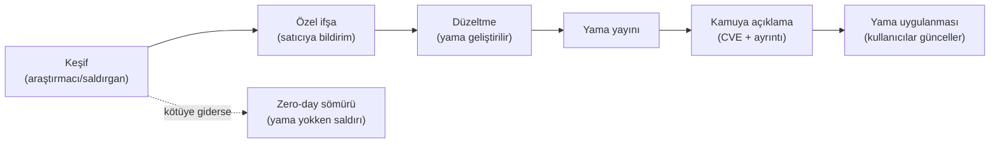

## Yazılım güvenlik açıklarının sınıflandırılması: CWE

Bir açık bulduğunuzda onu **adlandırmalısınız** ki başkaları anlasın, tekrar bulunmasın ve önlem alınabilsin.
İlk araç **CWE**'dir (Common Weakness Enumeration): MITRE'ın yürüttüğü, **zayıflık türlerinin** numaralı
kataloğu. CVE belirli bir üründeki belirli bir açıksa, CWE onun **türüdür**.

| CWE | Zayıflık türü | Bu derste nerede? |
| --- | --- | --- |
| CWE-787 | Sınır dışına yazma | Hafta 1 Demo 03 (taşma) |
| CWE-125 | Sınır dışından okuma | Heartbleed ailesi |
| CWE-89 | SQL enjeksiyonu | Hafta 5 |
| CWE-79 | Siteler arası betik (XSS) | Web zafiyetleri |
| CWE-416 | Serbest bırakılan belleğin kullanımı | Hafta 4 |
| CWE-20 | Yetersiz girdi doğrulama | Her hafta |
| CWE-367 | TOCTOU yarış durumu | Bu hafta Demo 06 |
| CWE-798 | Gömülü (hardcoded) kimlik bilgisi | Hafta 3, 10 |
| CWE-327 | Zayıf/yanlış kripto kullanımı | Hafta 10 |
| CWE-326 | Yetersiz şifreleme gücü | Hafta 10, 11 |

**CWE Top 25**, o yıl en çok görülen ve en tehlikeli 25 zayıflığın listesidir; gerçek CVE verisinden, sıklık ve
ciddiyet birleştirilerek hesaplanır. Bir güvenlik programının "önce neye bakmalıyım?" sorusuna iyi bir başlangıç
cevabıdır. Yıllardır ilk sıralarda sınır dışı yazma (CWE-787), XSS (CWE-79) ve SQL enjeksiyonu (CWE-89) yer alır.

!!! note "CWE hiyerarşiktir"
    CWE'ler ağaç gibi bağlıdır: **pillar → class → base → variant**. Örneğin çok genel bir "uygunsuz girdi
    doğrulama" (CWE-20) altında daha somut "yol geçişi" (CWE-22) ya da "OS komut enjeksiyonu" (CWE-78) bulunur.
    Bir bulguyu **mümkün olan en somut** CWE'ye eşlemek, düzeltmeyi de netleştirir.

!!! note "Değerlendirici nasıl bakar? — zayıflık kategorileri → CWE"
    Bir güvenlik değerlendiricisi, ürününüzde belli **zayıflık ailelerini** arar ve her bulguyu bir CWE'ye
    bağlar. Tipik aileler ve karşılıkları:

    | Değerlendiricinin aradığı | Olası CWE |
    | --- | --- |
    | Sırların açıkta olması (gömülü anahtar, bellekte açık kalan sır) | CWE-798, CWE-316 |
    | Zayıf/yanlış kripto (ECB, sertifikalanmamış, zayıf checksum) | CWE-327, CWE-326 |
    | Atlatılabilir RASP (tek noktaya bağlı kontrol, kancalanabilir tespit) | CWE-693 (koruma atlatma) |
    | Kod/veri "lifting" (whitebox tablosunu oracle olarak kaçırma) | CWE-collection: koruma yetersizliği |
    | Loglama sızıntısı (sürümde kalan log, ipucu veren hata kodu) | CWE-532, CWE-209 |

    Sizin dönem projenizin **S4** tablosunda her tehdidi böyle bir CWE'ye bağlayacaksınız.

---

## OWASP Top 10 ve MASVS

CWE tüm zayıflıkları kataloglar; **OWASP** ise bunları belirli alanlarda **öncelik listelerine** ve **doğrulama
standartlarına** çevirir.

- **OWASP Top 10:** Web uygulamalarında en kritik on risk kategorisi (ör. erişim denetimi kırılması, kripto
  hataları, enjeksiyon, güvensiz tasarım). Bir **farkındalık** ve **öncelik** belgesidir; her madde birçok
  CWE'yi kapsar.
- **OWASP ASVS** (Application Security Verification Standard): "Güvenli sayılmak için hangi denetimleri
  geçmeli?" sorusunun web için ayrıntılı, seviyeli **kontrol listesidir**.
- **OWASP MASVS** (Mobile Application Security Verification Standard): Aynı fikrin **mobil** karşılığı. Bu ders
  mobil koruma ağırlıklı olduğundan MASVS bizim için özellikle önemlidir. Kategorileri (kısaca): STORAGE
  (depolama), CRYPTO, AUTH (kimlik doğrulama), NETWORK, PLATFORM, CODE (kod kalitesi), **RESILIENCE**
  (dayanıklılık — tersine mühendislik ve kurcalamaya karşı koruma). MASVS'in eşlik ettiği test kılavuzu
  **MASTG**'dir.

| Belge | Kapsam | Türü |
| --- | --- | --- |
| CWE / Top 25 | Tüm yazılım | Zayıflık kataloğu / öncelik |
| OWASP Top 10 | Web | Farkındalık / öncelik |
| OWASP ASVS | Web | Doğrulama standardı |
| OWASP MASVS + MASTG | Mobil | Doğrulama standardı + test kılavuzu |

!!! tip "Bu dersle bağ: MASVS-RESILIENCE"
    Dönem boyunca işleyeceğimiz kod gizleme (9, 14. hafta), RASP (6. hafta) ve whitebox (11. hafta) konuları,
    doğrudan MASVS'in **RESILIENCE** kategorisinin karşılığıdır. Yani öğrendiğiniz her koruma, tanınmış bir
    standardın bir maddesine oturuyor.

!!! example "Sınıf etkinliği 3 — Bulguyu sınıfla (10 dakika)"
    Aşağıdaki üç kısa bulguyu (a) bir CWE'ye, (b) mümkünse bir OWASP Top 10 / MASVS kategorisine eşleyin:

    1. Bir mobil uygulama, sunucu sertifikasını hiç doğrulamıyor; sahte sertifika kabul ediliyor.
    2. Kaynak koda gömülü, tüm kopyalarda aynı bir API anahtarı bulunuyor.
    3. Kullanıcı adını doğrudan SQL sorgusuna ekleyen bir giriş formu var.

    ??? success "Cevaplar"
        1. CWE-295 (yanlış sertifika doğrulama) · OWASP A02 kripto / MASVS-NETWORK. 2. CWE-798 (gömülü kimlik) ·
        MASVS-STORAGE/CRYPTO. 3. CWE-89 (SQL enjeksiyonu) · OWASP A03 enjeksiyon.

---

## CVE ve CVSS: hangi açık, ne kadar ciddi?

- **CVE** (Common Vulnerabilities and Exposures): **Belirli bir üründeki belirli bir açığın** benzersiz kimliği,
  ör. `CVE-2014-0160` (Heartbleed). CVE bir **isim**dir, ciddiyet değil. Bir CVE, bir ya da birden çok CWE
  türüne aittir.
- **CVSS** (Common Vulnerability Scoring System): Bir açığın **ciddiyetini** 0.0–10.0 arasında bir sayıya çeviren
  sistem. FIRST tarafından yürütülür. Üç grup metrik vardır: **Temel** (açığın kendi özellikleri, değişmez),
  **Zamansal** (sömürü kodu var mı, yama çıktı mı), **Çevresel** (sizin ortamınızda ne kadar önemli). Bu derste
  **Temel puana** odaklanacağız.

CVSS v3.1 Temel puanın sekiz metriği:

| Metrik | Sorusu | Değerler |
| --- | --- | --- |
| **AV** Saldırı vektörü | Nereden sömürülür? | Ağ / Bitişik ağ / Yerel / Fiziksel |
| **AC** Karmaşıklık | Ne kadar zor? | Düşük / Yüksek |
| **PR** Gerekli ayrıcalık | Önceden yetki gerekir mi? | Yok / Düşük / Yüksek |
| **UI** Kullanıcı etkileşimi | Kurban bir şey yapmalı mı? | Yok / Gerekli |
| **S** Kapsam | Etki, açığın olduğu bileşeni aşıyor mu? | Değişmedi / Değişti |
| **C / I / A** Etki | Gizlilik / Bütünlük / Erişilebilirlik ne kadar bozulur? | Yüksek / Düşük / Yok |

### Demo 05 — CVSS v3.1 taban puan hesaplayıcı

!!! info "Demo 05 · `code/week-02/05-cvss` (Python) · FIRST v3.1 formülleri"
    Bir CVSS vektörünü alıp taban puanı sıfırdan hesaplar; `test_cvss.py` sonucu FIRST belgesindeki bilinen
    değerlerle karşılaştırarak doğrular. Ağ isteği yapmaz; derleme gerektirmez (Python 3.8+).

Windows: `cd code\week-02\05-cvss ; .\demo.ps1` · WSL/Linux: `cd code/week-02/05-cvss && sh demo.sh`.
Elle: `python3 cvss.py --ornekler` (Windows'ta `py -3 cvss.py --ornekler`).

```text title="demo — örnekler (kısaltılmış)"
  1) Uzaktan, kimlik gerektirmeyen tam ele gecirme
  CVSS:3.1/AV:N/AC:L/PR:N/UI:N/S:U/C:H/I:H/A:H
    TEMEL PUAN = 9.8  |####################|  Kritik (Critical)

  2) Ayni ama KAPSAM degisti (kutu disina cikan etki) -> daha yuksek
  CVSS:3.1/AV:N/AC:L/PR:N/UI:N/S:C/C:H/I:H/A:H
    TEMEL PUAN = 10.0  |####################|  Kritik (Critical)

  4) Yerel yetki yukseltme (cihaz saldirganin elinde) -> yuksek
  CVSS:3.1/AV:L/AC:L/PR:L/UI:N/S:U/C:H/I:H/A:H
    TEMEL PUAN = 7.8  |################....|  Yuksek (High)
```

Aynı etki (C:H/I:H/A:H) olsa bile, **uzaktan + kimliksiz** bir açık (9.8) **yerel + yetkili** bir açıktan (7.8)
daha yüksek puan alır; kapsam değişince 10.0'a çıkar. Puanları ciddiyet bandına çeviririz:

| Puan | Bant |
| --- | --- |
| 0.0 | Yok |
| 0.1–3.9 | Düşük |
| 4.0–6.9 | Orta |
| 7.0–8.9 | Yüksek |
| 9.0–10.0 | Kritik |

!!! note "CVSS v4.0 kısaca"
    2023'te gelen v4.0, v3.1'in bazı zayıflıklarını giderir: **Temel puan artık `CVSS-B`** olarak anılır;
    "kapsam" metriği kaldırılıp yerine **ayrı Zafiyet Etkisi (VC/VI/VA)** ve **Sonraki Sistem Etkisi
    (SC/SI/SA)** getirildi; sömürü olgunluğu (E) ve tehdit/çevre metrikleriyle **CVSS-BTE** hesaplanabiliyor.
    Amaç, gerçek riski daha iyi yansıtmaktır. Bu derste hesap makinesini v3.1 için yazdık çünkü sahada hâlâ en
    yaygın olan odur; v4.0'ın mantığı aynıdır, ağırlıklar farklıdır.

!!! danger "CVSS'in sık yapılan hatası"
    "CVSS 9.8, hemen yamalayalım; 4.0, beklesin." Temel puan **bağlamı bilmez**: 4.0'lık bir açık, tam sizin en
    değerli varlığınızın kapısıysa sizin için 9.8'den önemlidir. Bu yüzden **Çevresel** metrikler ve sizin
    **varlık tablonuz** (S5) vardır. Puan önceliklendirmeye başlangıçtır, son söz değildir.

!!! note "Değerlendirici nasıl test eder? — bulgudan puana"
    Bir güvenlik laboratuvarı bir bulgu bulduğunda onu yalnız "kötü" diye bırakmaz; **tekrarlanabilir** biçimde
    derecelendirir. Önce bulguyu en somut **CWE**'ye eşler; sonra bir **CVSS** vektörü kurarken şu somut soruları
    sorar: saldırgan bunu ağdan mı yoksa yalnız cihaz elindeyken mi kullanabiliyor (AV)? Önceden bir yetki ya da
    kullanıcı etkileşimi gerekiyor mu (PR, UI)? Etki, açığın olduğu bileşende mi kalıyor yoksa dışına mı taşıyor
    (S)? Bu dersin bağlamında (program saldırganın cihazında çalışıyor) çoğu bulgu **yerel** (AV:L) çıkar; bu
    yüzden CVSS puanı düşse bile risk azalmaz — değerlendirici puanın yanına **saldırı potansiyeli**ni (harcanan
    süre, uzmanlık, ekipman) da yazar. Sizin projenizde her bulguyu böyle CWE + CVSS + kısa gerekçeyle
    kaydedeceksiniz (S4, S16).

---

## Zafiyet yaşam döngüsü ve sorumlu ifşa

Bir açık keşfedildiği andan kamuya açıldığı ana kadar bir **yaşam döngüsünden** geçer. Bu döngünün nasıl
yönetildiği, kullanıcıların risk altında kaldığı süreyi belirler.



Anahtar kavramlar:

- **Zero-day (sıfırıncı gün):** Satıcının **henüz bilmediği** ya da yamasının olmadığı açık. En tehlikeli
  durum, çünkü savunma yoktur.
- **Sorumlu ifşa (coordinated disclosure):** Araştırmacı açığı **önce satıcıya** bildirir, makul bir süre
  (genellikle 90 gün) yama için bekler, sonra kamuya açıklar. Amaç, kullanıcıları korurken satıcıyı da
  harekete geçirmektir.
- **Tam ifşa (full disclosure):** Açığın hemen kamuya açıklanması. Satıcıyı zorlar ama kullanıcıları riske atar;
  tartışmalıdır.
- **Hata ödül programları (bug bounty):** Şirketlerin, açıkları sorumlu biçimde bildiren araştırmacılara ödül
  verdiği programlar. Sorumlu ifşayı teşvik eder.
- **Yama boşluğu (patch gap):** Yama yayınlandığı an açık **kamuya** açılır; herkes yamayı tersine mühendislikle
  inceleyip açığı öğrenebilir. Güncellemeyen kullanıcılar bu boşlukta savunmasızdır — WannaCry, yama çıktıktan
  **sonra** hâlâ güncellememiş makinelere yayıldı.

!!! note "Sahada nasıl uygulanır?"
    Bir ürün ekibi için bu döngü bir **süreçtir**: açık bildirimlerini kabul eden bir kanal (`security.txt`,
    güvenlik e-postası), bir sorumlu, bir yama SLA'sı (ne kadar sürede düzeltilecek) ve bir sürüm/yama duyuru
    mekanizması. Bağımsız bir değerlendirme, ürünün yalnız kodunu değil bu **süreci** de sorar: "Bir açık
    bildirilse ne olur, kim ne kadar sürede ne yapar?" Sizin projenizde bunu **geliştirme süreci** (S13) ve
    **raporlama politikası** (S12) bölümlerinde ele alacaksınız.
