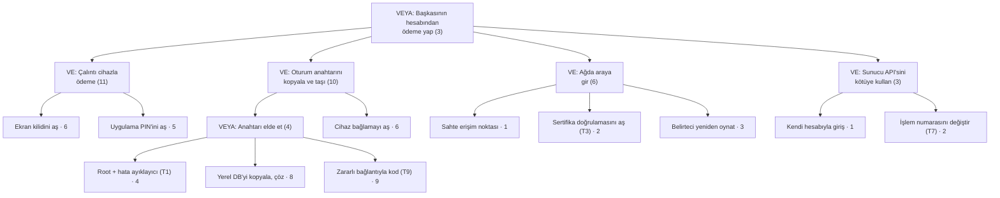

## Sık yapılan hatalar ve kontrol listeleri

Bu hafta dört büyük konuyu birlikte işledik: zararlı yazılım ve tespit, saldırgan zihniyeti ve denetim kaydı,
erişim denetimi modelleri, zafiyet sınıflandırma ve önceliklendirme. Aşağıda her küme için önce **en sık düşülen
yanılgıları**, sonra kendinizi sınayabileceğiniz bir **kontrol listesini** bulacaksınız. Hata maddelerinin her biri
"neden yanlış?" sorusunun kısa cevabını da içerir; kontrol listesindeki her maddeyi bir arkadaşınıza **kendi
cümlelerinizle** anlatabiliyorsanız o konuyu öğrenmişsiniz demektir.

### Zararlı yazılım ve tespit

!!! danger "Sık yapılan hatalar"
    - **"Her zararlı bir virüstür."** Virüs yalnız bir türdür: bir taşıyıcıya iliştirilir ve taşıyıcı çalışınca
      çalışır. Solucan taşıyıcı gerektirmez, truva atı kendini kopyalamaz. Türü yanlış koymak yanlış savunmayı
      seçtirir (solucana karşı ağ yaması, truva atına karşı kullanıcı eğitimi ve izin listesi).
    - **"İmza veritabanım güncel, güvendeyim."** İmza yalnız **bilineni** yakalar. Tek baytlık değişiklik özet
      imzasını, çözücüsü değişen polimorfik kopya desen imzasını atlatır (Demo 01).
    - **"Yüksek entropi = zararlı."** Şifreli, sıkıştırılmış ve rastgele veri hep 8'e yakındır; `.zip`, `.png`,
      şifreli yedek de öyle. Entropi yalnız **beklenmedik yerde** anlamlı bir ipucudur (Demo 02).
    - **"Kum havuzunda temiz çıktı, o hâlde temiz."** Zararlı sanal ortamı sezip uyuyabilir, tarih ya da kullanıcı
      etkileşimi bekleyebilir. Kum havuzu sonucu "bu koşullarda bir şey yapmadı" demektir, "zararsızdır" değil.
    - **"Metamorfik zararlıyı emülasyon çözer."** Emülasyon, şifreli gövdenin çözüldüğü anı yakalar; metamorfik
      kodda çözülen sabit bir gövde yoktur. Burada davranış tabanlı tespit gerekir.
    - **"%100 tespit eden bir ürün alırız."** Cohen'in sonucuna göre "bu program virüs mü?" sorusunu her
      durumda doğru yanıtlayan bir algoritma yoktur; her tespit yöntemi yanlış pozitif ile yanlış negatif
      arasında bir denge kurar.
    - **"Bütünlük izlemesini düz SHA-256 listesiyle yaptım."** Saldırgan dosyayı değiştirdiği gibi listeyi de
      güncelleyebilir. Temel değerler anahtarlı (HMAC) ya da imzalı olmalı ve saldırganın erişemeyeceği yerde
      durmalıdır (Demo 08).
    - **"Yama yayımlandı, iş bitti."** WannaCry'ın kullandığı açığın yaması saldırıdan yaklaşık iki ay önce
      çıkmıştı. Yama **uygulanana** kadar risk sürer; yayımlanan yama saldırgana da yol gösterir.

!!! success "Kontrol listesi — zararlı yazılım"
    - [ ] Virüs, solucan, truva atı, fidye yazılımı, rootkit, bot, casus yazılım ve siliciyi **yayılma** ve
      **amaç** ölçütüyle ayırabiliyorum.
    - [ ] Bir virüsün bulaştırıcı, tetikleyici ve yük parçalarını bir senaryoda gösterebiliyorum.
    - [ ] Şifreli → oligomorfik → polimorfik → metamorfik merdiveninde her basamağın neyi değiştirdiğini ve hangi
      tespiti zorlaştırdığını söyleyebiliyorum.
    - [ ] Paketleyicinin ve anti-analiz tekniklerinin (sanal makine sezme, uyuma, hata ayıklayıcı sezme) amacını
      açıklayabiliyorum.
    - [ ] Özet imzası, desen imzası, YARA kuralı, bulanık özet, sezgisel, davranış/EDR, kum havuzu, emülasyon ve
      izin listesinin **güçlü ve zayıf yanını** birer cümleyle söyleyebiliyorum.
    - [ ] SI salgın modelinde ikilenme süresinin `ln 2 / β` olduğunu ve hedef listesinin (hitlist) açılış
      evresini neden kısalttığını gösterebiliyorum (Demo 09).
    - [ ] Morris, Code Red, Slammer, Stuxnet, WannaCry, NotPetya ve SolarWinds olaylarının her birinden
      programcıya kalan **bir** dersi söyleyebiliyorum.

### Saldırgan zihniyeti, saldırı ağaçları ve denetim kaydı

!!! danger "Sık yapılan hatalar"
    - **"Kullanıcı bizim uygulamamızı değiştiremez."** Tarif 12.1'in temel varsayımı tersidir: saldırgan
      cihazın donanımını, işletim sistemini ve araçlarını **tamamen** denetleyebilir. Koruma kırılmazlık değil,
      saldırının maliyetini yükseltmektir.
    - **"Tek bir saldırgan modeli yeter."** Uzak saldırgan, aynı cihazdaki kötü amaçlı uygulama ve cihaz sahibi
      (beyaz kutu) saldırganın yetenekleri çok farklıdır. Model yazılmadan tehdit tablosu doldurulursa satırlar
      rastgele olur.
    - **"Saldırı ağacında VE ile VEYA fark etmez."** VEYA düğümünde en ucuz çocuk, VE düğümünde çocukların
      **toplamı** alınır. Karıştırmak en ucuz yolu yanlış buldurur ve savunma parası yanlış dala gider.
    - **"En pahalı dalı güçlendirelim."** Saldırgan en ucuz yolu seçer. Savunma, kökteki en ucuz yolu
      pahalılaştırmıyorsa en ucuz saldırının maliyeti hiç değişmez (Demo 04).
    - **"Saldırı–savunma ağacında önlem eklemek yeter."** Her önlemin kendisi de atlatılabilir; önlem düğümünün
      altına onu aşma yollarını (karşı-karşı önlem) yazmadan hesap iyimser çıkar.
    - **"Denetim kaydına her şeyi yazalım."** Parola, PIN, anahtar ve tam kart numarası kayda **asla** girmez
      (CWE-532). Kayıt, olayı yeniden kurmaya yetecek kadar bilgi taşır: kim, ne, ne zaman, nerede, sonuç.
    - **"Kullanıcı adını olduğu gibi kayda yazdım."** İçinde satır sonu olan bir girdi sahte kayıt satırı
      üretir (CWE-117). Denetim karakterleri kaçışlanmalı ya da yapılandırılmış (alan alan) kayıt kullanılmalıdır.
    - **"Kayıt dosyasının sonuna özet ekledim, kurcalama anlaşılır."** Anahtarsız özeti saldırgan yeniden
      hesaplar. HMAC zinciri araya ekleme ve değiştirmeyi yakalar; **sondan kesmeyi** yakalamak için son zincir
      değeri ayrıca (uzak sunucuda) tutulmalıdır (Demo 11, Tarif 13.11).

!!! success "Kontrol listesi — saldırgan ve denetim kaydı"
    - [ ] Tarif 12.1'deki beş doğrulama yaklaşımını (girdi, donanım, ağ, ortam, bütünlük) ve her birinin nasıl
      atlatıldığını sayabiliyorum.
    - [ ] Projem için en az üç saldırgan modeli (yetenek, erişim, amaç) yazabiliyorum.
    - [ ] Bir saldırı ağacını maliyet, olasılık ve "özel ekipman gerekir mi" öznitelikleriyle aşağıdan yukarı
      çözebiliyorum.
    - [ ] Saldırı–savunma ağacında önlem ve karşı-karşı önlem düğümlerini gösterebiliyorum.
    - [ ] SLE, ARO ve ALE ile bir önlemin yıllık net faydasını hesaplayabiliyorum.
    - [ ] Değerlendiricinin aradığı zayıflık ailelerini (sırlar açıkta, zayıf kripto, atlatılabilir RASP, kod
      kaçırma, kayıt sızıntısı) somut CWE kimliklerine eşleyebiliyorum.
    - [ ] Bir denetim kaydı satırında olması ve olmaması gerekenleri sayabiliyor, HMAC zincirinin neyi yakalayıp
      neyi yakalayamadığını söyleyebiliyorum.

### Erişim denetimi ve güvenlik modelleri

!!! danger "Sık yapılan hatalar"
    - **"Önce `access()`, sonra `open()`."** Arada bir yarış penceresi vardır (CWE-367) ve `access()` gerçek
      (real) kimliği, `open()` etkin (effective) kimliği sınar. Denetim ile kullanım tek atomik adımda olmalıdır
      (Tarif 2.3, Demo 06).
    - **"Hata olursa izin verelim, kullanıcı mağdur olmasın."** Saltzer–Schroeder'in **güvenli varsayılan**
      ilkesi tersini söyler: politika okunamıyorsa cevap **ret** olmalıdır (CWE-636).
    - **"Kimliği doğruladık, yetkiyi de doğrulamış olduk."** Kimlik doğrulama "sen kimsin?", yetkilendirme
      "bunu yapabilir misin?" sorusudur. 2025 CWE Top 25'te dördüncü sıradaki CWE-862 tam bu eksikliktir.
    - **"BLP ile Biba aynı şeyi söyler."** Yönleri terstir: BLP gizlilik için yukarı okumayı ve aşağı yazmayı,
      Biba bütünlük için aşağı okumayı ve yukarı yazmayı yasaklar.
    - **"NULL DACL ile boş DACL aynı."** NULL DACL **herkese tam erişim**, hiç ACE içermeyen boş DACL ise
      **kimseye erişim yok** demektir. İlki ciddi bir zafiyettir (CWE-732).
    - **"ACE sırası önemli değil."** Windows ACE'leri sırayla değerlendirir ve ilk belirleyici girdide durur;
      kanonik sırada açık ret girdileri izinlerden önce gelir. Elle yanlış sıralanmış bir DACL, niyet edilen
      reddi etkisiz bırakabilir (Demo 12).
    - **"`chmod 777` ile sorun çözüldü."** Sorun, izinlerin herkese açılmasıyla "çözülmez", büyütülür. Sırlar
      `0600` ile oluşturulmalı, `umask` programın başında bilinçli olarak ayarlanmalıdır (Tarif 2.7, Demo 13).
    - **"RBAC kurduk, görev ayrılığı kendiliğinden gelir."** Aynı kişiye hem "iade başlat" hem "iade onayla"
      rolü verilirse RBAC görev ayrılığını sağlamaz; statik ya da dinamik görev ayrılığı kısıtı ayrıca
      tanımlanmalıdır (Demo 14).

!!! success "Kontrol listesi — erişim denetimi"
    - [ ] Saltzer–Schroeder'in sekiz tasarım ilkesini sayıp her birine bir kod örneği verebiliyorum.
    - [ ] Başvuru izleyicisinin üç özelliğini (her erişimde çağrılma, kurcalanamazlık, doğrulanabilir küçüklük)
      biliyorum.
    - [ ] Bir erişim matrisini ACL'ye ve yetenek listesine dönüştürüp iptal (revocation) açısından
      karşılaştırabiliyorum; HRU sonucunun ne dediğini biliyorum.
    - [ ] DAC, MAC, RBAC ve ABAC'ı "kararı kim verir?" sorusuyla ayırabiliyorum.
    - [ ] BLP, Biba, Clark–Wilson ve Chinese Wall kurallarını bir senaryoya uygulayabiliyorum.
    - [ ] `ls -l` çıktısını, `setuid`/`sticky` bitlerini ve `umask` hesabını yorumlayabiliyorum (Tarif 2.1).
    - [ ] Windows'ta belirteç, SID, DACL, SACL, ACE sırası, NULL DACL, bütünlük düzeyi ve UAC kavramlarını
      açıklayabiliyorum (Tarif 2.2).
    - [ ] Mobil izin modelinin (uygulama başına kum havuzu, çalışma anı izinleri) en az ayrıcalıkla bağını
      kurabiliyorum.

### Zafiyet sınıflandırma ve önceliklendirme

!!! danger "Sık yapılan hatalar"
    - **"CWE ile CVE aynı şey."** CWE bir zayıflık **türüdür** (CWE-125, sınır dışı okuma); CVE belirli bir
      üründeki belirli bir açığın **kimliğidir** (CVE-2014-0160, Heartbleed).
    - **"En genel CWE'yi seçmek güvenlidir."** CWE-20 (girdi doğrulama) ya da CWE-693 gibi üst düzey girdiler
      düzeltmeyi anlatmaz. Kural: mümkün olan **en somut** (tercihen base düzeyi) girdiyi seçin.
    - **"CVSS puanı risktir."** Temel puan açığın kendi özelliklerini ölçer; sizin varlığınızın değerini,
      istismar kodunun varlığını, sistemin internete açık olup olmadığını bilmez.
    - **"Cihazdaki açıklar düşük puan alıyor, o hâlde önemsiz."** Beyaz kutu senaryolarında vektör çoğunlukla
      `AV:L` ve `PR:H` çıkar ve puan düşer. Oysa bu dersin saldırgan modeli tam da budur; puanın yanına saldırı
      potansiyeli ve varlık değeri yazılmalıdır.
    - **"CVSS v3.1 vektörünü v4.0 hesap makinesine girerim."** v4.0'da Kapsam (S) yoktur; AT, VC/VI/VA ve
      SC/SI/SA metrikleri vardır ve UI üç değer alır (N/P/A). Vektörler birbirine çevrilmez, yeniden kurulur.
    - **"EPSS yüksek, o hâlde CVSS de yüksektir."** EPSS istismar **olasılığını** (30 gün içinde), CVSS
      **ciddiyeti** ölçer; ikisi farklı sorulara cevap verir ve birlikte okunur.
    - **"KEV'de yoksa istismar edilmiyordur."** KEV yalnız **kanıtlanmış** istismarları ve ölçütleri sağlayan
      (CVE kimliği, istismar kanıtı, açık düzeltme yönergesi) kayıtları içerir; listede olmamak güvenlik kanıtı
      değildir.
    - **"OWASP Top 10 bir kontrol listesidir."** Top 10 bir farkındalık belgesidir; doğrulanabilir gereksinimler
      web için ASVS'de, mobil için MASVS ve MASTG'dedir.

!!! success "Kontrol listesi — sınıflandırma"
    - [ ] CWE soyutlama düzeylerini (pillar, class, base, variant) ve "en somut girdi" kuralını biliyorum.
    - [ ] 2025 CWE Top 25'in ilk beşini ve listenin nasıl hesaplandığını (sıklık × ortalama CVSS)
      söyleyebiliyorum.
    - [ ] OWASP Top 10:2025, ASVS 5.0 ve MASVS v2'nin işlevlerini ayırabiliyorum; MASVS'in sekiz kontrol grubunu
      sayabiliyorum.
    - [ ] Bir bulguya CVSS v3.1 vektörü kurup puanı elle ya da Demo 05 ile hesaplayabiliyorum; v4.0 farklarını
      söyleyebiliyorum.
    - [ ] CVSS, EPSS, KEV ve SSVC'yi birlikte kullanarak bir yama sırası önerebiliyorum (Demo 16).
    - [ ] Zafiyet yaşam döngüsünü, sıfırıncı gün, n-gün ve yama boşluğu kavramlarını ve eşgüdümlü ifşayı
      anlatabiliyorum.

---

## Dönem projesi: bu hafta (S4)

Geçen hafta güvenlik kılavuzunuzun **S4 — Tehdit modeli ve saldırgan modeli** bölümünün iskeletini kurdunuz:
STRIDE ile tehditleri çıkardınız ve kaba bir saldırı tablosu yazdınız. Bu hafta o tabloyu bir değerlendiricinin
okuyabileceği hâle getiriyorsunuz: her satır **ortak bir dille adlandırılacak** (CWE), **ölçülecek** (CVSS) ve
en kritik varlık için **en ucuz saldırı yolu** bir saldırı ağacıyla gösterilecek.

!!! abstract "Bu hafta S4'e eklenecekler"
    - [ ] **Saldırgan modelleri tablosu:** en az üç model; her biri için yetenek, erişim ve amaç.
    - [ ] **Tehdit tablosunun her satırına** en somut CWE kimliği, CVSS v3.1 vektörü ve taban puanı.
    - [ ] Her satır için hangi saldırgan modelini varsaydığınız (vektör buna göre kurulur).
    - [ ] En kritik varlığınız için **bir saldırı ağacı** (en az 8 yaprak), en ucuz yol ve bu yolu en çok
      pahalılaştıran önlem.
    - [ ] Bir **öncelik sırası** ve gerekçesi: CVSS puanı + varlık değeri + saldırı ağacındaki yer.
    - [ ] Kullandığınız üçüncü taraf bileşenlerde (ör. SQLite, OpenSSL) varsa ilgili gerçek CVE'ler ve bunların
      sizin sürümünüzü etkileyip etkilemediği.
    - [ ] Sisteminiz için uygun erişim modelinin (DAC yeterli mi, RBAC ya da zorunlu sınır gerekir mi?) bir
      paragraflık gerekçesi.

### Adım adım yöntem

1. **Saldırgan modellerini yazın.** Tehditten önce saldırganı tanımlayın; yoksa aynı tehdidi farklı satırlarda
   farklı varsayımlarla puanlarsınız. Bu dersin bağlamında en az şu üçü bulunmalıdır: uzak saldırgan, aynı
   cihazdaki kötü amaçlı uygulama ve cihaz sahibi (beyaz kutu) saldırgan.
2. **Tehditleri arayüzlerden çıkarın.** S3'teki arayüz tablonuzun her satırı (istemci–sunucu, uygulama–kütüphane,
   kütüphane–yerel veritabanı...) için STRIDE'ın altı harfini sorun. S5'teki her varlık en az bir tehditte
   görünmelidir; görünmüyorsa ya varlık gereksizdir ya tablo eksiktir.
3. **CWE eşleyin.** Tehdidin **kök nedenini** (zayıflığı) adlandırın, sonucunu değil. "Anahtar çalınır" bir
   sonuçtur; kök neden "anahtar kodun içine gömülü" (CWE-321/CWE-798) ya da "anahtar bellekte açık kalıyor"
   (CWE-316) olabilir. cwe.mitre.org'da girdinin "Mapping" notuna bakın: bazı üst düzey girdilerin eşlemede
   kullanılması önerilmez.
4. **CVSS vektörünü saldırgan modeline göre kurun.** Aynı zayıflık, uzak saldırganda `AV:N`, cihaz sahibinde
   `AV:L/PR:H` verir. Hangi modeli varsaydığınızı sütuna yazın. Puanı Demo 05 ile ya da FIRST'ün hesap
   makinesiyle hesaplayın ve vektörü **tam** yazın ki değerlendirici tekrarlayabilsin.
5. **Önlemi ve bölümü bağlayın.** Her tehdidin önlemi kılavuzun başka bir bölümünde anlatılır (S5, S7, S9, S10,
   S11, S12). Bölüm sütunu, S17 uyum matrisinin de temelidir.
6. **Önceliği gerekçelendirin.** Önceliği yalnız puana göre sıralamayın; saldırı ağacındaki en ucuz yol ve
   varlığın değeri birlikte karar verir. Gerekçeyi bir paragrafla yazın.

### Tamamen doldurulmuş sentetik örnek

Aşağıdaki örnek, dersin ortak örnek mimarisi olan **"mobil ödeme uygulaması + güvenlik kütüphanesi"** için
yazılmıştır. Uygulama; kullanıcı arayüzünü, sunucu ile iletişimi ve yerel veritabanını yönetir. Güvenlik
kütüphanesi (native C) oturum anahtarlarını, tek kullanımlık ödeme anahtarı sayaçlarını ve bütünlük/RASP
denetimlerini taşır. Bütün değerler **uydurmadır**; tablo biçimini ve düşünme yolunu göstermek içindir.

**S4.1 — Saldırgan modelleri**

| Kod | Model | Yetenek | Erişim | Amaç |
| --- | --- | --- | --- | --- |
| **SM1** | Uzak saldırgan | Sunucu API'sine istek gönderir, uygulamayı indirip inceler | Yalnız ağ | Başkası adına işlem, veri toplama |
| **SM2** | Yakın ağ saldırganı | Sahte erişim noktası kurar, trafiği yönlendirir | Aynı yerel ağ | Oturumu ele geçirme, işlemi değiştirme |
| **SM3** | Cihazdaki kötü amaçlı uygulama | Normal izinlerle çalışır, root yok | Aynı telefon | Kayıt/dosya okuma, geçici dosyaya müdahale |
| **SM4** | Cihaz sahibi / beyaz kutu | Root, hata ayıklayıcı, kanca aracı, ikili yamalama | Cihazın tamamı | Anahtar çıkarma, korumaları atlatma, klonlama |

**S4.2 — Tehdit tablosu (CWE ve CVSS v3.1 eklenmiş)**

Vektörlerin tamamı `CVSS:3.1/` önekiyle okunur; puanlar Demo 05 ile hesaplanmıştır.

| ID | Tehdit (STRIDE) | Varlık | Saldırgan / yol | CWE | CVSS v3.1 vektörü | Puan | Önlem | Bölüm |
| --- | --- | --- | --- | --- | --- | --- | --- | --- |
| T1 | Oturum anahtarının kullanım anında bellekten okunması (I) | Oturum anahtarı (C, I) | SM4 · hata ayıklayıcı, bellek dökümü | CWE-316 | `AV:L/AC:L/PR:H/UI:N/S:U/C:H/I:N/A:N` | 4.4 Orta | Kısa ömür + güvenli silme, anti-debug, ileride whitebox | S5, S7, S10 |
| T2 | İkiliye gömülü API anahtarının çıkarılması (I) | Sunucu API anahtarı | SM1 · uygulamayı indir, dizeleri ara | CWE-798 | `AV:N/AC:L/PR:N/UI:N/S:U/C:L/I:L/A:N` | 6.5 Orta | Cihaz başına kayıtla alınan kimlik; sunucuda hız sınırı | S6, S8 |
| T3 | Sertifika doğrulanmadığı için araya girme (T, I) | İşlem mesajları, oturum belirteci | SM2 · sahte erişim noktası | CWE-295 | `AV:N/AC:H/PR:N/UI:N/S:U/C:H/I:H/A:N` | 7.4 Yüksek | Zincir + ana makine adı doğrulama, sabitleme, mesaj düzeyi AEAD | S11 |
| T4 | Kütüphane ikilisini yamalayıp PIN/root denetimini atlatma (T, E) | Native kod bütünlüğü | SM4 · `jne` → `jmp` | CWE-693 | `AV:L/AC:L/PR:H/UI:N/S:U/C:N/I:H/A:N` | 4.4 Orta | Çok noktalı, örtüşen bütünlük denetimi; sonucu anahtar türetmede kullanma | S9, S10 |
| T5 | Sürüm derlemesinde kalan kayıtta kart verisi ve belirteç (I) | Kart verisi (sentetik), oturum belirteci | SM3 · paylaşılan kayıt/hata raporu | CWE-532 | `AV:L/AC:L/PR:L/UI:N/S:U/C:H/I:N/A:N` | 5.5 Orta | Sürümde kayıt kaldırma, maskeleme, kayıt politikası | S12 |
| T6 | Yerel veritabanındaki kullanım sayacının geri sarılması (T) | Tek kullanımlık anahtar sayacı (I+) | SM4 · root ile SQLite düzenleme | CWE-642 | `AV:L/AC:L/PR:H/UI:N/S:C/C:N/I:H/A:N` | 6.0 Orta | Sayaç MAC'li ve sunucuyla eşleşik; geri sarma tespiti | S5, S7 |
| T7 | Sunucu API'sinde başka kullanıcının işlemine erişim (E) | İşlem geçmişi, makbuzlar | SM1 · kendi hesabıyla giriş + işlem numarasını değiştirme | CWE-639 | `AV:N/AC:L/PR:L/UI:N/S:U/C:H/I:N/A:N` | 6.5 Orta | Nesne düzeyinde sahiplik denetimi, tahmin edilemez kimlik | S3, S6 |
| T8 | Denetim kaydına satır sonuyla sahte kayıt ekleme (R) | Denetim kaydı (I) | SM1 · kullanıcı adı alanına `\n` | CWE-117 | `AV:N/AC:L/PR:N/UI:N/S:U/C:N/I:L/A:N` | 5.3 Orta | Denetim karakteri kaçışlama, HMAC zinciri, uzak kayıt | S12 |
| T9 | Ödeme isteği bağlantısını ayrıştırırken sınır dışı yazma (E) | Kütüphane süreci, tüm varlıklar | SM1 · kötü niyetli bağlantı, kullanıcı açar | CWE-787 | `AV:N/AC:L/PR:N/UI:R/S:U/C:H/I:H/A:H` | 8.8 Yüksek | Uzunluk denetimi, bulanıklaştırma testi, derleyici sertleştirmesi | S9, S16 |

!!! note "Tablodaki iki bilinçli tercih"
    **T1 ve T4, `PR:H` ile puanlandı**, çünkü root gerektirir. CVSS açısından bu doğrudur ve puan 4.4'e düşer.
    Ama bu dersin varsayımı "platform güvenilmezdir, saldırgan cihazın sahibi olabilir"dir; bu yüzden bu iki satır
    öncelik sırasında puanlarının gösterdiğinden **yukarıdadır**. **T6'da kapsam değişti (`S:C`)** kabul edildi:
    geri sarılan sayaç yalnız uygulamayı değil, tek kullanımlık anahtarı kabul eden sunucu tarafını (ayrı bir
    güvenlik otoritesini) de yanıltır.

**S4.3 — Öncelik ve gerekçe (örnek paragraf)**

> Taban puana göre sıra T9 (8.8) → T3 (7.4) → T2/T7 (6.5) şeklindedir. Ancak "başkasının hesabından ödeme"
> hedefinin saldırı ağacı (S4.4) en ucuz yolun T7 (3 birim), ardından T3 (6 birim) olduğunu gösteriyor. T9'un
> istismarı yüksek uzmanlık gerektiriyor (ağaçta 9 birim). Bu yüzden öncelik sırası **T7 → T3 → T9 → T1** olarak
> belirlendi. T1 ve T4'ün düşük puanı, saldırgan modelimizde (SM4) root'un zaten saldırganın elinde olmasından
> kaynaklanır; bu iki tehdit, vize teslimindeki RASP ve güvenli silme önlemleriyle birlikte ele alınacaktır.

### Saldırı ağacı (örnek)

Kök hedef: **"Başkasının hesabından ödeme yap."** Yaprak maliyetleri örnek gün-adam eforudur. Parantez içindeki
T numaraları, yaprağın tehdit tablosundaki satırıdır.



Aynı ağaç Demo 04'ün girdi biçimiyle (`agac-s4.txt`):

```text
HEDEF: Baskasinin hesabindan odeme yap
  VE Calinti cihazla odeme yap
    YAPRAK Ekran kilidini as                  maliyet=6
    YAPRAK Uygulama PIN'ini as                maliyet=5
  VE Oturum anahtarini kopyala ve tasi
    VEYA Anahtari elde et
      YAPRAK Root + hata ayiklayici (T1)      maliyet=4
      YAPRAK Yerel DB'yi kopyala ve coz       maliyet=8
      YAPRAK Zararli baglantiyla kod (T9)     maliyet=9
    YAPRAK Cihaz baglamayi as                 maliyet=6
  VE Agda araya gir
    YAPRAK Sahte erisim noktasi kur           maliyet=1
    YAPRAK Sertifika dogrulamasini as (T3)    maliyet=2
    YAPRAK Oturum belirtecini yeniden oynat   maliyet=3
  VE Sunucu API'sini kotuye kullan
    YAPRAK Kendi hesabiyla giris yap          maliyet=1
    YAPRAK Islem numarasini degistir (T7)     maliyet=2
```

Demo 04'ün hesap makinesiyle çalıştırdığımızda aldığımız çıktının sonu:

```text title="agac agac-s4.txt (son kısım)"
  EN UCUZ SALDIRI = 3 birim. Savunmacinin oncelikle kirmasi
  gereken zincir (en zayif nokta):

  -> Baskasinin hesabindan odeme yap (maliyet=3)
    -> Sunucu API'sini kotuye kullan [hepsi gerekir] (maliyet=3)
      -> Kendi hesabiyla giris yap (maliyet=1)
      -> Islem numarasini degistir (T7) (maliyet=2)
```

Önlemleri sırayla uyguladığımızda en ucuz yol şöyle değişti (aynı program, yaprak maliyetleri güncellenerek):

| Uygulanan önlem | Değişen yaprak | Yeni en ucuz yol | En ucuz saldırı |
| --- | --- | --- | --- |
| — (başlangıç) | — | Sunucu API'si (T7) | 3 |
| Nesne düzeyinde sahiplik denetimi | T7: 2 → 20 | Ağda araya gir (T3) | 6 |
| Sertifika doğrulama + sabitleme | T3: 2 → 12 | Oturum anahtarını taşı (T1) | 10 |

Bu tablo S4'ün en güçlü kanıtıdır: iki önlem en ucuz saldırıyı **3'ten 10'a** çıkardı ve bir sonraki yatırımın
nereye yapılacağını (bellekteki anahtar: RASP, güvenli silme, cihaz bağlama) sayıyla gösterdi. Dikkat edin:
CVSS'e göre en ciddi satır olan T9 bu hedef için en ucuz yol değildir; iki aracın birlikte okunmasının nedeni
budur.

### Değerlendirme ölçütleri

S4 vize teslimindeki **güvenlik analizi** ölçütünün ana parçasıdır. Değerlendirmede aşağıdaki tablo kullanılır.

| Ölçüt | Zayıf | Yeterli | İyi |
| --- | --- | --- | --- |
| Saldırgan modeli | Yok ya da tek cümle | Üç model, yetenekler yazılı | Her modelin erişim ve amacı açık; her tehdit satırı bir modele bağlı |
| Kapsam | Birkaç rastgele tehdit | Her arayüzde STRIDE uygulanmış | Her S5 varlığı en az bir tehditte; kapsam dışı bırakılanlar gerekçeli |
| CWE eşlemesi | Eksik ya da hep üst düzey girdiler | Her satırda bir CWE | En somut girdi; kök neden ile sonuç ayrılmış |
| CVSS | Yalnız puan, vektör yok | Tam vektör + puan | Vektör saldırgan modeliyle tutarlı; tartışmalı metrikler (S, PR) gerekçeli |
| Saldırı ağacı | Yok ya da VE/VEYA hatalı | Doğru hesaplanmış, en ucuz yol belirtilmiş | Önlem öncesi/sonrası karşılaştırması ve bir sonraki yatırım önerisi |
| Öncelik | Yok | Puana göre sıralı | Puan, varlık değeri ve saldırı ağacı birlikte gerekçelendirilmiş |
| İzlenebilirlik | Önlem yok | Her satırda önlem | Önlem → kılavuz bölümü → S17 gereksinim kimliği zinciri kurulmuş |

!!! tip "Yaygın proje hataları"
    Tabloya **sonucu** yazmak ("veri çalınır"), bütün satırlara aynı vektörü kopyalamak, CVSS puanını yazıp
    vektörü yazmamak, saldırı ağacında VE düğümünde en küçük çocuğu seçmek ve önlem sütununa "şifreleme" gibi
    tek sözcük yazmak (hangi algoritma, hangi anahtar, hangi bölüm?). Bir değerlendirici her satırı tekrar
    üretebilmelidir.

---

## Sınıf etkinlikleri

Etkinlikler not verilmez; derste konuları pekiştirmek içindir. Her birinin süresi, grup düzeni ve beklenen çıktısı
yazılıdır. Hangi etkinliğin hangi ders saatinde yapılacağı "Ders akışı" planındadır; yetişmeyenler öğrencinin
kendi çalışmasına bırakılır.

!!! example "Etkinlik 1 — Zararlıyı sınıfla, katmanı seç (12 dk · 3–4 kişilik gruplar)"
    **Amaç:** Tür ayrımını ve tespit katmanlarının sınırlarını birlikte kullanmak.

    **Adımlar:**

    1. Her gruba aşağıdaki altı senaryodan ikisi verilir (3 dk okuma).
    2. Grup her senaryo için şu dört satırı doldurur: **tür** (virüs/solucan/truva atı/fidye/rootkit/silici),
       **yayılma yolu**, **ilk yakalayacak katman** (özet, desen, YARA, sezgisel, davranış/EDR, kum havuzu,
       emülasyon, izin listesi) ve **o katmanın bu senaryodaki olası hatası** (yanlış pozitif mi, negatif mi?).
    3. Her grup bir senaryoyu 1 dakikada sınıfa anlatır.

    Senaryolar: (a) "fatura.pdf.exe" eki açılınca adres defterine kendini yollar; (b) internete açık bir
    hizmetteki taşma açığıyla kendi kendine yayılır; (c) "ücretsiz video oynatıcı" kurulunca tarayıcı
    parolalarını dışarı gönderir; (d) çekirdek sürücüsü olarak yüklenip kendi süreçlerini listelerden siler;
    (e) dosyaları şifreleyip not bırakır ama anahtarı hiç saklamaz; (f) bir yazılımın resmî güncellemesine
    derleme sırasında eklenmiş arka kapı.

    **Beklenen çıktı:** Altı satırlık bir tablo. Örnek: (e) silici; yayılma ağ açığı ya da güncelleme; ilk
    yakalayan davranış/EDR ("kısa sürede çok dosyayı yüksek entropiyle yeniden yazma"); özet imzası yeni
    kopyada yanlış negatif verir.

    **Öğretim üyesi notu:** (f) senaryosunda imza ve izin listesinin **ikisi de** başarısız olur, çünkü dosya
    geçerli imzalıdır; tedarik zinciri saldırısının neden korkutucu olduğunu burada tartıştırın. (d) için
    "aynı ayrıcalıktaki bir tarayıcı kendisine yalan söyleyen çekirdeğe nasıl güvenir?" sorusunu sorun.

!!! example "Etkinlik 2 — Saldırgan gibi düşün: saldırı ağacı düellosu (15 dk · iki gruplu eşleşme)"
    **Amaç:** Tarif 12.1'in "saldırganı küçümseme" ilkesini ve VE/VEYA hesabını uygulamak.

    **Adımlar:**

    1. Her grup 6 dakikada "sınav sisteminde notu değiştir" hedefi için en az 6 yapraklı bir saldırı ağacı
       çizer; yapraklara maliyet (gün-adam) yazar.
    2. Gruplar ağaçlarını değiştirir. Karşı grup 4 dakikada **ağaçta olmayan ve daha ucuz** bir yol bulmaya
       çalışır (ör. içeriden biri, yedek dosyası, parola sıfırlama akışı).
    3. Asıl grup, bulunan yolu ekleyip ağacı Demo 04 biçiminde yeniden yazar ve en ucuz yolu hesaplar.

    **Beklenen çıktı:** İki sürüm ağaç ve "karşı grubun bulduğu yol en ucuz yolu kaç birim düşürdü?" sorusunun
    cevabı.

    **Öğretim üyesi notu:** Öğrenciler hemen her zaman teknik dalları yazar, sosyal mühendislik ve süreç
    dallarını unutur. Bulunan yol eklenince kökün maliyeti genelde yarıya iner; "saldırı ağacı hiçbir zaman
    bitmiş değildir" sonucunu tahtaya yazın.

!!! example "Etkinlik 3 — Matristen modele (15 dk · ikili)"
    **Amaç:** Aynı politikayı erişim matrisi, ACL, yetenek listesi ve BLP/Biba etiketleriyle ifade etmek.

    **Politika:** Özneler `uygulama`, `kutuphane`, `raporlayici`; nesneler `oturum_anahtari`, `islem_kaydi`,
    `hata_raporu`. Kütüphane anahtarı okur/yazar ve işlem kaydına yazar; uygulama işlem kaydını okur ve hata
    raporuna yazar; raporlayıcı yalnız hata raporunu okur.

    **Adımlar:**

    1. Erişim matrisini çizin (3 dk).
    2. Matrisi ACL'lere (sütun sütun) ve yetenek listelerine (satır satır) dönüştürün (4 dk).
    3. Nesnelere gizlilik düzeyi verin (`oturum_anahtari`: Gizli, diğerleri: Genel) ve özneleri etiketleyin.
       BLP'ye göre hangi hücre **ret** olur? (4 dk)
    4. Biba için güvenilirlik düzeyi verin (`hata_raporu` dış kaynaklı: Düşük). Hangi hücre ret olur? (4 dk)

    **Beklenen çıktı:** Dört küçük tablo ve bir cümle: "Kütüphane Gizli düzeydeyse Genel `islem_kaydi`na yazması
    BLP'nin *-özelliğini ihlal eder; bu yüzden ya kayda yalnız gizli olmayan alanlar yazılır ya da kütüphane iki
    parçaya bölünür."

    **Öğretim üyesi notu:** Çıkan çelişki kasıtlıdır: pratik sistemlerde "güvenilir özne" istisnası ya da
    bileşeni bölme gerekir. Demo 03'ün politika dosyasına aynı kuralları yazdırıp sonucu karşılaştırabilirsiniz.

!!! example "Etkinlik 4 — Bulgudan yama sırasına (15 dk · 3 kişilik gruplar)"
    **Amaç:** CWE, CVSS, EPSS, KEV ve SSVC'yi tek kararda birleştirmek.

    **Bulgular (sentetik):**

    | No | Bulgu | Sistem | EPSS | KEV |
    | --- | --- | --- | --- | --- |
    | B1 | Kütüphane ayrıştırıcısında uzunluk denetimi yok, uzaktan kod çalıştırma | İnternete açık | 0,62 | Evet |
    | B2 | Yönetim panelinde CSRF | Yalnız iç ağ | 0,03 | Hayır |
    | B3 | Kayıtta tam kart numarası | Tüm istemciler | 0,01 | Hayır |
    | B4 | Oturum çerezinde `Secure` bayrağı yok | İnternete açık | 0,08 | Hayır |
    | B5 | Sürücüde yerel yetki yükseltme | Çalışan bilgisayarları | 0,41 | Evet |

    **Adımlar:**

    1. Her bulguya en somut CWE'yi yazın (3 dk).
    2. Bir CVSS v3.1 vektörü kurup Demo 05 ile puanlayın (5 dk).
    3. Önce yalnız CVSS'e göre, sonra EPSS ve KEV'i de hesaba katarak sıralayın (4 dk).
    4. B1 ve B5 için SSVC karar noktalarını (istismar, otomatikleştirilebilirlik, teknik etki, görev yaygınlığı,
       kamu esenliği) doldurup Track/Track*/Attend/Act kararını yazın (3 dk).

    **Beklenen çıktı:** İki sıralama ve farkın bir cümlelik açıklaması. B1 her iki sıralamada da birincidir;
    B5 CVSS'e göre ortalarda kalabilir ama KEV'de olduğu için öne çıkar.

    **Öğretim üyesi notu:** Olası CWE'ler: B1 CWE-787 (ya da CWE-120), B2 CWE-352, B3 CWE-532, B4 CWE-614, B5
    CWE-269 ya da sürücüdeki kök nedene göre daha somut bir girdi. Tartışmayı "puan bir başlangıçtır, karar
    bağlamla verilir" cümlesine bağlayın (Demo 16).

!!! example "Etkinlik 5 — Denetim kaydını kurcala (10 dk · ikili)"
    **Amaç:** HMAC zincirinin neyi yakaladığını ve neyi yakalayamadığını deneyerek görmek (Tarif 13.11).

    **Adımlar:**

    1. Demo 11'in ürettiği zincirli kayıt dosyasında bir satırdaki tutarı elle değiştirip doğrulayıcıyı
       çalıştırın. Hangi satırdan itibaren hata verdi?
    2. Bir satırı silin, sonra bir satır ekleyin. Sonuç?
    3. Son üç satırı silin (sondan kesme). Doğrulayıcı fark etti mi? Neden?
    4. "Saldırgan HMAC anahtarını da ele geçirirse ne olur?" sorusuna iki önlem yazın.

    **Beklenen çıktı:** Değiştirme, silme ve ekleme yakalanır; sondan kesme yalnız son zincir değeri ya da
    satır sayısı ayrıca (uzak sunucuda) tutuluyorsa yakalanır. Anahtar ele geçerse bütün zincir yeniden
    hesaplanabilir; önlem olarak kayıtların anında uzak sunucuya gönderilmesi ve her kayıttan sonra anahtarın
    tek yönlü bir fonksiyonla güncellenmesi (ileri güvenli anahtar evrimi) önerilir.

    **Öğretim üyesi notu:** Tarif 13.11'in "syslog UDP ile şifresiz ve kimlik doğrulamasız gönderir" uyarısını
    burada hatırlatın; bugün TLS üzerinden syslog (RFC 5425) ve merkezi kayıt sistemleri kullanılır.

!!! example "Etkinlik 6 — Kod okuma turnuvası (15 dk · 4 kişilik takımlar)"
    **Amaç:** Bu haftanın CWE'lerini kodda tanımak.

    **Adımlar:**

    1. Öğretim üyesi "Kod okuma alıştırmaları" bölümünden dört parçayı perdeye yansıtır (cevap kutuları
       kapalı).
    2. Takımlar her parça için 2 dakikada kâğıda **CWE kimliği**, **bir cümlelik saldırı** ve **düzeltme**
       yazar.
    3. Puanlama: doğru CWE 2 puan (aynı ailede ama daha genel bir CWE 1 puan), çalışan saldırı 1 puan, doğru
       düzeltme 2 puan.

    **Beklenen çıktı:** Takım puan tablosu; en çok karıştırılan iki CWE'nin tahtaya yazılması.

    **Öğretim üyesi notu:** İyi bir dörtlü: Okuma 1 (TOCTOU), Okuma 9 (fail-open), Okuma 13 (sınır dışı okuma),
    Java 3 (varsayılan ECB). Öğrenciler en sık CWE-20'yi "joker" olarak yazar; daha somut girdiyi sormadan
    tam puan vermeyin.

!!! example "Etkinlik 7 — Olay otopsisi (10 dk · 3–4 kişilik gruplar)"
    **Amaç:** Zararlı yazılım olaylarını sınıflandırma diliyle anlatmak.

    **Adımlar:** Her grup bir olay seçer: Heartbleed, WannaCry ya da Log4Shell. Şu satırları doldurur: CVE,
    CWE, CVSS v3.1 puanı (NVD), açığın duyurulma tarihi, yamanın tarihi, yaygın istismarın tarihi, olayın
    programcıya dersi.

    **Beklenen çıktı (öğretim üyesi için kontrol):**

    | Olay | CVE | CWE (NVD) | CVSS v3.1 (NVD) | Not |
    | --- | --- | --- | --- | --- |
    | Heartbleed | CVE-2014-0160 | CWE-125 | 7.5 | Sınır dışı okuma; bellekten anahtar sızabilir |
    | WannaCry (EternalBlue) | CVE-2017-0144 | NVD bilgi yok | 8.8 | Yama MS17-010 (14.03.2017), saldırı 12.05.2017 |
    | Log4Shell | CVE-2021-44228 | CWE-917 (Apache: CWE-20, 400, 502) | 10.0 | Kayıt kütüphanesinde ifade enjeksiyonu |

    **Öğretim üyesi notu:** Puanları NVD sayfasından birlikte açın; NVD ile ürün sahibinin (CNA) CWE
    eşlemesinin farklı olabildiğini Log4Shell örneğinde gösterin.

---

## Kod okuma alıştırmaları: zafiyeti bul

Aşağıdaki kod parçalarında birer zafiyet var. Türünü (CWE) ve düzeltmesini bulun; cevaplar gizli kutuda.

??? question "Parça 1 — Erişim denetimi"
    ```c
    /* Kullanıcının dosyaya erişimi var mı? */
    if (access(dosya, W_OK) == 0) {
        FILE *f = fopen(dosya, "w");     /* ... */
        fprintf(f, "%s\n", kayit);
        fclose(f);
    }
    ```
    Bu kodun zafiyeti nedir? Hangi CWE? Nasıl düzeltilir?

    ??? success "Cevap"
        **CWE-367 (TOCTOU).** `access()` ile `fopen()` arasında dosya bir sembolik bağla değiştirilebilir
        (bkz. Demo 06). Ayrıca `access()` **real** kimliği, `fopen()` **effective** kimliği kullanır — setuid
        programda ikisi farklıdır. Düzeltme: denetimi atlayıp `open(dosya, O_WRONLY|O_CREAT|O_NOFOLLOW, 0600)`
        ile açmak ve fd üzerinden çalışmak.

??? question "Parça 2 — Bütünlük denetimi"
    ```c
    uint32_t beklenen = 0x1a2b3c4d;
    uint32_t bulunan  = crc32(kod_bolgesi, boyut);
    if (bulunan != beklenen)
        return HATA;   /* kurcalanmış */
    calistir();
    ```
    Bir bütünlük (anti-tampering) denetimi. İki ciddi zayıflığı var; bulun.

    ??? success "Cevap"
        (1) **CRC32 kriptografik değildir** (CWE-327/CWE-354): saldırgan kodu değiştirip CRC'yi eski değere
        döndürebilir (çakışma kolay). Kriptografik özet (SHA-256) ya da imza gerekir. (2) Denetim **tek bir
        dala** bağlı (`if`): saldırgan `jne`'yi `jmp`'a çevirerek denetimi atlar. Düzeltme: özet sonucunu
        **karar akışında** kullanmak (ör. anahtar türetmede), tek dala bağlamamak. (6. hafta.)

??? question "Parça 3 — Erişim varsayılanı"
    ```c
    struct kullanici k;
    strncpy(k.ad, girdi, sizeof k.ad);
    /* k.yonetici alanı hiç atanmadı */
    if (k.yonetici) ver_yonetici_paneli();
    ```
    Burada hangi ilke ihlal ediliyor?

    ??? success "Cevap"
        **Güvenli varsayılan** ihlali (CWE-1188 / CWE-665: hatalı ilklendirme). `k.yonetici` ilklendirilmediği
        için yığındaki çöp değer sıfırdan farklı olabilir → istemeden yönetici. Düzeltme: `struct kullanici k =
        {0};` ya da `.yonetici = 0` ile **açıkça güvenli tarafta** başlamak.

---

## Kendi başına çalış

Not verilmez; dersi pekiştirmek içindir. Hepsi `code/week-02` üzerinde, yalnız kendi bilgisayarınızda yapılır.

??? question "Alıştırma 1 — Kolay: Dördüncü polimorfik kopya"
    Demo 01'de `ornek_uret.c`'ye bakın. `poli_3` başka bir algoritma kullanıyordu. Elle (metin düzenleyiciyle)
    bir kapsül dosyası yazıp `desen` yöntemine gösterin. Emülasyon onu yakalıyor mu?

    ??? tip "İpucu"
        Kapsül biçimi: 1. satır `KAPSUL/1`, 2. satır çözücü komutları, sonra gövde. Emülasyon gövdeyi çözüp
        `MAVI-KEDI-42` işaretini ararsa yakalar.

??? question "Alıştırma 2 — Kolay: Entropi eşiği"
    Demo 02'de kendi bilgisayarınızdan bir `.png`, bir `.zip` ve bir `.txt` dosyası ölçün. "Entropi 7,2'den
    büyükse şüpheli" kuralı hangi zararsız dosyaları yanlış işaretler?

    ??? success "Beklenen sonuç"
        `.png` ve `.zip` sıkıştırılmış oldukları için 7,2'nin üstündedir → **yanlış pozitif**. Entropi tek
        başına yeterli bir ölçüt değildir; bağlamla (dosya türü, konum) birleştirilmelidir.

??? question "Alıştırma 3 — Orta: BLP + Biba birlikte"
    Demo 03'te bir politika dosyasında `MODEL BLP+BIBA` yazın. Bir öznenin bir nesneyi **hem okuyup hem
    yazabilmesi** için seviyeleri nasıl ayarlamalısınız? Sonucu yorumlayın.

    ??? success "Cevap"
        İkisinin aynı seviyede olması gerekir. BLP okuma için `os ≥ ns`, yazma için `os ≤ ns` ister; Biba
        bunun tersini. İkisi birden ancak `os = ns` olduğunda sağlanır. Sonuç: yüksek gizlilik + yüksek bütünlük
        gerektiren veri, yalnız **kendi seviyesinde** işlenir.

??? question "Alıştırma 4 — Orta: Saldırı ağacında savunma"
    Demo 04'te `agac-odeme.txt`'i kopyalayıp "veritabanını çöz" dalını ucuzlatın (maliyetleri düşürün). En ucuz
    yol değişiyor mu? Bir savunmayı **nereye** koyarsanız en ucuz saldırıyı en çok pahalılaştırırsınız?

    ??? tip "İpucu"
        En ucuz yol her zaman kökteki VEYA'nın en düşük maliyetli dalıdır. Savunmayı **o** dala eklemek en
        etkilidir; başka dala eklemek en ucuz yolu değiştirmez.

??? question "Alıştırma 5 — Orta: CVSS metriklerinin etkisi"
    Demo 05'te `AV:N/AC:L/PR:N/UI:N/S:U/C:H/I:H/A:H` (9.8) vektöründe tek tek metrik değiştirip puanı gözleyin:
    `AV:N→L`, `PR:N→H`, `S:U→C`. Hangi değişiklik puanı en çok düşürür/artırır?

    ??? success "Beklenen sonuç"
        `S:U→C` puanı artırır (kapsam genişler). `AV:N→L` ve `PR:N→H` düşürür (uzaktan+kimliksiz en tehlikeli
        durumdur). Bu, "cihaz saldırganın elindeyse (yerel erişim) puan düşse de sizin için risk azalmaz"
        tartışmasına iyi bir giriştir.

??? question "Alıştırma 6 — Orta: TOCTOU gecikmesiz"
    Demo 06'da `saldiri.sh`'ten `export TOCTOU_GECIKME_US=...` satırını çıkarın (gecikmeyi 0 yapın). Güvensiz
    saldırı hâlâ tutuyor mu? Neden gerçek saldırganlar denemeyi otomatikleştirir?

    ??? success "Beklenen sonuç"
        Gecikme olmadan yarışı yakalamak zorlaşır; saldırı bazen tutmaz. Gerçek saldırganlar bu yüzden **binlerce
        kez** dener — bir kez bile tutması yeterlidir. Yarış açıkları "her seferinde çalışmasa da otomatikleşince
        tehlikelidir."

??? question "Alıştırma 7 — Zor: Metamorfizm nedir?"
    Polimorfizm gövdeyi şifreler, çözücüyü değiştirir. **Metamorfizmde** şifreleme yoktur; kodun **tamamı**
    her kopyada yeniden yazılır. Demo 01'in entropisine ne olurdu? İmza ve emülasyon hâlâ işe yarar mı?

    ??? tip "İpucu"
        Metamorfik kodun entropisi normal kod gibi kalır (şifreli değil) → entropi ipucu vermez. Sabit bir
        "çözülmüş gövde" olmadığı için emülasyon da tek bir imzaya varamaz. Bu yüzden metamorfik zararlıya karşı
        **davranış tabanlı** tespit gerekir.

??? question "Alıştırma 8 — Zor: Gerçek bir CVE'yi çöz"
    Bir açık kaynak kütüphanenin (kendi seçtiğiniz) bir CVE kaydını bulun. (a) Hangi CWE türü? (b) CVSS
    vektörünü Demo 05'e girip puanı doğrulayın. (c) Yama neyi değiştirmiş? (d) Bu bir "yama boşluğu" örneği mi?

---

## Kendini sınama

??? question "1. Virüs, solucan ve truva atı arasındaki farkı birer cümleyle açıklayın."
    **Virüs** kendini başka bir dosyaya iliştirir ve taşıyıcının çalıştırılmasına ihtiyaç duyar. **Solucan**
    kendi başına, kullanıcı etkileşimi olmadan ağ üzerinden yayılır. **Truva atı** masum görünüp arka planda
    zarar verir ve kendini kopyalamaz.

??? question "2. Bir virüsün üç parçası nedir? Hangisi 'ne zaman' sorusuna bakar?"
    Bulaştırıcı (kendini kopyalar), tetikleyici (koşul — "ne zaman"), yük (asıl zarar). "Ne zaman" sorusuna
    **tetikleyici** bakar; koşula bağlı patlayan koda mantık bombası denir.

??? question "3. Polimorfizm ile metamorfizm arasındaki fark nedir?"
    Polimorfizmde gövde şifrelidir ve **çözücü** her kopyada değişir; çözülünce gövde hep aynıdır.
    Metamorfizmde şifreleme yoktur, kodun **tamamı** her kopyada yeniden yazılır. Metamorfik kod emülasyonla tek
    imzaya indirgenemez.

??? question "4. Yüksek entropi bir dosyanın zararlı olduğunu kanıtlar mı?"
    Hayır. Şifreli, sıkıştırılmış ve rastgele veri de yüksek entropilidir; `.zip`/`.png` gibi zararsız dosyalar
    da öyle. Entropi yalnız bir **ipucudur**; özellikle **beklenmedik yerde** yüksek entropi şüphe uyandırır.

??? question "5. İmza tabanlı tespitin iki temel sınırı nedir?"
    (1) Yalnız **bilinen** zararlıyı yakalar; hiç görülmemiş (zero-day) örneği kaçırır. (2) Polimorfik/metamorfik
    zararlı imzayı değiştirerek atlatır. Bu yüzden imza tek başına yetmez.

??? question "6. Emülasyon polimorfik virüsü nasıl yakalar? Sınırı nedir?"
    Şüpheli dosyayı yalıtılmış bir ortamda "çalıştırıp" çözücünün gövdeyi açmasını bekler, sonra açık gövdeyi
    imzalar. Sınırı: yavaştır ve zararlı "sanal makinedeyim" diye anlarsa (anti-emülasyon) davranışını
    saklayabilir.

??? question "7. DAC ile MAC arasındaki fark nedir? Bir örnek verin."
    DAC'ta izinleri **nesnenin sahibi** belirler (Unix `chmod`); esnektir ama sızıntıyı sistemsel önleyemez.
    MAC'ta izinleri **sistem/politika** belirler ve sahip değiştiremez (Bell–LaPadula, SELinux); katıdır ama
    zorunlu sınır sağlar.

??? question "8. Bell–LaPadula'nın iki kuralı nedir ve neyi korur?"
    "Yukarı okuma yok" (kendinden gizli olanı okuyamaz) ve "aşağı yazma yok" (kendinden az gizli olana
    yazamaz). **Gizliliği** korur: gizli bilgi aşağı sızamaz.

??? question "9. Biba, BLP'den nasıl ayrılır?"
    Biba **bütünlüğü** korur ve kuralları terstir: "aşağı okuma yok" (kirli veriye güvenme) ve "yukarı yazma
    yok" (temiz veriyi bozma). BLP gizlilik, Biba bütünlük içindir.

??? question "10. Clark–Wilson modelinin ana fikri nedir?"
    Kritik veriye (CDI) **doğrudan** değil, yalnız **onaylı, iyi biçimli işlemlerle** (TP) dokunulur; bütünlük
    düzenli olarak denetlenir (IVP) ve kritik işlem **görev ayrılığıyla** birden çok kişiye bölünür. Ticari
    (banka) bütünlük için tasarlanmıştır.

??? question "11. Unix'te setuid biti ne yapar? Neden tehlikelidir?"
    `setuid` bir programın, çalıştıran kim olursa olsun **dosya sahibinin** (çoğu zaman root) yetkisiyle
    çalışmasını sağlar. Tehlikelidir çünkü programdaki küçük bir açık doğrudan yetki yükseltmeye dönüşür; bu
    yüzden en az ayrıcalık ve ayrıcalığı erken düşürme kritiktir.

??? question "12. Windows'ta NULL DACL ne demektir ve neden tehlikelidir?"
    Hiç ACE'si olmayan bir DACL, nesneye **herkesin tam erişimini** verir (sahipliği devralma ve DACL değiştirme
    dahil). Bu, "herkese açık" ve kolayca kötüye kullanılabilir bir durumdur.

??? question "13. CWE ile CVE arasındaki fark nedir?"
    **CWE** zayıflığın **türüdür** (ör. SQL enjeksiyonu, CWE-89). **CVE** belirli bir üründeki belirli bir
    açığın **kimliğidir** (ör. Heartbleed, CVE-2014-0160). Bir CVE bir ya da birden çok CWE türüne aittir.

??? question "14. CVSS Temel puanı neyi ölçmez? Neden 4.0'lık bir açık sizin için 9.8'den önemli olabilir?"
    Temel puan **bağlamı** (sizin varlığınızın değeri, ortamınız) ölçmez; açığın kendi özelliklerini ölçer. Bir
    4.0, tam sizin en değerli varlığınızı etkiliyorsa sizin için 9.8'lik bir başkasından önceliklidir. Bunun
    için Çevresel metrikler ve varlık tablonuz vardır.

??? question "15. Sorumlu ifşa (coordinated disclosure) nedir ve neden önemlidir?"
    Araştırmacının açığı önce **satıcıya** bildirip yama için makul bir süre (ör. 90 gün) beklemesi, sonra
    kamuya açıklamasıdır. Kullanıcıları korurken satıcıyı da harekete geçirir; tam ifşanın (hemen açıklama)
    riskini azaltır.

??? question "16. 'Zero-day' ve 'yama boşluğu' kavramlarını açıklayın."
    **Zero-day**, satıcının bilmediği ya da yamasının olmadığı açıktır (savunma yoktur). **Yama boşluğu**, yama
    yayınlandıktan sonra herkesin yamayı inceleyip açığı öğrenebildiği; güncellemeyen kullanıcıların savunmasız
    kaldığı süredir.

??? question "17. MASVS-RESILIENCE bu dersin hangi konularıyla ilgilidir?"
    Tersine mühendislik ve kurcalamaya karşı dayanıklılıkla: kod gizleme (9, 14. hafta), RASP (6. hafta) ve
    whitebox kriptografi (11. hafta). Bu derste öğrendiğimiz korumalar doğrudan bu kategorinin karşılığıdır.

??? question "18. Bir güvenlik değerlendiricisi 'sırların açıkta olması' için hangi CWE'lere bakar?"
    Gömülü kimlik/anahtar için **CWE-798**, bellekte açık kalan hassas veri için **CWE-316**; bunları
    kaynak/ikili analizi ve bellek dökümüyle test eder (Hafta 1 Demo 02'deki gibi).

---

## Quiz-1 tarzı örnek sorular

Quiz-1 (8. hafta) bu tarz kısa cevaplı ve kod okuma soruları içerir. Deneyin; cevapları yukarıdaki bölümlerden
doğrulayın.

1. Aşağıdaki türleri "kullanıcı etkileşimi gerektirir / gerektirmez" diye ikiye ayırın: virüs, solucan, truva
   atı, makro virüsü.
2. `CVSS:3.1/AV:N/AC:L/PR:N/UI:R/S:C/C:L/I:L/A:N` vektörünün taban puanını ve bandını yazın. (İpucu: tipik bir
   XSS. Demo 05 ile doğrulayın.)
3. Bir sistemin "yetkisi olmayan kimse gizli belgeyi görmemeli" gereksinimi hangi modelle karşılanır? İki
   kuralını yazın.
4. `access()` sonra `open()` kalıbının açığı nedir (CWE numarasıyla) ve tek satırlık düzeltmesi nedir?
5. İmza tabanlı bir tarayıcının bir polimorfik örneği kaçırmasının nedeni nedir? Hangi yöntem bunu yakalar?

---

## Kaynaklar ve ileri okuma

**Ders kitabı** — J. Viega, M. Messier, *Secure Programming Cookbook for C and C++*, O'Reilly, 2003:

- Tarif 2.1 (Unix erişim denetimi modeli), 2.2 (Windows erişim denetimi modeli)
- Tarif 2.3 (bir kullanıcının dosyaya erişimini denetleme; TOCTOU)
- Tarif 12.1 (yazılım korumasının sorunu — saldıran ve savunanın aynı yöntemleri kullanması)
- Tarif 13.11 (denetim günlükleme — SACL/syslog bağlamı)

!!! note "Kitabın 2003 içeriğinin güncellenmesi"
    Kitabın erişim modeli anlatımı temelde geçerlidir; ancak Windows tarafı XP/2003 dönemine göre yazılmıştır.
    Bugün buna **Zorunlu Bütünlük Denetimi (MIC)** ve **AppContainer** (Biba benzeri zorunlu sınırlar) eklenir.
    Unix tarafında ise klasik izin bitlerinin yanına **POSIX ACL'leri, capabilities (`CAP_*`)** ve
    **SELinux/AppArmor** (MAC katmanları) gelmiştir.

**Açık kaynaklar (adıyla anılabilir)**

- F. Cohen, "Computer Viruses — Theory and Experiments", 1984 (virüs tanımı ve tespit sınırı).
- D. E. Bell, L. J. LaPadula, güvenlik modeli raporları, 1973 (gizlilik modeli).
- K. J. Biba, "Integrity Considerations for Secure Computer Systems", 1977 (bütünlük modeli).
- D. Clark, D. Wilson, "A Comparison of Commercial and Military Computer Security Policies", 1987.
- B. Schneier, "Attack Trees", 1999.
- MITRE **CWE** ve **CWE Top 25**; MITRE **CVE**; FIRST **CVSS v3.1** ve **v4.0** belgeleri.
- **OWASP** Top 10, ASVS, MASVS ve MASTG.
- Gerçek olaylar (tarih doğrulaması için): Brain (1986), Morris solucanı (1988), ILOVEYOU (2000), Code Red
  (2001), Stuxnet (2010), WannaCry (2017), NotPetya (2017).

??? abstract "Sözlük"
    | Terim | Türkçe | Kısa tanım |
    | --- | --- | --- |
    | Malware | Zararlı yazılım | Zarar/veri hırsızlığı için yazılmış her program |
    | Payload | Yük | Zararlının asıl zararı yapan kısmı |
    | Polymorphism | Polimorfizm | Çözücüsü her kopyada değişen, gövdesi şifreli zararlı |
    | Metamorphism | Metamorfizm | Kodun tamamı her kopyada yeniden yazılan zararlı |
    | Entropy | Entropi | Verinin ne kadar rastgele/karışık olduğunun ölçüsü (0–8 bit/bayt) |
    | Sandbox | Kum havuzu | Şüpheli kodun yalıtılmış ortamda çalıştırılması |
    | Heuristic | Sezgisel | İmza olmadan şüpheli özelliklere puan vererek tespit |
    | Access matrix | Erişim denetim matrisi | Özne × nesne izin tablosu |
    | DAC / MAC / RBAC | İsteğe bağlı / zorunlu / rol tabanlı erişim | Kararı sahip / sistem / rol verir |
    | Bell–LaPadula | — | Gizlilik modeli (yukarı okuma yok, aşağı yazma yok) |
    | Biba | — | Bütünlük modeli (aşağı okuma yok, yukarı yazma yok) |
    | Clark–Wilson | — | İyi biçimli işlem + görev ayrılığıyla ticari bütünlük |
    | TOCTOU | Denetim/kullanım yarışı | Denetim ile kullanım arasındaki yarış açığı (CWE-367) |
    | CWE | Zayıflık kataloğu | Yazılım zayıflık türlerinin numaralı listesi |
    | CVE | Zafiyet kimliği | Belirli üründeki belirli açığın benzersiz kimliği |
    | CVSS | Zafiyet puanı | Açığın ciddiyetinin 0–10 arası puanı |
    | Responsible disclosure | Sorumlu ifşa | Açığı önce satıcıya bildirip yama için bekleme |
    | Zero-day | Sıfırıncı gün | Satıcının bilmediği/yamasının olmadığı açık |
