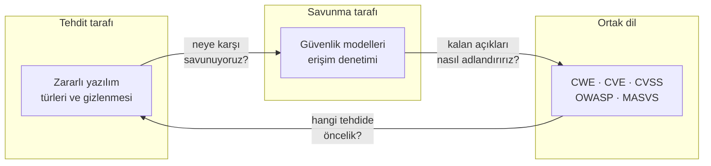
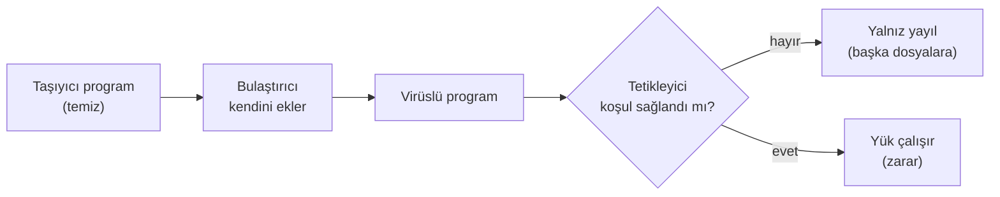
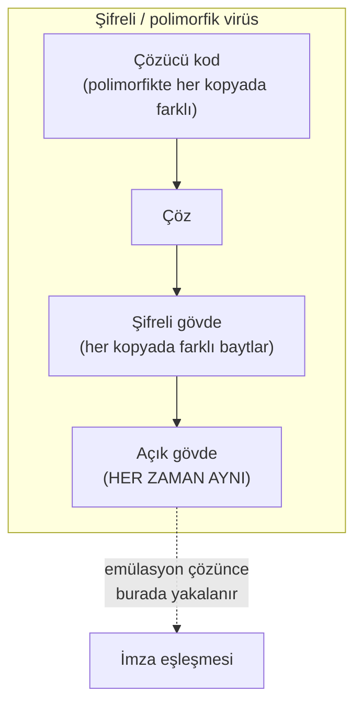
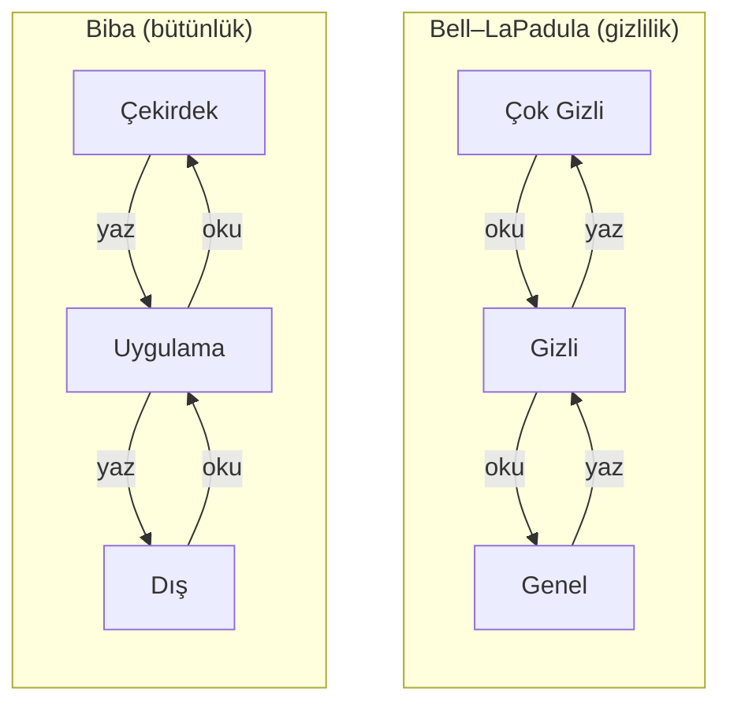
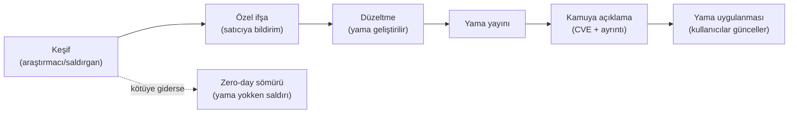

# Hafta 2 — Bilgisayar Virüsleri ve Güvenlik Modelleri

| | |
| --- | --- |
| **Tarih** | 25.09.2026 |
| **Öğrenme çıktısı** | ÖÇ.1 (yaygın yazılım güvenlik açıklarını tanımlar ve sınıflandırır) |
| **Süre** | 3 saat (3 × 50 dakika) |
| **Ön bilgi** | Hafta 1 (CIA, saldırgan modeli, STRIDE, saldırı ağacı); C'de dosya okuma; PowerShell ya da Linux terminalinde `cd`, `ls` |
| **Uygulamalar** | [`code/week-02`](https://github.com/ucoruh/cen429-secure-programming/tree/main/code/week-02) — 6 demo; Windows (MSVC), WSL ve Linux'ta çalışır |

<!-- materyal:basla -->

<div class="materyal" markdown>

[:material-file-pdf-box: Ders notu (PDF)](cen429-week-2-ders-notu.pdf){ .md-button download="cen429-week-2-ders-notu.pdf" }
[:material-file-word-box: Ders notu (DOCX)](cen429-week-2-ders-notu.docx){ .md-button download="cen429-week-2-ders-notu.docx" }
[:material-presentation: Sunum (PDF)](cen429-week-2-sunum.pdf){ .md-button download="cen429-week-2-sunum.pdf" }
[:material-microsoft-powerpoint: Sunum (PPTX)](cen429-week-2-sunum.pptx){ .md-button download="cen429-week-2-sunum.pptx" }
[:material-language-html5: Sunum (HTML, çevrimdışı)](cen429-week-2-sunum.html){ .md-button download="cen429-week-2-sunum.html" }
[:material-folder-zip: Tümünü indir (ZIP)](cen429-week-2-materyal.zip){ .md-button download="cen429-week-2-materyal.zip" }
[:material-fullscreen: Sunumu tam ekran aç](cen429-week-2-sunum.html){ .md-button .md-button--primary target=_blank }

</div>

<div class="sunum-cercevesi">
<iframe src="../cen429-week-2-sunum.html" title="Hafta 2 — Bilgisayar Virüsleri ve Güvenlik Modelleri" loading="lazy" allowfullscreen></iframe>
</div>

<p class="sunum-ipucu">Sunumun içine tıklayıp ok tuşlarıyla ilerleyin; tam ekran için sunumun sağ altındaki düğmeyi ya da yukarıdaki "Sunumu tam ekran aç" bağlantısını kullanın.</p>

<!-- materyal:bitis -->

!!! abstract "Bu haftanın sonunda şunları yapabileceksiniz"
    1. **Zararlı yazılımları** (virüs, solucan, truva atı, fidye yazılımı, rootkit, bot) davranışlarına göre
       ayırmak ve bir virüsün üç parçasını (bulaştırıcı, tetikleyici, yük) bir örnekte göstermek.
    2. Bir zararlının **neden ve nasıl gizlendiğini** (şifreleme, oligomorfizm, polimorfizm, metamorfizm)
       açıklamak ve bunun imza tabanlı tespiti neden zorlaştırdığını çalışan bir demoda görmek.
    3. **Karşı önlemleri** (imza, sezgisel, davranış tabanlı tespit, kum havuzu, emülasyon) ve her birinin
       yanlış pozitif/negatif sınırlarını tartışmak.
    4. Bir erişim politikasını **erişim denetim matrisi** ile yazmak; **DAC / MAC / RBAC** farkını söylemek.
    5. **Bell–LaPadula, Biba ve Clark–Wilson** modellerinin kurallarını ve neyi (gizlilik/bütünlük) koruduğunu
       bir simülatörde göstermek; **Unix ve Windows** erişim modelleriyle bağ kurmak.
    6. Bir zafiyeti **CWE** ailesine eşlemek, **CWE Top 25 / OWASP Top 10 / MASVS** listelerinin işlevini açıklamak.
    7. Bir açığa **CVSS v3.1** taban puanı vermek (v4.0 farkını bilmek) ve **CVE** kimliğiyle ilişkilendirmek.
    8. **Zafiyet yaşam döngüsünü** (keşif → ifşa → yama → kamuya açılma) ve **sorumlu ifşayı** anlatmak.

??? info "Ders akışı (öğretim üyesi için zaman planı)"
    | Zaman | Bölüm | Ne yapılıyor |
    | --- | --- | --- |
    | 0:00–0:10 | Isınma | Geçen hafta özeti; "kötü yazılım nedir, virüs mü her şey?" tartışması |
    | 0:10–0:50 | 1–3 | Zararlı yazılım tarihçesi, anatomisi ve türleri (anlatım + tartışma) |
    | 0:50–1:00 | Ara | |
    | 1:00–1:20 | 4 | Gizlenme (şifreleme → polimorfizm → metamorfizm), **Demo 1** ve **Demo 2** |
    | 1:20–1:40 | 5 | Karşı önlemler; **Demo 1**'in son adımları (sezgisel, emülasyon) — **sınıf etkinliği 1** |
    | 1:40–1:50 | 6 | Saldırı ağaçları, **Demo 4** |
    | 1:50–2:00 | Ara | |
    | 2:00–2:30 | 7–9 | Erişim matrisi, DAC/MAC/RBAC, BLP/Biba/Clark–Wilson, Unix/Windows — **Demo 3**, **Demo 6** |
    | 2:30–2:55 | 10–13 | CWE / OWASP / MASVS / CVE / CVSS / yaşam döngüsü — **Demo 5**, **sınıf etkinliği 2–3** |
    | 2:55–3:00 | Kapanış | Projeye katkı (S4'e CWE), kendini sınama, gelecek hafta |

!!! tip "Laboratuvarı önceden hazırlayın"
    Demolar hem **Windows** (Visual Studio 2022 Community, MSVC) hem **WSL/Linux** (GCC) üzerinde derlenir. Tek
    bir kaynak, iki platform: SHA-256 ve AES için Windows'ta işletim sisteminin BCrypt kütüphanesi, Linux'ta
    OpenSSL kullanılır (`code/common/cen429_kripto.h`); Windows'ta ayrıca OpenSSL kurmanız gerekmez.

    === "Windows (PowerShell)"
        ```powershell
        git clone https://github.com/ucoruh/cen429-secure-programming.git
        cd cen429-secure-programming\code
        .\build.ps1
        cd week-02\01-imza-tarayici ; .\demo.ps1
        ```

    === "WSL / Linux"
        ```bash
        sudo apt install -y build-essential cmake libssl-dev python3
        git clone https://github.com/ucoruh/cen429-secure-programming.git
        cd cen429-secure-programming/code && ./build.sh
        cd week-02/01-imza-tarayici && sh demo.sh
        ```

    Visual Studio ile: **Dosya > Aç > Klasör** → `code` → üstten **Windows (MSVC)** ya da **WSL (GCC)**
    yapılandırmasını seçin → **Derle > Tümünü Derle**. TOCTOU demosu (Demo 6) yalnız WSL/Linux'ta çalışır.

!!! warning "Etik kural — bu hafta özellikle önemli"
    Bu hafta zararlı yazılımı **kavramsal** olarak öğreniyoruz. **Hiçbir demoda gerçek zararlı yazılım, kendini
    çoğaltan kod, dosya silme/şifreleme ya da ağ saldırısı yoktur.** Bütün demolar yalnız kendi klasörlerinde,
    yönetici yetkisi olmadan çalışan **güvenli benzetimlerdir** (oyuncak bir dosya biçimi, bir simülatör, bir
    hesap makinesi). Öğrendiklerinizi **yalnız kendi bilgisayarınızda ve verilen demolar üzerinde** deneyin.
    Zararlı yazılım yazmak, yaymak ya da başkasının sistemine bulaştırmak suçtur.

---

## 1. Bu haftanın büyük resmi: tehdit, model, sınıflandırma

Geçen hafta güvenliğin dilini kurduk: varlık, tehdit, zafiyet, risk; saldırgan modeli; STRIDE ve saldırı ağacı.
Bu hafta o dilin üç sütununu dolduruyoruz:

- **Tehdit tarafı — zararlı yazılım:** Saldırganın en görünür aracı olan kötü yazılımı türlere ayıracağız
  (virüs, solucan, truva atı, fidye yazılımı) ve **nasıl gizlendiğini** göreceğiz. Çünkü bir savunmayı
  tasarlarken "bize karşı ne var?" sorusunun cevabının bir kısmı budur.
- **Savunma tarafı — güvenlik modelleri:** "Kim neye erişebilir?" sorusunu rastgele değil, **biçimsel bir
  modelle** yanıtlamayı öğreneceğiz (erişim matrisi, DAC/MAC/RBAC, Bell–LaPadula, Biba, Clark–Wilson). Bu
  modeller, işletim sistemlerinin (Unix, Windows) izin mimarisinin temelidir.
- **Ortak dil — sınıflandırma:** Bir açığı bulduğumuzda onu herkesin anladığı bir dille adlandırmalı ve
  ciddiyetini ölçebilmeliyiz. Bunun için **CWE** (açık türü), **CVE** (belirli açık), **CVSS** (ciddiyet puanı)
  ve **OWASP/MASVS** (öncelik listeleri) vardır.



Bu üçü birbirine bağlıdır: zararlı yazılımı tanımadan ona karşı model kuramaz, modeli kurmadan kalan açıkları
göremez, açıkları ortak bir dille adlandırmadan da hangi tehdide öncelik vereceğinizi bilemezsiniz.

!!! note "Bu dersin bakış açısı"
    Klasik "virüs dersi" antivirüs kullanmayı öğretir. Biz **programcı** gözüyle bakıyoruz: bir zararlının
    gizlenme yöntemi (polimorfizm, entropi) ile bizim kendi kodumuzu **koruma** yöntemimiz (kod gizleme,
    şifreli sabitler — 9. ve 11. hafta) çoğu zaman **aynı tekniklerdir**. Saldıran ve savunan aynı kutudan
    alet çıkarır; fark, niyet ve bağlamdadır.

---

## 2. Zararlı yazılım nedir? Kısa bir tarih

**Zararlı yazılım** (malware, "malicious software"), sahibinin izni ve bilgisi dışında zarar vermek, veri
çalmak, kaynak kullanmak ya da kontrolü ele geçirmek için yazılmış her programdır. "Virüs" günlük dilde bunların
hepsi için kullanılır; oysa virüs yalnızca **bir türdür**. Ayrımı görmek için önce birkaç dönüm noktasına bakalım.

| Yıl | Olay | Türü | Neden önemli? |
| --- | --- | --- | --- |
| 1971 | Creeper | Deneysel solucan | ARPANET'te kendini kopyalayan ilk deneysel program ("I'm the creeper") |
| 1984 | Fred Cohen'in tanımı | Kuram | Bilgisayar virüsünün ilk biçimsel tanımı ve "tam tespit imkânsızdır" kanıtı |
| 1986 | Brain | Önyükleme sektörü virüsü | İlk yaygın PC virüsü; disketin önyükleme sektörüne bulaşırdı |
| 1988 | Morris solucanı | Solucan | İnternette kendi kendine yayılan ilk büyük olay; binlerce makineyi yavaşlattı |
| 1999 | Melissa | Makro virüsü | Word belgeleri ve e-posta ile hızla yayıldı |
| 2000 | ILOVEYOU | Solucan/truva | E-posta ekiyle milyonlarca makineyi etkiledi; sosyal mühendislik gücü |
| 2001 | Code Red | Solucan | Web sunucusundaki bir taşma açığını kullanıp bellekte yayıldı |
| 2008 | Conficker | Solucan/bot | Milyonlarca makineden bir botnet kurdu |
| 2010 | Stuxnet | Hedefli solucan | Endüstriyel denetleyicileri (PLC) hedef aldı; devlet destekli sofistike saldırının simgesi |
| 2013+ | CryptoLocker | Fidye yazılımı | Dosyaları şifreleyip fidye isteme modelini yaygınlaştırdı |
| 2017 | WannaCry | Fidye + solucan | Bir ağ açığıyla kendi kendine yayılan fidye yazılımı; dünya çapında hastane/şirket etkiledi |
| 2017 | NotPetya | Yıkıcı (silici) | Fidye gibi görünüp aslında veriyi kalıcı yok eden, çok büyük ekonomik zarar veren saldırı |

!!! quote "Fred Cohen (1984) ve tespit sınırının kanıtı"
    Cohen, bir virüsü "kendini (belki değiştirerek) başka programlara kopyalayabilen program" olarak tanımladı
    ve önemli bir teorik sonuç gösterdi: **"Bu program bir virüs mü?" sorusunu her durumda doğru cevaplayan
    genel bir algoritma yazmak imkânsızdır** (durma probleminden indirgenir). Pratik sonucu şudur: hiçbir
    antivirüs %100 tespit edemez; her yöntemin yanlış pozitifleri (temizi yakalama) ve yanlış negatifleri
    (zararlıyı kaçırma) vardır. Bu hafta bunu [Demo 1](#4-yayilma-ve-gizlenme-nasil-fark-edilmez)'de kendi
    gözümüzle göreceğiz.

!!! info "Terim: 'in the wild' (doğada)"
    Bir zararlının gerçek kullanıcıların bilgisayarlarında dolaştığı, yalnız laboratuvarda değil sahada
    yayıldığı durum. Bu derste **hiçbir** doğadaki örnekle çalışmayız; yalnız kavramları ve güvenli benzetimleri
    kullanırız.

!!! quote "Gerçek olay: WannaCry (2017) — bir haftada bir programcı dersi"
    WannaCry, üç farklı konuyu tek olayda birleştirdiği için öğreticidir. (1) **Yayılma:** bir ağ dosya paylaşım
    protokolündeki bir taşma açığını (EternalBlue) kullanarak, kullanıcı hiçbir şey yapmadan, **solucan** gibi
    yayıldı — yani bu hafta göreceğimiz taşma sınıfı (Hafta 1) doğrudan bir solucanın motoru oldu. (2) **Yük:**
    ulaştığı makinelerde dosyaları **şifreleyerek** fidye istedi; işte bu yükün bıraktığı iz, [Demo
    2](#5-karsi-onlemler-nasil-yakalariz)'de göreceğimiz **entropi sıçramasıdır**. (3) **Yama boşluğu:** Kullanılan
    açığın yaması saldırıdan **haftalar önce** yayımlanmıştı; buna rağmen güncellememiş yüz binlerce makine
    (hastaneler, fabrikalar dahil) etkilendi. Programcı için üç ders: taşma açıkları teoride kalmaz, savunma
    davranışa da bakmalı, ve yama yayımlamak yeterli değildir — uygulanması gerekir. Bu üç iş parçacığı bu haftanın
    tam da omurgasıdır.

---

## 3. Zararlı yazılımın anatomisi ve türleri

### Bir virüsün üç parçası

Bir virüsü anlamanın en kolay yolu onu üç işleve ayırmaktır. Bir hastalık benzetmesiyle:

| Parça | İngilizcesi | İşi | Hastalık benzetmesi |
| --- | --- | --- | --- |
| **Bulaştırıcı** | infection mechanism | Kendini başka bir taşıyıcıya kopyalar | Virüsün hücreye girip çoğalması |
| **Tetikleyici** | trigger / logic bomb | "Ne zaman etkinleşeyim?" koşulu (tarih, sayaç, olay) | Kuluçka süresi |
| **Yük** | payload | Asıl zararı yapan kısım (veri sil, çal, şifrele) | Semptomlar |

Her üç parça da bulunmak zorunda değildir: yükü olmayan, yalnız yayılan bir virüs de vardır (yine de kaynak
tüketir ve bir zafiyettir). Tetikleyici koşulu bekleyen ve sonra patlayan koda **mantık bombası** (logic bomb)
denir.



### Türleri: yayılma biçimine göre

Zararlı yazılımları en yararlı biçimde **nasıl yayıldıklarına ve ne yaptıklarına** göre ayırırız:

=== "Virüs"
    Kendini **başka bir programa ya da dosyaya** iliştirir; çalışması için o taşıyıcının çalıştırılması
    (kullanıcı tarafından) gerekir. Alt türleri:

    - **Program (dosya) virüsü:** Çalıştırılabilir dosyalara (`.exe`, ELF) bulaşır; dosya çalışınca virüs de
      çalışır.
    - **Makro virüsü:** Ofis belgelerinin (Word, Excel) içindeki makro diline yazılır; belge açılınca çalışır.
      1999'da Melissa böyle yayıldı. Bugün de "makroları etkinleştir" tuzağı bir saldırı yoludur.
    - **Önyükleme sektörü virüsü:** Diskin ilk sektörüne (boot sector / MBR) bulaşır; bilgisayar açılırken
      işletim sisteminden **önce** çalışır. 1986'daki Brain böyleydi. Modern UEFI Secure Boot bu sınıfı büyük
      ölçüde zorlaştırdı.

=== "Solucan (worm)"
    Kendi başına, **taşıyıcıya ve kullanıcı etkileşimine ihtiyaç duymadan** ağ üzerinden yayılır. Genellikle
    bir ağ servisindeki bir açığı (ör. taşma) kullanır. Morris (1988), Code Red (2001), WannaCry (2017) böyle
    yayıldı. Solucanın tehlikesi **yayılma hızıdır**: dakikalar içinde yüz binlerce makineye ulaşabilir.

=== "Truva atı (trojan)"
    Yararlı ya da masum bir programmış gibi görünüp arka planda zarar veren yazılımdır. **Kendini kopyalamaz**;
    kullanıcının onu isteyerek çalıştırmasına güvenir (sosyal mühendislik). "Bedava oyun" ya da "sahte
    güncelleme" çoğu zaman truva atıdır.

=== "Fidye yazılımı (ransomware)"
    Kullanıcının dosyalarını **şifreleyip** çözme anahtarı için para isteyen yük türüdür. Solucan gibi yayılan
    (WannaCry) ya da truva atı gibi bulaşan türleri vardır. [Demo 2](#5-karsi-onlemler-nasil-yakalariz)'de
    fidye yazılımının bıraktığı **entropi izini** güvenle göreceğiz — hiçbir dosyayı gerçekten şifrelemeden.

=== "Diğerleri"
    - **Rootkit:** Kendini ve diğer zararlıları işletim sisteminden **gizler** (dosya, süreç, ağ bağlantısı
      listelerinden siler). Tespiti en zor sınıftır.
    - **Bot / botnet:** Uzaktan komut alan makineler ağı; DDoS, spam, kripto madenciliği için kullanılır.
    - **Casus yazılım (spyware) / reklam yazılımı (adware):** Veri toplar ya da reklam gösterir.
    - **Silici (wiper):** Fidye gibi görünüp veriyi **kalıcı yok eder** (NotPetya). Amaç para değil, yıkımdır.

!!! example "Sınıfta hızlı ayrım (3 dakika)"
    Aşağıdakiler hangi tür? (Cevaplar gizli kutuda.)

    1. E-posta ekindeki "fatura.pdf.exe" açılınca çalışıp adres defterindeki herkese kendini yollar.
    2. Bir web sunucusundaki taşma açığını kullanıp internetteki savunmasız sunuculara kendi kendine bulaşır.
    3. "Ücretsiz video oynatıcı" kurulunca arka planda tarayıcı parolalarını dışarı gönderir.
    4. Açılan dosyaları şifreler ve ekrana "ödeme yapın" notu bırakır.

    ??? success "Cevaplar"
        1. Solucan/truva karışımı (kullanıcı açar → yayılır) · 2. Solucan · 3. Truva atı (+ casus yazılım) ·
        4. Fidye yazılımı.

---

## 4. Yayılma ve gizlenme: nasıl fark edilmez?

Bir virüs yakalanmamak için sürekli **değişmeye** çalışır. Bunun dört aşamalı bir merdiveni vardır; her basamak
imza tabanlı tespiti biraz daha zorlaştırır:

| Yöntem | Ne değişir? | Antivirüs ne yapar? |
| --- | --- | --- |
| **Şifreleme** (encrypted) | Gövde her kopyada farklı anahtarla şifreli; **çözücü sabit** kalır | Sabit çözücüyü imzalar |
| **Oligomorfizm** | Çözücünün birkaç (onlarca) farklı biçimi var | Tüm çözücü biçimlerini imzalar |
| **Polimorfizm** | Çözücü her kopyada **yeniden üretilir** (sonsuz varyasyon), gövde şifreli | Çözemeye çalışır (emülasyon) |
| **Metamorfizm** | **Şifreleme yok**; kodun **tamamı** her kopyada yeniden yazılır (kayıt değişimi, çöp kod, komut değiştirme) | Davranışa bakar; çok zor |

Önemli fikir şudur: **şifreli gövde her kopyada bambaşka görünür ama çözüldüğünde hep aynıdır.** İşte bu yüzden
şifreli/paketli içeriğin bir belirtisi vardır: **yüksek entropi** (bkz. [Demo 2](#5-karsi-onlemler-nasil-yakalariz)).
Polimorfik virüste değişen çözücü de sonunda gövdeyi çözmek zorundadır; savunma tam bu noktaya —
**emülasyona** — dayanır.



### Demo 1 — İmza, polimorfizm, sezgisel analiz, emülasyon

!!! info "Demo 1 · `code/week-02/01-imza-tarayici` · Kitap: Tarif 12.1"
    Dört tarama yönteminin nasıl çalıştığını **ve nerede yetersiz kaldığını** çalışan kodla gösterir. Gerçek
    zararlı yazılım **yoktur**. Bunun yerine bu demo için uydurulmuş, **çalıştırılamayan** bir "KAPSÜL" veri
    biçimi kullanılır: sihirli başlık + bir "çözücü" komut satırı + (düz ya da karıştırılmış) gövde. Bu yapı
    gerçek şifreli/polimorfik zararlıların iskeletini taklit eder ama içinde yalnız zararsız metin vardır.

Kapsül biçimi (tamamen zararsız, kendi uydurduğumuz oyuncak biçim):

```text
KAPSUL/1
COZUCU: ALGO=xs32 TOHUM=1a2b3c4d UZUNLUK=3782 COZ
<3782 bayt karıştırılmış gövde...>
```

Örnek üretici altı dosya yazar: yakalanmış bir örnek (`ornek_a.bin`), onun **tek bayt farklı** bir kopyası ve
**aynı gövdenin** farklı anahtar/çözücülerle üç "polimorfik" kopyası. Şimdi her yöntemi sırayla deneyelim:

Derleyip çalıştırın (`code/` içinde `.\build.ps1` ya da `./build.sh`, sonra demo klasöründe):

=== "Windows"
    ```powershell
    cd code\week-02\01-imza-tarayici ; .\demo.ps1
    ```

=== "WSL / Linux"
    ```bash
    cd code/week-02/01-imza-tarayici && sh demo.sh
    ```

**Adım 2 — Hash (özet) imzası.** Dosyanın SHA-256 özetini veritabanındaki bir özetle karşılaştırır.

```text title="demo — Adım 2"
ADIM 2 — Hash (ozet) imzasi: birebir ayni dosyayi yakalar
  temiz.txt          TEMIZ      sha256=ce1f848e3795ae86...
  ornek_a.bin        YAKALANDI  Ornek.MaviKedi.A
  ornek_a_1bayt.bin  TEMIZ      sha256=a4220c8a0a41a9ff...
   ^ Tek bir bayt degisince ozet bambaska: hash imzasi atlatildi.
```

Hash imzası **kesindir ama kırılgandır**: tek bir bayt değişince özet tamamen değişir (çığ etkisi). Bu yüzden
saldırgan dosyaya anlamsız bir bayt eklemekle bile hash imzasını atlatır.

**Adım 3 — Desen (bayt dizisi) imzası.** Dosyanın içinde bilinen bir bayt dizisinin geçip geçmediğine bakar.

```text title="demo — Adım 3"
ADIM 3 — Desen (bayt dizisi) imzasi: kucuk degisikliklere dayanikli
  ornek_a.bin        YAKALANDI  Ornek.MaviKedi.A
  ornek_a_1bayt.bin  YAKALANDI  Ornek.MaviKedi.A
  poli_1.bin         YAKALANDI  Ornek.Cozucu.xs32
  poli_2.bin         YAKALANDI  Ornek.Cozucu.xs32
  poli_3.bin         TEMIZ
   ^ poli_1 ve poli_2 cozucu deseniyle yakalandi; cozucusu
     degisen poli_3 hic yakalanamadi.
```

Desen imzası tek bayt değişikliğine dayanıklıdır ve **çözücü kodunu** imzalayarak `poli_1`/`poli_2`'yi yakalar.
Ama çözücüsü de değişmiş olan `poli_3` (başka algoritma, farklı komut sırası) hiç yakalanamaz — işte
**polimorfizmin** imza tabanlı tespite karşı gücü budur.

**Adım 4 — Aynı gövde, farklı anahtar.** Üç polimorfik kopyanın ilk gövde baytları:

```text title="demo — Adım 4"
  poli_1.bin   ilk 16 govde bayti: 6f 57 bc 28 e2 81 dd 85 87 e1 f4 3d ...
  poli_2.bin   ilk 16 govde bayti: 83 b7 07 06 d8 38 3d 53 27 06 bc e8 ...
  poli_3.bin   ilk 16 govde bayti: bd 2c 85 32 f4 1f 3a 57 7f 6b 08 c0 ...
```

Üçü de **aynı zararsız gövdeyi** taşır ama baytları tamamen farklıdır. Bir imza yazmak imkânsıza yakındır.

**Adım 5 — Sezgisel (heuristic) analiz.** İmza yoksa **şüpheli özelliklere** puan verir: yüksek entropi (+50),
gövdeden önce çalışan çözücü kod (+30), anlamsız "çöp" komutlar (+20).

```text title="demo — Adım 5"
  temiz.txt          TEMIZ      puan=  0 H=4.29
  ornek_a.bin        TEMIZ      puan=  0 H=4.71
  poli_1.bin         SUPHELI    puan= 80 H=7.95 entropi cozucu
  poli_3.bin         SUPHELI    puan=100 H=7.95 entropi cozucu cop-komut
  arsiv.bin          SUPHELI    puan= 50 H=7.88 entropi
   ^ arsiv.bin zararsiz yuksek-entropili dosya: YANLIS POZITIF.
     ornek_a.bin ise sezgisel olarak gozden kacti (yanlis negatif).
```

Sezgisel analiz polimorfik kopyaları imza olmadan yakaladı — ama iki hata yaptı: zararsız, yüksek entropili bir
dosyayı (`arsiv.bin`) **şüpheli** işaretledi (**yanlış pozitif**) ve düz gövdeli `ornek_a.bin`'i kaçırdı
(**yanlış negatif**). İşte Cohen'in dediği belirsizlik burada.

**Adım 6 — Emülasyon.** Kapsülün çözücüsünü **güvenli bir "sanal makinede"** çalıştırır (gerçek makine kodu
değil, 6 komutluk oyuncak bir dil), çözülen gövdeyi yeniden desenle tarar:

```text title="demo — Adım 6"
  temiz.txt          TEMIZ      kapsul degil
  ornek_a.bin        YAKALANDI  Ornek.MaviKedi.A | cozucu yok (duz govde)
  poli_1.bin         YAKALANDI  Ornek.MaviKedi.A | 5 komut, 0 BOS, xs32
  poli_2.bin         YAKALANDI  Ornek.MaviKedi.A | 5 komut, 0 BOS, xs32
  poli_3.bin         YAKALANDI  Ornek.MaviKedi.A | 8 komut, 4 BOS, lcg8
  arsiv.bin          TEMIZ      kapsul degil
```

Emülasyon **hepsini** yakaladı: gövdeyi çözünce üç polimorfik kopya da aynı imzaya döndü. Gerçek antivirüsler de
şüpheli dosyayı yalıtılmış bir sanal ortamda "çalıştırıp" çözülmüş halini tarar. Bu güçlüdür ama pahalıdır ve
zararlı bunu anlarsa (anti-emülasyon) gizlenebilir.

!!! success "Ders"
    Tek bir yöntem yetmez. Modern korumalar **katmanlıdır**: hash (hızlı, kesin) → desen (dayanıklı) → sezgisel
    (imzasız) → emülasyon/kum havuzu (derin) → davranış izleme (çalışırken). Her katman bir öncekinin kaçırdığını
    yakalamak içindir — tıpkı geçen haftaki **derinlemesine savunma** gibi.

!!! note "Sahada nasıl uygulanır?"
    Kendi kodunuzu koruma açısından madalyonun öbür yüzü: bir mobil ödeme uygulaması, tersine mühendisliği
    zorlaştırmak için hassas dizeleri ve sabitleri **şifreli** tutar, kullanım anında çözer. Yani meşru bir
    yazılım da "şifreli gövde + çözücü" desenini kullanır (9. ve 11. hafta). Fark, bunun sizin varlığınızı
    koruması; virüste ise imzadan kaçmasıdır. Bir güvenlik değerlendiricisi tam bu yüzden **yüksek entropili
    bölgeleri** arar: "burada şifreli bir şey var, çözücü nerede, anahtarı nasıl buluyor?"

!!! danger "Sık yapılan hata"
    "İmza veritabanım güncel, o hâlde güvendeyim" düşüncesi. İmza tabanlı tespit **yalnız bilinen** zararlıyı
    yakalar; polimorfik/metamorfik ya da hiç görülmemiş (zero-day) bir örnek imzayı atlatır. Bu yüzden savunma
    imzayla **başlar ama bitmez**.

---

## 5. Karşı önlemler: nasıl yakalarız?

Yukarıdaki demoda dört yöntemi gördük. Şimdi bütün karşı önlem ailesini toparlayalım:

| Yöntem | Nasıl çalışır? | Güçlü yanı | Zayıf yanı |
| --- | --- | --- | --- |
| **İmza tabanlı** | Bilinen zararlının özeti/deseni aranır | Hızlı, düşük yanlış pozitif | Bilinmeyeni ve polimorfiği kaçırır |
| **Sezgisel (heuristic)** | Şüpheli özelliklere puan verilir | İmzasız yeni örnekleri bulur | Yanlış pozitif/negatif üretir |
| **Davranış tabanlı** | Program **çalışırken** yaptıkları izlenir (dosya şifreleme, kanca, ağ) | Gizlenmeye dirençli | Zararın bir kısmı olabilir; kaçınma teknikleri var |
| **Kum havuzu (sandbox)** | Şüpheli dosya yalıtılmış ortamda çalıştırılır | Gerçek davranışı görür | Yavaş; zararlı "sanal makinedeyim" diye anlayıp uyuyabilir |
| **Emülasyon** | Kod, kumhavuzu gibi ama daha hafif bir simülatörde adımlanır | Çözücüyü açar | Anti-emülasyon teknikleriyle atlatılabilir |
| **İtibar / bulut** | Dosyanın yaygınlığı, kaynağı, imzası sorgulanır | Hızlı yayılan tehdide iyi | Gizlilik ve bağlantı gerektirir |

Modern uç nokta koruma (EDR/XDR) bunların hepsini birleştirir ve özellikle **davranışa** ağırlık verir. Örneğin
"kısa sürede yüzlerce dosyayı okuyup yüksek entropili haliyle geri yazan süreç" neredeyse kesin bir fidye
yazılımı belirtisidir — dosyaların **içine bakmadan**, yalnız davranıştan.

!!! note "Sahada nasıl uygulanır? — savunma ve saldırı aynı alet kutusu"
    Bir zararlının gizlenmek için kullandığı teknikler ile meşru bir yazılımın **kendini korumak** için
    kullandığı teknikler çoğu zaman aynıdır. Bir mobil ödeme kütüphanesi, tersine mühendisliği yavaşlatmak için
    hassas dizeleri şifreli tutar ve çalışma anında çözer (Hafta 9, 11); bu tam da polimorfik bir zararlının
    "şifreli gövde + çözücü" desenidir. Fark **niyet ve bağlamdadır**: biri sizin varlığınızı korur, diğeri
    imzadan kaçar. Bu yüzden bir güvenlik değerlendiricisi ikili dosyanızda yüksek entropili bölgeler gördüğünde
    "burada şifreli bir şey var" der ve doğal soruyu sorar: çözücü nerede, anahtarı nereden alıyor, anahtar
    bellekte ne kadar açık kalıyor? Aynı entropi ölçümü, hem bir antivirüsün "paketli mi?" sorusunun hem de bir
    değerlendiricinin "korumanız gerçek mi?" sorusunun aracıdır. Bu simetriyi görmek, dönem boyunca işleyeceğimiz
    koruma yöntemlerinin neden hem saldırganı hem savunmacıyı ilgilendirdiğini açıklar.

### Demo 2 — Entropi ölçer: şifreli/paketli içerik nasıl anlaşılır?

!!! info "Demo 2 · `code/week-02/02-entropi` · Kitap: Tarif 12.1"
    Shannon entropisini (0 = tekdüze, 8 = rastgele bit/bayt) kendi dosyalarımız üzerinde ölçer. Hiçbir dosyaya
    dokunmaz, yalnız okur.

$$
H = -\sum_{b=0}^{255} p(b)\,\log_2 p(b)
$$

Burada \(p(b)\), `b` baytının dosyadaki görülme olasılığıdır. Düz metin az sayıda karakteri sık kullanır (düşük
H); şifreli/sıkışık veri tüm baytları eşit kullanır (H ≈ 8).

=== "Windows"
    ```powershell
    cd code\week-02\02-entropi ; .\demo.ps1
    ```

=== "WSL / Linux"
    ```bash
    cd code/week-02/02-entropi && sh demo.sh
    ```

Örnek dosyalar iki platformda da aynı biçimde üretilir (harici araç gerekmez): tekdüze, düz metin, makine kodu
benzeri sentetik veri, AES-256-GCM ile şifreli ve rastgele dosyalar.

```text title="demo — Adım 1 ve 2"
ADIM 1 — Farkli turde dosyalarin entropisi (0 = tekduze, 8 = rastgele)
  tekduze.txt      4096  0.00 |........................| tekduze
  belge.txt        3360  4.17 |#############...........| dusuk
  kod.bin          2048  6.23 |###################.....| orta
  sifreli.bin      3376  7.95 |########################| YUKSEK
  rastgele.bin     4096  7.95 |########################| YUKSEK

ADIM 2 — Ayni icerik uc halde: duz -> makine-kodu-benzeri -> sifreli
  belge.txt        3360  4.17 |#############...........| dusuk
  kod.bin          2048  6.23 |###################.....| orta
  sifreli.bin      3376  7.95 |########################| YUKSEK
   ^ Sifreli ve rastgele veri entropiye bakarak AYIRT EDILEMEZ.
```

İki önemli sonuç: (1) Entropi tek başına "zararlı mı?" sorusunu **yanıtlamaz** — şifreli, sıkıştırılmış ve
rastgele veri hep 8'e yakındır; bir `.zip` ya da `.png` de öyle. Düz metin düşük (~4), derlenmiş makine kodu
orta (~6) çıkar. (2) Ama **beklenmedik yerde** yüksek entropi bir ipucudur. Adım 3 bunu gösterir: bir metnin
ortasına gizlenmiş şifreli bölüm, pencereli taramada "sıcak bölge" olarak ortaya çıkar — paketlenmiş
programlarda da tipik olan "küçük açıcı kod + yüksek entropili gövde" deseni.

```text title="demo — Adım 3 (kısaltılmış)"
    1024-  1535  4.14 |#################...............| dusuk
    1536-  2047  7.56 |##############################..| YUKSEK   <-- gizli bölge
    2048-  2559  7.66 |###############################.| YUKSEK
    3072-  3583  4.17 |#################...............| dusuk
```

!!! note "Değerlendirici nasıl test eder?"
    Bir güvenlik laboratuvarı, ikili dosyanızı bölümlere ayırıp her bölümün entropisini ölçer. `.text` (kod)
    bölümü beklenenden çok yüksekse "burası paketli/şifreli" der ve açıcıyı arar. Sizin projenizde şifreli
    sabitler kullanıyorsanız bu normaldir; ama **anahtarın** düşük entropili ve tahmin edilebilir bir yerde
    durması bir bulgudur. Yani "şifreledim, bitti" yetmez; anahtarın nerede durduğu kritiktir (3. ve 11. hafta).

!!! example "Sınıf etkinliği 1 — Yöntemleri kıyasla (10 dakika)"
    Demo 1'i açık tutun. Üç grup, üç soruyu tartışıp bir cümleyle yanıtlasın:

    1. Bir saldırgan yalnızca **hash** imzası kullanan bir antivirüsü nasıl atlatır? (En ucuz yol nedir?)
    2. **Desen** imzasını atlatmak neden daha pahalıdır? Polimorfizm burada ne sağlar?
    3. **Emülasyonu** atlatmak için zararlı ne yapabilir? (İpucu: "sanal makinedeyim" nasıl anlar?)

---

## 6. Saldırı ağaçları

Saldırı ağacını geçen hafta çizmiştik; bu hafta **niceliğe** dökeceğiz. Kök, saldırganın hedefidir; dallar ona
ulaşma yollarıdır. **VEYA** düğümünde bir dal yeter, **VE** düğümünde hepsi gerekir. Her yaprağa bir **maliyet**
(gün-adam, ekipman, uzmanlık) yazarsak, ağacı aşağıdan yukarı çözerek **en ucuz saldırıyı** bulabiliriz:

- VEYA düğümü: çocukların **en ucuzu** (saldırganın işine gelen).
- VE düğümü: çocukların **toplamı** (hepsi gerektiği için).

### Demo 4 — Saldırı ağacı maliyet hesaplayıcı

!!! info "Demo 4 · `code/week-02/04-saldiri-agaci`"
    Girintiyle yazılmış bir saldırı ağacını okur, her düğümün en ucuz maliyetini hesaplar ve savunulacak en
    zayıf zinciri yazar. Hiçbir saldırı yapmaz; yalnız sayı toplar.

Windows: `cd code\week-02\04-saldiri-agaci ; .\demo.ps1` · WSL/Linux:
`cd code/week-02/04-saldiri-agaci && sh demo.sh` (önce `code/` içinde bir kez derleyin).

```text title="demo — Adım 1 (kısaltılmış)"
  [VEYA] Odeme anahtarini ele gecir  (maliyet=2)
    [VE] Yerel veritabanini kopyala ve coz [hepsi gerekir]  (maliyet=9)
    [VEYA] Kullanim aninda bellekten oku [biri yeter]  (maliyet=2)
      Hata ayiklayici ile bellekten oku  (maliyet=2)
    [VE] Sunucu ile telefon arasinda dinle [hepsi gerekir]  (maliyet=15)

  EN UCUZ SALDIRI = 2 birim. ... en zayif nokta:
  -> Kullanim aninda bellekten oku -> Hata ayiklayici ile bellekten oku
```

En ucuz yol **2 birim**: bellekteki anahtarı okumak. İkinci ağaç, bu dala **RASP** (hata ayıklayıcı ve kanca
algılama — 6. hafta) eklendiğinde ne olduğunu gösterir:

```text title="demo — Adım 2 (kısaltılmış)"
  [VEYA] Odeme anahtarini ele gecir  (maliyet=8)
    [VEYA] Kullanim aninda bellekten oku [biri yeter]  (maliyet=8)
      Bellek dokumu (rastgele silme'yi as)  (maliyet=8)
  EN UCUZ SALDIRI = 8 birim.
```

Savunma, en ucuz saldırıyı **2'den 8'e** çıkardı; en zayıf nokta değişti. Bu, güvenlik yatırımını **sayıyla**
gerekçelendirmenin yoludur: "Şu önlem, en ucuz saldırıyı 4 kat pahalılaştırıyor." VE düğümleri saldırganı birden
çok katmanı birlikte kırmaya zorlar — derinlemesine savunmanın niceliksel karşılığı.

!!! tip "Projeye bağlantı"
    Dönem projenizin **S4** bölümünde bir saldırı ağacı çizeceksiniz. Bu demonun girdi biçimini kullanıp kendi
    ağacınızı yazın; en ucuz yolu bulun ve oraya hangi önlemin en çok maliyet eklediğini gösterin.

---

## 7. Erişim denetimi: kim, neye, ne yapabilir?

Şimdi savunma tarafına geçiyoruz. Güvenliğin en temel sorularından biri: **"Bu özne, bu nesne üzerinde bu işlemi
yapabilir mi?"** Bunu üç kavramla düzenleriz:

- **Özne (subject):** işlemi yapan (kullanıcı, süreç).
- **Nesne (object):** üzerinde işlem yapılan (dosya, kayıt, bellek).
- **Hak/izin (right):** yapılabilen işlem (oku, yaz, çalıştır).

### Erişim denetim matrisi

En genel model, satırların özne, sütunların nesne olduğu ve her hücrede izinlerin yazdığı bir **matristir**:

| | `odeme_anahtari` | `gunluk` |
| --- | --- | --- |
| **uygulama** | — | yaz |
| **kutuphane** | oku, yaz | yaz |
| **saldirgan** | — | — |

Bu matris kavramsaldır; gerçekte iki biçimde saklanır:

- **Erişim denetim listesi (ACL):** Matris **sütun sütun** saklanır — her nesne "bana kimler erişebilir"
  listesini tutar. Unix dosya izinleri ve Windows DACL böyledir.
- **Yetenek (capability):** Matris **satır satır** saklanır — her özne "nelere erişebilirim" biletlerini tutar.

### DAC, MAC, RBAC

| Model | Kim karar verir? | Örnek | Güçlü/zayıf |
| --- | --- | --- | --- |
| **DAC** (isteğe bağlı) | **Nesnenin sahibi** izinleri belirler | Unix `chmod`, Windows DACL | Esnek; ama sahip yanlış izin verirse ya da bir program kandırılırsa ("confused deputy") sızıntı olur |
| **MAC** (zorunlu) | **Sistem/politika** belirler; sahip değiştiremez | Bell–LaPadula, Biba, SELinux | Katı, sızıntıyı sistemsel önler; yönetimi zor |
| **RBAC** (rol tabanlı) | İzinler **rollere** verilir, kullanıcılar role atanır | "Muhasebeci" rolü | Ölçeklenir; büyük kurumların standart yöntemi |

Gerçek sistemler bunları **birlikte** kullanır: DAC sahibin isteğini, MAC sistemin zorunlu sınırını, RBAC de
yönetim kolaylığını sağlar. Etkin karar genellikle **hepsinin kesişimidir** ("hem sahip izin vermeli hem sistem
politikası izin vermeli").

### Demo 3 — Erişim matrisi ve model simülatörü (bölüm 8 ile birlikte)

Bu demoyu bir sonraki bölümde biçimsel modellerle birlikte çalıştıracağız; ama ilk adımı **salt DAC matrisidir**:

Windows: `cd code\week-02\03-erisim-modeli ; .\demo.ps1` · WSL/Linux:
`cd code/week-02/03-erisim-modeli && sh demo.sh`.

```text title="demo — Adım 0 (salt DAC)"
ADIM 0 — Salt DAC (erisim denetim matrisi): karar sahibin izninde
  kutuphane(D   ) OKU odeme_anahtari(D   )  DAC:VAR ...  => IZIN
  uygulama(D   ) OKU odeme_anahtari(D   )  DAC:yok ...  => RED
  saldirgan(D   ) OKU odeme_anahtari(D   )  DAC:yok ...  => RED
   ^ uygulama OKU odeme_anahtari: matriste yok -> RED (en az ayricalik)
```

Matriste hakkı olmayan hiçbir özne erişemez — **en az ayrıcalık** ilkesinin doğrudan uygulaması. Uygulamanın
bile ödeme anahtarına doğrudan erişimi yoktur; yalnız güvenlik kütüphanesi erişebilir.

---

## 8. Biçimsel güvenlik modelleri

DAC "sahip ne derse o" der; ama bu bir sızıntıyı **sistemsel** olarak önleyemez. Örneğin gizli bir belgeyi
okuyabilen bir program, o bilgiyi herkese açık bir dosyaya yazabilir — DAC buna engel değildir. **Zorunlu
(MAC)** modeller tam bu boşluğu kapatır. Üç klasik modeli göreceğiz.

### Bell–LaPadula (BLP) — gizlilik

1973'te askeri gizlilik için tasarlandı. Nesnelere ve öznelere **gizlilik seviyeleri** verilir (Genel < Gizli <
Çok Gizli). İki kural:

- **Basit güvenlik özelliği ("yukarı okuma yok"):** Bir özne, kendi seviyesinden **daha gizli** bir nesneyi
  **okuyamaz**. (Memur çok gizli belgeyi göremez.)
- **Yıldız (\*) özelliği ("aşağı yazma yok"):** Bir özne, kendi seviyesinden **daha az gizli** bir nesneye
  **yazamaz**. (General, çok gizli bilgiyi genel bir belgeye yazıp sızdıramaz.)

Özetle BLP **"read down, write up"** der: aşağıyı oku, yukarı yaz. Amacı **gizliliği** korumaktır.

### Biba — bütünlük

1977'de Biba, BLP'yi **tersine çevirdi**. Bu kez seviyeler **güvenilirlik/bütünlük** düzeyidir (Dış < Uygulama <
Çekirdek). Kurallar simetriktir:

- **"Aşağı okuma yok":** Bir özne, kendinden **daha az güvenilir** bir nesneyi **okuyamaz**. (İş mantığı,
  doğrulanmamış dış girdiye doğrudan güvenmez.)
- **"Yukarı yazma yok":** Bir özne, kendinden **daha güvenilir** bir nesneye **yazamaz**. (Ağdan veri alan
  bileşen, imzalı yapılandırmayı bozamaz.)

Yani Biba **"read up, write down"** der ve **bütünlüğü** korur: kirli veri, temiz veriyi bozamaz.



!!! note "İki model, ters yön"
    BLP "gizli bilgi aşağı sızmasın" der (yukarı okumayı, aşağı yazmayı yasaklar). Biba "kirli bilgi yukarı
    çıkmasın" der (aşağı okumayı, yukarı yazmayı yasaklar). Bir veri hem gizli hem güvenilir olmalıysa (ikisi
    birden), o veri yalnız **kendi seviyesinde** işlenebilir — bu, çoğu pratik tasarımın vardığı sonuçtur.

### Clark–Wilson — ticari bütünlük

1987'de Clark ve Wilson, banka gibi **ticari** sistemler için farklı bir bütünlük modeli önerdi. Askeri
seviyeler yerine **iyi biçimli işlemler** ve **görev ayrılığı** üzerine kuruludur:

- **Kısıtlı veri öğeleri (CDI):** Bütünlüğü korunması gereken veriler (hesap bakiyesi).
- **Dönüşüm yordamları (TP):** CDI'yi yalnız **onaylı, iyi biçimli işlemler** değiştirebilir (doğrudan yazma
  yok). Örneğin bakiye ancak "para yatır/çek" yordamıyla değişir.
- **Bütünlük doğrulama yordamları (IVP):** Verinin tutarlı olduğunu düzenli olarak denetler ("borç = alacak").
- **Görev ayrılığı (separation of duty):** İşlemi başlatan ile onaylayan farklı kişilerdir.

Clark–Wilson'ın ruhu bugünkü yazılıma doğrudan geçer: **veriye doğrudan değil, doğrulanmış işlemlerle dokun;
kritik adımı tek kişiye/tek yola bağlama.** Geçen haftaki "ayrıcalıkların ayrılması" ilkesinin biçimsel halidir.

!!! note "Sahada nasıl uygulanır? — modellerin kod karşılığı"
    Bu modeller soyut görünse de günlük kodda karşılıkları vardır. **Biba** ilkesi, "dışarıdan gelen veriye
    doğrudan güvenme" demektir; pratikte bu, her dış girdiyi **güvenilmez** kabul edip doğrulama katmanından
    geçirmektir (Hafta 1'deki girdi doğrulama). **Bell–LaPadula**'nın "aşağı yazma yok" kuralı, bir mobil ödeme
    kütüphanesinde "hassas bir anahtarı, daha az korunan bir günlüğe ya da panoya (clipboard) yazma" yasağına
    dönüşür — sırların yanlışlıkla düşük güvenlikli bir kanala sızmasını önler. **Clark–Wilson**'ın "iyi biçimli
    işlem" fikri, bir bakiyeyi ya da işlem sayacını **doğrudan** güncellemek yerine yalnız denetlenen bir
    fonksiyon üzerinden değiştirmektir; sayacın atlanması ya da geri sarılması bu sayede tek bir yerde
    engellenebilir.

!!! note "Değerlendirici nasıl test eder? — erişim ve yetki"
    Bir bağımsız değerlendirici, kodunuzda "kim neye erişebiliyor?" sorusunu somutça sınar: en az ayrıcalık
    gerçekten uygulanmış mı, yoksa her bileşen gereğinden fazla yetkiyle mi çalışıyor? Bir bileşen düşürülse
    (compromise) diğerlerine ne kadar ulaşabilir (yanal hareket)? Hassas bir işlem tek bir bayrağa/tek bir dala
    mı bağlı — yani bir baytı değiştirerek atlatılabilir mi? Bu sorular doğrudan sizin **arayüz ve varlık
    tablonuza** (S3, S5) ve **saldırgan modelinize** (S4) bakılarak yanıtlanır; listede olmayan bir yetki yolu,
    denetlenmeyen bir yol demektir.

| Model | Yıl | Korur | Ana fikir |
| --- | --- | --- | --- |
| Bell–LaPadula | 1973 | Gizlilik | Yukarı okuma yok, aşağı yazma yok |
| Biba | 1977 | Bütünlük | Aşağı okuma yok, yukarı yazma yok |
| Clark–Wilson | 1987 | Bütünlük (ticari) | İyi biçimli işlem + görev ayrılığı + denetim |

### Demo 3 — Modelleri karşılaştır

```text title="demo — Adım 1 (Bell–LaPadula)"
  memur  (Gene) OKU operasyon(CokG)  DAC:VAR BLP:RED ...  => RED
  general(CokG) YAZ ilan     (Gene)  DAC:VAR BLP:RED ...  => RED
   ^ memur OKU operasyon: yukari okuma -> RED (gizli bilgiyi goremez)
     general YAZ ilan: asagi yazma -> RED (sizinti onlenir)
```

```text title="demo — Adım 2 (Biba)"
  aglayici(Dis ) YAZ kayit    (Uygu)  ... BIBA:RED  => RED
  islemci(Uygu) OKU gelen    (Dis )  ... BIBA:RED  => RED
   ^ aglayici YAZ kayit: yukari yazma -> RED (kirli veri temizi bozmasin)
     islemci OKU gelen: asagi okuma -> RED (guvenilmez girdiye guvenme)
```

Dikkat edin: DAC her iki durumda da **VAR** (sahip izin vermiş); zorunlu modeli devreye sokan **sistemdir**.
Etkin karar `DAC VE MAC` olduğu için, sahip izin verse bile model reddedebilir. Politika dosyalarını
(`politika-gizlilik.txt`, `politika-butunluk.txt`) açıp kendi kurallarınızı yazabilirsiniz.

!!! example "Sınıf etkinliği 2 — Modeli seç (10 dakika)"
    Aşağıdaki sistemlerde hangi model uygundur, neden?

    1. Bir hastanenin hasta kayıtları (kimse yetkisi olmadan **görmemeli**).
    2. Bir uçağın uçuş kontrol yazılımı (dışarıdan gelen veri kritik komutları **bozmamalı**).
    3. Bir bankanın hesap defteri (yalnız onaylı işlemlerle değişmeli, kayıt tutulmalı).

    ??? success "Cevaplar"
        1. Bell–LaPadula (gizlilik) · 2. Biba (bütünlük) · 3. Clark–Wilson (iyi biçimli işlem + denetim).

---

## 9. Unix ve Windows erişim denetimi modelleri

Bu klasik modeller kâğıt üzerinde kalmadı; işletim sistemlerinin izin mimarisi onların pratik halidir.

### Unix modeli (Tarif 2.1)

Unix, DAC'ı **kullanıcı/grup kimlikleri** ve **izin bitleriyle** uygular. Her sürecin üç kimliği vardır:
**effective** (izin denetimlerinde kullanılan), **real** (gerçek sahip) ve **saved** (geçici düşürüp geri
almak için). Her dosyanın üç grup izin biti vardır — sahip, grup, diğerleri — her birinde oku/yaz/çalıştır:

```text
 -rwxr-x---   sahip: rwx   grup: r-x   diğerleri: ---
  │└┬┘└┬┘└┬┘
  │ │  │  └─ diğerleri (herkes): izin yok
  │ │  └──── grup: oku + çalıştır
  │ └─────── sahip: oku + yaz + çalıştır
  └───────── dosya türü (- = normal dosya)
```

Ek olarak **setuid/setgid** bitleri (program, sahibinin yetkisiyle çalışır) ve **sticky** biti (`/tmp` gibi
paylaşılan dizinlerde başkasının dosyasını silememe) vardır. `setuid root` bir program, çalıştıran kim olursa
olsun **root yetkisiyle** çalışır — güçlü ama tehlikeli; geçen haftaki "en az ayrıcalık" bu yüzden kritiktir.

!!! danger "TOCTOU: Unix erişim denetiminin klasik tuzağı"
    Bir program "bu dosyaya yazmam güvenli mi?" diye **önce denetleyip sonra açarsa**, iki işlem arasında
    saldırgan dosyayı bir sembolik bağla değiştirebilir. Buna **TOCTOU** (Time-Of-Check, Time-Of-Use;
    **CWE-367**) denir. Kitabın Tarif 2.3'ü tam bu yarışı anlatır. [Demo 6](#demo-6-toctou-yaris-durumu)'da
    bunu güvenle göreceğiz.

### Windows modeli (Tarif 2.2)

Windows daha ayrıntılı bir **ACL** modeli kullanır. Her nesnenin (dosya, kayıt defteri anahtarı, mutex) bir
güvenlik tanımlayıcısı vardır. İki liste bulunur:

- **DACL** (Discretionary ACL): **erişim** kurallarını tutar — kim ne yapabilir. Bir dizi **ACE** (erişim
  denetim girdisi) içerir; her ACE bir **SID** (kullanıcı/grup kimliği), bir hak ve "izin ver / reddet"
  bilgisidir.
- **SACL** (System ACL): **denetim** kurallarını tutar — hangi erişimler günlüğe yazılsın.

Önemli bir tuzak: **NULL DACL** (hiç girdisi olmayan liste) "herkese tam yetki" demektir — asla iyi bir fikir
değildir. Windows en iyi eşleşen ACE'yi seçer; "reddet" girdileri genellikle "izin ver"den önce değerlendirilir.

| Kavram | Unix | Windows |
| --- | --- | --- |
| Kimlik | UID / GID | SID |
| İzin taşıyıcı | Mod bitleri (rwx × 3) | DACL içindeki ACE'ler |
| Denetim (audit) | syslog (harici) | SACL (yerleşik) |
| "Herkese açık" tehlikesi | `chmod 777` | NULL DACL |
| Yetki yükseltme | setuid | Öykünme (impersonation), token |

Modern Windows ayrıca **bütünlük seviyeleri** (Mandatory Integrity Control) ve **AppContainer** ile Biba'ya
benzer zorunlu sınırlar ekler — yani biçimsel modeller pratikte hâlâ yaşıyor.

### Demo 6 — TOCTOU yarış durumu

!!! info "Demo 6 · `code/week-02/06-toctou` · CWE-367 · Kitap: Tarif 2.3"
    Bir "günlük yazıcısı", yazmadan önce "hedef güvenli mi?" diye denetler. **Güvensiz** sürüm önce `lstat()`
    ile bakıp sonra `fopen()` ile açar; iki işlem arasında hedef bir sembolik bağla değiştirilirse başka dosyaya
    yazar. **Güvenli** sürüm `O_NOFOLLOW` ile açar ve sembolik bağı reddeder. Her şey demo klasöründeki
    `calisma/` altında olur; hiçbir sistem dosyasına dokunulmaz.

WSL / Linux (bu demo yalnız burada çalışır): `cd code/week-02/06-toctou && sh demo.sh` (önce `code/` içinde
`./build.sh`). Windows'ta `.\demo.ps1` WSL'de nasıl çalıştıracağınızı yazar.

```text title="demo (kısaltılmış)"
ADIM 1 — GUVENSIZ surum: once denetle, sonra ac (yaris acigi)
  guvensiz: 'SAHTE-KAYIT-...' -> calisma/gunluk.txt (yazildi)
  --- Sonuc: gizli_hedef.txt icerigi ---
    iceride onemli veri var
    SAHTE-KAYIT-tarafimizca-eklendi
  >>> SALDIRI BASARILI: yaziyi baska dosyaya yonlendirdik!

ADIM 2 — GUVENLI surum: O_NOFOLLOW ile tek adimda ac
  reddedildi: hedef sembolik bag (O_NOFOLLOW)
  >>> Saldiri engellendi: gizli_hedef.txt bozulmadi.
```

!!! success "Kural"
    Denetim ile kullanımı **tek atomik adımda** yapın: dosyayı `O_NOFOLLOW`/`O_EXCL` ile açın ve **açık
    tanıtıcı (fd) üzerinden** çalışın; adla (path) tekrar tekrar işlem yapmayın. Geçici dosya için `mkstemp`
    kullanın (CWE-377). Bu, "önce `access()` sonra `open()`" kalıbının yerine geçer.

---

## 10. Yazılım güvenlik açıklarının sınıflandırılması: CWE

Bir açık bulduğunuzda onu **adlandırmalısınız** ki başkaları anlasın, tekrar bulunmasın ve önlem alınabilsin.
İlk araç **CWE**'dir (Common Weakness Enumeration): MITRE'ın yürüttüğü, **zayıflık türlerinin** numaralı
kataloğu. CVE belirli bir üründeki belirli bir açıksa, CWE onun **türüdür**.

| CWE | Zayıflık türü | Bu derste nerede? |
| --- | --- | --- |
| CWE-787 | Sınır dışına yazma | Hafta 1 Demo 3 (taşma) |
| CWE-125 | Sınır dışından okuma | Heartbleed ailesi |
| CWE-89 | SQL enjeksiyonu | Hafta 5 |
| CWE-79 | Siteler arası betik (XSS) | Web zafiyetleri |
| CWE-416 | Serbest bırakılan belleğin kullanımı | Hafta 4 |
| CWE-20 | Yetersiz girdi doğrulama | Her hafta |
| CWE-367 | TOCTOU yarış durumu | Bu hafta Demo 6 |
| CWE-798 | Gömülü (hardcoded) kimlik bilgisi | Hafta 3, 10 |
| CWE-327 | Zayıf/yanlış kripto kullanımı | Hafta 10 |
| CWE-326 | Yetersiz şifreleme gücü | Hafta 10, 11 |

**CWE Top 25**, o yıl en çok görülen ve en tehlikeli 25 zayıflığın listesidir; gerçek CVE verisinden, sıklık ve
ciddiyet birleştirilerek hesaplanır. Bir güvenlik programının "önce neye bakmalıyım?" sorusuna iyi bir başlangıç
cevabıdır. Yıllardır ilk sıralarda sınır dışı yazma (CWE-787), XSS (CWE-79) ve SQL enjeksiyonu (CWE-89) yer alır.

!!! note "CWE hiyerarşiktir"
    CWE'ler ağaç gibi bağlıdır: **pillar → class → base → variant**. Örneğin çok genel bir "uygunsuz girdi
    doğrulama" (CWE-20) altında daha somut "yol geçişi" (CWE-22) ya da "OS komut enjeksiyonu" (CWE-78) bulunur.
    Bir bulguyu **mümkün olan en somut** CWE'ye eşlemek, düzeltmeyi de netleştirir.

!!! note "Değerlendirici nasıl bakar? — zayıflık kategorileri → CWE"
    Bir güvenlik değerlendiricisi, ürününüzde belli **zayıflık ailelerini** arar ve her bulguyu bir CWE'ye
    bağlar. Tipik aileler ve karşılıkları:

    | Değerlendiricinin aradığı | Olası CWE |
    | --- | --- |
    | Sırların açıkta olması (gömülü anahtar, bellekte açık kalan sır) | CWE-798, CWE-316 |
    | Zayıf/yanlış kripto (ECB, sertifikalanmamış, zayıf checksum) | CWE-327, CWE-326 |
    | Atlatılabilir RASP (tek noktaya bağlı kontrol, kancalanabilir tespit) | CWE-693 (koruma atlatma) |
    | Kod/veri "lifting" (whitebox tablosunu oracle olarak kaçırma) | CWE-collection: koruma yetersizliği |
    | Loglama sızıntısı (sürümde kalan log, ipucu veren hata kodu) | CWE-532, CWE-209 |

    Sizin dönem projenizin **S4** tablosunda her tehdidi böyle bir CWE'ye bağlayacaksınız.

---

## 11. OWASP Top 10 ve MASVS

CWE tüm zayıflıkları kataloglar; **OWASP** ise bunları belirli alanlarda **öncelik listelerine** ve **doğrulama
standartlarına** çevirir.

- **OWASP Top 10:** Web uygulamalarında en kritik on risk kategorisi (ör. erişim denetimi kırılması, kripto
  hataları, enjeksiyon, güvensiz tasarım). Bir **farkındalık** ve **öncelik** belgesidir; her madde birçok
  CWE'yi kapsar.
- **OWASP ASVS** (Application Security Verification Standard): "Güvenli sayılmak için hangi denetimleri
  geçmeli?" sorusunun web için ayrıntılı, seviyeli **kontrol listesidir**.
- **OWASP MASVS** (Mobile Application Security Verification Standard): Aynı fikrin **mobil** karşılığı. Bu ders
  mobil koruma ağırlıklı olduğundan MASVS bizim için özellikle önemlidir. Kategorileri (kısaca): STORAGE
  (depolama), CRYPTO, AUTH (kimlik doğrulama), NETWORK, PLATFORM, CODE (kod kalitesi), **RESILIENCE**
  (dayanıklılık — tersine mühendislik ve kurcalamaya karşı koruma). MASVS'in eşlik ettiği test kılavuzu
  **MASTG**'dir.

| Belge | Kapsam | Türü |
| --- | --- | --- |
| CWE / Top 25 | Tüm yazılım | Zayıflık kataloğu / öncelik |
| OWASP Top 10 | Web | Farkındalık / öncelik |
| OWASP ASVS | Web | Doğrulama standardı |
| OWASP MASVS + MASTG | Mobil | Doğrulama standardı + test kılavuzu |

!!! tip "Bu dersle bağ: MASVS-RESILIENCE"
    Dönem boyunca işleyeceğimiz kod gizleme (9, 14. hafta), RASP (6. hafta) ve whitebox (11. hafta) konuları,
    doğrudan MASVS'in **RESILIENCE** kategorisinin karşılığıdır. Yani öğrendiğiniz her koruma, tanınmış bir
    standardın bir maddesine oturuyor.

!!! example "Sınıf etkinliği 3 — Bulguyu sınıfla (10 dakika)"
    Aşağıdaki üç kısa bulguyu (a) bir CWE'ye, (b) mümkünse bir OWASP Top 10 / MASVS kategorisine eşleyin:

    1. Bir mobil uygulama, sunucu sertifikasını hiç doğrulamıyor; sahte sertifika kabul ediliyor.
    2. Kaynak koda gömülü, tüm kopyalarda aynı bir API anahtarı bulunuyor.
    3. Kullanıcı adını doğrudan SQL sorgusuna ekleyen bir giriş formu var.

    ??? success "Cevaplar"
        1. CWE-295 (yanlış sertifika doğrulama) · OWASP A02 kripto / MASVS-NETWORK. 2. CWE-798 (gömülü kimlik) ·
        MASVS-STORAGE/CRYPTO. 3. CWE-89 (SQL enjeksiyonu) · OWASP A03 enjeksiyon.

---

## 12. CVE ve CVSS: hangi açık, ne kadar ciddi?

- **CVE** (Common Vulnerabilities and Exposures): **Belirli bir üründeki belirli bir açığın** benzersiz kimliği,
  ör. `CVE-2014-0160` (Heartbleed). CVE bir **isim**dir, ciddiyet değil. Bir CVE, bir ya da birden çok CWE
  türüne aittir.
- **CVSS** (Common Vulnerability Scoring System): Bir açığın **ciddiyetini** 0.0–10.0 arasında bir sayıya çeviren
  sistem. FIRST tarafından yürütülür. Üç grup metrik vardır: **Temel** (açığın kendi özellikleri, değişmez),
  **Zamansal** (sömürü kodu var mı, yama çıktı mı), **Çevresel** (sizin ortamınızda ne kadar önemli). Bu derste
  **Temel puana** odaklanacağız.

CVSS v3.1 Temel puanın sekiz metriği:

| Metrik | Sorusu | Değerler |
| --- | --- | --- |
| **AV** Saldırı vektörü | Nereden sömürülür? | Ağ / Bitişik ağ / Yerel / Fiziksel |
| **AC** Karmaşıklık | Ne kadar zor? | Düşük / Yüksek |
| **PR** Gerekli ayrıcalık | Önceden yetki gerekir mi? | Yok / Düşük / Yüksek |
| **UI** Kullanıcı etkileşimi | Kurban bir şey yapmalı mı? | Yok / Gerekli |
| **S** Kapsam | Etki, açığın olduğu bileşeni aşıyor mu? | Değişmedi / Değişti |
| **C / I / A** Etki | Gizlilik / Bütünlük / Erişilebilirlik ne kadar bozulur? | Yüksek / Düşük / Yok |

### Demo 5 — CVSS v3.1 taban puan hesaplayıcı

!!! info "Demo 5 · `code/week-02/05-cvss` (Python) · FIRST v3.1 formülleri"
    Bir CVSS vektörünü alıp taban puanı sıfırdan hesaplar; `test_cvss.py` sonucu FIRST belgesindeki bilinen
    değerlerle karşılaştırarak doğrular. Ağ isteği yapmaz; derleme gerektirmez (Python 3.8+).

Windows: `cd code\week-02\05-cvss ; .\demo.ps1` · WSL/Linux: `cd code/week-02/05-cvss && sh demo.sh`.
Elle: `python3 cvss.py --ornekler` (Windows'ta `py -3 cvss.py --ornekler`).

```text title="demo — örnekler (kısaltılmış)"
  1) Uzaktan, kimlik gerektirmeyen tam ele gecirme
  CVSS:3.1/AV:N/AC:L/PR:N/UI:N/S:U/C:H/I:H/A:H
    TEMEL PUAN = 9.8  |####################|  Kritik (Critical)

  2) Ayni ama KAPSAM degisti (kutu disina cikan etki) -> daha yuksek
  CVSS:3.1/AV:N/AC:L/PR:N/UI:N/S:C/C:H/I:H/A:H
    TEMEL PUAN = 10.0  |####################|  Kritik (Critical)

  4) Yerel yetki yukseltme (cihaz saldirganin elinde) -> yuksek
  CVSS:3.1/AV:L/AC:L/PR:L/UI:N/S:U/C:H/I:H/A:H
    TEMEL PUAN = 7.8  |################....|  Yuksek (High)
```

Aynı etki (C:H/I:H/A:H) olsa bile, **uzaktan + kimliksiz** bir açık (9.8) **yerel + yetkili** bir açıktan (7.8)
daha yüksek puan alır; kapsam değişince 10.0'a çıkar. Puanları ciddiyet bandına çeviririz:

| Puan | Bant |
| --- | --- |
| 0.0 | Yok |
| 0.1–3.9 | Düşük |
| 4.0–6.9 | Orta |
| 7.0–8.9 | Yüksek |
| 9.0–10.0 | Kritik |

!!! note "CVSS v4.0 kısaca"
    2023'te gelen v4.0, v3.1'in bazı zayıflıklarını giderir: **Temel puan artık `CVSS-B`** olarak anılır;
    "kapsam" metriği kaldırılıp yerine **ayrı Zafiyet Etkisi (VC/VI/VA)** ve **Sonraki Sistem Etkisi
    (SC/SI/SA)** getirildi; sömürü olgunluğu (E) ve tehdit/çevre metrikleriyle **CVSS-BTE** hesaplanabiliyor.
    Amaç, gerçek riski daha iyi yansıtmaktır. Bu derste hesap makinesini v3.1 için yazdık çünkü sahada hâlâ en
    yaygın olan odur; v4.0'ın mantığı aynıdır, ağırlıklar farklıdır.

!!! danger "CVSS'in sık yapılan hatası"
    "CVSS 9.8, hemen yamalayalım; 4.0, beklesin." Temel puan **bağlamı bilmez**: 4.0'lık bir açık, tam sizin en
    değerli varlığınızın kapısıysa sizin için 9.8'den önemlidir. Bu yüzden **Çevresel** metrikler ve sizin
    **varlık tablonuz** (S5) vardır. Puan önceliklendirmeye başlangıçtır, son söz değildir.

!!! note "Değerlendirici nasıl test eder? — bulgudan puana"
    Bir güvenlik laboratuvarı bir bulgu bulduğunda onu yalnız "kötü" diye bırakmaz; **tekrarlanabilir** biçimde
    derecelendirir. Önce bulguyu en somut **CWE**'ye eşler; sonra bir **CVSS** vektörü kurarken şu somut soruları
    sorar: saldırgan bunu ağdan mı yoksa yalnız cihaz elindeyken mi kullanabiliyor (AV)? Önceden bir yetki ya da
    kullanıcı etkileşimi gerekiyor mu (PR, UI)? Etki, açığın olduğu bileşende mi kalıyor yoksa dışına mı taşıyor
    (S)? Bu dersin bağlamında (program saldırganın cihazında çalışıyor) çoğu bulgu **yerel** (AV:L) çıkar; bu
    yüzden CVSS puanı düşse bile risk azalmaz — değerlendirici puanın yanına **saldırı potansiyeli**ni (harcanan
    süre, uzmanlık, ekipman) da yazar. Sizin projenizde her bulguyu böyle CWE + CVSS + kısa gerekçeyle
    kaydedeceksiniz (S4, S16).

---

## 13. Zafiyet yaşam döngüsü ve sorumlu ifşa

Bir açık keşfedildiği andan kamuya açıldığı ana kadar bir **yaşam döngüsünden** geçer. Bu döngünün nasıl
yönetildiği, kullanıcıların risk altında kaldığı süreyi belirler.



Anahtar kavramlar:

- **Zero-day (sıfırıncı gün):** Satıcının **henüz bilmediği** ya da yamasının olmadığı açık. En tehlikeli
  durum, çünkü savunma yoktur.
- **Sorumlu ifşa (coordinated disclosure):** Araştırmacı açığı **önce satıcıya** bildirir, makul bir süre
  (genellikle 90 gün) yama için bekler, sonra kamuya açıklar. Amaç, kullanıcıları korurken satıcıyı da
  harekete geçirmektir.
- **Tam ifşa (full disclosure):** Açığın hemen kamuya açıklanması. Satıcıyı zorlar ama kullanıcıları riske atar;
  tartışmalıdır.
- **Hata ödül programları (bug bounty):** Şirketlerin, açıkları sorumlu biçimde bildiren araştırmacılara ödül
  verdiği programlar. Sorumlu ifşayı teşvik eder.
- **Yama boşluğu (patch gap):** Yama yayınlandığı an açık **kamuya** açılır; herkes yamayı tersine mühendislikle
  inceleyip açığı öğrenebilir. Güncellemeyen kullanıcılar bu boşlukta savunmasızdır — WannaCry, yama çıktıktan
  **sonra** hâlâ güncellememiş makinelere yayıldı.

!!! note "Sahada nasıl uygulanır?"
    Bir ürün ekibi için bu döngü bir **süreçtir**: açık bildirimlerini kabul eden bir kanal (`security.txt`,
    güvenlik e-postası), bir sorumlu, bir yama SLA'sı (ne kadar sürede düzeltilecek) ve bir sürüm/yama duyuru
    mekanizması. Bağımsız bir değerlendirme, ürünün yalnız kodunu değil bu **süreci** de sorar: "Bir açık
    bildirilse ne olur, kim ne kadar sürede ne yapar?" Sizin projenizde bunu **geliştirme süreci** (S13) ve
    **raporlama politikası** (S12) bölümlerinde ele alacaksınız.

---

## 14. Sık yapılan hatalar ve kontrol listesi

Bu haftanın konularında en sık düşülen tuzaklar ve her birine karşı bir kontrol maddesi:

!!! danger "Sık yapılan hatalar"
    - **"Antivirüsüm güncel, güvendeyim."** İmza tabanlı tespit yalnız **bilineni** yakalar; polimorfik ya da
      hiç görülmemiş bir örnek atlatır. Savunma imzayla başlar, davranışla biter.
    - **"Yüksek entropi = zararlı."** Şifreli, sıkıştırılmış ve rastgele veri hep yüksek entropilidir; bir `.zip`
      de öyle. Entropi bir **ipucudur**, kanıt değildir.
    - **"BLP ile Biba aynı şey."** Yönleri terstir: BLP gizliliği (yukarı okuma yok), Biba bütünlüğü (aşağı okuma
      yok) korur. Karıştırmak, yanlış modeli uygulamaya götürür.
    - **"DAC yeterli."** Sahibin izni bir programın kandırılmasını (confused deputy) ya da bir sızıntıyı
      **sistemsel** olarak önlemez; kritik varlıklarda zorunlu (MAC) sınır gerekir.
    - **"CVSS 9.8 her zaman önce gelir."** Temel puan bağlamı bilmez; 4.0'lık bir açık tam sizin en değerli
      varlığınızı vuruyorsa önceliklidir. Puanı varlık tablonuzla birlikte okuyun.
    - **"Önce `access()`, sonra `open()`."** Aradaki boşluk bir TOCTOU yarışıdır (CWE-367). Denetim ve kullanımı
      tek atomik adımda yapın.
    - **"CRC ile bütünlük denetledim."** CRC kriptografik değildir; saldırgan çakışma üretir. SHA-256/HMAC ya da
      imza kullanın (6. hafta).

!!! success "Bu haftanın kontrol listesi"
    - [ ] Bir zararlıyı türüne (virüs / solucan / truva / fidye / rootkit / silici) doğru ayırabiliyorum.
    - [ ] Bir virüsün üç parçasını (bulaştırıcı, tetikleyici, yük) bir örnekte gösterebiliyorum.
    - [ ] Polimorfizm ile metamorfizm farkını ve her birinin hangi tespiti zorlaştırdığını söyleyebiliyorum.
    - [ ] İmza, sezgisel, davranış, kum havuzu ve emülasyonun **sınırlarını** biliyorum.
    - [ ] Bir erişim politikasını erişim matrisiyle yazıp DAC/MAC/RBAC ayrımını yapabiliyorum.
    - [ ] Bell–LaPadula, Biba ve Clark–Wilson'ın kurallarını ve neyi koruduğunu biliyorum.
    - [ ] Unix (mod bitleri, setuid) ile Windows (DACL/SACL, NULL DACL) modellerini karşılaştırabiliyorum.
    - [ ] Bir bulguyu en somut CWE'ye eşleyip CVSS v3.1 taban puanı verebiliyorum.
    - [ ] Zafiyet yaşam döngüsünü ve sorumlu ifşayı anlatabiliyorum.

---

## 15. Dönem projesi: bu hafta

Bu hafta geçen haftaki **S4 (tehdit modeli)** bölümünü zenginleştiriyorsunuz. Yapılacaklar:

- [ ] S4'teki **saldırı/tehdit tablonuzdaki her satıra bir CWE kimliği** ekleyin (bölüm 10'daki eşleme
  yöntemiyle). Mümkün olan en somut CWE'yi seçin.
- [ ] En kritik varlığınız için bir **saldırı ağacı** çizin (Demo 4'ün girdi biçimini kullanabilirsiniz); en
  ucuz yolu bulun ve buna hangi önlemin en çok maliyet ekleyeceğini yazın.
- [ ] Varsa **ilgili gerçek CVE'leri** bulun (kullandığınız kütüphane/bileşen için) ve **CVSS puanlarını** not
  edin; hangisi sizin bağlamınızda önceliklidir?
- [ ] Sisteminiz için uygun **erişim modelini** (DAC yeterli mi, MAC/RBAC gerekiyor mu?) bir paragrafla
  gerekçelendirin.

```markdown title="S4 saldırı tablosu şablonu (CWE eklenmiş)"
| ID | Tehdit (STRIDE) | Hedef varlık | Saldırı yolu | CWE | Karşı önlem | Bölüm |
| -- | --------------- | ------------ | ------------ | --- | ----------- | ----- |
| T1 | Bilgi sızması (I) | Oturum anahtarı | Bellek dökümü | CWE-316 | Güvenli silme, RASP | S7, S10 |
| T2 | Kurcalama (T)     | Native denetim  | İkili yama    | CWE-693 | Checksum + imza     | S10    |
```

---

## 16. Kod okuma alıştırmaları: zafiyeti bul

Aşağıdaki kod parçalarında birer zafiyet var. Türünü (CWE) ve düzeltmesini bulun; cevaplar gizli kutuda.

??? question "Parça 1 — Erişim denetimi"
    ```c
    /* Kullanıcının dosyaya erişimi var mı? */
    if (access(dosya, W_OK) == 0) {
        FILE *f = fopen(dosya, "w");     /* ... */
        fprintf(f, "%s\n", kayit);
        fclose(f);
    }
    ```
    Bu kodun zafiyeti nedir? Hangi CWE? Nasıl düzeltilir?

    ??? success "Cevap"
        **CWE-367 (TOCTOU).** `access()` ile `fopen()` arasında dosya bir sembolik bağla değiştirilebilir
        (bkz. Demo 6). Ayrıca `access()` **real** kimliği, `fopen()` **effective** kimliği kullanır — setuid
        programda ikisi farklıdır. Düzeltme: denetimi atlayıp `open(dosya, O_WRONLY|O_CREAT|O_NOFOLLOW, 0600)`
        ile açmak ve fd üzerinden çalışmak.

??? question "Parça 2 — Bütünlük denetimi"
    ```c
    uint32_t beklenen = 0x1a2b3c4d;
    uint32_t bulunan  = crc32(kod_bolgesi, boyut);
    if (bulunan != beklenen)
        return HATA;   /* kurcalanmış */
    calistir();
    ```
    Bir bütünlük (anti-tampering) denetimi. İki ciddi zayıflığı var; bulun.

    ??? success "Cevap"
        (1) **CRC32 kriptografik değildir** (CWE-327/CWE-354): saldırgan kodu değiştirip CRC'yi eski değere
        döndürebilir (çakışma kolay). Kriptografik özet (SHA-256) ya da imza gerekir. (2) Denetim **tek bir
        dala** bağlı (`if`): saldırgan `jne`'yi `jmp`'a çevirerek denetimi atlar. Düzeltme: özet sonucunu
        **karar akışında** kullanmak (ör. anahtar türetmede), tek dala bağlamamak. (6. hafta.)

??? question "Parça 3 — Erişim varsayılanı"
    ```c
    struct kullanici k;
    strncpy(k.ad, girdi, sizeof k.ad);
    /* k.yonetici alanı hiç atanmadı */
    if (k.yonetici) ver_yonetici_paneli();
    ```
    Burada hangi ilke ihlal ediliyor?

    ??? success "Cevap"
        **Güvenli varsayılan** ihlali (CWE-1188 / CWE-665: hatalı ilklendirme). `k.yonetici` ilklendirilmediği
        için yığındaki çöp değer sıfırdan farklı olabilir → istemeden yönetici. Düzeltme: `struct kullanici k =
        {0};` ya da `.yonetici = 0` ile **açıkça güvenli tarafta** başlamak.

---

## 17. Kendi başına çalış

Not verilmez; dersi pekiştirmek içindir. Hepsi `code/week-02` üzerinde, yalnız kendi bilgisayarınızda yapılır.

??? question "Alıştırma 1 — Kolay: Dördüncü polimorfik kopya"
    Demo 1'de `ornek_uret.c`'ye bakın. `poli_3` başka bir algoritma kullanıyordu. Elle (metin düzenleyiciyle)
    bir kapsül dosyası yazıp `desen` yöntemine gösterin. Emülasyon onu yakalıyor mu?

    ??? tip "İpucu"
        Kapsül biçimi: 1. satır `KAPSUL/1`, 2. satır çözücü komutları, sonra gövde. Emülasyon gövdeyi çözüp
        `MAVI-KEDI-42` işaretini ararsa yakalar.

??? question "Alıştırma 2 — Kolay: Entropi eşiği"
    Demo 2'de kendi bilgisayarınızdan bir `.png`, bir `.zip` ve bir `.txt` dosyası ölçün. "Entropi 7,2'den
    büyükse şüpheli" kuralı hangi zararsız dosyaları yanlış işaretler?

    ??? success "Beklenen sonuç"
        `.png` ve `.zip` sıkıştırılmış oldukları için 7,2'nin üstündedir → **yanlış pozitif**. Entropi tek
        başına yeterli bir ölçüt değildir; bağlamla (dosya türü, konum) birleştirilmelidir.

??? question "Alıştırma 3 — Orta: BLP + Biba birlikte"
    Demo 3'te bir politika dosyasında `MODEL BLP+BIBA` yazın. Bir öznenin bir nesneyi **hem okuyup hem
    yazabilmesi** için seviyeleri nasıl ayarlamalısınız? Sonucu yorumlayın.

    ??? success "Cevap"
        İkisinin aynı seviyede olması gerekir. BLP okuma için `os ≥ ns`, yazma için `os ≤ ns` ister; Biba
        bunun tersini. İkisi birden ancak `os = ns` olduğunda sağlanır. Sonuç: yüksek gizlilik + yüksek bütünlük
        gerektiren veri, yalnız **kendi seviyesinde** işlenir.

??? question "Alıştırma 4 — Orta: Saldırı ağacında savunma"
    Demo 4'te `agac-odeme.txt`'i kopyalayıp "veritabanını çöz" dalını ucuzlatın (maliyetleri düşürün). En ucuz
    yol değişiyor mu? Bir savunmayı **nereye** koyarsanız en ucuz saldırıyı en çok pahalılaştırırsınız?

    ??? tip "İpucu"
        En ucuz yol her zaman kökteki VEYA'nın en düşük maliyetli dalıdır. Savunmayı **o** dala eklemek en
        etkilidir; başka dala eklemek en ucuz yolu değiştirmez.

??? question "Alıştırma 5 — Orta: CVSS metriklerinin etkisi"
    Demo 5'te `AV:N/AC:L/PR:N/UI:N/S:U/C:H/I:H/A:H` (9.8) vektöründe tek tek metrik değiştirip puanı gözleyin:
    `AV:N→L`, `PR:N→H`, `S:U→C`. Hangi değişiklik puanı en çok düşürür/artırır?

    ??? success "Beklenen sonuç"
        `S:U→C` puanı artırır (kapsam genişler). `AV:N→L` ve `PR:N→H` düşürür (uzaktan+kimliksiz en tehlikeli
        durumdur). Bu, "cihaz saldırganın elindeyse (yerel erişim) puan düşse de sizin için risk azalmaz"
        tartışmasına iyi bir giriştir.

??? question "Alıştırma 6 — Orta: TOCTOU gecikmesiz"
    Demo 6'da `saldiri.sh`'ten `export TOCTOU_GECIKME_US=...` satırını çıkarın (gecikmeyi 0 yapın). Güvensiz
    saldırı hâlâ tutuyor mu? Neden gerçek saldırganlar denemeyi otomatikleştirir?

    ??? success "Beklenen sonuç"
        Gecikme olmadan yarışı yakalamak zorlaşır; saldırı bazen tutmaz. Gerçek saldırganlar bu yüzden **binlerce
        kez** dener — bir kez bile tutması yeterlidir. Yarış açıkları "her seferinde çalışmasa da otomatikleşince
        tehlikelidir."

??? question "Alıştırma 7 — Zor: Metamorfizm nedir?"
    Polimorfizm gövdeyi şifreler, çözücüyü değiştirir. **Metamorfizmde** şifreleme yoktur; kodun **tamamı**
    her kopyada yeniden yazılır. Demo 1'in entropisine ne olurdu? İmza ve emülasyon hâlâ işe yarar mı?

    ??? tip "İpucu"
        Metamorfik kodun entropisi normal kod gibi kalır (şifreli değil) → entropi ipucu vermez. Sabit bir
        "çözülmüş gövde" olmadığı için emülasyon da tek bir imzaya varamaz. Bu yüzden metamorfik zararlıya karşı
        **davranış tabanlı** tespit gerekir.

??? question "Alıştırma 8 — Zor: Gerçek bir CVE'yi çöz"
    Bir açık kaynak kütüphanenin (kendi seçtiğiniz) bir CVE kaydını bulun. (a) Hangi CWE türü? (b) CVSS
    vektörünü Demo 5'e girip puanı doğrulayın. (c) Yama neyi değiştirmiş? (d) Bu bir "yama boşluğu" örneği mi?

---

## 18. Kendini sınama

??? question "1. Virüs, solucan ve truva atı arasındaki farkı birer cümleyle açıklayın."
    **Virüs** kendini başka bir dosyaya iliştirir ve taşıyıcının çalıştırılmasına ihtiyaç duyar. **Solucan**
    kendi başına, kullanıcı etkileşimi olmadan ağ üzerinden yayılır. **Truva atı** masum görünüp arka planda
    zarar verir ve kendini kopyalamaz.

??? question "2. Bir virüsün üç parçası nedir? Hangisi 'ne zaman' sorusuna bakar?"
    Bulaştırıcı (kendini kopyalar), tetikleyici (koşul — "ne zaman"), yük (asıl zarar). "Ne zaman" sorusuna
    **tetikleyici** bakar; koşula bağlı patlayan koda mantık bombası denir.

??? question "3. Polimorfizm ile metamorfizm arasındaki fark nedir?"
    Polimorfizmde gövde şifrelidir ve **çözücü** her kopyada değişir; çözülünce gövde hep aynıdır.
    Metamorfizmde şifreleme yoktur, kodun **tamamı** her kopyada yeniden yazılır. Metamorfik kod emülasyonla tek
    imzaya indirgenemez.

??? question "4. Yüksek entropi bir dosyanın zararlı olduğunu kanıtlar mı?"
    Hayır. Şifreli, sıkıştırılmış ve rastgele veri de yüksek entropilidir; `.zip`/`.png` gibi zararsız dosyalar
    da öyle. Entropi yalnız bir **ipucudur**; özellikle **beklenmedik yerde** yüksek entropi şüphe uyandırır.

??? question "5. İmza tabanlı tespitin iki temel sınırı nedir?"
    (1) Yalnız **bilinen** zararlıyı yakalar; hiç görülmemiş (zero-day) örneği kaçırır. (2) Polimorfik/metamorfik
    zararlı imzayı değiştirerek atlatır. Bu yüzden imza tek başına yetmez.

??? question "6. Emülasyon polimorfik virüsü nasıl yakalar? Sınırı nedir?"
    Şüpheli dosyayı yalıtılmış bir ortamda "çalıştırıp" çözücünün gövdeyi açmasını bekler, sonra açık gövdeyi
    imzalar. Sınırı: yavaştır ve zararlı "sanal makinedeyim" diye anlarsa (anti-emülasyon) davranışını
    saklayabilir.

??? question "7. DAC ile MAC arasındaki fark nedir? Bir örnek verin."
    DAC'ta izinleri **nesnenin sahibi** belirler (Unix `chmod`); esnektir ama sızıntıyı sistemsel önleyemez.
    MAC'ta izinleri **sistem/politika** belirler ve sahip değiştiremez (Bell–LaPadula, SELinux); katıdır ama
    zorunlu sınır sağlar.

??? question "8. Bell–LaPadula'nın iki kuralı nedir ve neyi korur?"
    "Yukarı okuma yok" (kendinden gizli olanı okuyamaz) ve "aşağı yazma yok" (kendinden az gizli olana
    yazamaz). **Gizliliği** korur: gizli bilgi aşağı sızamaz.

??? question "9. Biba, BLP'den nasıl ayrılır?"
    Biba **bütünlüğü** korur ve kuralları terstir: "aşağı okuma yok" (kirli veriye güvenme) ve "yukarı yazma
    yok" (temiz veriyi bozma). BLP gizlilik, Biba bütünlük içindir.

??? question "10. Clark–Wilson modelinin ana fikri nedir?"
    Kritik veriye (CDI) **doğrudan** değil, yalnız **onaylı, iyi biçimli işlemlerle** (TP) dokunulur; bütünlük
    düzenli olarak denetlenir (IVP) ve kritik işlem **görev ayrılığıyla** birden çok kişiye bölünür. Ticari
    (banka) bütünlük için tasarlanmıştır.

??? question "11. Unix'te setuid biti ne yapar? Neden tehlikelidir?"
    `setuid` bir programın, çalıştıran kim olursa olsun **dosya sahibinin** (çoğu zaman root) yetkisiyle
    çalışmasını sağlar. Tehlikelidir çünkü programdaki küçük bir açık doğrudan yetki yükseltmeye dönüşür; bu
    yüzden en az ayrıcalık ve ayrıcalığı erken düşürme kritiktir.

??? question "12. Windows'ta NULL DACL ne demektir ve neden tehlikelidir?"
    Hiç ACE'si olmayan bir DACL, nesneye **herkesin tam erişimini** verir (sahipliği devralma ve DACL değiştirme
    dahil). Bu, "herkese açık" ve kolayca kötüye kullanılabilir bir durumdur.

??? question "13. CWE ile CVE arasındaki fark nedir?"
    **CWE** zayıflığın **türüdür** (ör. SQL enjeksiyonu, CWE-89). **CVE** belirli bir üründeki belirli bir
    açığın **kimliğidir** (ör. Heartbleed, CVE-2014-0160). Bir CVE bir ya da birden çok CWE türüne aittir.

??? question "14. CVSS Temel puanı neyi ölçmez? Neden 4.0'lık bir açık sizin için 9.8'den önemli olabilir?"
    Temel puan **bağlamı** (sizin varlığınızın değeri, ortamınız) ölçmez; açığın kendi özelliklerini ölçer. Bir
    4.0, tam sizin en değerli varlığınızı etkiliyorsa sizin için 9.8'lik bir başkasından önceliklidir. Bunun
    için Çevresel metrikler ve varlık tablonuz vardır.

??? question "15. Sorumlu ifşa (coordinated disclosure) nedir ve neden önemlidir?"
    Araştırmacının açığı önce **satıcıya** bildirip yama için makul bir süre (ör. 90 gün) beklemesi, sonra
    kamuya açıklamasıdır. Kullanıcıları korurken satıcıyı da harekete geçirir; tam ifşanın (hemen açıklama)
    riskini azaltır.

??? question "16. 'Zero-day' ve 'yama boşluğu' kavramlarını açıklayın."
    **Zero-day**, satıcının bilmediği ya da yamasının olmadığı açıktır (savunma yoktur). **Yama boşluğu**, yama
    yayınlandıktan sonra herkesin yamayı inceleyip açığı öğrenebildiği; güncellemeyen kullanıcıların savunmasız
    kaldığı süredir.

??? question "17. MASVS-RESILIENCE bu dersin hangi konularıyla ilgilidir?"
    Tersine mühendislik ve kurcalamaya karşı dayanıklılıkla: kod gizleme (9, 14. hafta), RASP (6. hafta) ve
    whitebox kriptografi (11. hafta). Bu derste öğrendiğimiz korumalar doğrudan bu kategorinin karşılığıdır.

??? question "18. Bir güvenlik değerlendiricisi 'sırların açıkta olması' için hangi CWE'lere bakar?"
    Gömülü kimlik/anahtar için **CWE-798**, bellekte açık kalan hassas veri için **CWE-316**; bunları
    kaynak/ikili analizi ve bellek dökümüyle test eder (Hafta 1 Demo 2'deki gibi).

---

## 19. Quiz-1 tarzı örnek sorular

Quiz-1 (8. hafta) bu tarz kısa cevaplı ve kod okuma soruları içerir. Deneyin; cevapları yukarıdaki bölümlerden
doğrulayın.

1. Aşağıdaki türleri "kullanıcı etkileşimi gerektirir / gerektirmez" diye ikiye ayırın: virüs, solucan, truva
   atı, makro virüsü.
2. `CVSS:3.1/AV:N/AC:L/PR:N/UI:R/S:C/C:L/I:L/A:N` vektörünün taban puanını ve bandını yazın. (İpucu: tipik bir
   XSS. Demo 5 ile doğrulayın.)
3. Bir sistemin "yetkisi olmayan kimse gizli belgeyi görmemeli" gereksinimi hangi modelle karşılanır? İki
   kuralını yazın.
4. `access()` sonra `open()` kalıbının açığı nedir (CWE numarasıyla) ve tek satırlık düzeltmesi nedir?
5. İmza tabanlı bir tarayıcının bir polimorfik örneği kaçırmasının nedeni nedir? Hangi yöntem bunu yakalar?

---

## 20. Kaynaklar ve ileri okuma

**Ders kitabı** — J. Viega, M. Messier, *Secure Programming Cookbook for C and C++*, O'Reilly, 2003:

- Tarif 2.1 (Unix erişim denetimi modeli), 2.2 (Windows erişim denetimi modeli)
- Tarif 2.3 (bir kullanıcının dosyaya erişimini denetleme; TOCTOU)
- Tarif 12.1 (yazılım korumasının sorunu — saldıran ve savunanın aynı yöntemleri kullanması)
- Tarif 13.11 (denetim günlükleme — SACL/syslog bağlamı)

!!! note "Kitabın 2003 içeriğinin güncellenmesi"
    Kitabın erişim modeli anlatımı temelde geçerlidir; ancak Windows tarafı XP/2003 dönemine göre yazılmıştır.
    Bugün buna **Zorunlu Bütünlük Denetimi (MIC)** ve **AppContainer** (Biba benzeri zorunlu sınırlar) eklenir.
    Unix tarafında ise klasik izin bitlerinin yanına **POSIX ACL'leri, capabilities (`CAP_*`)** ve
    **SELinux/AppArmor** (MAC katmanları) gelmiştir.

**Açık kaynaklar (adıyla anılabilir)**

- F. Cohen, "Computer Viruses — Theory and Experiments", 1984 (virüs tanımı ve tespit sınırı).
- D. E. Bell, L. J. LaPadula, güvenlik modeli raporları, 1973 (gizlilik modeli).
- K. J. Biba, "Integrity Considerations for Secure Computer Systems", 1977 (bütünlük modeli).
- D. Clark, D. Wilson, "A Comparison of Commercial and Military Computer Security Policies", 1987.
- B. Schneier, "Attack Trees", 1999.
- MITRE **CWE** ve **CWE Top 25**; MITRE **CVE**; FIRST **CVSS v3.1** ve **v4.0** belgeleri.
- **OWASP** Top 10, ASVS, MASVS ve MASTG.
- Gerçek olaylar (tarih doğrulaması için): Brain (1986), Morris solucanı (1988), ILOVEYOU (2000), Code Red
  (2001), Stuxnet (2010), WannaCry (2017), NotPetya (2017).

??? abstract "Sözlük"
    | Terim | Türkçe | Kısa tanım |
    | --- | --- | --- |
    | Malware | Zararlı yazılım | Zarar/veri hırsızlığı için yazılmış her program |
    | Payload | Yük | Zararlının asıl zararı yapan kısmı |
    | Polymorphism | Polimorfizm | Çözücüsü her kopyada değişen, gövdesi şifreli zararlı |
    | Metamorphism | Metamorfizm | Kodun tamamı her kopyada yeniden yazılan zararlı |
    | Entropy | Entropi | Verinin ne kadar rastgele/karışık olduğunun ölçüsü (0–8 bit/bayt) |
    | Sandbox | Kum havuzu | Şüpheli kodun yalıtılmış ortamda çalıştırılması |
    | Heuristic | Sezgisel | İmza olmadan şüpheli özelliklere puan vererek tespit |
    | Access matrix | Erişim denetim matrisi | Özne × nesne izin tablosu |
    | DAC / MAC / RBAC | İsteğe bağlı / zorunlu / rol tabanlı erişim | Kararı sahip / sistem / rol verir |
    | Bell–LaPadula | — | Gizlilik modeli (yukarı okuma yok, aşağı yazma yok) |
    | Biba | — | Bütünlük modeli (aşağı okuma yok, yukarı yazma yok) |
    | Clark–Wilson | — | İyi biçimli işlem + görev ayrılığıyla ticari bütünlük |
    | TOCTOU | Denetim/kullanım yarışı | Denetim ile kullanım arasındaki yarış açığı (CWE-367) |
    | CWE | Zayıflık kataloğu | Yazılım zayıflık türlerinin numaralı listesi |
    | CVE | Zafiyet kimliği | Belirli üründeki belirli açığın benzersiz kimliği |
    | CVSS | Zafiyet puanı | Açığın ciddiyetinin 0–10 arası puanı |
    | Responsible disclosure | Sorumlu ifşa | Açığı önce satıcıya bildirip yama için bekleme |
    | Zero-day | Sıfırıncı gün | Satıcının bilmediği/yamasının olmadığı açık |
