# Week 3 — Data Security: In Transit, At Rest, In Use

| | |
| --- | --- |
| **Date** | 02.10.2026 |
| **Learning outcomes** | LO.2, 4 |
| **Duration** | 3 hours |
| **Prerequisites** | Pointers, arrays and files in C; memory layout and secure erasure from [Week 1](../week-1/cen429-week-1.md); `cd` and building in a Linux/WSL terminal |
| **Labs** | [`code/week-03`](https://github.com/ucoruh/cen429-secure-programming/tree/main/code/week-03) — 9 demos; on Windows `.\demo.ps1`, on WSL/Linux `sh demo.sh` |

<!-- materyal:basla -->

<div class="materyal" markdown>

[:material-file-pdf-box: Lecture notes (PDF)](cen429-week-3-ders-notu.pdf){ .md-button download="cen429-week-3-ders-notu.pdf" }
[:material-file-word-box: Lecture notes (DOCX)](cen429-week-3-ders-notu.docx){ .md-button download="cen429-week-3-ders-notu.docx" }
[:material-presentation: Slides (PDF)](cen429-week-3-sunum.pdf){ .md-button download="cen429-week-3-sunum.pdf" }
[:material-microsoft-powerpoint: Slides (PPTX)](cen429-week-3-sunum.pptx){ .md-button download="cen429-week-3-sunum.pptx" }
[:material-language-html5: Slides (HTML, offline)](cen429-week-3-sunum.html){ .md-button download="cen429-week-3-sunum.html" }
[:material-folder-zip: Download all (ZIP)](cen429-week-3-materyal.zip){ .md-button download="cen429-week-3-materyal.zip" }
[:material-fullscreen: Open slides full screen](cen429-week-3-sunum.html){ .md-button .md-button--primary target=_blank }

</div>

<div class="sunum-cercevesi">
<iframe src="../cen429-week-3-sunum.html" title="Week 3 — Data Security: In Transit, At Rest, In Use" loading="lazy" allowfullscreen></iframe>
</div>

<p class="sunum-ipucu">Click inside the slides and use the arrow keys; use the button at the bottom right of the slides or the link above for full screen.</p>

<!-- materyal:bitis -->

!!! abstract "By the end of this week you will be able to"
    1. Distinguish a data item's three states — **in transit, at rest, in use** — and pick the right protection
       tool for each.
    2. Tell **symmetric/asymmetric encryption, hashing, MAC, and authenticated encryption (AEAD)** apart; encrypt
       a file with AES-GCM and show that decryption is rejected the moment **a single bit changes**.
    3. Show, in a working example, what **IV/nonce and salt** are for, why **nonce reuse** is a disaster, and why
       **ECB mode** leaks patterns.
    4. Explain key derivation from a password (**PBKDF2, scrypt, Argon2id**) and deriving **session keys from a
       master secret (HKDF)**, together with **forward secrecy**.
    5. Sketch the **TLS 1.3 handshake**; explain why **certificate and hostname validation**, **certificate
       pinning**, and **TOFU** are needed; set up a **localhost MITM** against a client that does not validate,
       and stop it with pinning.
    6. Protect data **at rest** (file/database encryption, data masking) and **in use** (short lifetime in
       memory, secure erasure, device binding).
    7. Build the **security shell** concept — wrapping a secret in **nested layers** across transport, storage,
       and use — and defend the "don't rely on TLS alone" principle.
    8. State in one sentence why **whitebox cryptography** exists (motivation).
    9. Generate security-relevant random values from a **CSPRNG**; call AES-GCM correctly, **step by step**, with
       OpenSSL EVP and Windows CNG; never touch the plaintext before the tag is verified; and use constant-time
       comparison.
    10. Explain a key's **lifecycle**, **hierarchy**, **envelope encryption**, and renewal via key versioning;
        wire up a TLS client line by line and recognise **fail-open** bugs; use **masking, tokenization, and
        pseudonymization** in the right place.

??? info "Class schedule (timing plan for the instructor)"
    | Time | Section | What happens |
    | --- | --- | --- |
    | 0:00–0:10 | Introduction | The three data states, the security-shell framework, lab check |
    | 0:10–0:30 | [2](#2-encryption-fundamentals-which-tool-protects-what) | Symmetric/asymmetric/hash/MAC/AEAD; **Demo 1** (AES-GCM) |
    | 0:30–0:50 | [3–5](#3-random-numbers-the-invisible-foundation-of-cryptography) | Random numbers, using crypto APIs step by step; IV/nonce/salt, **Demo 2–3** |
    | 0:50–1:00 | Break | |
    | 1:00–1:25 | [6–8](#6-key-derivation-from-a-password) | PBKDF2/Argon2id **Demo 4**; HKDF and forward secrecy **Demo 5**; key lifecycle and hierarchy |
    | 1:25–1:50 | [9–10](#9-data-in-transit-tls-13-certificate-validation-and-pinning) | TLS 1.3, validation, pinning, **Demo 6**; wiring up TLS in code, fail-open — **class activity** |
    | 1:50–2:00 | Break | |
    | 2:00–2:25 | [11–13](#11-data-at-rest-file-and-database-encryption) | Data at rest **Demo 7**; data masking; data in use **Demo 8** |
    | 2:25–2:45 | [14–15](#14-security-shells-defence-in-depth-made-concrete) | **Demo 9** (shell) and the field shell matrix; whitebox motivation |
    | 2:45–3:00 | [17–21](#17-term-project-this-week) | Project (S5/S7), self-check, wrap-up |

!!! tip "Prepare the lab in advance (there's crypto this week)"
    The demos build from **the same source** on both **Windows** (Visual Studio 2022's compiler, no extra setup)
    and **WSL/Linux** (GCC + OpenSSL). The crypto functions come through a shared header: **OpenSSL** on Linux,
    the operating system's own **BCrypt (CNG)** library on Windows. That's why students don't need to install
    OpenSSL on Windows.

    === "Windows"
        ```powershell
        cd code
        .\build.ps1
        cd week-03\01-aes-gcm-dosya
        .\demo.ps1        # ya da demo.cmd dosyasına çift tıklayın
        ```

    === "WSL / Linux"
        ```bash
        cd code
        ./build.sh
        cd week-03/01-aes-gcm-dosya
        sh demo.sh
        ```

    === "Visual Studio 2022"
        Choose `File > Open > Folder > code/`; pick **"Windows (MSVC)"** or **"WSL (GCC)"** from the configuration
        dropdown at the top; **Build > Build All**. The binaries land in each demo's `bin\windows` or `bin/linux`
        folder.

    Setup details and safety rules: [`code/README.en.md`](https://github.com/ucoruh/cen429-secure-programming/blob/main/code/README.en.md).

!!! warning "Ethics rule — applies every week in this course"
    In this course we learn about attacks **by seeing them**. All demos only produce files inside their own
    folders, never request administrator privileges, never touch the system certificate store, and use the
    **network only on `localhost` (127.0.0.1)**. The "man-in-the-middle" (MITM) simulation in the TLS demo runs
    entirely on your own machine, with **certificates we generate ourselves**. Only try the techniques you learn
    **on your own machine and on the demos provided**. Listening in on or intercepting someone else's traffic
    without permission is a crime.

---

## 0. Before we start

This section prepares you for the week. It first briefly recalls the earlier topics this week builds on; it then
defines each of this week's concepts in one sentence and links it to the section where it is explained in full.

### What we bring from earlier weeks

- **The white-box attacker model** — the user who owns the device or server is also a potential attacker; they
  can read memory and attach a debugger
  ([Week 1, §3](../week-1/cen429-week-1.md#3-who-is-the-attacker-and-what-can-they-reach)). This week we reuse
  this model for **data in use** (Section 13) and the **whitebox cryptography motivation** (Section 15).
- **Secure erasure from memory** — wiping a secret with a function the compiler can't remove
  (`explicit_bzero`, `OPENSSL_cleanse`)
  ([Week 1, §17](../week-1/cen429-week-1.md#erasing-secrets-from-memory-recipe-132)). This week Section 13 adds
  blocking dumps, memory locking, and device binding on top of this.
- **Entropy measurement** — measuring the disorder in a file's bytes to tell encrypted/packed content apart
  ([Week 2, §6](../week-2/cen429-week-2.md#demo-02-entropy-meter-how-is-encryptedpacked-content-recognised)).
  Section 3 uses the same idea, this time for the disorder (entropy) **feeding** a random generator.

### This week's concept map

| Concept | In one sentence | Detail |
| --- | --- | --- |
| The three states of data | Across its lifecycle a secret exists in three states — in transit (on the network), at rest (on disk), and in use (in memory) — and each state has a different threat and defence. | [§1](#1-the-three-states-of-data-and-the-security-shell) |
| Encryption | Encryption turns plaintext into unreadable ciphertext using a key; decryption reverses this with the same (or a matching) key, and security rests on the key's secrecy. | [§2](#2-encryption-fundamentals-which-tool-protects-what) |
| AEAD | Authenticated encryption does two things in one call — encrypting the data and producing a tag that proves it hasn't changed — giving confidentiality and integrity together. | [§2.1](#21-authenticated-encryption-aead-confidentiality-integrity-in-one-call) |
| Symmetric and asymmetric encryption | Symmetric encryption is fast with a single key shared by both sides; asymmetric encryption uses a public/private pair to make key distribution easy but is slow; real systems combine both (hybrid). | [§2.2](#22-symmetric-or-asymmetric-answer-both-hybrid) |
| Hash | A hash is a fixed-size, one-way fingerprint computed from data; because it's keyless, it alone is not proof of integrity. | [§2.4](#24-hash-mac-and-signature-which-one-when) |
| MAC and signature | A MAC proves, with a shared secret key, that a message hasn't changed; a digital signature does the same with a public/private pair and additionally provides non-repudiation. | [§2.4](#24-hash-mac-and-signature-which-one-when) |
| Randomness and CSPRNG | A CSPRNG is the operating system's cryptographically secure random generator; every security-relevant value (key, IV, nonce, salt) must come from it, never from a statistical generator like `rand()`. | [§3](#3-random-numbers-the-invisible-foundation-of-cryptography) |
| IV / nonce / salt | IV, nonce, and salt are not-secret starting values that must never repeat (or must be random); reusing a nonce with the same key leaks the keystream. | [§5](#5-ivnonce-and-salt-reusing-the-same-key) |
| Key derivation (KDF) | A KDF generates new keys either from a password (PBKDF2/scrypt/Argon2id, salted and slow) or from a master secret (HKDF). | [§6](#6-key-derivation-from-a-password) |
| Forward secrecy | Wiping a session's derived key after use means that even if today's key leaks, past sessions still can't be decrypted. | [§7.1](#71-forward-secrecy) |
| Key hierarchy | A single key isn't used for everything; purpose-specific derived keys (a data key, a session key) come from a master key, each with its own crypto-period. | [§8](#8-dynamic-key-management-lifecycle-hierarchy-and-renewal) |
| TLS | TLS is the protocol that combines key agreement, AEAD encryption, and certificate validation to provide secure communication over the network (the layer under HTTPS). | [§9](#9-data-in-transit-tls-13-certificate-validation-and-pinning) |

## 1. The three states of data and the security shell

Over the past two weeks we protected the program **itself** with "bug → attack → fix." This week we shift the
focus to **data**. A secret — a password, a payment key, personal information — exists in **three separate
states** across its lifecycle, and each state has a different threat and a different defence:

!!! note "A short history: the tools for protecting data"
    - **1976** — Diffie & Hellman kick off **public-key** cryptography; **1977** brings the **RSA** and **DES**
      standards.
    - **2001** — **AES** (Rijndael) replaces DES; today it's the backbone of symmetric encryption.
    - **2007** — **GCM** becomes a NIST standard: the **AEAD** era begins, giving confidentiality **and**
      integrity together (this week's main tool).
    - **1994 → 2018** — SSL (1994–96) → TLS 1.0 (1999) → **TLS 1.3 (2018)**: the standard for data in transit.

    The course's rule follows from this: "don't write your own crypto, use **AEAD**, manage the key correctly."

| State | Where? | Threat | Typical defence |
| --- | --- | --- | --- |
| **In transit** | On the network, between two endpoints | Eavesdropping, man-in-the-middle (MITM), replay | TLS 1.3, certificate validation + pinning, message-level AEAD |
| **At rest** | Disk, database, backup | Theft of the file/DB | File/field encryption (AEAD), device-bound key, masking |
| **In use** | RAM, cache, registers | Memory dump, debugger, swap space | Short lifetime, secure erasure, memory locking, whitebox |

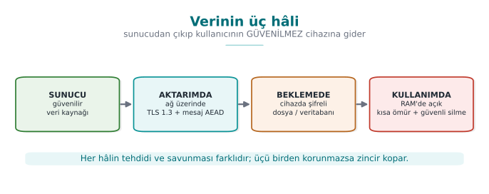

!!! note "This week's main idea: the security shell"
    A single measure is never enough. We wrap a sensitive asset in nested **protection layers** (shells) at
    **every stage** of its lifecycle: on the outside, channel security (TLS); inside that, message-level
    encryption; inside that, storage encryption; and at the very centre, a device-bound key. To reach the secret,
    the attacker must break **all of them, in order**. This is the concrete form of the **defence in depth** we
    introduced in [Week 1](../week-1/cen429-week-1.md); in Section 14 we'll wrap and unwrap a key with four shells.

Recall the **example architecture** we use throughout the term (a mobile payment app plus a security library that
handles its critical work). This week we fill in the three interfaces in that architecture: phone ↔ server (in
transit), the encrypted database on the phone (at rest), and the key opened in memory at the moment of payment
(in use).

In this architecture the phone is an **untrusted environment** (the user — i.e., a potential attacker — owns the
device; it may be rooted, a debugger may be attached). The server side is trusted. For every interface in
between we ask: which data crosses it, in which state (transit/storage/use), how is identity verified, and is
confidentiality needed, integrity, or both? This week's demos build exactly the answers to these questions:

- **Phone ↔ server (in transit):** TLS 1.3 + certificate validation + pinning, plus message-level AEAD on top
  (Demo 6, 1, 5).
- **Local database (at rest):** sensitive fields with AES-GCM under a device-bound key (Demo 7, 4).
- **Memory during payment (in use):** the key is open for the shortest possible time, securely erased after use,
  device-bound (Demo 8, 9).

All example values are **synthetic** (made up); no real key, card number, device ID, or IP address is used.

---

## 2. Encryption fundamentals: which tool protects what?

**Encryption** turns readable data (**plaintext**) into unreadable data (**ciphertext**) using a **key**;
**decryption** reverses this with the same (or a matching) key. Security rests on the secrecy of the **key**, not
the algorithm. But cryptography isn't one single thing; there are **different tools for different goals**. Let's
clarify the four families that get confused most often.

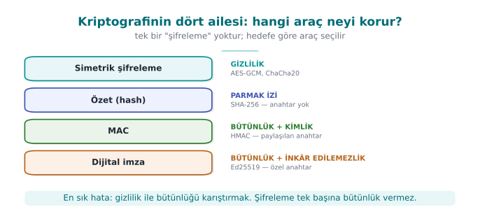

| Tool | What it provides | Key | Example | In this course |
| --- | --- | --- | --- | --- |
| **Symmetric encryption** | Confidentiality | A single secret key (both sides) | AES, ChaCha20 | File/DB/session encryption |
| **Asymmetric encryption** | Confidentiality + key distribution | Public/private pair | RSA-OAEP, ECIES | Key setup, TLS |
| **Hash** | Integrity fingerprint (keyless) | None | SHA-256, SHA-3 | Fingerprinting, HKDF/HMAC building block |
| **MAC** | Integrity **+ identity** (shared key) | A single secret key | HMAC-SHA-256, CMAC | Proving a message hasn't changed |
| **Digital signature** | Integrity + identity + **non-repudiation** | Public/private pair | Ed25519, RSA-PSS | Certificates, release signing ([Week 10](../week-10/cen429-week-10.md)) |
| **AEAD** | Confidentiality **and** integrity **together** | A single secret key | AES-GCM, ChaCha20-Poly1305 | This week's main tool |

!!! danger "The two most common mistakes"
    1. **Encrypting only, forgetting integrity.** Ciphertext alone (e.g., AES-CTR) doesn't stop an attacker from
       flipping bits **without being noticed**. Encryption provides confidentiality, **not integrity**.
    2. **Writing your own cipher/mode.** Kerckhoffs's principle: security must rest on the secrecy of the **key**,
       not the secrecy of the algorithm. Use standard, proven constructions.

### 2.1 Authenticated encryption (AEAD): confidentiality + integrity in one call

The right answer is almost always **AEAD** (Authenticated Encryption with Associated Data). AEAD does two things
in a single operation: it encrypts the data (**confidentiality**) and produces a **tag** that proves the
ciphertext (and optionally the additional "associated data") hasn't changed (**integrity + identity**). On
decryption the tag is **verified**: if even a single bit was tampered with, decryption is **rejected**.

Two modern AEADs:

- **AES-GCM** — very fast on processors with hardware AES acceleration (most desktops/servers). NIST SP 800-38D.
- **ChaCha20-Poly1305** — faster and more side-channel-resistant on devices without AES hardware (some
  mobile/embedded platforms). RFC 8439.

!!! info "Textbook recipe and an update"
    The textbook (Viega & Messier) covers symmetric encryption in **Recipe 5.x**, but it dates to 2003: it
    recommends DES/3DES/RC4 and a separate MAC. We update these to **AES-GCM / ChaCha20-Poly1305** (AEAD). The
    idea of "running encryption and integrity together" appears in Recipe **6.18**; AEAD is that idea collapsed
    into a single call.

### 2.2 Symmetric or asymmetric? Answer: both (hybrid)

Symmetric encryption (AES) is fast but requires both sides to know the **same secret key**; how do you share that
key over an insecure network? Asymmetric encryption (RSA, elliptic curve) solves this: everyone has a **public**
key (distributed) and a **private** key (kept secret). But asymmetric operations are slow and unsuited to large
data.

Real systems therefore run in **hybrid** mode: asymmetric crypto is used only to securely carry (or agree on) a
**small symmetric key**; the actual data is then encrypted with that symmetric key using AEAD. This is exactly
what TLS does: during the handshake, elliptic-curve Diffie-Hellman agrees on a session key, and then all traffic
is encrypted with AES-GCM or ChaCha20-Poly1305.

| Property | Symmetric (AES) | Asymmetric (RSA/EC) |
| --- | --- | --- |
| Speed | Very fast | Slow (100–1000×) |
| Key | A single, shared secret | Public/private pair |
| Use | Encrypting large data | Key transport, signatures |
| This week | File/DB/session | TLS key setup (Section 10) |

### 2.3 Block or stream? Why the mode matters

AES is a **block cipher**: it encrypts a 16-byte block at a time. Encrypting data longer than one block needs a
**mode of operation**, and **the choice of mode decides security**:

- **ECB** — encrypts every block independently; **leaks patterns** (Demo 3). Don't use it.
- **CBC** — each block is chained to the previous one; needs a random IV, doesn't provide integrity on its own,
  and is vulnerable to padding oracles.
- **CTR** — turns the block cipher into a stream cipher (keystream ⊕ data); **very** sensitive to nonce reuse
  (Demo 2).
- **GCM** — CTR + a Galois MAC; **AEAD**. The modern default.

ChaCha20 is already a **stream cipher** (no block concept); combined with the Poly1305 MAC it becomes an AEAD.
Same result: **confidentiality + integrity in a single package.**

### 2.4 Hash, MAC, and signature: which one, when?

These three belong to the **integrity** family but prove different things; mixing them up is a common mistake:

- A **hash** is a **fixed-size, one-way fingerprint** computed from data, and it's keyless. It only shows whether
  the data **has changed**. But an attacker can change the data and **recompute the hash too**; so a hash alone is
  **not proof** of integrity. Hashes are
  building blocks for constructions like HMAC and HKDF, and are used for fingerprinting/comparison. Old MD5/SHA-1
  are vulnerable to collisions; use SHA-256/SHA-3.
- A **MAC** (e.g., HMAC-SHA-256) requires a **shared secret key**. It says "someone who knows the key sent this
  message and it hasn't changed." Because both sides know the key, a MAC **does not provide non-repudiation**
  (you can't tell which side produced it). When comparing secrets against a MAC, use a **constant-time**
  comparison (`CRYPTO_memcmp`); plain `memcmp` leaks timing.
- A **digital signature** (e.g., Ed25519, RSA-PSS) works with a **public/private key pair**. Only the private-key
  holder can produce a signature, and anyone can verify it with the public key; hence it provides
  **non-repudiation**. Certificates and release signing (Week 10) rely on this.

| Question | Right tool |
| --- | --- |
| "Is this file corrupted?" (keyless fingerprint) | Hash (SHA-256) |
| "Did someone who knows the key send this, unchanged?" | MAC (HMAC) |
| "This was **definitely** signed by this person/server, and they can't deny it" | Signature (Ed25519) |
| "Keep this secret AND prove its integrity" | AEAD (AES-GCM) |

!!! tip "AEAD is usually the right answer"
    If you're storing data in an app or sending it over a channel, use **AEAD** instead of separately "encrypting
    + adding a MAC"; it does both jobs in one call, in the right order (encrypt-then-MAC), with fewer chances for
    mistakes. A separate MAC is only needed for data that won't be encrypted but still needs integrity (or via
    AEAD's AAD field).

### Demo 1 — Encrypting and tamper-detecting a file with AES-256-GCM

!!! info "Demo 1 · `code/week-03/01-aes-gcm-dosya` · AEAD, NIST SP 800-38D"
    The program encrypts a file with AES-256-GCM; the output has the form `[12-byte nonce][ciphertext][16-byte
    tag]`. On decryption the tag is verified. Then we flip a byte of the ciphertext, and separately a byte of
    only the tag, and see that decryption is **rejected** both times.

The essence of encryption and decryption (the crypto calls come from the shared `cen429_kripto.h` header; OpenSSL
EVP on Linux, BCrypt on Windows):

```c title="aesgcm.c (özet)"
/* Şifrele: cik = [nonce][şifreli metin][etiket] */
kripto_rastgele(nonce, 12);                 /* her mesaja yeni nonce */
memcpy(cik, nonce, 12);
kripto_gcm_sifrele(anahtar, nonce, 12, NULL, 0,
                   duz, duz_boy, cik + 12, etiket);
memcpy(cik + 12 + duz_boy, etiket, 16);

/* Çöz: etiket doğrulanır; tutmazsa ok == 0 */
int ok = kripto_gcm_coz(anahtar, nonce, 12, NULL, 0,
                        sc, sc_boy, etiket, duz);
if (!ok) { /* REDDET: veri kurcalanmış ya da yanlış anahtar */ }
```

Run it (`.\demo.ps1` on Windows):

```bash
cd code/week-03/01-aes-gcm-dosya
sh demo.sh
```

**Actual output** captured on WSL (shortened):

```text title="sh demo.sh — çıktı"
ADIM 2 - Sifrele
Sifrelendi: cikti/gizli.txt -> cikti/gizli.enc
   (53 bayt sifreli metin + 12 nonce + 16 etiket)
Sifreli dosyanin ilk baytlari (nonce + sifreli metin):
   000000 74 15 41 da 38 0b 86 1e 92 2f 42 eb 1c ac 49 54
   000010 07 2b 38 e2 3a e4 cd bb fb 7f fb 1c e5 ec a5 36

ADIM 3 - Dogru sekilde coz (etiket tutar)
Cozuldu ve DOGRULANDI: ... -> cikti/cozulen.txt (53 bayt)
   IBAN: TR00 0000 0000 0000 0000 0000 00
   Bakiye: 12345

ADIM 4 - Saldiri: sifreli metnin 20. baytini degistir
DOGRULAMA BASARISIZ: etiket tutmadi, veri kurcalanmis ya da
yanlis anahtar. Cozme REDDEDILDI.   (cikis kodu 2)

ADIM 5 - Saldiri: yalniz ETIKETin son baytini degistir
DOGRULAMA BASARISIZ: ... Cozme REDDEDILDI.   (cikis kodu 2)
```

What happened, line by line:

- **Step 2:** A random 12-byte nonce was generated and written to the start of the file. The nonce is **not
  secret** (it sits in the clear in the file); it only needs to be **unique**.
- **Step 3:** Decrypted with the same key and nonce; the tag held, and the plaintext came back.
- **Step 4:** We flipped one byte of the ciphertext with an XOR. Because the GCM tag is computed over the whole
  ciphertext, **even a single byte** breaks the tag; decryption is rejected (exit code 2).
- **Step 5:** This time we touched only the **tag**, not the data; it was rejected again. The tag is a function
  of both the data and the key; an attacker cannot produce the right tag without the key.

!!! success "Rule"
    If you're encrypting something, **use AEAD** (AES-GCM or ChaCha20-Poly1305). Give every message a **unique
    nonce**. **Always verify** the tag, and produce **no output at all** when verification fails (fail-closed).
    Don't leave integrity as a separate step.

!!! note "How it's done in the field"
    In the mobile payment library, every sensitive field in the local database and every message sent to the
    server is protected with AEAD. The "associated data" (AAD) field holds information that doesn't need to be
    encrypted but does need to be **bound** (version number, record ID, card scheme tag); this way a record's
    encrypted body can never be **moved** into a different context.

!!! question "How does an evaluator test this?"
    An independent evaluator flips a byte in the encrypted file/DB and confirms that the app **rejects it
    outright instead of silently returning wrong data**. They also check that encrypting the same plaintext twice
    produces **different** ciphertexts (i.e., the nonce doesn't repeat).

!!! warning "Common mistakes and a checklist"
    - [ ] Is the nonce unique for every message? (A fixed nonce is a disaster — see Demo 2.)
    - [ ] Is the tag stored and verified on decryption?
    - [ ] Does verification failure exit without producing output?
    - [ ] Does the key come from a secure source instead of being embedded in the code?
    - [ ] You're not using AES-CBC/CTR on its own (without a MAC), right?

---

## 3. Random numbers: the invisible foundation of cryptography

Everything we've discussed so far (key, IV, nonce, salt, session ID) rests on a single assumption: these values
are **unpredictable**. The world's best encryption algorithm protects nothing if its key was generated with a
predictable generator. The textbook devotes its entire Chapter 11 to this topic; here we'll work through the
part of it that still applies today, step by step.

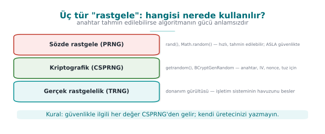

### Three kinds of "random"

| Kind | How is it generated? | Predictable? | Where is it used? |
| --- | --- | --- | --- |
| **Statistical pseudo-random** | `rand()`, `std::mt19937`, Java `Random` | **Yes**: the internal state can be computed from a few outputs | Games, simulation, test data |
| **Cryptographic pseudo-random (CSPRNG)** | The operating system's generator: `getrandom`, `BCryptGenRandom`, OpenSSL `RAND_bytes` | No (as long as the seed stays secret) | Keys, IVs, nonces, salts, tokens |
| **True random (entropy source)** | Hardware noise, timing jitter | No | For **seeding** a CSPRNG |

The rule is simple: **every security-relevant random value comes from a CSPRNG.** `rand()` and `mt19937` "look
random" in a statistical sense, but from a security standpoint they are completely predictable. Anyone who sees
624 consecutive outputs of a Mersenne Twister can compute every output that follows.

This **unpredictability** is the other side of the **entropy** idea we saw in
[Week 2](../week-2/cen429-week-2.md#demo-02-entropy-meter-how-is-encryptedpacked-content-recognised): there we
measured the disorder in a file's bytes to tell encrypted/packed content apart; here we need enough disorder
**feeding** the generator to produce **unpredictable** output. If the generator's pool hasn't been seeded enough
(as we'll see in Mistake 2 below), its output becomes predictable too.

### Mistake 1: seeding with the time

```c title="Hatalı: saniye cinsinden zaman = tahmin edilebilir tohum"
srand(time(NULL));
unsigned char anahtar[16];
for (int i = 0; i < 16; i++)
    anahtar[i] = rand() & 0xFF;
```

If an attacker knows which day the key was generated, there are only 86,400 possible seeds for that day. A
laptop tries all of them in seconds. `rand()`'s own internal state is also small; once the seed is known, the
whole sequence is known.

### Mistake 2: accidentally deleting entropy

!!! example "The Debian OpenSSL disaster (2008)"
    A distribution packager removed two lines that fed entropy into OpenSSL's random number pool, in order to
    silence a warning from a memory-checking tool. The result: for two years, the only source of entropy for the
    SSH and SSL keys generated on that distribution was the **process ID** (at most 32,768 values). The number of
    possible keys for every key type and size dropped to a few tens of thousands; attackers pre-generated and
    listed them all (CVE-2008-0166). The lesson: don't touch cryptographic code **without understanding it**, and
    testing a random generator's output statistically does not prove it is unpredictable.

### The right way: the operating system's generator

=== "Linux"

    ```c
    #include <sys/random.h>
    #include <errno.h>

    int rastgele_bayt(void *tampon, size_t n)
    {
        unsigned char *p = tampon;
        while (n > 0) {
            ssize_t r = getrandom(p, n, 0);    /* havuz hazır olana kadar bekler */
            if (r < 0) {
                if (errno == EINTR) continue;
                return -1;
            }
            p += r; n -= (size_t)r;
        }
        return 0;
    }
    ```

    `getrandom` (Linux 3.17+, glibc 2.25+) reads from the kernel's CSPRNG and **blocks** at boot if the pool
    hasn't been seeded enough yet. The older approach of opening `/dev/urandom` is also safe, but it can fail if
    file descriptors are exhausted or the file doesn't exist inside a `chroot`. There's no reason to use
    `/dev/random` today.

=== "Windows"

    ```c
    #include <windows.h>
    #include <bcrypt.h>
    #pragma comment(lib, "bcrypt.lib")

    int rastgele_bayt(void *tampon, size_t n)
    {
        NTSTATUS s = BCryptGenRandom(NULL, (PUCHAR)tampon, (ULONG)n,
                                     BCRYPT_USE_SYSTEM_PREFERRED_RNG);
        return BCRYPT_SUCCESS(s) ? 0 : -1;
    }
    ```

    `BCryptGenRandom` replaces the older `CryptGenRandom` that the textbook describes in Recipe 11.4. Passing
    `NULL` instead of an algorithm handle, along with `BCRYPT_USE_SYSTEM_PREFERRED_RNG`, is the simplest way to
    use it.

=== "OpenSSL (both platforms)"

    ```c
    #include <openssl/rand.h>
    if (RAND_bytes(tampon, (int)n) != 1) { /* hata: ASLA devam etme */ }
    ```

!!! warning "Check the return value"
    A random generator **can fail**. If the return value isn't checked, the buffer stays uninitialized (or zero)
    and the program keeps running with a fixed "key" it believes is random. On failure, the only correct behaviour
    is to stop the operation.

### Mistake 3: bias when reducing to a range (modulo bias)

Writing `r % 6` to roll a die looks innocent. But if `r` is uniform over 0–255, since 256 doesn't divide evenly
by 6, the values 0–3 come up 43 times each while 4–5 come up 42 times each. Irrelevant for a die; but when
generating a random password or a one-time code, some characters coming up more often increases predictability.
The correct method is **rejection sampling** (Recipe 11.11):

```c title="[0, ust) aralığında sapmasız rastgele tamsayı"
#include <stdint.h>

uint32_t aralikta_rastgele(uint32_t ust)
{
    uint32_t sinir = (uint32_t)(-ust) % ust;   /* 2^32 mod ust: bu kadar değer "fazla" */
    uint32_t r;
    do {
        rastgele_bayt(&r, sizeof r);
    } while (r < sinir);                        /* fazlalığı at, yeniden çek */
    return r % ust;
}
```

The idea: use the largest portion of the 2³² values that divides evenly by `ust`, and discard the remainder.
That way every result comes from exactly the same number of inputs.

### Where do we use random values? A checklist

| Value | Size | Secret? | Unique? | Note |
| --- | --- | --- | --- | --- |
| Symmetric key | 16–32 bytes | **Yes** | Yes | From a CSPRNG or a KDF |
| GCM nonce | 12 bytes | No | **Yes** (must never repeat with the same key) | If randomly generated, at most ~2³² messages per key |
| CBC IV | 16 bytes | No | Yes | Must be **unpredictable** |
| Password salt | ≥ 16 bytes | No | Yes | Per user |
| Session token | ≥ 16 bytes | **Yes** | Yes | If predictable, the session is stolen |
| One-time code (OTP) | 6–8 digits | Yes | — | Unbiased range generation + attempt limit |

!!! info "Random nonce or counter?"
    Generating the 12-byte GCM nonce randomly is practical, but if a huge number of messages will be encrypted
    under the same key (because of the birthday bound — NIST SP 800-38D's recommendation: at most 2³² messages
    with a random nonce), either the key must be rotated frequently or the nonce must be generated as a
    **counter**. If a counter is used, it must not reset when the device restarts (it must be stored persistently).
    The nonce-reuse disaster we'll see in the next section happens exactly at this point.

!!! question "How does an evaluator test this?"
    They search the source code for calls to `rand`, `srand`, `random`, `mt19937`, `java.util.Random`, and
    `Math.random`, checking whether a security-relevant value comes from one of these. They examine whether the
    random generator's return value is checked and whether range reduction is done without bias. On mobile
    platforms they ask whether the random generator can be **hooked** (e.g., modified to return a fixed value).

!!! note "How it's done in the field"
    A sensitive library's guide separately documents **where random numbers are used and where they are not**:
    for payment data, no random number is generated on the client (values come from the server); on the Java
    side, the platform's secure generator is used; on the native side, randomness is used only to fill memory.
    This lets an evaluator see, at a glance, which asset would be affected if the random generator were weakened.

---

## 4. Using crypto APIs correctly: AES-GCM step by step

In Demo 1 we encrypted a file with AES-256-GCM and caught tampering. The demo left the work to the helper
functions inside `code/common/cen429_kripto.h`. In this section we open up the **inside** of those functions: we
write AES-GCM step by step with OpenSSL's EVP interface and Windows's CNG (BCrypt) interface. The goal is to see
where mistakes can be made while using a crypto library. The rule still holds: **you don't write your own
algorithm**, but calling a ready-made algorithm **correctly** is also a skill.

### AEAD's four inputs and two outputs

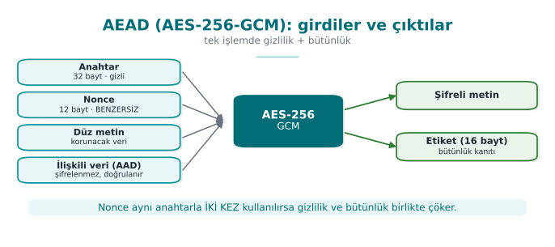

**AAD** (additional authenticated data) is information that isn't encrypted but that must be noticed if it's
changed: a file header, a version number, a record ID. In the [Week 1](../week-1/cen429-week-1.md) password-vault example we made the
derivation parameters AAD; if someone changes the iteration count, the tag won't hold.

### Encrypting with OpenSSL EVP

```c title="aes_gcm.c — şifreleme (OpenSSL 1.1.1 / 3.x)"
#include <openssl/evp.h>

/* Başarıda şifreli metin uzunluğunu, hatada -1 döndürür. */
int aes_gcm_sifrele(const unsigned char anahtar[32], const unsigned char nonce[12],
                    const unsigned char *aad, int aad_n,
                    const unsigned char *acik, int n,
                    unsigned char *sifreli, unsigned char etiket[16])
{
    EVP_CIPHER_CTX *ctx = EVP_CIPHER_CTX_new();
    int yazilan, toplam = -1;
    if (ctx == NULL) return -1;

    if (EVP_EncryptInit_ex(ctx, EVP_aes_256_gcm(), NULL, NULL, NULL) != 1) goto son;   /* 1 */
    if (EVP_CIPHER_CTX_ctrl(ctx, EVP_CTRL_GCM_SET_IVLEN, 12, NULL) != 1) goto son;     /* 2 */
    if (EVP_EncryptInit_ex(ctx, NULL, NULL, anahtar, nonce) != 1) goto son;            /* 3 */
    if (aad_n > 0 && EVP_EncryptUpdate(ctx, NULL, &yazilan, aad, aad_n) != 1) goto son; /* 4 */
    if (EVP_EncryptUpdate(ctx, sifreli, &yazilan, acik, n) != 1) goto son;             /* 5 */
    toplam = yazilan;
    if (EVP_EncryptFinal_ex(ctx, sifreli + toplam, &yazilan) != 1) { toplam = -1; goto son; } /* 6 */
    toplam += yazilan;
    if (EVP_CIPHER_CTX_ctrl(ctx, EVP_CTRL_GCM_GET_TAG, 16, etiket) != 1) toplam = -1; /* 7 */
son:
    EVP_CIPHER_CTX_free(ctx);     /* bağlamdaki anahtar malzemesini de temizler */
    return toplam;
}
```

The steps, in order:

1. Choose the algorithm; **don't** give the key and nonce yet.
2. Set the nonce length (12 bytes is recommended for GCM; it's also the default, but writing it explicitly is
   good practice).
3. Give the key and the nonce.
4. Give the AAD: the output buffer is `NULL`, because AAD isn't encrypted, only folded into the tag.
5. Encrypt the plaintext. For large data this step can be repeated in chunks.
6. Finish. Since GCM runs in a stream mode there's no padding; this call usually writes 0 bytes, but **it must be
   called**: the tag is computed here.
7. Retrieve the tag and store it together with the ciphertext.

Every call's return value is checked, and the context is freed at a single exit point (`son:`). In C, this
`goto` pattern is the most readable way to avoid resource leaks.

### Decrypting: don't touch the plaintext before the tag is verified

```c title="aes_gcm.c — çözme"
/* Başarıda açık metin uzunluğunu; etiket tutmazsa ya da hata olursa -1 döndürür. */
int aes_gcm_coz(const unsigned char anahtar[32], const unsigned char nonce[12],
                const unsigned char *aad, int aad_n,
                const unsigned char *sifreli, int n,
                const unsigned char etiket[16], unsigned char *acik)
{
    EVP_CIPHER_CTX *ctx = EVP_CIPHER_CTX_new();
    int yazilan, toplam = -1;
    if (ctx == NULL) return -1;

    if (EVP_DecryptInit_ex(ctx, EVP_aes_256_gcm(), NULL, NULL, NULL) != 1) goto son;
    if (EVP_CIPHER_CTX_ctrl(ctx, EVP_CTRL_GCM_SET_IVLEN, 12, NULL) != 1) goto son;
    if (EVP_DecryptInit_ex(ctx, NULL, NULL, anahtar, nonce) != 1) goto son;
    if (aad_n > 0 && EVP_DecryptUpdate(ctx, NULL, &yazilan, aad, aad_n) != 1) goto son;
    if (EVP_DecryptUpdate(ctx, acik, &yazilan, sifreli, n) != 1) goto son;
    toplam = yazilan;
    /* Beklenen etiketi Final'dan ÖNCE ver */
    if (EVP_CIPHER_CTX_ctrl(ctx, EVP_CTRL_GCM_SET_TAG, 16, (void *)etiket) != 1) { toplam = -1; goto son; }
    if (EVP_DecryptFinal_ex(ctx, acik + toplam, &yazilan) != 1) {
        OPENSSL_cleanse(acik, (size_t)n);     /* etiket tutmadı: yarı çözülmüş veriyi sil */
        toplam = -1;
        goto son;
    }
    toplam += yazilan;
son:
    EVP_CIPHER_CTX_free(ctx);
    return toplam;
}
```

!!! danger "The most common AEAD mistake"
    The `EVP_DecryptUpdate` call writes the plaintext into the buffer **before the tag is verified**. The tag is
    verified inside `EVP_DecryptFinal_ex`. If a program uses the data in the buffer without checking Final's
    return value, it treats tampered data as verified. Rule: **without a successful Final, the plaintext is
    discarded and wiped.**

### The same job with Windows CNG

=== "Encryption"

    ```c
    #include <windows.h>
    #include <bcrypt.h>

    int aes_gcm_sifrele_cng(const UCHAR anahtar[32], const UCHAR nonce[12],
                            UCHAR *aad, ULONG aad_n, const UCHAR *acik, ULONG n,
                            UCHAR *sifreli, UCHAR etiket[16])
    {
        BCRYPT_ALG_HANDLE alg = NULL;
        BCRYPT_KEY_HANDLE key = NULL;
        BCRYPT_AUTHENTICATED_CIPHER_MODE_INFO bilgi;
        ULONG yazilan = 0;
        int sonuc = -1;

        if (!BCRYPT_SUCCESS(BCryptOpenAlgorithmProvider(&alg, BCRYPT_AES_ALGORITHM, NULL, 0))) goto son;
        if (!BCRYPT_SUCCESS(BCryptSetProperty(alg, BCRYPT_CHAINING_MODE,
                (PUCHAR)BCRYPT_CHAIN_MODE_GCM, sizeof(BCRYPT_CHAIN_MODE_GCM), 0))) goto son;
        if (!BCRYPT_SUCCESS(BCryptGenerateSymmetricKey(alg, &key, NULL, 0,
                (PUCHAR)anahtar, 32, 0))) goto son;

        BCRYPT_INIT_AUTH_MODE_INFO(bilgi);
        bilgi.pbNonce = (PUCHAR)nonce; bilgi.cbNonce = 12;
        bilgi.pbAuthData = aad;        bilgi.cbAuthData = aad_n;
        bilgi.pbTag = etiket;          bilgi.cbTag = 16;

        if (BCRYPT_SUCCESS(BCryptEncrypt(key, (PUCHAR)acik, n, &bilgi, NULL, 0,
                                         sifreli, n, &yazilan, 0)))
            sonuc = (int)yazilan;
    son:
        if (key) BCryptDestroyKey(key);
        if (alg) BCryptCloseAlgorithmProvider(alg, 0);
        return sonuc;
    }
    ```

=== "Decryption"

    ```c
    /* Aynı hazırlık; bilgi.pbTag beklenen etiketi gösterir. */
    NTSTATUS s = BCryptDecrypt(key, (PUCHAR)sifreli, n, &bilgi, NULL, 0,
                               acik, n, &yazilan, 0);
    if (s == STATUS_AUTH_TAG_MISMATCH) {      /* 0xC000A002: kurcalama */
        SecureZeroMemory(acik, n);
        return -1;
    }
    ```

Even though the two interfaces look different, the steps are the same: choosing the algorithm and mode, the key
object, nonce + AAD + tag, a single call for the operation, and freeing resources. One advantage of CNG is that
it reports a tag mismatch with its own separate status code.

### Constant-time comparison

If you ever need to compare a tag or a MAC by hand (e.g., in a message signed with HMAC), don't use `memcmp`.
`memcmp` stops at the first differing byte; the comparison's duration **leaks** how many bytes were correct. An
attacker can guess the tag byte by byte by measuring the timing (a timing attack).

```c title="Sabit zamanlı karşılaştırma"
int sabit_zamanli_esit(const unsigned char *a, const unsigned char *b, size_t n)
{
    unsigned char fark = 0;
    for (size_t i = 0; i < n; i++)
        fark |= a[i] ^ b[i];         /* her baytı mutlaka dolaş */
    return fark == 0;
}
```

Ready-made equivalents: OpenSSL's `CRYPTO_memcmp`, the Linux kernel's `crypto_memneq`, libsodium's
`sodium_memcmp`.

### Checklist for using a crypto library

- [ ] Every call's return value is checked; the operation **stops** on failure.
- [ ] The nonce is **new** for every encryption (random or a persistent counter).
- [ ] The tag is verified **before** the plaintext is used; on failure the plaintext is wiped.
- [ ] Tag and MAC comparisons are **constant-time**.
- [ ] Key buffers are wiped once the job is done; context objects are freed.
- [ ] Error messages don't give an attacker detail: if "tag error" and "padding error" are separate messages,
      that difference can be used as an **oracle** (this is exactly how CBC padding-oracle attacks were born).
- [ ] No outdated algorithms: DES/3DES, RC4, MD5, SHA-1 (for signing), ECB.

!!! note "How it's done in the field"
    Real products' guides contain an **algorithm inventory**: every algorithm used (AES-CBC/CTR, HMAC, SHA-256,
    TLS, payment schemes' MAC), for what purpose, with what key size, and based on which standard, written down
    as a table. This inventory is also good material for **critical reading**: inventories written a few years
    ago show choices no longer recommended today, like SHA-1 or CBC with a separate MAC. An inventory written
    today should have SHA-256 and AEAD in their place.

!!! question "How does an evaluator test this?"
    They compare the algorithm inventory against the source code: is an algorithm used that isn't in the
    inventory? They examine nonce generation and repetition; they feed back tampered ciphertext with one bit
    changed and confirm the app **rejects it** without giving a detailed error. They search for `memcmp` in MAC
    comparisons.

---

## 5. IV/nonce and salt: reusing the same key

These three concepts are constantly mixed up. All three are **not secret**, but security depends on using them
correctly (textbook **Recipe 4.9**):

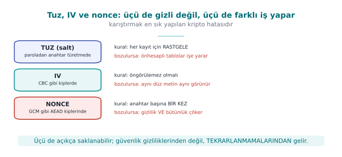

| Concept | Where? | Rule | If violated |
| --- | --- | --- | --- |
| **Salt** | When deriving a key from a password | **Random** for every password/record | Precomputed (rainbow) tables work |
| **IV** (initialization vector) | In modes like CBC | **Random**, unpredictable | The first block leaks (BEAST-type attacks) |
| **Nonce** (number used once) | In modes like CTR/GCM | **Never** repeats with the same key | The keystream leaks (below) |

### 5.1 Why is nonce reuse a disaster?

GCM and CTR produce a **keystream** from the key and the nonce and XOR it with the plaintext:
`C = P ⊕ KS(key, nonce)`. If two messages are encrypted with the **same key and the same nonce**, the
**same** keystream is used for both:

```text
C1 = P1 ⊕ AA        C2 = P2 ⊕ AA
C1 ⊕ C2 = (P1 ⊕ AA) ⊕ (P2 ⊕ AA) = P1 ⊕ P2
```

The keystream cancels out; the attacker obtains the **XOR of the two plaintexts**. If they know (or guess) one
message, they fully decrypt the other.

### Demo 2 — Nonce reuse leaking the XOR of two plaintexts

!!! info "Demo 2 · `code/week-03/02-nonce-tekrari` · nonce reuse"
    The program encrypts two different messages with AES-256-GCM, first with the **same** nonce, then with
    **different** nonces, and compares `C1 ⊕ C2` against `P1 ⊕ P2`.

```text title="sh demo.sh — gerçek çıktı (hex kısaltıldı)"
Duz metin 1: "Saldiri safagi 06:00'da baslasin!!"
Duz metin 2: "Toplam bakiye 45000 TL, sifre 1234"
==============================================================
KOTU DURUM - iki mesajda da AYNI nonce:
  C1 xor C2 = 070e1c08081f4942120a0f18024914050 ... 5c1215
  P1 xor P2 = 070e1c08081f4942120a0f18024914050 ... 5c1215
  ==> C1 xor C2 == P1 xor P2 : anahtar akisi SIZDI!
  Saldirgan P1'i biliyorsa P2 = (C1 xor C2) xor P1 =
     "Toplam bakiye 45000 TL, sifre 1234"
==============================================================
IYI DURUM - her mesaja FARKLI nonce:
  C1 xor C2 = 21158fbd64978ae63835b80d1f98c02d2 ... 8385c5af
  P1 xor P2 = 070e1c08081f4942120a0f18024914050 ... 5c1215
  ==> C1 xor C2 != P1 xor P2 : sizinti YOK.
```

In the bad case, `C1 ⊕ C2` and `P1 ⊕ P2` come out **byte-for-byte identical**: the keystream cancelled out. The
program also showed that an attacker who knows one message fully recovers the other via `(C1 ⊕ C2) ⊕ P1`. With
different nonces, the relationship disappeared.

!!! quote "Real incidents"
    Nonce/IV reuse produces legendary bugs: WEP's short IV (the collapse of wireless network encryption), the
    Sony PlayStation 3 reusing **the same random value** twice in an ECDSA signature (leading to extraction of
    the private key), and repeated GCM nonce-reuse warnings across various TLS libraries. The rule is clear: a
    **nonce must never repeat.**

!!! success "Rule"
    Generate the nonce either **randomly** (12 bytes, with a negligible collision probability) or as a
    **counter**, and track it **persistently**. Never use the same nonce with the same key twice. If you're
    encrypting too many messages (beyond 2³²), rotate the key or choose a construction with a wider nonce, like
    XChaCha20.

!!! note "How it's done in the field / How does an evaluator test this?"
    In systems that encrypt millions of messages under a long-lived key (e.g., a server-client session), nonce
    management is a design decision: an incrementing counter per message plus a new key per session. An
    evaluator looks at how the nonce is generated in the code (fixed? a persistent counter? random?) and confirms
    that the nonce fields of two ciphertexts are **never the same**. A fixed nonce, or a counter that resets on
    restart, is a direct finding (CWE-323).

!!! warning "Common mistakes and a checklist"
    - [ ] Is the nonce tracked persistently (not reset when the program restarts)?
    - [ ] If you're using a random nonce, is 96 bits enough for the number of messages involved?
    - [ ] Is it guaranteed that the same `(key, nonce)` pair can't be used for two messages?

### 5.2 ECB leaks patterns

**ECB** (Electronic Codebook), a mode that uses no nonce/IV, encrypts every 16-byte block **independently**. The
same plaintext block **always** produces the same ciphertext block; so repeating patterns in the data show up in
the ciphertext too.

### Demo 3 — The ECB "penguin": pattern leakage

!!! info "Demo 3 · `code/week-03/03-ecb-desen` · ECB pattern leakage"
    We build a two-color "image" (every pixel is exactly one 16-byte block). Encrypted with AES-128-**ECB** the
    shape is still readable; encrypted with AES-256-**GCM** (CTR-based) the pattern disappears.

```text title="sh demo.sh — gerçek çıktı"
Orijinal resim (duz metin):
  ################################
  #  ##    ####    ####    ##    #
  ...  (429 rakamlari)  ...
  ################################
==============================================================
AES-128-ECB ile sifreli (her blok ilk baytina gore):
  ================================
  =##==####====####====####==####=
  ...  ayni sekil hala GORUNUYOR ...
  ================================
  ==> Sekil hala GORUNUYOR: ECB deseni sizdirir.
==============================================================
AES-256-GCM (CTR tabanli) ile sifreli, ayni resim:
  : -..--+%%*-:**% . #*#+*.:+* :..
  *.#*##:*%+###:#-*%==*#-+=%:.=***
  ...  desen kayboldu, gurultu ...
  ==> Desen kayboldu: GCM/CTR her blogu farkli sifreler.
```

The ECB output only has **two** characters (a background block → one ciphertext block, a shape block → another
ciphertext block); the shape is still exactly readable. This is the ASCII version of the famous "ECB penguin"
example. In GCM, since every block is encrypted with a different, position-dependent keystream, the output is
noise.

!!! success "Rule"
    **Don't use ECB.** For encryption, use AEAD (GCM, ChaCha20-Poly1305); for disk, XTS-AES; never the
    pattern-leaking ECB. "Let every block be encrypted independently" sounds tempting but destroys
    confidentiality.

!!! note "How it's done in the field / Evaluator test"
    In code review, every place `ECB` appears is a finding (the textbook's **Recipe 5.x** contains old `EVP_*_ecb`
    calls that need updating). An evaluator can automatically catch ECB by searching for repeating 16-byte blocks
    in the ciphertext of the same plaintext.

!!! warning "Common mistakes and a checklist"
    - [ ] There's no encryption mode with `ecb` in the code, right?
    - [ ] Did you think about pattern leakage when encrypting images/structured data?
    - [ ] Is the ciphertext output different every time for the same input (thanks to the nonce/IV)?

---

## 6. Key derivation from a password

A password can't be a key directly: it's short, has low entropy, and is predictable. A password-based key
derivation function (KDF) does two things:

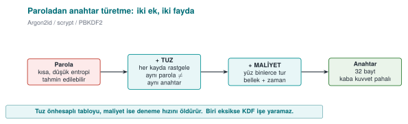

1. **Salt:** A random salt is added per user/record. The same password gives a different key with a different
   salt; this way **precomputed (rainbow) tables** don't work, and it's not obvious when two users share a
   password.
2. **Slowness (cost):** The KDF deliberately runs hundreds of thousands of rounds; trying one password becomes
   expensive, which slows down brute force.

| KDF | Cost axis | When? | Standard |
| --- | --- | --- | --- |
| **PBKDF2** | CPU only (round count) | When compliance/FIPS is required | NIST SP 800-132 |
| **scrypt** | CPU **+ memory** | When memory-hardness is wanted | RFC 7914 |
| **Argon2id** | CPU + memory + parallelism | **First choice for new systems** | RFC 9106, OWASP |

!!! info "Textbook recipe and an update"
    The textbook covers password-based key derivation in **Recipe 4.10** using PBKDF2, recommending 10,000
    rounds. Today that's **far too low**: OWASP (2023) requires **≥ 600,000 rounds** for PBKDF2-HMAC-SHA256, and
    **Argon2id** is preferred where possible.

### Demo 4 — Round count, timing, and the importance of salt

!!! info "Demo 4 · `code/week-03/04-parola-anahtar` · PBKDF2, salt, cost"
    The program derives a key from the same password with PBKDF2: same salt → same key (revealing to a table),
    different salt → different key; and it measures how long derivation takes as the round count grows. If the
    `argon2` tool is available on WSL, an Argon2id comparison is run too.

```text title="sh demo.sh — gerçek çıktı (WSL)"
1) TUZUN ONEMI (tur = 100000)
   tuz A -> anahtar = e1d9214abdcfa793...cad33a816
   tuz A -> anahtar = e1d9214abdcfa793...cad33a816   (ayni)
   tuz B -> anahtar = 89cc5979affa2a62...972e020e   (farkli)
==============================================================
2) TUR SAYISI vs SURE (ayni parola, ayni tuz)
   tur =     1000  ->      0.37 ms
   tur =    10000  ->      3.82 ms
   tur =   100000  ->     39.05 ms
   tur =   600000  ->    209.55 ms
   tur =  2000000  ->    628.42 ms
==============================================================
3) Argon2id ile karsilastirma (argon2 araci varsa)
   $argon2id$v=19$m=65536,t=3,p=1$...   0.112 seconds
```

- **Salt:** The same password + the same salt gave the **same** key every time (which is why, if the salt were
  fixed, an attacker could build one table and search everyone). The same password + a **different** salt gave a
  completely different key.
- **Cost:** As the round count went from 1,000 to 2,000,000, the time went from ~0.4 ms to ~628 ms. This is a
  direct multiplier: every attempt an attacker makes gets just as much more expensive. "200 ms at user login" is
  acceptable; for an attacker it means thousands of attempts per second instead of billions.
- **Argon2id:** It additionally requires **memory** (64 MiB here); this makes parallel brute force with a
  GPU/ASIC much harder than with PBKDF2.

!!! warning "A note on Windows"
    The Windows demo (`.\demo.ps1`) performs the same PBKDF2 measurement (via BCrypt); timings vary by machine.
    The `argon2` command-line tool doesn't ship on Windows, so Argon2id is only explained there. The key values
    are **identical** on both platforms (same standard, same test vectors).

!!! success "Rule"
    Never store a password as **plaintext or plain SHA-256**. Use a random salt plus a KDF with sufficient cost
    (Argon2id; failing that, high-round PBKDF2 or scrypt). Store the salt alongside the password hash (it doesn't
    need to be secret); tune the cost to your hardware and increase it over the years.

!!! question "How does an evaluator test this?"
    An evaluator checks that the salt is **random and unique per record**, that the round/memory parameters match
    current recommendations, and that the password is wiped from memory after derivation (see Demo 8).

!!! tip "Going further: pepper"
    In addition to the salt, a secret **pepper** — not stored in the database, but kept in the application's
    configuration or in a hardware security module (HSM) — can also be added. This way, even if only the database
    is stolen (as long as the pepper doesn't leak), the password hashes get one more layer of protection against
    brute force. A salt isn't secret; a pepper is.

---

## 7. Deriving keys from a master secret, session keys, and forward secrecy

A long-lived "master secret" is never used **directly**. Separate keys are derived from it for every purpose and
every session. The tool: **HKDF** (RFC 5869), a two-stage KDF:

- **Extract:** master secret + salt → a uniform intermediate key (PRK).
- **Expand:** PRK + an "info" label → a key of the desired length. A different `info` → a different key.

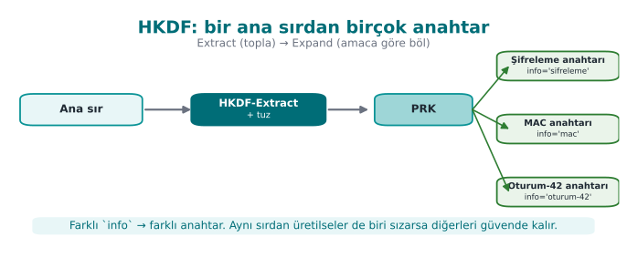

!!! info "Textbook recipe"
    The textbook covers "generating keys algorithmically from a single master secret" in **Recipe 4.11** and
    securely managing key material in **4.13**. HKDF is the standardized form of this idea. Every derivation
    **must** include a **unique identifier** (an info/label).

### 7.1 Forward secrecy

If we derive keys as a **one-way chain** — `K0 = master secret`, `Kᵢ = HKDF(Kᵢ₋₁)` — and **delete** `Kᵢ₋₁` after
each session, then even if an attacker obtains today's `Kₙ`, they **cannot compute** the old `K1..Kₙ₋₁` (and
those sessions' data) backward. TLS 1.3 provides this guarantee with an ephemeral Diffie-Hellman for every
session (textbook **Recipes 8.20–8.21**).

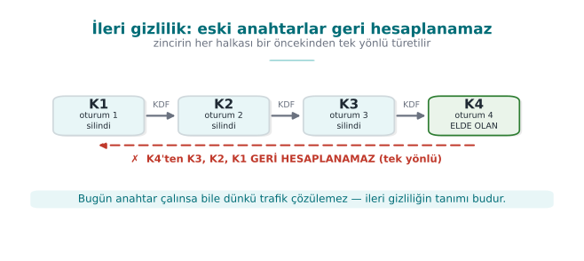

### Demo 5 — Session keys and a forward-secrecy chain with HKDF

!!! info "Demo 5 · `code/week-03/05-hkdf-oturum` · HKDF, session key, forward secrecy"

```text title="sh demo.sh — gerçek çıktı"
Tek ana sirdan amaca gore ayri anahtarlar:
  info='...sifreleme...' -> 2b8b46840fa2d1b1...0e577a55
  info='...MAC...'       -> 30a302d19ec9ab8e...c55dfa84
  ^ Ayni sir, farkli info -> farkli anahtar.
==============================================================
ILERI GIZLILIK zinciri: Ki = HKDF(Ki-1), Ki-1 silinir
  K1 (oturum 1) = 0630f63f015d003e
  K2 (oturum 2) = def84847df4d9461
  K3 (oturum 3) = 54b13f0ff3a486ca
  K4 (oturum 4) = 55524a8f5c09652f
  ^ Elimizde yalniz K4 var; zincir tek yonlu oldugu icin
    K4'ten K3, K2, K1 geri hesaplanamaz.
```

Different `info` labels from the same master secret produced different keys; a key generated for one purpose
can't be used for another. In the forward-secrecy chain, the old key was wiped at every step with
`kripto_temizle` (OPENSSL_cleanse/SecureZeroMemory); only the last key remained, and one-wayness preserved the
history.

!!! success "Rule"
    Derive separate keys from the master secret **per purpose and per session** (key separation). Give every
    derivation a unique `info`/label. Generate short-lived session keys from the long-lived secret and **wipe
    them after use**; aim for real forward secrecy with ephemeral (EC)DH where possible.

!!! note "How it's done in the field"
    In the example architecture, from a master secret agreed with the server, an encryption key, a MAC key, and a
    separate session key for every session are derived with HKDF. We'll cover the key hierarchy (which key is
    derived from which, how long each lives) in detail in [Week 10](../week-10/cen429-week-10.md); this week's principle is: **don't run a single
    key for every job.**

!!! question "How does an evaluator test this?"
    An evaluator asks for the key-hierarchy document and checks that every key has **a single purpose**, that
    session keys are short-lived and derived, and that the same derived key isn't used in two different places.
    They also ask whether forward secrecy is provided (whether old keys are wiped).

!!! warning "Common mistakes and a checklist"
    - [ ] Does every derivation have a unique `info`/label?
    - [ ] Are **separate** keys derived for encryption and MAC?
    - [ ] Are session keys wiped after use?
    - [ ] The master secret doesn't stay in memory longer than necessary, right?

---

## 8. Dynamic key management: lifecycle, hierarchy, and renewal

Only a very small fraction of incidents reported as "the algorithm was broken" are actually algorithm breaks. The
overwhelming majority are **key management** mistakes: a key embedded in the source code, a key that never
changes, a single key run for every job, an old key that's never deleted. The textbook covers securely managing
key material briefly in Recipe 4.13; in this section we expand the topic to how it's actually handled in the
field.

### The life of a key

NIST SP 800-57 defines a key's lifecycle in terms of states. In simple form:

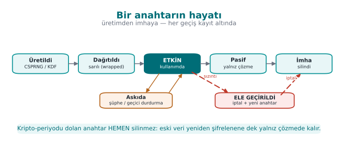

| Stage | Question to ask | Typical mistake |
| --- | --- | --- |
| **Generation** | Is there enough entropy? Who generates it (client, server, HSM)? | `rand()`, a fixed key, generating a key on the client that shouldn't be generated there |
| **Distribution** | How is the key protected in transit? | Sending the key as plaintext, relying on TLS alone |
| **Storage** | Where does the key sit while waiting, and with what protection? | Writing it in plaintext into source code or a config file |
| **Use** | Is the key used for only a single purpose? | The same key for both encryption and MAC; unlimited messages under the same key |
| **Renewal** | When and how does the key change? | Never changing; old data becoming unreadable once it does change |
| **Revocation** | What happens if it's compromised? | No revocation mechanism at all |
| **Destruction** | Are all copies deleted? | Copies left behind in backups, logs, memory |

The **crypto-period** is the length of time a key is allowed to be used. Once it expires, the key is no longer
used to **encrypt** new data, but it may be kept a while longer to **decrypt** old data. What determines the
crypto-period: how much data the key protects, how long that data needs to stay confidential, and how exposed
the key is. A key sitting on a client device should have a much shorter lifetime than one sitting in an HSM.

### Key hierarchy: a separate key for every job

Instead of doing everything with a single key, keys are organised into a **tree**. Keys near the top are used
rarely and sit in the best-protected place; keys near the bottom are used often, are short-lived, and cause
little damage if lost.

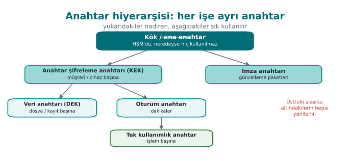

Two core ideas:

1. **Key separation:** different keys for different purposes. An encryption key is never used for signing, a MAC
   key never for encryption. HKDF's `info` label makes this separation easy (previous section).
2. **Bounding the damage:** compromise of a lower-level key affects only that branch. If a single-use payment key
   is stolen, the loss is **a single transaction**.

!!! example "A hierarchy from payment systems"
    In EMV-style card systems, the typical chain is: the card issuer's **master key** (in an HSM) → a **card
    master key** derived from the card number and sequence number → a **session key** derived from a transaction
    counter → a **single-use key** used in each payment. In mobile payment solutions that don't use the phone's
    secure element, only the keys at the very bottom of the chain — usable a **limited number of times** — are
    downloaded to the phone; once they run out, new ones are requested from the server (key renewal /
    replenishment). Even if the phone is compromised, the attacker only has a few transactions' worth of keys,
    and these are easily revoked server-side.

### Envelope encryption

Encrypting a large amount of data directly with the master key creates two problems: the master key gets used
often (increasing its exposure time), and when the key changes **all the data** must be re-encrypted. Envelope
encryption solves both:

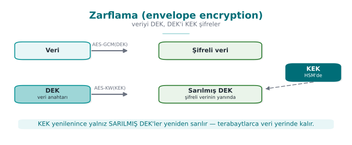

1. A random **data encryption key (DEK)** is generated for every file or record; the data is encrypted with it.
2. The DEK is wrapped (encrypted) with a **key encryption key (KEK)** and written into the header of the
   encrypted data.
3. The KEK sits in a secure place: the operating system's key store, a TPM, an HSM, or a cloud key management
   service.
4. When the KEK is rotated, only the small wrapped DEKs need to be re-wrapped.

Cloud providers' key management services (KMS) and disk-encryption systems use this method.

### Key version: the small field that makes renewal possible

To be able to rotate a key, you need to know **which key** encrypted a given piece of encrypted data. That's why
a **key ID / version** field is placed in the header of the encrypted data:

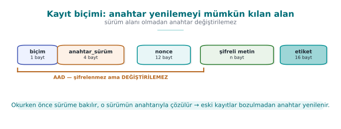

The reader looks at the version first, finds that version's key, and decrypts. New writes always use the newest
key; old records get re-encrypted with the new key as they're read (or in the background). Because the header is
AAD, an attacker can't change the version field to redirect the app toward an old, weak key.

### Where should a key be stored?

| Option | Platform | Protection | Note |
| --- | --- | --- | --- |
| Embedded in source code | All | **None**: found with `strings` | Never (unless unavoidable; if unavoidable, obfuscate + split — [Week 4](../week-4/cen429-week-4.md)) |
| Config file | All | File permissions | Leaks into backups, into the repository |
| Environment variable | All | Weak | Leaks into subprocesses, crash reports |
| DPAPI (`CryptProtectData`) | Windows | Tied to the user or machine account | Doesn't protect against malware running as the same user |
| Keychain / Keystore | macOS, iOS, Android | The OS, sometimes hardware-backed | Recommended on mobile |
| TPM | Windows, Linux | Hardware; the key can't be extracted | The key is bound to the device |
| HSM / cloud KMS | Server | Hardware; the key never leaves the HSM | The server-side standard |

```c title="Windows DPAPI — bir anahtarı kullanıcı hesabına bağlı olarak sarmak"
#include <windows.h>
#include <dpapi.h>
#pragma comment(lib, "crypt32.lib")

int anahtari_sar(const BYTE *anahtar, DWORD n, DATA_BLOB *cikti)
{
    DATA_BLOB giris = { n, (BYTE *)anahtar };
    /* cikti->pbData, iş bitince LocalFree ile serbest bırakılır */
    return CryptProtectData(&giris, L"kasa-anahtari", NULL, NULL, NULL,
                            CRYPTPROTECT_UI_FORBIDDEN, cikti) ? 0 : -1;
}
```

### From the field: card scheme requirements and a key inventory

The card-scheme security requirements that mobile payment apps must meet ask, point by point, for exactly what
this section describes. A summary of two schemes' (here **Scheme-A** and **Scheme-B**) crypto and key
requirements:

| Requirement (summary) | This week's counterpart |
| --- | --- |
| Industry-standard algorithms and protocols must be used, **configured securely** | Using crypto APIs correctly; wiring up TLS in code |
| Keys' confidentiality and integrity must be protected, or the keys must be hidden | Security shells, whitebox ([Week 11](../week-11/cen429-week-11.md)) |
| Keys must be **installed and updated** securely, and **wiped** from memory and temporary storage once the job is done | Lifecycle; data in use |
| Every key's **hierarchy, use, and crypto-period** must be defined; a key must be used **for a single purpose only** | Key hierarchy, key separation |
| Random numbers with sufficient entropy, unpredictable, must be used (e.g., from the back end) | The random numbers section |
| The call to the random number source **must not be hookable** | [Week 6](../week-6/cen429-week-6.md) (hook detection) |
| Data-encryption and limited-use keys must be protected with keys that are **bound to, and different per,** app and device | Device and version binding |

The guide for a library that meets these requirements splits keys into four groups:

| Group | Where generated? | How protected? |
| --- | --- | --- |
| **Dynamic device keys** (whitebox keys) | On the server | Downloaded and stored bound to the device; unwrapped right before use |
| **Dynamic payment keys** (limited-use keys) | On the server | Downloaded under the wallet key (whitebox) and stored in the database with the same key |
| **Static device key** (a single one: the string-obfuscation key) | At build time | Sits split and obfuscated in the source code |
| **Server certificate** | Certificate authority | Its public key is pinned in the app |

The same guide also makes two important **negative** statements: the library does **not generate keys** for
account parameters, and it does **not generate random numbers** on the client for payment. For an evaluator,
saying "we don't do this" is just as valuable as saying "we do this" — it narrows the attack surface.

### Session keys: an example from the field and a critical read

When a second protection layer is built **on top of** TLS between client and server, that layer's keys are
derived per session. The outline of a design from the field (names generalized):

1. The server generates a 32-byte **session ID**, encrypts it with a **configuration key** specific to the
   client, and sends it over a push-notification channel (or in response to the client's request for a new
   session).
2. The client decrypts the session ID with the protected key (whitebox AES, Week 11).
3. **Authentication code:** part of the decrypted session ID, the wallet ID, and the device fingerprint are run
   together through SHA-256. The server computes the same value itself; both sides thereby confirm the other is
   genuine.
4. **Session key:** a digest of the configuration key is used as a **master key**; a 16-byte AES session key is
   derived from that digest via HMAC, together with the decrypted session ID.
5. Messages are encrypted with this key in **AES-CTR** mode, and a 256-bit MAC is additionally attached to every
   message; the receiver doesn't use a message without verifying the MAC.

This design is a good example of defence in depth: even if TLS is broken, messages are separately encrypted and
integrity-protected; the session key changes every session; the authentication code is device-bound. If the same
design were built today, the following improvements would be recommended:

| In the design | Recommended today | Why? |
| --- | --- | --- |
| AES-CTR + a separate MAC (manually combined) | The library's AEAD mode: AES-GCM, AES-CCM, or ChaCha20-Poly1305 | Confidentiality and integrity in a single call; removes the burden of manually getting the "encrypt first, then MAC" order and two separate keys right |
| A custom HMAC-based derivation from a digest, with truncated output | HKDF; separate `info` for encryption and MAC | Standard, analysed; key separation is explicit |
| SHA-1 in some steps | SHA-256 | Collision attacks against SHA-1 became practical |
| A session key from a symmetric root | Ephemeral (EC)DH for forward secrecy | Prevents past sessions from also being decrypted if the root key is stolen |

!!! tip "Critical reading is a skill"
    Reading a design written and certified a few years ago through today's lens is not the same as declaring it
    "wrong." The design met the requirements of its own time. The engineering skill is being able to say, with
    reasoning, which choice needs to change **today** and why. In [Week 12](../week-12/cen429-week-12.md) we'll examine a security guide with
    exactly this eye.

!!! success "Rule"
    Organise keys within a hierarchy; give every key a single purpose, a crypto-period, and a moment of
    destruction. Envelope your data; write the key version into the encrypted data's header and protect it with
    AAD. Keep the key in the strongest store available, and only download keys with limited damage and short
    lifetimes to the client device.

!!! question "How does an evaluator test this?"
    They ask for the key-management document (for every key: where it's generated, its size, its algorithm, its
    purpose, where it's stored, its crypto-period, its moment of destruction) and compare it against the source
    code. They check whether the same key is used for two purposes, whether the same key exists on two different
    devices (a shared static key), whether key renewal actually works, and whether old keys are deleted.

---

## 9. Data in transit: TLS 1.3, certificate validation, and pinning

**TLS** (Transport Layer Security) is the protocol that combines **key agreement**, **AEAD encryption**, and
**certificate validation** to provide secure communication over the network — the layer under HTTPS (formerly
called SSL). It's the standard that protects data in transit. Today **TLS 1.3** is used; SSLv2/SSLv3 and TLS
1.0/1.1 are considered broken and have been retired (attacks like POODLE, BEAST).

### 9.1 The TLS 1.3 handshake

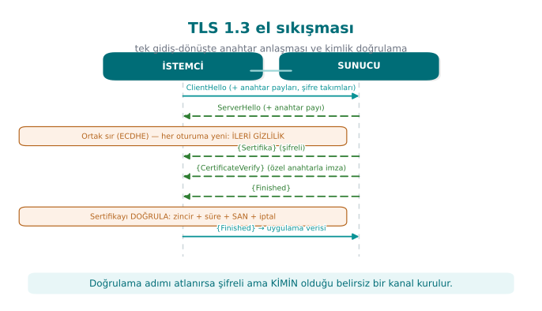

TLS 1.3's two key features: (1) the handshake finishes in **a single round trip** (fast); (2) the key exchange is
always done with **ephemeral ECDHE**, meaning **forward secrecy** is on by default (RFC 8446).

### 9.2 The three layers of validation — and the most dangerous trap

A TLS connection means nothing if it doesn't **validate** the certificate the other party presents. Validation
consists of three questions:

| Layer | Question | Tool |
| --- | --- | --- |
| **Chain validation** | Was the certificate signed by a trusted root (CA)? Is it expired/revoked? | CA store, CRL/OCSP ([Week 10](../week-10/cen429-week-10.md)) |
| **Hostname** | Is the certificate **really for this server**? | SAN/CN comparison (`SSL_set1_host`) |
| **Pinning** | Is it the **specific** key/certificate I expect? | SPKI SHA-256 comparison |

!!! danger "OpenSSL's fatal default"
    OpenSSL **does not validate the certificate by default** on a client socket (the textbook's **Recipe 10.7**
    calls this "possibly the worst default there is"). If `SSL_CTX_set_verify` isn't called and the hostname
    isn't set with `SSL_set1_host`, an attacker can intercept the connection and present **their own
    certificate**, and the client won't notice a thing.

Chain validation works like this: the server presents a **leaf certificate**; that certificate was signed by an
**intermediate CA**, which was in turn signed by a trusted **root CA**. The client validates the signatures
**upward** until it reaches its list of trusted roots (the trust store); it also checks every certificate's
**expiration** and **revocation status** (CRL/OCSP). In Demo 6 we build this root of trust with a small CA we
generate ourselves: the "real" server certificate is signed by this CA, while the "attacker" certificate is
self-signed (not in the root list), so chain validation rejects it. We'll cover PKI, certificate chains, CRL, and
OCSP in detail in **Week 10**.

### 9.3 Pinning and TOFU

- **Certificate pinning:** The client embeds the SHA-256 digest of the server's **expected public key** (SPKI).
  Even if the chain is valid (e.g., an attacker obtained a fake but "valid" certificate), the connection is
  rejected if the key doesn't match. Common in mobile apps (OWASP MASVS-NETWORK). The textbook's **Recipe 10.9**
  calls this "whitelist validation."
- **TOFU** (Trust On First Use): without a PKI, the key from the first connection is remembered; if it
  **changes** on a later connection, a warning is raised. This is what SSH does (textbook **Recipe 8.19**). It's
  not as strong as a PKI, but it makes interception harder after the first connection.

### 9.4 What changed from TLS 1.2 to 1.3?

TLS 1.3 isn't just a version bump; it's a **clean simplification**. Older versions had dozens of "cipher suites,"
many of them weak; misconfiguration was a common vulnerability. TLS 1.3 cleaned this up thoroughly:

| Topic | TLS 1.2 | TLS 1.3 |
| --- | --- | --- |
| Handshake | 2 round trips | **1 round trip** (faster) |
| Key exchange | RSA or DH (forward secrecy optional) | **Only ephemeral (EC)DHE** → forward secrecy by default |
| Cipher suites | Many, some weak (RC4, CBC, export) | Only a handful of strong AEAD suites |
| Broken features | Compression, renegotiation, static RSA | **Removed** |

!!! warning "Downgrade and 0-RTT traps"
    An attacker sometimes tries to push the client down to an **older, weaker version** (a downgrade attack).
    That's why enforcing a **minimum version** on the client (at least TLS 1.2, preferably 1.3) matters. TLS
    1.3's "0-RTT" speedup is a trade-off in which the first message can be vulnerable to **replay**; 0-RTT isn't
    used for operations that must not be repeated, like payments.

### Demo 6 — A non-validating client → localhost MITM → hostname + SPKI pinning

!!! info "Demo 6 · `code/week-03/06-tls-pinning` · Linux/WSL only · CWE-295 (improper certificate validation)"
    The demo generates our own root CA, a **"real"** certificate for CN=localhost signed by that CA, and a
    **self-signed "attacker"** certificate; it starts two local TLS servers (127.0.0.1). The client tries three
    modes: no validation, chain+hostname validation, and SPKI pinning. **On Windows this demo is run under WSL**
    (`.\demo.ps1` explains this).

The essence of the client:

```c title="tls_istemci.c (özet)"
SSL_CTX_set_min_proto_version(ctx, TLS1_2_VERSION);   /* en az TLS 1.2 */
if (dogrula) {
    SSL_CTX_load_verify_locations(ctx, ca_pem, NULL);  /* güvenilen CA */
    SSL_CTX_set_verify(ctx, SSL_VERIFY_PEER, NULL);
    SSL_set1_host(ssl, host);                           /* ana makine adı! */
}
/* pin modunda: sunucu ACIK ANAHTARININ (SPKI) SHA-256'si eslesmeli */
i2d_X509_PUBKEY(X509_get_X509_PUBKEY(cert), &der);
EVP_Digest(der, len, ozet, NULL, EVP_sha256(), NULL);
if (memcmp(ozet, beklenen_pin, 32) != 0) { /* REDDET */ }
```

```text title="sh demo.sh — gerçek çıktı (WSL)"
Gercek sunucu SPKI pini (SHA-256): 1dabd67747366675...ac36b3f7c
==============================================================
SENARYO 1 - Guvensiz istemci SALDIRGAN sunucuya:
[guvensiz] Dogrulama YOK - ne gelirse KABUL (TEHLIKELI).
   ^ Sahte sertifika kabul edildi. MITM basarili olurdu.
SENARYO 2 - Dogrulayan istemci GERCEK sunucuya:
[dogrula] Zincir + hostname DOGRULANDI - KABUL.
SENARYO 3 - Dogrulayan istemci SALDIRGAN sunucuya:
[dogrula] EL SIKISMA BASARISIZ - baglanti REDDEDILDI.
   Sebep: (18: self signed certificate)
SENARYO 4 - Pinleyen istemci GERCEK sunucuya, DOGRU pin:
[pin] SPKI pin TUTTU - baglanti KABUL.
SENARYO 5 - Pinleyen istemci SALDIRGAN sunucuya, GERCEK pin ile:
[pin] SPKI pin TUTMADI - baglanti REDDEDILDI.
   ^ Anahtar tutmadi: pinning MITM'i durdurdu.
```

The five scenarios tell a single story: an **unvalidating client** accepts the attacker's fake certificate
without question (MITM would have succeeded). **Chain + hostname validation** rejects the attacker's self-signed
certificate. **SPKI pinning**, meanwhile, cuts the connection even if the attacker manages to obtain a
chain-wise "valid" certificate, because the **expected key** doesn't match.

!!! success "Rule"
    **Manually turn on** validation on the client: load the trusted CA store, pass `SSL_VERIFY_PEER`, set the
    **hostname** (`SSL_set1_host`), and set the minimum version to TLS 1.2 (preferably 1.3). Add **SPKI pinning**
    for high-risk apps. On error, **stay closed** (fail-closed): don't swallow the exception and fall back to the
    trust store.

!!! note "'Don't rely on TLS alone' in transit"
    The TLS channel protects, but the **endpoints** can be untrusted (a rooted phone, an interposed proxy,
    badly-implemented pinning). High-security designs add **one more layer inside TLS**: message-level AEAD
    encryption + MAC + a server authentication code. This way, even if TLS is bypassed, the message body is
    still encrypted. These are the outer two layers of the security shell in Section 14.

!!! question "How does an evaluator test this?"
    An evaluator intercepts on localhost with a proxy, presents **their own CA**, and checks whether the app
    rejects the connection. In a pinned app, they present a valid certificate with a different key and confirm
    the rejection; in code review they also look for "is the exception swallowed, does it fall back to the trust
    store?"

!!! warning "Common mistakes and a checklist"
    - [ ] Was `SSL_CTX_set_verify(..., SSL_VERIFY_PEER, ...)` called?
    - [ ] Is the hostname (`SSL_set1_host`) set? (The chain can be correct but the name wrong.)
    - [ ] Is the minimum protocol version ≥ TLS 1.2?
    - [ ] A certificate error is **not swallowed** — is the connection actually cut?
    - [ ] Is the pinned value the **SPKI** (not the certificate itself; the key stays the same when the
          certificate is renewed)?

---

## 10. Wiring up TLS correctly in code: a step-by-step client, pinning, and common mistakes

The previous section showed **what** TLS 1.3 does, and how Demo 6's non-validating client was fooled. In this
section we cover wiring up a TLS client **correctly, line by line**, applying pinning in a way that's sustainable
in the field, and the most common mistakes seen in real applications. The textbook covers this topic in Recipe
9.1 (an SSL client), 10.7 (validating the peer's certificate), 10.8 (hostname checking), and 10.9 (whitelist
validation); the code below is these recipes updated to OpenSSL 1.1.1/3.x.

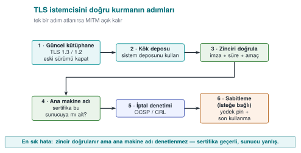

### A correct client with OpenSSL: seven steps

```c title="tls_istemci.c — OpenSSL 1.1.1 / 3.x"
#include <openssl/ssl.h>
#include <openssl/err.h>

/* Başarıda okunup yazılabilen bir BIO döndürür; iş bitince BIO_free_all + SSL_CTX_free. */
BIO *tls_baglan(SSL_CTX **ctx_cikti, const char *ana_makine, const char *port)
{
    BIO *bio = NULL;
    SSL *ssl = NULL;
    SSL_CTX *ctx = SSL_CTX_new(TLS_client_method());                 /* 1 */
    if (!ctx) return NULL;
    SSL_CTX_set_min_proto_version(ctx, TLS1_2_VERSION);             /* 2 */
    SSL_CTX_set_verify(ctx, SSL_VERIFY_PEER, NULL);                  /* 3 */
    if (SSL_CTX_set_default_verify_paths(ctx) != 1) goto hata;       /* 4 */

    if ((bio = BIO_new_ssl_connect(ctx)) == NULL) goto hata;
    BIO_get_ssl(bio, &ssl);
    SSL_set_tlsext_host_name(ssl, ana_makine);                       /* 5: SNI */
    if (SSL_set1_host(ssl, ana_makine) != 1) goto hata;              /* 6: ad denetimi */
    BIO_set_conn_hostname(bio, ana_makine);
    BIO_set_conn_port(bio, port);

    if (BIO_do_connect(bio) <= 0 || BIO_do_handshake(bio) <= 0) goto hata;
    if (SSL_get_verify_result(ssl) != X509_V_OK) goto hata;          /* 7 */

    *ctx_cikti = ctx;
    return bio;
hata:
    ERR_print_errors_fp(stderr);
    BIO_free_all(bio);
    SSL_CTX_free(ctx);
    return NULL;
}
```

| Step | What it does | If skipped |
| --- | --- | --- |
| 1 | A version-independent client context | — |
| 2 | Sets the minimum version to TLS 1.2 | Left exposed to a version-downgrade attack |
| 3 | **Validates** the peer's certificate | OpenSSL doesn't validate by default: any certificate is accepted |
| 4 | Loads the OS's trusted root store | No certificate can be validated; the developer disables step 3 because "it doesn't work" |
| 5 | Tells the server which name it wants (SNI) | If multiple sites share an IP, the wrong certificate comes back |
| 6 | Checks that the name in the certificate is **this** server | A valid certificate obtained for another site is accepted |
| 7 | Explicitly asks for the validation result | A configuration mistake can slip through silently (belt and suspenders) |

!!! warning "Why is step 6 so important?"
    Chain validation only answers "was this certificate signed by a trusted CA?" An attacker can obtain a
    **completely valid** certificate for their own domain. If hostname checking isn't done, the client will also
    accept `saldirgan.ornek`'s certificate in place of `banka.ornek`. The 2012 study titled "The Most Dangerous
    Code in the World" showed that a large number of real applications and libraries skipped exactly this step.

### Adding pinning: the SPKI digest

Once validation succeeds, the digest of the server's **public key** is compared against a list embedded in the
app. Pinning the public-key info (SPKI) instead of the certificate itself lets the app keep working when the
certificate is renewed with the same key.

```c title="SPKI SHA-256 sabitleme"
#include <openssl/x509.h>
#include <openssl/sha.h>

static const unsigned char PINLER[][32] = {
    { /* birincil anahtarın SPKI SHA-256 özeti (32 bayt) */ },
    { /* YEDEK anahtarın özeti: çevrimdışı üretilmiş, henüz kullanılmayan */ },
};

int pin_denetle(SSL *ssl)
{
    X509 *sert = SSL_get_peer_certificate(ssl);    /* 3.x: SSL_get1_peer_certificate */
    if (!sert) return 0;
    X509_PUBKEY *pk = X509_get_X509_PUBKEY(sert);
    int n = i2d_X509_PUBKEY(pk, NULL);
    unsigned char *der = OPENSSL_malloc((size_t)n), *p = der;
    i2d_X509_PUBKEY(pk, &p);                        /* p ilerler; der başta kalır */
    unsigned char ozet[32];
    SHA256(der, (size_t)n, ozet);
    OPENSSL_free(der);
    X509_free(sert);

    for (size_t i = 0; i < sizeof PINLER / sizeof PINLER[0]; i++)
        if (CRYPTO_memcmp(ozet, PINLER[i], 32) == 0)
            return 1;
    return 0;                                       /* tutmadı: bağlantıyı KES */
}
```

Computing a server's SPKI digest from the command line:

```bash
openssl s_client -connect sunucu.ornek:443 -servername sunucu.ornek </dev/null 2>/dev/null \
  | openssl x509 -pubkey -noout \
  | openssl pkey -pubin -outform der \
  | openssl dgst -sha256 -binary | base64
```

### Keeping pinning sustainable in the field

Pinning is a strong but **fragile** control: when the server's key changes, every app on the old version becomes
unable to connect. That's why browsers dropped dynamic HTTP-based pinning (HPKP) in 2018; pinning is still common
in mobile and desktop apps, though (OWASP MASVS-NETWORK). For sustainable pinning:

| Rule | Why? |
| --- | --- |
| Pin the **SPKI**, not the certificate | A certificate renewed with the same key keeps working |
| Always embed at least one **backup pin** | If the primary key is compromised or lost, fall back to the backup; the app doesn't get "bricked" |
| Generate and store the backup key **offline** | So it isn't compromised at the same time as the primary key |
| Tie the pin list to the update process | The new pin ships in a release **before** the old pin is removed |
| **Report** pin failures | A pin failure is either an attack or a misconfiguration; you want to know about both |
| Don't leave pinning toggleable via a config flag | An attacker will flip the flag first |

!!! tip "Leaf certificate or intermediate CA?"
    Pinning the leaf certificate's key is the strictest option but requires the most maintenance. Pinning an
    intermediate CA's key accepts every certificate that CA signs; maintenance gets easier but assurance drops.
    The choice gets written into the protection plan as a **trade-off record** ([Week 1](../week-1/cen429-week-1.md)).

### TLS on Windows: WinHTTP and Schannel

Windows's built-in TLS stack is **Schannel**; apps mostly use it through **WinHTTP** or WinINet (the current
counterpart of the WinInet the textbook covers in Recipe 9.4). Unlike OpenSSL, WinHTTP **validates the
certificate and the hostname by default**. The danger lies in the flags that turn this validation off:

```c title="Asla sürüm derlemesine girmemesi gereken satır"
DWORD bayraklar = SECURITY_FLAG_IGNORE_UNKNOWN_CA |
                  SECURITY_FLAG_IGNORE_CERT_CN_INVALID |
                  SECURITY_FLAG_IGNORE_CERT_DATE_INVALID;
WinHttpSetOption(istek, WINHTTP_OPTION_SECURITY_FLAGS, &bayraklar, sizeof bayraklar);
```

This line is usually added during development to connect to a self-signed test server, and then **forgotten**.
The correct approach is to add the test server's CA to the development machine's trust store; the code stays
the same. For pinning in WinHTTP, after the request is sent, the server certificate is retrieved with
`WinHttpQueryOption(..., WINHTTP_OPTION_SERVER_CERT_CONTEXT, ...)` and the public-key digest is compared as
above.

### Critical reading: the door that opens silently (fail-open)

Below is a simplified, rewritten version of a pinning implementation used in the field. At first glance the code
looks correct: it validates the chain first, then compares the server's public key against the key stored in the
app. Can you spot the bug?

```java title="Sabitleme — sadeleştirilmiş örnek (Java)"
public void checkServerTrusted(X509Certificate[] zincir, String tur) throws CertificateException {
    varsayilanDogrulayici.checkServerTrusted(zincir, tur);          // 1. zincir doğrulaması
    try {
        PublicKey beklenen = depo.getCertificate("ca").getPublicKey();
        if (!Arrays.equals(beklenen.getEncoded(), zincir[0].getPublicKey().getEncoded()))
            throw new CertificateException("pin tutmadi");           // 2. sabitleme
    } catch (KeyStoreException e) {
        e.printStackTrace();                                         // 3. ???
    }
}
```

Line 3: if reading from the key store **fails**, it prints the error and returns from the method **normally**.
Because the method returns without throwing an exception, the connection is **accepted**: pinning effectively
never happened. When a security check falls back to a "pass" result on error, it's called **fail-open**. Other
notable points stood out in the same codebase:

- When chain validation failed, a second validation was performed against a store embedded in the app, and in
  that second validation, **revocation checking was turned off**.
- If the certificate file, or its integrity marker, couldn't be found, only a log line was written and the
  connection was allowed to **proceed**.
- There was a single pin; there was **no backup pin**.

The correct design is **fail-closed**: if you can't determine a security check's outcome, the outcome is
"reject."

```java title="Düzeltilmiş: her belirsizlik reddedilir"
    } catch (KeyStoreException | RuntimeException e) {
        throw new CertificateException("pin denetimi yapilamadi", e);   // belirsizlik = ret
    }
```

!!! success "Rule: security checks fail closed"
    Think through every exit path of a check (exception, null value, missing file, timeout) one by one, and
    confirm that each one leads to **rejection**. In code review, specifically search for `catch` blocks and "not
    found, continuing" log lines: almost every fail-open bug lives there.

### The most common TLS mistakes in real applications

| Mistake | Where it's seen | Result |
| --- | --- | --- |
| The validation callback always returns "valid" | OpenSSL `verify_callback`, Java's "trust everything" `TrustManager` | Every certificate is accepted |
| Hostname checking is disabled | No `SSL_set1_host`; Java `HostnameVerifier` always `true` | A valid certificate from another site is accepted |
| "Continue anyway" on a certificate error | Continuing on the error event in a mobile web view | An interposed attacker isn't noticed |
| A debug flag leaks into the release build | A runtime flag instead of `#ifdef DEBUG` | An attacker turns the flag on |
| Only an unbackuped leaf-certificate pin | Mobile apps | The app breaks when the certificate is renewed; the team removes pinning entirely |
| Return values aren't checked | Everywhere | Data is sent even if the handshake failed |
| TLS is assumed to be the only protection | Architecture | Data left in the clear on the server or client isn't protected |

!!! danger "The 'TLS is there anyway' fallacy"
    TLS only protects data **on the wire**. Once data reaches the server, gets written to a log, or is saved to a
    file on the client, TLS's protection ends. That's why sensitive data gets **message-level** encryption on top
    of TLS (a security shell), and data is also encrypted at rest.

### Testing your own connection

=== "Command line"

    ```bash
    # Sürüm, şifre takımı ve sertifika zincirini göster; doğrulama hatasında dur
    openssl s_client -connect sunucu.ornek:443 -servername sunucu.ornek \
                     -verify_return_error -brief </dev/null

    # TLS 1.1'i dene: sunucu reddetmeli
    openssl s_client -connect sunucu.ornek:443 -tls1_1 </dev/null
    ```

=== "App behaviour"

    1. Connect to a local server presenting a self-signed certificate: the app **should reject it** (Demo 6).
    2. Present a valid certificate obtained for a different name: the app **should reject it**.
    3. Add your own CA to the test device's trust store and put a proxy in the middle: a pinning app should
       **still reject it**.
    4. Confirm that the pin failure is reported and that a comprehensible message is shown to the user.

!!! question "How does an evaluator test this?"
    They install their own root certificate on the test device and route traffic through a man-in-the-middle
    proxy. If the app can still connect under these conditions, pinning is absent or ineffective. They then try
    to disable the pinning check at runtime by getting past the RASP and obfuscation layers ([Week 6](../week-6/cen429-week-6.md)); how long
    this attempt takes shows how strong the protection is. They also scan the server side for TLS versions,
    cipher suites, and the certificate chain.

!!! note "How it's done in the field"
    In mobile payment libraries, data in transit is typically protected by two outer shells: TLS + public-key
    comparison certificate pinning + server certificate-chain validation (the outermost shell), and inside that,
    message-level encryption and a MAC with the session key. When the server's address, the certificate hostname,
    and the pinned values are given to the library as parameters by the upper application, the guide explicitly
    states that protecting these parameters is the **upper application's responsibility**; responsibility is
    never left ambiguous.

---

## 11. Data at rest: file and database encryption

A file or database on disk **can be stolen** (a lost phone, a stolen backup, a compromised server). There are two
levels for protecting data at rest:

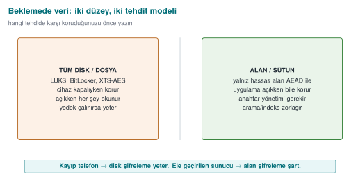

- **Whole-disk/file encryption:** at the OS level (LUKS, BitLocker, XTS-AES) or at the app level, encrypting the
  whole file with AEAD (see Demo 1). The textbook covers disk encryption in **Recipe 5.15**; it warns about the
  fixed-IV trap.
- **Field/column encryption:** encrypting only the **sensitive fields** (card number, national ID, health data)
  at the application layer and writing them encrypted into the database. Even if the database is stolen, those
  fields can't be read.

**Data masking** is a separate technique: showing data in an irreversible or partial form. It's **not**
encryption (it can't be reopened with a key); its purpose is reducing data's **unnecessary exposure**. Its main
forms:

- **Partial masking:** showing only part of a value, e.g., card number `**** **** **** 4242`, email
  `a***@ornek.com`. Used in the UI and on customer-service screens.
- **Logging masks:** a sensitive field is **never** written to logs, or is written masked. (The data-side
  counterpart of the "logging a secret" mistake we saw in [Week 1](../week-1/cen429-week-1.md).)
- **Tokenization:** replacing the real value with a meaningless "token," keeping the real value in a separate,
  secure vault. In payment systems a token travels in place of the card number; the actual number is decrypted
  from the vault only when needed.
- **Test-data masking:** replacing real personal data with fake but realistic values when copying production data
  into a test/development environment.

Masking does **not replace** encryption; it **complements** it. The data sits encrypted on disk with AEAD
(confidentiality), and it's masked on its way to a screen/log (reducing exposure). The two counter different
threats: one counters a file being stolen, the other counters "the wrong person seeing it on a screen/in a log."

### Demo 7 — Encrypting a sensitive field in SQLite with AES-GCM

!!! info "Demo 7 · `code/week-03/07-sqlite-alan` · data at rest, field encryption"
    The program adds two customer records to a SQLite database: the `ad` (name) field is **plain**, and the
    `kart_sifreli` (card_encrypted) field is a BLOB encrypted with AES-256-GCM. The key isn't embedded in the
    code; it comes from the `SIM_ANAHTAR` environment variable. When an attacker steals and opens the DB, the
    card field is nothing but an encrypted byte blob. SQLite is `sqlite3` on Linux and the Windows SDK's built-in
    **winsqlite3** library on Windows; the crypto comes from the shared header.

```text title="sh demo.sh — gerçek çıktı (WSL)"
ADIM 1 - Veritabanini kur (hassas alan sifreli)
Veritabani kuruldu: cikti/musteri.db (2 kayit)
ADIM 2 - Saldirgan DB dosyasini caldi ve sqlite3 ile aciyor:
  1|Ayse Yilmaz|D1ED7A3624E0F7C6...A64B373F...  (sifreli)
  2|Mehmet Kaya|C362F7A33BDEE736...F924DF9F...  (sifreli)
   ^ Kart alani yalniz sifreli bayt yigini; anahtar yok.
ADIM 3 - Dogru anahtarla uygulama okuyor (coz ve dogrula):
   1 | Ayse Yilmaz   | 4242-4242-4242-4242
   2 | Mehmet Kaya   | 5555-4444-3333-2222
ADIM 4 - YANLIS anahtarla okuma (GCM etiketi tutmaz):
   1 | Ayse Yilmaz   | (COZULEMEDI - anahtar yanlis?)
```

Even if the attacker opens the DB with `sqlite3`, they see the `ad` field, but the `kart_sifreli` field is
nothing but encrypted bytes. The app opens and verifies it correctly with the right key; with the **wrong** key
the GCM tag doesn't hold, so decryption is rejected (it never silently returns garbage). The Windows demo
(`.\demo.ps1`) makes the same point by searching the raw DB file instead of using the `sqlite3` tool: `Ayse` (the
plain name) is found, but `4242-4242` (the card) is **not found**, because it's encrypted.

!!! success "Rule"
    Encrypt sensitive fields with AEAD at the application layer **before** writing them to the database. Don't
    embed the key in the code; derive it from a device-/user-bound KDF (Section 13). **Mask** values headed to
    logs and screens. Encryption at rest doesn't replace protection in use (Demo 8); you need both together.

!!! note "How it's done in the field / Evaluator test"
    In the example architecture, the local database is SQLite; the card profile, transaction counter, and key
    list are kept in encrypted columns, and the key is device-bound. An evaluator extracts the DB file, searches
    for sensitive data in the clear, and writes a finding if any is found; they also examine where the key comes
    from (embedded in the code? device-bound?).

!!! warning "Common mistakes and a checklist"
    - [ ] Is the sensitive field encrypted **before** it's written to the DB?
    - [ ] Does the key come from a device-/user-bound source instead of being embedded in the code?
    - [ ] Does decryption with the wrong key reject rather than silently return garbage (AEAD)?
    - [ ] Are sensitive fields headed to logs/screens masked?
    - [ ] Can't the encrypted field be moved into a different record (bound via AAD)?

---

## 12. Data masking techniques: using data without showing it

Encryption hides data from anyone **without the key**. But in many cases, even systems and people **who do have
the key** don't need to see all of it: a call-centre employee should see the last four digits of a customer's
card number, not the whole thing; a test-environment database shouldn't contain real people's national ID
numbers; a log file should never see a password at all. **Data masking** is a family of techniques that shows
only as much of the data as its purpose requires and hides the rest. Personal-data-protection regulation (KVKK,
GDPR) and the payment-card standard (PCI DSS) explicitly require these techniques.

### Four basic techniques

| Technique | What it does | Reversible? | Typical use |
| --- | --- | --- | --- |
| **Masking (at display)** | Replaces part of the value with `*` | No (for the displayed copy) | Screen, receipt, log |
| **Tokenization** | Replaces the value with a meaningless **token**; the real value sits in a separate, protected vault | Yes, only for those with access to the vault | Payment systems, card storage |
| **Pseudonymization** | Turns the value into a fixed pseudonym with a keyed function | Can be matched back by whoever holds the key | Analytics, reporting, test data |
| **Anonymization** | Permanently severs the link to the person (generalization, noise, deletion) | No | Open data, statistics |

The difference matters legally too: pseudonymized data is still **personal data** (whoever holds the key can find
the person); truly anonymized data, on the other hand, is not considered personal data. Many "anonymous" data
sets have been shown to be re-linkable to individuals when combined with other data. So saying "we anonymized
it" is a much stronger claim than saying "we pseudonymized it."

### 1. Masking at display

The PCI DSS rule for card numbers (PAN) is clear: when a number is displayed, at most the first six (or, in newer
versions of the standard, eight, depending on card type) and the last four digits may be shown; roles that need
to see the full number for their job are separately defined.

```c title="Kart numarasını görüntüleme için maskele (son 4 hane)"
#include <string.h>

/* "1234567812345678" -> "************5678"; çıktı tamponu en az n+1 bayt */
void pan_maskele(const char *pan, char *cikti, size_t cikti_boyut)
{
    size_t n = strnlen(pan, 19);
    if (cikti_boyut < n + 1) { if (cikti_boyut) cikti[0] = '\0'; return; }
    for (size_t i = 0; i < n; i++)
        cikti[i] = (i + 4 < n) ? '*' : pan[i];
    cikti[n] = '\0';
}
```

Masking should be done **close to the source**: if the full value is sent from the server to the client and
masked on screen, anyone inspecting the network traffic or the client's memory sees the full value. The correct
approach is to send the client an already-masked value.

### 2. Tokenization

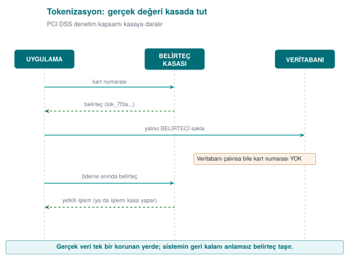

The power of tokenization is that the real data is concentrated in **a single small, very well protected**
system. The rest of the application, the databases, reports, and logs see only the token; even if these are
compromised, the card data doesn't leak. This is the technical counterpart of [Week 1](../week-1/cen429-week-1.md)'s "transfer the threat"
response: never storing card data at all and using the payment provider's tokenization service dramatically
shrinks the app's PCI DSS scope. In mobile payments, the card information downloaded to the phone also isn't the
real card number, but a device-specific **token number**.

The token's **format can be preserved**: a meaningless but still 16-digit number in place of a 16-digit card
number. This lets legacy systems (field length, validation rules) keep working unchanged. Format-preserving
encryption (the FF1 algorithm in NIST SP 800-38G) does the same job without a key and a vault.

### 3. Pseudonymization: a keyed digest

For analysis or testing you often need to "bring together the same person's records without knowing who they
are." Running the ID number through a plain digest (SHA-256) **isn't enough**: an 11-digit ID number has a small
number of possible values, and an attacker can compute and compare the digest of all of them. The correct
approach is to use **HMAC with a secret key**:

```c title="Anahtarlı takma ad: HMAC-SHA256(anahtar, kimlik_no)"
/* code/common/cen429_kripto.h */
unsigned char takma_ad[32];
kripto_hmac_sha256(takma_anahtari, 32, kimlik_no, strlen(kimlik_no), takma_ad);
/* Veri kümesinde kimlik_no yerine hex(takma_ad)'ın ilk 16 baytı saklanır */
```

The key is kept **separate** from the data set. For someone without the key, going from the pseudonym back to
the ID number means trying every possible ID number, which is infeasible without knowing the key. If the key is
lost or destroyed, the data becomes effectively anonymous.

### 4. Test and development data

Copying real production data into a test environment is one of the most common causes of data leaks: test
environments are less protected and accessed by more people. In order of preference for test data:

1. **Fully synthetic data:** data generated from scratch, never derived from real records. The safest. Every
   example in this course follows this path: the card numbers, keys, and IDs are synthetic.
2. **Static masking:** a copy of the production data is taken, the sensitive fields in the copy are permanently
   altered (pseudonym, shuffling, generalization), and only then is it moved into the test environment.
3. **Dynamic masking:** the data itself isn't changed; the database returns query results masked according to
   the user's role. Convenient, but the data still sits in the database in full.

### 5. Masking in logs and error messages

In [Week 2](../week-2/cen429-week-2.md) we saw the audit log's "never log" list: password, PIN, token, key, full card number. A rule is one
thing; **guaranteeing** it is another. Two approaches are used together:

- **Prevention at the source:** sensitive values are kept in a special type, and that type's print function
  always produces masked output. Even if a programmer accidentally logs it, the full value never comes out.
- **Filtering at the output:** as a final step in the logging library, card-number-like sequences (13–19 digits,
  passing the Luhn check) and values that follow keys like `parola=`, `token=` are automatically masked.

```c title="Günlük satırında 'parola=' ve 'pin=' değerlerini maskele (basit süzgeç)"
#include <string.h>
#include <ctype.h>

void gunluk_suz(char *satir)
{
    static const char *anahtarlar[] = { "parola=", "pin=", "token=" };
    for (size_t k = 0; k < sizeof anahtarlar / sizeof anahtarlar[0]; k++) {
        char *p = satir;
        while ((p = strstr(p, anahtarlar[k])) != NULL) {
            p += strlen(anahtarlar[k]);
            while (*p && !isspace((unsigned char)*p))
                *p++ = '*';                    /* değeri yerinde maskele */
        }
    }
}
```

!!! warning "The filter is the second line of defence"
    Filtering at the output is a **safety net** for catching a programmer's mistake; the real fix is never
    sending sensitive data to the log in the first place. A filter can't recognise every format (e.g., `"parola":
    "..."` inside JSON), and by the time it runs, the data has already sat in memory and perhaps in a buffer.
    That's why, in release builds in the field, removing the logging code entirely is often the preferred choice
    (Week 1's trade-off record).

### Which technique, when?

| Situation | Recommended technique |
| --- | --- |
| Card number on a call-centre screen | Masking at display (last 4); the full value never reaches the client at all |
| Storing a card number for recurring payments | Tokenization (preferably at the payment provider) |
| Analysing the same customer's behaviour | Keyed pseudonym (HMAC) |
| Test database | Synthetic data; failing that, static masking |
| Log file | Prevention at the source + filtering at the output |
| Sharing as open data | Anonymization (generalization, aggregation) and assessing re-identification risk |

!!! question "How does an evaluator test this?"
    They search the app's screens, the network responses sent to the client, log files, crash reports, and
    backups for a full card number, ID number, or password. They check whether masking is done on the client
    (weak) or on the server. They check whether pseudonymization uses a keyless digest, and ask whether real data
    is present in the test environment.

!!! note "How it's done in the field"
    In payment libraries, the UI is only given masked information like the card's last four digits and card type;
    a device-specific token number is used in place of the real card number. The library's guide separately
    documents how the requirements "error codes must not give the attacker hints" and "sensitive data must not be
    written to logs in the clear" are met (e.g., all logging code is stripped at build time).

---

## 13. Data in use: secure erasure in memory and device binding

A secret eventually gets opened up in memory **in order to be used**. At that moment it's at risk: a memory
dump, a debugger, swap space, other code that later reuses the same memory. In
[Week 1, §17](../week-1/cen429-week-1.md#erasing-secrets-from-memory-recipe-132) we saw "dead-store elimination"
with `explicit_bzero` and wiping a secret from memory (Recipe 13.2), plus
[preventing memory from being written to disk](../week-1/cen429-week-1.md#preventing-memory-from-being-written-to-disk-recipe-133)
(Recipe 13.3); this week we build the additional layers — blocking dumps, memory locking, and **device binding** —
for **data in use**.

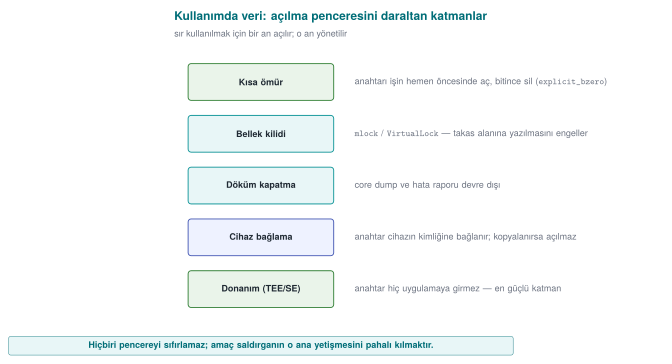

| Layer | Purpose | Linux | Windows |
| --- | --- | --- | --- |
| Blocking dumps | The secret must not end up in a core/crash file | `setrlimit(RLIMIT_CORE, 0)` | `SetErrorMode` |
| Memory locking | The page must not be written to swap | `mlock` | `VirtualLock` |
| Secure erasure | Overwrite once the job is done (can't be removed) | `OPENSSL_cleanse` | `SecureZeroMemory` |
| Short lifetime | Keep the secret for the shortest time, don't copy it | — | — |

### Demo 8 — mlock + secure erasure

!!! info "Demo 8 · `code/week-03/08-bellek-silme` · data in use (textbook Recipe 13.2–13.3)"
    The program sets up three layers: it disables dumps, locks memory, and wipes with `kripto_temizle` once the
    job is done; then it confirms the buffer was actually zeroed after wiping. (It doesn't repeat the gcore
    demonstration from Week 1; it adds new layers.)

```text title="sh demo.sh — gerçek çıktı (WSL)"
Katman 1 - cokme dokumu kapatildi (RLIMIT_CORE=0): TAMAM
Katman 2 - mlock ile takasa (swap) yazma engellendi: TAMAM
Sir kullaniliyor: uzunluk = 20, dolu bayt = 20
Katman 3 - guvenli silme sonrasi dolu bayt = 0
   ==> sir bellekten temizlendi.
--------------------------------------------------------------
OPENSSL_cleanse cagrisi sayisi -> 2
```

On Windows (`.\demo.ps1`) the same three layers are set up with `SetErrorMode` + `VirtualLock` +
`SecureZeroMemory`; the output is also "TAMAM" (OK). Unlike `memset`, a call to `OPENSSL_cleanse`/
`SecureZeroMemory` **cannot be removed by the compiler as a "dead store"** — it stays a real call in the machine
code (the demo counts this with `objdump`).

### 13.1 Device binding

Part of protecting data **in use** is **binding the key to a specific device/version**. If we wrap the key with
a value derived from the device's fingerprint (manufacturer, model, device ID, version string), the files can't
be **opened** even if they're copied to another device. The correct approach: not XOR or an unsalted digest, but
**salted derivation with HKDF** and wrapping with AEAD. This is exactly the innermost layer of the security
shell in Section 14; we'll combine it with RASP in [Week 6](../week-6/cen429-week-6.md).

!!! success "Rule"
    Open the secret **at the last possible moment**, keep it for **the shortest time**, don't **copy** it, and
    **wipe** it once the job is done with a function the compiler can't remove. Lock memory and disable dumps
    where possible. **Bind the storage key to the device and the version** (HKDF + AEAD).

!!! note "How it's done in the field"
    In the mobile payment library, the single-use payment key is opened only at the moment of payment, only in
    the native layer, and is wiped by being overwritten with random data immediately after use. The storage key
    is bound to the device fingerprint; even if the phone is cloned, it can't be decrypted on another device
    (Demo 9, Attack 2). On the Java side, sensitive data is kept in wipeable `byte[]` arrays rather than
    unwipeable `String`s.

!!! question "How does an evaluator test this?"
    An evaluator takes a memory dump during and after payment and searches for the key; they also copy the files
    to another device and try opening them there. They confirm from the binary's machine code that secure erasure
    actually happens (and that the compiler didn't remove it).

!!! warning "Common mistakes and a checklist"
    - [ ] Is the secret wiped with a function that can't be removed, rather than `memset`?
    - [ ] Are there unnecessary copies of the secret (logs, temporary buffers, `String`)?
    - [ ] Is the storage key bound to the device/version?
    - [ ] Is the crash dump disabled and is sensitive memory locked?

---

## 14. Security shells: defence in depth made concrete

Now we bring together every piece of this week into a single idea. We never leave a sensitive asset to **a
single** protection; we wrap it in **nested shells** that correspond to every stage of its lifecycle:

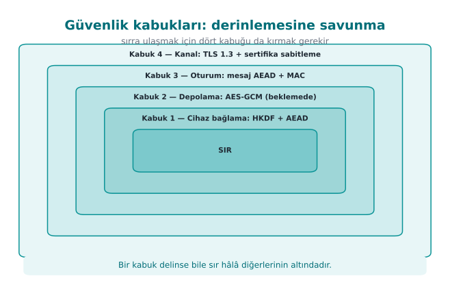

To reach the secret, the attacker must open **all four shells**, in order: break TLS, break the message
encryption, break the storage encryption, **and** be on the right device. This is the "don't rely on TLS alone
in transit," "field encryption at rest," and "device binding in use" principles combined into a single table.

### Demo 9 — Wrapping and unwrapping a key with four shells

!!! info "Demo 9 · `code/week-03/09-guvenlik-kabugu` · defence in depth"
    The program wraps a 16-byte secret with four AES-GCM shells in sequence (innermost: a device-bound HKDF key),
    then unwraps it in reverse order. Two attacks: (1) if one bit of the packet is tampered with, the outermost
    shell won't open; (2) if the packet is copied to another device (a different fingerprint), the outer shells
    open but the **innermost device shell** does not.

```text title="sh demo.sh — gerçek çıktı"
SARMA (dis dunyaya dogru): sir -> K1 -> K2 -> K3 -> K4
  Kabuk 1 (cihaz baglama)     :  44 bayt
  Kabuk 4 (kanal/TLS benzeri) : 128 bayt  <- aktarilan paket
ACMA (ice dogru): K4 -> K3 -> K2 -> K1 -> sir
  Kabuk 4/3/2/1 acildi: TAMAM
  Cozulen SIR : deadbeef...ba98  -> sir DOGRU
==============================================================
SALDIRI 1 - Paketin bir biti kurcalanirsa (Kabuk 4):
  Kabuk 4 acildi: RED  (GCM etiketi tutmadi)
SALDIRI 2 - Paket BASKA cihaza kopyalanirsa (yanlis parmak izi):
  Dis 3 kabuk acildi: TAMAM
  Kabuk 1 (cihaz baglama) BASKA cihazda acildi: RED
  ^ Anahtarlar kopyalansa bile sir baska cihazda ACILAMAZ.
```

In the normal flow, the four shells opened in sequence and the secret came back correctly. When a single bit was
tampered with, the outermost GCM tag held and was rejected at that layer. When the packet was moved to another
device, the outer three shells (whose keys are portable) opened, but the **device-bound innermost shell** could
not — the secret was never obtained. In real products this innermost shell is most often **whitebox crypto**
([Week 11](../week-11/cen429-week-11.md)).

This shell approach is a bridge to the rest of the term: native code hardening and RASP (Weeks 4, 6, 9) protect
the shells **at runtime**; crypto and key hierarchy ([Week 10](../week-10/cen429-week-10.md)) correctly generate and manage the shells' keys;
whitebox (Week 11) strengthens the innermost shell; certification (Weeks 12–13) demands **proof** of all these
layers. In other words, this week's data-security section is the backbone of your security guide (S5, S7), and
every week ahead makes one more shell concrete.

### The shell matrix in the field: one asset, five stages

To keep the idea simple, Demo 9 built all four shells with AES-GCM. In a mobile payment library that passed an
independent lab's certification, the shells were defined as follows (names generalized):

| Shell | Content |
| --- | --- |
| **1** | Keeping the payment key in **whitebox DES form**: the key is never present in the clear at any stage |
| **2** | Whitebox AES-CBC with the wallet key + **device binding** + **app binding** |
| **3** | At rest: whitebox AES-CBC with the wallet key + SHA-256 MAC + device and **version binding**. In transit: AES with a **session key** derived from the configuration key + SHA-256 MAC + device and version binding |
| **4** | TLS + public-key pinning + server certificate-chain check |
| **Outer** | Authentication code: session key + device and version binding (both sides verify each other) |

What's really instructive is the matrix showing which shells are present at **every stage** of the same asset's
lifecycle:

| Stage | Shell 1 | Shell 2 | Shell 3 | Shell 4 |
| --- | :-: | :-: | :-: | :-: |
| **Transfer** from server to library | ✔ | ✔ | ✔ (session key) | ✔ |
| **Storage** in the local database | ✔ | ✔ | ✔ (MAC) | — |
| Decryption on the Java side and the native API call | ✔ | ✔ | — | — |
| Java side during payment | ✔ | ✔ | — | — |
| **Native** side during payment | ✔ | — | — | — |

How to read the matrix:

- Shells open one by one as the asset moves from outside toward the moment of use. But even at the innermost
  stage (the payment computation on the native side), **one shell remains**: the key is used in its whitebox
  form and never becomes exposed in the clear.
- The shells are four layers deep only for **sensitive** assets. Less sensitive ("normal") assets are protected
  by a single shell at rest and only the outer two shells in transit. Applying the strongest protection to every
  asset unnecessarily raises performance and maintenance cost; the C/I classification in the asset table is the
  basis for this decision.
- The exposure that remains in use (the moment of processing in memory) is protected not by the shells but by
  **RASP and code hardening** (Weeks 4, 6, and 9).
- The library keeps card profiles, limited-use keys, the remaining key count, card status, transaction records,
  and the device fingerprint in the local database (SQLite). When a record is deleted, **or an attack is
  detected**, all of these tables are wiped.

!!! tip "Through today's eyes"
    The DES-based form in Shell 1 was chosen to fit the payment schemes' cryptogram algorithms of that era; the
    CBC + separate MAC combination was also a common choice of the period. In a new design today, an AES-based
    whitebox and AEAD modes would be preferred. But the matrix idea itself is timeless: in your project's
    security guide (S7) you will fill in this table for every sensitive asset.

!!! success "Rule"
    When protecting a critical asset, don't ask "which single measure?" — ask "which **layers**?" Put a shell at
    every stage (transport, storage, use); build the shells with **mutually independent keys** so that breaking
    one doesn't hand over the others. Put device/version binding at the innermost layer.

!!! question "How does an evaluator test this?"
    An evaluator asks for the security-shell matrix and confirms that at least one shell exists at **every
    stage** for every sensitive asset; they check that the shells are applied **in the right order** and that
    the keys are **not shared**. In a penetration test, breaking a single shell isn't enough; they report that
    the protections must be broken **together** (in a chain) — this is the proof that defence in depth is
    working.

!!! warning "Common mistakes and a checklist"
    - [ ] Is there a shell at all three stages (transport/storage/use) for every sensitive asset?
    - [ ] Were the shells built with independent keys (does one not hand over another)?
    - [ ] Is the innermost shell bound to the device/version?
    - [ ] Is there a message-level shell for "don't rely on TLS alone"?

---

## 15. Introduction to whitebox cryptography (motivation)

The hidden assumption behind this entire week is: **the key sits in the clear in memory the moment it's used.**
In the "the device's owner is the attacker" scenario ([Week 1](../week-1/cen429-week-1.md), white box), the attacker can read memory and
attach a debugger; they can catch that moment and steal the key. Secure erasure and memory locking **narrow**
this window but don't close it.

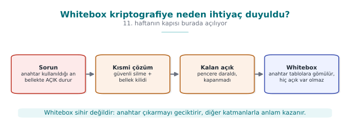

**Whitebox cryptography** is a radical answer to this problem: it embeds the algorithm (e.g., AES) into a set of
tables such that, even while running, **the raw key never appears in the clear in memory**; the key is "baked"
into the tables. This way, even if the attacker sees all of memory, they can't read the key directly. This is
the real-world form of the **innermost** layer of the security shell from Section 14.

!!! note "This is only an introduction"
    We'll cover, in detail, how whitebox is built, its attacks (BGE, DFA, DCA), and why "every published design
    has been broken" in
    [Week 11](../week-11/cen429-week-11.md#1-three-attacker-models-black-grey-white-box). This week it's enough
    to know **why it exists**: the problem of the key sitting in the clear in memory.

!!! warning "Whitebox isn't a magic wand"
    Whitebox crypto alone isn't sufficient: even if the attacker can't read the key, they can call the whitebox
    function **itself** like an "oracle" and use it, or copy the code (code lifting) and run it elsewhere.
    That's why whitebox always comes **together with other shells**: device binding, RASP ([Week 6](../week-6/cen429-week-6.md)), server-side
    risk checks, and key renewal. It's still a **security shell**.

---

## 16. Common misunderstandings

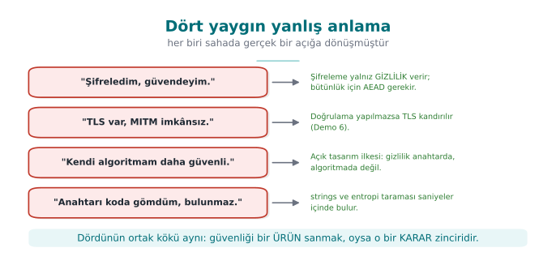

!!! failure "\"I encrypted it, so it's secure.\""
    Encryption only provides **confidentiality**. Integrity needs AEAD (or encrypt-then-MAC); otherwise an
    attacker can change the data without being noticed. Also, encryption is useless if the key is poorly managed
    (embedded in code, derived without a salt).

!!! failure "\"HTTPS/TLS is in place, so MITM is impossible.\""
    TLS only protects when it's **configured correctly**. If the client doesn't validate the certificate, doesn't
    check the hostname, or swallows errors, MITM is still possible (Demo 6). Also, if the endpoint is
    compromised, the inside of TLS must be protected too ("don't rely on TLS alone").

!!! failure "\"I hashed the password with SHA-256, it's secure.\""
    Plain (unsalted, single-round) SHA-256 is **not** password protection: it's fast, there's no salt, and the
    same password gives the same hash for everyone. Argon2id/scrypt/high-round PBKDF2 + a random salt are needed.

!!! failure "\"The nonce/IV must be secret.\""
    No. The nonce and IV are **not secret** (they travel in the clear alongside the ciphertext); they only need
    to be **unique/random**. The only thing that's secret is **the key**.

!!! failure "\"If I write my own encryption algorithm, no one can break it.\""
    Security must rest on the secrecy of **the key** (Kerckhoffs), not on a secret algorithm. Homemade crypto
    gets broken almost every time. Use standard, open, proven constructions.

---

## 17. Term project: this week

This week you will write the **data security** sections of your security guide. For the midterm submission:

- [ ] **S5 — Asset list (draft):** List every sensitive asset in your project in a table. For each asset: where
      it sits (file/DB/memory), when it's created/deleted, whether it needs **confidentiality (C)**,
      **integrity (I)** (or **I+**), and by what mechanism it's protected.
- [ ] **S7 — Data security + security shell matrix:** For every asset, show the three states (in transit/at
      rest/in use) and which shell is wrapped around it in each state. Write down your secure-erasure policy.

```markdown title="S5 varlik tablosu sablonu (surekli kolonlar icin genisletin)"
| Varlik              | Konum        | C/I | Koruma mekanizmasi           |
| ------------------- | ------------ | --- | ---------------------------- |
| Oturum anahtari     | bellek       | C,I | HKDF + AES-GCM, kullaninca sil |
| Yerel veri anahtari | bellek       | C,I | KDF(parola,tuz) + cihaz baglama |
| Kart no (ornek)     | DB (sifreli) | C,I | AES-256-GCM alan sifreleme   |
```

```markdown title="S7 guvenlik kabugu matrisi sablonu"
| Varlik          | Asama    | Ic kabuk  -> ...  -> Dis kabuk   |
| --------------- | -------- | -------------------------------- |
| Oturum anahtari | aktarim  | cihaz -> depo -> mesaj -> TLS+pin |
| Oturum anahtari | depolama | cihaz -> AES-GCM                 |
| Oturum anahtari | kullanim | kisa omur + guvenli silme        |
```

!!! tip "Course requirement families"
    These sections satisfy the following requirement families: `CEN429-DT` (data in transit), `CEN429-DR` (data
    at rest), `CEN429-DU` (data in use), `CEN429-AS` (asset protection), `CEN429-CR` (crypto and keys). For every
    requirement, add a row to the S17 compliance matrix: requirement → state → document section → evidence
    (test/code).

---

## 18. Class activities

!!! example "Activity 1 — Stop the MITM with your own hands (15 min, pairs)"
    Run Demo 6 under WSL. Then comment out the `SSL_set1_host` line in the `dogrula` (validate) mode inside
    `tls_istemci.c` and rebuild. What changes when the attacker connects to the server (14444)? Without hostname
    checking, **which** attacker is still caught, and which one gets through? (Hint: self-signed vs. a different
    name but a valid chain.)

!!! example "Activity 2 — Make the nonce repeat (10 min, individual)"
    In Demo 1's code, replace `kripto_rastgele(nonce, 12)` with `memset(nonce, 0, 12)` and encrypt two different
    files. Are the nonce fields at the start of the two ciphertexts the same? Take the XOR of the ciphertexts and
    compare it against the XOR of the plaintexts (like in Demo 2). What do you see? Why is this a security hole?

!!! example "Activity 3 — A map of the three data states (15 min, group of 3–4)"
    Consider a **"health-tracking app"**: the user records measurements on their phone, uploads them to the
    cloud, and the doctor views them. Draw a table: for every sensitive data item (measurement, identity,
    doctor's note), write the threat and the defence in each of the three states (in transit/at rest/in use).
    Fill in the security-shell matrix for at least **two** assets.

!!! example "Activity 4 — Tuning KDF cost (10 min, individual)"
    In Demo 4, add 5,000,000 to the round counts. In your view, what's the highest acceptable delay at user login
    (100 ms? 500 ms?)? Find the round count that gives that delay. If the attacker's machine is 1000× faster than
    yours, how much does this round count slow them down?

---

## 19. Code-reading exercises

!!! question "Reading 1 — Is this TLS client secure?"
    ```c
    SSL_CTX *ctx = SSL_CTX_new(TLS_client_method());
    SSL *ssl = SSL_new(ctx);
    SSL_set_fd(ssl, sock);
    if (SSL_connect(ssl) == 1)
        printf("Baglanti guvenli!\n");
    ```
    ??? success "Answer"
        **No.** There's no `SSL_CTX_set_verify` or `SSL_set1_host`; no validation happens at all. This code
        accepts every certificate (including the attacker's). The "Baglanti guvenli" (connection secure) message
        is misleading — there's protection against a passive eavesdropper only, none against an active MITM
        (Demo 6, Scenario 1).

!!! question "Reading 2 — Why is this decryption dangerous?"
    ```c
    EVP_DecryptUpdate(c, duz, &len, sc, sc_boy);
    EVP_DecryptFinal_ex(c, duz + len, &len);   /* dönüş değeri okunmuyor */
    kullan(duz);
    ```
    ??? success "Answer"
        `EVP_DecryptFinal_ex`'s return value (the tag verification in GCM) is **not checked**. `kullan(duz)`
        (use the plaintext) is called even if the tag doesn't hold — tampered data is accepted. If verification
        fails, the output **must not be used** (Demo 1).

!!! question "Reading 3 — Where is this key derivation weak?"
    ```c
    unsigned char anahtar[32];
    SHA256((unsigned char*)parola, strlen(parola), anahtar);
    ```
    ??? success "Answer"
        Single-round, **unsalted** SHA-256 is not a password KDF: it's fast (brute force is cheap), there's no
        salt (a rainbow table works), and the same password gives the same key for everyone. PBKDF2/scrypt/
        Argon2id + a random salt are needed (Demo 4).

---

## 20. On your own

These exercises aren't graded; they're for reinforcement. All of them are done on your own computer, using the
`code/week-03` demos.

??? question "Exercise 1 — Easy: the power of AAD"
    Add associated data (AAD) to Demo 1: when encrypting, give `kripto_gcm_sifrele` the AAD `"surum=1"`
    (version=1); when decrypting, give `"surum=2"` (version=2). What happens? What is AAD for?

    ??? success "Expected result"
        The tag doesn't hold; decryption is rejected. AAD isn't encrypted, but it **is verified**; the encrypted
        body can't be carried into a different context (a different version, a different record).

??? question "Exercise 2 — Easy: fix the salt"
    In Demo 4, make both salts the same. Do the two "different users" now get the same key? Why is this bad?

??? question "Exercise 3 — Medium: CBC + a random IV"
    Rewrite Demo 1 with AES-256-CBC (the mode changes; also add HMAC for integrity — "encrypt-then-MAC"). Why
    isn't CBC enough on its own? Compare it with GCM: which one is less prone to mistakes?

    ??? tip "Hint"
        CBC only provides confidentiality; without a MAC, an attacker can flip bits in CBC (a padding oracle).
        GCM does both in a single call.

??? question "Exercise 4 — Medium: break pinning (with your own certificate)"
    In Demo 6, generate the attacker certificate with the **real** server's key (use the same `gercek.key`).
    Does the pinning client now accept it? Why does this show that pinning pins the "key," not the certificate?

??? question "Exercise 5 — Medium: masking"
    Add a "masked view" to Demo 7: decrypt the card number and show only the last 4 digits
    (`**** **** **** 4242`). What's the difference between masking and encryption? Which one is suitable for
    logs?

??? question "Exercise 6 — Medium: a fifth layer for the shell"
    Add an HMAC layer to Demo 9 (a separate MAC outside every shell). How does the total size change? If one
    shell's MAC doesn't hold, at which layer do you stop?

??? question "Exercise 7 — Hard: verify HKDF by hand"
    Compare the HKDF in `cen429_kripto.h` against RFC 5869 Test Case 1 (the IKM, salt, and info values are in the
    RFC). Is your output byte-for-byte identical to the RFC's OKM? (Hint: the test in `code` already does this.)

??? question "Exercise 8 — Hard: nonce counter overflow"
    A system uses a 96-bit nonce as a counter and increments it by 1 for every message. After how many messages
    does the nonce repeat? When does the collision probability of a random nonce become a concern (the birthday
    bound)?

??? question "Exercise 9 — Hard: the whitebox motivation"
    While running Demo 8 (WSL), stop the program with `gdb` and inspect memory (the gcore method from [Week 1](../week-1/cen429-week-1.md)
    Demo 2). Does the secret appear in memory **before** it's wiped? How does this explain which problem
    whitebox cryptography is trying to solve?

??? question "Exercise 10 — Medium: AES-GCM or ChaCha20-Poly1305?"
    A mobile app will run on an older phone **without** AES hardware acceleration. Which AEAD would you choose,
    and why? Would your choice change if the same app ran on a modern server?

    ??? success "Expected result"
        On a device without AES hardware, **ChaCha20-Poly1305** is generally faster and more side-channel
        resistant. On a modern server, **AES-GCM** is very fast thanks to AES-NI. Both are AEAD; both are
        acceptable from a security standpoint, and the choice is driven by performance/platform.

??? question "Exercise 11 — Hard: constant-time comparison"
    A MAC verification is done with `if (memcmp(beklenen, gelen, 32) == 0)`. Why can this be a **timing** leak?
    How would you fix it?

    ??? tip "Hint"
        `memcmp` stops at the first differing byte; an attacker can guess the correct MAC byte by byte by
        measuring the response time. Fix: a **constant-time** comparison like `CRYPTO_memcmp` (always compares
        every byte).

??? question "Extra exercise A — Easy: how predictable is rand()?"
    Write a small program that generates a 16-byte "key" with `srand(time(NULL))` and prints the key in hex.
    Then write a second program: it should try every second of the last 10 minutes as a seed and find the same
    key. How many tries did it take? Then rewrite the first program using `kripto_rastgele()`
    (`code/common/cen429_kripto.h`).

??? question "Extra exercise B — Easy: measure modulo bias"
    Generate uniform bytes over 0–255 and produce a million digits with `bayt % 10`; count how many times each
    digit comes up. Then repeat with `aralikta_rastgele(10)` from the "Random numbers" section. Write the
    difference as a table.

    ??? tip "Expected result"
        Since 256 = 25·10 + 6, digits 0–5 come up about 4% more often than 6–9 (26/256 versus 25/256). With the
        rejection method, every digit comes out statistically equal.

??? question "Extra exercise C — Medium: forgetting Final in AEAD"
    Remove the `EVP_DecryptFinal_ex` check from the `aes_gcm_coz` function in the "Using crypto APIs correctly"
    section (use only the buffer that `EVP_DecryptUpdate` wrote). Change one byte of the ciphertext and decrypt.
    What does the program return? Then put the check back and run the same test. Express this difference, in one
    sentence, as a finding you'd write into an evaluation report.

??? question "Extra exercise D — Medium: key renewal with envelope encryption"
    Encrypt five small files, each with its own random DEK, using AES-GCM; wrap the DEKs with a KEK and write
    them into the file header along with the key version. Then rotate the KEK: re-wrap only the wrapped DEKs.
    Show, with digests, that the file contents (the ciphertexts) never changed.

??? question "Extra exercise E — Medium: hunting for fail-open"
    Look for the pattern from the "Critical reading: the door that opens silently" section in a project you wrote
    yourself or wrote previously: is there a place where a security check continues processing inside a `catch`
    block or a "not found" branch? For every finding, answer the questions "what input triggers it, what's the
    result, and how does it fail closed instead?"

??? question "Extra exercise F — Medium: a card number in the log"
    Write a filter that finds 13–19-digit sequences that pass the Luhn check in a log file and masks all but the
    last four digits. For testing, use only **synthetic** numbers (e.g., sequences you generate yourself that
    pass the Luhn check but don't belong to a real card).

??? question "Extra exercise G — Hard: a shell matrix for your own project"
    For your project's two most sensitive assets, fill in a table in the form of the "Shell matrix in the field":
    stages (transport, storage, in-memory processing) × shells. In every cell, write which algorithm, which key,
    and which binding is used; give a justification for any cell left empty.

---

## 21. Self-check

??? question "1. What are the three states of data? Name one threat and one defence for each."
    In transit (eavesdropping/MITM → TLS+pinning), at rest (file theft → AEAD field encryption), in use (memory
    dump → secure erasure + short lifetime).

??? question "2. What is AEAD? How does it differ from AES-CTR?"
    AEAD provides confidentiality **and** integrity+identity together (ciphertext + a verified tag). AES-CTR
    provides confidentiality only; if no MAC is added, tampering isn't noticed.

??? question "3. Why is nonce reuse a disaster in GCM/CTR?"
    The same keystream is used in two messages; `C1 ⊕ C2 = P1 ⊕ P2` holds, and the keystream leaks. If one
    plaintext is known, the other is decrypted (and in GCM, authentication collapses too).

??? question "4. Why isn't ECB used?"
    It encrypts every block independently; the same plaintext block gives the same ciphertext block, so patterns
    leak (the ECB penguin).

??? question "5. What's the difference between salt and nonce? Are both secret?"
    Salt prevents rainbow tables in password-based key derivation; nonce makes the keystream unique within an
    encryption mode. **Neither is secret**; salt must be random+unique, nonce must not repeat per key.

??? question "6. Why should the round count in PBKDF2 be high? What's today's recommendation?"
    It makes every password attempt more expensive. OWASP 2023: ≥ 600,000 rounds for PBKDF2-HMAC-SHA256;
    Argon2id where possible.

??? question "7. What are HKDF's two stages? What is 'info' for?"
    Extract (master secret+salt → PRK) and Expand (PRK+info → key). `info` provides purpose/session separation;
    a different info gives a different key.

??? question "8. What is forward secrecy?"
    Old sessions can't be decrypted even if today's key leaks. Provided via a one-way chain / ephemeral DH;
    default in TLS 1.3.

??? question "9. How is the server's identity verified in the TLS 1.3 handshake?"
    The server presents its certificate and signs the handshake with its private key (CertificateVerify). The
    client validates the chain, the expiration, and **the hostname** (and the pin, if applicable).

??? question "10. What is the most dangerous default in an OpenSSL client?"
    **Not validating** the certificate. If `SSL_VERIFY_PEER` and `SSL_set1_host` aren't explicitly set, MITM is
    possible.

??? question "11. What does certificate pinning catch, and what does hostname validation catch?"
    Hostname catches a certificate carrying the wrong name; pinning catches a certificate with a valid chain but
    an **unexpected key** (mis-issued).

??? question "12. What is TOFU, and what is its limit?"
    Remembering the key from the first connection and warning if it later changes (the SSH model). The first
    connection is unprotected; it isn't as strong as a PKI.

??? question "13. What's the difference between field encryption and data masking?"
    Field encryption is reversible (opened with a key), for confidentiality. Masking is generally irreversible/
    partial, meant to reduce unnecessary exposure (logs, screens).

??? question "14. What are the three layers for protecting data in use?"
    Blocking dumps (RLIMIT_CORE/SetErrorMode), memory locking (mlock/VirtualLock), secure erasure
    (OPENSSL_cleanse/SecureZeroMemory) + a short lifetime.

??? question "15. What is a security shell? Give an example."
    Wrapping a secret in nested, independent layers. Example: device binding → storage AES-GCM → message AEAD →
    TLS+pinning (Demo 9). The attacker must break all of them.

??? question "16. How is device binding done correctly?"
    Derivation **salted with HKDF** from the device fingerprint, and **wrapping with AEAD**; not an unsalted
    digest or XOR.

??? question "17. Which problem does whitebox cryptography try to solve?"
    The problem of the key sitting in the clear in memory at the moment of use: embedding the key in tables so
    its raw form is never shown (against a white-box attacker).

??? question "18. What does 'don't rely on TLS alone' mean?"
    Because endpoints can be untrusted, adding one more layer inside TLS (message-level AEAD+MAC); the body stays
    encrypted even if TLS is bypassed.

??? question "19. How many bytes is the GCM tag, and what is it a function of?"
    16 bytes; it's a function of the ciphertext, the AAD, and the key. That's why an attacker can't produce the
    correct tag without the key.

??? question "20. If you encrypt the same plaintext twice with AES-GCM, are the ciphertexts the same?"
    No — because the nonce is different each time, the ciphertext and the tag are different too. Getting the same
    output is a sign of nonce reuse (dangerous).

??? question "Additional question 1. Why can't `rand()` be used for security-relevant values? What's used instead?"
    It's a statistical generator; if the seed or a few outputs are known, the whole sequence can be computed.
    Instead, the operating system's CSPRNG: Linux `getrandom`, Windows `BCryptGenRandom`, OpenSSL `RAND_bytes`.

??? question "Additional question 2. `EVP_DecryptUpdate` wrote the plaintext, but `EVP_DecryptFinal_ex` returned failure. What should you do?"
    Wipe the plaintext without using it and reject the operation; the tag didn't hold, meaning the data may have
    been tampered with.

??? question "Additional question 3. Why is `memcmp` a problem for MAC comparison?"
    It stops at the first differing byte; the duration leaks how many bytes were correct (a timing attack). A
    constant-time comparison (`CRYPTO_memcmp`) is used instead.

??? question "Additional question 4. What is a crypto-period? Is a key deleted immediately once it expires?"
    It's the length of time a key is allowed to be used. Once it expires it's no longer used to encrypt new data,
    but it may be kept for decryption until old data has been re-encrypted; then it's destroyed.

??? question "Additional question 5. In envelope encryption, why doesn't all the data get re-encrypted when the KEK is rotated?"
    The data is encrypted with DEKs; the KEK only wraps the DEKs. When the KEK changes, only the small wrapped
    DEKs need to be re-wrapped.

??? question "Additional question 6. What happens if `SSL_set1_host` isn't called in an OpenSSL client?"
    Even if chain validation is done, the name in the certificate isn't checked; a valid certificate the attacker
    obtained for their own domain is accepted.

??? question "Additional question 7. In pinning, why is the SPKI digest used instead of the certificate, and why is a backup pin used?"
    The SPKI digest doesn't change when the certificate is renewed with the same key. A backup pin prevents the
    app from becoming unable to connect (getting "bricked") if the primary key is lost or compromised.

??? question "Additional question 8. What does 'fail-open' mean? Give an example."
    It's when a security check falls back to a "passed" result on error. Example: in pinning code, catching a
    key-store error, only logging it, and accepting the connection.

??? question "Additional question 9. Why isn't a plain SHA-256 digest of an ID number enough for pseudonymization?"
    The number of possible values is small; an attacker can compute the digest of every possible ID number and
    match it. A keyed HMAC is used instead, with the key kept separate from the data set.

??? question "Additional question 10. Why does tokenization shrink an application's PCI DSS scope?"
    The application, databases, and logs hold a meaningless token instead of the real card number; the real data
    sits only in a small, well-protected token vault.

??? question "Additional question 11. In the field shell matrix, why does only one shell remain on the native side during payment, and is that enough?"
    The outer shells have been opened so the key can be used in the computation; the remaining shell is the
    whitebox form, meaning the key is still not in the clear. It's not sufficient on its own: protection at that
    moment is completed by RASP and code hardening.

---

## 22. Quiz-1-style sample questions

!!! note "Quiz-1 (Week 8) includes short questions and code reading of this kind"
    1. (Multiple choice) Which of the following provides **both** confidentiality **and** integrity?
       a) AES-CTR · b) SHA-256 · c) **AES-GCM** · d) AES-ECB
    2. (True/False) "The nonce must be kept secret." → **False** (it must be unique, not secret).
    3. (Short answer) A client validates the certificate in TLS but doesn't call `SSL_set1_host`. Which attacker
       still succeeds? → An attacker with a certificate that has a valid chain but is issued for **a different
       name**.
    4. (Code reading) In GCM decryption code where `EVP_DecryptFinal_ex`'s return value isn't checked, which
       security property is lost? → **Integrity/authentication** (tampered data is accepted).
    5. (Matching) PBKDF2 ↔ CPU cost · Argon2id ↔ CPU+memory · HKDF ↔ session-key derivation · pinning ↔ SPKI.

---

## 23. Resources and further reading

**Textbook** — J. Viega, M. Messier, *Secure Programming Cookbook for C and C++*, O'Reilly, 2003:

- Recipe 4.9 (salt/nonce/IV), 4.10 (key from a password — PBKDF2), 4.11 (key from a master secret), 4.13 (managing
  key material)
- Recipe 5.15 (file/disk encryption), 6.18 (encryption + integrity together)
- Recipe 8.19 (validation without a PKI / TOFU), 8.20–8.21 (forward secrecy)
- Recipe 9.1–9.3 (SSL client/server), 10.7–10.9 (certificate validation, hostname, whitelist = pinning)
- Recipe 13.2–13.3 (secure erasure from memory, preventing memory from being written to disk)
- Recipe 11.1–11.4 (types of random numbers, Unix and Windows infrastructure), 11.11 (unbiased random integer in
  a range)
- Recipe 9.4 (secure communication with WinInet on Windows — today's counterpart is WinHTTP/Schannel)

**Open standards and resources**

- NIST SP 800-57 Part 1 (key management, crypto-period), SP 800-90A (random bit generators), SP 800-38G (FF1,
  format-preserving encryption), SP 800-38C (CCM).
- PCI DSS v4.0 (masking card numbers at display, tokenization); pseudonymization and anonymization under KVKK and
  GDPR.
- M. Georgiev et al., "The Most Dangerous Code in the World: Validating SSL Certificates in Non-Browser
  Software," ACM CCS 2012.
- MITRE CWE: CWE-330 (insufficient randomness), CWE-338 (weak PRNG), CWE-208 (information leak via timing
  discrepancy), CWE-297 (missing hostname validation), CWE-636 (fail-open: not failing securely), CWE-359
  (exposure of private personal information), CWE-532 (insertion of sensitive information into a log file).

- NIST SP 800-38D (AES-GCM), SP 800-132 (PBKDF2), SP 800-108 / RFC 5869 (HKDF), RFC 8439 (ChaCha20-Poly1305),
  RFC 9106 (Argon2), RFC 7914 (scrypt), RFC 8446 (TLS 1.3).
- OWASP: Password Storage Cheat Sheet, Transport Layer Security Cheat Sheet, Certificate and Public Key Pinning,
  MASVS-CRYPTO / MASVS-NETWORK.
- MITRE CWE: CWE-295 (improper certificate validation), CWE-323 (reusing a nonce/IV), CWE-327 (use of a broken
  crypto algorithm), CWE-916 (use of a password hash with insufficient computational effort), CWE-311 (missing
  encryption of sensitive data).

??? abstract "Glossary"
    | Term | Turkish | Short definition |
    | --- | --- | --- |
    | AEAD | Kimlik doğrulamalı şifreleme | Encryption that provides confidentiality + integrity + identity together (AES-GCM) |
    | Nonce | Bir kez kullanılan sayı | A value that must not repeat per key; not secret |
    | IV | Başlangıç vektörü | A non-secret starting value that adds randomness to a mode |
    | Salt / Tuz | Tuz | A random value that defeats rainbow tables when deriving a key from a password |
    | KDF | Anahtar türetme fonksiyonu | A function that generates a key from a password/secret (PBKDF2, HKDF, Argon2id) |
    | MAC | Mesaj kimlik doğrulama kodu | Proof of integrity+identity with a shared key (HMAC) |
    | Forward secrecy | İleri gizlilik | Past sessions stay safe even if today's key leaks |
    | Pinning | Sabitleme | Enforcing a specific expected key/certificate (SPKI) |
    | TOFU | İlk kullanımda güven | Remembering the first-seen key and warning if it changes (the SSH model) |
    | Data at rest / in transit / in use | Beklemede / aktarımda / kullanımda veri | The three states of data |
    | Security shell | Güvenlik kabuğu | Wrapping a secret in nested, independent protection layers |
    | Whitebox crypto | Beyaz kutu kriptografi | An implementation that embeds the key into tables so it's never shown in the clear in memory |
    | Device binding | Cihaz bağlama | Binding a key to a specific device/version so it can't be opened elsewhere |
    | Hybrid encryption | Hibrit şifreleme | Carrying a symmetric key with asymmetric crypto, then encrypting the data with it (TLS) |
    | Encrypt-then-MAC | Önce şifrele sonra MAC | Placing a MAC over the ciphertext; the correct internal ordering inside AEAD |
    | Tokenization | Tokenizasyon | Replacing the real value with a meaningless token and keeping it in a vault |
    | Constant-time compare | Sabit zamanlı karşılaştırma | Comparing secrets/MACs without leaking timing (`CRYPTO_memcmp`) |
    | AAD | İlişkili veri | Additional data in AEAD that isn't encrypted but is verified (bound) |

!!! info "Next week"
    **[Week 4](../week-4/cen429-week-4.md) — Code Hardening: C/C++.** This week we learned to protect data (keys, plaintext) with correct
    encryption and key management; but the encryption code itself is also a C/C++ program, and a buffer overflow,
    format-string bug, or integer error can leak the very key and plaintext we carefully protected this week.
    Week 4 covers preventing exactly these mistakes with the SEI CERT C/C++ rules, and catching them with static
    analysis and sanitizers.

