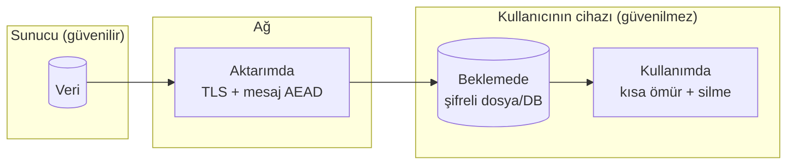
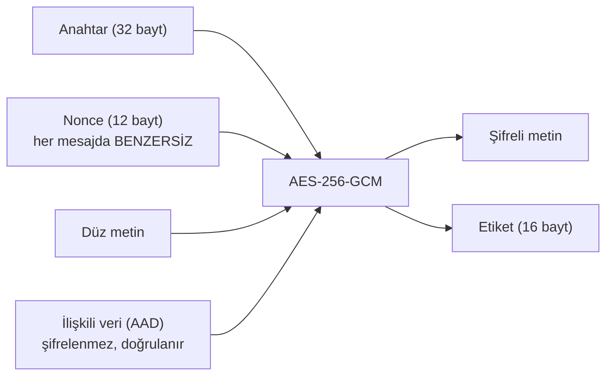
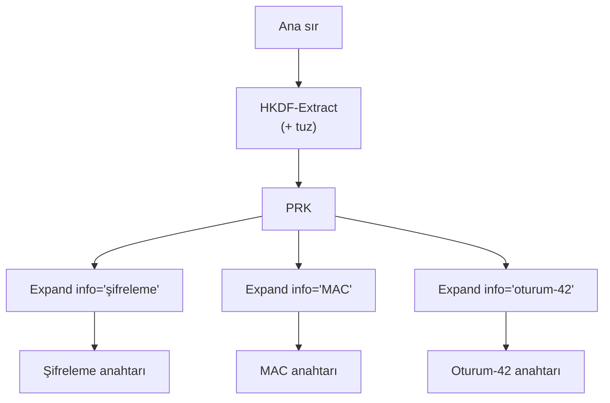
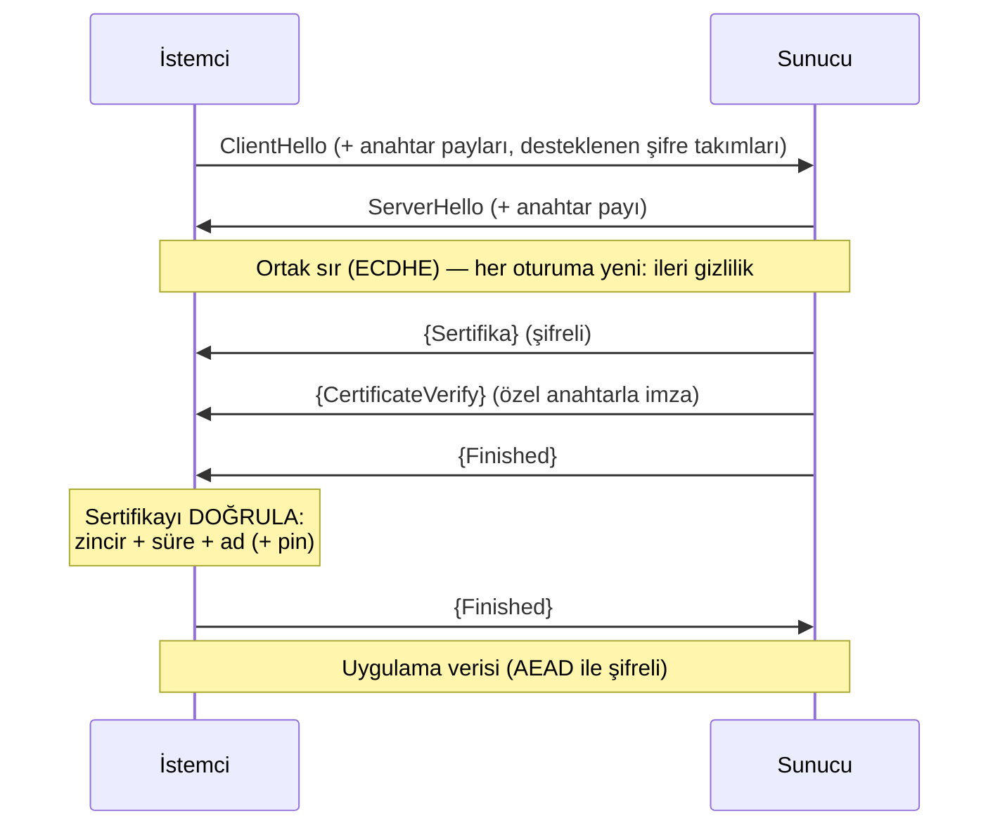
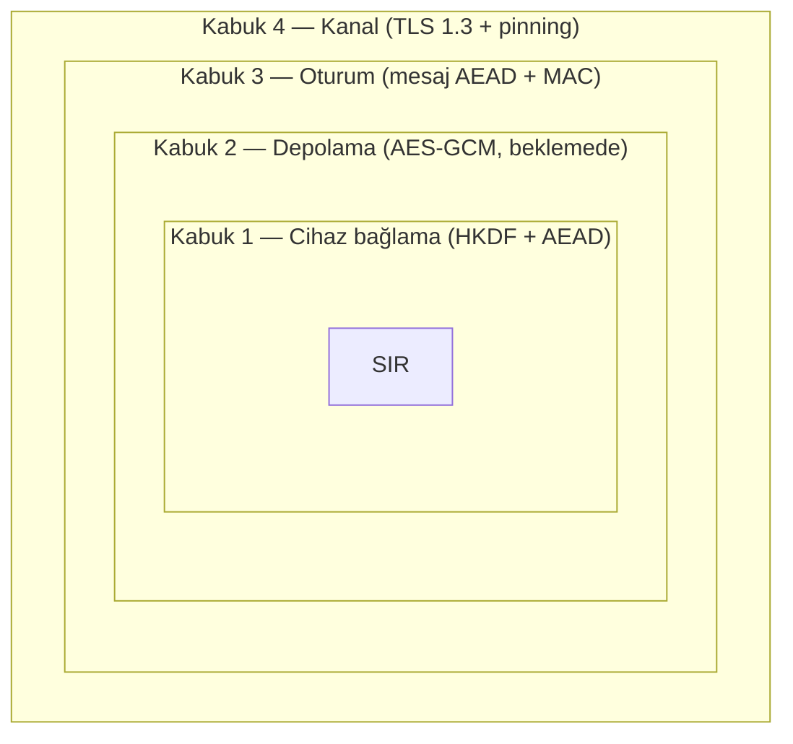

# Hafta 3 — Veri Güvenliği: Aktarımda, Beklemede, Kullanımda

| | |
| --- | --- |
| **Tarih** | 02.10.2026 |
| **Öğrenme çıktıları** | ÖÇ.2 (şifreleme yöntemleri ve güvenli iletişim ilkeleri) · ÖÇ.4 (güvenli iletişim kanalı kurma) |
| **Süre** | 3 saat (3 × 50 dakika) |
| **Ön bilgi** | C'de işaretçi, dizi, dosya; Hafta 1'den bellek düzeni ve güvenli silme; Linux/WSL terminalinde `cd`, derleme |
| **Uygulamalar** | [`code/week-03`](https://github.com/ucoruh/cen429-secure-programming/tree/main/code/week-03) — 9 demo; Windows'ta `.\demo.ps1`, WSL/Linux'ta `sh demo.sh` |

<!-- materyal:basla -->

<div class="materyal" markdown>

[:material-file-pdf-box: Ders notu (PDF)](cen429-week-3-ders-notu.pdf){ .md-button download="cen429-week-3-ders-notu.pdf" }
[:material-file-word-box: Ders notu (DOCX)](cen429-week-3-ders-notu.docx){ .md-button download="cen429-week-3-ders-notu.docx" }
[:material-presentation: Sunum (PDF)](cen429-week-3-sunum.pdf){ .md-button download="cen429-week-3-sunum.pdf" }
[:material-microsoft-powerpoint: Sunum (PPTX)](cen429-week-3-sunum.pptx){ .md-button download="cen429-week-3-sunum.pptx" }
[:material-language-html5: Sunum (HTML, çevrimdışı)](cen429-week-3-sunum.html){ .md-button download="cen429-week-3-sunum.html" }
[:material-folder-zip: Tümünü indir (ZIP)](cen429-week-3-materyal.zip){ .md-button download="cen429-week-3-materyal.zip" }
[:material-fullscreen: Sunumu tam ekran aç](cen429-week-3-sunum.html){ .md-button .md-button--primary target=_blank }

</div>

<div class="sunum-cercevesi">
<iframe src="../cen429-week-3-sunum.html" title="Hafta 3 — Veri Güvenliği: Aktarımda, Beklemede, Kullanımda" loading="lazy" allowfullscreen></iframe>
</div>

<p class="sunum-ipucu">Sunumun içine tıklayıp ok tuşlarıyla ilerleyin; tam ekran için sunumun sağ altındaki düğmeyi ya da yukarıdaki "Sunumu tam ekran aç" bağlantısını kullanın.</p>

<!-- materyal:bitis -->

!!! abstract "Bu haftanın sonunda şunları yapabileceksiniz"
    1. Bir verinin üç durumunu — **aktarımda, beklemede, kullanımda** — ayırt etmek ve her biri için doğru koruma
       aracını seçmek.
    2. **Simetrik/asimetrik şifreleme, özet (hash), MAC ve kimlik doğrulamalı şifrelemeyi (AEAD)** birbirinden ayırmak;
       AES-GCM ile bir dosyayı şifreleyip **tek bir bit değişince** çözmenin reddettiğini göstermek.
    3. **IV/nonce ve tuzun** ne işe yaradığını ve **nonce yeniden kullanımının** neden felaket olduğunu; **ECB kipinin**
       neden desen sızdırdığını çalışan örnekte göstermek.
    4. Paroladan anahtar türetmeyi (**PBKDF2, scrypt, Argon2id**) ve ana sırdan **oturum anahtarı türetmeyi (HKDF)**
       ile **ileri gizliliği** açıklamak.
    5. **TLS 1.3 el sıkışmasını** çizmek; **sertifika ve ana makine adı doğrulamanın**, **sertifika sabitlemenin
       (pinning)** ve **TOFU'nun** neden gerektiğini; doğrulamasız bir istemciye karşı **localhost MITM** kurup
       sabitleme ile durdurmak.
    6. **Beklemede** (dosya/veritabanı şifreleme, veri maskeleme) ve **kullanımda** (bellekte kısa ömür, güvenli silme,
       cihaz bağlama) veriyi korumak.
    7. **Güvenlik kabuğu** kavramını — bir sırrın taşıma, depolama ve kullanım boyunca **iç içe katmanlarla** sarılması —
       kurmak ve "yalnız TLS'e güvenmeme" ilkesini savunmak.
    8. **Whitebox kriptografinin** neden var olduğunu (motivasyon) bir cümleyle söylemek.

??? info "Ders akışı (öğretim üyesi için zaman planı)"
    | Zaman | Bölüm | Ne yapılıyor |
    | --- | --- | --- |
    | 0:00–0:10 | Giriş | Üç veri durumu, güvenlik kabuğu çerçevesi, laboratuvar kontrolü |
    | 0:10–0:30 | 2 | Simetrik/asimetrik/özet/MAC/AEAD; **Demo 1** (AES-GCM) |
    | 0:30–0:50 | 3 | IV/nonce/tuz; **Demo 2** (nonce tekrarı), **Demo 3** (ECB deseni) |
    | 0:50–1:00 | Ara | |
    | 1:00–1:20 | 4 | PBKDF2/scrypt/Argon2id; **Demo 4** (tur sayısı ve tuz) |
    | 1:20–1:35 | 5 | HKDF, oturum anahtarları, ileri gizlilik; **Demo 5** |
    | 1:35–2:00 | 6 | TLS 1.3, doğrulama, sabitleme; **Demo 6** (MITM → pinning) — **sınıf etkinliği** |
    | 2:00–2:10 | Ara | |
    | 2:10–2:30 | 7, 8 | Beklemede/kullanımda veri; **Demo 7** (SQLite), **Demo 8** (bellek) |
    | 2:30–2:50 | 9, 10 | **Demo 9** (kabuk); whitebox motivasyonu; proje adımı |
    | 2:50–3:00 | 11+ | Proje (S5/S7), kendini sınama, kapanış |

!!! tip "Laboratuvarı önceden hazırlayın (bu hafta kripto var)"
    Demolar hem **Windows** (Visual Studio 2022 derleyicisi, ek kurulum yok) hem **WSL/Linux** (GCC + OpenSSL) üzerinde
    **aynı kaynaktan** derlenir. Kripto işlevleri ortak bir başlık üzerinden gelir: Linux'ta **OpenSSL**, Windows'ta
    işletim sisteminin kendi **BCrypt (CNG)** kütüphanesi. Bu yüzden Windows'ta öğrencinin OpenSSL kurmasına gerek yoktur.

    === "Windows"
        ```powershell
        cd code
        .\build.ps1
        cd week-03\01-aes-gcm-dosya
        .\demo.ps1        # ya da demo.cmd dosyasına çift tıklayın
        ```

    === "WSL / Linux"
        ```bash
        cd code
        ./build.sh
        cd week-03/01-aes-gcm-dosya
        sh demo.sh
        ```

    === "Visual Studio 2022"
        `Dosya > Aç > Klasör > code/` deyin; üstteki yapılandırmadan **"Windows (MSVC)"** ya da **"WSL (GCC)"** seçin;
        **Derle > Tümünü Derle**. İkili dosyalar her demonun `bin\windows` ya da `bin/linux` klasörüne düşer.

    Kurulum ayrıntıları ve güvenlik kuralları: [`code/README.md`](https://github.com/ucoruh/cen429-secure-programming/blob/main/code/README.md).

!!! warning "Etik kural — bu derste her hafta geçerli"
    Bu derste saldırıları **görerek** öğreniyoruz. Bütün demolar yalnız kendi klasörlerinde dosya üretir, yönetici
    yetkisi istemez, sistem sertifika deposuna dokunmaz ve **ağı yalnız `localhost` (127.0.0.1)** üzerinde kullanır.
    TLS demosundaki "araya girme" (MITM) benzetimi tamamen kendi bilgisayarınızda, **kendi ürettiğimiz sertifikalarla**
    çalışır. Öğrendiğiniz teknikleri **yalnız kendi bilgisayarınızda ve verilen demolar üzerinde** deneyin. Başkasının
    trafiğini izinsiz dinlemek ya da araya girmek suçtur.

---

## 1. Verinin üç hâli ve güvenlik kabuğu

Geçen iki hafta "hata → saldırı → düzeltme" ile programın **kendisini** koruduk. Bu hafta odağı **veriye** çeviriyoruz.
Bir sır — parola, ödeme anahtarı, kişisel bilgi — yaşam döngüsü boyunca **üç ayrı hâlde** bulunur ve her hâlin tehdidi
de savunması da farklıdır:

| Hâl | Nerede? | Tehdit | Tipik savunma |
| --- | --- | --- | --- |
| **Aktarımda** (in transit) | Ağ üzerinde, iki uç arasında | Dinleme, araya girme (MITM), yeniden oynatma | TLS 1.3, sertifika doğrulama + sabitleme, mesaj düzeyi AEAD |
| **Beklemede** (at rest) | Disk, veritabanı, yedek | Dosyanın/DB'nin çalınması | Dosya/alan şifreleme (AEAD), cihaza bağlı anahtar, maskeleme |
| **Kullanımda** (in use) | RAM, önbellek, yazmaç | Bellek dökümü, hata ayıklayıcı, takas alanı | Kısa ömür, güvenli silme, bellek kilitleme, whitebox |



!!! note "Bu haftanın ana fikri: güvenlik kabuğu"
    Tek bir önlem yetmez. Hassas bir varlığı, yaşam döngüsünün **her aşamasında** iç içe geçmiş **koruma katmanlarıyla**
    (kabuklarla) sararız: en dışta kanal güvenliği (TLS), onun içinde mesaj düzeyi şifreleme, onun içinde depolama
    şifrelemesi, en içte cihaza bağlı bir anahtar. Saldırganın sırra ulaşması için **hepsini sırayla** kırması gerekir.
    Bu, Hafta 1'de tanıttığımız **derinlemesine savunmanın** somut hâlidir; Bölüm 9'da bir anahtarı
    dört kabukla sarıp açacağız.

Dönem boyunca kullandığımız **örnek mimariyi** (bir mobil ödeme uygulaması + onun kritik işlerini yapan bir güvenlik
kütüphanesi) hatırlayın. Bu hafta o mimarideki üç arayüzü dolduruyoruz: telefon ↔ sunucu (aktarımda), telefondaki
şifreli veritabanı (beklemede) ve ödeme anında bellekte açılan anahtar (kullanımda).

Bu mimaride telefon **güvenilmez ortamdır** (kullanıcı — yani potansiyel saldırgan — cihazın sahibidir; root alınmış,
hata ayıklayıcı bağlanmış olabilir). Sunucu tarafı güvenilirdir. Aradaki her arayüz için şu soruları sorarız: hangi
veri geçiyor, hangi hâlde (aktarım/depolama/kullanım), kimlik nasıl doğrulanıyor, gizlilik mi bütünlük mü yoksa ikisi
birden mi gerekiyor? Bu haftanın demoları tam olarak bu soruların cevaplarını kurar:

- **Telefon ↔ sunucu (aktarımda):** TLS 1.3 + sertifika doğrulama + sabitleme, üstüne mesaj düzeyi AEAD (Demo 6, 1, 5).
- **Yerel veritabanı (beklemede):** hassas alanlar cihaza bağlı bir anahtarla AES-GCM (Demo 7, 4).
- **Ödeme anında bellek (kullanımda):** anahtar en kısa süre açık, kullanınca güvenli silme, cihaz bağlama (Demo 8, 9).

Bütün örnek değerler **sentetiktir** (uydurma); gerçek anahtar, kart numarası, cihaz kimliği ya da IP kullanılmaz.

---

## 2. Şifreleme temelleri: hangi araç neyi korur?

Kriptografi tek bir şey değildir; **farklı hedefler için farklı araçlar** vardır. En sık karıştırılan dört aileyi
netleştirelim.

| Araç | Ne sağlar? | Anahtar | Örnek | Bu derste |
| --- | --- | --- | --- | --- |
| **Simetrik şifreleme** | Gizlilik | Tek gizli anahtar (her iki taraf) | AES, ChaCha20 | Dosya/DB/oturum şifreleme |
| **Asimetrik şifreleme** | Gizlilik + anahtar dağıtımı | Açık/özel çift | RSA-OAEP, ECIES | Anahtar kurulumu, TLS |
| **Özet (hash)** | Bütünlük parmak izi (anahtarsız) | Yok | SHA-256, SHA-3 | Parmak izi, HKDF/HMAC yapıtaşı |
| **MAC** | Bütünlük **+ kimlik** (paylaşılan anahtar) | Tek gizli anahtar | HMAC-SHA-256, CMAC | Mesajın değişmediğini kanıtlama |
| **Dijital imza** | Bütünlük + kimlik + **inkâr edilemezlik** | Açık/özel çift | Ed25519, RSA-PSS | Sertifikalar, sürüm imzalama (H10) |
| **AEAD** | Gizlilik **ve** bütünlük **birlikte** | Tek gizli anahtar | AES-GCM, ChaCha20-Poly1305 | Bu haftanın ana aracı |

!!! danger "En sık yapılan iki hata"
    1. **Yalnız şifrelemek, bütünlüğü unutmak.** Sadece şifreli metin (ör. AES-CTR) saldırganın **fark edilmeden**
       bitleri değiştirmesini engellemez. Şifreleme gizliliği sağlar, **bütünlüğü değil**.
    2. **Kendi şifrenizi/kipinizi yazmak.** Kerckhoffs ilkesi: güvenlik algoritmanın gizliliğine değil **anahtarın**
       gizliliğine dayanmalı. Standart, denenmiş yapıları kullanın.

### 2.1 Kimlik doğrulamalı şifreleme (AEAD): tek çağrıda gizlilik + bütünlük

Doğru cevap neredeyse her zaman **AEAD**'dir (Authenticated Encryption with Associated Data). AEAD tek bir işlemle iki
şey yapar: veriyi şifreler (**gizlilik**) ve şifreli metnin (isteğe bağlı olarak ek "ilişkili veri"nin) değişmediğini
kanıtlayan bir **etiket (tag)** üretir (**bütünlük + kimlik**). Çözerken etiket **doğrulanır**: tek bir bit bile
oynadıysa çözme **reddedilir**.

İki modern AEAD:

- **AES-GCM** — donanım AES hızlandırması olan işlemcilerde (çoğu masaüstü/sunucu) çok hızlı. NIST SP 800-38D.
- **ChaCha20-Poly1305** — AES donanımı olmayan cihazlarda (bazı mobil/gömülü) daha hızlı ve yan kanala dirençli.
  RFC 8439.



!!! info "Kitap tarifi ve güncelleme"
    Ders kitabı (Viega & Messier) simetrik şifrelemeyi **tarif 5.x**'te işler ama 2003 tarihlidir: DES/3DES/RC4 ve ayrı
    MAC önerir. Biz bunları **AES-GCM / ChaCha20-Poly1305** (AEAD) ile güncelliyoruz. "Şifreleme ile bütünlüğü birlikte
    çalıştırma" fikri tarif **6.18**'de geçer; AEAD bunun tek çağrıya inmiş hâlidir.

### 2.2 Simetrik mi, asimetrik mi? Cevap: ikisi birden (hibrit)

Simetrik şifreleme (AES) hızlıdır ama iki tarafın **aynı gizli anahtarı** bilmesini gerektirir; bu anahtarı güvensiz bir
ağdan nasıl paylaşırsınız? Asimetrik şifreleme (RSA, eliptik eğri) bu sorunu çözer: herkesin bir **açık** anahtarı
(dağıtılır) ve bir **özel** anahtarı (gizli kalır) vardır. Ama asimetrik işlemler yavaştır ve büyük veriye uygun
değildir.

Gerçek sistemler bu yüzden **hibrit** çalışır: asimetrik kripto yalnız **küçük bir simetrik anahtarı** güvenle taşımak
(ya da anlaşmak) için kullanılır; asıl veri o simetrik anahtarla AEAD ile şifrelenir. TLS tam olarak budur: el
sıkışmada eliptik eğri Diffie-Hellman ile bir oturum anahtarı üzerinde anlaşılır, sonra bütün trafik AES-GCM ya da
ChaCha20-Poly1305 ile şifrelenir.

| Özellik | Simetrik (AES) | Asimetrik (RSA/EC) |
| --- | --- | --- |
| Hız | Çok hızlı | Yavaş (100–1000×) |
| Anahtar | Tek, paylaşılan gizli | Açık/özel çift |
| Kullanım | Büyük veri şifreleme | Anahtar taşıma, imza |
| Bu haftada | Dosya/DB/oturum | TLS anahtar kurulumu (H10) |

### 2.3 Blok mü, akış mı? Kip (mode) neden önemli?

AES bir **blok şifresidir**: tek seferde 16 baytlık bir bloğu şifreler. Bloktan uzun veriyi şifrelemek için bir **kip**
(mode of operation) gerekir ve **kip seçimi güvenliği belirler**:

- **ECB** — her bloğu bağımsız şifreler; **desen sızdırır** (Demo 3). Kullanmayın.
- **CBC** — her blok bir öncekine zincirlenir; rastgele IV ister, tek başına bütünlük **vermez**, padding oracle'a açık.
- **CTR** — bloğu bir akış şifresine çevirir (anahtar akışı ⊕ veri); nonce tekrarına **çok** hassas (Demo 2).
- **GCM** — CTR + Galois MAC; **AEAD**. Modern varsayılan.

ChaCha20 zaten bir **akış şifresidir** (blok kavramı yoktur); Poly1305 MAC'iyle birleşince AEAD olur. Sonuç aynı:
**gizlilik + bütünlük tek pakette.**

### 2.4 Özet, MAC ve imza: hangisi ne zaman?

Bu üçü **bütünlük** ailesindendir ama farklı şeyler kanıtlarlar; karıştırmak yaygın bir hatadır:

- **Özet (hash)** anahtarsızdır. Yalnız verinin **değişip değişmediğini** (parmak izi) gösterir. Ama saldırgan veriyi
  değiştirip **özeti de yeniden hesaplayabilir**; bu yüzden özet tek başına bütünlük **kanıtı değildir**. Özet, HMAC ve
  HKDF gibi yapıların yapıtaşıdır ve parmak izi/karşılaştırma için kullanılır. Eski MD5/SHA-1 çakışmaya açıktır;
  SHA-256/SHA-3 kullanın.
- **MAC** (ör. HMAC-SHA-256) **paylaşılan gizli anahtar** ister. "Bu mesajı, anahtarı bilen biri gönderdi ve
  değişmedi" der. İki taraf da anahtarı bildiği için MAC **inkâr edilemezlik sağlamaz** (hangi taraf ürettiği
  ayırt edilemez). Sırları MAC ile karşılaştırırken **sabit zamanlı** karşılaştırma kullanın (`CRYPTO_memcmp`), düz
  `memcmp` zamanlama sızdırır.
- **Dijital imza** (ör. Ed25519, RSA-PSS) **açık/özel anahtar** çiftiyle çalışır. Yalnız özel anahtar sahibi imza
  üretebilir, herkes açık anahtarla doğrular; bu yüzden **inkâr edilemezlik** sağlar. Sertifikalar ve sürüm imzalama
  (Hafta 10) bununla çalışır.

| Soru | Doğru araç |
| --- | --- |
| "Bu dosya bozuldu mu?" (anahtarsız parmak izi) | Özet (SHA-256) |
| "Bu mesajı anahtarı bilen biri mi yolladı ve değişmedi mi?" | MAC (HMAC) |
| "Bunu **kesinlikle** şu kişi/sunucu imzaladı, inkâr edemez" | İmza (Ed25519) |
| "Bunu hem gizle hem bütünlüğünü kanıtla" | AEAD (AES-GCM) |

!!! tip "AEAD çoğu zaman doğru cevaptır"
    Uygulama içinde veri saklıyor ya da bir kanaldan geçiriyorsanız, ayrı ayrı "şifrele + MAC ekle" kurmak yerine
    **AEAD** kullanın; iki işi tek çağrıda, doğru sırada (encrypt-then-MAC) ve daha az hatayla yapar. Ayrı MAC yalnız
    şifrelenmeyecek ama bütünlüğü gereken veriler için (ya da AEAD'nin AAD alanıyla) gerekir.

### Demo 1 — AES-256-GCM ile dosya şifreleme ve kurcalama tespiti

!!! info "Demo 1 · `code/week-03/01-aes-gcm-dosya` · AEAD, NIST SP 800-38D"
    Program bir dosyayı AES-256-GCM ile şifreliyor; çıktı `[12 bayt nonce][şifreli metin][16 bayt etiket]` biçiminde.
    Çözerken etiket doğrulanıyor. Sonra şifreli metnin bir baytını, ardından yalnız etiketin bir baytını değiştirip
    çözmenin **reddedildiğini** görüyoruz.

Şifreleme ve çözmenin özü (kripto çağrıları ortak `cen429_kripto.h` başlığından gelir; Linux'ta OpenSSL EVP, Windows'ta
BCrypt):

```c title="aesgcm.c (özet)"
/* Şifrele: cik = [nonce][şifreli metin][etiket] */
kripto_rastgele(nonce, 12);                 /* her mesaja yeni nonce */
memcpy(cik, nonce, 12);
kripto_gcm_sifrele(anahtar, nonce, 12, NULL, 0,
                   duz, duz_boy, cik + 12, etiket);
memcpy(cik + 12 + duz_boy, etiket, 16);

/* Çöz: etiket doğrulanır; tutmazsa ok == 0 */
int ok = kripto_gcm_coz(anahtar, nonce, 12, NULL, 0,
                        sc, sc_boy, etiket, duz);
if (!ok) { /* REDDET: veri kurcalanmış ya da yanlış anahtar */ }
```

Çalıştırın (Windows'ta `.\demo.ps1`):

```bash
cd code/week-03/01-aes-gcm-dosya
sh demo.sh
```

WSL'de alınan **gerçek çıktı** (kısaltılmış):

```text title="sh demo.sh — çıktı"
ADIM 2 - Sifrele
Sifrelendi: cikti/gizli.txt -> cikti/gizli.enc
   (53 bayt sifreli metin + 12 nonce + 16 etiket)
Sifreli dosyanin ilk baytlari (nonce + sifreli metin):
   000000 74 15 41 da 38 0b 86 1e 92 2f 42 eb 1c ac 49 54
   000010 07 2b 38 e2 3a e4 cd bb fb 7f fb 1c e5 ec a5 36

ADIM 3 - Dogru sekilde coz (etiket tutar)
Cozuldu ve DOGRULANDI: ... -> cikti/cozulen.txt (53 bayt)
   IBAN: TR00 0000 0000 0000 0000 0000 00
   Bakiye: 12345

ADIM 4 - Saldiri: sifreli metnin 20. baytini degistir
DOGRULAMA BASARISIZ: etiket tutmadi, veri kurcalanmis ya da
yanlis anahtar. Cozme REDDEDILDI.   (cikis kodu 2)

ADIM 5 - Saldiri: yalniz ETIKETin son baytini degistir
DOGRULAMA BASARISIZ: ... Cozme REDDEDILDI.   (cikis kodu 2)
```

Satır satır ne oldu:

- **ADIM 2:** Rastgele bir 12 baytlık nonce üretildi ve dosyanın başına yazıldı. Nonce **gizli değildir** (dosyada açık
  durur); yalnız **benzersiz** olması gerekir.
- **ADIM 3:** Aynı anahtar ve nonce ile çözüldü, etiket tuttu, düz metin geri geldi.
- **ADIM 4:** Şifreli metnin 20. baytını bir XOR ile değiştirdik. GCM etiketi bütün şifreli metnin üzerinde
  hesaplandığı için **tek bayt bile** etiketi bozar; çözme reddedildi (çıkış kodu 2).
- **ADIM 5:** Bu kez veriye değil **yalnız etikete** dokunduk; yine reddedildi. Etiket, veriyle birlikte anahtarın da
  fonksiyonudur; saldırgan doğru etiketi anahtar olmadan üretemez.

!!! success "Kural"
    Bir şeyi şifreliyorsanız **AEAD kullanın** (AES-GCM ya da ChaCha20-Poly1305). Her mesaja **benzersiz nonce** verin.
    Etiketi **her zaman doğrulayın** ve doğrulama başarısızsa **hiçbir çıktı üretmeyin** (fail-closed). Bütünlüğü ayrı
    bir adıma bırakmayın.

!!! note "Sahada nasıl uygulanır?"
    Mobil ödeme kütüphanesinde yerel veritabanındaki her hassas alan ve sunucuya giden her mesaj AEAD ile korunur.
    "İlişkili veri" (AAD) alanına şifrelenmesi gerekmeyen ama **bağlanması** gereken bilgiler (sürüm no, kayıt kimliği,
    kart şeması etiketi) konur; böylece bir kaydın şifreli gövdesi başka bir bağlama **taşınamaz**.

!!! question "Değerlendirici nasıl test eder?"
    Bağımsız bir değerlendirici şifreli dosyada/DB'de bir baytı değiştirir ve uygulamanın **sessizce yanlış veri
    döndürmediğini, açıkça reddettiğini** doğrular. Ayrıca aynı düz metnin iki kez şifrelendiğinde **farklı** şifreli
    metin verdiğini (nonce'un tekrar etmediğini) kontrol eder.

!!! warning "Sık hatalar ve kontrol listesi"
    - [ ] Nonce her mesajda benzersiz mi? (Sabit nonce = felaket, bkz. Demo 2)
    - [ ] Etiket saklanıyor ve çözerken doğrulanıyor mu?
    - [ ] Doğrulama başarısızsa çıktı üretmeden mi çıkılıyor?
    - [ ] Anahtar koda gömülü değil, güvenli bir kaynaktan mı geliyor?
    - [ ] AES-CBC/CTR'yi tek başına (MAC'siz) kullanmıyorsunuz, değil mi?

---

## 3. IV/nonce ve tuz: aynı anahtarı tekrar kullanmak

Üç kavram sürekli karıştırılır. Üçü de **gizli değildir**, ama güvenlik doğru kullanımlarına bağlıdır (kitap **tarif
4.9**):

| Kavram | Nerede? | Kural | Bozulursa |
| --- | --- | --- | --- |
| **Tuz (salt)** | Paroladan anahtar türetmede | Her parola/kayıt için **rastgele** | Önhesaplı tablolar (rainbow) işe yarar |
| **IV** (başlangıç vektörü) | CBC gibi kiplerde | **Rastgele**, öngörülemez | İlk blok sızar (BEAST türü) |
| **Nonce** (bir kez kullanılan sayı) | CTR/GCM gibi kiplerde | Aynı anahtarla **asla tekrar etmesin** | Anahtar akışı sızar (aşağıda) |

### 3.1 Nonce yeniden kullanımı neden felakettir?

GCM ve CTR, anahtardan ve nonce'dan bir **anahtar akışı** üretip düz metinle XOR'lar: `C = P ⊕ AA(anahtar, nonce)`.
Aynı anahtar **ve** aynı nonce ile iki mesaj şifrelenirse iki mesajda da **aynı** anahtar akışı kullanılır:

```text
C1 = P1 ⊕ AA        C2 = P2 ⊕ AA
C1 ⊕ C2 = (P1 ⊕ AA) ⊕ (P2 ⊕ AA) = P1 ⊕ P2
```

Anahtar akışı yok olur; saldırgan iki **düz metnin XOR'unu** ele geçirir. Bir mesajı biliyorsa (ya da tahmin ederse)
diğerini tamamen çözer.

### Demo 2 — Nonce tekrarının iki düz metnin XOR'unu sızdırması

!!! info "Demo 2 · `code/week-03/02-nonce-tekrari` · nonce yeniden kullanımı"
    Program iki farklı mesajı önce **aynı** nonce ile, sonra **farklı** nonce ile AES-256-GCM ile şifreliyor ve
    `C1 ⊕ C2` ile `P1 ⊕ P2`'yi karşılaştırıyor.

```text title="sh demo.sh — gerçek çıktı (hex kısaltıldı)"
Duz metin 1: "Saldiri safagi 06:00'da baslasin!!"
Duz metin 2: "Toplam bakiye 45000 TL, sifre 1234"
==============================================================
KOTU DURUM - iki mesajda da AYNI nonce:
  C1 xor C2 = 070e1c08081f4942120a0f18024914050 ... 5c1215
  P1 xor P2 = 070e1c08081f4942120a0f18024914050 ... 5c1215
  ==> C1 xor C2 == P1 xor P2 : anahtar akisi SIZDI!
  Saldirgan P1'i biliyorsa P2 = (C1 xor C2) xor P1 =
     "Toplam bakiye 45000 TL, sifre 1234"
==============================================================
IYI DURUM - her mesaja FARKLI nonce:
  C1 xor C2 = 21158fbd64978ae63835b80d1f98c02d2 ... 8385c5af
  P1 xor P2 = 070e1c08081f4942120a0f18024914050 ... 5c1215
  ==> C1 xor C2 != P1 xor P2 : sizinti YOK.
```

Kötü durumda `C1 ⊕ C2` ile `P1 ⊕ P2` **birebir aynı** çıktı: anahtar akışı iptal oldu. Program bir mesajı bilen
saldırganın diğerini `(C1 ⊕ C2) ⊕ P1` ile tamamen çözdüğünü de gösterdi. Farklı nonce'ta ilişki kayboldu.

!!! quote "Gerçek olaylar"
    Nonce/IV tekrarı efsanevi hatalardır: WEP'in kısa IV'i (kablosuz ağ şifrelemesinin çöküşü), Sony PlayStation 3'ün
    ECDSA imzasında **aynı rastgele değeri** iki kez kullanması (özel anahtarın çıkarılması) ve çeşitli TLS
    kütüphanelerinde GCM nonce tekrarı uyarıları. Kural nettir: **nonce asla tekrar etmesin.**

!!! success "Kural"
    Nonce'u ya **rastgele** (12 bayt, çakışma olasılığı ihmal edilebilir) ya da **sayaç** olarak üretin ve **kalıcı
    olarak** takip edin. Aynı anahtarla aynı nonce'u iki kez asla kullanmayın. Çok fazla mesaj şifreliyorsanız
    (2³² üstü) anahtarı yenileyin ya da XChaCha20 gibi geniş nonce'lu bir yapı seçin.

!!! note "Sahada nasıl uygulanır? / Değerlendirici nasıl test eder?"
    Uzun ömürlü bir anahtarla milyonlarca mesaj şifreleyen sistemlerde (ör. sunucu-istemci oturumu) nonce yönetimi bir
    tasarım kararıdır: her mesaja artan sayaç + oturum başına yeni anahtar. Değerlendirici, kodda nonce'un nasıl
    üretildiğine bakar (sabit mi, sayaç kalıcı mı, rastgele mi) ve iki şifreli çıktının nonce alanlarının **asla aynı
    olmadığını** doğrular. Sabit nonce ya da yeniden başlatınca sıfırlanan sayaç doğrudan bulgudur (CWE-323).

!!! warning "Sık hatalar ve kontrol listesi"
    - [ ] Nonce kalıcı mı takip ediliyor (program yeniden başlayınca sıfırlanmıyor)?
    - [ ] Rastgele nonce kullanıyorsanız 96 bit yeterli mesaj sayısı için mi?
    - [ ] Aynı `(anahtar, nonce)` çifti iki mesajda kullanılamaz, doğru mu?

### 3.2 ECB deseni sızdırır

Nonce/IV kullanmayan bir kip olan **ECB** (Electronic Codebook), her 16 baytlık bloğu **bağımsız** şifreler. Aynı düz
metin bloğu **her zaman** aynı şifreli bloğu verir; bu yüzden verideki tekrar eden desenler şifreli metinde de görünür.

### Demo 3 — ECB "pengueni": desen sızıntısı

!!! info "Demo 3 · `code/week-03/03-ecb-desen` · ECB desen sızıntısı"
    İki renkli bir "resim" kuruyoruz (her piksel tam bir 16 baytlık blok). AES-128-**ECB** ile şifrelenince şekil hâlâ
    okunur kalır; AES-256-**GCM** (CTR tabanlı) ile şifrelenince desen kaybolur.

```text title="sh demo.sh — gerçek çıktı"
Orijinal resim (duz metin):
  ################################
  #  ##    ####    ####    ##    #
  ...  (429 rakamlari)  ...
  ################################
==============================================================
AES-128-ECB ile sifreli (her blok ilk baytina gore):
  ================================
  =##==####====####====####==####=
  ...  ayni sekil hala GORUNUYOR ...
  ================================
  ==> Sekil hala GORUNUYOR: ECB deseni sizdirir.
==============================================================
AES-256-GCM (CTR tabanli) ile sifreli, ayni resim:
  : -..--+%%*-:**% . #*#+*.:+* :..
  *.#*##:*%+###:#-*%==*#-+=%:.=***
  ...  desen kayboldu, gurultu ...
  ==> Desen kayboldu: GCM/CTR her blogu farkli sifreler.
```

ECB çıktısında yalnız **iki** karakter var (arka plan bloğu → bir şifreli blok, şekil bloğu → başka bir şifreli blok);
şekil aynen okunuyor. Bu, ünlü "ECB pengueni" örneğinin ASCII hâlidir. GCM'de her blok konuma bağlı farklı bir anahtar
akışıyla şifrelendiği için çıktı gürültüdür.

!!! success "Kural"
    **ECB kullanmayın.** Şifreleme için AEAD (GCM, ChaCha20-Poly1305); disk için XTS-AES; asla desen sızdıran ECB
    değil. "Her blok bağımsız şifrelensin" cazip görünür ama gizliliği bozar.

!!! note "Sahada nasıl uygulanır? / Değerlendirici testi"
    Kod incelemesinde `ECB` geçen her yer bir bulgudur (kitap **tarif 5.x** eski `EVP_*_ecb` çağrılarını içerir;
    güncellenmelidir). Değerlendirici, aynı düz metnin şifreli metninde tekrar eden 16 baytlık bloklar arayarak ECB'yi
    otomatik yakalayabilir.

!!! warning "Sık hatalar ve kontrol listesi"
    - [ ] Kodda `ecb` geçen hiçbir şifreleme kipi yok, değil mi?
    - [ ] Görüntü/yapılandırılmış veri şifrelerken desen sızıntısını düşündünüz mü?
    - [ ] Şifreli çıktı, aynı girdi için her seferinde farklı mı (nonce/IV sayesinde)?

---

## 4. Paroladan anahtar türetme

Parola doğrudan anahtar olamaz: kısa, düşük entropili ve tahmin edilebilir. Paroladan anahtar türetme fonksiyonu (KDF)
iki iş yapar:

1. **Tuz (salt):** Her kullanıcıya/kayda rastgele tuz eklenir. Aynı parola farklı tuzlarla farklı anahtar verir;
   böylece **önhesaplı tablolar (rainbow table)** işe yaramaz ve iki kullanıcının aynı parolası fark edilmez.
2. **Yavaşlık (maliyet):** KDF bilerek yüzbinlerce tur çalışır; bir parolayı denemek pahalı olur, kaba kuvvet yavaşlar.

| KDF | Maliyet ekseni | Ne zaman? | Standart |
| --- | --- | --- | --- |
| **PBKDF2** | Yalnız CPU (tur sayısı) | Uyumluluk/FIPS gerektiğinde | NIST SP 800-132 |
| **scrypt** | CPU **+ bellek** | Bellek-zor isteniyorsa | RFC 7914 |
| **Argon2id** | CPU + bellek + paralellik | **Yeni sistemlerde birinci tercih** | RFC 9106, OWASP |

!!! info "Kitap tarifi ve güncelleme"
    Kitap paroladan anahtar türetmeyi **tarif 4.10**'da PBKDF2 ile, 10.000 tur önererek anlatır. Bugün bu **çok
    düşüktür**: OWASP (2023) PBKDF2-HMAC-SHA256 için **≥ 600.000 tur** ister; mümkünse **Argon2id** tercih edilir.

### Demo 4 — Tur sayısı, süre ve tuzun önemi

!!! info "Demo 4 · `code/week-03/04-parola-anahtar` · PBKDF2, tuz, maliyet"
    Program aynı paroladan PBKDF2 ile anahtar türetir: aynı tuz → aynı anahtar (tabloya açıklık), farklı tuz → farklı
    anahtar; ve tur sayısı arttıkça geçen süreyi ölçer. WSL'de `argon2` aracı varsa Argon2id karşılaştırması da yapılır.

```text title="sh demo.sh — gerçek çıktı (WSL)"
1) TUZUN ONEMI (tur = 100000)
   tuz A -> anahtar = e1d9214abdcfa793...cad33a816
   tuz A -> anahtar = e1d9214abdcfa793...cad33a816   (ayni)
   tuz B -> anahtar = 89cc5979affa2a62...972e020e   (farkli)
==============================================================
2) TUR SAYISI vs SURE (ayni parola, ayni tuz)
   tur =     1000  ->      0.37 ms
   tur =    10000  ->      3.82 ms
   tur =   100000  ->     39.05 ms
   tur =   600000  ->    209.55 ms
   tur =  2000000  ->    628.42 ms
==============================================================
3) Argon2id ile karsilastirma (argon2 araci varsa)
   $argon2id$v=19$m=65536,t=3,p=1$...   0.112 seconds
```

- **Tuz:** Aynı parola + aynı tuz her seferinde **aynı** anahtarı verdi (bu yüzden tuz sabitse saldırgan bir kez tablo
  kurup herkesi arar). Aynı parola + **farklı** tuz tamamen farklı anahtar verdi.
- **Maliyet:** Tur sayısı 1.000'den 2.000.000'a çıkınca süre ~0,4 ms'den ~628 ms'ye çıktı. Bu doğrudan çarpandır:
  saldırganın her parola denemesi de o kadar pahalılaşır. "Kullanıcı girişinde 200 ms" kabul edilebilir; saldırgan için
  saniyede milyarlarca deneme yerine binlerce deneme demektir.
- **Argon2id:** Ek olarak **bellek** (burada 64 MiB) ister; GPU/ASIC ile paralel kaba kuvveti PBKDF2'den daha çok
  zorlaştırır.

!!! warning "Windows notu"
    Windows demosu (`.\demo.ps1`) aynı PBKDF2 ölçümünü yapar (BCrypt üzerinden); süreler makineye göre değişir. `argon2`
    komut satırı aracı Windows'ta gelmez, bu yüzden Argon2id yalnız açıklanır. Anahtar değerleri iki platformda da
    **aynıdır** (aynı standart, aynı test vektörleri).

!!! success "Kural"
    Parola saklarken **düz metin ya da düz SHA-256 kullanmayın**. Rastgele tuz + yeterli maliyetli bir KDF (Argon2id;
    değilse yüksek turlu PBKDF2 ya da scrypt) kullanın. Tuzu şifreyle birlikte saklayın (gizli olması gerekmez);
    maliyeti donanımınıza göre ayarlayıp yıllar içinde artırın.

!!! question "Değerlendirici nasıl test eder?"
    Değerlendirici tuzun **rastgele ve kayıt başına benzersiz** olduğunu, tur/bellek parametrelerinin güncel öneriye
    uyduğunu ve parolanın türetmeden sonra bellekten silindiğini kontrol eder (bkz. Demo 8).

!!! tip "İleri: biber (pepper)"
    Tuza ek olarak, veritabanında **saklanmayan**, uygulama yapılandırmasında ya da bir donanım güvenlik modülünde
    (HSM) tutulan gizli bir **biber (pepper)** de eklenebilir. Böylece yalnız veritabanı çalınırsa (biber sızmadıkça)
    parola özetleri kaba kuvvete karşı bir kat daha korunur. Tuz gizli değildir; biber gizlidir.

---

## 5. Ana sırdan anahtar türetme, oturum anahtarları ve ileri gizlilik

Uzun ömürlü bir "ana sır" **doğrudan** kullanılmaz. Ondan, her amaç ve her oturum için **ayrı** anahtarlar türetilir.
Araç: **HKDF** (RFC 5869), iki aşamalı bir KDF:

- **Extract:** ana sır + tuz → tekdüze bir ara anahtar (PRK).
- **Expand:** PRK + "info" etiketi → istenen boyda anahtar. Farklı `info` → farklı anahtar.



!!! info "Kitap tarifi"
    Kitap **tarif 4.11**'de "tek bir ana sırdan algoritmayla anahtar üretme" ve **4.13**'te anahtar malzemesini güvenli
    yönetme konusunu işler. HKDF bu fikrin standartlaşmış hâlidir. Her türetmenin **benzersiz bir ayırt edici**
    (info/label) içermesi şarttır.

### 5.1 İleri gizlilik (forward secrecy)

Anahtarları bir **tek yönlü zincir** olarak türetirsek — `K0 = ana sır`, `Kᵢ = HKDF(Kᵢ₋₁)` — ve her oturumdan sonra
`Kᵢ₋₁`'i **silersek**, saldırgan bugünkü `Kₙ`'i ele geçirse bile geriye gidip eski `K1..Kₙ₋₁`'i (ve o oturumların
verisini) **hesaplayamaz**. TLS 1.3 bu güvenceyi her oturumda geçici Diffie-Hellman ile sağlar (kitap **tarif
8.20–8.21**).

### Demo 5 — HKDF ile oturum anahtarları ve ileri gizlilik zinciri

!!! info "Demo 5 · `code/week-03/05-hkdf-oturum` · HKDF, oturum anahtarı, ileri gizlilik"

```text title="sh demo.sh — gerçek çıktı"
Tek ana sirdan amaca gore ayri anahtarlar:
  info='...sifreleme...' -> 2b8b46840fa2d1b1...0e577a55
  info='...MAC...'       -> 30a302d19ec9ab8e...c55dfa84
  ^ Ayni sir, farkli info -> farkli anahtar.
==============================================================
ILERI GIZLILIK zinciri: Ki = HKDF(Ki-1), Ki-1 silinir
  K1 (oturum 1) = 0630f63f015d003e
  K2 (oturum 2) = def84847df4d9461
  K3 (oturum 3) = 54b13f0ff3a486ca
  K4 (oturum 4) = 55524a8f5c09652f
  ^ Elimizde yalniz K4 var; zincir tek yonlu oldugu icin
    K4'ten K3, K2, K1 geri hesaplanamaz.
```

Aynı ana sırdan farklı `info` etiketleriyle farklı anahtarlar çıktı; bir amaç için üretilen anahtar başka amaca
kullanılamaz. İleri gizlilik zincirinde her adımda eski anahtar `kripto_temizle` (OPENSSL_cleanse/SecureZeroMemory) ile
silindi; elde yalnız son anahtar kaldı ve tek yönlülük geçmişi korudu.

!!! success "Kural"
    Ana sırdan **amaca ve oturuma göre** ayrı anahtarlar türetin (anahtar ayrımı). Her türetmeye benzersiz bir
    `info`/label koyun. Uzun ömürlü sırdan kısa ömürlü oturum anahtarları üretip **kullanınca silin**; mümkünse geçici
    (ephemeral) DH ile gerçek ileri gizliliği hedefleyin.

!!! note "Sahada nasıl uygulanır?"
    Örnek mimaride sunucuyla anlaşılan bir ana sırdan; şifreleme anahtarı, MAC anahtarı ve her oturum için ayrı bir
    oturum anahtarı HKDF ile türetilir. Anahtar hiyerarşisini (hangi anahtar hangi anahtardan türer, ne kadar yaşar)
    Hafta 10'da ayrıntılı işleyeceğiz; bu hafta ilke şudur: **tek bir anahtarı her işe koşmayın.**

!!! question "Değerlendirici nasıl test eder?"
    Değerlendirici anahtar hiyerarşisi belgesini ister ve her anahtarın **tek bir amacı** olduğunu, oturum anahtarlarının
    kısa ömürlü ve türetilmiş olduğunu, aynı türetilmiş anahtarın iki farklı yerde kullanılmadığını denetler. Ayrıca
    ileri gizliliğin sağlanıp sağlanmadığını (eski anahtarların silinip silinmediğini) sorar.

!!! warning "Sık hatalar ve kontrol listesi"
    - [ ] Her türetmenin benzersiz bir `info`/label'ı var mı?
    - [ ] Şifreleme ve MAC için **ayrı** anahtarlar mı türetiliyor?
    - [ ] Oturum anahtarları kullanımdan sonra siliniyor mu?
    - [ ] Ana sır bellekte gereğinden uzun durmuyor, değil mi?

---

## 6. Aktarımda veri: TLS 1.3, sertifika doğrulama ve sabitleme

Aktarımdaki veriyi koruyan standart **TLS**'tir (eski adıyla SSL). Bugün **TLS 1.3** kullanılır; SSLv2/SSLv3 ve
TLS 1.0/1.1 kırık kabul edilir ve bırakılmıştır (POODLE, BEAST gibi saldırılar).

### 6.1 TLS 1.3 el sıkışması



TLS 1.3'ün iki kilit özelliği: (1) el sıkışma **tek gidiş-dönüşte** biter (hızlı); (2) anahtar değişimi her zaman
**geçici (ephemeral) ECDHE** ile yapılır, yani **ileri gizlilik** varsayılan olarak açıktır (RFC 8446).

### 6.2 Doğrulamanın üç katmanı — ve en tehlikeli tuzak

Bir TLS bağlantısı, karşı tarafın sunduğu sertifikayı **doğrulamazsa** hiçbir şey ifade etmez. Doğrulama üç sorudan
oluşur:

| Katman | Soru | Araç |
| --- | --- | --- |
| **Zincir doğrulama** | Sertifikayı güvenilir bir kök (CA) mı imzaladı, süresi geçmiş/iptal mi? | CA deposu, CRL/OCSP (H10) |
| **Ana makine adı** | Sertifika **gerçekten bu sunucu için mi**? | SAN/CN karşılaştırma (`SSL_set1_host`) |
| **Sabitleme (pinning)** | Beklediğim **belirli** anahtar/sertifika mı? | SPKI SHA-256 karşılaştırma |

!!! danger "OpenSSL'in ölümcül varsayılanı"
    OpenSSL bir istemci soketinde sertifikayı **varsayılan olarak doğrulamaz** (kitap **tarif 10.7** bunu "olabilecek en
    kötü varsayılan" diye tanımlar). `SSL_CTX_set_verify` çağrılmazsa ve ana makine adı `SSL_set1_host` ile
    ayarlanmazsa, saldırgan araya girip **kendi sertifikasını** sunar ve istemci hiçbir şey anlamaz.

Zincir doğrulama şöyle işler: sunucu bir **uç (leaf) sertifika** sunar; bu sertifikayı bir **ara CA**, onu da güvenilir
bir **kök CA** imzalamıştır. İstemci, elindeki güvenilir kök listesine (trust store) ulaşana kadar imzaları **yukarı
doğru** doğrular; ayrıca her sertifikanın **süresini** ve **iptal durumunu** (CRL/OCSP) kontrol eder. Demo 6'da bu güven
kökünü kendi ürettiğimiz küçük bir CA ile kuruyoruz: "gerçek" sunucu sertifikası bu CA tarafından imzalıdır, "saldırgan"
sertifikası ise kendi imzalıdır (kök listesinde yoktur), bu yüzden zincir doğrulaması onu reddeder. PKI, sertifika
zincirleri, CRL ve OCSP'yi **Hafta 10**'da ayrıntılı işleyeceğiz.

### 6.3 Sabitleme (pinning) ve TOFU

- **Sertifika sabitleme:** İstemci, sunucunun **beklenen açık anahtarının** (SPKI) SHA-256 özetini gömer. Zincir
  geçerli olsa bile (ör. saldırgan sahte ama "geçerli" bir sertifika elde etmiş) anahtar tutmuyorsa bağlantı reddedilir.
  Mobil uygulamalarda yaygındır (OWASP MASVS-NETWORK). Kitap **tarif 10.9** buna "beyaz liste ile doğrulama" der.
- **TOFU** (Trust On First Use): PKI yoksa, ilk bağlantıdaki anahtar hatırlanır; sonraki bağlantılarda **değişirse**
  uyarılır. SSH'ın yaptığı budur (kitap **tarif 8.19**). PKI kadar güçlü değildir ama ilk bağlantıdan sonra araya
  girmeyi zorlaştırır.

### 6.4 TLS 1.2'den 1.3'e ne değişti?

TLS 1.3 yalnız bir sürüm artışı değil, **temiz bir sadeleşmedir**. Eski sürümlerde onlarca "şifre takımı" (cipher
suite) vardı ve birçoğu zayıftı; yanlış yapılandırma yaygın bir açıktı. TLS 1.3 bunu köklü biçimde temizledi:

| Konu | TLS 1.2 | TLS 1.3 |
| --- | --- | --- |
| El sıkışma | 2 gidiş-dönüş | **1 gidiş-dönüş** (daha hızlı) |
| Anahtar değişimi | RSA ya da DH (ileri gizlilik seçime bağlı) | **Yalnız geçici (EC)DHE** → ileri gizlilik varsayılan |
| Şifre takımları | Çok sayıda, bazıları zayıf (RC4, CBC, export) | Yalnız birkaç güçlü AEAD takımı |
| Kırık özellikler | Sıkıştırma, yeniden anlaşma, statik RSA | **Kaldırıldı** |

!!! warning "Düşürme (downgrade) ve 0-RTT tuzakları"
    Saldırgan bazen istemciyi **daha eski, zayıf bir sürüme** düşürmeye çalışır (downgrade attack). Bu yüzden istemcide
    **minimum sürümü** (en az TLS 1.2, tercihen 1.3) zorlamak önemlidir. TLS 1.3'ün "0-RTT" hızlandırması, ilk mesajın
    **yeniden oynatmaya** (replay) açık olabileceği bir ödünleşmedir; ödeme gibi tekrar edilmemesi gereken işlemlerde
    0-RTT kullanılmaz.

### Demo 6 — Doğrulamasız istemci → localhost MITM → hostname + SPKI pinning

!!! info "Demo 6 · `code/week-03/06-tls-pinning` · yalnız Linux/WSL · CWE-295 (yanlış sertifika doğrulama)"
    Demo kendi kök CA'mızı, CN=localhost için **CA tarafından imzalı "gerçek"** bir sertifika ve **kendi imzalı
    "saldırgan"** bir sertifika üretir; iki yerel TLS sunucusu (127.0.0.1) başlatır. İstemci üç modda dener: doğrulamasız,
    zincir+hostname doğrulayan ve SPKI pinleyen. **Windows'ta bu demo WSL'de çalıştırılır** (`.\demo.ps1` bunu anlatır).

İstemcinin özü:

```c title="tls_istemci.c (özet)"
SSL_CTX_set_min_proto_version(ctx, TLS1_2_VERSION);   /* en az TLS 1.2 */
if (dogrula) {
    SSL_CTX_load_verify_locations(ctx, ca_pem, NULL);  /* güvenilen CA */
    SSL_CTX_set_verify(ctx, SSL_VERIFY_PEER, NULL);
    SSL_set1_host(ssl, host);                           /* ana makine adı! */
}
/* pin modunda: sunucu ACIK ANAHTARININ (SPKI) SHA-256'si eslesmeli */
i2d_X509_PUBKEY(X509_get_X509_PUBKEY(cert), &der);
EVP_Digest(der, len, ozet, NULL, EVP_sha256(), NULL);
if (memcmp(ozet, beklenen_pin, 32) != 0) { /* REDDET */ }
```

```text title="sh demo.sh — gerçek çıktı (WSL)"
Gercek sunucu SPKI pini (SHA-256): 1dabd67747366675...ac36b3f7c
==============================================================
SENARYO 1 - Guvensiz istemci SALDIRGAN sunucuya:
[guvensiz] Dogrulama YOK - ne gelirse KABUL (TEHLIKELI).
   ^ Sahte sertifika kabul edildi. MITM basarili olurdu.
SENARYO 2 - Dogrulayan istemci GERCEK sunucuya:
[dogrula] Zincir + hostname DOGRULANDI - KABUL.
SENARYO 3 - Dogrulayan istemci SALDIRGAN sunucuya:
[dogrula] EL SIKISMA BASARISIZ - baglanti REDDEDILDI.
   Sebep: (18: self signed certificate)
SENARYO 4 - Pinleyen istemci GERCEK sunucuya, DOGRU pin:
[pin] SPKI pin TUTTU - baglanti KABUL.
SENARYO 5 - Pinleyen istemci SALDIRGAN sunucuya, GERCEK pin ile:
[pin] SPKI pin TUTMADI - baglanti REDDEDILDI.
   ^ Anahtar tutmadi: pinning MITM'i durdurdu.
```

Beş senaryo tek bir hikâye anlatır: **doğrulamasız istemci** saldırganın sahte sertifikasını sorgusuz kabul eder (MITM
başarılı olurdu). **Zincir + hostname doğrulaması** saldırganın kendi imzalı sertifikasını reddeder. **SPKI sabitleme**
ise saldırgan zincir açısından "geçerli" bir sertifika bulsa bile, **beklenen anahtar** tutmadığı için bağlantıyı
keser.

!!! success "Kural"
    İstemcide doğrulamayı **elle açın**: güvenilir CA deposunu yükleyin, `SSL_VERIFY_PEER` verin, **ana makine adını**
    (`SSL_set1_host`) ayarlayın ve minimum sürümü TLS 1.2 (tercihen 1.3) yapın. Yüksek riskli uygulamalarda **SPKI
    sabitleme** ekleyin. Hata durumunda **kapalı kalın** (fail-closed): istisnayı yutup güven deposuna düşmeyin.

!!! note "Aktarımda 'yalnız TLS'e güvenmeme'"
    TLS kanalı korur ama **uç noktalar** güvenilmez olabilir (kök alınmış telefon, araya konmuş vekil, hatalı yapılmış
    pinning). Yüksek güvenlikli tasarımlarda **TLS'in içine** bir kat daha konur: mesaj düzeyinde AEAD şifreleme + MAC +
    sunucu kimlik doğrulama kodu. Böylece TLS aşılsa bile mesajın gövdesi hâlâ şifrelidir. Bu, Bölüm 9'daki
    güvenlik kabuğunun en dış iki katmanıdır.

!!! question "Değerlendirici nasıl test eder?"
    Değerlendirici localhost'ta bir vekil ile araya girer, **kendi CA'sını** sunar ve uygulamanın bağlantıyı reddedip
    reddetmediğine bakar. Pinlenmiş uygulamada, geçerli ama farklı anahtarlı bir sertifika sunup reddi doğrular; ayrıca
    kod incelemesinde "istisna yutuluyor mu, güven deposuna düşülüyor mu?" diye bakar.

!!! warning "Sık hatalar ve kontrol listesi"
    - [ ] `SSL_CTX_set_verify(..., SSL_VERIFY_PEER, ...)` çağrıldı mı?
    - [ ] Ana makine adı (`SSL_set1_host`) ayarlandı mı? (Zincir doğru ama ad yanlış olabilir.)
    - [ ] Minimum protokol sürümü ≥ TLS 1.2 mi?
    - [ ] Sertifika hatası **yutulmuyor**, bağlantı gerçekten kesiliyor mu?
    - [ ] Pinlenen değer **SPKI** mı (sertifikanın kendisi değil; sertifika yenilenince anahtar aynı kalır)?

---

## 7. Beklemede veri: dosya ve veritabanı şifreleme

Diskteki dosya ya da veritabanı **çalınabilir** (kayıp telefon, çalınan yedek, ele geçirilen sunucu). Beklemede veriyi
korumanın iki düzeyi vardır:

- **Tüm disk/dosya şifreleme:** İşletim sistemi düzeyinde (LUKS, BitLocker, XTS-AES) ya da uygulama düzeyinde tüm dosyayı
  AEAD ile şifreleme (bkz. Demo 1). Kitap **tarif 5.15** disk şifrelemeyi işler; sabit IV tuzağına dikkat çeker.
- **Alan/sütun şifreleme:** Yalnız **hassas alanları** (kart no, TC kimlik, sağlık verisi) uygulama katmanında şifreleyip
  veritabanına şifreli yazma. Veritabanı çalınsa bile o alanlar okunamaz.

**Veri maskeleme** ayrı bir tekniktir: veriyi geri döndürülemez ya da kısmi biçimde gösterme. Şifreleme **değildir**
(anahtarla geri açılmaz); amacı, verinin **gereksiz yere maruz kalmasını** azaltmaktır. Başlıca biçimleri:

- **Kısmi maskeleme:** yalnız bir kısmını gösterme, ör. kart no `**** **** **** 4242`, e-posta `a***@ornek.com`.
  Kullanıcı arayüzünde ve müşteri hizmetleri ekranlarında kullanılır.
- **Loglama maskesi:** loglara hassas alan **hiç** yazılmaz ya da maskeli yazılır. (Hafta 1'de gördüğümüz "sırrı
  loglama" hatasının veri tarafı.)
- **Tokenizasyon:** gerçek değeri anlamsız bir "token" ile değiştirip gerçek değeri ayrı, güvenli bir kasada tutma.
  Ödeme sistemlerinde kart numarası yerine token dolaşır; asıl numara yalnız gerekince kasadan çözülür.
- **Test verisi maskeleme:** üretim verisini test/geliştirme ortamına kopyalarken gerçek kişisel veriyi sahte ama
  gerçekçi değerlerle değiştirme.

Maskeleme şifrelemenin **yerine geçmez**; onu **tamamlar**. Veri diskte AEAD ile şifreli durur (gizlilik), ekrana/loga
giderken maskelenir (maruz kalmayı azaltma). İkisi farklı tehditlere karşıdır: biri dosyanın çalınmasına, diğeri "yanlış
kişinin ekranda/logda görmesine".

### Demo 7 — SQLite'ta hassas alanı AES-GCM ile şifreleme

!!! info "Demo 7 · `code/week-03/07-sqlite-alan` · beklemede veri, alan şifreleme"
    Program bir SQLite veritabanına iki müşteri kaydı ekler: `ad` alanı **açık**, `kart_sifreli` alanı AES-256-GCM ile
    şifreli BLOB. Anahtar koda gömülü değil; `SIM_ANAHTAR` ortam değişkeninden gelir. Saldırgan DB'yi çalıp açtığında
    kart alanı yalnız şifreli bayt yığınıdır. SQLite Linux'ta `sqlite3`, Windows'ta Windows SDK'nın yerleşik
    **winsqlite3** kütüphanesidir; kripto ortak başlıktan.

```text title="sh demo.sh — gerçek çıktı (WSL)"
ADIM 1 - Veritabanini kur (hassas alan sifreli)
Veritabani kuruldu: cikti/musteri.db (2 kayit)
ADIM 2 - Saldirgan DB dosyasini caldi ve sqlite3 ile aciyor:
  1|Ayse Yilmaz|D1ED7A3624E0F7C6...A64B373F...  (sifreli)
  2|Mehmet Kaya|C362F7A33BDEE736...F924DF9F...  (sifreli)
   ^ Kart alani yalniz sifreli bayt yigini; anahtar yok.
ADIM 3 - Dogru anahtarla uygulama okuyor (coz ve dogrula):
   1 | Ayse Yilmaz   | 4242-4242-4242-4242
   2 | Mehmet Kaya   | 5555-4444-3333-2222
ADIM 4 - YANLIS anahtarla okuma (GCM etiketi tutmaz):
   1 | Ayse Yilmaz   | (COZULEMEDI - anahtar yanlis?)
```

Saldırgan `sqlite3` ile DB'yi açsa bile `ad` alanını görür ama `kart_sifreli` alanı yalnız şifreli bayttır. Doğru
anahtarla uygulama açıp doğrular; **yanlış** anahtarla GCM etiketi tutmadığı için çözme reddedilir (sessizce çöp
döndürmez). Windows demosu (`.\demo.ps1`) `sqlite3` aracı yerine ham DB dosyasında arama yaparak aynı noktayı
gösterir: `Ayse` (açık ad) bulunur, `4242-4242` (kart) **bulunmaz** çünkü şifrelidir.

!!! success "Kural"
    Hassas alanları veritabanına yazmadan **önce** uygulama katmanında AEAD ile şifreleyin. Anahtarı koda gömmeyin;
    cihaza/kullanıcıya bağlı bir KDF'den türetin (Bölüm 8). Loglara ve ekrana giden değerleri
    **maskeleyin**. Beklemede şifreleme, kullanımda korumanın (Demo 8) yerine geçmez; ikisi birlikte gerekir.

!!! note "Sahada nasıl uygulanır? / Değerlendirici testi"
    Örnek mimaride yerel veritabanı SQLite'tır; kart profili, işlem sayacı ve anahtar listesi şifreli sütunlarda tutulur,
    anahtar cihaza bağlıdır. Değerlendirici DB dosyasını çıkarır, açık hassas veri arar ve bulursa bulgu yazar; ayrıca
    anahtarın nereden geldiğini (koda gömülü mü, cihaza bağlı mı) inceler.

!!! warning "Sık hatalar ve kontrol listesi"
    - [ ] Hassas alan DB'ye yazılmadan **önce** mi şifreleniyor?
    - [ ] Anahtar koda gömülü değil, cihaza/kullanıcıya bağlı bir kaynaktan mı geliyor?
    - [ ] Yanlış anahtarla çözme sessizce çöp döndürmüyor, reddediyor mu (AEAD)?
    - [ ] Loglara/ekrana giden hassas alanlar maskeleniyor mu?
    - [ ] Şifreli alan başka bir kayda taşınamıyor mu (AAD ile bağlama)?

---

## 8. Kullanımda veri: bellekte güvenli silme ve cihaz bağlama

Bir sır **kullanılmak için** eninde sonunda bellekte açılır. O anda risk altındadır: bellek dökümü, hata ayıklayıcı,
takas alanı (swap), aynı belleği sonra kullanan başka kod. Hafta 1'de `explicit_bzero` ile "ölü yazma giderme"yi görmüştük;
bu hafta **kullanımda veri** için ek katmanları kuruyoruz.

| Katman | Amaç | Linux | Windows |
| --- | --- | --- | --- |
| Döküm engelleme | Sır core/crash dosyasına düşmesin | `setrlimit(RLIMIT_CORE, 0)` | `SetErrorMode` |
| Bellek kilitleme | Sayfa takas alanına yazılmasın | `mlock` | `VirtualLock` |
| Güvenli silme | İş bitince üzerine yaz (kaldırılamaz) | `OPENSSL_cleanse` | `SecureZeroMemory` |
| Kısa ömür | Sırrı en kısa süre tut, kopyalama | — | — |

### Demo 8 — mlock + güvenli silme

!!! info "Demo 8 · `code/week-03/08-bellek-silme` · kullanımda veri (kitap tarif 13.2–13.3)"
    Program üç katmanı kurar: dökümü kapatır, belleği kilitler, işi bitince `kripto_temizle` ile siler; silme sonrası
    tamponun gerçekten sıfırlandığını doğrular. (Hafta 1'deki gcore gösterimini tekrarlamaz; yeni katmanlar ekler.)

```text title="sh demo.sh — gerçek çıktı (WSL)"
Katman 1 - cokme dokumu kapatildi (RLIMIT_CORE=0): TAMAM
Katman 2 - mlock ile takasa (swap) yazma engellendi: TAMAM
Sir kullaniliyor: uzunluk = 20, dolu bayt = 20
Katman 3 - guvenli silme sonrasi dolu bayt = 0
   ==> sir bellekten temizlendi.
--------------------------------------------------------------
OPENSSL_cleanse cagrisi sayisi -> 2
```

Windows'ta (`.\demo.ps1`) aynı üç katman `SetErrorMode` + `VirtualLock` + `SecureZeroMemory` ile kurulur; çıktı da
"TAMAM"dır. `memset`'in aksine `OPENSSL_cleanse`/`SecureZeroMemory` çağrısı derleyici tarafından **"ölü yazma" olarak
kaldırılamaz** — makine kodunda gerçek bir çağrı olarak kalır (demo bunu `objdump` ile sayar).

### 8.1 Cihaz bağlama

**Kullanımda** korumanın bir parçası da anahtarın **belirli bir cihaza/sürüme bağlanmasıdır**. Anahtarı, cihazın parmak
izinden (üretici, model, cihaz kimliği, sürüm dizesi) türetilen bir değerle sararsak, dosyalar başka bir cihaza
kopyalansa bile orada **açılamaz**. Doğru yol: XOR ya da tuzsuz özet değil, **HKDF ile tuzlanmış türetme** ve AEAD ile
sarma. Bölüm 9'daki güvenlik kabuğunun en iç katmanı tam olarak budur; bunu Hafta 6'da RASP ile
birleştireceğiz.

!!! success "Kural"
    Sırrı **en son anda** aç, **en kısa süre** tut, **kopyalama**, işin bitince derleyicinin kaldıramayacağı bir işlevle
    **sil**. Mümkünse belleği kilitle ve dökümü kapat. Depolama anahtarını **cihaza ve sürüme bağla** (HKDF + AEAD).

!!! note "Sahada nasıl uygulanır?"
    Mobil ödeme kütüphanesinde tek kullanımlık ödeme anahtarı yalnız ödeme anında, yalnız yerel (native) katmanda açılır
    ve kullanımdan hemen sonra rastgele veriyle üzerine yazılarak silinir. Depolama anahtarı cihaz parmak izine bağlıdır;
    telefon klonlansa bile başka cihazda çözülemez (Demo 9, Saldırı 2). Java tarafında hassas veri, silinemeyen `String`
    yerine silinebilen `byte[]` dizilerinde tutulur.

!!! question "Değerlendirici nasıl test eder?"
    Değerlendirici ödeme sırasında ve sonrasında bellek dökümü alıp anahtarı arar; ayrıca dosyaları başka bir cihaza
    kopyalayıp orada açılıp açılmadığını dener. Güvenli silmenin gerçekten yapıldığını (ve derleyicinin kaldırmadığını)
    ikili dosyanın makine kodundan doğrular.

!!! warning "Sık hatalar ve kontrol listesi"
    - [ ] Sır `memset` ile değil, kaldırılamaz bir işlevle mi siliniyor?
    - [ ] Sırrın gereksiz kopyaları (loglar, geçici tamponlar, `String`) var mı?
    - [ ] Depolama anahtarı cihaza/sürüme bağlı mı?
    - [ ] Çökme dökümü kapalı ve hassas bellek kilitli mi?

---

## 9. Güvenlik kabukları: derinlemesine savunmanın somut hâli

Şimdi bu haftanın bütün parçalarını tek bir fikirde birleştiriyoruz. Hassas bir varlığı **tek** bir korumaya
bırakmayız; onu, yaşam döngüsünün her aşamasına karşılık gelen **iç içe kabuklarla** sararız:



Saldırganın sırra ulaşması için **dört kabuğu da** sırayla açması gerekir: TLS'i kır, mesaj şifrelemesini kır, depolama
şifrelemesini kır **ve** doğru cihazda ol. Bu, "aktarımda yalnız TLS'e güvenmeme", "beklemede alan şifreleme" ve
"kullanımda cihaz bağlama" ilkelerinin tek tabloda birleşmiş hâlidir.

### Demo 9 — Bir anahtarı dört kabukla sarıp açmak

!!! info "Demo 9 · `code/week-03/09-guvenlik-kabugu` · derinlemesine savunma"
    Program 16 baytlık bir sırrı sırayla dört AES-GCM kabuğuyla sarar (en iç: cihaza bağlı HKDF anahtarı), sonra ters
    sırada açar. İki saldırı: (1) paketin bir biti kurcalanırsa en dış kabuk açılmaz; (2) paket başka bir cihaza
    (farklı parmak izi) kopyalanırsa dış kabuklar açılsa bile **en iç cihaz kabuğu** açılmaz.

```text title="sh demo.sh — gerçek çıktı"
SARMA (dis dunyaya dogru): sir -> K1 -> K2 -> K3 -> K4
  Kabuk 1 (cihaz baglama)     :  44 bayt
  Kabuk 4 (kanal/TLS benzeri) : 128 bayt  <- aktarilan paket
ACMA (ice dogru): K4 -> K3 -> K2 -> K1 -> sir
  Kabuk 4/3/2/1 acildi: TAMAM
  Cozulen SIR : deadbeef...ba98  -> sir DOGRU
==============================================================
SALDIRI 1 - Paketin bir biti kurcalanirsa (Kabuk 4):
  Kabuk 4 acildi: RED  (GCM etiketi tutmadi)
SALDIRI 2 - Paket BASKA cihaza kopyalanirsa (yanlis parmak izi):
  Dis 3 kabuk acildi: TAMAM
  Kabuk 1 (cihaz baglama) BASKA cihazda acildi: RED
  ^ Anahtarlar kopyalansa bile sir baska cihazda ACILAMAZ.
```

Normal akışta dört kabuk sırayla açıldı ve sır doğru geri geldi. Tek bir bit kurcalanınca en dış GCM etiketi tuttu ve
o katmanda reddedildi. Paket başka bir cihaza taşındığında dış üç kabuk (anahtarları taşınabilir) açıldı ama **cihaza
bağlı en iç kabuk** açılamadı — sır ele geçmedi. Gerçek ürünlerde bu en iç kabuk çoğu zaman **whitebox kripto** olur
(Hafta 11).

Bu kabuk yaklaşımı dönemin geri kalanına köprüdür: native kod sağlamlaştırma ve RASP (Hafta 4, 6, 9) kabukları
**çalışma zamanında** korur; kripto ve anahtar hiyerarşisi (Hafta 10) kabukların anahtarlarını doğru üretir ve yönetir;
whitebox (Hafta 11) en iç kabuğu güçlendirir; sertifikasyon (Hafta 12–13) bütün bu katmanların **kanıtını** ister. Yani
bu haftanın veri güvenliği bölümü, güvenlik kılavuzunuzun (S5, S7) omurgasıdır ve ilerideki her hafta bir kabuğu daha
somutlaştırır.

!!! success "Kural"
    Kritik bir varlığı korurken "hangi tek önlem?" diye değil, "hangi **katmanlar**?" diye sorun. Her aşamaya (taşıma,
    depolama, kullanım) bir kabuk koyun; kabukları **birbirinden bağımsız anahtarlarla** kurun ki birinin kırılması
    diğerini vermesin. En içe cihaz/sürüm bağlaması koyun.

!!! question "Değerlendirici nasıl test eder?"
    Değerlendirici güvenlik kabuğu matrisini ister ve her hassas varlık için **her aşamada** en az bir kabuğun varlığını
    doğrular; kabukların **doğru sırada** uygulandığını ve anahtarların **paylaşılmadığını** denetler. Sızma testinde tek
    bir kabuğu kırmak yetmez; korumaların **birlikte** (zincirleme) kırılması gerektiğini raporlar — bu, derinlemesine
    savunmanın çalıştığının kanıtıdır.

!!! warning "Sık hatalar ve kontrol listesi"
    - [ ] Her hassas varlık için üç aşamada da (aktarım/depolama/kullanım) kabuk var mı?
    - [ ] Kabuklar bağımsız anahtarlarla mı kuruldu (biri diğerini vermiyor)?
    - [ ] En iç kabuk cihaza/sürüme bağlı mı?
    - [ ] "Yalnız TLS'e güvenmeme" için mesaj düzeyi bir kabuk var mı?

---

## 10. Whitebox kriptografiye giriş (motivasyon)

Bütün bu haftanın gizli varsayımı şudur: **anahtar kullanıldığı an bellekte açık durur.** "Cihazın sahibi saldırgan"
(Hafta 1, beyaz kutu) senaryosunda saldırgan belleği okuyabilir, hata ayıklayıcı bağlayabilir; o anı yakalayıp anahtarı
çalabilir. Güvenli silme ve bellek kilitleme bu pencereyi **daraltır** ama kapatmaz.

**Whitebox kriptografi** bu soruna radikal bir cevaptır: algoritmayı (ör. AES) öyle bir tabloya gömer ki, çalışırken
bile **ham anahtar hiçbir zaman bellekte açık görünmez**; anahtar tabloların içine "pişirilmiştir". Böylece saldırgan
belleği tamamen görse bile anahtarı doğrudan okuyamaz. Bu, Bölüm 9'daki güvenlik kabuğunun **en iç**
katmanının gerçek dünyadaki hâlidir.

!!! note "Bu yalnız bir giriş"
    Whitebox'ın nasıl kurulduğunu, saldırılarını (BGE, DFA, DCA) ve neden "yayımlanmış tüm tasarımların kırıldığını"
    **Hafta 11**'de ayrıntılı işleyeceğiz. Bu hafta yalnız **neden var olduğunu** bilmeniz yeterli: bellekte açık anahtar
    problemi.

!!! warning "Whitebox sihirli değnek değildir"
    Whitebox kripto tek başına yeterli değildir: saldırgan anahtarı okuyamasa bile whitebox işlevinin **kendisini** bir
    "kâhin" (oracle) gibi çağırıp kullanabilir ya da kod parçasını kopyalayıp (code lifting) başka yerde çalıştırabilir.
    Bu yüzden whitebox her zaman **diğer kabuklarla** birlikte gelir: cihaz bağlama, RASP (Hafta 6), sunucu tarafı risk
    denetimi ve anahtar yenileme. Yine bir **güvenlik kabuğu**.

---

## 11. Yaygın yanlış anlamalar

!!! failure "\"Şifreledim, o hâlde güvende.\""
    Şifreleme yalnız **gizlilik** verir. Bütünlük için AEAD (ya da encrypt-then-MAC) gerekir; yoksa saldırgan veriyi
    fark edilmeden değiştirebilir. Ayrıca şifreleme, anahtar kötü yönetiliyorsa (koda gömülü, tuzsuz türetilmiş)
    işe yaramaz.

!!! failure "\"HTTPS/TLS var, o hâlde MITM imkânsız.\""
    TLS yalnız **doğru yapılandırıldığında** korur. İstemci sertifikayı doğrulamıyorsa, ana makine adını kontrol
    etmiyorsa ya da hataları yutuyorsa MITM hâlâ mümkündür (Demo 6). Ayrıca uç nokta ele geçmişse TLS'in içi de
    korunmalıdır ("yalnız TLS'e güvenmeme").

!!! failure "\"SHA-256 ile parolayı özetledim, güvenli.\""
    Düz (tuzsuz, tek turlu) SHA-256 bir parola koruması **değildir**: hızlıdır, tuz yoktur, aynı parola herkeste aynı
    özeti verir. Argon2id/scrypt/yüksek turlu PBKDF2 + rastgele tuz gerekir.

!!! failure "\"Nonce/IV gizli olmalı.\""
    Hayır. Nonce ve IV **gizli değildir** (şifreli metinle birlikte açık taşınır); yalnız **benzersiz/rastgele**
    olmaları gerekir. Gizli olan tek şey **anahtardır**.

!!! failure "\"Kendi şifreleme algoritmamı yazarsam kimse kıramaz.\""
    Güvenlik gizli algoritmaya değil (Kerckhoffs), **anahtarın gizliliğine** dayanmalıdır. Ev yapımı kripto neredeyse her
    zaman kırılır. Standart, açık, denenmiş yapıları kullanın.

---

## 12. Dönem projesi: bu hafta

Bu hafta güvenlik kılavuzunuzun **veri güvenliği** bölümlerini yazacaksınız. Vize teslimi için:

- [ ] **S5 — Varlık listesi (taslak):** Projenizdeki her hassas varlığı tabloya dökün. Her varlık için: nerede durur
      (dosya/DB/bellek), ne zaman oluşur/silinir, **gizlilik (C)** mi **bütünlük (I)** mi (ya da **I+**) gerekir, hangi
      mekanizmayla korunur.
- [ ] **S7 — Veri güvenliği + güvenlik kabuğu matrisi:** Her varlık için üç durumu (aktarımda/beklemede/kullanımda) ve
      her durumda hangi kabuğun sarıldığını gösterin. Güvenli silme politikanızı yazın.

```markdown title="S5 varlik tablosu sablonu (surekli kolonlar icin genisletin)"
| Varlik              | Konum        | C/I | Koruma mekanizmasi           |
| ------------------- | ------------ | --- | ---------------------------- |
| Oturum anahtari     | bellek       | C,I | HKDF + AES-GCM, kullaninca sil |
| Yerel veri anahtari | bellek       | C,I | KDF(parola,tuz) + cihaz baglama |
| Kart no (ornek)     | DB (sifreli) | C,I | AES-256-GCM alan sifreleme   |
```

```markdown title="S7 guvenlik kabugu matrisi sablonu"
| Varlik          | Asama    | Ic kabuk  -> ...  -> Dis kabuk   |
| --------------- | -------- | -------------------------------- |
| Oturum anahtari | aktarim  | cihaz -> depo -> mesaj -> TLS+pin |
| Oturum anahtari | depolama | cihaz -> AES-GCM                 |
| Oturum anahtari | kullanim | kisa omur + guvenli silme        |
```

!!! tip "Kurs gereksinim aileleri"
    Bu bölümler şu gereksinim ailelerini karşılar: `CEN429-DT` (aktarımda veri), `CEN429-DR` (beklemede veri),
    `CEN429-DU` (kullanımda veri), `CEN429-AS` (varlık koruma), `CEN429-CR` (kripto ve anahtarlar). Her gereksinim için
    S17 uyum matrisine bir satır ekleyin: gereksinim → durum → belge bölümü → kanıt (test/kod).

---

## 13. Sınıf etkinlikleri

!!! example "Etkinlik 1 — MITM'i kendi elinizle durdurun (15 dk, ikili)"
    Demo 6'yı WSL'de çalıştırın. Sonra `tls_istemci.c`'de `dogrula` modundaki `SSL_set1_host` satırını yoruma alıp
    yeniden derleyin. Saldırgan sunucuya (14444) bağlanınca ne değişir? Ana makine adı denetimi olmadan **hangi**
    saldırgan hâlâ yakalanır, hangisi kaçar? (İpucu: kendi imzalı vs. farklı ad ama geçerli zincir.)

!!! example "Etkinlik 2 — Nonce'u tekrarlatın (10 dk, bireysel)"
    Demo 1'in kodunda `kripto_rastgele(nonce, 12)` yerine `memset(nonce, 0, 12)` yazıp iki farklı dosyayı şifreleyin.
    İki şifreli metnin başındaki nonce alanları aynı mı? Şifreli metinlerin XOR'unu alıp düz metinlerin XOR'uyla
    karşılaştırın (Demo 2'deki gibi). Ne görüyorsunuz? Neden bu bir güvenlik açığı?

!!! example "Etkinlik 3 — Üç veri durumu haritası (15 dk, 3-4 kişilik grup)"
    Bir **"sağlık takip uygulaması"** düşünün: kullanıcı ölçümlerini telefona kaydeder, buluta yükler, doktoru görür.
    Bir tablo çizin: her hassas veri (ölçüm, kimlik, doktor notu) için üç durumdaki (aktarımda/beklemede/kullanımda)
    tehdidi ve önlemi yazın. En az **iki** varlık için güvenlik kabuğu matrisini doldurun.

!!! example "Etkinlik 4 — KDF maliyeti ayarı (10 dk, bireysel)"
    Demo 4'te tur sayılarına bir de 5.000.000 ekleyin. Kullanıcı girişinde kabul edilebilir en yüksek gecikme sizce ne
    (100 ms? 500 ms?)? O gecikmeyi veren tur sayısını bulun. Saldırganın makinesi sizinkinden 1000 kat hızlıysa bu tur
    sayısı onu ne kadar yavaşlatır?

---

## 14. Kod okuma alıştırmaları

!!! question "Okuma 1 — Bu TLS istemcisi güvenli mi?"
    ```c
    SSL_CTX *ctx = SSL_CTX_new(TLS_client_method());
    SSL *ssl = SSL_new(ctx);
    SSL_set_fd(ssl, sock);
    if (SSL_connect(ssl) == 1)
        printf("Baglanti guvenli!\n");
    ```
    ??? success "Cevap"
        **Hayır.** `SSL_CTX_set_verify` ve `SSL_set1_host` yok; hiçbir doğrulama yapılmıyor. Bu kod her sertifikayı
        (saldırganınki dahil) kabul eder. "Baglanti guvenli" mesajı yanıltıcıdır — yalnız pasif dinleyiciye karşı
        koruma vardır, aktif MITM'e karşı yoktur (Demo 6, Senaryo 1).

!!! question "Okuma 2 — Bu çözme neden tehlikeli?"
    ```c
    EVP_DecryptUpdate(c, duz, &len, sc, sc_boy);
    EVP_DecryptFinal_ex(c, duz + len, &len);   /* dönüş değeri okunmuyor */
    kullan(duz);
    ```
    ??? success "Cevap"
        `EVP_DecryptFinal_ex`'in dönüş değeri (GCM'de etiket doğrulaması) **kontrol edilmiyor**. Etiket tutmasa bile
        `kullan(duz)` çağrılıyor — kurcalanmış veri kabul edilir. Doğrulama başarısızsa çıktı **kullanılmamalı** (Demo 1).

!!! question "Okuma 3 — Bu anahtar türetme nerede zayıf?"
    ```c
    unsigned char anahtar[32];
    SHA256((unsigned char*)parola, strlen(parola), anahtar);
    ```
    ??? success "Cevap"
        Tek turlu, **tuzsuz** SHA-256 bir parola KDF'si değildir: hızlıdır (kaba kuvvet ucuz), tuz yoktur (rainbow
        tablo çalışır), aynı parola herkeste aynı anahtarı verir. PBKDF2/scrypt/Argon2id + rastgele tuz gerekir (Demo 4).

---

## 15. Kendi başına çalış

Bu alıştırmalar not verilmez; pekiştirme içindir. Hepsi kendi bilgisayarınızda, `code/week-03` demoları üzerinde yapılır.

??? question "Alıştırma 1 — Kolay: AAD'nin gücü"
    Demo 1'e ilişkili veri (AAD) ekleyin: şifrelerken `kripto_gcm_sifrele`'ye AAD olarak `"surum=1"` verin, çözerken
    `"surum=2"` verin. Ne olur? AAD ne işe yarar?

    ??? success "Beklenen sonuç"
        Etiket tutmaz, çözme reddedilir. AAD şifrelenmez ama **doğrulanır**; şifreli gövde başka bir bağlama
        (farklı sürüm, farklı kayıt) taşınamaz.

??? question "Alıştırma 2 — Kolay: Tuzu sabitleyin"
    Demo 4'te iki tuzu da aynı yapın. İki "farklı kullanıcı" artık aynı anahtarı mı alıyor? Bu neden kötü?

??? question "Alıştırma 3 — Orta: CBC + rastgele IV"
    Demo 1'i AES-256-CBC ile yeniden yazın (kip değişecek; bütünlük için ayrıca HMAC ekleyin — "encrypt-then-MAC").
    Neden CBC tek başına yetmez? GCM ile karşılaştırın: hangisi daha az hata yapmaya açık?

    ??? tip "İpucu"
        CBC yalnız gizlilik verir; MAC'siz CBC'de saldırgan bitleri değiştirebilir (padding oracle). GCM tek çağrıda
        ikisini birden yapar.

??? question "Alıştırma 4 — Orta: Pinning'i kırın (kendi sertifikanızla)"
    Demo 6'da saldırgan sertifikasını **gerçek** sunucunun anahtarıyla üretin (aynı `gercek.key`'i kullanın). Pinleyen
    istemci artık kabul eder mi? Bu neden pinning'in "anahtarı" pinlediğini, sertifikayı değil, gösterir?

??? question "Alıştırma 5 — Orta: Maskeleme"
    Demo 7'ye bir "maskeli görünüm" ekleyin: kart numarasını çözüp yalnız son 4 hanesini gösterin
    (`**** **** **** 4242`). Maskeleme ile şifrelemenin farkı ne? Hangisi loglar için uygun?

??? question "Alıştırma 6 — Orta: Kabuğa beşinci katman"
    Demo 9'a bir HMAC katmanı ekleyin (her kabuğun dışına ayrı bir MAC). Toplam boyut nasıl değişir? Bir kabuğun MAC'i
    tutmazsa hangi katmanda durursunuz?

??? question "Alıştırma 7 — Zor: HKDF'yi elle doğrulayın"
    `cen429_kripto.h`'daki HKDF'yi RFC 5869 Test Case 1 ile karşılaştırın (IKM, tuz, info değerleri RFC'de). Çıktınız
    RFC'nin OKM'siyle birebir aynı mı? (İpucu: `code`'daki test bunu zaten yapıyor.)

??? question "Alıştırma 8 — Zor: Nonce sayacı taşması"
    Bir sistem 96 bitlik nonce'u sayaç olarak kullanıyor ve her mesajda 1 artırıyor. Kaç mesajdan sonra nonce tekrar
    eder? Rastgele nonce'ta çakışma olasılığı ne zaman kaygı verir (doğum günü sınırı)?

??? question "Alıştırma 9 — Zor: Whitebox motivasyonu"
    Demo 8'i çalıştırırken (WSL) programı `gdb` ile durdurup belleği inceleyin (Hafta 1 Demo 2'deki gcore yöntemi).
    Sır silinmeden **önce** bellekte görünüyor mu? Bu, whitebox kriptografinin hangi problemi çözmeye çalıştığını nasıl
    açıklar?

??? question "Alıştırma 10 — Orta: AES-GCM mi ChaCha20-Poly1305 mi?"
    Bir mobil uygulama, AES donanım hızlandırması **olmayan** eski bir telefonda çalışacak. Hangi AEAD'yi seçersiniz ve
    neden? Aynı uygulama modern bir sunucuda çalışsaydı seçiminiz değişir miydi?

    ??? success "Beklenen sonuç"
        Donanım AES'i olmayan cihazda **ChaCha20-Poly1305** genelde daha hızlı ve yan kanala dirençlidir. Modern
        sunucuda AES-NI olduğu için **AES-GCM** çok hızlıdır. İkisi de AEAD'dir; güvenlik açısından ikisi de kabul
        edilir, seçim performans/platform kaynaklıdır.

??? question "Alıştırma 11 — Zor: Sabit zamanlı karşılaştırma"
    Bir MAC doğrulaması `if (memcmp(beklenen, gelen, 32) == 0)` ile yapılıyor. Bu neden bir **zamanlama** sızıntısı
    olabilir? Nasıl düzeltirsiniz?

    ??? tip "İpucu"
        `memcmp` ilk farklı baytta durur; saldırgan cevap süresini ölçerek doğru MAC'i bayt bayt tahmin edebilir.
        Çözüm: `CRYPTO_memcmp` gibi **sabit zamanlı** karşılaştırma (tüm baytları her zaman karşılaştırır).

---

## 16. Kendini sınama

??? question "1. Verinin üç hâli nedir? Her biri için bir tehdit ve bir önlem söyleyin."
    Aktarımda (dinleme/MITM → TLS+pinning), beklemede (dosya çalınması → AEAD alan şifreleme), kullanımda (bellek
    dökümü → güvenli silme + kısa ömür).

??? question "2. AEAD nedir? AES-CTR'den farkı?"
    AEAD gizlilik **ve** bütünlük+kimliği birlikte sağlar (şifreli metin + doğrulanan etiket). AES-CTR yalnız
    gizlilik verir; MAC eklenmezse kurcalama fark edilmez.

??? question "3. Nonce yeniden kullanımı GCM/CTR'de neden felakettir?"
    Aynı anahtar akışı iki mesajda kullanılır; `C1 ⊕ C2 = P1 ⊕ P2` olur, anahtar akışı sızar. Bir düz metin bilinirse
    diğeri çözülür (GCM'de kimlik doğrulama da çöker).

??? question "4. ECB neden kullanılmaz?"
    Her bloğu bağımsız şifreler; aynı düz metin bloğu aynı şifreli bloğu verir, desenler sızar (ECB pengueni).

??? question "5. Tuz ile nonce arasındaki fark nedir? İkisi de gizli mi?"
    Tuz paroladan anahtar türetmede rainbow tabloyu engeller; nonce şifreleme kipinde anahtar akışını benzersizleştirir.
    İkisi de **gizli değildir**; tuz rastgele+benzersiz, nonce anahtar başına tekrarsız olmalıdır.

??? question "6. PBKDF2'de tur sayısı neden yüksek olmalı? Bugünkü öneri?"
    Her parola denemesini pahalılaştırır. OWASP 2023: PBKDF2-HMAC-SHA256 için ≥ 600.000 tur; mümkünse Argon2id.

??? question "7. HKDF'nin iki aşaması nedir? 'info' ne işe yarar?"
    Extract (ana sır+tuz → PRK) ve Expand (PRK+info → anahtar). `info` amaç/oturum ayrımı sağlar; farklı info farklı
    anahtar verir.

??? question "8. İleri gizlilik (forward secrecy) nedir?"
    Bugünkü anahtar sızsa bile eski oturumların çözülememesi. Tek yönlü zincir/geçici DH ile sağlanır; TLS 1.3'te
    varsayılan.

??? question "9. TLS 1.3 el sıkışmasında sunucunun kimliği nasıl doğrulanır?"
    Sunucu sertifikasını sunar ve özel anahtarıyla el sıkışmayı imzalar (CertificateVerify). İstemci zinciri, süreyi ve
    **ana makine adını** doğrular (gerekirse pin).

??? question "10. OpenSSL istemcisinde en tehlikeli varsayılan nedir?"
    Sertifikayı **doğrulamamak**. `SSL_VERIFY_PEER` ve `SSL_set1_host` açıkça ayarlanmazsa MITM mümkündür.

??? question "11. Sertifika sabitleme (pinning) neyi, hostname doğrulama neyi yakalar?"
    Hostname, yanlış ad taşıyan sertifikayı yakalar; pinning, geçerli zincirli ama **beklenmeyen anahtarlı** (mis-issued)
    sertifikayı yakalar.

??? question "12. TOFU nedir ve sınırı nedir?"
    İlk bağlantıdaki anahtarı hatırlayıp sonra değişirse uyarmak (SSH modeli). İlk bağlantı korumasızdır; PKI kadar
    güçlü değildir.

??? question "13. Alan şifreleme ile veri maskeleme farkı?"
    Alan şifreleme geri döndürülebilir (anahtarla açılır), gizlilik için. Maskeleme genelde geri döndürülemez/kısmidir,
    gereksiz maruz kalmayı azaltmak için (log, ekran).

??? question "14. Kullanımda veriyi korumanın üç katmanı?"
    Döküm engelleme (RLIMIT_CORE/SetErrorMode), bellek kilitleme (mlock/VirtualLock), güvenli silme
    (OPENSSL_cleanse/SecureZeroMemory) + kısa ömür.

??? question "15. Güvenlik kabuğu nedir? Bir örnek verin."
    Bir sırrı iç içe bağımsız katmanlarla sarmak. Örnek: cihaz bağlama → depolama AES-GCM → mesaj AEAD → TLS+pinning
    (Demo 9). Saldırgan hepsini kırmalı.

??? question "16. Cihaz bağlama nasıl doğru yapılır?"
    Cihaz parmak izinden **HKDF ile tuzlanmış** türetme ve **AEAD ile sarma**; tuzsuz özet ya da XOR değil.

??? question "17. Whitebox kriptografi hangi problemi çözmeye çalışır?"
    Kullanım anında anahtarın bellekte açık durması problemini: anahtarı tablolara gömerek ham hâlini hiç
    göstermemek (beyaz kutu saldırgana karşı).

??? question "18. 'Yalnız TLS'e güvenmeme' ne demektir?"
    Uç noktalar güvenilmez olabildiği için TLS'in içine bir kat daha (mesaj düzeyi AEAD+MAC) koymak; TLS aşılsa bile
    gövde şifreli kalır.

??? question "19. GCM etiketi kaç bayttır ve neyin fonksiyonudur?"
    16 bayt; şifreli metnin, AAD'nin ve anahtarın fonksiyonudur. Bu yüzden saldırgan anahtarsız doğru etiket üretemez.

??? question "20. Aynı düz metni AES-GCM ile iki kez şifrelerseniz şifreli metinler aynı mı olur?"
    Hayır — nonce her seferinde farklı olduğu için şifreli metin ve etiket de farklı olur. Aynı çıkması nonce tekrarına
    işarettir (tehlike).

---

## 17. Quiz-1 tarzı örnek sorular

!!! note "Quiz-1 (8. hafta) bu tarz kısa soru + kod okuma içerir"
    1. (Çoktan seçmeli) Aşağıdakilerden hangisi **hem** gizlilik **hem** bütünlük sağlar?
       a) AES-CTR · b) SHA-256 · c) **AES-GCM** · d) AES-ECB
    2. (Doğru/Yanlış) "Nonce gizli tutulmalıdır." → **Yanlış** (benzersiz olmalı, gizli değil).
    3. (Kısa cevap) Bir istemci TLS'te sertifikayı doğruluyor ama `SSL_set1_host` çağırmıyor. Hangi saldırgan hâlâ
       başarılı olur? → Geçerli zincirli ama **başka bir ad** için verilmiş sertifikaya sahip saldırgan.
    4. (Kod okuma) `EVP_DecryptFinal_ex`'in dönüşü kontrol edilmeyen bir GCM çözme kodunda hangi güvenlik özelliği
       kaybolur? → **Bütünlük/kimlik doğrulama** (kurcalanmış veri kabul edilir).
    5. (Eşleştirme) PBKDF2 ↔ CPU maliyeti · Argon2id ↔ CPU+bellek · HKDF ↔ oturum anahtarı türetme · pinning ↔ SPKI.

---

## 18. Kaynaklar ve ileri okuma

**Ders kitabı** — J. Viega, M. Messier, *Secure Programming Cookbook for C and C++*, O'Reilly, 2003:

- Tarif 4.9 (tuz/nonce/IV), 4.10 (paroladan anahtar — PBKDF2), 4.11 (ana sırdan anahtar), 4.13 (anahtar malzemesi
  yönetimi)
- Tarif 5.15 (dosya/disk şifreleme), 6.18 (şifreleme + bütünlük birlikte)
- Tarif 8.19 (PKI'siz doğrulama / TOFU), 8.20–8.21 (ileri gizlilik)
- Tarif 9.1–9.3 (SSL istemci/sunucu), 10.7–10.9 (sertifika doğrulama, ana makine adı, beyaz liste = pinning)
- Tarif 13.2–13.3 (bellekten güvenli silme, belleğin diske yazılmasını önleme)

**Açık standartlar ve kaynaklar**

- NIST SP 800-38D (AES-GCM), SP 800-132 (PBKDF2), SP 800-108 / RFC 5869 (HKDF), RFC 8439 (ChaCha20-Poly1305),
  RFC 9106 (Argon2), RFC 7914 (scrypt), RFC 8446 (TLS 1.3).
- OWASP: Password Storage Cheat Sheet, Transport Layer Security Cheat Sheet, Certificate and Public Key Pinning,
  MASVS-CRYPTO / MASVS-NETWORK.
- MITRE CWE: CWE-295 (yanlış sertifika doğrulama), CWE-323 (nonce/IV yeniden kullanımı), CWE-327 (zayıf kripto),
  CWE-916 (yetersiz maliyetli parola özeti), CWE-311 (şifrelemenin eksikliği).

??? abstract "Sözlük"
    | Terim | Türkçe | Kısa tanım |
    | --- | --- | --- |
    | AEAD | Kimlik doğrulamalı şifreleme | Gizlilik + bütünlük + kimliği birlikte veren şifreleme (AES-GCM) |
    | Nonce | Bir kez kullanılan sayı | Anahtar başına tekrar etmemesi gereken, gizli olmayan değer |
    | IV | Başlangıç vektörü | Kipe rastgelelik veren, gizli olmayan başlangıç değeri |
    | Salt / Tuz | Tuz | Paroladan anahtar türetmede rainbow tabloyu engelleyen rastgele değer |
    | KDF | Anahtar türetme fonksiyonu | Paroladan/sırdan anahtar üreten fonksiyon (PBKDF2, HKDF, Argon2id) |
    | MAC | Mesaj kimlik doğrulama kodu | Paylaşılan anahtarla bütünlük+kimlik kanıtı (HMAC) |
    | Forward secrecy | İleri gizlilik | Bugünkü anahtar sızsa bile eski oturumların güvende kalması |
    | Pinning | Sabitleme | Beklenen belirli anahtarı/sertifikayı zorunlu kılma (SPKI) |
    | TOFU | İlk kullanımda güven | İlk görülen anahtarı hatırlayıp değişince uyarma (SSH modeli) |
    | Data at rest / in transit / in use | Beklemede / aktarımda / kullanımda veri | Verinin üç hâli |
    | Security shell | Güvenlik kabuğu | Bir sırrı iç içe bağımsız koruma katmanlarıyla sarma |
    | Whitebox crypto | Beyaz kutu kriptografi | Anahtarı tablolara gömüp bellekte açık göstermeyen gerçekleştirim |
    | Device binding | Cihaz bağlama | Anahtarı belirli cihaza/sürüme bağlayıp başka yerde açılamaz kılma |
    | Hybrid encryption | Hibrit şifreleme | Asimetrik ile simetrik anahtar taşıyıp veriyi simetrik şifreleme (TLS) |
    | Encrypt-then-MAC | Önce şifrele sonra MAC | Şifreli metnin üzerine MAC koyma; AEAD'nin içerideki doğru sırası |
    | Tokenization | Tokenizasyon | Gerçek değeri anlamsız bir token ile değiştirip kasada saklama |
    | Constant-time compare | Sabit zamanlı karşılaştırma | Sırları/MAC'leri zamanlama sızdırmadan karşılaştırma (`CRYPTO_memcmp`) |
    | AAD | İlişkili veri | AEAD'de şifrelenmeyen ama doğrulanan (bağlanan) ek veri |
