# Week 4 — Code Hardening: C/C++

| | |
| --- | --- |
| **Date** | 09.10.2026 |
| **Learning outcomes** | LO.3 |
| **Duration** | 3 hours |

<!-- materyal:basla -->

<div class="materyal" markdown>

[:material-file-pdf-box: Lecture notes (PDF)](cen429-week-4-ders-notu.pdf){ .md-button download="cen429-week-4-ders-notu.pdf" }
[:material-file-word-box: Lecture notes (DOCX)](cen429-week-4-ders-notu.docx){ .md-button download="cen429-week-4-ders-notu.docx" }
[:material-presentation: Slides (PDF)](cen429-week-4-sunum.pdf){ .md-button download="cen429-week-4-sunum.pdf" }
[:material-microsoft-powerpoint: Slides (PPTX)](cen429-week-4-sunum.pptx){ .md-button download="cen429-week-4-sunum.pptx" }
[:material-language-html5: Slides (HTML, offline)](cen429-week-4-sunum.html){ .md-button download="cen429-week-4-sunum.html" }
[:material-folder-zip: Download all (ZIP)](cen429-week-4-materyal.zip){ .md-button download="cen429-week-4-materyal.zip" }
[:material-fullscreen: Open slides full screen](cen429-week-4-sunum.html){ .md-button .md-button--primary target=_blank }

</div>

<div class="sunum-cercevesi">
<iframe src="../cen429-week-4-sunum.html" title="Week 4 — Code Hardening: C/C++" loading="lazy" allowfullscreen></iframe>
</div>

<p class="sunum-ipucu">Click inside the slides and use the arrow keys; use the button at the bottom right of the slides or the link above for full screen.</p>

<!-- materyal:bitis -->

!!! abstract "By the end of this week you will be able to"
    1. Tell apart the three layers of **code hardening** (secure coding, compiler/OS protections, code obfuscation)
       and state what each one stops and what it does not.
    2. Read **SEI CERT C/C++** rules, interpret their priority levels, and find the most frequently violated rules
       in your own code.
    3. Demonstrate and fix **format string**, **use-after-free**, **integer overflow**, and **undefined behaviour**
       bugs in working examples.
    4. Find bugs automatically with **AddressSanitizer**, **UndefinedBehaviorSanitizer**, and **fuzzing**; write a
       fuzz target (harness).
    5. Turn the stack canary, `_FORTIFY_SOURCE`, PIE/ASLR, DEP/NX, RELRO, and CFI/CFG protections on and off, and
       audit which ones are enabled in a given binary.
    6. Explain the purpose, cost, and basic techniques of **code obfuscation** (symbol and string hiding, removing
       logging from the release build, constant transformations, control-flow flattening, opaque values).

??? info "Class schedule (timing plan for the instructor)"
    | Time | Section | What happens |
    | --- | --- | --- |
    | 0:00–0:10 | 1 | Layers of code hardening; bridge from Week 1 |
    | 0:10–0:30 | 2–4 | SEI CERT C/C++; input validation principles; noncompliant/compliant code pairs |
    | 0:30–0:50 | 5 | Format string vulnerability — **Demo 1** |
    | 0:50–1:00 | Break | |
    | 1:00–1:25 | 6–8 | Use-after-free **Demo 2**; integers and UB **Demo 3**; error handling and signals |
    | 1:25–1:50 | 9–11 | Static analysis; sanitizers; fuzzing — **Demo 4** |
    | 1:50–2:00 | Break | |
    | 2:00–2:25 | 12–13 | Compiler and OS protections **Demo 5**; secure build pipeline (CI) |
    | 2:25–2:50 | 14–16 | Introduction to code obfuscation; symbol, string, log **Demo 6**; control-flow flattening **Demo 7** |
    | 2:50–3:00 | 17+ | Project step, self-check |

!!! tip "Prepare the lab in advance"
    The demos are in the `code/week-04` folder; they run on Windows (Visual Studio 2022 Community), on WSL, and on
    Linux. The fuzzing demo requires **clang** on Linux/WSL (`sudo apt install -y clang`); if clang is missing, the
    demo says so and shows the same bug with the sanitizer instead. On Windows, fuzzing needs Visual Studio's
    "C++ AddressSanitizer" component.

    === "Windows"

        ```powershell
        cd cen429-secure-programming\code
        .\build.ps1
        cd week-04\01-format-string
        .\demo.ps1
        ```

    === "WSL / Linux"

        ```bash
        cd cen429-secure-programming/code
        ./build.sh
        cd week-04/01-format-string
        sh demo.sh
        ```

!!! warning "Ethics rule — applies every week in this course"
    This week's demos show memory bugs and protections **only on our own small programs**. None of them touches
    another program or system; steps that could crash something are kept contained. The code obfuscation techniques
    are taught here to protect **your own software** against reverse engineering. Analyzing or modifying someone
    else's software without permission can violate license agreements and laws.

---

## 0. Basic concepts (from scratch)

This section **assumes no prior knowledge**. We define, from scratch, the terms we will use throughout the rest of
the week. If you don't know a term, read this section first; the later sections build on it.

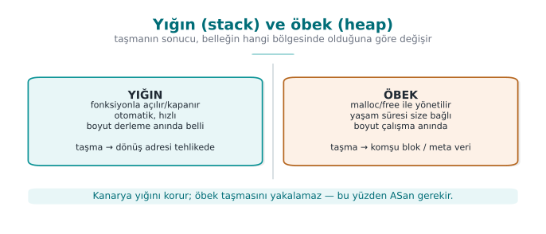

### Memory: stack and heap

- **Stack:** automatically managed memory that holds the local variables of function calls.
- **Heap:** memory allocated **manually** with `malloc`/`new` and released with `free`/`delete`.

Both can be a source of overflows and bugs.

### Pointer

- **Pointer:** a variable that holds a memory **address**.
- `p` is an address; `*p` is the value at that address.
- Wrong address → crash or wrong data.

### Buffer and overflow

- **Buffer:** a contiguous block of memory (e.g., `char ad[16]`).
- **Overflow (buffer overflow):** writing more data than the buffer can hold → corrupts neighbouring memory.
- A classic and dangerous class of bug.

### Why is an overflow dangerous?

- It can corrupt neighbouring variables or the return address.
- An attacker can use this to hijack **control flow**.
- This is why **bounds checking** is vital.

### What is undefined behaviour (UB)?

- **Undefined behaviour:** situations the C/C++ standard calls "the result is unspecified."
- Example: signed integer overflow, accessing past the end of an array.
- The compiler may handle this **however it likes** — it may even **delete** the corresponding check.

### Compiler flag

- **Flag:** an option passed to the compiler.
- Example: `-O2` (optimization), `-Wall` (warnings), `-fsanitize=address`.
- The right flags catch many bugs **at compile time**.

### Warning vs error

- **Error:** compilation stops.
- **Warning:** compilation continues but a problem is reported.
- Rule: **turn warnings into errors** (`-Werror`) — an ignored warning is a future vulnerability.

### What is a CWE?

- **CWE (Common Weakness Enumeration):** a numbered catalog of software weaknesses.
- Example: CWE-416 = "use-after-free."
- Naming a finding with its CWE number makes it **searchable**.

### What is CERT?

- **SEI CERT C/C++:** the **rulebook** of secure coding.
- Every rule: a noncompliant example + a compliant solution + risk + a CWE link.
- Example: `STR31-C` = allocate sufficient memory for the string.

### Static vs dynamic analysis

- **Static analysis:** examining code **without running** it (compiler warnings, clang-tidy).
- **Dynamic analysis:** observing code **while it runs** (sanitizers).
- The two complement each other.

### What is a sanitizer?

- **Sanitizer:** a compiler tool that catches memory/UB bugs while the program runs.
- Example: **ASan** (address), **UBSan** (undefined behaviour).
- It does not ship in the release build; it is used in **testing/CI**.

### What is fuzzing?

- **Fuzzing:** feeding a program **random/unexpected** inputs and looking for crashes.
- It finds inputs a human would never think of.
- Very powerful when combined with a sanitizer.

### ASLR, NX/DEP, canary

- **ASLR:** **randomizes** memory addresses (so the attacker cannot guess an address).
- **NX/DEP:** prevents bytes in a data region from being **executed as code**.
- **Stack canary:** a **sentinel value** placed just before the return address; if an overflow corrupts it, the
  program halts.

### White-box attacker (reminder)

- An attacker who possesses the program (Week 1's MATE).
- Reads strings, finds functions by name, bypasses checks.
- We will return to this in the obfuscation section (later today).

### Stack frame, return address, and offset

There are three more terms we will keep using in this week's "step by step at the memory level" examples (format
string, use-after-free, canary); let's define them now so we don't have to stop and look them up when the examples
come along:

- **Stack frame:** the portion of the stack allocated for a function when it is called. It holds the function's
  local variables, the saved frame pointer, and the return address. A new frame opens every time the function is
  called; when the function ends the frame **collapses** (the stack pointer is rolled back), but the bytes inside
  it are not erased — they are only marked "no longer in use." The old values **keep sitting there** until the
  next call overwrites the same bytes. (This is one reason why some of the memory bugs we will see later can
  appear to "work" at first.)
- **Return address:** when a function is called, the processor automatically writes "which instruction to return
  to once this function ends" onto the stack. At the end of the function this address is read and the program
  jumps there. An attacker who can modify the return address can choose **where the program continues executing**
  — this is why the return address is one of the most valuable targets on the stack.
- **Offset:** the distance from a starting point, in bytes. Phrases like "8 bytes after the buffer" or "starting
  from the file's 16th byte" describe an offset. The answer to the question "how many extra bytes does an overflow
  have to write before it reaches the return address?" is an offset.

### CI (continuous integration)

- **CI (Continuous Integration):** a system that runs an automatic build + tests on every code change.
- It runs security tools (warnings, static analysis, sanitizers, fuzzing) **on every merge**.

### Now we're ready

Terms:

stack/heap · pointer · buffer/overflow · UB · flag · warning/error · CWE · CERT · static/dynamic · sanitizer ·
fuzzing · ASLR/NX/canary · CI

Now: the layers of code hardening.

## 1. What is code hardening?

In Week 1 we saw the seven layers of application protection. This week we open up three of them, specifically for
C and C++ code:

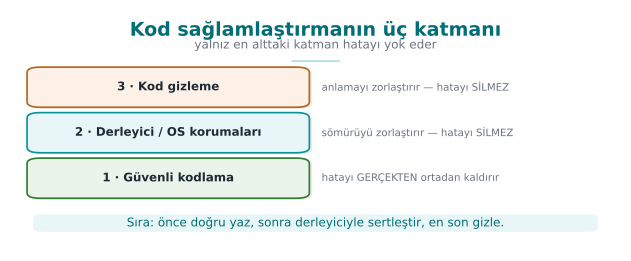

!!! note "A brief history: the race between memory bugs and defenses"
    - **1988** — The **Morris Worm** announces the buffer overflow to the world; the attack class stops being
      "academic."
    - **1996** — Aleph One's article *"Smashing the Stack for Fun and Profit"* teaches exploitation to everyone.
    - **1998 → 2004** — defenses arrive in sequence: **StackGuard/canary** (1998), **PaX/ASLR** (2001), **DEP/NX**
      (2004), FORTIFY.
    - **2012 → 2013** — **AddressSanitizer** and **fuzzing** (AFL) start catching bugs **automatically**.

    The course follows this race in order: first write the bug, then watch the tool catch it, then add the
    compiler/OS protection.

| Layer | Question | This week's tools |
| --- | --- | --- |
| **2 · Secure coding** | Is there a bug in my code? | SEI CERT rules, bounds and return-value checks, sanitizers, fuzzing |
| **3 · Compiler and operating system protections** | If a bug slips through, is it hard to exploit? | Stack canary, `_FORTIFY_SOURCE`, PIE/ASLR, DEP/NX, RELRO, CFI |
| **4 · Code obfuscation** | Can someone examining the code understand its logic and secrets? | Symbol and string hiding, removing logging, constant transformations, control-flow flattening |

**Code hardening** is applying these three layers together. The order matters: first bug-free code, then
protections that limit the damage if a bug still slips through, and finally obfuscation that makes the code harder
to read. Let's repeat the warning from Week 1: **obfuscation does not fix the bug.** An obfuscated overflow is
still an overflow.

!!! note "How it's done in the field"
    Card scheme mobile payment requirements explicitly ask for these layers: "common programming vulnerabilities
    (management of sensitive data in memory, injection, buffer overflow, and language-specific weaknesses) must be
    addressed," "defensive programming techniques must be applied **consistently across the entire codebase**,"
    and the application "must be protected against static and dynamic reverse engineering." A certified library's
    guide lists eighteen separate hardening measures for the native (C/C++) side alone. By the end of this week
    you will recognize most of these measures.

### Why this order? What happens if we reverse the stack?

To see that the order (first 2, then 3, finally 4) is not arbitrary, let's try reversing it:

- **Obfuscation first, without fixing the bug:** if a program with flattened control flow and encrypted strings
  still has a buffer overflow, the overflow **still works**. The attacker doesn't even need to reverse-engineer it
  to find the overflow; fuzzing from the outside is enough (this week's Section 11). Obfuscation does not make the
  bug invisible, it only makes **reading the code** harder — but a working exploit can be found without reading
  the code.
- **Protections first, without fixing the code:** with the stack protector on, a program with an overflow still
  has the overflow; the program now **crashes** instead of silently corrupting memory
  (`*** stack smashing detected ***`). This is a gain (control flow cannot be hijacked), but it is still a
  **denial of service** — an attacker can crash the program repeatedly and make the service unavailable. The
  canary does not fix the bug, it only changes its outcome.
- **Secure coding first:** if the bug is never there to begin with, neither obfuscation nor a protection needs to
  step in. This is why layer 2 always comes first; layer 3 is a safety net in case a bug **slips through**; layer
  4 is a final addition that makes the attacker's job **more expensive**.

These three do not **replace each other**. This is Week 1's defense-in-depth principle applied to C/C++ code: each
layer exists to catch what the previous one missed.

---

## 2. SEI CERT C/C++: the rulebook for secure coding

The CERT division of Carnegie Mellon University's Software Engineering Institute (SEI) publishes **secure coding
standards** for C, C++, and Java. These standards collect hundreds of rules — distilled from real vulnerabilities
— into a single format, and are one of the core documents certification labs consult during source code review.

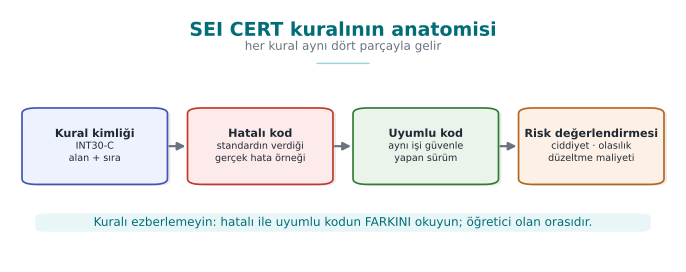

### Anatomy of a rule

Every rule is written in the same structure:

| Section | Content |
| --- | --- |
| **Identifier** | Category abbreviation + number + language: `STR31-C`, `MEM50-CPP` |
| **Title** | A one-sentence summary of the rule |
| **Noncompliant example** | Realistic code that violates the rule |
| **Compliant solution** | Code that does the same job correctly |
| **Risk assessment** | Severity × likelihood × cost to fix → priority (L1, L2, L3) |
| **Related rules** | Mapping to CWE and other standards |

A **rule** is distinct from a **recommendation**: violating a rule can directly lead to a vulnerability and can be
checked by automated tools, whereas recommendations describe good practice. Rules with priority **L1** are the
ones that are serious, common, and cheap to fix all at once; a code review starts here.

### Categories

| Abbreviation | Category | Example rule |
| --- | --- | --- |
| `PRE` | Preprocessor | PRE31-C: avoid side effects in macro arguments |
| `DCL` | Declarations | DCL30-C: declare objects with appropriate storage durations |
| `EXP` | Expressions | EXP33-C: do not read uninitialized memory |
| `INT` | Integers | INT30-C: ensure unsigned integer operations do not wrap; INT32-C: do not allow signed integer overflow |
| `ARR` | Arrays | ARR30-C: do not form or use out-of-bounds pointers |
| `STR` | Strings | STR31-C: guarantee sufficient space for the string and its terminator |
| `MEM` | Memory management | MEM30-C: do not access freed memory |
| `FIO` | File I/O | FIO30-C: exclude user input from format strings |
| `ENV` | Environment | ENV33-C: do not call `system()` |
| `SIG` | Signals | SIG30-C: call only asynchronous-safe functions within signal handlers |
| `ERR` | Error handling | ERR33-C: detect and handle standard library errors |
| `CON` | Concurrency | CON43-C: do not allow data races in multithreaded code |
| `MSC` | Miscellaneous | MSC32-C: seed pseudorandom number generators correctly |
| `POS` / `WIN` | POSIX / Windows | POS36-C: correct order for dropping privileges |

The C++ standard (with the `-CPP` suffix) inherits most of the C rules and adds language-specific ones:
`MEM50-CPP` (do not access freed memory), `CTR50-CPP` (container indices and iterators must stay within the valid
range), `STR50-CPP` (sufficient space for a string), `EXP53-CPP` (do not read uninitialized memory), `ERR50-CPP`
(do not abruptly terminate the program).

### Ten rules linking Week 1 to this week

| Rule | Summary | Where did we see it? |
| --- | --- | --- |
| STR31-C | Sufficient space for a string | Week 1 Demo 3 |
| INT31-C | Integer conversions must not lose data | Week 1 Demo 4 |
| MSC06-C | Beware of compiler optimization deleting security code | Week 1 Demo 2 |
| ENV33-C | Do not call `system()` | Week 1 Demo 1 |
| FIO30-C | Exclude user input from format strings | This week Demo 1 |
| MEM30-C | Do not access freed memory | This week Demo 2 |
| MEM31-C | Free dynamic memory once you are done with it | This week Demo 2 |
| INT32-C | Do not allow signed integer overflow | This week Demo 3 |
| ERR33-C | Detect library errors | This week Section 8 |
| SIG30-C | Only safe functions within a signal handler | This week Section 8 |

### Worked example: quantifying a finding with a rule id

Let's learn to read a rule not as "good advice" but as a **measurable risk**. Take the following loop, which
violates MEM31-C ("free dynamic memory once you are done with it"):

```c title="MEM31-C ihlali: her istekte bir blok sızar"
void istek_isle(const char *veri)
{
    char *tampon = malloc(64);          /* her çağrıda YENİ bir blok */
    if (!tampon) return;
    snprintf(tampon, 64, "%s", veri);
    isle(tampon);
    /* free(tampon) EKSİK: fonksiyon dönünce işaretçi kaybolur, blok asla serbest kalmaz */
}
```

Let's not leave this abstract — let's **count**:

```text title="Sızıntıyı sayısallaştırmak"
Her çağrı sızdırdığı bellek : 64 bayt
Sunucu saniyede istek sayısı : 200 istek/sn   (örnek yük)
Sızıntı hızı                 : 200 * 64 bayt = 12.800 bayt/sn ≈ 12,5 KB/sn
1 saatte birikim              : 12.800 * 3600 ≈ 46.080.000 bayt ≈ 43,9 MB/saat
24 saatte birikim             : 43,9 MB * 24 ≈ 1.053,6 MB ≈ 1,03 GB/gün
```

64 bytes alone looks harmless; but it accumulates on a **long-running server** and, over days, exhausts memory and
crashes the program (CWE-401, resource leak). This calculation turns into a concrete, prioritizable sentence in a
code review report — "MEM31-C violation, `istek_isle()`, ~44 MB/hour leak, fix: add `free(tampon)` at the end of
the function" — which is far more powerful than saying "I think memory management is missing here."

!!! danger "Common mistake: dismissing a small leak as unimportant"
    Thinking "64 bytes, no big deal" and deferring the leak turns into a cumulative denial of service in
    long-running services (servers, background processes, embedded devices). The same leak might be harmless in a
    short-lived command-line tool (the operating system reclaims the memory once the process ends); **lifetime**
    is the factor that actually determines how serious a leak is.

!!! success "Rule"
    For every `malloc`/`new` there must be exactly **one** matching `free`/`delete` in the code, and every path
    between the two (an early `return`, a `goto`, a thrown exception) must not break this pairing (MEM31-C,
    MEM12-CPP). If in doubt, run the function under ASan — `LeakSanitizer` counts leaks directly for you
    (Section 10).

!!! tip "Auditing rules automatically"
    Some CERT rules can be checked automatically with compiler warnings and static analysis tools: GCC/Clang
    `-Wall -Wextra -Wformat=2 -Wconversion`, clang-tidy's `cert-*` checks, `cppcheck --addon=cert`, MSVC `/analyze`,
    and commercial tools. Automated auditing is a starting point; only human review finds logic errors and design
    flaws.

!!! question "How does an evaluator test this?"
    In a source code review, the evaluator first runs a static analysis tool with the CERT rule set and sorts the
    findings by priority. They then read every function that takes external data (network, file, IPC, JNI
    interface) by hand: are length fields validated, are return values checked, is memory managed by a single
    owner? Findings are written into the report with their rule id: "FIO30-C violation: `gunluk.c:42`."

---

## 3. Input validation principles (Recipe 3.1)

Almost all of this week's bugs come from the same root: **trusting** a value that enters the program from the
outside. Chapter 3 of the textbook treats input validation as the foundation for every other measure. The
principles in Recipe 3.1 still hold today; let's turn them into a daily checklist for a C/C++ programmer.

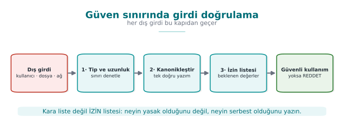

### Where does input come from?

"User input" makes us think of a keyboard; but **everything** that crosses a trust boundary is input:

| Source | Example | Commonly forgotten point |
| --- | --- | --- |
| Command line | `argv` | Even `argv[0]` can be a value the attacker chose |
| Environment variables | `PATH`, `HOME`, `LANG` | Week 1's secure startup |
| Files | Configuration, document, image | Length fields inside the file format |
| Network | Protocol message, HTTP header | The client can say "this message is 16 bytes" and send 1 byte |
| Inter-process communication | Socket, named pipe, shared memory | Another process on the same machine is untrusted too |
| Database | Previously stored data | "Data we wrote ourselves" may have been modified since |
| Library interface | JNI, plugin API | The calling application is treated as untrusted too |

### Five principles

1. **Allow-list, not deny-list.** Define what is permitted ("only digits, at most 6 of them"); don't try to
   enumerate what is forbidden. A deny-list always forgets something.
2. **Canonicalize first, then validate.** The same value can have more than one spelling
   (`/tmp/../etc`, `%2e%2e/`, upper/lower case, Unicode forms). Validation must be performed on the value's single,
   canonical form (Recipes 3.7, 3.8, 3.12).
3. **Length, type, range, format — in that order.** First bound the length (prevents a buffer overflow), then check
   its type (is it a number?), then its range (0–100?), then its format (is it a date?).
4. **Validate as early as possible, at the trust boundary.** Data is validated the moment it comes in and then
   travels around already validated; every function no longer has to repeat the same check.
5. **Rejecting is safer than fixing.** Reject invalid input instead of "cleaning it up" and using it anyway.
   Cleanup code has bugs too; worse, the cleaned-up value can end up meaning something different from what the
   user intended.

### Reading a number correctly: `strtol` instead of `atoi`

The smallest but most frequently mishandled example of input validation is reading a number:

```c title="Hatalı: atoi hatayı bildiremez"
int adet = atoi(argv[1]);    /* "abc" → 0, "99999999999" → tanımsız, "12abc" → 12 */
```

```c title="Doğru: strtol + tam denetim"
#include <errno.h>
#include <limits.h>
#include <stdlib.h>

/* Başarıda 0; geçersiz ya da aralık dışıysa -1 */
int sayi_oku(const char *s, long en_az, long en_cok, long *sonuc)
{
    char *son;
    errno = 0;
    long v = strtol(s, &son, 10);
    if (son == s)            return -1;   /* hiç rakam yok */
    if (*son != '\0')        return -1;   /* sonda fazladan karakter: "12abc" */
    if (errno == ERANGE)     return -1;   /* long'a sığmadı */
    if (v < en_az || v > en_cok) return -1;  /* iş kuralı aralığı */
    *sonuc = v;
    return 0;
}
```

All four checks are necessary, and each one closes off a real class of bug: empty input, input with trailing junk,
overflow, and business-rule violation. CERT asks for this pattern via the `ERR34-C` rule ("detect errors when
converting a string to a number").

### Binary data: length-prefixed records

In network protocols and file formats, data is usually laid out as `[type][length][data]`. From Heartbleed all
the way to this week's fuzzing demo, the source of many bugs is **trusting the length field**:

```c title="Uzunluk önekli kaydı güvenle okumak"
/* tampon: gelen veri, kalan: tamponda kalan bayt sayısı */
int kayit_oku(const uint8_t *tampon, size_t kalan, Kayit *k)
{
    if (kalan < 3) return -1;                         /* başlık bile yok */
    k->tur = tampon[0];
    uint16_t uzunluk = (uint16_t)(tampon[1] << 8 | tampon[2]);
    if (uzunluk > kalan - 3) return -1;               /* bildirilen > gelen: REDDET */
    if (uzunluk > sizeof k->veri) return -1;          /* hedefe sığmıyor: REDDET */
    memcpy(k->veri, tampon + 3, uzunluk);
    k->uzunluk = uzunluk;
    return 3 + uzunluk;                               /* tüketilen bayt */
}
```

The two checks are different from each other and both are necessary: one protects the **source** (is there
really this much data in the incoming buffer?), the other protects the **destination** (does this much data fit
in the buffer?). The expression `kalan - 3` does not wrap, thanks to the earlier `kalan < 3` check; the **order**
of the checks matters too.

### Worked example: tracing `kayit_oku` byte by byte

Let's not leave the function above abstract; let's trace it line by line with real bytes. Suppose `kalan = 8`
bytes arrive from the network and the contents are as follows (hex, then meaning):

| Offset | Byte (hex) | Meaning |
| --- | --- | --- |
| 0 | `01` | `tur` field = 1 |
| 1 | `00` | high byte of the length |
| 2 | `05` | low byte of the length |
| 3–7 | `48 45 4C 4C 4F` | `"HELLO"` (5 bytes of data) |

The function processes the following steps **in order**:

```text title="Adım adım yürütme (kalan = 8, iyi huylu girdi)"
1) kalan < 3 mi?               8 < 3  → HAYIR, devam.
2) k->tur = tampon[0]           = 0x01
3) uzunluk = tampon[1]<<8 | tampon[2]
            = (0x00 << 8) | 0x05
            = 0x0000 | 0x0005
            = 5
4) uzunluk > kalan - 3 mi?      kalan - 3 = 8 - 3 = 5;  5 > 5  → HAYIR, devam.
5) uzunluk > sizeof(k->veri) mi?  (k->veri 64 bayt ise) 5 > 64 → HAYIR, devam.
6) memcpy(k->veri, tampon+3, 5)   → k->veri = "HELLO"
7) return 3 + uzunluk = 3 + 5 = 8   (tüketilen bayt; kalan'ın TAMAMI, tutarlı)
```

Now let's trace an input where the attacker has changed **only the length field**, leaving the rest of the data
untouched (`kalan` is still 8, but the declared length is now much larger than the real data):

| Offset | Byte | Meaning |
| --- | --- | --- |
| 0 | `01` | `tur` = 1 |
| 1 | `FF` | high byte of the length |
| 2 | `FF` | low byte of the length |
| 3–7 | `48 45 4C 4C 4F` | still 5 bytes of real data |

```text title="Adım adım yürütme (kalan = 8, saldırgan girdisi)"
1) kalan < 3 mi?               8 < 3 → HAYIR, devam.
2) k->tur = tampon[0]           = 0x01
3) uzunluk = tampon[1]<<8 | tampon[2]
            = (0xFF << 8) | 0xFF
            = 0xFF00 | 0x00FF
            = 0xFFFF = 65.535
4) uzunluk > kalan - 3 mi?      65.535 > 5  → EVET → REDDET, fonksiyon -1 döner.
   (memcpy'a HİÇ ulaşılmaz)
```

The check kicks in at exactly this point: `tampon` really **has** only 5 bytes of data, but the field **says** "65,535
bytes are coming." Without the check, step 4 would be skipped, `memcpy(k->veri, tampon+3, 65535)` would be called,
and the read would go **far beyond** the bounds of the `tampon` array — this is CWE-125 (out-of-bounds read), and
exactly the bug this week's Demo 4 finds with fuzzing. Even making `uzunluk` a `uint16_t` is not enough by itself:
a 16-bit field can carry at most 65,535, but that can still be far larger than the actual amount of data
(`kalan - 3`); real safety comes **not from the field width but from the comparison**.

!!! danger "Common mistake: making a length field `uint16_t`/`uint32_t` and assuming it 'fits'"
    A field's data type bounds the **largest value it can hold**; it does not guarantee that **the incoming data
    really has that many bytes**. A `uint16_t uzunluk` holds at most 65,535, but the buffer may still contain only
    a handful of real bytes. The type choice is not something you can relax about; the actual validation is the
    comparison (step 4).

!!! success "Rule"
    Always compare a declared length field against **the number of bytes that actually arrived** (`kalan`) and
    against **the destination buffer's size** (`sizeof k->veri`); if either one falls short, the data is
    **rejected** — it is never truncated or "fixed up" with a default value (principle 5, above).

!!! note "How it's done in the field"
    The first item in payment libraries' defensive programming requirements is "every input and output of the
    application must be validated." A library does not trust the application calling it either: every string and
    array coming through a JNI interface is re-validated on the native side for length and format. If validation
    fails, the function returns "failure" without giving details.

---

## 4. Example pairs from CERT rules

The most instructive part of the CERT standard is the **noncompliant / compliant** code pair it gives for every
rule. Below we work through five rules that touch this week's topics, using our own examples. For each pair, try
to spot the bug first, then read the explanation.

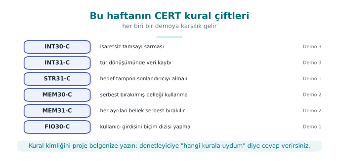

### STR31-C: sufficient space for a string and its terminator

```c title="Hatalı"
char kopya[16];
strcpy(kopya, ad);                       /* ad 15 karakterden uzunsa taşar */
```

```c title="Uyumlu"
char kopya[16];
int n = snprintf(kopya, sizeof kopya, "%s", ad);
if (n < 0 || (size_t)n >= sizeof kopya) {
    /* kesildi: kullanma ya da hata dön */
}
```

`snprintf`'s return value is the number of characters that would have been written had there been room; if it is
equal to or greater than the buffer size, the output has been **truncated**. A truncated path or command can mean
something different.

**Numerical check:** the string `ad = "Mehmet Ali Kaya Demir"` is **21 characters** long (including spaces,
excluding the `\0`). `char kopya[16]` can hold only 15 characters plus the `\0` terminator (16 bytes = 15 + 1).
When `snprintf(kopya, 16, "%s", ad)` is called:

```text title="snprintf'in kesme davranışı, sayılarla"
Yazılacak gerçek uzunluk (n)     : 21
Tampon boyutu (sizeof kopya)     : 16
n >= sizeof kopya ?              : 21 >= 16 → EVET → KESİLDİ
kopya içinde gerçekte duran      : "Mehmet Ali Kaya" (ilk 15 karakter) + '\0'
```

Had `strcpy` been used, there would have been no check at all, and the 21-character string would be copied into
the 16-byte buffer with no bounds checking, overflowing the neighbouring memory by **5 bytes** (21 − 16).
`snprintf` prevents the overflow; but **silently truncating** is itself a bug — if a user named "Mehmet Ali Kaya
Demir" is stored in the system as "Mehmet Ali Kaya," two different users could end up with the same truncated
name. This is why the check in the compliant solution, `if (n < 0 || (size_t)n >= sizeof kopya)`, is
**mandatory**: the truncation must be noticed and either rejected or handled by allocating a larger buffer.

### INT30-C: unsigned operations must not wrap

```c title="Hatalı"
size_t kalan = toplam - okunan;          /* okunan > toplam ise dev bir sayı */
memcpy(hedef, kaynak + okunan, kalan);
```

```c title="Uyumlu"
if (okunan > toplam) return HATA;
size_t kalan = toplam - okunan;
```

Unsigned subtraction cannot go below zero, it **wraps**: `3 - 5` produces `SIZE_MAX - 1`. The order is checked
before the subtraction.

**Numerical check (on a 64-bit system, where `size_t` is 8 bytes):** unsigned arithmetic works **modulo** `2⁶⁴`
(the result is taken "mod," i.e., the remainder after dividing by `2⁶⁴`).

```text title="3 - 5 işlemi size_t (64-bit) olarak"
Matematikteki gerçek sonuç : -2
Modüler karşılığı          : -2 + 2^64 = 2^64 - 2
2^64                        : 18.446.744.073.709.551.616
2^64 - 2                    : 18.446.744.073.709.551.614   ← "kalan" bu devasa sayı olur
SIZE_MAX (2^64 - 1)         : 18.446.744.073.709.551.615
Karşılaştırma               : 2^64 - 2 = SIZE_MAX - 1  ✓ (metindeki iddiayla birebir örtüşür)
```

If this `kalan` value is passed to `memcpy(hedef, kaynak + okunan, kalan)`, the function is asked to copy about
**18.4 quadrillion gigabytes**; since memory cannot possibly be that large, the processor keeps reading past the
region pointed to by `kaynak` until it hits an unmapped page and the program crashes with a **segmentation
fault** (or, if it reaches a mapped but foreign region, leaks information instead). On a **32-bit** system
(`size_t` 4 bytes) the same calculation gives `2³² − 2 = 4,294,967,294` — smaller, but still many times larger
than the buffer's real size; the outcome is the same.

### MEM30-C: do not access freed memory

```c title="Hatalı: döngüde serbest bırakırken sonraki düğüme erişim"
for (Dugum *d = bas; d != NULL; d = d->sonraki)
    free(d);                              /* d->sonraki, free'den SONRA okunuyor */
```

```c title="Uyumlu"
Dugum *d = bas;
while (d != NULL) {
    Dugum *sonraki = d->sonraki;          /* önce oku */
    free(d);
    d = sonraki;
}
```

Deleting a linked list is one of the most innocent-looking places where UAF shows up: the `for` loop's increment
expression reads the field of a node that has already been freed inside the loop body.

### EXP33-C: do not read uninitialized memory

```c title="Hatalı"
int sonuc;
if (kosul) sonuc = hesapla();
return sonuc;                             /* kosul yanlışsa rastgele değer */
```

```c title="Uyumlu"
int sonuc = HATA_KODU;                    /* güvenli varsayılan */
if (kosul) sonuc = hesapla();
return sonuc;
```

An uninitialized local variable carries whatever value used to sit at that stack location — which could even be a
**secret** belonging to a previous function. For security purposes, the default value should mean "no
permission" or "error" (Week 1's secure-default principle).

### ERR33-C: detect library errors

```c title="Hatalı"
FILE *f = fopen(yol, "rb");
fread(tampon, 1, sizeof tampon, f);       /* fopen başarısızsa f == NULL */
```

```c title="Uyumlu"
FILE *f = fopen(yol, "rb");
if (f == NULL) return HATA;
size_t n = fread(tampon, 1, sizeof tampon, f);
if (n < sizeof tampon && ferror(f)) { fclose(f); return HATA; }
fclose(f);
```

When `fread` returns a short read, `feof`/`ferror` must be used to tell whether that was end-of-file or an error.
Treating a partially read structure as fully read is just another form of reading uninitialized memory.

!!! tip "Thinking in terms of rule ids"
    Try to match every bug you find in a code review to a CERT rule. This both makes the finding objective ("a
    STR31-C violation" instead of "I think this would be better this way") and makes it easier to search for the
    same rule being violated elsewhere in the codebase.

---

## 5. Format string vulnerability (Recipe 3.2)

The first argument to the `printf` family is a **format string**: markers inside it such as `%d`, `%s`, `%x` tell
the function "take an argument of this type off the stack and print it in this format." The function **does not
know** how many arguments were actually passed; it does whatever the format string says. If the format string
comes from the user, the user has effectively given the function a command.

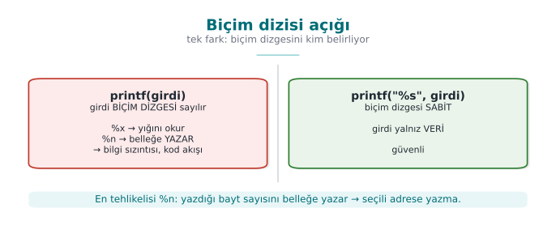

```c title="Hatalı ve doğru"
printf(kullanici_girdisi);           /* HATALI: girdi biçim dizgesi olarak yorumlanır */
printf("%s", kullanici_girdisi);     /* DOĞRU: girdi yalnız veri */
```

### Why is it dangerous?

| Marker | Normally | If the attacker supplies it |
| --- | --- | --- |
| `%x`, `%p` | Prints an argument in hexadecimal | Instead of missing arguments, **values from the stack** are read: information leak |
| `%s` | Prints the string a pointer points to | A random value on the stack is taken as a pointer: crash or memory read |
| `%n` | **Writes** the number of characters printed so far to a pointer | **Writes** to the address held by a value on the stack: memory corruption |

How harmful this is depends on the platform and the protections in place; but even the mildest outcome is an
**information leak**: a key sitting on the stack, an address (which weakens ASLR), or a canary value could be
read. The same bug shows up in `syslog`, `fprintf`, `snprintf`, `err`/`warn`, and every function that takes a
format string; in Week 2 we saw this exact `syslog(LOG_INFO, kullanici_girdisi)` bug in an audit log.

### Worked example: what does `%x` read from the stack? Step by step

Let's recall how `printf` works: when `printf(bicim, arg1, arg2, ...)` is called, the function assumes it is
**expecting as many** arguments as there are `%` markers in the `bicim` string. Where it actually reads those
arguments from depends on the calling convention (ABI) the compiler generates. For teaching purposes, let's first
follow the classic, simple model (all arguments on the stack), then add today's 64-bit difference.

**1) Simplified model — all arguments sit consecutively on the stack**

In `sizinti.c` the call is `printf(tampon)` — only **1** real argument (the format string itself) is passed, no
other value is given. If the user writes `"%x.%x.%x.%x.%x.%x"` into `tampon`, `printf` sees **6** `%x` markers in
the format string and proceeds on the assumption "6 more arguments are coming." But in reality none were **sent**.
The only thing `printf` can do is well-defined: for each `%x`, look at "the position where the next argument
should be" and print the bytes found there **as if they were a number**, in hexadecimal. In this simple model,
those positions are the stack cells directly above the call — that is, the region holding `sizinti()`'s **own
local variables**:

```text title="sizinti.c'deki bildirim sırası (yığın çerçevesi, kavramsal)"
volatile unsigned gizli_deger = 0x5ECE7u;   /* fonksiyonun yerel değişkeni #1 */
char tampon[64];                            /* fonksiyonun yerel değişkeni #2, kullanıcı girdisini tutar */
```

These two variables sit **next to each other** in the **same stack frame** (the exact order and any gap between
them can vary with the compiler and flags; what matters is that both are in the same frame, close together). When
`printf(tampon)` is called, the format string itself is already inside `tampon` — meaning the **place being read**
and the **format string doing the reading** are in the same memory region. If enough `%x` markers are supplied,
the scan sooner or later reaches the 4-byte cell where `gizli_deger` sits:

```text title="'%x' taramasının adımları (basitleştirilmiş, kavramsal argüman sırası)"
1. %x  → argüman konumu #1'deki değer  (örn. önceki bir çağrıdan kalan rastgele bayt)
2. %x  → argüman konumu #2'deki değer  (rastgele)
3. %x  → argüman konumu #3'teki değer  (rastgele)
   ...
N. %x  → argüman konumu #N tam olarak gizli_deger'in bulunduğu hücreye denk geliyor
         → printf bu 4 baytı bir unsigned int gibi okuyup onaltılık yazar
         → EKRANDA GÖRÜLEN: "5ece7"
```

The demo program verifies this independently: the code first prints `gizli_deger` to the screen **deliberately**,
via `printf("...0x%05x...", gizli_deger)` (as a control); then, when `sizinti '%x.%x.%x...'` is run, the **same
`5ece7` value** is seen reappearing in the output of the `%x` scan. The two outputs matching is proof that the
leaked value really is `gizli_deger` — not a random number, but a value read from the program's **own** memory.

**2) The 64-bit difference — why the first few `%x` markers behave differently**

The "everything's on the stack" model above is exactly correct for the x86 **32-bit** calling convention (cdecl),
and it is the classic teaching model for format string attacks. On today's 64-bit Linux/Windows builds, however,
the x86-64 System V ABI carries the first **6** integer/pointer arguments in **processor registers** (`RSI`,
`RDX`, `RCX`, `R8`, `R9` — `RDI` is reserved for the format string itself) instead of the stack; only arguments
beyond the sixth go on the stack. The result: in a `printf(tampon)` call, the first few `%x` markers do not read a
stack cell at all — they read whatever values happen **by chance** to be sitting in those registers at that
moment (left over from earlier calls, e.g., `snprintf`, or `printf`'s own setup); only the `%x` markers **after**
the 6th one reach the stack, and therefore the region where `gizli_deger` also lives. This is exactly why the demo
script gradually increases the number of `%x` markers (step 2): how many `%x` markers are needed varies with the
compiler, the optimization level, and the platform; the **mechanism** is what the student needs to see, not a
specific fixed number.

**3) Why `%n` is more dangerous**

`%x` only **reads**; `%n` says "write the number of characters printed so far to the address that the pointer
given to me points at" — that is, it is a **write** operation. In the model above, `%n` also reads "the next
argument position" as a value, just like `%x`; but this time it treats that value not as a **number** but as an
**address** (a pointer), and writes to that address. Since no argument was ever actually given, this "address" is
also **whatever** happens to be sitting on the stack/in a register at that moment — usually an invalid address,
and the program crashes. But because the attacker writes the format string **themselves**, they can also place
byte sequences of their own choosing inside the string; by first **mapping**, with `%x`, which position
corresponds to which data, and then arranging for `%n` to land exactly on that position, they can fill the cell
that will be read as an "address" with **a value they supplied themselves**. This turns `%n` from merely a
crash source into a tool for **writing a chosen value to a chosen location** in memory (CWE-134). This course does
not go beyond this into a working exploitation step — understanding the mechanism is enough to understand the
defense (fixing the format string).

!!! danger "Common mistake: assuming 'the input has no `%` in it, so it's fine'"
    Looking at a code review and thinking "this input is just a username, no one's going to type `%n`," and
    approving the `printf(girdi)` call anyway, is the most common thing to miss. Validation must look at **the
    shape of the call, not the content of the input**: a variable string must never be placed in the format
    parameter position — what the input contains is irrelevant.

!!! success "Rule"
    The rule is one sentence, with no exceptions: **the format string must always be a fixed text literal; user
    data may only appear as the argument of a marker such as `%s`.** `printf("%s", girdi)` — never
    `printf(girdi)`.

This mechanism is a concrete example of the "violation of memory read/write bounds" family of bugs we saw in
Week 1: `%x` performs an **out-of-bounds read**, `%n` performs an **out-of-bounds write** — the difference is that
what crosses the bound is not an array index but the number of markers in the format string. It comes from the
same root as the injection attacks we will see in Week 5: **data has taken the place of a command** — in SQL
injection the data becomes part of a query, here the data is interpreted as a formatting command.

### Demo 1 — Format string vulnerability

!!! info "Demo 1 · `code/week-04/01-format-string` · CWE-134 · Recipe 3.2"
    The `sizinti` program prints the text it is given with `printf(metin)`; a synthetic "secret value" sits in the
    program's memory. First we check whether the compiler warns about this line, then we show the secret value
    leaking via `%x` markers and how `%n` is stopped on different platforms. In the last step, the fixed version
    prints the same input only as text.

=== "Windows (PowerShell)"

    ```powershell
    cd code\week-04\01-format-string
    .\demo.ps1
    ```

=== "WSL / Linux"

    ```bash
    cd code/week-04/01-format-string
    sh demo.sh
    ```

| Step | What is done? | What is seen? | Lesson |
| --- | --- | --- | --- |
| 0 | Build | GCC/Clang `-Wformat-security` warns; MSVC's C compiler stays silent, `/analyze` catches it | Turn on warnings and count them as **errors** |
| 1 | `sizinti Merhaba` | Normal output | — |
| 2 | `sizinti '%x.%x.%x…'` | The stack is dumped in hex; the secret value appears in the output | Information leak |
| 3 | `sizinti 'AAAA%n'` | On Linux the unprotected version crashes; on Windows the C runtime rejects `%n` | Platform difference |
| 4 | `sizinti_denetimli 'AAAA%n'` | `_FORTIFY_SOURCE` catches `%n` targeting writable memory and stops the program | Protection layer |
| 5 | `sizinti_guvenli '…%n…'` | Markers are printed only as text | **The actual fix** |

### The fix and its layers of defense

1. **The format string must always be constant** (FIO30-C). User data is only an argument: `printf("%s", s)`.
2. **Compiler warnings:** `-Wformat -Wformat-security` (even `-Werror=format-security`) on GCC/Clang;
   `/analyze` on MSVC. Add `__attribute__((format(printf, 1, 2)))` to your own `printf`-like functions so the
   compiler checks them too.
3. **Runtime protection:** in glibc, `_FORTIFY_SOURCE=2` rejects `%n` in format strings that live in writable
   memory; Microsoft's C runtime disables `%n` by default.
4. **Validate the number of variadic arguments** (Recipe 13.4): if you write your own variadic function, take the
   argument count or type from an explicit parameter, not from the format string.

```c title="Kendi günlük fonksiyonunuzu derleyiciye denetletin"
#if defined(__GNUC__)
#  define BICIM_DENETLE(a, b) __attribute__((format(printf, a, b)))
#else
#  define BICIM_DENETLE(a, b)
#endif

void gunluk_yaz(int duzey, const char *bicim, ...) BICIM_DENETLE(2, 3);

gunluk_yaz(1, kullanici);          /* derleyici artık burada uyarır */
gunluk_yaz(1, "%s", kullanici);    /* doğru */
```

!!! question "How does an evaluator test this?"
    They search the source code for every call that takes a variable as its format string argument (`printf(`,
    `syslog(`, `snprintf(buf, n,` followed by a non-constant argument). In dynamic testing they feed every text
    field inputs like `%x%x%x%n` and look for hexadecimal values, a crash, or corruption in the log.

---

## 6. Use-after-free and double free

In Week 1 we saw the theory of memory management bugs and the ownership rule. In this section we trace the same
bug in a running program and see how C++ eliminates most of these bugs **by design**.

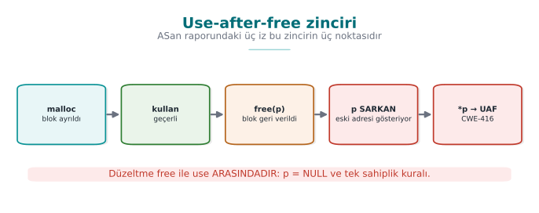

### The three steps of the bug

1. An object is allocated on the heap and more than one pointer points to it.
2. The object is `free`d somewhere, but at least one of the pointers still holds the old address (a **dangling
   pointer**).
3. The memory manager gives the same block to **another object**; the dangling pointer now reads or modifies that
   other object's data.

If there is a **function pointer** inside the object (C's imitation of a "virtual function," or a virtual table
pointer in C++), the danger grows: the program may interpret bytes written for an entirely different purpose as
"the address of the function to call." A significant fraction of "memory corruption fixed" notes in browser and
operating system updates fall into this class.

### Worked example: reallocating the same block, step by step

Let's trace Demo 2's `struct oturum` byte by byte:

```c
struct oturum {
    void (*eylem)(void);   /* 64-bit sistemde bir fonksiyon işaretçisi: 8 bayt */
    char  rol[16];         /* 16 bayt */
};
```

**Size calculation:** on a 64-bit system a pointer is 8 bytes. `8 (eylem) + 16 (rol) = 24 bayt`; since 24 is
already a multiple of 8, the compiler does not need to add any padding bytes —
`sizeof(struct oturum) == 24`. The memory layout, in terms of offset:

| Offset (bytes) | Field | Size |
| --- | --- | --- |
| 0–7 | `eylem` (function pointer) | 8 bytes |
| 8–23 | `rol` (string) | 16 bytes |

Now let's trace the `kip_uaf()` function step by step:

```text title="Adım adım: aynı 24 baytlık bloğun yeniden kullanılması"
1) o = malloc(24)
   Bellek yöneticisi 24 baytlık boş bir blok bulur, diyelim ki A adresinde verir.
   o → A

2) o->eylem = normal_panel     → A+0..7  = normal_panel'in adresi
   strcpy(o->rol, "user")      → A+8..12 = 'u','s','e','r','\0'  (A+13..23 eski/rastgele baytlar)

3) free(o)
   Bellek yöneticisi A adresindeki bloğu "boş" olarak işaretler. Birçok bellek yöneticisi
   (ör. glibc'nin tcache'i), boş bloğu bir SONRAKİ aynı boyuttaki isteğe hemen verebilmek için
   BOŞ BLOĞUN KENDİ İÇİNE bir "sıradaki boş blok" işaretçisi yazar — yani serbest bırakılan
   bellek SESSİZCE değişir. `o` değişkeni hâlâ A'yı gösterir (derleyici sıfırlamaz) → ASKIDA İŞARETÇİ.

4) sahte = malloc(24)
   Bellek yöneticisinden yine 24 bayt istenir. Az önce serbest kalan A boyutta TAM UYUŞTUĞU için,
   çoğu ayırıcı (LIFO / "son giren ilk çıkar" serbest liste ilkesiyle) AYNI A ADRESİNİ geri verir.
   sahte → A     (o hâlâ → A: İKİSİ DE AYNI BLOĞU GÖSTERİYOR)

5) sahte->eylem = yonetici_panel   → A+0..7  = yonetici_panel'in adresi  (eski değerin ÜZERİNE yazıldı)
   strcpy(sahte->rol, "admin")     → A+8..13 = 'a','d','m','i','n','\0'

6) printf("%s", o->rol)
   o hâlâ A'yı gösteriyor; A+8'den okunan bayt dizisi artık "admin"dir (5. adımda sahte tarafından
   yazıldı). o'nun kendi verisi hiç değişmedi görünüyor ama fiziksel bellek DEĞİŞTİ → "user" değil "admin" okunur.

7) o->eylem()
   A+0..7'den okunan işaretçi artık yonetici_panel'in adresidir (5. adımda üzerine yazıldı).
   Program normal_panel()'i DEĞİL, yonetici_panel()'i çağırır.
```

Result: the `o` pointer was never modified even once (it still holds the same `A` address); but because the
memory **it points to** was reused by another object, everything read through `o` is now that new object's data.
This is a concrete violation of the ownership theory (Week 1): `o` and `sahte` have behaved as **two different
owners** of the same block, whereas a block should belong to **exactly one owner at any given time** (MEM30-C).

!!! danger "Common mistake: not resetting `p` after `free(p)`"
    The `free(o)` call only tells the memory manager "you can reclaim this block"; it does not modify the `o`
    variable **itself** — `o` still holds the old address. Code that accidentally writes `o->...` on the next line
    no longer knows **whose** memory it is touching.

!!! success "Rule"
    Write `p = NULL;` immediately after `free(p)` (or, in C++, use a smart pointer and let the compiler take care
    of this step). Accessing memory through a nulled pointer crashes **immediately** instead of silently reaching
    the wrong data — the bug surfaces early and loudly, making it easy to spot.

### Demo 2 — Use-after-free and double free

!!! info "Demo 2 · `code/week-04/02-kullanim-sonrasi` · CWE-416, CWE-415 · CERT MEM30-C, MEM31-C"
    In the program, a "session" object held on the heap (a user role and a function pointer) is freed but the
    pointer is not reset. A new block, allocated afterward at the same size, then takes the old session's place,
    and the dangling pointer reads this new data: the role changes, and the function pointer calls the program's
    **own** admin panel. No code is injected from outside; the whole operation stays within the program's own
    memory.

=== "Windows (PowerShell)"

    ```powershell
    cd code\week-04\02-kullanim-sonrasi
    .\demo.ps1
    ```

=== "WSL / Linux"

    ```bash
    cd code/week-04/02-kullanim-sonrasi
    sh demo.sh
    ```

| Step | Target | What is seen? | Lesson |
| --- | --- | --- | --- |
| 1 | `uaf uaf` (unprotected) | The freed block fills with a new object; the role flips from `user` to `admin` | UAF = privilege escalation |
| 2 | `uaf_asan uaf` | ASan reports `heap-use-after-free`; it shows **where** the block was allocated, freed, and used | The sanitizer gives you the bug's origin |
| 3 | `uaf cift` (unprotected) | Double free; the memory manager either notices the corruption and halts, or undefined behaviour follows | The allocator's internal structures are corrupted |
| 4 | `uaf_asan cift` | ASan reports `attempting double-free` | — |
| 5 | `uaf_guvenli` | `free` + `NULL`, single owner, single free point | Both bugs are gone |

### Reading an ASan report: three stack traces

In a UAF report, ASan gives **three** locations; all three are needed to fix the bug:

```text
ERROR: AddressSanitizer: heap-use-after-free on address 0x6020000000f0
READ of size 8 ...
    #0 in oturum_kullan  uaf.c:48        <- 1. KULLANIM: hatanın görüldüğü yer
freed by thread T0 here:
    #0 in free
    #1 in oturum_kapat   uaf.c:31        <- 2. SERBEST BIRAKMA: sahiplik burada bitti
previously allocated by thread T0 here:
    #0 in malloc
    #1 in oturum_ac      uaf.c:22        <- 3. AYIRMA: nesnenin doğduğu yer
```

The fix is most often at **location 2**: the code that frees the object made an ownership decision that the other
pointers were never told about. (The function names and line numbers here are illustrative; the demo's real report
has the same structure.)

### C++: encoding ownership in the type

In C, ownership is a **contract**; in C++ it can be made **part of the type**:

| Need | C | C++ |
| --- | --- | --- |
| Single owner | Documentation + discipline | `std::unique_ptr<T>`: not copyable, only movable; frees in its destructor |
| Shared ownership | Reference count (by hand) | `std::shared_ptr<T>`: frees when the last owner goes away |
| Observation without ownership | Raw pointer | `std::weak_ptr<T>`: if the object is gone, `lock()` returns empty, never dangling |
| Array | `malloc` + size | `std::vector<T>`, `std::array<T,N>` |

```cpp title="Askıda kalan işaretçi yerine weak_ptr"
#include <memory>

struct Oturum { std::string rol; };

std::shared_ptr<Oturum> aktif = std::make_shared<Oturum>(Oturum{"user"});
std::weak_ptr<Oturum>   onbellek = aktif;      // sahip DEĞİL, yalnız gözlemci

aktif.reset();                                 // oturum kapandı, nesne yok edildi

if (auto o = onbellek.lock()) {                // nesne hâlâ yaşıyor mu?
    kullan(*o);
} else {
    /* nesne yok: askıdaki işaretçiyle ESKİ belleğe erişilmez */
}
```

!!! warning "Smart pointers don't solve everything"
    A raw pointer obtained with `unique_ptr::get()` still dangles once the owner is gone. If `std::vector`'s
    capacity grows when an element is added, every pointer and iterator taken into its elements is invalidated
    (CERT `CTR51-CPP`). The rule is the same: **a borrowed pointer must not outlive its owner.**

---

## 7. Integers and undefined behaviour (Recipe 3.5)

In Week 1 we saw a signed length turn into a huge number when converted to `size_t`. In this section we cover the
whole family of integer bugs and one of C's most surprising concepts: **undefined behaviour**.

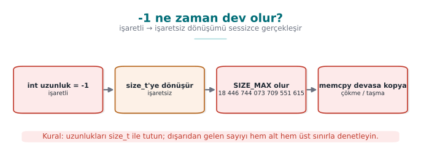

### Four integer bugs

| Bug | Example | Result | CERT |
| --- | --- | --- | --- |
| **Unsigned wraparound** | `unsigned n = 0; n - 1` → 4,294,967,295 | Well-defined (modular arithmetic) but usually a logic error | INT30-C |
| **Signed overflow** | `INT_MAX + 1` | **Undefined behaviour** | INT32-C |
| **Conversion loss** | `int` → `short`, `long long` → `int`, signed ↔ unsigned | Value is truncated or its sign changes | INT31-C |
| **Shift error** | `1 << 31` (int), `x << 32` | Undefined behaviour | INT34-C |

Integer bugs often look harmless on their own; their danger shows up when they get mixed into a **size
calculation**:

```c title="Hatalı: çarpım taşar, küçük blok ayrılır"
uint32_t adet = girdi_oku();                 /* saldırgan: 0x40000001 */
uint32_t boyut = adet * sizeof(uint32_t);    /* 0x40000001 * 4 = 4 (sardı!) */
uint32_t *dizi = malloc(boyut);              /* 4 baytlık blok */
for (uint32_t i = 0; i < adet; i++)
    dizi[i] = oku();                          /* öbek taşması */
```

**Numerical check:** `0x40000001` in hexadecimal is **1,073,741,825** in decimal. `sizeof(uint32_t)` is always 4
(`uint32_t` = 32 bits = 4 bytes, by definition).

```text title="Çarpımın 32-bit'te sarması, adım adım"
Gerçek çarpım (32-bit sınırı yokmuş gibi) : 1.073.741.825 * 4 = 4.294.967.300
uint32_t'nin sığdırabildiği en büyük değer : 2^32 - 1 = 4.294.967.295
4.294.967.300 sığar mı?                     : HAYIR (5 bayt taşar: 4.294.967.300 - 4.294.967.295 = 5)
32-bit'e sarma (mod 2^32)                   : 4.294.967.300 mod 4.294.967.296 = 4
→ boyut değişkeninde SAKLANAN değer         : 4  (bayt!)
```

The `malloc(4)` call allocates only a **4-byte** block (one `uint32_t`). But the loop runs
`dizi[i] = oku();` `adet` (1,073,741,825) times — each writing 4 bytes, attempting to write a total of
`1,073,741,825 * 4 = 4,294,967,300` bytes (≈ 4 GB), even though the allocated block is only 4 bytes. Starting
with the very first assignment (`dizi[1]`), a **heap overflow** begins, corrupting neighbouring memory structures
(the allocator's own bookkeeping data, other objects).

### Worked example: `(int)-1` converted to a `size_t`

This is the most common and most dangerous form of INT31-C: a function returns a **signed** `-1` on error, and the
caller unknowingly stores it in an **unsigned** variable.

```c title="Klasik hata: -1'in size_t'ye sessizce dönüşmesi"
int uzunluk_hesapla(const char *s) { /* hata olursa -1 döner */ return calisti_mi(s) ? (int)strlen(s) : -1; }

int n = uzunluk_hesapla(girdi);
size_t boyut = n;                 /* n == -1 ise: DÖNÜŞÜM, DENETİMSİZ */
memcpy(hedef, kaynak, boyut);     /* boyut artık dev bir sayı */
```

The conversion happens in two conceptual steps (the C standard's rule for converting signed to unsigned):

```text title="(int)-1 → size_t dönüşümü, bit bit"
Adım 1 — -1'in 32-bit int olarak bit deseni (ikinin tümleyeni gösterimi):
    -1  (int, 32 bit)  =  0xFFFFFFFF   (bütün 32 bit '1')

Adım 2 — size_t'ye (64-bit sistemde 8 bayt = 64 bit) atanırken, değer matematiksel olarak
         "hedef türün sığdırabildiği aralığa girene kadar 2^N eklenir" kuralıyla yorumlanır:
    -1 + 2^64 = 2^64 - 1

Adım 3 — 2^64 - 1 sayısal olarak:
    2^64        = 18.446.744.073.709.551.616
    2^64 - 1    = 18.446.744.073.709.551.615   = SIZE_MAX (64-bit sistemde)

Sonuç: boyut = 18.446.744.073.709.551.615   (yaklaşık 18,4 KATRİLYON gigabayt)
```

If `memcpy(hedef, kaynak, boyut)` is called with this value, the processor tries to read this many bytes starting
at the `kaynak` address; since real physical/virtual memory is nowhere near that large, the read almost
immediately hits an unmapped page and the program crashes with a **segmentation fault** — often misdiagnosed as
"crashed somewhere random," when the cause is actually completely **determinable**. On a **32-bit** system
(`size_t` 4 bytes) the same calculation gives `2^32 − 1 = 4,294,967,295` (≈4.3 billion); smaller, but still a
number that is many times larger than any real buffer's size.

!!! danger "Common mistake: keeping an 'error code -1' and a 'size' in the same variable family"
    If a function's contract is "returns -1 on error, otherwise the length," and its return value is assigned
    directly to a `size_t`/`unsigned` variable, it **silently** turns into a huge number. `-Wsign-conversion`
    (GCC/Clang) or `/w44365` (MSVC) warns exactly on this line; turning that warning into an error with `-Werror`
    (Section 0, "Warning vs error") catches this entire class of bug at compile time.

!!! success "Rule"
    An error code must always be checked in **its own signed type**, **before it is assigned to an unsigned
    variable**: `int n = uzunluk_hesapla(s); if (n < 0) { /* hata */ } size_t boyut = (size_t)n;` — the conversion
    happens only **after** `n` has been **proven** non-negative.

### Boundary values at a glance

Let's collect, in one table, the boundary values that keep coming up in this week's examples; every row is a
**direct input** to a calculation somewhere in this section:

| Type | Smallest value | Largest value |
| --- | --- | --- |
| `int8_t` | −128 | 127 |
| `uint8_t` | 0 | 255 |
| `int16_t` | −32,768 | 32,767 |
| `uint16_t` | 0 | 65,535 |
| `int32_t` (`int`, typical) | −2,147,483,648 | 2,147,483,647 (`INT_MAX`) |
| `uint32_t` | 0 | 4,294,967,295 |
| `int64_t` | −9,223,372,036,854,775,808 | 9,223,372,036,854,775,807 |
| `uint64_t` / `size_t` (64-bit) | 0 | 18,446,744,073,709,551,615 (`SIZE_MAX`) |

Don't memorize the rule, **compute** it: an unsigned type of `n` bits spans `0` to `2ⁿ − 1`, and a signed type of
`n` bits (two's complement) spans `−2ⁿ⁻¹` to `2ⁿ⁻¹ − 1`. Why does `INT_MAX + 1` jump to `INT_MIN`? Because the two
are opposite neighbours on the same 32-bit "wheel" — one more than `2³¹ − 1` corresponds, as a bit pattern, to
exactly `−2³¹` (shown in the box below).

### What is undefined behaviour?

For certain operations the C standard says "I am not defining what happens in this case": signed integer
overflow, out-of-bounds array access, dereferencing a NULL pointer, reading an uninitialized variable, misaligned
access, and the like. This does not mean "the program crashes" — it means **the compiler is allowed to assume this
situation never happens**, and optimizes the code accordingly.

```c title="Derleyici denetimi silebilir"
int ekle_ve_denetle(int x)
{
    if (x + 100 < x)          /* "taşma olursa sonuç küçülür" diye düşünülmüş */
        return -1;            /* ama işaretli taşma UB: derleyici bu dalı SİLEBİLİR */
    return x + 100;
}
```

The programmer intended to catch an overflow; but because signed overflow is undefined, the compiler is allowed
to reason "`x + 100 < x` can never be true" and remove the check entirely. The same code "works" at `-O0`, and the
check disappears at `-O2`. This is another instance of the "the compiler deleted the security code" situation we
saw in Week 1's Demo 2.

**Why does `INT_MAX + 1` jump, bit for bit, to `INT_MIN`? The proof, bit by bit:**

```text title="INT_MAX + 1 işleminin bit düzeyinde izlenmesi (32-bit, ikinin tümleyeni)"
INT_MAX (ondalık)         = 2.147.483.647
INT_MAX (bit deseni)      = 0111 1111 1111 1111 1111 1111 1111 1111   (0x7FFFFFFF)

  + 1'i son bite eklemek:  0111 1111 1111 1111 1111 1111 1111 1111
                         +                                        1
                         --------------------------------------------
  Taşan toplam (33 bit)  = 1000 0000 0000 0000 0000 0000 0000 0000   (0x100000000 — 33. bit taşar ve ATILIR)
  Kalan 32 bit            = 1000 0000 0000 0000 0000 0000 0000 0000   (0x80000000)

Bu bit deseni (0x80000000), işaretsiz okunursa 2.147.483.648'dir; ama işaretli (ikinin tümleyeni) olarak
okunduğunda en üst bit (işaret biti) 1 olduğu için NEGATİF bir sayıdır ve tam olarak:
  0x80000000 (işaretli, 32-bit) = -2.147.483.648 = INT_MIN
```

From the hardware's point of view nothing is "wrong": the processor dropped the 33rd bit and kept the 32 bits
exactly as they were; that is what addition hardware **always** does. The problem is that the C standard declares
this situation (signed integer overflow) "undefined," so the compiler is allowed to optimize under the assumption
that "this never happens" — even though the hardware silently wraps to `INT_MIN`, the compiler may assume the
overflow **never occurred** and delete a check that relies on it.

### The correct check: **before** the operation, or with overflow-reporting builtins

```c title="Taşmayı güvenle denetlemek"
#include <limits.h>
#include <stdbool.h>

/* 1) İşlemden önce sınırla karşılaştır (taşınabilir) */
bool guvenli_topla(int a, int b, int *sonuc)
{
    if ((b > 0 && a > INT_MAX - b) || (b < 0 && a < INT_MIN - b))
        return false;
    *sonuc = a + b;
    return true;
}

/* 2) GCC/Clang yerleşikleri: taşma olursa true döner */
bool guvenli_carp(size_t a, size_t b, size_t *sonuc)
{
    return !__builtin_mul_overflow(a, b, sonuc);
}
```

The C23 standard made the same job portable with `ckd_add`, `ckd_sub`, `ckd_mul` (`<stdckdint.h>`). On MSVC,
functions like `SizeTMult` and `ULongAdd` in `<intsafe.h>` can be used. When allocating memory, `calloc(adet,
boyut)` or `reallocarray` check the multiplication for overflow on your behalf (Week 1).

### Demo 3 — Undefined behaviour and UBSan

!!! info "Demo 3 · `code/week-04/03-tanimsiz-davranis` · CWE-190, CWE-758 · CERT INT32-C, INT34-C"
    The program tries three undefined behaviours in turn: signed overflow (`INT_MAX + 1`), an invalid bit shift,
    and a misaligned memory access. On an x86 processor most of these "work" silently and produce a wrong result.
    The version compiled with **UndefinedBehaviorSanitizer** (UBSan, `-fsanitize=undefined`) reports each one at
    runtime with a line number. UBSan exists only on GCC and Clang; on Windows the demo covers MSVC's `/RTC` and
    `/analyze` options and the CERT rules instead.

=== "Windows (PowerShell)"

    ```powershell
    cd code\week-04\03-tanimsiz-davranis
    .\demo.ps1
    ```

=== "WSL / Linux"

    ```bash
    cd code/week-04/03-tanimsiz-davranis
    sh demo.sh
    ```

A UBSan report has the following shape: `ub.c:27:15: runtime error: signed integer overflow: 2147483647 + 1 cannot
be represented in type 'int'`. The **type**, **location**, and **values** of the error are all given on a single
line. UBSan's overhead is lower than ASan's; many projects turn both on together in test builds.

!!! tip "Compiler options for integer bugs"
    - `-Wconversion -Wsign-conversion` (GCC/Clang), `/W4` and `/w44365` (MSVC, in C++ mode): surface hidden
      conversions.
    - `-ftrapv`: halts the program on signed overflow (has a runtime cost, so it is not for the release build).
    - `-fwrapv`: **defines** signed overflow as modular arithmetic; this disables UB-based optimizations but hides
      the logic error.
    - `-fsanitize=undefined,integer` (Clang): catches most integer bugs in test builds.

---

## 8. Error handling, variadic functions, and signals (Recipe 13.1, 13.4, 13.5)

Three topics are just as common as memory bugs, yet talked about less — and they are the source of a significant
share of real vulnerabilities.

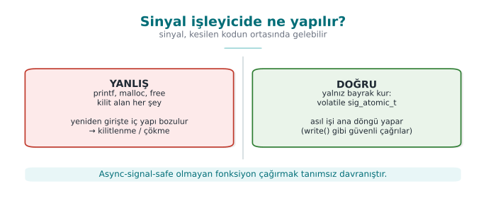

### Error handling: checking the return value and failing closed

In C, errors are usually reported through a **return value**, and checking it is left to the programmer. An
unchecked error means the program continues on a **false assumption**:

| Call | On failure | If not checked |
| --- | --- | --- |
| `malloc` | `NULL` | Writing through a NULL pointer, crash |
| `setuid` / `setresuid` | `-1` | The program stays privileged but believes it has dropped privileges (Week 1) |
| `fopen` | `NULL` | The next `fread` crashes, or the operation proceeds with empty data |
| `RAND_bytes` / `getrandom` | `!= 1` / `-1` | The "random" key is made of zeros (Week 3) |
| `EVP_DecryptFinal_ex` | `!= 1` | Tampered data is treated as verified (Week 3) |
| `snprintf` | Return ≥ size | The output has been truncated; a path or command can change meaning |

The recommendations in the textbook's Recipe 13.1 still apply today, and combine with Week 3's "fail-closed"
principle:

1. **Check every return value** (ERR33-C). If you deliberately won't check a result, discard it explicitly with
   `(void)` so a reviewer can see this was intentional. Add `__attribute__((warn_unused_result))` to your
   functions in GCC/Clang, or `[[nodiscard]]` in C23.
2. **Return to a safe state on error:** unwind a half-finished operation, wipe secrets, release resources. In C,
   the single-exit (`goto temizle`) pattern makes this readable.
3. **Don't let error messages give the attacker a hint:** a generic message to the user ("operation failed"), the
   details to a secure log. "User not found" versus "wrong password" as separate messages lets an attacker guess
   valid usernames.

!!! note "How it's done in the field"
    In a sensitive native library, functions do not return a detailed error code; they return only
    "success"/"failure," and even that **opaquely** (not a plain `0`/`1`, but a structure that cannot be easily
    recognized or tampered with). A detailed error code would be a roadmap telling the attacker exactly which
    check tripped. This choice is a line straight out of Week 1's trade-off log: diagnostics for the support team
    run through a separate, secure channel instead.

### Variadic functions (Recipe 13.4)

Functions that take a variable number of arguments, like `printf`, **do not know the number or type** of the
arguments; they learn it by trusting the caller's word (the format string). If the format string and the actual
arguments don't match, the result is undefined:

```c
long long buyuk = 5000000000LL;
printf("%d\n", buyuk);          /* tür uyuşmazlığı: %lld olmalı */
printf("%s\n");                 /* argüman yok: yığından rastgele değer okunur */
```

If you need to write your own variadic function: take the argument count through an explicit parameter, or
terminate the list with a sentinel (`NULL`); pair every `va_start`/`va_end` on every path; and if you use a
format string, add the `format` attribute from Section 5. In C++, type-safe templates (`std::format`, variadic
template parameters) are preferred over variadic functions.

### Signal handlers (Recipe 13.5)

A signal (e.g., `SIGINT`, `SIGTERM`, `SIGALRM`) can arrive at **any moment** in the program, even in the middle of
a `malloc` call. The handler interrupts whatever code was running at that moment. If functions like `malloc`,
`printf`, or `free` are called inside the handler, and the interrupted code was inside the same function, internal
data structures get corrupted. This is also the root cause of a real SSH server vulnerability (2024,
"regreSSHion," CVE-2024-6387): a timeout signal's handler called a logging function that was not async-signal-safe.

```c title="Doğru kalıp: işleyici yalnız bayrak kurar"
#include <signal.h>

static volatile sig_atomic_t durdur = 0;

static void isleyici(int sig)
{
    (void)sig;
    durdur = 1;                 /* yalnız bu: eşzamansız güvenli */
}

int main(void)
{
    struct sigaction sa = {0};
    sa.sa_handler = isleyici;
    sigemptyset(&sa.sa_mask);
    sigaction(SIGTERM, &sa, NULL);

    while (!durdur) {
        /* asıl iş; temizlik ve günlük yazımı döngü dışında, normal akışta */
    }
    temizle_ve_cik();
}
```

The rules (SIG30-C, SIG31-C): only **async-signal-safe** functions (from the POSIX list; e.g., `write`, `_exit`)
may be called inside a handler; shared variables must be `volatile sig_atomic_t`; the real work happens in the
main loop, not the handler. `sigaction()` is used instead of `signal()`, because `signal()`'s behaviour differs
from system to system.

!!! question "How does an evaluator test this?"
    In static analysis, they list calls whose return value is unused, paying particular attention to memory
    allocation, privilege changes, crypto, and I/O calls. They compare error messages to test whether it is
    possible to tell from the outside which check tripped. They read the contents of signal handlers and look for
    calls that are not async-signal-safe.

---

## 9. Static analysis: finding bugs without running the code

Sanitizers and fuzzing find bugs by **running** the program; static analysis finds them by **reading** the source
code. The two complement each other: static analysis also sees paths that are never executed, but it can produce
false alarms; dynamic analysis only sees the paths that actually run, but whatever bug it finds is certain.

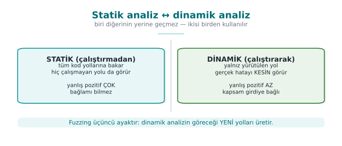

### Tools, layer by layer

| Level | Tool | What it finds | Cost |
| --- | --- | --- | --- |
| Compiler warnings | `-Wall -Wextra -Wformat=2 -Wconversion -Wshadow` · MSVC `/W4` | Suspicious conversions, format strings, unused values | Zero: on every build |
| Compiler analyzer | `gcc -fanalyzer` · `clang --analyze` · MSVC `/analyze` | Path-sensitive: NULL access, leaks, double free | Low |
| Rule checker | `clang-tidy` (`cert-*`, `bugprone-*`), `cppcheck` (`--addon=cert`) | CERT violations, dangerous APIs | Low |
| Semantic query | CodeQL, Semgrep | Source-to-sink data flow: "does a value from argv reach an unvalidated memcpy?" | Medium |
| Commercial | Coverity, Klocwork, Polyspace | Deep analysis and reporting on large codebases | High |

```bash title="Bir C dosyasını birkaç araçla taramak"
gcc -fanalyzer -Wall -Wextra -c ayristir.c
clang-tidy ayristir.c -checks='-*,cert-*,bugprone-*,clang-analyzer-security*' -- -I.
cppcheck --enable=warning,portability --addon=cert ayristir.c
```

### Data-flow analysis: source → sink

The most valuable kind of static analysis is **taint** tracking: it asks whether a value coming from an untrusted
**source** (argv, a file, the network) reaches a dangerous **sink** (a memcpy length, a format string, `system`,
an array index) without being validated. CodeQL and Semgrep can ask this question across an entire codebase:

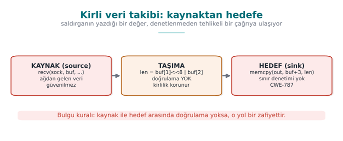

### Living with false alarms

Static analysis produces false alarms; managing them is also part of the process:

1. **Start with high-confidence rules first:** format strings, dangerous functions, NULL access.
2. **Every suppression needs a justification:** `// NOLINT(cert-err33-c): return value is deliberately ignored,
   because ...` An unjustified suppression hides a future real bug.
3. **Zero warnings in new code:** cleaning up every warning in old code in a single day is not realistic; but it
   is possible to enforce, in continuous integration, that no warnings are introduced into newly added code.

!!! question "How does an evaluator test this?"
    Certification source code review usually starts with a static analysis scan; the evaluator also asks the
    developer for their own scan report. A team that can say "we ran the tool, got this many findings, fixed
    these, and these are false alarms for this reason" demonstrates a mature process. The evaluator then looks by
    hand at what the tool cannot see — especially crypto usage and the logic of security checks.

---

## 10. Sanitizers: catching bugs at runtime

A **sanitizer** is a checking layer the compiler adds to a program: it checks, at runtime, whether every memory
access, every integer operation, or every thread access is valid, and gives a detailed report at the first bug.
Unlike static analysis it almost never produces false alarms; but it only finds bugs on the code path that is
actually **run**. This is why sanitizers are used together with tests and fuzzing.

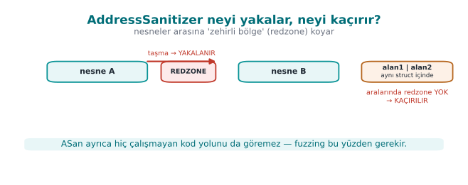

| Sanitizer | What it finds | Flag (GCC/Clang) | MSVC | Slowdown |
| --- | --- | --- | --- | --- |
| **AddressSanitizer (ASan)** | Overflow (stack, heap, global), UAF, double free, use-after-return | `-fsanitize=address` | `/fsanitize=address` | ~2× |
| **LeakSanitizer (LSan)** | Memory leaks | With ASan (Linux) | — | Low |
| **UndefinedBehaviorSanitizer (UBSan)** | Signed overflow, invalid shift, NULL access, misaligned access, invalid enum/bool | `-fsanitize=undefined` | — | Low |
| **MemorySanitizer (MSan)** | Reading uninitialized memory | `-fsanitize=memory` (Clang only) | — | ~3× |
| **ThreadSanitizer (TSan)** | Data races | `-fsanitize=thread` | — | 5–15× |

### How does ASan work? Shadow memory

ASan keeps 1 byte of **shadow memory** for every 8 bytes of the program's memory. The shadow byte says how much of
those 8 bytes is valid. **Redzones** — poisoned regions — are placed before and after every array; freed blocks
are not reused immediately, they are held in **quarantine** for a while and marked poisoned. The compiler adds a
few instructions before every memory access to check the shadow byte. An overflow is caught the moment it touches
a poisoned region; a UAF is caught the moment it reaches a block still in quarantine.

One consequence of this design is the limitation we saw in Week 1 Demo 3: if an overflow stays **inside the same
structure** (from one field into the neighbouring field), ASan cannot see it, because there is no poisoned region
between them.

### Practical use

```bash
# Test derlemesi: hata ayıklama bilgisi + çerçeve işaretçisi + iki sanitizer
gcc -g -O1 -fno-omit-frame-pointer -fsanitize=address,undefined program.c -o program_test

# İlk UBSan hatasında durmak ve ayrıntılı yığın izi almak için
UBSAN_OPTIONS=halt_on_error=1:print_stacktrace=1 ./program_test
ASAN_OPTIONS=detect_leaks=1 ./program_test
```

### Reading a UBSan report line by line

When Demo 3's `tasma(1)` call (`INT_MAX + 1`) is run in a build compiled with UBSan, it produces a report similar
to the one below. Let's read it line by line:

```text title="UBSan raporu, satır satır açıklamalı"
ub.c:24:15: runtime error: signed integer overflow:
            2147483647 + 1 cannot be represented in type 'int'
```

- `ub.c:24:15` → **which file, which line, which column** the error occurred at (line 24, character 15 of
  `ub.c` — exactly where the `x + ekle` expression sits).
- `runtime error:` → this is not a **compile-time** error, it is a problem the program caught **while running**.
- `signed integer overflow:` → the **type** of error: signed integer overflow (INT32-C).
- `2147483647 + 1 cannot be represented in type 'int'` → the **values at the moment the error occurred**: the
  left-hand side (`2147483647` = `INT_MAX`), the right-hand side (`1`), and which type (`int`) it did not fit
  into. UBSan gives you these values **without you having to compute them**; you can use this line to double-check
  the bit-pattern calculation from Section 7.

The same report format applies to other kinds of UB; only the middle line changes:

```text title="Aynı formatın diğer UB türlerindeki hâli"
ub.c:33:15: runtime error: shift exponent 31 is too large for 32-bit type 'int'
ub.c:43:14: runtime error: load of misaligned address 0x... for type 'int', which requires 4 byte alignment
```

Let's read an ASan report the same way — **what each line says** (when a buffer overflow is caught in Demo 5's
`giris_sert` target):

```text title="ASan tampon taşması raporu, satır satır"
==12345==ERROR: AddressSanitizer: stack-buffer-overflow on address 0x7ffee...
WRITE of size 1 at 0x7ffee... thread T0
    #0 in strcpy
    #1 in kopyala tasma.c:24          <- HANGİ SATIR: yazma işlemi burada oldu
    #2 in main tasma.c:35
```

- `==12345==` → the operating system's process id (PID); it helps tell reports apart when more than one process
  is running at once.
- `ERROR: AddressSanitizer: stack-buffer-overflow` → the **class** of the error: this is a **stack** buffer
  overflow (not heap) — other classes like `heap-buffer-overflow` or `heap-use-after-free` are reported in the
  same format.
- `WRITE of size 1` → the operation was a **write** (a read would say `READ`), and it was **1 byte** wide (`strcpy`
  copies 1 character at a time).
- `#0`, `#1`, `#2` → the **call stack**: the error occurred inside `strcpy` (`#0`), `strcpy` was called from the
  `kopyala` function (`#1`, `tasma.c:24`), and `kopyala` was called from `main` (`#2`, `tasma.c:35`). In a code
  review, **the line to look at** is almost always at position `#1` — `#0` is most often library code (`strcpy`);
  the real bug is on the caller's side.

!!! success "Rule"
    When reading a sanitizer report, first find the **error class** (the top line), then **the caller's line**
    (usually `#1`), and finally, if present, the **values** (on the bottom line in UBSan). These three give you
    all the information you need to fix the bug — you don't even need to try to reproduce it **yourself**.

!!! warning "A sanitizer build never ships"
    Sanitizers are slow, consume memory, and open up debugging-oriented interfaces. They must be **off** in the
    release build. The correct usage: run tests and a short fuzzing session with a sanitizer build on every merge,
    in continuous integration (CI).

---

## 11. Introduction to fuzzing

**Fuzzing** is running a program with a large number of automatically generated, mostly malformed inputs and
looking for inputs that make it crash or that a sanitizer reports as a bug. Fuzzing was not yet widespread when
the textbook was written in 2003; today it is a standard security test for every major project, from browsers to
operating system kernels. Google's OSS-Fuzz service for open source projects has found tens of thousands of bugs
over the years.

### How does coverage-guided fuzzing work?

Modern fuzzers (libFuzzer, AFL++, honggfuzz) don't just generate random input; they measure **which code paths**
the program executes, and keep inputs that open up a new path, mutating them to continue:

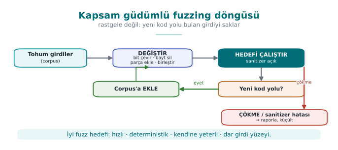

This feedback loop lets the fuzzer discover, on its own, things like a file format's "magic bytes" or the correct
value of a length field. When used together with a sanitizer, it also catches cases where the program doesn't
crash but does corrupt memory.

### Writing a fuzz target (harness)

In libFuzzer, you write a single function that calls the code under test. The fuzzer calls this function thousands
of times a second, with a different byte sequence each time:

```c title="fuzz.c — libFuzzer hedefi"
#include <stddef.h>
#include <stdint.h>
#include "ayristir.h"

int LLVMFuzzerTestOneInput(const uint8_t *veri, size_t boyut)
{
    ayristir(veri, boyut);      /* test edilen fonksiyon; dönüş değeri önemsiz */
    return 0;                   /* 0 dışında bir değer döndürme */
}
```

```bash
clang -g -O1 -fsanitize=fuzzer,address fuzz.c ayristir.c -o fuzz_ayristir
mkdir -p corpus && cp tohum/*.bin corpus/
./fuzz_ayristir corpus/ -max_total_time=10     # 10 saniye sınırlı oturum
```

The properties of a good target: it is **fast** (no network, disk, or `sleep`), **deterministic** (the same input
always gives the same result), **leaves no state behind** (every call is independent), and **tests one thing**
(a separate target for every parser).

### Demo 4 — Finding bugs with fuzzing

!!! info "Demo 4 · `code/week-04/04-fuzzing` · CWE-125, CWE-787 · Recipe 3.1"
    A small parser reads records in the `[type][length][data…]` format but never compares the length field to the
    incoming data. libFuzzer, by tracking code coverage, finds a crashing input in at most 10 seconds; ASan reports
    the bug at the exact location. The fixed parser is then fuzzed for the same amount of time and no bug is
    produced. Fuzzing is always time-bounded, and output is written only under the demo folder's `fuzz-cikti/`.

=== "Windows (PowerShell)"

    ```powershell
    cd code\week-04\04-fuzzing
    .\demo.ps1
    ```

=== "WSL / Linux"

    ```bash
    cd code/week-04/04-fuzzing
    sh demo.sh
    ```

| Step | What happens? |
| --- | --- |
| 1 | Normal input (`tohum/normal.bin`) parses without issue |
| 2 | The buggy parser is fuzzed with libFuzzer; a crashing input is found |
| 3 | The input found is replayed against the ASan build; a full error report |
| 4 | The fixed parser is fuzzed for the same amount of time; no crash |
| 5 | The fixed version safely rejects the `tohum/cokerten.bin` file |

If clang is not installed (`sudo apt install -y clang` on Ubuntu 20.04), CMake skips the libFuzzer targets and the
demo shows the bug via the ASan replay build instead. On Windows, libFuzzer runs through Visual Studio's
`/fsanitize=fuzzer` support.

!!! tip "Adding fuzzing to your project"
    Every function in your project that reads outside data (a file parser, a network message decoder, a
    configuration reader) is a candidate fuzz target. Adding a line like "this function was fuzzed with a
    sanitizer for this long, reached this much code coverage, and these bugs were found and fixed" to your
    security guide's verification section is strong evidence for an evaluator.

!!! danger "Common mistake: running the fuzzer without a sanitizer"
    A fuzzer only looks for **crashes**; on a target compiled without a sanitizer, an out-of-bounds read like
    Section 3's `kayit_oku` often passes **without crashing** (if the byte read happens to sit on a mapped page).
    Fuzzing's value multiplies on a target compiled **together with** ASan/UBSan: the sanitizer also catches input
    that doesn't crash the program but does corrupt memory.

!!! success "Rule"
    Always compile your fuzz targets with `-fsanitize=fuzzer,address,undefined` (combine the sanitizers from
    Section 10 into the same binary as the fuzzer); a target compiled with only `-fsanitize=fuzzer` misses a
    significant share of bugs.

---

## 12. Compiler and operating system protections

Secure coding **prevents** bugs; compiler and operating system protections **make a bug harder to exploit** once
one slips through. The textbook mentions only the stack protector among these (StackGuard, ProPolice, MSVC `/GS`)
(Recipe 3.3); ASLR, DEP/NX, RELRO, and control-flow integrity became widespread after the textbook was written.

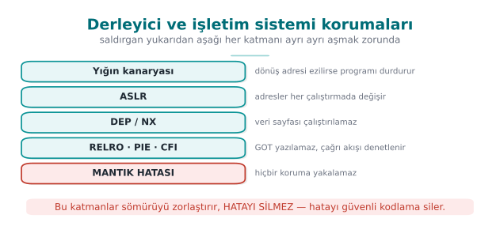

These layers **make exploitation harder, they do not erase the bug**. The bug itself is only removed by the
secure coding covered in Sections 3–8.

### Protections and flags

| Protection | What it does | GCC/Clang (Linux) | MSVC (Windows) |
| --- | --- | --- | --- |
| **Stack protector (canary)** | Places a random value before the return address; halts the program on return if it has been corrupted | `-fstack-protector-strong` | `/GS` (default) |
| **`_FORTIFY_SOURCE`** | Checks library calls that write into buffers whose size is known at compile time (`memcpy`, `strcpy`, `sprintf`…) | `-D_FORTIFY_SOURCE=2` (or `3`) + `-O1` and above | Secure CRT (`_s` functions) |
| **PIE + ASLR** | Changes the addresses of the program and its libraries on every run | `-fPIE -pie` | `/DYNAMICBASE /HIGHENTROPYVA` |
| **DEP / NX** | Forbids executing code on data pages (stack, heap) | Default | `/NXCOMPAT` (default) |
| **RELRO** | Makes the dynamic linking tables (GOT) read-only after startup | `-Wl,-z,relro,-z,now` | — |
| **Control-flow integrity** | Ensures indirect calls and returns only go to valid targets | `-fcf-protection` (Intel CET), `-fsanitize=cfi` (Clang) | `/guard:cf` (CFG), `/CETCOMPAT` |
| **SafeStack / shadow stack** | Keeps return addresses on a separate, protected stack | `-fsanitize=safe-stack` (Clang), hardware shadow stack | CET shadow stack |

### What does each protection stop, and what doesn't it stop?

| Protection | Stops | Does not stop |
| --- | --- | --- |
| Canary | A consecutive stack overflow that reaches the return address | Corruption of local variables placed before the canary; heap overflow; a canary read through an information leak |
| `_FORTIFY_SOURCE` | Library calls that write too much into a buffer of known size | Loops you wrote yourself; buffers of unknown size |
| ASLR | Attacks that rely on assuming a fixed address | Cases where an address has been leaked (a format string vulnerability!) |
| NX | Executing code placed into a data region | Attacks that reuse pieces of the program's **own** code |
| CFI / CFG | An indirect call jumping to an invalid target | Jumping to a wrong-but-valid target among the valid ones; data corruption |

The last column of the table matters: every protection makes an **attack technique** harder, it does not
eliminate a **class of bug**. Protections complement each other; for example, ASLR is weakened by an information
leak, which is why "read-only" bugs like the format string vulnerability are also taken seriously. And no
protection stops a logic bug (such as the corruption of a privilege flag in Week 1 Demo 3).

### Going through each protection one by one

The table above is meant as a summary; each of the six protections works through a different **physical
mechanism** and targets a different class of attack. Substituting one for another (e.g., saying "ASLR is on, we
don't need the canary") is a mistake — each one is broken down separately below.

**Stack canary — what happens at the memory level?**

Take Demo 5's `tasma.c`: `char tampon[64]; strcpy(tampon, girdi);`. When the protection is **on**
(`giris_sert`), the compiler **automatically** adds an extra region to the stack frame in the following order
(addresses from high to low, in the direction the stack grows):

```text title="Korumalı bir yığın çerçevesinin düzeni (kavramsal, yüksek adresten düşüğe)"
[ dönüş adresi          ]  ← fonksiyon bitince buraya dönülür (8 bayt, 64-bit'te)
[ kaydedilmiş çerçeve    ]  ← çağıranın çerçeve işaretçisi (8 bayt)
[ K A N A R Y A          ]  ← fonksiyon GİRİŞİNDE yazılan, fonksiyon ÇIKIŞINDA denetlenen değer (8 bayt, 64-bit'te)
[ tampon[64]             ]  ← strcpy'nin yazdığı yer; TAŞMA BURADAN YUKARI DOĞRU BÜYÜR
```

The code the compiler adds when entering the function copies a **random** value — generated once by the operating
system at process startup (glibc's `__stack_chk_guard`, usually from `/dev/urandom`) — into the canary cell. Just
before the function returns, a **second** piece of compiler-added code reads this cell's value again and
**compares** it against the starting value:

```text title="strcpy(tampon, girdi) 80 karakterlik bir girdiyle çağrılırsa"
tampon'un kapasitesi        : 64 bayt
girdi'nin uzunluğu          : 80 bayt (+ sonlandırıcı)
Taşan miktar                : 80 - 64 = 16 bayt
İlk 64 bayt                 : tampon'u doldurur (amaçlanan)
Sonraki 8 bayt (65-72)      : KANARYA hücresinin üzerine yazılır → kanarya BOZULUR
Kalan bayt(lar)             : kaydedilmiş çerçeveye/dönüş adresine doğru ilerler

Fonksiyon dönerken denetim: okunan_kanarya == baslangictaki_kanarya ?
   HAYIR → __stack_chk_fail() çağrılır → "*** stack smashing detected ***" → abort()
```

When the protection is **off** (`giris_zayif`), this extra region and comparison don't exist at all; the same
80-byte input is written straight over the saved frame and the return address — the program either "returns" to a
random address (usually invalid, so it crashes), or keeps running with memory silently corrupted.

**Why isn't it enough on its own? Three concrete limits:**

1. **Variables before the canary are not protected.** The compiler tries to place buffers **close to** the
   canary, but if a local variable in the same frame sits **far from** the canary, **before** the buffer
   (`-fstack-protector` does not always reorder every variable), that variable can be affected by an overflow
   while the canary is never touched and the function returns "normally."
2. **The heap is not protected at all.** The canary exists only in **stack** frames; heap objects such as Demo 2's
   `malloc`-based `struct oturum` have no such protection.
3. **If the canary itself can be leaked, the protection becomes meaningless.** This is one of the most important
   connections within this week: Section 5's format string vulnerability can read **any** 8 bytes on the stack
   with `%x` — the canary is one of those eight-byte groups. The attacker first **learns the canary's real value**
   through the leak, then crafts the overflow to write that exact value back; the comparison comes out `==` and
   the protection never triggers. This link between the canary and the format string vulnerability is a concrete
   example of the "no single protection is enough on its own" principle (Week 1's defense in depth).

**ASLR (Address Space Layout Randomization) — what does it randomize, and what doesn't it?**

ASLR changes the **starting addresses** of the program's code region, stack, heap, and shared libraries on every
run (done by the operating system when the process starts). **What it blocks:** an attack that relies on the
attacker **assuming a fixed address** — e.g., "I'll write this fixed address as the return address" — since the
address is different on every run, a fixed value stops working on the next run. **What it does not block:** (a)
if an information leak (e.g., a format string vulnerability, a pointer accidentally printed to the screen)
exposes a **real** address, the remaining addresses become **calculable** from it (libraries are usually loaded at
fixed offsets relative to each other); (b) on 32-bit systems the address space is small, so the randomness has low
"entropy" and can be brute-forced; (c) it has no effect whatsoever on logic bugs.

**DEP / NX (data execution prevention) — what does it block, and what doesn't it?**

The processor's memory management unit can mark every memory page as "executable" or "non-executable." DEP/NX
makes **data** pages like the stack and heap non-executable. **What it blocks:** an attacker writing their own
machine code (shellcode) into a buffer and jumping straight to it — such a jump is now **rejected** by the
processor itself. **What it does not block:** if, instead of writing their own code, the attacker **chains
together** existing pieces (functions, instruction sequences) from the program's **already executable** own code
region (the family of techniques known as ROP/JOP), DEP/NX cannot see this, because no "executing code from a
data page" ever happens — this is why an additional layer such as CFI/CFG is needed.

**RELRO (Relocation Read-Only) — what does it block, and what doesn't it?**

A dynamically linked program keeps the real addresses of the external functions it calls (e.g., `printf`,
`malloc`) in a table (the GOT — Global Offset Table); this table is normally **writable**, because some addresses
are filled in "lazily," only on their first call. Full RELRO (`-z relro -z now`) resolves all of the program's
external function addresses **at startup** and then makes this table **read-only**. **What it blocks:** using a
memory-write bug to **change** an entry in the GOT table (e.g., the address of `free`) to an address of the
attacker's choosing. **What it does not block:** corruption in the program's **own** stack/heap variables; it
protects no structure other than the GOT.

**PIE (Position-Independent Executable) — a prerequisite for ASLR**

PIE means the program's **own code** (not just its shared libraries) is compiled so that it can run at any
address. **What it blocks/provides:** a program compiled without PIE always has its **own** code region at the
**same fixed address** — even if ASLR randomizes the libraries, the program's own code remains predictable. PIE
closes this gap. **What it does not block:** PIE alone does not prevent a memory bug; it only **extends** ASLR's
coverage to the program's own code — ASLR without PIE is a "half" protection.

**CFI / CFG (Control-Flow Integrity / Guard) — what does it block, and what doesn't it?**

When an **indirect** call is made — through a function pointer, or a C++ virtual function call — CFI/CFG checks at
runtime whether "this target is within the set of **valid targets** determined at compile time." **What it
blocks:** exactly the kind of situation in Section 6's UAF example, where a corrupted function pointer jumps to a
**completely** random or attacker-chosen address — a jump outside the valid target set is detected and the
program is halted. **What it does not block:** the attacker choosing a wrong-but-permitted target **among the
valid targets** (e.g., jumping to another function inside the program that is itself also in the CFI set, which
would not be stopped); it also never sees data corruption **other than** a function pointer (e.g., modifying a
privilege flag, as in Week 1 Demo 3).

!!! danger "Common mistake: saying 'ASLR is on, we're safe'"
    A single protection showing "on" in a protection table does not mean the system is safe. A binary audit in the
    field asks for **all of them together**: canary + FORTIFY + PIE/ASLR + NX + RELRO + CFI. If any one is
    missing, the others can be **indirectly** bypassed through the path that missing link opens (e.g., without
    RELRO, an indirect call can be hijacked through the GOT even if ASLR is on).

!!! success "Rule"
    Read a protection table with two columns per row, "what it blocks" **and** "what it does not block" (as in the
    table above). "This protection is on, therefore we're safe" is a wrong sentence; the correct sentence is "this
    protection makes **this** attack technique harder, it still does not stop **this** class of bug."

### Demo 5 — Turning protections on and off

!!! info "Demo 5 · `code/week-04/05-derleyici-korumalari` · CWE-121 · Recipe 3.3"
    The same overflow bug is compiled twice: with protections **off** (`giris_zayif`) and **on** (`giris_sert`).
    When a long input overflows the 64-byte buffer, the canary is corrupted in the hardened version and the
    program halts safely; in the weak version the overflow silently corrupts memory or the program crashes. Then a
    script checks the protections in both binaries: `readelf` on Linux, `dumpbin` on Windows (no Developer
    PowerShell needed).

=== "Windows (PowerShell)"

    ```powershell
    cd code\week-04\05-derleyici-korumalari
    .\demo.ps1
    ```

=== "WSL / Linux"

    ```bash
    cd code/week-04/05-derleyici-korumalari
    sh demo.sh
    ```

The message seen in the hardened version is proof that the protection **worked**: on Linux,
`*** stack smashing detected ***: terminated`; on Windows, exit code `0xC0000409` (stack buffer overflow). The
program has crashed; but control flow was never hijacked.

### Auditing a binary's protections

=== "Linux"

    ```bash
    readelf -h prog | grep Type                 # DYN = PIE, EXEC = PIE değil
    readelf -l prog | grep -A1 GNU_STACK        # RW = NX açık, RWE = kapalı
    readelf -l prog | grep GNU_RELRO            # RELRO var mı
    readelf -d prog | grep BIND_NOW             # tam RELRO
    readelf -s prog | grep __stack_chk_fail     # kanarya kullanılıyor
    ```

    The `checksec` script (`checksec --file=prog`) shows all of these in a single table.

=== "Windows"

    ```powershell
    dumpbin /headers prog.exe | Select-String "Dynamic base|NX compatible|Guard|High Entropy"
    ```

    In the `DLL characteristics` line you should see `Dynamic base` (ASLR), `NX compatible` (DEP), `Guard` (CFG),
    and `High Entropy Virtual Addresses`.

!!! tip "Recommended release flags"
    **GCC/Clang:** `-O2 -D_FORTIFY_SOURCE=2 -fstack-protector-strong -fPIE -pie -Wl,-z,relro,-z,now
    -fcf-protection -Wall -Wextra -Wformat=2 -Werror=format-security`. **MSVC:** `/O2 /GS /sdl /guard:cf
    /DYNAMICBASE /HIGHENTROPYVA /NXCOMPAT /CETCOMPAT /W4`. In the course demos, most of these flags (canary,
    FORTIFY, PIE, full RELRO; on Windows `/GS`, `/guard:cf`, ASLR, DEP) are turned on for Demo 5's `giris_sert`
    target; you add them to your own project's `CMakeLists.txt` yourself. OpenSSF's "Compiler Options Hardening
    Guide for C and C++" keeps an up-to-date list.

!!! question "How does an evaluator test this?"
    They extract the protection table for every binary and shared library that is shipped (`checksec`, `dumpbin`,
    or on mobile, `readelf` for the `.so` files inside the APK). A protection that is off is written up as a
    finding; the justification for it (e.g., performance, legacy platform support) must be in the trade-off log.
    They also ask whether the application itself checks that the operating system's protections are enabled —
    this is also one of the card scheme's requirements.

---

## 13. Secure build pipeline: bringing it all together in continuous integration

Every tool this week gains its value not from being run once by hand, but from running **automatically on every
change**. A security bug most often appears when a small change breaks code that used to be correct. A continuous
integration (CI) pipeline is how this kind of regression gets caught.

### A sample pipeline

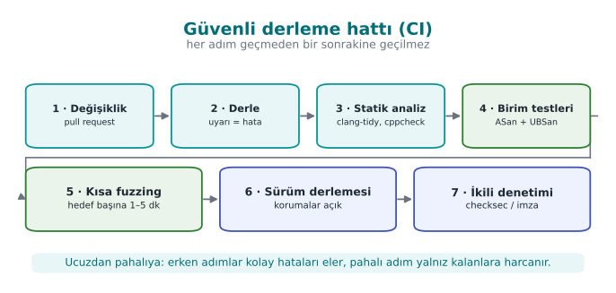

| Stage | Failure criterion |
| --- | --- |
| Build | A single warning (`-Werror` / `/WX`) |
| Static analysis | A new high-severity finding |
| Sanitizer-enabled tests | Any sanitizer report |
| Fuzzing | A new crash; also, inputs found earlier (the corpus) are run every time as a **regression test** |
| Release build | A protection flag being turned off |
| Binary audit | A logging string or a forbidden constant in `strings` output; the symbol table not being stripped |

!!! tip "Every input fuzzing finds is a test"
    A crashing input the fuzzer found is not deleted once the bug is fixed; it is placed into a folder like
    `tests/regresyon/` and run on every build. This way the same bug can never enter the codebase again.

### Modes in the course's CMake setup

The course's demo infrastructure (`code/cmake/cen429.cmake`) offers a small model of this pipeline by compiling
the same source file in different modes. Note: the modes change the source code and a few flags; most of the
release protection flags are only turned on for Demo 5's `giris_sert` target:

| Mode | Purpose | Flags (summary) |
| --- | --- | --- |
| `korumasiz` | Show the bug "bare" | Optimization off (`-O0` / `/Od`) |
| `optimize` | Show the effect of compiler optimization (Week 1 Demo 2) | `-O2` / `/O2` |
| `asan` | Catch memory bugs | `-O1 -fsanitize=address` / `/fsanitize=address`; FORTIFY is turned off on Linux so only ASan is seen |
| `denetimli` | The library's runtime checks | `-O2 -D_FORTIFY_SOURCE=2` (`KUTUPHANE_DENETIMI` define on Windows) |
| `guvenli` | The fixed source code | `-O2` / `/O2`; the real difference is in the code itself |

Set up a similar split in your own project: debug + sanitizer for day-to-day development, sanitizer + fuzzing for
CI, protections on and logging off for the release build.

### Supply chain: the build environment itself

As we saw in Week 2, an attacker sometimes targets not the code but the **build environment**. For the security
of the build pipeline:

- Access to the build server must be restricted and logged.
- Dependencies must be pinned by version and hash digest (Week 5's SBOM).
- Release binaries must be signed and their hash digests published (Week 1's unique version identifier).
- Where possible, use a **reproducible build**: the same source always produces a bit-for-bit identical binary.

---

## 14. Introduction to code obfuscation (Recipe 12.1, 12.3)

Everything we have covered so far is enough against a remote attacker who only sends input. But the **white-box
attacker** we saw in Week 1 possesses the program itself: they can open the binary in a disassembler, read its
strings, find its functions by name. If your code has a license check, part of a key, or a security check, reading
it is the first step toward bypassing it. **Code obfuscation** is the general name for transformations that make a
program's behavior harder to **understand**, without changing that behaviour.

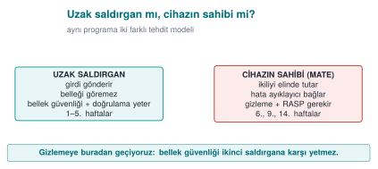

### What does obfuscation give you, and what doesn't it?

The textbook is candid about software protection (Recipe 12.1): an attacker with enough time and skill will
eventually defeat any obfuscation. The goal of obfuscation is **not to make it impossible, but to make it
expensive**:

- Raising the cost of the attack above the value of what is being protected.
- Making the attack harder to automate: a method found in one copy should not work on every copy the same way
  (Week 14's **diversification**).
- **Buying time** for the other layers (RASP, integrity checks, server-side checks): holding out until keys are
  rotated or the version is updated.

One of the textbook's recommendations still holds today: rather than trying to perfect one advanced technique, it
is more effective to combine **several simple techniques together with data obfuscation**. Every layer of
obfuscation raises maintenance cost; that's why it is applied only to sensitive parts.

### Obfuscation techniques: a map

| Family | What it hides | Example techniques | This term |
| --- | --- | --- | --- |
| **Layout** | Names, structure | Hiding symbols, making function and file names meaningless, removing logging | This week Demo 6 |
| **Data** | Constants, strings, variables | String encryption, constant transformations, variable splitting/merging, opaque booleans | This week, Week 9 |
| **Control flow** | The algorithm's structure | Control-flow flattening, opaque predicates, fake and dead branches | This week Demo 7, Week 9 |
| **Preventive** | The work of analysis tools | Structures that mislead a disassembler, runtime decoding | Week 9 (concept) |
| **Virtualization** | The machine code itself | Translating a function into a custom virtual machine's bytecode | Weeks 9 and 14 (Tigress) |

!!! note "How it's done in the field"
    The list of hardening measures on the native side of a certified mobile payment library covers almost this
    entire map: turning off symbol visibility in the shared library; hand-obfuscating function, file, and
    parameter names (the real names are kept in internal documentation); hiding constants through arithmetic
    transformations; encrypting static strings before build time and decrypting them, then immediately wiping
    them, only at the moment of use; opaque boolean values that only return "success/failure"; replacing standard
    library functions with the library's own versions; fake operations that don't change the result and dead
    branches that never run; control-flow flattening with a randomized exit point on error; and completely
    removing logging from the release build. None of these measures is strong on its own; their strength comes
    from being used **together**, and together with RASP.

---

## 15. Symbol, string, and log hiding

The first step of reverse engineering is usually the simplest one: looking at the **readable text** and **function
names** inside the binary. A function named `lisans_dogrula` or a string like `"Lisans geçersiz"` tells the
attacker exactly where to look. This is why the first and cheapest layer of obfuscation is stripping this
information out of the binary.

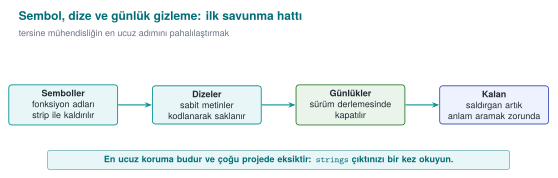

### Three simple measures

| Measure | How? | What does it buy you? |
| --- | --- | --- |
| **Hide symbols** | `static` functions; `-fvisibility=hidden` in a shared library, exposing only the necessary API; `strip -s` in the release; not shipping the PDB file on Windows | Function names do not appear in the binary |
| **Remove logging in the release** | Compile logging macros **completely** out of the build with a build flag | Error messages and internal state information do not stay in the binary |
| **Hide sensitive strings** | Encrypt or scramble at compile time, decrypt at the point of use, and **immediately wipe** it (Recipe 12.11) | A `strings` scan cannot find the sensitive constants |

```c title="Günlük makrosu: sürümde hiç kod üretmez"
#ifdef GUNLUK_ACIK
#  define GUNLUK(...) fprintf(stderr, __VA_ARGS__)
#else
#  define GUNLUK(...) ((void)0)       /* dizge de, çağrı da ikili dosyaya girmez */
#endif

GUNLUK("[LOG] lisans denetimi: %s\n", sonuc ? "gecti" : "kaldi");
```

Silencing logging with a **runtime** flag (`if (hata_ayiklama) printf(...)`) is not enough: the string stays in
the binary, and the attacker can turn logging back on by changing the flag. In the field, the one exception is
usually a deliberate decision recorded in the trade-off log (e.g., writing only an encrypted diagnostic value).

!!! warning "String hiding is not a key-storage method"
    An encrypted string is decrypted at the moment of use while the program is running; at that moment it sits in
    memory unencrypted, and the decryption key is also inside the program. String hiding stops **static** scans
    like `strings`; against an attacker examining the program while it runs you need RASP (Week 6), and for real
    keys you need whitebox cryptography (Week 11). This is why, in the field, the string-hiding key is itself also
    split up and hidden, and the decryption function is protected with additional checks.

### Demo 6 — Symbol and string leakage

!!! info "Demo 6 · `code/week-04/06-sembol-dize` · CWE-200, CWE-215 · Recipe 12.11"
    The same small license check is compiled twice: `gizli_acik` (symbols, log strings, and a synthetic license
    key all exposed) and `gizli_kapali` (logging compiled out, the string scrambled at compile time, symbols
    stripped). Both run the same way; the difference shows up in the binary.

=== "Windows (PowerShell)"

    ```powershell
    cd code\week-04\06-sembol-dize
    .\demo.ps1
    ```

=== "WSL / Linux"

    ```bash
    cd code/week-04/06-sembol-dize
    sh demo.sh
    ```

| Step | What happens? |
| --- | --- |
| 1 | Both versions give the same result |
| 2 | `strings`: the license string and `[LOG]` lines appear in the exposed version; they are absent in the hidden version |
| 3 | `nm`: `lisans_dogrula` appears in the exposed version; the symbol is absent in the hidden version |
| 4 | Windows: function names live in the PDB file, not the EXE; the hidden version does not produce a PDB, and its strings are hidden |

---

## 16. Control-flow flattening and opaque values (Recipe 12.3, 12.8)

A compiled function's control-flow graph (CFG) shows the algorithm's skeleton: which check is done in which order,
which branch leads to success. **Control-flow flattening** moves all of a function's basic blocks into a `switch`
dispatcher inside a single loop. The natural adjacency between blocks disappears; which block follows which can
only be read off from the value of a **state variable**.

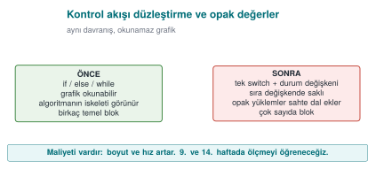

```c title="Düzleştirme şablonu"
int durum = 1;
for (;;) {
    switch (durum) {
    case 1: /* 1. adım */  durum = 2; break;
    case 2: /* 2. adım */  durum = (kosul ? 3 : 4); break;
    case 3: /* başarı yolu */ durum = 5; break;
    case 4: /* hata yolu */   return BASARISIZ;
    case 5: return BASARILI;
    }
}
```

On its own, this pattern can be reversed fairly quickly by an experienced analyst. To make it strong it is
combined with other techniques:

- **Hiding the state values:** instead of `case 1`, `case 2`, the state values are stored through a simple
  arithmetic transformation, so the sequential order is not visible (Recipe 12.5, constant transformations).
- **Fake and dead blocks:** blocks that never run, or that don't change the result, are added; this makes it
  harder for the analyst to tell which block is real.
- **A randomized exit point:** when a check fails, the state variable is set to an unpredictable value and the
  function exits through the `default` branch; **where** the error was caught can no longer be read off from the
  flow.
- **Opaque values:** critical results like "true/false" are not kept as a plain `0`/`1`, but in a form that
  depends on more than one value and cannot be flipped by changing a single byte (Recipe 12.8). The textbook's
  approach in this recipe is also the basis for the "opaque boolean" return values used by libraries in the field.

### Demo 7 — Control-flow flattening

!!! info "Demo 7 · `code/week-04/07-akis-duzlestirme` · Recipe 12.3"
    A small PIN check is written in two forms: the natural `if` chain (`pin.c`) and a hand-flattened form
    (`pin_duz.c`). The two versions give the same result for the same PINs (the correct PIN is synthetic); but
    their machine code and control-flow graphs differ. In the last step, the **cost** of flattening is shown
    through a timing measurement.

=== "Windows (PowerShell)"

    ```powershell
    cd code\week-04\07-akis-duzlestirme
    .\demo.ps1
    ```

=== "WSL / Linux"

    ```bash
    cd code/week-04/07-akis-duzlestirme
    sh demo.sh
    ```

| Step | What happens? |
| --- | --- |
| 1 | Both versions give the same result for the same PINs |
| 2 | `objdump` / `dumpbin` is used to compare `pin_dogrula`'s machine code: the flattened version has far more branches |
| 3 | Timing: the flattened version is slower |

This demo is the hand-made counterpart to what we will do **automatically** in Week 14 with Tigress's
`--Transform=Flatten` transformation. We will cover how to measure obfuscation's effectiveness (strength,
resilience, cost) in Week 9.

### Function name hiding, allocation obfuscation, and dynamic encryption: the concept

The other three techniques the syllabus places in this week will be covered in detail in Week 9; here it is enough
to know what they are:

- **Function name hiding:** stripping symbols removes exported names; but if an API's entry points (e.g., a JNI
  interface) must stay exposed, those names are made meaningless, and the real names are kept only in internal
  documentation. The programmer's readability is preserved through a macro layer.
- **Allocation obfuscation:** the size and order of buffers allocated for sensitive data leave a recognizable
  trace (e.g., "a 32-byte block = an AES key"). This trace is blurred by changing the buffers' sizes, order, and
  layout, adding fake allocations, and filling used memory with random values afterward.
- **Dynamic encryption:** the most sensitive code sections stay encrypted in the binary and are decrypted into
  memory only at the moment they are about to run, then re-encrypted or wiped afterward. It is a powerful
  technique, but it conflicts with the operating system's memory protections (DEP/NX, the separation between
  writable and executable pages) and requires careful design; that is why it is used selectively in practice.

!!! question "How does an evaluator test this?"
    They evaluate obfuscation not as "present/absent" but by **time**: how long did it take to find a sensitive
    function in the binary, understand its logic, and bypass a check? They start with a `strings` and symbol scan,
    then examine the control flow with a disassembler. The report records how much each protection layer delayed
    the attack; in attack-potential scoring (Week 13), the "time required" and "expertise required" metrics come
    from exactly this.

---

## 17. Term project: this week

Write the first draft of your security guide's **S9 "Code hardening"** section:

- [ ] Compile your project with the recommended release flags from the "Compiler and operating system protections"
      section; add the protection table (`checksec` / `dumpbin`) to the guide. If any protection is left off,
      write the justification in the trade-off log.
- [ ] Scan your code against the CERT rules with `clang-tidy` or `cppcheck`; fix at least five findings and
      document them by rule id.
- [ ] Run your tests with ASan + UBSan.
- [ ] Write a fuzz target for at least one function that reads external data, and fuzz it for at least 10 minutes;
      write down the result.
- [ ] Show that logging is removed from the release build and that sensitive strings do not appear in `strings`
      output.

```markdown title="S9 önlem kartı şablonu (her önlem için)"
### KS-01 Sürümde günlüğün kaldırılması
**Açıklama:** Neden gerekli? (hangi varlık, hangi tehdit)
**Uygulama:** Nasıl yapıldı? (dosya, makro, derleme bayrağı)
**Doğrulama:** Nasıl test edildi? (komut + beklenen çıktı)
**Kalan risk / ödünleşim:** Varsa
```

---

## 18. Work on your own

??? question "Exercise 1 — Easy: turn warnings into errors"
    Compile your own project with `-Wall -Wextra -Wformat=2 -Wconversion -Werror` (`/W4 /WX` on MSVC). How many
    warnings came out? Either fix each one, or explain in a comment why it is harmless.

??? question "Exercise 2 — Easy: format string hunt"
    Find every call in your own code that takes a variable as its format string argument (`printf(`, `fprintf(`,
    `snprintf(`, `syslog(`). Add the `format` attribute to your own logging function and see whether the compiler
    now produces new warnings.

??? question "Exercise 3 — Medium: overflow checking"
    Write a function that allocates memory for `n` items of `struct kayit`, first with
    `malloc(n * sizeof(struct kayit))`, then with `__builtin_mul_overflow`, then with `calloc`. Compare the
    behaviour of the three versions for `n = SIZE_MAX / 2`.

??? question "Exercise 4 — Medium: hunting undefined behaviour with UBSan"
    Add a fourth undefined behaviour to the three in Demo 3 (e.g., accessing one element past the end of an array,
    or a member access through a NULL pointer). Observe which one UBSan catches and which one ASan catches.

??? question "Exercise 5 — Medium: your own fuzz target"
    Write `LLVMFuzzerTestOneInput` for a parser in your project. Prepare a few meaningful seed files, run the
    fuzzer for 10 minutes, and note the coverage reached (the `cov:` value). If you find a bug, fix it and turn the
    input that found it into a regression test.

??? question "Exercise 6 — Medium: protection table"
    Extract the protection tables for Demo 5's `giris_zayif` and `giris_sert` targets. Which flag changed which
    row? Add the same flags to your own project and extract the table again. How much do the binaries' size and
    runtime differ?

??? question "Exercise 7 — Hard: signal handler review"
    Write a small program that calls `printf` and `malloc` inside a signal handler, and explain why this is wrong
    using SIG30-C. Then fix the handler so it only sets a `volatile sig_atomic_t` flag.

??? question "Exercise 8 — Hard: the cost of flattening"
    Apply Demo 7's `pin_dogrula` function to a function in your own project (by hand). Measure the time and binary
    size; write the result into Section S9 as a trade-off line.

---

## 19. Self-check

??? question "1. What are the three layers of code hardening? Which one actually removes the bug?"
    Secure coding, compiler/OS protections, code obfuscation. Only secure coding removes the bug; the other two
    make exploitation or understanding the code harder.

??? question "2. What is the difference between a 'rule' and a 'recommendation' in CERT? What does L1 priority mean?"
    Violating a rule can directly lead to a vulnerability and can be checked automatically; recommendations are
    good practice. L1 is the highest priority once severity, likelihood, and cost to fix are considered together.

??? question "3. Why is `printf(girdi)` dangerous? What is its mildest consequence?"
    The input is interpreted as a format string; `%x`/`%p` read values off the stack, `%n` writes to memory. Its
    mildest consequence is an information leak (a key, an address, a canary).

??? question "4. What are the three stack traces in a UAF report? Where is the fix usually found?"
    The use, free, and allocation locations. The fix is usually at the free location: that is where the wrong
    ownership decision was made.

??? question "5. Why can the check `if (x + 100 < x)` be deleted by the compiler?"
    Signed overflow is undefined behaviour; the compiler assumes the overflow never happens and, reasoning that
    the expression can never be true, removes the branch. The correct approach is to compare against the bound
    before the operation, or to use overflow-reporting builtins.

??? question "6. Why must `printf` not be called inside a signal handler?"
    A signal can arrive while the interrupted code is inside the very same function; functions that are not
    async-signal-safe corrupt internal data structures. The handler should only set a `volatile sig_atomic_t`
    flag.

??? question "7. Why can't ASan see an overflow from one field into a neighbouring field within the same structure?"
    ASan places poisoned regions between objects; there is no poisoned region between the fields of a structure.

??? question "8. What are the four properties of a good fuzz target?"
    Fast, deterministic, leaves no state behind, and tests a single thing.

??? question "9. What does the canary stop, and what doesn't it stop?"
    It stops a consecutive stack overflow that reaches the return address (by terminating the program). It does
    not stop corruption of variables placed before the canary, a heap overflow, or a leaked canary.

??? question "10. Why is ASLR weakened by an information leak?"
    ASLR relies on keeping addresses secret; if a leak like a format string vulnerability exposes one real
    address, the remaining addresses become calculable.

??? question "11. Why isn't silencing logging with a runtime flag enough?"
    The log strings remain in the binary and logging can be turned back on by changing the flag. The correct
    approach is to remove it completely at compile time.

??? question "12. Why is control-flow flattening weak on its own? Name three techniques that strengthen it."
    The pattern is recognizable and the flow can be reconstructed by tracing the state variable. Hiding the state
    values, fake/dead blocks, a randomized exit point, opaque values.

??? question "13. Does `%x` in a `printf(tampon)` call always read from the stack? What is the difference on a 64-bit system?"
    In the simplified teaching model (32-bit cdecl), yes, all arguments sit consecutively on the stack. On the
    64-bit x86-64 System V ABI, the first 6 integer/pointer arguments are carried in registers (`RSI, RDX, RCX, R8,
    R9`); the first few `%x` markers read leftover random values from those registers, and only the `%x` markers
    after the 6th one reach the stack.

??? question "14. Why is `%n` more dangerous than `%x`?"
    `%x` only reads; `%n` **writes** "the number of characters printed so far" to the address pointed to by the
    "argument" given to it. Since no argument was actually given, this address is also a random value read from
    the stack/register; because the attacker writes the format string themselves, they can place a byte sequence
    of their own choosing at this "address" position.

??? question "15. In Demo 2, why does `sahte = malloc(24)` get the same address as `o`?"
    The block freed by `free(o)` is exactly 24 bytes (`sizeof(struct oturum) = 8 + 16`). Memory managers (e.g.,
    glibc's tcache) satisfy the next request in the same size class from the block that was just freed, following
    the LIFO ("last in, first out") free-list principle; this is why `sahte` most often gets the same address as
    `o`.

??? question "16. Why should `p = NULL;` be written immediately after `free(p)`?"
    `free(p)` only returns the block to the memory manager; it does not modify the `p` variable, so `p` still
    holds the old address (a dangling pointer). Resetting `p` makes the next accidental `p->...` access crash
    immediately and loudly instead of silently reaching the wrong data.

??? question "17. What value does `(int)-1` take when assigned to a 64-bit `size_t`? How do you compute the result?"
    `-1 + 2^64 = 2^64 - 1 = 18,446,744,073,709,551,615` (`SIZE_MAX` on a 64-bit system). -1's 32-bit bit pattern
    (`0xFFFFFFFF`) is brought into range by mathematically adding `2^64` when it is assigned to an unsigned 64-bit
    type.

??? question "18. Why is `INT_MAX + 1` equal, bit for bit, to `INT_MIN`?"
    `INT_MAX` = `0x7FFFFFFF`; adding 1 overflows the 33rd bit, which is dropped, leaving `0x80000000` in the
    remaining 32 bits. Read as unsigned this bit pattern is 2,147,483,648; read as signed (two's complement), the
    top bit (the sign bit) is 1, so it is `-2,147,483,648` = `INT_MIN`.

??? question "19. What does `0x40000001 * sizeof(uint32_t)` wrap around to, in bytes, once it overflows `uint32_t`?"
    The real product is `4,294,967,300`; the largest value `uint32_t` can hold is `4,294,967,295` (`2^32-1`). Since
    `4,294,967,300 mod 2^32 = 4`, only **4 bytes** remain in the `boyut` variable; `malloc(4)` is called, but the
    loop then tries to write billions of bytes.

??? question "20. Exactly where does the stack canary sit, and what does it protect?"
    The canary is written, at function entry, with a random value between the buffer (e.g., `tampon[64]`) and the
    saved frame/return address. It only catches **consecutive** overflows that reach the return address
    (**above** it on the stack), via the comparison the function makes when it returns.

??? question "21. Why should the canary be thought about together with this week's format string vulnerability?"
    The canary is also just an 8-byte value sitting on the stack; a format string vulnerability can read those
    bytes too, with `%x`. If the attacker learns the canary's real value through the leak, they can craft the
    overflow to write that exact value back, and the comparison never triggers — one protection (the canary) is
    bypassed through another bug (an information leak).

??? question "22. What does ASLR randomize? Why is ASLR incomplete without PIE?"
    ASLR changes the starting addresses of the code, stack, heap, and shared libraries on every run. A program
    compiled without PIE always has its **own** code region at the same fixed address; even if ASLR randomizes the
    libraries, the program's own code remains predictable — PIE closes this gap.

??? question "23. With DEP/NX on, how can an attacker still execute code (conceptually)?"
    DEP/NX only prevents **new** code from being written to and executed on data pages (stack, heap). Instead of
    writing their own code, the attacker can chain together existing pieces of the program's already-executable
    own code region (the ROP/JOP family of techniques); since this never executes code on a data page, DEP/NX
    cannot see it.

??? question "24. Exactly what does RELRO make read-only, and what does this prevent?"
    RELRO makes the GOT (Global Offset Table), which holds dynamically linked function addresses, read-only once
    all addresses have been resolved at program startup. This prevents a memory-write bug from being used to
    change a function address in the GOT to an address the attacker has chosen.

??? question "25. Which calls does CFI/CFG check, and which ones doesn't it?"
    It checks that indirect calls (through a function pointer, or a virtual function) go only to the set of valid
    targets determined at compile time; it blocks jumps **outside** that set. It does not see a jump to a
    wrong-but-permitted target **inside** the set, nor does it see data corruption other than a function pointer
    (e.g., a privilege flag).

??? question "26. In what order should you read an ASan/UBSan report?"
    First the error class on the top line (`stack-buffer-overflow`, `signed integer overflow`, ...), then, in the
    call stack, usually the line at position `#1` (the one in your own code), and finally, if UBSan gives them,
    the values. `#0` is most often library code (`strcpy`, `malloc`); the line you actually need to fix is the
    next one up.

---

## 20. Resources and further reading

**Textbook** — J. Viega, M. Messier, *Secure Programming Cookbook for C and C++*, O'Reilly, 2003:

- Recipe 3.1 (basic input validation), 3.2 (preventing attacks against formatting functions), 3.3 (preventing
  buffer overflows), 3.5 (integer conversion and wraparound)
- Recipe 13.1 (error handling), 13.4 (variadic functions), 13.5 (handling signals)
- Recipe 12.1 (understanding software protection), 12.3 (obfuscating code), 12.5 (constant transformations),
  12.8 (obfuscating boolean values), 12.11 (obfuscating strings)

**Open standards and resources**

- SEI CERT C Coding Standard and SEI CERT C++ Coding Standard (wiki.sei.cmu.edu).
- OpenSSF, *Compiler Options Hardening Guide for C and C++*.
- LLVM documentation: AddressSanitizer, UndefinedBehaviorSanitizer, libFuzzer; Microsoft Learn:
  `/fsanitize=address`, `/guard:cf`, `/GS`.
- Google OSS-Fuzz and ClusterFuzz documentation; AFL++ documentation.
- MITRE CWE: CWE-134 (uncontrolled format string), CWE-190 (integer overflow), CWE-252 (unchecked return value),
  CWE-415, CWE-416, CWE-479 (unsafe function call from a signal handler), CWE-758 (reliance on undefined
  behaviour), CWE-215 (information exposure through debug information), CWE-200.
- C. Collberg, J. Nagra, *Surreptitious Software*, Addison-Wesley, 2009 (taxonomy of obfuscation; covered in
  detail in Week 9).

??? abstract "Glossary"
    | Term | English | Short definition |
    | --- | --- | --- |
    | Hardening | Hardening | Making code and a binary resilient against attack |
    | Format string | Format string | The first argument to the `printf` family, describing how it should write |
    | Use-after-free | Use-after-free | Accessing freed memory through an old pointer |
    | Undefined behavior | Undefined behaviour | An operation whose result the standard does not define; the compiler assumes it never happens |
    | Sanitizer | Sanitizer | A runtime error check the compiler adds |
    | Fuzzing | Fuzzing | Looking for bugs with automatically generated malformed input |
    | Harness | Harness | The function the fuzzer calls, wrapping the code under test |
    | Stack canary | Stack canary | A value placed before the return address that reveals an overflow when corrupted |
    | ASLR | Address space layout randomization | Memory addresses changing on every run |
    | DEP / NX | Data execution prevention | Forbidding code execution on data pages |
    | RELRO | Relocation read-only | Making dynamic linking tables read-only |
    | CFI / CFG | Control-flow integrity | Indirect calls going only to valid targets |
    | Obfuscation | Obfuscation | A transformation that makes something harder to understand without changing its behaviour |
    | Control-flow flattening | Control-flow flattening | Moving blocks into a single loop + `switch` dispatcher |
    | Opaque predicate | Opaque predicate | A condition whose value the programmer knows but that is hard to work out through analysis |
