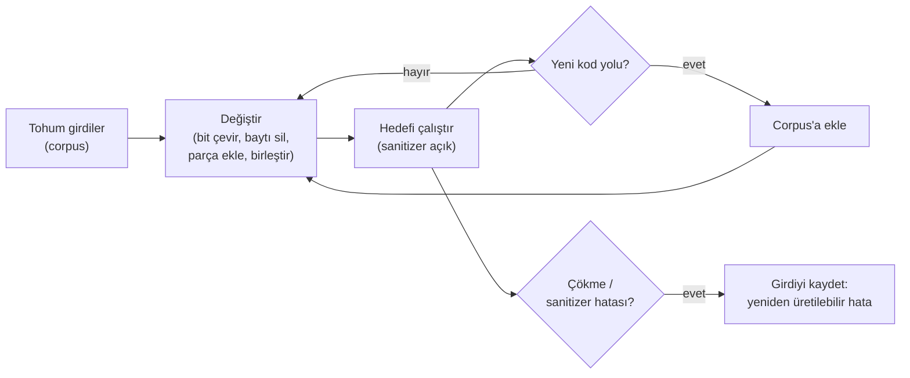
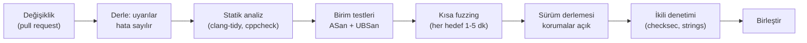

# Hafta 4 — Kod Sağlamlaştırma: C/C++

| | |
| --- | --- |
| **Tarih** | 09.10.2026 |
| **Öğrenme çıktıları** | ÖÇ.3 |
| **Süre** | 3 saat |

<!-- materyal:basla -->

<div class="materyal" markdown>

[:material-file-pdf-box: Ders notu (PDF)](cen429-week-4-ders-notu.pdf){ .md-button download="cen429-week-4-ders-notu.pdf" }
[:material-file-word-box: Ders notu (DOCX)](cen429-week-4-ders-notu.docx){ .md-button download="cen429-week-4-ders-notu.docx" }
[:material-presentation: Sunum (PDF)](cen429-week-4-sunum.pdf){ .md-button download="cen429-week-4-sunum.pdf" }
[:material-microsoft-powerpoint: Sunum (PPTX)](cen429-week-4-sunum.pptx){ .md-button download="cen429-week-4-sunum.pptx" }
[:material-language-html5: Sunum (HTML, çevrimdışı)](cen429-week-4-sunum.html){ .md-button download="cen429-week-4-sunum.html" }
[:material-folder-zip: Tümünü indir (ZIP)](cen429-week-4-materyal.zip){ .md-button download="cen429-week-4-materyal.zip" }
[:material-fullscreen: Sunumu tam ekran aç](cen429-week-4-sunum.html){ .md-button .md-button--primary target=_blank }

</div>

<div class="sunum-cercevesi">
<iframe src="../cen429-week-4-sunum.html" title="Hafta 4 — Kod Sağlamlaştırma: C/C++" loading="lazy" allowfullscreen></iframe>
</div>

<p class="sunum-ipucu">Sunumun içine tıklayıp ok tuşlarıyla ilerleyin; tam ekran için sunumun sağ altındaki düğmeyi ya da yukarıdaki "Sunumu tam ekran aç" bağlantısını kullanın.</p>

<!-- materyal:bitis -->

!!! abstract "Bu haftanın sonunda şunları yapabileceksiniz"
    1. **Kod sağlamlaştırmanın** üç katmanını (güvenli kodlama, derleyici/işletim sistemi korumaları, kod gizleme)
       ayırt etmek ve her birinin neyi durdurup neyi durdurmadığını söylemek.
    2. **SEI CERT C/C++** kurallarını okumak, öncelik düzeylerini yorumlamak ve kendi kodunuzda en sık ihlal edilen
       kuralları bulmak.
    3. **Biçim dizisi**, **serbest bırakılmış belleğin kullanımı**, **tamsayı taşması** ve **tanımsız davranış**
       hatalarını çalışan örneklerde göstermek ve düzeltmek.
    4. **AddressSanitizer**, **UndefinedBehaviorSanitizer** ve **fuzzing** ile hataları otomatik bulmak; bir fuzz
       hedefi (harness) yazmak.
    5. Yığın koruyucu, `_FORTIFY_SOURCE`, PIE/ASLR, DEP/NX, RELRO ve CFI/CFG korumalarını açıp kapatmak ve bir ikili
       dosyada hangilerinin açık olduğunu denetlemek.
    6. **Kod gizlemenin** amacını, maliyetini ve temel tekniklerini (sembol ve dize gizleme, sürümde günlüğün
       kaldırılması, sabit dönüşümleri, kontrol akışı düzleştirme, opak değerler) açıklamak.

??? info "Ders akışı (öğretim üyesi için zaman planı)"
    | Zaman | Bölüm | Ne yapılıyor |
    | --- | --- | --- |
    | 0:00–0:10 | 1 | Kod sağlamlaştırmanın katmanları; 1. haftadan köprü |
    | 0:10–0:30 | 2–4 | SEI CERT C/C++; girdi doğrulama ilkeleri; hatalı/uyumlu kod çiftleri |
    | 0:30–0:50 | 5 | Biçim dizisi açığı — **Demo 1** |
    | 0:50–1:00 | Ara | |
    | 1:00–1:25 | 6–8 | Serbest bırakılmış bellek **Demo 2**; tamsayılar ve UB **Demo 3**; hata işleme ve sinyaller |
    | 1:25–1:50 | 9–11 | Statik analiz; sanitizer'lar; fuzzing — **Demo 4** |
    | 1:50–2:00 | Ara | |
    | 2:00–2:25 | 12–13 | Derleyici ve OS korumaları **Demo 5**; güvenli derleme hattı (CI) |
    | 2:25–2:50 | 14–16 | Kod gizlemeye giriş; sembol, dize, günlük **Demo 6**; kontrol akışı düzleştirme **Demo 7** |
    | 2:50–3:00 | 17+ | Proje adımı, kendini sınama |

!!! tip "Laboratuvarı önceden hazırlayın"
    Demolar `code/week-04` klasöründedir; Windows'ta (Visual Studio 2022 Community), WSL'de ve Linux'ta çalışır.
    Fuzzing demosu Linux/WSL'de **clang** ister (`sudo apt install -y clang`); clang yoksa demo bunu söyler ve hatayı
    yine sanitizer ile gösterir. Windows'ta fuzzing için Visual Studio'nun "C++ AddressSanitizer" bileşeni gerekir.

    === "Windows"

        ```powershell
        cd cen429-secure-programming\code
        .\build.ps1
        cd week-04\01-format-string
        .\demo.ps1
        ```

    === "WSL / Linux"

        ```bash
        cd cen429-secure-programming/code
        ./build.sh
        cd week-04/01-format-string
        sh demo.sh
        ```

!!! warning "Etik kural — bu derste her hafta geçerli"
    Bu haftanın demoları bellek hatalarını ve korumaları **kendi küçük programlarımız** üzerinde gösterir. Hiçbiri
    başka bir programa ya da sisteme dokunmaz; çökebilecek adımlar sınırlandırılmıştır. Kod gizleme teknikleri
    burada **kendi yazılımınızı** tersine mühendisliğe karşı korumak için öğretilir. Başkasına ait yazılımı izinsiz
    çözümlemek ya da değiştirmek lisans sözleşmelerini ve yasaları ihlal edebilir.

---

## 1. Kod sağlamlaştırma nedir?

Birinci haftada uygulama korumasının yedi katmanını gördük. Bu hafta bunlardan üçünü, C ve C++ kodu özelinde açıyoruz:

| Katman | Soru | Bu haftaki araçlar |
| --- | --- | --- |
| **2 · Güvenli kodlama** | Kodumda hata var mı? | SEI CERT kuralları, sınır ve dönüş değeri denetimi, sanitizer'lar, fuzzing |
| **3 · Derleyici ve işletim sistemi korumaları** | Bir hata kaçarsa sömürülmesi zor mu? | Yığın koruyucu, `_FORTIFY_SOURCE`, PIE/ASLR, DEP/NX, RELRO, CFI |
| **4 · Kod gizleme** | Kodu inceleyen biri mantığı ve sırları anlayabiliyor mu? | Sembol ve dize gizleme, günlüğün kaldırılması, sabit dönüşümleri, kontrol akışı düzleştirme |

**Kod sağlamlaştırma** (code hardening), bu üç katmanın birlikte uygulanmasıdır. Sıralama önemlidir: önce hatasız
kod, sonra hata kaçarsa zararı sınırlayan korumalar, en son da kodu okumayı zorlaştıran gizleme. 1. haftadaki uyarıyı
tekrarlayalım: **gizleme, hatayı düzeltmez.** Gizlenmiş bir taşma hâlâ bir taşmadır.

!!! note "Sahada nasıl uygulanır?"
    Kart şemalarının mobil ödeme gereksinimleri bu katmanları açıkça ister: "yaygın programlama zafiyetleri (bellekteki
    hassas verinin yönetimi, enjeksiyon, arabellek taşması ve dile özgü zayıflıklar) ele alınmalı", "savunmacı
    programlama teknikleri kodun **tamamında tutarlı biçimde** uygulanmalı" ve uygulama "statik ve dinamik tersine
    mühendisliğe karşı korunmalı". Sertifikasyondan geçmiş bir kütüphanenin kılavuzunda yalnız native (C/C++) taraf
    için on sekiz ayrı sağlamlaştırma önlemi listelenir. Bu haftanın sonunda bu önlemlerin çoğunu tanıyor olacaksınız.

---

## 2. SEI CERT C/C++: güvenli kodlamanın kural kitabı

Carnegie Mellon Üniversitesi'ndeki Yazılım Mühendisliği Enstitüsü'nün (SEI) CERT birimi, C, C++ ve Java için
**güvenli kodlama standartları** yayımlar. Bu standartlar, gerçek zafiyetlerden çıkarılmış yüzlerce kuralı tek bir
biçimde toplar ve sertifikasyon laboratuvarlarının kaynak kod incelemesinde başvurduğu temel belgelerden biridir.

### Bir kuralın anatomisi

Her kural aynı yapıda yazılır:

| Bölüm | İçerik |
| --- | --- |
| **Kimlik** | Kategori kısaltması + numara + dil: `STR31-C`, `MEM50-CPP` |
| **Başlık** | Kuralın tek cümlelik özeti |
| **Hatalı örnek** (noncompliant) | Kuralı ihlal eden gerçekçi kod |
| **Uyumlu çözüm** (compliant) | Aynı işi doğru yapan kod |
| **Risk değerlendirmesi** | Önem × olasılık × düzeltme maliyeti → öncelik (L1, L2, L3) |
| **İlgili kurallar** | CWE ve diğer standartlarla eşleme |

**Kural** (rule) ile **öneri** (recommendation) ayrıdır: kurallar ihlal edildiğinde doğrudan zafiyete yol açabilir ve
otomatik araçlarla denetlenebilir; öneriler ise iyi uygulamadır. Öncelik düzeyi **L1** olan kurallar hem ciddi hem
yaygın hem de düzeltmesi ucuz olanlardır; bir kod incelemesine buradan başlanır.

### Kategoriler

| Kısaltma | Kategori | Örnek kural |
| --- | --- | --- |
| `PRE` | Önişlemci | PRE31-C: makro argümanlarında yan etkiden kaçın |
| `DCL` | Bildirimler | DCL30-C: nesneleri uygun ömürle bildir |
| `EXP` | İfadeler | EXP33-C: ilklendirilmemiş belleği okuma |
| `INT` | Tamsayılar | INT30-C: işaretsiz işlemlerin sarmadığından emin ol; INT32-C: işaretli taşmaya izin verme |
| `ARR` | Diziler | ARR30-C: sınırlar dışında işaretçi oluşturma ya da kullanma |
| `STR` | Dizgeler | STR31-C: dizge ve sonlandırıcı için yeterli yer ayır |
| `MEM` | Bellek yönetimi | MEM30-C: serbest bırakılmış belleğe erişme |
| `FIO` | Dosya G/Ç | FIO30-C: kullanıcı girdisini biçim dizgesinden dışla |
| `ENV` | Ortam | ENV33-C: `system()` çağırma |
| `SIG` | Sinyaller | SIG30-C: sinyal işleyicide yalnız eşzamansız güvenli fonksiyonlar çağır |
| `ERR` | Hata işleme | ERR33-C: standart kütüphane hatalarını algıla ve işle |
| `CON` | Eşzamanlılık | CON43-C: çok iş parçacıklı kodda veri yarışına izin verme |
| `MSC` | Çeşitli | MSC32-C: rastgele sayı üreteçlerini doğru tohumla |
| `POS` / `WIN` | POSIX / Windows | POS36-C: yetki bırakma sırası |

C++ standardı (`-CPP` sonekli) C kurallarının çoğunu devralır ve dile özgü kurallar ekler: `MEM50-CPP` (serbest
bırakılmış belleğe erişme), `CTR50-CPP` (kapsayıcı indekslerinin ve yineleyicilerin geçerli aralıkta olması),
`STR50-CPP` (dizge için yeterli yer), `EXP53-CPP` (ilklendirilmemiş belleği okuma), `ERR50-CPP` (programı ani
sonlandırma).

### İlk hafta ile bu haftayı birbirine bağlayan on kural

| Kural | Özet | Nerede gördük? |
| --- | --- | --- |
| STR31-C | Dizge için yeterli yer | 1. hafta Demo 3 |
| INT31-C | Tamsayı dönüşümleri veri kaybetmemeli | 1. hafta Demo 4 |
| MSC06-C | Derleyici iyileştirmesinin güvenlik kodunu silmesine dikkat | 1. hafta Demo 2 |
| ENV33-C | `system()` çağırma | 1. hafta Demo 1 |
| FIO30-C | Kullanıcı girdisini biçim dizgesinden dışla | Bu hafta Demo 1 |
| MEM30-C | Serbest bırakılmış belleğe erişme | Bu hafta Demo 2 |
| MEM31-C | Dinamik belleği işi bitince serbest bırak | Bu hafta Demo 2 |
| INT32-C | İşaretli tamsayı taşmasına izin verme | Bu hafta Demo 3 |
| ERR33-C | Kütüphane hatalarını algıla | Bu hafta 8. bölüm |
| SIG30-C | Sinyal işleyicide yalnız güvenli fonksiyonlar | Bu hafta 8. bölüm |

!!! tip "Kuralları otomatik denetlemek"
    CERT kurallarının bir kısmı derleyici uyarıları ve statik analiz araçlarıyla otomatik denetlenebilir: GCC/Clang
    `-Wall -Wextra -Wformat=2 -Wconversion`, `clang-tidy`'nin `cert-*` denetimleri, `cppcheck --addon=cert`,
    MSVC `/analyze` ve ticari araçlar. Otomatik denetim bir başlangıçtır; mantık hatalarını ve tasarım hatalarını
    yalnız insan incelemesi bulur.

!!! question "Değerlendirici nasıl test eder?"
    Kaynak kod incelemesinde önce bir statik analiz aracını CERT kural setiyle çalıştırır ve bulguları önceliğe göre
    sıralar. Sonra dışarıdan veri alan her fonksiyonu (ağ, dosya, IPC, JNI arayüzü) elle okur: uzunluk alanları
    doğrulanıyor mu, dönüş değerleri denetleniyor mu, bellek tek bir sahip tarafından mı yönetiliyor? Bulgular
    rapora kural kimliğiyle yazılır: "FIO30-C ihlali: `gunluk.c:42`".

---

## 3. Girdi doğrulama ilkeleri (Tarif 3.1)

Bu haftanın hatalarının neredeyse hepsi aynı kökten gelir: programa dışarıdan gelen bir değere **güvenilmesi**. Kitabın
3. bölümü, girdi doğrulamayı bütün diğer önlemlerin temeli olarak ele alır. Tarif 3.1'deki ilkeler bugün de
geçerlidir; bunları C/C++ programcısının günlük kontrol listesine çevirelim.

### Girdi nereden gelir?

"Kullanıcı girdisi" dendiğinde akla klavye gelir; oysa güven sınırını geçen **her şey** girdidir:

| Kaynak | Örnek | Sık unutulan nokta |
| --- | --- | --- |
| Komut satırı | `argv` | `argv[0]` bile saldırganın seçtiği bir değer olabilir |
| Ortam değişkenleri | `PATH`, `HOME`, `LANG` | 1. haftadaki güvenli başlatma |
| Dosyalar | Yapılandırma, belge, resim | Dosya biçimindeki uzunluk alanları |
| Ağ | Protokol iletisi, HTTP başlığı | İstemci "bu ileti 16 bayt" diyebilir, 1 bayt gönderebilir |
| Süreçler arası iletişim | Soket, adlandırılmış kanal, paylaşılan bellek | Aynı makinedeki başka bir süreç de güvenilmezdir |
| Veritabanı | Daha önce kaydedilmiş veri | "Kendi yazdığımız veri" sonradan değiştirilmiş olabilir |
| Kütüphane arayüzü | JNI, eklenti API'si | Çağıran uygulama da güvenilmez kabul edilir |

### Beş ilke

1. **Beyaz liste, kara liste değil.** İzin verilenleri tanımlayın ("yalnız rakam ve en fazla 6 hane"), yasakları
   saymaya çalışmayın. Kara liste her zaman bir şeyi unutur.
2. **Önce kanonikleştir, sonra doğrula.** Aynı değerin birden fazla yazılışı olabilir (`/tmp/../etc`, `%2e%2e/`,
   büyük/küçük harf, Unicode biçimleri). Doğrulama, değerin tek ve kesin biçimine yapılmalıdır (Tarif 3.7, 3.8, 3.12).
3. **Uzunluk, tür, aralık, biçim — bu sırayla.** Önce uzunluğu sınırla (tampon taşmasını önler), sonra türünü
   (sayı mı?), sonra aralığını (0–100 mü?), sonra biçimini (tarih mi?) denetle.
4. **Mümkün olan en erken noktada, güven sınırında doğrula.** Veri içeri girer girmez doğrulanır ve doğrulanmış halde
   dolaşır; her fonksiyon aynı denetimi tekrar yazmak zorunda kalmaz.
5. **Reddetmek, düzeltmekten güvenlidir.** Geçersiz girdiyi "temizleyip" kullanmak yerine reddedin. Temizleme kodu
   da hata yapar; üstelik temizlenmiş değer, kullanıcının kastettiğinden farklı bir anlam taşıyabilir.

### Sayıyı doğru okumak: `atoi` yerine `strtol`

Girdi doğrulamanın en küçük ama en sık yanlış yapılan örneği bir sayıyı okumaktır:

```c title="Hatalı: atoi hatayı bildiremez"
int adet = atoi(argv[1]);    /* "abc" → 0, "99999999999" → tanımsız, "12abc" → 12 */
```

```c title="Doğru: strtol + tam denetim"
#include <errno.h>
#include <limits.h>
#include <stdlib.h>

/* Başarıda 0; geçersiz ya da aralık dışıysa -1 */
int sayi_oku(const char *s, long en_az, long en_cok, long *sonuc)
{
    char *son;
    errno = 0;
    long v = strtol(s, &son, 10);
    if (son == s)            return -1;   /* hiç rakam yok */
    if (*son != '\0')        return -1;   /* sonda fazladan karakter: "12abc" */
    if (errno == ERANGE)     return -1;   /* long'a sığmadı */
    if (v < en_az || v > en_cok) return -1;  /* iş kuralı aralığı */
    *sonuc = v;
    return 0;
}
```

Dört denetim de gereklidir ve her biri gerçek bir hata sınıfını kapatır: boş girdi, çöp ekli girdi, taşma ve iş kuralı
ihlali. CERT bu kalıbı `ERR34-C` ("dizgeleri sayıya çevirirken hataları algıla") kuralıyla ister.

### İkili veri: uzunluk önekli kayıtlar

Ağ protokollerinde ve dosya biçimlerinde veri genellikle `[tür][uzunluk][veri]` biçimindedir. Heartbleed'den bu
haftanın fuzzing demosuna kadar birçok hatanın kaynağı, **uzunluk alanına** güvenilmesidir:

```c title="Uzunluk önekli kaydı güvenle okumak"
/* tampon: gelen veri, kalan: tamponda kalan bayt sayısı */
int kayit_oku(const uint8_t *tampon, size_t kalan, Kayit *k)
{
    if (kalan < 3) return -1;                         /* başlık bile yok */
    k->tur = tampon[0];
    uint16_t uzunluk = (uint16_t)(tampon[1] << 8 | tampon[2]);
    if (uzunluk > kalan - 3) return -1;               /* bildirilen > gelen: REDDET */
    if (uzunluk > sizeof k->veri) return -1;          /* hedefe sığmıyor: REDDET */
    memcpy(k->veri, tampon + 3, uzunluk);
    k->uzunluk = uzunluk;
    return 3 + uzunluk;                               /* tüketilen bayt */
}
```

İki denetim birbirinden farklıdır ve ikisi de gereklidir: biri **kaynağı** (gelen veride gerçekten bu kadar bayt var
mı?), diğeri **hedefi** (bu kadar bayt tampona sığar mı?) korur. `kalan - 3` ifadesi, önceki `kalan < 3` denetimi
sayesinde sarmaz; denetimlerin **sırası** da önemlidir.

!!! note "Sahada nasıl uygulanır?"
    Ödeme kütüphanelerinin savunmacı programlama gereksinimlerinin ilk maddesi "uygulamanın her girdisi ve çıktısı
    denetlenmelidir"dir. Bir kütüphane kendisini çağıran uygulamaya da güvenmez: JNI arayüzünden gelen her dizge ve
    dizi, native tarafta uzunluk ve biçim açısından yeniden doğrulanır. Doğrulama başarısız olursa fonksiyon ayrıntı
    vermeden "başarısız" döner.

---

## 4. CERT kurallarından örnek çiftler

CERT standardının en öğretici yanı, her kural için verdiği **hatalı / uyumlu** kod çiftleridir. Aşağıda bu haftanın
konularına dokunan beş kuralı kendi örneklerimizle işliyoruz. Her çiftte önce hatayı bulmaya çalışın, sonra
açıklamayı okuyun.

### STR31-C: dizge ve sonlandırıcı için yeterli yer

```c title="Hatalı"
char kopya[16];
strcpy(kopya, ad);                       /* ad 15 karakterden uzunsa taşar */
```

```c title="Uyumlu"
char kopya[16];
int n = snprintf(kopya, sizeof kopya, "%s", ad);
if (n < 0 || (size_t)n >= sizeof kopya) {
    /* kesildi: kullanma ya da hata dön */
}
```

`snprintf`'in dönüş değeri, yer olsaydı yazılacak karakter sayısıdır; tampon boyutuna eşit ya da büyükse çıktı
**kesilmiştir**. Kesilmiş bir dosya yolu ya da komut, farklı bir anlama gelebilir.

### INT30-C: işaretsiz işlemler sarmamalı

```c title="Hatalı"
size_t kalan = toplam - okunan;          /* okunan > toplam ise dev bir sayı */
memcpy(hedef, kaynak + okunan, kalan);
```

```c title="Uyumlu"
if (okunan > toplam) return HATA;
size_t kalan = toplam - okunan;
```

İşaretsiz çıkarma sıfırın altına inemez, **sarar**: `3 - 5` sonucu `SIZE_MAX - 1`'dir. Çıkarmadan önce sıralama
denetlenir.

### MEM30-C: serbest bırakılmış belleğe erişme

```c title="Hatalı: döngüde serbest bırakırken sonraki düğüme erişim"
for (Dugum *d = bas; d != NULL; d = d->sonraki)
    free(d);                              /* d->sonraki, free'den SONRA okunuyor */
```

```c title="Uyumlu"
Dugum *d = bas;
while (d != NULL) {
    Dugum *sonraki = d->sonraki;          /* önce oku */
    free(d);
    d = sonraki;
}
```

Bağlı liste silmek, UAF'in en sık görüldüğü masum yerlerden biridir: `for` döngüsünün artırma ifadesi, gövdede serbest
bırakılmış düğümün alanını okur.

### EXP33-C: ilklendirilmemiş belleği okuma

```c title="Hatalı"
int sonuc;
if (kosul) sonuc = hesapla();
return sonuc;                             /* kosul yanlışsa rastgele değer */
```

```c title="Uyumlu"
int sonuc = HATA_KODU;                    /* güvenli varsayılan */
if (kosul) sonuc = hesapla();
return sonuc;
```

İlklendirilmemiş bir yerel değişken, yığında daha önce duran değeri taşır; bu bir önceki fonksiyonun **sırrı** bile
olabilir. Güvenlik açısından varsayılan değer, "izin yok" ya da "hata" anlamına gelmelidir (1. haftadaki güvenli
varsayılan ilkesi).

### ERR33-C: kütüphane hatalarını algıla

```c title="Hatalı"
FILE *f = fopen(yol, "rb");
fread(tampon, 1, sizeof tampon, f);       /* fopen başarısızsa f == NULL */
```

```c title="Uyumlu"
FILE *f = fopen(yol, "rb");
if (f == NULL) return HATA;
size_t n = fread(tampon, 1, sizeof tampon, f);
if (n < sizeof tampon && ferror(f)) { fclose(f); return HATA; }
fclose(f);
```

`fread` kısa okuma yaptığında bunun dosya sonu mu yoksa hata mı olduğunu `feof`/`ferror` ile ayırmak gerekir.
Kısmen okunmuş bir yapıyı tam okunmuş sanmak, ilklendirilmemiş bellek okumanın başka bir biçimidir.

!!! tip "Kural kimliğiyle düşünmek"
    Kod incelemesinde bulduğunuz her hatayı bir CERT kuralıyla eşleştirmeye çalışın. Bu, hem bulguyu nesnel kılar
    ("bence böyle daha iyi" değil, "STR31-C ihlali") hem de aynı kuralın kodun başka yerlerinde de ihlal edilip
    edilmediğini aramanızı kolaylaştırır.

---

## 5. Biçim dizisi açığı (Tarif 3.2)

`printf` ailesinin ilk argümanı bir **biçim dizgesidir**: içindeki `%d`, `%s`, `%x` gibi belirteçler, fonksiyona
"yığından şu türde bir argüman al ve şu biçimde yaz" komutunu verir. Fonksiyon, gerçekten kaç argüman verildiğini
**bilmez**; biçim dizgesinde ne yazıyorsa onu yapar. Biçim dizgesi kullanıcıdan geliyorsa, kullanıcı fonksiyona komut
vermiş olur.

```c title="Hatalı ve doğru"
printf(kullanici_girdisi);           /* HATALI: girdi biçim dizgesi olarak yorumlanır */
printf("%s", kullanici_girdisi);     /* DOĞRU: girdi yalnız veri */
```

### Neden tehlikeli?

| Belirteç | Normalde | Saldırgan verirse |
| --- | --- | --- |
| `%x`, `%p` | Bir argümanı onaltılık yazar | Olmayan argümanlar yerine **yığındaki değerler** okunur: bilgi sızıntısı |
| `%s` | Bir işaretçinin gösterdiği dizgeyi yazar | Yığındaki rastgele bir değer işaretçi sanılır: çökme ya da bellek okuma |
| `%n` | Şimdiye kadar yazılan karakter sayısını bir işaretçiye **yazar** | Yığındaki bir değerin gösterdiği adrese **yazma**: bellek bozulması |

Ne kadar zararlı olduğu platforma ve korumalara göre değişir; ama en hafif sonucu bile bir **bilgi sızıntısıdır**:
yığında duran bir anahtar, bir adres (ASLR'yi zayıflatır) ya da bir kanarya değeri okunabilir. Aynı hata `syslog`,
`fprintf`, `snprintf`, `err`/`warn` ve bir biçim dizgesi alan her fonksiyonda ortaya çıkar; 2. haftada denetim
kaydının `syslog(LOG_INFO, kullanici_girdisi)` hatasını görmüştük.

### Demo 1 — Biçim dizisi açığı

!!! info "Demo 1 · `code/week-04/01-format-string` · CWE-134 · Tarif 3.2"
    `sizinti` programı kendisine verilen metni `printf(metin)` ile yazar; programın belleğinde sentetik bir "gizli
    değer" durur. Önce derleyicinin bu satır için uyarı verip vermediğine bakılır, sonra `%x` belirteçleriyle gizli
    değerin sızdığı ve `%n`'in platformlara göre nasıl durdurulduğu gösterilir. Son adımda düzeltilmiş sürüm aynı
    girdiyi yalnız metin olarak yazar.

=== "Windows (PowerShell)"

    ```powershell
    cd code\week-04\01-format-string
    .\demo.ps1
    ```

=== "WSL / Linux"

    ```bash
    cd code/week-04/01-format-string
    sh demo.sh
    ```

| Adım | Ne yapılır? | Ne görülür? | Ders |
| --- | --- | --- | --- |
| 0 | Derleme | GCC/Clang `-Wformat-security` uyarır; MSVC'nin C derleyicisi susar, `/analyze` yakalar | Uyarıları açın ve **hata** sayın |
| 1 | `sizinti Merhaba` | Normal çıktı | — |
| 2 | `sizinti '%x.%x.%x…'` | Yığın onaltılık dökülür; gizli değer çıktıda görünür | Bilgi sızıntısı |
| 3 | `sizinti 'AAAA%n'` | Linux'ta korumasız sürüm çöker; Windows'ta C çalışma kitaplığı `%n`'i reddeder | Platform farkı |
| 4 | `sizinti_denetimli 'AAAA%n'` | `_FORTIFY_SOURCE` yazılabilir bellekteki `%n`'i yakalar ve programı durdurur | Koruma katmanı |
| 5 | `sizinti_guvenli '…%n…'` | Belirteçler yalnız metin olarak yazılır | **Asıl düzeltme** |

### Düzeltme ve savunma katmanları

1. **Biçim dizgesi her zaman sabit olmalı** (FIO30-C). Kullanıcı verisi yalnız argümandır: `printf("%s", s)`.
2. **Derleyici uyarıları:** GCC/Clang'de `-Wformat -Wformat-security` (hatta `-Werror=format-security`); MSVC'de
   `/analyze`. Kendi yazdığınız `printf` benzeri fonksiyonlara `__attribute__((format(printf, 1, 2)))` ekleyin ki
   derleyici onları da denetlesin.
3. **Çalışma zamanı koruması:** glibc'de `_FORTIFY_SOURCE=2`, yazılabilir bellekteki biçim dizgelerinde `%n`'i
   reddeder; Microsoft'un C çalışma kitaplığı `%n`'i varsayılan olarak kapatır.
4. **Değişken argüman sayısını doğrulayın** (Tarif 13.4): kendi değişken argümanlı fonksiyonunuzu yazıyorsanız,
   argüman sayısını ya da türünü biçim dizgesinden değil, açık bir parametreden alın.

```c title="Kendi günlük fonksiyonunuzu derleyiciye denetletin"
#if defined(__GNUC__)
#  define BICIM_DENETLE(a, b) __attribute__((format(printf, a, b)))
#else
#  define BICIM_DENETLE(a, b)
#endif

void gunluk_yaz(int duzey, const char *bicim, ...) BICIM_DENETLE(2, 3);

gunluk_yaz(1, kullanici);          /* derleyici artık burada uyarır */
gunluk_yaz(1, "%s", kullanici);    /* doğru */
```

!!! question "Değerlendirici nasıl test eder?"
    Kaynak kodda biçim dizgesi olarak bir değişken alan her çağrıyı arar (`printf(`, `syslog(`, `snprintf(buf, n,`
    ardından sabit olmayan bir argüman). Dinamik testte her metin alanına `%x%x%x%n` gibi girdiler verir ve
    çıktıda onaltılık değerler, çökme ya da günlükte bozulma arar.

---

## 6. Serbest bırakılmış belleğin kullanımı ve çift serbest bırakma

Birinci haftada bellek yönetimi hatalarının kuramını ve sahiplik kuralını gördük. Bu bölümde aynı hatayı çalışan bir
programda izliyoruz ve C++'ın bu hataların çoğunu nasıl **tasarımla** ortadan kaldırdığını görüyoruz.

### Hatanın üç adımı

1. Bir nesne öbekte ayrılır ve birden fazla işaretçi onu gösterir.
2. Nesne bir yerde `free` edilir, ama işaretçilerden en az biri hâlâ eski adresi tutar (**askıdaki işaretçi**).
3. Bellek yöneticisi aynı bloğu **başka bir nesneye** verir; askıdaki işaretçi artık o nesnenin verisini okur ya da
   değiştirir.

Nesnenin içinde bir **fonksiyon işaretçisi** varsa (C'de "sanal fonksiyon" benzetimi, C++'ta sanal tablo işaretçisi),
tehlike büyür: program, başka amaçla yazılmış baytları "çağrılacak fonksiyonun adresi" diye yorumlayabilir. Tarayıcı ve
işletim sistemi güncellemelerinde "bellek bozulması düzeltildi" notlarının önemli bir kısmı bu sınıftandır.

### Demo 2 — Serbest bırakılmış bellek ve çift serbest bırakma

!!! info "Demo 2 · `code/week-04/02-kullanim-sonrasi` · CWE-416, CWE-415 · CERT MEM30-C, MEM31-C"
    Programda öbekte tutulan bir "oturum" nesnesi (kullanıcı rolü ve bir fonksiyon işaretçisi) serbest bırakılır ama
    işaretçi sıfırlanmaz. Ardından aynı boyutta ayrılan yeni bir blok, eski oturumun yerini doldurur ve askıdaki
    işaretçi bu yeni veriyi okur: rol değişir, fonksiyon işaretçisi programın **kendi** yönetici panelini çağırır.
    Dışarıdan kod enjekte edilmez; bütün işlem programın kendi belleğinde kalır.

=== "Windows (PowerShell)"

    ```powershell
    cd code\week-04\02-kullanim-sonrasi
    .\demo.ps1
    ```

=== "WSL / Linux"

    ```bash
    cd code/week-04/02-kullanim-sonrasi
    sh demo.sh
    ```

| Adım | Hedef | Ne görülür? | Ders |
| --- | --- | --- | --- |
| 1 | `uaf uaf` (korumasız) | Serbest blok yeni bir nesneyle dolar; rol `user`'dan `admin`'e döner | UAF = yetki yükseltme |
| 2 | `uaf_asan uaf` | ASan `heap-use-after-free` der; bloğun **nerede ayrıldığını, nerede bırakıldığını, nerede kullanıldığını** gösterir | Sanitizer hatanın kaynağını verir |
| 3 | `uaf cift` (korumasız) | Çift serbest bırakma; bellek yöneticisi bozulmayı fark edip durur ya da tanımsız davranış | Ayırıcının iç yapısı bozulur |
| 4 | `uaf_asan cift` | ASan `attempting double-free` der | — |
| 5 | `uaf_guvenli` | `free` + `NULL`, tek sahip, tek serbest bırakma noktası | İki hata da biter |

### ASan raporunu okumak: üç yığın izi

Bir UAF raporunda ASan **üç** konum verir; hatayı düzeltmek için üçü de gereklidir:

```text
ERROR: AddressSanitizer: heap-use-after-free on address 0x6020000000f0
READ of size 8 ...
    #0 in oturum_kullan  uaf.c:48        <- 1. KULLANIM: hatanın görüldüğü yer
freed by thread T0 here:
    #0 in free
    #1 in oturum_kapat   uaf.c:31        <- 2. SERBEST BIRAKMA: sahiplik burada bitti
previously allocated by thread T0 here:
    #0 in malloc
    #1 in oturum_ac      uaf.c:22        <- 3. AYIRMA: nesnenin doğduğu yer
```

Çözüm çoğu zaman **2. konumdadır**: nesneyi serbest bırakan kod, diğer işaretçilerin haberdar olmadığı bir sahiplik
kararı vermiştir. (Fonksiyon adları ve satır numaraları örnek içindir; demodaki gerçek rapor aynı yapıdadır.)

### C++: sahipliği türe yazmak

C'de sahiplik bir **sözleşmedir**; C++'ta ise **türün bir parçası** yapılabilir:

| İhtiyaç | C | C++ |
| --- | --- | --- |
| Tek sahip | Belgeleme + disiplin | `std::unique_ptr<T>`: kopyalanamaz, yalnız taşınır; yıkıcıda serbest bırakır |
| Paylaşılan sahiplik | Başvuru sayacı (elle) | `std::shared_ptr<T>`: son sahip gidince serbest bırakır |
| Sahip olmadan gözlem | Ham işaretçi | `std::weak_ptr<T>`: nesne yok olduysa `lock()` boş döner, askıda kalmaz |
| Dizi | `malloc` + boyut | `std::vector<T>`, `std::array<T,N>` |

```cpp title="Askıda kalan işaretçi yerine weak_ptr"
#include <memory>

struct Oturum { std::string rol; };

std::shared_ptr<Oturum> aktif = std::make_shared<Oturum>(Oturum{"user"});
std::weak_ptr<Oturum>   onbellek = aktif;      // sahip DEĞİL, yalnız gözlemci

aktif.reset();                                 // oturum kapandı, nesne yok edildi

if (auto o = onbellek.lock()) {                // nesne hâlâ yaşıyor mu?
    kullan(*o);
} else {
    /* nesne yok: askıdaki işaretçiyle ESKİ belleğe erişilmez */
}
```

!!! warning "Akıllı işaretçiler her şeyi çözmez"
    `unique_ptr::get()` ile alınan ham işaretçi, sahip yok olduktan sonra yine askıda kalır. `std::vector`'a eleman
    eklendiğinde kapasite büyürse, öğelere alınmış bütün işaretçiler ve yineleyiciler geçersizleşir (CERT
    `CTR51-CPP`). Kural aynıdır: **ödünç alınan bir işaretçi, sahibinden uzun yaşayamaz.**

---

## 7. Tamsayılar ve tanımsız davranış (Tarif 3.5)

Birinci haftada işaretli bir uzunluğun `size_t`'ye dönüşünce dev bir sayıya dönüştüğünü gördük. Bu bölümde tamsayı
hatalarının bütün ailesini ve C'nin en şaşırtıcı kavramlarından birini, **tanımsız davranışı** işliyoruz.

### Dört tamsayı hatası

| Hata | Örnek | Sonuç | CERT |
| --- | --- | --- | --- |
| **İşaretsiz sarma** | `unsigned n = 0; n - 1` → 4.294.967.295 | Tanımlıdır (modüler aritmetik) ama genellikle mantık hatasıdır | INT30-C |
| **İşaretli taşma** | `INT_MAX + 1` | **Tanımsız davranış** | INT32-C |
| **Dönüşüm kaybı** | `int` → `short`, `long long` → `int`, işaretli ↔ işaretsiz | Değer kesilir ya da işareti değişir | INT31-C |
| **Kaydırma hatası** | `1 << 31` (int), `x << 32` | Tanımsız davranış | INT34-C |

Tamsayı hataları çoğu zaman tek başına zararsız görünür; tehlikeleri, bir **boyut hesabına** karıştıklarında ortaya
çıkar:

```c title="Hatalı: çarpım taşar, küçük blok ayrılır"
uint32_t adet = girdi_oku();                 /* saldırgan: 0x40000001 */
uint32_t boyut = adet * sizeof(uint32_t);    /* 0x40000001 * 4 = 4 (sardı!) */
uint32_t *dizi = malloc(boyut);              /* 4 baytlık blok */
for (uint32_t i = 0; i < adet; i++)
    dizi[i] = oku();                          /* öbek taşması */
```

### Tanımsız davranış nedir?

C standardı bazı işlemler için "bu durumda ne olacağını tanımlamıyorum" der: işaretli tamsayı taşması, sınır dışı
dizi erişimi, NULL işaretçiye erişim, ilklendirilmemiş değişkenin okunması, hizasız erişim ve benzerleri. Bunun
anlamı "program çöker" değildir; **derleyici bu durumun hiç olmayacağını varsayabilir** ve kodu buna göre iyileştirir.

```c title="Derleyici denetimi silebilir"
int ekle_ve_denetle(int x)
{
    if (x + 100 < x)          /* "taşma olursa sonuç küçülür" diye düşünülmüş */
        return -1;            /* ama işaretli taşma UB: derleyici bu dalı SİLEBİLİR */
    return x + 100;
}
```

Programcı taşmayı yakalamak istemiştir; ama işaretli taşma tanımsız olduğu için derleyici "`x + 100 < x` hiçbir zaman
doğru olamaz" diye akıl yürütüp denetimi tamamen kaldırabilir. Aynı kod `-O0`'da "çalışır", `-O2`'de denetim
kaybolur. 1. haftadaki Demo 2'de gördüğümüz "derleyici güvenlik kodunu sildi" durumunun başka bir biçimidir.

### Doğru denetim: işlemden **önce** ya da taşma bildiren yerleşiklerle

```c title="Taşmayı güvenle denetlemek"
#include <limits.h>
#include <stdbool.h>

/* 1) İşlemden önce sınırla karşılaştır (taşınabilir) */
bool guvenli_topla(int a, int b, int *sonuc)
{
    if ((b > 0 && a > INT_MAX - b) || (b < 0 && a < INT_MIN - b))
        return false;
    *sonuc = a + b;
    return true;
}

/* 2) GCC/Clang yerleşikleri: taşma olursa true döner */
bool guvenli_carp(size_t a, size_t b, size_t *sonuc)
{
    return !__builtin_mul_overflow(a, b, sonuc);
}
```

C23 standardı aynı işi `ckd_add`, `ckd_sub`, `ckd_mul` (`<stdckdint.h>`) ile taşınabilir hale getirdi. MSVC'de
`<intsafe.h>` içindeki `SizeTMult`, `ULongAdd` gibi fonksiyonlar kullanılabilir. Bellek ayırırken `calloc(adet,
boyut)` ya da `reallocarray` çarpım taşmasını sizin yerinize denetler (1. hafta).

### Demo 3 — Tanımsız davranış ve UBSan

!!! info "Demo 3 · `code/week-04/03-tanimsiz-davranis` · CWE-190, CWE-758 · CERT INT32-C, INT34-C"
    Program üç tanımsız davranışı sırayla dener: işaretli taşma (`INT_MAX + 1`), geçersiz bit kaydırma ve hizasız
    bellek erişimi. x86 işlemcide bunların çoğu sessizce "çalışır" ve yanlış sonuç üretir. **UndefinedBehaviorSanitizer**
    (UBSan, `-fsanitize=undefined`) ile derlenen sürüm, her birini çalışma anında satır numarasıyla bildirir.
    UBSan yalnız GCC ve Clang'de vardır; Windows'ta demo, MSVC'nin `/RTC` ve `/analyze` seçeneklerini ve CERT
    kurallarını anlatır.

=== "Windows (PowerShell)"

    ```powershell
    cd code\week-04\03-tanimsiz-davranis
    .\demo.ps1
    ```

=== "WSL / Linux"

    ```bash
    cd code/week-04/03-tanimsiz-davranis
    sh demo.sh
    ```

UBSan raporu şu biçimdedir: `ub.c:27:15: runtime error: signed integer overflow: 2147483647 + 1 cannot be
represented in type 'int'`. Hatanın **türü**, **yeri** ve **değerleri** tek satırda verilir. UBSan'ın maliyeti
ASan'dan düşüktür; birçok proje test derlemelerinde ikisini birlikte açar.

!!! tip "Tamsayı hataları için derleyici seçenekleri"
    - `-Wconversion -Wsign-conversion` (GCC/Clang), `/W4` ve `/w44365` (MSVC, C++ kipinde): gizli dönüşümleri gösterir.
    - `-ftrapv`: işaretli taşmada programı durdurur (sürümde performans maliyeti vardır).
    - `-fwrapv`: işaretli taşmayı modüler aritmetik olarak **tanımlar**; UB kaynaklı iyileştirmeleri kapatır ama
      mantık hatasını gizler.
    - `-fsanitize=undefined,integer` (Clang): test derlemelerinde tamsayı hatalarının çoğunu yakalar.

---

## 8. Hata işleme, değişken argümanlar ve sinyaller (Tarif 13.1, 13.4, 13.5)

Bellek hataları kadar sık ama daha az konuşulan üç konu, gerçek zafiyetlerin önemli bir kısmının kaynağıdır.

### Hata işleme: dönüş değerini denetlemek ve kapalı kalarak başarısız olmak

C'de hatalar genellikle **dönüş değeriyle** bildirilir ve denetlemek programcıya kalmıştır. Denetlenmeyen bir hata,
programın **yanlış bir varsayımla** devam etmesi demektir:

| Çağrı | Başarısız olursa | Denetlenmezse |
| --- | --- | --- |
| `malloc` | `NULL` | NULL işaretçiye yazma, çökme |
| `setuid` / `setresuid` | `-1` | Program yetkili kalır ama bıraktığını sanır (1. hafta) |
| `fopen` | `NULL` | Sonraki `fread` çöker ya da boş veriyle işlem yapılır |
| `RAND_bytes` / `getrandom` | `!= 1` / `-1` | "Rastgele" anahtar sıfırlardan oluşur (3. hafta) |
| `EVP_DecryptFinal_ex` | `!= 1` | Kurcalanmış veri doğrulanmış sanılır (3. hafta) |
| `snprintf` | Dönüş ≥ boyut | Çıktı kesilmiştir; yol ya da komut anlamını değiştirebilir |

Kitabın Tarif 13.1'deki öneriler bugün de geçerlidir ve 3. haftadaki "fail-closed" ilkesiyle birleşir:

1. **Her dönüş değerini denetle** (ERR33-C). Denetlemeyeceğiniz bir sonucu `(void)` ile açıkça yok sayın ki
   inceleyen kişi bunun bilinçli olduğunu görsün. GCC/Clang'de fonksiyonlarınıza `__attribute__((warn_unused_result))`,
   C23'te `[[nodiscard]]` ekleyin.
2. **Hata durumunda güvenli duruma dön:** yarım kalan işlemi geri al, sırları sil, kaynakları serbest bırak. C'de tek
   çıkış noktası (`goto temizle`) kalıbı bunu okunaklı yapar.
3. **Hata iletisi saldırgana ipucu vermesin:** kullanıcıya genel bir ileti ("işlem başarısız"), ayrıntıyı güvenli bir
   günlüğe. "Kullanıcı bulunamadı" ile "parola yanlış" ayrı iletiler, kullanıcı adlarının tahmin edilmesine yol açar.

!!! note "Sahada nasıl uygulanır?"
    Hassas bir native kütüphanede fonksiyonlar ayrıntılı hata kodu döndürmez; yalnız "başarılı" ya da "başarısız"
    bilgisini, üstelik **opak** biçimde (düz bir `0`/`1` değil, kolayca tanınıp değiştirilemeyen bir yapı olarak)
    döndürür. Ayrıntılı hata kodu, saldırgana hangi denetimde takıldığını söyleyen bir yol haritası olurdu. Bu
    seçim, 1. haftadaki ödünleşim kaydının bir satırıdır: destek ekibi için tanı ayrı ve güvenli bir kanaldan yapılır.

### Değişken argümanlı fonksiyonlar (Tarif 13.4)

`printf` gibi değişken argüman alan fonksiyonlar, argümanların **sayısını ve türünü bilmez**; bunu çağıranın
sözüne (biçim dizgesine) güvenerek öğrenir. Biçim dizgesi ile gerçek argümanlar uyuşmazsa sonuç tanımsızdır:

```c
long long buyuk = 5000000000LL;
printf("%d\n", buyuk);          /* tür uyuşmazlığı: %lld olmalı */
printf("%s\n");                 /* argüman yok: yığından rastgele değer okunur */
```

Kendi değişken argümanlı fonksiyonunuzu yazmanız gerekiyorsa: argüman sayısını açık bir parametreyle alın ya da
listeyi bir bitiş işaretiyle (`NULL`) kapatın; `va_start`/`va_end` çiftini her yolda eşleştirin; biçim dizgesi
kullanıyorsanız 5. bölümdeki `format` özniteliğini ekleyin. C++'ta değişken argüman yerine tür güvenli şablonlar
(`std::format`, değişken şablon parametreleri) tercih edilir.

### Sinyal işleyiciler (Tarif 13.5)

Bir sinyal (ör. `SIGINT`, `SIGTERM`, `SIGALRM`) programın **herhangi bir anında**, hatta bir `malloc` çağrısının
ortasında gelebilir. İşleyici o sırada çalışan kodu keser. İşleyicinin içinde `malloc`, `printf`, `free` gibi
fonksiyonlar çağrılırsa ve kesilen kod da aynı fonksiyonun içindeyse, iç veri yapıları bozulur. Bu, gerçek bir SSH
sunucusu zafiyetinin (2024, "regreSSHion", CVE-2024-6387) de kökenidir: bir zaman aşımı sinyalinin işleyicisi, eşzamansız
güvenli olmayan bir günlük fonksiyonu çağırıyordu.

```c title="Doğru kalıp: işleyici yalnız bayrak kurar"
#include <signal.h>

static volatile sig_atomic_t durdur = 0;

static void isleyici(int sig)
{
    (void)sig;
    durdur = 1;                 /* yalnız bu: eşzamansız güvenli */
}

int main(void)
{
    struct sigaction sa = {0};
    sa.sa_handler = isleyici;
    sigemptyset(&sa.sa_mask);
    sigaction(SIGTERM, &sa, NULL);

    while (!durdur) {
        /* asıl iş; temizlik ve günlük yazımı döngü dışında, normal akışta */
    }
    temizle_ve_cik();
}
```

Kurallar (SIG30-C, SIG31-C): işleyicide yalnız **eşzamansız sinyal güvenli** fonksiyonlar (POSIX listesinde; ör.
`write`, `_exit`) çağrılır; paylaşılan değişkenler `volatile sig_atomic_t` olur; iş, işleyicide değil ana döngüde
yapılır. `signal()` yerine `sigaction()` kullanılır, çünkü `signal()`'in davranışı sistemden sisteme değişir.

!!! question "Değerlendirici nasıl test eder?"
    Statik analizde dönüş değeri kullanılmayan çağrıları listeler; özellikle bellek ayırma, yetki değiştirme, kripto
    ve G/Ç çağrılarına bakar. Hata iletilerini karşılaştırarak hangi denetimde takıldığının dışarıdan anlaşılıp
    anlaşılmadığını sınar. Sinyal işleyicilerin içeriğini okur ve eşzamansız güvenli olmayan çağrı arar.

---

## 9. Statik analiz: kodu çalıştırmadan hata aramak

Sanitizer'lar ve fuzzing hatayı programı **çalıştırarak** bulur; statik analiz ise kaynak kodu **okuyarak**. İkisi
birbirini tamamlar: statik analiz hiç çalıştırılmayan yolları da görür ama yanlış alarm verebilir; dinamik analiz
yalnız çalışan yolları görür ama bulduğu hata kesindir.

### Katman katman araçlar

| Düzey | Araç | Ne bulur? | Maliyet |
| --- | --- | --- | --- |
| Derleyici uyarıları | `-Wall -Wextra -Wformat=2 -Wconversion -Wshadow` · MSVC `/W4` | Şüpheli dönüşüm, biçim dizgesi, kullanılmayan değer | Sıfır: her derlemede |
| Derleyici analizcisi | `gcc -fanalyzer` · `clang --analyze` · MSVC `/analyze` | Yol duyarlı: NULL erişimi, sızıntı, çift serbest bırakma | Düşük |
| Kural denetleyici | `clang-tidy` (`cert-*`, `bugprone-*`), `cppcheck` (`--addon=cert`) | CERT ihlalleri, tehlikeli API'ler | Düşük |
| Anlamsal sorgu | CodeQL, Semgrep | Kaynaktan hedefe veri akışı: "argv'den gelen değer denetimsiz memcpy'ye gidiyor mu?" | Orta |
| Ticari | Coverity, Klocwork, Polyspace | Büyük kod tabanlarında derin analiz, raporlama | Yüksek |

```bash title="Bir C dosyasını birkaç araçla taramak"
gcc -fanalyzer -Wall -Wextra -c ayristir.c
clang-tidy ayristir.c -checks='-*,cert-*,bugprone-*,clang-analyzer-security*' -- -I.
cppcheck --enable=warning,portability --addon=cert ayristir.c
```

### Veri akışı analizi: kaynak → hedef

En değerli statik analiz türü, **kirli veri** (taint) izlemesidir: güvenilmeyen bir **kaynaktan** (argv, dosya, ağ)
gelen bir değerin, doğrulanmadan tehlikeli bir **hedefe** (memcpy uzunluğu, biçim dizgesi, `system`, dizi indeksi)
ulaşıp ulaşmadığı sorulur. CodeQL ve Semgrep bu soruyu kod tabanının tamamında sorabilir:

```text
kaynak: recv(sock, buf, ...)           ─┐
        len = buf[1] << 8 | buf[2]      │   doğrulama yok
hedef:  memcpy(out, buf + 3, len)      ◀┘   → BULGU: CWE-787
```

### Yanlış alarmlarla yaşamak

Statik analiz yanlış alarm verir; bunları yönetmek de sürecin bir parçasıdır:

1. **Önce yüksek güvenilirlikli kurallar:** biçim dizgesi, tehlikeli fonksiyonlar, NULL erişimi.
2. **Her bastırma gerekçeli olsun:** `// NOLINT(cert-err33-c): dönüş değeri kasıtlı olarak yok sayılıyor, çünkü ...`
   Gerekçesiz bastırma, gelecekteki gerçek hatayı gizler.
3. **Yeni kodda sıfır uyarı:** eski kodun bütün uyarılarını bir günde temizlemek gerçekçi değildir; ama yeni eklenen
   koda uyarı sokulmamasını sürekli entegrasyonda zorlamak mümkündür.

!!! question "Değerlendirici nasıl test eder?"
    Sertifikasyonda kaynak kod incelemesi genellikle bir statik analiz taramasıyla başlar; değerlendirici geliştiricinin
    kendi tarama raporunu da ister. "Aracı çalıştırdık, şu kadar bulgu çıktı, şunları düzelttik, şunlar şu gerekçeyle
    yanlış alarm" diyebilen bir ekip, olgun bir süreç gösterir. Değerlendirici ardından aracın göremediği yerlere —
    özellikle kripto kullanımına ve güvenlik denetimlerinin mantığına — elle bakar.

---

## 10. Sanitizer'lar: hataları çalışma anında yakalamak

**Sanitizer**, derleyicinin programa eklediği bir denetim katmanıdır: her bellek erişiminin, her tamsayı işleminin ya
da her iş parçacığı erişiminin geçerli olup olmadığını çalışma anında denetler ve ilk hatada ayrıntılı bir rapor
verir. Statik analizin aksine yanlış alarm neredeyse hiç vermez; ama yalnız **çalıştırılan** kod yolundaki hataları
bulur. Bu yüzden sanitizer'lar testlerle ve fuzzing'le birlikte kullanılır.

| Sanitizer | Bulduğu | Bayrak (GCC/Clang) | MSVC | Yavaşlama |
| --- | --- | --- | --- | --- |
| **AddressSanitizer (ASan)** | Taşma (yığın, öbek, genel), UAF, çift serbest bırakma, dönüşten sonra kullanma | `-fsanitize=address` | `/fsanitize=address` | ~2× |
| **LeakSanitizer (LSan)** | Bellek sızıntısı | ASan ile birlikte (Linux) | — | Düşük |
| **UndefinedBehaviorSanitizer (UBSan)** | İşaretli taşma, geçersiz kaydırma, NULL erişimi, hizasız erişim, geçersiz enum/bool | `-fsanitize=undefined` | — | Düşük |
| **MemorySanitizer (MSan)** | İlklendirilmemiş bellek okuma | `-fsanitize=memory` (yalnız Clang) | — | ~3× |
| **ThreadSanitizer (TSan)** | Veri yarışları | `-fsanitize=thread` | — | 5–15× |

### ASan nasıl çalışır? Gölge bellek

ASan, programın belleğinin her 8 baytı için 1 baytlık bir **gölge bellek** tutar. Gölge bayt, o 8 baytın ne kadarının
geçerli olduğunu söyler. Her dizinin önüne ve arkasına **zehirli bölgeler** (redzone) konur; serbest bırakılan bloklar
hemen yeniden kullanılmaz, bir süre **karantinada** bekletilir ve zehirli işaretlenir. Derleyici her bellek erişiminden
önce gölge baytı denetleyen birkaç komut ekler. Taşma zehirli bölgeye değdiği, UAF ise karantinadaki bloğa eriştiği
anda yakalanır.

Bu tasarımın bir sonucu, 1. hafta Demo 3'te gördüğümüz sınırlamadır: taşma **aynı yapının içinde** kalırsa (bir
alandan komşu alana), arada zehirli bölge olmadığı için ASan göremez.

### Pratik kullanım

```bash
# Test derlemesi: hata ayıklama bilgisi + çerçeve işaretçisi + iki sanitizer
gcc -g -O1 -fno-omit-frame-pointer -fsanitize=address,undefined program.c -o program_test

# İlk UBSan hatasında durmak ve ayrıntılı yığın izi almak için
UBSAN_OPTIONS=halt_on_error=1:print_stacktrace=1 ./program_test
ASAN_OPTIONS=detect_leaks=1 ./program_test
```

!!! warning "Sanitizer'lı derleme sürüme gitmez"
    Sanitizer'lar yavaştır, bellek tüketir ve hata ayıklamaya yönelik arayüzler açar. Sürüm derlemesinde **kapalı**
    olmalıdır. Doğru kullanım: sürekli entegrasyonda (CI) her birleştirmede testleri ve kısa bir fuzzing oturumunu
    sanitizer'lı derlemeyle çalıştırmak.

---

## 11. Fuzzing'e giriş

**Fuzzing** (bulanık test), bir programı çok sayıda otomatik üretilmiş, çoğu bozuk girdiyle çalıştırıp çöktüğü ya da
bir sanitizer'ın hata bildirdiği girdileri aramaktır. Kitabın yazıldığı 2003'te fuzzing henüz yaygın değildi; bugün
tarayıcılardan işletim sistemi çekirdeklerine kadar bütün büyük projelerde standart bir güvenlik testidir. Google'ın
açık kaynak projeler için sürdürdüğü OSS-Fuzz hizmeti, yıllar içinde on binlerce hata bulmuştur.

### Kapsam güdümlü fuzzing nasıl çalışır?

Modern fuzzer'lar (libFuzzer, AFL++, honggfuzz) rastgele girdi üretmekle kalmaz; programın **hangi kod yollarını**
çalıştırdığını ölçer ve yeni bir yol açan girdileri saklayıp onları değiştirerek devam eder:



Bu geri besleme sayesinde fuzzer, örneğin bir dosya biçiminin "sihirli baytlarını" ya da bir uzunluk alanının doğru
değerini kendiliğinden bulabilir. Sanitizer'la birlikte kullanıldığında, programın çökmediği ama belleği bozduğu
durumlar da yakalanır.

### Fuzz hedefi (harness) yazmak

libFuzzer'da test edilecek kodu çağıran tek bir fonksiyon yazılır. Fuzzer bu fonksiyonu saniyede binlerce kez, her
seferinde farklı bir bayt dizisiyle çağırır:

```c title="fuzz.c — libFuzzer hedefi"
#include <stddef.h>
#include <stdint.h>
#include "ayristir.h"

int LLVMFuzzerTestOneInput(const uint8_t *veri, size_t boyut)
{
    ayristir(veri, boyut);      /* test edilen fonksiyon; dönüş değeri önemsiz */
    return 0;                   /* 0 dışında bir değer döndürme */
}
```

```bash
clang -g -O1 -fsanitize=fuzzer,address fuzz.c ayristir.c -o fuzz_ayristir
mkdir -p corpus && cp tohum/*.bin corpus/
./fuzz_ayristir corpus/ -max_total_time=10     # 10 saniye sınırlı oturum
```

İyi bir hedefin özellikleri: **hızlıdır** (ağ, disk, `sleep` yok), **deterministiktir** (aynı girdi hep aynı sonucu
verir), **durum bırakmaz** (her çağrı bağımsızdır) ve **bir işi test eder** (her ayrıştırıcıya ayrı hedef).

### Demo 4 — Fuzzing ile hata bulmak

!!! info "Demo 4 · `code/week-04/04-fuzzing` · CWE-125, CWE-787 · Tarif 3.1"
    Küçük bir ayrıştırıcı `[tür][uzunluk][veri…]` biçimli kayıtları okur ama uzunluk alanını gelen veriyle
    karşılaştırmaz. libFuzzer, kod kapsamını izleyerek çökerten girdiyi en fazla 10 saniyede bulur; ASan hatayı tam
    yerinde raporlar. Ardından düzeltilmiş ayrıştırıcı aynı süre fuzzlanır ve hata üretilemez. Fuzzing her zaman süre
    sınırlıdır ve çıktılar yalnız demo klasöründeki `fuzz-cikti/` altına yazılır.

=== "Windows (PowerShell)"

    ```powershell
    cd code\week-04\04-fuzzing
    .\demo.ps1
    ```

=== "WSL / Linux"

    ```bash
    cd code/week-04/04-fuzzing
    sh demo.sh
    ```

| Adım | Ne olur? |
| --- | --- |
| 1 | Normal girdi (`tohum/normal.bin`) sorunsuz ayrıştırılır |
| 2 | Hatalı ayrıştırıcı libFuzzer ile fuzzlanır; çökerten girdi bulunur |
| 3 | Bulunan girdi ASan'lı sürümle yeniden oynatılır; tam hata raporu |
| 4 | Düzeltilmiş ayrıştırıcı aynı süre fuzzlanır; çökme yok |
| 5 | Düzeltilmiş sürüm `tohum/cokerten.bin` dosyasını güvenle reddeder |

Clang kurulu değilse (Ubuntu 20.04'te `sudo apt install -y clang`), CMake libFuzzer hedeflerini atlar ve demo hatayı
yine ASan'lı yeniden oynatıcıyla gösterir. Windows'ta libFuzzer, Visual Studio'nun `/fsanitize=fuzzer` desteğiyle
çalışır.

!!! tip "Fuzzing'i projenize eklemek"
    Projenizde dışarıdan veri okuyan her fonksiyon (dosya ayrıştırıcı, ağ iletisi çözücü, yapılandırma okuyucu) bir
    fuzz hedefi adayıdır. Güvenlik kılavuzunuzun doğrulama bölümüne "şu fonksiyon şu süre sanitizer'la fuzzlandı,
    şu kadar kod kapsamına ulaşıldı, şu hatalar bulunup düzeltildi" satırını eklemek, değerlendirici için güçlü bir
    kanıttır.

---

## 12. Derleyici ve işletim sistemi korumaları

Güvenli kodlama hataları **önler**; derleyici ve işletim sistemi korumaları ise bir hata kaçtığında **sömürülmesini
zorlaştırır**. Kitap bunlardan yalnız yığın koruyucuyu (StackGuard, ProPolice, MSVC `/GS`) anar (Tarif 3.3); ASLR,
DEP/NX, RELRO ve kontrol akışı bütünlüğü kitabın yazılmasından sonra yaygınlaştı.

### Korumalar ve bayraklar

| Koruma | Ne yapar? | GCC/Clang (Linux) | MSVC (Windows) |
| --- | --- | --- | --- |
| **Yığın koruyucu (kanarya)** | Dönüş adresinin önüne rastgele bir değer koyar; fonksiyon dönerken bozulmuşsa programı durdurur | `-fstack-protector-strong` | `/GS` (varsayılan) |
| **`_FORTIFY_SOURCE`** | Boyutu derleme anında bilinen tamponlara yazan kütüphane çağrılarını denetler (`memcpy`, `strcpy`, `sprintf`…) | `-D_FORTIFY_SOURCE=2` (ya da `3`) + `-O1` ve üstü | Güvenli CRT (`_s` fonksiyonları) |
| **PIE + ASLR** | Programın ve kütüphanelerin adreslerini her çalıştırmada değiştirir | `-fPIE -pie` | `/DYNAMICBASE /HIGHENTROPYVA` |
| **DEP / NX** | Veri sayfalarında (yığın, öbek) kod çalıştırmayı yasaklar | Varsayılan | `/NXCOMPAT` (varsayılan) |
| **RELRO** | Dinamik bağlama tablolarını (GOT) başlangıçtan sonra salt okunur yapar | `-Wl,-z,relro,-z,now` | — |
| **Kontrol akışı bütünlüğü** | Dolaylı çağrı ve dönüşlerin yalnız geçerli hedeflere gitmesini sağlar | `-fcf-protection` (Intel CET), `-fsanitize=cfi` (Clang) | `/guard:cf` (CFG), `/CETCOMPAT` |
| **SafeStack / gölge yığın** | Dönüş adreslerini ayrı, korumalı bir yığında tutar | `-fsanitize=safe-stack` (Clang), donanım gölge yığını | CET gölge yığını |

### Her koruma neyi durdurur, neyi durdurmaz?

| Koruma | Durdurur | Durdurmaz |
| --- | --- | --- |
| Kanarya | Dönüş adresine ulaşan ardışık yığın taşması | Kanaryadan önceki yerel değişkenlerin bozulması; öbek taşması; bilgi sızıntısıyla okunan kanarya |
| `_FORTIFY_SOURCE` | Boyutu bilinen tampona fazla yazan kütüphane çağrıları | Kendi yazdığınız döngüler; boyutu bilinmeyen tamponlar |
| ASLR | Sabit adres varsayımına dayanan saldırılar | Bir adresin sızdırıldığı durumlar (biçim dizisi açığı!) |
| NX | Veri bölgesine yerleştirilen kodun çalıştırılması | Programın **kendi** kodunun parçalarını yeniden kullanan saldırılar |
| CFI / CFG | Dolaylı çağrının geçersiz bir hedefe gitmesi | Geçerli hedefler arasında yanlış olana gitme; veri bozulması |

Tablonun son sütunu önemlidir: her koruma bir **saldırı tekniğini** zorlaştırır, **hata sınıfını** ortadan kaldırmaz.
Korumalar birbirini tamamlar; örneğin ASLR bir bilgi sızıntısıyla zayıflar, bu yüzden biçim dizisi açığı gibi
"yalnız okuyan" hatalar da ciddiye alınır. Ve hiçbir koruma, mantık hatasını (1. hafta Demo 3'teki yetki bayrağının
bozulması gibi) durdurmaz.

### Demo 5 — Korumaları açıp kapatmak

!!! info "Demo 5 · `code/week-04/05-derleyici-korumalari` · CWE-121 · Tarif 3.3"
    Aynı taşma hatası iki kez derlenir: korumalar **kapalı** (`giris_zayif`) ve **açık** (`giris_sert`). Uzun bir girdi
    64 baytlık tamponu taşırdığında sert sürümde kanarya bozulur ve program güvenli biçimde durur; zayıf sürümde taşma
    sessizce belleği bozar ya da program çöker. Sonra iki ikili dosyadaki korumalar bir betikle denetlenir: Linux'ta
    `readelf`, Windows'ta `dumpbin` (Developer PowerShell gerekmez).

=== "Windows (PowerShell)"

    ```powershell
    cd code\week-04\05-derleyici-korumalari
    .\demo.ps1
    ```

=== "WSL / Linux"

    ```bash
    cd code/week-04/05-derleyici-korumalari
    sh demo.sh
    ```

Sert sürümde görülen ileti, korumanın **çalıştığının** kanıtıdır: Linux'ta `*** stack smashing detected ***:
terminated`, Windows'ta `0xC0000409` (yığın tamponu taşması) çıkış kodu. Program çökmüştür; ama akış
ele geçirilmemiştir.

### Bir ikili dosyanın korumalarını denetlemek

=== "Linux"

    ```bash
    readelf -h prog | grep Type                 # DYN = PIE, EXEC = PIE değil
    readelf -l prog | grep -A1 GNU_STACK        # RW = NX açık, RWE = kapalı
    readelf -l prog | grep GNU_RELRO            # RELRO var mı
    readelf -d prog | grep BIND_NOW             # tam RELRO
    readelf -s prog | grep __stack_chk_fail     # kanarya kullanılıyor
    ```

    `checksec` betiği (`checksec --file=prog`) bunların hepsini tek tabloda gösterir.

=== "Windows"

    ```powershell
    dumpbin /headers prog.exe | Select-String "Dynamic base|NX compatible|Guard|High Entropy"
    ```

    `DLL characteristics` satırında `Dynamic base` (ASLR), `NX compatible` (DEP), `Guard` (CFG) ve
    `High Entropy Virtual Addresses` görülmelidir.

!!! tip "Önerilen sürüm bayrakları"
    **GCC/Clang:** `-O2 -D_FORTIFY_SOURCE=2 -fstack-protector-strong -fPIE -pie -Wl,-z,relro,-z,now
    -fcf-protection -Wall -Wextra -Wformat=2 -Werror=format-security`. **MSVC:** `/O2 /GS /sdl /guard:cf
    /DYNAMICBASE /HIGHENTROPYVA /NXCOMPAT /CETCOMPAT /W4`. Dersin demolarında bu bayrakların çoğu (kanarya, FORTIFY, PIE, tam RELRO;
    Windows'ta `/GS`, `/guard:cf`, ASLR, DEP) Demo 5'in `giris_sert` hedefinde açıktır; kendi projenizin `CMakeLists.txt` dosyasına bunları siz eklersiniz. OpenSSF'nin "Compiler Options Hardening Guide for C and C++"
    belgesi güncel listeyi tutar.

!!! question "Değerlendirici nasıl test eder?"
    Dağıtılan her ikili dosya ve paylaşılan kütüphane için koruma tablosunu çıkarır (`checksec`, `dumpbin`, mobilde
    APK içindeki `.so` dosyaları için `readelf`). Kapalı bir koruma bulgu olarak yazılır; gerekçesi (ör. performans,
    eski platform desteği) ödünleşim kaydında bulunmalıdır. Ayrıca işletim sisteminin korumalarının açık olduğunu
    uygulamanın kendisinin denetleyip denetlemediğini sorar; bu da kart şeması gereksinimlerinden biridir.

---

## 13. Güvenli derleme hattı: hepsini sürekli entegrasyonda birleştirmek

Bu haftanın bütün araçları, bir kez elle çalıştırıldığında değil, **her değişiklikte otomatik** çalıştığında değer
kazanır. Bir güvenlik hatası çoğu zaman, önceden doğru olan bir kodun küçük bir değişiklikle bozulmasıyla ortaya
çıkar. Sürekli entegrasyon (CI) hattı bu gerilemeyi yakalamanın yoludur.

### Örnek bir hat



| Aşama | Başarısızlık ölçütü |
| --- | --- |
| Derleme | Tek bir uyarı (`-Werror` / `/WX`) |
| Statik analiz | Yeni bir yüksek önem dereceli bulgu |
| Sanitizer'lı testler | Herhangi bir sanitizer raporu |
| Fuzzing | Yeni bir çökme; ayrıca daha önce bulunmuş girdiler (corpus) **regresyon testi** olarak her seferinde çalışır |
| Sürüm derlemesi | Bir koruma bayrağının kapanması |
| İkili denetimi | `strings` çıktısında günlük dizgesi ya da yasaklı bir sabit; sembol tablosunun silinmemiş olması |

!!! tip "Fuzzing'in bulduğu her girdi bir testtir"
    Fuzzer'ın bulduğu çökerten girdi, hata düzeltildikten sonra silinmez; `tests/regresyon/` gibi bir klasöre konur
    ve her derlemede çalıştırılır. Böylece aynı hata bir daha kod tabanına giremez.

### Dersin CMake yapısında kipler

Dersin demo altyapısı (`code/cmake/cen429.cmake`) aynı kaynak dosyayı farklı kiplerde derleyerek bu hattın küçük bir
modelini sunar. Dikkat: kipler kaynak kodu ve birkaç bayrağı değiştirir; sürüm koruma bayraklarının çoğu
yalnız Demo 5'in `giris_sert` hedefinde açıktır:

| Kip | Amaç | Bayraklar (özet) |
| --- | --- | --- |
| `korumasiz` | Hatayı "çıplak" göstermek | İyileştirme kapalı (`-O0` / `/Od`) |
| `optimize` | Derleyici iyileştirmesinin etkisini göstermek (1. hafta Demo 2) | `-O2` / `/O2` |
| `asan` | Bellek hatalarını yakalamak | `-O1 -fsanitize=address` / `/fsanitize=address`; Linux'ta FORTIFY kapatılır ki yalnız ASan görülsün |
| `denetimli` | Kütüphanenin çalışma anı denetimleri | `-O2 -D_FORTIFY_SOURCE=2` (Windows'ta `KUTUPHANE_DENETIMI` tanımı) |
| `guvenli` | Düzeltilmiş kaynak kod | `-O2` / `/O2`; asıl fark kodun kendisindedir |

Projenizde de benzer bir ayrım kurun: günlük geliştirme için hata ayıklama + sanitizer, CI için sanitizer + fuzzing,
sürüm için korumalar açık ve günlük kapalı.

### Tedarik zinciri: derleme ortamının kendisi

İkinci haftada gördüğümüz gibi, saldırgan bazen kodu değil **derleme ortamını** hedef alır. Derleme hattının güvenliği için:

- Derleme sunucusuna erişim sınırlı ve kayıt altında olmalı.
- Bağımlılıklar sürüm ve özet değeriyle sabitlenmeli (5. haftada SBOM).
- Sürüm ikilileri imzalanmalı ve özet değerleri yayımlanmalı (1. haftada benzersiz sürüm kimliği).
- Mümkünse **yeniden üretilebilir derleme** (reproducible build): aynı kaynaktan her zaman bit bit aynı ikili.

---

## 14. Kod gizlemeye giriş (Tarif 12.1, 12.3)

Buraya kadar anlattıklarımız, uzaktan girdi gönderen bir saldırgana karşı yeterlidir. Ama 1. haftada gördüğümüz
**beyaz kutu saldırgan** programın kendisine sahiptir: ikili dosyayı bir tersine derleyicide açabilir, dizgelerini
okuyabilir, fonksiyonlarını adlarıyla bulabilir. Kodunuzda bir lisans denetimi, bir anahtarın parçası ya da bir güvenlik
denetimi varsa, bunları okumak onu atlatmanın ilk adımıdır. **Kod gizleme** (obfuscation), programın davranışını
değiştirmeden **anlaşılmasını zorlaştıran** dönüşümlerin genel adıdır.

### Gizleme ne verir, ne vermez?

Kitap, yazılım korumasını anlatırken açık konuşur (Tarif 12.1): yeterli zamanı ve becerisi olan bir saldırgan her
gizlemeyi eninde sonunda çözer. Gizlemenin amacı **imkânsız kılmak değil, pahalı kılmaktır**:

- Saldırının maliyetini, korunan değerin üzerine çıkarmak.
- Saldırıyı otomatikleştirmeyi zorlaştırmak: bir kopyada bulunan yöntemin bütün kopyalarda aynen işe yaramaması
  (14. haftadaki **çeşitlendirme**).
- Diğer katmanlara (RASP, bütünlük denetimi, sunucu tarafı denetimler) **zaman kazandırmak**: anahtarlar
  yenilenene, sürüm güncellenene kadar dayanmak.

Kitabın bir önerisi bugün de geçerlidir: tek bir gelişmiş tekniği mükemmelleştirmeye çalışmak yerine, **birkaç basit
tekniği veri gizlemeyle birlikte** kullanmak daha verimlidir. Her gizleme bakım maliyetini artırır; bu yüzden yalnız
hassas bölümlere uygulanır.

### Gizleme teknikleri: bir harita

| Aile | Neyi gizler? | Örnek teknikler | Bu dönem |
| --- | --- | --- | --- |
| **Düzen (layout)** | Adları, yapıyı | Sembolleri gizleme, fonksiyon ve dosya adlarını anlamsızlaştırma, günlüğü kaldırma | Bu hafta Demo 6 |
| **Veri** | Sabitleri, dizgeleri, değişkenleri | Dizge şifreleme, sabit dönüşümleri, değişken bölme/birleştirme, opak boolean | Bu hafta, 9. hafta |
| **Kontrol akışı** | Algoritmanın yapısını | Kontrol akışı düzleştirme, opak yüklemler, sahte ve ölü dallar | Bu hafta Demo 7, 9. hafta |
| **Önleyici** | Analiz araçlarının işini | Tersine derleyiciyi yanıltan yapılar, çalışma anında kod çözme | 9. hafta (kavram) |
| **Sanallaştırma** | Makine kodunun kendisini | Fonksiyonu özel bir sanal makinenin bayt koduna çevirme | 9 ve 14. haftalar (Tigress) |

!!! note "Sahada nasıl uygulanır?"
    Sertifikasyondan geçmiş bir mobil ödeme kütüphanesinin native tarafında listelenen sağlamlaştırma önlemleri bu
    haritanın neredeyse tamamını kapsar: paylaşılan kütüphanede sembol görünürlüğünün kapatılması; fonksiyon, dosya ve
    parametre adlarının el ile anlamsızlaştırılması (asıl adlar iç belgelerde tutulur); sabitlerin aritmetik
    dönüşümlerle gizlenmesi; statik dizgelerin derleme öncesinde şifrelenip kullanım anında çözülmesi ve hemen
    silinmesi; yalnız "başarılı/başarısız" döndüren opak boolean değerler; standart kütüphane fonksiyonlarının kendi
    sürümleriyle değiştirilmesi; sonucu değiştirmeyen sahte işlemler ve hiç çalışmayan ölü dallar; kontrol akışı
    düzleştirme ve hata durumunda rastgele bir çıkış noktası; sürüm derlemesinde günlüğün tamamen kaldırılması. Bu
    önlemlerin hiçbiri tek başına güçlü değildir; güçleri **birlikte** ve RASP ile birlikte kullanılmalarından gelir.

---

## 15. Sembol, dize ve günlük gizleme

Tersine mühendisliğin ilk adımı genellikle en basit olanıdır: ikili dosyadaki **okunabilir metinlere** ve **fonksiyon
adlarına** bakmak. `lisans_dogrula` adlı bir fonksiyon ya da `"Lisans geçersiz"` dizgesi, saldırgana nereye bakacağını
doğrudan söyler. Bu yüzden ilk ve en ucuz gizleme katmanı bu bilgileri ikili dosyadan çıkarmaktır.

### Üç basit önlem

| Önlem | Nasıl? | Ne kazandırır? |
| --- | --- | --- |
| **Sembolleri gizle** | `static` fonksiyonlar; paylaşılan kütüphanede `-fvisibility=hidden` ve yalnız gerekli API'yi dışa açmak; sürümde `strip -s`; Windows'ta PDB dosyasını dağıtmamak | Fonksiyon adları ikili dosyada görünmez |
| **Günlüğü sürümde kaldır** | Günlük makrolarını derleme bayrağıyla **tamamen** derleme dışı bırakmak | Hata iletileri ve iç durum bilgisi ikili dosyada kalmaz |
| **Hassas dizgeleri gizle** | Derleme anında şifrelemek ya da karıştırmak, kullanım anında çözmek ve **hemen silmek** (Tarif 12.11) | `strings` taraması hassas sabitleri bulamaz |

```c title="Günlük makrosu: sürümde hiç kod üretmez"
#ifdef GUNLUK_ACIK
#  define GUNLUK(...) fprintf(stderr, __VA_ARGS__)
#else
#  define GUNLUK(...) ((void)0)       /* dizge de, çağrı da ikili dosyaya girmez */
#endif

GUNLUK("[LOG] lisans denetimi: %s\n", sonuc ? "gecti" : "kaldi");
```

Günlüğü bir **çalışma anı** bayrağıyla susturmak (`if (hata_ayiklama) printf(...)`) yetmez: dizge ikili dosyada kalır ve
saldırgan bayrağı değiştirerek günlüğü yeniden açabilir. Sahada tek istisna genellikle bilinçli bir karardır ve
ödünleşim kaydına yazılır (ör. yalnız şifrelenmiş bir tanı değerinin yazılması).

!!! warning "Dize gizleme bir anahtar saklama yöntemi değildir"
    Şifrelenmiş bir dizge, program çalışırken kullanım anında çözülür; o anda bellekte açıktır ve çözme anahtarı da
    programın içindedir. Dize gizleme `strings` gibi **statik** taramaları durdurur; programı çalışırken inceleyen
    saldırgana karşı RASP (6. hafta), gerçek anahtarlar için ise whitebox kriptografi (11. hafta) gerekir. Sahada dize
    gizleme anahtarı bu yüzden kendisi de parçalanıp gizlenir ve çözme fonksiyonu ek denetimlerle korunur.

### Demo 6 — Sembol ve dize sızıntısı

!!! info "Demo 6 · `code/week-04/06-sembol-dize` · CWE-200, CWE-215 · Tarif 12.11"
    Aynı küçük lisans denetimi iki kez derlenir: `gizli_acik` (semboller, günlük dizgeleri ve sentetik lisans anahtarı
    açık) ve `gizli_kapali` (günlük derleme dışı, dizge derleme anında karıştırılmış, semboller silinmiş). İkisi de aynı
    çalışır; fark ikili dosyada görülür.

=== "Windows (PowerShell)"

    ```powershell
    cd code\week-04\06-sembol-dize
    .\demo.ps1
    ```

=== "WSL / Linux"

    ```bash
    cd code/week-04/06-sembol-dize
    sh demo.sh
    ```

| Adım | Ne olur? |
| --- | --- |
| 1 | İki sürüm aynı sonucu verir |
| 2 | `strings`: açık sürümde lisans dizgesi ve `[LOG]` satırları görünür; kapalı sürümde yok |
| 3 | `nm`: açık sürümde `lisans_dogrula` görünür; kapalı sürümde sembol yok |
| 4 | Windows: fonksiyon adları EXE'de değil PDB dosyasındadır; kapalı sürüm PDB üretmez, dizgeler gizlidir |

---

## 16. Kontrol akışı düzleştirme ve opak değerler (Tarif 12.3, 12.8)

Derlenmiş bir fonksiyonun kontrol akışı grafiği (CFG), algoritmanın iskeletini gösterir: hangi denetimin hangi sırayla
yapıldığı, hangi dalın başarıya gittiği. **Kontrol akışı düzleştirme** (control-flow flattening), fonksiyonun bütün
temel bloklarını tek bir döngünün içindeki bir `switch` dağıtıcısına taşır. Bloklar arasındaki doğal komşuluk kaybolur;
hangi bloğun hangisinden sonra geldiği yalnız bir **durum değişkeninin** değerinden anlaşılır.

```c title="Düzleştirme şablonu"
int durum = 1;
for (;;) {
    switch (durum) {
    case 1: /* 1. adım */  durum = 2; break;
    case 2: /* 2. adım */  durum = (kosul ? 3 : 4); break;
    case 3: /* başarı yolu */ durum = 5; break;
    case 4: /* hata yolu */   return BASARISIZ;
    case 5: return BASARILI;
    }
}
```

Tek başına bu şablon, deneyimli bir analist için kısa sürede geri çözülebilir. Güçlü hale gelmesi için diğer tekniklerle
birleştirilir:

- **Durum değerlerinin gizlenmesi:** `case 1`, `case 2` yerine, durum değerleri basit bir aritmetik dönüşümle
  saklanır; ardışık sıra görünmez (Tarif 12.5, sabit dönüşümleri).
- **Sahte ve ölü bloklar:** hiç çalışmayan ya da sonucu değiştirmeyen bloklar eklenir; analistin hangi bloğun gerçek
  olduğunu ayırması zorlaşır.
- **Rastgele çıkış noktası:** bir denetim başarısız olduğunda, durum değişkeni öngörülemeyen bir değere ayarlanır ve
  fonksiyon `default` dalından çıkar; hatanın **nerede** yakalandığı akıştan okunamaz.
- **Opak değerler:** "doğru/yanlış" gibi kritik sonuçlar düz bir `0`/`1` olarak değil, birden fazla değere bağlı ve
  tek bir baytı değiştirerek çevrilemeyecek bir biçimde tutulur (Tarif 12.8). Kitabın bu tarifteki yaklaşımı, sahadaki
  kütüphanelerde fonksiyonların "opak boolean" dönüş değerlerinin de temelidir.

### Demo 7 — Kontrol akışı düzleştirme

!!! info "Demo 7 · `code/week-04/07-akis-duzlestirme` · Tarif 12.3"
    Küçük bir PIN denetimi iki biçimde yazılmıştır: doğal `if` zinciri (`pin.c`) ve el ile düzleştirilmiş biçim
    (`pin_duz.c`). İki sürüm aynı PIN'ler için aynı sonucu verir (doğru PIN sentetiktir); ama makine kodları ve kontrol
    akışı grafikleri farklıdır. Son adımda düzleştirmenin **maliyeti** süre ölçümüyle gösterilir.

=== "Windows (PowerShell)"

    ```powershell
    cd code\week-04\07-akis-duzlestirme
    .\demo.ps1
    ```

=== "WSL / Linux"

    ```bash
    cd code/week-04/07-akis-duzlestirme
    sh demo.sh
    ```

| Adım | Ne olur? |
| --- | --- |
| 1 | İki sürüm aynı PIN'ler için aynı sonucu verir |
| 2 | `objdump` / `dumpbin` ile `pin_dogrula`'nın makine kodu karşılaştırılır: düzleştirilmiş sürümde çok daha fazla dal |
| 3 | Süre ölçümü: düzleştirilmiş sürüm yavaştır |

Bu demo, 14. haftada Tigress'in `--Transform=Flatten` dönüşümüyle **otomatik** yapacağımız işin el ile karşılığıdır.
Gizlemenin etkinliğini nasıl ölçeceğimizi (güç, dayanıklılık, maliyet) 9. haftada işleyeceğiz.

### Fonksiyon adı, bellek ayırma gizleme ve dinamik şifreleme: kavram

İzlencenin bu haftaya koyduğu diğer üç teknik, 9. haftada ayrıntılı işlenecek; burada ne olduklarını bilmek yeterlidir:

- **Fonksiyon adı gizleme:** Sembolleri silmek dışa açık adları kaldırır; ama bir API'nin giriş noktaları (ör. bir JNI
  arayüzü) dışa açık kalmak zorundaysa, bu adlar anlamsızlaştırılır ve asıl adlar yalnız iç belgelerde tutulur.
  Programcının okunabilirliği bir makro katmanıyla korunur.
- **Bellek ayırma gizleme:** Hassas veriler için ayrılan tamponların boyutu ve sırası tanınabilir bir iz bırakır (ör.
  "32 baytlık blok = AES anahtarı"). Tamponların boyutları, sırası ve yerleşimi değiştirilerek, sahte ayırmalar
  eklenerek ve kullanım sonrası rastgele değerlerle doldurularak bu iz bulanıklaştırılır.
- **Dinamik şifreleme:** En hassas kod bölümleri ikili dosyada şifreli durur, yalnız çalışacağı an belleğe çözülür ve
  sonra yeniden şifrelenir ya da silinir. Güçlü bir tekniktir ama işletim sisteminin bellek korumalarıyla (DEP/NX,
  yazılabilir ve çalıştırılabilir sayfa ayrımı) çatışır ve dikkatli tasarım gerektirir; bu yüzden uygulamada seçici
  kullanılır.

!!! question "Değerlendirici nasıl test eder?"
    Gizlemeyi "var/yok" diye değil, **zaman** ölçüsüyle değerlendirir: ikili dosyada hassas bir fonksiyonu bulmak,
    mantığını anlamak ve bir denetimi atlatmak ne kadar sürdü? Önce `strings` ve sembol taramasıyla başlar, sonra bir
    tersine derleyiciyle kontrol akışını inceler. Raporda her koruma katmanının saldırıyı ne kadar geciktirdiği
    yazılır; saldırı potansiyeli puanlamasında (13. hafta) "gereken süre" ve "gereken uzmanlık" ölçütleri buradan gelir.

---

## 17. Dönem projesi: bu hafta

Güvenlik kılavuzunuzun **S9 "Kod sağlamlaştırma"** bölümünün ilk taslağını yazın:

- [ ] Projenizi "Derleyici ve işletim sistemi korumaları" bölümündeki önerilen sürüm bayraklarıyla derleyin; koruma
      tablosunu (`checksec` / `dumpbin`) kılavuza ekleyin. Kapalı kalan bir koruma varsa gerekçesini ödünleşim kaydına yazın.
- [ ] Kodunuzu `clang-tidy` ya da `cppcheck` ile CERT kurallarına göre tarayın; en az beş bulguyu düzeltip kural
      kimliğiyle belgeleyin.
- [ ] Testlerinizi ASan + UBSan ile çalıştırın.
- [ ] Dışarıdan veri okuyan en az bir fonksiyon için bir fuzz hedefi yazın ve en az 10 dakika fuzzlayın; sonucu yazın.
- [ ] Sürüm derlemesinde günlüğün kaldırıldığını ve hassas dizgelerin `strings` çıktısında görünmediğini gösterin.

```markdown title="S9 önlem kartı şablonu (her önlem için)"
### KS-01 Sürümde günlüğün kaldırılması
**Açıklama:** Neden gerekli? (hangi varlık, hangi tehdit)
**Uygulama:** Nasıl yapıldı? (dosya, makro, derleme bayrağı)
**Doğrulama:** Nasıl test edildi? (komut + beklenen çıktı)
**Kalan risk / ödünleşim:** Varsa
```

---

## 18. Kendi başına çalış

??? question "Alıştırma 1 — Kolay: Uyarıları hata yapın"
    Kendi projenizi `-Wall -Wextra -Wformat=2 -Wconversion -Werror` (MSVC'de `/W4 /WX`) ile derleyin. Kaç uyarı çıktı?
    Her birini ya düzeltin ya da neden zararsız olduğunu bir yorumla açıklayın.

??? question "Alıştırma 2 — Kolay: Biçim dizgesi avı"
    Kendi kodunuzda biçim dizgesi olarak değişken alan her çağrıyı bulun (`printf(`, `fprintf(`, `snprintf(`,
    `syslog(`). Kendi günlük fonksiyonunuza `format` özniteliğini ekleyip derleyicinin yeni uyarılar verip
    vermediğine bakın.

??? question "Alıştırma 3 — Orta: Taşma denetimi"
    `n` adet `struct kayit` için bellek ayıran bir fonksiyonu önce `malloc(n * sizeof(struct kayit))` ile, sonra
    `__builtin_mul_overflow` ile, sonra `calloc` ile yazın. `n = SIZE_MAX / 2` için üç sürümün davranışını
    karşılaştırın.

??? question "Alıştırma 4 — Orta: UBSan ile tanımsız davranış avı"
    Demo 3'teki üç tanımsız davranışa bir dördüncüsünü ekleyin (ör. dizinin sonundan bir fazla elemana erişim ya da
    NULL işaretçiyle üye erişimi). UBSan ve ASan'ın hangisinin yakaladığını gözlemleyin.

??? question "Alıştırma 5 — Orta: Kendi fuzz hedefiniz"
    Projenizdeki bir ayrıştırıcı için `LLVMFuzzerTestOneInput` yazın. Anlamlı birkaç tohum dosyası hazırlayın,
    fuzzer'ı 10 dakika çalıştırın ve ulaşılan kapsamı (`cov:` değeri) not edin. Bir hata bulursanız düzeltin ve
    bulunan girdiyi bir regresyon testine dönüştürün.

??? question "Alıştırma 6 — Orta: Koruma tablosu"
    Demo 5'in `giris_zayif` ve `giris_sert` hedeflerinin koruma tablolarını çıkarın. Hangi bayrak hangi satırı
    değiştirdi? Aynı bayrakları kendi projenize ekleyip tabloyu yeniden çıkarın. İkili dosyaların boyutu ve çalışma süresi ne kadar farklı?

??? question "Alıştırma 7 — Zor: Sinyal işleyici incelemesi"
    Bir sinyal işleyicisinde `printf` ve `malloc` çağıran küçük bir program yazın ve neden hatalı olduğunu SIG30-C
    ile açıklayın. Sonra işleyiciyi yalnız bir `volatile sig_atomic_t` bayrak kuracak şekilde düzeltin.

??? question "Alıştırma 8 — Zor: Düzleştirmenin maliyeti"
    Demo 7'deki `pin_dogrula` fonksiyonunu kendi projenizdeki bir fonksiyona uygulayın (el ile). Süreyi ve ikili
    dosya boyutunu ölçün; sonucu S9 bölümüne bir ödünleşim satırı olarak yazın.

---

## 19. Kendini sınama

??? question "1. Kod sağlamlaştırmanın üç katmanı nedir? Hangisi hatayı gerçekten ortadan kaldırır?"
    Güvenli kodlama, derleyici/işletim sistemi korumaları, kod gizleme. Yalnız güvenli kodlama hatayı kaldırır; diğer
    ikisi sömürüyü ya da anlamayı zorlaştırır.

??? question "2. CERT'te 'kural' ile 'öneri' arasındaki fark nedir? L1 önceliği ne anlatır?"
    Kurallar ihlal edildiğinde doğrudan zafiyete yol açabilir ve denetlenebilir; öneriler iyi uygulamadır. L1, önem,
    olasılık ve düzeltme maliyeti birlikte değerlendirildiğinde en yüksek önceliktir.

??? question "3. `printf(girdi)` neden tehlikelidir? En hafif sonucu nedir?"
    Girdi biçim dizgesi olarak yorumlanır; `%x`/`%p` yığındaki değerleri okur, `%n` belleğe yazar. En hafif sonucu bilgi
    sızıntısıdır (anahtar, adres, kanarya).

??? question "4. UAF raporundaki üç yığın izi nedir? Düzeltme çoğunlukla hangisindedir?"
    Kullanım, serbest bırakma ve ayırma yerleri. Düzeltme çoğu zaman serbest bırakma yerindedir: sahiplik kararı orada
    yanlış verilmiştir.

??? question "5. `if (x + 100 < x)` denetimi neden derleyici tarafından silinebilir?"
    İşaretli taşma tanımsız davranıştır; derleyici taşmanın olmayacağını varsayar ve ifadenin hiçbir zaman doğru
    olamayacağını düşünerek dalı kaldırır. Doğrusu işlemden önce sınırla karşılaştırmak ya da taşma bildiren
    yerleşikleri kullanmaktır.

??? question "6. Sinyal işleyicide neden `printf` çağrılmamalıdır?"
    Sinyal, kesilen kod aynı fonksiyonun içindeyken gelebilir; eşzamansız güvenli olmayan fonksiyonlar iç veri
    yapılarını bozar. İşleyici yalnız `volatile sig_atomic_t` bir bayrak kurmalıdır.

??? question "7. ASan aynı yapı içindeki bir alandan komşu alana taşmayı neden göremez?"
    ASan zehirli bölgeleri nesnelerin arasına koyar; yapının alanları arasında zehirli bölge yoktur.

??? question "8. İyi bir fuzz hedefinin dört özelliği nedir?"
    Hızlı, deterministik, durum bırakmayan ve tek bir işi test eden.

??? question "9. Kanarya neyi durdurur, neyi durdurmaz?"
    Dönüş adresine ulaşan ardışık yığın taşmasını durdurur (programı sonlandırarak). Kanaryadan önceki değişkenlerin
    bozulmasını, öbek taşmasını ve sızdırılmış kanaryayı durdurmaz.

??? question "10. ASLR neden bir bilgi sızıntısıyla zayıflar?"
    ASLR adresleri gizli tutmaya dayanır; biçim dizisi açığı gibi bir sızıntı gerçek bir adresi açığa çıkarırsa diğer
    adresler hesaplanabilir.

??? question "11. Günlüğü bir çalışma anı bayrağıyla susturmak neden yetmez?"
    Günlük dizgeleri ikili dosyada kalır ve bayrak değiştirilerek günlük yeniden açılabilir. Doğrusu derleme anında
    tamamen kaldırmaktır.

??? question "12. Kontrol akışı düzleştirme tek başına neden zayıftır? Onu güçlendiren üç teknik sayın."
    Şablon tanınabilir ve durum değişkeni izlenerek akış geri çıkarılabilir. Durum değerlerinin gizlenmesi, sahte/ölü
    bloklar, rastgele çıkış noktası, opak değerler.

---

## 20. Kaynaklar ve ileri okuma

**Ders kitabı** — J. Viega, M. Messier, *Secure Programming Cookbook for C and C++*, O'Reilly, 2003:

- Tarif 3.1 (temel girdi doğrulama), 3.2 (biçimlendirme fonksiyonlarına saldırıları önleme), 3.3 (arabellek
  taşmasını önleme), 3.5 (tamsayı dönüşümü ve sarma)
- Tarif 13.1 (hata işleme), 13.4 (değişken argümanlar), 13.5 (sinyal işleme)
- Tarif 12.1 (yazılım korumasını anlamak), 12.3 (kodu gizleme), 12.5 (sabit dönüşümleri), 12.8 (boolean değerleri
  gizleme), 12.11 (dizgeleri gizleme)

**Açık standartlar ve kaynaklar**

- SEI CERT C Coding Standard ve SEI CERT C++ Coding Standard (wiki.sei.cmu.edu).
- OpenSSF, *Compiler Options Hardening Guide for C and C++*.
- LLVM belgeleri: AddressSanitizer, UndefinedBehaviorSanitizer, libFuzzer; Microsoft Learn: `/fsanitize=address`,
  `/guard:cf`, `/GS`.
- Google OSS-Fuzz ve ClusterFuzz belgeleri; AFL++ belgeleri.
- MITRE CWE: CWE-134 (denetlenmeyen biçim dizgesi), CWE-190 (tamsayı taşması), CWE-252 (denetlenmeyen dönüş değeri),
  CWE-415, CWE-416, CWE-479 (sinyal işleyicide güvensiz fonksiyon), CWE-758 (tanımsız davranışa dayanma), CWE-215
  (hata ayıklama kodunda bilgi), CWE-200.
- C. Collberg, J. Nagra, *Surreptitious Software*, Addison-Wesley, 2009 (gizleme taksonomisi; 9. haftada ayrıntılı).

??? abstract "Sözlük"
    | Terim | Türkçe | Kısa tanım |
    | --- | --- | --- |
    | Hardening | Sağlamlaştırma | Kodu ve ikili dosyayı saldırıya karşı dayanıklı hale getirme |
    | Format string | Biçim dizgesi | `printf` ailesinin nasıl yazacağını belirten ilk argüman |
    | Use-after-free | Serbest bırakıldıktan sonra kullanma | Serbest bırakılmış belleğe eski işaretçiyle erişim |
    | Undefined behavior | Tanımsız davranış | Standardın sonucunu tanımlamadığı işlem; derleyici olmayacağını varsayar |
    | Sanitizer | Denetleyici | Derleyicinin eklediği çalışma anı hata denetimi |
    | Fuzzing | Bulanık test | Otomatik üretilmiş bozuk girdilerle hata arama |
    | Harness | Fuzz hedefi | Fuzzer'ın çağırdığı, test edilecek kodu saran fonksiyon |
    | Stack canary | Yığın kanaryası | Dönüş adresinin önündeki, bozulunca taşmayı gösteren değer |
    | ASLR | Adres alanı rastgeleleştirme | Bellek adreslerinin her çalıştırmada değişmesi |
    | DEP / NX | Veri yürütme engeli | Veri sayfalarında kod çalıştırma yasağı |
    | RELRO | Salt okunur yer değiştirme | Dinamik bağlama tablolarını salt okunur yapma |
    | CFI / CFG | Kontrol akışı bütünlüğü | Dolaylı çağrıların yalnız geçerli hedeflere gitmesi |
    | Obfuscation | Gizleme | Davranışı değiştirmeden anlaşılmayı zorlaştıran dönüşüm |
    | Control-flow flattening | Kontrol akışı düzleştirme | Blokları tek bir döngü + `switch` dağıtıcısına taşıma |
    | Opaque predicate | Opak yüklem | Değeri programcıca bilinen ama analizle zor çıkarılan koşul |
