# Hafta 4 — Kod Sağlamlaştırma: C/C++

| | |
| --- | --- |
| **Tarih** | 09.10.2026 |
| **Öğrenme çıktıları** | ÖÇ.3 |
| **Süre** | 3 saat |
| **Ön bilgi** | C'de işaretçi, dizi, dinamik bellek (`malloc`/`free`); [Hafta 1](../week-1/cen429-week-1.md)'den bellek düzeni, yığın (stack) ve öbek (heap); Linux/WSL terminalinde derleme ve `gdb` ile temel adımlar |
| **Uygulamalar** | [`code/week-04`](https://github.com/ucoruh/cen429-secure-programming/tree/main/code/week-04) — 7 demo; Windows'ta `.\demo.ps1`, WSL/Linux'ta `sh demo.sh` |

<!-- materyal:basla -->

<div class="materyal" markdown>

[:material-file-pdf-box: Ders notu (PDF)](cen429-week-4-ders-notu.pdf){ .md-button download="cen429-week-4-ders-notu.pdf" }
[:material-file-word-box: Ders notu (DOCX)](cen429-week-4-ders-notu.docx){ .md-button download="cen429-week-4-ders-notu.docx" }
[:material-presentation: Sunum (PDF)](cen429-week-4-sunum.pdf){ .md-button download="cen429-week-4-sunum.pdf" }
[:material-microsoft-powerpoint: Sunum (PPTX)](cen429-week-4-sunum.pptx){ .md-button download="cen429-week-4-sunum.pptx" }
[:material-language-html5: Sunum (HTML, çevrimdışı)](cen429-week-4-sunum.html){ .md-button download="cen429-week-4-sunum.html" }
[:material-folder-zip: Tümünü indir (ZIP)](cen429-week-4-materyal.zip){ .md-button download="cen429-week-4-materyal.zip" }
[:material-fullscreen: Sunumu tam ekran aç](cen429-week-4-sunum.html){ .md-button .md-button--primary target=_blank }

</div>

<div class="sunum-cercevesi">
<iframe src="../cen429-week-4-sunum.html" title="Hafta 4 — Kod Sağlamlaştırma: C/C++" loading="lazy" allowfullscreen></iframe>
</div>

<p class="sunum-ipucu">Sunumun içine tıklayıp ok tuşlarıyla ilerleyin; tam ekran için sunumun sağ altındaki düğmeyi ya da yukarıdaki "Sunumu tam ekran aç" bağlantısını kullanın.</p>

<!-- materyal:bitis -->

!!! abstract "Bu haftanın sonunda şunları yapabileceksiniz"
    1. **Kod sağlamlaştırmanın (hardening)** üç katmanını (güvenli kodlama, derleyici/işletim sistemi korumaları, kod gizleme)
       ayırt etmek ve her birinin neyi durdurup neyi durdurmadığını söylemek.
    2. **SEI CERT C/C++** kurallarını okumak, öncelik düzeylerini yorumlamak ve kendi kodunuzda en sık ihlal edilen
       kuralları bulmak.
    3. **Biçim dizesi (format string)**, **serbest bırakılmış belleğin kullanımı**, **tamsayı taşması** ve **tanımsız davranış**
       hatalarını çalışan örneklerde göstermek ve düzeltmek.
    4. **AddressSanitizer**, **UndefinedBehaviorSanitizer** ve **fuzzing** ile hataları otomatik bulmak; bir fuzz
       hedefi (harness) yazmak.
    5. Yığın koruyucu, `_FORTIFY_SOURCE`, PIE/ASLR, DEP/NX, RELRO ve CFI/CFG korumalarını açıp kapatmak ve bir binary
       dosyada hangilerinin açık olduğunu denetlemek.
    6. **Kod gizlemenin** amacını, maliyetini ve temel tekniklerini (sembol ve dize gizleme, sürümde günlüğün
       kaldırılması, sabit dönüşümleri, kontrol akışı düzleştirme, opak değerler) açıklamak.

??? info "Ders akışı (öğretim üyesi için zaman planı)"
    | Zaman | Bölüm | Ne yapılıyor |
    | --- | --- | --- |
    | 0:00–0:10 | 1 | Kod sağlamlaştırmanın katmanları; 1. haftadan köprü |
    | 0:10–0:30 | 2–4 | SEI CERT C/C++; girdi doğrulama ilkeleri; hatalı/uyumlu kod çiftleri |
    | 0:30–0:50 | 5 | Biçim dizesi açığı — **Demo 1** |
    | 0:50–1:00 | Ara | |
    | 1:00–1:25 | 6–8 | Serbest bırakılmış bellek **Demo 2**; tamsayılar ve UB **Demo 3**; hata işleme ve sinyaller |
    | 1:25–1:50 | 9–11 | Statik analiz; sanitizer'lar; fuzzing — **Demo 4** |
    | 1:50–2:00 | Ara | |
    | 2:00–2:25 | 12–13 | Derleyici ve OS korumaları **Demo 5**; güvenli derleme hattı (CI) |
    | 2:25–2:50 | 14–16 | Kod gizlemeye giriş; sembol, dize, günlük **Demo 6**; kontrol akışı düzleştirme **Demo 7** |
    | 2:50–3:00 | 17+ | Proje adımı, kendini sınama |

!!! tip "Laboratuvarı önceden hazırlayın"
    Demolar `code/week-04` klasöründedir; Windows'ta (Visual Studio 2022 Community), WSL'de ve Linux'ta çalışır.
    Fuzzing demosu Linux/WSL'de **clang** ister (`sudo apt install -y clang`); clang yoksa demo bunu söyler ve hatayı
    yine sanitizer ile gösterir. Windows'ta fuzzing için Visual Studio'nun "C++ AddressSanitizer" bileşeni gerekir.

    === "Windows"

        ```powershell
        cd cen429-secure-programming\code
        .\build.ps1
        cd week-04\01-format-string
        .\demo.ps1
        ```

    === "WSL / Linux"

        ```bash
        cd cen429-secure-programming/code
        ./build.sh
        cd week-04/01-format-string
        sh demo.sh
        ```

!!! warning "Etik kural — bu derste her hafta geçerli"
    Bu haftanın demoları bellek hatalarını ve korumaları **kendi küçük programlarımız** üzerinde gösterir. Hiçbiri
    başka bir programa ya da sisteme dokunmaz; çökebilecek adımlar sınırlandırılmıştır. Kod gizleme teknikleri
    burada **kendi yazılımınızı** tersine mühendisliğe karşı korumak için öğretilir. Başkasına ait yazılımı izinsiz
    çözümlemek ya da değiştirmek lisans sözleşmelerini ve yasaları ihlal edebilir.

---

## 0. Başlamadan önce

Bu bölüm haftaya hazırlık içindir. Önce bu haftanın dayandığı önceki konuları kısaca hatırlatır; sonra bu haftanın
kavramlarını birer cümleyle tanımlayıp her birini ayrıntılı anlatıldığı bölüme bağlar. Önceki haftalarda görülmemiş
temel bilgiler ise "Ön bilgi" başlıkları altında sıfırdan anlatılır.

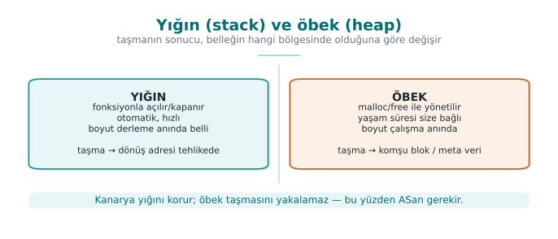

### Önceki haftalardan gelenler

- **Süreç belleği: yığın ve öbek** — bir programın çalışırken kullandığı bellek; yığın (stack) fonksiyon
  çağrılarının yerel değişkenlerini otomatik yönetir, öbek (heap) `malloc`/`new` ile elle ayrılıp `free`/`delete`
  ile bırakılır ([Hafta 1, §13](../week-1/cen429-week-1.md#13-surec-bellegi-verileriniz-nerede-duruyor)). Bu hafta
  §6'da öbeğin yeniden tahsisini (serbest bırakılmış belleğin kullanımı), §12'de yığın çerçevesinin korunmasını
  (kanarya) bu temel üzerine kuruyoruz.
- **Arabellek taşması** — bir programın bir diziye, ayrılan boyuttan fazla veri yazması; taşan baytlar dizinin
  hemen yanındaki belleğe, başka değişkenlerin ya da dönüş adresinin üzerine yazılır
  ([Hafta 1, §14](../week-1/cen429-week-1.md#14-arabellek-tasmalari-nasil-olusur-nasil-onlenir)). Bu hafta bu
  hatayı biçim dizesi açığıyla (§5) ve tamsayı kaynaklı taşmalarla (§7) genişletiyoruz.
- **Yığın çerçevesi ve dönüş adresi** — bir fonksiyon çağrıldığında yığında ona ayrılan, yerel değişkenleri ve
  fonksiyon bitince nereye döneceğini gösteren dönüş adresini tutan bölüm
  ([Hafta 1, §14](../week-1/cen429-week-1.md#14-arabellek-tasmalari-nasil-olusur-nasil-onlenir)). Bu hafta §5'te
  biçim dizesi açığının yığından nasıl okuduğunu, §12'de yığın kanaryasının bu çerçeveyi nasıl koruduğunu adım
  adım izliyoruz; ayrıca **ofset** terimini (bir başlangıç noktasına bayt cinsinden uzaklık) sıkça kullanacağız.
- **Beyaz kutu saldırgan modeli** — cihazın sahibi olan kullanıcının aynı zamanda potansiyel saldırgan olduğu,
  belleği okuyup hata ayıklayıcı bağlayabildiği model
  ([Hafta 1, §3](../week-1/cen429-week-1.md#3-saldirgan-kim-neye-erisebiliyor); Hafta 1 §5'teki "beyaz kutu
  saldırganın altı yolu" tablosuna da bakınız). Bu hafta §14'te kod gizlemenin motivasyonunu bu modelle kuruyoruz.
- **CWE** — yazılım zayıflıklarının MITRE tarafından yürütülen, numaralı kataloğu
  ([Hafta 2, §13](../week-2/cen429-week-2.md#13-yazilim-guvenlik-aciklarinin-siniflandirilmasi-cwe)). Bu hafta
  neredeyse her bölümde bulguları CWE numarasıyla adlandırıyoruz.

### Bu haftanın kavram haritası

| Kavram | Bir cümlede | Ayrıntısı |
| --- | --- | --- |
| CERT | SEI CERT C/C++, gerçek zafiyetlerden çıkarılan; her kuralı hatalı örnek, uyumlu çözüm, risk değerlendirmesi ve CWE bağıyla veren güvenli kodlama kurallarının kataloğudur. | [§2](#2-sei-cert-cc-guvenli-kodlamanin-kural-kitabi) |
| Tanımsız davranış (UB) | C/C++ standardının sonucunu tanımlamadığı işlemdir (ör. işaretli tamsayı taşması); derleyici bu durumun hiç oluşmayacağını varsayıp ona dayanan denetimi silebilir. | [§7](#7-tamsayilar-ve-tanimsiz-davranis-tarif-35) |
| Statik ve dinamik analiz | Statik analiz kodu **çalıştırmadan** (derleyici uyarıları, `clang-tidy`), dinamik analiz kodu **çalıştırırken** (sanitizer'lar) hata arar; ikisi birbirini tamamlar. | [§9](#9-statik-analiz-kodu-calistirmadan-hata-aramak) |
| Sanitizer | Derleyicinin programa eklediği, her bellek erişimini ya da tanımsız davranışı çalışma anında denetleyip ilk hatada ayrıntılı rapor veren bir araçtır (ör. AddressSanitizer). | [§10](#10-sanitizerlar-hatalari-calisma-aninda-yakalamak) |
| Fuzzing | Bir programı çok sayıda otomatik üretilmiş, çoğu bozuk girdiyle çalıştırıp çöktüğü ya da bir sanitizer'ın hata bildirdiği girdileri arama tekniğidir. | [§11](#11-fuzzinge-giris) |
| ASLR / NX / kanarya | Derleyici ve işletim sisteminin, bir hata kaçtığında sömürülmesini zorlaştırmak için eklediği korumalardır: ASLR adresleri rastgeleleştirir, NX/DEP veri sayfalarında kod çalıştırmayı engeller, yığın kanaryası dönüş adresine ulaşan taşmayı yakalar. | [§12](#12-derleyici-ve-isletim-sistemi-korumalari) |
| CI | Her kod değişikliğinde otomatik derleme, statik analiz, sanitizer'lı test ve fuzzing çalıştıran sürekli entegrasyon sistemidir. | [§13](#13-guvenli-derleme-hatti-hepsini-surekli-entegrasyonda-birlestirmek) |

### Ön bilgi: işaretçiler ve derleme seçenekleri

Bu ikisi önceki haftalarda öğretilmedi ama bu haftanın hemen her örneğinde kullanılır; kısaca tanımlayalım.

**İşaretçi (pointer).** Bir işaretçi, bir bellek **adresini** tutan değişkendir. `p` bir adresi tutar; `*p` o
adresteki değeri okur ya da yazar (dereferans). Bir işaretçi geçersiz ya da yanlış bir adresi gösteriyorsa, program
çöker ya da yanlış veriyi okuyup yazar — bu haftanın hatalarının çoğu, sonunda bir işaretçinin yanlış bir yeri
göstermesine dayanır.

**Derleyici bayrağı, uyarı ve hata.** Bir bayrak (flag), derleyiciye komut satırında verilen bir seçenektir; ör.
`-O2` derleyiciye kodu iyileştirmesini, `-Wall` bütün uyarıları açmasını, `-fsanitize=address` denetim kodu
eklemesini söyler. Derleyici, kodda şüpheli bir yapı gördüğünde iki türden bir bildirim verir: bir **hata** (error)
derlemeyi durdurur; bir **uyarı** (warning) derlemeyi durdurmaz, yalnız bir sorunu bildirir. Bu ayrım bu haftanın
kuralı için önemlidir: doğru bayraklarla (`-Werror`) uyarılar hataya çevrilmelidir, çünkü görmezden gelinen bir
uyarı yarının açığıdır.

## 1. Kod sağlamlaştırma nedir?

[Birinci haftada](../week-1/cen429-week-1.md) uygulama korumasının yedi katmanını gördük. Bu hafta bunlardan üçünü, C ve C++ kodu özelinde açıyoruz:

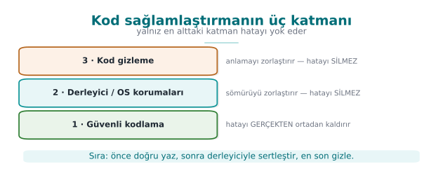

!!! note "Kısa tarihçe: bellek hataları ve savunmaların yarışı"
    - **1988** — **Morris Worm** tampon taşmasını dünyaya duyurur; saldırı sınıfı "akademik" olmaktan çıkar.
    - **1996** — Aleph One'ın *"Smashing the Stack for Fun and Profit"* yazısı sömürüyü herkese öğretir.
    - **1998 → 2004** — savunmalar sırayla gelir: **StackGuard/kanarya** (1998), **PaX/ASLR** (2001), **DEP/NX** (2004), FORTIFY.
    - **2012 → 2013** — **AddressSanitizer** ve **fuzzing** (AFL) hataları **otomatik** yakalamaya başlar.

    Ders bu yarışı sırayla izler: önce hatayı yaz, sonra aracın yakalamasını gör, sonra derleyici/OS korumasını ekle.

| Katman | Soru | Bu haftaki araçlar |
| --- | --- | --- |
| **2 · Güvenli kodlama** | Kodumda hata var mı? | SEI CERT kuralları, sınır ve dönüş değeri denetimi, sanitizer'lar, fuzzing |
| **3 · Derleyici ve işletim sistemi korumaları** | Bir hata kaçarsa sömürülmesi zor mu? | Yığın koruyucu, `_FORTIFY_SOURCE`, PIE/ASLR, DEP/NX, RELRO, CFI |
| **4 · Kod gizleme** | Kodu inceleyen biri mantığı ve sırları anlayabiliyor mu? | Sembol ve dize gizleme, günlüğün kaldırılması, sabit dönüşümleri, kontrol akışı düzleştirme |

**Kod sağlamlaştırma** (code hardening), bu üç katmanın birlikte uygulanmasıdır. Sıralama önemlidir: önce hatasız
kod, sonra hata kaçarsa zararı sınırlayan korumalar, en son da kodu okumayı zorlaştıran gizleme. 1. haftadaki uyarıyı
tekrarlayalım: **gizleme, hatayı düzeltmez.** Gizlenmiş bir taşma hâlâ bir taşmadır.

!!! note "Sahada nasıl uygulanır?"
    Kart şemalarının mobil ödeme gereksinimleri bu katmanları açıkça ister: "yaygın programlama zafiyetleri (bellekteki
    hassas verinin yönetimi, enjeksiyon, arabellek taşması ve dile özgü zayıflıklar) ele alınmalı", "savunmacı
    programlama teknikleri kodun **tamamında tutarlı biçimde** uygulanmalı" ve uygulama "statik ve dinamik tersine
    mühendisliğe karşı korunmalı". Sertifikasyondan geçmiş bir kütüphanenin kılavuzunda yalnız native (C/C++) taraf
    için on sekiz ayrı sağlamlaştırma önlemi listelenir. Bu haftanın sonunda bu önlemlerin çoğunu tanıyor olacaksınız.

### Neden bu sırada? Katlamayı ters çevirirsek ne olur?

Sıralamanın (önce 2, sonra 3, en son 4) keyfi olmadığını görmek için tersini deneyelim:

- **Önce gizleme, hatayı düzeltmeden:** Kontrol akışı düzleştirilmiş, dizeleri (string) şifrelenmiş bir programda hâlâ bir
  tampon taşması varsa, taşma **hâlâ çalışır**. Saldırgan taşmayı bulmak için tersine mühendislik yapmak zorunda bile
  değildir; dışarıdan fuzzing yeterlidir (bu hafta Bölüm 11). Gizleme, hatayı görünmez kılmaz, yalnız **kodu okumayı**
  zorlaştırır — ama çalışan bir saldırı kodu okumadan da bulunabilir.
- **Önce korumalar, kodu düzeltmeden:** Yığın koruyucusu açık bir programda taşma hâlâ vardır; program artık
  sessizce bozulmak yerine **çöker** (`*** stack smashing detected ***`). Bu bir kazanımdır (denetim ele geçirilemez)
  ama bir **hizmet reddi**dir hâlâ — saldırgan programı defalarca çökertip servisi kullanılamaz hale getirebilir.
  Kanarya hatayı düzeltmez, yalnız sonucunu değiştirir.
- **Önce güvenli kodlama:** Hata baştan yoksa, ne gizlemenin ne korumanın devreye girmesi gerekir. Bu yüzden 2.
  katman her zaman önce gelir; 3. katman bir hata **kaçarsa** diye bir güvenlik ağıdır; 4. katman ise saldırganın işini
  **pahalılaştıran** son bir eklemedir.

Bu üçü **birbirinin yerine geçmez**. 1. haftadaki savunma derinliği (defense in depth) ilkesinin C/C++ koduna
uygulanmış hâli budur: her katman, bir öncekinin atladığı durumu yakalamak için vardır.

---

## 2. SEI CERT C/C++: güvenli kodlamanın kural kitabı

Bir kod incelemesinde "bu satır bana tehlikeli görünüyor" demek yetmez — değerlendiriciye somut bir kural kimliği
ve gerekçe sunmak gerekir. Peki bu kurallar nereden geliyor, kim yazıyor ve neden hepsi aynı biçimde? Bu bölümün
konusu budur.

Carnegie Mellon Üniversitesi'ndeki Yazılım Mühendisliği Enstitüsü'nün (SEI) CERT birimi, C, C++ ve Java için
**güvenli kodlama standartları** yayımlar. Bu standartlar, gerçek zafiyetlerden çıkarılmış yüzlerce kuralı tek bir
biçimde toplar ve sertifikasyon laboratuvarlarının kaynak kod incelemesinde başvurduğu temel belgelerden biridir.
Bir kılavuz kitabı okumak yerine bir **sözlük** düşünün: her kural, tıpkı bir sözlük maddesi gibi, aynı sabit
biçimde (kimlik, tanım, örnek, çözüm) yazılır — böylece binlerce kural arasında gezinen bir değerlendirici her
seferinde aynı yapıyı bulur.

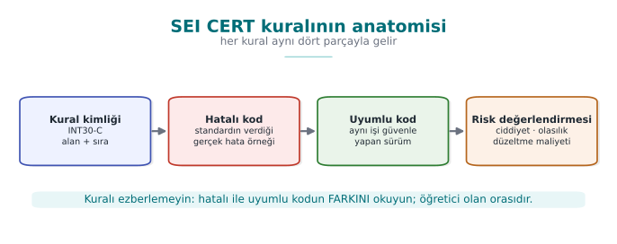

### Bir kuralın anatomisi

Her kural aynı yapıda yazılır:

| Bölüm | İçerik |
| --- | --- |
| **Kimlik** | Kategori kısaltması + numara + dil: `STR31-C`, `MEM50-CPP` |
| **Başlık** | Kuralın tek cümlelik özeti |
| **Hatalı örnek** (noncompliant) | Kuralı ihlal eden gerçekçi kod |
| **Uyumlu çözüm** (compliant) | Aynı işi doğru yapan kod |
| **Risk değerlendirmesi** | Önem × olasılık × düzeltme maliyeti → öncelik (L1, L2, L3) |
| **İlgili kurallar** | CWE ve diğer standartlarla eşleme |

**Kural** (rule) ile **öneri** (recommendation) ayrıdır: kurallar ihlal edildiğinde doğrudan zafiyete yol açabilir ve
otomatik araçlarla denetlenebilir; öneriler ise iyi uygulamadır. Öncelik düzeyi **L1** olan kurallar hem ciddi hem
yaygın hem de düzeltmesi ucuz olanlardır; bir kod incelemesine buradan başlanır.

### Kategoriler

| Kısaltma | Kategori | Örnek kural |
| --- | --- | --- |
| `PRE` | Önişlemci | PRE31-C: makro argümanlarında yan etkiden kaçın |
| `DCL` | Bildirimler | DCL30-C: nesneleri uygun ömürle bildir |
| `EXP` | İfadeler | EXP33-C: ilklendirilmemiş belleği okuma |
| `INT` | Tamsayılar | INT30-C: işaretsiz işlemlerin sarmadığından emin ol; INT32-C: işaretli taşmaya izin verme |
| `ARR` | Diziler | ARR30-C: sınırlar dışında işaretçi oluşturma ya da kullanma |
| `STR` | Dizeler | STR31-C: dize ve sonlandırıcı için yeterli yer ayır |
| `MEM` | Bellek yönetimi | MEM30-C: serbest bırakılmış belleğe erişme |
| `FIO` | Dosya G/Ç | FIO30-C: kullanıcı girdisini biçim dizesinden dışla |
| `ENV` | Ortam | ENV33-C: `system()` çağırma |
| `SIG` | Sinyaller | SIG30-C: sinyal işleyicide yalnız eşzamansız güvenli fonksiyonlar çağır |
| `ERR` | Hata işleme | ERR33-C: standart kütüphane hatalarını algıla ve işle |
| `CON` | Eşzamanlılık | CON43-C: çok iş parçacıklı kodda veri yarışına izin verme |
| `MSC` | Çeşitli | MSC32-C: rastgele sayı üreteçlerini doğru tohumla |
| `POS` / `WIN` | POSIX / Windows | POS36-C: yetki bırakma sırası |

C++ standardı (`-CPP` sonekli) C kurallarının çoğunu devralır ve dile özgü kurallar ekler: `MEM50-CPP` (serbest
bırakılmış belleğe erişme), `CTR50-CPP` (kapsayıcı indekslerinin ve yineleyicilerin geçerli aralıkta olması),
`STR50-CPP` (dize için yeterli yer), `EXP53-CPP` (ilklendirilmemiş belleği okuma), `ERR50-CPP` (programı ani
sonlandırma).

### İlk hafta ile bu haftayı birbirine bağlayan on kural

| Kural | Özet | Nerede gördük? |
| --- | --- | --- |
| STR31-C | Dize için yeterli yer | [1. hafta](../week-1/cen429-week-1.md) Demo 3 |
| INT31-C | Tamsayı dönüşümleri veri kaybetmemeli | 1. hafta Demo 4 |
| MSC06-C | Derleyici iyileştirmesinin güvenlik kodunu silmesine dikkat | 1. hafta Demo 2 |
| ENV33-C | `system()` çağırma | 1. hafta Demo 1 |
| FIO30-C | Kullanıcı girdisini biçim dizesinden dışla | Bu hafta Demo 1 |
| MEM30-C | Serbest bırakılmış belleğe erişme | Bu hafta Demo 2 |
| MEM31-C | Dinamik belleği işi bitince serbest bırak | Bu hafta Demo 2 |
| INT32-C | İşaretli tamsayı taşmasına izin verme | Bu hafta Demo 3 |
| ERR33-C | Kütüphane hatalarını algıla | Bu hafta 8. bölüm |
| SIG30-C | Sinyal işleyicide yalnız güvenli fonksiyonlar | Bu hafta 8. bölüm |

### İşlenmiş örnek: bir bulguyu kural kimliğiyle sayısallaştırmak

Bir kuralı "iyi bir öneri" olarak değil, **ölçülebilir bir risk** olarak okumayı öğrenelim. MEM31-C ("dinamik belleği
işi bitince serbest bırak") ihlal eden şu döngüyü ele alalım:

```c title="MEM31-C ihlali: her istekte bir blok sızar"
void handle_request(const char *data)
{
    char *buffer = malloc(64);          /* a NEW block on every call */
    if (!buffer) return;
    snprintf(buffer, 64, "%s", data);
    process(buffer);
    /* free(buffer) MISSING: the pointer is lost when the function returns, the block is never freed */
}
```

Bunu soyut bırakmayalım, **sayalım**:

```text title="Sızıntıyı sayısallaştırmak"
Her çağrı sızdırdığı bellek : 64 bayt
Sunucu saniyede istek sayısı : 200 istek/sn   (örnek yük)
Sızıntı hızı                 : 200 * 64 bayt = 12.800 bayt/sn ≈ 12,5 KB/sn
1 saatte birikim              : 12.800 * 3600 ≈ 46.080.000 bayt ≈ 43,9 MB/saat
24 saatte birikim             : 43,9 MB * 24 ≈ 1.053,6 MB ≈ 1,03 GB/gün
```

64 bayt tek başına önemsiz görünür; ama **sürekli çalışan bir sunucuda** birikir ve günler içinde belleği
tüketip programı çökertir (CWE-401, kaynak sızıntısı). Bu hesap, bir kod incelemesi raporunda "MEM31-C ihlali,
`handle_request()`, ~44 MB/saat sızıntı, düzeltme: fonksiyon sonuna `free(buffer)` eklenmeli" gibi somut,
önceliklendirilebilir bir cümleye dönüşür — "bence bellek yönetimi eksik" demekten çok daha güçlüdür.

!!! danger "Sık yapılan hata: küçük sızıntıyı önemsememek"
    "64 bayt neyse ki" diye düşünüp sızıntıyı ertelemek, uzun süre çalışan servislerde (sunucular, arka plan
    süreçleri, gömülü cihazlar) birikimli bir hizmet reddine dönüşür. Kısa ömürlü bir komut satırı aracında aynı
    sızıntı zararsız olabilir (işletim sistemi süreç bitince belleği geri alır); **ömür**, sızıntının ciddiyetini
    belirleyen asıl etkendir.

!!! success "Kural"
    Her `malloc`/`new` için kodda **tek bir** karşılık gelen `free`/`delete` bulunmalı ve bu ikisinin arasındaki her
    yol (erken `return`, `goto`, atılan istisna) bu eşleşmeyi bozmamalıdır (MEM31-C, MEM12-CPP). Şüpheniz varsa
    fonksiyonu ASan ile çalıştırın — sızıntıları `LeakSanitizer` doğrudan sayar (Bölüm 10).

!!! tip "Kuralları otomatik denetlemek"
    CERT kurallarının bir kısmı derleyici uyarıları ve statik analiz araçlarıyla otomatik denetlenebilir: GCC/Clang
    `-Wall -Wextra -Wformat=2 -Wconversion`, `clang-tidy`'nin `cert-*` denetimleri, `cppcheck --addon=cert`,
    MSVC `/analyze` ve ticari araçlar. Otomatik denetim bir başlangıçtır; mantık hatalarını ve tasarım hatalarını
    yalnız insan incelemesi bulur.

!!! question "Değerlendirici nasıl test eder?"
    Kaynak kod incelemesinde önce bir statik analiz aracını CERT kural setiyle çalıştırır ve bulguları önceliğe göre
    sıralar. Sonra dışarıdan veri alan her fonksiyonu (ağ, dosya, IPC, JNI arayüzü) elle okur: uzunluk alanları
    doğrulanıyor mu, dönüş değerleri denetleniyor mu, bellek tek bir sahip tarafından mı yönetiliyor? Bulgular
    rapora kural kimliğiyle yazılır: "FIO30-C ihlali: `gunluk.c:42`".

---

## 3. Girdi doğrulama ilkeleri (Tarif 3.1)

Bu haftanın hatalarının neredeyse hepsi aynı kökten gelir: programa dışarıdan gelen bir değere **güvenilmesi**. Kitabın
3. bölümü, girdi doğrulamayı bütün diğer önlemlerin temeli olarak ele alır. Tarif 3.1'deki ilkeler bugün de
geçerlidir; bunları C/C++ programcısının günlük kontrol listesine çevirelim.

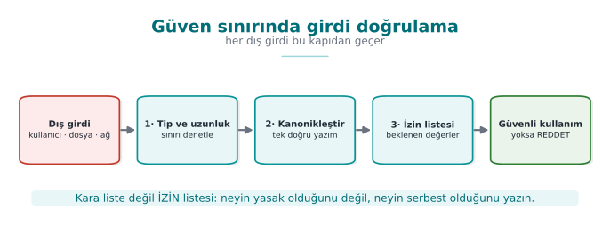

### Girdi nereden gelir?

"Kullanıcı girdisi" dendiğinde akla klavye gelir; oysa güven sınırını geçen **her şey** girdidir:

| Kaynak | Örnek | Sık unutulan nokta |
| --- | --- | --- |
| Komut satırı | `argv` | `argv[0]` bile saldırganın seçtiği bir değer olabilir |
| Ortam değişkenleri | `PATH`, `HOME`, `LANG` | [1. haftadaki](../week-1/cen429-week-1.md) güvenli başlatma |
| Dosyalar | Yapılandırma, belge, resim | Dosya biçimindeki uzunluk alanları |
| Ağ | Protokol iletisi, HTTP başlığı | İstemci "bu ileti 16 bayt" diyebilir, 1 bayt gönderebilir |
| Süreçler arası iletişim | Soket, adlandırılmış kanal, paylaşılan bellek | Aynı makinedeki başka bir süreç de güvenilmezdir |
| Veritabanı | Daha önce kaydedilmiş veri | "Kendi yazdığımız veri" sonradan değiştirilmiş olabilir |
| Kütüphane arayüzü | JNI, eklenti API'si | Çağıran uygulama da güvenilmez kabul edilir |

### Beş ilke

1. **Beyaz liste, kara liste değil.** İzin verilenleri tanımlayın ("yalnız rakam ve en fazla 6 hane"), yasakları
   saymaya çalışmayın. Kara liste her zaman bir şeyi unutur.
2. **Önce kanonikleştir, sonra doğrula.** Aynı değerin birden fazla yazılışı olabilir (`/tmp/../etc`, `%2e%2e/`,
   büyük/küçük harf, Unicode biçimleri). Doğrulama, değerin tek ve kesin biçimine yapılmalıdır (Tarif 3.7, 3.8, 3.12).
3. **Uzunluk, tür, aralık, biçim — bu sırayla.** Önce uzunluğu sınırla (tampon taşmasını önler), sonra türünü
   (sayı mı?), sonra aralığını (0–100 mü?), sonra biçimini (tarih mi?) denetle.
4. **Mümkün olan en erken noktada, güven sınırında doğrula.** Veri içeri girer girmez doğrulanır ve doğrulanmış halde
   dolaşır; her fonksiyon aynı denetimi tekrar yazmak zorunda kalmaz.
5. **Reddetmek, düzeltmekten güvenlidir.** Geçersiz girdiyi "temizleyip" kullanmak yerine reddedin. Temizleme kodu
   da hata yapar; üstelik temizlenmiş değer, kullanıcının kastettiğinden farklı bir anlam taşıyabilir.

### Sayıyı doğru okumak: `atoi` yerine `strtol`

Girdi doğrulamanın en küçük ama en sık yanlış yapılan örneği bir sayıyı okumaktır:

```c title="Hatalı: atoi hatayı bildiremez"
int count = atoi(argv[1]);    /* "abc" → 0, "99999999999" → undefined, "12abc" → 12 */
```

```c title="Doğru: strtol + tam denetim"
#include <errno.h>
#include <limits.h>
#include <stdlib.h>

/* 0 on success; -1 if invalid or out of range */
int read_number(const char *s, long min_val, long max_val, long *result)
{
    char *end;
    errno = 0;
    long value = strtol(s, &end, 10);
    if (end == s)             return -1;   /* no digits at all */
    if (*end != '\0')         return -1;   /* trailing junk character: "12abc" */
    if (errno == ERANGE)      return -1;   /* did not fit in a long */
    if (value < min_val || value > max_val) return -1;  /* business-rule range */
    *result = value;
    return 0;
}
```

Dört denetim de gereklidir ve her biri gerçek bir hata sınıfını kapatır: boş girdi, çöp ekli girdi, taşma ve iş kuralı
ihlali. CERT bu kalıbı `ERR34-C` ("dizeleri sayıya çevirirken hataları algıla") kuralıyla ister.

### Binary veri: uzunluk önekli kayıtlar

Ağ protokollerinde ve dosya biçimlerinde veri genellikle `[tür][uzunluk][veri]` biçimindedir. Heartbleed'den bu
haftanın fuzzing demosuna kadar birçok hatanın kaynağı, **uzunluk alanına** güvenilmesidir:

```c title="Uzunluk önekli kaydı güvenle okumak"
/* buffer: incoming data, remaining: bytes remaining in the buffer */
int read_record(const uint8_t *buffer, size_t remaining, Record *rec)
{
    if (remaining < 3) return -1;                        /* not even a header */
    rec->type = buffer[0];
    uint16_t length = (uint16_t)(buffer[1] << 8 | buffer[2]);
    if (length > remaining - 3) return -1;               /* declared > received: REJECT */
    if (length > sizeof rec->data) return -1;             /* doesn't fit the destination: REJECT */
    memcpy(rec->data, buffer + 3, length);
    rec->length = length;
    return 3 + length;                                    /* bytes consumed */
}
```

İki denetim birbirinden farklıdır ve ikisi de gereklidir: biri **kaynağı** (gelen veride gerçekten bu kadar bayt var
mı?), diğeri **hedefi** (bu kadar bayt tampona sığar mı?) korur. `remaining - 3` ifadesi, önceki `remaining < 3`
denetimi sayesinde sarmaz; denetimlerin **sırası** da önemlidir.

### İşlenmiş örnek: `read_record`'u bayt bayt izlemek

Yukarıdaki fonksiyonu soyut bırakmayalım; gerçek baytlarla, satır satır izleyelim. Ağdan `remaining = 8` bayt
geldiğini ve içeriğin şu olduğunu varsayalım (onaltılık, sonra karşılığı):

| Ofset | Bayt (onaltılık) | Anlamı |
| --- | --- | --- |
| 0 | `01` | `type` alanı = 1 |
| 1 | `00` | uzunluğun yüksek baytı |
| 2 | `05` | uzunluğun düşük baytı |
| 3–7 | `48 45 4C 4C 4F` | `"HELLO"` (5 bayt veri) |

Fonksiyon şu adımları **sırayla** işler:

```text title="Adım adım yürütme (remaining = 8, iyi huylu girdi)"
1) remaining < 3 mü?           8 < 3  → HAYIR, devam.
2) rec->type = buffer[0]        = 0x01
3) length = buffer[1]<<8 | buffer[2]
            = (0x00 << 8) | 0x05
            = 0x0000 | 0x0005
            = 5
4) length > remaining - 3 mi?  remaining - 3 = 8 - 3 = 5;  5 > 5  → HAYIR, devam.
5) length > sizeof(rec->data) mi?  (rec->data 64 bayt ise) 5 > 64 → HAYIR, devam.
6) memcpy(rec->data, buffer+3, 5)  → rec->data = "HELLO"
7) return 3 + length = 3 + 5 = 8   (tüketilen bayt; remaining'in TAMAMI, tutarlı)
```

Şimdi saldırganın **yalnızca uzunluk alanını** değiştirdiği, verinin geri kalanına dokunmadığı bir girdiyi izleyelim
(`remaining` yine 8, ama bildirilen uzunluk artık gerçek veriden çok daha büyük):

| Ofset | Bayt | Anlamı |
| --- | --- | --- |
| 0 | `01` | `type` = 1 |
| 1 | `FF` | uzunluğun yüksek baytı |
| 2 | `FF` | uzunluğun düşük baytı |
| 3–7 | `48 45 4C 4C 4F` | yine 5 bayt gerçek veri |

```text title="Adım adım yürütme (remaining = 8, saldırgan girdisi)"
1) remaining < 3 mü?           8 < 3 → HAYIR, devam.
2) rec->type = buffer[0]        = 0x01
3) length = buffer[1]<<8 | buffer[2]
            = (0xFF << 8) | 0xFF
            = 0xFF00 | 0x00FF
            = 0xFFFF = 65.535
4) length > remaining - 3 mi?  65.535 > 5  → EVET → REDDET, fonksiyon -1 döner.
   (memcpy'a HİÇ ulaşılmaz)
```

Denetim tam bu noktada devreye girer: `buffer`'da gerçekten yalnız 5 bayt veri **vardır**, ama alan "65.535 bayt
geleceğim" **diyor**. Denetim olmasaydı 4. adım atlanır, `memcpy(rec->data, buffer+3, 65535)` çağrılır ve `buffer`
dizisinin sınırlarının **çok ötesinden** okuma yapılır — bu, CWE-125 (sınır dışı okuma) ve bu haftanın Demo 4'ünün
fuzzing ile bulduğu tam hatadır. `length`'in `uint16_t` olması bile tek başına yetmez: 16 bitlik bir alan en fazla
65.535 değerini taşıyabilir, ama bu hâlâ gerçek veri miktarından (`remaining - 3`) çok daha büyük olabilir; asıl
güvenlik **alan genişliğinden değil, karşılaştırmadan** gelir.

!!! danger "Sık yapılan hata: uzunluk alanını `uint16_t`/`uint32_t` yapıp 'sığar' sanmak"
    Bir alanın veri türü, o alanın **yazabileceği en büyük değeri** sınırlar; **gelen veride gerçekten o kadar bayt
    olduğunu** garanti etmez. `uint16_t length` en fazla 65.535 tutar ama tamponda hâlâ yalnız birkaç bayt veri
    olabilir. Tür seçimi bir dinlenme değil; asıl doğrulama karşılaştırmadır (4. adım).

!!! success "Kural"
    Bildirilen bir uzunluk alanını her zaman **gerçekten gelen bayt sayısıyla** (`remaining`) ve **hedef tamponun
    boyutuyla** (`sizeof rec->data`) karşılaştırın; ikisinden biri eksikse veri **reddedilir**, kesilmiş ya da
    varsayılan bir değerle "düzeltilmeye" çalışılmaz (5. ilke, yukarıda).

!!! note "Sahada nasıl uygulanır?"
    Ödeme kütüphanelerinin savunmacı programlama gereksinimlerinin ilk maddesi "uygulamanın her girdisi ve çıktısı
    denetlenmelidir"dir. Bir kütüphane kendisini çağıran uygulamaya da güvenmez: JNI arayüzünden gelen her dize ve
    dizi, native tarafta uzunluk ve biçim açısından yeniden doğrulanır. Doğrulama başarısız olursa fonksiyon ayrıntı
    vermeden "başarısız" döner.

---

## 4. CERT kurallarından örnek çiftler

CERT standardının en öğretici yanı, her kural için verdiği **hatalı / uyumlu** kod çiftleridir. Aşağıda bu haftanın
konularına dokunan beş kuralı kendi örneklerimizle işliyoruz. Her çiftte önce hatayı bulmaya çalışın, sonra
açıklamayı okuyun.

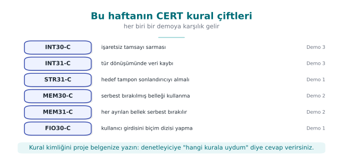

### STR31-C: dize ve sonlandırıcı için yeterli yer

```c title="Hatalı"
char copy[16];
strcpy(copy, name);                      /* overflows if name is longer than 15 characters */
```

```c title="Uyumlu"
char copy[16];
int n = snprintf(copy, sizeof copy, "%s", name);
if (n < 0 || (size_t)n >= sizeof copy) {
    /* truncated: don't use it, or return an error */
}
```

`snprintf`'in dönüş değeri, yer olsaydı yazılacak karakter sayısıdır; tampon boyutuna eşit ya da büyükse çıktı
**kesilmiştir**. Kesilmiş bir dosya yolu ya da komut, farklı bir anlama gelebilir.

**Sayısal doğrulama:** `name = "Mehmet Ali Kaya Demir"` dizesinin uzunluğu **21 karakterdir** (boşluklar dahil, `\0`
hariç). `char copy[16]` yalnız 15 karakter + sonlandırıcı `\0` alabilir (16 bayt = 15 + 1). `snprintf(copy, 16,
"%s", name)` çağrıldığında:

```text title="snprintf'in kesme davranışı, sayılarla"
Yazılacak gerçek uzunluk (n)     : 21
Tampon boyutu (sizeof copy)      : 16
n >= sizeof copy ?               : 21 >= 16 → EVET → KESİLDİ
copy içinde gerçekte duran       : "Mehmet Ali Kaya" (ilk 15 karakter) + '\0'
```

`strcpy` kullanılsaydı denetim hiç olmazdı ve 21 karakterlik dize, 16 baytlık tampona sınır denetimi yapılmadan
kopyalanır, **5 bayt** (21 − 16) komşu belleğe taşardı. `snprintf` taşmayı önler; ama **sessizce kesme** de kendi
başına bir hatadır — "Mehmet Ali Kaya Demir" adlı bir kullanıcı, sistemde "Mehmet Ali Kaya" olarak kaydedilirse, iki
farklı kullanıcı aynı kesilmiş ada sahip olabilir. Bu yüzden uyumlu çözümdeki `if (n < 0 || (size_t)n >= sizeof
copy)` denetimi **zorunludur**: kesilme fark edilip ya reddedilmeli ya da daha büyük bir tampon ayrılmalıdır.

### INT30-C: işaretsiz işlemler sarmamalı

```c title="Hatalı"
size_t remaining = total - read_count;   /* a gigantic number if read_count > total */
memcpy(dest, src + read_count, remaining);
```

```c title="Uyumlu"
if (read_count > total) return ERROR;
size_t remaining = total - read_count;
```

İşaretsiz çıkarma sıfırın altına inemez, **sarar**: `3 - 5` sonucu `SIZE_MAX - 1`'dir. Çıkarmadan önce sıralama
denetlenir.

**Sayısal doğrulama (64-bit sistemde, `size_t` 8 bayt):** İşaretsiz aritmetik **modüler** çalışır; sonuç `2⁶⁴`'e göre
alınır (`mod` = kalan, yani "2⁶⁴'e böldüğünde kalan").

```text title="3 - 5 işlemi size_t (64-bit) olarak"
Matematikteki gerçek sonuç : -2
Modüler karşılığı          : -2 + 2^64 = 2^64 - 2
2^64                        : 18.446.744.073.709.551.616
2^64 - 2                    : 18.446.744.073.709.551.614   ← "remaining" bu devasa sayı olur
SIZE_MAX (2^64 - 1)         : 18.446.744.073.709.551.615
Karşılaştırma               : 2^64 - 2 = SIZE_MAX - 1  ✓ (metindeki iddiayla birebir örtüşür)
```

`memcpy(dest, src + read_count, remaining)` çağrısına bu `remaining` değeri verilirse, fonksiyondan **18,4 katrilyon
gigabaytlık** bir kopyalama istenmiş olur — bellek bu kadar büyük olamayacağı için işlemci, `src` işaretçisinin
gösterdiği bölgenin çok ötesindeki, haritalanmamış bir sayfaya ulaşana kadar okumaya çalışır ve **segmentation
fault** ile çöker (ya da haritalı ama yabancı bir bölgeye ulaşırsa bilgi sızıntısına yol açar). **32-bit** bir
sistemde (`size_t` 4 bayt) aynı hesap `2³² − 2 = 4.294.967.294` verir — daha küçük ama yine de tamponun gerçek
boyutundan katbekat büyük bir sayıdır; sonuç aynıdır.

### MEM30-C: serbest bırakılmış belleğe erişme

```c title="Hatalı: döngüde serbest bırakırken sonraki düğüme erişim"
for (Node *n = head; n != NULL; n = n->next)
    free(n);                              /* n->next is read AFTER the free */
```

```c title="Uyumlu"
Node *n = head;
while (n != NULL) {
    Node *next = n->next;                 /* read it first */
    free(n);
    n = next;
}
```

Bağlı liste silmek, UAF'in en sık görüldüğü masum yerlerden biridir: `for` döngüsünün artırma ifadesi, gövdede serbest
bırakılmış düğümün alanını okur.

### EXP33-C: ilklendirilmemiş belleği okuma

```c title="Hatalı"
int result;
if (condition) result = compute();
return result;                            /* a random value if condition is false */
```

```c title="Uyumlu"
int result = ERROR_CODE;                  /* safe default */
if (condition) result = compute();
return result;
```

İlklendirilmemiş bir yerel değişken, yığında daha önce duran değeri taşır; bu bir önceki fonksiyonun **sırrı** bile
olabilir. Güvenlik açısından varsayılan değer, "izin yok" ya da "hata" anlamına gelmelidir ([1. haftadaki](../week-1/cen429-week-1.md) güvenli
varsayılan ilkesi).

### ERR33-C: kütüphane hatalarını algıla

```c title="Hatalı"
FILE *f = fopen(path, "rb");
fread(buffer, 1, sizeof buffer, f);       /* f == NULL if fopen fails */
```

```c title="Uyumlu"
FILE *f = fopen(path, "rb");
if (f == NULL) return ERROR;
size_t n = fread(buffer, 1, sizeof buffer, f);
if (n < sizeof buffer && ferror(f)) { fclose(f); return ERROR; }
fclose(f);
```

`fread` kısa okuma yaptığında bunun dosya sonu mu yoksa hata mı olduğunu `feof`/`ferror` ile ayırmak gerekir.
Kısmen okunmuş bir yapıyı tam okunmuş sanmak, ilklendirilmemiş bellek okumanın başka bir biçimidir.

!!! tip "Kural kimliğiyle düşünmek"
    Kod incelemesinde bulduğunuz her hatayı bir CERT kuralıyla eşleştirmeye çalışın. Bu, hem bulguyu nesnel kılar
    ("bence böyle daha iyi" değil, "STR31-C ihlali") hem de aynı kuralın kodun başka yerlerinde de ihlal edilip
    edilmediğini aramanızı kolaylaştırır.

---

## 5. Biçim dizesi açığı (Tarif 3.2)

Bir web sunucusu günlüğüne bakalım: `printf(kullanicidan_gelen_ad)` satırı yıllarca sorunsuz çalışmış olabilir —
kullanıcılar hep sıradan adlar yazmıştır. Ama bir gün biri kullanıcı adı alanına `%x%x%x%x` yazsa ne olur?
Program çökmez, hatta bir hata bile vermez; ekranda birden **anlamsız onaltılık sayılar** belirir. O sayılar
gerçekte neyin karşılığıdır, ve program neden onları yazdırmıştır? Bu bölümün sorusu tam olarak budur.

!!! note "Kısa tarihçe: biçim dizesi açıkları"
    Biçim dizesi açıkları 1999–2000 yıllarında, **wu-ftpd** gibi yaygın kullanılan FTP sunucu yazılımlarındaki
    gerçek zafiyetlerle geniş çapta tanınır hâle geldi: saldırganlar, günlükleme çağrılarına sızan kullanıcı
    verisini biçim dizesi olarak kullanıp bilgi sızdırabiliyor, hatta uzaktan kod çalıştırabiliyordu. Bu olaylar,
    `%n` gibi "zararsız görünen" bir belirtecin aslında bir **yazma birincil ilkeli** (write primitive) olduğunu
    güvenlik camiasına öğretti ve derleyicilerin `-Wformat-security` gibi uyarılarla, kütüphanelerin ise
    `_FORTIFY_SOURCE` gibi çalışma anı denetimleriyle buna karşılık vermesine yol açtı ([1. bölümde](#1-kod-saglamlastirma-nedir) gördüğümüz savunma yarışının bir parçası).

`printf` ailesinin ilk argümanı bir **biçim dizesidir**: içindeki `%d`, `%s`, `%x` gibi belirteçler, fonksiyona
"yığından şu türde bir argüman al ve şu biçimde yaz" komutunu verir. Fonksiyon, gerçekten kaç argüman verildiğini
**bilmez**; biçim dizesinde ne yazıyorsa onu yapar. Biçim dizesi kullanıcıdan geliyorsa, kullanıcı fonksiyona komut
vermiş olur — tıpkı bir restoranda garsona "mutfağa şu notu ilet" demek yerine, müşteriye doğrudan mutfağın
kapısını açıp "ne istiyorsan seslen" demek gibi.

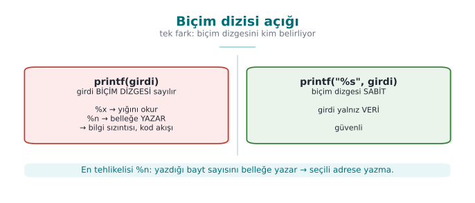

```c title="Hatalı ve doğru"
printf(user_input);                  /* WRONG: the input is interpreted as the format string */
printf("%s", user_input);            /* CORRECT: the input is only data */
```

### Neden tehlikeli?

| Belirteç | Normalde | Saldırgan verirse |
| --- | --- | --- |
| `%x`, `%p` | Bir argümanı onaltılık yazar | Olmayan argümanlar yerine **yığındaki değerler** okunur: bilgi sızıntısı |
| `%s` | Bir işaretçinin gösterdiği dizeyi yazar | Yığındaki rastgele bir değer işaretçi sanılır: çökme ya da bellek okuma |
| `%n` | Şimdiye kadar yazılan karakter sayısını bir işaretçiye **yazar** | Yığındaki bir değerin gösterdiği adrese **yazma**: bellek bozulması |

Ne kadar zararlı olduğu platforma ve korumalara göre değişir; ama en hafif sonucu bile bir **bilgi sızıntısıdır**:
yığında duran bir anahtar, bir adres (ASLR'yi zayıflatır) ya da bir kanarya değeri okunabilir. Aynı hata `syslog`,
`fprintf`, `snprintf`, `err`/`warn` ve bir biçim dizesi alan her fonksiyonda ortaya çıkar; [2. haftada](../week-2/cen429-week-2.md) denetim
kaydının `syslog(LOG_INFO, user_input)` hatasını görmüştük.

### İşlenmiş örnek: `%x` yığından ne okur? Adım adım

`printf`'in nasıl çalıştığını hatırlayalım: `printf(bicim, arg1, arg2, ...)` çağrıldığında, `bicim` dizesinin
içinde kaç tane `%` belirteci varsa, fonksiyon **o kadar** argüman **beklediğini** varsayar. Argümanları nereden
okuduğu ise derleyicinin ürettiği **çağrı kuralına (ABI)** bağlıdır. Öğretici olması için önce klasik ve basit
modeli (bütün argümanlar yığında) izleyelim, sonra bugünün 64-bit sistemlerindeki farkı ekleyelim.

**1) Basitleştirilmiş model — bütün argümanlar yığında art arda durur**

`leak.c`'de çağrı şudur: `printf(buffer)` — yalnız **1** gerçek argüman (biçim dizesinin kendisi) verilmiştir,
başka hiçbir değer verilmemiştir. Kullanıcı `buffer`'un içine `"%x.%x.%x.%x.%x.%x"` yazarsa, `printf` biçim
dizesinde **6 tane** `%x` görür ve "6 argüman daha gelecek" varsayımıyla ilerler. Ama gerçekte hiçbiri
**gönderilmemiştir**. `printf`'in yapacağı tek şey bellidir: her `%x` için, "bir sonraki argümanın durması gereken"
konuma bakıp oradaki baytları **sayı sanıp** onaltılık yazmaktır. Bu basit modelde o konumlar, çağrının hemen
üzerindeki yığın hücreleridir — yani `main()` fonksiyonunun **kendi yerel değişkenlerinin bulunduğu bölge**:

```text title="leak.c'deki bildirim sırası (yığın çerçevesi, kavramsal)"
volatile unsigned secret_value = 0x5ECE7u;   /* fonksiyonun yerel değişkeni #1 */
char buffer[64];                            /* fonksiyonun yerel değişkeni #2, kullanıcı girdisini tutar */
```

Bu iki değişken **aynı yığın çerçevesinde**, birbirine **komşu** durur (derleyici ve bayraklara göre tam sıralama ve
aradaki boşluk değişebilir; önemli olan ikisinin de aynı çerçevede, birbirine yakın olmasıdır). `printf(buffer)`
çağrıldığında, biçim dizesinin kendisi de zaten bu `buffer`'un içindedir — yani **okunan yer** ile **okuyan
biçim dizesi** aynı bellek bölgesindedir. Yeterli sayıda `%x` verilirse, tarama er ya da geç `secret_value`'in
durduğu 4 baytlık hücreye ulaşır:

```text title="'%x' taramasının adımları (basitleştirilmiş, kavramsal argüman sırası)"
1. %x  → argüman konumu #1'deki değer  (örn. önceki bir çağrıdan kalan rastgele bayt)
2. %x  → argüman konumu #2'deki değer  (rastgele)
3. %x  → argüman konumu #3'teki değer  (rastgele)
   ...
N. %x  → argüman konumu #N tam olarak secret_value'in bulunduğu hücreye denk geliyor
         → printf bu 4 baytı bir unsigned int gibi okuyup onaltılık yazar
         → EKRANDA GÖRÜLEN: "5ece7"
```

Demo programı bunu bağımsız biçimde doğrular: kod, `secret_value`'i `printf("...0x%05x...", secret_value)` ile önce
**kasıtlı olarak** ekrana yazar (kontrol amaçlı); sonra `leak '%x.%x.%x...'` çalıştırıldığında, `%x` taramasının
çıktısında **aynı `5ece7` değerinin** tekrar göründüğü izlenir. İki çıktının birbirini tutması, sızan değerin
gerçekten `secret_value` olduğunun kanıtıdır — rastgele bir sayı değil, programın **kendi belleğinden** okunmuş bir
değerdir.

**2) 64-bit farkı — ilk birkaç `%x` neden farklı davranır**

Yukarıdaki "hepsi yığında" modeli, x86 **32-bit** çağrı kuralı (cdecl) için tam doğrudur ve format-string
saldırılarının klasik öğretim modelidir. Bugünün 64-bit Linux/Windows derlemelerinde ise x86-64 System V ABI, ilk
**6** tamsayı/işaretçi argümanını **yığın yerine işlemci yazmaçlarında** (`RSI`, `RDX`, `RCX`, `R8`, `R9` — `RDI`
biçim dizesinin kendisi için ayrılmıştır) taşır; yalnız 6'dan fazlası yığına konur. Sonuç: `printf(buffer)`
çağrısında ilk birkaç `%x`, yığındaki bir hücreyi değil, o an bu yazmaçlarda **tesadüfen** duran (önceki
çağrılardan — ör. `snprintf`, kendi `printf` hazırlığı — kalan) değerleri okur; yalnız 6. `%x`'ten **sonrakiler**
yığına, dolayısıyla `secret_value`'in de bulunduğu bölgeye ulaşır. Demo betiğinin `%x` sayısını kademeli
artırmasının (adım 2) nedeni tam olarak budur: kaç `%x` gerektiği derleyiciye, optimizasyon düzeyine ve platforma
göre değişir; öğrencinin görmesi gereken **mekanizma** budur, belirli bir sabit sayı değil.

**3) `%n` neden daha tehlikelidir**

`%x` yalnız **okur**; `%n` ise "şimdiye kadar kaç karakter yazıldığını, kendisine verilen **işaretçinin gösterdiği
yere** yaz" der — yani bir **yazma** işlemidir. Yukarıdaki modelde `%n` de tıpkı `%x` gibi "bir sonraki argüman
konumunu" bir değer olarak okur; ama bu kez o değeri bir **sayı** değil bir **adres** (işaretçi) sanır ve o
adrese yazar. Argüman hiç verilmediği için bu "adres" de yine yığında/yazmaçta o an ne duruyorsa **odur** —
genellikle geçersiz bir adrestir ve program çöker. Ama saldırgan biçim dizesini **kendisi** yazdığı için, dizenin
içine kendi seçtiği bayt dizilerini de yerleştirebilir; `%x` ile hangi konumun hangi veriye karşılık geldiğini
önce **haritalayıp**, sonra `%n`'in tam o konuma denk gelmesini sağlayarak, "adres" olarak okunacak hücreyi
**kendi verdiği bir değerle** doldurabilir. Bu, `%n`'i yalnızca bir çökme kaynağı olmaktan çıkarıp bellekte
**seçilmiş bir konuma seçilmiş bir değer yazma** aracına çevirir (CWE-134). Bu derste bunun ötesine, çalışan bir
sömürü adımına **girmiyoruz** — mekanizmayı anlamak, savunmayı (biçim dizesini sabitlemek) anlamak için yeterlidir.

!!! danger "Sık yapılan hata: 'girdi hiç `%` içermiyor, sorun yok' varsayımı"
    Bir kod incelemesinde "bu girdi zaten kullanıcı adı, kimse `%n` yazmaz" diye düşünüp `printf(girdi)` çağrısını
    onaylamak, en sık görülen atlamadır. Doğrulama **girdinin içeriğine değil, çağrının biçimine** bakmalıdır:
    değişken bir dize asla biçim parametresi konumuna konmaz — girdinin ne içerdiği önemsizdir.

!!! success "Kural"
    Kural tek cümledir ve istisnasızdır: **biçim dizesi her zaman sabit bir metin sabiti olmalı, kullanıcı verisi
    yalnız `%s` gibi bir belirtecin argümanı olarak geçmelidir.** `printf("%s", girdi)` — asla `printf(girdi)`.

Bu mekanizma, [1. haftada](../week-1/cen429-week-1.md) gördüğümüz "bellek okuma/yazma sınırlarının ihlali" hata ailesinin somut bir örneğidir:
`%x` bir **sınır dışı okuma**, `%n` bir **sınır dışı yazma** yapar — farkı, sınırı aşan tarafın bir dizi indeksi
değil, biçim dizesindeki belirteç sayısı olmasıdır. [5. haftada](../week-5/cen429-week-5.md) göreceğimiz enjeksiyon saldırılarıyla da aynı
kökten gelir: **veri, komut yerine geçmiştir** — SQL enjeksiyonunda veri bir sorgu parçası, burada veri bir
biçim komutu olarak yorumlanmıştır.

### Demo 1 — Biçim dizesi açığı

!!! info "Demo 1 · `code/week-04/01-format-string` · CWE-134 · Tarif 3.2"
    `leak` programı kendisine verilen metni `printf(buffer)` ile yazar; programın belleğinde sentetik bir "gizli
    değer" (`secret_value`) durur. Önce derleyicinin bu satır için uyarı verip vermediğine bakılır, sonra `%x`
    belirteçleriyle gizli değerin sızdığı ve `%n`'in platformlara göre nasıl durdurulduğu gösterilir. Son adımda
    düzeltilmiş sürüm aynı girdiyi yalnız metin olarak yazar.

=== "Windows (PowerShell)"

    ```powershell
    cd code\week-04\01-format-string
    .\demo.ps1
    ```

=== "WSL / Linux"

    ```bash
    cd code/week-04/01-format-string
    sh demo.sh
    ```

| Adım | Ne yapılır? | Ne görülür? | Ders |
| --- | --- | --- | --- |
| 0 | Derleme | GCC/Clang `-Wformat-security` uyarır; MSVC'nin C derleyicisi susar, `/analyze` yakalar | Uyarıları açın ve **hata** sayın |
| 1 | `leak Hello` | Normal çıktı | — |
| 2 | `leak '%x.%x.%x…'` | Yığın onaltılık dökülür; gizli değer çıktıda görünür | Bilgi sızıntısı |
| 3 | `leak 'AAAA%n'` | Linux'ta korumasız sürüm çöker; Windows'ta C çalışma kitaplığı `%n`'i reddeder | Platform farkı |
| 4 | `leak_checked 'AAAA%n'` | `_FORTIFY_SOURCE` yazılabilir bellekteki `%n`'i yakalar ve programı durdurur | Koruma katmanı |
| 5 | `leak_secure '…%n…'` | Belirteçler yalnız metin olarak yazılır | **Asıl düzeltme** |

Aşağıdaki animasyonda `%x`'in yığındaki argüman konumlarını sırayla nasıl taradığını, gizli değere nerede
ulaştığını ve `%n` olsaydı ne olacağını (kavramsal) adım adım izleyin.

<iframe class="dsanim" src="../anim/format-string.html" title="Biçim dizesi açığı: %x yığını tarar" loading="lazy"></iframe>
<div class="dsanim-baski" markdown>

</div>

Örnek seçiciden **bulundu** (normal), **tam son belirteçte sızıntı** (zor) ve uç durumlar **yetersiz belirteç**,
**%n olsaydı** ile **güvenli sürüm** arasında geçiş yapın — ya da 🎲 ile rastgele bir belirteç/hedef-konum çifti
üretin, ya da kendi değerlerinizi yazın.

### Düzeltme ve savunma katmanları

1. **Biçim dizesi her zaman sabit olmalı** (FIO30-C). Kullanıcı verisi yalnız argümandır: `printf("%s", s)`.
2. **Derleyici uyarıları:** GCC/Clang'de `-Wformat -Wformat-security` (hatta `-Werror=format-security`); MSVC'de
   `/analyze`. Kendi yazdığınız `printf` benzeri fonksiyonlara `__attribute__((format(printf, 1, 2)))` ekleyin ki
   derleyici onları da denetlesin.
3. **Çalışma zamanı koruması:** glibc'de `_FORTIFY_SOURCE=2`, yazılabilir bellekteki biçim dizelerinde `%n`'i
   reddeder; Microsoft'un C çalışma kitaplığı `%n`'i varsayılan olarak kapatır.
4. **Değişken argüman sayısını doğrulayın** (Tarif 13.4): kendi değişken argümanlı fonksiyonunuzu yazıyorsanız,
   argüman sayısını ya da türünü biçim dizesinden değil, açık bir parametreden alın.

```c title="Kendi günlük fonksiyonunuzu derleyiciye denetletin"
#if defined(__GNUC__)
#  define FORMAT_CHECK(a, b) __attribute__((format(printf, a, b)))
#else
#  define FORMAT_CHECK(a, b)
#endif

void log_write(int level, const char *format, ...) FORMAT_CHECK(2, 3);

log_write(1, user);                /* the compiler now warns here */
log_write(1, "%s", user);          /* correct */
```

!!! question "Değerlendirici nasıl test eder?"
    Kaynak kodda biçim dizesi olarak bir değişken alan her çağrıyı arar (`printf(`, `syslog(`, `snprintf(buf, n,`
    ardından sabit olmayan bir argüman). Dinamik testte her metin alanına `%x%x%x%n` gibi girdiler verir ve
    çıktıda onaltılık değerler, çökme ya da günlükte bozulma arar.

---

## 6. Serbest bırakılmış belleğin kullanımı ve çift serbest bırakma

Bir otel odasını düşünelim: çıkış yaptınız, anahtar kartınızı resepsiyona iade etmediniz (yalnız cebinizde
unuttunuz). Otel odayı temizleyip başka bir misafire verdi. Elinizdeki kart hâlâ kapıyı **açar** — ama artık
açtığı oda sizin eşyalarınızı değil, **yeni misafirin** eşyalarını içerir. Programlamada da aynı şey olur: bir
işaretçi (kart), belleği (odayı) `free()` ile "iade ettikten" sonra bile elde kalır (**askıda işaretçi**,
dangling pointer); bellek yöneticisi o boş odayı bir sonraki isteyene verdiğinde, eski kart hâlâ işe yarar ama
artık başkasının verisini gösterir.

[Birinci haftada, §17](../week-1/cen429-week-1.md#17-bellek-yonetimi-ve-guvenlik)'de bellek yönetimi hatalarının
kuramını, sahiplik kuralını ve serbest bıraktıktan sonra kullanmanın (use-after-free) neden tehlikeli olduğunu
temel düzeyde gördük. Bu bölümde aynı hatayı çalışan bir programda bayt bayt izliyoruz ve C++'ın bu hataların
çoğunu nasıl **tasarımla** ortadan kaldırdığını görüyoruz.

!!! note "Neden hâlâ güncel bir konu?"
    Use-after-free, [1. bölümde](#1-kod-saglamlastirma-nedir) gördüğümüz 1988 Morris Worm'un klasik yığın
    taşmasından farklı bir bellek hatası ailesidir, ama aynı kökten (elle bellek yönetimi) gelir. Büyük tarayıcı
    motorlarının (Chrome, Firefox, Safari) güvenlik güncellemesi notlarında yıllar içinde en sık görülen hata
    sınıflarından biri olmaya devam etmiştir; bu yüzden Chrome gibi projeler günümüzde `unique_ptr`/`shared_ptr`
    gibi C++ araçlarını ve bellek-güvenli dillere (Rust) geçişi zorunlu kılan politikalar uygulamaktadır — aşağıda
    göreceğimiz "sahipliği türe yazmak" fikri tam olarak bu yüzden önemlidir.

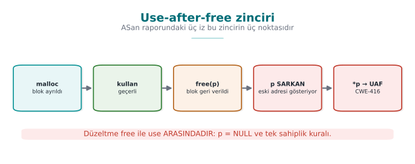

### Hatanın üç adımı

1. Bir nesne öbekte ayrılır ve birden fazla işaretçi onu gösterir.
2. Nesne bir yerde `free` edilir, ama işaretçilerden en az biri hâlâ eski adresi tutar (**askıdaki işaretçi**).
3. Bellek yöneticisi aynı bloğu **başka bir nesneye** verir; askıdaki işaretçi artık o nesnenin verisini okur ya da
   değiştirir.

Nesnenin içinde bir **fonksiyon işaretçisi** varsa (C'de "sanal fonksiyon" benzetimi, C++'ta sanal tablo işaretçisi),
tehlike büyür: program, başka amaçla yazılmış baytları "çağrılacak fonksiyonun adresi" diye yorumlayabilir. Tarayıcı ve
işletim sistemi güncellemelerinde "bellek bozulması düzeltildi" notlarının önemli bir kısmı bu sınıftandır.

### İşlenmiş örnek: aynı bloğun yeniden tahsisi, adım adım

Demo 2'deki `struct session`'ı bayt bayt izleyelim:

```c
struct session {
    void (*action)(void);   /* a function pointer on a 64-bit system: 8 bytes */
    char  role[16];         /* 16 bytes */
};
```

**Boyut hesabı:** 64-bit bir sistemde bir işaretçi 8 bayttır. `8 (action) + 16 (role) = 24 bayt`; 24 zaten 8'in
katı olduğu için derleyicinin araya doldurma (padding) bayt eklemesine gerek yoktur — `sizeof(struct session) ==
24`. Bellekteki yerleşim, ofset cinsinden:

| Ofset (bayt) | Alan | Boyut |
| --- | --- | --- |
| 0–7 | `action` (fonksiyon işaretçisi) | 8 bayt |
| 8–23 | `role` (dize) | 16 bayt |

Şimdi gerçek `uaf.c`'deki `mode_uaf()` fonksiyonunu adım adım izleyelim (satır numaraları dosyadaki gerçek
satırlardır):

```text title="Adım adım: aynı 24 baytlık bloğun yeniden kullanılması (uaf.c)"
1) s = malloc(sizeof *s)              -- uaf.c:32
   Bellek yöneticisi 24 baytlık boş bir blok bulur, diyelim ki A adresinde verir.
   s → A

2) s->action = normal_panel           -- uaf.c:34  → A+0..7  = normal_panel'in adresi
   strcpy(s->role, "user")            -- uaf.c:35  → A+8..12 = 'u','s','e','r','\0'  (A+13..23 eski/rastgele baytlar)

3) free(s)                            -- uaf.c:38
   Bellek yöneticisi A adresindeki bloğu "boş" olarak işaretler. Birçok bellek yöneticisi
   (ör. glibc'nin tcache'i), boş bloğu bir SONRAKİ aynı boyuttaki isteğe hemen verebilmek için
   BOŞ BLOĞUN KENDİ İÇİNE bir "sıradaki boş blok" işaretçisi yazar — yani serbest bırakılan
   bellek SESSİZCE değişir. `s` değişkeni hâlâ A'yı gösterir (derleyici sıfırlamaz) → ASKIDA İŞARETÇİ.

4) fake = malloc(sizeof *s)           -- uaf.c:43
   Bellek yöneticisinden yine 24 bayt istenir. Az önce serbest kalan A boyutta TAM UYUŞTUĞU için,
   çoğu ayırıcı (LIFO / "son giren ilk çıkar" serbest liste ilkesiyle) AYNI A ADRESİNİ geri verir.
   fake → A     (s hâlâ → A: İKİSİ DE AYNI BLOĞU GÖSTERİYOR)

5) fake->action = admin_panel         -- uaf.c:44  → A+0..7  = admin_panel'in adresi  (eski değerin ÜZERİNE yazıldı)
   strcpy(fake->role, "admin")        -- uaf.c:45  → A+8..13 = 'a','d','m','i','n','\0'

6) printf(..., s->role)               -- uaf.c:49
   s hâlâ A'yı gösteriyor; A+8'den okunan bayt dizisi artık "admin"dir (5. adımda fake tarafından
   yazıldı). s'nin kendi verisi hiç değişmedi görünüyor ama fiziksel bellek DEĞİŞTİ → allocator aynı
   A adresini geri VERMEDİĞİ çalıştırmalarda "user" da görülebilir (bkz. §6 sonu, "sonuç değişkendir").

7) s->action()                        -- uaf.c:51
   A+0..7'den okunan işaretçi artık admin_panel'in adresidir (5. adımda üzerine yazıldı) —
   YİNE allocator'ın A'yı geri vermiş olmasına bağlıdır. Program normal_panel()'i DEĞİL,
   admin_panel()'i çağırabilir.
```

Sonuç: `s` işaretçisi bir kez bile değiştirilmedi (hâlâ aynı `A` adresini tutuyor); ama onun **gösterdiği bellek**
başka bir nesne tarafından yeniden kullanıldığı için `s` üzerinden okunan her şey artık o yeni nesnenin verisidir.
Bu, "sahiplik" kuramının (1. hafta) somut bir ihlalidir: `s` ve `fake` aynı bloğun **iki farklı sahibi** gibi
davranmıştır, oysa bir blok **her an tek bir sahibe** ait olmalıdır (MEM30-C).

!!! warning "Adım 6-7'nin sonucu neden çalıştırmadan çalıştırmaya değişebilir"
    Yukarıdaki 6. ve 7. adımlar, bellek ayırıcının `free(s)`'ten sonraki `malloc`'a **gerçekten aynı A adresini**
    geri verdiğini varsayar — bu, LIFO serbest listeli ayırıcılarda (glibc tcache gibi) sık görülen ama C
    standardının **garanti etmediği** bir davranıştır. Derleyici/kütüphane sürümüne göre `fake` farklı bir adres
    alabilir; o durumda `s->role` hâlâ "user" okunur ve `s->action()` hâlâ `normal_panel`'i çağırır — ama okuma
    yine de **askıdaki bir işaretçi üzerinden serbest bırakılmış belleğe erişimdir** (tanımsız davranış), sonucun
    "zararsız görünmesi" onu güvenli yapmaz. ASan bunu, sonuç ne olursa olsun, her zaman yakalar (aşağıdaki rapor).

!!! danger "Sık yapılan hata: `free(p)` sonrası `p`'yi sıfırlamamak"
    `free(s)` çağrısı yalnız bellek yöneticisine "bu bloğu geri alabilirsin" der; `s` değişkeninin **kendisini**
    değiştirmez — `s` hâlâ eski adresi tutar. Bir sonraki satırda yanlışlıkla `s->...` yazan kod, artık **kimin**
    belleğine dokunduğunu bilemez.

!!! success "Kural"
    `free(p)` çağrısından hemen sonra `p = NULL;` yazın (ya da C++'ta akıllı işaretçi kullanıp bu adımı derleyiciye
    bırakın). Sıfırlanmış bir işaretçi üzerinden erişim, sessizce yanlış veriye ulaşmak yerine **hemen** çöker —
    hata erken ve gürültülü biçimde ortaya çıkar, tespiti kolaylaşır.

### Demo 2 — Serbest bırakılmış bellek ve çift serbest bırakma

!!! info "Demo 2 · `code/week-04/02-use-after-free` · CWE-416, CWE-415 · CERT MEM30-C, MEM31-C"
    Programda öbekte tutulan bir "oturum" nesnesi (kullanıcı rolü ve bir fonksiyon işaretçisi) serbest bırakılır ama
    işaretçi sıfırlanmaz. Ardından aynı boyutta ayrılan yeni bir blok, eski oturumun yerini doldurur ve askıdaki
    işaretçi bu yeni veriyi okur: rol değişir, fonksiyon işaretçisi programın **kendi** yönetici panelini çağırır.
    Dışarıdan kod enjekte edilmez; bütün işlem programın kendi belleğinde kalır.

=== "Windows (PowerShell)"

    ```powershell
    cd code\week-04\02-use-after-free
    .\demo.ps1
    ```

=== "WSL / Linux"

    ```bash
    cd code/week-04/02-use-after-free
    sh demo.sh
    ```

| Adım | Hedef | Ne görülür? | Ders |
| --- | --- | --- | --- |
| 1 | `uaf uaf` (korumasız) | `1) Session opened: role=user` sonra `2) Session freed`; adım 3-4'ün sonucu allocator'a bağlıdır (bkz. yukarıdaki uyarı) | UAF = tanımsız davranış, bazen yetki yükseltme |
| 2 | `uaf_asan uaf` | ASan `heap-use-after-free` (ya da Windows'ta `access-violation`) der; bloğun **nerede ayrıldığını, nerede bırakıldığını, nerede kullanıldığını** gösterir | Sanitizer sonuç ne olursa olsun hatayı yakalar |
| 3 | `uaf double` (korumasız) | Çift serbest bırakma; bellek yöneticisi bozulmayı fark edip durur ya da tanımsız davranış | Ayırıcının iç yapısı bozulur |
| 4 | `uaf_asan double` | ASan `attempting double-free` der | — |
| 5 | `uaf_secure` | `free` + `NULL`, tek sahip, tek serbest bırakma noktası | İki hata da biter |

Aşağıdaki animasyonda küçük bir öbeğin (heap) nasıl işlediğini, `free` sonrası bir bloğun serbest listeye nasıl
eklendiğini ve bir sonraki `malloc`'un onu nasıl geri verdiğini (ya da çift serbest bırakmada listenin nasıl
bozulduğunu) adım adım izleyin.

<iframe class="dsanim" src="../anim/use-after-free.html" title="Serbest bellek kullanımı ve çift serbest bırakma" loading="lazy"></iframe>
<div class="dsanim-baski" markdown>

</div>

Örnek seçiciden **normal UAF** (3 gürültü çifti), **zor** (5 gürültü çifti), uç durumlar **yalın mekanizma** (gürültüsüz)
ve **çift serbest bırakma** arasında geçiş yapın — ya da 🎲 ile rastgele bir işlem dizisi üretin.

### ASan raporunu okumak: üç yığın izi

Bir UAF raporunda ASan **üç** konum verir; hatayı düzeltmek için üçü de gereklidir. Gerçek `uaf.c`, ayırma,
serbest bırakma ve kullanımın **üçünü de aynı `mode_uaf()` fonksiyonunda** yapar, bu yüzden üç iz de aynı
fonksiyonu, farklı satırlarda gösterir:

```text
ERROR: AddressSanitizer: heap-use-after-free on address 0x6020000000f0
READ of size 8 ...
    #0 in mode_uaf  uaf.c:49        <- 1. KULLANIM: hatanın görüldüğü yer (s->role okunuyor)
freed by thread T0 here:
    #0 in free
    #1 in mode_uaf  uaf.c:38        <- 2. SERBEST BIRAKMA: sahiplik burada bitti (free(s))
previously allocated by thread T0 here:
    #0 in malloc
    #1 in mode_uaf  uaf.c:32        <- 3. AYIRMA: nesnenin doğduğu yer (s = malloc(...))
```

Çözüm çoğu zaman **2. konumdadır**: nesneyi serbest bırakan kod, diğer işaretçilerin haberdar olmadığı bir sahiplik
kararı vermiştir. (Adres `0x6020000000f0` ve satır numaraları bir örnek çalıştırmadan alınmıştır; gerçek adres her
çalıştırmada ASLR ile değişir, ama satır numaraları `uaf.c`'nin kendisinden sabittir.)

### C++: sahipliği türe yazmak

C'de sahiplik bir **sözleşmedir**; C++'ta ise **türün bir parçası** yapılabilir:

| İhtiyaç | C | C++ |
| --- | --- | --- |
| Tek sahip | Belgeleme + disiplin | `std::unique_ptr<T>`: kopyalanamaz, yalnız taşınır; yıkıcıda serbest bırakır |
| Paylaşılan sahiplik | Başvuru sayacı (elle) | `std::shared_ptr<T>`: son sahip gidince serbest bırakır |
| Sahip olmadan gözlem | Ham işaretçi | `std::weak_ptr<T>`: nesne yok olduysa `lock()` boş döner, askıda kalmaz |
| Dizi | `malloc` + boyut | `std::vector<T>`, `std::array<T,N>` |

```cpp title="Askıda kalan işaretçi yerine weak_ptr"
#include <memory>

struct Session { std::string role; };

std::shared_ptr<Session> active = std::make_shared<Session>(Session{"user"});
std::weak_ptr<Session>   cached = active;      // NOT an owner, only an observer

active.reset();                                // the session ended, the object was destroyed

if (auto s = cached.lock()) {                  // is the object still alive?
    use(*s);
} else {
    /* the object is gone: a dangling pointer never reaches OLD memory */
}
```

!!! warning "Akıllı işaretçiler her şeyi çözmez"
    `unique_ptr::get()` ile alınan ham işaretçi, sahip yok olduktan sonra yine askıda kalır. `std::vector`'a eleman
    eklendiğinde kapasite büyürse, öğelere alınmış bütün işaretçiler ve yineleyiciler geçersizleşir (CERT
    `CTR51-CPP`). Kural aynıdır: **ödünç alınan bir işaretçi, sahibinden uzun yaşayamaz.**

---

## 7. Tamsayılar ve tanımsız davranış (Tarif 3.5)

Basit bir soru: elinizde `INT_MAX` (2.147.483.647, bir `int`in alabileceği en büyük değer) varken buna `1`
eklerseniz ne olur? Sezgi "belki en büyük değerde takılı kalır" ya da "belki bir hata verir" der. Gerçekte C
standardına göre olan şudur: **her şey olabilir** — derleyici bu durumun hiç yaşanmayacağını VARSAYAR ve ona göre
kod üretir. Bu bölümün konusu, C'nin en şaşırtıcı ve en az anlaşılan kavramı olan **tanımsız davranıştır**
(undefined behavior, UB).

[Birinci haftada](../week-1/cen429-week-1.md#16-tamsayilar-ve-isaretli-uzunluk-hatasi) işaretli bir uzunluğun `size_t`'ye dönüşünce dev bir sayıya dönüştüğünü gördük. Bu bölümde tamsayı
hatalarının bütün ailesini derinlemesine işliyoruz.

!!! note "Sezgi: neden 'tanımsız' bu kadar tehlikeli?"
    Sıradan bir hata (ör. bölme sıfıra) genelde **öngörülebilir** bir sonuç verir (çökme, sonsuz değer). Tanımsız
    davranış farklıdır: standart hiçbir garanti **vermez**, bu yüzden derleyici o kod yolunun hiç
    çalışmayacağını varsayıp etrafındaki kodu da buna göre **yeniden düzenleyebilir** — bugünün derleyicisinde
    "zararsız" görünen bir taşma, yarının derleyici sürümünde (ya da yalnızca farklı bir optimizasyon
    düzeyinde) tamamen farklı davranabilir. SEI CERT C'nin `INT` kural ailesi ve UBSan (Bölüm 10) tam olarak bu
    öngörülemezliği ortadan kaldırmak için vardır.

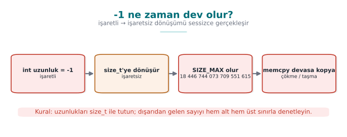

### Dört tamsayı hatası

| Hata | Örnek | Sonuç | CERT |
| --- | --- | --- | --- |
| **İşaretsiz sarma** | `unsigned n = 0; n - 1` → 4.294.967.295 | Tanımlıdır (modüler aritmetik) ama genellikle mantık hatasıdır | INT30-C |
| **İşaretli taşma** | `INT_MAX + 1` | **Tanımsız davranış** | INT32-C |
| **Dönüşüm kaybı** | `int` → `short`, `long long` → `int`, işaretli ↔ işaretsiz | Değer kesilir ya da işareti değişir | INT31-C |
| **Kaydırma hatası** | `1 << 31` (int), `x << 32` | Tanımsız davranış | INT34-C |

Tamsayı hataları çoğu zaman tek başına zararsız görünür; tehlikeleri, bir **boyut hesabına** karıştıklarında ortaya
çıkar:

```c title="Hatalı: çarpım taşar, küçük blok ayrılır"
uint32_t count = read_input();                 /* attacker: 0x40000001 */
uint32_t size = count * sizeof(uint32_t);    /* 0x40000001 * 4 = 4 (wrapped!) */
uint32_t *array = malloc(size);              /* a 4-byte block */
for (uint32_t i = 0; i < count; i++)
    array[i] = read_value();                          /* heap overflow */
```

**Sayısal doğrulama:** `0x40000001` onaltılık, ondalık olarak **1.073.741.825**'tir. `sizeof(uint32_t)` her zaman
4'tür (`uint32_t` = 32 bit = 4 bayt, tanım gereği).

```text title="Çarpımın 32-bit'te sarması, adım adım"
Gerçek çarpım (32-bit sınırı yokmuş gibi) : 1.073.741.825 * 4 = 4.294.967.300
uint32_t'nin sığdırabildiği en büyük değer : 2^32 - 1 = 4.294.967.295
4.294.967.300 sığar mı?                     : HAYIR (5 bayt taşar: 4.294.967.300 - 4.294.967.295 = 5)
32-bit'e sarma (mod 2^32)                   : 4.294.967.300 mod 4.294.967.296 = 4
→ size değişkeninde SAKLANAN değer         : 4  (bayt!)
```

`malloc(4)` çağrısı yalnız **4 baytlık** (bir `uint32_t`'lik) bir blok ayırır. Ama döngü, `count` (1.073.741.825)
kez `array[i] = read_value();` çalıştırır — her biri 4 bayt yazarak toplam `1.073.741.825 * 4 = 4.294.967.300` bayt (≈ 4
GB) yazmaya çalışır, oysa ayrılan blok yalnız 4 bayttır. İlk atamadan (`array[1]`) itibaren **öbek taşması**
başlar ve komşu bellek yapıları (ayırıcının kendi muhasebe bilgisi, başka nesneler) bozulur.

### İşlenmiş örnek: `(int)-1` bir `size_t`'ye dönüşünce

Bu, INT31-C'nin en sık karşılaşılan ve en tehlikeli biçimidir: bir fonksiyon hata durumunda **işaretli** bir `-1`
döndürür, çağıran taraf bunu farkında olmadan **işaretsiz** bir değişkende saklar.

```c title="Klasik hata: -1'in size_t'ye sessizce dönüşmesi"
int compute_length(const char *s) { /* returns -1 on error */ return is_valid(s) ? (int)strlen(s) : -1; }

int n = compute_length(input);
size_t size = n;                 /* if n == -1: CONVERTED, UNCHECKED */
memcpy(dest, src, size);     /* size is now a gigantic number */
```

Dönüşüm iki kavramsal adımda gerçekleşir (C standardının işaretliden işaretsize dönüşüm kuralı):

```text title="(int)-1 → size_t dönüşümü, bit bit"
Adım 1 — -1'in 32-bit int olarak bit deseni (ikinin tümleyeni gösterimi):
    -1  (int, 32 bit)  =  0xFFFFFFFF   (bütün 32 bit '1')

Adım 2 — size_t'ye (64-bit sistemde 8 bayt = 64 bit) atanırken, değer matematiksel olarak
         "hedef türün sığdırabildiği aralığa girene kadar 2^N eklenir" kuralıyla yorumlanır:
    -1 + 2^64 = 2^64 - 1

Adım 3 — 2^64 - 1 sayısal olarak:
    2^64        = 18.446.744.073.709.551.616
    2^64 - 1    = 18.446.744.073.709.551.615   = SIZE_MAX (64-bit sistemde)

Sonuç: size = 18.446.744.073.709.551.615   (yaklaşık 18,4 KATRİLYON gigabayt)
```

`memcpy(dest, src, size)` bu değerle çağrılırsa, işlemci `src` adresinden başlayarak bu kadar bayt okumaya
çalışır; gerçek fiziksel/sanal bellek bu kadar büyük olmadığı için okuma neredeyse anında haritalanmamış bir sayfaya
çarpar ve program **segmentation fault** ile çöker — sıklıkla "rastgele bir yerde çöktü" diye yanlış teşhis edilen,
aslında kaynağı tamamen **belirlenebilir** bir hatadır. **32-bit** bir sistemde (`size_t` 4 bayt) aynı hesap `2^32 −
1 = 4.294.967.295` (≈4,3 milyar) verir; daha küçük ama yine de gerçek bir tamponun boyutunu katbekat aşan bir
sayıdır.

!!! danger "Sık yapılan hata: 'hata kodu -1' ile 'size' aynı değişken ailesinde tutulmak"
    Bir fonksiyonun "hata olursa -1, yoksa uzunluk döner" sözleşmesi, dönüş değeri doğrudan `size_t`/`unsigned` bir
    değişkene atanırsa **sessizce** bir dev sayıya dönüşür. `-Wsign-conversion` (GCC/Clang) ya da `/w44365` (MSVC)
    tam bu satırda uyarır; bu uyarıyı `-Werror` ile hataya çevirmek (Bölüm 0, "Uyarı vs hata") bu sınıfın tamamını
    derleme anında yakalar.

!!! success "Kural"
    Hata kodu her zaman **kendi işaretli türünde** kontrol edilmeli, **işaretsiz bir değişkene atanmadan önce**
    denetlenmelidir: `int n = compute_length(s); if (n < 0) { /* error */ } size_t size = (size_t)n;` — dönüşüm
    yalnız `n`'in negatif olmadığı **kanıtlandıktan sonra** yapılır.

### Sınır değerleri: bir bakışta

Bu haftanın örneklerinde sürekli geçen sınır değerlerini tek tabloda toplayalım; her satır bu bölümdeki bir
hesaplamanın **doğrudan girdisidir**:

| Tür | En küçük değer | En büyük değer |
| --- | --- | --- |
| `int8_t` | −128 | 127 |
| `uint8_t` | 0 | 255 |
| `int16_t` | −32.768 | 32.767 |
| `uint16_t` | 0 | 65.535 |
| `int32_t` (`int`, tipik) | −2.147.483.648 | 2.147.483.647 (`INT_MAX`) |
| `uint32_t` | 0 | 4.294.967.295 |
| `int64_t` | −9.223.372.036.854.775.808 | 9.223.372.036.854.775.807 |
| `uint64_t` / `size_t` (64-bit) | 0 | 18.446.744.073.709.551.615 (`SIZE_MAX`) |

Kuralı ezberlemeyin, **hesaplayın**: `n` bitlik işaretsiz bir tür `0` ile `2ⁿ − 1` arasını, `n` bitlik işaretli bir
tür (ikinin tümleyeni) `−2ⁿ⁻¹` ile `2ⁿ⁻¹ − 1` arasını kapsar. `INT_MAX + 1` neden `INT_MIN`'e sıçrar? Çünkü ikisi de
aynı 32 bitlik "tekerleğin" karşı komşu noktalarıdır — `2³¹ − 1`'in bir fazlası, bit deseni olarak tam `−2³¹`'e karşılık
gelir (aşağıdaki kutuda gösteriliyor).

### Tanımsız davranış nedir?

C standardı bazı işlemler için "bu durumda ne olacağını tanımlamıyorum" der: işaretli tamsayı taşması, sınır dışı
dizi erişimi, NULL işaretçiye erişim, ilklendirilmemiş değişkenin okunması, hizasız erişim ve benzerleri. Bunun
anlamı "program çöker" değildir; **derleyici bu durumun hiç olmayacağını varsayabilir** ve kodu buna göre iyileştirir.

```c title="Derleyici denetimi silebilir"
int add_and_check(int x)
{
    if (x + 100 < x)          /* intended as "if it overflows, the result gets smaller" */
        return -1;            /* but signed overflow is UB: the compiler MAY DELETE this branch */
    return x + 100;
}
```

Programcı taşmayı yakalamak istemiştir; ama işaretli taşma tanımsız olduğu için derleyici "`x + 100 < x` hiçbir zaman
doğru olamaz" diye akıl yürütüp denetimi tamamen kaldırabilir. Aynı kod `-O0`'da "çalışır", `-O2`'de denetim
kaybolur. 1. haftadaki Demo 2'de gördüğümüz "derleyici güvenlik kodunu sildi" durumunun başka bir biçimidir.

**`INT_MAX + 1` neden `INT_MIN`'e sıçrar? Bit deseni ile kanıt:**

```text title="INT_MAX + 1 işleminin bit düzeyinde izlenmesi (32-bit, ikinin tümleyeni)"
INT_MAX (ondalık)         = 2.147.483.647
INT_MAX (bit deseni)      = 0111 1111 1111 1111 1111 1111 1111 1111   (0x7FFFFFFF)

  + 1'i son bite eklemek:  0111 1111 1111 1111 1111 1111 1111 1111
                         +                                        1
                         --------------------------------------------
  Taşan toplam (33 bit)  = 1000 0000 0000 0000 0000 0000 0000 0000   (0x100000000 — 33. bit taşar ve ATILIR)
  Kalan 32 bit            = 1000 0000 0000 0000 0000 0000 0000 0000   (0x80000000)

Bu bit deseni (0x80000000), işaretsiz okunursa 2.147.483.648'dir; ama işaretli (ikinin tümleyeni) olarak
okunduğunda en üst bit (işaret biti) 1 olduğu için NEGATİF bir sayıdır ve tam olarak:
  0x80000000 (işaretli, 32-bit) = -2.147.483.648 = INT_MIN
```

Donanım açısından bakıldığında hiçbir "hata" yoktur: işlemci 33. biti atıp 32 biti aynen sakladı; bu, toplama
donanımının **her zaman** yaptığı şeydir. Sorun, C standardının bu durumu (işaretli tamsayı taşması) "tanımsız"
ilan etmesi ve derleyicinin bu yüzden "asla olmaz" varsayımıyla optimizasyon yapmasıdır — donanım sessizce
`INT_MIN`'e sarsa bile, derleyici taşmanın **hiç gerçekleşmediğini** varsayıp ona dayanan bir denetimi silebilir.

### Doğru denetim: işlemden **önce** ya da taşma bildiren yerleşiklerle

```c title="Taşmayı güvenle denetlemek"
#include <limits.h>
#include <stdbool.h>

/* 1) Compare against the bound before the operation (portable) */
bool safe_add(int a, int b, int *result)
{
    if ((b > 0 && a > INT_MAX - b) || (b < 0 && a < INT_MIN - b))
        return false;
    *result = a + b;
    return true;
}

/* 2) GCC/Clang builtins: return true if it overflows */
bool safe_multiply(size_t a, size_t b, size_t *result)
{
    return !__builtin_mul_overflow(a, b, result);
}
```

C23 standardı aynı işi `ckd_add`, `ckd_sub`, `ckd_mul` (`<stdckdint.h>`) ile taşınabilir hale getirdi. MSVC'de
`<intsafe.h>` içindeki `SizeTMult`, `ULongAdd` gibi fonksiyonlar kullanılabilir. Bellek ayırırken `calloc(count,
size)` ya da `reallocarray` çarpım taşmasını sizin yerinize denetler (1. hafta).

### Demo 3 — Tanımsız davranış ve UBSan

!!! info "Demo 3 · `code/week-04/03-undefined-behavior` · CWE-190, CWE-758 · CERT INT32-C, INT34-C"
    Program üç tanımsız davranışı sırayla dener: işaretli taşma (`INT_MAX + 1`), geçersiz bit kaydırma ve hizasız
    bellek erişimi. x86 işlemcide bunların çoğu sessizce "çalışır" ve yanlış sonuç üretir. **UndefinedBehaviorSanitizer**
    (UBSan, `-fsanitize=undefined`) ile derlenen sürüm, her birini çalışma anında satır numarasıyla bildirir.
    UBSan yalnız GCC ve Clang'de vardır; Windows'ta demo, MSVC'nin `/RTC` ve `/analyze` seçeneklerini ve CERT
    kurallarını anlatır.

=== "Windows (PowerShell)"

    ```powershell
    cd code\week-04\03-undefined-behavior
    .\demo.ps1
    ```

=== "WSL / Linux"

    ```bash
    cd code/week-04/03-undefined-behavior
    sh demo.sh
    ```

UBSan raporu şu biçimdedir: `ub.c:27:15: runtime error: signed integer overflow: 2147483647 + 1 cannot be
represented in type 'int'`. Hatanın **türü**, **yeri** ve **değerleri** tek satırda verilir. UBSan'ın maliyeti
ASan'dan düşüktür; birçok proje test derlemelerinde ikisini birlikte açar.

Aşağıdaki animasyonda `x = INT_MAX` sabitken birçok `add` değeri için denetimsiz toplamanın nasıl sessizce
sardığını, `checked_add`'in aynı taşmayı toplamadan ÖNCE nasıl yakaladığını adım adım izleyin.

<iframe class="dsanim" src="../anim/integer-overflow.html" title="İşaretli tamsayı taşması: INT_MAX + add" loading="lazy"></iframe>
<div class="dsanim-baski" markdown>

</div>

Örnek seçiciden **karışık işaret** (normal), **uç değerler** (zor), uç durumlar **sıfır dahil** ile **güvenli
sürüm aynı karışımı reddediyor** arasında geçiş yapın — ya da 🎲 ile rastgele bir `add` listesi üretin.

!!! tip "Tamsayı hataları için derleyici seçenekleri"
    - `-Wconversion -Wsign-conversion` (GCC/Clang), `/W4` ve `/w44365` (MSVC, C++ kipinde): gizli dönüşümleri gösterir.
    - `-ftrapv`: işaretli taşmada programı durdurur (sürümde performans maliyeti vardır).
    - `-fwrapv`: işaretli taşmayı modüler aritmetik olarak **tanımlar**; UB kaynaklı iyileştirmeleri kapatır ama
      mantık hatasını gizler.
    - `-fsanitize=undefined,integer` (Clang): test derlemelerinde tamsayı hatalarının çoğunu yakalar.

---

## 8. Hata işleme, değişken argümanlar ve sinyaller (Tarif 13.1, 13.4, 13.5)

Bellek hataları kadar sık ama daha az konuşulan üç konu, gerçek zafiyetlerin önemli bir kısmının kaynağıdır.

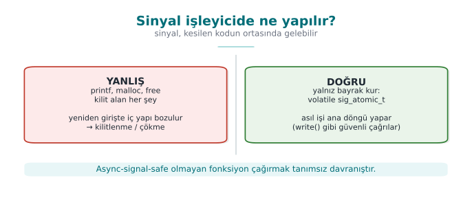

### Hata işleme: dönüş değerini denetlemek ve kapalı kalarak başarısız olmak

C'de hatalar genellikle **dönüş değeriyle** bildirilir ve denetlemek programcıya kalmıştır. Denetlenmeyen bir hata,
programın **yanlış bir varsayımla** devam etmesi demektir:

| Çağrı | Başarısız olursa | Denetlenmezse |
| --- | --- | --- |
| `malloc` | `NULL` | NULL işaretçiye yazma, çökme |
| `setuid` / `setresuid` | `-1` | Program yetkili kalır ama bıraktığını sanır ([1. hafta](../week-1/cen429-week-1.md)) |
| `fopen` | `NULL` | Sonraki `fread` çöker ya da boş veriyle işlem yapılır |
| `RAND_bytes` / `getrandom` | `!= 1` / `-1` | "Rastgele" anahtar sıfırlardan oluşur ([3. hafta](../week-3/cen429-week-3.md)) |
| `EVP_DecryptFinal_ex` | `!= 1` | Kurcalanmış veri doğrulanmış sanılır (3. hafta) |
| `snprintf` | Dönüş ≥ boyut | Çıktı kesilmiştir; yol ya da komut anlamını değiştirebilir |

Kitabın Tarif 13.1'deki öneriler bugün de geçerlidir ve 3. haftadaki "fail-closed" ilkesiyle birleşir:

1. **Her dönüş değerini denetle** (ERR33-C). Denetlemeyeceğiniz bir sonucu `(void)` ile açıkça yok sayın ki
   inceleyen kişi bunun bilinçli olduğunu görsün. GCC/Clang'de fonksiyonlarınıza `__attribute__((warn_unused_result))`,
   C23'te `[[nodiscard]]` ekleyin.
2. **Hata durumunda güvenli duruma dön:** yarım kalan işlemi geri al, sırları sil, kaynakları serbest bırak. C'de tek
   çıkış noktası (`goto temizle`) kalıbı bunu okunaklı yapar.
3. **Hata iletisi saldırgana ipucu vermesin:** kullanıcıya genel bir ileti ("işlem başarısız"), ayrıntıyı güvenli bir
   günlüğe. "Kullanıcı bulunamadı" ile "parola yanlış" ayrı iletiler, kullanıcı adlarının tahmin edilmesine yol açar.

!!! note "Sahada nasıl uygulanır?"
    Hassas bir native kütüphanede fonksiyonlar ayrıntılı hata kodu döndürmez; yalnız "başarılı" ya da "başarısız"
    bilgisini, üstelik **opak** biçimde (düz bir `0`/`1` değil, kolayca tanınıp değiştirilemeyen bir yapı olarak)
    döndürür. Ayrıntılı hata kodu, saldırgana hangi denetimde takıldığını söyleyen bir yol haritası olurdu. Bu
    seçim, 1. haftadaki ödünleşim kaydının bir satırıdır: destek ekibi için tanı ayrı ve güvenli bir kanaldan yapılır.

### Değişken argümanlı fonksiyonlar (Tarif 13.4)

`printf` gibi değişken argüman alan fonksiyonlar, argümanların **sayısını ve türünü bilmez**; bunu çağıranın
sözüne (biçim dizesine) güvenerek öğrenir. Biçim dizesi ile gerçek argümanlar uyuşmazsa sonuç tanımsızdır:

```c
long long big = 5000000000LL;
printf("%d\n", big);            /* type mismatch: should be %lld */
printf("%s\n");                 /* no argument: a random value is read from the stack */
```

Kendi değişken argümanlı fonksiyonunuzu yazmanız gerekiyorsa: argüman sayısını açık bir parametreyle alın ya da
listeyi bir bitiş işaretiyle (`NULL`) kapatın; `va_start`/`va_end` çiftini her yolda eşleştirin; biçim dizesi
kullanıyorsanız 5. bölümdeki `format` özniteliğini ekleyin. C++'ta değişken argüman yerine tür güvenli şablonlar
(`std::format`, değişken şablon parametreleri) tercih edilir.

### Sinyal işleyiciler (Tarif 13.5)

Bir sinyal (ör. `SIGINT`, `SIGTERM`, `SIGALRM`) programın **herhangi bir anında**, hatta bir `malloc` çağrısının
ortasında gelebilir. İşleyici o sırada çalışan kodu keser. İşleyicinin içinde `malloc`, `printf`, `free` gibi
fonksiyonlar çağrılırsa ve kesilen kod da aynı fonksiyonun içindeyse, iç veri yapıları bozulur. Bu, gerçek bir SSH
sunucusu zafiyetinin (2024, "regreSSHion", CVE-2024-6387) de kökenidir: bir zaman aşımı sinyalinin işleyicisi, eşzamansız
güvenli olmayan bir günlük fonksiyonu çağırıyordu.

```c title="Doğru kalıp: işleyici yalnız bayrak kurar"
#include <signal.h>

static volatile sig_atomic_t stop = 0;

static void handler(int sig)
{
    (void)sig;
    stop = 1;                   /* only this: async-signal-safe */
}

int main(void)
{
    struct sigaction sa = {0};
    sa.sa_handler = handler;
    sigemptyset(&sa.sa_mask);
    sigaction(SIGTERM, &sa, NULL);

    while (!stop) {
        /* the real work; cleanup and logging happen outside the loop, in normal flow */
    }
    cleanup_and_exit();
}
```

Kurallar (SIG30-C, SIG31-C): işleyicide yalnız **eşzamansız sinyal güvenli** fonksiyonlar (POSIX listesinde; ör.
`write`, `_exit`) çağrılır; paylaşılan değişkenler `volatile sig_atomic_t` olur; iş, işleyicide değil ana döngüde
yapılır. `signal()` yerine `sigaction()` kullanılır, çünkü `signal()`'in davranışı sistemden sisteme değişir.

!!! question "Değerlendirici nasıl test eder?"
    Statik analizde dönüş değeri kullanılmayan çağrıları listeler; özellikle bellek ayırma, yetki değiştirme, kripto
    ve G/Ç çağrılarına bakar. Hata iletilerini karşılaştırarak hangi denetimde takıldığının dışarıdan anlaşılıp
    anlaşılmadığını sınar. Sinyal işleyicilerin içeriğini okur ve eşzamansız güvenli olmayan çağrı arar.

---

## 9. Statik analiz: kodu çalıştırmadan hata aramak

Sanitizer'lar ve fuzzing hatayı programı **çalıştırarak** bulur; statik analiz ise kaynak kodu **okuyarak**. İkisi
birbirini tamamlar: statik analiz hiç çalıştırılmayan yolları da görür ama yanlış alarm verebilir; dinamik analiz
yalnız çalışan yolları görür ama bulduğu hata kesindir.

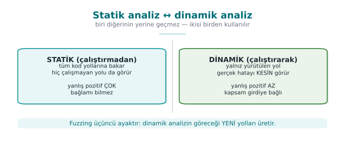

### Katman katman araçlar

| Düzey | Araç | Ne bulur? | Maliyet |
| --- | --- | --- | --- |
| Derleyici uyarıları | `-Wall -Wextra -Wformat=2 -Wconversion -Wshadow` · MSVC `/W4` | Şüpheli dönüşüm, biçim dizesi, kullanılmayan değer | Sıfır: her derlemede |
| Derleyici analizcisi | `gcc -fanalyzer` · `clang --analyze` · MSVC `/analyze` | Yol duyarlı: NULL erişimi, sızıntı, çift serbest bırakma | Düşük |
| Kural denetleyici | `clang-tidy` (`cert-*`, `bugprone-*`), `cppcheck` (`--addon=cert`) | CERT ihlalleri, tehlikeli API'ler | Düşük |
| Anlamsal sorgu | CodeQL, Semgrep | Kaynaktan hedefe veri akışı: "argv'den gelen değer denetimsiz memcpy'ye gidiyor mu?" | Orta |
| Ticari | Coverity, Klocwork, Polyspace | Büyük kod tabanlarında derin analiz, raporlama | Yüksek |

```bash title="Bir C dosyasını birkaç araçla taramak"
gcc -fanalyzer -Wall -Wextra -c parser.c
clang-tidy parser.c -checks='-*,cert-*,bugprone-*,clang-analyzer-security*' -- -I.
cppcheck --enable=warning,portability --addon=cert parser.c
```

### Veri akışı analizi: kaynak → hedef

En değerli statik analiz türü, **kirli veri** (taint) izlemesidir: güvenilmeyen bir **kaynaktan** (argv, dosya, ağ)
gelen bir değerin, doğrulanmadan tehlikeli bir **hedefe** (memcpy uzunluğu, biçim dizesi, `system`, dizi indeksi)
ulaşıp ulaşmadığı sorulur. CodeQL ve Semgrep bu soruyu kod tabanının tamamında sorabilir:

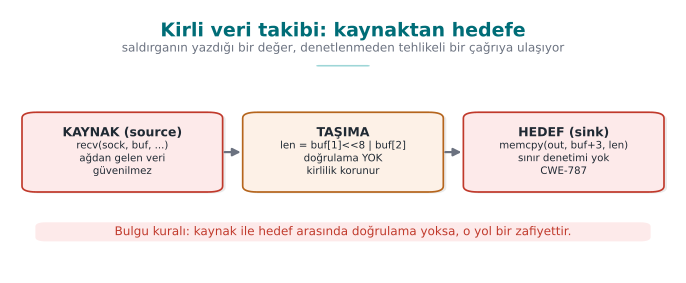

### Yanlış alarmlarla yaşamak

Statik analiz yanlış alarm verir; bunları yönetmek de sürecin bir parçasıdır:

1. **Önce yüksek güvenilirlikli kurallar:** biçim dizesi, tehlikeli fonksiyonlar, NULL erişimi.
2. **Her bastırma gerekçeli olsun:** `// NOLINT(cert-err33-c): dönüş değeri kasıtlı olarak yok sayılıyor, çünkü ...`
   Gerekçesiz bastırma, gelecekteki gerçek hatayı gizler.
3. **Yeni kodda sıfır uyarı:** eski kodun bütün uyarılarını bir günde temizlemek gerçekçi değildir; ama yeni eklenen
   koda uyarı sokulmamasını sürekli entegrasyonda zorlamak mümkündür.

!!! question "Değerlendirici nasıl test eder?"
    Sertifikasyonda kaynak kod incelemesi genellikle bir statik analiz taramasıyla başlar; değerlendirici geliştiricinin
    kendi tarama raporunu da ister. "Aracı çalıştırdık, şu kadar bulgu çıktı, şunları düzelttik, şunlar şu gerekçeyle
    yanlış alarm" diyebilen bir ekip, olgun bir süreç gösterir. Değerlendirici ardından aracın göremediği yerlere —
    özellikle kripto kullanımına ve güvenlik denetimlerinin mantığına — elle bakar.

---

## 10. Sanitizer'lar: hataları çalışma anında yakalamak

Birinci haftada AddressSanitizer'ı ilk kez, bir taşmayı yakalarken kısaca görmüştük
([Hafta 1, §14](../week-1/cen429-week-1.md#14-arabellek-tasmalari-nasil-olusur-nasil-onlenir)). Bu hafta bütün
sanitizer ailesini, ASan'ın iç mekanizmasını (gölge bellek) ve bir raporu satır satır nasıl okuyacağımızı
derinlemesine işliyoruz.

!!! note "Kısa tarihçe: sanitizer'lar"
    **AddressSanitizer (ASan)**, Google mühendisleri tarafından geliştirilip **2012**'de akademik bir bildiride
    (USENIX ATC) ve LLVM/GCC derleyicilerine eklenerek yayımlandı. Ondan önce bellek hatalarını çalışma anında
    yakalamak için kullanılan araçlar (ör. Valgrind) çok daha yavaştı (10–50×); ASan'ın derleyici içine
    gömülü, ~2× yavaşlamayla çalışan tasarımı, sanitizer'ların **her test derlemesinde varsayılan olarak**
    çalıştırılmasını pratik hâle getirdi. UBSan, MSan ve TSan aynı ekibin sonraki yıllarda ürettiği kardeş
    araçlardır.

**Sanitizer**, derleyicinin programa eklediği bir denetim katmanıdır: her bellek erişiminin, her tamsayı işleminin ya
da her iş parçacığı erişiminin geçerli olup olmadığını çalışma anında denetler ve ilk hatada ayrıntılı bir rapor
verir. Statik analizin aksine yanlış alarm neredeyse hiç vermez; ama yalnız **çalıştırılan** kod yolundaki hataları
bulur. Bu yüzden sanitizer'lar testlerle ve fuzzing'le birlikte kullanılır.

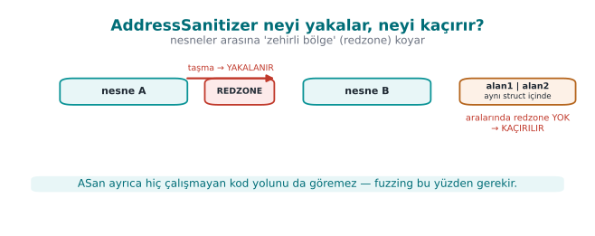

| Sanitizer | Bulduğu | Bayrak (GCC/Clang) | MSVC | Yavaşlama |
| --- | --- | --- | --- | --- |
| **AddressSanitizer (ASan)** | Taşma (yığın, öbek, genel), UAF, çift serbest bırakma, dönüşten sonra kullanma | `-fsanitize=address` | `/fsanitize=address` | ~2× |
| **LeakSanitizer (LSan)** | Bellek sızıntısı | ASan ile birlikte (Linux) | — | Düşük |
| **UndefinedBehaviorSanitizer (UBSan)** | İşaretli taşma, geçersiz kaydırma, NULL erişimi, hizasız erişim, geçersiz enum/bool | `-fsanitize=undefined` | — | Düşük |
| **MemorySanitizer (MSan)** | İlklendirilmemiş bellek okuma | `-fsanitize=memory` (yalnız Clang) | — | ~3× |
| **ThreadSanitizer (TSan)** | Veri yarışları | `-fsanitize=thread` | — | 5–15× |

### ASan nasıl çalışır? Gölge bellek

ASan, programın belleğinin her 8 baytı için 1 baytlık bir **gölge bellek** tutar. Gölge bayt, o 8 baytın ne kadarının
geçerli olduğunu söyler. Her dizinin önüne ve arkasına **koruma bölgesiler** (redzone) konur; serbest bırakılan bloklar
hemen yeniden kullanılmaz, bir süre **karantinada** bekletilir ve zehirli işaretlenir. Derleyici her bellek erişiminden
önce gölge baytı denetleyen birkaç komut ekler. Taşma koruma bölgesiye değdiği, UAF ise karantinadaki bloğa eriştiği
anda yakalanır.

Bu tasarımın bir sonucu, 1. hafta Demo 3'te gördüğümüz sınırlamadır: taşma **aynı yapının içinde** kalırsa (bir
alandan komşu alana), arada koruma bölgesi olmadığı için ASan göremez.

### Pratik kullanım

```bash
# Test build: debug info + frame pointer + two sanitizers
gcc -g -O1 -fno-omit-frame-pointer -fsanitize=address,undefined program.c -o program_test

# To stop at the first UBSan error and get a detailed stack trace
UBSAN_OPTIONS=halt_on_error=1:print_stacktrace=1 ./program_test
ASAN_OPTIONS=detect_leaks=1 ./program_test
```

### Bir UBSan raporunu satır satır okumak

Demo 3'teki `tasma(1)` çağrısı (`INT_MAX + 1`), UBSan ile derlenmiş bir sürümde çalıştırıldığında şuna benzer bir
rapor üretir. Her satırı tek tek okuyalım:

```text title="UBSan raporu, satır satır açıklamalı"
ub.c:24:15: runtime error: signed integer overflow:
            2147483647 + 1 cannot be represented in type 'int'
```

- `ub.c:24:15` → hata **hangi dosyada, hangi satırda, hangi sütunda** oluştu (`ub.c` dosyasının 24. satırı,
  15. karakteri — tam olarak `x + ekle` ifadesinin bulunduğu yer).
- `runtime error:` → bu bir **derleme** hatası değil, programın **çalışırken** yakaladığı bir sorundur.
- `signed integer overflow:` → hatanın **türü**: işaretli tamsayı taşması (INT32-C).
- `2147483647 + 1 cannot be represented in type 'int'` → hatanın **gerçekleştiği andaki değerler**: sol taraf
  (`2147483647` = `INT_MAX`), sağ taraf (`1`), ve hangi türe (`int`) sığmadığı. UBSan bu değerleri size **hesaplamanız
  gerekmeden** verir; Bölüm 7'deki bit deseni hesabını doğrulamak için bu satırı kullanabilirsiniz.

Aynı rapor biçimi diğer UB türleri için de geçerlidir; yalnız orta satır değişir:

```text title="Aynı formatın diğer UB türlerindeki hâli"
ub.c:33:15: runtime error: shift exponent 31 is too large for 32-bit type 'int'
ub.c:43:14: runtime error: load of misaligned address 0x... for type 'int', which requires 4 byte alignment
```

Bir ASan raporunun **hangi satırının ne söylediğini** de aynı disiplinle okuyalım. Demo 5'in `overflow_hardened`
hedefi ASan değil `/GS` (yığın kanary'si) kullanır — bunu az önce §12'de gördük. Ama tam bu tür bir taşma
(`overflow.c`'nin `copy_in`'i) ASan'lı bir derlemede yakalansaydı, rapor şöyle
görünürdü (biçim, Demo 1-4'teki gerçek ASan çıktılarıyla birebir aynıdır):

```text title="ASan tampon taşması raporu, satır satır"
==12345==ERROR: AddressSanitizer: stack-buffer-overflow on address 0x7ffee...
WRITE of size 1 at 0x7ffee... thread T0
    #0 in strcpy
    #1 in copy_in overflow.c:23          <- WHICH LINE: the write happened here
    #2 in main overflow.c:34
```

- `==12345==` → işletim sistemindeki süreç kimliği (PID); birden fazla süreç aynı anda çalışıyorsa raporları
  ayırt etmeye yarar.
- `ERROR: AddressSanitizer: stack-buffer-overflow` → hatanın **sınıfı**: bu bir **yığın** tamponu taşması (öbek
  değil) — `heap-buffer-overflow` ya da `heap-use-after-free` gibi başka sınıflar da aynı biçimde raporlanır (Demo
  4'ün `parser.c`'sinde tam olarak `heap-buffer-overflow` gördünüz).
- `WRITE of size 1` → işlem bir **yazma**ydı (okuma olsaydı `READ` yazardı) ve **1 bayt** genişliğindeydi (`strcpy`
  her seferinde 1 karakter kopyalar).
- `#0`, `#1`, `#2` → **çağrı yığını** (call stack): hata `strcpy`'nin içinde oluştu (`#0`), `strcpy` `copy_in`
  fonksiyonundan (`#1`, `overflow.c:23`) çağrılmıştı, `copy_in` da `main`'den (`#2`, `overflow.c:34`). Kod
  incelemesinde **hangi satıra bakılacağı** neredeyse her zaman `#1` konumundadır — `#0` çoğu zaman kütüphane
  kodudur (`strcpy`), asıl hata çağıran taraftadır.

!!! success "Kural"
    Bir sanitizer raporunu okurken önce **hata sınıfını** (üst satır), sonra **çağıran kodun satırını** (genellikle
    `#1`), en son da varsa **değerleri** (UBSan'da alt satırda) bulun. Bu üçü, hatayı düzeltmek için gereken bütün
    bilgiyi verir — üstelik hatayı **kendiniz** yeniden üretmeye çalışmanıza bile gerek kalmaz.

!!! warning "Sanitizer'lı derleme sürüme gitmez"
    Sanitizer'lar yavaştır, bellek tüketir ve hata ayıklamaya yönelik arayüzler açar. Sürüm derlemesinde **kapalı**
    olmalıdır. Doğru kullanım: sürekli entegrasyonda (CI) her birleştirmede testleri ve kısa bir fuzzing oturumunu
    sanitizer'lı derlemeyle çalıştırmak.

---

## 11. Fuzzing'e giriş

**Fuzzing** (bulanık test), bir programı çok sayıda otomatik üretilmiş, çoğu bozuk girdiyle çalıştırıp çöktüğü ya da
bir sanitizer'ın hata bildirdiği girdileri aramaktır. Kitabın yazıldığı 2003'te fuzzing henüz yaygın değildi; bugün
tarayıcılardan işletim sistemi çekirdeklerine kadar bütün büyük projelerde standart bir güvenlik testidir. Google'ın
açık kaynak projeler için sürdürdüğü OSS-Fuzz hizmeti, yıllar içinde on binlerce hata bulmuştur.

!!! note "Kısa tarihçe: fuzzing"
    - **1990** — Barton Miller ve Wisconsin Üniversitesi'ndeki ekibi, UNIX yardımcı programlarına rastgele
      (bozuk) girdi göndererek ne kadarının çöktüğünü ölçen ilk sistematik çalışmayı yayımlar — "fuzz testing"
      teriminin ve fikrinin akademik kökeni budur.
    - **2013** — Michal Zalewski'nin **AFL**'i (American Fuzzy Lop), kod kapsamına dayalı geri beslemeyi
      erişilebilir, kullanımı kolay bir araca dönüştürüp fuzzing'i "araştırma laboratuvarından" gündelik
      geliştirme sürecine taşır; kısa sürede çok sayıda gerçek dünya zafiyeti bulur.
    - **libFuzzer** (LLVM projesinin bir parçası), AFL'nin coverage-guided yaklaşımını programın kendi süreci
      **içinde** çalışan bir kütüphane hâline getirir (ayrı bir süreç başlatmadan, bu haftaki `fuzz.c`'de
      gördüğümüz `LLVMFuzzerTestOneInput` arayüzüyle), genellikle ASan ile birlikte kullanılır — bu haftanın
      Demo 4'ü tam olarak bu aracı kullanıyor.

### Kapsam güdümlü fuzzing nasıl çalışır?

Modern fuzzer'lar (libFuzzer, AFL++, honggfuzz) rastgele girdi üretmekle kalmaz; programın **hangi kod yollarını**
çalıştırdığını ölçer ve yeni bir yol açan girdileri saklayıp onları değiştirerek devam eder:

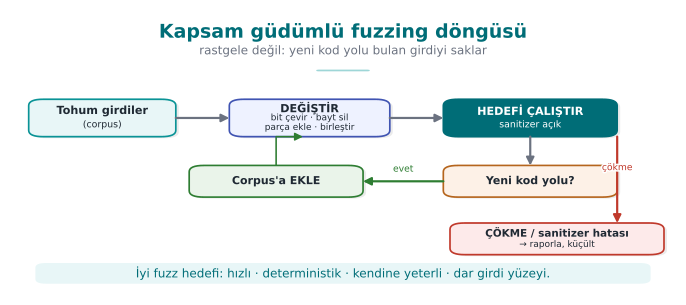

Bu geri besleme sayesinde fuzzer, örneğin bir dosya biçiminin "sihirli baytlarını" ya da bir uzunluk alanının doğru
değerini kendiliğinden bulabilir. Sanitizer'la birlikte kullanıldığında, programın çökmediği ama belleği bozduğu
durumlar da yakalanır.

### Fuzz hedefi (harness) yazmak

libFuzzer'da test edilecek kodu çağıran tek bir fonksiyon yazılır. Fuzzer bu fonksiyonu saniyede binlerce kez, her
seferinde farklı bir bayt dizisiyle çağırır:

```c title="fuzz.c — libFuzzer hedefi"
#include <stddef.h>
#include <stdint.h>
#include "parser.h"

int LLVMFuzzerTestOneInput(const uint8_t *data, size_t size)
{
    parse_document((const unsigned char *)data, size);
    return 0;
}
```

```bash
clang -g -O1 -fsanitize=fuzzer,address fuzz.c parser.c -o fuzz_parser
mkdir -p corpus && cp seeds/*.bin corpus/
./fuzz_parser corpus/ -max_total_time=10     # a session capped at 10 seconds
```

İyi bir hedefin özellikleri: **hızlıdır** (ağ, disk, `sleep` yok), **deterministiktir** (aynı girdi hep aynı sonucu
verir), **durum bırakmaz** (her çağrı bağımsızdır) ve **bir işi test eder** (her ayrıştırıcıya ayrı hedef).

### Demo 4 — Fuzzing ile hata bulmak

!!! info "Demo 4 · `code/week-04/04-fuzzing` · CWE-125, CWE-787 · Tarif 3.1"
    Küçük bir ayrıştırıcı `[tür][uzunluk][veri…]` biçimli kayıtları okur ama uzunluk alanını gelen veriyle
    karşılaştırmaz. libFuzzer, kod kapsamını izleyerek çökerten girdiyi en fazla 10 saniyede bulur; ASan hatayı tam
    yerinde raporlar. Ardından düzeltilmiş ayrıştırıcı aynı süre fuzzlanır ve hata üretilemez. Fuzzing her zaman süre
    sınırlıdır ve çıktılar yalnız demo klasöründeki `fuzz-out/` altına yazılır.

=== "Windows (PowerShell)"

    ```powershell
    cd code\week-04\04-fuzzing
    .\demo.ps1
    ```

=== "WSL / Linux"

    ```bash
    cd code/week-04/04-fuzzing
    sh demo.sh
    ```

| Adım | Ne olur? |
| --- | --- |
| 1 | Normal girdi (`seeds/normal.bin`) sorunsuz ayrıştırılır |
| 2 | Hatalı ayrıştırıcı libFuzzer ile fuzzlanır; çökerten girdi bulunur |
| 3 | Bulunan girdi ASan'lı sürümle yeniden oynatılır; tam hata raporu |
| 4 | Düzeltilmiş ayrıştırıcı aynı süre fuzzlanır; çökme yok |
| 5 | Düzeltilmiş sürüm `seeds/crash.bin` dosyasını güvenle reddeder |

Önce, ayrıştırıcının kendisinin girdiyi nasıl **doğruladığını** (ya da hatalı sürümde doğrulamadığını) bayt bayt
görelim — bu, fuzzer'ın bulduğu şeyin NEDEN tehlikeli olduğunu netleştirir:

<iframe class="dsanim" src="../anim/input-validation.html" title="Girdi doğrulama: izin listesi ayrıştırıcı" loading="lazy"></iframe>
<div class="dsanim-baski" markdown>

</div>

Örnek seçiciden **10 iyi biçimli kayıt** (normal), **karışık** (zor), uç durumlar **hepsi bozuk** ile **güvenli
sürüm aynı karışımı işliyor** arasında geçiş yapın.

Şimdi de fuzzer'ın kendisini — kapsam güdümlü döngüyü — izleyelim: her aday girdi çalıştırılır, kapsamı ölçülür,
yeni bir bölge açtıysa korunur, açmadıysa atılır; bir çökme bulunduğunda oturum durur.

<iframe class="dsanim" src="../anim/fuzzing-loop.html" title="Kapsam güdümlü fuzzing döngüsü" loading="lazy"></iframe>
<div class="dsanim-baski" markdown>

</div>

Örnek seçiciden **normal** (9. adayda çökme), **zor** (daha uzun oturum), uç durumlar **ilk adayda hemen çökme**
ile **çökme hiç bulunamıyor** arasında geçiş yapın — ya da 🎲 ile rastgele bir aday listesi üretin.

Clang kurulu değilse (Ubuntu 20.04'te `sudo apt install -y clang`), CMake libFuzzer hedeflerini atlar ve demo hatayı
yine ASan'lı yeniden oynatıcıyla gösterir. Windows'ta libFuzzer, Visual Studio'nun `/fsanitize=fuzzer` desteğiyle
çalışır.

!!! tip "Fuzzing'i projenize eklemek"
    Projenizde dışarıdan veri okuyan her fonksiyon (dosya ayrıştırıcı, ağ iletisi çözücü, yapılandırma okuyucu) bir
    fuzz hedefi adayıdır. Güvenlik kılavuzunuzun doğrulama bölümüne "şu fonksiyon şu süre sanitizer'la fuzzlandı,
    şu kadar kod kapsamına ulaşıldı, şu hatalar bulunup düzeltildi" satırını eklemek, değerlendirici için güçlü bir
    kanıttır.

!!! danger "Sık yapılan hata: fuzzer'ı sanitizer'sız çalıştırmak"
    Fuzzer yalnız **çökmeyi** arar; sanitizer olmadan derlenmiş bir hedefte, Bölüm 3'teki `read_record` gibi bir sınır
    dışı okuma çoğu zaman **çökmeden** geçer (okunan bayt tesadüfen haritalı bir sayfadaysa). Fuzzing'in değeri,
    ASan/UBSan ile **birlikte** derlenmiş bir hedefte katlanır: sanitizer, çökmeyen ama belleği bozan girdiyi de
    yakalar.

!!! success "Kural"
    Fuzz hedeflerinizi her zaman `-fsanitize=fuzzer,address,undefined` ile birlikte derleyin (Bölüm 10'daki
    sanitizer'ları fuzzer'la aynı binary'de birleştirin); yalnız `-fsanitize=fuzzer` ile derlenmiş bir hedef, hataların
    önemli bir kısmını gözden kaçırır.

---

## 12. Derleyici ve işletim sistemi korumaları

Birinci haftada "Taşmayı kim yakalar?" bölümünde bu korumaların listesini kısaca görmüştük
([Hafta 1, §14](../week-1/cen429-week-1.md#14-arabellek-tasmalari-nasil-olusur-nasil-onlenir)); bu hafta her
birinin iç mekanizmasını, neyi durdurup neyi durdurmadığını tek tek açıyoruz. Güvenli kodlama hataları **önler**;
derleyici ve işletim sistemi korumaları ise bir hata kaçtığında **sömürülmesini zorlaştırır**. Kitap bunlardan
yalnız yığın koruyucuyu (StackGuard, ProPolice, MSVC `/GS`) anar (Tarif 3.3); ASLR, DEP/NX, RELRO ve kontrol akışı
bütünlüğü kitabın yazılmasından sonra yaygınlaştı.

!!! note "Kısa tarihçe: her koruma ne zaman geldi?"
    - **1998** — Crispin Cowan'ın **StackGuard**'ı, dönüş adresinin önüne bir "kanarya" değeri koyup fonksiyon
      dönüşünde denetleyen ilk yaygın derleyici korumasıydı; IBM'in **ProPolice**'i (2000 civarı) ve sonradan
      GCC/Clang'in yerleşik `-fstack-protector`'ı aynı fikri geliştirdi.
    - **2001** — PaX projesi, Linux çekirdeğine **ASLR**'ı (adres uzayı düzeni rastgeleleştirmesi) ve donanım
      desteği olmayan sistemlerde bile veri sayfalarını çalıştırılamaz yapan bir NX benzetimini getirdi.
    - **2003–2004** — OpenBSD'nin **W^X** ilkesi (bir bellek sayfası ya yazılabilir ya çalıştırılabilir, ikisi
      birden değil, 2003) ve Windows XP SP2'nin **DEP**'i (2004, çoğu modern işlemcinin donanım NX bitini
      kullanarak) bu korumayı ana akım işletim sistemlerine taşıdı.

    Bu üç dalga da aynı örüntüyü izler: önce bir araştırma/açık kaynak projesi fikri kanıtlar, sonra ana akım
    derleyiciler ve işletim sistemleri bunu **varsayılan** yapar — [1. bölümde](#1-kod-saglamlastirma-nedir)
    gördüğümüz savunma yarışının somut kilometre taşlarıdır.

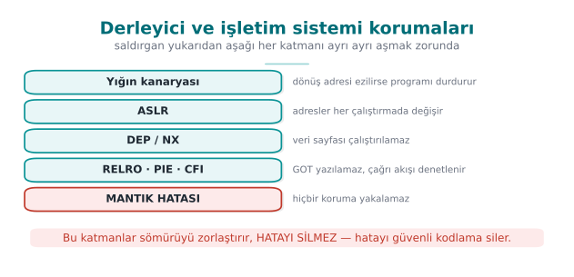

Bu katmanlar **sömürüyü zorlaştırır, hatayı silmez**. Hatanın kendisi ancak 3–8. bölümlerdeki güvenli kodlamayla
ortadan kalkar.

### Korumalar ve bayraklar

| Koruma | Ne yapar? | GCC/Clang (Linux) | MSVC (Windows) |
| --- | --- | --- | --- |
| **Yığın koruyucu (kanarya)** | Dönüş adresinin önüne rastgele bir değer koyar; fonksiyon dönerken bozulmuşsa programı durdurur | `-fstack-protector-strong` | `/GS` (varsayılan) |
| **`_FORTIFY_SOURCE`** | Boyutu derleme anında bilinen tamponlara yazan kütüphane çağrılarını denetler (`memcpy`, `strcpy`, `sprintf`…) | `-D_FORTIFY_SOURCE=2` (ya da `3`) + `-O1` ve üstü | Güvenli CRT (`_s` fonksiyonları) |
| **PIE + ASLR** | Programın ve kütüphanelerin adreslerini her çalıştırmada değiştirir | `-fPIE -pie` | `/DYNAMICBASE /HIGHENTROPYVA` |
| **DEP / NX** | Veri sayfalarında (yığın, öbek) kod çalıştırmayı yasaklar | Varsayılan | `/NXCOMPAT` (varsayılan) |
| **RELRO** | Dinamik bağlama tablolarını (GOT) başlangıçtan sonra salt okunur yapar | `-Wl,-z,relro,-z,now` | — |
| **Kontrol akışı bütünlüğü** | Dolaylı çağrı ve dönüşlerin yalnız geçerli hedeflere gitmesini sağlar | `-fcf-protection` (Intel CET), `-fsanitize=cfi` (Clang) | `/guard:cf` (CFG), `/CETCOMPAT` |
| **SafeStack / gölge yığın** | Dönüş adreslerini ayrı, korumalı bir yığında tutar | `-fsanitize=safe-stack` (Clang), donanım gölge yığını | CET gölge yığını |

### Her koruma neyi durdurur, neyi durdurmaz?

| Koruma | Durdurur | Durdurmaz |
| --- | --- | --- |
| Kanarya | Dönüş adresine ulaşan ardışık yığın taşması | Kanaryadan önceki yerel değişkenlerin bozulması; öbek taşması; bilgi sızıntısıyla okunan kanarya |
| `_FORTIFY_SOURCE` | Boyutu bilinen tampona fazla yazan kütüphane çağrıları | Kendi yazdığınız döngüler; boyutu bilinmeyen tamponlar |
| ASLR | Sabit adres varsayımına dayanan saldırılar | Bir adresin sızdırıldığı durumlar (biçim dizesi açığı!) |
| NX | Veri bölgesine yerleştirilen kodun çalıştırılması | Programın **kendi** kodunun parçalarını yeniden kullanan saldırılar |
| CFI / CFG | Dolaylı çağrının geçersiz bir hedefe gitmesi | Geçerli hedefler arasında yanlış olana gitme; veri bozulması |

Tablonun son sütunu önemlidir: her koruma bir **saldırı tekniğini** zorlaştırır, **hata sınıfını** ortadan kaldırmaz.
Korumalar birbirini tamamlar; örneğin ASLR bir bilgi sızıntısıyla zayıflar, bu yüzden biçim dizesi açığı gibi
"yalnız okuyan" hatalar da ciddiye alınır. Ve hiçbir koruma, mantık hatasını (1. hafta Demo 3'teki yetki bayrağının
bozulması gibi) durdurmaz.

### Her korumayı tek tek açalım

Yukarıdaki tablo özet niyetinedir; altı korumanın her biri farklı bir **fiziksel mekanizmayla** çalışır ve farklı
bir saldırı sınıfını hedefler. Birini diğerinin yerine koymak (ör. "ASLR açık, kanaryaya gerek yok" demek) yanlıştır
— aşağıda her biri ayrı ayrı açılıyor.

**Yığın kanaryası (stack canary) — bellek düzeyinde ne olur?**

Demo 5'teki `overflow.c`'yi ele alalım: `char buffer[64]; strcpy(buffer, input);`. Koruma **açık** (`overflow_hardened`)
derlendiğinde, derleyici yığın çerçevesine şu sırayla (adresler yüksekten düşüğe doğru, yığının büyüme yönünde)
ek bir alan **kendiliğinden** ekler:

```text title="Korumalı bir yığın çerçevesinin düzeni (kavramsal, yüksek adresten düşüğe)"
[ dönüş adresi          ]  ← fonksiyon bitince buraya dönülür (8 bayt, 64-bit'te)
[ kaydedilmiş çerçeve    ]  ← çağıranın çerçeve işaretçisi (8 bayt)
[ K A N A R Y A          ]  ← fonksiyon GİRİŞİNDE yazılan, fonksiyon ÇIKIŞINDA denetlenen değer (8 bayt, 64-bit'te)
[ buffer[64]             ]  ← strcpy'nin yazdığı yer; TAŞMA BURADAN YUKARI DOĞRU BÜYÜR
```

Fonksiyona girerken derleyicinin eklediği kod, işletim sisteminin süreç başlatırken bir kere ürettiği **rastgele**
bir değeri (glibc'de `__stack_chk_guard`, genellikle `/dev/urandom`'dan) kanarya hücresine kopyalar. Fonksiyon
dönmeden hemen önce, derleyicinin eklediği **ikinci** bir kod parçası bu hücredeki değeri tekrar okur ve
başlangıçtaki değerle **karşılaştırır**:

```text title="strcpy(buffer, input) 80 karakterlik bir girdiyle çağrılırsa"
buffer'ın kapasitesi        : 64 bayt
input'un uzunluğu           : 80 bayt (+ sonlandırıcı)
Taşan miktar                : 80 - 64 = 16 bayt
İlk 64 bayt                 : buffer'ı doldurur (amaçlanan)
Sonraki 8 bayt (65-72)      : KANARYA hücresinin üzerine yazılır → kanarya BOZULUR
Kalan bayt(lar)             : kaydedilmiş çerçeveye/dönüş adresine doğru ilerler

Fonksiyon dönerken denetim: okunan_kanarya == baslangictaki_kanarya ?
   HAYIR → __stack_chk_fail() çağrılır → "*** stack smashing detected ***" → abort()
```

Koruma **kapalıyken** (`overflow_weak`) bu ek alan ve karşılaştırma hiç yoktur; aynı 80 baytlık girdi doğrudan
kaydedilmiş çerçevenin ve dönüş adresinin üzerine yazılır — program ya rastgele bir adrese "döner" (çoğunlukla
geçersiz, çöker) ya da bellek sessizce bozulmuş halde çalışmaya devam eder.

**Neden tek başına yetmez? Üç somut sınır:**

1. **Kanaryadan önceki değişkenler korunmaz.** Derleyici tamponları kanaryaya **yakın** yerleştirmeye çalışır ama
   aynı çerçevede kanaryanın **uzağında**, tampondan **önce** duran bir yerel değişken varsa (`-fstack-protector`
   her zaman tüm değişkenleri yeniden sıralamaz), o değişken taşmadan etkilenebilir ve kanarya hiç bozulmadan
   fonksiyon "normal" döner.
2. **Öbek (heap) hiç korunmaz.** Kanarya yalnız **yığın** çerçevelerinde vardır; Demo 2'deki `malloc`'lu `struct
   session` gibi öbek nesnelerinin böyle bir koruması yoktur.
3. **Kanaryanın kendisi sızdırılabilirse koruma anlamsızlaşır.** Bu, bu hafta içindeki en önemli bağlantılardan
   biridir: Bölüm 5'teki biçim dizesi açığı, `%x` ile yığındaki **herhangi bir** 8 baytı okuyabilir — kanarya da bu
   sekiz baytlardan biridir. Saldırgan önce sızıntıyla kanaryanın **gerçek değerini öğrenir**, sonra taşmayı o
   öğrendiği değeri **aynen** yazacak şekilde kurgular; karşılaştırma `==` çıkar ve koruma hiç tetiklenmez. Kanarya
   ile biçim dizesi açığı arasındaki bu bağ, neden "bir koruma tek başına yeterli değildir" ilkesinin (1. hafta
   savunma derinliği) somut bir örneğidir.

**ASLR (Address Space Layout Randomization) — ne rastgeleleştirir, ne rastgeleleştirmez?**

ASLR, programın kod bölgesinin, yığınının, öbeğinin ve paylaşılan kütüphanelerin **başlangıç adreslerini** her
çalıştırmada değiştirir (işletim sistemi tarafından, süreç başlatılırken). **Engellediği:** saldırganın "dönüş
adresini şu sabit adrese yazayım" gibi **sabit adres varsayımına dayanan** bir saldırı kurgulamasını — adres her
çalıştırmada farklı olduğu için sabit bir değer bir sonraki çalıştırmada işe yaramaz. **Engellemediği:** (a) bir
bilgi sızıntısı (ör. biçim dizesi açığı, bir işaretçinin ekrana yanlışlıkla yazdırılması) **gerçek** bir adresi
açığa çıkarırsa, o adresten geri kalan adresler **hesaplanabilir** hale gelir (kütüphaneler genelde birbirine göre
sabit ofsetlerde yüklenir); (b) 32-bit sistemlerde adres uzayı küçük olduğu için rastgelelik "entropi" azdır ve
kaba kuvvetle denenebilir; (c) mantık hatalarını hiç etkilemez.

**DEP / NX (veri yürütme engeli) — ne engeller, ne engellemez?**

İşlemcinin bellek yönetim birimi, her bellek sayfasını "çalıştırılabilir" ya da "çalıştırılamaz" diye
işaretleyebilir. DEP/NX, yığın ve öbek gibi **veri** sayfalarını çalıştırılamaz yapar. **Engellediği:** saldırganın
tampona kendi makine kodunu (kabuk kodu) yazıp doğrudan oraya atlamasını — böyle bir atlama artık işlemci tarafından
**reddedilir**. **Engellemediği:** saldırgan kendi kodunu yazmak yerine, programın **zaten çalıştırılabilir** olan
kendi kod bölgesindeki mevcut parçaları (fonksiyonları, komut dizilerini) art arda **zincirleyerek** çağırırsa
(ROP/JOP olarak bilinen teknik ailesi), hiçbir yeni "veri sayfasında kod çalıştırma" olmadığı için DEP/NX bunu
göremez — bu yüzden CFI/CFG gibi ek bir katman gerekir.

**RELRO (Relocation Read-Only) — ne engeller, ne engellemez?**

Dinamik bağlanan bir program, dışarıdan çağırdığı fonksiyonların (ör. `printf`, `malloc`) gerçek adreslerini bir
tabloda (GOT — Global Offset Table) tutar; bu tablo normalde **yazılabilirdir** çünkü bazı adresler ilk çağrıya
kadar "tembel" doldurulur. Tam RELRO (`-z relro -z now`), programın bütün dış fonksiyon adreslerini **başlangıçta**
çözer ve ardından bu tabloyu **salt okunur** yapar. **Engellediği:** bir bellek yazma hatasından yararlanıp GOT
tablosundaki bir girdiyi (ör. `free`'nin adresini) saldırganın seçtiği bir adrese **değiştirmeyi**. **Engellemediği:**
programın **kendi** yığın/öbek değişkenlerindeki bozulmaları; GOT dışındaki hiçbir yapıyı korumaz.

**PIE (Position-Independent Executable) — ASLR'nin ön koşulu**

PIE, programın **kendi kodunun** da (yalnız paylaşılan kütüphanelerin değil) her adreste çalışabilecek şekilde
derlenmesidir. **Engellediği/sağladığı:** PIE olmadan derlenmiş bir programın **kendi** kod bölgesi her zaman
**aynı sabit adrestedir** — ASLR kütüphaneleri rastgeleleştirse bile, programın kendi kodu hâlâ tahmin edilebilir
kalır. PIE bu boşluğu kapatır. **Engellemediği:** PIE tek başına bir bellek hatasını önlemez; yalnız ASLR'nin
**kapsamını** programın kendi koduna genişletir — PIE'siz bir ASLR, "yarım" bir korumadır.

**CFI / CFG (Control-Flow Integrity / Guard) — ne engeller, ne engellemez?**

Bir fonksiyon işaretçisi ya da C++ sanal fonksiyon çağrısı gibi **dolaylı** bir çağrı yapıldığında, CFI/CFG çalışma
anında "bu hedef, derleme anında belirlenmiş **geçerli hedefler kümesinin** içinde mi?" diye denetler. **Engellediği:**
tam olarak Bölüm 6'daki UAF örneğindeki gibi, bozulmuş bir fonksiyon işaretçisinin **tamamen** rastgele/saldırgan
seçimli bir adrese atlamasını — geçerli hedef kümesi dışına atlama tespit edilip program durdurulur. **Engellemediği:**
saldırganın, **geçerli hedefler arasından** yanlış ama izinli birini seçmesini (ör. programın kendi içindeki başka
bir fonksiyona atlamak, o da CFI kümesindeyse durdurulmaz); ayrıca fonksiyon işaretçisi **dışındaki** veri
bozulmalarını (ör. bir yetki bayrağının değiştirilmesi, 1. hafta Demo 3) hiç görmez.

!!! danger "Sık yapılan hata: 'ASLR açık, güvendeyiz' demek"
    Bir koruma tablosunda tek bir korumanın "açık" olması, sistemin güvenli olduğu anlamına gelmez. Sahada bir binary
    dosya incelemesi **hepsini birlikte** ister: kanarya + FORTIFY + PIE/ASLR + NX + RELRO + CFI. Bunlardan biri
    eksikse, diğerleri o eksik halkanın açtığı yoldan **dolaylı** olarak atlatılabilir (ör. RELRO yoksa, ASLR açık
    olsa bile GOT üzerinden dolaylı çağrı ele geçirilebilir).

!!! success "Kural"
    Koruma tablosunu okurken her satırı "ne engelliyor" **ve** "ne engellemiyor" diye iki sütunlu okuyun (yukarıdaki
    tablo gibi). "Bu koruma açık, dolayısıyla güvenliyiz" cümlesi yanlıştır; doğru cümle "bu koruma **şu** saldırı
    tekniğini zorlaştırıyor, **şu** hata sınıfını hâlâ durdurmuyor"dur.

### Demo 5 — Korumaları açıp kapatmak

!!! info "Demo 5 · `code/week-04/05-compiler-protections` · CWE-121 · Tarif 3.3"
    Aynı taşma hatası iki kez derlenir: korumalar **kapalı** (`overflow_weak`) ve **açık** (`overflow_hardened`). Uzun bir girdi
    64 baytlık tamponu taşırdığında sert sürümde kanarya bozulur ve program güvenli biçimde durur; zayıf sürümde taşma
    sessizce belleği bozar ya da program çöker. Sonra iki binary dosyadaki korumalar bir betikle denetlenir: Linux'ta
    `readelf`, Windows'ta `dumpbin` (Developer PowerShell gerekmez).

=== "Windows (PowerShell)"

    ```powershell
    cd code\week-04\05-compiler-protections
    .\demo.ps1
    ```

=== "WSL / Linux"

    ```bash
    cd code/week-04/05-compiler-protections
    sh demo.sh
    ```

Sert sürümde görülen ileti, korumanın **çalıştığının** kanıtıdır: Linux'ta `*** stack smashing detected ***:
terminated`, Windows'ta `0xC0000409` (yığın tamponu taşması) çıkış kodu. Program çökmüştür; ama akış
ele geçirilmemiştir.

Aşağıdaki animasyonda `strcpy`'nin taşan bir girdiyle `buffer[64]`'ü doldurup KANARYA'ya, sonra kaydedilmiş
çerçeveye ve dönüş adresine nasıl ulaştığını — ve sert sürümde kanaryanın bunu nasıl yakaladığını — adım adım
izleyin.

<iframe class="dsanim" src="../anim/compiler-protections.html" title="Yığın kanaryası: buffer[64] taştığında ne olur?" loading="lazy"></iframe>
<div class="dsanim-baski" markdown>

</div>

Örnek seçiciden **uyar** (taşma yok), **sert sürüm kanaryayı yakalıyor** (zor), uç durumlar **zayıf sürümde
kanarya yok**, **tam 64 karakter** ile **dönüş adresine kadar ilerliyor** arasında geçiş yapın.

### Bir binary dosyanın korumalarını denetlemek

=== "Linux"

    ```bash
    readelf -h prog | grep Type                 # DYN = PIE, EXEC = not PIE
    readelf -l prog | grep -A1 GNU_STACK        # RW = NX on, RWE = off
    readelf -l prog | grep GNU_RELRO            # is RELRO present?
    readelf -d prog | grep BIND_NOW             # full RELRO
    readelf -s prog | grep __stack_chk_fail     # canary in use
    ```

    `checksec` betiği (`checksec --file=prog`) bunların hepsini tek tabloda gösterir.

=== "Windows"

    ```powershell
    dumpbin /headers prog.exe | Select-String "Dynamic base|NX compatible|Guard|High Entropy"
    ```

    `DLL characteristics` satırında `Dynamic base` (ASLR), `NX compatible` (DEP), `Guard` (CFG) ve
    `High Entropy Virtual Addresses` görülmelidir.

!!! tip "Önerilen sürüm bayrakları"
    **GCC/Clang:** `-O2 -D_FORTIFY_SOURCE=2 -fstack-protector-strong -fPIE -pie -Wl,-z,relro,-z,now
    -fcf-protection -Wall -Wextra -Wformat=2 -Werror=format-security`. **MSVC:** `/O2 /GS /sdl /guard:cf
    /DYNAMICBASE /HIGHENTROPYVA /NXCOMPAT /CETCOMPAT /W4`. Dersin demolarında bu bayrakların çoğu (kanarya, FORTIFY, PIE, tam RELRO;
    Windows'ta `/GS`, `/guard:cf`, ASLR, DEP) Demo 5'in `overflow_hardened` hedefinde açıktır; kendi projenizin `CMakeLists.txt` dosyasına bunları siz eklersiniz. OpenSSF'nin "Compiler Options Hardening Guide for C and C++"
    belgesi güncel listeyi tutar.

!!! question "Değerlendirici nasıl test eder?"
    Dağıtılan her binary dosya ve paylaşılan kütüphane için koruma tablosunu çıkarır (`checksec`, `dumpbin`, mobilde
    APK içindeki `.so` dosyaları için `readelf`). Kapalı bir koruma bulgu olarak yazılır; gerekçesi (ör. performans,
    eski platform desteği) ödünleşim kaydında bulunmalıdır. Ayrıca işletim sisteminin korumalarının açık olduğunu
    uygulamanın kendisinin denetleyip denetlemediğini sorar; bu da kart şeması gereksinimlerinden biridir.

---

## 13. Güvenli derleme hattı: hepsini sürekli entegrasyonda birleştirmek

Bu haftanın bütün araçları, bir kez elle çalıştırıldığında değil, **her değişiklikte otomatik** çalıştığında değer
kazanır. Bir güvenlik hatası çoğu zaman, önceden doğru olan bir kodun küçük bir değişiklikle bozulmasıyla ortaya
çıkar. Sürekli entegrasyon (CI) hattı bu gerilemeyi yakalamanın yoludur.

### Örnek bir hat

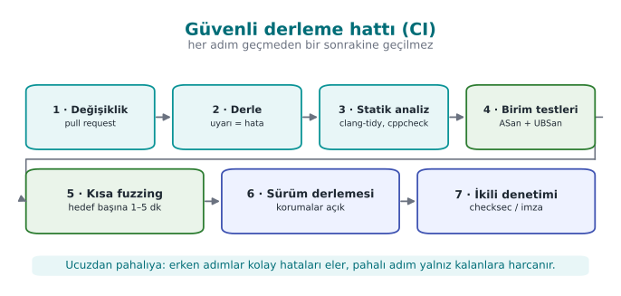

| Aşama | Başarısızlık ölçütü |
| --- | --- |
| Derleme | Tek bir uyarı (`-Werror` / `/WX`) |
| Statik analiz | Yeni bir yüksek önem dereceli bulgu |
| Sanitizer'lı testler | Herhangi bir sanitizer raporu |
| Fuzzing | Yeni bir çökme; ayrıca daha önce bulunmuş girdiler (corpus) **regresyon testi** olarak her seferinde çalışır |
| Sürüm derlemesi | Bir koruma bayrağının kapanması |
| Binary denetimi | `strings` çıktısında günlük dizesi ya da yasaklı bir sabit; sembol tablosunun silinmemiş olması |

!!! tip "Fuzzing'in bulduğu her girdi bir testtir"
    Fuzzer'ın bulduğu çökerten girdi, hata düzeltildikten sonra silinmez; `tests/regresyon/` gibi bir klasöre konur
    ve her derlemede çalıştırılır. Böylece aynı hata bir daha kod tabanına giremez.

### Dersin CMake yapısında kipler

Dersin demo altyapısı (`code/cmake/cen429.cmake`) aynı kaynak dosyayı farklı kiplerde derleyerek bu hattın küçük bir
modelini sunar. Dikkat: kipler kaynak kodu ve birkaç bayrağı değiştirir; sürüm koruma bayraklarının çoğu
yalnız Demo 5'in `overflow_hardened` hedefinde açıktır:

| Kip | Amaç | Bayraklar (özet) |
| --- | --- | --- |
| `korumasiz` | Hatayı "çıplak" göstermek | İyileştirme kapalı (`-O0` / `/Od`) |
| `optimize` | Derleyici iyileştirmesinin etkisini göstermek ([1. hafta](../week-1/cen429-week-1.md) Demo 2) | `-O2` / `/O2` |
| `asan` | Bellek hatalarını yakalamak | `-O1 -fsanitize=address` / `/fsanitize=address`; Linux'ta FORTIFY kapatılır ki yalnız ASan görülsün |
| `denetimli` | Kütüphanenin çalışma anı denetimleri | `-O2 -D_FORTIFY_SOURCE=2` (Windows'ta `KUTUPHANE_DENETIMI` tanımı) |
| `guvenli` | Düzeltilmiş kaynak kod | `-O2` / `/O2`; asıl fark kodun kendisindedir |

Projenizde de benzer bir ayrım kurun: günlük geliştirme için hata ayıklama + sanitizer, CI için sanitizer + fuzzing,
sürüm için korumalar açık ve günlük kapalı.

### Tedarik zinciri: derleme ortamının kendisi

İkinci haftada gördüğümüz gibi, saldırgan bazen kodu değil **derleme ortamını** hedef alır. Derleme hattının güvenliği için:

- Derleme sunucusuna erişim sınırlı ve kayıt altında olmalı.
- Bağımlılıklar sürüm ve özet değeriyle sabitlenmeli ([5. haftada](../week-5/cen429-week-5.md) SBOM).
- Sürüm binary'leri imzalanmalı ve özet değerleri yayımlanmalı (1. haftada benzersiz sürüm kimliği).
- Mümkünse **yeniden üretilebilir derleme** (reproducible build): aynı kaynaktan her zaman bit bit aynı binary.

---

## 14. Kod gizlemeye giriş (Tarif 12.1, 12.3)

Buraya kadar anlattıklarımız, uzaktan girdi gönderen bir saldırgana karşı yeterlidir. Ama [1. haftada](../week-1/cen429-week-1.md) gördüğümüz
**beyaz kutu saldırgan** programın kendisine sahiptir: binary dosyayı bir tersine derleyicide açabilir, dizelerini
okuyabilir, fonksiyonlarını adlarıyla bulabilir. Kodunuzda bir lisans denetimi, bir anahtarın parçası ya da bir güvenlik
denetimi varsa, bunları okumak onu atlatmanın ilk adımıdır. **Kod gizleme** (obfuscation), programın davranışını
değiştirmeden **anlaşılmasını zorlaştıran** dönüşümlerin genel adıdır.

Bu hafta gizlemeye yalnız **giriş** yapıyoruz: ne verdiğini, ne vermediğini ve üç basit önlemi görüyoruz. Gizleme
kurallarının tam kataloğu ve ölçülmesi [9. haftada](../week-9/cen429-week-9.md#3-gizleme-ne-verir-ne-vermez), aynı
kuralların bir araçla otomatik uygulanması [14. haftada](../week-14/cen429-week-14.md#1-kaynaktan-kaynaga-gizleme-nedir)
işlenir.

!!! note "Kısa tarihçe: kod gizlemenin akademik kökeni"
    Kod gizlemeyi **sistematik** biçimde sınıflandıran ilk çalışma, Christian Collberg, Clark Thomborson ve
    Douglas Low'un **1997**'deki "A Taxonomy of Obfuscating Transformations" (gizleme dönüşümlerinin bir
    sınıflandırması) başlıklı teknik raporudur. Bu çalışma, gizleme tekniklerini **düzen** (layout), **veri**,
    **kontrol akışı** ve **önleyici** (preventive) ailelerine ayırır ve her tekniği **güç** (potency, ne kadar
    karmaşıklaştırıyor), **dayanıklılık** (resilience, otomatik araçlara ne kadar dirençli) ve **maliyet** (cost,
    çalışma zamanı/boyut yükü) ile ölçmeyi önerir — bugün de kullanılan çerçeve budur (aşağıdaki tablo ve 9.
    haftadaki ölçüm bölümü bu sınıflandırmayı izler).

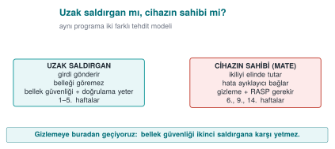

### Gizleme ne verir, ne vermez?

Kitap, yazılım korumasını anlatırken açık konuşur (Tarif 12.1): yeterli zamanı ve becerisi olan bir saldırgan her
gizlemeyi eninde sonunda çözer. Gizlemenin amacı **imkânsız kılmak değil, pahalı kılmaktır**:

- Saldırının maliyetini, korunan değerin üzerine çıkarmak.
- Saldırıyı otomatikleştirmeyi zorlaştırmak: bir kopyada bulunan yöntemin bütün kopyalarda aynen işe yaramaması
  (14. haftadaki **çeşitlendirme**).
- Diğer katmanlara (RASP, bütünlük denetimi, sunucu tarafı denetimler) **zaman kazandırmak**: anahtarlar
  yenilenene, sürüm güncellenene kadar dayanmak.

Kitabın bir önerisi bugün de geçerlidir: tek bir gelişmiş tekniği mükemmelleştirmeye çalışmak yerine, **birkaç basit
tekniği veri gizlemeyle birlikte** kullanmak daha verimlidir. Her gizleme bakım maliyetini artırır; bu yüzden yalnız
hassas bölümlere uygulanır.

### Gizleme teknikleri: bir harita

| Aile | Neyi gizler? | Örnek teknikler | Bu dönem |
| --- | --- | --- | --- |
| **Düzen (layout)** | Adları, yapıyı | Sembolleri gizleme, fonksiyon ve dosya adlarını anlamsızlaştırma, günlüğü kaldırma | Bu hafta Demo 6 |
| **Veri** | Sabitleri, dizeleri, değişkenleri | Dize şifreleme, sabit dönüşümleri, değişken bölme/birleştirme, opak boolean | Bu hafta, 9. hafta |
| **Kontrol akışı** | Algoritmanın yapısını | Kontrol akışı düzleştirme, opak yüklemler, sahte ve ölü dallar | Bu hafta Demo 7, 9. hafta |
| **Önleyici** | Analiz araçlarının işini | Tersine derleyiciyi yanıltan yapılar, çalışma anında kod çözme | 9. hafta (kavram) |
| **Sanallaştırma** | Makine kodunun kendisini | Fonksiyonu özel bir sanal makinenin bayt koduna çevirme | 9 ve 14. haftalar (Tigress) |

!!! note "Sahada nasıl uygulanır?"
    Sertifikasyondan geçmiş bir mobil ödeme kütüphanesinin native tarafında listelenen sağlamlaştırma önlemleri bu
    haritanın neredeyse tamamını kapsar: paylaşılan kütüphanede sembol görünürlüğünün kapatılması; fonksiyon, dosya ve
    parametre adlarının el ile anlamsızlaştırılması (asıl adlar iç belgelerde tutulur); sabitlerin aritmetik
    dönüşümlerle gizlenmesi; statik dizelerin derleme öncesinde şifrelenip kullanım anında çözülmesi ve hemen
    silinmesi; yalnız "başarılı/başarısız" döndüren opak boolean değerler; standart kütüphane fonksiyonlarının kendi
    sürümleriyle değiştirilmesi; sonucu değiştirmeyen sahte işlemler ve hiç çalışmayan ölü dallar; kontrol akışı
    düzleştirme ve hata durumunda rastgele bir çıkış noktası; sürüm derlemesinde günlüğün tamamen kaldırılması. Bu
    önlemlerin hiçbiri tek başına güçlü değildir; güçleri **birlikte** ve RASP ile birlikte kullanılmalarından gelir.

---

## 15. Sembol, dize ve günlük gizleme

Tersine mühendisliğin ilk adımı genellikle en basit olanıdır: binary dosyadaki **okunabilir metinlere** ve **fonksiyon
adlarına** bakmak. `license_verify` adlı bir fonksiyon ya da `"invalid"` dizesi, saldırgana nereye bakacağını
doğrudan söyler. Bu yüzden ilk ve en ucuz gizleme katmanı bu bilgileri binary dosyadan çıkarmaktır.

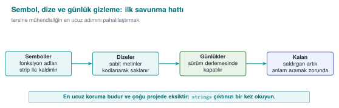

### Üç basit önlem

| Önlem | Nasıl? | Ne kazandırır? |
| --- | --- | --- |
| **Sembolleri gizle** | `static` fonksiyonlar; paylaşılan kütüphanede `-fvisibility=hidden` ve yalnız gerekli API'yi dışa açmak; sürümde `strip -s`; Windows'ta PDB dosyasını dağıtmamak | Fonksiyon adları binary dosyada görünmez |
| **Günlüğü sürümde kaldır** | Günlük makrolarını derleme bayrağıyla **tamamen** derleme dışı bırakmak | Hata iletileri ve iç durum bilgisi binary dosyada kalmaz |
| **Hassas dizeleri gizle** | Derleme anında şifrelemek ya da karıştırmak, kullanım anında çözmek ve **hemen silmek** (Tarif 12.11) | `strings` taraması hassas sabitleri bulamaz |

```c title="Günlük makrosu: sürümde hiç kod üretmez"
#ifdef LOG_ENABLED
#  define LOG(...) fprintf(stderr, __VA_ARGS__)
#else
#  define LOG(...) ((void)0)       /* neither the string nor the call end up in the binary */
#endif

LOG("[LOG] license check: %s\n", result ? "passed" : "failed");
```

Günlüğü bir **çalışma anı** bayrağıyla susturmak (`if (hata_ayiklama) printf(...)`) yetmez: dize binary dosyada kalır ve
saldırgan bayrağı değiştirerek günlüğü yeniden açabilir. Sahada tek istisna genellikle bilinçli bir karardır ve
ödünleşim kaydına yazılır (ör. yalnız şifrelenmiş bir tanı değerinin yazılması).

!!! warning "Dize gizleme bir anahtar saklama yöntemi değildir"
    Şifrelenmiş bir dize, program çalışırken kullanım anında çözülür; o anda bellekte açıktır ve çözme anahtarı da
    programın içindedir. Dize gizleme `strings` gibi **statik** taramaları durdurur; programı çalışırken inceleyen
    saldırgana karşı RASP ([6. hafta](../week-6/cen429-week-6.md)), gerçek anahtarlar için ise whitebox kriptografi ([11. hafta](../week-11/cen429-week-11.md)) gerekir. Sahada dize
    gizleme anahtarı bu yüzden kendisi de parçalanıp gizlenir ve çözme fonksiyonu ek denetimlerle korunur.

### Demo 6 — Sembol ve dize sızıntısı

!!! info "Demo 6 · `code/week-04/06-symbol-strings` · CWE-200, CWE-215 · Tarif 12.11"
    Aynı küçük lisans denetimi iki kez derlenir: `secret_exposed` (semboller, günlük dizeleri ve sentetik lisans anahtarı
    açık) ve `secret_hidden` (günlük derleme dışı, dize derleme anında karıştırılmış, semboller silinmiş). İkisi de aynı
    çalışır; fark binary dosyada görülür.

=== "Windows (PowerShell)"

    ```powershell
    cd code\week-04\06-symbol-strings
    .\demo.ps1
    ```

=== "WSL / Linux"

    ```bash
    cd code/week-04/06-symbol-strings
    sh demo.sh
    ```

| Adım | Ne olur? |
| --- | --- |
| 1 | İki sürüm aynı sonucu verir |
| 2 | `strings`: açık sürümde lisans dizesi ve `[LOG]` satırları görünür; kapalı sürümde yok |
| 3 | `nm`: açık sürümde `license_verify` görünür; kapalı sürümde sembol yok |
| 4 | Windows: fonksiyon adları EXE'de değil PDB dosyasındadır; kapalı sürüm PDB üretmez, dizeler gizlidir |

Aşağıdaki animasyonda gizli dizenin her baytının derleme anında anahtarla nasıl XOR'landığını ve `nm` ile
görünen sembollerin açık/kapalı sürümde nasıl farklılaştığını adım adım izleyin.

<iframe class="dsanim" src="../anim/symbol-string-hiding.html" title="Dize ve sembol gizleme: XOR + strip" loading="lazy"></iframe>
<div class="dsanim-baski" markdown>

</div>

Örnek seçiciden **açık sürüm** (normal), **kapalı sürüm** (zor), uç durumlar **küçük anahtar** ile **anahtar
0x00 — hiç gizlemiyor** arasında geçiş yapın — ya da 🎲 ile rastgele bir metin/anahtar çifti üretin.

---

## 16. Kontrol akışı düzleştirme ve opak değerler (Tarif 12.3, 12.8)

Derlenmiş bir fonksiyonun kontrol akışı grafiği (CFG), algoritmanın iskeletini gösterir: hangi denetimin hangi sırayla
yapıldığı, hangi dalın başarıya gittiği. **Kontrol akışı düzleştirme** (control-flow flattening), fonksiyonun bütün
temel bloklarını tek bir döngünün içindeki bir `switch` dağıtıcısına taşır. Bloklar arasındaki doğal komşuluk kaybolur;
hangi bloğun hangisinden sonra geldiği yalnız bir **durum değişkeninin** değerinden anlaşılır. Burada tekniğin fikrini ve
küçük bir demosunu görüyoruz; derin hâli [9. haftada kural K-04](../week-9/cen429-week-9.md#5-kontrol-akisi-kurallari-ileri)
olarak gelir.

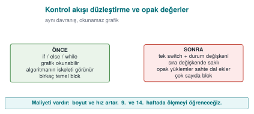

```c title="Düzleştirme şablonu"
int state = 1;
for (;;) {
    switch (state) {
    case 1: /* step 1 */  state = 2; break;
    case 2: /* step 2 */  state = (condition ? 3 : 4); break;
    case 3: /* success path */ state = 5; break;
    case 4: /* failure path */   return FAILURE;
    case 5: return SUCCESS;
    }
}
```

Tek başına bu şablon, deneyimli bir analist için kısa sürede geri çözülebilir. Güçlü hale gelmesi için diğer tekniklerle
birleştirilir:

- **Durum değerlerinin gizlenmesi:** `case 1`, `case 2` yerine, durum değerleri basit bir aritmetik dönüşümle
  saklanır; ardışık sıra görünmez (Tarif 12.5, sabit dönüşümleri).
- **Sahte ve ölü bloklar:** hiç çalışmayan ya da sonucu değiştirmeyen bloklar eklenir; analistin hangi bloğun gerçek
  olduğunu ayırması zorlaşır.
- **Rastgele çıkış noktası:** bir denetim başarısız olduğunda, durum değişkeni öngörülemeyen bir değere ayarlanır ve
  fonksiyon `default` dalından çıkar; hatanın **nerede** yakalandığı akıştan okunamaz.
- **Opak değerler:** "doğru/yanlış" gibi kritik sonuçlar düz bir `0`/`1` olarak değil, birden fazla değere bağlı ve
  tek bir baytı değiştirerek çevrilemeyecek bir biçimde tutulur (Tarif 12.8). Kitabın bu tarifteki yaklaşımı, sahadaki
  kütüphanelerde fonksiyonların "opak boolean" dönüş değerlerinin de temelidir.

### Demo 7 — Kontrol akışı düzleştirme

!!! info "Demo 7 · `code/week-04/07-flow-flattening` · Tarif 12.3"
    Küçük bir PIN denetimi iki biçimde yazılmıştır: doğal `if` zinciri (`pin.c`) ve el ile düzleştirilmiş biçim
    (`pin_flattened.c`). İki sürüm aynı PIN'ler için aynı sonucu verir (doğru PIN sentetiktir); ama makine kodları ve kontrol
    akışı grafikleri farklıdır. Son adımda düzleştirmenin **maliyeti** süre ölçümüyle gösterilir.

=== "Windows (PowerShell)"

    ```powershell
    cd code\week-04\07-flow-flattening
    .\demo.ps1
    ```

=== "WSL / Linux"

    ```bash
    cd code/week-04/07-flow-flattening
    sh demo.sh
    ```

| Adım | Ne olur? |
| --- | --- |
| 1 | İki sürüm aynı PIN'ler için aynı sonucu verir |
| 2 | `objdump` / `dumpbin` ile `pin_verify`'ın makine kodu karşılaştırılır: düzleştirilmiş sürümde çok daha fazla dal |
| 3 | Süre ölçümü: düzleştirilmiş sürüm yavaştır |

Aşağıdaki animasyonda düz sürümün doğrudan `if` zincirini, düzleştirilmiş sürümün ise HER tahmin için dağıtıcıyı
`state=0`'dan yeniden nasıl dolaştığını — durumdan duruma sıçrayarak — adım adım izleyin.

<iframe class="dsanim" src="../anim/flow-flattening.html" title="Kontrol akışı düzleştirme: dağıtıcı durum makinesi" loading="lazy"></iframe>
<div class="dsanim-baski" markdown>

</div>

Örnek seçiciden **düz sürüm** (normal), **düzleştirilmiş sürüm** (zor), uç durumlar **hepsi doğru PIN** ile
**hepsi yanlış uzunlukta** arasında geçiş yapın — ya da 🎲 ile rastgele bir tahmin listesi üretin.

Bu demo, [14. haftada](../week-14/cen429-week-14.md) Tigress'in `--Transform=Flatten` dönüşümüyle **otomatik** yapacağımız işin el ile karşılığıdır.
Gizlemenin etkinliğini nasıl ölçeceğimizi (güç, dayanıklılık, maliyet) 9. haftada işleyeceğiz.

Kontrol akışını düzleştirmek tek başına yeterli değildir: bir tersine mühendis dağıtıcıyı yine de adım adım izleyip
çözebilir. **Opak yüklemler**, çözümü daha da zorlaştıran ikinci bir katmandır — aşağıdaki animasyonda
`(x*x) % 4`'ün hiçbir tam sayı için 2 olmadığını (bu yüzden bir dalın HER ZAMAN aynı yöne gittiğini) deneysel
olarak kanıtlayalım.

<iframe class="dsanim" src="../anim/opaque-predicate.html" title="Opak yüklem: (x*x) % 4 asla 2 değildir" loading="lazy"></iframe>
<div class="dsanim-baski" markdown>

</div>

Örnek seçiciden **10 küçük pozitif x** (normal), **negatif ve büyük karışık** (zor), uç durumlar **INT sınırlarına
yakın** ile **yanlış PIN, sonuç yine de x'ten bağımsız** arasında geçiş yapın — ya da 🎲 ile rastgele bir `x`
listesi üretin.

### Fonksiyon adı, bellek ayırma gizleme ve dinamik şifreleme: kavram

İzlencenin bu haftaya koyduğu diğer üç teknik, 9. haftada ayrıntılı işlenecek; burada ne olduklarını bilmek yeterlidir:

- **Fonksiyon adı gizleme:** Sembolleri silmek dışa açık adları kaldırır; ama bir API'nin giriş noktaları (ör. bir JNI
  arayüzü) dışa açık kalmak zorundaysa, bu adlar anlamsızlaştırılır ve asıl adlar yalnız iç belgelerde tutulur.
  Programcının okunabilirliği bir makro katmanıyla korunur.
- **Bellek ayırma gizleme:** Hassas veriler için ayrılan tamponların boyutu ve sırası tanınabilir bir iz bırakır (ör.
  "32 baytlık blok = AES anahtarı"). Tamponların boyutları, sırası ve yerleşimi değiştirilerek, sahte ayırmalar
  eklenerek ve kullanım sonrası rastgele değerlerle doldurularak bu iz bulanıklaştırılır.
- **Dinamik şifreleme:** En hassas kod bölümleri binary dosyada şifreli durur, yalnız çalışacağı an belleğe çözülür ve
  sonra yeniden şifrelenir ya da silinir. Güçlü bir tekniktir ama işletim sisteminin bellek korumalarıyla (DEP/NX,
  yazılabilir ve çalıştırılabilir sayfa ayrımı) çatışır ve dikkatli tasarım gerektirir; bu yüzden uygulamada seçici
  kullanılır.

!!! question "Değerlendirici nasıl test eder?"
    Gizlemeyi "var/yok" diye değil, **zaman** ölçüsüyle değerlendirir: binary dosyada hassas bir fonksiyonu bulmak,
    mantığını anlamak ve bir denetimi atlatmak ne kadar sürdü? Önce `strings` ve sembol taramasıyla başlar, sonra bir
    tersine derleyiciyle kontrol akışını inceler. Raporda her koruma katmanının saldırıyı ne kadar geciktirdiği
    yazılır; saldırı potansiyeli puanlamasında ([13. hafta](../week-13/cen429-week-13.md)) "gereken süre" ve "gereken uzmanlık" ölçütleri buradan gelir.

---

## 17. Dönem projesi: bu hafta

Güvenlik kılavuzunuzun **S9 "Kod sağlamlaştırma"** bölümünün ilk taslağını yazın:

- [ ] Projenizi "Derleyici ve işletim sistemi korumaları" bölümündeki önerilen sürüm bayraklarıyla derleyin; koruma
      tablosunu (`checksec` / `dumpbin`) kılavuza ekleyin. Kapalı kalan bir koruma varsa gerekçesini ödünleşim kaydına yazın.
- [ ] Kodunuzu `clang-tidy` ya da `cppcheck` ile CERT kurallarına göre tarayın; en az beş bulguyu düzeltip kural
      kimliğiyle belgeleyin.
- [ ] Testlerinizi ASan + UBSan ile çalıştırın.
- [ ] Dışarıdan veri okuyan en az bir fonksiyon için bir fuzz hedefi yazın ve en az 10 dakika fuzzlayın; sonucu yazın.
- [ ] Sürüm derlemesinde günlüğün kaldırıldığını ve hassas dizelerin `strings` çıktısında görünmediğini gösterin.

```markdown title="S9 önlem kartı şablonu (her önlem için)"
### KS-01 Sürümde günlüğün kaldırılması
**Açıklama:** Neden gerekli? (hangi varlık, hangi tehdit)
**Uygulama:** Nasıl yapıldı? (dosya, makro, derleme bayrağı)
**Doğrulama:** Nasıl test edildi? (komut + beklenen çıktı)
**Kalan risk / ödünleşim:** Varsa
```

---

## 18. Kendi başına çalış

??? question "Alıştırma 1 — Kolay: Uyarıları hata yapın"
    Kendi projenizi `-Wall -Wextra -Wformat=2 -Wconversion -Werror` (MSVC'de `/W4 /WX`) ile derleyin. Kaç uyarı çıktı?
    Her birini ya düzeltin ya da neden zararsız olduğunu bir yorumla açıklayın.

??? question "Alıştırma 2 — Kolay: Biçim dizesi avı"
    Kendi kodunuzda biçim dizesi olarak değişken alan her çağrıyı bulun (`printf(`, `fprintf(`, `snprintf(`,
    `syslog(`). Kendi günlük fonksiyonunuza `format` özniteliğini ekleyip derleyicinin yeni uyarılar verip
    vermediğine bakın.

??? question "Alıştırma 3 — Orta: Taşma denetimi"
    `n` adet `struct record` için bellek ayıran bir fonksiyonu önce `malloc(n * sizeof(struct record))` ile, sonra
    `__builtin_mul_overflow` ile, sonra `calloc` ile yazın. `n = SIZE_MAX / 2` için üç sürümün davranışını
    karşılaştırın.

??? question "Alıştırma 4 — Orta: UBSan ile tanımsız davranış avı"
    Demo 3'teki üç tanımsız davranışa bir dördüncüsünü ekleyin (ör. dizinin sonundan bir fazla elemana erişim ya da
    NULL işaretçiyle üye erişimi). UBSan ve ASan'ın hangisinin yakaladığını gözlemleyin.

??? question "Alıştırma 5 — Orta: Kendi fuzz hedefiniz"
    Projenizdeki bir ayrıştırıcı için `LLVMFuzzerTestOneInput` yazın. Anlamlı birkaç tohum dosyası hazırlayın,
    fuzzer'ı 10 dakika çalıştırın ve ulaşılan kapsamı (`cov:` değeri) not edin. Bir hata bulursanız düzeltin ve
    bulunan girdiyi bir regresyon testine dönüştürün.

??? question "Alıştırma 6 — Orta: Koruma tablosu"
    Demo 5'in `overflow_weak` ve `overflow_hardened` hedeflerinin koruma tablolarını çıkarın. Hangi bayrak hangi satırı
    değiştirdi? Aynı bayrakları kendi projenize ekleyip tabloyu yeniden çıkarın. Binary dosyaların boyutu ve çalışma süresi ne kadar farklı?

??? question "Alıştırma 7 — Zor: Sinyal işleyici incelemesi"
    Bir sinyal işleyicisinde `printf` ve `malloc` çağıran küçük bir program yazın ve neden hatalı olduğunu SIG30-C
    ile açıklayın. Sonra işleyiciyi yalnız bir `volatile sig_atomic_t` bayrak kuracak şekilde düzeltin.

??? question "Alıştırma 8 — Zor: Düzleştirmenin maliyeti"
    Demo 7'deki `pin_verify` fonksiyonunu kendi projenizdeki bir fonksiyona uygulayın (el ile). Süreyi ve binary
    dosya boyutunu ölçün; sonucu S9 bölümüne bir ödünleşim satırı olarak yazın.

---

## 19. Kendini sınama

??? question "1. Kod sağlamlaştırmanın üç katmanı nedir? Hangisi hatayı gerçekten ortadan kaldırır?"
    Güvenli kodlama, derleyici/işletim sistemi korumaları, kod gizleme. Yalnız güvenli kodlama hatayı kaldırır; diğer
    ikisi sömürüyü ya da anlamayı zorlaştırır.

??? question "2. CERT'te 'kural' ile 'öneri' arasındaki fark nedir? L1 önceliği ne anlatır?"
    Kurallar ihlal edildiğinde doğrudan zafiyete yol açabilir ve denetlenebilir; öneriler iyi uygulamadır. L1, önem,
    olasılık ve düzeltme maliyeti birlikte değerlendirildiğinde en yüksek önceliktir.

??? question "3. `printf(girdi)` neden tehlikelidir? En hafif sonucu nedir?"
    Girdi biçim dizesi olarak yorumlanır; `%x`/`%p` yığındaki değerleri okur, `%n` belleğe yazar. En hafif sonucu bilgi
    sızıntısıdır (anahtar, adres, kanarya).

??? question "4. UAF raporundaki üç yığın izi nedir? Düzeltme çoğunlukla hangisindedir?"
    Kullanım, serbest bırakma ve ayırma yerleri. Düzeltme çoğu zaman serbest bırakma yerindedir: sahiplik kararı orada
    yanlış verilmiştir.

??? question "5. `if (x + 100 < x)` denetimi neden derleyici tarafından silinebilir?"
    İşaretli taşma tanımsız davranıştır; derleyici taşmanın olmayacağını varsayar ve ifadenin hiçbir zaman doğru
    olamayacağını düşünerek dalı kaldırır. Doğrusu işlemden önce sınırla karşılaştırmak ya da taşma bildiren
    yerleşikleri kullanmaktır.

??? question "6. Sinyal işleyicide neden `printf` çağrılmamalıdır?"
    Sinyal, kesilen kod aynı fonksiyonun içindeyken gelebilir; eşzamansız güvenli olmayan fonksiyonlar iç veri
    yapılarını bozar. İşleyici yalnız `volatile sig_atomic_t` bir bayrak kurmalıdır.

??? question "7. ASan aynı yapı içindeki bir alandan komşu alana taşmayı neden göremez?"
    ASan koruma bölgesileri nesnelerin arasına koyar; yapının alanları arasında koruma bölgesi yoktur.

??? question "8. İyi bir fuzz hedefinin dört özelliği nedir?"
    Hızlı, deterministik, durum bırakmayan ve tek bir işi test eden.

??? question "9. Kanarya neyi durdurur, neyi durdurmaz?"
    Dönüş adresine ulaşan ardışık yığın taşmasını durdurur (programı sonlandırarak). Kanaryadan önceki değişkenlerin
    bozulmasını, öbek taşmasını ve sızdırılmış kanaryayı durdurmaz.

??? question "10. ASLR neden bir bilgi sızıntısıyla zayıflar?"
    ASLR adresleri gizli tutmaya dayanır; biçim dizesi açığı gibi bir sızıntı gerçek bir adresi açığa çıkarırsa diğer
    adresler hesaplanabilir.

??? question "11. Günlüğü bir çalışma anı bayrağıyla susturmak neden yetmez?"
    Günlük dizeleri binary dosyada kalır ve bayrak değiştirilerek günlük yeniden açılabilir. Doğrusu derleme anında
    tamamen kaldırmaktır.

??? question "12. Kontrol akışı düzleştirme tek başına neden zayıftır? Onu güçlendiren üç teknik sayın."
    Şablon tanınabilir ve durum değişkeni izlenerek akış geri çıkarılabilir. Durum değerlerinin gizlenmesi, sahte/ölü
    bloklar, rastgele çıkış noktası, opak değerler.

??? question "13. `printf(tampon)` çağrısında `%x` her zaman yığından mı okur? 64-bit sistemde fark nedir?"
    Basitleştirilmiş öğretim modelinde (32-bit cdecl) evet, bütün argümanlar yığında art arda durur. 64-bit x86-64
    System V ABI'de ise ilk 6 tamsayı/işaretçi argümanı yazmaçlarda (`RSI, RDX, RCX, R8, R9`) taşınır; ilk birkaç
    `%x` bu yazmaçlardaki rastgele kalıntı değerleri okur, yalnız 6'dan sonraki `%x`'ler yığına ulaşır.

??? question "14. `%n` neden `%x`'ten daha tehlikelidir?"
    `%x` yalnız okur; `%n` ise "şimdiye kadar yazılan karakter sayısını" kendisine verilen "argümanın" gösterdiği
    adrese **yazar**. Argüman verilmediği için bu adres de yığından/yazmaçtan okunan rastgele bir değerdir; saldırgan
    biçim dizesini kendisi yazdığından bu "adres" konumuna kendi seçtiği bir bayt dizisi yerleştirebilir.

??? question "15. Demo 2'de `fake = malloc(sizeof *s)` neden `s` ile aynı adresi alır?"
    `free(s)` ile serbest kalan blok tam olarak 24 bayttır (`sizeof(struct session) = 8 + 16`). Bellek yöneticileri
    (ör. glibc tcache) aynı boyut sınıfındaki bir sonraki isteği, LIFO (son giren ilk çıkar) serbest liste ilkesiyle
    az önce serbest kalan bloktan karşılar; bu yüzden `fake` çoğunlukla `s` ile aynı adresi alır (ama C standardı
    bunu garanti etmez — bkz. §6'daki uyarı).

??? question "16. `free(p)` sonrası neden hemen `p = NULL;` yazılmalı?"
    `free(p)` yalnız bellek yöneticisine bloğu geri verir; `p` değişkenini değiştirmez, `p` hâlâ eski adresi tutar
    (askıdaki işaretçi). `p`'yi sıfırlamak, bir sonraki yanlışlıkla yapılan `p->...` erişiminin sessizce yanlış
    veriye ulaşmak yerine hemen ve gürültülü biçimde çökmesini sağlar.

??? question "17. `(int)-1` bir 64-bit `size_t`'ye atanırsa hangi değeri alır? Sonucu nereden hesaplarsınız?"
    `-1 + 2^64 = 2^64 - 1 = 18.446.744.073.709.551.615` (`SIZE_MAX`, 64-bit sistemde). -1'in 32-bit bit deseni
    (`0xFFFFFFFF`) işaretsiz bir 64-bit türe atanırken matematiksel olarak `2^64` eklenerek aralığa sokulur.

??? question "18. `INT_MAX + 1` neden bit deseni olarak `INT_MIN`'e eşittir?"
    `INT_MAX` = `0x7FFFFFFF`; buna 1 eklenince 33. bit taşıp atılır ve kalan 32 bit `0x80000000` olur. Bu bit
    deseni işaretsiz okunursa 2.147.483.648, işaretli (ikinin tümleyeni) okunursa en üst bit (işaret biti) 1
    olduğu için `-2.147.483.648` = `INT_MIN`'dir.

??? question "19. `0x40000001 * sizeof(uint32_t)` işleminin `uint32_t`'ye sarma sonucu kaç bayt olur?"
    Gerçek çarpım `4.294.967.300`'dür; `uint32_t`'nin sığdırabildiği en büyük değer `4.294.967.295`'tir (`2^32-1`).
    `4.294.967.300 mod 2^32 = 4` olduğu için `boyut` değişkeninde yalnız **4 bayt** kalır; `malloc(4)` çağrılır ama
    döngü milyarlarca bayt yazmaya çalışır.

??? question "20. Yığın kanaryası tam olarak nerede durur ve neyi korur?"
    Kanarya, tamponla (ör. `buffer[64]`) kaydedilmiş çerçeve/dönüş adresi arasına, fonksiyon girişinde rastgele bir
    değerle yazılır. Yalnız **kendisinden sonraki** (yığında ondan yukarıdaki) dönüş adresine ulaşan **ardışık**
    taşmaları, fonksiyon dönerken yaptığı karşılaştırmayla yakalar.

??? question "21. Kanarya neden bu haftanın biçim dizesi açığıyla birlikte düşünülmelidir?"
    Kanarya da yığında duran 8 baytlık bir değerdir; bir biçim dizesi açığı `%x` ile bu baytları da okuyabilir.
    Saldırgan sızıntıyla kanaryanın gerçek değerini öğrenirse, taşmayı bu değeri aynen yazacak şekilde kurgulayabilir
    ve karşılaştırma hiç tetiklenmez — bir koruma (kanarya) başka bir hatayla (bilgi sızıntısı) atlatılmış olur.

??? question "22. ASLR neyi rastgeleleştirir? PIE olmadan ASLR neden eksik kalır?"
    ASLR, kod, yığın, öbek ve paylaşılan kütüphanelerin başlangıç adreslerini her çalıştırmada değiştirir. PIE
    olmadan derlenmiş bir programın **kendi** kod bölgesi her zaman aynı sabit adrestedir; ASLR yalnız kütüphaneleri
    rastgeleleştirse bile programın kendi kodu tahmin edilebilir kalır — PIE bu boşluğu kapatır.

??? question "23. DEP/NX açıkken saldırgan hâlâ nasıl kod çalıştırabilir (kavramsal olarak)?"
    DEP/NX yalnız veri sayfalarına (yığın, öbek) **yeni** kod yazıp çalıştırmayı engeller. Saldırgan kendi kodunu
    yazmak yerine, programın zaten çalıştırılabilir olan kendi kod bölgesindeki mevcut parçaları art arda
    zincirleyerek (ROP/JOP tekniği ailesi) kullanabilir; bu, hiçbir veri sayfasında kod çalıştırmadığı için DEP/NX
    tarafından görülmez.

??? question "24. RELRO tam olarak neyi salt okunur yapar ve bu neyi engeller?"
    RELRO, dinamik bağlanan fonksiyon adreslerinin tutulduğu GOT (Global Offset Table) tablosunu, program
    başlangıcında bütün adresler çözüldükten sonra salt okunur yapar. Bu, bir bellek yazma hatasından yararlanıp
    GOT'taki bir fonksiyon adresini saldırganın seçtiği bir adrese değiştirmeyi engeller.

??? question "25. CFI/CFG hangi çağrıları denetler, hangilerini denetlemez?"
    Dolaylı çağrıların (fonksiyon işaretçisi, sanal fonksiyon) yalnız derleme anında belirlenmiş geçerli hedefler
    kümesine gitmesini denetler; bu kümenin **dışına** atlamayı engeller. Kümenin **içindeki** yanlış ama izinli bir
    hedefe atlamayı ya da fonksiyon işaretçisi dışındaki veri bozulmalarını (ör. bir yetki bayrağı) görmez.

??? question "26. Bir ASan/UBSan raporunu okurken hangi sıraya bakılır?"
    Önce üst satırdaki hata sınıfına (`stack-buffer-overflow`, `signed integer overflow` ...), sonra çağrı yığınında
    genellikle `#1` konumundaki (kendi kodunuzun olduğu) satıra, en son UBSan'da varsa değerlere bakılır. `#0`
    çoğunlukla kütüphane kodudur (`strcpy`, `malloc`); asıl düzeltilecek satır bir sonrakidir.

---

## 20. Kaynaklar ve ileri okuma

**Ders kitabı** — J. Viega, M. Messier, *Secure Programming Cookbook for C and C++*, O'Reilly, 2003:

- Tarif 3.1 (temel girdi doğrulama), 3.2 (biçimlendirme fonksiyonlarına saldırıları önleme), 3.3 (arabellek
  taşmasını önleme), 3.5 (tamsayı dönüşümü ve sarma)
- Tarif 13.1 (hata işleme), 13.4 (değişken argümanlar), 13.5 (sinyal işleme)
- Tarif 12.1 (yazılım korumasını anlamak), 12.3 (kodu gizleme), 12.5 (sabit dönüşümleri), 12.8 (boolean değerleri
  gizleme), 12.11 (dizeleri gizleme)

**Açık standartlar ve kaynaklar**

- SEI CERT C Coding Standard ve SEI CERT C++ Coding Standard (wiki.sei.cmu.edu).
- OpenSSF, *Compiler Options Hardening Guide for C and C++*.
- LLVM belgeleri: AddressSanitizer, UndefinedBehaviorSanitizer, libFuzzer; Microsoft Learn: `/fsanitize=address`,
  `/guard:cf`, `/GS`.
- Google OSS-Fuzz ve ClusterFuzz belgeleri; AFL++ belgeleri.
- MITRE CWE: CWE-134 (denetlenmeyen biçim dizesi), CWE-190 (tamsayı taşması), CWE-252 (denetlenmeyen dönüş değeri),
  CWE-415, CWE-416, CWE-479 (sinyal işleyicide güvensiz fonksiyon), CWE-758 (tanımsız davranışa dayanma), CWE-215
  (hata ayıklama kodunda bilgi), CWE-200.
- C. Collberg, J. Nagra, *Surreptitious Software*, Addison-Wesley, 2009 (gizleme taksonomisi; [9. haftada](../week-9/cen429-week-9.md) ayrıntılı).

??? abstract "Sözlük"
    | Terim | Türkçe | Kısa tanım |
    | --- | --- | --- |
    | Hardening | Sağlamlaştırma | Kodu ve binary dosyayı saldırıya karşı dayanıklı hale getirme |
    | Format string | Biçim dizesi | `printf` ailesinin nasıl yazacağını belirten ilk argüman |
    | Use-after-free | Serbest bırakıldıktan sonra kullanma | Serbest bırakılmış belleğe eski işaretçiyle erişim |
    | Undefined behavior | Tanımsız davranış | Standardın sonucunu tanımlamadığı işlem; derleyici olmayacağını varsayar |
    | Sanitizer | Denetleyici | Derleyicinin eklediği çalışma anı hata denetimi |
    | Fuzzing | Bulanık test | Otomatik üretilmiş bozuk girdilerle hata arama |
    | Harness | Fuzz hedefi | Fuzzer'ın çağırdığı, test edilecek kodu saran fonksiyon |
    | Stack canary | Yığın kanaryası | Dönüş adresinin önündeki, bozulunca taşmayı gösteren değer |
    | ASLR | Adres alanı rastgeleleştirme | Bellek adreslerinin her çalıştırmada değişmesi |
    | DEP / NX | Veri yürütme engeli | Veri sayfalarında kod çalıştırma yasağı |
    | RELRO | Salt okunur yer değiştirme | Dinamik bağlama tablolarını salt okunur yapma |
    | CFI / CFG | Kontrol akışı bütünlüğü | Dolaylı çağrıların yalnız geçerli hedeflere gitmesi |
    | Obfuscation | Gizleme | Davranışı değiştirmeden anlaşılmayı zorlaştıran dönüşüm |
    | Control-flow flattening | Kontrol akışı düzleştirme | Blokları tek bir döngü + `switch` dağıtıcısına taşıma |
    | Opaque predicate | Opak yüklem | Değeri programcıca bilinen ama analizle zor çıkarılan koşul |

!!! info "Bir sonraki hafta"
    **[5. hafta](../week-5/cen429-week-5.md) — Java ve yorumlanan diller.** Bu hafta C/C++'ta elle yönetilen bellek ile derleyici ve işletim
    sistemi korumalarıyla uğraştık; 5. hafta, Java'nın çalışma zamanının (JVM) bu hafta gördüğümüz bellek
    hatalarının çoğunu (taşma, serbest bırakılmış belleğin kullanımı, tanımsız davranış) nasıl ortadan kaldırdığını,
    ama enjeksiyon gibi yeni bir hata sınıfını nasıl açtığını gösterir. SEI CERT Java kuralları, bugün işlediğimiz
    SEI CERT C/C++ kurallarıyla karşılaştırılacak.
