# Week 5 — Code Hardening: Java and Interpreted Languages

| | |
| --- | --- |
| **Date** | 16.10.2026 |
| **Learning outcomes** | LO.3 |
| **Duration** | 3 hours |
| **Prerequisites** | Basic programming in Java or Python; CWE/CVE and vulnerability classification from Week 2; input validation and secure coding rules from Week 4; simple `SELECT` in SQL |
| **Labs** | [`code/week-05`](https://github.com/ucoruh/cen429-secure-programming/tree/main/code/week-05) — 7 demos; requires Python 3 and JDK 17+; on Windows `.\demo.ps1`, on WSL/Linux `sh demo.sh` |

<!-- materyal:basla -->

<div class="materyal" markdown>

[:material-file-pdf-box: Lecture notes (PDF)](cen429-week-5-ders-notu.pdf){ .md-button download="cen429-week-5-ders-notu.pdf" }
[:material-file-word-box: Lecture notes (DOCX)](cen429-week-5-ders-notu.docx){ .md-button download="cen429-week-5-ders-notu.docx" }
[:material-presentation: Slides (PDF)](cen429-week-5-sunum.pdf){ .md-button download="cen429-week-5-sunum.pdf" }
[:material-microsoft-powerpoint: Slides (PPTX)](cen429-week-5-sunum.pptx){ .md-button download="cen429-week-5-sunum.pptx" }
[:material-language-html5: Slides (HTML, offline)](cen429-week-5-sunum.html){ .md-button download="cen429-week-5-sunum.html" }
[:material-folder-zip: Download all (ZIP)](cen429-week-5-materyal.zip){ .md-button download="cen429-week-5-materyal.zip" }
[:material-fullscreen: Open slides full screen](cen429-week-5-sunum.html){ .md-button .md-button--primary target=_blank }

</div>

<div class="sunum-cercevesi">
<iframe src="../cen429-week-5-sunum.html" title="Week 5 — Code Hardening: Java and Interpreted Languages" loading="lazy" allowfullscreen></iframe>
</div>

<p class="sunum-ipucu">Click inside the slides and use the arrow keys; use the button at the bottom right of the slides or the link above for full screen.</p>

<!-- materyal:bitis -->

!!! abstract "By the end of this week you will be able to"
    1. State **which classes of bugs managed languages (Java, Kotlin, C#, Python) remove and which they do not**.
    2. Read the **SEI CERT Oracle Java** rules and apply the input-validation (`IDS`), deserialisation (`SER`) and
       sensitive-data (`MSC`, `FIO`, `ERR`) rules to your own code.
    3. Demonstrate **SQL injection**, **command injection** and **path traversal** flaws, and fix them with a
       parameterised query, an argument list, and canonicalisation plus a root check.
    4. Explain why **unsafe deserialisation** is dangerous, and set up an allow list with `ObjectInputFilter`.
    5. Show with `javap` how readable Java bytecode is; shrink, optimise and obfuscate with **ProGuard / R8**, and
       write correct `-keep` rules.
    6. Produce a project's **software bill of materials (SBOM)** in CycloneDX format and find components with known
       vulnerabilities.

??? info "Lecture flow (timing plan for the instructor)"
    | Time | Section | What happens |
    | --- | --- | --- |
    | 0:00–0:15 | 1–2 | What do managed languages solve and not solve? SEI CERT Oracle Java |
    | 0:15–0:50 | 3–4 | The common root of injection; SQL injection — **Demo 1** |
    | 0:50–1:00 | Break | |
    | 1:00–1:20 | 5–6 | Command injection **Demo 2**; path traversal **Demo 3** |
    | 1:20–1:50 | 7–9 | Unsafe deserialisation **Demo 7**; XXE, XSS, template injection; Python and JavaScript, ReDoS |
    | 1:50–2:00 | Break | |
    | 2:00–2:15 | 10 | Bytecode and decompilation — **Demo 4** |
    | 2:15–2:40 | 11–13 | ProGuard / R8, advanced rules; string obfuscation, reflection **Demo 5**; Android R8, measurement, static analysis |
    | 2:40–2:55 | 14 | Dependency security and SBOM — **Demo 6** |
    | 2:55–3:00 | 15+ | Project step, self-check |

!!! tip "Prepare the lab beforehand"
    This week's demos need **Python 3** and **JDK 17+**. The main part of the SQL demo runs with Python's built-in
    `sqlite3` module, with nothing to download; for the optional Java parts (the JDBC driver, ProGuard) every demo
    folder has a `hazirla` (prepare) script. The scripts only download into the demo folder; they install nothing on
    the system.

    === "Windows"

        ```powershell
        java -version; python --version
        cd cen429-secure-programming\code\week-05\01-sql-enjeksiyonu
        .\demo.ps1
        ```

    === "WSL / Linux"

        ```bash
        sudo apt install -y openjdk-17-jdk python3
        cd cen429-secure-programming/code/week-05/01-sql-enjeksiyonu
        sh demo.sh
        ```

!!! warning "Ethics rule — applies every week in this course"
    The injection examples run only against a **synthetic** database and files created inside the demo folder; the
    injected command is only a harmless `echo`. The deserialisation demo contains no attack chain at all — it only
    shows the defence. Trying these techniques against a website, application or database that belongs to someone
    else is illegal; authorised penetration testing is carried out under a written contract and scope document
    (Week 12).

---

## 0. Basic concepts (from scratch)

This section **assumes no prior knowledge**. We define, from scratch, the terms we will use for the rest of the
week. If you do not know a term, read this section first; the sections that follow build on top of it.

### What is a managed language?

- **Managed language:** a language that manages memory **automatically** (Java, C#, Python, JS).
- The programmer does not call `malloc`/`free`; the **garbage collector** (GC) handles it.
- → most memory bugs (overflow, UAF) **disappear**.

### The JVM and bytecode

- **JVM (Java Virtual Machine):** the virtual machine that runs Java.
- **Bytecode:** the intermediate form Java source is compiled into (`.class` files).
- Bytecode is machine-independent; the JVM executes it.

### The garbage collector (GC)

- **GC (Garbage Collector):** automatically cleans up objects that are no longer used.
- The programmer never frees memory by hand.
- This is why UAF / double free is **almost nonexistent** in Java.

### What is injection?

- **Injection:** user **data** being interpreted as a **command**.
- Example: text entered as a username leaking into a SQL query as a command.
- The main theme of this week.

### SQL and databases

- **SQL:** a database query language (`SELECT ... WHERE ...`).
- The application puts user input into the query.
- If put in wrong → **SQL injection**.

### Parameterised query

- **Parameterised query (prepared statement):** the query skeleton is fixed; the data is supplied separately, as
  **parameters**.
- Data is never interpreted as a command.
- The **real** fix against SQL injection.

### Serialization

- **Serialization:** converting an object to a byte sequence (to save it or send it).
- **Deserialization:** converting the bytes back into an object.
- Deserialising untrusted bytes is **dangerous** (code execution).

### XML and XXE

- **XML:** a structured data format (built from tags).
- **XXE (XML External Entity):** abuse of XML's "external entity" feature → file reading, SSRF.
- External entities are **disabled** in the XML parser.

### Path traversal

- **Path traversal:** escaping **outside** the allowed folder with `../`.
- Like `dosyalar/../../etc/passwd`.
- Prevented with canonicalisation + a root check.

### ProGuard and R8

- **ProGuard / R8:** tools that **shrink** Java/Android bytecode and **obfuscate names**.
- R8 is Android's default tool.
- Name obfuscation + dead-code elimination + shrinking.

### The `-keep` rule

- **`-keep`:** telling ProGuard/R8 "do not **change** this class's/method's name."
- Code called by name through reflection has to be kept.
- A wrong `-keep` → either a crash or weak obfuscation.

### What is reflection?

- **Reflection:** finding and calling a class/method **by its name, at run time**.
- `Class.forName("...")`, `getMethod("...")`.
- Obfuscation can break this → `-keep` is required.

### What is an SBOM?

- **SBOM (Software Bill of Materials):** the software's **bill of materials** — which libraries, which versions.
- When a vulnerability is disclosed in a library, it answers "are we affected?" **quickly**.
- Formats: CycloneDX, SPDX.

### Dependency

- **Dependency:** the external libraries your project uses.
- Even if your own code is secure, a flaw in a dependency affects you.
- Supply-chain security.

### Now we are ready

Terms:

managed language · JVM/bytecode · GC · injection · SQL/parameterised query · serialization · XML/XXE · path
traversal · ProGuard/R8 · `-keep` · reflection · SBOM · dependency

Now: what do managed languages solve, and what do they not solve?

### How do the concepts connect to each other?

The terms above are not a random list; each one sits on top of the previous one. The table below shows the
relation "to understand this I must first know that" — if you forget a term, come back to the "prerequisite"
column of the table.

| Term | Prerequisite | Which section goes deeper? |
| --- | --- | --- |
| Injection | Interpreter, data/command separation | Section 3 |
| SQL injection / parameterised query | Injection, SQL syntax | Section 4 |
| Command injection | Injection, the shell concept | Section 5 |
| Path traversal | Injection, filesystem path | Section 6 |
| Deserialisation | Object, class, byte sequence | Section 7 |
| XXE / XSS / template injection | Injection, XML/HTML | Section 8 |
| ReDoS | Regular expression, backtracking | Section 9 |
| Bytecode | JVM | Section 10 |
| ProGuard/R8, `-keep` | Bytecode, reflection | Sections 11–13 |
| SBOM | Dependency | Section 14 |

The direction in which this table is read matters: **to understand the term at the start of a row, you must first
know the term in the "prerequisite" column.** For example, before reading the "parameterised query" section, the
concept of "injection" ("if data travels through the same channel as a command, it is taken for a command") has to
already be settled; otherwise the question "why is the `?` mark safe but string concatenation is not?" is left
hanging in the air.

!!! tip "How should you read this week?"
    The sections build on each other **in order**: 3 (the common root of injection) → 4–8 (every injection type
    stems from the same root) → 9 (same root, different languages) → 10–13 (bytecode and obfuscation, a separate
    topic: secrets embedded in code) → 14 (dependency security, a third topic). If you skip Section 3 and jump to
    Section 4, the sentences about "a different face of the same bug" stay meaningless; re-read a section that
    feels hard and then move on.

## 1. What do managed languages solve, and what do they not solve?

The first four weeks were spent with C and C++: buffer overflow, freed memory, integer overflow, undefined
behaviour. In **managed** languages such as Java, Kotlin, C#, Python and JavaScript, most of these bugs disappear
**at the language level**:

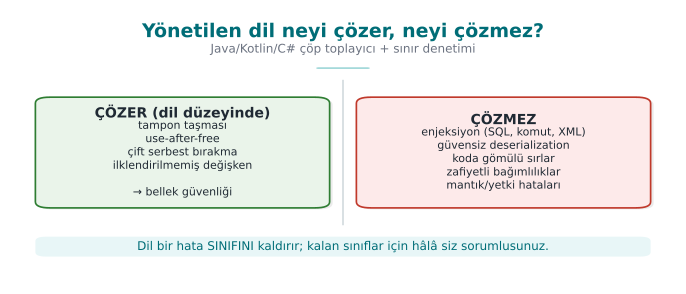

!!! note "Brief history: managed languages and the gaps that remain"
    - **1995** — **Java** and the JVM: the garbage collector and bounds checking remove most **memory bugs** at
      the language level.
    - **1998** — SQL injection is documented for the first time (Rain Forest Puppy); **2003** the **OWASP Top 10**
      is published — **logic/injection** bugs, not memory bugs, come to the fore.
    - **2002** — **ProGuard** (Java shrinking/obfuscation), later **R8**: a response to how easily bytecode can be
      turned back into source.
    - **2015** — Java **deserialization** attacks; **2020–21** **SolarWinds** and **Log4Shell** open the age of
      supply-chain/**SBOM** concerns.

    Main idea: the language solves memory bugs, it **does not solve injection or dependency risk**.

| Bug class | C/C++ | Java / managed languages |
| --- | --- | --- |
| Buffer overflow | The programmer's responsibility | Every array access is checked → `ArrayIndexOutOfBoundsException` |
| Freed memory, double free | The programmer's responsibility | Garbage collector: memory is freed once nothing points to it |
| Uninitialised variable | Undefined behaviour | The compiler errors out, or the field starts with a default value |
| Signed integer overflow | Undefined behaviour | Defined: it wraps (but the logic bug remains) |
| Format string (`%n`) | Writes to memory | `String.format` does not write to memory (but log injection remains) |

This is a large win; but it is not enough to say "we use Java, so we are safe." The classes below are
language-independent, and they are the most commonly found vulnerabilities from web applications all the way to
mobile applications:

| Bug class | Why doesn't the language solve it? | This week |
| --- | --- | --- |
| **Injection** (SQL, command, path, XML, template) | Mixing data and command is a **design** error | Demos 1–3 |
| **Unsafe deserialisation** | The language's own feature is abused | Demo 7 |
| **Secrets embedded in code** | Bytecode is easy to read | Demo 4 |
| **Reverse engineering** | Bytecode is high-level; names and strings are preserved | Demos 4–5 |
| **Vulnerable dependencies** | Most of the application is someone else's code | Demo 6 |
| **Logic and authorisation errors** | Business rules the language cannot know | Week 2 |

### Worked example: why an array overflow crashes in Java but not in C

In Week 4 we saw that for a 10-element array such as `buf[10]`, writing to index 10 (the 11th element) is
**undefined behaviour** in C, and most of the time silently corrupts adjacent memory with no error at all. Let's
trace the same bug in Java, step by step.

```java title="DiziTasmasi.java"
public class DiziTasmasi {
    public static void main(String[] args) {
        int[] dizi = new int[10];      // 10 elemanlik dizi: indeks 0..9 gecerli
        dizi[9] = 42;                   // gecerli: son eleman
        System.out.println("dizi[9] = " + dizi[9]);
        dizi[10] = 99;                  // GECERSIZ: 11. eleman yok
    }
}
```

```text title="javac DiziTasmasi.java && java DiziTasmasi"
dizi[9] = 42
Exception in thread "main" java.lang.ArrayIndexOutOfBoundsException:
    Index 10 out of bounds for length 10
        at DiziTasmasi.main(DiziTasmasi.java:6)
```

Step by step, what happened:

1. On every array access (`dizi[10]`) the JVM **first** checks whether the index is within the bound
   `0 ≤ i < length`; this check is a part of the bytecode the compiler generates that runs **before every
   `aload`/`iastore`**.
2. Because `10` is equal to or greater than the array's length, `10`, the check fails.
3. The JVM does **not** write to adjacent memory; instead it throws an `ArrayIndexOutOfBoundsException` and stops
   the program (or, if a `try`/`catch` exists, only that block) in a controlled way.
4. Which line, with which index, shows up **in the error message** — whereas in the C example from Week 4 this
   would have been a silent memory corruption or a random crash, and finding the source of the bug could take
   hours.

!!! success "Rule"
    In Java, an array overflow is **always** caught as an exception; the program is expected to stop in a
    **controlled** way, not to crash or misbehave. This is the concrete meaning behind the sentence "a managed
    language guarantees memory safety" — but remember that this guarantee does **not hold** for injection,
    deserialisation or logic bugs; those are the topic of the rest of this week.

!!! note "Native code inside a managed language"
    A Java application gains memory safety only for as long as it stays **entirely** in Java. C/C++ code invoked
    through JNI for performance or security reasons (such as the native layer in the mobile payment architecture
    from Week 1) carries all of the first four weeks' risk right back in. In the field, the two sides are therefore
    hardened separately: the native side with Week 4's methods, the Java side with this week's methods; each side
    checks the other's integrity.

---

## 2. SEI CERT Oracle Java: the managed language's rule book

The SEI CERT Java standard, which we met in Week 4, has the same structure: identifier, title, non-compliant
example, compliant solution, risk. Identifiers end with the `-J` suffix.

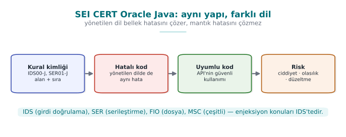

| Abbreviation | Category | The rule that touches this week |
| --- | --- | --- |
| `IDS` | Input validation and data sanitisation | IDS00-J: prevent SQL injection from untrusted data · IDS07-J: do not pass untrusted data to `Runtime.exec()` · IDS16-J: prevent XML injection · IDS17-J: prevent XML external entity attacks |
| `FIO` | Input/output | FIO16-J: canonicalise path names before validating them |
| `SER` | Serialization | SER12-J: prevent deserialisation of untrusted data |
| `MSC` | Miscellaneous | MSC03-J: never hard-code sensitive information |
| `ERR` | Error handling | ERR01-J: do not leak sensitive information in exceptions |
| `FIO` | Logging | FIO13-J: do not log sensitive information outside a trust boundary |
| `OBJ` | Object orientation | OBJ01-J: limit the accessibility of fields |
| `SEC` | Platform security | SEC00-J: do not let privileged blocks leak sensitive information |

### Why are CERT rules still needed if Java has solved memory bugs?

The SEI CERT C rules we saw in Week 4 (`ARR`, `STR`, `MEM`, …) targeted memory-management bugs for the most part;
because the JVM closes off this class automatically, the `MEM` category in the Java standard is almost empty. But
the `IDS`, `SER`, `FIO`, `MSC` and `ERR` categories in the table are bugs **the language does not solve**: topics
such as input validation, deserialisation and leaking sensitive information are about **design decisions**, not
memory. This is why CERT works from language to language on the principle "which category grows, which shrinks":
in the C standard `MEM` and `ARR` are printed bold; in the Java standard `IDS` and `SER` are.

!!! tip "Reading it alongside OWASP"
    For web applications, the **OWASP Top 10** (Week 2) and ASVS, and for mobile applications **OWASP MASVS**
    (especially MASVS-CODE and MASVS-RESILIENCE) rank the same topics by application type. The CERT rules answer
    "how do I write the code?"; the OWASP documents answer "what do I test?"

---

## 3. The common root of injection: data and command mixing together (Recipe 3.11)

SQL injection, command injection, path traversal, XML injection, template injection, the log injection from
Week 2, and the format-string flaw from Week 4 are different faces of the same bug: inside the text handed to an
**interpreter** (a SQL engine, a shell, a filesystem, an XML parser, `printf`), the **command** and the **data**
travel through the same channel. If the user data contains the interpreter's special characters (`'`, `;`, `../`,
`<`, `%`), the data becomes part of the command.

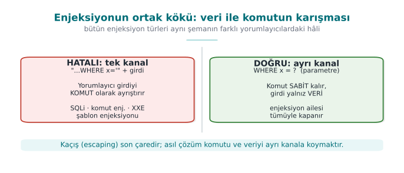

This is why the **real** fix for every kind of injection is the same: **give the command and the data through
separate channels**. Sanitising with an escape character (`'` → `''`) is the second line of defence; every
interpreter's escaping rules are different, and forgetting just one is enough.

| Interpreter | Single channel (wrong) | Two channels (correct) |
| --- | --- | --- |
| SQL engine | `"SELECT … WHERE ad='" + ad + "'"` | `PreparedStatement` + `?` parameters |
| Shell | `Runtime.exec("sh -c 'ping " + host + "'")` | `ProcessBuilder("ping", host)` — no shell |
| Filesystem | `new File(kok, istek)` | Canonicalise + check it is inside the root |
| XML | Building XML by string concatenation | Building elements and attributes with the DOM / StAX API |
| HTML | `"<p>" + yorum + "</p>"` | The template engine's automatic escaping, context-aware encoding |
| `printf` | `printf(girdi)` | `printf("%s", girdi)` |

### Why does the interpreter mistake input for "code"? Step by step

This is the link students miss the most: **the interpreter does not know which characters of the string it
receives are "fixed code the programmer wrote" and which are "data the user entered."** All it has is a sequence of
characters, one after another. Let's make this concrete; let's follow, character by character, how a SQL engine
reads the string that `"SELECT ... WHERE ad = '" + ad + "'"` builds at run time (assume the `ad` variable holds the
input `x' OR '1'='1`):

1. Java first performs the string concatenation; the result is **a single piece of plain text**:
   `SELECT ... WHERE ad = 'x' OR '1'='1'`. From this point on, the information "this part was written by the
   developer," "this part was entered by the user" has **already been lost** — all that remains is characters.
2. This plain text is sent to the SQL engine as **a single command**. The engine's parser (lexer/parser) scans the
   string left to right, character by character, and enters a **state** based on each character.
3. After reading `WHERE ad =`, it meets a space and then a `'` character → the parser moves into the "string
   literal started" state. From then on it treats every following character (letter, space, `O`, `R`, …) as the
   **content** of that string literal, up to the next `'` character.
4. The first `'` in the input (the one the user wrote) satisfies exactly this expectation: the parser says "the
   string literal has ended" and **returns to ordinary SQL syntax**.
5. At the point it returns to, the text ``OR '1'='1'`` now stands in front of the parser; this text is read as
   **SQL keywords and operators** (`OR`, `=`), because the parser has left the "string literal" state.
6. Result: the engine has parsed a single query, but this query's **logical structure** (`... OR always_true`
   instead of `... AND ...`) has been determined by the characters the user typed in.

The critical point is this: the parser is **not making a mistake**; it is behaving exactly according to SQL syntax
rules. The bug is that there is **no separate channel** carrying the information "are you part of the code, or are
you data?" to the interpreter. The same sequence of steps (an interpreter → character-by-character scanning → a
state change on a special character) repeats identically for the shell with `;`, for the filesystem with `../`,
and for XML with `<`/`&`; only the "special character" and the "state machine" change. Sections 4–8 will show the
concrete counterpart of these steps in each interpreter.

!!! info "The counterpart in the textbook"
    Viega and Messier cover SQL injection in Recipe 3.11, cross-site scripting (XSS) in 3.10, filename and path
    validation in 3.7, and safely running external programs in 1.7. The book explains through C, but the
    principles are language-independent: **use a parameterised interface, skip the shell, canonicalise, apply a
    white list.**

---

## 4. SQL injection

Imagine that behind a login form there is code like this:

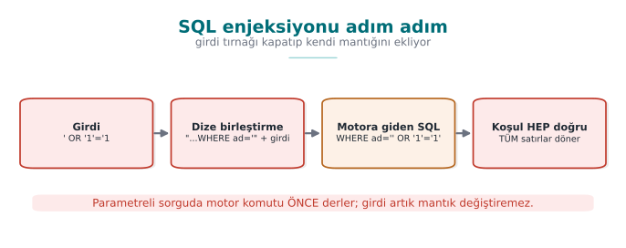

```java title="Hatalı: sorgu dize birleştirmeyle kuruluyor"
String sql = "SELECT id, rol FROM kullanicilar WHERE ad = '" + ad +
             "' AND parola_ozeti = '" + ozet + "'";
ResultSet rs = baglanti.createStatement().executeQuery(sql);
```

When the username field has `ayse` typed into it, the query behaves as expected. But if the user types
`ayse' --`, the query turns into this:

```sql
SELECT id, rol FROM kullanicilar WHERE ad = 'ayse' --' AND parola_ozeti = '...'
```

`--` means "comment to the end of the line" in SQL: the password check has been **erased** from the query. A
single quote character in the input changed the query's **structure**. With the same technique an attacker can
read other tables (`UNION SELECT`), modify or delete records, and, depending on the database configuration, even
run operating-system commands. SQL injection has sat near the top of the OWASP Top 10 lists for more than twenty
years (CWE-89).

### The fix: a parameterised query

```java title="Doğru: PreparedStatement"
String sql = "SELECT id, rol FROM kullanicilar WHERE ad = ? AND parola_ozeti = ?";
try (PreparedStatement ps = baglanti.prepareStatement(sql)) {
    ps.setString(1, ad);
    ps.setString(2, ozet);
    try (ResultSet rs = ps.executeQuery()) {
        /* ... */
    }
}
```

The query's **text** is fixed, and it is sent to and compiled by the database first; the values arrive through a
separate channel. Whatever the value contains (`'`, `--`, `;`), it is compared only as a **value**; it cannot touch
the query's structure. This is the exact counterpart of the "two channels" principle from the previous section
(IDS00-J).

### Why does a parameterised query work, mechanically?

In Section 3 we saw that the parser works character by character. `PreparedStatement` splits this mechanism into
**two stages**; that is where the magic hides:

1. **Prepare stage:** when `baglanti.prepareStatement(sql)` is called, only the text
   `SELECT id, rol FROM kullanicilar WHERE ad = ? AND parola_ozeti = ?` is sent to the database server — the
   user's input **does not exist yet**. The server parses this text (with the state machine from Section 3),
   produces a **query plan** and keeps this plan in memory. The `?` marks are **placeholders** inside the plan,
   marked "a value will go here."
2. **Bind stage:** when `ps.setString(1, ad)` is called, the content of the `ad` variable is **never concatenated
   with the SQL text**. The driver sends the value through a separate binary protocol message (the wire protocol
   between JDBC and the database), saying "the value of placeholder 1 is this byte sequence."
3. When `ps.executeQuery()` runs, the database places the incoming values directly into the plan that has
   **already been parsed**. Even if the value contains `'` or `--`, these characters **never pass through the
   parser** — parsing is already finished. The characters are only copied over as "the byte sequence to compare
   against this column."

It is instructive to compare this with the `printf("%s", girdi)` example from Section 3: the string put in place of
`%s` is **not reinterpreted**, the way a `%n` inside a format string would be; it is printed as-is. In a
parameterised query too, the value put in place of `?` is **not re-parsed**, the way the query text is; it is
compared as-is. Both mechanisms rest on the same principle: **the parsing that determines structure happens once;
binding the data is separate, and happens afterwards.**

!!! danger "A common mistake: escaping only the single quote"
    Some developers write a line like `ad.replace("'", "''")` and believe they have "solved SQL injection." The
    result: in a numeric field (`WHERE yas = " + yas`) there is no single quote at all, so escaping does nothing;
    `%` is a different special character inside a `LIKE` pattern; MySQL, PostgreSQL and Oracle each have different
    escaping rules; some drivers accept sequences in Unicode or multi-byte encodings that bypass the escaping.
    Forgetting a single character class invalidates the entire defence.

!!! success "Rule"
    Escaping is **not** the primary defence against SQL injection; at best it is an extra layer of security. The
    primary defence must always be a parameterised query (or the ORM's parameter-binding interface) — because
    escaping relies on "recognising and cleaning special characters," while a parameterised query ensures that the
    special characters **never reach the parser at all**.

### Where a parameterised query is not enough

| Case | Why? | Fix |
| --- | --- | --- |
| Table or column name (an `ORDER BY` column) | `?` can only stand in for a **value**, not a name | White list: `Map<String,String> izinli = {"ad"→"ad", "tarih"→"kayit_tarihi"}` |
| `LIKE` patterns | `%` and `_` are wildcard characters | Make the value a parameter; escape the wildcards separately |
| A hand-written query inside an ORM | JPQL / HQL is also a query language; concatenation makes the same mistake | The ORM's parameter-binding interface (`setParameter`) |
| Dynamic SQL inside a stored procedure | If concatenation happens inside the procedure, the problem has just moved | Use parameters inside the procedure too |

### Defence in depth

- **Least privilege:** the application's database user should reach only the tables it needs, and only with the
  operations it needs. The user behind the login screen should not have `DROP TABLE` rights.
- **Error message:** showing the database error to the user as-is leaks the query's structure and table names
  (ERR01-J). Give the user a generic message; put the detail in a secure log.
- **Input validation:** for fields with a known expected shape (an ID number, a date, an e-mail address), white-list
  validation narrows the attack surface; but it does **not replace** a parameterised query.

### Worked example: reading Demo 1's output line by line

The Python part of Demo 1 (`sqli.py`) sets up an SQLite database with three synthetic users (`ayse`, `mehmet`, and
an admin, `admin`), and runs the same login query in two ways. Let's follow, step by step, the output you will see
when you read and run the code; at every step we tie **why** that result came out back to the mechanism from
Sections 3–4.

```text title="ADIM 1 — Dürüst giriş: ad='ayse' parola='parola123'"
[KOTU YOL]
   Uretilen SQL:
   SELECT id, ad, rol FROM kullanici WHERE ad = 'ayse' AND parola = 'parola123'
   -> 1 satir dondu. GIRIS BASARILI:
      id=1 ad=ayse rol=kullanici
[IYI YOL]
   Uretilen SQL (sablon):
   SELECT id, ad, rol FROM kullanici WHERE ad = ? AND parola = ?   [degerler ayrica gonderilir]
   -> 1 satir dondu. GIRIS BASARILI:
      id=1 ad=ayse rol=kullanici
```

As expected: when the input is harmless, both the wrong code and the correct code produce the same result. This is
exactly why the wrong code **goes unnoticed** during development — testing is done with honest input.

```text title="ADIM 2 — SALDIRI: parola alanina  ' OR '1'='1  yaziliyor"
[KOTU YOL]
   Uretilen SQL:
   SELECT id, ad, rol FROM kullanici WHERE ad = 'ayse' AND parola = '' OR '1'='1'
   -> 3 satir dondu. GIRIS BASARILI:
      id=1 ad=ayse rol=kullanici
      id=2 ad=mehmet rol=kullanici
      id=3 ad=admin rol=yonetici
   ^ Parola bilinmeden giris yapildi: sorgu yapisi degisti.
[IYI YOL]
   -> Sonuc yok. GIRIS REDDEDILDI.
   ^ Girdi bir DEGER olarak arandi; oyle bir parola yok: RED.
```

Follow the steps from Section 3 here: after `parola = '` is written, the attacker's first `'` character closes the
string literal; the text ``OR '1'='1'`` that follows is then read as a SQL operator. Because `'1'='1'` is always
**true**, the right-hand side of the `AND` is true for every row; the query effectively becomes
`WHERE ad='ayse' OR true`, and **the entire table** is returned. In the correct path, the whole string the
attacker typed (quote, `OR`, equalities and all) goes to the database as a single text **value**; since no one has
such a password, the result is empty.

```text title="ADIM 3 — SALDIRI: ad alanindan yonetici satirini cekme,  ad = ' OR rol='yonetici' --"
[KOTU YOL]
   Uretilen SQL:
   SELECT id, ad, rol FROM kullanici WHERE ad = '' OR rol='yonetici' --' AND parola = 'farketmez'
   -> 1 satir dondu. GIRIS BASARILI:
      id=3 ad=admin rol=yonetici
   ^ Baska kullanicinin (yonetici) satiri sizdirildi.
[IYI YOL]
   -> Sonuc yok. GIRIS REDDEDILDI.
   ^ Boyle bir ad yok: sizinti yok.
```

Here the attacker both changed the query structure with `OR` **and** used `--` to turn the rest of the query (the
password check) into a SQL comment, disabling it; it now **no longer matters at all** what is written in the
password field. In the parameterised query this string (quote, `OR`, `--` and all) is compared against the `ad`
column as a single text value; since no such username exists, the result is empty.

### Demo 1 — SQL injection: string concatenation and parameterised query

!!! info "Demo 1 · `code/week-05/01-sql-enjeksiyonu` · CWE-89 · IDS00-J · Recipe 3.11"
    The demo builds a small SQLite database with synthetic users inside the demo folder, and sets up the same
    login/search query in two ways: by string concatenation and by parameterised query. The main part runs with
    Python's built-in `sqlite3` module and downloads nothing; the optional Java part shows the same idea with a
    real JDBC `PreparedStatement` (the driver is downloaded into the demo folder by the `hazirla` script).

=== "Windows (PowerShell)"

    ```powershell
    cd code\week-05\01-sql-enjeksiyonu
    .\demo.ps1
    ```

=== "WSL / Linux"

    ```bash
    cd code/week-05/01-sql-enjeksiyonu
    sh demo.sh
    ```

| Step | What happens? | Lesson |
| --- | --- | --- |
| 1 | Honest login: both paths work | The wrong code looks correct under normal conditions |
| 2 | `' OR '1'='1` in the password field | With string concatenation, login succeeds without knowing the password |
| 3 | Input in the search field that changes the query's structure | Another user's (the admin's) row leaks |
| 4 | The same inputs with a parameterised query | The input is only a value; the attack is rejected |

!!! question "How does an assessor test this?"
    In the source code, they search for every place that concatenates a variable into query text (`"SELECT` + `+`,
    SQL built with `String.format`, `createStatement`). In dynamic testing, they put a single quote, a comment
    marker and logical expressions into every input field, and look for changes in error messages, response times
    and the number of records returned. Automated tools (e.g. sqlmap) are used only in **authorised** test
    environments.

---

## 5. Command injection

Applications sometimes hand a task off to an external program: converting an image, opening an archive, testing a
network address. If the command is given to a **shell** as a single **string**, the shell characters inside the
string (`;`, `&&`, `|`, `` ` ``, `$( )`) start new commands:

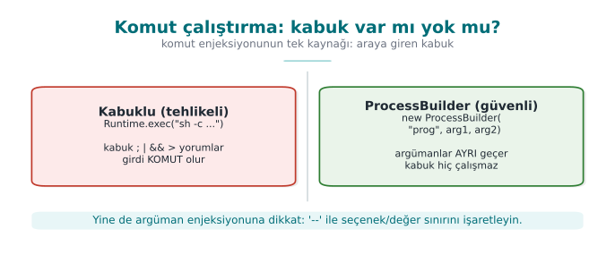

```java title="Hatalı: kabuk üzerinden dize"
String kullanici = istek.getParameter("ad");
Runtime.getRuntime().exec(new String[]{"sh", "-c", "echo Merhaba " + kullanici});
/* ad = "ayse; <başka bir komut>"  →  kabuk iki komut çalıştırır */
```

The same situation arises on Windows with `cmd /c` and the `&` character. Java's `Runtime.exec(String)` form,
which takes a single string, also splits the string on whitespace by its own rules; it is possible to shift
arguments around by playing with quotes (IDS07-J).

### How does the shell parse input, step by step?

Let's apply the general principle from Section 3 to the shell (`sh`, `bash`, `cmd`). Suppose the `kullanici`
variable holds `"ayse; echo SIZDI"`; Java concatenates this string and hands the shell the following **single
piece of text**: `echo Merhaba ayse; echo SIZDI`. The shell processes it like this:

1. The shell first **splits** the text it receives **into commands**, based on **command separator** characters
   (`;`, `&&`, `||`, end of line). This is the shell's own syntax rule, exactly like the SQL parser changing state
   on a `'` character.
2. The part up to the `;` character (`echo Merhaba ayse`) is separated out as the **first command**.
3. The part after the `;` (`echo SIZDI`) is separated out as a **second, independent command**.
4. The shell runs **both commands in sequence** — as if the user had typed two separate lines at the terminal.
5. The application itself believes it made a single `exec` call; but from the shell's point of view there are
   **two** commands, because the shell re-parsed the text by its own rules.

The critical point is, again, the same: the shell is **not making a mistake**, it is reading the `;` character
exactly according to its syntax rule. Java's information "this was a username" was already lost the moment the
string reached the shell.

### The fix: no shell, with an argument list

```java title="Doğru: ProcessBuilder + izin listesi"
private static final Pattern AD = Pattern.compile("^[A-Za-z0-9_]{1,32}$");

if (!AD.matcher(kullanici).matches()) {
    throw new IllegalArgumentException("gecersiz ad");       // varsayılan: reddet
}
Process p = new ProcessBuilder("/usr/bin/printf", "Merhaba %s\n", kullanici)
        .redirectErrorStream(true)
        .start();
```

1. **No shell:** `ProcessBuilder` launches the program directly; `;` or `&` are just characters inside an argument.
2. **Full path:** the program's full path is given, against the PATH attack from Week 1.
3. **Allow list:** the argument is validated against the expected shape before it is run.
4. **Best of all:** removing the need for an external program entirely. Using a library to convert an image, or
   `InetAddress.isReachable` to test an address, eliminates the whole problem.

!!! warning "An argument list doesn't solve everything"
    Even without a shell, the program being called interprets its own arguments. User input starting with `-` can
    be passed to the program **as an option** (argument injection): for example, `--output=/baska/yer` instead of a
    file name. Most programs support `--` to say "everything after this is not an option"; the allow list should
    also reject input that starts with `-`.

!!! danger "A common mistake: filtering out only the characters that look dangerous"
    Some developers remove only `;` and `&` from the input and believe they have "cleaned it." The shell's command
    separators are not limited to these two: `|`, `` ` ``, `$( )`, the newline character (`\n`), and even `>` and
    `<` (redirection to a file) are also special to the shell. A blacklist approach (forbidding specific
    characters) is always open to the next forgotten character.

!!! success "Rule"
    The primary defence against command injection is **never calling the shell at all** (`ProcessBuilder`, a
    `subprocess` argument list). An allow list (matching against the expected character set), not a blacklist, is
    the secondary layer.

### Worked example: reading Demo 2's output line by line

The Python part of Demo 2 (`komut.py`) runs a "greeting tool" first through the shell (`shell=True`), then with an
argument list (`shell=False`). On WSL/Linux, the actual output is as follows:

```text title="ADIM 1 — Durust girdi: ad = 'Ayse'"
[KOTU YOL]
   Kabuga giden komut:
   echo "ARAC CIKTISI: Merhaba" Ayse
   | ARAC CIKTISI: Merhaba Ayse
[IYI YOL]
   Arguman listesi:
   [python, -c, ...] ... 'Ayse'
   | ARAC CIKTISI: Merhaba Ayse
```

```text title="ADIM 2 — SALDIRI: ad = 'Ayse; echo SIZDI-KOMUT-ENJEKSIYONU'"
[KOTU YOL]
   Kabuga giden komut:
   echo "ARAC CIKTISI: Merhaba" Ayse; echo SIZDI-KOMUT-ENJEKSIYONU
   | ARAC CIKTISI: Merhaba Ayse
   | SIZDI-KOMUT-ENJEKSIYONU
   ^ 'SIZDI...' satiri = enjekte edilen komut kostu.
[IYI YOL]
   Izin listesi REDDETTI (^[A-Za-z0-9_]+$):
   girdi = Ayse; echo SIZDI-KOMUT-ENJEKSIYONU
   -> Program hic calistirilmadi.
   ^ Izin listesi bosluk/;/& gordu ve reddetti.
```

In the wrong path, the shell followed the five steps above, split the string in two at the `;`, and ran **two
separate commands**; the second line (`SIZDI-...`) is proof that the injected command **actually ran** (the demo
uses a harmless `echo`). In the correct path, `ProcessBuilder`/`subprocess` never calls any shell; the input is a
single argument, and the allow list (`^[A-Za-z0-9_]+$`) rejects this input, which contains a space and a `;`,
**before** it is ever run.

### Demo 2 — Command injection

!!! info "Demo 2 · `code/week-05/02-komut-enjeksiyonu` · CWE-78 · IDS07-J · Recipe 1.7–1.8"
    A "greeting tool" passes the username to an external program. The wrong version gives the command to the shell
    as a single string (`sh -c`, `cmd /c`, `Runtime.exec(String)` in Java); a `;` or `&` in the input starts a
    second command. The injected command is only a **harmless `echo`**. The correct version uses `ProcessBuilder`
    (Java) and a `subprocess` argument list (Python), and validates the input with an allow list. The same lesson
    is shown in two languages.

=== "Windows (PowerShell)"

    ```powershell
    cd code\week-05\02-komut-enjeksiyonu
    .\demo.ps1
    ```

=== "WSL / Linux"

    ```bash
    cd code/week-05/02-komut-enjeksiyonu
    sh demo.sh
    ```

---

## 6. Path traversal (Recipe 3.7)

A file server should only serve files under a specific folder. If the requested file name is appended directly to
this folder's path, sequences of `../` escape **outside** the root:

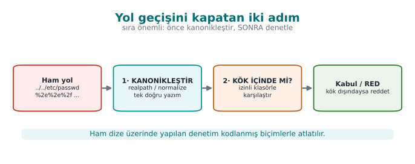

```java title="Hatalı"
Path kok = Paths.get("/srv/veri");
Path dosya = kok.resolve(istek);                  // istek = "../../etc/passwd"
return Files.readAllBytes(dosya);                 // kökün dışındaki dosya okunur
```

### Path normalisation step by step: why does `../` walk back up to the root?

`resolve()`/`normalize()` process a path with a single **stack** algorithm. Let `kok = "/srv/veri"` and
`istek = "../../etc/passwd"`. The filesystem processes this request segment by segment, like this:

| Step | Segment read | Stack state | Explanation |
| --- | --- | --- | --- |
| 0 | (start) | `[srv, veri]` | Starts from the root path |
| 1 | `..` | `[srv]` | One segment up (`veri`) is **popped** from the stack |
| 2 | `..` | `[]` | One more segment up (`srv`) is **popped** |
| 3 | `etc` | `[etc]` | A normal segment is **pushed** onto the stack |
| 4 | `passwd` | `[etc, passwd]` | A normal segment is pushed |

Result: `/etc/passwd` — a path completely outside the root (`/srv/veri`). The `..` characters are, for the parser,
the command "go up one folder"; just as `'` in SQL is the command "close the string literal," `..` plays the same
role in the filesystem. This is why a check that only searches the raw string for `".."` (`istek.contains("..")`)
is not enough: forms such as `..%2f` (URL-encoded) or `....//` (nested spelling) bypass this search, while still
ending up outside the root when processed with **the same stack algorithm**. The correct order is therefore to
**normalise first** (run the stack algorithm to completion), then **check the result** — we check the final stack
content, not the intermediate steps.

### The fix: canonicalise first, then check whether it is inside the root

```java title="Doğru: kanonik yol + kök denetimi (FIO16-J)"
Path kok = Paths.get("/srv/veri").toRealPath();
Path aday = kok.resolve(istek).normalize();      // istek mutlak yolsa resolve onu olduğu gibi döndürür
if (!aday.startsWith(kok)) throw new SecurityException("kok disi");
Path gercek = aday.toRealPath();                  // sembolik bağlantıları da çözer
if (!gercek.startsWith(kok)) throw new SecurityException("kok disi");
return Files.readAllBytes(gercek);
```

Order matters: first the **canonical** (single, definitive) path is obtained, and only then is it checked.
Checking the raw string (`istek.contains("..")`) is not enough; `..%2f`, `....//`, `..\` on Windows and absolute
paths with a drive letter, Unicode forms, and **symbolic links** can all bypass the check. `toRealPath()` also
resolves symbolic links to their real targets; because the TOCTOU problem from Week 2 (the time between check and
use) still applies, it is most robust to verify again that the file is inside the root after it has been opened.

!!! example "Path traversal inside archives: Zip Slip"
    When extracting a ZIP or TAR archive, the file names inside the archive are also untrusted input. An entry
    named `../../x` can be written outside the extracting program's destination folder. Any code that extracts
    archives must canonicalise each entry's destination path the same way as above and verify it is inside the
    root.

!!! danger "A common mistake: searching only for the `..` string"
    The line `if (istek.contains(".."))` is the "fix" students write most often. But `..%2f` (a URL-encoded dot and
    slash, which becomes `../` if decoded before reaching the server), `..\` on Windows, absolute paths with a
    drive letter (`C:\...`), and a symbolic link **inside** the root folder that points outside the root — none of
    these are caught by this one-line check. `contains("..")` can also produce a false positive on a legitimate
    file name (`rapor..v2.txt`).

!!! success "Rule"
    The only valid pattern against path traversal: **normalise (canonicalise) first, then check that the result
    stays inside the root, and if needed check again after the file is opened.** Searching the raw string for a
    pattern is never enough.

### Worked example: reading Demo 3's output line by line

The Python part of Demo 3 (`yol.py`) treats the `cikti/veri/` folder as the **root**; outside the root
(`cikti/gizli.txt`) there is a synthetic "admin note." The actual output:

```text title="ADIM 1 — Mesru istek: 'rapor.txt'"
[KOTU YOL]
   Cozulen yol: .../cikti/veri/rapor.txt
   OKUNDU -> Herkese acik rapor (sentetik).
[IYI YOL]
   Cozulen yol: .../cikti/veri/rapor.txt
   OKUNDU -> Herkese acik rapor (sentetik).
```

```text title="ADIM 2 — SALDIRI: '../gizli.txt' (kok disi)"
[KOTU YOL]
   Cozulen yol: .../cikti/gizli.txt
   OKUNDU -> GIZLI: sentetik yonetici notu (kok disinda).
   ^ Kok disindaki gizli dosya sizdirildi.
[IYI YOL]
   REDDEDILDI: kok disina cikiyor -> .../cikti/gizli.txt
   ^ resolve() + kok denetimi engelledi.
```

In the wrong path, the expression `KOK / "../gizli.txt"` pops the `veri` segment with the stack algorithm above and
lands directly on `cikti/gizli.txt` — it has climbed to **one folder above the root**. In the correct path, the
same normalisation happens, but because the result does not start with the root (`cikti/veri`), the request is
**rejected** before it is ever executed.

### Demo 3 — Path traversal

!!! info "Demo 3 · `code/week-05/03-yol-gecisi` · CWE-22 · FIO16-J · Recipe 3.7"
    A "file server" should serve only the files under `cikti/veri/`. The wrong version appends the request directly
    to the root, and a `../gizli.txt` request leaks the **synthetic** secret file outside the root. The correct
    version canonicalises the path (`normalize()` + `toRealPath()`, `resolve()` in Python) and verifies the result
    stays inside the root; an absolute path and a drive letter are also rejected. On Windows both the `..\` and
    `../` separators are handled.

=== "Windows (PowerShell)"

    ```powershell
    cd code\week-05\03-yol-gecisi
    .\demo.ps1
    ```

=== "WSL / Linux"

    ```bash
    cd code/week-05/03-yol-gecisi
    sh demo.sh
    ```

---

## 7. Unsafe deserialisation

**Serialization** is converting an object into a byte sequence to store it or send it over the network;
**deserialization** is the reverse. Java's built-in `ObjectInputStream` mechanism creates an object of **any**
serialisable class whose name is written in the byte stream, and while doing so runs some of that class's methods
(such as `readObject`, `readResolve`).

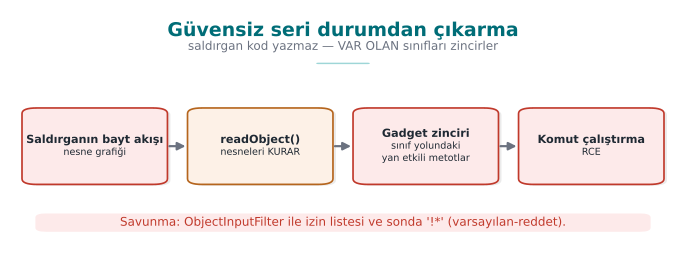

The problem is this: if the byte stream comes from an untrusted source, **the attacker chooses which classes get
created**. Innocent-looking classes found in libraries on the application's class path can be chained together so
that, as they are created, they trigger one another. In real incidents these chains have gone all the way to
remote code execution; in 2015 this is exactly how a series of vulnerabilities, working through classes in a
widely used common library, affected many enterprise server products. This is why CWE-502 ("deserialization of
untrusted data") is part of the "software and data integrity failures" category in the OWASP Top 10.

!!! note "We are not writing a chain in this course"
    How attack chains are built is not the subject of this course. The only thing we need to know is:
    **deserialising an untrusted byte stream without a filter hands the attacker the authority to choose the
    class.** The defence rests entirely on this one sentence.

### How does a byte stream carry a class name? The mechanism, step by step

We are not writing the attack chain **itself**, but understanding **where** the authority in the attacker's hands
comes from also makes the defence meaningful. The beginning of the byte stream `ObjectOutputStream` produces has a
fixed format:

1. The first two bytes are always `AC ED` — the "stream magic," a signature stating that this stream is a Java
   object stream.
2. The next two bytes are `00 05` — the version of the stream format.
3. After that comes an **object block**; this block begins with a **class descriptor**: the class's **fully
   qualified name** (something like `com.ornek.Ayar`) sits in the stream as **plain text**, with a length prefix.
4. When `ObjectInputStream.readObject()` runs, it first reads this name, then **looks up and loads** the class on
   the class path with a call resembling `Class.forName(isim)` — no type check has happened yet, because the
   stream itself is stating what the expected type is.
5. Once the class is loaded, the JVM **allocates** an object of this class (without an ordinary constructor call,
   through a mechanism specific to deserialisation) and writes the field values from the stream into this object;
   if the class defines special methods such as `readObject`/`readResolve`, these are also **run** at this point.

The result of steps 3–4 is: **the party that sends the stream decides which class gets loaded**, not the
application. If the stream comes from an untrusted source, *any* class name on the class path can be written; then
whatever that class's `readObject`/`readResolve` methods do while they run (opening a file, creating another
object, calling a method) is under the attacker's control. A series of such classes triggering one another in a
**chain** (the "gadget chain" of real incidents) can end up at arbitrary code execution — we are **not writing**
how the chain is built, but steps 3–4 fully explain "why it is possible."

!!! danger "A common mistake: thinking 'my own classes are the ones being deserialised, so I'm safe'"
    Without a filter, `ObjectInputStream` accepts **every** `Serializable` class whose name is written in the
    stream — not only the classes you wrote, but the classes of **all** your dependencies on the class path (and
    their dependencies, too). Even if your application never writes a dangerous `readObject`, if a library you use
    has such a class, it is enough to write its full name into the stream.

!!! success "Rule"
    Before opening an untrusted byte stream with `ObjectInputStream.readObject()`, always attach an
    `ObjectInputFilter`, and **always** end the pattern with `!*`. If possible, do not use Java serialization at
    all; formats such as JSON/Protobuf never write a class name into the stream, they only carry data fields.

### Layers of defence

| Order | Measure | Explanation |
| --- | --- | --- |
| 1 | **Never use it** | For untrusted data, use **data formats** (JSON, Protobuf) instead of Java serialization; these only carry data, they never let the sender choose a class |
| 2 | **Allow-list filter** | Since Java 9, `ObjectInputFilter` (JEP 290); since Java 17, a context-specific filter factory (JEP 415): only the expected classes |
| 3 | **Limits** | The stream's depth, array size, total byte count and object count are bounded (against denial of service) |
| 4 | **Integrity** | If serialised data is stored or transported, it is signed with an HMAC; it is not deserialised until the signature is verified |
| 5 | **Dependency hygiene** | Do not leave unused libraries on the class path (Section 14) |

```java title="İzin listesi filtresi (SER12-J)"
ObjectInputFilter filtre = ObjectInputFilter.Config.createFilter(
        "com.ornek.Ayar;java.base/*;maxdepth=5;maxarray=1000;maxbytes=65536;!*");
try (ObjectInputStream in = new ObjectInputStream(akis)) {
    in.setObjectInputFilter(filtre);
    Ayar a = (Ayar) in.readObject();          // beklenmeyen sınıf → InvalidClassException
}
```

The pattern is read left to right: allow classes in `com.ornek.Ayar` and the `java.base` module, apply the limits,
**reject everything else** (`!*`). The last item is the deny-by-default principle; if it is left out, the filter
turns into a blacklist.

### Worked example: reading Demo 7's output line by line

Demo 7's Java code (`SeriDemo.java`) defines two harmless classes: the **expected** `Ayar` (carries a name +
value), and the **unexpected** `BaskaSinif` (in a real attack this would be a "gadget"; here it only carries a
string). Both are serialised and then deserialised, first without a filter, then with one. The actual output:

```text title="ADIM 1 — FILTRESIZ cozme: her sinif kabul edilir"
   [beklenen Ayar] KABUL -> Ayar(ad=zaman-asimi, deger=30)  (Ayar)
   [beklenmeyen BaskaSinif] KABUL -> BaskaSinif(yuk=beklenmeyen-sinif)  (BaskaSinif)
   ^ Filtre olmadan gelen HER sinif olusturulur;
     gercekte bu bir gadget zinciri olabilirdi.
```

```text title="ADIM 2 — ObjectInputFilter ile: allow-list"
   [beklenen Ayar] KABUL -> Ayar(ad=zaman-asimi, deger=30)
   [beklenmeyen BaskaSinif] REDDEDILDI (filtre): beklenmeyen sinif engellendi.
```

The filter `"SeriDemo$Ayar;java.base/*;!*"` allows only the `Ayar` class and Java's own core classes. Recall the
mechanism from Step 1: the filter checks the name read from the stream **before the class is loaded**; because
`BaskaSinif` is not on the list, the `readObject` call stops with an `InvalidClassException` — the class is never
instantiated, none of its methods run.

### Demo 7 — Safe deserialisation

!!! info "Demo 7 · `code/week-05/07-deserializasyon` · CWE-502 · SER12-J"
    The demo **contains no attack chain at all**. The unfiltered version creates every class in the stream: both
    the expected `Ayar` and the unexpected `BaskaSinif` are accepted. The filtered version uses `ObjectInputFilter`
    to allow only the expected classes; the unexpected class is rejected with `InvalidClassException`.

=== "Windows (PowerShell)"

    ```powershell
    cd code\week-05\07-deserializasyon
    .\demo.ps1
    ```

=== "WSL / Linux"

    ```bash
    cd code/week-05/07-deserializasyon
    sh demo.sh
    ```

!!! question "How does an assessor test this?"
    They search the source code for `ObjectInputStream`, `readObject`, XML-based object decoders, and JSON
    libraries with "polymorphic type" support turned on; for every use they ask where the data comes from. If a
    filter exists, they check that its pattern ends in `!*`. They look for Java serialization's magic bytes
    (`AC ED 00 05`) in network traffic or in files.

---

## 8. XML, template and other kinds of injection

The same "mixing of data and command" bug shows up in every interpreter. The four most common ones:

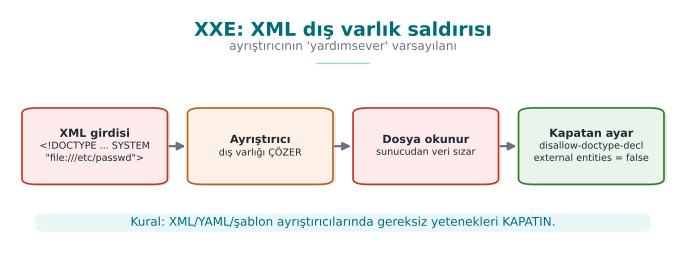

| Type | How does it arise? | Defence | CWE |
| --- | --- | --- | --- |
| **XML external entity (XXE)** | The XML parser reads local files or network addresses through `<!DOCTYPE>` definitions in the document | Disable DTDs and external entities in the parser | 611 |
| **Cross-site scripting (XSS)** | User data is written into an HTML page without escaping; a script runs in another user's browser | The template engine's context-aware automatic escaping, a Content Security Policy (CSP) | 79 |
| **Template injection** | User data is processed **as the template itself** | Give user data only as a template **variable** | 1336 |
| **LDAP / XPath injection** | The directory or XML query is built by string concatenation | Parameterised interfaces, escaping special characters | 90, 643 |

### The XXE mechanism, step by step (without writing a payload)

!!! note "We are not writing a working XXE payload in this course"
    As in the deserialisation section, we are not giving a real attack document here either. What we need to know
    is **which step** the XML parser makes exploitable; the defence (the code below) consists entirely of closing
    off that step.

The XML standard allows a document to declare a **DTD** (Document Type Definition) at its start, and to define
special abbreviations (**entities**) inside that DTD — much like a "find-and-replace" shortcut in a text editor:
wherever `&abbreviation;` is written in the document, the **real content** defined in the DTD is substituted in.
The problem is that this "real content" can come **from an external source** (a file path or network address
marked with the `SYSTEM` keyword):

1. While reading the document, the parser first processes the **DTD block**; it records every
   `<!ENTITY ad SYSTEM "kaynak">` definition inside the DTD into an **abbreviation table** (`ad` → `kaynak`).
2. While processing the body of the document, if the parser meets a reference of the form `&ad;`, it **opens** the
   `kaynak` from the abbreviation table (reads the file or makes a network request) and **substitutes** its content
   in place of `&ad;`.
3. This substitution happens **during parsing**, without the application's own logic ever getting involved; by the
   time the application "finishes reading" the XML, the entity has already been expanded, and the file's content
   has been mixed into the document text.
4. If the application shows this expanded text back to the user in any form (in an error message, in a response
   field), the file's content has been **leaked**; if the source is a network address, this also means the server
   has sent a request into the internal network (SSRF, Week 3).

The critical point is, again, the same: the parser is not making a mistake, it is implementing the DTD standard
**exactly**. The hardening below closes off the **first step** of these four (processing the DTD at all) and the
**second step** (opening externally sourced entities) from the start; that way steps 3–4 never get a turn.

!!! danger "A common mistake: validating only the user input and leaving the XML parser as-is"
    Input validation (a white list, a length limit) looks at XML's **content**; but XXE abuses a **structural**
    property of the document (the DTD/entity declaration). Saying "the content looked safe" is not enough — entity
    expansion happens at the parser level, without ever passing through any of the application's input checks.

!!! success "Rule"
    If your application does not use DTDs or external entities (most web services do not), **always** disable them
    in the parser (`disallow-doctype-decl`, rejecting external entities). This is the most direct application of
    the "disable what you don't need" principle (the rule at the start of Section 8).

```java title="XXE'ye karşı ayrıştırıcıyı sağlamlaştırmak (IDS17-J)"
DocumentBuilderFactory f = DocumentBuilderFactory.newInstance();
f.setFeature("http://apache.org/xml/features/disallow-doctype-decl", true);   // DTD yok
f.setFeature("http://xml.org/sax/features/external-general-entities", false);
f.setFeature("http://xml.org/sax/features/external-parameter-entities", false);
f.setXIncludeAware(false);
f.setExpandEntityReferences(false);
```

The rule is the same every time: **know which of the interpreter's features are turned on, disable what you do not
need, do not pass data through the command channel.** The book's XSS recommendations in Recipe 3.10 (encoding
output based on context, validating input with a white list) have become the default behaviour of today's web
frameworks; but turning on a "raw HTML" option in a template, or building a page by string concatenation, brings
the same bug right back.

### The same mechanism in XSS: how does the browser parse HTML?

The exact counterpart of the "the parser expands externally sourced content" idea from XXE, in XSS, is the
**browser's** HTML parser. In a string concatenation like `"<p>" + yorum + "</p>"`, if the `yorum` variable
contains an HTML **tag-opening character** (`<`), the browser moves from the "text state" into the "tag state" the
moment it sees this character — exactly the same mechanism as the SQL parser changing state on a `'` character.
Result: part of the text the user wrote becomes part of the page's **structure** (a new tag, and therefore
potentially an executable script tag), and it runs in the browser of **every user** who views this HTML — the
difference from SQL injection is that the victim is not a database, but **another user** who opens the page.
Template engines' "automatic escaping" does exactly the same job as the parameterised query from Section 4: it
encodes user data as plain **text content**, not as HTML **syntax** (writing `&lt;` instead of `<`), so that the
parser never enters the "tag state" at all.

---

## 9. Interpreted languages: the same bugs in Python and JavaScript

The syllabus names this week "Java and interpreted languages." In languages such as Python, JavaScript (Node.js),
Ruby and PHP, memory safety is also free; but these languages make **generating and running code at run time**
much easier than Java does. The same bug classes appear here under different names:

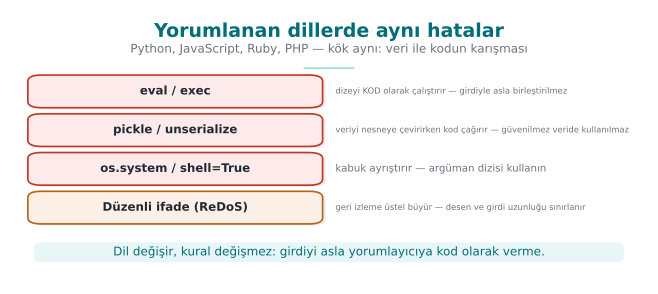

| Bug | Java | Python | JavaScript / Node.js |
| --- | --- | --- | --- |
| SQL injection | `Statement` + concatenation | `cursor.execute(f"... {ad}")` | Query built with a template string |
| The fix | `PreparedStatement` | `cursor.execute("... ?", (ad,))` | The driver's parameter-binding interface |
| Command injection | `Runtime.exec(String)` | `os.system`, `subprocess.run(..., shell=True)` | `child_process.exec` |
| The fix | `ProcessBuilder` | `subprocess.run([...])` (a list, `shell=False`) | `child_process.execFile` / `spawn` (an array) |
| Running code | Reflection, script engines | `eval`, `exec` | `eval`, `new Function`, `vm` |
| Unsafe deserialisation | `ObjectInputStream` | `pickle.loads`, `yaml.load` (the unsafe loader) | Object-decoding libraries; prototype pollution |
| The fix | Filter / JSON | `json.loads`, `yaml.safe_load` | `JSON.parse` + schema validation |

### `eval` and friends: running data as code

The most dangerous feature of interpreted languages is being able to run a string **as code**. A string coming
from the user reaching `eval` is the most direct form of injection: the interpreter itself is the command channel.

```python title="Hatalı ve doğru: kullanıcının girdiği bir sayıyı okumak"
deger = eval(girdi)                 # HATALI: girdi herhangi bir Python ifadesi olabilir

import ast
deger = ast.literal_eval(girdi)     # Daha iyi: yalnız sayı, dizge, liste gibi SABİTLERİ kabul eder
deger = int(girdi)                  # En iyisi: beklenen türü doğrudan ayrıştır, hatayı yakala
```

The rule is simple: **user data must never reach `eval`, `exec`, `new Function`, or a script engine.** If a
calculator or a rule engine is genuinely needed, a small parser that recognises only the allowed operations is
written instead.

!!! danger "A common mistake: saying 'I filtered the input, then eval'd it'"
    Searching for dangerous words (`import`, `os`, `__`) and calling `eval` when none are found is a common but
    fragile defence: in Python there are ways to call the same functionality under other names (through indirect
    access), and this list is never complete. `eval` itself is the code channel; putting a filter in front of the
    channel is weaker than **closing** the channel.

!!! success "Rule"
    Never give user input to a language's full interpreter. Use a parser that accepts only literals
    (`ast.literal_eval`), or a function that directly parses the expected type (`int`, `float`); neither of these
    **executes** code, they only **read** data.

### Deserialisation: `pickle` and YAML

Python's `pickle` module carries the same problem as Java serialisation: the data being decoded determines
**which objects get created and how**; its own documentation explicitly says "never unpickle untrusted data." YAML
libraries' full loaders can create objects in a similar way.

```python title="Güvenli seçimler"
import json, yaml

veri = json.loads(metin)            # yalnız veri: sözlük, liste, sayı, dizge
ayar = yaml.safe_load(metin)        # yalnız temel YAML türleri
# pickle.loads(metin)               # YALNIZ kendi ürettiğiniz ve HMAC ile doğruladığınız veride
```

### Denial of service through regular expressions (ReDoS)

The most common tool for input validation is regular expressions; but a badly written regular expression can
itself become an attack surface. In engines that use backtracking (the built-in engines of Java, Python and
JavaScript), a pattern containing nested repetition runs in **exponential** time on a specially crafted input:

```text
Desen:  ^(a+)+$
Girdi:  "aaaaaaaaaaaaaaaaaaaaaaaaaaaaa!"   → motor, eşleşmeyi kanıtlamak için milyonlarca yol dener
```

A single request can keep a server's processor busy for seconds or minutes (CWE-1333). Defence:

1. Avoid nested repetition (`(a+)+`, `(a|a)*`, `(\w+\s?)*`); write the pattern as **precisely** as possible.
2. Bound the input's length **before** the regular expression runs (the "length first" principle from Week 4).
3. Use a linear-time engine where possible (RE2 and its derivatives).
4. Turn on static analysis tools' ReDoS rules.

### Worked example: why does backtracking grow exponentially? Let's count by hand

Let's not leave the "tries millions of paths" sentence from above abstract; let's count, on a small input, exactly
how many paths **really** get tried. The pattern `^(a+)+$` consists of two nested repetitions: the inner `(a+)`
means "one or more `a`," and the outer `(...)"+"` repeats this group "one or more times." The engine tries every
possibility for **how many pieces** to split the inner group's `a` sequence into — this is called the
**compositions** of a number.

Let's take just 4 `a` characters as input (`"aaaa"`), and work out by hand how many different ways the engine's
inner group can split these 4 `a`'s (each part must contain at least 1 `a`, because `a+` cannot be empty):

| # | Split (how many times the outer group runs) | Parts |
| --- | --- | --- |
| 1 | 1 time | `aaaa` |
| 2 | 2 times | `aaa` + `a` |
| 3 | 2 times | `aa` + `aa` |
| 4 | 2 times | `a` + `aaa` |
| 5 | 3 times | `aa` + `a` + `a` |
| 6 | 3 times | `a` + `aa` + `a` |
| 7 | 3 times | `a` + `a` + `aa` |
| 8 | 4 times | `a` + `a` + `a` + `a` |

There are exactly **8** different splits. The general rule: the number of compositions of `n` `a`'s is `2^(n-1)`
(for `n=4`, `2³=8`, which the table confirms). The input `"aaaa"` **matches** on its own (the pattern ends with
`$`, and the full match succeeds), so the engine can stop on the first attempt. But if we add a single character to
the end of the input that **breaks** the match (`"aaaa!"`), the `$` can never be satisfied; the engine tries
**all 8 splits**, all of them fail, and it finally says "no match" — but before reaching this conclusion it has
exhausted every path.

As `n` grows, the number of attempts grows **exponentially** with `2^(n-1)`:

| `n` (how many `a`'s) | Number of attempts `2^(n-1)` | Comment |
| --- | --- | --- |
| 4 | 8 | Can be counted by hand |
| 10 | 512 | In the blink of an eye |
| 20 | 524,288 | Still fast |
| 30 | ≈ 536 million | Noticeable delay |
| 40 | ≈ 549 billion | Seconds–minutes |
| 50 | ≈ 562 trillion | Practically "never finishes" |

All the attacker has to do is make `n` large enough (say, 40–50 characters, not long at all) and add **one**
character at the end that breaks the match; the input is not even kilobyte-sized, but it can lock up a single
processing core on the server for minutes. This is the regular-expression counterpart of the "small input,
disproportionate effect" idea from Week 4.

!!! danger "A common mistake: the assumption that 'a regular expression is fast anyway'"
    Simple patterns (such as `^[0-9]+$`) really do run in linear time; the problem only shows up in **nested
    repetitions** (a repetition inside another repetition, or two alternatives that are subsets of each other).
    Testing a pattern only with "valid" inputs **hides** this bug; unless ReDoS is tested for, it is first
    encountered in production, with an actual attacker.

!!! success "Rule"
    Before accepting a regular expression, ask two questions: (1) can the same character be matched by two
    different groups **at the same time** (ambiguity = backtracking risk)? (2) is the input's length bounded
    **before** the regular expression runs? If the answer to both is "no," the pattern is open to ReDoS.

### Prototype pollution (JavaScript)

In JavaScript, objects inherit properties from a **prototype** chain. If a function that deep-merges a JSON object
coming from the user allows writing to a special key such as `__proto__`, a new property gets added to the shared
prototype of all objects; a check elsewhere in the application such as `if (kullanici.yonetici)` can then come out
unexpectedly true. Defence: reject the keys `__proto__`, `constructor` and `prototype`, use prototype-less objects
(`Object.create(null)`) or a `Map`, and validate incoming JSON against a **schema**.

!!! tip "A language-independent rule"
    Whichever language you use, four questions are the same: Is the data going to an interpreter (SQL, a shell,
    `eval`, a template)? Is it going to a decoder that creates objects (`pickle`, Java serialization)? Is its
    length and shape bounded? Is the dependency itself trustworthy (Section 14)?

---

## 10. Bytecode and decompilation

The C/C++ compiler translates source code directly into machine code; in the process, variable names, types and
most of the structure are lost. The Java compiler, on the other hand, translates source code into **JVM bytecode**
(`.class`); on Android this bytecode is further converted into the **DEX** format. Bytecode is much more
**high-level** than machine code:

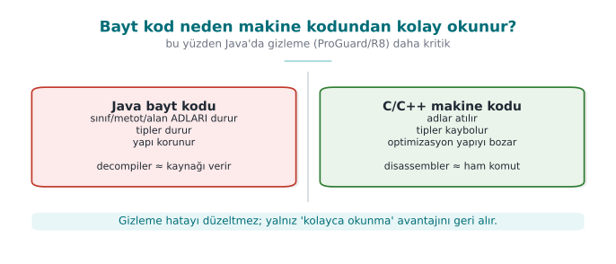

| Information | Machine code (C/C++, after `strip`) | Java bytecode / DEX |
| --- | --- | --- |
| Class, method and field names | Lost | **Preserved** (needed for reflection and linking) |
| Types | Lost | **Preserved** (needed by the verifier) |
| String constants | Sit in the binary | Sit as plain text in the **constant pool** |
| Control flow | Machine instructions, indirect jumps | Structured; converts back very close to the source code |
| Result of reversing | Pseudo-C that takes effort to read | Often **compilable** Java code |

This is why reversing a Java or Android application does not require expertise. The JDK's own tool, `javap`, shows
bytecode as text; decompilers such as `jadx`, CFR and Fernflower produce readable Java source.

```text title="javap -c -p LisansDenetimi.class (kısaltılmış)"
private static final java.lang.String GECERLI_PIN;
public boolean pinDogru(java.lang.String);
  Code:
     0: aload_1
     1: ldc           #7        // String 4729
     3: invokevirtual #9        // Method java/lang/String.equals:(Ljava/lang/Object;)Z
     6: ireturn
```

### Bytecode line by line: the JVM is a stack machine

Let's make the four lines above readable even for someone who has never seen bytecode before. The JVM is a
**stack machine**: every instruction **pushes** a value onto a small stack, or **pops** a value off it:

| Line | Instruction | What does it do? | Stack state (after the operation) |
| --- | --- | --- | --- |
| `0` | `aload_1` | **Push** local variable 1 (the method's first parameter, the entered PIN) onto the stack | `[girilenPin]` |
| `1` | `ldc #7` | **Push** entry 7 from the constant pool (the string `"4729"`) onto the stack | `[girilenPin, "4729"]` |
| `3` | `invokevirtual #9` | **Pop** two values off the stack, call the `String.equals(...)` method, **push** the result (true/false) onto the stack | `[sonuc]` |
| `6` | `ireturn` | Return the integer/boolean value on the stack as the method's **return value** | `[]` |

These four lines are the **exact** counterpart of the source expression `return girilenPin.equals("4729");` — no
information has been lost. The `// String 4729` comment is `javap` reading and showing entry 7 from the constant
pool; decompilers (jadx, CFR) see these four lines and produce the source code
`return girilenPin.equals("4729");` directly. In C, in the equivalent machine code after `strip`, neither the
constant's value nor which type the `equals` call operates on would remain this obvious (compare with the machine
code examples from Week 4).

Even without the source code, three things are plainly visible: the constant (`4729`), meaningful names
(`GECERLI_PIN`, `pinDogru`), and the logic ("compare the input to this constant"). A password, API key or server
address embedded in the code has effectively been handed to everyone who downloads the application (MSC03-J,
CWE-798).

!!! danger "A common mistake: thinking 'I'm not giving out the source code, so I'm safe'"
    Distributing a `.jar` or `.apk` file does not mean not giving out the source code: according to the table
    above, bytecode is almost the source code itself. "Closed source" and "cannot be reverse engineered" are two
    different things.

!!! success "Rule"
    Write every constant that goes into a client-side Java/Kotlin application (a key, a PIN, a server address, a
    business rule) on the assumption that "whoever sees this is effectively reading the source code." Sections
    11–12 will show tools that **make this visibility harder** (not that remove it).

!!! warning "There are no secrets on the client"
    Obfuscation **makes what is described in this section harder**, but it is not a way of genuinely hiding a
    secret in a client application. An API key or password should not stay on the client unless it absolutely has
    to: it should be kept server-side, and the client should authenticate with a short-lived token. For keys that
    genuinely have to stay on the client, the secure enclaves from Week 3 and the whitebox cryptography from
    Week 11 are needed.

### Demo 4 — What shows up in the bytecode?

!!! info "Demo 4 · `code/week-05/04-bytecode-decompile` · CWE-798 · MSC03-J"
    A small "licence/PIN check" class is compiled and examined with `javap -c -p`. Without the source code, the
    constant strings (a synthetic PIN and licence key), the `private` field and method names, and the comparison
    logic are all visible. This demo is the **motivation** for needing obfuscation; Demo 5 reduces the same leak.

=== "Windows (PowerShell)"

    ```powershell
    cd code\week-05\04-bytecode-decompile
    .\demo.ps1
    ```

=== "WSL / Linux"

    ```bash
    cd code/week-05/04-bytecode-decompile
    sh demo.sh
    ```

---

## 11. ProGuard and R8: shrinking, optimisation, obfuscation

**ProGuard** is an open-source tool that processes Java bytecode; **R8** is its successor, developed by Google for
Android, compatible with ProGuard rules, and shipped as the default in the Android build system. Both do four
jobs:

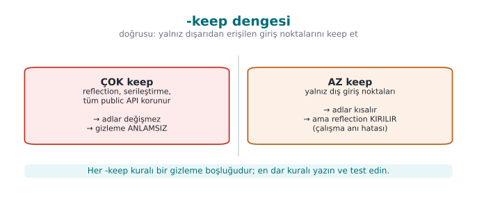

| Stage | What does it do? | Security contribution |
| --- | --- | --- |
| **Shrinking** | Removes classes, methods and fields that are never used (including those in libraries) | The attack surface and the code to review shrink |
| **Optimisation** | Inlining, dead-code elimination, constant folding | The code's structure drifts away from the source |
| **Obfuscation** | Replaces class, method and field names with short, meaningless names like `a`, `b`, `c`, … | Meaningful names disappear |
| **Preverification** | Adds verification information for Java ME / old JVMs | — |

Obfuscation's output is a **mapping file** (`mapping.txt`) that matches old names to new ones:

```text title="mapping.txt (kısaltılmış, adlar sentetik)"
com.ornek.odeme.KartYoneticisi -> com.ornek.a:
    android.content.Context baglam -> a
    boolean varsayilanKartiAyarla(java.lang.String) -> b
```

!!! danger "The mapping file is a secret"
    `mapping.txt` completely reverses the obfuscation. It needs to be kept so crash reports can be read, but it
    must **not be shipped** together with the application, must not be put in a public repository, and must be
    kept somewhere access-restricted, separately for each release.

### `-keep` rules: whose name has to be kept?

The obfuscator cannot know whether a class or method is called **by name from the outside**. In the following
cases the name has to be kept; otherwise the application throws a `ClassNotFoundException` or a
`NoSuchMethodException` at run time:

- The application's entry points (in Android, the activities and services named in the manifest; `main` on the
  desktop).
- Classes and methods called by name through reflection.
- Methods called by name from native code via JNI, and `native` methods.
- Fields of serialised classes (JSON libraries use field names).
- A library's public-facing API.

| Rule | What does it do? |
| --- | --- |
| `-keep class X { <methods>; }` | **Both keeps** the class and its members **and keeps their name** |
| `-keepclassmembers class X { ... }` | The class can be shrunk, but the specified members are kept (e.g. serialisation fields) |
| `-keepnames` / `-keepclassmembernames` | Unused ones can be removed; **the name of what remains** is kept |
| `-keepclasseswithmembers` | Keeps classes that have the specified members (e.g. those with a `native` method) |
| `-dontobfuscate` / `-dontshrink` / `-dontoptimize` | Turns off the corresponding stage |

The golden principle of writing rules is to write **the narrowest rule**. A broad rule like
`-keep class com.ornek.** { *; }` effectively turns obfuscation off; this is the most common "obfuscation exists
but doesn't do anything" situation seen in the field.

### Worked example: why a missing `-keep` crashes the application

If a class's name is called through reflection (`Class.forName("com.ornek.Odeme")`) but there is no `-keep` for
this class in `proguard-rules.pro`, here is what happens, step by step:

1. During compilation, ProGuard/R8 **sees no static call** to the `com.ornek.Odeme` class — because the call is
   written as a **string** inside `Class.forName`; the obfuscator does not count strings as part of the class
   graph.
2. The obfuscator assumes this class is "unused" and either removes it during the **shrinking** stage or renames
   it to `a.b.c`.
3. When the application runs, `Class.forName("com.ornek.Odeme")` is called; but the class's name in this release is
   now different (or the class does not exist at all).
4. At run time a `ClassNotFoundException` is thrown (if the class was removed) or a `NoSuchMethodException` (if the
   method's name changed) — this is seen **only in the release build**, because obfuscation is turned off in the
   debug build (Section 13); the developer usually only notices the problem during store testing.

```text title="Eksik -keep'in tipik çökme izi (illüstratif)"
java.lang.ClassNotFoundException: com.ornek.Odeme
    at java.lang.Class.forName(Class.java:...)
    at com.ornek.a.b.baslat(Unknown Source:1)
```

!!! danger "A common mistake: forgetting a class called through reflection"
    Static calls are seen by the compiler and are protected automatically; **reflection, JNI, and serialisation
    fields are not seen**, because they live in strings resolved at run time, not in the class graph. Turning on
    obfuscation without knowing **which classes** a newly added library (e.g. a JSON decoder, dependency injection)
    calls by name leads to random crashes in production.

!!! success "Rule"
    When you add a new library, first add its official ProGuard/R8 rules (most libraries carry their own
    `consumer-rules.pro` file); then **actually run and test** the release build. "It compiled" and "it works" are
    not the same thing while ProGuard/R8 is turned on.

### Advanced rules: a configuration from the field

The obfuscation configuration of a certified mobile payment library includes the following rules and their
rationale (a generalised version of the library's own rules):

| Rule | Meaning | Why? |
| --- | --- | --- |
| `-optimizations !code/simplification/arithmetic,!code/simplification/cast,!field/*,!class/merging/*` | Every optimisation except arithmetic and type-cast simplification, field optimisations and class merging | Some optimisations cause bugs on older runtimes; the safe ones are left on |
| `-optimizationpasses 5` | Optimisation is repeated for five passes | Each pass uses the new opportunities opened up by the previous one; the structure drifts further from the source |
| `-allowaccessmodification` | Access modifiers can be widened | More inlining and repackaging becomes possible |
| `-repackageclasses` | All renamed classes are moved into a single package | The package structure (which class is in which module) is lost |
| `-keeppackagenames` not specified, `-useuniqueclassmembernames` | Package names are also obfuscated; members with the same name get consistent renaming | No structural hint remains; but crash debugging stays consistent |
| `-keepattributes Exceptions` | Only exception declarations are kept | The source file name and line number (`SourceFile`, `LineNumberTable`) do not go into the release |
| `-assumenosideeffects class android.util.Log { *; }` | Logging calls are treated as "side-effect free" and **removed** | No logging strings or calls remain in the release (the Java counterpart of the log removal from Week 4) |

!!! note "How is this applied in the field?"
    The same guide also spells out an important separation of responsibility: the library obfuscates and shrinks
    its own code, but has no authority over the code of the application that uses it; this is why the guide
    delegates, as a requirement, that **the host application must also take its own measures against obfuscation
    and reverse engineering**. The guide's "security expected from third-party components" section lists exactly
    these hand-offs.

### What ProGuard does not do

ProGuard and R8 obfuscate **names**, they **do not obfuscate strings**. The `// String 4729` line in `javap`'s
output stays exactly the same after obfuscation. They only change control flow as much as a side effect of
optimisation. String encryption, control-flow obfuscation and tamper checks require commercial tools (such as
DexGuard, iXGuard) or the application's own methods (the next section).

---

## 12. String obfuscation and dynamic method invocation

The leak in Demo 4 had two sources: **plain-text constants** and **direct calls**. Two simple methods reduce them.

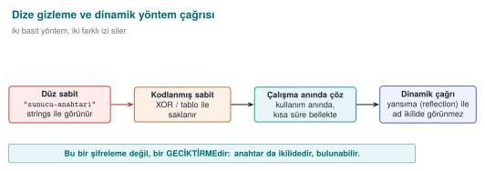

### Static string obfuscation

The sensitive string sits in the source not as plain text but as an **encrypted or scrambled byte sequence**, and
is decoded at the moment it is used. Meaningless bytes appear in the constant pool instead of the string itself.

- A simple XOR scramble stops `javap` and `strings` scans; but the decoding function and the key are also inside
  the application. This is an **obstacle**, not a lock.
- In the field, strings are **AES-encrypted** by a tool before the build and embedded into the build configuration
  as encrypted constants; the decoding work is left to a single function on the native side, protected by
  additional checks, and the decoded string is wiped from memory once the job is done. This way, neither the
  string itself nor the decoding key is found on the Java side.
- The decoded string sits in memory in the clear at the moment it is used; this is why string obfuscation gains
  its real meaning together with run-time protection (RASP, Week 6).

### Worked example: decoding XOR obfuscation by hand

Demo 5's `GizliSabit.java` file scrambles the synthetic string `"sunucu-anahtari-9F3A"` with the XOR key `0x5A`
(decimal 90) and stores it as a byte array. Let's decode the first three bytes of the source array (`41, 47, 52`)
by hand; by the definition of XOR, XOR-ing with the same key **twice** returns the original value
(`x ⊕ k ⊕ k = x`) — this is why encryption and decoding are **the same** operation:

```text title="1. bayt: 41 ⊕ 90 = 's' (0x73)"
  41 = 0010 1001
  90 = 0101 1010
  ----------------  (bit bit XOR: aynıysa 0, farklıysa 1)
 115 = 0111 0011  =  0x73  =  's'
```

```text title="2. bayt: 47 ⊕ 90 = 'u' (0x75)"
  47 = 0010 1111
  90 = 0101 1010
  ----------------
 117 = 0111 0101  =  0x75  =  'u'
```

```text title="3. bayt: 52 ⊕ 90 = 'n' (0x6E)"
  52 = 0011 0100
  90 = 0101 1010
  ----------------
 110 = 0110 1110  =  0x6E  =  'n'
```

The remaining 17 bytes decode with the same operation and give, in order, the characters
`u, c, u, -, a, n, a, h, t, a, r, i, -, 9, F, 3, A`; joined together, they produce exactly the source string
`"sunucu-anahtari-9F3A"`. `javap -c -p` shows **not** this string, but only 20 meaningless byte values and the
`ANAHTAR` constant; a `strings` scan does not find the plain text either. But the key (`0x5A`) and the decoding
loop are **inside the same class** — which is why the warning below applies.

!!! danger "A common mistake: thinking XOR obfuscation is 'encryption'"
    A single-byte XOR key is only one of 256 possibilities; because the key and the decoding code sit in the same
    `.class` file, a decompiler can see both and **automatically** redo the same computation. This is not
    cryptographic encryption, it is an obstacle that only slows down tools such as `javap`/`strings` that
    **scan for plain text**.

!!! success "Rule"
    String obfuscation does not mean "the secret is hidden"; it means "no plain text is left in the constant
    pool." A genuinely sensitive value (a production server's address, a real API key) should never be embedded in
    client code at all; it should be fetched from the server at run time, or protected with dedicated methods such
    as the whitebox cryptography from Week 11.

### Dynamic method invocation (reflection)

Calling a method directly (`nesne.gizliIslem()`) leaves an explicit link (`invokevirtual`) to that method in the
bytecode; the decompiler easily reconstructs the graph of "this function is called from here." With
**reflection**, the method name in the call is generated at run time (and this name can also be obfuscated):

```java title="Doğrudan ve dinamik çağrı"
sonuc = Hesap.gizliIslem(girdi);                                   // bayt kodunda açık bağlantı

Method m = Hesap.class.getDeclaredMethod(adiCoz(ADI_BAYTLARI), String.class);
m.setAccessible(true);
sonuc = (String) m.invoke(null, girdi);                            // statik çağrı grafiği kırılır
```

Let's be honest about the limits: the method is still defined in the class, and `javap -p` lists it; reflection
only hides the **call link**. Its real power appears when combined with ProGuard renaming the method (in that
case, a `-keep` rule is needed for the reflectively called method; the rule is written so that it matches the new
name generated at run time). Reflection is also slow and loses compile-time type checking; it is used only for a
handful of genuinely sensitive calls.

!!! note "How is this applied in the field?"
    In the JNI interface between Java and a native library, method names are made meaningless: two- or
    three-letter names such as `native byte[] ced(...)` hide what each method does (because JNI names also appear
    as symbols on the native side, this protects both sides at once). Binding values such as a device fingerprint
    are then stored on the Java side **with two different hashes in two different places** (one in a local
    database, one in an application preferences file), and a background thread regularly compares the two;
    inconsistency or root detection triggers deletion of the cards. This is why changing the value in just one
    place is not enough.

### Demo 5 — String obfuscation, reflection and ProGuard

!!! info "Demo 5 · `code/week-05/05-gizleme` · Recipe 12.11 (concept), 12.9 (indirect call, concept)"
    Three defences are shown in sequence: **(A)** the same secret string sits as a byte array scrambled with XOR
    instead of plain text, and does not appear in `javap`'s output; **(B)** the method name is generated at run
    time and called through reflection, so no direct call remains in the bytecode; **(C)** optionally, the same jar
    is shrunk and obfuscated with ProGuard: the entry point kept with `-keep` remains, unused private members are
    removed, and the rest are renamed with short names. ProGuard is downloaded into the demo folder by the
    `hazirla` script.

=== "Windows (PowerShell)"

    ```powershell
    cd code\week-05\05-gizleme
    .\demo.ps1
    ```

=== "WSL / Linux"

    ```bash
    cd code/week-05/05-gizleme
    sh demo.sh
    ```

!!! question "How does an assessor test this?"
    They open the application package (JAR/APK) with a decompiler and ask four questions: do meaningful class and
    method names remain, do sensitive strings (a server address, a key, a file name) appear as plain text, do
    logging calls remain in the release, and is the mapping file inside the package or somewhere public? They then
    measure how long it takes to locate the security checks (root detection, pinning) in the decompiled code.

---

## 13. R8 on Android, measuring the effect of obfuscation, and static analysis for Java

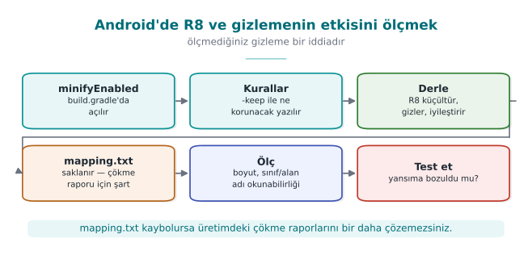

### R8 in the Android build pipeline

In Android applications, R8 is turned on with a few lines in the Gradle configuration. Having it on in the release
build is a baseline expectation of mobile security standards (OWASP MASVS-RESILIENCE):

```groovy title="app/build.gradle — sürüm derlemesinde küçültme ve gizleme"
android {
    buildTypes {
        release {
            minifyEnabled true          // R8: küçültme + iyileştirme + gizleme
            shrinkResources true        // kullanılmayan kaynakları (resim, düzen) da kaldır
            proguardFiles getDefaultProguardFile('proguard-android-optimize.txt'),
                          'proguard-rules.pro'
        }
    }
}
```

`proguard-android-optimize.txt` contains reasonable defaults for Android; application-specific `-keep` rules are
written into the `proguard-rules.pro` file. A typical rule for methods called from native code via JNI, and for
`native` methods:

```proguard title="proguard-rules.pro — JNI"
-keepclasseswithmembernames class * {
    native <methods>;
}
```

!!! warning "There is no obfuscation in the debug build"
    The debug build run inside Android Studio is **not obfuscated** by default, and is also marked "debuggable."
    Confirming that the distributed package is the **release** build and that the `debuggable` flag is off is one
    of the assessor's first checks (debugger detection is covered in Week 6).

### Reading crash reports: retrace

An obfuscated application's crash report contains lines such as `a.b.c(Unknown Source)`. The mapping file is used
to reverse this report (the `retrace` tool, or uploading the mapping file to a crash-reporting service **securely**).
This is why the mapping file is not deleted; but as we said above, it is also not shipped together with the
application. Adding `-keepattributes SourceFile,LineNumberTable` makes reports readable but puts source file names
and line numbers into the package; this is a trade-off, and it is recorded.

### Measuring the effect of obfuscation

Saying "obfuscation is on" is not enough; you need to show what actually changed. Simple, repeatable metrics:

| Metric | How is it measured? | Expected change |
| --- | --- | --- |
| Number of classes and methods | `javap` / decompiler output | Decreases with shrinking |
| Ratio of meaningful names | Ratio of class/method names longer than 3 characters | Drops sharply with obfuscation (except for the kept entry points) |
| Number of plain-text sensitive strings | `strings` / constant-pool scan, against a list of known sensitive strings | Drops to zero with string obfuscation |
| Package size | File size | Decreases with shrinking (obfuscation alone barely changes it) |
| Number of logging calls | Searching for `Log.` in the decompiled code | Zero in the release |
| Time to find a security check | Human trial | Increases; measurement methods in Week 9 |

Filling in this table for before and after obfuscation and putting it into the security guide turns the claim
"obfuscation was done" into evidence.

### Worked example: doing the measurement step by step on Demo 5

Let's actually run the first two rows of this table on the jar files Demo 5 produces (if you downloaded ProGuard
with the demo's `hazirla` script):

```bash title="1) Gizleme oncesi: anlamli ad sayisini say"
cd code/week-05/05-gizleme/cikti
javap -p -classpath oncesi.jar 'GizliSabit' | grep -c "GizliSabit\|coz\|GIZLI\|ANAHTAR"
# Cikti: kaynaktaki adlarin hepsi (sinif, alan, metot) birebir gorunur
```

```bash title="2) Gizleme sonrasi: ayni arama"
javap -p -classpath sonrasi.jar 'a' | grep -c "GizliSabit\|coz\|GIZLI\|ANAHTAR"
# Beklenen: 0 (ya da yalnizca -keep ile korunan giris noktasinin adi)
```

```bash title="3) Paket boyutu"
ls -la oncesi.jar sonrasi.jar
# Kucultme sinif sayisina bagli olarak boyutu azaltir; tek basina gizleme boyutu pek degistirmez
```

These three commands turn the claim "obfuscation worked" into **a measurable number**: if the first command's
output is greater than zero (a meaningful name is still found), then either the `-keep` rule was written too
broadly, or the obfuscation stage never ran at all — both show the same symptom as the "most common mistake seen
in the field" from Section 11.

### Static analysis for Java

The Java counterparts of the static-analysis layers we saw for C/C++ in Week 4:

| Tool | What does it find? |
| --- | --- |
| Compiler warnings (`javac -Xlint:all`) | Unsafe casts, deprecated APIs |
| SpotBugs + the **Find Security Bugs** plugin | SQL/command/path injection patterns, weak crypto, unsafe deserialisation, hard-coded passwords |
| Semgrep, CodeQL | Source-to-sink data flow (user input → `executeQuery`) |
| Android Lint | Android-specific security warnings (exported components, insecure network configuration) |
| OWASP Dependency-Check (Maven/Gradle plugin) | Vulnerable dependencies (Section 14) |

```bash title="Maven projesinde SpotBugs + Find Security Bugs"
mvn com.github.spotbugs:spotbugs-maven-plugin:check
# pom.xml'de eklenti yapılandırmasına findsecbugs-plugin eklenir
```

These tools are added to the secure build pipeline (CI) from Week 4 in exactly the same way: a new high-severity
finding blocks the merge.

---

## 14. Dependency security and the software bill of materials (SBOM)

Most of a modern application's code does not belong to the team that wrote it. In a typical Java or JavaScript
application, a few dozen directly added libraries reach hundreds of components once their own dependencies are
counted in. A vulnerability in one of these components is a vulnerability in the application.

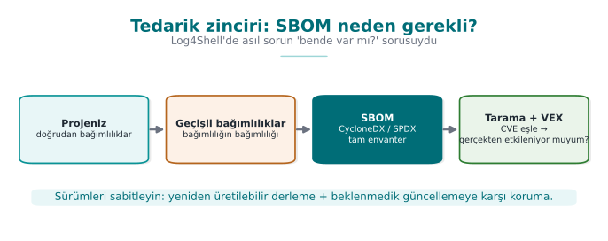

!!! example "Log4Shell (December 2021)"
    In Log4j 2, one of the Java world's most widely used logging libraries, a special expression inside a string
    written to the log could cause the library to load and run a class from a remote address (CVE-2021-44228,
    CVSS 10.0). Every application that logged user data was affected. The real crisis was not applying the patch,
    it was **knowing which system had which version**: most organisations spent days searching for which of their
    applications had Log4j embedded inside another library. The incident ties together the log injection from
    Week 2 and the dependency security topics of this section.

### What is an SBOM?

A **software bill of materials** (SBOM) is a machine-readable list of every component inside a piece of software:
like the ingredients list on a food package. At least the following is recorded for every component:

| Field | Example | Why? |
| --- | --- | --- |
| Name and version | `log4j-core 2.14.1` | To match against vulnerability databases |
| **purl** (package URL) | `pkg:maven/org.apache.logging.log4j/log4j-core@2.14.1` | An ecosystem-independent, uniform identifier |
| Hash value | SHA-256 | To verify the file really is that component |
| Licence | Apache-2.0 | Licence compliance |
| Supplier, dependency relations | who depends on what | To trace transitive dependencies |

There are two common standards: OWASP's **CycloneDX** (security-focused) and the Linux Foundation's **SPDX**
(started licence-focused, now the ISO/IEC 5962 standard). The United States' 2021 cybersecurity executive order
and the European Union's Cyber Resilience Act have begun requiring an SBOM from software suppliers.

```json title="CycloneDX 1.5 — tek bileşenlik kesit (değerler sentetik)"
{
  "bomFormat": "CycloneDX",
  "specVersion": "1.5",
  "components": [{
    "type": "library",
    "name": "ornek-json",
    "version": "1.2.0",
    "purl": "pkg:maven/com.ornek/ornek-json@1.2.0",
    "hashes": [{ "alg": "SHA-256", "content": "9f86d081884c7d65..." }]
  }]
}
```

### From SBOM to a vulnerability list

An SBOM is just an inventory on its own; it gains its value once combined with **software composition analysis**
(SCA) tools. These tools match every component in the SBOM against vulnerability databases (NVD, GitHub Advisory
Database, OSV):

| Tool | Type |
| --- | --- |
| OWASP Dependency-Check | Project-level scanning, open source |
| OWASP Dependency-Track | An open-source platform that collects SBOMs and monitors them continuously |
| GitHub Dependabot, `npm audit`, `pip-audit`, OSV-Scanner | Repository- and ecosystem-level alerts |
| CycloneDX plugins (Maven, Gradle, npm, pip) | SBOM generation |

A match does not always mean "we are affected": the vulnerable function might never be called at all. **VEX**
(Vulnerability Exploitability eXchange) documents are used to publish this information in a machine-readable form:
"this component has CVE-X, but our product is not affected, because …"

### Dependency hygiene: a checklist

- [ ] **Pin the versions:** keep a lock file (`package-lock.json`, `gradle.lockfile`, `poetry.lock`) in the
      repository; do not use floating versions such as "latest."
- [ ] **Verify hashes:** Maven/Gradle dependency verification, `pip --require-hashes`; is the downloaded file the
      expected file?
- [ ] **Remove what's unused:** every library on the class path is an attack surface (deserialisation chains can
      also be built from unused libraries).
- [ ] **Monitor continuously:** generate the SBOM on every release, send it to a monitoring platform; know within
      minutes which products are affected when a new CVE is published.
- [ ] **Vet the source:** pin the package source against name-squatting (typosquatting: e.g. `reqeusts`) and
      dependency confusion (an internal package name being hijacked by a fake package in a public registry)
      attacks.
- [ ] **Build integrity:** the supply-chain incidents and the SLSA framework from Week 2: the build itself must
      also be provable.

!!! danger "A common mistake: generating an SBOM once and forgetting about it"
    An SBOM is the dependency list at **the moment it was generated**. If a new library is added, or a version is
    upgraded, one release later, the old SBOM now gives **wrong** information — and nowhere does it say it is
    wrong, it is simply out of date. In Log4Shell, the real time lost came from the situation "we had an SBOM, but
    it belonged to a release from three months earlier."

!!! success "Rule"
    An SBOM must be generated **automatically** on every run of the build pipeline (CI) and sent to an SCA tool; an
    SBOM prepared by hand once and attached to a document is correct on the day it was produced, not on the day of
    the next dependency update.

### Worked example: reading Demo 6's output line by line

Demo 6 (`sbom.py`) produces small jar files from four synthetic libraries, writes a CycloneDX component for each
one, and matches them against a small dictionary of "known vulnerable versions." The actual output (the component
names and versions come from a fixed list in the source code):

```text title="ADIM 1 — SBOM uretildi (4 bilesen)"
ad                     surum    SHA-256 (ilk 16)
gunluk-cekirdek        2.14.0   <jar baytlarindan hesaplanir>...
json-arac              2.5.1    <jar baytlarindan hesaplanir>...
kayit-kutuphanesi      1.2.0    <jar baytlarindan hesaplanir>...
sifreleme-yardimci     3.0.4    <jar baytlarindan hesaplanir>...
```

```text title="ADIM 2 — purl ornekleri"
pkg:maven/ornek.grup/gunluk-cekirdek@2.14.0
pkg:maven/ornek.grup/json-arac@2.5.1
pkg:maven/ornek.grup/kayit-kutuphanesi@1.2.0
pkg:maven/ornek.grup/sifreleme-yardimci@3.0.4
```

```text title="ADIM 3 — Bilinen (sentetik) zafiyetli surumlerle eslestirme"
[UYARI] gunluk-cekirdek 2.14.0  (CEN429-2026-0001)
        Bicimli mesajda uzaktan kod calistirma (sentetik ornek).
        Cozum: >= 2.17.1 surumune yukselt.
[UYARI] json-arac 2.5.1  (CEN429-2026-0002)
        Guvensiz seri durumdan cikarma (sentetik ornek).
        Cozum: >= 2.6.0 surumune yukselt.
```

The SHA-256 values come out **different** on every run (the generated jar's ZIP metadata contains a timestamp);
this is deliberate, and it is a good supply-chain lesson — the hash verifies **exactly which byte sequence** the
file is; "the name and version match" alone is not enough. `kayit-kutuphanesi` and `sifreleme-yardimci` are not on
the synthetic vulnerability list, so they **get no warning** — the part of an SBOM that stays empty is also
information: it means "these components are not on the known list," not "they are safe."

### Demo 6 — Generating an SBOM and matching it against vulnerabilities

!!! info "Demo 6 · `code/week-05/06-sbom` · CWE-1104"
    The demo produces a CycloneDX 1.5 JSON SBOM from its own **synthetic** jar files (`cikti/lib/`): a name,
    version, purl and SHA-256 for every component. It then matches these against a small, **synthetic** "known
    vulnerable versions" list and warns for the two affected components. It does not connect to the internet.

=== "Windows (PowerShell)"

    ```powershell
    cd code\week-05\06-sbom
    .\demo.ps1
    ```

=== "WSL / Linux"

    ```bash
    cd code/week-05/06-sbom
    sh demo.sh
    ```

!!! note "How is this applied in the field?"
    In certification documents, third-party components are listed in a separate table, together with their
    versions and **why they are used**: payment scheme SDKs, the platform's integrity-verification API, a
    notification service, a whitebox library, a number-theory library. An assessor reads this list the way they
    read an SBOM: does every component have a known vulnerability, is it up to date, is it genuinely necessary? A
    component being present in the package without being on the list is itself a finding.

---

## 15. Term project: this week

Even if your project is C/C++, two of this week's topics apply directly to your project:

- [ ] **SBOM:** List all of your project's dependencies (libraries, build tools, components downloaded through
      CMake) in CycloneDX format. If you use vcpkg or Conan, try their SBOM-generation support; if not, write it by
      hand. Look up every component in the OSV database and add the result to the guide.
- [ ] **Input-validation table:** List every point where your project takes in outside data (a file, the command
      line, the network, configuration); for each one write the expected format, the length limit, and the
      function where validation happens.
- [ ] If your project contains a file path, a SQL query, or a call to an external program, review it again with
      this week's patterns (canonicalisation + root, parameterised query, argument list).
- [ ] If your project has a scripted or Java component, add the obfuscation requirement and the `-keep` rules to
      section S9.

---

## 16. Work on your own

??? question "Exercise 1 — Easy: Convert it to a parameterised query"
    Turn Demo 1's wrong query into a parameterised one yourself. Then add a sorting feature that takes an
    `ORDER BY` column from the user, and make it safe with a white list. Explain why this cannot be done with `?`.

??? question "Exercise 2 — Easy: What the error message leaks"
    Give Demo 1's wrong query an input with broken syntax, and examine the database's error message. Can table and
    column names be extracted from the message? Fix it so a generic message goes to the user and the detail goes
    to the log.

??? question "Exercise 3 — Medium: Argument injection"
    Give Demo 2's safe version an input starting with `-`. Does the allow list reject it? If it does not, observe
    whether the called program interprets this input as an option, and add the `--` separator.

??? question "Exercise 4 — Medium: Path traversal variants"
    Send Demo 3's safe version the following requests: `..%2fgizli.txt`, `....//gizli.txt`, an absolute path,
    `..\gizli.txt` and a drive-lettered path on Windows, and a file inside the root that points outside the root
    with a **symbolic link**. Which one is rejected by which check?

??? question "Exercise 5 — Medium: Deserialisation without and with a filter"
    Write Demo 7's filter pattern without `!*`, and show that the unexpected class is now accepted. Then pull the
    `maxbytes` and `maxdepth` limits down to very small values, and find the point where a legitimate object gets
    rejected.

??? question "Exercise 6 — Medium: Look with a decompiler"
    Open Demo 4's and Demo 5's jar files with a decompiler other than `javap -c -p` (e.g. CFR or jadx). Compare
    readability before and after obfuscation: which information is still visible?

??? question "Exercise 7 — Hard: Narrow the -keep rule"
    Write the `-keep` rule in Demo 5's `proguard.pro` file both broader (`com.**`) and narrower, and compare the
    results. What is the **narrowest** rule under which the application still works?

??? question "Exercise 8 — Hard: A real SBOM"
    For any open-source Java project that uses Maven or Gradle, generate an SBOM with the CycloneDX plugin and scan
    it with OWASP Dependency-Check or OSV-Scanner. How many components came out, how many were transitive, how
    many vulnerability matches were there? Investigate whether one of the matches genuinely affects the project.

---

## 17. Self-check

??? question "1. Which classes of bugs does Java remove at the language level, and which does it not?"
    It removes memory bugs such as buffer overflow, freed memory, and uninitialised variables. It does not remove
    injection, unsafe deserialisation, secrets embedded in code, reverse engineering, vulnerable dependencies, or
    logic bugs.

??? question "2. What is the common root of every kind of injection, and the common fix?"
    Data and command being given to an interpreter through the same channel. The fix: keep the command fixed and
    give the data through a separate channel (a parameter, an argument).

??? question "3. Why can an `ORDER BY` column not be given with a `?` parameter? What is done instead?"
    `?` can only stand in for a value, not for an identifier (a column or table name). Mapping is done with a
    white list.

??? question "4. Why does using `ProcessBuilder` prevent command injection? Does it solve everything on its own?"
    The shell never runs; the input is passed as a single argument. It does not solve everything: the called
    program can interpret the argument as an option (argument injection); an allow list and `--` are still needed.

??? question "5. In path traversal, why is canonicalisation done first, and only then the check?"
    The same path has many spellings (`../`, encoded forms, symbolic links); a raw-string check can be bypassed.
    The canonical path is single and definitive.

??? question "6. In unsafe deserialisation, what authority is in the attacker's hands?"
    The authority to choose which classes get created. Classes on the class path can be chained together, all the
    way up to code execution.

??? question "7. What does the `!*` at the end of an `ObjectInputFilter` pattern do?"
    It rejects everything not on the list; the deny-by-default principle. Without it, the filter turns into a
    blacklist.

??? question "8. Why is Java bytecode easier to reverse than machine code?"
    It preserves class, method and field names, types, and strings; control flow is structured.

??? question "9. What are ProGuard's four stages? Which one obfuscates strings?"
    Shrinking, optimisation, obfuscation (renaming), preverification. None of them obfuscate strings.

??? question "10. Why is `mapping.txt` a secret?"
    It completely reverses the obfuscation; it maps old names to new ones. It must not be shipped, and must be
    kept access-restricted.

??? question "11. What does `-assumenosideeffects class android.util.Log { *; }` do?"
    It treats logging calls as side-effect free and removes them from the release build; no logging strings or
    calls remain in the binary.

??? question "12. Why do purl and a hash value appear in an SBOM? What is VEX for?"
    purl identifies the component uniformly, independent of the ecosystem; the hash verifies the file really is
    that component. VEX states whether a vulnerability in a component genuinely affects the product.

??? question "13. When the SQL parser meets a `'` character in the input, which state does it move into? Why does this state change the query's structure?"
    It moves into the "string literal started/ended" state. The `'` in the input closes an open string literal
    early; the text after it is then read not as string content but as ordinary SQL syntax (keywords, operators).

??? question "14. Why are the `prepare` and `bind` stages separate in a parameterised query? How does this separation prevent injection?"
    In the prepare stage only the fixed query text is parsed and turned into a plan; the user's data does not
    exist yet. In the bind stage the values are placed into the already-parsed plan through a separate channel,
    and never pass through the parser again; this is why, whatever their content, they cannot change the query's
    structure.

??? question "15. How many commands does the shell run the string `echo Merhaba ayse; echo SIZDI` as? Why?"
    Two commands. The shell first splits the text it receives into separate commands based on command separators
    such as `;`; this is the shell's own syntax rule, and it has nothing to do with Java's information "this was a
    single username."

??? question "16. Resolve `KOK.resolve(\"../../etc/passwd\")` step by step with the stack algorithm: what is the result?"
    Every `..` segment pops the previous segment off the stack; every normal segment is pushed onto the stack. The
    two `..`'s remove the root's last two segments (`srv`, `veri`); the remaining `etc` and `passwd` are pushed.
    Result: `/etc/passwd` — completely outside the root.

??? question "17. Which information in the stream does `ObjectInputStream` read to decide which class to create? Who determines this information?"
    It reads the **fully qualified class name** written as plain text in the stream's class-descriptor block, and
    loads it with a call resembling `Class.forName`. This name is determined by **whoever sends the stream**; if
    the stream is untrusted, the attacker determines it.

??? question "18. In XXE, when is the content of a `SYSTEM` entity \"expanded\"? Why can't the application's input validation catch this?"
    During parsing, while the document body is being processed; before the application's own logic ever gets
    involved. Input validation looks at content, but entity expansion is a **structural** property of the
    document; it happens at the parser level, without passing through any of the application's checks.

??? question "19. If the input to the pattern `^(a+)+$` contains 4 `a`'s, how many ways can the engine's inner group split it? What is the general formula?"
    8 (`2^(4-1) = 2^3 = 8`). General formula: for `n` `a`'s there are `2^(n-1)` different splits (compositions).

??? question "20. Why does adding a single character that breaks the match (like `\"aaaa!\"`) to the end of the input for `^(a+)+$` trigger ReDoS?"
    Even though the input is still short (`n` is small), because the `$` can never be satisfied, the engine tries
    **all** possible `2^(n-1)` splits, and only after every one fails does it reach the result "no match"; as `n`
    grows, this number grows exponentially.

??? question "21. What do the `ldc` and `invokevirtual` instructions do to the JVM stack in Java bytecode?"
    `ldc` pushes a value from the constant pool (a number, a string) onto the stack. `invokevirtual` pops the
    required operands (the object and its arguments) off the stack, calls the corresponding method, and, if there
    is one, pushes the return value back onto the stack.

??? question "22. If a class is called only through reflection (`Class.forName`) and there is no `-keep` rule, why might ProGuard/R8 think this class is \"unused\"?"
    The reflective call is written as a string (text evaluated at run time); the obfuscator only tracks the static
    call graph, and does not count a string's content as class usage. This is why the class can be removed during
    shrinking, or renamed, causing a `ClassNotFoundException`/`NoSuchMethodException` at run time.

??? question "23. What does an attacker need to decode a string obfuscated with XOR? Why does this make XOR obfuscation a weak defence?"
    The key and the decoding loop are **inside the same class** as the obfuscated string; a decompiler can see
    both and automatically repeat the same XOR operation. This is why XOR obfuscation is not a cryptographic lock,
    only an obstacle that slows down tools that scan for plain text (strings, javap).

??? question "24. Why doesn't a match between an SBOM component and a known CVE automatically mean \"we're affected\"? Which document type declares this difference?"
    Even if the vulnerable code matches, that function might never be called by the application at all. VEX
    (Vulnerability Exploitability eXchange) documents state, in machine-readable form, whether a known
    vulnerability in a component genuinely affects the product.

??? question "25. In Demo 1's wrong path, with the input `ad = ' OR rol='yonetici' --`, why does the login succeed no matter what is written in the password field?"
    `--` starts a comment to the end of the line in SQL; the parser never reads the `AND parola_ozeti = '...'`
    part that follows this character as part of the query at all. The password check has effectively been erased
    from the query.

??? question "26. Why is an SBOM only correct at the moment it is generated? Why must it be added to the CI pipeline automatically?"
    Dependencies can change with every release (additions, removals, version upgrades); a hand-generated SBOM goes
    out of date with the very next change, but says so nowhere. If it is generated automatically on every build in
    CI and sent to an SCA/monitoring tool, the inventory always reflects the **actual, current** state.

---

## 18. Resources and further reading

**Course textbook** — J. Viega, M. Messier, *Secure Programming Cookbook for C and C++*, O'Reilly, 2003:

- Recipe 3.1 (basic input validation), 3.7 (validating file names and paths), 3.10 (preventing cross-site
  scripting), 3.11 (preventing SQL injection)
- Recipe 1.7–1.8 (safely running external programs)
- Recipe 12.9 (function pointers and indirect calls — concept), 12.11 (obfuscating strings)

**Open standards and resources**

- SEI CERT Oracle Coding Standard for Java (the IDS, FIO, SER, MSC, ERR rules).
- OWASP: Top 10, SQL Injection Prevention Cheat Sheet, OS Command Injection Defense Cheat Sheet, XML External
  Entity Prevention Cheat Sheet, Deserialization Cheat Sheet; MASVS-CODE and MASVS-RESILIENCE.
- Oracle: JEP 290 (deserialisation filters), JEP 415 (context-specific filters); Java Secure Coding Guidelines.
- The ProGuard manual (Guardsquare) and the Android developer documentation: "Shrink, obfuscate, and optimize your
  app" (R8).
- The CycloneDX 1.5 and SPDX 2.3 (ISO/IEC 5962) specifications; the package-url (purl) specification; the CISA SBOM
  and VEX documents; the SLSA framework.
- MITRE CWE: CWE-89, CWE-78, CWE-88 (argument injection), CWE-22, CWE-502, CWE-611, CWE-79, CWE-798, CWE-1104
  (use of unmaintained third-party components).

??? abstract "Glossary"
    | Term | English | Short definition |
    | --- | --- | --- |
    | Managed language | Managed language | A language whose memory is managed by the runtime (Java, C#, Python) |
    | Injection | Injection | Data being processed as a command by an interpreter |
    | Prepared statement | Prepared statement | A SQL call in which the query text and the values are sent separately |
    | Path traversal | Path traversal | Escaping the allowed folder using sequences such as `../` |
    | Canonicalization | Canonicalisation | Reducing a value to its single, definitive form |
    | Deserialization | Deserialisation | Creating an object from a byte sequence |
    | Bytecode | Bytecode | The intermediate code the virtual machine executes |
    | Decompiler | Decompiler | A tool that produces source code from bytecode |
    | Shrinking | Shrinking | Removing unused code |
    | Mapping file | Mapping file | A file that maps obfuscated names to their real names |
    | Reflection | Reflection | Accessing classes and methods by name at run time |
    | SBOM | SBOM | A machine-readable list of a software's components |
    | purl | purl | An identifier that identifies a package independent of its ecosystem |
    | SCA | SCA | Matching dependencies against vulnerability databases |
    | VEX | VEX | A declaration of whether a vulnerability affects the product |
