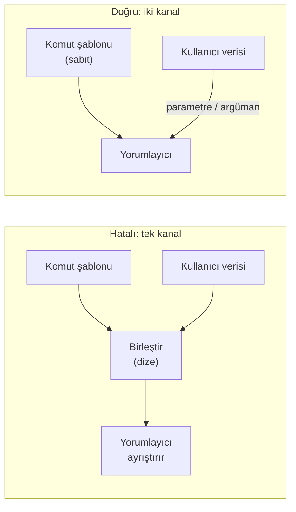

# Hafta 5 — Kod Sağlamlaştırma: Java ve Yorumlanan Diller

| | |
| --- | --- |
| **Tarih** | 16.10.2026 |
| **Öğrenme çıktıları** | ÖÇ.3 |
| **Süre** | 3 saat |

<!-- materyal:basla -->

<div class="materyal" markdown>

[:material-file-pdf-box: Ders notu (PDF)](cen429-week-5-ders-notu.pdf){ .md-button download="cen429-week-5-ders-notu.pdf" }
[:material-file-word-box: Ders notu (DOCX)](cen429-week-5-ders-notu.docx){ .md-button download="cen429-week-5-ders-notu.docx" }
[:material-presentation: Sunum (PDF)](cen429-week-5-sunum.pdf){ .md-button download="cen429-week-5-sunum.pdf" }
[:material-microsoft-powerpoint: Sunum (PPTX)](cen429-week-5-sunum.pptx){ .md-button download="cen429-week-5-sunum.pptx" }
[:material-language-html5: Sunum (HTML, çevrimdışı)](cen429-week-5-sunum.html){ .md-button download="cen429-week-5-sunum.html" }
[:material-folder-zip: Tümünü indir (ZIP)](cen429-week-5-materyal.zip){ .md-button download="cen429-week-5-materyal.zip" }
[:material-fullscreen: Sunumu tam ekran aç](cen429-week-5-sunum.html){ .md-button .md-button--primary target=_blank }

</div>

<div class="sunum-cercevesi">
<iframe src="../cen429-week-5-sunum.html" title="Hafta 5 — Kod Sağlamlaştırma: Java ve Yorumlanan Diller" loading="lazy" allowfullscreen></iframe>
</div>

<p class="sunum-ipucu">Sunumun içine tıklayıp ok tuşlarıyla ilerleyin; tam ekran için sunumun sağ altındaki düğmeyi ya da yukarıdaki "Sunumu tam ekran aç" bağlantısını kullanın.</p>

<!-- materyal:bitis -->

!!! abstract "Bu haftanın sonunda şunları yapabileceksiniz"
    1. Yönetilen dillerin (Java, Kotlin, C#, Python) **hangi hata sınıflarını ortadan kaldırdığını, hangilerini
       kaldırmadığını** söylemek.
    2. **SEI CERT Oracle Java** kurallarını okumak; girdi doğrulama (`IDS`), seri durumdan çıkarma (`SER`) ve hassas
       veri (`MSC`, `FIO`, `ERR`) kurallarını kendi kodunuza uygulamak.
    3. **SQL enjeksiyonu**, **komut enjeksiyonu** ve **yol geçişi** hatalarını göstermek ve parametreli sorgu, argüman
       listesi ve kanonikleştirme + kök denetimiyle düzeltmek.
    4. **Güvensiz seri durumdan çıkarmanın** neden tehlikeli olduğunu açıklamak ve `ObjectInputFilter` ile izin listesi
       kurmak.
    5. Java bayt kodunun ne kadar okunabilir olduğunu `javap` ile göstermek; **ProGuard / R8** ile küçültme, iyileştirme
       ve gizleme yapmak, `-keep` kurallarını doğru yazmak.
    6. Bir projenin **yazılım malzeme listesini (SBOM)** CycloneDX biçiminde üretmek ve bilinen zafiyetli bileşenleri
       bulmak.

??? info "Ders akışı (öğretim üyesi için zaman planı)"
    | Zaman | Bölüm | Ne yapılıyor |
    | --- | --- | --- |
    | 0:00–0:15 | 1–2 | Yönetilen diller neyi çözer, neyi çözmez? SEI CERT Oracle Java |
    | 0:15–0:50 | 3–4 | Enjeksiyonun ortak kökü; SQL enjeksiyonu — **Demo 1** |
    | 0:50–1:00 | Ara | |
    | 1:00–1:20 | 5–6 | Komut enjeksiyonu **Demo 2**; yol geçişi **Demo 3** |
    | 1:20–1:50 | 7–9 | Güvensiz seri durumdan çıkarma **Demo 7**; XXE, XSS, şablon; Python ve JavaScript, ReDoS |
    | 1:50–2:00 | Ara | |
    | 2:00–2:15 | 10 | Bayt kodu ve tersine derleme — **Demo 4** |
    | 2:15–2:40 | 11–13 | ProGuard / R8, gelişmiş kurallar; dize gizleme, yansıma **Demo 5**; Android R8, ölçme, statik analiz |
    | 2:40–2:55 | 14 | Bağımlılık güvenliği ve SBOM — **Demo 6** |
    | 2:55–3:00 | 15+ | Proje adımı, kendini sınama |

!!! tip "Laboratuvarı önceden hazırlayın"
    Bu haftanın demoları **Python 3** ve **JDK 17+** ister. SQL demosunun ana bölümü Python'un yerleşik `sqlite3`
    modülüyle, hiçbir şey indirmeden çalışır; isteğe bağlı Java bölümleri (JDBC sürücüsü, ProGuard) için her demo
    klasöründe bir `hazirla` betiği vardır. Betikler yalnız demo klasörüne indirir, sisteme bir şey kurmaz.

    === "Windows"

        ```powershell
        java -version; python --version
        cd cen429-secure-programming\code\week-05\01-sql-enjeksiyonu
        .\demo.ps1
        ```

    === "WSL / Linux"

        ```bash
        sudo apt install -y openjdk-17-jdk python3
        cd cen429-secure-programming/code/week-05/01-sql-enjeksiyonu
        sh demo.sh
        ```

!!! warning "Etik kural — bu derste her hafta geçerli"
    Enjeksiyon örnekleri yalnız demo klasöründe oluşturulan **sentetik** bir veritabanına ve dosyalara karşı çalışır;
    enjekte edilen komut yalnız zararsız bir `echo`'dur. Seri durumdan çıkarma demosu hiçbir saldırı zinciri içermez,
    yalnız savunmayı gösterir. Bu teknikleri başkasına ait bir web sitesinde, uygulamada ya da veritabanında denemek
    yasa dışıdır; izinli sızma testleri yazılı bir sözleşme ve kapsam belgesiyle yapılır (12. hafta).

---

## 0. Temel kavramlar (sıfırdan)

Bu bölüm **hiçbir ön bilgi varsaymaz**. Haftanın geri kalanında kullanacağımız terimleri sıfırdan tanımlıyoruz. Bir terimi bilmiyorsanız önce burayı okuyun; sonraki bölümler bunların üzerine kurulur.

### Yönetilen dil nedir?

- **Yönetilen dil:** belleği **otomatik** yöneten dil (Java, C#, Python, JS).
- Programcı `malloc`/`free` yapmaz; **çöp toplayıcı** (GC) hallreder.
- → çoğu bellek hatası (taşma, UAF) **ortadan kalkar**.

### JVM ve bayt kodu

- **JVM (Java Virtual Machine):** Java'yı çalıştıran sanal makine.
- **Bayt kodu:** Java kaynağının derlendiği ara biçim (`.class` dosyaları).
- Bayt kodu makineden bağımsız; JVM onu çalıştırır.

### Çöp toplayıcı (GC)

- **GC (Garbage Collector):** artık kullanılmayan nesneleri otomatik temizler.
- Programcı belleği elle bırakmaz.
- Bu yüzden UAF/çift bırakma Java'da **yok denecek kadar az**.

### Enjeksiyon nedir?

- **Enjeksiyon:** kullanıcı **verisinin** bir **komut** olarak yorumlanması.
- Örnek: kullanıcı adı diye girilen metnin SQL sorgusuna komut olarak sızması.
- Bu haftanın ana teması.

### SQL ve veritabanı

- **SQL:** veritabanı sorgulama dili (`SELECT ... WHERE ...`).
- Uygulama, kullanıcı girdisini sorguya koyar.
- Yanlış konursa → **SQL enjeksiyonu**.

### Parametreli sorgu

- **Parametreli sorgu (prepared statement):** sorgu iskeleti sabit, veriler ayrı **parametre** olarak verilir.
- Veri asla komut olarak yorumlanmaz.
- SQL enjeksiyonuna karşı **asıl** çözüm.

### Seri durum (serialization)

- **Serileştirme:** bir nesneyi bayt dizisine çevirme (kaydetmek/göndermek için).
- **Seri durumdan çıkarma (deserialization):** baytları geri nesneye çevirme.
- Güvenilmez baytları çıkarmak **tehlikeli** (kod çalıştırma).

### XML ve XXE

- **XML:** yapılandırılmış veri biçimi (etiketlerle).
- **XXE (XML External Entity):** XML'in "dış varlık" özelliğinin kötüye kullanımı → dosya okuma, SSRF.
- XML ayrıştırıcıda dış varlıklar **kapatılır**.

### Yol geçişi (path traversal)

- **Yol geçişi:** `../` ile izin verilen klasörün **dışına** çıkma.
- `dosyalar/../../etc/passwd` gibi.
- Kanonikleştirme + kök denetimiyle önlenir.

### ProGuard ve R8

- **ProGuard / R8:** Java/Android bayt kodunu **küçülten, adları gizleyen** araçlar.
- R8, Android'in varsayılan aracı.
- Ad gizleme + ölü kod eleme + küçültme.

### `-keep` kuralı

- **`-keep`:** ProGuard/R8'e "bu sınıf/metodun adını **değiştirme**" demek.
- Reflection ile ada göre çağrılan kod korunmalı.
- Yanlış `-keep` → ya çökme ya zayıf gizleme.

### Reflection nedir?

- **Reflection:** bir sınıfı/metodu **çalışma anında adıyla** bulup çağırma.
- `Class.forName("...")`, `getMethod("...")`.
- Gizleme bunu bozabilir → `-keep` gerekir.

### SBOM nedir?

- **SBOM (Software Bill of Materials):** yazılımın **malzeme listesi** — hangi kütüphaneler, hangi sürümler.
- Bir kütüphanede açık çıkınca "etkilendik mi?" sorusunu **hızlı** yanıtlar.
- Biçimler: CycloneDX, SPDX.

### Bağımlılık (dependency)

- **Bağımlılık:** projenizin kullandığı dış kütüphaneler.
- Kendi kodunuz güvenli olsa bile, bir bağımlılıktaki açık sizi etkiler.
- Tedarik zinciri güvenliği.

### Şimdi hazırız

Terimler:

yönetilen dil · JVM/bayt kodu · GC · enjeksiyon · SQL/parametreli sorgu · serileştirme · XML/XXE · yol geçişi · ProGuard/R8 · `-keep` · reflection · SBOM · bağımlılık

Şimdi: yönetilen diller neyi çözer, neyi çözmez?

## 1. Yönetilen diller neyi çözer, neyi çözmez?

İlk dört hafta C ve C++ ile geçti: arabellek taşması, serbest bırakılmış bellek, tamsayı taşması, tanımsız davranış.
Java, Kotlin, C#, Python, JavaScript gibi **yönetilen** (managed) dillerde bu hataların büyük kısmı **dil düzeyinde**
ortadan kalkar:

!!! note "Kısa tarihçe: yönetilen diller ve kalan açıklar"
    - **1995** — **Java** ve JVM: çöp toplayıcı ve sınır denetimi **bellek hatalarının** çoğunu dil düzeyinde kaldırır.
    - **1998** — SQL enjeksiyonu ilk kez belgelenir (Rain Forest Puppy); **2003** **OWASP Top 10** yayımlanır — bellek değil **mantık/enjeksiyon** hataları öne çıkar.
    - **2002** — **ProGuard** (Java küçültme/gizleme), sonra **R8**: bayt kodun kolay geri çevrilmesine yanıt.
    - **2015** — Java **deserialization** saldırıları; **2020–21** **SolarWinds** ve **Log4Shell** tedarik zinciri/**SBOM** çağını başlatır.

    Ana fikir: dil bellek hatasını çözer, **enjeksiyonu ve bağımlılık riskini çözmez**.

| Hata sınıfı | C/C++ | Java / yönetilen diller |
| --- | --- | --- |
| Arabellek taşması | Programcının sorumluluğu | Her dizi erişimi denetlenir → `ArrayIndexOutOfBoundsException` |
| Serbest bırakılmış bellek, çift serbest bırakma | Programcının sorumluluğu | Çöp toplayıcı: bellek, kimse göstermediğinde serbest bırakılır |
| İlklendirilmemiş değişken | Tanımsız davranış | Derleyici hata verir ya da alan varsayılan değerle başlar |
| İşaretli tamsayı taşması | Tanımsız davranış | Tanımlı: sarar (ama mantık hatası sürer) |
| Biçim dizisi (`%n`) | Belleğe yazma | `String.format` belleğe yazmaz (ama günlük enjeksiyonu sürer) |

Bu büyük bir kazançtır; ama "Java kullanıyoruz, güvendeyiz" demek için yeterli değildir. Aşağıdaki sınıflar dilden
bağımsızdır ve web uygulamalarından mobil uygulamalara kadar en çok bulunan zafiyetlerdir:

| Hata sınıfı | Neden dil çözmez? | Bu hafta |
| --- | --- | --- |
| **Enjeksiyon** (SQL, komut, yol, XML, şablon) | Veri ile komutun karışması bir **tasarım** hatasıdır | Demo 1–3 |
| **Güvensiz seri durumdan çıkarma** | Dilin kendi özelliği kötüye kullanılır | Demo 7 |
| **Koda gömülü sırlar** | Bayt kodu kolayca okunur | Demo 4 |
| **Tersine mühendislik** | Bayt kodu yüksek düzeylidir; adlar ve dizgeler korunur | Demo 4–5 |
| **Zafiyetli bağımlılıklar** | Uygulamanın büyük kısmı başkasının kodudur | Demo 6 |
| **Mantık ve yetkilendirme hataları** | Dilin bilemeyeceği iş kurallarıdır | 2. hafta |

!!! note "Yönetilen dil içinde native kod"
    Bir Java uygulaması bellek güvenliğini ancak **tamamen** Java'da kaldığı sürece kazanır. Performans ya da güvenlik
    için JNI ile çağrılan C/C++ kodu (1. haftadaki mobil ödeme mimarisindeki native katman gibi), ilk dört haftanın
    bütün riskini yeniden taşır. Sahada bu yüzden iki taraf ayrı ayrı sağlamlaştırılır: native taraf 4. haftanın
    yöntemleriyle, Java tarafı bu haftanın yöntemleriyle; iki taraf da birbirinin bütünlüğünü denetler.

---

## 2. SEI CERT Oracle Java: yönetilen dilin kural kitabı

Dördüncü haftada tanıdığımız SEI CERT'in Java standardı da aynı yapıdadır: kimlik, başlık, hatalı örnek, uyumlu çözüm, risk.
Kimlikler `-J` sonekiyle biter.

| Kısaltma | Kategori | Bu haftaya dokunan kural |
| --- | --- | --- |
| `IDS` | Girdi doğrulama ve veri temizleme | IDS00-J: güvenilmeyen verinin SQL enjeksiyonunu önle · IDS07-J: güvenilmeyen veriyi `Runtime.exec()`'e verme · IDS16-J: XML enjeksiyonunu önle · IDS17-J: XML dış varlık saldırılarını önle |
| `FIO` | Girdi/çıktı | FIO16-J: yol adlarını doğrulamadan önce kanonikleştir |
| `SER` | Serileştirme | SER12-J: güvenilmeyen verinin seri durumdan çıkarılmasını önle |
| `MSC` | Çeşitli | MSC03-J: koda gömülü hassas bilgi kullanma |
| `ERR` | Hata işleme | ERR01-J: istisnalarda hassas bilgiyi sızdırma |
| `FIO` | Günlük | FIO13-J: hassas bilgiyi güven sınırının dışına günlüğe yazma |
| `OBJ` | Nesne yönelimi | OBJ01-J: alanların erişilebilirliğini sınırla |
| `SEC` | Platform güvenliği | SEC00-J: ayrıcalıklı blokların hassas bilgiyi sızdırmasına izin verme |

!!! tip "OWASP ile birlikte okumak"
    Web uygulamaları için **OWASP Top 10** (2. hafta) ve ASVS, mobil uygulamalar için **OWASP MASVS** (özellikle
    MASVS-CODE ve MASVS-RESILIENCE) aynı konuları uygulama türüne göre sıralar. CERT kuralları "kodu nasıl yazarım?",
    OWASP belgeleri "neyi test ederim?" sorusunu cevaplar.

---

## 3. Enjeksiyonun ortak kökü: veri ile komutun karışması (Tarif 3.11)

SQL enjeksiyonu, komut enjeksiyonu, yol geçişi, XML enjeksiyonu, şablon enjeksiyonu, 2. haftadaki günlük enjeksiyonu
ve 4. haftadaki biçim dizisi açığı aynı hatanın farklı yüzleridir: bir **yorumlayıcıya** (SQL motoru, kabuk, dosya
sistemi, XML ayrıştırıcı, `printf`) verilen metnin içinde **komut** ile **veri** aynı kanaldan geçer. Kullanıcı
verisi, yorumlayıcının özel karakterlerini (`'`, `;`, `../`, `<`, `%`) içeriyorsa, veri komutun bir parçası olur.



Bu yüzden bütün enjeksiyonların **asıl** düzeltmesi aynıdır: **komut ile veriyi ayrı kanallardan ver**. Kaçış
karakteriyle temizlemek (`'` → `''`) ikinci savunma hattıdır; her yorumlayıcının kaçış kuralları farklıdır ve bir
tanesini unutmak yeter.

| Yorumlayıcı | Tek kanal (hatalı) | İki kanal (doğru) |
| --- | --- | --- |
| SQL motoru | `"SELECT … WHERE ad='" + ad + "'"` | `PreparedStatement` + `?` parametreleri |
| Kabuk | `Runtime.exec("sh -c 'ping " + host + "'")` | `ProcessBuilder("ping", host)` — kabuk yok |
| Dosya sistemi | `new File(kok, istek)` | Kanonikleştir + kök içinde mi denetle |
| XML | Dize birleştirerek XML kurmak | DOM / StAX API'si ile öğe ve öznitelik oluşturmak |
| HTML | `"<p>" + yorum + "</p>"` | Şablon motorunun otomatik kaçışı, bağlama göre kodlama |
| `printf` | `printf(girdi)` | `printf("%s", girdi)` |

!!! info "Kitaptaki karşılığı"
    Viega ve Messier, Tarif 3.11'de SQL enjeksiyonunu, 3.10'da siteler arası betiği (XSS), 3.7'de dosya adı ve yol
    doğrulamayı ve 1.7'de dış programları güvenli çalıştırmayı işler. Kitap C üzerinden anlatır ama ilkeler dilden
    bağımsızdır: **parametreli arayüz kullan, kabuğu atla, kanonikleştir, beyaz liste uygula.**

---

## 4. SQL enjeksiyonu

Bir giriş formunun arkasında şöyle bir kod olduğunu düşünün:

```java title="Hatalı: sorgu dize birleştirmeyle kuruluyor"
String sql = "SELECT id, rol FROM kullanicilar WHERE ad = '" + ad +
             "' AND parola_ozeti = '" + ozet + "'";
ResultSet rs = baglanti.createStatement().executeQuery(sql);
```

Kullanıcı adı alanına `ayse` yazıldığında sorgu beklendiği gibidir. Ama kullanıcı `ayse' --` yazarsa sorgu şuna
dönüşür:

```sql
SELECT id, rol FROM kullanicilar WHERE ad = 'ayse' --' AND parola_ozeti = '...'
```

`--` SQL'de satır sonuna kadar yorum demektir: parola denetimi sorgudan **silinmiştir**. Girdideki tek bir tırnak
işareti, sorgunun **yapısını** değiştirdi. Aynı teknikle saldırgan başka tabloları okuyabilir (`UNION SELECT`),
kayıtları değiştirebilir ya da silebilir; veritabanı yapılandırmasına göre işletim sistemi komutu bile çalıştırabilir.
SQL enjeksiyonu yirmi yılı aşkın süredir OWASP Top 10 listelerinin üst sıralarındadır (CWE-89).

### Doğrusu: parametreli sorgu

```java title="Doğru: PreparedStatement"
String sql = "SELECT id, rol FROM kullanicilar WHERE ad = ? AND parola_ozeti = ?";
try (PreparedStatement ps = baglanti.prepareStatement(sql)) {
    ps.setString(1, ad);
    ps.setString(2, ozet);
    try (ResultSet rs = ps.executeQuery()) {
        /* ... */
    }
}
```

Sorgunun **metni** sabittir ve veritabanına önce gönderilip derlenir; değerler ayrı bir kanaldan gelir. Değer ne
içerirse içersin (`'`, `--`, `;`), yalnız bir **değer** olarak karşılaştırılır; sorgunun yapısına dokunamaz. Bu,
önceki bölümdeki "iki kanal" ilkesinin tam karşılığıdır (IDS00-J).

### Parametreli sorgunun yetmediği yerler

| Durum | Neden? | Çözüm |
| --- | --- | --- |
| Tablo ya da sütun adı (`ORDER BY` sütunu) | `?` yalnız **değer** yerine konabilir, ad yerine konamaz | Beyaz liste: `Map<String,String> izinli = {"ad"→"ad", "tarih"→"kayit_tarihi"}` |
| `LIKE` desenleri | `%` ve `_` joker karakterlerdir | Değeri parametre yapın, jokerleri ayrıca kaçışlayın |
| ORM içinde elle yazılmış sorgu | JPQL / HQL de bir sorgu dilidir; birleştirme aynı hatayı yapar | ORM'in parametre bağlama arayüzü (`setParameter`) |
| Saklı yordam içinde dinamik SQL | Yordamın içinde birleştirme yapılıyorsa sorun taşınmıştır | Yordamın içinde de parametre kullanın |

### Derinlemesine savunma

- **En az ayrıcalık:** Uygulamanın veritabanı kullanıcısı yalnız gerektiği tablolara, yalnız gerektiği işlemlerle
  erişsin. Giriş ekranının kullanıcısının `DROP TABLE` yetkisi olmamalı.
- **Hata iletisi:** Veritabanı hatasını kullanıcıya olduğu gibi göstermek, sorgunun yapısını ve tablo adlarını
  sızdırır (ERR01-J). Kullanıcıya genel bir ileti, ayrıntı güvenli günlüğe.
- **Girdi doğrulama:** Beklenen biçim bilinen alanlarda (kimlik numarası, tarih, e-posta) beyaz liste doğrulaması
  saldırı yüzeyini daraltır; ama parametreli sorgunun **yerine geçmez**.

### Demo 1 — SQL enjeksiyonu: dize birleştirme ve parametreli sorgu

!!! info "Demo 1 · `code/week-05/01-sql-enjeksiyonu` · CWE-89 · IDS00-J · Tarif 3.11"
    Demo, demo klasöründe sentetik kullanıcılarla küçük bir SQLite veritabanı oluşturur ve aynı giriş/arama sorgusunu
    iki yolla kurar: dize birleştirmeyle ve parametreli sorguyla. Ana bölüm Python'un yerleşik `sqlite3` modülüyle
    çalışır ve hiçbir şey indirmez; isteğe bağlı Java bölümü aynı fikri gerçek JDBC `PreparedStatement` ile gösterir
    (sürücü `hazirla` betiğiyle demo klasörüne indirilir).

=== "Windows (PowerShell)"

    ```powershell
    cd code\week-05\01-sql-enjeksiyonu
    .\demo.ps1
    ```

=== "WSL / Linux"

    ```bash
    cd code/week-05/01-sql-enjeksiyonu
    sh demo.sh
    ```

| Adım | Ne olur? | Ders |
| --- | --- | --- |
| 1 | Dürüst giriş: iki yol da çalışır | Hatalı kod normal durumda doğru görünür |
| 2 | Parola alanına `' OR '1'='1` | Dize birleştirmede parola bilinmeden giriş yapılır |
| 3 | Arama alanına sorgunun yapısını değiştiren girdi | Başka kullanıcının (yöneticinin) satırı sızar |
| 4 | Aynı girdiler parametreli sorguyla | Girdi yalnız değerdir; saldırı reddedilir |

!!! question "Değerlendirici nasıl test eder?"
    Kaynak kodda sorgu metnine değişken birleştiren her yeri arar (`"SELECT` + `+`, `String.format` ile SQL,
    `createStatement`). Dinamik testte her girdi alanına tek tırnak, yorum işareti ve mantıksal ifadeler koyar;
    hata iletilerinde, yanıt sürelerinde ve dönen kayıt sayısında değişiklik arar. Otomatik araçlar (ör. sqlmap)
    yalnız **izin verilen** test ortamlarında kullanılır.

---

## 5. Komut enjeksiyonu

Uygulamalar bazen bir işi dış bir programa yaptırır: bir resmi dönüştürmek, bir arşivi açmak, bir ağ adresini
sınamak. Komut tek bir **dize** olarak bir **kabuğa** verilirse, dizgedeki kabuk karakterleri (`;`, `&&`, `|`,
`` ` ``, `$( )`) yeni komutlar başlatır:

```java title="Hatalı: kabuk üzerinden dize"
String kullanici = istek.getParameter("ad");
Runtime.getRuntime().exec(new String[]{"sh", "-c", "echo Merhaba " + kullanici});
/* ad = "ayse; <başka bir komut>"  →  kabuk iki komut çalıştırır */
```

Windows'ta aynı durum `cmd /c` ile ve `&` karakteriyle oluşur. Java'nın tek dizge alan `Runtime.exec(String)`
biçimi ayrıca dizgeyi boşluklardan kendi kurallarıyla böler; tırnaklarla oynayarak argümanları kaydırmak mümkündür
(IDS07-J).

### Doğrusu: kabuksuz, argüman listesiyle

```java title="Doğru: ProcessBuilder + izin listesi"
private static final Pattern AD = Pattern.compile("^[A-Za-z0-9_]{1,32}$");

if (!AD.matcher(kullanici).matches()) {
    throw new IllegalArgumentException("gecersiz ad");       // varsayılan: reddet
}
Process p = new ProcessBuilder("/usr/bin/printf", "Merhaba %s\n", kullanici)
        .redirectErrorStream(true)
        .start();
```

1. **Kabuk yok:** `ProcessBuilder` programı doğrudan başlatır; `;` ya da `&` yalnız argümanın içindeki karakterlerdir.
2. **Tam yol:** 1. haftadaki PATH saldırısına karşı programın tam yolu verilir.
3. **İzin listesi:** Argüman, çalıştırılmadan önce beklenen biçime göre doğrulanır.
4. **En iyisi:** Dış programa hiç gerek bırakmamak. Bir resim dönüştürmek için bir kütüphane, bir adresi sınamak için
   `InetAddress.isReachable` kullanmak, bütün sorunu ortadan kaldırır.

!!! warning "Argüman listesi her şeyi çözmez"
    Kabuk olmasa bile, çağrılan program kendi argümanlarını yorumlar. `-` ile başlayan bir kullanıcı girdisi, programa
    **seçenek** olarak geçebilir (argüman enjeksiyonu): ör. bir dosya adı yerine `--output=/baska/yer`. Çoğu program
    `--` ile "bundan sonrası seçenek değil" denmesini destekler; izin listesi de `-` ile başlayan girdileri reddetmelidir.

### Demo 2 — Komut enjeksiyonu

!!! info "Demo 2 · `code/week-05/02-komut-enjeksiyonu` · CWE-78 · IDS07-J · Tarif 1.7–1.8"
    Bir "selamlama aracı" kullanıcı adını dış bir programa iletir. Hatalı sürüm komutu tek bir dize olarak kabuğa verir
    (`sh -c`, `cmd /c`, Java'da `Runtime.exec(String)`); girdideki `;` ya da `&` ikinci bir komut başlatır. Enjekte
    edilen komut yalnız **zararsız bir `echo`**'dur. Doğru sürüm `ProcessBuilder` (Java) ve `subprocess` argüman listesi
    (Python) kullanır ve girdiyi bir izin listesiyle doğrular. Aynı ders iki dilde gösterilir.

=== "Windows (PowerShell)"

    ```powershell
    cd code\week-05\02-komut-enjeksiyonu
    .\demo.ps1
    ```

=== "WSL / Linux"

    ```bash
    cd code/week-05/02-komut-enjeksiyonu
    sh demo.sh
    ```

---

## 6. Yol geçişi (Tarif 3.7)

Bir dosya sunucusu yalnız belirli bir klasörün altındaki dosyaları vermelidir. İstenen dosya adı doğrudan bu klasörün
yoluna eklenirse, `../` dizileri kökün **dışına** çıkar:

```java title="Hatalı"
Path kok = Paths.get("/srv/veri");
Path dosya = kok.resolve(istek);                  // istek = "../../etc/passwd"
return Files.readAllBytes(dosya);                 // kökün dışındaki dosya okunur
```

### Doğrusu: önce kanonikleştir, sonra kökün içinde mi diye bak

```java title="Doğru: kanonik yol + kök denetimi (FIO16-J)"
Path kok = Paths.get("/srv/veri").toRealPath();
Path aday = kok.resolve(istek).normalize();      // istek mutlak yolsa resolve onu olduğu gibi döndürür
if (!aday.startsWith(kok)) throw new SecurityException("kok disi");
Path gercek = aday.toRealPath();                  // sembolik bağlantıları da çözer
if (!gercek.startsWith(kok)) throw new SecurityException("kok disi");
return Files.readAllBytes(gercek);
```

Sıra önemlidir: önce **kanonik** (tek, kesin) yol elde edilir, sonra denetlenir. Denetimi ham dizgeye yapmak
(`istek.contains("..")`) yetmez; `..%2f`, `....//`, Windows'ta `..\` ve sürücü harfli mutlak yollar, Unicode biçimleri
ve **sembolik bağlantılar** denetimi atlatabilir. `toRealPath()` sembolik bağlantıları da gerçek hedeflerine çözer;
İkinci haftadaki TOCTOU (denetim ile kullanım arasındaki zaman) sorunu hâlâ geçerli olduğu için dosya açıldıktan sonra da
kök içinde olduğunun doğrulanması en sağlamıdır.

!!! example "Arşivlerdeki yol geçişi: Zip Slip"
    Bir ZIP ya da TAR arşivini açarken, arşivdeki dosya adları da güvenilmez girdidir. `../../x` adlı bir girdi,
    arşivi açan programın hedef klasörünün dışına yazılabilir. Arşiv açan her kod, her girdinin hedef yolunu yukarıdaki
    gibi kanonikleştirip kök içinde olduğunu denetlemelidir.

### Demo 3 — Yol geçişi

!!! info "Demo 3 · `code/week-05/03-yol-gecisi` · CWE-22 · FIO16-J · Tarif 3.7"
    Bir "dosya sunucusu" yalnız `cikti/veri/` altındaki dosyaları vermelidir. Hatalı sürüm isteği doğrudan köke ekler
    ve `../gizli.txt` isteği kök dışındaki **sentetik** gizli dosyayı sızdırır. Doğru sürüm yolu kanonikleştirir
    (`normalize()` + `toRealPath()`, Python'da `resolve()`) ve sonucun kök içinde kaldığını doğrular; mutlak yol ve
    sürücü harfi de reddedilir. Windows'ta `..\` ve `../` ayırıcılarının ikisi de işlenir.

=== "Windows (PowerShell)"

    ```powershell
    cd code\week-05\03-yol-gecisi
    .\demo.ps1
    ```

=== "WSL / Linux"

    ```bash
    cd code/week-05/03-yol-gecisi
    sh demo.sh
    ```

---

## 7. Güvensiz seri durumdan çıkarma

**Serileştirme** (serialization), bir nesneyi bayt dizisine çevirip saklamak ya da ağdan göndermektir; **seri
durumdan çıkarma** (deserialization) ise tersidir. Java'nın yerleşik `ObjectInputStream` mekanizması, bayt akışında
adı yazan **herhangi bir** serileştirilebilir sınıfın nesnesini oluşturur ve bu sırada o sınıfın bazı metotlarını
(`readObject`, `readResolve` gibi) çalıştırır.

Sorun şudur: bayt akışı güvenilmez bir kaynaktan geliyorsa, **hangi sınıfların oluşturulacağını saldırgan seçer**.
Uygulamanın sınıf yolunda (classpath) bulunan kütüphanelerdeki masum görünen sınıflar, oluşturulurken birbirini
tetikleyecek biçimde zincirlenebilir. Gerçek olaylarda bu zincirler uzaktan kod çalıştırmaya kadar gitmiştir; 2015'te
yaygın bir ortak kütüphanedeki sınıflar üzerinden birçok kurumsal sunucu ürününü etkileyen bir dizi zafiyet bu yüzden
ortaya çıktı. Bu nedenle CWE-502 ("güvenilmeyen verinin seri durumdan çıkarılması"), OWASP Top 10'daki "yazılım ve veri
bütünlüğü hataları" kategorisinin parçasıdır.

!!! note "Bu derste zincir yazmıyoruz"
    Saldırı zincirlerinin nasıl kurulduğu bu dersin konusu değildir. Bilmemiz gereken tek şey: **güvenilmeyen bir
    bayt akışını filtresiz seri durumdan çıkarmak, saldırgana sınıf seçme yetkisi vermektir.** Savunma bu tek cümleye
    dayanır.

### Savunma katmanları

| Sıra | Önlem | Açıklama |
| --- | --- | --- |
| 1 | **Hiç kullanmamak** | Güvenilmeyen veri için Java serileştirmesi yerine **veri biçimleri** (JSON, Protobuf) kullanın; bunlar yalnız veri taşır, sınıf seçtirmez |
| 2 | **İzin listesi filtresi** | Java 9'dan beri `ObjectInputFilter` (JEP 290), Java 17'den beri bağlama göre filtre fabrikası (JEP 415): yalnız beklenen sınıflar |
| 3 | **Sınırlar** | Akışın derinliği, dizi boyutu, toplam bayt sayısı ve nesne sayısı sınırlanır (hizmet engellemeye karşı) |
| 4 | **Bütünlük** | Serileştirilmiş veri saklanıyor ya da taşınıyorsa HMAC ile imzalanır; imza doğrulanmadan çözülmez |
| 5 | **Bağımlılık hijyeni** | Sınıf yolunda kullanılmayan kütüphane bırakmamak (14. bölüm) |

```java title="İzin listesi filtresi (SER12-J)"
ObjectInputFilter filtre = ObjectInputFilter.Config.createFilter(
        "com.ornek.Ayar;java.base/*;maxdepth=5;maxarray=1000;maxbytes=65536;!*");
try (ObjectInputStream in = new ObjectInputStream(akis)) {
    in.setObjectInputFilter(filtre);
    Ayar a = (Ayar) in.readObject();          // beklenmeyen sınıf → InvalidClassException
}
```

Desen soldan sağa okunur: `com.ornek.Ayar` ve `java.base` modülündeki sınıflara izin ver, sınırları uygula, **geri
kalan her şeyi reddet** (`!*`). Son öğe varsayılan-reddet ilkesidir; unutulursa filtre bir kara listeye dönüşür.

### Demo 7 — Güvenli seri durumdan çıkarma

!!! info "Demo 7 · `code/week-05/07-deserializasyon` · CWE-502 · SER12-J"
    Demo **hiçbir saldırı zinciri içermez**. Filtresiz sürüm akıştaki her sınıfı oluşturur: beklenen `Ayar` da,
    beklenmeyen `BaskaSinif` da kabul edilir. Filtreli sürüm `ObjectInputFilter` ile yalnız beklenen sınıflara izin
    verir; beklenmeyen sınıf `InvalidClassException` ile reddedilir.

=== "Windows (PowerShell)"

    ```powershell
    cd code\week-05\07-deserializasyon
    .\demo.ps1
    ```

=== "WSL / Linux"

    ```bash
    cd code/week-05/07-deserializasyon
    sh demo.sh
    ```

!!! question "Değerlendirici nasıl test eder?"
    Kaynak kodda `ObjectInputStream`, `readObject`, XML tabanlı nesne çözücüler ve "polimorfik tür" özelliği açık JSON
    kütüphaneleri arar; her kullanımda verinin kaynağını sorar. Filtre varsa deseninin `!*` ile bittiğini denetler.
    Ağ trafiğinde ya da dosyalarda Java serileştirmesinin sihirli baytlarını (`AC ED 00 05`) arar.

---

## 8. XML, şablon ve diğer enjeksiyonlar

Aynı "veri ile komutun karışması" hatası her yorumlayıcıda karşımıza çıkar. En sık görülen dördü:

| Tür | Nasıl oluşur? | Savunma | CWE |
| --- | --- | --- | --- |
| **XML dış varlık (XXE)** | XML ayrıştırıcısı, belgedeki `<!DOCTYPE>` tanımlarıyla yerel dosyaları ya da ağ adreslerini okur | Ayrıştırıcıda DTD ve dış varlıkları kapatmak | 611 |
| **Siteler arası betik (XSS)** | Kullanıcı verisi HTML sayfasına kaçışsız yazılır; başka kullanıcının tarayıcısında betik çalışır | Şablon motorunun bağlama göre otomatik kaçışı, İçerik Güvenliği Politikası (CSP) | 79 |
| **Şablon enjeksiyonu** | Kullanıcı verisi şablonun **kendisi** olarak işlenir | Kullanıcı verisini yalnız şablon **değişkeni** olarak vermek | 1336 |
| **LDAP / XPath enjeksiyonu** | Dizin ya da XML sorgusu dize birleştirmeyle kurulur | Parametreli arayüzler, özel karakterlerin kaçışı | 90, 643 |

```java title="XXE'ye karşı ayrıştırıcıyı sağlamlaştırmak (IDS17-J)"
DocumentBuilderFactory f = DocumentBuilderFactory.newInstance();
f.setFeature("http://apache.org/xml/features/disallow-doctype-decl", true);   // DTD yok
f.setFeature("http://xml.org/sax/features/external-general-entities", false);
f.setFeature("http://xml.org/sax/features/external-parameter-entities", false);
f.setXIncludeAware(false);
f.setExpandEntityReferences(false);
```

Kural her seferinde aynıdır: **yorumlayıcının hangi özelliklerinin açık olduğunu bil, ihtiyacın olmayanı kapat, veriyi
komut kanalından geçirme.** Kitabın Tarif 3.10'daki XSS önerileri (çıktıyı bağlama göre kodlamak, girdiyi beyaz listeyle
doğrulamak) bugünkü web çerçevelerinin varsayılan davranışı haline gelmiştir; ama bir şablonda "ham HTML" seçeneğini
açmak ya da bir sayfayı dize birleştirerek üretmek aynı hatayı geri getirir.

---

## 9. Yorumlanan diller: Python ve JavaScript'te aynı hatalar

İzlence bu haftayı "Java ve yorumlanan diller" diye adlandırır. Python, JavaScript (Node.js), Ruby, PHP gibi dillerde
de bellek güvenliği bedavadır; ama bu diller **çalışma anında kod üretip çalıştırmayı** Java'dan çok daha kolay hale
getirir. Aynı hata sınıfları burada farklı adlarla karşımıza çıkar:

| Hata | Java | Python | JavaScript / Node.js |
| --- | --- | --- | --- |
| SQL enjeksiyonu | `Statement` + birleştirme | `cursor.execute(f"... {ad}")` | Şablon dizgesiyle sorgu |
| Doğrusu | `PreparedStatement` | `cursor.execute("... ?", (ad,))` | Sürücünün parametre bağlama arayüzü |
| Komut enjeksiyonu | `Runtime.exec(String)` | `os.system`, `subprocess.run(..., shell=True)` | `child_process.exec` |
| Doğrusu | `ProcessBuilder` | `subprocess.run([...])` (liste, `shell=False`) | `child_process.execFile` / `spawn` (dizi) |
| Kod çalıştırma | Yansıma, betik motorları | `eval`, `exec` | `eval`, `new Function`, `vm` |
| Güvensiz seri durumdan çıkarma | `ObjectInputStream` | `pickle.loads`, `yaml.load` (güvensiz yükleyici) | Nesne çözen kütüphaneler; prototip kirlenmesi |
| Doğrusu | Filtre / JSON | `json.loads`, `yaml.safe_load` | `JSON.parse` + şema doğrulama |

### `eval` ve arkadaşları: veriyi kod olarak çalıştırmak

Yorumlanan dillerin en tehlikeli özelliği, bir dizgeyi **kod olarak** çalıştırabilmeleridir. Kullanıcıdan gelen bir
dizgenin `eval`'e ulaşması, enjeksiyonun en doğrudan biçimidir: yorumlayıcının kendisi komut kanalıdır.

```python title="Hatalı ve doğru: kullanıcının girdiği bir sayıyı okumak"
deger = eval(girdi)                 # HATALI: girdi herhangi bir Python ifadesi olabilir

import ast
deger = ast.literal_eval(girdi)     # Daha iyi: yalnız sayı, dizge, liste gibi SABİTLERİ kabul eder
deger = int(girdi)                  # En iyisi: beklenen türü doğrudan ayrıştır, hatayı yakala
```

Kural basittir: **kullanıcı verisi `eval`, `exec`, `new Function` ya da bir betik motoruna asla ulaşmamalı.** Bir hesap
makinesi ya da kural motoru gerekiyorsa, yalnız izin verilen işlemleri tanıyan küçük bir ayrıştırıcı yazılır.

### Seri durumdan çıkarma: `pickle` ve YAML

Python'un `pickle` modülü, Java serileştirmesiyle aynı sorunu taşır: çözülen veri, **hangi nesnelerin nasıl
oluşturulacağını** belirler; belgelerinde de açıkça "güvenilmeyen veriyi asla pickle ile çözmeyin" yazar. YAML
kütüphanelerinin tam yükleyicileri de benzer biçimde nesne oluşturabilir.

```python title="Güvenli seçimler"
import json, yaml

veri = json.loads(metin)            # yalnız veri: sözlük, liste, sayı, dizge
ayar = yaml.safe_load(metin)        # yalnız temel YAML türleri
# pickle.loads(metin)               # YALNIZ kendi ürettiğiniz ve HMAC ile doğruladığınız veride
```

### Düzenli ifade ile hizmet engelleme (ReDoS)

Girdi doğrulamanın en yaygın aracı düzenli ifadelerdir; ama kötü yazılmış bir düzenli ifade kendisi bir saldırı yüzeyi
olabilir. Geri izleme (backtracking) yapan motorlarda (Java, Python, JavaScript'in yerleşik motorları) iç içe
tekrarlar içeren bir desen, özel olarak hazırlanmış bir girdide **üstel** sürede çalışır:

```text
Desen:  ^(a+)+$
Girdi:  "aaaaaaaaaaaaaaaaaaaaaaaaaaaaa!"   → motor, eşleşmeyi kanıtlamak için milyonlarca yol dener
```

Tek bir istek, sunucunun bir işlemcisini saniyelerce ya da dakikalarca meşgul edebilir (CWE-1333). Savunma:

1. İç içe tekrarlardan (`(a+)+`, `(a|a)*`, `(\w+\s?)*`) kaçının; deseni olabildiğince **kesin** yazın.
2. Girdinin uzunluğunu düzenli ifadeden **önce** sınırlayın (4. haftadaki "önce uzunluk" ilkesi).
3. Mümkünse doğrusal zamanlı bir motor kullanın (RE2 ve türevleri).
4. Statik analiz araçlarının ReDoS kurallarını açın.

### Prototip kirlenmesi (JavaScript)

JavaScript'te nesneler bir **prototip** zincirinden özellik devralır. Kullanıcıdan gelen bir JSON nesnesini derinlemesine
birleştiren (merge) bir fonksiyon, `__proto__` gibi özel bir anahtara yazmaya izin verirse, bütün nesnelerin ortak
prototipine yeni bir özellik eklenmiş olur; uygulamanın başka bir yerindeki `if (kullanici.yonetici)` denetimi
beklenmedik biçimde doğru çıkabilir. Savunma: `__proto__`, `constructor` ve `prototype` anahtarlarını reddetmek,
prototipsiz nesneler (`Object.create(null)`) ya da `Map` kullanmak, gelen JSON'u bir **şemayla** doğrulamak.

!!! tip "Dilden bağımsız kural"
    Hangi dili kullanırsanız kullanın, dört soru aynıdır: Veri bir yorumlayıcıya mı gidiyor (SQL, kabuk, `eval`,
    şablon)? Nesne oluşturan bir çözücüye mi gidiyor (`pickle`, Java serileştirmesi)? Uzunluğu ve biçimi sınırlandı mı?
    Bağımlılığın kendisi güvenilir mi (14. bölüm)?

---

## 10. Bayt kodu ve tersine derleme

C/C++ derleyicisi kaynak kodu doğrudan makine koduna çevirir; bu sırada değişken adları, tipler ve yapının büyük kısmı
kaybolur. Java derleyicisi ise kaynak kodu **JVM bayt koduna** (`.class`) çevirir; Android'de bu bayt kodu ayrıca
**DEX** biçimine dönüştürülür. Bayt kodu makine kodundan çok daha **yüksek düzeylidir**:

| Bilgi | Makine kodu (C/C++, `strip` sonrası) | Java bayt kodu / DEX |
| --- | --- | --- |
| Sınıf, metot ve alan adları | Kaybolur | **Korunur** (yansıma ve bağlama için gerekir) |
| Tipler | Kaybolur | **Korunur** (doğrulayıcı için gerekir) |
| Dizge sabitleri | İkili dosyada durur | **Sabit havuzunda** (constant pool) düz metin durur |
| Kontrol akışı | Makine komutları, dolaylı atlamalar | Yapılandırılmış; kaynak koda çok yakın geri çevrilir |
| Geri çevirme sonucu | Okunması emek isteyen sözde C | Çoğu zaman **derlenebilir** Java kodu |

Bu yüzden bir Java ya da Android uygulamasını tersine çevirmek için uzmanlık gerekmez. JDK'nin kendi aracı `javap`,
bayt kodunu metin olarak gösterir; `jadx`, CFR, Fernflower gibi geri derleyiciler ise okunabilir Java kaynağı üretir.

```text title="javap -c -p LisansDenetimi.class (kısaltılmış)"
private static final java.lang.String GECERLI_PIN;
public boolean pinDogru(java.lang.String);
  Code:
     0: aload_1
     1: ldc           #7        // String 4729
     3: invokevirtual #9        // Method java/lang/String.equals:(Ljava/lang/Object;)Z
     6: ireturn
```

Kaynak kod olmadan bile üç şey açıkça görünür: sabit (`4729`), anlamlı adlar (`GECERLI_PIN`, `pinDogru`) ve mantık
("girdiyi şu sabitle karşılaştır"). Koda gömülü bir parola, API anahtarı ya da sunucu adresi, uygulamayı indiren herkese
verilmiş demektir (MSC03-J, CWE-798).

!!! warning "İstemcide sır yoktur"
    Gizleme bu bölümde anlatılanları **zorlaştırır**, ama bir sırrı istemci uygulamasında gerçekten saklamanın yolu
    değildir. Bir API anahtarı ya da parola istemcide durmak zorunda değilse durmamalıdır: sunucu tarafında tutulur,
    istemci kısa ömürlü bir belirteçle kimlik doğrular. İstemcide durmak zorunda olan anahtarlar için 3. haftadaki
    kabuklar ve 11. haftadaki whitebox kriptografi gerekir.

### Demo 4 — Bayt kodunda ne görünür?

!!! info "Demo 4 · `code/week-05/04-bytecode-decompile` · CWE-798 · MSC03-J"
    Küçük bir "lisans/PIN denetimi" sınıfı derlenir ve `javap -c -p` ile incelenir. Kaynak kod olmadan sabit dizgeler
    (sentetik PIN ve lisans anahtarı), `private` alan ve metot adları ve karşılaştırma mantığı görünür. Bu demo,
    gizleme ihtiyacının **motivasyonudur**; Demo 5 aynı sızıntıyı azaltır.

=== "Windows (PowerShell)"

    ```powershell
    cd code\week-05\04-bytecode-decompile
    .\demo.ps1
    ```

=== "WSL / Linux"

    ```bash
    cd code/week-05/04-bytecode-decompile
    sh demo.sh
    ```

---

## 11. ProGuard ve R8: küçültme, iyileştirme, gizleme

**ProGuard**, Java bayt kodunu işleyen açık kaynak bir araçtır; **R8** ise Google'ın Android için geliştirdiği ve
Android derleme sisteminde varsayılan olarak gelen, ProGuard kurallarıyla uyumlu halefidir. İkisi de dört iş yapar:

| Aşama | Ne yapar? | Güvenlik katkısı |
| --- | --- | --- |
| **Küçültme** (shrink) | Hiç kullanılmayan sınıf, metot ve alanları kaldırır (kütüphanelerdekiler dahil) | Saldırı yüzeyi ve incelenecek kod azalır |
| **İyileştirme** (optimize) | Satır içi alma, ölü kodu silme, sabit katlama | Kodun yapısı kaynaktan uzaklaşır |
| **Gizleme** (obfuscate) | Sınıf, metot ve alan adlarını `a`, `b`, `c`… gibi kısa, anlamsız adlarla değiştirir | Anlamlı adlar kaybolur |
| **Ön doğrulama** (preverify) | Java ME / eski JVM'ler için doğrulama bilgisi ekler | — |

Gizlemenin çıktısı, eski ve yeni adları eşleştiren bir **eşleme dosyasıdır** (`mapping.txt`):

```text title="mapping.txt (kısaltılmış, adlar sentetik)"
com.ornek.odeme.KartYoneticisi -> com.ornek.a:
    android.content.Context baglam -> a
    boolean varsayilanKartiAyarla(java.lang.String) -> b
```

!!! danger "Eşleme dosyası bir sırdır"
    `mapping.txt`, gizlemeyi tamamen geri alır. Çökme raporlarını okuyabilmek için saklanması gerekir, ama uygulamayla
    birlikte **dağıtılmamalı**, herkese açık bir depoya konmamalı ve her sürüm için ayrı, erişimi sınırlı bir yerde
    tutulmalıdır.

### `-keep` kuralları: neyin adı korunmalı?

Gizleyici, bir sınıfın ya da metodun **dışarıdan adıyla** çağrılıp çağrılmadığını bilemez. Aşağıdaki durumlarda adın
korunması gerekir; aksi halde uygulama çalışma anında `ClassNotFoundException` ya da `NoSuchMethodException` verir:

- Uygulamanın giriş noktaları (Android'de manifest'te adı geçen etkinlikler ve servisler; masaüstünde `main`).
- Yansıma (reflection) ile adıyla çağrılan sınıf ve metotlar.
- JNI ile native koddan adıyla çağrılan metotlar ve `native` metotlar.
- Serileştirilen sınıfların alanları (JSON kütüphaneleri alan adlarını kullanır).
- Bir kütüphanenin dışa açık API'si.

| Kural | Ne yapar? |
| --- | --- |
| `-keep class X { <methods>; }` | Sınıfı ve üyelerini **hem tut hem adını koru** |
| `-keepclassmembers class X { ... }` | Sınıf küçültülebilir ama belirtilen üyeler korunur (ör. serileştirme alanları) |
| `-keepnames` / `-keepclassmembernames` | Kullanılmayanlar silinebilir; **kalanların adı** korunur |
| `-keepclasseswithmembers` | Belirtilen üyelere sahip sınıfları korur (ör. `native` metodu olanlar) |
| `-dontobfuscate` / `-dontshrink` / `-dontoptimize` | İlgili aşamayı kapatır |

Kural yazmanın altın ilkesi **en dar kuralı** yazmaktır. `-keep class com.ornek.** { *; }` gibi geniş bir kural
gizlemeyi fiilen kapatır; bu, sahada en sık görülen "gizleme var ama işe yaramıyor" durumudur.

### Gelişmiş kurallar: sahadan bir yapılandırma

Sertifikasyondan geçmiş bir mobil ödeme kütüphanesinin gizleme yapılandırmasında şu kurallar ve gerekçeleri yer alır
(kütüphanenin kendi kurallarının genelleştirilmiş hali):

| Kural | Anlamı | Neden? |
| --- | --- | --- |
| `-optimizations !code/simplification/arithmetic,!code/simplification/cast,!field/*,!class/merging/*` | Aritmetik ve tür dönüşümü sadeleştirmesi, alan iyileştirmeleri ve sınıf birleştirme dışındaki bütün iyileştirmeler | Bazı iyileştirmeler eski çalışma ortamlarında hataya yol açar; güvenli olanlar açık kalır |
| `-optimizationpasses 5` | İyileştirme beş tur tekrarlanır | Her tur, bir önceki turun açtığı yeni fırsatları kullanır; yapı kaynaktan daha çok uzaklaşır |
| `-allowaccessmodification` | Erişim belirteçleri genişletilebilir | Daha çok satır içi alma ve yeniden paketleme mümkün olur |
| `-repackageclasses` | Yeniden adlandırılan bütün sınıflar tek pakete taşınır | Paket yapısı (hangi sınıf hangi modülde) kaybolur |
| `-keeppackagenames` belirtilmez, `-useuniqueclassmembernames` | Paket adları da gizlenir; aynı adlı üyeler tutarlı adlandırılır | Yapı ipucu kalmaz; ama çökme ayıklaması tutarlı olur |
| `-keepattributes Exceptions` | Yalnız istisna bildirimleri korunur | Kaynak dosya adı ve satır numarası (`SourceFile`, `LineNumberTable`) sürüme girmez |
| `-assumenosideeffects class android.util.Log { *; }` | Günlük çağrıları "yan etkisiz" sayılır ve **silinir** | Sürümde günlük dizgeleri ve çağrıları kalmaz (4. haftadaki günlük kaldırmanın Java karşılığı) |

!!! note "Sahada nasıl uygulanır?"
    Aynı kılavuz önemli bir sorumluluk ayrımını da açıkça yazar: kütüphane kendi kodunu gizler ve küçültür, ama
    kütüphaneyi kullanan uygulamanın kodu üzerinde yetkisi yoktur; bu yüzden **üst uygulamanın da kendi gizleme ve
    tersine derlemeye karşı önlemlerini alması** kılavuzda gereksinim olarak devredilir. Kılavuzun "dış bileşenlerden
    beklenen güvenlik" bölümü tam olarak bu devirleri listeler.

### ProGuard'ın yapmadıkları

ProGuard ve R8 **adları** gizler, **dizgeleri gizlemez**. `javap` çıktısındaki `// String 4729` satırı gizlemeden
sonra da aynen durur. Kontrol akışını da ancak iyileştirmenin yan etkisi kadar değiştirir. Dizge şifreleme, kontrol
akışı gizleme ve kurcalamaya karşı denetimler için ticari araçlar (DexGuard, iXGuard gibi) ya da uygulamanın kendi
yöntemleri gerekir (sonraki bölüm).

---

## 12. Dize gizleme ve dinamik yöntem çağrısı

Demo 4'teki sızıntının iki kaynağı vardı: **düz metin sabitler** ve **doğrudan çağrılar**. İki basit yöntem bunları
azaltır.

### Statik dize gizleme

Hassas dizge kaynakta düz metin olarak değil, **şifrelenmiş ya da karıştırılmış bir bayt dizisi** olarak durur ve
kullanım anında çözülür. Sabit havuzunda dizgenin kendisi yerine anlamsız baytlar görünür.

- Basit bir XOR karıştırması `javap` ve `strings` taramasını durdurur; ama çözme fonksiyonu ve anahtarı da uygulamanın
  içindedir. Bu bir **engel**, kilit değildir.
- Sahada dizgeler derleme öncesinde bir araçla **AES ile şifrelenir** ve derleme yapılandırmasına şifreli sabitler
  olarak gömülür; çözme işi native tarafta, ek denetimlerle korunan tek bir fonksiyona bırakılır ve çözülen dizge iş
  bitince bellekten silinir. Böylece Java tarafında ne dizgenin kendisi ne de çözme anahtarı bulunur.
- Çözülen dizge kullanım anında bellekte açıktır; bu yüzden dize gizleme, çalışma anı korumasıyla (RASP, 6. hafta)
  birlikte anlam kazanır.

### Dinamik yöntem çağrısı (yansıma)

Bir metodu doğrudan çağırmak (`nesne.gizliIslem()`), bayt kodunda o metoda giden açık bir bağlantı (`invokevirtual`)
bırakır; geri derleyici "bu fonksiyon şuradan çağrılıyor" grafiğini kolayca çıkarır. **Yansıma** ile çağrıda metot adı
çalışma anında üretilir (ve bu ad da gizlenebilir):

```java title="Doğrudan ve dinamik çağrı"
sonuc = Hesap.gizliIslem(girdi);                                   // bayt kodunda açık bağlantı

Method m = Hesap.class.getDeclaredMethod(adiCoz(ADI_BAYTLARI), String.class);
m.setAccessible(true);
sonuc = (String) m.invoke(null, girdi);                            // statik çağrı grafiği kırılır
```

Sınırları dürüstçe söyleyelim: metot hâlâ sınıfta tanımlıdır ve `javap -p` onu listeler; yansıma yalnız **çağrı
bağlantısını** gizler. Asıl güç, ProGuard'ın metodu yeniden adlandırmasıyla birleştiğinde ortaya çıkar (bu durumda
yansımayla çağrılan metot için `-keep` kuralı gerekir; kural, adı çalışma anında üretilen yeni adla eşleşecek biçimde
yazılır). Yansıma ayrıca yavaştır ve derleme anındaki tip denetimini kaybettirir; yalnız gerçekten hassas birkaç
çağrıda kullanılır.

!!! note "Sahada nasıl uygulanır?"
    Java ile native kütüphane arasındaki JNI arayüzünde metot adları anlamsızlaştırılır: `native byte[] ced(...)`
    gibi iki üç harflik adlar, hangi metodun ne yaptığını gizler (JNI adları native tarafta sembol olarak göründüğü
    için bu, iki tarafı birden korur). Cihaz parmak izi gibi bağlama değerleri ise Java tarafında **iki farklı özetle
    iki farklı yerde** (biri yerel veritabanında, biri uygulama tercih dosyasında) saklanır ve bir arka plan iş
    parçacığı ikisini düzenli olarak karşılaştırır; tutarsızlık ya da root algılaması kartların silinmesini tetikler.
    Tek bir yerdeki değeri değiştirmek bu yüzden yetmez.

### Demo 5 — Dize gizleme, yansıma ve ProGuard

!!! info "Demo 5 · `code/week-05/05-gizleme` · Tarif 12.11 (kavram), 12.9 (dolaylı çağrı, kavram)"
    Üç savunma sırayla gösterilir: **(A)** aynı gizli dizge düz metin yerine XOR ile karıştırılmış bir bayt dizisi
    olarak durur ve `javap` çıktısında görünmez; **(B)** metot adı çalışma anında üretilip yansımayla çağrılır ve bayt
    kodunda doğrudan çağrı kalmaz; **(C)** isteğe bağlı olarak aynı jar ProGuard ile küçültülür ve gizlenir: `-keep` ile
    korunan giriş noktası kalır, kullanılmayan özel üye kaldırılır, kalanlar kısa adlarla yeniden adlandırılır. ProGuard
    `hazirla` betiğiyle demo klasörüne indirilir.

=== "Windows (PowerShell)"

    ```powershell
    cd code\week-05\05-gizleme
    .\demo.ps1
    ```

=== "WSL / Linux"

    ```bash
    cd code/week-05/05-gizleme
    sh demo.sh
    ```

!!! question "Değerlendirici nasıl test eder?"
    Uygulama paketini (JAR/APK) bir geri derleyiciyle açar ve dört soru sorar: anlamlı sınıf ve metot adları kaldı mı,
    hassas dizgeler (sunucu adresi, anahtar, dosya adı) düz metin olarak görünüyor mu, günlük çağrıları sürümde duruyor
    mu, eşleme dosyası paketin içinde ya da herkese açık bir yerde mi? Ardından güvenlik denetimlerinin (root algılama,
    sabitleme) geri derlenmiş koddaki yerini bulmanın ne kadar sürdüğünü ölçer.

---

## 13. Android'de R8, gizlemenin etkisini ölçmek ve Java için statik analiz

### Android derleme hattında R8

Android uygulamalarında R8, Gradle yapılandırmasındaki birkaç satırla açılır. Sürüm derlemesinde açık olması, mobil
güvenlik standartlarının (OWASP MASVS-RESILIENCE) temel beklentisidir:

```groovy title="app/build.gradle — sürüm derlemesinde küçültme ve gizleme"
android {
    buildTypes {
        release {
            minifyEnabled true          // R8: küçültme + iyileştirme + gizleme
            shrinkResources true        // kullanılmayan kaynakları (resim, düzen) da kaldır
            proguardFiles getDefaultProguardFile('proguard-android-optimize.txt'),
                          'proguard-rules.pro'
        }
    }
}
```

`proguard-android-optimize.txt`, Android için makul varsayılanları içerir; uygulamaya özgü `-keep` kuralları
`proguard-rules.pro` dosyasına yazılır. JNI ile native koddan çağrılan metotlar ve `native` metotlar için tipik kural:

```proguard title="proguard-rules.pro — JNI"
-keepclasseswithmembernames class * {
    native <methods>;
}
```

!!! warning "Hata ayıklama derlemesinde gizleme yoktur"
    Android Studio'da çalıştırılan hata ayıklama (debug) derlemesi varsayılan olarak **gizlenmez** ve ayrıca
    "debuggable" işaretlidir. Dağıtılan paketin **sürüm** derlemesi olduğunu ve `debuggable` bayrağının kapalı olduğunu
    doğrulamak, değerlendiricinin ilk kontrollerinden biridir (6. haftada hata ayıklayıcı algılama).

### Çökme raporlarını okumak: retrace

Gizlenmiş bir uygulamanın çökme raporu `a.b.c(Unknown Source)` gibi satırlar içerir. Eşleme dosyası, bu raporu geri
çevirmek için kullanılır (`retrace` aracı ya da çökme raporlama hizmetlerine eşleme dosyasının **güvenli biçimde**
yüklenmesi). Bu yüzden eşleme dosyası silinmez; ama yukarıda söylediğimiz gibi uygulamayla birlikte de dağıtılmaz.
`-keepattributes SourceFile,LineNumberTable` eklemek raporları okunaklı yapar ama kaynak dosya adlarını ve satır
numaralarını pakete koyar; bu da bir ödünleşimdir ve kayda geçirilir.

### Gizlemenin etkisini ölçmek

"Gizleme açık" demek yetmez; gerçekten ne değiştiğini göstermek gerekir. Basit ve tekrarlanabilir ölçütler:

| Ölçüt | Nasıl ölçülür? | Beklenen değişim |
| --- | --- | --- |
| Sınıf ve metot sayısı | `javap` / geri derleyici çıktısı | Küçültmeyle azalır |
| Anlamlı ad oranı | Uzunluğu 3'ten büyük sınıf/metot adlarının oranı | Gizlemeyle çok düşer (korunan giriş noktaları dışında) |
| Düz metin hassas dizge sayısı | `strings` / sabit havuzu taraması, bilinen hassas dizgelerin listesiyle | Dize gizlemeyle sıfıra iner |
| Paket boyutu | Dosya boyutu | Küçültmeyle azalır (gizleme tek başına pek değiştirmez) |
| Günlük çağrısı sayısı | Geri derlenmiş kodda `Log.` araması | Sürümde sıfır |
| Bir güvenlik denetimini bulma süresi | İnsan deneyi | Artar; 9. haftada ölçme yöntemleri |

Bu tabloyu gizleme öncesi ve sonrası için doldurup güvenlik kılavuzuna koymak, "gizleme yapıldı" iddiasını kanıta
dönüştürür.

### Java için statik analiz

Dördüncü haftada C/C++ için gördüğümüz statik analiz katmanlarının Java karşılıkları:

| Araç | Ne bulur? |
| --- | --- |
| Derleyici uyarıları (`javac -Xlint:all`) | Güvensiz dönüşüm, kullanımdan kalkmış API |
| SpotBugs + **Find Security Bugs** eklentisi | SQL/komut/yol enjeksiyonu kalıpları, zayıf kripto, güvensiz seri durumdan çıkarma, gömülü parola |
| Semgrep, CodeQL | Kaynaktan hedefe veri akışı (kullanıcı girdisi → `executeQuery`) |
| Android Lint | Android'e özgü güvenlik uyarıları (dışa açık bileşenler, güvensiz ağ yapılandırması) |
| OWASP Dependency-Check (Maven/Gradle eklentisi) | Zafiyetli bağımlılıklar (14. bölüm) |

```bash title="Maven projesinde SpotBugs + Find Security Bugs"
mvn com.github.spotbugs:spotbugs-maven-plugin:check
# pom.xml'de eklenti yapılandırmasına findsecbugs-plugin eklenir
```

Bu araçlar, 4. haftadaki güvenli derleme hattına (CI) aynı biçimde eklenir: yeni bir yüksek önem dereceli bulgu,
birleştirmeyi durdurur.

---

## 14. Bağımlılık güvenliği ve yazılım malzeme listesi (SBOM)

Modern bir uygulamanın kodunun büyük kısmı, onu yazan ekibe ait değildir. Tipik bir Java ya da JavaScript
uygulamasında doğrudan eklenen birkaç düzine kütüphane, onların bağımlılıklarıyla birlikte yüzlerce bileşene ulaşır.
Bu bileşenlerden birindeki bir zafiyet, uygulamanın zafiyetidir.

!!! example "Log4Shell (Aralık 2021)"
    Java dünyasının en yaygın günlük kütüphanelerinden Log4j 2'de, günlüğe yazılan bir dizgenin içindeki özel bir
    ifade, kütüphanenin uzaktaki bir adresten sınıf yükleyip çalıştırmasına yol açıyordu (CVE-2021-44228, CVSS 10.0).
    Günlüğe kullanıcı verisi yazan her uygulama etkilendi. Asıl kriz yamayı uygulamak değil, **hangi sistemde hangi
    sürümün bulunduğunu bilmek** oldu: çoğu kurum, Log4j'nin başka bir kütüphanenin içine gömülü olarak hangi
    uygulamalarında bulunduğunu günlerce aradı. Olay, 2. haftadaki günlük enjeksiyonu ve bu bölümdeki bağımlılık
    güvenliği konularını birleştirir.

### SBOM nedir?

**Yazılım malzeme listesi** (Software Bill of Materials, SBOM), bir yazılımın içindeki bütün bileşenlerin makine
tarafından okunabilir listesidir: gıda paketinin üzerindeki içindekiler listesi gibi. Her bileşen için en az şunlar
yazılır:

| Alan | Örnek | Neden? |
| --- | --- | --- |
| Ad ve sürüm | `log4j-core 2.14.1` | Zafiyet veritabanlarıyla eşleştirmek |
| **purl** (paket URL'si) | `pkg:maven/org.apache.logging.log4j/log4j-core@2.14.1` | Ekosistemden bağımsız, tek biçimli kimlik |
| Özet değeri | SHA-256 | Dosyanın gerçekten o bileşen olduğunu doğrulamak |
| Lisans | Apache-2.0 | Lisans uyumluluğu |
| Tedarikçi, bağımlılık ilişkileri | kimin, neye bağlı | Geçişli bağımlılıkları izlemek |

İki yaygın standart vardır: OWASP'ın **CycloneDX**'i (güvenlik odaklı) ve Linux Vakfı'nın **SPDX**'i (lisans odaklı
başladı, ISO/IEC 5962 standardı). ABD'nin 2021 tarihli siber güvenlik kararnamesi ve Avrupa Birliği'nin Siber Dayanıklılık
Yasası (Cyber Resilience Act), yazılım tedarikçilerinden SBOM istemeye başlamıştır.

```json title="CycloneDX 1.5 — tek bileşenlik kesit (değerler sentetik)"
{
  "bomFormat": "CycloneDX",
  "specVersion": "1.5",
  "components": [{
    "type": "library",
    "name": "ornek-json",
    "version": "1.2.0",
    "purl": "pkg:maven/com.ornek/ornek-json@1.2.0",
    "hashes": [{ "alg": "SHA-256", "content": "9f86d081884c7d65..." }]
  }]
}
```

### SBOM'dan zafiyet listesine

SBOM tek başına bir envanterdir; değerini **yazılım bileşen analizi** (SCA) araçlarıyla birleşince kazanır. Bu araçlar
SBOM'daki her bileşeni zafiyet veritabanlarıyla (NVD, GitHub Advisory Database, OSV) eşleştirir:

| Araç | Tür |
| --- | --- |
| OWASP Dependency-Check | Proje taraması, açık kaynak |
| OWASP Dependency-Track | SBOM'ları toplayıp sürekli izleyen platform, açık kaynak |
| GitHub Dependabot, `npm audit`, `pip-audit`, OSV-Scanner | Depo ve ekosistem düzeyinde uyarı |
| CycloneDX eklentileri (Maven, Gradle, npm, pip) | SBOM üretimi |

Bir eşleşme her zaman "etkileniyoruz" demek değildir: zafiyetli fonksiyon hiç çağrılmıyor olabilir. Bu bilgiyi makine
tarafından okunabilir biçimde yayımlamak için **VEX** (Vulnerability Exploitability eXchange) belgeleri kullanılır:
"bu bileşende CVE-X var, ama ürünümüz etkilenmiyor, çünkü …".

### Bağımlılık hijyeni: kontrol listesi

- [ ] **Sürümleri sabitle:** kilit dosyası (`package-lock.json`, `gradle.lockfile`, `poetry.lock`) depoda olsun;
      "en son sürüm" gibi kayan sürümler kullanılmasın.
- [ ] **Özetleri doğrula:** Maven/Gradle bağımlılık doğrulama, `pip --require-hashes`; indirilen dosya beklenen dosya
      mı?
- [ ] **Kullanılmayanı kaldır:** sınıf yolundaki her kütüphane bir saldırı yüzeyidir (seri durumdan çıkarma
      zincirleri kullanılmayan kütüphanelerden de kurulabilir).
- [ ] **Sürekli izle:** SBOM'u her sürümde üret, izleme platformuna gönder; yeni bir CVE yayımlandığında hangi
      ürünlerin etkilendiğini dakikalar içinde bil.
- [ ] **Kaynağı denetle:** ad benzetme (typosquatting: `reqeusts` gibi) ve bağımlılık karışıklığı (iç paket adının
      herkese açık depoda sahte bir paketle ele geçirilmesi) saldırılarına karşı paket kaynağını sabitle.
- [ ] **Derleme bütünlüğü:** 2. haftadaki tedarik zinciri olayları ve SLSA çerçevesi: derlemenin kendisi de kanıtlanabilir
      olmalı.

### Demo 6 — SBOM üretmek ve zafiyetle eşleştirmek

!!! info "Demo 6 · `code/week-05/06-sbom` · CWE-1104"
    Demo, kendi ürettiği **sentetik** jar dosyalarından (`cikti/lib/`) bir CycloneDX 1.5 JSON SBOM'u üretir: her
    bileşen için ad, sürüm, purl ve SHA-256. Ardından küçük, **sentetik** bir "bilinen zafiyetli sürümler" listesiyle
    eşleştirir ve etkilenen iki bileşen için uyarı verir. İnternete bağlanmaz.

=== "Windows (PowerShell)"

    ```powershell
    cd code\week-05\06-sbom
    .\demo.ps1
    ```

=== "WSL / Linux"

    ```bash
    cd code/week-05/06-sbom
    sh demo.sh
    ```

!!! note "Sahada nasıl uygulanır?"
    Sertifikasyon belgelerinde üçüncü taraf bileşenler ayrı bir tablo halinde, sürümleri ve **neden kullanıldıkları**
    ile listelenir: ödeme şemalarının SDK'ları, platformun bütünlük doğrulama API'si, bildirim servisi, whitebox
    kütüphanesi, sayı teorisi kütüphanesi. Değerlendirici bu listeyi bir SBOM gibi okur: her bileşenin bilinen bir
    zafiyeti var mı, güncel mi, gerçekten gerekli mi? Listede olmayan bir bileşenin pakette bulunması ayrıca bir
    bulgudur.

---

## 15. Dönem projesi: bu hafta

Projeniz C/C++ olsa bile bu haftanın iki konusu doğrudan projenize uygulanır:

- [ ] **SBOM:** Projenizin bütün bağımlılıklarını (kütüphaneler, derleme araçları, CMake ile indirilen bileşenler)
      CycloneDX biçiminde listeleyin. vcpkg ya da Conan kullanıyorsanız SBOM üretim desteklerini deneyin; yoksa elle
      yazın. Her bileşeni OSV veritabanında arayın ve sonucu kılavuza ekleyin.
- [ ] **Girdi doğrulama tablosu:** Projenizin dışarıdan veri aldığı her noktayı (dosya, komut satırı, ağ, yapılandırma)
      listeleyin; her biri için beklenen biçimi, uzunluk sınırını ve doğrulamanın yapıldığı fonksiyonu yazın.
- [ ] Projeniz bir dosya yolu, bir SQL sorgusu ya da bir dış program çağrısı içeriyorsa, bu haftanın kalıplarıyla
      (kanonikleştirme + kök, parametreli sorgu, argüman listesi) yeniden gözden geçirin.
- [ ] Projenizde bir betik ya da Java bileşeni varsa, gizleme gereksinimini ve `-keep` kurallarını S9 bölümüne ekleyin.

---

## 16. Kendi başına çalış

??? question "Alıştırma 1 — Kolay: Parametreli sorguya çevirin"
    Demo 1'deki hatalı sorguyu kendiniz parametreli hale getirin. Sonra bir `ORDER BY` sütununu kullanıcıdan alan bir
    sıralama özelliği ekleyin ve bunu beyaz listeyle güvenli yapın. Neden `?` ile yapılamadığını açıklayın.

??? question "Alıştırma 2 — Kolay: Hata iletisinin sızdırdıkları"
    Demo 1'de hatalı sorguya sözdizimi bozuk bir girdi verin ve veritabanının hata iletisini inceleyin. İletiden tablo
    ve sütun adları çıkarılabiliyor mu? Kullanıcıya genel ileti, günlüğe ayrıntı yazacak şekilde düzeltin.

??? question "Alıştırma 3 — Orta: Argüman enjeksiyonu"
    Demo 2'deki güvenli sürüme `-` ile başlayan bir girdi verin. İzin listesi bunu reddediyor mu? Reddetmiyorsa,
    çağrılan programın bu girdiyi seçenek olarak yorumlayıp yorumlamadığını gözlemleyin ve `--` ayırıcısını ekleyin.

??? question "Alıştırma 4 — Orta: Yol geçişi varyantları"
    Demo 3'ün güvenli sürümüne şu istekleri gönderin: `..%2fgizli.txt`, `....//gizli.txt`, mutlak yol, Windows'ta
    `..\gizli.txt` ve sürücü harfli yol, kök içinde **sembolik bağlantıyla** kök dışını gösteren bir dosya. Hangisi
    hangi denetimde reddediliyor?

??? question "Alıştırma 5 — Orta: Filtresiz ve filtreli seri durumdan çıkarma"
    Demo 7'deki filtre desenini `!*` olmadan yazın ve beklenmeyen sınıfın bu kez kabul edildiğini gösterin. Sonra
    `maxbytes` ve `maxdepth` sınırlarını çok küçük değerlere çekip meşru bir nesnenin reddedildiği noktayı bulun.

??? question "Alıştırma 6 — Orta: Geri derleyiciyle bakın"
    Demo 4 ve Demo 5'in jar dosyalarını `javap -c -p` dışında bir geri derleyiciyle (ör. CFR ya da jadx) açın. Gizleme
    öncesi ve sonrası okunabilirliği karşılaştırın: hangi bilgi hâlâ görünüyor?

??? question "Alıştırma 7 — Zor: -keep kuralını daraltın"
    Demo 5'in `proguard.pro` dosyasındaki `-keep` kuralını daha geniş (`com.**`) ve daha dar yazıp sonuçları
    karşılaştırın. Uygulamanın hâlâ çalıştığı **en dar** kural nedir?

??? question "Alıştırma 8 — Zor: Gerçek bir SBOM"
    Maven ya da Gradle kullanan herhangi bir açık kaynak Java projesi için CycloneDX eklentisiyle SBOM üretin ve
    OWASP Dependency-Check ya da OSV-Scanner ile tarayın. Kaç bileşen, kaçı geçişli, kaç zafiyet eşleşmesi çıktı?
    Eşleşmelerden birinin projeyi gerçekten etkileyip etkilemediğini araştırın.

---

## 17. Kendini sınama

??? question "1. Java hangi hata sınıflarını dil düzeyinde ortadan kaldırır, hangilerini kaldırmaz?"
    Arabellek taşması, serbest bırakılmış bellek, ilklendirilmemiş değişken gibi bellek hatalarını kaldırır. Enjeksiyon,
    güvensiz seri durumdan çıkarma, koda gömülü sırlar, tersine mühendislik, zafiyetli bağımlılıklar ve mantık
    hatalarını kaldırmaz.

??? question "2. Bütün enjeksiyon türlerinin ortak kökü ve ortak düzeltmesi nedir?"
    Veri ile komutun aynı kanaldan bir yorumlayıcıya verilmesi. Düzeltme: komutu sabit tutup veriyi ayrı bir kanaldan
    (parametre, argüman) vermek.

??? question "3. `ORDER BY` sütunu neden `?` parametresiyle verilemez? Ne yapılır?"
    `?` yalnız değer yerine konabilir, tanımlayıcı (sütun, tablo adı) yerine konamaz. Beyaz listeyle eşleme yapılır.

??? question "4. `ProcessBuilder` kullanmak komut enjeksiyonunu neden önler? Tek başına her şeyi çözer mi?"
    Kabuk çalışmaz; girdi tek bir argüman olarak geçer. Çözmez: çağrılan program argümanı seçenek olarak yorumlayabilir
    (argüman enjeksiyonu); izin listesi ve `--` gerekir.

??? question "5. Yol geçişinde neden önce kanonikleştirilir, sonra denetlenir?"
    Aynı yolun birçok yazılışı (`../`, kodlanmış biçimler, sembolik bağlantılar) vardır; ham dizge denetimi atlatılır.
    Kanonik yol tek ve kesindir.

??? question "6. Güvensiz seri durumdan çıkarmada saldırganın elindeki yetki nedir?"
    Hangi sınıfların oluşturulacağını seçme yetkisi. Sınıf yolundaki sınıflar zincirlenerek kod çalıştırmaya kadar
    gidebilir.

??? question "7. `ObjectInputFilter` deseninin sonundaki `!*` ne işe yarar?"
    Listede olmayan her şeyi reddeder; varsayılan-reddet ilkesi. Olmazsa filtre bir kara listeye dönüşür.

??? question "8. Java bayt kodu neden makine kodundan daha kolay geri çevrilir?"
    Sınıf, metot ve alan adlarını, tipleri ve dizgeleri korur; kontrol akışı yapılandırılmıştır.

??? question "9. ProGuard'ın dört aşaması nedir? Hangisi dizgeleri gizler?"
    Küçültme, iyileştirme, gizleme (ad değiştirme), ön doğrulama. Hiçbiri dizgeleri gizlemez.

??? question "10. `mapping.txt` neden bir sırdır?"
    Gizlemeyi tamamen geri alır; eski ve yeni adları eşler. Dağıtılmamalı, erişimi sınırlı saklanmalıdır.

??? question "11. `-assumenosideeffects class android.util.Log { *; }` ne işe yarar?"
    Günlük çağrılarını yan etkisiz sayarak sürüm derlemesinden siler; günlük dizgeleri ve çağrıları ikili dosyada kalmaz.

??? question "12. SBOM'da purl ve özet değeri neden bulunur? VEX ne işe yarar?"
    purl bileşeni ekosistemden bağımsız tek biçimde tanımlar; özet dosyanın gerçekten o bileşen olduğunu doğrular. VEX,
    bir bileşendeki zafiyetin ürünü gerçekten etkileyip etkilemediğini bildirir.

---

## 18. Kaynaklar ve ileri okuma

**Ders kitabı** — J. Viega, M. Messier, *Secure Programming Cookbook for C and C++*, O'Reilly, 2003:

- Tarif 3.1 (temel girdi doğrulama), 3.7 (dosya adları ve yolları doğrulama), 3.10 (siteler arası betiği önleme),
  3.11 (SQL enjeksiyonunu önleme)
- Tarif 1.7–1.8 (dış programları güvenli çalıştırma)
- Tarif 12.9 (fonksiyon işaretçileri ve dolaylı çağrı — kavram), 12.11 (dizgeleri gizleme)

**Açık standartlar ve kaynaklar**

- SEI CERT Oracle Coding Standard for Java (IDS, FIO, SER, MSC, ERR kuralları).
- OWASP: Top 10, SQL Injection Prevention Cheat Sheet, OS Command Injection Defense Cheat Sheet, XML External Entity
  Prevention Cheat Sheet, Deserialization Cheat Sheet; MASVS-CODE ve MASVS-RESILIENCE.
- Oracle: JEP 290 (seri durumdan çıkarma filtreleri), JEP 415 (bağlama özgü filtreler); Java Secure Coding Guidelines.
- ProGuard kılavuzu (Guardsquare) ve Android geliştirici belgeleri: "Shrink, obfuscate, and optimize your app" (R8).
- CycloneDX 1.5 ve SPDX 2.3 (ISO/IEC 5962) belirtimleri; package-url (purl) belirtimi; CISA SBOM ve VEX belgeleri;
  SLSA çerçevesi.
- MITRE CWE: CWE-89, CWE-78, CWE-88 (argüman enjeksiyonu), CWE-22, CWE-502, CWE-611, CWE-79, CWE-798, CWE-1104
  (bakımı yapılmayan üçüncü taraf bileşen kullanımı).

??? abstract "Sözlük"
    | Terim | Türkçe | Kısa tanım |
    | --- | --- | --- |
    | Managed language | Yönetilen dil | Belleği çalışma ortamının yönettiği dil (Java, C#, Python) |
    | Injection | Enjeksiyon | Verinin bir yorumlayıcıda komut olarak işlenmesi |
    | Prepared statement | Hazırlanmış (parametreli) sorgu | Sorgu metni ile değerlerin ayrı gönderildiği SQL çağrısı |
    | Path traversal | Yol geçişi | `../` gibi dizilerle izin verilen klasörün dışına çıkma |
    | Canonicalization | Kanonikleştirme | Bir değeri tek ve kesin biçimine indirgeme |
    | Deserialization | Seri durumdan çıkarma | Bayt dizisinden nesne oluşturma |
    | Bytecode | Bayt kodu | Sanal makinenin çalıştırdığı ara kod |
    | Decompiler | Geri derleyici | Bayt kodundan kaynak kod üreten araç |
    | Shrinking | Küçültme | Kullanılmayan kodu kaldırma |
    | Mapping file | Eşleme dosyası | Gizlenmiş adları asıl adlara eşleyen dosya |
    | Reflection | Yansıma | Sınıf ve metotlara çalışma anında adlarıyla erişme |
    | SBOM | Yazılım malzeme listesi | Yazılımdaki bileşenlerin makine tarafından okunabilir listesi |
    | purl | Paket URL'si | Bir paketi ekosistemden bağımsız tanımlayan kimlik |
    | SCA | Yazılım bileşen analizi | Bağımlılıkları zafiyet veritabanlarıyla eşleştirme |
    | VEX | Zafiyet sömürülebilirlik bildirimi | Bir zafiyetin ürünü etkileyip etkilemediğinin beyanı |
