# Week 6 — Runtime Application Self-Protection

| | |
| --- | --- |
| **Date** | 23.10.2026 |
| **Learning outcomes** | LO.3 |
| **Duration** | 3 hours |
| **Prerequisites** | Pointers, arrays and files in C; memory layout and secure erasure from Week 1; AES-GCM/HMAC/HKDF and the security shell from Week 3; patching and reverse engineering concepts from Week 4 |
| **Labs** | [`code/week-06`](https://github.com/ucoruh/cen429-secure-programming/tree/main/code/week-06) — 8 demos; on Windows `.\demo.ps1`, on WSL/Linux `sh demo.sh` |

<!-- materyal:basla -->

<div class="materyal" markdown>

[:material-file-pdf-box: Lecture notes (PDF)](cen429-week-6-ders-notu.pdf){ .md-button download="cen429-week-6-ders-notu.pdf" }
[:material-file-word-box: Lecture notes (DOCX)](cen429-week-6-ders-notu.docx){ .md-button download="cen429-week-6-ders-notu.docx" }
[:material-presentation: Slides (PDF)](cen429-week-6-sunum.pdf){ .md-button download="cen429-week-6-sunum.pdf" }
[:material-microsoft-powerpoint: Slides (PPTX)](cen429-week-6-sunum.pptx){ .md-button download="cen429-week-6-sunum.pptx" }
[:material-language-html5: Slides (HTML, offline)](cen429-week-6-sunum.html){ .md-button download="cen429-week-6-sunum.html" }
[:material-folder-zip: Download all (ZIP)](cen429-week-6-materyal.zip){ .md-button download="cen429-week-6-materyal.zip" }
[:material-fullscreen: Open slides full screen](cen429-week-6-sunum.html){ .md-button .md-button--primary target=_blank }

</div>

<div class="sunum-cercevesi">
<iframe src="../cen429-week-6-sunum.html" title="Week 6 — Runtime Application Self-Protection" loading="lazy" allowfullscreen></iframe>
</div>

<p class="sunum-ipucu">Click inside the slides and use the arrow keys; use the button at the bottom right of the slides or the link above for full screen.</p>

<!-- materyal:bitis -->

!!! abstract "By the end of this week you will be able to"
    1. Define the concept of **RASP** (Runtime Application Self-Protection); explain the **detect → defend → deter**
       triad and how RASP differs from classic external defenses (WAF, network firewall).
    2. Adopt the **untrusted device (MATE)** attacker model: the device's owner is the attacker; we expect
       root/debugger/hooking.
    3. Set up an application's own **runtime integrity** verification (self-hashing, HMAC) and detect **patching**;
       discuss the limit that "the checker itself can be patched too."
    4. Demonstrate **debugger** (ptrace/TracerPid, IsDebuggerPresent, PEB), **environment/emulator** (CPUID, timing),
       and **hook/instrumentation** (LD_PRELOAD, dlsym/dladdr, Frida) detection in a running example.
    5. Read **root/privileged environment** indicators (root, `su`, elevated privilege) and discuss that these are
       **a signal, not proof**; discuss false positives.
    6. Set up **component/package signature and digest verification** — the general form of APK signature
       verification on Android — and catch **repackaging**.
    7. Build a **control-flow counter** so that a single `if` check cannot be skipped (resilience against skip
       attacks).
    8. Design a **response policy** (fail-closed, secure erasure, decoy output, device/version binding) and combine
       all the pieces into a single **RASP engine**.

??? info "Class schedule (timing plan for the instructor)"
    | Time | Section | What happens |
    | --- | --- | --- |
    | 0:00–0:10 | 1 | What RASP is, detect/defend/deter, the MATE model, lab check |
    | 0:10–0:25 | 2 | RASP architecture: when, where, and how the checks decide |
    | 0:25–0:50 | 3 | Integrity checking (self-hashing); **Demo 1** (HMAC patch detection) |
    | 0:50–1:00 | Break | |
    | 1:00–1:20 | 4 | Debugger detection; **Demo 2** (ptrace/PEB) |
    | 1:20–1:35 | 5 | Environment/emulator detection; **Demo 3** (CPUID + timing) |
    | 1:35–1:50 | 6 | Hook/instrumentation; **Demo 4** (LD_PRELOAD, dladdr) — **class activity** |
    | 1:50–2:00 | Break | |
    | 2:00–2:15 | 7 | Dynamic memory protection and memory-monitoring detection |
    | 2:15–2:30 | 8 | Root/environment indicator (**Demo 7**); component signature (**Demo 6**) |
    | 2:30–2:45 | 9 | Control-flow counter; **Demo 5** (skip attack) |
    | 2:45–2:57 | 10 | Response policy + device binding; **Demo 8** (RASP engine) |
    | 2:57–3:00 | 11+ | Limits, project step (S10), wrap-up |

!!! tip "Prepare the lab in advance"
    The demos build from the **same source** on both **Windows** (Visual Studio 2022 compiler, no extra install)
    and **WSL/Linux** (GCC). The integrity and signature demos use the shared `cen429_kripto.h` header for crypto
    (**OpenSSL** on Linux, **BCrypt/CNG** on Windows); no extra install is needed. **Demo 4 only runs on
    Linux/WSL** (LD_PRELOAD).

    === "Windows"
        ```powershell
        cd code
        .\build.ps1
        cd week-06\01-butunluk-hmac
        .\demo.ps1        # or double-click demo.cmd
        ```

    === "WSL / Linux"
        ```bash
        cd code
        ./build.sh
        cd week-06/01-butunluk-hmac
        sh demo.sh
        ```

    === "Visual Studio 2022"
        Choose `File > Open > Folder > code/`; pick **"Windows (MSVC)"** or **"WSL (GCC)"** from the configuration
        dropdown at the top; **Build > Build All**. If you run the anti-debug demo with **F5** (under the
        debugger), you will see the detection trigger.

    Setup details and safety rules: [`code/README.md`](https://github.com/ucoruh/cen429-secure-programming/blob/main/code/README.md).

!!! warning "Ethics rule — applies every week in this course"
    This week we look at techniques an application uses to protect **itself**, and how those techniques are
    **bypassed**. All demos only produce files in their own folders, **never ask for administrator rights**, and
    never touch a system setting. The "patch" step is applied to a **copy** of the binary **itself**; the debugger
    only attaches to the **demo's own process**; `LD_PRELOAD` only affects **a single demo command**. Try the
    techniques you learn **only on your own computer and on the demos provided**. Reverse-engineering or breaking
    the protection of someone else's application without permission can be illegal.

---

## 0. Basic concepts (from scratch)

This section **assumes no prior knowledge**. We define, from scratch, the terms we will use throughout the rest of
the week. If you don't know a term, read this section first; the later sections build on it.

### What is runtime?

- **Runtime:** the moment the program is **executing** (not compile time).
- RASP protections kick in here: the program watches itself **while it runs**.

### What is RASP?

- **RASP (Runtime Application Self-Protection):** an application protecting itself while it runs.
- It **detects** threats such as tampering, debugging, and a fake environment, and **responds**.

### Debugger

- **Debugger:** a tool that runs a program step by step, pauses it, and reads memory (gdb, lldb).
- An attacker uses it to trace the flow and change values.
- RASP asks: "is a debugger attached to me?"

### Emulator and virtual machine

- **Emulator/VM:** a software environment that **imitates** a device (Android emulator, QEMU).
- An attacker does their analysis here instead of on a real device (it's easier).
- RASP tries to sense a fake environment.

### Hook and instrumentation

- **Hook:** intercepting and changing a function's call.
- **Instrumentation:** injecting code into a running program to observe/change its behaviour.
- Tool: **Frida** (a very common dynamic instrumentation tool).

### LD_PRELOAD

- **LD_PRELOAD:** a way on Linux to load a library **before** the program and replace its functions.
- An attacker can use it to **hook** critical functions.
- RASP tries to detect this.

### Integrity and self-hashing

- **Integrity:** the code/file has **not changed**.
- **Self-hashing:** the program computes a digest of **its own code** and compares it against the expected value.
- If it's been tampered with, the digest won't match.

### Digest (checksum/hash)

- **Digest:** a fixed-size **fingerprint** computed from data (SHA-256).
- If the data changes, the digest changes.
- The foundation of integrity checking.

### Root / jailbreak

- **Root:** full privilege on a device (normally restricted).
- On a rooted device the protections weaken; the attacker can access everything.
- RASP asks: "is the device rooted?"

### Signature verification

- Application packages are signed with a **digital signature**.
- **Signature verification:** checking whether the calling/loaded component's signature is the expected one.
- It catches a fake/modified component.

### Control-flow integrity (counter)

- If critical checks are done with **a single `if`**, one patch at that single point skips them.
- **Control-flow counter:** verifying by counting that the checks passed in the correct **order**.
- A single patch is no longer enough.

### Response policy

- **Response policy:** what does RASP **do** once it sees a threat?
- Quietly shut down, restrict functionality, notify the server, delay the response...
- "Crash immediately" is not always the best option.

### Device binding and deterrence

- **Device binding:** data/keys are only meaningful on **a specific device**.
- **Deterrence:** making an attack costly/risky enough that the attacker gives up.
- RASP's ultimate goal: raise the cost.

### Now we're ready

Terms:

runtime · RASP · debugger · emulator/VM · hook/Frida · LD_PRELOAD · integrity/self-hashing · digest · root ·
signature verification · control-flow counter · response policy · device binding · deterrence

Now: what is RASP, what does it do?

### How do the concepts connect to each other?

The terms above are not a random list; each one builds on the previous one. If you forget a term further along,
go back to the "prerequisite" column of the table below and refresh it first.

| Term | Prerequisite | Which section goes deeper? |
| --- | --- | --- |
| RASP (detect/defend/deter) | runtime, the MATE model | Section 1 |
| RASP architecture (when/where/how) | RASP's three functions | Section 2 |
| Integrity / self-hashing | digest (hash), Week 3 HMAC | Section 3 |
| Debugger detection | runtime | Section 4 |
| Emulator/VM detection | debugger detection's "signal, not proof" lesson | Section 5 |
| Hook / LD_PRELOAD detection | how bypassable debugger and emulator detection are | Section 6 |
| Dynamic memory protection | Week 1 memory layout, debugger/hook detection | Section 7 |
| Root indicator | the concept of privilege | Section 8.1 |
| Component/package signature verification | Week 3 HMAC/digital signature | Section 8.2 |
| Control-flow counter | the "single point" weakness of integrity checking | Section 9 |
| Response policy | all the detection signals | Section 10 |
| Device binding | Week 3 HKDF, response policy | Section 10 |

!!! tip "How should you read this week?"
    The sections build on each other in sequence: 3 → 4 → 5 → 6 (four independent detection families: integrity,
    debugger, environment, hook), 7 (their counterpart on memory), 8 (root and component signature — two separate
    but similar checks), 9 (making the individual checks **unskippable**), 10 (combining all of it into a response
    policy). If you skip a section, phrases in a later one such as "like in Demo 2" or "the same idea as in
    Section 3" will be floating without an anchor; if a section is hard, read it a second time and move on.

## 1. What is RASP? Detect → defend → deter

Over the first five weeks we hardened the application **statically**: we validated input (Weeks 1, 4), encrypted
data (Week 3), obscured the code (Weeks 4, 5). But all of that rested on one assumption: **the program will run as
written.** This week we drop that assumption. While it runs, the application may be in a hostile environment: the
user owns the device, may have rooted it, may have attached a debugger, may have patched pieces of code, may have
hooked functions.

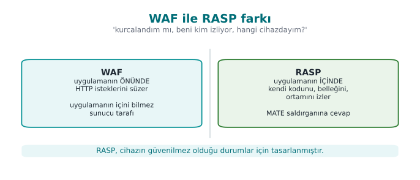

!!! note "A short history: an application protecting itself"
    - **1980s** — the crack/anti-crack culture: **anti-debug** and self-checking code trace back to here.
    - **2000s** — DRM, mobile banking, and payment apps are forced to move protection **inside the application**
      (the device is no longer trusted).
    - **2012** — Gartner coins the term **RASP** (Runtime Application Self-Protection): the protection runs
      **inside** the application.
    - **2010s–today** — **OWASP MASVS-RESILIENCE** turns these expectations into auditable requirements (Week 13).

    In short, RASP isn't a new idea; it's the name of the corporate answer to the **MATE attacker**.

**RASP (Runtime Application Self-Protection)** is a set of protections embedded **inside** the application that
watch themselves at **runtime** and respond to attacks. The application is its own guard.

!!! note "How is RASP different from external defenses?"
    | Defense | Where it sits | What it sees |
    | --- | --- | --- |
    | Network firewall | At the network edge | Packets |
    | WAF (Web App Firewall) | **In front of** the application | HTTP requests |
    | **RASP** | **Inside** the application | Its own code, memory, and the environment it runs in |
    A WAF asks "is the request coming from outside malicious?" RASP asks "have **I** been tampered with, who is
    watching **me**, **which device** am I on?" In this course we treat RASP in the mobile/embedded and desktop
    C/C++ context, as an application protecting itself.

RASP does three jobs; this triad is the backbone of the week:

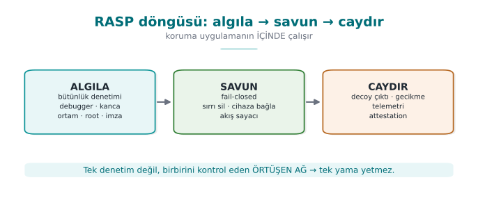

- **Detection:** understanding that something is wrong — the binary has been patched, a debugger is attached, the
  environment is an emulator, the app is on a rooted device, a component has been repackaged.
- **Defense:** giving a **meaningful** response to detection — erase the secret, reject the operation
  (fail-closed), bind the key to the device, tie a critical operation to the control flow.
- **Deterrence:** making the attacker's job **expensive** — return a fake (decoy) result instead of crashing, delay
  the response, report the event to the server. The goal is not unbreakability; it is **slowing the attack down
  enough** (the RASP-flavoured version of Week 4's "obscurity delays, it does not block" principle).

### 1.1 The attacker model: MATE ("Man-At-The-End")

In Week 1 we saw three attacker types. RASP's world is entirely **MATE**: the attacker **owns the endpoint** where
the application runs. Against a server, the attacker is outside (and TLS, authentication protect it); but inside
the client application, the attacker **sees everything**: they can read memory, modify code, step through it with
a debugger. This is the same assumption as the **white-box** model in Week 11.

What sets the MATE attacker apart from the other attacker types we saw in Week 1 is **position**, not capability:

| Attacker type | Where it sits | What it can see | Classic defense |
| --- | --- | --- | --- |
| Network attacker | **Between** the client and the server | Only encrypted traffic (if TLS is used) | TLS, authentication |
| Server attacker | **Outside** the server | Only the requests it sends and the responses it gets | Input validation, authorization, rate limiting |
| **MATE (the attacker at the end)** | **Inside** the device running the app, owns it | Memory, the binary, every step at runtime | RASP: integrity, anti-debug, hook detection, device binding |

Why does this table matter? Because against a MATE attacker, **network-attacker defenses** (TLS, server-side input
validation) do nothing at all — TLS protects the connection's **content**, but the attacker **is** the application
that opens the connection; the moment it decrypts, it sees the data in the clear in its own memory. That is why
RASP is added **on top of**, not **instead of**, the earlier weeks' defenses.

!!! danger "RASP's painful truth"
    If the device's owner is the attacker, **no client-side protection is ever ultimately unbreakable.** Given
    enough time and skill, every check can be bypassed. So why does RASP exist? Because the goal isn't
    **unbreakability**, it's making the attack **unscalable and expensive**: if breaking one device takes days,
    and it has to be redone on every broken device, **and** server-side anomalies get caught, the attack can
    collapse economically. RASP is the runtime layer of **defense in depth**; it makes sense **not alone**, but
    together with crypto (Weeks 3, 10), obfuscation (Weeks 4, 9), whitebox (Week 11), and **server-side checks**.

### 1.2 This week's example architecture and its central idea

Recall the example architecture we've used all term: a **mobile payment app** and a **security library** (native
C/C++) that does its critical work. The phone is an **untrusted environment**. This week we add a **RASP layer**
to that library that protects itself while it runs. All example values are **synthetic** (made up); no real key,
card number, device id, or product name is used.

The central idea in one sentence: **don't trust a single control.** Every detection signal can be bypassed on its
own; the strength comes from **multiple independent signals**, a **response policy**, and **device binding**
working together. This is the runtime counterpart of Week 3's **security shell**.

### 1.3 Worked example: handling the same event three different ways

Let's make concrete why detection, defense, and deterrence are **separate** concepts. Scenario: right before
unwrapping the payment key, the crypto library notices a debugger is attached (the Section 4 TracerPid signal is
> 0). Three developers handle this in three different ways:

1. **Detection only, no response:** the code increments the `supheli` (suspicious) variable but never checks it;
   the function continues its normal flow. Result: an attacker with a debugger attached **reads the key
   directly**. The detection was wasted — because it was never wired to a defense.
2. **Detection + a crude defense:** the code writes `if (supheli) exit(1);`. Result: the attacker can't read the
   key, but they see **exactly which line** the program stopped on; within a few tries they patch that `if` (the
   same weakness as the "the checker itself gets patched too" lesson in Section 3).
3. **Detection + defense + deterrence:** the code mixes the signal, not into `exit()` directly, but **as data**
   into the key-derivation operation (a small-scale version of the control-flow counter from Section 9), and if
   triggered, produces a **decoy** result (Section 10). Result: the attacker sees no error message; they get a
   result that looks "successful" but is useless, and they can't tell which check fired.

All three options share the same **detection** code; they differ only in the **defense** and **deterrence**
layers. As this week's demos progress we'll keep moving toward the third approach (see the full comparison in
Section 10.2).

---

## 2. RASP architecture: when, where, and how do checks work?

In the sections ahead we'll see the individual checks (integrity, debugger, environment, hook, root) one by one.
But in the field, a RASP solution's strength comes less from how clever each individual check is, and more from
**how these checks are combined**. A check that runs in one place, once, and whose result is evaluated with a
single `if`, no matter how well it's written, is the easiest check to find and bypass. This section covers the
design principles for placing checks.

### When does it run? Three trigger moments

| Moment | Example | Why? |
| --- | --- | --- |
| **At load time** | When the library is loaded into memory (on Android, the native library's load function) | If the environment is untrusted from the start, no secret should ever be unwrapped |
| **Right before a sensitive operation** | Right before decrypting a key, computing a payment, authenticating to the server | An attacker can attach a debugger **after** the app opens |
| **In the background, at irregular intervals** | On a separate thread, at random times | A fixed-time check is easily predicted and "stepped around" |

A single trigger moment isn't enough: a debugger check done only at startup will never see a debugger that
attaches **after** the app has started.

### Where does it run? Distributed checking

- **Multiplicity:** the same check isn't done in one function; it's done, each time slightly differently, in
  **many places** in the code. When the attacker patches one point, the others still run.
- **Mutual checking:** the managed layer (Java) and the native layer check each other's integrity; if one is
  modified, the other notices ("mutual integrity checking" in the split fingerprint of Week 5 and the interface
  table of Week 1).
- **Inside the protected function itself:** a valuable function (e.g., string decryption or key derivation) does
  several checks **itself**, at its own entry point. In the field, a single such function is often protected with
  close to fifteen checks of its own (code integrity, debugger, environment, root, control-flow counter), in
  addition to the checks already done at load time. For performance reasons, only the internal-use builds push
  some of these checks down to the entry point.
- **Decoy parameters:** at the entry points of sensitive functions there can be extra parameters, hidden behind a
  macro for the programmer's readability, that trigger an integrity check ("decoy parameters" in Week 4).

### How does it decide? Not centralized, data-dependent

The weakest design is this:

```c title="Weak: a single decision point"
if (hata_ayiklayici_var() || root_var() || butunluk_bozuk())
    return HATA;                     /* bu tek satırı değiştiren her şeyi atlatır */
anahtari_coz();
```

An attacker who flips a single comparison (or makes the `hata_ayiklayici_var` function always return "no") gets
past the whole protection. In a strong design, the checks' results don't feed an `if`; they feed **the data of the
next computation**:

- Check results participate in key derivation: if the environment is clean, the correct key comes out; if not, a
  **different but plausible-looking** key comes out (the control-flow counter and the decoy output in the
  response policy are two applications of this idea).
- Check results are carried as opaque values (Week 4): they can't be flipped to "passed" by changing a single
  byte.
- The response is given **far away in time and code** from the trigger (the response-policy section).

**What does "data dependency" mean, concretely?** In a weak design you write `if (kontrol_gecti)
anahtari_kullan();` — the `anahtar` (key) is already sitting ready in memory, the `if` only decides **whether** to
use it; if the attacker patches that `if`, the key is **already there** and gets used. In a strong design, the key
itself **doesn't exist yet**; it is **computed from** the check result: `anahtar = HMAC(kontrol_sonucu,
sabit_tuz)`. If the check fails, `kontrol_sonucu` is a different value, and `anahtar` comes out different (and
useless) — there is **no `if`** for the attacker to skip, because there's no decision to skip, only a value to
compute. The `acc` chain in Section 9.1 and the device key in Section 10.1 are two concrete applications of this
idea.

### Layers protect each other

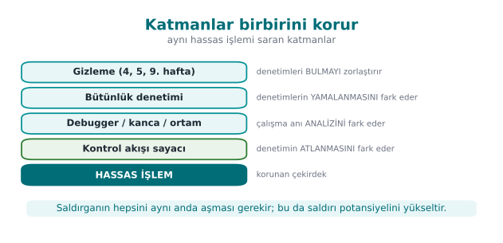

Each layer covers the previous one's weakness: obfuscation hides the checks, integrity checking notices the
hidden checks being **changed**, the control-flow counter notices the integrity check being **skipped**, device
binding stops the data being **used** somewhere else even if all of that is bypassed; server-side validation has
the final word even if the client is completely compromised (the telemetry and server-side risk engine in the
response policy).

### 2.1 Worked example: protecting one function at three points

Let's not leave "multiplicity" abstract. Take the `anahtar_coz()` function (the native function that unwraps the
payment key) in the example architecture and apply the three trigger moments in order:

1. **At load time:** when the library is loaded into memory (in the native library's init function), an integrity
   check (Section 3) runs once. If the environment is already broken from the start, `anahtar_coz` is made
   uncallable (a global flag is cleared).
2. **Right before the sensitive operation:** at `anahtar_coz()`'s own entry, an anti-debug check (Section 4) and a
   hook check (Section 6) also run — because the attacker may have attached the debugger **after** load time.
3. **In the background, at irregular intervals:** a separate thread reruns the environment check (Section 5) at
   random intervals (e.g., 2–7 seconds); the next `anahtar_coz()` call reads that thread's latest result.

Result: an attacker who wants to bypass `anahtar_coz()` has to defeat **three separate checks at three separate
points in time** at once. Patching only point 2 (the function's own entry) doesn't affect the checks at points 1
and 3 — the attacker thinks they've finished the job, but the background thread catches the inconsistency within a
few seconds and the response policy kicks in (Section 10).

!!! note "How it's done in the field"
    Card scheme application-protection requirements list exactly these layers: protection against unauthorized
    modification, self-integrity checking at runtime, refusing to run on unsupported devices, blocking version
    rollback, defense against static and dynamic reverse engineering and hooking techniques, detecting debugging
    and test environments, notifying the back end and the user in case of compromise and erasing the data, and
    checking that OS protections are turned on. A certified library's manual maps fourteen separate RASP measures
    on the native side and fourteen on the Java side to these requirements, one by one.

---

## 3. Integrity checking: the application verifies itself (self-hashing)

RASP's first and most basic step: **"Have I been modified?"** An attacker tries to bypass a license check, an
`if (odendi)` (if paid) branch, or a crypto call by **patching** it (the `je → jmp` patch we saw in Week 4). The
defense: the application computes a **digest** of its own binary (or of a protected code/data region) at runtime
and compares it against a known-in-advance **golden** value. If even a single byte has changed, the patch is
caught.

!!! info "The book's recipe and an update"
    The textbook (Viega & Messier) does this in **Recipe 12.2 (Detecting Modification)** with **CRC32**. CRC32 is
    **not cryptographic**: an attacker can patch the code and easily arrange for the same CRC to come out. We
    update this to **HMAC-SHA-256** (see Week 3): producing the correct HMAC requires the secret key. There's a
    reason the author chose CRC: the real attack is already patching the **checker code itself** — that's the main
    discussion of this section.

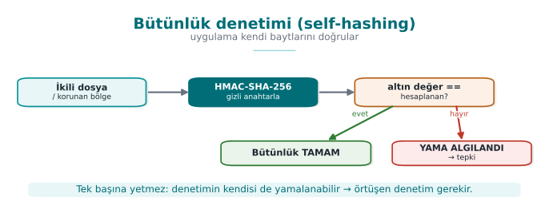

### Demo 1 — Runtime integrity checking and patch detection

!!! info "Demo 1 · `code/week-06/01-butunluk-hmac` · self-hashing, HMAC-SHA-256 (an update to Recipe 12.2)"
    The program computes the HMAC-SHA-256 digest of its own binary (`oz`, "self") and stores it as the "golden"
    value, then verifies it. Then a **copy** of the binary is made and one byte in it is changed (a patch
    simulation, in the demo's own `cikti/` (output) folder), and the patched copy's digest is compared against the
    golden value.

The core of the code (reads the file and computes the HMAC; `kripto_hmac_sha256` from `cen429_kripto.h`):

```c title="butunluk.c (özet)"
/* Kendi yolunu bul: Linux /proc/self/exe, Windows GetModuleFileNameA */
oz_yol(yol, sizeof(yol));
dosya_oku(yol, &veri, &boy);
kripto_hmac_sha256(RASP_ANAHTAR, 32, veri, boy, ozet);   /* HMAC over the file */

/* dogrula: sabit zamanli karsilastirma (zamanlama sizintisini onler) */
unsigned char fark = 0;
for (int i = 0; i < 32; i++) fark |= beklenen[i] ^ ozet[i];
if (fark == 0) { /* BUTUNLUK TAMAM */ } else { /* YAMA ALGILANDI */ }
```

**Actual output** captured on WSL (shortened):

```text title="sh demo.sh — çıktı"
ADIM 2 - Normal calisma: butunluk dogrulanir (yama yok)
Beklenen   : bae498a6a982279a833bf7e33d2db9cf...ee4d01e6
Hesaplanan : bae498a6a982279a833bf7e33d2db9cf...ee4d01e6
SONUC: BUTUNLUK TAMAM - hedef degismemis.

ADIM 3 - Saldiri: ikili dosyanin bir KOPYASI alinip 1 bayti degistiriliyor
> ofset 21268 baytini XOR 0xFF ile degistir
ADIM 4 - Yamali kopyanin HMAC'i altin degerle karsilastiriliyor
Beklenen   : bae498a6a982279a833bf7e33d2db9cf...ee4d01e6
Hesaplanan : 05fb42748cb5b57305f3ffacd61ad757...131c6705
SONUC: YAMA ALGILANDI - hedef degistirilmis! (tamper)   (cikis kodu 3)
```

While unpatched, the digest was **exactly** the same as the golden value. Changing a single byte completely
changed the digest (the avalanche effect), and the patch was caught. The comparison is done in **constant time**
(not `memcmp`), because as we saw in Week 3, a plain `memcmp` stops at the first differing byte and leaks timing.

### 3.1 Worked example: which bytes does the HMAC digest, and how does a patch break it?

**Which bytes are digested?** Looking at the `hedef_hmac()` function, the answer is clear: `dosya_oku()` reads the
**entire** target (its own binary) into memory (with `fread`, from offset 0 to the end of the file), and
`kripto_hmac_sha256` digests this **whole byte sequence** in one pass — not a specific function or section, but
**every byte** of the file. In `demo.sh`'s actual output, `ofset 21268` was changed; this lands roughly at the
**middle** of the file (`BOY / 2`) — meaning the binary's total size in that run was roughly `21268 × 2 ≈ 42536`
bytes. No matter which byte of the file the attacker changes (beginning, middle, or end), that byte is included in
the computation and the digest changes.

**How the patch breaks it — step by step on a small example.** Let's see the same avalanche effect, not on a huge
binary, but in a **single character** of text; the logic is identical. Let's HMAC-SHA-256 the string `"MERHABA"`
("HELLO") with a fixed key, then flip the last character from `A` to `B` and hash again:

```bash title="Tek karakterlik degisikligin HMAC'e etkisi (gercek openssl ciktisi)"
printf 'MERHABA' | openssl dgst -sha256 -hmac "ornek-anahtar"
printf 'MERHABB' | openssl dgst -sha256 -hmac "ornek-anahtar"
```

```text
SHA2-256(stdin)= 4d45a6382deee7f75c75b3cf5a6a81a2776d317e1db9ec9b0125b69e09492615
SHA2-256(stdin)= 4fbdf8768822083c3fc3797c5f1d278dd1ea58ab0bfde31a8ebf85e260fbcbd7
```

Only **1 of the input's 7 bytes** changed (the last character, `A`=0x41 → `B`=0x42; these two values differ in
only **two bits**); but **all 32 bytes** of the output are different. This is the **avalanche effect** of
cryptographic digest functions: if a single bit of the input changes, on average **half** of the output changes.
The `bae498a6...ee4d01e6` → `05fb4274...131c6705` transformation you saw in Demo 1's actual output is this same
property on a huge binary: `XOR 0xFF` flips **every bit** of a single byte, and this spreads to all 256 bits of
output through HMAC-SHA-256's internals (each round of SHA-256's compression function).

!!! note "Why is this necessary for the check to work at all?"
    Without the avalanche effect (as in a weak digest function like CRC32), an attacker could restore the digest
    to its old value by adding a few **compensating** bytes next to the byte they patched (a "fix the checksum"
    attack). In a cryptographic digest like HMAC-SHA-256 this is **practically impossible** without knowing the
    key — which is why we saw at the start of Section 3, in the "The book's recipe and an update" note, why CRC32
    is upgraded to HMAC.

!!! danger "Why isn't integrity checking enough on its own?"
    The HMAC key **lives inside the binary**. A determined enough attacker can:
    1. Patch the checker function **itself** to "always return OK."
    2. Patch the target **and** recompute the golden value (if they find the key).

    That's why real RASP strengthens integrity checking with three things: **(1) multiple/overlapping checkers**
    (in a network, where one also checks another), **(2) making the result a data dependency** — using the digest
    directly as a key/jump-table index, so patching breaks behaviour (see Section 9, Demo 5), **(3) server-side
    attestation** — sending the client's integrity proof to the server with a nonce.

!!! success "Rule"
    Verify the integrity of critical code/data regions at runtime with a **cryptographic** digest (HMAC/signature),
    not CRC. Don't check **only at a single point and only at startup**; make it periodic, multiple, and
    overlapping. Where possible, tie the result to a **data dependency**.

!!! note "How it's done in the field / How does an evaluator test this?"
    In the example architecture, the native library verifies a combined digest of both its own `.so`/`.dll` and
    the upper layer (e.g., Java/DEX); it does **mutual** verification (Catalog K6, Demo 6). An evaluator patches
    the binary and checks whether detection triggers, then tries patching the **checker code itself** to see
    whether the protection can be bypassed that way (a single checker or a network of them?).

!!! warning "Common mistakes and a checklist"
    - [ ] Is the integrity check **cryptographic** (not CRC)?
    - [ ] Does it check **periodically**, not only at startup?
    - [ ] Is there a single checker, or **overlapping** checkers?
    - [ ] Is the result tied to a behaviour (data dependency), or just an `if`?
    - [ ] Is there server-side **attestation** (not trusting the client alone)?

**How often should "periodic" be? A cost-latency trade-off.** Let's put a number to Section 2's "in the
background, at irregular intervals" principle. The **shorter** the check interval, the **faster** a patch gets
noticed, but CPU/battery cost also **rises**; the **longer** the interval, the more "unnoticed operation" window
is left to the attacker:

| Check interval | Delay before a patch is noticed (upper bound) | Typical extra CPU load |
| --- | --- | --- |
| Only at startup (once) | Unbounded (may never be noticed) | Lowest |
| Every 30 seconds | ~30 seconds | Low |
| Every 2–7 seconds (random) | ~7 seconds, at an **unpredictable** moment | Medium |
| Right before every critical operation (point 2 in Section 2) | Nearly instant | Only on critical operations |

In the field, the preferred approach is to use **not just one of these four options alone, but all of them
together**: once at startup (cheap, broad coverage), every time right before a critical operation (cheap, narrow
coverage but the most critical moment), and at random intervals in the background (not cheap, but it stops the
attacker from predicting "when does the check run"). A fixed interval (e.g., exactly every 30 seconds) gives the
attacker **predictability**; a random interval prevents that — which is why the third row of the table is marked
"random."

---

## 4. Debugger detection

The attacker's most powerful tool is a **debugger** (gdb, lldb, x64dbg, WinDbg, Visual Studio): it stops the
program, steps through it, reads memory and keys, and changes branches. RASP tries to figure out whether a
debugger is **attached**.

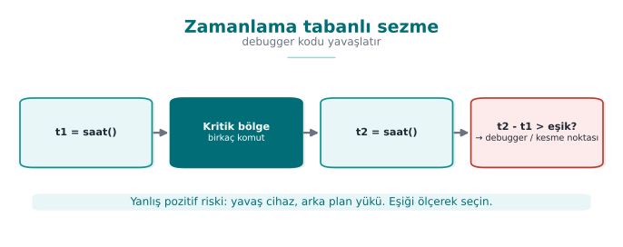

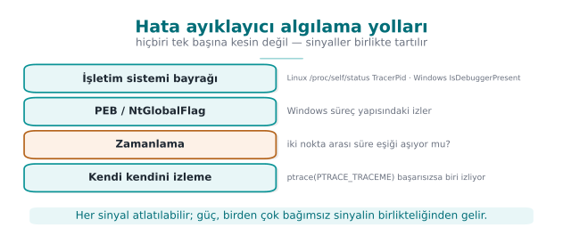

| Environment | Indicator | Book |
| --- | --- | --- |
| **Linux / WSL** | `/proc/self/status` → `TracerPid` (if >0, a process is watching us via `ptrace`); whether the parent process's name is gdb/strace/ltrace | Recipe 12.13 |
| **Windows** | `IsDebuggerPresent` (PEB `BeingDebugged`); `CheckRemoteDebuggerPresent`; PEB `NtGlobalFlag` (bits `0x70`) | Recipe 12.14 |

!!! info "From 2003 to today: what's outdated?"
    - **SoftICE (Recipe 12.15) is completely dead.** It has been replaced by modern hypervisor/ring-0 debuggers,
      x64dbg, WinDbg, gdb, lldb, and especially **Frida/DBI** (dynamic binary instrumentation) (see Section 6).
    - `IsDebuggerPresent` (12.14) still exists but is **weak on its own**; it's paired with PEB
      `BeingDebugged`/`NtGlobalFlag`, `CheckRemoteDebuggerPresent`, and timing-based detection.
    - The `ptrace` technique (12.13) is still valid; a modern addition: cross-checking `/proc/self/status`
      **TracerPid**.

### Demo 2 — Debugger detection (Linux ptrace/TracerPid, Windows PEB)

!!! info "Demo 2 · `code/week-06/02-hata-ayiklayici` · anti-debug, read-only"
    The program looks at several independent signals and **changes nothing** (it doesn't even watch itself with
    `ptrace`; it only reads `/proc` and PEB fields). `demo.sh` runs the program first normally, then under `gdb`.

```c title="antidebug.c (Linux özeti)"
/* /proc/self/status icinden TracerPid oku; >0 ise izleniyoruz */
long tp = tracer_pid();
if (tp > 0) supheli++;      /* bir surec bizi ptrace ile izliyor */
```

```text title="sh demo.sh — gerçek çıktı (WSL)"
ADIM 1 - Normal calisma (hata ayiklayici YOK): temiz beklenir
1) /proc/self/status TracerPid           : 0 (izleyen yok)
2) Ana surec (parent) adi                : sh
SONUC: Temiz - izleyen bir arac gorunmuyor.

ADIM 2 - gdb altinda calistir (TracerPid > 0 beklenir)
1) /proc/self/status TracerPid           : 2909 (IZLENIYOR)
SONUC: Hata ayiklayici/izleme ARACI algilandi (2 sinyal).
```

Without a debugger TracerPid was **0**, under gdb it was **>0**; the program told the two situations apart. On
Windows, if you run under Visual Studio with **F5** (under the debugger), `IsDebuggerPresent` returns **YES** and
the result is "detected."

### 4.1 Worked example: tracing TracerPid's move from 0 to non-zero step by step

Demo 2's output showed TracerPid moving from `0` to `2909`; let's now unpack **why** step by step.
`/proc/self/status` is a text file the kernel keeps for every process, readable by the process itself too (in Week
1 we described `/proc` as "a window the kernel opens onto the process"). The `TracerPid:` line inside it holds the
**PID** (Process ID) of the process watching that process with the `ptrace()` system call; if nobody is watching,
the value is **0**.

**Step 1 — without a debugger.** The `antidebug` program is run directly from the shell and reads its own
`/proc/self/status` file (representative, shortened content):

```text title="/proc/self/status (hata ayiklayici YOK, temsili)"
Name:      antidebug
Pid:       4821
PPid:      4820          <- calistiran kabuk (sh)
TracerPid: 0             <- kimse ptrace ile izlemiyor
```

The program reads this line, finds the numeric value `0`; since `tp > 0` is **false**, it doesn't increment the
`supheli` (suspicious) variable. The "SONUC: Temiz" (result: clean) line in the demo output comes from here.

**Step 2 — when run under `gdb`.** On its second pass, `demo.sh` starts the program from inside `gdb`. When `gdb`
starts or attaches to the target process, it tells the kernel "I'm watching this process"; this happens via a
`ptrace(PTRACE_TRACEME, ...)` or `ptrace(PTRACE_ATTACH, ...)` call. The kernel **records** this and fills the
watched process's `/proc/self/status` `TracerPid` field with the watching `gdb` process's **own PID**:

```text title="/proc/self/status (gdb ALTINDA, temsili)"
Name:      antidebug
Pid:       4821
PPid:      2909          <- artik ana surec gdb
TracerPid: 2909          <- gdb bizi ptrace ile izliyor
```

This is exactly the `2909` value seen in the demo output. The program itself **did nothing** — it only **read** a
field the kernel already keeps; that's why the technique is classified as "read-only" and has no side effects
(exactly why the safety promise in the demo's `README` can be kept).

**Step 3 — the decision.** Since `tp > 0`, the `supheli` counter goes up by 1; since the parent process's name is
also `gdb`, a second independent signal (the `ana_surec_adi` (parent-process-name) check) gets added too; the
"algilandi (2 sinyal)" (detected, 2 signals) phrase in the demo output is the sum of these two. Reading a single
field on its own may not be enough, but this kernel-level information is a signal that is **hard to fake**:
zeroing out `TracerPid` directly is impossible, because it's read from a kernel data structure, not from the
process's own memory — the only way for an attacker to hide it is to hook the **library function** that reads
`/proc/self/status`, which is exactly the topic of Section 6.

### 4.2 The Windows counterpart: reading the bits in `NtGlobalFlag`

Windows has no direct `/proc` file, but the same idea (reading a piece of information the kernel already keeps)
has a counterpart: the **PEB** (Process Environment Block — a memory structure kept by the kernel for every
process, which the process itself can also read). The PEB's `NtGlobalFlag` field carries three special flag bits
if the process was **started** under a debugger (not only attached later):

| Bit (hex) | Meaning |
| --- | --- |
| `0x10` | `FLG_HEAP_ENABLE_TAIL_CHECK` — heap end check |
| `0x20` | `FLG_HEAP_ENABLE_FREE_CHECK` — freed-heap check |
| `0x40` | `FLG_HEAP_VALIDATE_PARAMETERS` — heap parameter validation |

These three bits **together** make up `0x70` (`0x10 | 0x20 | 0x40 = 0x70`); when the Windows loader starts a
process under a debugger, it **automatically** switches the heap allocator into a stricter-checking mode and sets
these three bits. The line `(ntglobal & 0x70) != 0` in Demo 2's Windows code reads exactly this: whether the
`NtGlobalFlag` value carries **at least one** of these three bits. Just like `TracerPid`, this too is a
**read-only** operation; the program changes nothing, it reads a field the kernel/loader has already written.

!!! quote "The detection–counter-detection race"
    Anti-debug is a classic **arms race**. Every detection technique has a counter-technique: an attacker can turn
    `ptrace` into a no-op with `LD_PRELOAD` (Demo 4), patch `IsDebuggerPresent`'s return value, or clear the PEB
    flag. That's why **a single check is never trusted**; signals are multiplied and tied to a response policy
    (Demo 8).

!!! success "Rule"
    Don't write anti-debug as **a single `if (IsDebuggerPresent()) exit();`** (the attacker patches that call).
    Collect several independent signals (ptrace + TracerPid + timing + parent), tie the result directly to a
    behaviour/key, and **delay** the response (don't exit immediately; make it hard for the attacker to work out
    which check triggered).

!!! warning "Common mistakes and a checklist"
    - [ ] Do you rely on a single anti-debug call, or on several signals?
    - [ ] Is the detection result tied to a behaviour/key, or is it just `exit()`?
    - [ ] Did you prefer a read-only technique (`TracerPid`) over a technique with **side effects** like
          `ptrace(PTRACE_TRACEME)`?
    - [ ] Is the response immediate, or delayed/implicit?

---

## 5. Environment detection: virtual machine and emulator

An attacker most often runs the application in a controlled **analysis environment** — a virtual machine, an
emulator, or a sandbox. RASP tries to sense this from environmental clues.

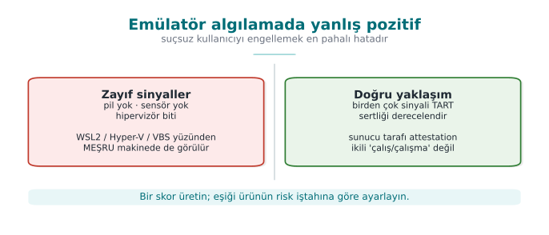

| Technique | How | Note |
| --- | --- | --- |
| **CPUID hypervisor bit** | `CPUID.1:ECX[31]` — "hypervisor present" | 0 on bare metal |
| **Hypervisor vendor signature** | `CPUID` leaf `0x40000000` → 12 characters (`KVMKVMKVM`, `VMwareVMware`, `Microsoft Hv`...) | Some hypervisors hide it |
| **Timing** | Measure an operation; single-stepping debugging/heavy emulation slows it down a lot | The threshold varies by machine |

### Demo 3 — VM/emulator and timing detection (CPUID)

!!! info "Demo 3 · `code/week-06/03-ortam-zamanlama` · only reads a CPU instruction and the clock"

```text title="sh demo.sh — gerçek çıktı (WSL2)"
(A) CPUID.1:ECX[31] hipervizor biti : VAR
    Hipervizor satici imzasi        : (satici imzasi gizli/bos)
(B) 2.000.000 islem suresi          : 0.806 ms
SONUC: Hipervizor GORULDU. Ama WSL2/Hyper-V/VBS de boyle gorunur;
bu TEK basina 'analiz ortami' demek degildir - zayif sinyal.
```

!!! danger "The single most important lesson: false positives"
    The output above was captured on WSL2, and the **hypervisor bit said "PRESENT."** But this is **not** an
    analysis environment — it's an ordinary developer machine! On modern Windows, most machines report a
    hypervisor because of **Hyper-V, WSL2, and virtualization-based security (VBS)**. So this bit alone does
    **not** mean "an attacker is analyzing this." If an application refused to run just because it saw a
    hypervisor, it would block millions of **legitimate** users. RASP always **weighs multiple indicators** and
    accepts that each one can be **bypassed**.

!!! success "Rule"
    Use environment detection as a **risk score**, not a binary run/don't-run decision. Combine multiple
    indicators; account for false positives (real users on a legitimate VM/emulator); make the final call together
    with a **server-side risk engine**.

!!! note "How it's done in the field"
    In the mobile world the counterpart is **emulator detection** (QEMU/Android emulator clues: `ro.kernel.qemu`,
    fake sensors, typical IMEI/serial values). Same principle: signal, not proof; combination plus server-side
    checking.

### 5.1 Worked example: how do you build a risk score and a threshold?

Let's put numbers to Section 1.2's "don't trust a single control" principle here. Every environment-detection
signal is given a **weight** (a contribution score between 0 and 100); all the weights are summed and a **risk
score** comes out. The decision is not a single `if (hipervizor_var)`, but whether this score is above a
**threshold**.

| Signal | Source | How reliable alone? | Example weight |
| --- | --- | --- | --- |
| Hypervisor bit (CPUID) | Demo 3 | Low — also set under WSL2/Hyper-V/VBS | 15 |
| Known hypervisor vendor signature | Demo 3 | Medium — more reliably shows a virtualized environment | 25 |
| Timing anomaly | Demo 3 | Medium — can also happen on a real machine under load | 20 |
| Known emulator file trace (on mobile) | e.g. `ro.kernel.qemu` | High — almost never happens on a real device | 40 |
| Debugger attached | Demo 2 (TracerPid) | High — rarely happens while a legitimate user is using the app | 35 |

**Example 1 — a developer working on WSL2 (a legitimate user).** As in Demo 3's actual output, the hypervisor bit
is **PRESENT** but the vendor signature is **hidden/empty**, timing is normal, there's no emulator trace, no
debugger attached. Total score: only **15** (the hypervisor bit alone). The score is low; the user isn't blocked.

**Example 2 — an attacker working in an analysis environment.** Hypervisor bit PRESENT (15) + vendor signature
visible (25) + timing anomaly (20) + debugger attached (35) = total **95**. The score is high; the operation is
rejected or a decoy is returned (Section 10).

The difference is not **the presence of a single bit**, but **how many independent signals appear together**.
Where should the threshold be set? That's a **risk appetite** decision that varies from product to product — a
trade-off of "how many legitimate users am I willing to block, in exchange for how many attacks I prevent":

| Product | Cost of a false positive | Cost of a false negative | Example threshold |
| --- | --- | --- | --- |
| Banking / payment app | User can't complete the transaction, call-center load rises | Fraudulent transaction, direct money loss | Low (e.g. 30) — reject when in doubt |
| Loyalty points / coupon app | User is annoyed but the loss is small | An extra coupon gets used | High (e.g. 70) — rarely reject |
| DRM-protected content player | Legitimate user can't watch the content, store rating drops | Content gets copied | Medium (e.g. 50) |

!!! danger "The real cost of a false positive"
    Setting the threshold too low (e.g., making the banking threshold 10 instead of 70) blocks — **while they are
    entirely legitimate** — every developer using WSL2/Hyper-V, every IT department testing on a virtual machine,
    and ordinary users of some accessibility/security tools. The cost of this is not abstract: call-center load,
    store rating/negative reviews, lost users. RASP design should measure "how many legitimate users did we block"
    as carefully as "how many attackers did we catch" — ideally with a staged rollout (log-only first, then
    reject).

!!! success "Rule"
    Combine environment/root/debugger signals into a **weighted risk score**, not a **single binary decision**.
    Choose the threshold **deliberately**, based on the asset's value and the product's risk appetite; there is no
    fixed, one-size-fits-all "industry-standard threshold." Keep the score and the threshold **tunable** over time
    (based on server-side telemetry); don't hard-code them into the binary.

---

## 6. Hook and instrumentation detection (LD_PRELOAD, Frida)

A sneakier threat than a debugger: **function hooking** and **dynamic instrumentation**. Without stopping the
program, the attacker **replaces the functions it calls — including our own anti-debug/anti-root checks — with
their own version**. This lets them make Demo 2's checks lie and always return "clean."

!!! note "A short history: from static patching to dynamic instrumentation"
    - **1990s** — hooking techniques were **hand-written**, target-specific tools operating on the IAT (Import
      Address Table) and the PLT/GOT; they had to be rewritten for every target.
    - **2000s** — `LD_PRELOAD` (Linux) and DLL injection (Windows) became common as general-purpose but **static**
      (precompiled) hooking methods.
    - **2009** — the foundations of the **Frida** project were laid; the real difference was that hook code could
      be written and injected **in JavaScript, at runtime** — no compilation needed.
    - **2010s–today** — Frida became the standard tool for mobile security testing; this is the main reason RASP's
      "hook detection" section exists at all.

    The lesson of this history: hooking techniques evolved **from static to dynamic**; that's why detection also
    needs to look, not at a specific tool's signature (like the `dladdr` technique in Section 6.1), but at
    **the behaviour itself** (where does the function actually run from?).

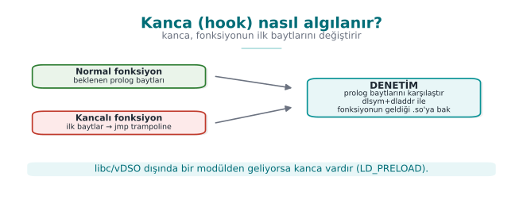

| Technique | How | Platform |
| --- | --- | --- |
| **LD_PRELOAD** | Preloading a `.so` to replace standard functions (interposition) | Linux |
| **PLT/GOT hooking** | Redirecting call-table entries to your own function | Linux/ELF |
| **Inline hooking** | Overwriting a function's first bytes with a `jmp` | Everywhere |
| **Frida / Xposed** | Dynamic binary instrumentation frameworks | Mobile/desktop |

Detection ideas (Catalog K7/K8/K18):

- Is the `LD_PRELOAD` environment variable empty? (`getenv` — **weak**, because `getenv` itself can also be
  hooked)
- **Which shared object** does a function actually resolve from? `dlsym(RTLD_DEFAULT, ...)` + `dladdr` are used to
  look up which `.so` file a function actually comes from; if a foreign `.so` shows up instead of the expected
  libc, **there's a hook**. (This doesn't rely on `getenv` faking.)
- Unexpected executable regions in `/proc/self/maps`, known framework indicators.

### Demo 4 — Hooking with LD_PRELOAD and detection with `dladdr`

!!! info "Demo 4 · `code/week-06/04-preload-kanca` · Linux/WSL only · CWE-like: dynamic instrumentation"
    The demo **compiles** a small fake hook library (`libsahtekanca.so`) that takes over the `time()` function.
    With `LD_PRELOAD`, this library is loaded **only for a single demo command**. The main program catches the
    hook by looking at which `.so` the function comes from. On Windows, `demo.ps1` explains how this is run under
    WSL (the Windows counterpart is IAT/inline-hook detection).

```c title="kanca_ana.c (özet)"
void *p = dlsym(RTLD_DEFAULT, "time");   /* onyuklu kanca varsa onu doner */
Dl_info info;
dladdr(p, &info);                        /* fonksiyonu saglayan .so */
int kanca = !mesru_mi(info.dli_fname);   /* libc/vdso/ld disi = KANCA */
```

```text title="sh demo.sh — gerçek çıktı (WSL)"
ADIM 1 - Normal calisma (LD_PRELOAD yok): temiz beklenir
   time     -> linux-vdso.so.1
   getenv   -> /lib/x86_64-linux-gnu/libc.so.6
   time(NULL) dondurdu : 1789852509
SONUC: Temiz - preload/kanca gorunmuyor.

ADIM 2 - Saldiri: sahte kanca LD_PRELOAD ile YALNIZ bu surece yukleniyor
   time     -> bin/linux/libsahtekanca.so (KANCA!)
   time(NULL) dondurdu : 1234567890
SONUC: Fonksiyon kancasi / preload ALGILANDI (2 sinyal).
```

In the clean run, `time` resolved from the kernel's **vDSO** (this is legitimate, not a hook). Once the hook was
loaded, the same `time` resolved from `libsahtekanca.so` and returned a **fixed fake value** (1234567890);
`dladdr` caught the hook by pointing at the function's location. Note: to avoid counting `linux-vdso` as a **false
positive** in the clean run, detection treats libc, vDSO, and the dynamic loader as legitimate sources — this is
the lesson that "writing a detector is easier than writing a **correct** detector."

### 6.1 Worked example: finding a function's source step by step with `dlsym` + `dladdr`

The heart of Demo 4 is two function calls: `dlsym` and `dladdr`. Let's unpack what the two do together, step by
step.

**Step 1 — what does `dlsym(RTLD_DEFAULT, "time")` do?** `dlsym` searches the running process's **symbol table**
for a symbol with the given name (`"time"`) and returns its **memory address**. `RTLD_DEFAULT` is a special handle
meaning "use the program's normal symbol search order (its own binary, then loaded libraries, including
`LD_PRELOAD`ed ones)." This step's output is just a **number** (a memory address); it carries no information about
which file it came from.

**Step 2 — who provided this address?** This is `dladdr`'s job: it takes a given address, looks it up in the
running process's map of loaded **shared objects (`.so` files)**, and finds **which** `.so`'s memory range the
address falls into. It writes the result into a `Dl_info` structure; the field we use, `dli_fname`, is that
`.so`'s **file path**.

**Step 3 — in the clean run.** With `LD_PRELOAD` empty, the `time` symbol resolves through the normal search order
and comes from the kernel-provided **vDSO** (virtual Dynamic Shared Object — a special virtual `.so` the kernel
automatically adds to a process's memory to provide fast reads without a system call). Demo output: `time ->
linux-vdso.so.1`. The `mesru_mi()` (is-it-legitimate) function recognizes this name (it looks for the
`linux-vdso` substring) and says **not a hook**.

**Step 4 — once the hook is loaded via `LD_PRELOAD`.** `demo.sh` starts the program with the environment variable
`LD_PRELOAD=./libsahtekanca.so`. The dynamic linker (`ld-linux.so`) puts this library at the **very front** of the
normal search order; since the library defines its own `time()` function, `dlsym(RTLD_DEFAULT, "time")` now finds
**not the real `time` in vDSO, but the fake `time` in `libsahtekanca.so`**. `dladdr` sees this address falls
within `libsahtekanca.so`'s memory range; `dli_fname` returns `"bin/linux/libsahtekanca.so"`. Since `mesru_mi()`
doesn't recognize this name (not libc/vDSO/ld), it says **HOOK** — exactly the `time ->
bin/linux/libsahtekanca.so (KANCA!)` line in the demo output.

**Step 5 — why is this stronger than a `getenv(LD_PRELOAD)` check?** The `getenv` check looks at the environment
variable **itself** — but the environment variable is only used to load the library at the program's
**start-up moment**; once it's loaded, the attacker can **delete it** (`unsetenv`) or hook `getenv` itself in
their own fake library to return empty (exactly what Activity 1 tries). The `dladdr` check never looks at the
environment variable at all; it directly asks "where is this function **actually** running from right now?" —
since the hook is already loaded, the answer to that question comes, not from the environment variable, but from
the running **code itself**, which is why it doesn't rely on `getenv` faking.

!!! success "Rule"
    Don't rely on **manipulable** sources like `getenv(LD_PRELOAD)` for hook detection; verify critical functions'
    **source** (which module they come from). Check multiple functions; add extra signals like `/proc/self/maps`;
    tie the result to a response policy.

!!! note "How does an evaluator test this?"
    An evaluator hooks critical functions with a known instrumentation tool (e.g., Frida) and checks whether the
    protection catches it; then they try hooking the **detection function itself** to see whether the protection
    can be blinded (a single point, or distributed?).

---

## 7. Dynamic memory protection and memory-monitoring detection

One of the items the syllabus puts in this week is **dynamic memory protection**: measures taken, while the
program runs, against sensitive data in memory being read and modified. In Week 1 we saw erasing secrets from
memory and preventing them from being swapped out; in Week 3, the "data in use" layers. This section asks the same
question again, from the runtime attacker's angle: what can we do if the attacker is **watching** or
**modifying** memory?

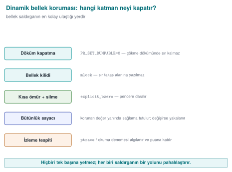

### What does an attacker do with memory?

| Attack | Example | Target |
| --- | --- | --- |
| **Reading** | Dumping process memory, searching memory for a known value | Key, PIN, decrypted data |
| **Modifying** | Changing a score in a game, a counter value, or a "license valid" flag in memory | Logic and checks |
| **Watching** | Finding which address holds what, using tools that report when a value changes | Discovering where variables live |

For all of these attacks the attacker needs to **access** process memory: through a debugger, through the OS's
process-memory interfaces, or through a library loaded into the process. That's why memory protection is thought
of together with the debugger and hook detection from earlier sections.

### Countermeasure 1: keep little in memory, keep it short, keep it scattered

The most effective memory protection is **leaving nothing to read** in memory:

1. **Short lifetime:** the secret is only ever in the clear inside the function that uses it, and is erased before
   the function returns (Week 3: the window of exposure).
2. **Masking and splitting:** while unused, the secret sits XORed with a random mask or split into pieces; the
   secret itself never sits whole in one place in memory.
3. **Erase with a random value:** once done, memory is filled, not with zeros, but with random values, so it
   doesn't even leave the trace "a secret was just here." In the field, on the native side, this is the one place
   a random generator is used.
4. **Never unwrap it at all:** in whitebox cryptography, the key is never in the clear in memory at any point
   (Week 11). In the field's shell matrix, this is the only shell left on the native side during a payment.

### Countermeasure 2: make memory harder for the OS to read

| Measure | Platform | Effect |
| --- | --- | --- |
| Disabling core dumps, `PR_SET_DUMPABLE = 0` | Linux | Even another process owned by the same user can't attach as a debugger or read the process's memory file (Week 1) |
| Memory locking (`mlock` / `VirtualLock`), `MADV_DONTDUMP` | Linux / Windows | The secret doesn't end up in swap or in a dump (Week 1) |
| Page protections (`mprotect` / `VirtualProtect`) | Linux / Windows | Tables that shouldn't change after initialization are made **read-only**; an attempt to modify them causes a fault |
| Protected-process features | Windows, mobile platforms | The OS's "protected process" and app sandboxing limit other apps' access to memory |

These measures don't stop an attacker with administrator (root) privileges; but they force the attacker to move to
a **more powerful** position, and that's where root detection comes in.

**A concrete example: what does `PR_SET_DUMPABLE` change?** On Linux, every process is "dumpable" by default —
the kernel can produce a core dump on a crash **and** another process owned by the same user can attach to it with
`ptrace(PTRACE_ATTACH, pid, ...)`. The `prctl(PR_SET_DUMPABLE, 0)` call turns this flag off:

| State | Attaching from outside with `ptrace` | A memory dump on crash | Reading `/proc/<pid>/mem` |
| --- | --- | --- | --- |
| `PR_SET_DUMPABLE = 1` (default) | Another process of the same user **can attach** | Produced (stays on disk) | Readable |
| `PR_SET_DUMPABLE = 0` | Even the same user's process **can't attach** ("Operation not permitted") | Not produced | Refused |

This works **complementary** to the `TracerPid` check in Section 4: `TracerPid` **detects** "is someone watching
right now?"; `PR_SET_DUMPABLE = 0` **prevents** "an ordinary tool owned by the same user shouldn't be able to
watch." An attacker with root privilege can still get past this flag (depending on the `ptrace_scope` setting and
their privilege) — which is why it should be considered together with the root indicator in Section 8.

### Countermeasure 3: notice when data has been changed

The way to notice a critical structure in memory (a counter, a permission flag, a configuration table) being
silently modified is to never leave that data **alone**:

```c title="Kritik bir değeri korumalı tutmak: değer + gölge kopya + özet"
typedef struct {
    uint32_t deger;        /* asıl değer                          */
    uint32_t golge;        /* deger XOR çalışma anı maskesi        */
    uint32_t ozet;         /* deger ve golge üzerinden kısa bir MAC */
} KorunanSayac;

/* Okurken üçünün tutarlılığı denetlenir; tutmuyorsa değer bellekte değiştirilmiştir. */
int sayac_oku(const KorunanSayac *s, uint32_t *cikti)
{
    if ((s->golge ^ calisma_maskesi) != s->deger) return -1;
    if (kisa_mac(s->deger, s->golge) != s->ozet)   return -1;
    *cikti = s->deger;
    return 0;
}
```

If the attacker changes only the `deger` (value) field in memory, the shadow copy and the digest no longer match.
To change all three consistently, they'd also need to find the mask and the digest key; this raises the cost of
the attack. The same idea appears in Week 5's device fingerprint being stored **with two different digests in two
different places**, and in Week 2's tamper-resistant log.

### 7.1 Worked example: how does `KorunanSayac` catch an attack?

Let's trace the structure above with numbers. Let `calisma_maskesi` (the runtime mask) be a fixed value randomly
generated at startup: `0xA5A5A5A5`. When a payment-attempt counter `deger = 3` (third attempt), the structure is
filled like this:

| Field | Value | How it was computed |
| --- | --- | --- |
| `deger` | `0x00000003` | the actual counter |
| `golge` | `0xA5A5A5A6` | `deger XOR calisma_maskesi` = `0x00000003 XOR 0xA5A5A5A5` |
| `ozet` | (example) `0x7F2C1B90` | `kisa_mac(deger, golge)` |

`sayac_oku()` checks on every read whether `golge XOR calisma_maskesi` equals `deger`:
`0xA5A5A5A6 XOR 0xA5A5A5A5 = 0x00000003` — equal to `deger`, consistent; the function returns `0`.

Now suppose the attacker uses a memory editor to change only the `deger` field to `0x00000063` (99) (trying to
reset/increase an attempt counter or a score). The `golge` and `ozet` fields are **unchanged**. The next
`sayac_oku()` call: `golge XOR calisma_maskesi = 0xA5A5A5A6 XOR 0xA5A5A5A5 = 0x00000003` — but `deger` is now
`0x00000063`. They **don't match**; the function returns `-1`, and the inconsistency is caught. For the attacker
to get past this, they'd also have to recompute `golge` with the correct mask **and** produce a consistent
`ozet` — which, as long as they don't know `kisa_mac`'s key, is exactly as hard as recreating the HMAC golden
value from Section 3.1.

!!! warning "A consistency check is a check too"
    A caller that ignores `sayac_oku`'s `-1` return "as if nothing happened" throws away the whole protection; and
    the check code itself can be patched too. That's why the inconsistency is tied to a response (the response
    policy), and the check code is also brought under the scope of the integrity check.

### Countermeasure 4: notice when you're being watched

Most memory-watching tools work by attaching to the process as a debugger or by loading a library into the
process. That's why the foundation of watch detection is the methods we saw in the debugger and hook detection
sections. In addition, some indirect signals are used:

- **Timing:** code that is single-stepped or paused at breakpoints runs far slower than normal; an unexpectedly
  long time between two points is a signal (the same idea as the timing measurement in environment detection).
- **Unexpected modules:** libraries present in process memory that the application itself never loaded.
- **Broken consistency:** protected values like in Countermeasure 3 becoming inconsistent.

None of these signals is conclusive on its own; all of them are used as contributions to the **risk score** in the
response policy.

!!! question "How does an evaluator test this?"
    They dump process memory during and after a sensitive operation and search for known test secrets; they
    change a counter or a flag in memory with a memory editor and see whether the application notices; they attach
    memory-monitoring tools and observe the application's response. The report answers "how long was the secret
    exposed in memory" and "was the changed value noticed."

---

## 8. Root/privileged environment and component signature verification

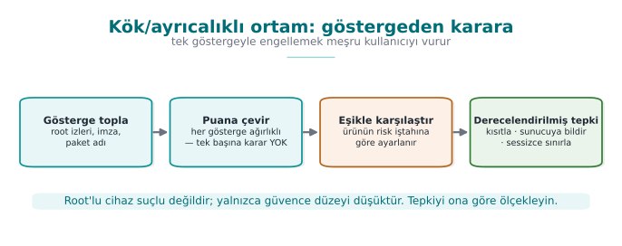

### 8.1 Root / privileged environment indicator

On a rooted (or jailbroken) device, an application's security assumptions collapse: any process can read memory,
file-system protections are bypassed. RASP looks at root indicators (Catalog K4/K5): the presence of the `su`
binary, dangerous packages, writable system paths, root-hiding frameworks. The desktop counterpart: is the
application running with **elevated privilege** (Linux `geteuid()==0`, an elevated token on Windows)?

**The difference between mobile "root" and desktop "elevated privilege" is just a name; the idea is the same.** On
Android, an application finding the `su` binary shows that root access **is installed**; on Linux/desktop, a
process's `geteuid()` returning `0` shows the process is **actually** running as the `root` user. A small but
important difference between the two: on mobile, root **may be installed but not in use at that moment** (the
indicator is just an indicator); on desktop, `geteuid()==0` reports the **actual current state** (the kernel
itself keeps this information, just as hard to fake as `TracerPid` in Section 4.1 was). That's why the desktop/
server-side "privileged process" check is a slightly **more reliable** signal than the mobile "root indicator"
scan — still, it should be added to the risk score in Section 8.1.1 rather than deciding on its own.

### Demo 7 — Root/privileged environment indicator (read-only)

!!! info "Demo 7 · `code/week-06/07-ortam-yetki` · root/privilege indicator, read-only"
    The program checks (1) the privilege level (root/admin?) and (2) the presence of known "dangerous marker"
    paths purely by **reading**. To make the demo deterministic, a fake marker (`cikti/sahte_su`) is passed on the
    command line.

```text title="sh demo.sh — gerçek çıktı (kısaltılmış)"
ADIM 2 - Isaretli durum: sahte bir 'su' isaret dosyasi olusturuluyor
1) Ayricalik seviyesi : normal kullanici
2) Tehlikeli gosterge taramasi:
   [BULUNDU] cikti/sahte_su (ek isaret)
SONUC: Ayricalikli/riskli ortam GOSTERGESI var (1 sinyal).
```

!!! warning "Signal, not proof"
    Root indicators are **easily faked** (tools like Magisk Hide hide `su` and known paths). Also, if an
    application refuses to run just because it saw root, it also blocks users who have **legitimately** rooted
    their device (a false-positive / user-experience trade-off). The modern approach: measure the device's
    integrity with an **OS/platform attestation** service (nonced, verified server-side) — don't trust the
    client's own "I'm not rooted" claim.

### 8.1.1 Tying the root indicator to a risk score too

The risk-score idea from Section 5.1 applies to the root/privilege indicator as well; in fact, the field prefers a
**list** rather than a single indicator, because every single indicator can be both **missed** (an attacker hides
it) and produce a **false positive** (a legitimate user has genuinely rooted their device).

| Indicator | Meaning alone | Example weight |
| --- | --- | --- |
| `su` binary/marker found | Root access may be installed | 20 |
| Known root-management package installed | Root is actively being managed | 25 |
| System partition is writable | An area that should be read-only can be changed | 30 |
| `geteuid() == 0` (desktop/server counterpart) | The process is actually running with elevated privilege | 40 |

Demo 7's actual output — a single signal (`cikti/sahte_su` found → 1 signal) — corresponds to a low score; on its
own, it **shouldn't be enough** to stop a banking application. For the score to come out high, several indicators
are expected to appear **together** — just as in the environment example in Section 5.1.

!!! warning "Common mistake: `exit()` instantly on seeing root"
    Shutting down the application the instant a single root indicator is seen neither catches the real attacker
    (who has already hidden the clues, so this check never sees them) nor is it fair to an ordinary user who has
    rooted their device for a legitimate reason (customization, development). Rule: add the indicator to the
    score, leave the decision to the **threshold** (Section 5.1); before fail-closed, consider **reduced
    functionality** first (e.g., reject high-value operations, accept low-value ones).

### 8.2 Component/package signature and digest verification (the general form of APK signature verification)

On Android, an application verifies the **APK signature** (APK Signature Scheme v1/v2/v3) against
**repackaging**: even if an attacker opens the app, modifies it, and repackages it, they can't carry the signature
produced by the original developer's private key. This is the general form of "is the component I loaded/called
the expected, unmodified version?" (Catalog K2/K3/K6).

### Demo 6 — Component signature verification and repackaging detection

!!! info "Demo 6 · `code/week-06/06-bilesen-imza` · signature/digest verification"
    A "plugin module" file is verified with a detached signature (HMAC-SHA-256) **before** it's loaded. If the
    module changes by even a single byte, the signature won't match and loading is refused.

```text title="sh demo.sh — gerçek çıktı"
ADIM 3 - Yukleme oncesi dogrulama (modul degismedi): TUTAR
Modul imzasi TUTTU -> guvenle yuklenebilir.
ADIM 4 - Saldiri: modul YENIDEN PAKETLENIR (tek bayt eklenir)
Modul imzasi TUTMADI -> YENIDEN PAKETLENMIS/degistirilmis.
Yukleme REDDEDILDI.   (cikis kodu 3)
```

!!! info "An important difference: HMAC vs. asymmetric signature"
    APK v2/v3 uses an **asymmetric (public-key)** signature (see the digital signature in Week 3): the verifier
    needs only the **public key**, not the signing key. In this demo we use **shared-key HMAC** for teaching
    purposes (simple and ready-made in `cen429_kripto.h`); we'll cover asymmetric signatures (Ed25519 / RSA-PSS)
    and certificate chains **in Week 10**. The principle is the same: **integrity + source** verification before
    loading.

### 8.2.1 Worked example: how is repackaging caught by adding a single byte?

Let's combine Demo 6's actual "modül YENIDEN PAKETLENIR (tek bayt eklenir)" (module repackaged, one byte added)
step with Section 3.1's logic. The module's verification is also an HMAC-SHA-256 computed over **the whole file**,
just like Demo 1; the difference is that this time the target isn't the program itself but **a separate file**
(the plugin module).

**Step 1 — the original module.** The module file is `N` bytes; the loader reads it, computes `HMAC(anahtar,
modul[0..N))`, and compares it against the previously stored signature. It matches → "TUTAR" (holds) → loaded with
confidence.

**Step 2 — the attacker opens the module, adds a feature, repackages it.** This operation **appends one byte to
the end** of the file (it's now `N+1` bytes) — even if it never touches the module's intended functionality. This
time the loader computes `HMAC(anahtar, modul[0..N+1))`. Because the input's **length itself has changed** (a more
fundamental difference than the single byte **value** change in Section 3.1), HMAC's internal block-processing
sees different blocks from the very start, and the result comes out **completely** different — just as we saw in
Demo 1.

**Step 3 — the comparison fails.** The new HMAC doesn't match the stored signature → "TUTMADI" (doesn't hold) →
"YENIDEN PAKETLENMIS/degistirilmis" (repackaged/modified) → loading is refused (exit code 3). For the attacker to
**reproduce** the signature even after adding a single byte, they'd need the signing key; in this teaching HMAC,
that key lives inside the loader, but in a real APK signature (asymmetric), it is the **private key** held only by
the original developer — which is exactly the crux of the distinction in Section 8.2's "An important difference"
note: anyone who can verify an HMAC can also **produce** one; with an asymmetric signature, the verifier can only
**verify**, never produce.

!!! success "Rule"
    Cryptographically verify every dynamically loaded component (module, plugin, native library, update package)
    **before** loading it. Where possible, set up **mutual** verification (Catalog K6): the native side verifies
    the upper layer's digest; the upper layer verifies the native side's digest — the attacker would have to patch
    **both** consistently. For the long run, prefer an **asymmetric signature** (easier distribution).

---

## 9. Control-flow integrity: why a single `if` isn't enough

Every check so far (integrity, anti-debug, environment, root) makes **one decision** at one point: `if (tehlike)
reddet;` (if danger, reject). The attacker's job is simple: patch **that one jump** (`je → jmp`) and skip the check
(the patch from Section 3). So what's the way to make checks **unskippable**?

The answer: tie the security checks to a **control-flow counter / key chain** (Catalog K17). A critical operation
can only produce the correct result **if** all the checkpoints have been passed **in order**. We build this as a
**data dependency**: each checkpoint advances a key chain (`acc = HMAC(acc, "asama-i")`); the critical operation
unwraps a secret with the key derived from this chain.

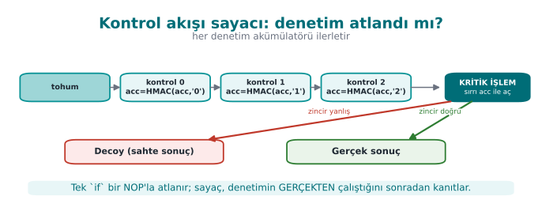

If a check is skipped, or its order is broken, **acc** comes out different, the key is wrong, and GCM decryption
is **rejected** — the real result can't be produced. So a single `jmp` patch is useless.

### Demo 5 — Control-flow counter and a skip attack

!!! info "Demo 5 · `code/week-06/05-akis-sayaci` · control-flow integrity (Catalog K17)"

```text title="sh demo.sh — gerçek çıktı (kısaltılmış)"
SENARYO 1 - Normal: butun kontrol noktalari sirayla calisir
   [gecildi] kontrol noktasi 0, 1, 2
SONUC: ODEME ONAYLANDI -> "ODEME-ONAYI-TOKEN-4242"

SENARYO 2 - Saldiri: kontroller tamamen ATLANIR
   [ATLANDI] hicbir kontrol noktasi calismadi
   (uyari: sayac=0 iz=0x0 beklenen=3/0x7)
SONUC: ODEME REDDEDILDI (zincir anahtari yanlis). ... decoy doner

SENARYO 4 - Saldiri: kontroller YANLIS SIRADA calisir
SONUC: ODEME REDDEDILDI (zincir anahtari yanlis). ... decoy doner
```

In the normal flow, all three checkpoints were passed in order, the chain came out correct, and the payment was
approved. When the checks were skipped, only partly passed, or passed in the wrong order, the chain came out
different; the critical operation **couldn't produce** the real result and returned a fake (decoy) one. The
program also keeps a **double counter** (a `sayac` counter plus an `iz` trace bit) (K17); together with the key
chain, this gives a triple consistency check.

**Why is the "double counter" needed — isn't the `acc` chain enough?** The `acc` chain proves, indirectly, **which
stages ran in which order** (wrong stage/order → wrong key), but as we see in the demo's warning line (`uyari:
sayac=0 iz=0x0 beklenen=3/0x7`), the program also keeps two more **simple** counters: `sayac` (a plain integer
counting how many checkpoints ran) and `iz` (a bit set where each checkpoint sets its own bit position, e.g., if
checkpoints 0, 1, and 2 passed, `iz = 0b111 = 0x7`). Their purpose is **different** from `acc`'s: `acc` is
cryptographically strong but on its own gives no **readable diagnostic information** like "how many checks passed,
which ones" (you cannot infer "all three checks passed" from an HMAC output). `sayac` and `iz` give the developer
and the log a readable summary, while the actual **authorization decision** still rests only on the key derived
from `acc` — even if the `sayac` and `iz` fields themselves are patched to `3` and `0x7`, the key still comes out
wrong because the `acc` chain is wrong. The three values (acc, sayac, iz) thus **cross-check** each other: if one
is inconsistent, it's noticed in the log, but none of them alone can change the authorization decision.

### 9.1 Worked example: computing the key chain by hand

Let's not leave `acc = HMAC(acc, "asama-i")` abstract; let's compute it by hand with real `openssl` commands. Let
the starting value `acc0` be produced by HMACing **empty** data with a fixed key of 32 zero bytes (in a real
system this is randomly generated per session):

```bash title="Kontrol akisi zincirini elle izlemek (gercek openssl ciktisi) - baslangic"
A0=$(printf '' | openssl dgst -sha256 -mac HMAC \
     -macopt hexkey:0000000000000000000000000000000000000000000000000000000000000000 \
     -binary | xxd -p -c 256)
echo "acc0 = $A0"
```

```text
acc0 = b613679a0814d9ec772f95d778c35fc5ff1697c493715653c6c712144292c5ad
```

**Correct order — checkpoint 0, then 1, then 2, in order.** At each stage, the previous `acc` is used as the key,
and the stage label is HMACed as the data; the result becomes the new `acc`:

```bash title="Sirali gecis: acc1 -> acc2 -> acc3"
A1=$(printf 'asama-0' | openssl dgst -sha256 -mac HMAC -macopt hexkey:$A0 -binary | xxd -p -c 256)
A2=$(printf 'asama-1' | openssl dgst -sha256 -mac HMAC -macopt hexkey:$A1 -binary | xxd -p -c 256)
A3=$(printf 'asama-2' | openssl dgst -sha256 -mac HMAC -macopt hexkey:$A2 -binary | xxd -p -c 256)
echo "acc3 (DOGRU zincir) = $A3"
```

```text
acc3 (DOGRU zincir) = fc5c2a86e948b190dbe61619375a77bee2aa79911feec3d37f5d7d20615cada8
```

The critical operation (e.g., payment approval) only derives the correct key and produces the real result if
`acc3` is **exactly equal** to this value — Demo 5's SCENARIO 1.

**Attack — checkpoints are skipped, only the first stage runs.** The attacker patches around the calls to
checkpoint functions 0 and 2 (the same idea as the `je → jmp` patch in Section 3); only the `asama-1` label is
processed:

```bash title="Atlanmis gecis: yalniz asama-1"
B1=$(printf 'asama-1' | openssl dgst -sha256 -mac HMAC -macopt hexkey:$A0 -binary | xxd -p -c 256)
echo "acc (ATLANMIS zincir) = $B1"
```

```text
acc (ATLANMIS zincir) = bffc11620959254cef65b0e97fc8b54a1fe42cd6afe161b66aca5a758c1e17ff
```

`fc5c2a86...` and `bffc1162...` are **completely different** values. The critical operation can't **open** the
real secret with the key derived from this wrong `acc`; this is exactly the "ODEME REDDEDILDI ... decoy doner"
(payment rejected ... a decoy is returned) result we saw in Demo 5's SCENARIO 2 and 4. The attacker's `jmp` patch
**doesn't even change which check gets skipped** — every skipped combination produces a different but always
**wrong** `acc`, because the HMAC chain spreads every change in its input through the avalanche effect (the same
property from Section 3.1, here in its chained form).

!!! success "Rule"
    Don't tie critical decisions to **a single boolean** (it gets patched). Tie security checks to a **control-flow
    counter** and, where possible, to a **data dependency** (the key of the result the critical operation
    produces). Use double/overlapping counters; randomize the failure exit points (K15/K16).

!!! warning "Common mistakes and a checklist"
    - [ ] Is the critical decision tied to a single `if`, or to a counter/key?
    - [ ] Can a path that **skips** the checks produce the real result? (It shouldn't.)
    - [ ] Does the order of the checks matter (is an attack that breaks the order caught)?
    - [ ] On failure, does it return a **decoy**, or does it crash immediately and give the attacker a clue?

---

## 10. Response policy, device binding, and deterrence

Detection alone is useless; what really matters is the **response**. A bad response (e.g., `exit(1)` the instant
detection fires) tells the attacker **exactly which check** fired and points them straight at that check's patch.
A good response policy **slows the attacker down and misleads them**:

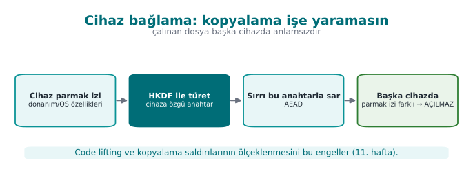

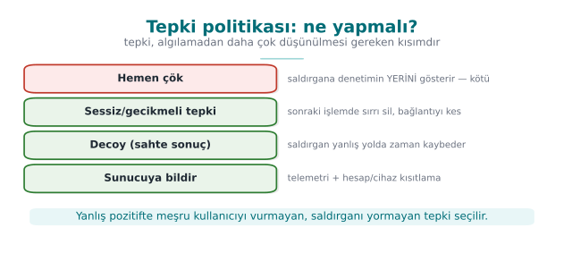

| Strategy | What it does | Catalog |
| --- | --- | --- |
| **Fail-closed** | Reject the operation when in doubt; don't fall into a trusted state | — |
| **Erase the secret** | Securely erase the valuable data the instant tampering is found (`kripto_temizle`) | K15 |
| **Decoy (fake) output** | Return a random/fake result instead of crashing; the attacker can't tell real from fake | K16 |
| **Delayed/implicit response** | Separate the response from the trigger, in time/code distance | K15 |
| **Device/version binding** | Bind the secret to the device/version; even if the keys are copied, they won't open on another device | L1/L2 |
| **Telemetry/attestation** | Report the event to the server; let a server-side risk engine decide | K5 |

**Device binding** (the innermost shell of Week 3 Demo 9) becomes part of RASP here: the valuable secret is
wrapped with a key derived, via **HKDF**, from the device fingerprint and the version string. Even if the phone is
cloned and the files copied to another device, the key comes out different and the secret **can't be opened**.

### 10.1 Worked example: deriving a key from a device fingerprint (HKDF step by step)

Let's trace Demo 8's "device/version binding" step by hand with **real values**. `kripto_hkdf_sha256` implements
the two steps (Extract, Expand) of the **RFC 5869 HKDF** we saw in Week 3; here `ikm` (input key material) is the
device fingerprint, `tuz` (salt) is the version string, and `info` is a fixed context label:

| Parameter | Value (Demo 8's `normal` scenario) |
| --- | --- |
| `ikm` (device fingerprint) | `cihaz=SIM-MODEL-A;seri=SN-0001;uretici=DEMO` |
| `tuz` (version) | `surum=1.0.0` |
| `info` (context label) | `rasp-veri-anahtari` |

**Step 1 — Extract.** This step compresses `ikm` (a device fingerprint is plain text; it may not be
cryptographically "well distributed"), whose length and randomness are uncertain, into a fixed-length, secure
intermediate key; this intermediate key's standard name is **PRK** (Pseudo-Random Key): `PRK =
HMAC-SHA256(anahtar = tuz, veri = ikm)`. Let's do the same computation with `openssl`:

```bash title="HKDF Adim 1 - Extract (gercek openssl ciktisi)"
printf '%s' 'cihaz=SIM-MODEL-A;seri=SN-0001;uretici=DEMO' \
  | openssl dgst -sha256 -mac HMAC -macopt hexkey:$(printf '%s' 'surum=1.0.0' | xxd -p -c 256) -binary \
  | xxd -p -c 256
```

```text
PRK (gercek cihaz) = a0aaf6995343abfb24d1d44d6aac18b20326fc5b9e84bdd82e89bc7ca99562ce
```

**Step 2 — Expand.** Since we need 32 bytes (a single block), one HMAC is enough: `T1 = HMAC-SHA256(anahtar = PRK,
veri = info || 0x01)` (`0x01` is RFC 5869's block counter). This `T1` directly becomes the 32-byte **data key**:

```text
anahtar (gercek cihaz) = a19f06fd7b93894705615ac8933a2fa9e0b7cd290c7247a39e09dbc5be175d10
```

**Step 3 — repeating the same computation with "another device's" fingerprint.** Let's just change the serial
number from `SN-0001` to `SN-9999` (exactly like an attacker copying the data file to another phone) and repeat
the same two steps:

```text
PRK (baska cihaz)      = b6b88f3dce3ea3099c4ff0673d356c040689ebd72be4cc98fb158bfa4c0ac039
anahtar (baska cihaz)  = b87e4dee6c5579a1456b977ce8cbf8d14f3363aa4e1c7c1a7198342c7689e220
```

**Result.** The two keys (`a19f06fd...` and `b87e4dee...`) differ **so much they share no common bytes** — a
single-character serial-number difference produces a completely different key from start to finish, because of
HKDF's HMAC core (the avalanche effect from Section 3.1). This is exactly the "cihaz/surum baglama tutmadi"
(device/version binding failed) result we saw in Demo 8's SCENARIO 3 ("another device"): because the key the
packet was encrypted with (`a19f06fd...`) and the key being used to try to decrypt it (`b87e4dee...`) are **not
the same**, `AES-GCM`'s authentication tag doesn't hold and `kripto_gcm_coz` fails — the secret is **never
exposed**, even if the files are copied to another device.

### Demo 8 — The RASP engine: detection + response + device/version binding (capstone)

!!! info "Demo 8 · `code/week-06/08-tamper-yanit` · this week's capstone (K15/K16, L1/L2)"
    Combines the earlier pieces into a single "self-protection engine": a series of checks run; the secret is
    wrapped with a device-bound key (HKDF + AES-GCM); when tampering is detected, the engine **erases** the
    secret, raises a tamper flag, and returns a **decoy** instead of crashing.

```text title="sh demo.sh — gerçek çıktı (kısaltılmış)"
SENARYO 1 - Normal: kontroller gecer, cihaz dogru -> sir acilir
SONUC: TEMIZ. Sir acildi ve islem yapiliyor -> "ODEME-ANAHTARI-7C4A"
(sir kullanildiktan sonra bellekten guvenle silindi)

SENARYO 2 - Tamper: bir kontrol basarisiz -> sil + decoy + bayrak
SONUC: TAMPER ALGILANDI -> algilama kontrolu basarisiz (tamper)
   Politika: sir silindi, tamper bayragi kaldirildi, olay kaydedildi.
   Cokmek yerine SAHTE (decoy) sonuc dondu: 60797327...

SENARYO 3 - Baska cihaz: kontroller gecer ama cihaz anahtari tutmaz
SONUC: TAMPER ALGILANDI -> cihaz/surum baglama tutmadi (klonlama?)
   ... decoy doner
```

In the normal flow, the checks passed, the device was correct, the secret was opened, used, and erased right
away. When a check failed (tamper), the engine erased the secret and returned a decoy. When the package was moved
to **another device**, even though the checks passed, the device-bound key didn't hold and the secret couldn't be
opened. This is the innermost layer of Week 3's **security shell** (device binding), merged with RASP.

### 10.2 Worked example: three different responses to the same event, three different outcomes

In Section 1.3 we briefly compared three different responses to the same detection signal; now let's compare it
**outcome by outcome** using Demo 8's tamper scenario. Event: an anti-debug check failed (Demo 8 SCENARIO 2).

| Response | What the attacker sees | What happens to the secret | Effect on a legitimate user | Assessment |
| --- | --- | --- | --- | --- |
| **(a) Crash immediately** (`exit(1)` / segfault) | "The program crashed" — they find which check fired within a few rounds by disabling each check one by one and retrying | Readable if it's still in memory | Unnoticeable if rare; frequent triggers give an impression of an unreliable app | Gives the attacker the most information, the worst option |
| **(b) Delayed and silent** (end the session silently, a few seconds/operations later) | "Something went wrong but it's unclear when/where" — there's distance in time and code between the trigger and the outcome | Erased (fail-closed) | A rarely seen "session timed out" message | Slows the attacker down; a reasonable middle ground |
| **(c) Decoy (fake result)** — what Demo 8 does | "The operation looks successful" — but the produced `decoy` result has no relation at all to the real secret; the attacker may waste time thinking they succeeded | Erased, random data returned instead | No noticeable effect (the secret was already opening correctly for the legitimate user on the correct device) | Gives the attacker the least information, the most deterrent option |

All three rest on the **same detection code** (Section 1.3); they differ only in **when and what** they return. In
Demo 8's actual output, option (c) is applied: "Cokmek yerine SAHTE (decoy) sonuc dondu: 60797327...". This number
is **different** every run (Exercise 7); if it were a fixed "ERROR-0x1234" value, the attacker would recognize
this constant and could tell it apart from the real result — the decoy being random prevents that distinction
too.

!!! warning "Common mistake: never changing the response in the test environment"
    During development, option (a) (crash immediately, print the error to the console) is generally used to get
    fast feedback — that's natural, it makes debugging easier. A common mistake is **carrying this behaviour
    straight into production**. Rule: tie the response policy to the build **configuration** (verbose error
    messages in a debug build, silent/decoy in a production build); no detection message should ever be written to
    **stdout/stderr** in the production binary — don't hand the attacker a free debug log.

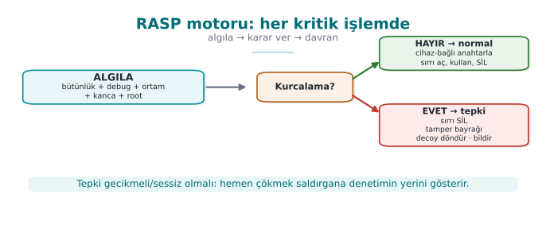

!!! success "Rule"
    **Separate** the response from the trigger: exiting immediately points the way for the attacker. On tampering,
    **erase** the valuable data, return a **decoy** instead of crashing, report the event to **the server**, and
    **bind** the secret to the device/version. Set up detection + response + binding together.

!!! note "How it's done in the field / an evaluator's test"
    In the example architecture, the payment key is only unwrapped at the moment of payment, from a device-bound
    key; when tampering is detected, the key is destroyed and the transaction is reported to the server as
    "suspicious." An evaluator tries to bypass a single check to reach the **real** result; they report that the
    protections must be broken **in combination** (not one by one, but as a chain) — that's the proof that defense
    in depth is working.

---

## 11. RASP's limits and ethics

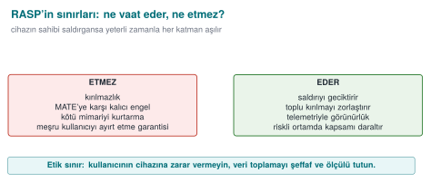

!!! failure "'I added RASP, my application is unbreakable.'"
    If the device's owner is the attacker (MATE), given enough time, **every** client-side protection can be
    bypassed. RASP doesn't provide unbreakability; it makes the attack **expensive, unscalable, and noisy**. The
    ultimate assurance is always **server-side** (risk engine, anomaly detection, key rotation, transaction
    limits).

!!! failure "'One strong control is enough.'"
    Every single control has a counter-technique (patching, hooking, faking). Strength comes from
    **combination**: many independent signals + a control-flow counter + device binding + server-side
    attestation.

!!! failure "'I should crash immediately on detection.'"
    Crashing immediately tells the attacker which check fired. **Delay and obscure** the response: return a
    decoy, report the event silently, erase the secret.

!!! failure "'If the environment is a VM, it's definitely an attack.'"
    Because of WSL2/Hyper-V/VBS, most legitimate machines report a hypervisor (Demo 3). Environmental signals are
    **contributions to a risk score**, not a binary decision; otherwise you block real users.

!!! failure "'RASP is worth any amount of slowdown.'"
    RASP has a **cost** (CPU, battery, complexity, false positives). Scale the protection to **the value of the
    asset**: put it on critical operations (payment, key use), not on every function. This is Week 1's "plan
    protection around the asset" principle.

!!! failure "'I'll tune the risk-score threshold once and forget about it.'"
    Devices, OS versions, and attack tools change over time; a score considered "certainly an attacker" today may,
    six months from now, mistakenly catch a legitimate configuration that has since become common (a new
    virtualization feature, a developer tool that has become widespread). Review the threshold and the weights
    regularly, using **telemetry** (the server reporting in Section 10.2) (Section 5.1).

---

## 12. Term project: this week

This week you will write the **RASP (self-protection)** sections of your security guide and add your first RASP
check to your project. This is the direct subject of the **midterm project demo** (Week 7) and **Quiz-1** (Week 8,
weeks 1–6); it is graded as **A2.4 RASP Techniques (15p → LO.3)** in the midterm rubric and **F2.4 Binary
Application Protections (15p → LO.3)** in the final rubric.

- [ ] **S10 — RASP detection inventory:** for every critical operation in your project, list in a table which RASP
      checks you applied (integrity, anti-debug, environment, hook, root, signature), what each one detects, and
      **how it could be bypassed**.
- [ ] **S10 — Response policy:** write down what happens when tampering is detected: which secret is erased,
      whether it's fail-closed, whether it's a decoy, whether there is device/version binding, whether there is a
      server notification.

```markdown title="S10 RASP envanteri sablonu"
| Kontrol            | Neyi algilar        | Nasil atlatilir      | Guclendirme        |
| ------------------ | -------------------- | --------------------- | -------------------- |
| Butunluk (HMAC)    | Ikili yama          | Checker yamalanir    | Ortusen denetleyici|
| Anti-debug         | Hata ayiklayici     | ptrace no-op / yama  | Coklu sinyal+sayac |
| Kanca algilama     | LD_PRELOAD/Frida    | maps gizleme         | dladdr + maps      |
| Cihaz baglama      | Klonlama            | (cihaza bagli)       | HKDF + AES-GCM     |
```

```markdown title="S10 tepki politikasi sablonu"
| Tetikleyici        | Tepki                          | Bildirim         |
| ------------------ | ------------------------------ | ---------------- |
| butunluk basarisiz | sirri sil + decoy + fail-close | sunucuya olay    |
| cihaz tutmaz       | ac-ma, decoy                   | sunucuya olay    |
```

!!! tip "Course requirement families"
    These sections satisfy the following requirement families: `CEN429-RA` (RASP detection), `CEN429-RT` (response
    policy), `CEN429-BD` (device/version binding), `CEN429-CF` (control-flow integrity). For every requirement, add
    a row to the S17 compliance matrix: requirement → state → document section → evidence (test/code/demo).

---

## 13. Class activities

!!! example "Activity 1 — Build the hook with your own hands (15 min, pairs, WSL)"
    Run Demo 4 on WSL. Then add `getenv` to `sahtekanca.c` too (have it return empty, to hide `LD_PRELOAD`).
    Rebuild and run it: does signal 1 (getenv) still catch it now? Does signal 2 (`dladdr`) still catch it? Why is
    this more robust?

!!! example "Activity 2 — Patch the single `if` (10 min, discussion)"
    In Demo 5, the `atlat` (skip) mode couldn't produce the real result. Now think: if the critical operation were
    just `if (kontroller_gecti) onayla;` (if checks passed, approve), what would the attacker do with a single
    `jmp`? Why does the key chain make this patch useless?

!!! example "Activity 3 — Hunt for false positives (15 min, groups of 3–4)"
    Run Demo 3; it will most likely say "hypervisor PRESENT." If an application refused to run just because of
    this, which legitimate users would suffer? Discuss the same question for root detection (Demo 7). Why should
    RASP decisions be a **risk score**, not a binary run/don't-run?

!!! example "Activity 4 — Design a response policy (10 min, individual)"
    A mobile banking application detected root. Design three different responses: (a) crash immediately, (b)
    reject the operation and inform the user, (c) keep running silently but report to the server and lower the
    transaction limit. Which gives the attacker the **least** information? Which does the **least** harm to a
    legitimate user?

---

## 14. Code-reading exercises

!!! question "Reading 1 — Is this anti-debug safe?"
    ```c
    if (IsDebuggerPresent()) {
        exit(1);
    }
    do_payment();
    ```
    ??? success "Answer"
        **No.** (1) It relies on a single signal; (2) the result is a direct `exit()` — the attacker patches
        `IsDebuggerPresent`'s return value or this `if`; (3) exiting immediately tells them which check fired.
        Fix: multiple signals + a control-flow counter + a delayed/implicit response (Demo 2, 5, 8).

!!! question "Reading 2 — Why is this integrity check weak?"
    ```c
    uint32_t crc = crc32(kod, kod_boy);
    if (crc != BEKLENEN_CRC) tamper();
    ```
    ??? success "Answer"
        **CRC32 is not cryptographic**: an attacker can patch the code and easily tune it so the CRC still
        matches. There's also a single checker (which can itself be patched) and the result isn't tied to a
        behaviour. Fix: HMAC/signature + overlapping checkers + a data dependency (Demo 1).

!!! question "Reading 3 — What does this hook detection fall for?"
    ```c
    if (getenv("LD_PRELOAD") == NULL) printf("temiz\n");
    ```
    ??? success "Answer"
        `getenv` itself can be hooked to return `NULL`; or the attacker can use a `ptrace`/PLT hook instead of
        `LD_PRELOAD`. Fix: verify the function's **source** (`dlsym`+`dladdr`), scan `/proc/self/maps`, use
        multiple signals (Demo 4).

!!! question "Reading 4 — Why is this environment-detection decision risky?"
    ```c
    unsigned int ecx;
    __cpuid_ecx(1, &ecx);
    if (ecx & (1u << 31)) {
        /* hipervizor biti set */
        exit(1);           /* "analiz ortami, calismayi reddet" */
    }
    ```
    ??? success "Answer"
        The hypervisor bit alone is **not proof** (Section 5, Demo 3): because of WSL2, Hyper-V, and
        virtualization-based security (VBS), many **legitimate** Windows machines also set this bit. This code
        could block millions of real users just because it saw a hypervisor — a classic false positive. Fix: add
        this signal to a **risk score** as in Section 5.1 instead of deciding on it alone, and make the decision
        together with other signals (vendor signature, timing, debugger), against a **threshold**.

---

## 15. On your own

These exercises aren't graded; they're for reinforcement. All of them are done on your own computer, on the
`code/week-06` demos.

??? question "Exercise 1 — Easy: patch a different byte"
    In Demo 1, change a **different** offset byte in the copy. Does the HMAC still change? Why (the avalanche
    effect)?

??? question "Exercise 2 — Easy: tamper with the golden value"
    In Demo 1, edit the `cikti/altin.hmac` file like an attacker would. What can the check no longer catch? Why
    does this make the question "where should the golden value be stored?" important?

??? question "Exercise 3 — Medium: Demo 2 under gdb"
    Run Demo 2 with `strace -f ./bin/linux/antidebug`. What happens to TracerPid? What is the parent process's
    name? Which signals fire?

??? question "Exercise 4 — Medium: hook `getenv` too"
    Add `getenv` to Demo 4's `sahtekanca.c`. Which signal goes blind, which one still catches it? (The code version
    of Activity 1.)

??? question "Exercise 5 — Medium: a fifth check in the chain"
    In Demo 5, make `ASAMA` (stage) 5 and add two more checkpoints. How does the chain change? Does the normal flow
    still get approved?

??? question "Exercise 6 — Medium: mutual verification"
    Extend Demo 6: have the module file also carry the native side's (your own binary's) HMAC; have the native
    side verify the module and the module verify the native side (K6). Why did this make the attacker's job
    harder?

??? question "Exercise 7 — Hard: measure the decoy"
    In Demo 8, run the tamper scenario twice and compare the returned decoy. Same or different? Why is it better
    for the decoy to be **random** (different every time) than a fixed "error value"?

??? question "Exercise 8 — Hard: test device binding"
    In Demo 8's `baska-cihaz` (another-device) mode, is there any way to open the secret? Is it possible to derive
    the key without changing the device fingerprint? Why does this make a stolen data file useless on another
    phone?

??? question "Exercise 9 — Hard: the timing threshold"
    Run Demo 3's timing measurement under `gdb` (single-stepped), like in Demo 2. How does the duration change? Why
    is it hard to set a reliable threshold (dependence on the machine/load)?

??? question "Exercise 10 — Medium: scale RASP to the asset"
    In your project, which operations deserve RASP (payment, key use) and which don't need it (reading a locale
    setting)? Why is putting RASP on every function a bad idea?

??? question "Exercise 11 — Medium: build your own risk score (Section 5.1)"
    Combine the signals produced by Demo 3, Demo 2, and Demo 7 (hypervisor bit, TracerPid, root indicator) into a
    weighted sum like in Section 5.1. What score does your own (clean) computer produce? What does it come out to
    if you run it under `gdb`? What threshold would you recommend for a banking application, and why?

??? question "Exercise 12 — Hard: recompute HKDF by hand (Section 10.1)"
    Run Section 10.1's `openssl` commands on your own machine; do you get the same `PRK` and key values? Now change
    the `SURUM` (version) string (`surum=1.0.0` to `surum=1.0.1`) and recompute the key. How does this explain why
    a version upgrade "locks" secrets in old data?

---

## 16. Self-check

??? question "1. What is RASP? How does it differ from a WAF?"
    A protection embedded inside the application that watches itself at runtime. A WAF filters requests coming
    **in front of** the application; RASP watches its own integrity, memory, and environment **inside** the
    application.

??? question "2. Explain the detect → defend → deter triad."
    Detection: understanding that something is wrong (patch, debugger, hook, root). Defense: a meaningful response
    (fail-closed, erase, bind to the device). Deterrence: making the attack expensive (decoy, delay, telemetry).

??? question "3. What is the MATE attacker model?"
    "Man-At-The-End": the attacker owns the endpoint the application runs on; they can read memory, modify code,
    attach a debugger. The same assumption as white box (Week 11).

??? question "4. What is self-hashing? Why HMAC instead of CRC?"
    The application computing a digest of its own code/file at runtime and comparing it against a golden value.
    CRC isn't cryptographic (an attacker can match it); HMAC needs the secret key.

??? question "5. Why isn't integrity checking enough on its own?"
    The checker itself can also be patched. Solution: overlapping checkers, making the result a data dependency,
    server attestation.

??? question "6. How is a debugger detected on Linux and on Windows?"
    Linux: `/proc/self/status` TracerPid (>0). Windows: IsDebuggerPresent (PEB BeingDebugged),
    CheckRemoteDebuggerPresent, PEB NtGlobalFlag.

??? question "7. Why is the hypervisor bit a weak signal?"
    Because of WSL2/Hyper-V/VBS, most legitimate machines report a hypervisor; on its own it doesn't mean "analysis
    environment." The false-positive risk is high.

??? question "8. How is an LD_PRELOAD hook detected?"
    By verifying the critical function's **source**: use `dlsym(RTLD_DEFAULT)`+`dladdr` to see which `.so` provides
    the function; if it's a module other than libc/vDSO/ld, there's a hook. `getenv(LD_PRELOAD)` alone is weak.

??? question "9. Why are root/jailbreak indicators 'a signal, not proof'?"
    They're easily faked (Magisk Hide); they can also block legitimate rooted users. The modern way: platform
    attestation (server-side, nonced).

??? question "10. What does APK signature verification prevent? What's the C equivalent?"
    Repackaging: a modified app can't carry the original signature. The C equivalent: verifying a component with
    HMAC/signature before loading it (Demo 6).

??? question "11. What does the control-flow counter solve?"
    A single `if` check being patched and skipped. The critical operation only produces the correct result if all
    checks are passed in order (the correct key chain).

??? question "12. Why isn't a good tamper response an immediate `exit()`?"
    Crashing immediately tells the attacker which check fired. A good response: erase + decoy +
    delayed/implicit + server notification.

??? question "13. Why is a decoy (fake) output better than crashing?"
    The attacker can't easily tell real from fake; it hides which check fired; no data leaks.

??? question "14. What does device binding add to RASP?"
    Keys/files can't be opened on another device even if copied (against cloning). Built with
    HKDF(device fingerprint)+AES-GCM; the innermost layer of Week 3's security shell.

??? question "15. Is RASP unbreakable? Then why use it?"
    If the device's owner is the attacker, it can ultimately be broken. The goal isn't unbreakability; it's making
    the attack expensive, unscalable, and noisy, combined with server-side checks.

??? question "16. Why is putting RASP on every function a bad idea?"
    It costs (CPU, battery, false positives, complexity). Scale the protection to the asset's value: put it on
    critical operations (payment, key).

??? question "17. What is the risk-score approach in environment detection, and why is it better than a binary decision?"
    Every signal gets a weight, the weights are summed, and compared against a threshold (Section 5.1). A binary
    decision (run/don't-run on one signal) blocks legitimate users on a single weak signal (e.g., the hypervisor
    bit); a risk score requires several independent signals to appear together.

??? question "18. Where is the TracerPid field read from, and what does it represent?"
    It's a line in `/proc/self/status` on Linux; it holds the PID of the process watching this process via
    `ptrace()`. `0` means no watcher; `>0` means that PID is watching the process (Section 4.1).

??? question "19. How are `dlsym` and `dladdr` used together in RASP?"
    `dlsym(RTLD_DEFAULT, ad)` finds a symbol's **address** in the running process; `dladdr` tells which `.so` file
    provided that address. If a foreign `.so` shows up instead of the expected library (libc/vDSO/ld), there's a
    hook (Section 6.1).

??? question "20. How are HKDF's Extract and Expand steps used in device binding?"
    Extract: `PRK = HMAC(anahtar=sürüm/tuz, veri=cihaz parmak izi)`. Expand: `anahtar = HMAC(PRK, info || sayaç)`.
    A different device fingerprint produces a completely different `PRK` and therefore a different key; the secret
    can't be opened on another device (Section 10.1).

??? question "21. What is the core difference between three responses (crash immediately, delayed silent, decoy) to the same tamper event?"
    The amount and timing of the information given to the attacker: crashing immediately gives the most
    information (it shows which check fired), a delayed silent response blurs this in time/distance, and a decoy
    gives the least information by returning a result that looks "successful" but is useless (Section 10.2).

??? question "22. Why are the shadow copy and digest fields in the `KorunanSayac` structure kept separate?"
    If the attacker changes only the `deger` (value) field in memory, the `golge` (masked copy) and `ozet` (short
    MAC) stay inconsistent with the old values; the read function catches this inconsistency (Section 7.1).

??? question "23. What is the relationship between the control-flow counter's `acc` chain and the avalanche effect?"
    At each stage, `acc` is updated with an HMAC that uses the previous `acc` as the key. If a stage is skipped or
    its order changes, the avalanche effect of HMAC makes the result a **completely different** `acc`/key; no
    matter which combination a single `jmp` patch tries, it can't reach the real result (Section 9.1).

??? question "24. How does a product's risk appetite determine the response threshold?"
    If the cost of a false positive is high (banking — the transaction can't complete, risk of money loss), the
    threshold is kept low: reject when in doubt. If the cost of a false negative is low (a loyalty app), the
    threshold is kept high: rarely reject (Section 5.1).

??? question "25. What's the downside of turning a root indicator into a single `if` "reject"?"
    It doesn't catch the real attacker (who has already hidden the clues) but it does punish an ordinary user who
    has legitimately rooted their device. Rule: add the indicator to a risk score, leave the decision to the
    threshold (Section 8.1.1).

??? question "26. Why does it matter that detection messages are never written to `stdout`/`stderr` in the production binary?"
    If they are, the attacker gets a free debug log/clue — it directly shows which check fired and when. The
    response policy should be tied to the build configuration and stay silent in production (Section 10.2).

---

## 17. Quiz-1-style sample questions

!!! note "Quiz-1 (Week 8) covers weeks 1–6; it includes short questions and code reading of this kind"
    1. (Multiple choice) Which of the following detects a **patch** at runtime?
       a) ECB · b) **Self-hashing with HMAC** · c) PBKDF2 · d) TOFU
    2. (True/False) "If the hypervisor bit is set, the device is definitely an analysis environment." → **False**
       (WSL2/VBS set it on legitimate machines too).
    3. (Short answer) Why is `if (IsDebuggerPresent()) exit(1);` weak? → A single signal + a direct `exit()`; it
       gets patched and gives away the trigger.
    4. (Code reading) If a critical operation is protected only by `if (checks_ok)`, how does the attacker bypass
       it, and why does a **control-flow counter** prevent this? → A single `jmp` patch; the counter/key chain
       turns the result into a data dependency.
    5. (Matching) TracerPid ↔ anti-debug · dladdr ↔ hook detection · HKDF(device) ↔ device binding · decoy ↔
       tamper response · APK signature ↔ repackaging.
    6. (Short answer) If an environment check says "hypervisor PRESENT," should the application reject the
       operation directly or not? Why? → It shouldn't; this alone is a weak signal (WSL2/VBS), it should be used
       as a contribution to a **risk score** (Section 5.1).
    7. (True/False) "HMAC-based integrity checking alone protects against the checker itself being patched." →
       **False**; that's why overlapping checkers and making the result a data dependency are needed (Section 3).
    8. (Short answer) Why is the `SURUM` (version) string given to HKDF as the `tuz` (salt) in device binding? → So
       that the derived key changes when the version changes; this automatically "locks" data produced under an
       old version's vulnerability once the new version ships (Section 10.1, Exercise 12).

---

## 18. Resources and further reading

**Textbook** — J. Viega, M. Messier, *Secure Programming Cookbook for C and C++*, O'Reilly, 2003:

- Recipe 12.2 (Detecting Modification — updated from CRC to HMAC/signature)
- Recipes 12.12–12.15 (Detecting Debuggers — Unix/Windows; SoftICE → modern tools)
- Chapter 12 (Anti-Tampering) overall is the core of this week and of Week 9.

**Open standards and resources**

- OWASP MASVS-RESILIENCE and MASTG (mobile resilience: anti-debug, anti-tamper, root/emulator detection, signature
  verification).
- Android APK Signature Scheme v2/v3 (signature against repackaging); Play Integrity / hardware-backed
  attestation.
- MITRE CWE: CWE-693 (Protection Mechanism Failure), CWE-919 (mobile weaknesses), CWE-925 (improper verification).
- SEI CERT C: ENV and FIO rules (safe use of the environment and files).

??? abstract "Glossary"
    | Term | Turkish | Short definition |
    | --- | --- | --- |
    | RASP | Çalışma zamanı öz koruması | Mechanisms embedded inside an application that protect it while it runs |
    | Detection / Defense / Deterrence | Algılama / Savunma / Caydırma | RASP's three functions |
    | MATE | Uçtaki saldırgan | The attacker who owns the device (white box) |
    | Self-hashing | Öz özetleme | The application digesting and verifying its own code/file at runtime |
    | Tamper | Kurcalama | Unauthorized modification of a binary/data |
    | Patch (yama) | Yama | Changing behaviour by modifying binary code |
    | Anti-debug | Hata ayıklayıcı karşıtı | Detecting/blocking an attached debugger |
    | TracerPid | İzleyen süreç kimliği | On Linux, the PID of the process watching a process via `ptrace` |
    | Hooking (kanca) | Kancalama | Replacing a function with your own version (LD_PRELOAD, PLT/GOT, inline) |
    | DBI / Frida | Dinamik ikili enstrümantasyon | Injecting code into a running program to change its behaviour |
    | Emulator / VM detection | Emülatör/VM algılama | Sensing an analysis environment from clues (CPUID, timing) |
    | Root / jailbreak | Kök erişimi | The device's security restrictions having been removed |
    | Attestation | Doğrulama tanıklığı | Proof (often server-side) of a device's/application's integrity |
    | Repackaging | Yeniden paketleme | Opening, modifying, and repackaging an application |
    | Control-flow integrity | Kontrol akışı bütünlüğü | Ensuring a critical flow is unskippable/in order (a counter/key chain) |
    | Tamper response | Kurcalama tepkisi | The policy at the moment of tampering (erase, fail-closed, decoy) |
    | Decoy | Sahte çıktı | A genuinely indistinguishable fake result returned instead of crashing |
    | Device / version binding | Cihaz / sürüm bağlama | Binding a key to a specific device/version so it can't be opened elsewhere |
    | Fail-closed | Kapalı kalma | Rejecting an operation when in doubt (not falling into a trusted state) |
    | Risk score / threshold | Risk puanı / sınır değer | A weighted sum of several weak signals; the decision looks at whether this sum crosses a threshold |
    | Risk appetite | Risk toleransı | The balance a product accepts between false positives and false negatives |
    | `dlsym` / `dladdr` | Sembol çözme / adres bilgisi | Finding a function name's memory address / finding which `.so` an address comes from |
    | vDSO | Sanal dinamik paylaşımlı nesne | The virtual `.so` the kernel automatically adds to process memory, providing fast reads without a system call |
    | PRK | Sözde rastgele anahtar | The intermediate key that comes out of HKDF's Extract step and feeds into the Expand step |
    | HKDF Extract / Expand | Sıkıştırma / genişletme | HKDF's two steps: compressing an irregular input into a PRK, deriving a key of the requested length from the PRK |
    | Avalanche effect (çığ etkisi) | Çığ etkisi | A single bit change in the input changing, on average, half the output; a fundamental property of cryptographic digests/MACs |
    | `PR_SET_DUMPABLE` | Dökülebilirlik bayrağı | On Linux, the flag controlling whether a process can be watched by another process via `ptrace` and whether it produces a core dump |
