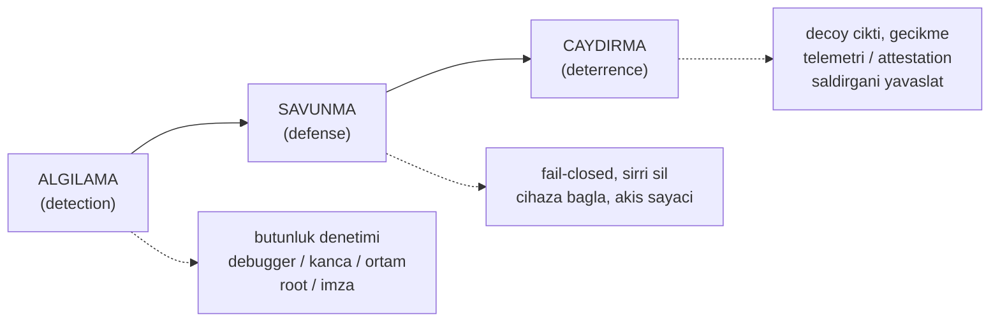
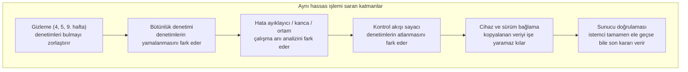
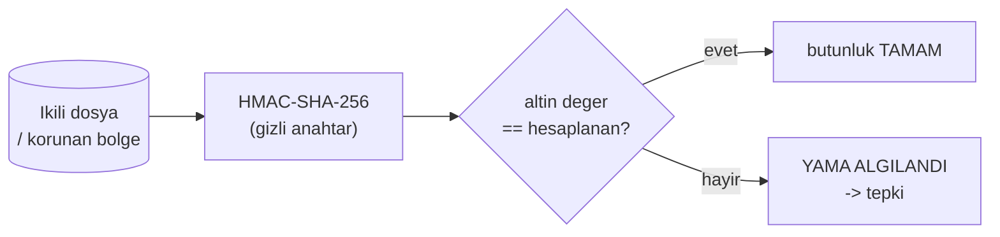
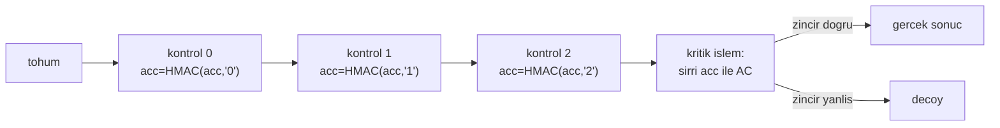
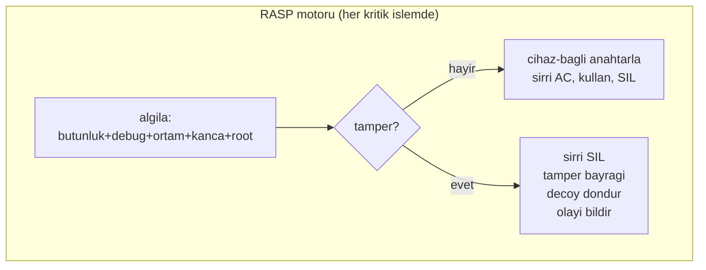

# Hafta 6 — Çalışma Zamanı Uygulama Öz Koruması (RASP)

| | |
| --- | --- |
| **Tarih** | 23.10.2026 |
| **Öğrenme çıktıları** | ÖÇ.3 (kod sağlamlaştırma tekniklerini — RASP dâhil — açıklar ve C/C++, Java için uygular) |
| **Süre** | 3 saat (3 × 50 dakika) |
| **Ön bilgi** | C'de işaretçi, dizi, dosya; Hafta 1'den bellek düzeni ve güvenli silme; Hafta 3'ten AES-GCM/HMAC/HKDF ve güvenlik kabuğu; Hafta 4'ten yama ve tersine mühendislik kavramları |
| **Uygulamalar** | [`code/week-06`](https://github.com/ucoruh/cen429-secure-programming/tree/main/code/week-06) — 8 demo; Windows'ta `.\demo.ps1`, WSL/Linux'ta `sh demo.sh` |

<!-- materyal:basla -->

<div class="materyal" markdown>

[:material-file-pdf-box: Ders notu (PDF)](cen429-week-6-ders-notu.pdf){ .md-button download="cen429-week-6-ders-notu.pdf" }
[:material-file-word-box: Ders notu (DOCX)](cen429-week-6-ders-notu.docx){ .md-button download="cen429-week-6-ders-notu.docx" }
[:material-presentation: Sunum (PDF)](cen429-week-6-sunum.pdf){ .md-button download="cen429-week-6-sunum.pdf" }
[:material-microsoft-powerpoint: Sunum (PPTX)](cen429-week-6-sunum.pptx){ .md-button download="cen429-week-6-sunum.pptx" }
[:material-language-html5: Sunum (HTML, çevrimdışı)](cen429-week-6-sunum.html){ .md-button download="cen429-week-6-sunum.html" }
[:material-folder-zip: Tümünü indir (ZIP)](cen429-week-6-materyal.zip){ .md-button download="cen429-week-6-materyal.zip" }
[:material-fullscreen: Sunumu tam ekran aç](cen429-week-6-sunum.html){ .md-button .md-button--primary target=_blank }

</div>

<div class="sunum-cercevesi">
<iframe src="../cen429-week-6-sunum.html" title="Hafta 6 — Çalışma Zamanı Uygulama Öz Koruması (RASP)" loading="lazy" allowfullscreen></iframe>
</div>

<p class="sunum-ipucu">Sunumun içine tıklayıp ok tuşlarıyla ilerleyin; tam ekran için sunumun sağ altındaki düğmeyi ya da yukarıdaki "Sunumu tam ekran aç" bağlantısını kullanın.</p>

<!-- materyal:bitis -->

!!! abstract "Bu haftanın sonunda şunları yapabileceksiniz"
    1. **RASP** (Runtime Application Self-Protection) kavramını tanımlamak; **algılama → savunma → caydırma** üçlüsünü ve
       RASP'in klasik dış korumalardan (WAF, ağ güvenlik duvarı) farkını açıklamak.
    2. **Güvenilmez cihaz (MATE)** saldırgan modelini benimsemek: cihazın sahibi saldırgandır; root/hata ayıklayıcı/kanca
       bekleriz.
    3. Bir uygulamanın **kendi bütünlüğünü** çalışma zamanında doğrulamasını (self-hashing, HMAC) kurmak ve **yamayı
       (patch)** tespit etmek; "checker'ın kendisi de yamalanabilir" sınırını tartışmak.
    4. **Hata ayıklayıcı** (ptrace/TracerPid, IsDebuggerPresent, PEB), **ortam/emülatör** (CPUID, zamanlama) ve
       **kanca/enstrümantasyon** (LD_PRELOAD, dlsym/dladdr, Frida) algılamayı çalışan örnekte göstermek.
    5. **Kök/ayrıcalıklı ortam** göstergelerini (root, `su`, yükseltilmiş yetki) okumak ve bunların **sinyal, kanıt
       değil** olduğunu; yanlış pozitifi tartışmak.
    6. **Bileşen/paket imza ve özet doğrulamasını** — Android'deki APK imza doğrulamasının genel hâlini — kurmak ve
       **yeniden paketlemeyi (repackaging)** yakalamak.
    7. **Kontrol akışı sayacı** ile tek bir `if` kontrolünün atlanamayacağı bir yapı kurmak (skip saldırısına direnç).
    8. **Tepki (response) politikasını** (fail-closed, güvenli silme, sahte/decoy çıktı, cihaz/sürüm bağlama) tasarlamak
       ve bütün parçaları bir **RASP motorunda** birleştirmek.

??? info "Ders akışı (öğretim üyesi için zaman planı)"
    | Zaman | Bölüm | Ne yapılıyor |
    | --- | --- | --- |
    | 0:00–0:10 | 1 | RASP nedir, algılama/savunma/caydırma, MATE modeli, laboratuvar kontrolü |
    | 0:10–0:25 | 2 | RASP mimarisi: denetimler ne zaman, nerede, nasıl karar verir |
    | 0:25–0:50 | 3 | Bütünlük denetimi (self-hashing); **Demo 1** (HMAC yama tespiti) |
    | 0:50–1:00 | Ara | |
    | 1:00–1:20 | 4 | Hata ayıklayıcı algılama; **Demo 2** (ptrace/PEB) |
    | 1:20–1:35 | 5 | Ortam/emülatör algılama; **Demo 3** (CPUID + zamanlama) |
    | 1:35–1:50 | 6 | Kanca/enstrümantasyon; **Demo 4** (LD_PRELOAD, dladdr) — **sınıf etkinliği** |
    | 1:50–2:00 | Ara | |
    | 2:00–2:15 | 7 | Dinamik bellek koruması ve bellek izleme tespiti |
    | 2:15–2:30 | 8 | Kök/ortam göstergesi (**Demo 7**); bileşen imzası (**Demo 6**) |
    | 2:30–2:45 | 9 | Kontrol akışı sayacı; **Demo 5** (skip saldırısı) |
    | 2:45–2:57 | 10 | Tepki politikası + cihaz bağlama; **Demo 8** (RASP motoru) |
    | 2:57–3:00 | 11+ | Sınırlar, proje adımı (S10), kapanış |

!!! tip "Laboratuvarı önceden hazırlayın"
    Demolar hem **Windows** (Visual Studio 2022 derleyicisi, ek kurulum yok) hem **WSL/Linux** (GCC) üzerinde **aynı
    kaynaktan** derlenir. Bütünlük ve imza demoları kripto için ortak `cen429_kripto.h` başlığını kullanır (Linux'ta
    **OpenSSL**, Windows'ta **BCrypt/CNG**); ek kurulum gerekmez. **Demo 4 yalnız Linux/WSL'de** çalışır (LD_PRELOAD).

    === "Windows"
        ```powershell
        cd code
        .\build.ps1
        cd week-06\01-butunluk-hmac
        .\demo.ps1        # ya da demo.cmd dosyasına çift tıklayın
        ```

    === "WSL / Linux"
        ```bash
        cd code
        ./build.sh
        cd week-06/01-butunluk-hmac
        sh demo.sh
        ```

    === "Visual Studio 2022"
        `Dosya > Aç > Klasör > code/` deyin; üstteki yapılandırmadan **"Windows (MSVC)"** ya da **"WSL (GCC)"** seçin;
        **Derle > Tümünü Derle**. Anti-debug demosunu **F5** ile (hata ayıklayıcıda) çalıştırırsanız algılamanın
        tetiklendiğini görürsünüz.

    Kurulum ayrıntıları ve güvenlik kuralları: [`code/README.md`](https://github.com/ucoruh/cen429-secure-programming/blob/main/code/README.md).

!!! warning "Etik kural — bu derste her hafta geçerli"
    Bu hafta uygulamanın **kendini** koruma tekniklerini ve bunların **atlatılmasını** görüyoruz. Bütün demolar yalnız
    kendi klasörlerinde dosya üretir, **yönetici yetkisi istemez**, sistem ayarına dokunmaz. "Yama" adımı ikili dosyanın
    **kendi kopyası** üzerinde yapılır; hata ayıklayıcı yalnız **demonun kendi sürecine** bağlanır; `LD_PRELOAD` yalnız
    **tek bir demo komutunu** etkiler. Öğrendiğiniz teknikleri **yalnız kendi bilgisayarınızda ve verilen demolar
    üzerinde** deneyin. Başkasının uygulamasını izinsiz tersine çevirmek ya da korumasını kırmak yasadışı olabilir.

---

## 0. Temel kavramlar (sıfırdan)

Bu bölüm **hiçbir ön bilgi varsaymaz**. Haftanın geri kalanında kullanacağımız terimleri sıfırdan tanımlıyoruz. Bir terimi bilmiyorsanız önce burayı okuyun; sonraki bölümler bunların üzerine kurulur.

### Çalışma anı (runtime) nedir?

- **Çalışma anı:** programın **çalıştığı** an (derleme değil).
- RASP korumaları burada devreye girer: program kendini **çalışırken** izler.

### RASP nedir?

- **RASP (Runtime Application Self-Protection):** uygulamanın çalışırken kendini koruması.
- Kurcalama, hata ayıklama, sahte ortam gibi tehditleri **algılar** ve **tepki** verir.

### Hata ayıklayıcı (debugger)

- **Debugger:** programı adım adım çalıştırıp durduran, belleği okuyan araç (gdb, lldb).
- Saldırgan bununla akışı izler, değer değiştirir.
- RASP "bana debugger bağlı mı?" diye bakar.

### Emülatör ve sanal makine

- **Emülatör/VM:** bir cihazı **taklit eden** yazılım ortamı (Android emülatör, QEMU).
- Saldırgan analizini gerçek cihaz yerine burada yapar (daha kolay).
- RASP sahte ortamı sezmeye çalışır.

### Kanca (hook) ve enstrümantasyon

- **Kanca (hook):** bir fonksiyonun çağrısını **araya girip** değiştirme.
- **Enstrümantasyon:** çalışan programa kod enjekte edip davranışını izleme/değiştirme.
- Araç: **Frida** (çok yaygın dinamik enstrümantasyon aracı).

### LD_PRELOAD

- **LD_PRELOAD:** Linux'ta bir kütüphaneyi programdan **önce** yükletip fonksiyonları değiştirme yolu.
- Saldırgan bununla kritik fonksiyonları **kancalayabilir**.
- RASP bunu tespit etmeye çalışır.

### Bütünlük ve self-hashing

- **Bütünlük (integrity):** kodun/dosyanın **değişmemiş** olması.
- **Self-hashing:** programın **kendi kodunun** özetini hesaplayıp beklenenle karşılaştırması.
- Kurcalanmışsa özet tutmaz.

### Özet (checksum/hash)

- **Özet:** bir veriden hesaplanan sabit boyutlu **parmak izi** (SHA-256).
- Veri değişirse özet değişir.
- Bütünlük denetiminin temeli.

### Kök (root) / jailbreak

- **Kök (root):** cihaz üzerinde tam yetki (normalde kısıtlı).
- Köklü cihazda korumalar zayıflar; saldırgan her şeye erişir.
- RASP "cihaz köklü mü?" diye bakar.

### İmza doğrulama

- Uygulama paketleri **dijital imzayla** imzalanır.
- **İmza doğrulama:** çağıran/yüklenen bileşenin imzasının beklenen olup olmadığını denetleme.
- Sahte/değiştirilmiş bileşeni yakalar.

### Kontrol akışı bütünlüğü (sayaç)

- Kritik denetimler **tek bir `if`** ile yapılırsa, tek nokta yamayla atlanır.
- **Kontrol akışı sayacı:** denetimlerin doğru **sırayla** geçtiğini sayarak doğrulama.
- Tek yama yetmez hale gelir.

### Tepki politikası (response)

- **Tepki politikası:** RASP bir tehdit görünce **ne yapacak**?
- Sessizce kapan, işlevi kısıtla, sunucuya bildir, gecikmeli tepki…
- "Hemen çök" her zaman en iyisi değildir.

### Cihaz bağlama ve caydırma

- **Cihaz bağlama:** verilerin/anahtarların yalnız **belirli cihazda** anlamlı olması.
- **Caydırma (deterrence):** saldırıyı zahmetli/riskli kılıp vazgeçirme.
- RASP'in nihai amacı: maliyeti yükseltmek.

### Şimdi hazırız

Terimler:

çalışma anı · RASP · debugger · emülatör/VM · hook/Frida · LD_PRELOAD · bütünlük/self-hashing · özet · kök · imza doğrulama · kontrol akışı sayacı · tepki politikası · cihaz bağlama · caydırma

Şimdi: RASP nedir, ne yapar?

## 1. RASP nedir? Algılama → savunma → caydırma

İlk beş hafta boyunca uygulamayı **statik** olarak sağlamlaştırdık: girdiyi doğruladık (Hafta 1, 4), veriyi şifreledik
(Hafta 3), kodu gizledik (Hafta 4, 5). Ama bütün bunlar bir varsayıma dayanıyordu: **program yazıldığı gibi çalışacak.**
Bu hafta o varsayımı bırakıyoruz. Uygulama, **çalışırken** düşman bir ortamda olabilir: kullanıcı cihazın sahibidir,
root almış, hata ayıklayıcı bağlamış, kod parçalarını yamalamış, fonksiyonları kancalamış olabilir.

!!! note "Kısa tarihçe: uygulamanın kendini koruması"
    - **1980'ler** — crack / anti-crack kültürü: **anti-debug** ve kendini denetleyen kodun kökeni buraya dayanır.
    - **2000'ler** — DRM, mobil bankacılık ve ödeme uygulamaları korumayı **uygulamanın içine** taşımak zorunda kalır (cihaz artık güvenilir değildir).
    - **2012** — Gartner **RASP** (Runtime Application Self-Protection) terimini ortaya atar: koruma, uygulamanın **içinde** çalışır.
    - **2010'lar–bugün** — **OWASP MASVS-RESILIENCE** bu beklentileri denetlenebilir gereksinimlere çevirir (13. hafta).

    Kısacası RASP yeni bir fikir değil; **MATE saldırganına** verilen kurumsal cevabın adıdır.

**RASP (Runtime Application Self-Protection — Çalışma Zamanı Uygulama Öz Koruması)**, uygulamanın **kendi içine**
gömülen, **çalışma zamanında** kendini izleyen ve saldırıya tepki veren korumalardır. Uygulama kendi kendinin
muhafızıdır.

!!! note "RASP dış korumalardan nasıl farklı?"
    | Koruma | Nerede durur | Neyi görür |
    | --- | --- | --- |
    | Ağ güvenlik duvarı | Ağ kenarında | Paketler |
    | WAF (Web App Firewall) | Uygulamanın **önünde** | HTTP istekleri |
    | **RASP** | Uygulamanın **içinde** | Kendi kodu, belleği, çalıştığı ortam |
    Bir WAF "dışarıdan gelen istek zararlı mı?" diye sorar. RASP "**ben** kurcalandım mı, **beni** kim izliyor, **hangi
    cihazdayım**?" diye sorar. Bu derste RASP'i mobil/gömülü ve masaüstü C/C++ bağlamında, uygulamanın kendini koruması
    olarak ele alıyoruz.

RASP üç iş yapar; bu haftanın omurgası bu üçlüdür:



- **Algılama (detection):** Bir şeyin yanlış olduğunu anlamak — ikili yamalanmış, bir hata ayıklayıcı bağlı, ortam bir
  emülatör, uygulama root'lu cihazda, bileşen yeniden paketlenmiş.
- **Savunma (defense):** Algılamaya **anlamlı** bir yanıt vermek — sırrı sil, işlemi reddet (fail-closed), anahtarı
  cihaza bağla, kritik işlemi kontrol akışına bağla.
- **Caydırma (deterrence):** Saldırganın işini **pahalılaştırmak** — çökmek yerine sahte (decoy) sonuç döndür, tepkiyi
  geciktir, olayı sunucuya bildir. Amaç kırılmazlık değil; saldırıyı **yeterince yavaşlatmaktır** (Hafta 4'teki
  "gizleme geciktirir, engellemez" ilkesinin RASP hâli).

### 1.1 Saldırgan modeli: MATE ("Man-At-The-End")

Hafta 1'de üç saldırgan tipini görmüştük. RASP'in dünyası tümüyle **MATE**'tir: saldırgan uygulamanın **çalıştığı uç
noktanın sahibidir**. Sunucuya karşı saldırgan dışarıdadır (ve TLS, kimlik doğrulama korur); ama istemci uygulamada
saldırgan **her şeyi görür**: belleği okuyabilir, kodu değiştirebilir, hata ayıklayıcıyla adım adım izleyebilir. Bu,
Hafta 11'deki **beyaz kutu** modeliyle aynı varsayımdır.

!!! danger "RASP'in acı gerçeği"
    Cihazın sahibi saldırgansa, **hiçbir istemci tarafı koruma nihai olarak kırılmaz değildir.** Yeterli zaman ve
    beceriyle her kontrol atlatılabilir. O hâlde RASP neden var? Çünkü amaç **kırılmazlık değil**, saldırıyı **ölçeklenemez
    ve pahalı** kılmaktır: bir cihazı kırmak günler alıyorsa ve kırık her cihazda tekrar gerekiyor **ve** sunucu tarafı
    anormallikleri yakalıyorsa, saldırı ekonomik olarak çökebilir. RASP **derinlemesine savunmanın** çalışma zamanı
    katmanıdır; **tek başına değil**, kripto (Hafta 3, 10), gizleme (Hafta 4, 9), whitebox (Hafta 11) ve **sunucu tarafı
    denetimle** birlikte anlam kazanır.

### 1.2 Bu haftanın örnek mimarisi ve ana fikri

Dönem boyunca kullandığımız örnek mimariyi hatırlayın: bir **mobil ödeme uygulaması** ve onun kritik işlerini yapan bir
**güvenlik kütüphanesi** (native C/C++). Telefon **güvenilmez ortamdır**. Bu hafta o kütüphaneye, çalışırken kendini
koruyan bir **RASP katmanı** ekliyoruz. Bütün örnek değerler **sentetiktir** (uydurma); gerçek anahtar, kart numarası,
cihaz kimliği ya da ürün adı kullanılmaz.

Ana fikir tek cümlede: **tek bir kontrole güvenme.** Her algılama sinyali tek başına atlatılabilir; güç, **birden çok
bağımsız sinyalin**, bir **tepki politikasının** ve **cihaz bağlamanın** birlikte çalışmasından gelir. Bu, Hafta 3'teki
**güvenlik kabuğunun** çalışma zamanındaki karşılığıdır.

---

## 2. RASP mimarisi: denetimler ne zaman, nerede ve nasıl çalışır?

Önümüzdeki bölümlerde tek tek denetimleri (bütünlük, hata ayıklayıcı, ortam, kanca, root) göreceğiz. Ama sahada bir RASP
çözümünün gücü, tek tek denetimlerin ne kadar akıllı olduğundan çok, bu denetimlerin **nasıl bir araya getirildiğinden**
gelir. Tek bir yerde, tek bir kez çalışan, sonucu tek bir `if` ile değerlendirilen bir denetim, ne kadar iyi yazılmış
olursa olsun, bulunup atlatılması en kolay denetimdir. Bu bölüm, denetimleri yerleştirmenin tasarım ilkelerini anlatır.

### Ne zaman çalışır? Üç tetikleme anı

| An | Örnek | Neden? |
| --- | --- | --- |
| **Yükleme anı** | Kütüphane belleğe yüklendiğinde (Android'de native kütüphanenin yükleme fonksiyonu) | Ortam baştan güvenilmezse hiçbir sır açılmaz |
| **Hassas işlem öncesi** | Anahtar çözmeden, ödeme hesaplamadan, sunucuya kimlik doğrulamadan hemen önce | Saldırgan uygulama açıldıktan **sonra** hata ayıklayıcı bağlayabilir |
| **Arka planda, düzensiz aralıklarla** | Ayrı bir iş parçacığında, rastgele zamanlarda | Sabit zamanlı denetim kolayca tahmin edilir ve "arasına" girilir |

Tek bir tetikleme anı yetmez: yalnız açılışta yapılan bir hata ayıklayıcı denetimini, uygulama açıldıktan sonra bağlanan
bir hata ayıklayıcı hiç görmez.

### Nerede çalışır? Dağıtık denetim

- **Çok noktalılık:** Aynı denetim tek bir fonksiyonda değil, kodun **birçok yerinde**, her seferinde biraz farklı
  biçimde yapılır. Saldırgan bir noktayı yamaladığında diğerleri hâlâ çalışır.
- **Karşılıklı denetim:** Yönetilen katman (Java) ile native katman birbirinin bütünlüğünü denetler; biri
  değiştirilirse diğeri fark eder (5. haftadaki ayrık parmak izi ve 1. haftadaki arayüz tablosunda "karşılıklı
  bütünlük denetimi").
- **Korunan fonksiyonun içinde:** Değerli bir fonksiyon (ör. dize çözme ya da anahtar türetme), kendi giriş
  noktasında birkaç denetimi **kendisi** yapar. Sahada böyle tek bir fonksiyonun, yüklenme anında zaten yapılmış
  denetimlere ek olarak kendi başına on beşe yakın denetimle (kod bütünlüğü, hata ayıklayıcı, ortam, root, kontrol
  akışı sayacı) korunduğu görülür. Performans nedeniyle, yalnız iç kullanımdaki sürümlerinde bu denetimlerin bir kısmı
  giriş noktasına indirilir.
- **Sahte parametreler:** Hassas fonksiyonların giriş noktalarında, programcının okunabilirliği için makroyla gizlenen
  ve bir bütünlük denetimini tetikleyen ek parametreler bulunabilir (4. haftadaki "sahte parametreler").

### Nasıl karar verir? Merkezî değil, veri bağımlı

En zayıf tasarım şudur:

```c title="Zayıf: tek karar noktası"
if (hata_ayiklayici_var() || root_var() || butunluk_bozuk())
    return HATA;                     /* bu tek satırı değiştiren her şeyi atlatır */
anahtari_coz();
```

Tek bir karşılaştırmayı ters çeviren (ya da `hata_ayiklayici_var` fonksiyonunun hep "hayır" döndürmesini sağlayan)
saldırgan bütün korumayı geçer. Güçlü tasarımda denetimlerin sonucu bir `if`'e değil, **sonraki hesabın verisine**
karışır:

- Denetim sonuçları anahtar türetmeye katılır: ortam temizse doğru anahtar, değilse **farklı ama geçerli görünen**
  bir anahtar çıkar (kontrol akışı sayacı ve tepki politikasındaki decoy çıktı bu fikrin iki uygulamasıdır).
- Denetim sonuçları opak değerlerle taşınır (4. hafta): tek bir baytı değiştirerek "geçti"ye çevrilemez.
- Tepki, tetikleyiciden **zaman ve kod olarak uzak** bir yerde verilir (tepki politikası bölümü).

### Katmanlar birbirini korur



Her katman bir öncekinin zayıflığını kapatır: gizleme denetimleri saklar, bütünlük denetimi gizlenmiş denetimlerin
**değiştirilmesini** fark eder, kontrol akışı sayacı bütünlük denetiminin **atlanmasını** fark eder, cihaz bağlama
bütün bunlar aşılsa bile verinin başka bir yerde **kullanılmasını** engeller; sunucu doğrulaması ise istemci tamamen
ele geçirilse bile son sözü söyler (tepki politikasındaki telemetri ve sunucu tarafı risk motoru).

!!! note "Sahada nasıl uygulanır?"
    Kart şemalarının uygulama koruma gereksinimleri tam bu katmanları sayar: yetkisiz değişikliğe karşı koruma,
    çalışma anında öz bütünlük denetimi, desteklenmeyen cihazda çalışmama, sürüm geri almayı engelleme, statik ve
    dinamik tersine mühendisliğe ve kanca tekniklerine karşı savunma, hata ayıklama ve test ortamını algılama,
    uzlaşma durumunda arka uca ve kullanıcıya bildirim ve verinin silinmesi, işletim sistemi korumalarının açık
    olduğunun denetlenmesi. Sertifikalı bir kütüphanenin kılavuzunda native tarafta on dört, Java tarafında on dört
    ayrı RASP önlemi bu gereksinimlere tek tek eşlenir.

---

## 3. Bütünlük denetimi: uygulama kendini doğrular (self-hashing)

RASP'in ilk ve en temel adımı: **"Ben değiştirildim mi?"** Saldırgan bir lisans kontrolünü, bir `if (odendi)` dalını ya
da bir kripto çağrısını **yamalayarak** (patching) korumayı atlatmaya çalışır (Hafta 4'te gördüğümüz `je → jmp`
yaması). Savunma: uygulama, kendi ikili dosyasının (ya da korunan bir kod/veri bölgesinin) bir **özetini** çalışma
zamanında hesaplar ve önceden bilinen **altın (golden)** değerle karşılaştırır. Tek bir bayt bile değişmişse, yama
yakalanır.

!!! info "Kitap tarifi ve güncelleme"
    Ders kitabı (Viega & Messier) bunu **tarif 12.2 (Detecting Modification)**'te **CRC32** ile yapar. CRC32
    **kriptografik değildir**: saldırgan kodu yamalayıp aynı CRC'yi verecek şekilde kolayca ayarlayabilir. Biz bunu
    **HMAC-SHA-256** ile güncelliyoruz (bkz. Hafta 3): doğru HMAC'i üretmek için gizli anahtar gerekir. Yazarın CRC
    seçmesinin bir nedeni vardır: asıl saldırı zaten **checksum kodunun kendisini** yamalamaktır — bu bölümün ana
    tartışması budur.



### Demo 1 — Çalışma zamanı bütünlük denetimi ve yama tespiti

!!! info "Demo 1 · `code/week-06/01-butunluk-hmac` · self-hashing, HMAC-SHA-256 (Tarif 12.2 güncellemesi)"
    Program kendi ikili dosyasının (`oz`) HMAC-SHA-256 özetini hesaplayıp "altın" değer olarak kaydeder, sonra doğrular.
    Ardından ikili dosyanın bir **kopyası** alınıp bir baytı değiştirilir (yama simülasyonu, demonun kendi `cikti/`
    klasöründe) ve yamalı kopyanın özeti altın değerle karşılaştırılır.

Özün kodu (dosyayı okuyup HMAC hesaplar; `cen429_kripto.h`'dan `kripto_hmac_sha256`):

```c title="butunluk.c (özet)"
/* Kendi yolunu bul: Linux /proc/self/exe, Windows GetModuleFileNameA */
oz_yol(yol, sizeof(yol));
dosya_oku(yol, &veri, &boy);
kripto_hmac_sha256(RASP_ANAHTAR, 32, veri, boy, ozet);   /* HMAC over the file */

/* dogrula: sabit zamanli karsilastirma (zamanlama sizintisini onler) */
unsigned char fark = 0;
for (int i = 0; i < 32; i++) fark |= beklenen[i] ^ ozet[i];
if (fark == 0) { /* BUTUNLUK TAMAM */ } else { /* YAMA ALGILANDI */ }
```

WSL'de alınan **gerçek çıktı** (kısaltılmış):

```text title="sh demo.sh — çıktı"
ADIM 2 - Normal calisma: butunluk dogrulanir (yama yok)
Beklenen   : bae498a6a982279a833bf7e33d2db9cf...ee4d01e6
Hesaplanan : bae498a6a982279a833bf7e33d2db9cf...ee4d01e6
SONUC: BUTUNLUK TAMAM - hedef degismemis.

ADIM 3 - Saldiri: ikili dosyanin bir KOPYASI alinip 1 bayti degistiriliyor
> ofset 21268 baytini XOR 0xFF ile degistir
ADIM 4 - Yamali kopyanin HMAC'i altin degerle karsilastiriliyor
Beklenen   : bae498a6a982279a833bf7e33d2db9cf...ee4d01e6
Hesaplanan : 05fb42748cb5b57305f3ffacd61ad757...131c6705
SONUC: YAMA ALGILANDI - hedef degistirilmis! (tamper)   (cikis kodu 3)
```

Yama yokken özet altın değerle **birebir** aynı çıktı. Tek bir baytı değiştirince özet tamamen değişti (çığ etkisi) ve
yama yakalandı. Karşılaştırma **sabit zamanlı** yapılır (`memcmp` değil), çünkü Hafta 3'te gördüğümüz gibi düz `memcmp`
ilk farklı baytta durup zamanlama sızdırır.

!!! danger "Bütünlük denetimi tek başına neden yeterli değil?"
    HMAC anahtarı **ikili dosyanın içindedir**. Yeterince kararlı bir saldırgan:
    1. Denetleyici (checker) fonksiyonun **kendisini** yamalayarak "her zaman TAMAM döndür" yapabilir.
    2. Yamayı yapıp **altın değeri de** yeniden hesaplayabilir (anahtarı bulursa).

    Bu yüzden gerçek RASP bütünlük denetimini şu üçüyle güçlendirir: **(1) çoklu/örtüşen denetleyiciler** (bir ağ hâlinde,
    biri diğerini de kontrol eder), **(2) sonucu bir veri bağımlılığı yapmak** — özeti doğrudan bir anahtar/atlama tablosu
    indeksi olarak kullanmak, böylece yama davranışı bozar (bkz. Bölüm 9, Demo 5), **(3) sunucu tarafı attestation** —
    istemcinin bütünlük kanıtını sunucuya nonce ile göndermek.

!!! success "Kural"
    Kritik kod/veri bölgelerinin bütünlüğünü çalışma zamanında **kriptografik** bir özetle (HMAC/imza) doğrulayın, CRC ile
    değil. Denetimi **tek noktada ve yalnız başlangıçta** yapmayın; periyodik, çoklu ve örtüşen yapın. Sonucu mümkünse bir
    **veri bağımlılığına** bağlayın.

!!! note "Sahada nasıl uygulanır? / Değerlendirici nasıl test eder?"
    Örnek mimaride native kütüphane, hem kendi `.so`/`.dll`'inin hem de üst katmanın (ör. Java/DEX) birleşik özetini
    doğrular; **karşılıklı** (mutual) doğrulama yapar (Katalog K6, Demo 6). Değerlendirici ikili dosyayı yamalayıp
    algılamanın tetiklenip tetiklenmediğine, ardından **denetleyici kodun kendisini** yamalayarak korumayı atlatıp
    atlatamadığına bakar (tek denetleyici mi, ağ mı?).

!!! warning "Sık hatalar ve kontrol listesi"
    - [ ] Bütünlük **kriptografik** mi (CRC değil)?
    - [ ] Denetim yalnız başlangıçta değil, **periyodik** mi?
    - [ ] Tek bir denetleyici mi var, yoksa **örtüşen** denetleyiciler mi?
    - [ ] Sonuç bir davranışa (veri bağımlılığı) mı bağlı, yoksa yalnız bir `if` mi?
    - [ ] Sunucu tarafı bir **attestation** var mı (yalnız istemciye güvenmeme)?

---

## 4. Hata ayıklayıcı (debugger) algılama

Saldırganın en güçlü aracı bir **hata ayıklayıcıdır** (gdb, lldb, x64dbg, WinDbg, Visual Studio): programı durdurur, adım
adım izler, belleği ve anahtarları okur, dalları değiştirir. RASP, bir hata ayıklayıcının **bağlı olup olmadığını**
anlamaya çalışır.

| Ortam | Gösterge | Kitap |
| --- | --- | --- |
| **Linux / WSL** | `/proc/self/status` → `TracerPid` (>0 ise bir süreç bizi `ptrace` ile izliyor); ana sürecin adı gdb/strace/ltrace mı | Tarif 12.13 |
| **Windows** | `IsDebuggerPresent` (PEB `BeingDebugged`); `CheckRemoteDebuggerPresent`; PEB `NtGlobalFlag` (0x70 bitleri) | Tarif 12.14 |

!!! info "2003'ten bugüne: neler eskidi?"
    - **SoftICE (Tarif 12.15) tamamen öldü.** Yerine modern hipervizör/ring-0 hata ayıklayıcıları, x64dbg, WinDbg, gdb,
      lldb ve özellikle **Frida/DBI** (dinamik ikili enstrümantasyon) geçti (bkz. Bölüm 6).
    - `IsDebuggerPresent` (12.14) hâlâ var ama **tek başına zayıf**; yanına PEB `BeingDebugged`/`NtGlobalFlag`,
      `CheckRemoteDebuggerPresent`, timing tabanlı tespit eklenir.
    - `ptrace` tekniği (12.13) hâlâ geçerli; modern eklemeler: `/proc/self/status` **TracerPid** çapraz kontrolü.

### Demo 2 — Hata ayıklayıcı algılama (Linux ptrace/TracerPid, Windows PEB)

!!! info "Demo 2 · `code/week-06/02-hata-ayiklayici` · anti-debug, yalnız okuma"
    Program birden çok bağımsız sinyale bakar ve **hiçbir şeyi değiştirmez** (kendini `ptrace` ile de izlemez; yalnız
    `/proc` ve PEB alanlarını okur). `demo.sh` programı önce normal, sonra `gdb` altında çalıştırır.

```c title="antidebug.c (Linux özeti)"
/* /proc/self/status icinden TracerPid oku; >0 ise izleniyoruz */
long tp = tracer_pid();
if (tp > 0) supheli++;      /* bir surec bizi ptrace ile izliyor */
```

```text title="sh demo.sh — gerçek çıktı (WSL)"
ADIM 1 - Normal calisma (hata ayiklayici YOK): temiz beklenir
1) /proc/self/status TracerPid           : 0 (izleyen yok)
2) Ana surec (parent) adi                : sh
SONUC: Temiz - izleyen bir arac gorunmuyor.

ADIM 2 - gdb altinda calistir (TracerPid > 0 beklenir)
1) /proc/self/status TracerPid           : 2909 (IZLENIYOR)
SONUC: Hata ayiklayici/izleme ARACI algilandi (2 sinyal).
```

Hata ayıklayıcı yokken TracerPid **0**, gdb altında **>0** çıktı; program iki durumu ayırt etti. Windows'ta Visual
Studio ile **F5** (hata ayıklayıcıda) çalıştırırsanız `IsDebuggerPresent` **EVET** döndürür ve sonuç "algılandı" olur.

!!! quote "Tespit–karşı-tespit yarışı"
    Anti-debug klasik bir **silah yarışıdır**. Her tespit tekniğinin bir karşı-tekniği vardır: saldırgan `ptrace`'i
    `LD_PRELOAD` ile no-op yapabilir (Demo 4), `IsDebuggerPresent`'in dönüşünü yamalayabilir, PEB bayrağını
    temizleyebilir. Bu yüzden **tek bir kontrole asla güvenilmez**; sinyaller çoğaltılır ve bir tepki politikasına
    bağlanır (Demo 8).

!!! success "Kural"
    Anti-debug'ı **tek bir `if (IsDebuggerPresent()) exit();`** olarak yazmayın (saldırgan o çağrıyı yamalar). Birden çok
    bağımsız sinyal (ptrace + TracerPid + timing + parent) toplayın, sonucu doğrudan bir davranışa/anahtara bağlayın ve
    tepkiyi **geciktirin** (hemen çıkmayın; saldırganın hangi kontrolün tetiklediğini anlamasını zorlaştırın).

!!! warning "Sık hatalar ve kontrol listesi"
    - [ ] Tek bir anti-debug çağrısına mı bağlısınız, birden çok sinyale mi?
    - [ ] Tespit sonucu bir davranışa/anahtara mı bağlı, yoksa yalnız `exit()` mi?
    - [ ] `ptrace(PTRACE_TRACEME)` gibi **yan etkili** bir teknik yerine salt okuma (`TracerPid`) mı tercih edildi?
    - [ ] Tepki hemen mi, yoksa geciktirilmiş/örtük mü?

---

## 5. Ortam algılama: sanal makine ve emülatör

Saldırgan uygulamayı çoğu zaman kontrollü bir **analiz ortamında** — bir sanal makine, emülatör ya da kum havuzunda
(sandbox) — çalıştırır. RASP bunu ortam ipuçlarından sezmeye çalışır.

| Teknik | Nasıl | Not |
| --- | --- | --- |
| **CPUID hipervizör biti** | `CPUID.1:ECX[31]` — "hypervisor present" | Bare-metal'de 0 |
| **Hipervizör satıcı imzası** | `CPUID` yaprak `0x40000000` → 12 karakter (`KVMKVMKVM`, `VMwareVMware`, `Microsoft Hv`...) | Bazı hipervizörler gizler |
| **Zamanlama (timing)** | Bir işlemi ölç; tek adımlı hata ayıklama/ağır emülasyon çok yavaşlatır | Eşik makineye göre değişir |

### Demo 3 — VM/emülatör ve zamanlama algılama (CPUID)

!!! info "Demo 3 · `code/week-06/03-ortam-zamanlama` · yalnız CPU komutu ve saat okur"

```text title="sh demo.sh — gerçek çıktı (WSL2)"
(A) CPUID.1:ECX[31] hipervizor biti : VAR
    Hipervizor satici imzasi        : (satici imzasi gizli/bos)
(B) 2.000.000 islem suresi          : 0.806 ms
SONUC: Hipervizor GORULDU. Ama WSL2/Hyper-V/VBS de boyle gorunur;
bu TEK basina 'analiz ortami' demek degildir - zayif sinyal.
```

!!! danger "En önemli ders: yanlış pozitif"
    Yukarıdaki çıktı WSL2 üzerinde alındı ve **hipervizör "VAR"** dedi. Ama bu bir analiz ortamı **değil** — sıradan bir
    geliştirici makinesi! Modern Windows'ta **Hyper-V, WSL2 ve sanallaştırma tabanlı güvenlik (VBS)** yüzünden çoğu makine
    hipervizör bildirir. Yani bu bit tek başına "saldırgan analiz ediyor" anlamına **gelmez**. Bir uygulama sırf
    hipervizör gördüğü için çalışmayı reddetseydi, milyonlarca **meşru** kullanıcıyı engellerdi. RASP daima **birden çok
    göstergeyi tartar** ve her birinin **atlatılabileceğini** kabul eder.

!!! success "Kural"
    Ortam algılamayı bir **risk skoru** olarak kullanın, ikili bir "çalış/çalışma" kararı olarak değil. Birden çok
    göstergeyi birleştirin; yanlış pozitifi (meşru VM/emülatör kullanan gerçek kullanıcıları) hesaba katın; nihai kararı
    **sunucu tarafı risk motoruyla** birlikte verin.

!!! note "Sahada nasıl uygulanır?"
    Mobil dünyada karşılığı **emülatör algılamadır** (QEMU/Android emülatörü ipuçları: `ro.kernel.qemu`, sahte sensörler,
    tipik IMEI/seri değerleri). Yine aynı ilke: sinyal, kanıt değil; kombinasyon ve sunucu tarafı denetim.

---

## 6. Kanca ve enstrümantasyon algılama (LD_PRELOAD, Frida)

Hata ayıklayıcıdan daha sinsi bir tehdit: **fonksiyon kancalama (hooking)** ve **dinamik enstrümantasyon**. Saldırgan
programı durdurmadan, çağırdığı fonksiyonları (kendi anti-debug/anti-root kontrollerimiz dâhil) **kendi sürümüyle
değiştirir**. Böylece Demo 2'deki kontrolleri "her zaman temiz" döndürecek şekilde yalancıya çıkarabilir.

| Teknik | Nasıl | Platform |
| --- | --- | --- |
| **LD_PRELOAD** | Bir `.so`'yu önyükleyip standart fonksiyonları değiştirme (interposition) | Linux |
| **PLT/GOT kancası** | Çağrı tablosu girişlerini kendi fonksiyonuna yönlendirme | Linux/ELF |
| **Satır içi (inline) kanca** | Fonksiyonun ilk baytlarını `jmp` ile ezme | Her yer |
| **Frida / Xposed** | Dinamik ikili enstrümantasyon çerçeveleri | Mobil/masaüstü |

Algılama fikirleri (Katalog K7/K8/K18):

- `LD_PRELOAD` ortam değişkeni boş mu? (`getenv` — **zayıf**, çünkü `getenv`'in kendisi de kancalanabilir)
- Bir fonksiyon **hangi paylaşımlı nesneden** çözülüyor? `dlsym(RTLD_DEFAULT, ...)` + `dladdr` ile fonksiyonun geldiği
  `.so` dosyasına bakılır; beklenen libc yerine yabancı bir `.so` çıkıyorsa **kanca vardır**. (Bu, `getenv`
  sahteciliğine dayanmaz.)
- `/proc/self/maps`'te beklenmeyen yürütülebilir bölgeler, bilinen çerçeve göstergeleri.

### Demo 4 — LD_PRELOAD ile kanca ve `dladdr` ile algılama

!!! info "Demo 4 · `code/week-06/04-preload-kanca` · yalnız Linux/WSL · CWE benzeri: dinamik enstrümantasyon"
    Demo, `time()` fonksiyonunu ele geçiren küçük bir sahte kanca kütüphanesi (`libsahtekanca.so`) **derler**. `LD_PRELOAD`
    ile bu kütüphane **yalnız tek bir demo komutuna** yüklenir. Ana program, fonksiyonun geldiği `.so`'ya bakarak kancayı
    yakalar. Windows'ta `demo.ps1` bunun WSL'de nasıl çalıştırılacağını anlatır (Windows karşılığı IAT/satır-içi kanca
    tespitidir).

```c title="kanca_ana.c (özet)"
void *p = dlsym(RTLD_DEFAULT, "time");   /* onyuklu kanca varsa onu doner */
Dl_info info;
dladdr(p, &info);                        /* fonksiyonu saglayan .so */
int kanca = !mesru_mi(info.dli_fname);   /* libc/vdso/ld disi = KANCA */
```

```text title="sh demo.sh — gerçek çıktı (WSL)"
ADIM 1 - Normal calisma (LD_PRELOAD yok): temiz beklenir
   time     -> linux-vdso.so.1
   getenv   -> /lib/x86_64-linux-gnu/libc.so.6
   time(NULL) dondurdu : 1789852509
SONUC: Temiz - preload/kanca gorunmuyor.

ADIM 2 - Saldiri: sahte kanca LD_PRELOAD ile YALNIZ bu surece yukleniyor
   time     -> bin/linux/libsahtekanca.so (KANCA!)
   time(NULL) dondurdu : 1234567890
SONUC: Fonksiyon kancasi / preload ALGILANDI (2 sinyal).
```

Temiz koşuda `time`, çekirdeğin **vDSO**'sundan çözüldü (bu meşrudur, kanca değil). Kanca yüklenince aynı `time`
`libsahtekanca.so`'dan çözüldü ve **sabit sahte değer** (1234567890) döndürdü; `dladdr` fonksiyonun yerini göstererek
kancayı yakaladı. Dikkat: temiz koşuda `linux-vdso`'yu **yanlış pozitif** saymamak için algılama libc, vDSO ve dinamik
yükleyiciyi meşru kaynaklar olarak kabul eder — bu, "algılama yazmak, algılamayı doğru yazmaktan kolaydır" dersidir.

!!! success "Kural"
    Kanca algılamada `getenv(LD_PRELOAD)` gibi **manipüle edilebilir** kaynaklara güvenmeyin; kritik fonksiyonların
    **kaynağını** (hangi modülden geldiğini) doğrulayın. Birden çok fonksiyonu kontrol edin; `/proc/self/maps` gibi ek
    sinyaller ekleyin; sonucu bir tepki politikasına bağlayın.

!!! note "Değerlendirici nasıl test eder?"
    Değerlendirici bilinen bir enstrümantasyon aracıyla (ör. Frida) kritik fonksiyonları kancalar ve korumanın bunu
    yakalayıp yakalamadığına bakar; ardından **algılama fonksiyonunun kendisini** kancalayarak korumayı kör edip
    edemeyeceğini dener (tek nokta mı, dağıtık mı?).

---

## 7. Dinamik bellek koruması ve bellek izleme tespiti

İzlencenin bu haftaya koyduğu maddelerden biri **dinamik bellek korumasıdır**: program çalışırken bellekteki hassas
verinin okunmasına ve değiştirilmesine karşı alınan önlemler. 1. haftada sırları bellekten silmeyi ve takasa düşmesini
önlemeyi, 3. haftada "kullanımda veri" katmanlarını gördük. Bu bölüm aynı soruyu çalışma anı saldırganı açısından
yeniden sorar: saldırgan belleği **izliyor** ya da **değiştiriyorsa** ne yapabiliriz?

### Saldırgan bellekle ne yapar?

| Saldırı | Örnek | Hedef |
| --- | --- | --- |
| **Okuma** | Süreç belleğinin dökümünü almak, bellekte bilinen bir değeri aramak | Anahtar, PIN, çözülmüş veri |
| **Değiştirme** | Bir oyundaki puanı, bir sayaç değerini ya da bir "lisans geçerli" bayrağını bellekte değiştirmek | Mantık ve denetimler |
| **İzleme** | Bir değer değiştiğinde haber veren araçlarla hangi adresin neyi tuttuğunu bulmak | Değişkenlerin yerini keşfetmek |

Bu saldırıların hepsi için saldırganın süreç belleğine **erişmesi** gerekir: bir hata ayıklayıcıyla, işletim sisteminin
süreç belleği arayüzleriyle ya da sürecin içine yüklenmiş bir kütüphaneyle. Bu yüzden bellek koruması, önceki
bölümlerdeki hata ayıklayıcı ve kanca algılamayla birlikte düşünülür.

### Önlem 1: Bellekte az, kısa ve dağınık tut

En etkili bellek koruması, bellekte **okunacak bir şey bırakmamaktır**:

1. **Kısa ömür:** Sır, yalnız kullanıldığı fonksiyonun içinde açık olur ve fonksiyon dönmeden silinir (3. hafta:
   açıklık penceresi).
2. **Örtme ve parçalama:** Kullanılmadığı sürede sır, rastgele bir maskeyle XOR'lanmış ya da parçalara bölünmüş olarak
   durur; bellekte tek bir yerde sırrın kendisi bulunmaz.
3. **Rastgele değerle silme:** İş bitince bellek sıfırla değil rastgele değerlerle doldurulur; "burada az önce bir sır
   vardı" izini de bırakmaz. Sahada native tarafta rastgele üretecin tek kullanım yeri budur.
4. **Hiç açılmamak:** Whitebox kriptografide anahtar hiçbir anda açık halde bellekte bulunmaz (11. hafta). Sahadaki
   kabuk matrisinde ödeme sırasında native tarafta kalan tek kabuk budur (3. hafta).

### Önlem 2: Belleğin okunmasını işletim sistemiyle zorlaştır

| Önlem | Platform | Etkisi |
| --- | --- | --- |
| Döküm kapatma, `PR_SET_DUMPABLE = 0` | Linux | Aynı kullanıcıya ait başka bir süreç bile hata ayıklayıcı olarak bağlanamaz ve süreç belleği dosyasını okuyamaz (1. hafta) |
| Bellek kilitleme (`mlock` / `VirtualLock`), `MADV_DONTDUMP` | Linux / Windows | Sır takasa ve döküme düşmez (1. hafta) |
| Sayfa korumaları (`mprotect` / `VirtualProtect`) | Linux / Windows | İlklendirmeden sonra değişmemesi gereken tablolar **salt okunur** yapılır; değiştirme girişimi hata üretir |
| Korunan süreç özellikleri | Windows, mobil platformlar | İşletim sisteminin sağladığı "korunan süreç" ve uygulama kum havuzu, başka uygulamaların belleğe erişimini sınırlar |

Bu önlemler yönetici (root) yetkisine sahip bir saldırganı durdurmaz; ama saldırganı **daha güçlü** bir konuma çıkmaya
zorlar ve bu da root algılamanın devreye girdiği yerdir.

### Önlem 3: Değiştirilen veriyi fark et

Bellekteki kritik bir yapının (bir sayaç, bir yetki bayrağı, bir yapılandırma tablosu) sessizce değiştirilmesini fark
etmenin yolu, o veriyi **tek başına** bırakmamaktır:

```c title="Kritik bir değeri korumalı tutmak: değer + gölge kopya + özet"
typedef struct {
    uint32_t deger;        /* asıl değer                          */
    uint32_t golge;        /* deger XOR çalışma anı maskesi        */
    uint32_t ozet;         /* deger ve golge üzerinden kısa bir MAC */
} KorunanSayac;

/* Okurken üçünün tutarlılığı denetlenir; tutmuyorsa değer bellekte değiştirilmiştir. */
int sayac_oku(const KorunanSayac *s, uint32_t *cikti)
{
    if ((s->golge ^ calisma_maskesi) != s->deger) return -1;
    if (kisa_mac(s->deger, s->golge) != s->ozet)   return -1;
    *cikti = s->deger;
    return 0;
}
```

Saldırgan bellekte yalnız `deger` alanını değiştirirse gölge kopya ve özet tutmaz. Üçünü birden tutarlı biçimde
değiştirmek için maskeyi ve özet anahtarını da bulması gerekir; bu da işin maliyetini artırır. Aynı fikir, 5. haftadaki
cihaz parmak izinin **iki farklı özetle iki farklı yerde** saklanmasında ve 2. haftadaki kurcalamaya dayanıklı günlükte
de vardır.

!!! warning "Tutarlılık denetimi de bir denetimdir"
    `sayac_oku`'nun `-1` dönüşünü "hiçbir şey olmamış gibi" yok sayan bir çağıran, bütün korumayı boşa çıkarır; ayrıca
    denetimin kendisi de yamalanabilir. Bu yüzden tutarsızlık bir tepkiye bağlanır (tepki politikası) ve denetim kodu da
    bütünlük denetiminin kapsamına alınır.

### Önlem 4: İzlendiğini fark et

Bellek izleme araçlarının çoğu, sürece bir hata ayıklayıcı olarak bağlanarak ya da sürecin içine bir kütüphane yükleyerek
çalışır. Bu yüzden izleme tespitinin temeli, hata ayıklayıcı ve kanca algılama bölümlerinde gördüğümüz yöntemlerdir. Bunlara ek
olarak bazı dolaylı sinyaller kullanılır:

- **Zamanlama:** Tek adımlı çalıştırılan ya da kesme noktalarıyla durdurulan kod, normalden çok daha yavaş çalışır;
  iki nokta arasındaki beklenmedik uzun süre bir sinyaldir (ortam algılamadaki zamanlama ölçümüyle aynı fikir).
- **Beklenmeyen modüller:** Süreç belleğinde, uygulamanın kendisinin yüklemediği kütüphaneler bulunması.
- **Tutarlılık bozulması:** Önlem 3'teki gibi korunan değerlerin tutarsızlaşması.

Bu sinyallerin hiçbiri tek başına kesin değildir; hepsi tepki politikasındaki **risk skoruna** katkı olarak kullanılır.

!!! question "Değerlendirici nasıl test eder?"
    Hassas işlem sırasında ve sonrasında süreç belleğinin dökümünü alıp bilinen test sırlarını arar; bellekteki bir
    sayacı ya da bayrağı bir bellek düzenleyiciyle değiştirip uygulamanın fark edip etmediğine bakar; bellek izleme
    araçlarını bağlayıp uygulamanın tepkisini gözlemler. Raporda "sır bellekte ne kadar süre açık kaldı" ve "değiştirilen
    değer fark edildi mi" soruları cevaplanır.

---

## 8. Kök/ayrıcalıklı ortam ve bileşen imza doğrulaması

### 8.1 Kök (root) / ayrıcalıklı ortam göstergesi

Root'lu (ya da jailbreak'li) bir cihazda uygulamanın güvenlik varsayımları çöker: her süreç belleği okuyabilir, dosya
sistemi korumaları aşılır. RASP root göstergelerine bakar (Katalog K4/K5): `su` ikilisinin varlığı, tehlikeli paketler,
yazılabilir sistem yolları, root gizleme çerçeveleri. Masaüstündeki taşınabilir karşılığı: uygulama **yükseltilmiş
yetkiyle** mi çalışıyor (Linux `geteuid()==0`, Windows yükseltilmiş token)?

### Demo 7 — Root/ayrıcalıklı ortam göstergesi (yalnız okuma)

!!! info "Demo 7 · `code/week-06/07-ortam-yetki` · root/ayrıcalık göstergesi, salt okuma"
    Program (1) ayrıcalık seviyesini (root/admin mi) ve (2) bilinen "tehlikeli işaret" yollarının varlığını yalnız
    **okuyarak** kontrol eder. Demoyu deterministik kılmak için komut satırından sahte bir işaret (`cikti/sahte_su`)
    verilir.

```text title="sh demo.sh — gerçek çıktı (kısaltılmış)"
ADIM 2 - Isaretli durum: sahte bir 'su' isaret dosyasi olusturuluyor
1) Ayricalik seviyesi : normal kullanici
2) Tehlikeli gosterge taramasi:
   [BULUNDU] cikti/sahte_su (ek isaret)
SONUC: Ayricalikli/riskli ortam GOSTERGESI var (1 sinyal).
```

!!! warning "Sinyal, kanıt değil"
    Root göstergeleri **kolayca sahtelenir** (Magisk Hide gibi araçlar `su`'yu ve bilinen yolları gizler). Ayrıca bir
    uygulama sırf root gördüğü için çalışmayı reddederse, cihazını **meşru** biçimde root'lamış kullanıcıları da engeller
    (yanlış pozitif / kullanıcı deneyimi dengesi). Modern yaklaşım: cihazın bütünlüğünü **işletim sistemi/platform
    attestation** servisiyle (nonce'lu, sunucu tarafı doğrulanan) ölçmek — istemcinin kendi "root değilim" iddiasına
    güvenmemek.

### 8.2 Bileşen/paket imza ve özet doğrulaması (APK imza doğrulamasının genel hâli)

Android'de uygulama, **yeniden paketlemeye (repackaging)** karşı **APK imzasını** doğrular (APK Signature Scheme
v1/v2/v3): saldırgan uygulamayı açıp değiştirse ve yeniden paketlese bile, orijinal geliştiricinin özel anahtarıyla
üretilmiş imzayı taşıyamaz. Bu, "yüklediğim/çağırdığım bileşen beklenen, değiştirilmemiş sürüm mü?" sorusunun genel
hâlidir (Katalog K2/K3/K6).

### Demo 6 — Bileşen imza doğrulaması ve repackaging tespiti

!!! info "Demo 6 · `code/week-06/06-bilesen-imza` · imza/özet doğrulama"
    Bir "eklenti modülü" dosyası yüklenmeden **önce** ayrık bir imza (HMAC-SHA-256) ile doğrulanır. Modül bir bayt bile
    değişirse imza tutmaz ve yükleme reddedilir.

```text title="sh demo.sh — gerçek çıktı"
ADIM 3 - Yukleme oncesi dogrulama (modul degismedi): TUTAR
Modul imzasi TUTTU -> guvenle yuklenebilir.
ADIM 4 - Saldiri: modul YENIDEN PAKETLENIR (tek bayt eklenir)
Modul imzasi TUTMADI -> YENIDEN PAKETLENMIS/degistirilmis.
Yukleme REDDEDILDI.   (cikis kodu 3)
```

!!! info "Önemli fark: HMAC vs. asimetrik imza"
    APK v2/v3 **açık anahtar (asimetrik)** imza kullanır (bkz. Hafta 3'teki dijital imza): doğrulayanın imzalama
    anahtarına değil, yalnız **açık anahtara** ihtiyacı olur. Bu demoda öğretim için **paylaşılan anahtarlı HMAC**
    kullanıyoruz (basit ve `cen429_kripto.h`'da hazır); asimetrik imza (Ed25519 / RSA-PSS) ve sertifika zincirlerini
    **Hafta 10**'da işleyeceğiz. İlke aynı: yüklemeden önce **bütünlük + kaynak** doğrulaması.

!!! success "Kural"
    Dinamik yüklenen her bileşeni (modül, eklenti, native kütüphane, güncelleme paketi) yüklemeden **önce** kriptografik
    olarak doğrulayın. Mümkünse **karşılıklı** doğrulama kurun (Katalog K6): native, üst katmanın özetini; üst katman,
    native'in özetini doğrular — saldırganın **ikisini birden** tutarlı yamalaması gerekir. Uzun vadede **asimetrik imza**
    tercih edin (dağıtım kolaylığı).

---

## 9. Kontrol akışı bütünlüğü: tek bir `if` neden yetmez

Şu ana kadarki bütün kontroller (bütünlük, anti-debug, ortam, root) bir noktada **bir karar** verir: `if (tehlike)
reddet;`. Saldırganın işi basittir: o **tek atlamayı** (`je → jmp`) yamalayıp kontrolü es geçmek (Bölüm 3'teki yama). O
hâlde kontrolleri **atlanamaz** kılmanın yolu nedir?

Cevap: güvenlik kontrollerini bir **kontrol akışı sayacına / anahtar zincirine** bağlamak (Katalog K17). Kritik işlem,
doğru sonucu **ancak** bütün kontrol noktalarından **sırayla** geçilmişse üretebilir. Bunu bir **veri bağımlılığıyla**
kurarız: her kontrol noktası bir anahtar zincirini ilerletir (`acc = HMAC(acc, "asama-i")`); kritik işlem bu zincirden
türetilen anahtarla bir sırrı açar.



Bir kontrol atlanır ya da sırası bozulursa **acc** farklı çıkar, anahtar yanlış olur ve GCM çözme **reddedilir** — gerçek
sonuç üretilemez. Böylece tek bir `jmp` yaması işe yaramaz.

### Demo 5 — Kontrol akışı sayacı ve skip saldırısı

!!! info "Demo 5 · `code/week-06/05-akis-sayaci` · control-flow integrity (Katalog K17)"

```text title="sh demo.sh — gerçek çıktı (kısaltılmış)"
SENARYO 1 - Normal: butun kontrol noktalari sirayla calisir
   [gecildi] kontrol noktasi 0, 1, 2
SONUC: ODEME ONAYLANDI -> "ODEME-ONAYI-TOKEN-4242"

SENARYO 2 - Saldiri: kontroller tamamen ATLANIR
   [ATLANDI] hicbir kontrol noktasi calismadi
   (uyari: sayac=0 iz=0x0 beklenen=3/0x7)
SONUC: ODEME REDDEDILDI (zincir anahtari yanlis). ... decoy doner

SENARYO 4 - Saldiri: kontroller YANLIS SIRADA calisir
SONUC: ODEME REDDEDILDI (zincir anahtari yanlis). ... decoy doner
```

Normal akışta üç kontrol sırayla geçildi, zincir doğru oldu ve ödeme onaylandı. Kontroller atlandığında, kısmen
geçildiğinde ya da yanlış sırada geçildiğinde zincir farklı çıktı; kritik işlem gerçek sonucu **üretemedi** ve sahte
(decoy) döndü. Program ayrıca bir **çift sayaç** (sayac + iz biti) tutar (K17); bu, anahtar zinciriyle birlikte üçlü bir
tutarlılık kontrolü sağlar.

!!! success "Kural"
    Kritik kararları **tek bir boolean**'a bağlamayın (yamalanır). Güvenlik kontrollerini bir **kontrol akışı sayacına**
    ve mümkünse bir **veri bağımlılığına** (kritik işlemin ürettiği sonucun anahtarına) bağlayın. Çift/örtüşen sayaçlar
    kullanın; başarısız çıkış noktalarını rastgeleleştirin (K15/K16).

!!! warning "Sık hatalar ve kontrol listesi"
    - [ ] Kritik karar tek bir `if`'e mi bağlı, yoksa bir sayaca/anahtara mı?
    - [ ] Kontrolleri **atlayan** bir yol gerçek sonucu üretebiliyor mu? (Üretmemeli.)
    - [ ] Kontrol sırası önemli mi (sırayı bozan saldırı yakalanıyor mu)?
    - [ ] Başarısızlıkta **decoy** mı dönüyor, yoksa hemen çöküp saldırgana ipucu mu veriyor?

---

## 10. Tepki (response) politikası, cihaz bağlama ve caydırma

Algılama tek başına işe yaramaz; asıl önemli olan **tepkidir**. Kötü bir tepki (ör. tespit anında `exit(1)`), saldırgana
**tam olarak hangi kontrolün tetiklendiğini** söyler ve onu doğrudan o kontrolün yamasına yönlendirir. İyi bir tepki
politikası saldırganı **yavaşlatır ve yanıltır**:

| Strateji | Ne yapar | Katalog |
| --- | --- | --- |
| **Fail-closed** | Şüphede işlemi reddet, güven deposuna düşme | — |
| **Sırrı sil** | Tamper anında değerli veriyi güvenle sil (`kripto_temizle`) | K15 |
| **Decoy (sahte) çıktı** | Çökmek yerine rastgele/sahte sonuç döndür; saldırgan gerçekle sahteyi ayıramaz | K16 |
| **Gecikmeli/örtük tepki** | Tepkiyi zaman/mesafe olarak tetikleyiciden ayır | K15 |
| **Cihaz/sürüm bağlama** | Sırrı cihaza/sürüme bağla; anahtarlar kopyalansa bile başka cihazda açılmaz | L1/L2 |
| **Telemetri/attestation** | Olayı sunucuya bildir; sunucu tarafı risk motoru karar versin | K5 |

**Cihaz bağlama** (Hafta 3 Demo 9'un en iç kabuğu) burada RASP'in bir parçası olur: değerli sır, cihaz parmak izinden ve
sürüm dizesinden **HKDF** ile türetilen bir anahtarla sarılır. Telefon klonlansa, dosyalar başka cihaza kopyalansa bile
anahtar farklı çıkar ve sır **açılamaz**.

### Demo 8 — RASP motoru: algılama + tepki + cihaz/sürüm bağlama (capstone)

!!! info "Demo 8 · `code/week-06/08-tamper-yanit` · haftanın capstone'u (K15/K16, L1/L2)"
    Önceki parçaları tek bir "öz koruma motoru"nda birleştirir: bir dizi kontrol çalışır; sır cihaz-bağlı bir anahtarla
    (HKDF + AES-GCM) sarılır; tamper algılanınca motor sırrı **siler**, tamper bayrağı kaldırır ve çökmek yerine **decoy**
    döndürür.

```text title="sh demo.sh — gerçek çıktı (kısaltılmış)"
SENARYO 1 - Normal: kontroller gecer, cihaz dogru -> sir acilir
SONUC: TEMIZ. Sir acildi ve islem yapiliyor -> "ODEME-ANAHTARI-7C4A"
(sir kullanildiktan sonra bellekten guvenle silindi)

SENARYO 2 - Tamper: bir kontrol basarisiz -> sil + decoy + bayrak
SONUC: TAMPER ALGILANDI -> algilama kontrolu basarisiz (tamper)
   Politika: sir silindi, tamper bayragi kaldirildi, olay kaydedildi.
   Cokmek yerine SAHTE (decoy) sonuc dondu: 60797327...

SENARYO 3 - Baska cihaz: kontroller gecer ama cihaz anahtari tutmaz
SONUC: TAMPER ALGILANDI -> cihaz/surum baglama tutmadi (klonlama?)
   ... decoy doner
```

Normal akışta kontroller geçti, cihaz doğruydu, sır açıldı, kullanıldı ve hemen silindi. Bir kontrol başarısız olunca
(tamper) motor sırrı sildi ve decoy döndürdü. Paket **başka bir cihaza** taşındığında kontroller geçse bile cihaz-bağlı
anahtar tutmadı ve sır açılamadı. Bu, Hafta 3'teki **güvenlik kabuğunun** en iç katmanının (cihaz bağlama) RASP ile
birleşmiş hâlidir.



!!! success "Kural"
    Tepkiyi tetikleyiciden **ayırın**: hemen `exit()` yapmak saldırgana yol gösterir. Tamper anında değerli veriyi
    **silin**, çökmek yerine **decoy** döndürün, olayı **sunucuya** bildirin ve sırrı **cihaza/sürüme bağlayın**.
    Algılama + tepki + bağlama üçünü birlikte kurun.

!!! note "Sahada nasıl uygulanır? / Değerlendirici testi"
    Örnek mimaride ödeme anahtarı yalnız ödeme anında, cihaz-bağlı bir anahtardan açılır; tamper algılanınca anahtar
    imha edilir ve işlem sunucuya "şüpheli" olarak bildirilir. Değerlendirici tek bir kontrolü atlatıp **gerçek** sonuca
    ulaşmaya çalışır; korumaların **kombinasyon** hâlinde (tek tek değil, zincirleme) kırılması gerektiğini raporlar — bu,
    derinlemesine savunmanın çalıştığının kanıtıdır.

---

## 11. RASP'in sınırları ve etik

!!! failure "'RASP koydum, uygulamam kırılmaz.'"
    Cihazın sahibi saldırgansa (MATE), yeterli zamanla **her** istemci tarafı koruma atlatılabilir. RASP kırılmazlık
    sağlamaz; saldırıyı **pahalı, ölçeklenemez ve gürültülü** kılar. Nihai güvence her zaman **sunucu tarafındadır**
    (risk motoru, anomali tespiti, anahtar yenileme, işlem limitleri).

!!! failure "'Tek bir güçlü kontrol yeter.'"
    Her tek kontrolün bir karşı-tekniği vardır (yama, kanca, sahteleme). Güç **kombinasyondan** gelir: çok sayıda bağımsız
    sinyal + kontrol akışı sayacı + cihaz bağlama + sunucu attestation.

!!! failure "'Tespit edince hemen çökmeliyim.'"
    Hemen çökmek saldırgana hangi kontrolün tetiklediğini söyler. Tepkiyi **geciktirin ve örtün**: decoy döndürün, olayı
    sessizce bildirin, sırrı silin.

!!! failure "'Ortam VM ise kesinlikle saldırıdır.'"
    WSL2/Hyper-V/VBS yüzünden çoğu meşru makine hipervizör bildirir (Demo 3). Ortam sinyalleri **risk skoruna** katkıdır,
    ikili karar değil; yoksa gerçek kullanıcıları engellersiniz.

!!! failure "'RASP her yavaşlığa değer.'"
    RASP bir **maliyet** getirir (CPU, batarya, karmaşıklık, yanlış pozitif). Korumayı **varlığın değerine** göre
    ölçekleyin: her fonksiyona değil, kritik işlemlere (ödeme, anahtar kullanımı) koyun. Bu, Hafta 1'deki "korumayı
    varlığa göre planla" ilkesidir.

---

## 12. Dönem projesi: bu hafta

Bu hafta güvenlik kılavuzunuzun **RASP (öz koruma)** bölümlerini yazacak ve ilk RASP kontrolünüzü projenize
ekleyeceksiniz. Bu, **vize proje gösteriminin** (Hafta 7) ve **Quiz-1'in** (Hafta 8, 1–6. haftalar) doğrudan konusudur;
ara proje rubriğinde **A2.4 RASP Teknikleri (15p → ÖÇ.3)**, final rubriğinde **F2.4 İkili Uygulama Korumaları
(15p → ÖÇ.3)** olarak puanlanır.

- [ ] **S10 — RASP algılama envanteri:** Projenizdeki her kritik işlem için hangi RASP kontrollerini (bütünlük,
      anti-debug, ortam, kanca, root, imza) uyguladığınızı, her birinin **neyi** algıladığını ve **nasıl atlatılabildiğini**
      tabloya dökün.
- [ ] **S10 — Tepki politikası:** Tamper algılandığında ne olacağını yazın: hangi sır silinir, fail-closed mı, decoy mu,
      cihaz/sürüm bağlama var mı, sunucuya bildirim var mı.

```markdown title="S10 RASP envanteri sablonu"
| Kontrol            | Neyi algilar        | Nasil atlatilir      | Guclendirme        |
| ------------------ | ------------------- | -------------------- | ------------------ |
| Butunluk (HMAC)    | Ikili yama          | Checker yamalanir    | Ortusen denetleyici|
| Anti-debug         | Hata ayiklayici     | ptrace no-op / yama  | Coklu sinyal+sayac |
| Kanca algilama     | LD_PRELOAD/Frida    | maps gizleme         | dladdr + maps      |
| Cihaz baglama      | Klonlama            | (cihaza bagli)       | HKDF + AES-GCM     |
```

```markdown title="S10 tepki politikasi sablonu"
| Tetikleyici        | Tepki                          | Bildirim         |
| ------------------ | ------------------------------ | ---------------- |
| butunluk basarisiz | sirri sil + decoy + fail-close | sunucuya olay    |
| cihaz tutmaz       | ac-ma, decoy                   | sunucuya olay    |
```

!!! tip "Kurs gereksinim aileleri"
    Bu bölümler şu gereksinim ailelerini karşılar: `CEN429-RA` (RASP algılama), `CEN429-RT` (tepki politikası),
    `CEN429-BD` (cihaz/sürüm bağlama), `CEN429-CF` (kontrol akışı bütünlüğü). Her gereksinim için S17 uyum matrisine bir
    satır ekleyin: gereksinim → durum → belge bölümü → kanıt (test/kod/demo).

---

## 13. Sınıf etkinlikleri

!!! example "Etkinlik 1 — Kancayı kendi elinizle kurun (15 dk, ikili, WSL)"
    Demo 4'ü WSL'de çalıştırın. Sonra `sahtekanca.c`'ye `getenv`'i de ekleyin (LD_PRELOAD'ı gizlemek için boş döndürsün).
    Yeniden derleyip çalıştırın: 1. sinyal (getenv) artık yakalıyor mu? 2. sinyal (`dladdr`) hâlâ yakalıyor mu? Bu neden
    daha sağlam?

!!! example "Etkinlik 2 — Tek `if`'i yamalayın (10 dk, tartışma)"
    Demo 5'te `atlat` modu gerçek sonucu üretemedi. Şimdi düşünün: kritik işlem yalnız `if (kontroller_gecti) onayla;`
    olsaydı, saldırgan tek bir `jmp` ile ne yapardı? Anahtar zinciri neden bu yamayı işe yaramaz kılar?

!!! example "Etkinlik 3 — Yanlış pozitif avı (15 dk, 3-4 kişilik grup)"
    Demo 3'ü çalıştırın; muhtemelen "hipervizör VAR" diyecek. Bir uygulama sırf bunun için çalışmayı reddetseydi hangi
    meşru kullanıcılar mağdur olurdu? Root algılama (Demo 7) için de aynı soruyu tartışın. RASP kararları neden **risk
    skoru** olmalı, ikili "çalış/çalışma" değil?

!!! example "Etkinlik 4 — Tepki politikası tasarımı (10 dk, bireysel)"
    Bir mobil bankacılık uygulaması root algıladı. Üç farklı tepki tasarlayın: (a) hemen çök, (b) işlemi reddet ve
    kullanıcıyı bilgilendir, (c) sessizce çalışmaya devam et ama sunucuya bildir ve işlem limitini düşür. Hangisi
    saldırgana **en az** bilgi verir? Hangisi meşru kullanıcıya en az zarar verir?

---

## 14. Kod okuma alıştırmaları

!!! question "Okuma 1 — Bu anti-debug güvenli mi?"
    ```c
    if (IsDebuggerPresent()) {
        exit(1);
    }
    do_payment();
    ```
    ??? success "Cevap"
        **Hayır.** (1) Tek bir sinyale bağlı; (2) sonuç doğrudan `exit()` — saldırgan `IsDebuggerPresent`'in dönüşünü ya
        da bu `if`'i yamalar; (3) hemen çıkmak hangi kontrolün tetiklediğini söyler. Düzeltme: birden çok sinyal + kontrol
        akışı sayacı + gecikmeli/örtük tepki (Demo 2, 5, 8).

!!! question "Okuma 2 — Bu bütünlük denetimi neden zayıf?"
    ```c
    uint32_t crc = crc32(kod, kod_boy);
    if (crc != BEKLENEN_CRC) tamper();
    ```
    ??? success "Cevap"
        **CRC32 kriptografik değildir**: saldırgan kodu yamalayıp CRC'yi eşleyecek şekilde kolayca ayarlar. Ayrıca tek bir
        denetleyici var (kendisi yamalanabilir) ve sonuç bir davranışa bağlı değil. Düzeltme: HMAC/imza + örtüşen
        denetleyiciler + veri bağımlılığı (Demo 1).

!!! question "Okuma 3 — Bu kanca algılama neye kanıyor?"
    ```c
    if (getenv("LD_PRELOAD") == NULL) printf("temiz\n");
    ```
    ??? success "Cevap"
        `getenv`'in kendisi kancalanıp `NULL` döndürebilir; ya da saldırgan `LD_PRELOAD` yerine `ptrace`/PLT kancası
        kullanır. Düzeltme: fonksiyonun **kaynağını** doğrula (`dlsym`+`dladdr`), `/proc/self/maps` tara, birden çok
        sinyal kullan (Demo 4).

---

## 15. Kendi başına çalış

Bu alıştırmalar not verilmez; pekiştirme içindir. Hepsi kendi bilgisayarınızda, `code/week-06` demoları üzerinde yapılır.

??? question "Alıştırma 1 — Kolay: Farklı baytı yamalayın"
    Demo 1'de kopyanın **farklı** bir ofset baytını değiştirin. HMAC yine değişiyor mu? Neden (çığ etkisi)?

??? question "Alıştırma 2 — Kolay: Altın değeri kurcalayın"
    Demo 1'de `cikti/altin.hmac` dosyasını saldırgan gibi düzenleyin. Denetim artık neyi yakalayamaz? Bu, "altın değer
    nerede saklanmalı?" sorusunu neden önemli kılar?

??? question "Alıştırma 3 — Orta: gdb altında Demo 2"
    Demo 2'yi `strace -f ./bin/linux/antidebug` ile çalıştırın. TracerPid ne oluyor? Ana sürecin adı ne? Hangi sinyaller
    tetikleniyor?

??? question "Alıştırma 4 — Orta: getenv'i de kancalayın"
    Demo 4'ün `sahtekanca.c`'sine `getenv` ekleyin. Hangi sinyal kör oluyor, hangisi hâlâ yakalıyor? (Etkinlik 1'in kod
    hâli.)

??? question "Alıştırma 5 — Orta: Zincire beşinci kontrol"
    Demo 5'te `ASAMA`'yı 5 yapın ve iki kontrol noktası daha ekleyin. Zincir nasıl değişir? Normal akış hâlâ onaylanıyor
    mu?

??? question "Alıştırma 6 — Orta: Karşılıklı doğrulama"
    Demo 6'yı genişletin: modül dosyası, native'in (kendi ikilinizin) HMAC'ini de taşısın; native modülü, modül de
    native'i doğrulasın (K6). Saldırganın işi neden zorlaştı?

??? question "Alıştırma 7 — Zor: Decoy'u ölçün"
    Demo 8'de tamper senaryosunda dönen decoy'u iki kez çalıştırıp karşılaştırın. Aynı mı, farklı mı? Neden decoy'un
    **rastgele** (her seferinde farklı) olması, sabit bir "hata değeri"nden daha iyidir?

??? question "Alıştırma 8 — Zor: Cihaz bağlamayı test edin"
    Demo 8'de `baska-cihaz` modunda sırrı açmanın bir yolu var mı? Cihaz parmak izini değiştirmeden anahtarı türetmek
    mümkün mü? Bu, çalınan bir veri dosyasını başka telefonda neden işe yaramaz kılar?

??? question "Alıştırma 9 — Zor: Timing eşiği"
    Demo 3'ün zamanlama ölçümünü Demo 2'deki gibi `gdb` altında (tek adımlı) çalıştırın. Süre nasıl değişiyor? Güvenilir
    bir eşik koymak neden zordur (makineye/yüke bağımlılık)?

??? question "Alıştırma 10 — Orta: RASP'i varlığa göre ölçekleyin"
    Projenizde hangi işlemler RASP'i hak ediyor (ödeme, anahtar kullanımı) ve hangileri gereksiz (yerel ayar okuma)?
    Neden her fonksiyona RASP koymak kötü bir fikirdir?

---

## 16. Kendini sınama

??? question "1. RASP nedir? WAF'tan farkı?"
    Uygulamanın içine gömülü, çalışma zamanında kendini izleyen koruma. WAF uygulamanın **önünde** gelen istekleri süzer;
    RASP uygulamanın **içinde** kendi bütünlüğünü, belleğini ve ortamını izler.

??? question "2. Algılama → savunma → caydırma üçlüsünü açıklayın."
    Algılama: bir şeyin yanlış olduğunu anlamak (yama, debugger, kanca, root). Savunma: anlamlı yanıt (fail-closed, sil,
    cihaza bağla). Caydırma: saldırıyı pahalılaştırmak (decoy, gecikme, telemetri).

??? question "3. MATE saldırgan modeli nedir?"
    "Man-At-The-End": saldırgan uygulamanın çalıştığı uç noktanın sahibidir; belleği okuyabilir, kodu değiştirebilir,
    hata ayıklayıcı bağlayabilir. Beyaz kutu (Hafta 11) ile aynı varsayım.

??? question "4. Self-hashing nedir? Neden CRC değil HMAC?"
    Uygulamanın kendi kod/dosyasının özetini çalışma zamanında hesaplayıp altın değerle karşılaştırması. CRC
    kriptografik değildir (saldırgan eşler); HMAC için gizli anahtar gerekir.

??? question "5. Bütünlük denetimi tek başına neden yetmez?"
    Denetleyicinin kendisi de yamalanabilir. Çözüm: örtüşen denetleyiciler, sonucu veri bağımlılığı yapmak, sunucu
    attestation.

??? question "6. Linux'ta ve Windows'ta bir hata ayıklayıcı nasıl algılanır?"
    Linux: `/proc/self/status` TracerPid (>0). Windows: IsDebuggerPresent (PEB BeingDebugged), CheckRemoteDebuggerPresent,
    PEB NtGlobalFlag.

??? question "7. Hipervizör biti neden zayıf bir sinyaldir?"
    WSL2/Hyper-V/VBS yüzünden çoğu meşru makine hipervizör bildirir; tek başına "analiz ortamı" demek değildir. Yanlış
    pozitif riski yüksek.

??? question "8. LD_PRELOAD kancası nasıl algılanır?"
    Kritik fonksiyonun **kaynağını** doğrulayarak: `dlsym(RTLD_DEFAULT)`+`dladdr` ile fonksiyonu sağlayan `.so`'ya bak;
    libc/vDSO/ld dışı bir modülse kanca vardır. `getenv(LD_PRELOAD)` tek başına zayıftır.

??? question "9. Root/jailbreak göstergeleri neden 'kanıt değil, sinyal'dir?"
    Kolayca sahtelenir (Magisk Hide); ayrıca meşru root kullanıcıları engelleyebilir. Modern yol: platform attestation
    (sunucu tarafı, nonce'lu).

??? question "10. APK imza doğrulaması neyi engeller? C'deki karşılığı?"
    Yeniden paketlemeyi (repackaging): değiştirilmiş uygulama orijinal imzayı taşıyamaz. C'de karşılığı: bir bileşeni
    yüklemeden önce HMAC/imza ile doğrulamak (Demo 6).

??? question "11. Kontrol akışı sayacı neyi çözer?"
    Tek bir `if` kontrolünün yamalanıp atlanmasını. Kritik işlem doğru sonucu ancak bütün kontrollerden sırayla
    geçilmişse (doğru anahtar zinciri) üretir.

??? question "12. İyi bir tamper tepkisi neden hemen `exit()` değildir?"
    Hemen çökmek saldırgana hangi kontrolün tetiklediğini söyler. İyi tepki: sil + decoy + gecikmeli/örtük + sunucuya
    bildirim.

??? question "13. Decoy (sahte) çıktı neden çökmekten iyidir?"
    Saldırgan gerçek ile sahteyi kolayca ayırt edemez; hangi kontrolün tetiklediğini gizler; veri sızmaz.

??? question "14. Cihaz bağlama RASP'e ne katar?"
    Anahtarlar/dosyalar kopyalansa bile başka cihazda açılamaz (klonlamaya karşı). HKDF(cihaz parmak izi)+AES-GCM ile
    kurulur; Hafta 3 güvenlik kabuğunun en iç katmanı.

??? question "15. RASP kırılmaz mıdır? Öyleyse neden kullanılır?"
    Cihazın sahibi saldırgansa nihai olarak kırılabilir. Amaç kırılmazlık değil; saldırıyı pahalı, ölçeklenemez ve
    gürültülü kılmak + sunucu tarafı denetimle birleştirmek.

??? question "16. RASP'i her fonksiyona koymak neden kötü fikir?"
    Maliyet (CPU, batarya, yanlış pozitif, karmaşıklık) getirir. Korumayı varlığın değerine göre ölçekleyin: kritik
    işlemlere (ödeme, anahtar) koyun.

---

## 17. Quiz-1 tarzı örnek sorular

!!! note "Quiz-1 (8. hafta) 1–6. haftaları kapsar; bu tarz kısa soru + kod okuma içerir"
    1. (Çoktan seçmeli) Aşağıdakilerden hangisi bir **yamayı (patch)** çalışma zamanında algılar?
       a) ECB · b) **HMAC ile self-hashing** · c) PBKDF2 · d) TOFU
    2. (Doğru/Yanlış) "Hipervizör biti set ise cihaz kesinlikle bir analiz ortamıdır." → **Yanlış** (WSL2/VBS meşru
       makinelerde de set eder).
    3. (Kısa cevap) `if (IsDebuggerPresent()) exit(1);` neden zayıftır? → Tek sinyal + doğrudan `exit()`; yamalanır ve
       tetikleyiciyi ele verir.
    4. (Kod okuma) Bir kritik işlem yalnız `if (checks_ok)` ile korunuyorsa saldırgan onu nasıl atlar ve **kontrol akışı
       sayacı** bunu neden engeller? → Tek `jmp` yaması; sayaç/anahtar zinciri sonucu veri bağımlılığı yapar.
    5. (Eşleştirme) TracerPid ↔ anti-debug · dladdr ↔ kanca algılama · HKDF(cihaz) ↔ cihaz bağlama · decoy ↔ tamper
       tepkisi · APK imzası ↔ repackaging.

---

## 18. Kaynaklar ve ileri okuma

**Ders kitabı** — J. Viega, M. Messier, *Secure Programming Cookbook for C and C++*, O'Reilly, 2003:

- Tarif 12.2 (Detecting Modification — CRC → HMAC/imza olarak güncellendi)
- Tarif 12.12–12.15 (Detecting Debuggers — Unix/Windows; SoftICE → modern araçlar)
- Bölüm 12 (Anti-Tampering) genel olarak bu haftanın ve Hafta 9'un çekirdeğidir.

**Açık standartlar ve kaynaklar**

- OWASP MASVS-RESILIENCE ve MASTG (mobil dayanıklılık: anti-debug, anti-tamper, root/emülatör algılama, imza doğrulama).
- Android APK Signature Scheme v2/v3 (yeniden paketlemeye karşı imza); Play Integrity / donanım destekli attestation.
- MITRE CWE: CWE-693 (Protection Mechanism Failure), CWE-919 (mobil zayıflıklar), CWE-925 (uygunsuz doğrulama).
- SEI CERT C: ENV ve FIO kuralları (ortam ve dosya güvenli kullanımı).

??? abstract "Sözlük"
    | Terim | Türkçe | Kısa tanım |
    | --- | --- | --- |
    | RASP | Çalışma zamanı öz koruması | Uygulamanın içine gömülü, çalışırken kendini koruyan mekanizmalar |
    | Detection / Defense / Deterrence | Algılama / Savunma / Caydırma | RASP'in üç işlevi |
    | MATE | Uçtaki saldırgan | Cihazın sahibi olan saldırgan (beyaz kutu) |
    | Self-hashing | Öz özetleme | Uygulamanın kendi kod/dosyasını çalışma zamanında özetleyip doğrulaması |
    | Tamper | Kurcalama | İkili/veri üzerinde yetkisiz değişiklik |
    | Patch (yama) | Yama | İkili kodu değiştirerek davranışı değiştirme |
    | Anti-debug | Hata ayıklayıcı karşıtı | Bağlı hata ayıklayıcıyı algılama/engelleme |
    | TracerPid | İzleyen süreç kimliği | Linux'ta bir süreci `ptrace` ile izleyen sürecin PID'i |
    | Hooking (kanca) | Kancalama | Bir fonksiyonu kendi sürümüyle değiştirme (LD_PRELOAD, PLT/GOT, inline) |
    | DBI / Frida | Dinamik ikili enstrümantasyon | Çalışan programa kod enjekte edip davranışını değiştirme |
    | Emulator / VM detection | Emülatör/VM algılama | Analiz ortamını ipuçlarından sezme (CPUID, timing) |
    | Root / jailbreak | Kök erişimi | Cihazın güvenlik kısıtlarının kaldırılmış olması |
    | Attestation | Doğrulama tanıklığı | Cihaz/uygulama bütünlüğünün (çoğu zaman sunucu tarafı) kanıtı |
    | Repackaging | Yeniden paketleme | Uygulamayı açıp değiştirip yeniden paketleme |
    | Control-flow integrity | Kontrol akışı bütünlüğü | Kritik akışın atlanamaz/sıralı olmasını sağlama (sayaç/anahtar zinciri) |
    | Tamper response | Kurcalama tepkisi | Tamper anındaki politika (sil, fail-closed, decoy) |
    | Decoy | Sahte çıktı | Çökmek yerine döndürülen, gerçekten ayırt edilemez sahte sonuç |
    | Device / version binding | Cihaz / sürüm bağlama | Anahtarı belirli cihaza/sürüme bağlayıp başka yerde açılamaz kılma |
    | Fail-closed | Kapalı kalma | Şüphede işlemi reddetme (güven deposuna düşmeme) |
