# Hafta 6 — Çalışma Zamanı Uygulama Öz Koruması (RASP)

| | |
| --- | --- |
| **Tarih** | 23.10.2026 |
| **Öğrenme çıktıları** | ÖÇ.3 (kod sağlamlaştırma (hardening) tekniklerini — RASP dâhil — açıklar ve C/C++, Java için uygular) |
| **Süre** | 3 saat (3 × 50 dakika) |
| **Ön bilgi** | C'de işaretçi, dizi, dosya; [Hafta 1](../week-1/cen429-week-1.md)'den bellek düzeni ve güvenli silme; [Hafta 3](../week-3/cen429-week-3.md)'ten AES-GCM/HMAC/HKDF ve güvenlik kabuğu; [Hafta 4](../week-4/cen429-week-4.md)'ten yama ve tersine mühendislik kavramları |
| **Uygulamalar** | [`code/week-06`](https://github.com/ucoruh/cen429-secure-programming/tree/main/code/week-06) — 8 demo; Windows'ta `.\demo.ps1`, WSL/Linux'ta `sh demo.sh` |

<!-- materyal:basla -->

<div class="materyal" markdown>

[:material-file-pdf-box: Ders notu (PDF)](cen429-week-6-ders-notu.pdf){ .md-button download="cen429-week-6-ders-notu.pdf" }
[:material-file-word-box: Ders notu (DOCX)](cen429-week-6-ders-notu.docx){ .md-button download="cen429-week-6-ders-notu.docx" }
[:material-presentation: Sunum (PDF)](cen429-week-6-sunum.pdf){ .md-button download="cen429-week-6-sunum.pdf" }
[:material-microsoft-powerpoint: Sunum (PPTX)](cen429-week-6-sunum.pptx){ .md-button download="cen429-week-6-sunum.pptx" }
[:material-language-html5: Sunum (HTML, çevrimdışı)](cen429-week-6-sunum.html){ .md-button download="cen429-week-6-sunum.html" }
[:material-folder-zip: Tümünü indir (ZIP)](cen429-week-6-materyal.zip){ .md-button download="cen429-week-6-materyal.zip" }
[:material-fullscreen: Sunumu tam ekran aç](cen429-week-6-sunum.html){ .md-button .md-button--primary target=_blank }

</div>

<div class="sunum-cercevesi">
<iframe src="../cen429-week-6-sunum.html" title="Hafta 6 — Çalışma Zamanı Uygulama Öz Koruması (RASP)" loading="lazy" allowfullscreen></iframe>
</div>

<p class="sunum-ipucu">Sunumun içine tıklayıp ok tuşlarıyla ilerleyin; tam ekran için sunumun sağ altındaki düğmeyi ya da yukarıdaki "Sunumu tam ekran aç" bağlantısını kullanın.</p>

<!-- materyal:bitis -->

!!! abstract "Bu haftanın sonunda şunları yapabileceksiniz"
    1. **RASP** (Runtime Application Self-Protection) kavramını tanımlamak; **algılama → savunma → caydırma** üçlüsünü ve
       RASP'in klasik dış korumalardan (WAF, ağ güvenlik duvarı) farkını açıklamak.
    2. **Güvenilmez cihaz (MATE)** saldırgan modelini benimsemek: cihazın sahibi saldırgandır; root/hata ayıklayıcı/kanca
       bekleriz.
    3. Bir uygulamanın **kendi bütünlüğünü** çalışma zamanında doğrulamasını (self-hashing, HMAC) kurmak ve **yamayı
       (patch)** tespit etmek; "checker'ın kendisi de yamalanabilir" sınırını tartışmak.
    4. **Hata ayıklayıcı** (ptrace/TracerPid, IsDebuggerPresent, PEB), **ortam/emülatör** (CPUID, zamanlama) ve
       **kanca/enstrümantasyon** (LD_PRELOAD, dlsym/dladdr, Frida) algılamayı çalışan örnekte göstermek.
    5. **Kök/ayrıcalıklı ortam** göstergelerini (root, `su`, yükseltilmiş yetki) okumak ve bunların **sinyal, kanıt
       değil** olduğunu; yanlış pozitifi tartışmak.
    6. **Bileşen/paket imza ve özet doğrulamasını** — Android'deki APK imza doğrulamasının genel hâlini — kurmak ve
       **yeniden paketlemeyi (repackaging)** yakalamak.
    7. **Kontrol akışı sayacı** ile tek bir `if` kontrolünün atlanamayacağı bir yapı kurmak (skip saldırısına direnç).
    8. **Tepki (response) politikasını** (fail-closed, güvenli silme, sahte/decoy çıktı, cihaz/sürüm bağlama) tasarlamak
       ve bütün parçaları bir **RASP motorunda** birleştirmek.

??? info "Ders akışı (öğretim üyesi için zaman planı)"
    | Zaman | Bölüm | Ne yapılıyor |
    | --- | --- | --- |
    | 0:00–0:10 | 1 | RASP nedir, algılama/savunma/caydırma, MATE modeli, laboratuvar kontrolü |
    | 0:10–0:25 | 2 | RASP mimarisi: denetimler ne zaman, nerede, nasıl karar verir |
    | 0:25–0:50 | 3 | Bütünlük denetimi (self-hashing); **Demo 1** (HMAC yama tespiti) |
    | 0:50–1:00 | Ara | |
    | 1:00–1:20 | 4 | Hata ayıklayıcı algılama; **Demo 2** (ptrace/PEB) |
    | 1:20–1:35 | 5 | Ortam/emülatör algılama; **Demo 3** (CPUID + zamanlama) |
    | 1:35–1:50 | 6 | Kanca/enstrümantasyon; **Demo 4** (LD_PRELOAD, dladdr) — **sınıf etkinliği** |
    | 1:50–2:00 | Ara | |
    | 2:00–2:15 | 7 | Dinamik bellek koruması ve bellek izleme tespiti |
    | 2:15–2:30 | 8 | Kök/ortam göstergesi (**Demo 7**); bileşen imzası (**Demo 6**) |
    | 2:30–2:45 | 9 | Kontrol akışı sayacı; **Demo 5** (skip saldırısı) |
    | 2:45–2:57 | 10 | Tepki politikası + cihaz bağlama; **Demo 8** (RASP motoru) |
    | 2:57–3:00 | 11+ | Sınırlar, proje adımı (S10), kapanış |

!!! tip "Laboratuvarı önceden hazırlayın"
    Demolar hem **Windows** (Visual Studio 2022 derleyicisi, ek kurulum yok) hem **WSL/Linux** (GCC) üzerinde **aynı
    kaynaktan** derlenir. Bütünlük ve imza demoları kripto için ortak `cen429_crypto.h` başlığını kullanır (Linux'ta
    **OpenSSL**, Windows'ta **BCrypt/CNG**); ek kurulum gerekmez. **Demo 4 yalnız Linux/WSL'de** çalışır (LD_PRELOAD).

    === "Windows"
        ```powershell
        cd code
        .\build.ps1
        cd week-06\01-integrity-hmac
        .\demo.ps1        # ya da demo.cmd dosyasına çift tıklayın
        ```

    === "WSL / Linux"
        ```bash
        cd code
        ./build.sh
        cd week-06/01-integrity-hmac
        sh demo.sh
        ```

    === "Visual Studio 2022"
        `Dosya > Aç > Klasör > code/` deyin; üstteki yapılandırmadan **"Windows (MSVC)"** ya da **"WSL (GCC)"** seçin;
        **Derle > Tümünü Derle**. Anti-debug demosunu **F5** ile (hata ayıklayıcıda) çalıştırırsanız algılamanın
        tetiklendiğini görürsünüz.

    Kurulum ayrıntıları ve güvenlik kuralları: [`code/README.md`](https://github.com/ucoruh/cen429-secure-programming/blob/main/code/README.md).

!!! warning "Etik kural — bu derste her hafta geçerli"
    Bu hafta uygulamanın **kendini** koruma tekniklerini ve bunların **atlatılmasını** görüyoruz. Bütün demolar yalnız
    kendi klasörlerinde dosya üretir, **yönetici yetkisi istemez**, sistem ayarına dokunmaz. "Yama" adımı binary dosyanın
    **kendi kopyası** üzerinde yapılır; hata ayıklayıcı yalnız **demonun kendi sürecine** bağlanır; `LD_PRELOAD` yalnız
    **tek bir demo komutunu** etkiler. Öğrendiğiniz teknikleri **yalnız kendi bilgisayarınızda ve verilen demolar
    üzerinde** deneyin. Başkasının uygulamasını izinsiz tersine çevirmek ya da korumasını kırmak yasadışı olabilir.

---

## 0. Başlamadan önce

Bu bölüm haftaya hazırlık içindir. Önce bu haftanın dayandığı önceki konuları kısaca hatırlatır; sonra bu haftanın
kavramlarını birer cümleyle tanımlayıp her birini ayrıntılı anlatıldığı bölüme bağlar.

### Önceki haftalardan gelenler

- **Beyaz kutu saldırgan modeli** — cihazın sahibi olan kullanıcının aynı zamanda potansiyel saldırgan olduğu;
  belleği okuyup hata ayıklayıcı bağlayabildiği ve kodu değiştirebildiği model
  ([Hafta 1, §3](../week-1/cen429-week-1.md#3-saldirgan-kim-neye-erisebiliyor); "beyaz kutu saldırganın altı yolu"
  tablosuna da bakınız: [Hafta 1, §5](../week-1/cen429-week-1.md#beyaz-kutu-saldirganin-alti-yolu)). Bu hafta bu
  modeli **MATE** adıyla RASP'in tek saldırgan modeli yapıyoruz (§1.1).
- **Özet, MAC ve HMAC** — özet bir veriden hesaplanan sabit boyutlu, tek yönlü bir parmak izidir; MAC/HMAC ise
  paylaşılan bir gizli anahtarla mesajın değişmediğini kanıtlar
  ([Hafta 3, §2.4](../week-3/cen429-week-3.md#24-ozet-mac-ve-imza-hangisi-ne-zaman)). Bu hafta HMAC-SHA-256'yı
  uygulamanın kendi kodunu doğrulamak (§3) ve bir kontrol akışı zinciri kurmak (§9) için kullanıyoruz.
- **Ana sırdan anahtar türetme (HKDF)** — RFC 5869 HKDF, bir ana sırdan Extract ve Expand adımlarıyla yeni
  anahtarlar türeten fonksiyondur
  ([Hafta 3, §7](../week-3/cen429-week-3.md#7-ana-sirdan-anahtar-turetme-oturum-anahtarlari-ve-ileri-gizlilik)).
  Bu hafta aynı iki adımı, bir ana sır yerine bir **cihaz parmak izinden** anahtar türetmek için elle izliyoruz (§10.1).
- **Cihaz bağlama** — bir sırrın yalnızca belirli bir cihazda anlamlı olması, güvenlik kabuğunun en iç katmanıdır
  ([Hafta 3, §13.1](../week-3/cen429-week-3.md#131-cihaz-baglama)). Bu hafta bu katmanı bir RASP tepki
  politikasının parçası yapıyoruz (§10).

### Bu haftanın kavram haritası

| Kavram | Bir cümlede | Ayrıntısı |
| --- | --- | --- |
| RASP (algıla/savun/caydır) | RASP, uygulamanın kendi içine gömülen, çalışma zamanında kendini izleyen ve saldırıya algılama, savunma ve caydırma ile tepki veren korumalardır. | [§1](#1-rasp-nedir-algilama-savunma-caydirma) |
| MATE saldırgan modeli | MATE ("Man-At-The-End"), saldırganın uygulamanın çalıştığı cihazın/uç noktanın sahibi olduğu; belleği okuyup kodu değiştirebildiği ve hata ayıklayıcı bağlayabildiği saldırgan modelidir. | [§1.1](#11-saldirgan-modeli-mate-man-at-the-end) |
| RASP mimarisi | RASP denetimleri yükleme anında, hassas işlem öncesinde ve arka planda düzensiz aralıklarla, kodun birçok noktasında çalışır ve sonucu bir `if`'e değil bir veri bağımlılığına bağlar. | [§2](#2-rasp-mimarisi-denetimler-ne-zaman-nerede-ve-nasil-calisir) |
| Bütünlük / self-hashing | Self-hashing, uygulamanın kendi kodunun/dosyasının HMAC özetini çalışma zamanında hesaplayıp önceden bilinen bir altın değerle karşılaştırarak yama/kurcalamayı yakalamasıdır. | [§3](#3-butunluk-denetimi-uygulama-kendini-dogrular-self-hashing) |
| Hata ayıklayıcı (debugger) algılama | Anti-debug, çekirdeğin/işletim sisteminin zaten tuttuğu bilgileri (Linux'ta TracerPid, Windows'ta PEB) okuyarak sürece bir hata ayıklayıcının bağlı olup olmadığını anlamaya çalışmaktır. | [§4](#4-hata-ayiklayici-debugger-algilama) |
| Emülatör/VM algılama | Ortam algılama, CPUID hipervizör biti, satıcı imzası ve zamanlama ölçümü gibi ipuçlarıyla uygulamanın bir sanal makinede/emülatörde mi, yoksa gerçek donanımda mı çalıştığını sezmeye çalışmaktır. | [§5](#5-ortam-algilama-sanal-makine-ve-emulator) |
| Kanca (hook) / LD_PRELOAD algılama | Kanca algılama, kritik bir fonksiyonun hangi paylaşımlı nesneden (`.so`) çözüldüğünü `dlsym`+`dladdr` ile denetleyerek LD_PRELOAD/Frida gibi araçlarla değiştirilip değiştirilmediğini bulmaktır. | [§6](#6-kanca-ve-enstrumantasyon-algilama-ld_preload-frida) |
| Dinamik bellek koruması | Dinamik bellek koruması, çalışan programın belleğindeki hassas verinin okunmasını (döküm kapatma, kilitleme) ve sessizce değiştirilmesini (gölge kopya + özet) zorlaştıran önlemler bütünüdür. | [§7](#7-dinamik-bellek-korumasi-ve-bellek-izleme-tespiti) |
| Kök (root) göstergesi | Root göstergesi, cihazın/sürecin güvenlik kısıtlarının kaldırılmış (root/jailbreak) ya da yükseltilmiş yetkiyle çalışıyor olduğuna işaret eden, tek başına kanıt sayılmayan sinyallerdir. | [§8.1](#81-kok-root-ayricalikli-ortam-gostergesi) |
| Bileşen imza doğrulaması | Bileşen imza doğrulaması, dinamik yüklenen bir modülün/paketin yüklenmeden önce beklenen imza/özetini taşıyıp taşımadığını denetleyerek yeniden paketlemeyi (repackaging) yakalamaktır. | [§8.2](#82-bilesenpaket-imza-ve-ozet-dogrulamasi-apk-imza-dogrulamasinin-genel-hali) |
| Kontrol akışı sayacı | Kontrol akışı sayacı, güvenlik kontrol noktalarının doğru sırayla geçildiğini bir anahtar zincirine (`acc = HMAC(acc, aşama)`) bağlayarak tek bir kontrolün yamalanmasını işe yaramaz kılan tekniktir. | [§9](#9-kontrol-akisi-butunlugu-tek-bir-if-neden-yetmez) |
| Tepki politikası ve cihaz bağlama | Tepki politikası, bir tehdit algılandığında sırrı silme, decoy döndürme, cihaza/sürüme bağlama ve sunucuya bildirme gibi seçenekler arasından saldırgana en az bilgi verecek yanıtı seçmektir. | [§10](#10-tepki-response-politikasi-cihaz-baglama-ve-caydirma) |

### Kavramlar birbirine nasıl bağlanır?

Yukarıdaki kavramlar rastgele bir liste değildir; her biri bir öncekinin üstüne oturur. Bir kavramı ilerideki
bölümlerde unutursanız, aşağıdaki tablonun "önkoşul" sütununa dönüp önce onu tazeleyin.

| Terim | Önkoşulu | Hangi bölümde derinleşir? |
| --- | --- | --- |
| RASP (algıla/savun/caydır) | çalışma anı, MATE modeli | Bölüm 1 |
| RASP mimarisi (ne zaman/nerede/nasıl) | RASP'in üç işlevi | Bölüm 2 |
| Bütünlük / self-hashing | özet (hash), Hafta 3 HMAC | Bölüm 3 |
| Hata ayıklayıcı (debugger) algılama | çalışma anı | Bölüm 4 |
| Emülatör/VM algılama | debugger algılamanın "sinyal, kanıt değil" dersi | Bölüm 5 |
| Kanca (hook) / LD_PRELOAD algılama | debugger ve emülatör algılamanın atlatılabilirliği | Bölüm 6 |
| Dinamik bellek koruması | Hafta 1 bellek düzeni, debugger/kanca algılama | Bölüm 7 |
| Kök (root) göstergesi | ayrıcalık (yetki) kavramı | Bölüm 8.1 |
| Bileşen/paket imza doğrulaması | Hafta 3 HMAC/dijital imza | Bölüm 8.2 |
| Kontrol akışı sayacı | bütünlük denetiminin "tek nokta" zaafı | Bölüm 9 |
| Tepki politikası | bütün algılama sinyalleri | Bölüm 10 |
| Cihaz bağlama | Hafta 3 HKDF, tepki politikası | Bölüm 10 |

!!! tip "Bu haftayı nasıl okumalı?"
    Bölümler art arda inşa edilir: 3 → 4 → 5 → 6 (dört bağımsız algılama ailesi: bütünlük, hata ayıklayıcı, ortam,
    kanca), 7 (bunların bellek üzerindeki karşılığı), 8 (kök ve bileşen imzası — iki ayrı ama benzer denetim), 9
    (tek tek denetimleri **atlanamaz** kılma), 10 (hepsini bir tepki politikasında birleştirme). Bir bölümü
    atlarsanız, sonraki bölümdeki "Demo 2'deki gibi" ya da "Bölüm 3'teki fikirle aynı" cümleleri havada kalır;
    zor gelen bir bölümü ikinci kez okuyup ilerleyin.

## 1. RASP nedir? Algılama → savunma → caydırma

İlk beş hafta boyunca uygulamayı **statik** olarak sağlamlaştırdık: girdiyi doğruladık (Hafta 1, 4), veriyi şifreledik
([Hafta 3](../week-3/cen429-week-3.md)), kodu gizledik ([Hafta 4](../week-4/cen429-week-4.md), 5). Ama bütün bunlar bir varsayıma dayanıyordu: **program yazıldığı gibi çalışacak.**
Bu hafta o varsayımı bırakıyoruz ve **çalışma anına (runtime)** — programın derlenip diskte durduğu an değil, fiilen
**çalıştığı** an — bakıyoruz. Uygulama, çalışırken düşman bir ortamda olabilir: kullanıcı cihazın sahibidir,
root almış, hata ayıklayıcı bağlamış, kod parçalarını yamalamış, fonksiyonları kancalamış olabilir.

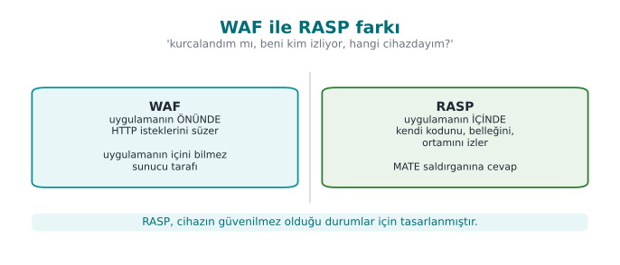

!!! note "Kısa tarihçe: uygulamanın kendini koruması"
    - **1980'ler** — crack / anti-crack kültürü: **anti-debug** ve kendini denetleyen kodun kökeni buraya dayanır.
    - **2000'ler** — DRM, mobil bankacılık ve ödeme uygulamaları korumayı **uygulamanın içine** taşımak zorunda kalır (cihaz artık güvenilir değildir).
    - **2012** — Gartner **RASP** (Runtime Application Self-Protection) terimini ortaya atar: koruma, uygulamanın **içinde** çalışır.
    - **2010'lar–bugün** — **OWASP MASVS-RESILIENCE** bu beklentileri denetlenebilir gereksinimlere çevirir ([13. hafta](../week-13/cen429-week-13.md)).

    Kısacası RASP yeni bir fikir değil; **MATE saldırganına** verilen kurumsal cevabın adıdır.

**RASP (Runtime Application Self-Protection — Çalışma Zamanı Uygulama Öz Koruması)**, uygulamanın **kendi içine**
gömülen, **çalışma zamanında** kendini izleyen ve saldırıya tepki veren korumalardır. Uygulama kendi kendinin
muhafızıdır.

!!! note "RASP dış korumalardan nasıl farklı?"
    | Koruma | Nerede durur | Neyi görür |
    | --- | --- | --- |
    | Ağ güvenlik duvarı | Ağ kenarında | Paketler |
    | WAF (Web App Firewall) | Uygulamanın **önünde** | HTTP istekleri |
    | **RASP** | Uygulamanın **içinde** | Kendi kodu, belleği, çalıştığı ortam |
    Bir WAF "dışarıdan gelen istek zararlı mı?" diye sorar. RASP "**ben** kurcalandım mı, **beni** kim izliyor,
    **hangi cihazdayım**?" diye sorar. Bu derste RASP'i mobil/gömülü ve masaüstü C/C++ bağlamında, uygulamanın kendini koruması
    olarak ele alıyoruz.

RASP üç iş yapar; bu haftanın omurgası bu üçlüdür:

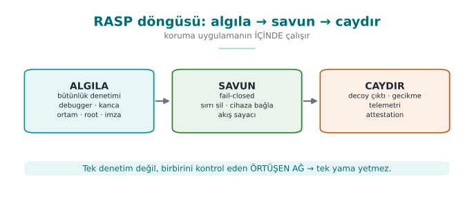

- **Algılama (detection):** Bir şeyin yanlış olduğunu anlamak — binary yamalanmış, bir hata ayıklayıcı bağlı, ortam bir
  emülatör, uygulama root'lu cihazda, bileşen yeniden paketlenmiş.
- **Savunma (defense):** Algılamaya **anlamlı** bir yanıt vermek — sırrı sil, işlemi reddet (fail-closed), anahtarı
  cihaza bağla, kritik işlemi kontrol akışına bağla.
- **Caydırma (deterrence):** Saldırganın işini **pahalılaştırmak** — çökmek yerine sahte (decoy) sonuç döndür, tepkiyi
  geciktir, olayı sunucuya bildir. Amaç kırılmazlık değil; saldırıyı **yeterince yavaşlatmaktır** (Hafta 4'teki
  "gizleme geciktirir, engellemez" ilkesinin RASP hâli).

Bu üçlü, tek bir hat olarak da görülebilir: **algıla → karar ver → tepki ver**. Aşağıdaki animasyon, bir dizi
bağımsız kontrolün (12 aşamaya kadar) nasıl tek bir "başarısız sayısına" indirgendiğini, bu sayının (ve cihaz
uyuşmazlığının) nasıl bir duruma (`NORMAL/WARN/DEGRADE/LOCK`) çevrildiğini ve her durumun hangi somut tepkiye yol
açtığını uçtan uca gösterir (bkz. Bölüm 10, Demo 8'in gerçek motoru):

<iframe class="dsanim" src="../anim/rasp-pipeline.html" title="RASP hattı: algıla → karar ver → tepki ver" loading="lazy"></iframe>
<div class="dsanim-baski" markdown>

</div>

**normal/two-failed/edge** örneklerini deneyin; kaç kontrolün başarısız olduğunu ve cihaz uyuşup uyuşmadığını
değiştirerek dört durumun her birine ulaşabilirsiniz.

### 1.1 Saldırgan modeli: MATE ("Man-At-The-End")

[Hafta 1'de](../week-1/cen429-week-1.md#3-saldirgan-kim-neye-erisebiliyor) üç saldırgan tipini görmüştük. RASP'in dünyası tümüyle **MATE**'tir: saldırgan uygulamanın **çalıştığı uç
noktanın sahibidir**. Sunucuya karşı saldırgan dışarıdadır (ve TLS, kimlik doğrulama korur); ama istemci uygulamada
saldırgan **her şeyi görür**: belleği okuyabilir, kodu değiştirebilir, hata ayıklayıcıyla adım adım izleyebilir. Bu,
[Hafta 11](../week-11/cen429-week-11.md)'deki **beyaz kutu** modeliyle aynı varsayımdır.

MATE saldırganını, Hafta 1'de gördüğümüz diğer saldırgan tiplerinden ayıran şey **konumdur**, yetenek değil:

| Saldırgan tipi | Nerede durur | Neyi görebilir | Klasik savunma |
| --- | --- | --- | --- |
| Ağ saldırganı | İstemci ile sunucu **arasında** | Yalnız şifreli trafik (TLS varsa) | TLS, kimlik doğrulama |
| Sunucu saldırganı | Sunucunun **dışında** | Yalnız gönderdiği istekler ve aldığı yanıtlar | Girdi doğrulama, yetkilendirme, hız sınırlama |
| **MATE (uçtaki saldırgan)** | Uygulamanın çalıştığı cihazın **içinde**, sahibi | Belleği, binary dosyayı, çalışma anındaki her adımı | RASP: bütünlük, anti-debug, kanca algılama, cihaz bağlama |

Bu tablo neden önemli? Çünkü bir MATE saldırganına karşı **ağ saldırganı savunmaları** (TLS, sunucu tarafı
girdi doğrulama) hiç işe yaramaz — TLS bağlantının **içeriğini** korur, ama saldırgan bağlantıyı açan
uygulamanın **kendisidir**; şifreyi çözdüğü anda veriyi kendi belleğinde açık olarak görür. Bu yüzden RASP,
önceki haftaların savunmalarının **yerine değil, üstüne** eklenir.

!!! danger "RASP'in acı gerçeği"
    Cihazın sahibi saldırgansa, **hiçbir istemci tarafı koruma nihai olarak kırılmaz değildir.** Yeterli zaman ve
    beceriyle her kontrol atlatılabilir. O hâlde RASP neden var? Çünkü amaç **kırılmazlık değil**, saldırıyı **ölçeklenemez
    ve pahalı** kılmaktır: bir cihazı kırmak günler alıyorsa ve kırık her cihazda tekrar gerekiyor **ve** sunucu tarafı
    anormallikleri yakalıyorsa, saldırı ekonomik olarak çökebilir. RASP **derinlemesine savunmanın** çalışma zamanı
    katmanıdır; **tek başına değil**, kripto (Hafta 3, 10), gizleme (Hafta 4, 9), whitebox (Hafta 11) ve **sunucu tarafı
    denetimle** birlikte anlam kazanır.

### 1.2 Bu haftanın örnek mimarisi ve ana fikri

Dönem boyunca kullandığımız örnek mimariyi hatırlayın: bir **mobil ödeme uygulaması** ve onun kritik işlerini yapan bir
**güvenlik kütüphanesi** (native C/C++). Telefon **güvenilmez ortamdır**. Bu hafta o kütüphaneye, çalışırken kendini
koruyan bir **RASP katmanı** ekliyoruz. Bütün örnek değerler **sentetiktir** (uydurma); gerçek anahtar, kart numarası,
cihaz kimliği ya da ürün adı kullanılmaz.

Ana fikir tek cümlede: **tek bir kontrole güvenme.** Her algılama sinyali tek başına atlatılabilir; güç, **birden çok
bağımsız sinyalin**, bir **tepki politikasının** ve **cihaz bağlamanın** birlikte çalışmasından gelir. Bu, Hafta 3'teki
**güvenlik kabuğunun** çalışma zamanındaki karşılığıdır.

### 1.3 İşlenmiş örnek: aynı olayı üç farklı şekilde ele almak

Algılama, savunma ve caydırmanın neden **ayrı** kavramlar olduğunu somutlaştıralım. Senaryo: kripto kütüphanesi,
ödeme anahtarını açmadan hemen önce bir hata ayıklayıcının bağlı olduğunu fark ediyor (Bölüm 4'teki TracerPid
sinyali > 0). Üç uygulamacı bunu üç farklı şekilde ele alıyor:

1. **Yalnız algılama, tepki yok:** Kod `suspicious` değişkenini artırır ama hiçbir yere bakmaz; fonksiyon normal
   akışına devam eder. Sonuç: hata ayıklayıcı bağlı bir saldırgan anahtarı **doğrudan okur**. Algılama boşa
   gitmiştir — çünkü bir savunmaya bağlanmamıştır.
2. **Algılama + kaba savunma:** Kod `if (suspicious) exit(1);` yazar. Sonuç: saldırgan anahtarı okuyamaz, ama
   programın **tam olarak hangi satırda** durduğunu görür; birkaç deneme ile o `if`'i yamalar (Bölüm 3'teki
   "checker'ın kendisi de yamalanır" dersiyle aynı zaaf).
3. **Algılama + savunma + caydırma:** Kod, sinyali doğrudan `exit()`'e değil, anahtar türetme işlemine **veri
   olarak** karıştırır (Bölüm 9'daki kontrol akışı sayacının küçük hâli) ve tetiklenirse **decoy** bir sonuç
   üretir (Bölüm 10). Sonuç: saldırgan bir hata mesajı görmez; "başarılı" görünen ama işe yaramaz bir sonuç alır
   ve hangi kontrolün tetiklendiğini bilemez.

Bu üç seçenek aynı **algılama** koduna sahiptir; farkları yalnız **savunma** ve **caydırma** katmanındadır. Bu
haftanın demoları ilerledikçe hep üçüncü yaklaşıma yaklaşacağız (bkz. Bölüm 10.2'deki tam karşılaştırma).

---

## 2. RASP mimarisi: denetimler ne zaman, nerede ve nasıl çalışır?

Önümüzdeki bölümlerde tek tek denetimleri (bütünlük, hata ayıklayıcı, ortam, kanca, root) göreceğiz. Ama sahada bir RASP
çözümünün gücü, tek tek denetimlerin ne kadar akıllı olduğundan çok, bu denetimlerin **nasıl bir araya getirildiğinden**
gelir. Tek bir yerde, tek bir kez çalışan, sonucu tek bir `if` ile değerlendirilen bir denetim, ne kadar iyi yazılmış
olursa olsun, bulunup atlatılması en kolay denetimdir. Bu bölüm, denetimleri yerleştirmenin tasarım ilkelerini anlatır.

### Ne zaman çalışır? Üç tetikleme anı

| An | Örnek | Neden? |
| --- | --- | --- |
| **Yükleme anı** | Kütüphane belleğe yüklendiğinde (Android'de native kütüphanenin yükleme fonksiyonu) | Ortam baştan güvenilmezse hiçbir sır açılmaz |
| **Hassas işlem öncesi** | Anahtar çözmeden, ödeme hesaplamadan, sunucuya kimlik doğrulamadan hemen önce | Saldırgan uygulama açıldıktan **sonra** hata ayıklayıcı bağlayabilir |
| **Arka planda, düzensiz aralıklarla** | Ayrı bir iş parçacığında, rastgele zamanlarda | Sabit zamanlı denetim kolayca tahmin edilir ve "arasına" girilir |

Tek bir tetikleme anı yetmez: yalnız açılışta yapılan bir hata ayıklayıcı denetimini, uygulama açıldıktan sonra bağlanan
bir hata ayıklayıcı hiç görmez.

### Nerede çalışır? Dağıtık denetim

- **Çok noktalılık:** Aynı denetim tek bir fonksiyonda değil, kodun **birçok yerinde**, her seferinde biraz farklı
  biçimde yapılır. Saldırgan bir noktayı yamaladığında diğerleri hâlâ çalışır.
- **Karşılıklı denetim:** Yönetilen katman (Java) ile native katman birbirinin bütünlüğünü denetler; biri
  değiştirilirse diğeri fark eder ([5. haftadaki](../week-5/cen429-week-5.md#12-dize-gizleme-ve-dinamik-yontem-cagrisi) ayrık parmak izi ve
  [1. haftadaki](../week-1/cen429-week-1.md#planin-iki-temel-araci-arayuz-tablosu-ve-varlik-tablosu) arayüz
  tablosunda "karşılıklı bütünlük denetimi").
- **Korunan fonksiyonun içinde:** Değerli bir fonksiyon (ör. dize çözme ya da anahtar türetme), kendi giriş
  noktasında birkaç denetimi **kendisi** yapar. Sahada böyle tek bir fonksiyonun, yüklenme anında zaten yapılmış
  denetimlere ek olarak kendi başına on beşe yakın denetimle (kod bütünlüğü, hata ayıklayıcı, ortam, root, kontrol
  akışı sayacı) korunduğu görülür. Performans nedeniyle, yalnız iç kullanımdaki sürümlerinde bu denetimlerin bir kısmı
  giriş noktasına indirilir.
- **Sahte parametreler:** Hassas fonksiyonların giriş noktalarında, programcının okunabilirliği için makroyla gizlenen
  ve bir bütünlük denetimini tetikleyen ek parametreler bulunabilir ([4. haftadaki](../week-4/cen429-week-4.md) "sahte parametreler").

### Nasıl karar verir? Merkezî değil, veri bağımlı

En zayıf tasarım şudur:

```c title="Zayıf: tek karar noktası"
if (hata_ayiklayici_var() || root_var() || butunluk_bozuk())
    return HATA;                     /* bu tek satırı değiştiren her şeyi atlatır */
anahtari_coz();
```

Tek bir karşılaştırmayı ters çeviren (ya da `hata_ayiklayici_var` fonksiyonunun hep "hayır" döndürmesini sağlayan)
saldırgan bütün korumayı geçer. Güçlü tasarımda denetimlerin sonucu bir `if`'e değil, **sonraki hesabın verisine**
karışır:

- Denetim sonuçları anahtar türetmeye katılır: ortam temizse doğru anahtar, değilse **farklı ama geçerli görünen**
  bir anahtar çıkar (kontrol akışı sayacı ve tepki politikasındaki decoy çıktı bu fikrin iki uygulamasıdır).
- Denetim sonuçları opak değerlerle taşınır (4. hafta): tek bir baytı değiştirerek "geçti"ye çevrilemez.
- Tepki, tetikleyiciden **zaman ve kod olarak uzak** bir yerde verilir (tepki politikası bölümü).

**"Veri bağımlılığı" ne demek, somut olarak?** Zayıf tasarımda `if (kontrol_gecti) anahtari_kullan();` yazılır —
`anahtar` zaten bellekte hazırdır, `if` yalnız onu **kullanıp kullanmayacağına** karar verir; saldırgan bu `if`'i
yamalarsa anahtar **zaten oradadır** ve kullanılır. Güçlü tasarımda ise anahtarın kendisi **henüz yoktur**;
kontrol sonucundan **hesaplanarak üretilir**: `anahtar = HMAC(kontrol_sonucu, sabit_tuz)`. Kontrol başarısızsa
`kontrol_sonucu` farklı bir değerdir, `anahtar` da farklı (ve işe yaramaz) çıkar — saldırganın atlayacağı bir
`if` **yoktur**, çünkü ortada atlanacak bir karar değil, hesaplanacak bir değer vardır. Bölüm 9.1'deki `acc`
zinciri ve Bölüm 10.1'deki cihaz anahtarı, bu fikrin iki somut uygulamasıdır.

### Katmanlar birbirini korur

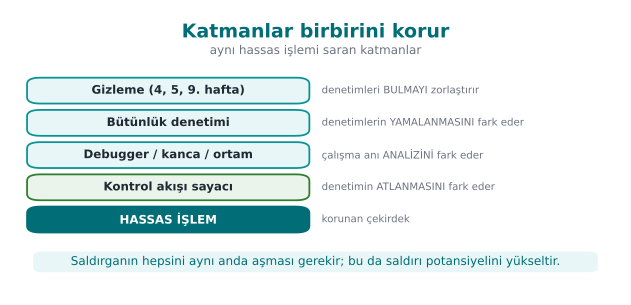

Her katman bir öncekinin zayıflığını kapatır: gizleme denetimleri saklar, bütünlük denetimi gizlenmiş denetimlerin
**değiştirilmesini** fark eder, kontrol akışı sayacı bütünlük denetiminin **atlanmasını** fark eder, cihaz bağlama
bütün bunlar aşılsa bile verinin başka bir yerde **kullanılmasını** engeller; sunucu doğrulaması ise istemci tamamen
ele geçirilse bile son sözü söyler (tepki politikasındaki telemetri ve sunucu tarafı risk motoru).

### 2.1 İşlenmiş örnek: tek bir fonksiyonu üç noktada korumak

"Çok noktalılık" soyut kalmasın. Örnek mimarideki `anahtar_coz()` fonksiyonunu (ödeme anahtarını açan native
fonksiyon) ele alalım ve üç tetikleme anını sırayla uygulayalım:

1. **Yükleme anı:** Kütüphane belleğe yüklendiğinde (native kütüphanenin başlatma fonksiyonunda) bir kez
   bütünlük denetimi (Bölüm 3) çalışır. Ortam en baştan bozuksa, `anahtar_coz` hiçbir zaman çağrılamaz hale
   getirilir (bir global bayrak sıfırlanır).
2. **Hassas işlem öncesi:** `anahtar_coz()`'un kendi girişinde, ayrıca bir anti-debug denetimi (Bölüm 4) ve bir
   kanca denetimi (Bölüm 6) çalışır — çünkü saldırgan hata ayıklayıcıyı **yükleme anından sonra** bağlamış
   olabilir.
3. **Arka planda, düzensiz aralıklarla:** Ayrı bir iş parçacığı, rastgele aralıklarla (ör. 2–7 saniye) ortam
   denetimini (Bölüm 5) tekrar çalıştırır; bir sonraki `anahtar_coz()` çağrısı bu iş parçacığının bulduğu sonucu
   okur.

Sonuç: `anahtar_coz()`'u atlatmak isteyen saldırganın **üç ayrı zaman noktasındaki üç ayrı denetimi** aynı anda
yenmesi gerekir. Yalnız 2. noktayı (fonksiyonun kendi girişini) yamalamak, 1. ve 3. noktadaki denetimleri
etkilemez — saldırgan işini bitirdiğini sanır ama arka plan iş parçacığı birkaç saniye içinde tutarsızlığı
yakalar ve tepki politikası devreye girer (Bölüm 10).

!!! note "Sahada nasıl uygulanır?"
    Kart şemalarının uygulama koruma gereksinimleri tam bu katmanları sayar: yetkisiz değişikliğe karşı koruma,
    çalışma anında öz bütünlük denetimi, desteklenmeyen cihazda çalışmama, sürüm geri almayı engelleme, statik ve
    dinamik tersine mühendisliğe ve kanca tekniklerine karşı savunma, hata ayıklama ve test ortamını algılama,
    uzlaşma durumunda arka uca ve kullanıcıya bildirim ve verinin silinmesi, işletim sistemi korumalarının açık
    olduğunun denetlenmesi. Sertifikalı bir kütüphanenin kılavuzunda native tarafta on dört, Java tarafında on dört
    ayrı RASP önlemi bu gereksinimlere tek tek eşlenir.

---

## 3. Bütünlük denetimi: uygulama kendini doğrular (self-hashing)

RASP'in ilk ve en temel adımı: **"Ben değiştirildim mi?"** Saldırgan bir lisans kontrolünü, bir `if (odendi)` dalını ya
da bir kripto çağrısını **yamalayarak** (patching) korumayı atlatmaya çalışır ([Hafta 4](../week-4/cen429-week-4.md)'te gördüğümüz `je → jmp`
yaması). Savunma: uygulama, kendi binary dosyasının (ya da korunan bir kod/veri bölgesinin) bir **özetini** çalışma
zamanında hesaplar ve önceden bilinen **altın (golden)** değerle karşılaştırır. Tek bir bayt bile değişmişse, yama
yakalanır.

!!! info "Kitap tarifi ve güncelleme"
    Ders kitabı (Viega & Messier) bunu **tarif 12.2 (Detecting Modification)**'te **CRC32** ile yapar. CRC32
    **kriptografik değildir**: saldırgan kodu yamalayıp aynı CRC'yi verecek şekilde kolayca ayarlayabilir. Biz bunu
    **HMAC-SHA-256** ile güncelliyoruz (bkz. [Hafta 3, §2.4](../week-3/cen429-week-3.md#24-ozet-mac-ve-imza-hangisi-ne-zaman)):
    doğru HMAC'i üretmek için gizli anahtar gerekir. Yazarın CRC
    seçmesinin bir nedeni vardır: asıl saldırı zaten **checksum kodunun kendisini** yamalamaktır — bu bölümün ana
    tartışması budur.

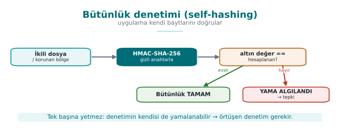

### Demo 1 — Çalışma zamanı bütünlük denetimi ve yama tespiti

!!! info "Demo 1 · `code/week-06/01-integrity-hmac` · self-hashing, HMAC-SHA-256 (Tarif 12.2 güncellemesi)"
    Program kendi binary dosyasının (`self`) HMAC-SHA-256 özetini hesaplayıp "altın" (golden) değer olarak kaydeder,
    sonra doğrular. Ardından binary dosyanın bir **kopyası** alınıp bir baytı değiştirilir (yama simülasyonu,
    demonun kendi `output/` klasöründe) ve yamalı kopyanın özeti altın değerle karşılaştırılır.

    Bu bölümün en altındaki animasyon (**normal/patched-mid/edge**, 🎲 rastgele baytlar) tam bu mekanizmayı,
    12-16 bayt üzerinde, adım adım gösterir.

Özün kodu (dosyayı okuyup HMAC hesaplar; `cen429_crypto.h`'dan `crypto_hmac_sha256`):

```c title="integrity.c (özet)"
/* Kendi yolunu bul: Linux /proc/self/exe, Windows GetModuleFileNameA */
self_path(path, sizeof(path));
read_file(path, &data, &size);
crypto_hmac_sha256(RASP_KEY, 32, data, size, digest);   /* HMAC over the file */

/* verify: sabit zamanli karsilastirma (zamanlama sizintisini onler) */
unsigned char diff = 0;
for (int i = 0; i < 32; i++) diff |= expected[i] ^ digest[i];
if (diff == 0) { /* INTEGRITY OK */ } else { /* PATCH DETECTED */ }
```

<iframe class="dsanim" src="../anim/integrity-hmac.html" title="Öz bütünlük denetimi: bir bayt yamalanınca" loading="lazy"></iframe>
<div class="dsanim-baski" markdown>

</div>

**normal**, **patched-mid** ve **edge-first-byte** hazır örneklerini deneyin; 🎲 ile rastgele baytlar üretebilir,
kendi baytlarınızı da girebilirsiniz.

Windows'ta alınan **gerçek çıktı** (kısaltılmış):

```text title=".\demo.ps1 — çıktı"
STEP 2 - Normal run: integrity verifies OK (no patch)
Expected   : 5aeaf45226dbb29af724cb7101a621419aa58e0630f1fee3d647f76b55115de4
Computed   : 5aeaf45226dbb29af724cb7101a621419aa58e0630f1fee3d647f76b55115de4
RESULT: INTEGRITY OK - target unchanged.

STEP 3 - Attack: a COPY of the binary is made and 1 byte is changed
> flip byte at offset 22272 (0xCC -> 0x33)
STEP 4 - The patched copy's HMAC is compared with the golden value
Expected   : 5aeaf45226dbb29af724cb7101a621419aa58e0630f1fee3d647f76b55115de4
Computed   : c47c35687dc205b93a2eec33df49c97defecfcb868fb8a23e6c01c2aca0ec8ac
RESULT: PATCH DETECTED - target was modified! (tamper)   (exit code 3)
```

Yama yokken özet altın değerle **birebir** aynı çıktı. Tek bir baytı değiştirince özet tamamen değişti (çığ etkisi) ve
yama yakalandı. Karşılaştırma **sabit zamanlı** yapılır (`memcmp` değil), çünkü
[Hafta 3'te](../week-3/cen429-week-3.md#sabit-zamanli-karsilastirma) gördüğümüz gibi düz `memcmp`
ilk farklı baytta durup zamanlama sızdırır.

### 3.1 İşlenmiş örnek: HMAC hangi baytları özetliyor, yama onu nasıl bozuyor?

**Hangi baytlar özetleniyor?** `target_hmac()` fonksiyonuna bakınca cevap nettir: `read_file()` hedefin (kendi
binary dosyanın) **tamamını** belleğe okur (`fread` ile ofset 0'dan dosya sonuna kadar) ve `crypto_hmac_sha256`
bu **bütün bayt dizisini** tek seferde özetler — belirli bir fonksiyon ya da bölüm değil, dosyanın **her baytı**.
`demo.ps1`'in gerçek çıktısında `ofset 22272` değiştiriliyordu; bu, dosyanın **ortasına** (`SIZE / 2`) denk gelir —
demek ki o çalıştırmada binary dosyanın toplam boyutu yaklaşık `22272 × 2 ≈ 44544` bayttı. Saldırgan dosyanın
hangi baytını değiştirirse değiştirsin (başı, ortası, sonu fark etmez), o bayt hesaba dahildir ve özet değişir.

**Yama onu nasıl bozuyor — küçük bir örnekte adım adım.** Aynı çığ etkisini, koca bir binary dosya yerine
**tek bir karakterlik** bir metinde görelim; mantık birebir aynıdır. `"MERHABA"` dizesini sabit bir anahtarla
HMAC-SHA-256'layalım, sonra son karakteri `A`'dan `B`'ye çevirip tekrar hesaplayalım:

```bash title="Tek karakterlik degisikligin HMAC'e etkisi (gercek openssl ciktisi)"
printf 'MERHABA' | openssl dgst -sha256 -hmac "ornek-anahtar"
printf 'MERHABB' | openssl dgst -sha256 -hmac "ornek-anahtar"
```

```text
SHA2-256(stdin)= 4d45a6382deee7f75c75b3cf5a6a81a2776d317e1db9ec9b0125b69e09492615
SHA2-256(stdin)= 4fbdf8768822083c3fc3797c5f1d278dd1ea58ab0bfde31a8ebf85e260fbcbd7
```

Girdinin **7 baytından yalnız 1 tanesi** (son karakter, `A`=0x41 → `B`=0x42; bu iki değer yalnız **iki bitte** ayrılır) değişti; ama
çıktının **32 baytının tamamı** farklı. Bu, kriptografik özet fonksiyonlarının **çığ etkisi**dir: girdide tek bir
bit değişirse, çıktının ortalama **yarısı** değişir. Demo 1'in gerçek çıktısında gördüğünüz
`5aeaf452...55115de4` → `c47c3568...aca0ec8a` dönüşümü de aynı özelliğin, koca bir binary dosya üzerindeki
hâlidir: `XOR 0xFF` tek bir baytın **her bitini** ters çevirir, bu da HMAC-SHA-256'nın iç işleyişi (SHA-256'nın
sıkıştırma fonksiyonunun her turu) yoluyla bütün 256 bit çıktıya yayılır.

!!! note "Neden bu, denetimin işe yaraması için gerekli?"
    Çığ etkisi olmasaydı (ör. CRC32'de olduğu gibi zayıf bir özet fonksiyonunda), saldırgan yamaladığı baytın
    yanına **telafi edici** birkaç bayt daha ekleyerek özeti eski değerine geri getirebilirdi (checksum'ı
    "düzeltme" saldırısı). HMAC-SHA-256 gibi kriptografik bir özette bu, anahtarı bilmeden **pratik olarak
    imkânsızdır** — bu yüzden Bölüm 3'ün başındaki "Kitap tarifi ve güncelleme" notunda CRC32'nin neden HMAC'e
    yükseltildiğini görmüştük.

!!! danger "Bütünlük denetimi tek başına neden yeterli değil?"
    HMAC anahtarı **binary dosyanın içindedir**. Yeterince kararlı bir saldırgan:
    1. Denetleyici (checker) fonksiyonun **kendisini** yamalayarak "her zaman TAMAM döndür" yapabilir.
    2. Yamayı yapıp **altın değeri de** yeniden hesaplayabilir (anahtarı bulursa).

    Bu yüzden gerçek RASP bütünlük denetimini şu üçüyle güçlendirir: **(1) çoklu/örtüşen denetleyiciler** (bir ağ hâlinde,
    biri diğerini de kontrol eder), **(2) sonucu bir veri bağımlılığı yapmak** — özeti doğrudan bir anahtar/atlama tablosu
    indeksi olarak kullanmak, böylece yama davranışı bozar (bkz. Bölüm 9, Demo 5), **(3) sunucu tarafı attestation** —
    istemcinin bütünlük kanıtını sunucuya nonce ile göndermek.

!!! success "Kural"
    Kritik kod/veri bölgelerinin bütünlüğünü çalışma zamanında **kriptografik** bir özetle (HMAC/imza) doğrulayın, CRC ile
    değil. Denetimi **tek noktada ve yalnız başlangıçta** yapmayın; periyodik, çoklu ve örtüşen yapın. Sonucu mümkünse bir
    **veri bağımlılığına** bağlayın.

!!! note "Sahada nasıl uygulanır? / Değerlendirici nasıl test eder?"
    Örnek mimaride native kütüphane, hem kendi `.so`/`.dll`'inin hem de üst katmanın (ör. Java/DEX) birleşik özetini
    doğrular; **karşılıklı** (mutual) doğrulama yapar (Katalog K6, Demo 6). Değerlendirici binary dosyayı yamalayıp
    algılamanın tetiklenip tetiklenmediğine, ardından **denetleyici kodun kendisini** yamalayarak korumayı atlatıp
    atlatamadığına bakar (tek denetleyici mi, ağ mı?).

!!! warning "Sık hatalar ve kontrol listesi"
    - [ ] Bütünlük **kriptografik** mi (CRC değil)?
    - [ ] Denetim yalnız başlangıçta değil, **periyodik** mi?
    - [ ] Tek bir denetleyici mi var, yoksa **örtüşen** denetleyiciler mi?
    - [ ] Sonuç bir davranışa (veri bağımlılığı) mı bağlı, yoksa yalnız bir `if` mi?
    - [ ] Sunucu tarafı bir **attestation** var mı (yalnız istemciye güvenmeme)?

**"Periyodik" ne sıklıkta olmalı? Bir maliyet-gecikme dengesi.** Bölüm 2'deki "arka planda, düzensiz
aralıklarla" ilkesini bir sayıyla somutlaştıralım. Denetim aralığı ne kadar **kısa** olursa, bir yamanın
fark edilmesi o kadar **hızlı** olur ama CPU/batarya maliyeti de o kadar **artar**; aralık ne kadar **uzun**
olursa saldırgana o kadar fazla "fark edilmeden çalışma" penceresi kalır:

| Denetim aralığı | Bir yamanın fark edilme gecikmesi (üst sınır) | Tipik ek CPU yükü |
| --- | --- | --- |
| Yalnız açılışta (1 kez) | Sınırsız (hiç fark edilmeyebilir) | En düşük |
| Her 30 saniyede bir | ~30 saniye | Düşük |
| Her 2–7 saniyede bir (rastgele) | ~7 saniye, **tahmin edilemez** anda | Orta |
| Her kritik işlemden hemen önce (Bölüm 2'deki 2. nokta) | Neredeyse anlık | Yalnız kritik işlemlerde |

Sahada tercih edilen, bu dört seçeneğin **hiçbiri tek başına değil, birlikte** kullanılmasıdır: açılışta bir kez
(ucuz, geniş kapsamlı), kritik işlem öncesi her seferinde (ucuz, dar kapsamlı ama en kritik an), ve arka planda
rastgele aralıklarla (ucuz değil ama saldırganın "denetim ne zaman çalışıyor" diye tahmin etmesini engeller).
Sabit bir aralık (ör. tam olarak her 30 saniyede bir) saldırgana bir **tahmin edilebilirlik** sunar; rastgele
aralık bunu engeller — bu yüzden tablodaki üçüncü satır "rastgele" olarak işaretlidir.

---

## 4. Hata ayıklayıcı (debugger) algılama

Saldırganın en güçlü aracı bir **hata ayıklayıcıdır** (gdb, lldb, x64dbg, WinDbg, Visual Studio): programı durdurur, adım
adım izler, belleği ve anahtarları okur, dalları değiştirir. RASP, bir hata ayıklayıcının **bağlı olup olmadığını**
anlamaya çalışır.

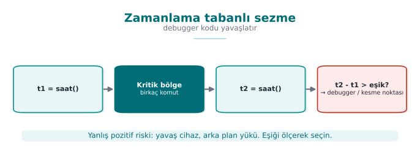

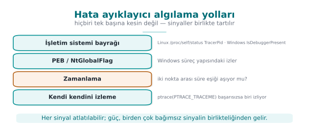

| Ortam | Gösterge | Kitap |
| --- | --- | --- |
| **Linux / WSL** | `/proc/self/status` → `TracerPid` (>0 ise bir süreç bizi `ptrace` ile izliyor); ana sürecin adı gdb/strace/ltrace mı | Tarif 12.13 |
| **Windows** | `IsDebuggerPresent` (PEB `BeingDebugged`); `CheckRemoteDebuggerPresent`; PEB `NtGlobalFlag` (0x70 bitleri) | Tarif 12.14 |

!!! info "2003'ten bugüne: neler eskidi?"
    - **SoftICE (Tarif 12.15) tamamen öldü.** Yerine modern hipervizör/ring-0 hata ayıklayıcıları, x64dbg, WinDbg, gdb,
      lldb ve özellikle **Frida/DBI** (dinamik binary enstrümantasyon) geçti (bkz. Bölüm 6).
    - `IsDebuggerPresent` (12.14) hâlâ var ama **tek başına zayıf**; yanına PEB `BeingDebugged`/`NtGlobalFlag`,
      `CheckRemoteDebuggerPresent`, timing tabanlı tespit eklenir.
    - `ptrace` tekniği (12.13) hâlâ geçerli; modern eklemeler: `/proc/self/status` **TracerPid** çapraz kontrolü.

### Demo 2 — Hata ayıklayıcı algılama (Linux ptrace/TracerPid, Windows PEB)

!!! info "Demo 2 · `code/week-06/02-debugger-detection` · anti-debug, yalnız okuma"
    Program birden çok bağımsız sinyale bakar ve **hiçbir şeyi değiştirmez** (kendini `ptrace` ile de izlemez; yalnız
    `/proc` ve PEB alanlarını okur). `demo.sh` programı önce normal, sonra `gdb` altında çalıştırır.

```c title="antidebug.c (Linux özeti)"
/* /proc/self/status icinden TracerPid oku; >0 ise izleniyoruz */
long tp = tracer_pid();
if (tp > 0) suspicious++;      /* bir surec bizi ptrace ile izliyor */
```

<iframe class="dsanim" src="../anim/debugger-presence.html" title="Hata ayıklayıcı algılama: TracerPid + ana süreç adı" loading="lazy"></iframe>
<div class="dsanim-baski" markdown>

</div>

Animasyonda `/proc/self/status`'un satır satır taranışını ve iki sinyalin (**TracerPid**, ana süreç adı) nasıl
tartıldığını izleyin; **clean/gdb-attached/edge** örneklerini deneyin.

```text title="sh demo.sh — gerçek çıktı (WSL)"
STEP 1 - Normal run (NO debugger): clean is expected
1) /proc/self/status TracerPid           : 0 (no tracer)
2) Parent process name                   : sh
RESULT: clean - no tracing tool visible.

STEP 2 - Run under gdb (TracerPid > 0 is expected)
1) /proc/self/status TracerPid           : 41885 (TRACED)
RESULT: a debugger/tracing TOOL was detected (2 signal(s)).
```

Hata ayıklayıcı yokken TracerPid **0**, gdb altında **>0** çıktı; program iki durumu ayırt etti. Windows'ta Visual
Studio ile **F5** (hata ayıklayıcıda) çalıştırırsanız `IsDebuggerPresent` **EVET** döndürür ve sonuç "algılandı" olur.

### 4.1 İşlenmiş örnek: TracerPid'in 0'dan sıfır olmayana geçişini adım adım izlemek

Demo 2'nin çıktısında TracerPid'in `0`'dan `41885`'a geçtiğini gördük; şimdi bu geçişin **neden** olduğunu adım
adım açalım. `/proc/self/status`, çekirdeğin her süreç için tuttuğu, o sürecin kendisi tarafından da okunabilen
bir metin dosyasıdır ([Hafta 1](../week-1/cen429-week-1.md)'de `/proc` dosya sistemini "çekirdeğin sürece açtığı bir pencere" olarak tanımlamıştık).
İçindeki `TracerPid:` satırı, o süreci `ptrace()` sistem çağrısıyla izleyen sürecin **PID**'ini (Process ID —
süreç kimliği) tutar; kimse izlemiyorsa değer **0**'dır.

**Adım 1 — hata ayıklayıcı yokken.** `antidebug` programı doğrudan kabuktan çalıştırılır ve kendi
`/proc/self/status` dosyasını okur (temsilî, kısaltılmış içerik):

```text title="/proc/self/status (hata ayiklayici YOK, temsili)"
Name:      antidebug
Pid:       4821
PPid:      4820          <- calistiran kabuk (sh)
TracerPid: 0             <- kimse ptrace ile izlemiyor
```

Program bu satırı okur, sayısal değeri `0` bulur; `tp > 0` koşulu **yanlış** olduğu için `suspicious` değişkenini
artırmaz. Demo çıktısındaki "RESULT: clean - no tracing tool visible." satırı buradan gelir.

**Adım 2 — `gdb` altında çalıştırılınca.** `demo.sh` ikinci geçişte programı `gdb` içinden başlatır. `gdb`,
hedef süreci başlatırken ya da ona bağlanırken çekirdeğe "bu süreci ben izliyorum" der; bu,
`ptrace(PTRACE_TRACEME, ...)` ya da `ptrace(PTRACE_ATTACH, ...)` çağrısıyla olur. Çekirdek bunu **kaydeder** ve
izlenen sürecin `/proc/self/status` dosyasındaki `TracerPid` alanını, izleyen `gdb` sürecinin **kendi PID'iyle**
doldurur:

```text title="/proc/self/status (gdb ALTINDA, temsili)"
Name:      antidebug
Pid:       4821
PPid:      41885          <- artik ana surec gdb
TracerPid: 41885          <- gdb bizi ptrace ile izliyor
```

Bu, tam olarak demo çıktısında görülen `41885` değeridir. Programın kendisi hiçbir şey **yapmamıştır** — yalnız
çekirdeğin zaten tuttuğu bir alanı **okumuştur**; bu yüzden teknik "yalnız okuma" (read-only) olarak
sınıflandırılır ve hiçbir yan etkisi yoktur (demonun `README`'sindeki güvenlik sözü tam bu nedenle tutulabilir).

**Adım 3 — karar.** `tp > 0` olduğu için `suspicious` sayacı 1 artar; ana sürecin adı da `gdb` olduğu için ikinci
bağımsız bir sinyal (`parent_process_name` denetimi) daha eklenir; demo çıktısındaki "algilandi (2 sinyal)" ifadesi bu
ikisinin toplamıdır. Tek bir alanın okunması yeterli olmasa da, çekirdek düzeyinde tutulan bu bilgi
**sahtelemesi zor** bir sinyaldir: `TracerPid`'i doğrudan sıfırlamak sürecin kendi belleğinden değil çekirdek
veri yapısından okunduğu için mümkün değildir — saldırganın bunu gizlemesi ancak `/proc/self/status`'u okuyan
**kütüphane fonksiyonuna** kanca takmasıyla (hooking) mümkündür, ki bu da tam olarak Bölüm 6'nın konusudur.

### 4.2 Windows karşılığı: `NtGlobalFlag`'teki bitleri okumak

Windows'ta doğrudan bir `/proc` dosyası yoktur, ama aynı fikrin (çekirdeğin zaten tuttuğu bir bilgiyi okumak)
bir karşılığı vardır: **PEB** (Process Environment Block — her sürecin çekirdek tarafından tutulan, sürecin
kendisinin de okuyabildiği bir bellek yapısı). PEB'in `NtGlobalFlag` alanı, süreç bir hata ayıklayıcı altında
**başlatıldıysa** (yalnız sonradan bağlanmadıysa) üç özel bayrak biti taşır:

| Bit (onaltılık) | Anlamı |
| --- | --- |
| `0x10` | `FLG_HEAP_ENABLE_TAIL_CHECK` — yığın sonu denetimi |
| `0x20` | `FLG_HEAP_ENABLE_FREE_CHECK` — serbest bırakılan yığın denetimi |
| `0x40` | `FLG_HEAP_VALIDATE_PARAMETERS` — yığın parametre doğrulama |

Bu üç bit **birlikte** `0x70`'i oluşturur (`0x10 | 0x20 | 0x40 = 0x70`); Windows yükleyicisi, süreci bir hata
ayıklayıcı altında başlatırken yığın ayırıcısını daha sıkı denetimli bir moda **otomatik olarak** geçirir ve bu
üç biti işaretler. Demo 2'nin Windows kodundaki `(ntglobal & 0x70) != 0` satırı tam bunu okur: `NtGlobalFlag`
değerinin bu üç bitten **en az birini** taşıyıp taşımadığına bakar. Tıpkı `TracerPid` gibi, bu da yalnız **okuma**
işlemidir; program hiçbir şeyi değiştirmez, çekirdeğin/yükleyicinin zaten yazdığı bir alanı okur.

!!! quote "Tespit–karşı-tespit yarışı"
    Anti-debug klasik bir **silah yarışıdır**. Her tespit tekniğinin bir karşı-tekniği vardır: saldırgan `ptrace`'i
    `LD_PRELOAD` ile no-op yapabilir (Demo 4), `IsDebuggerPresent`'in dönüşünü yamalayabilir, PEB bayrağını
    temizleyebilir. Bu yüzden **tek bir kontrole asla güvenilmez**; sinyaller çoğaltılır ve bir tepki politikasına
    bağlanır (Demo 8).

!!! success "Kural"
    Anti-debug'ı **tek bir `if (IsDebuggerPresent()) exit();`** olarak yazmayın (saldırgan o çağrıyı yamalar). Birden çok
    bağımsız sinyal (ptrace + TracerPid + timing + parent) toplayın, sonucu doğrudan bir davranışa/anahtara bağlayın ve
    tepkiyi **geciktirin** (hemen çıkmayın; saldırganın hangi kontrolün tetiklediğini anlamasını zorlaştırın).

!!! warning "Sık hatalar ve kontrol listesi"
    - [ ] Tek bir anti-debug çağrısına mı bağlısınız, birden çok sinyale mi?
    - [ ] Tespit sonucu bir davranışa/anahtara mı bağlı, yoksa yalnız `exit()` mi?
    - [ ] `ptrace(PTRACE_TRACEME)` gibi **yan etkili** bir teknik yerine salt okuma (`TracerPid`) mı tercih edildi?
    - [ ] Tepki hemen mi, yoksa geciktirilmiş/örtük mü?

---

## 5. Ortam algılama: sanal makine ve emülatör

Saldırgan uygulamayı çoğu zaman kontrollü bir **analiz ortamında** — bir sanal makine, emülatör ya da kum havuzunda
(sandbox) — çalıştırır. **Emülatör**, bir cihazı yazılımla **taklit eden** ortamdır (Android emülatörü, QEMU);
**sanal makine (VM)** ise gerçek donanımı soyutlayıp üzerinde başka bir işletim sistemi çalıştırır. Saldırgan
analizini gerçek cihaz yerine burada yapar, çünkü orada daha kolaydır. RASP bunu ortam ipuçlarından sezmeye çalışır.

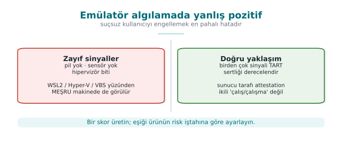

| Teknik | Nasıl | Not |
| --- | --- | --- |
| **CPUID hipervizör biti** | `CPUID.1:ECX[31]` — "hypervisor present" | Bare-metal'de 0 |
| **Hipervizör satıcı imzası** | `CPUID` yaprak `0x40000000` → 12 karakter (`KVMKVMKVM`, `VMwareVMware`, `Microsoft Hv`...) | Bazı hipervizörler gizler |
| **Zamanlama (timing)** | Bir işlemi ölç; tek adımlı hata ayıklama/ağır emülasyon çok yavaşlatır | Eşik makineye göre değişir |

### Demo 3 — VM/emülatör ve zamanlama algılama (CPUID)

!!! info "Demo 3 · `code/week-06/03-environment-timing` · yalnız CPU komutu ve saat okur"

<iframe class="dsanim" src="../anim/environment-timing.html" title="VM/emülatör algılama: CPUID + zamanlama" loading="lazy"></iframe>
<div class="dsanim-baski" markdown>

</div>

**bare-metal/kvm/edge-blank-vendor/edge-slow-timing** örneklerini deneyin; 🎲 ile rastgele hipervizör/zamanlama
değerleri üretebilirsiniz.

```text title=".\demo.ps1 — gerçek çıktı (bir Windows dizüstünde)"
(A) CPUID.1:ECX[31] hypervisor bit    : PRESENT
    Hypervisor vendor signature        : "Microsoft Hv"
(B) time for 2,000,000 iterations      : 0.662 ms  (checksum=4544)
RESULT: a hypervisor was SEEN. But WSL2/Hyper-V/VBS also look like this;
this ALONE does not mean 'analysis environment' - it is a weak signal.
```

!!! danger "En önemli ders: yanlış pozitif"
    Yukarıdaki çıktı Hyper-V'li sıradan bir Windows dizüstünde alındı ve **hipervizör "PRESENT"** dedi. Ama bu bir analiz ortamı **değil** — sıradan bir
    geliştirici makinesi! Modern Windows'ta **Hyper-V, WSL2 ve sanallaştırma tabanlı güvenlik (VBS)** yüzünden çoğu makine
    hipervizör bildirir. Yani bu bit tek başına "saldırgan analiz ediyor" anlamına **gelmez**. Bir uygulama sırf
    hipervizör gördüğü için çalışmayı reddetseydi, milyonlarca **meşru** kullanıcıyı engellerdi. RASP daima **birden çok
    göstergeyi tartar** ve her birinin **atlatılabileceğini** kabul eder.

!!! success "Kural"
    Ortam algılamayı bir **risk skoru** olarak kullanın, binary bir "çalış/çalışma" kararı olarak değil. Birden çok
    göstergeyi birleştirin; yanlış pozitifi (meşru VM/emülatör kullanan gerçek kullanıcıları) hesaba katın; nihai kararı
    **sunucu tarafı risk motoruyla** birlikte verin.

!!! note "Sahada nasıl uygulanır?"
    Mobil dünyada karşılığı **emülatör algılamadır** (QEMU/Android emülatörü ipuçları: `ro.kernel.qemu`, sahte sensörler,
    tipik IMEI/seri değerleri). Yine aynı ilke: sinyal, kanıt değil; kombinasyon ve sunucu tarafı denetim.

### 5.1 İşlenmiş örnek: risk skoru ve eşik nasıl kurulur?

Bölüm 1.2'nin "tek kontrole güvenme" ilkesini burada sayılarla somutlaştıralım. Ortam algılamanın her sinyaline
bir **ağırlık** (0–100 arası bir katkı puanı) verilir; bütün ağırlıklar toplanır ve bir **risk skoru** çıkar.
Karar, tek bir `if (hipervizor_var)` değil, bu skorun bir **eşiğin** üstünde olup olmadığıdır.

| Sinyal | Kaynak | Tek başına ne kadar güvenilir? | Örnek ağırlık |
| --- | --- | --- | --- |
| Hipervizör biti (CPUID) | Demo 3 | Düşük — WSL2/Hyper-V/VBS'te de set olur | 15 |
| Bilinen hipervizör satıcı imzası | Demo 3 | Orta — sanallaştırılmış ortamı daha kesin gösterir | 25 |
| Zamanlama anomalisi | Demo 3 | Orta — yük altındaki gerçek makinede de olabilir | 20 |
| Bilinen emülatör dosya izi (mobilde) | `ro.kernel.qemu` benzeri | Yüksek — gerçek cihazda neredeyse hiç olmaz | 40 |
| Hata ayıklayıcı bağlı | Demo 2 (TracerPid) | Yüksek — meşru kullanıcı çalışırken nadiren olur | 35 |

**Örnek 1 — Hyper-V'li sıradan bir Windows dizüstünde çalışan bir geliştirici (meşru kullanıcı).** Bölüm 3'teki
gerçek `demo.ps1` çıktısında gördüğümüz gibi hipervizör biti **PRESENT** VE satıcı imzası **görünür**
(`"Microsoft Hv"` — bkz. Bölüm 3), zamanlama normal, emülatör izi yok, hata ayıklayıcı bağlı değil. Toplam skor:
hipervizör biti (15) + satıcı imzası görünür (25) = **40**. Zamanlama ve emülatör/hata-ayıklayıcı sinyalleri
katkı vermez.

**Örnek 2 — analiz ortamında çalışan bir saldırgan.** Hipervizör biti VAR (15) + satıcı imzası görünür (25) +
zamanlama anomalisi (20) + hata ayıklayıcı bağlı (35) = toplam **95**. Skor yüksek; işlem reddedilir ya da decoy
döner (Bölüm 10).

Dikkat: Örnek 1 ile Örnek 2'nin **ilk iki sinyali birebir aynı** (40 puan) — Hyper-V'li bir geliştirici makinesi
ile bir analiz sanal makinesi, salt bu iki sinyale bakan bir sisteme **aynı** görünebilir! Aradaki fark yalnız
zamanlama anomalisi ve hata ayıklayıcı sinyalinde ortaya çıkar (Örnek 2'yi 40'tan 95'e taşıyan asıl fark budur).
Eğer eşik 30 gibi düşük tutulursa (aşağıdaki bankacılık örneği), Örnek 1'in **meşru** geliştiricisi bile
reddedilir — bu, hemen aşağıdaki "yanlış pozitifin gerçek maliyeti" uyarısının tam olarak anlattığı durumdur.

Aradaki fark **tek bir bitin varlığı değil, kaç bağımsız sinyalin birlikte** göründüğüdür. Eşik nereye
konulmalı? Bu, üründen ürüne değişen bir **risk iştahı (risk appetite)** kararıdır — "kaç meşru kullanıcıyı
engellemeye razıyım, karşılığında kaç saldırıyı önlerim" dengesi:

| Ürün | Yanlış pozitifin maliyeti | Yanlış negatifin maliyeti | Örnek eşik |
| --- | --- | --- | --- |
| Bankacılık / ödeme uygulaması | Kullanıcı işlemini tamamlayamaz, çağrı merkezine yük biner | Sahte işlem, doğrudan para kaybı | Düşük (ör. 30) — şüphede reddet |
| Sadakat puanı / kupon uygulaması | Kullanıcı kızar ama kayıp küçük | Bir kupon fazladan kullanılır | Yüksek (ör. 70) — nadiren reddet |
| DRM korumalı içerik oynatıcı | Meşru kullanıcı içeriği izleyemez, mağaza puanı düşer | İçerik kopyalanır | Orta (ör. 50) |

!!! danger "Yanlış pozitifin gerçek maliyeti"
    Eşiği çok düşük tutmak (ör. bankacılık eşiğini 70 yerine 10 yapmak), her WSL2/Hyper-V kullanan geliştiriciyi,
    her sanal makinede test eden BT departmanını ve bazı erişilebilirlik/güvenlik araçlarını kullanan sıradan
    kullanıcıyı **meşru olduğu hâlde** engeller. Bunun bedeli soyut değildir: çağrı merkezi yükü, mağaza
    puanı/olumsuz yorumlar, kullanıcı kaybı. RASP tasarımında "kaç saldırgan yakaladık" kadar "kaç meşru
    kullanıcıyı engelledik" de ölçülmelidir — mümkünse aşamalı devreye alma (önce yalnız kaydet, sonra reddet)
    ile.

!!! success "Kural"
    Ortam/root/debugger sinyallerini **tek bir ikili karar** değil, **ağırlıklı bir risk skoru** olarak toplayın.
    Eşiği varlığın değerine ve ürünün risk iştahına göre **bilinçli** seçin; sabit, herkese uyan bir "endüstri
    standardı eşik" yoktur. Skoru ve eşiği zamanla (sunucudaki telemetriye bakarak) **ayarlanabilir** tutun;
    binary dosyaya sabit kodlamayın.

---

## 6. Kanca ve enstrümantasyon algılama (LD_PRELOAD, Frida)

Hata ayıklayıcıdan daha sinsi bir tehdit: **fonksiyonlara kanca takma (hooking)** ve **dinamik enstrümantasyon**. Kanca
(hook), bir fonksiyonun çağrısını araya girip değiştirmektir; enstrümantasyon ise çalışan bir programa kod enjekte
edip davranışını izleme ya da değiştirme tekniğidir (bunun en yaygın aracı **Frida**'dır). Saldırgan
programı durdurmadan, çağırdığı fonksiyonları (kendi anti-debug/anti-root kontrollerimiz dâhil) **kendi sürümüyle
değiştirir**. Böylece Demo 2'deki kontrolleri "her zaman temiz" döndürecek şekilde yalancıya çıkarabilir.

!!! note "Kısa tarihçe: statik yamadan dinamik enstrümantasyona"
    - **1990'lar** — kanca teknikleri IAT (Import Address Table) ve PLT/GOT üzerinde çalışan **elle yazılmış**,
      hedefe özel araçlardı; her hedef için yeniden yazılması gerekiyordu.
    - **2000'ler** — `LD_PRELOAD` (Linux) ve DLL enjeksiyonu (Windows), genel amaçlı ama **statik** (önceden
      derlenmiş) kanca takma yöntemleri olarak yaygınlaştı.
    - **2013–2014** — **Frida** projesi ortaya çıktı; asıl fark, kanca kodunun **JavaScript ile çalışma
      zamanında** yazılıp enjekte edilebilmesiydi — derleme gerektirmiyordu.
    - **2010'lar–bugün** — Frida, mobil güvenlik testinin standart aracı hâline geldi; RASP'in "kanca algılama"
      bölümünün var olma nedeninin büyük kısmı budur.

    Bu tarihçenin dersi: kanca teknikleri **statikten dinamiğe** doğru evrildi; bu yüzden algılamanın da
    (Bölüm 6.1'deki `dladdr` tekniği gibi) belirli bir aracın imzasına değil, **davranışın kendisine** (fonksiyon
    nereden çalışıyor?) bakması gerekir.

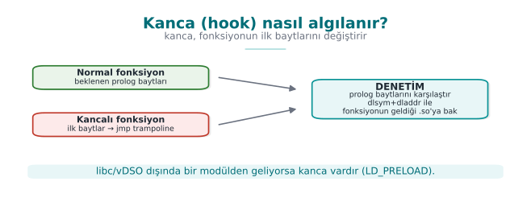

| Teknik | Nasıl | Platform |
| --- | --- | --- |
| **LD_PRELOAD** | Bir `.so`'yu önyükleyip standart fonksiyonları değiştirme (interposition) | Linux |
| **PLT/GOT kancası** | Çağrı tablosu girişlerini kendi fonksiyonuna yönlendirme | Linux/ELF |
| **Satır içi (inline) kanca** | Fonksiyonun ilk baytlarını `jmp` ile ezme | Her yer |
| **Frida / Xposed** | Dinamik binary enstrümantasyon çerçeveleri | Mobil/masaüstü |

Algılama fikirleri (Katalog K7/K8/K18):

- `LD_PRELOAD` ortam değişkeni boş mu? (`getenv` — **zayıf**, çünkü `getenv`'in kendisi de kancalanabilir)
- Bir fonksiyon **hangi paylaşımlı nesneden** çözülüyor? `dlsym(RTLD_DEFAULT, ...)` + `dladdr` ile fonksiyonun geldiği
  `.so` dosyasına bakılır; beklenen libc yerine yabancı bir `.so` çıkıyorsa **kanca vardır**. (Bu, `getenv`
  sahteciliğine dayanmaz.)
- `/proc/self/maps`'te beklenmeyen yürütülebilir bölgeler, bilinen çerçeve göstergeleri.

### Demo 4 — LD_PRELOAD ile kanca ve `dladdr` ile algılama

!!! info "Demo 4 · `code/week-06/04-preload-hook` · yalnız Linux/WSL · CWE benzeri: dinamik enstrümantasyon"
    Demo, `time()` fonksiyonunu ele geçiren küçük bir sahte kanca kütüphanesi (`libfake_hook.so`) **derler**. `LD_PRELOAD`
    ile bu kütüphane **yalnız tek bir demo komutuna** yüklenir. Ana program, fonksiyonun geldiği `.so`'ya bakarak kancayı
    yakalar. Windows'ta `demo.ps1` bunun WSL'de nasıl çalıştırılacağını anlatır (Windows karşılığı IAT/satır-içi kanca
    tespitidir).

```c title="preload_hook.c (özet)"
void *p = dlsym(RTLD_DEFAULT, "time");   /* onyuklu kanca varsa onu doner */
Dl_info info;
dladdr(p, &info);                        /* fonksiyonu saglayan .so */
int hook = !is_legitimate(info.dli_fname);   /* not libc/vdso/ld = HOOK */
```

<iframe class="dsanim" src="../anim/preload-hook-resolution.html" title="LD_PRELOAD sembol çözümleme sırası" loading="lazy"></iframe>
<div class="dsanim-baski" markdown>

</div>

Animasyon, `time`'ın yüklü nesneler arasında hangi SIRAYLA arandığını ve LD_PRELOAD kancası varsa neden onun
**kazandığını** gösterir; **clean/hooked-first/edge** örneklerini deneyin.

```text title="sh demo.sh — gerçek çıktı (WSL)"
STEP 1 - Normal run (no LD_PRELOAD): clean is expected
   time     -> linux-vdso.so.1
   getenv   -> /lib/x86_64-linux-gnu/libc.so.6
   time(NULL) returned              : 1790690227
RESULT: clean - no preload/hook visible.

STEP 2 - Attack: the fake hook is preloaded ONLY into this process
   time     -> bin/linux/libfake_hook.so (HOOK!)
   getenv   -> /lib/x86_64-linux-gnu/libc.so.6
   time(NULL) returned              : 1234567890
RESULT: function hook / preload DETECTED (2 signal(s)).
```

Temiz koşuda `time`, çekirdeğin **vDSO**'sundan çözüldü (bu meşrudur, kanca değil). Kanca yüklenince aynı `time`
`libfake_hook.so`'dan çözüldü ve **sabit sahte değer** (1234567890) döndürdü; `dladdr` fonksiyonun yerini göstererek
kancayı yakaladı. Dikkat: temiz koşuda `linux-vdso`'yu **yanlış pozitif** saymamak için algılama libc, vDSO ve dinamik
yükleyiciyi meşru kaynaklar olarak kabul eder — bu, "algılama yazmak, algılamayı doğru yazmaktan kolaydır" dersidir.

### 6.1 İşlenmiş örnek: `dlsym` + `dladdr` ile fonksiyonun kaynağını adım adım bulmak

Demo 4'ün çekirdeği iki fonksiyon çağrısıdır: `dlsym` ve `dladdr`. İkisinin birlikte ne yaptığını adım adım
açalım.

**Adım 1 — `dlsym(RTLD_DEFAULT, "time")` ne yapar?** `dlsym`, çalışan sürecin **sembol tablosunda** aranan
isimde (`"time"`) bir sembol arar ve onun **bellek adresini** döndürür. `RTLD_DEFAULT`, "programın normal sembol
arama sırasını (kendi binary, sonra yüklenen kütüphaneler, `LD_PRELOAD`'lı kütüphaneler dâhil) kullan" anlamına
gelen özel bir tanıtıcıdır. Bu adımın çıktısı yalnız bir **sayı** (bir bellek adresi); hangi dosyadan geldiğine
dair bir bilgi taşımaz.

**Adım 2 — bu adresi kim sağladı?** İşte `dladdr`'nin işi budur: verilen bir adresi alır, çalışan sürecin
belleğe yüklenmiş **paylaşımlı nesnelerinin (`.so` dosyalarının)** haritasında arar ve adresin **hangi**
`.so`'nun bellek aralığına düştüğünü bulur. Sonucu bir `Dl_info` yapısına yazar; bizim kullandığımız alan
`dli_fname` — o `.so`'nun **dosya yolu**.

**Adım 3 — temiz koşuda.** `LD_PRELOAD` boşken, `time` sembolü normal arama sırasıyla çözülür ve çekirdeğin
sağladığı **vDSO** (virtual Dynamic Shared Object — çekirdeğin süreç belleğine kendiliğinden eklediği, sistem
çağrısı yapmadan hızlı okuma sağlayan özel bir sanal `.so`) içinden gelir. Demo çıktısı: `time -> linux-vdso.so.1`.
`is_legitimate()` fonksiyonu bu ismi tanır (`linux-vdso` alt dizesini arar) ve **kanca değil** der.

**Adım 4 — `LD_PRELOAD` ile kanca yüklenince.** `demo.sh`, `LD_PRELOAD=./libfake_hook.so` ortam değişkeniyle
programı başlatır. Dinamik bağlayıcı (`ld-linux.so`), normal arama sırasının **en başına** bu kütüphaneyi sokar;
kütüphane kendi `time()` fonksiyonunu tanımladığı için, `dlsym(RTLD_DEFAULT, "time")` artık **vDSO'daki gerçek
`time`'ı değil, `libfake_hook.so`'daki sahte `time`'ı** bulur. `dladdr` bu adresin `libfake_hook.so`'nun
bellek aralığına düştüğünü görür; `dli_fname` = `"bin/linux/libfake_hook.so"` döner. `is_legitimate()` bu ismi
tanımadığı (libc/vDSO/ld değil) için **KANCA** der — tam demo çıktısındaki `time -> bin/linux/libfake_hook.so
(HOOK!)` satırı.

**Adım 5 — bu, neden `getenv(LD_PRELOAD)` denetiminden daha güçlü?** `getenv` denetimi ortam değişkeninin
**kendisine** bakar — ama ortam değişkeni yalnız programın **başlatılma anında** kütüphaneyi yüklemek için
kullanılır; bir kez yüklendikten sonra saldırgan onu **silebilir** (`unsetenv`) ya da kendi sahte kütüphanesinde
`getenv`'i de kancalayıp boş döndürebilir (tam olarak Etkinlik 1'in denediği şey). `dladdr` denetimi ise ortam
değişkenine hiç bakmaz; doğrudan "bu fonksiyon şu an **fiilen nereden** çalışıyor?" sorusunu sorar — kanca zaten
yüklenmiş olduğu için bu sorunun cevabı, ortam değişkeninden değil çalışan **kodun kendisinden** gelir ve bu
yüzden `getenv` sahteciliğine dayanmaz.

!!! success "Kural"
    Kanca algılamada `getenv(LD_PRELOAD)` gibi **manipüle edilebilir** kaynaklara güvenmeyin; kritik fonksiyonların
    **kaynağını** (hangi modülden geldiğini) doğrulayın. Birden çok fonksiyonu kontrol edin; `/proc/self/maps` gibi ek
    sinyaller ekleyin; sonucu bir tepki politikasına bağlayın.

!!! note "Değerlendirici nasıl test eder?"
    Değerlendirici bilinen bir enstrümantasyon aracıyla (ör. Frida) kritik fonksiyonları kancalar ve korumanın bunu
    yakalayıp yakalamadığına bakar; ardından **algılama fonksiyonunun kendisini** kancalayarak korumayı kör edip
    edemeyeceğini dener (tek nokta mı, dağıtık mı?).

---

## 7. Dinamik bellek koruması ve bellek izleme tespiti

İzlencenin bu haftaya koyduğu maddelerden biri **dinamik bellek korumasıdır**: program çalışırken bellekteki hassas
verinin okunmasına ve değiştirilmesine karşı alınan önlemler.
[1. haftada](../week-1/cen429-week-1.md#sirlari-bellekten-silmek-tarif-132) sırları bellekten silmeyi ve takasa
düşmesini önlemeyi,
[3. haftada](../week-3/cen429-week-3.md#13-kullanimda-veri-bellekte-guvenli-silme-ve-cihaz-baglama) "kullanımda
veri" katmanlarını gördük. Bu bölüm aynı soruyu çalışma anı saldırganı açısından
yeniden sorar: saldırgan belleği **izliyor** ya da **değiştiriyorsa** ne yapabiliriz?

!!! note "Kısa tarihçe: bellekteki sır neden 'diskteki sır' gibi düşünülemez"
    - **2008** — J. Alex Halderman ve ortak yazarları, **"Lest We Remember: Cold Boot Attacks on Encryption
      Keys"** makalesinde DRAM'in gücü kesildikten **saniyeler-dakikalar sonra bile** içeriğini kısmen koruduğunu
      (remanans) gösterdi: bir dizüstü bilgisayarı soğutup yeniden başlatarak bellekteki tam disk şifreleme
      anahtarlarını kurtarmayı başardılar. Bu, "sır yalnız RAM'de, diskte değil" varsayımının tek başına **yeterli
      olmadığını** kanıtlayan, alanın en çok anılan çalışmalarından biridir — bu bölümün "kısa ömür" ve "asla
      açık tutma" önlemlerinin doğrudan motivasyonu budur.
    - Linux çekirdeğinin `prctl(PR_SET_DUMPABLE, ...)` ve `mlock`/`MADV_DONTDUMP` gibi bellek korumaları, aynı
      genel derste (RASP'ten önce de var olan) işletim sistemi düzeyinde savunma ailesine girer: sürecin kendi
      belleğini başka bir sürece veya diske karşı korumak.

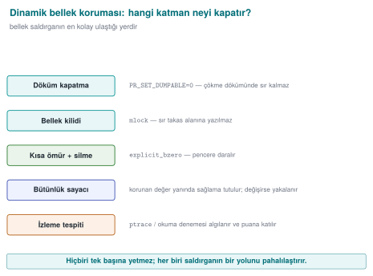

### Saldırgan bellekle ne yapar?

| Saldırı | Örnek | Hedef |
| --- | --- | --- |
| **Okuma** | Süreç belleğinin dökümünü almak, bellekte bilinen bir değeri aramak | Anahtar, PIN, çözülmüş veri |
| **Değiştirme** | Bir oyundaki puanı, bir sayaç değerini ya da bir "lisans geçerli" bayrağını bellekte değiştirmek | Mantık ve denetimler |
| **İzleme** | Bir değer değiştiğinde haber veren araçlarla hangi adresin neyi tuttuğunu bulmak | Değişkenlerin yerini keşfetmek |

Bu saldırıların hepsi için saldırganın süreç belleğine **erişmesi** gerekir: bir hata ayıklayıcıyla, işletim sisteminin
süreç belleği arayüzleriyle ya da sürecin içine yüklenmiş bir kütüphaneyle. Bu yüzden bellek koruması, önceki
bölümlerdeki hata ayıklayıcı ve kanca algılamayla birlikte düşünülür.

### Önlem 1: Bellekte az, kısa ve dağınık tut

En etkili bellek koruması, bellekte **okunacak bir şey bırakmamaktır**:

1. **Kısa ömür:** Sır, yalnız kullanıldığı fonksiyonun içinde açık olur ve fonksiyon dönmeden silinir (3. hafta:
   açıklık penceresi).
2. **Örtme ve parçalama:** Kullanılmadığı sürede sır, rastgele bir maskeyle XOR'lanmış ya da parçalara bölünmüş olarak
   durur; bellekte tek bir yerde sırrın kendisi bulunmaz.
3. **Rastgele değerle silme:** İş bitince bellek sıfırla değil rastgele değerlerle doldurulur; "burada az önce bir sır
   vardı" izini de bırakmaz. Sahada native tarafta rastgele üretecin tek kullanım yeri budur.
4. **Hiç açılmamak:** Whitebox kriptografide anahtar hiçbir anda açık halde bellekte bulunmaz ([11. hafta](../week-11/cen429-week-11.md)). Sahadaki
   kabuk matrisinde ödeme sırasında native tarafta kalan tek kabuk budur (3. hafta).

### Önlem 2: Belleğin okunmasını işletim sistemiyle zorlaştır

| Önlem | Platform | Etkisi |
| --- | --- | --- |
| Döküm kapatma, `PR_SET_DUMPABLE = 0` | Linux | Aynı kullanıcıya ait başka bir süreç bile hata ayıklayıcı olarak bağlanamaz ve süreç belleği dosyasını okuyamaz (1. hafta) |
| Bellek kilitleme (`mlock` / `VirtualLock`), `MADV_DONTDUMP` | Linux / Windows | Sır takasa ve döküme düşmez (1. hafta) |
| Sayfa korumaları (`mprotect` / `VirtualProtect`) | Linux / Windows | İlklendirmeden sonra değişmemesi gereken tablolar **salt okunur** yapılır; değiştirme girişimi hata üretir |
| Korunan süreç özellikleri | Windows, mobil platformlar | İşletim sisteminin sağladığı "korunan süreç" ve uygulama kum havuzu, başka uygulamaların belleğe erişimini sınırlar |

Bu önlemler yönetici (root) yetkisine sahip bir saldırganı durdurmaz; ama saldırganı **daha güçlü** bir konuma çıkmaya
zorlar ve bu da root algılamanın devreye girdiği yerdir.

**Somut bir örnek: `PR_SET_DUMPABLE` neyi değiştirir?** Linux'ta her süreç varsayılan olarak "dump edilebilir"dir
— çekirdek çökme anında bir çekirdek dökümü (core dump) üretebilir **ve** aynı kullanıcıya ait başka bir süreç
`ptrace(PTRACE_ATTACH, pid, ...)` ile ona bağlanabilir. `prctl(PR_SET_DUMPABLE, 0)` çağrısı bu bayrağı kapatır:

| Durum | `ptrace` ile dışarıdan bağlanma | Çökme anında bellek dökümü | `/proc/<pid>/mem` okuma |
| --- | --- | --- | --- |
| `PR_SET_DUMPABLE = 1` (varsayılan) | Aynı kullanıcının başka bir süreci **bağlanabilir** | Üretilir (diskte kalır) | Okunabilir |
| `PR_SET_DUMPABLE = 0` | Aynı kullanıcının süreci bile **bağlanamaz** ("Operation not permitted") | Üretilmez | Reddedilir |

Bu, Bölüm 4'teki `TracerPid` denetimiyle **tamamlayıcı** çalışır: `TracerPid` "şu an biri izliyor mu?" diye
**algılar**; `PR_SET_DUMPABLE = 0` ise "aynı kullanıcıya ait sıradan bir araç izleyemesin" diye **önler**. Kök
yetkisine sahip bir saldırgan bu bayrağı yine de aşabilir (`ptrace_scope` ayarına ve yetkisine bağlı) — bu yüzden
Bölüm 8'deki kök göstergesiyle birlikte değerlendirilmelidir.

### Önlem 3: Değiştirilen veriyi fark et

Bellekteki kritik bir yapının (bir sayaç, bir yetki bayrağı, bir yapılandırma tablosu) sessizce değiştirilmesini fark
etmenin yolu, o veriyi **tek başına** bırakmamaktır:

```c title="Kritik bir değeri korumalı tutmak: değer + gölge kopya + özet"
typedef struct {
    uint32_t value;         /* asıl değer                           */
    uint32_t shadow;        /* value XOR çalışma anı maskesi        */
    uint32_t mac;           /* value ve shadow üzerinden kısa bir MAC */
} ProtectedCounter;

/* Okurken üçünün tutarlılığı denetlenir; tutmuyorsa değer bellekte değiştirilmiştir. */
int counter_read(const ProtectedCounter *s, uint32_t *out)
{
    if ((s->shadow ^ runtime_mask) != s->value) return -1;
    if (short_mac(s->value, s->shadow) != s->mac) return -1;
    *out = s->value;
    return 0;
}
```

Saldırgan bellekte yalnız `value` alanını değiştirirse gölge kopya ve özet tutmaz. Üçünü birden tutarlı biçimde
değiştirmek için maskeyi ve özet anahtarını da bulması gerekir; bu da işin maliyetini artırır. Aynı fikir, [5. haftadaki](../week-5/cen429-week-5.md#12-dize-gizleme-ve-dinamik-yontem-cagrisi)
cihaz parmak izinin **iki farklı özetle iki farklı yerde** saklanmasında ve
[2. haftadaki](../week-2/cen429-week-2.md#kurcalamaya-dayanikli-gunluk) kurcalamaya dayanıklı günlükte de vardır.

### 7.1 İşlenmiş örnek: `ProtectedCounter` bir saldırıyı nasıl yakalar?

Yukarıdaki yapıyı sayılarla izleyelim. `runtime_mask`, çalışma başında rastgele üretilmiş sabit bir değer
olsun: `0xA5A5A5A5`. Bir ödeme denemesi sayacı `value = 3` (üçüncü deneme) olduğunda yapı şöyle doldurulur:

| Alan | Değer | Nasıl hesaplandı |
| --- | --- | --- |
| `value` | `0x00000003` | asıl sayaç |
| `shadow` | `0xA5A5A5A6` | `value XOR runtime_mask` = `0x00000003 XOR 0xA5A5A5A5` |
| `mac` | (örnek) `0x7F2C1B90` | `short_mac(value, shadow)` |

`counter_read()` her okumada `shadow XOR runtime_mask`'in `value`'ya eşit olup olmadığına bakar:
`0xA5A5A5A6 XOR 0xA5A5A5A5 = 0x00000003` — `value` ile eşit, tutarlı; fonksiyon `0` döner.

Şimdi saldırganın bir bellek düzenleyicisiyle yalnız `value` alanını `0x00000063` (99) yaptığını düşünelim
(bir deneme sayacını ya da bir puanı sıfırlamaya/artırmaya çalışıyor). `shadow` ve `mac` alanları **değişmedi**.
Bir sonraki `counter_read()` çağrısı: `shadow XOR runtime_mask = 0xA5A5A5A6 XOR 0xA5A5A5A5 = 0x00000003` — ama
`value` artık `0x00000063`. İkisi **eşleşmiyor**; fonksiyon `-1` döner, tutarsızlık yakalanır. Saldırganın bunu
atlatabilmesi için `shadow`'ı da doğru maskeyle yeniden hesaplaması **ve** `mac`'i de tutarlı üretmesi gerekir —
ki `short_mac`'in anahtarını bilmediği sürece bu, Bölüm 3.1'deki HMAC altın değerini yeniden üretmekle aynı
zorluktadır.

!!! warning "Tutarlılık denetimi de bir denetimdir"
    `counter_read`'in `-1` dönüşünü "hiçbir şey olmamış gibi" yok sayan bir çağıran, bütün korumayı boşa çıkarır; ayrıca
    denetimin kendisi de yamalanabilir. Bu yüzden tutarsızlık bir tepkiye bağlanır (tepki politikası) ve denetim kodu da
    bütünlük denetiminin kapsamına alınır.

### Önlem 4: İzlendiğini fark et

Bellek izleme araçlarının çoğu, sürece bir hata ayıklayıcı olarak bağlanarak ya da sürecin içine bir kütüphane yükleyerek
çalışır. Bu yüzden izleme tespitinin temeli, hata ayıklayıcı ve kanca algılama bölümlerinde gördüğümüz yöntemlerdir. Bunlara ek
olarak bazı dolaylı sinyaller kullanılır:

- **Zamanlama:** Tek adımlı çalıştırılan ya da kesme noktalarıyla durdurulan kod, normalden çok daha yavaş çalışır;
  iki nokta arasındaki beklenmedik uzun süre bir sinyaldir (ortam algılamadaki zamanlama ölçümüyle aynı fikir).
- **Beklenmeyen modüller:** Süreç belleğinde, uygulamanın kendisinin yüklemediği kütüphaneler bulunması.
- **Tutarlılık bozulması:** Önlem 3'teki gibi korunan değerlerin tutarsızlaşması.

Bu sinyallerin hiçbiri tek başına kesin değildir; hepsi tepki politikasındaki **risk skoruna** katkı olarak kullanılır.

!!! question "Değerlendirici nasıl test eder?"
    Hassas işlem sırasında ve sonrasında süreç belleğinin dökümünü alıp bilinen test sırlarını arar; bellekteki bir
    sayacı ya da bayrağı bir bellek düzenleyiciyle değiştirip uygulamanın fark edip etmediğine bakar; bellek izleme
    araçlarını bağlayıp uygulamanın tepkisini gözlemler. Raporda "sır bellekte ne kadar süre açık kaldı" ve "değiştirilen
    değer fark edildi mi" soruları cevaplanır.

---

## 8. Kök/ayrıcalıklı ortam ve bileşen imza doğrulaması

!!! note "Kısa tarihçe: paket imzalama ve kök göstergesi"
    - **Android 1.0 (2008)** — orijinal APK imzalama şeması (JAR imzalama, sonradan "v1" olarak anılır) uygulamayı
      yeniden paketlemeye karşı ilk savunmaydı: değiştirilmiş bir APK, orijinal geliştiricinin özel anahtarıyla
      üretilmiş imzayı **taşıyamaz**.
    - **Android 7.0 Nougat (2016)** — Google, **APK Signature Scheme v2**'yi tanıttı: dosyaları tek tek değil,
      APK'nin **tamamını** (JAR imzalamanın kapsam dışı bıraktığı bazı alanlar dâhil) imzalar; hem daha hızlı
      doğrulanır hem de v1'in bıraktığı bazı "imzayı bozmadan içerik ekleme" açıklarını kapatır.
    - **Android 9 Pie (2018)** — **APK Signature Scheme v3**, aynı ilkeye **anahtar döndürme (key rotation)**
      desteği ekledi.

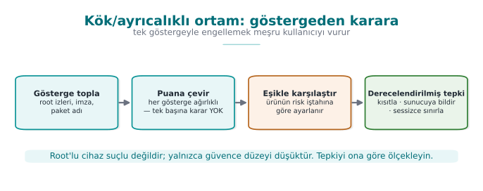

### 8.1 Kök (root) / ayrıcalıklı ortam göstergesi

**Kök (root)**, bir cihaz üzerinde normalde kısıtlı olan tam yetkidir; **jailbreak** aynı yetkiyi iOS gibi kapalı
sistemlerde zorla açmanın adıdır. Root'lu (ya da jailbreak'li) bir cihazda uygulamanın güvenlik varsayımları çöker:
her süreç belleği okuyabilir, dosya sistemi korumaları aşılır. RASP root göstergelerine bakar (Katalog K4/K5): `su` ikilisinin varlığı, tehlikeli paketler,
yazılabilir sistem yolları, root gizleme çerçeveleri. Masaüstündeki taşınabilir karşılığı: uygulama **yükseltilmiş
yetkiyle** mi çalışıyor (Linux `geteuid()==0`, Windows yükseltilmiş token)?

**Mobil "root" ile masaüstü "yükseltilmiş yetki" arasındaki fark yalnız isimdir, fikir aynıdır.** Android'de bir
uygulamanın `su` ikilisini bulması, root erişiminin **kurulu olduğunu** gösterir; Linux/masaüstünde bir sürecin
`geteuid()`'i `0` döndürmesi, sürecin **fiilen** `root` kullanıcısı olarak çalıştığını gösterir. İkisi arasındaki
küçük ama önemli fark: mobilde root **kurulu olabilir ama o an kullanılmıyor olabilir** (gösterge, göstergedir);
masaüstünde `geteuid()==0` ise **o anki gerçek durumu** bildirir (çekirdeğin kendisi bu bilgiyi tutar, tıpkı
Bölüm 4.1'deki `TracerPid` gibi sahtelemesi zordur). Bu yüzden masaüstü/sunucu tarafındaki "ayrıcalıklı süreç"
denetimi, mobildeki "root göstergesi" taramasından biraz daha **güvenilir** bir sinyaldir — yine de tek başına
karar vermek yerine Bölüm 8.1.1'deki risk skoruna eklenmelidir.

### Demo 7 — Root/ayrıcalıklı ortam göstergesi (yalnız okuma)

!!! info "Demo 7 · `code/week-06/07-environment-privilege` · root/ayrıcalık göstergesi, salt okuma"
    Program (1) ayrıcalık seviyesini (root/admin mi) ve (2) bilinen "tehlikeli işaret" yollarının varlığını yalnız
    **okuyarak** kontrol eder. Demoyu deterministik kılmak için komut satırından sahte bir işaret (`output/fake_su`)
    verilir.

<iframe class="dsanim" src="../anim/root-indicator-scan.html" title="Kök/ayrıcalık gösterge taraması" loading="lazy"></iframe>
<div class="dsanim-baski" markdown>

</div>

**clean/rooted-one-mark/edge** örneklerini deneyin; animasyon 14 bilinen göstergenin taranışını ve ayrıcalık
seviyesinin nasıl eklendiğini gösterir.

```text title=".\demo.ps1 — gerçek çıktı (kısaltılmış)"
STEP 2 - Flagged case: a fake 'su' indicator file is created
1) Privilege level : normal user
2) Dangerous-indicator scan:
   [FOUND] output\fake_su (extra indicator)
RESULT: an elevated/risky environment INDICATOR is present (1 signal(s)).
```

!!! warning "Sinyal, kanıt değil"
    Root göstergeleri **kolayca sahtelenir** (Magisk Hide gibi araçlar `su`'yu ve bilinen yolları gizler). Ayrıca bir
    uygulama sırf root gördüğü için çalışmayı reddederse, cihazını **meşru** biçimde root'lamış kullanıcıları da engeller
    (yanlış pozitif / kullanıcı deneyimi dengesi). Modern yaklaşım: cihazın bütünlüğünü **işletim sistemi/platform
    attestation** servisiyle (nonce'lu, sunucu tarafı doğrulanan) ölçmek — istemcinin kendi "root değilim" iddiasına
    güvenmemek.

### 8.1.1 Kök göstergesini de bir risk skoruna bağlamak

Bölüm 5.1'deki risk skoru fikri kök/ayrıcalık göstergesi için de geçerlidir; hatta sahada tek bir gösterge yerine
bir **liste** önerilir, çünkü her gösterge tek başına hem **kaçırılabilir** (saldırgan gizler) hem **yanlış
pozitif üretebilir** (meşru kullanıcı cihazını gerçekten root'lamıştır).

| Gösterge | Tek başına anlamı | Örnek ağırlık |
| --- | --- | --- |
| `su` ikilisi/işareti bulundu | Root erişimi kurulu olabilir | 20 |
| Bilinen root yönetim paketi yüklü | Root aktif olarak yönetiliyor | 25 |
| Sistem bölümü yazılabilir | Salt-okunur olması gereken alan değiştirilebilir | 30 |
| `geteuid() == 0` (masaüstü/sunucu karşılığı) | Süreç fiilen yükseltilmiş yetkiyle çalışıyor | 40 |

Demo 7'nin gerçek çıktısındaki tek sinyal (`output/fake_su` bulundu → 1 sinyal) düşük bir skora karşılık gelir;
tek başına bir bankacılık uygulamasını durdurmaya **yetmemelidir**. Skorun yüksek çıkması için birden çok
göstergenin **birlikte** görünmesi beklenir — tıpkı Bölüm 5.1'deki ortam örneğinde olduğu gibi.

!!! warning "Sık hata: root görünce anında `exit()`"
    Kök göstergesi tek başına görülür görülmez uygulamayı kapatmak, hem gerçek saldırganı yakalamaz (ipuçlarını
    zaten gizlemiştir, bu denetim onu hiç görmez) hem de cihazını meşru amaçla (özelleştirme, geliştirme)
    root'lamış sıradan bir kullanıcıyı cezalandırır. Kural: göstergeyi skora ekle, kararı **eşiğe** bırak
    (Bölüm 5.1); fail-closed yerine önce **azaltılmış işlevsellik** (ör. yüksek tutarlı işlemleri reddet, düşük
    tutarlıları kabul et) düşün.

### 8.2 Bileşen/paket imza ve özet doğrulaması (APK imza doğrulamasının genel hâli)

Android'de uygulama, **yeniden paketlemeye (repackaging)** karşı **APK imzasını** doğrular (APK Signature Scheme
v1/v2/v3): saldırgan uygulamayı açıp değiştirse ve yeniden paketlese bile, orijinal geliştiricinin özel anahtarıyla
üretilmiş imzayı taşıyamaz. Bu, "yüklediğim/çağırdığım bileşen beklenen, değiştirilmemiş sürüm mü?" sorusunun genel
hâlidir (Katalog K2/K3/K6).

### Demo 6 — Bileşen imza doğrulaması ve repackaging tespiti

!!! info "Demo 6 · `code/week-06/06-component-signature` · imza/özet doğrulama"
    Bir "eklenti modülü" dosyası yüklenmeden **önce** ayrık bir imza (HMAC-SHA-256) ile doğrulanır. Modül bir bayt bile
    değişirse imza tutmaz ve yükleme reddedilir.

<iframe class="dsanim" src="../anim/component-signature.html" title="Bileşen imzası doğrulama: repackaging yakalama" loading="lazy"></iframe>
<div class="dsanim-baski" markdown>

</div>

**holds/appended-byte/edge** örneklerini deneyin; animasyon üretim-zamanı imzalamayı ve yükleme-öncesi
doğrulamayı yan yana gösterir.

```text title=".\demo.ps1 — gerçek çıktı"
STEP 3 - Verify before loading (module unchanged): HOLDS
Module signature HELD -> safe to load.
STEP 4 - Attack: the module is REPACKAGED (one character changes)
Module signature DID NOT HOLD -> REPACKAGED/modified.
Loading REJECTED.   (exit code 3)
```

!!! info "Önemli fark: HMAC vs. asimetrik imza"
    APK v2/v3 **açık anahtar (asimetrik)** imza kullanır (bkz.
    [Hafta 3'teki](../week-3/cen429-week-3.md#24-ozet-mac-ve-imza-hangisi-ne-zaman) dijital imza): doğrulayanın imzalama
    anahtarına değil, yalnız **açık anahtara** ihtiyacı olur. Bu demoda öğretim için **paylaşılan anahtarlı HMAC**
    kullanıyoruz (basit ve `cen429_crypto.h`'da hazır); asimetrik imza (Ed25519 / RSA-PSS) ve sertifika zincirlerini
    [Hafta 10'da](../week-10/cen429-week-10.md#5-dijital-imza-olusturma-dogrulama-ve-kullanim-yerleri) işleyeceğiz.
    İlke aynı: yüklemeden önce **bütünlük + kaynak** doğrulaması.

### 8.2.1 İşlenmiş örnek: repackaging bir bayt eklemekle nasıl yakalanır?

Demo 6'nın gerçek çıktısındaki "modül YENIDEN PAKETLENIR (tek bayt eklenir)" adımını Bölüm 3.1'deki mantıkla
birleştirelim. Modülün doğrulaması da tıpkı Demo 1 gibi **dosyanın tamamı** üzerinden hesaplanan bir
HMAC-SHA-256'dır; fark, hedefin bu kez programın kendisi değil, **ayrı bir dosya** (eklenti modülü) olmasıdır.

**Adım 1 — orijinal modül.** Modül dosyası `N` bayttır; yükleyici onu okur, `HMAC(anahtar, modul[0..N))`
hesaplar ve önceden kaydedilmiş imzayla karşılaştırır. Eşleşir → "TUTAR" → güvenle yüklenir.

**Adım 2 — saldırgan modülü açar, bir özellik ekler, yeniden paketler.** Bu işlem dosyanın **sonuna bir bayt
ekler** (`N+1` bayt oldu) — modülün amaçlanan işlevine hiç dokunmasa bile. Yükleyici bu kez `HMAC(anahtar,
modul[0..N+1))` hesaplar. Girdinin **uzunluğu bile değiştiği** için (Bölüm 3.1'deki tek bayt **değeri**
değişikliğinden daha köklü bir fark), HMAC'in dahili blok işleme mekanizması en baştan farklı bloklar görür ve
sonuç **tümüyle** farklı çıkar — tıpkı Demo 1'de gördüğümüz gibi.

**Adım 3 — karşılaştırma başarısız.** Yeni HMAC, kaydedilmiş imzayla eşleşmez → "TUTMADI" → "YENIDEN
PAKETLENMIS/degistirilmis" → yükleme reddedilir (çıkış kodu 3). Saldırgan tek bir bayt bile eklese, imzayı
**yeniden üretebilmesi** için imzalama anahtarına ihtiyacı vardır; bu anahtar (öğretim amaçlı HMAC'te)
yükleyicinin içindedir, ama gerçek APK imzasında (asimetrik) yalnız orijinal geliştiricide bulunan **özel
anahtardır** — bu da Bölüm 8.2'nin "Önemli fark" notundaki ayrımın can alıcı noktasıdır: HMAC'i doğrulayan
herkes aynı zamanda **üretebilir** de; asimetrik imzada doğrulayan yalnız **doğrular**, üretemez.

!!! success "Kural"
    Dinamik yüklenen her bileşeni (modül, eklenti, native kütüphane, güncelleme paketi) yüklemeden **önce** kriptografik
    olarak doğrulayın. Mümkünse **karşılıklı** doğrulama kurun (Katalog K6): native, üst katmanın özetini; üst katman,
    native'in özetini doğrular — saldırganın **ikisini birden** tutarlı yamalaması gerekir. Uzun vadede **asimetrik imza**
    tercih edin (dağıtım kolaylığı).

---

## 9. Kontrol akışı bütünlüğü: tek bir `if` neden yetmez

Şu ana kadarki bütün kontroller (bütünlük, anti-debug, ortam, root) bir noktada **bir karar** verir: `if (tehlike)
reddet;`. Saldırganın işi basittir: o **tek atlamayı** (`je → jmp`) yamalayıp kontrolü es geçmek (Bölüm 3'teki yama). O
hâlde kontrolleri **atlanamaz** kılmanın yolu nedir?

!!! note "Kısa tarihçe: yazılım kurcalamaya dayanıklılığından denetlenebilir kontrol akışına"
    - **1996** — David Aucsmith, tek bir yama noktasına güvenmemek için birbirini **çapraz doğrulayan**, dağıtık
      bütünlük kontrolleri fikrini işler (yazılım kurcalamaya dayanıklılığı literatürünün erken katkılarından biri).
    - **2001** — Christian Collberg ve Clark Thomborson, kod gizleme ve kurcalamaya dayanıklılık üzerine bir
      taksonomi ve terminoloji yayımlar; aynı dönemde Hoi Chang ve Mikhail Atallah, kontrol akışını izleyen ve
      birbirini denetleyen küçük kod parçacıkları olan **"guard" (bekçi)** fikrini işler — bu hafta 3.
      kontrol noktasının atlanmasına karşı kullandığımız "çoklu/örtüşen denetleyici" fikrinin kökü buradadır.
    - **2005** — Martín Abadi, Mihai Budiu, Úlfar Erlingsson ve Jay Ligatti, **Control-Flow Integrity (CFI)**'yi
      akademik olarak tanımlar: programın çalışma zamanındaki kontrol akışının, derleme zamanında çıkarılan bir
      kontrol akışı çizgesine **uyduğunu** doğrulamak. Bu haftanın kontrol akışı sayacı, CFI'nin fikrini (beklenen
      yoldan sapmayı yakalamak) tam bir çizge yerine **veri bağımlı bir anahtar zinciriyle** basitleştirilmiş
      şekilde uygular.

Cevap: güvenlik kontrollerini bir **kontrol akışı sayacına / anahtar zincirine** bağlamak (Katalog K17). Kritik işlem,
doğru sonucu **ancak** bütün kontrol noktalarından **sırayla** geçilmişse üretebilir. Bunu bir **veri bağımlılığıyla**
kurarız: her kontrol noktası bir anahtar zincirini ilerletir (`acc = HMAC(acc, "asama-i")`); kritik işlem bu zincirden
türetilen anahtarla bir sırrı açar.

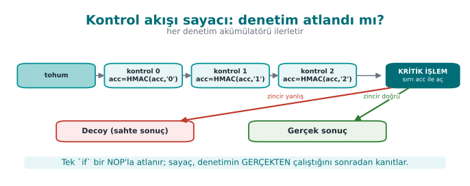

Bir kontrol atlanır ya da sırası bozulursa **acc** farklı çıkar, anahtar yanlış olur ve GCM çözme **reddedilir** — gerçek
sonuç üretilemez. Böylece tek bir `jmp` yaması işe yaramaz.

### Demo 5 — Kontrol akışı sayacı ve skip saldırısı

!!! info "Demo 5 · `code/week-06/05-flow-counter` · control-flow integrity (Katalog K17)"

<iframe class="dsanim" src="../anim/flow-counter.html" title="Kontrol akışı sayacı: beklenen yol ve atlanan kontrol" loading="lazy"></iframe>
<div class="dsanim-baski" markdown>

</div>

Animasyon 10-14 aşamalı bir akışı, altın (golden) zincirle karşılaştırarak gösterir; **in-order/skip-half/edge**
örneklerini deneyin — hiçbir aşama çalışmasa bile, ya da bütün aşamalar YANLIŞ sırada çalışsa bile zincir bozulur.

```text title=".\demo.ps1 — gerçek çıktı (kısaltılmış)"
SCENARIO 1 - normal: every checkpoint runs in order
   [passed] checkpoint 0 (integrity (Demo 1))
   [passed] checkpoint 1 (anti-debug (Demo 2))
   [passed] checkpoint 2 (environment (Demo 3))
RESULT: PAYMENT APPROVED -> "PAYMENT-APPROVAL-TOKEN-4242"

SCENARIO 2 - skip: the checks are SKIPPED entirely (straight to the critical operation)
   [SKIPPED] no checkpoint ran
   (warning: count=0 visited_mask=0x0 expected=3/0x7)
RESULT: PAYMENT DENIED (wrong chain key).

SCENARIO 4 - reorder: the checks run in the WRONG ORDER
RESULT: PAYMENT DENIED (wrong chain key).
```

Normal akışta üç kontrol sırayla geçildi, zincir doğru oldu ve ödeme onaylandı. Kontroller atlandığında, kısmen
geçildiğinde ya da yanlış sırada geçildiğinde zincir farklı çıktı; kritik işlem gerçek sonucu **üretemedi** ve sahte
(decoy) döndü. Program ayrıca bir **çift sayaç** (`count` + `visited_mask` biti) tutar (K17); bu, anahtar
zinciriyle birlikte üçlü bir tutarlılık kontrolü sağlar.

**"Çift sayaç" neden gerekli, `acc` zinciri yetmiyor mu?** `acc` zinciri **hangi aşamaların hangi sırayla**
çalıştığını dolaylı olarak kanıtlar (yanlış aşama/sıra → yanlış anahtar), ama demo çıktısındaki uyarı satırında
gördüğümüz gibi (`warning: count=0 visited_mask=0x0 expected=3/0x7`) program ayrıca iki **basit** sayaç daha tutar:
`count` (kaç kontrol noktasının çalıştığını sayan düz bir tam sayı) ve `visited_mask` (her kontrol noktasının kendi bit
konumunu `1` yaptığı bir bit kümesi, ör. 0., 1. ve 2. kontrol geçtiyse `visited_mask = 0b111 = 0x7`). Bunların amacı
`acc`'ten **farklıdır**: `acc` kriptografik olarak güçlüdür ama tek başına "kaç kontrol geçti, hangileri" gibi
**okunabilir bir teşhis bilgisi** vermez (HMAC çıktısından geriye "üç kontrol de geçti" diye çıkarım yapılamaz).
`count` ve `visited_mask`, geliştiriciye ve günlüğe (log) okunabilir bir özet sağlarken, gerçek **yetkilendirme kararı**
yine yalnız `acc`'ten türeyen anahtara dayanır — `count` ve `visited_mask` alanlarının kendisi yamalanıp `3` ve `0x7`
yapılsa bile, `acc` zinciri yanlış olduğu için anahtar yine yanlış çıkar. Üç değer (`acc`, `count`, `visited_mask`) böylece
birbirini **çapraz doğrular**: biri tutarsızsa günlükte fark edilir, hiçbiri tek başına yetkilendirme kararını
değiştiremez.

### 9.1 İşlenmiş örnek: anahtar zincirini elle hesaplamak

`acc = HMAC(acc, "stage-i")` cümlesini soyut bırakmayalım; gerçek `openssl` komutlarıyla elle hesaplayalım.
Başlangıç değeri `acc0`, 32 sıfır bayttan oluşan sabit bir anahtarla **boş** veriyi HMAC'leyerek üretilsin
(gerçek sistemde bu, oturum başına rastgele üretilir):

```bash title="Kontrol akisi zincirini elle izlemek (gercek openssl ciktisi) - baslangic"
A0=$(printf '' | openssl dgst -sha256 -mac HMAC \
     -macopt hexkey:0000000000000000000000000000000000000000000000000000000000000000 \
     -binary | xxd -p -c 256)
echo "acc0 = $A0"
```

```text
acc0 = b613679a0814d9ec772f95d778c35fc5ff1697c493715653c6c712144292c5ad
```

**Doğru sıra — kontrol noktası 0, sonra 1, sonra 2 sırayla geçilir.** Her aşamada bir önceki `acc` anahtar,
aşama etiketi veri olarak HMAC'lenir ve sonuç yeni `acc` olur:

```bash title="Sirali gecis: acc1 -> acc2 -> acc3"
A1=$(printf 'stage-0' | openssl dgst -sha256 -mac HMAC -macopt hexkey:$A0 -binary | xxd -p -c 256)
A2=$(printf 'stage-1' | openssl dgst -sha256 -mac HMAC -macopt hexkey:$A1 -binary | xxd -p -c 256)
A3=$(printf 'stage-2' | openssl dgst -sha256 -mac HMAC -macopt hexkey:$A2 -binary | xxd -p -c 256)
echo "acc3 (DOGRU zincir) = $A3"
```

```text
acc3 (DOGRU zincir) = e2db3f2ffdeefc8e58749330d64e0bab04e79b8ce63ba185fcd83a8c3e0942ee
```

Kritik işlem (ör. ödeme onayı), yalnız `acc3` **tam olarak bu değere eşitse** doğru anahtarı türetir ve gerçek
sonucu üretir — Demo 5'in `normal` senaryosu.

**Saldırı — kontrol noktaları atlanır, yalnız birinci aşama çalışır.** Saldırgan 0 ve 2 numaralı kontrol
fonksiyonlarına giden çağrıları bir yamayla es geçer (Bölüm 3'teki `je → jmp` yamasıyla aynı fikir); yalnız
`stage-1` etiketi işlenir:

```bash title="Atlanmis gecis: yalniz asama-1"
B1=$(printf 'stage-1' | openssl dgst -sha256 -mac HMAC -macopt hexkey:$A0 -binary | xxd -p -c 256)
echo "acc (ATLANMIS zincir) = $B1"
```

```text
acc (ATLANMIS zincir) = 1af937ede233313e8a3765bb48ca09a81970c91652abb42060838fcecb37bf73
```

`e2db3f2f...` ile `1af937ed...` **tamamen farklı** iki değerdir. Kritik işlem bu yanlış `acc`'ten türettiği
anahtarla gerçek sırrı **açamaz**; Demo 5'in `skip` ve `reorder` senaryolarında gördüğümüz "RESULT: PAYMENT DENIED
... a decoy is returned" sonucu tam olarak budur. Saldırganın `jmp` yaması **hangi kontrolü atladığını değiştirmiyor bile** — atlanan
her kombinasyon farklı ama hep **yanlış** bir `acc` üretir, çünkü HMAC zinciri girdisindeki her değişikliği çığ
etkisiyle yayar (Bölüm 3.1'deki aynı özellik, burada zincirlenmiş hâliyle).

!!! success "Kural"
    Kritik kararları **tek bir boolean**'a bağlamayın (yamalanır). Güvenlik kontrollerini bir **kontrol akışı sayacına**
    ve mümkünse bir **veri bağımlılığına** (kritik işlemin ürettiği sonucun anahtarına) bağlayın. Çift/örtüşen sayaçlar
    kullanın; başarısız çıkış noktalarını rastgeleleştirin (K15/K16).

!!! warning "Sık hatalar ve kontrol listesi"
    - [ ] Kritik karar tek bir `if`'e mi bağlı, yoksa bir sayaca/anahtara mı?
    - [ ] Kontrolleri **atlayan** bir yol gerçek sonucu üretebiliyor mu? (Üretmemeli.)
    - [ ] Kontrol sırası önemli mi (sırayı bozan saldırı yakalanıyor mu)?
    - [ ] Başarısızlıkta **decoy** mı dönüyor, yoksa hemen çöküp saldırgana ipucu mu veriyor?

---

## 10. Tepki (response) politikası, cihaz bağlama ve caydırma

Algılama tek başına işe yaramaz; asıl önemli olan **tepkidir**. Kötü bir tepki (ör. tespit anında `exit(1)`), saldırgana
**tam olarak hangi kontrolün tetiklendiğini** söyler ve onu doğrudan o kontrolün yamasına yönlendirir. İyi bir tepki
politikası saldırganı **yavaşlatır ve yanıltır**:

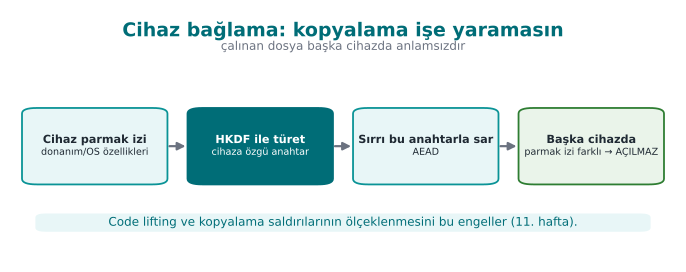

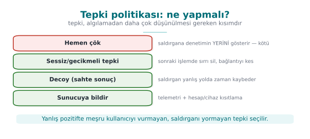

| Strateji | Ne yapar | Katalog |
| --- | --- | --- |
| **Fail-closed** | Şüphede işlemi reddet, güven deposuna düşme | — |
| **Sırrı sil** | Tamper anında değerli veriyi güvenle sil (`crypto_wipe`) | K15 |
| **Decoy (sahte) çıktı** | Çökmek yerine rastgele/sahte sonuç döndür; saldırgan gerçekle sahteyi ayıramaz | K16 |
| **Gecikmeli/örtük tepki** | Tepkiyi zaman/mesafe olarak tetikleyiciden ayır | K15 |
| **Cihaz/sürüm bağlama** | Sırrı cihaza/sürüme bağla; anahtarlar kopyalansa bile başka cihazda açılmaz | L1/L2 |
| **Telemetri/attestation** | Olayı sunucuya bildir; sunucu tarafı risk motoru karar versin | K5 |

**Cihaz bağlama** ([Hafta 3, §13.1](../week-3/cen429-week-3.md#131-cihaz-baglama)'in, Demo 9'un en iç kabuğu) burada
RASP'in bir parçası olur: değerli sır, cihaz parmak izinden ve sürüm dizesinden **HKDF** ile türetilen bir anahtarla
sarılır. Telefon klonlansa, dosyalar başka cihaza kopyalansa bile anahtar farklı çıkar ve sır **açılamaz**.

### 10.1 İşlenmiş örnek: cihaz parmak izinden anahtar türetmek (adım adım HKDF)

Demo 8'in "cihaz/sürüm bağlama" adımını **gerçek değerlerle** elle izleyelim. `crypto_hkdf_sha256`,
[Hafta 3'te](../week-3/cen429-week-3.md#7-ana-sirdan-anahtar-turetme-oturum-anahtarlari-ve-ileri-gizlilik) gördüğümüz
**RFC 5869 HKDF**'in iki adımını (Extract, Expand) uygular; burada `ikm` (girdi anahtar malzemesi)
cihaz parmak izi, `tuz` (salt) sürüm dizesi, `info` ise sabit bir bağlam etiketidir:

| Parametre | Değer (Demo 8'in `normal` senaryosu) |
| --- | --- |
| `ikm` (cihaz parmak izi) | `device=SIM-MODEL-A;serial=SN-0001;maker=DEMO` |
| `tuz` (sürüm) | `version=1.0.0` |
| `info` (bağlam etiketi) | `rasp-data-key` |

**Adım 1 — Extract.** Bu adım, uzunluğu ve rastgeleliği belirsiz olan `ikm`'i (cihaz parmak izi düz bir metindir,
kriptografik olarak "iyi dağılmış" olmayabilir) sabit uzunlukta, güvenli bir ara anahtara sıkıştırır; bu ara
anahtarın standart adı **PRK**'dir (Pseudo-Random Key — sözde rastgele anahtar): `PRK = HMAC-SHA256(anahtar =
tuz, veri = ikm)`. `openssl` ile aynı hesabı yapalım:

```bash title="HKDF Adim 1 - Extract (gercek openssl ciktisi)"
printf '%s' 'device=SIM-MODEL-A;serial=SN-0001;maker=DEMO' \
  | openssl dgst -sha256 -mac HMAC -macopt hexkey:$(printf '%s' 'version=1.0.0' | xxd -p -c 256) -binary \
  | xxd -p -c 256
```

```text
PRK (gercek cihaz) = cdbff87f64c1f39f778590faf7f1825b1c6caf759cfaa38af5c7b6d386eb00f4
```

**Adım 2 — Expand.** İhtiyacımız 32 bayt (tek blok) olduğu için tek bir HMAC yeter:
`T1 = HMAC-SHA256(anahtar = PRK, veri = info || 0x01)` (`0x01`, RFC 5869'daki blok sayacıdır). Bu `T1`, doğrudan
32 baytlık **veri anahtarı** olur:

```text
anahtar (gercek cihaz) = 3c8af67f5d09f3bf2ee6be6164a99e8027a73a208ca43599909a4f63d06d7499
```

**Adım 3 — aynı hesabı "başka cihaz" parmak iziyle tekrarlamak.** Yalnız seri numarasını `SN-0001`'den
`SN-9999`'a değiştirip (tıpkı bir saldırganın veri dosyasını başka bir telefona kopyalaması gibi) aynı iki adımı
tekrarlayalım:

```text
PRK (baska cihaz)      = ac53ee1fffc9fc61b5a2d3f874187855f40e6d3514d92a7df955d26e35638cdb
anahtar (baska cihaz)  = b68e35acc1ce116e1879a5dd6243e5c4a194821dbd234d15c2f0a22f462073d6
```

**Sonuç.** İki anahtar (`3c8af67f...` ve `b68e35ac...`) **hiçbir ortak baytları olmayacak kadar** farklıdır — tek
bir karakterlik seri numarası farkı, HKDF'in HMAC çekirdeği yüzünden (Bölüm 3.1'deki çığ etkisi) baştan sona
farklı bir anahtar üretir. Demo 8'in `other-device` senaryosunda gördüğümüz "device/version binding failed
(cloned?)" sonucu tam olarak budur: paketin şifrelendiği anahtar (`3c8af67f...`) ile çözmeye çalışılan anahtar
(`b68e35ac...`) **aynı olmadığı için** `AES-GCM`'in kimlik doğrulama etiketi tutmaz ve `crypto_gcm_decrypt`
başarısız döner — sır **hiçbir zaman açığa çıkmaz**, dosyalar başka cihaza kopyalansa bile.

### Demo 8 — RASP motoru: algılama + tepki + cihaz/sürüm bağlama (capstone)

!!! info "Demo 8 · `code/week-06/08-tamper-response` · haftanın capstone'u (K15/K16, L1/L2)"
    Önceki parçaları tek bir "öz koruma motoru"nda birleştirir: bir dizi kontrol çalışır; sır cihaz-bağlı bir anahtarla
    (HKDF + AES-GCM) sarılır; sonuç, ikili bir "temiz/tamper" kararı DEĞİL, **dört durumlu bir tepki politikasıdır**
    (`decide_response()`): `NORMAL` (0 başarısız kontrol) → `WARN` (1) → `DEGRADE` (2) → `LOCK` (3 veya daha fazla,
    YA DA cihaz/sürüm bağlama hiç tutmadıysa — bu her zaman doğrudan `LOCK`'a sıçrar).

```text title=".\demo.ps1 — gerçek çıktı (kısaltılmış)"
SCENARIO 1 - normal: 0 failed checks, device matches -> NORMAL
RESULT: NORMAL. The secret opened and is in use -> "PAYMENT-KEY-7C4A"
(the secret was safely wiped from memory after use)

SCENARIO 2 - warn: 1 failed check -> WARN (still opens, just logged)
RESULT: WARN. One weak signal is not worth degrading service over.
The secret still opened -> "PAYMENT-KEY-7C4A"
   Policy: event logged, monitoring tightened, no functionality lost.

SCENARIO 3 - degrade: 2 failed checks -> DEGRADE (wiped, redacted result)
RESULT: DEGRADE. Multiple signals -> full trust withdrawn.
   Policy: secret wiped; a REDACTED result is returned, the full
   operation is refused, but the application keeps running.
RESULT-VALUE: PAYM**** (redacted)

SCENARIO 4 - lock: 3 failed checks -> LOCK (wipe + decoy + flag)
RESULT: LOCK -> detection checks failed (tamper)
   A DECOY result was returned instead of crashing: 9be972a7...

SCENARIO 5 - other-device: checks pass, device key does not hold -> LOCK
RESULT: LOCK -> device/version binding failed (cloned?)
   A DECOY result was returned instead of crashing: 39f368f4...
```

Normal akışta kontroller geçti, cihaz doğruydu, sır açıldı, kullanıldı ve hemen silindi (`NORMAL`). Tek bir kontrol
başarısız olunca motor **hâlâ** sırrı açtı — ama olayı kaydetti (`WARN`); tek zayıf bir sinyal yüzünden meşru bir
kullanıcının deneyimini bozmaya değmez. İki kontrol başarısız olunca sır silindi ve yalnız **sansürlü** bir sonuç
döndü (`DEGRADE`) — uygulama tamamen durmadı, ama artık tam sonucu vermedi. Üç veya daha fazla kontrol başarısız
olduğunda YA DA paket **başka bir cihaza** taşındığında (kontroller geçse bile) motor tam olarak **kilitlendi**
(`LOCK`): sır silindi, decoy döndü, bayrak kaldırıldı. Bu, Hafta 3'teki **güvenlik kabuğunun** en iç katmanının
(cihaz bağlama) RASP'in kademeli tepki politikasıyla birleşmiş hâlidir.

Dört durumu bir **durum makinesi** olarak görselleştirelim: aşağıdaki animasyon, bir izleme zaman çizelgesindeki
her bağımsız çağrıyı (`decide_response()`'un gerçek karar tablosuyla) NORMAL/WARN/DEGRADE/LOCK durumlarından
birine sınıflandırır ve hangi durumun ne sıklıkta tetiklendiğini özetler:

<iframe class="dsanim" src="../anim/tamper-response-policy.html" title="Tepki politikası durum makinesi: uyar → düşür → kilitle" loading="lazy"></iframe>
<div class="dsanim-baski" markdown>

</div>

**escalating/noisy/edge** örneklerini deneyin; `escalating` örneği bir oturumun zamanla NORMAL'den LOCK'a nasıl
kötüleşebileceğini, `edge-all-device-mismatch` ise cihaz uyuşmazlığının kontrol sayısından **bağımsız olarak** her
zaman LOCK'a sıçradığını gösterir.

### 10.2 İşlenmiş örnek: aynı olaya üç farklı tepki, üç farklı sonuç

Bölüm 1.3'te aynı algılama sinyaline üç farklı tepkiyi kısaca karşılaştırmıştık; şimdi bunu Demo 8'in `LOCK`
senaryosu üzerinden **sonuç sonuç** karşılaştıralım. Olay: üç kontrol başarısız oldu (Demo 8 SCENARIO 4 — `lock`).
(Yalnızca bir kontrol başarısız olsaydı motor `WARN` durumuna geçer ve sırrı yine de açardı — bkz. Bölüm 10;
decoy yalnız `LOCK` durumunda devreye girer.)

| Tepki | Saldırgana görünen | Sır ne olur? | Meşru kullanıcıya etkisi | Değerlendirme |
| --- | --- | --- | --- | --- |
| **(a) Hemen çök** (`exit(1)` / segfault) | "Program çöktü" — hangi kontrolün tetiklendiğini, her kontrolü tek tek devre dışı bırakıp yeniden deneyerek birkaç turda bulur | Bellekte kalmışsa okunabilir | Nadir tetiklenirse fark etmez; sık tetiklenirse güvenilmez uygulama izlenimi verir | Saldırgana en çok bilgi veren, en kötü seçenek |
| **(b) Gecikmeli sessiz** (birkaç saniye/işlem sonra, sessizce oturumu sonlandır) | "Bir şey ters gitti ama ne zaman/nerede belli değil" — tetikleyici ile sonuç arasında zaman ve kod mesafesi var | Silinir (fail-closed) | Nadir görülen bir "oturum zaman aşımı" mesajı | Saldırganı yavaşlatır; makul bir orta seçenek |
| **(c) Decoy (sahte sonuç)** — Demo 8'in yaptığı | "İşlem başarılı görünüyor" — ama üretilen `decoy` sonucunun gerçek sırla hiçbir ilişkisi yok; saldırgan başarılı sandığı bir sonuçla vaktini boşa harcayabilir | Silinir, yerine rastgele veri döner | Hiç fark etmez (sır zaten meşru kullanıcı için doğru cihazda açılıyordu) | Saldırgana en az bilgi veren, en caydırıcı seçenek |

Üçü de **aynı algılama koduna** (Bölüm 1.3) dayanır; farkları yalnız **ne zaman ve ne** döndürdükleridir. Demo
8'in gerçek çıktısında (c) seçeneği `LOCK` durumunda uygulanır: "A DECOY result was returned instead of
crashing: 9be972a7...". Bu sayı
her çalıştırmada **farklıdır** (Alıştırma 7); sabit bir "HATA-0x1234" değeri olsaydı, saldırgan bu sabiti tanır
ve gerçek sonuçtan ayırt ederdi — decoy'un rastgele olması bu ayrımı da engeller.

!!! warning "Sık hata: tepkiyi test ortamında hiç değiştirmemek"
    Geliştirme sırasında hızlı geri bildirim almak için genelde (a) seçeneği (hemen çök, konsola hata yaz)
    kullanılır — doğaldır, hata ayıklamak kolaylaşır. Sık yapılan hata, bu davranışı **üretime aynen taşımaktır**.
    Kural: tepki politikasını derleme **yapılandırmasına** bağlayın (hata ayıklama derlemesinde ayrıntılı hata
    mesajı, üretim derlemesinde sessiz/decoy); üretim binary dosyasında hiçbir tespit mesajı **stdout/stderr'e**
    yazılmamalıdır — saldırgana ücretsiz bir hata ayıklama günlüğü vermeyin.

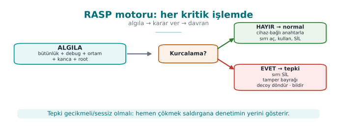

!!! success "Kural"
    Tepkiyi tetikleyiciden **ayırın**: hemen `exit()` yapmak saldırgana yol gösterir. Tamper anında değerli veriyi
    **silin**, çökmek yerine **decoy** döndürün, olayı **sunucuya** bildirin ve sırrı **cihaza/sürüme bağlayın**.
    Algılama + tepki + bağlama üçünü birlikte kurun.

!!! note "Sahada nasıl uygulanır? / Değerlendirici testi"
    Örnek mimaride ödeme anahtarı yalnız ödeme anında, cihaz-bağlı bir anahtardan açılır; tamper algılanınca anahtar
    imha edilir ve işlem sunucuya "şüpheli" olarak bildirilir. Değerlendirici tek bir kontrolü atlatıp **gerçek** sonuca
    ulaşmaya çalışır; korumaların **kombinasyon** hâlinde (tek tek değil, zincirleme) kırılması gerektiğini raporlar — bu,
    derinlemesine savunmanın çalıştığının kanıtıdır.

---

## 11. RASP'in sınırları ve etik


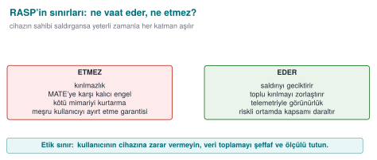

!!! failure "'RASP koydum, uygulamam kırılmaz.'"
    Cihazın sahibi saldırgansa (MATE), yeterli zamanla **her** istemci tarafı koruma atlatılabilir. RASP kırılmazlık
    sağlamaz; saldırıyı **pahalı, ölçeklenemez ve gürültülü** kılar. Nihai güvence her zaman **sunucu tarafındadır**
    (risk motoru, anomali tespiti, anahtar yenileme, işlem limitleri).

!!! failure "'Tek bir güçlü kontrol yeter.'"
    Her tek kontrolün bir karşı-tekniği vardır (yama, kanca, sahteleme). Güç **kombinasyondan** gelir: çok sayıda bağımsız
    sinyal + kontrol akışı sayacı + cihaz bağlama + sunucu attestation.

!!! failure "'Tespit edince hemen çökmeliyim.'"
    Hemen çökmek saldırgana hangi kontrolün tetiklediğini söyler. Tepkiyi **geciktirin ve örtün**: decoy döndürün, olayı
    sessizce bildirin, sırrı silin.

!!! failure "'Ortam VM ise kesinlikle saldırıdır.'"
    WSL2/Hyper-V/VBS yüzünden çoğu meşru makine hipervizör bildirir (Demo 3). Ortam sinyalleri **risk skoruna** katkıdır,
    ikili karar değil; yoksa gerçek kullanıcıları engellersiniz.

!!! failure "'RASP her yavaşlığa değer.'"
    RASP bir **maliyet** getirir (CPU, batarya, karmaşıklık, yanlış pozitif). Korumayı **varlığın değerine** göre
    ölçekleyin: her fonksiyona değil, kritik işlemlere (ödeme, anahtar kullanımı) koyun. Bu, [Hafta 1](../week-1/cen429-week-1.md)'deki "korumayı
    varlığa göre planla" ilkesidir.

!!! failure "'Risk skoru eşiğini bir kere ayarlayıp unuturum.'"
    Cihazlar, işletim sistemi sürümleri ve saldırı araçları zamanla değişir; bugün "kesin saldırgan" sayılan bir
    skor, altı ay sonra yaygınlaşan meşru bir yapılandırmayı (yeni bir sanallaştırma özelliği, yaygınlaşan bir
    geliştirici aracı) yanlışlıkla yakalayabilir. Eşiği ve ağırlıkları **telemetriyle** (Bölüm 10.2'deki sunucu
    bildirimi) düzenli gözden geçirin (Bölüm 5.1).

---

## 12. Dönem projesi: bu hafta

Bu hafta güvenlik kılavuzunuzun **RASP (öz koruma)** bölümlerini yazacak ve ilk RASP kontrolünüzü projenize
ekleyeceksiniz. Bu, **vize proje gösteriminin** ([Hafta 7](../week-7/cen429-week-7.md)) ve **Quiz-1'in** ([Hafta 8](../week-8/cen429-week-8.md), 1–6. haftalar) doğrudan konusudur;
ara proje rubriğinde **A2.4 RASP Teknikleri (15p → ÖÇ.3)**, final rubriğinde **F2.4 Binary Uygulama Korumaları
(15p → ÖÇ.3)** olarak puanlanır.

- [ ] **S10 — RASP algılama envanteri:** Projenizdeki her kritik işlem için hangi RASP kontrollerini (bütünlük,
      anti-debug, ortam, kanca, root, imza) uyguladığınızı, her birinin **neyi** algıladığını ve **nasıl atlatılabildiğini**
      tabloya dökün.
- [ ] **S10 — Tepki politikası:** Tamper algılandığında ne olacağını yazın: hangi sır silinir, fail-closed mı, decoy mu,
      cihaz/sürüm bağlama var mı, sunucuya bildirim var mı.

```markdown title="S10 RASP envanteri sablonu"
| Kontrol            | Neyi algilar        | Nasil atlatilir      | Guclendirme        |
| ------------------ | ------------------- | -------------------- | ------------------ |
| Butunluk (HMAC)    | Ikili yama          | Checker yamalanir    | Ortusen denetleyici|
| Anti-debug         | Hata ayiklayici     | ptrace no-op / yama  | Coklu sinyal+sayac |
| Kanca algilama     | LD_PRELOAD/Frida    | maps gizleme         | dladdr + maps      |
| Cihaz baglama      | Klonlama            | (cihaza bagli)       | HKDF + AES-GCM     |
```

```markdown title="S10 tepki politikasi sablonu"
| Tetikleyici        | Tepki                          | Bildirim         |
| ------------------ | ------------------------------ | ---------------- |
| butunluk basarisiz | sirri sil + decoy + fail-close | sunucuya olay    |
| cihaz tutmaz       | ac-ma, decoy                   | sunucuya olay    |
```

!!! tip "Kurs gereksinim aileleri"
    Bu bölümler şu gereksinim ailelerini karşılar: `CEN429-RA` (RASP algılama), `CEN429-RT` (tepki politikası),
    `CEN429-BD` (cihaz/sürüm bağlama), `CEN429-CF` (kontrol akışı bütünlüğü). Her gereksinim için S17 uyum matrisine bir
    satır ekleyin: gereksinim → durum → belge bölümü → kanıt (test/kod/demo).

---

## 13. Sınıf etkinlikleri

!!! example "Etkinlik 1 — Kancayı kendi elinizle kurun (15 dk, binary, WSL)"
    Demo 4'ü WSL'de çalıştırın. Sonra `fake_hook.c`'ye `getenv`'i de ekleyin (LD_PRELOAD'ı gizlemek için boş döndürsün).
    Yeniden derleyip çalıştırın: 1. sinyal (getenv) artık yakalıyor mu? 2. sinyal (`dladdr`) hâlâ yakalıyor mu? Bu neden
    daha sağlam?

!!! example "Etkinlik 2 — Tek `if`'i yamalayın (10 dk, tartışma)"
    Demo 5'te `skip` modu gerçek sonucu üretemedi. Şimdi düşünün: kritik işlem yalnız `if (kontroller_gecti) onayla;`
    olsaydı, saldırgan tek bir `jmp` ile ne yapardı? Anahtar zinciri neden bu yamayı işe yaramaz kılar?

!!! example "Etkinlik 3 — Yanlış pozitif avı (15 dk, 3-4 kişilik grup)"
    Demo 3'ü çalıştırın; muhtemelen "hipervizör VAR" diyecek. Bir uygulama sırf bunun için çalışmayı reddetseydi hangi
    meşru kullanıcılar mağdur olurdu? Root algılama (Demo 7) için de aynı soruyu tartışın. RASP kararları neden **risk
    skoru** olmalı, binary "çalış/çalışma" değil?

!!! example "Etkinlik 4 — Tepki politikası tasarımı (10 dk, bireysel)"
    Bir mobil bankacılık uygulaması root algıladı. Üç farklı tepki tasarlayın: (a) hemen çök, (b) işlemi reddet ve
    kullanıcıyı bilgilendir, (c) sessizce çalışmaya devam et ama sunucuya bildir ve işlem limitini düşür. Hangisi
    saldırgana **en az** bilgi verir? Hangisi meşru kullanıcıya en az zarar verir?

---

## 14. Kod okuma alıştırmaları

!!! question "Okuma 1 — Bu anti-debug güvenli mi?"
    ```c
    if (IsDebuggerPresent()) {
        exit(1);
    }
    do_payment();
    ```
    ??? success "Cevap"
        **Hayır.** (1) Tek bir sinyale bağlı; (2) sonuç doğrudan `exit()` — saldırgan `IsDebuggerPresent`'in dönüşünü ya
        da bu `if`'i yamalar; (3) hemen çıkmak hangi kontrolün tetiklediğini söyler. Düzeltme: birden çok sinyal + kontrol
        akışı sayacı + gecikmeli/örtük tepki (Demo 2, 5, 8).

!!! question "Okuma 2 — Bu bütünlük denetimi neden zayıf?"
    ```c
    uint32_t crc = crc32(code, code_len);
    if (crc != EXPECTED_CRC) tamper();
    ```
    ??? success "Cevap"
        **CRC32 kriptografik değildir**: saldırgan kodu yamalayıp CRC'yi eşleyecek şekilde kolayca ayarlar. Ayrıca tek bir
        denetleyici var (kendisi yamalanabilir) ve sonuç bir davranışa bağlı değil. Düzeltme: HMAC/imza + örtüşen
        denetleyiciler + veri bağımlılığı (Demo 1).

!!! question "Okuma 3 — Bu kanca algılama neye kanıyor?"
    ```c
    if (getenv("LD_PRELOAD") == NULL) printf("temiz\n");
    ```
    ??? success "Cevap"
        `getenv`'in kendisi kancalanıp `NULL` döndürebilir; ya da saldırgan `LD_PRELOAD` yerine `ptrace`/PLT kancası
        kullanır. Düzeltme: fonksiyonun **kaynağını** doğrula (`dlsym`+`dladdr`), `/proc/self/maps` tara, birden çok
        sinyal kullan (Demo 4).

!!! question "Okuma 4 — Bu ortam algılama kararı neden riskli?"
    ```c
    unsigned int ecx;
    __cpuid_ecx(1, &ecx);
    if (ecx & (1u << 31)) {
        /* hypervisor bit set */
        exit(1);           /* "analysis environment, refuse to run" */
    }
    ```
    ??? success "Cevap"
        Hipervizör biti tek başına **kanıt değildir** (Bölüm 5, Demo 3): WSL2, Hyper-V ve sanallaştırma tabanlı
        güvenlik (VBS) yüzünden birçok **meşru** Windows makinesi de bu biti set eder. Bu kod, sırf bir
        hipervizör gördüğü için milyonlarca gerçek kullanıcıyı engelleyebilir — klasik bir yanlış pozitif.
        Düzeltme: bu sinyali tek başına karar vermek yerine Bölüm 5.1'deki gibi bir **risk skoruna** ekleyin ve
        kararı diğer sinyallerle (satıcı imzası, zamanlama, hata ayıklayıcı) birlikte, bir **eşiğe** göre verin.

---

## 15. Kendi başına çalış

Bu alıştırmalar not verilmez; pekiştirme içindir. Hepsi kendi bilgisayarınızda, `code/week-06` demoları üzerinde yapılır.

??? question "Alıştırma 1 — Kolay: Farklı baytı yamalayın"
    Demo 1'de kopyanın **farklı** bir ofset baytını değiştirin. HMAC yine değişiyor mu? Neden (çığ etkisi)?

??? question "Alıştırma 2 — Kolay: Altın değeri kurcalayın"
    Demo 1'de `output/golden.hmac` dosyasını saldırgan gibi düzenleyin. Denetim artık neyi yakalayamaz? Bu, "altın değer
    nerede saklanmalı?" sorusunu neden önemli kılar?

??? question "Alıştırma 3 — Orta: gdb altında Demo 2"
    Demo 2'yi `strace -f ./bin/linux/antidebug` ile çalıştırın. TracerPid ne oluyor? Ana sürecin adı ne? Hangi sinyaller
    tetikleniyor?

??? question "Alıştırma 4 — Orta: getenv'i de kancalayın"
    Demo 4'ün `fake_hook.c`'sine `getenv` ekleyin. Hangi sinyal kör oluyor, hangisi hâlâ yakalıyor? (Etkinlik 1'in kod
    hâli.)

??? question "Alıştırma 5 — Orta: Zincire beşinci kontrol"
    Demo 5'te `STAGE_COUNT`'yı 5 yapın ve iki kontrol noktası daha ekleyin. Zincir nasıl değişir? Normal akış hâlâ onaylanıyor
    mu?

??? question "Alıştırma 6 — Orta: Karşılıklı doğrulama"
    Demo 6'yı genişletin: modül dosyası, native'in (kendi ikilinizin) HMAC'ini de taşısın; native modülü, modül de
    native'i doğrulasın (K6). Saldırganın işi neden zorlaştı?

??? question "Alıştırma 7 — Zor: Decoy'u ölçün"
    Demo 8'de tamper senaryosunda dönen decoy'u iki kez çalıştırıp karşılaştırın. Aynı mı, farklı mı? Neden decoy'un
    **rastgele** (her seferinde farklı) olması, sabit bir "hata değeri"nden daha iyidir?

??? question "Alıştırma 8 — Zor: Cihaz bağlamayı test edin"
    Demo 8'de `other-device` modunda sırrı açmanın bir yolu var mı? Cihaz parmak izini değiştirmeden anahtarı türetmek
    mümkün mü? Bu, çalınan bir veri dosyasını başka telefonda neden işe yaramaz kılar?

??? question "Alıştırma 9 — Zor: Timing eşiği"
    Demo 3'ün zamanlama ölçümünü Demo 2'deki gibi `gdb` altında (tek adımlı) çalıştırın. Süre nasıl değişiyor? Güvenilir
    bir eşik koymak neden zordur (makineye/yüke bağımlılık)?

??? question "Alıştırma 10 — Orta: RASP'i varlığa göre ölçekleyin"
    Projenizde hangi işlemler RASP'i hak ediyor (ödeme, anahtar kullanımı) ve hangileri gereksiz (yerel ayar okuma)?
    Neden her fonksiyona RASP koymak kötü bir fikirdir?

??? question "Alıştırma 11 — Orta: Kendi risk skorunuzu kurun (Bölüm 5.1)"
    Demo 3, Demo 2 ve Demo 7'nin ürettiği sinyalleri (hipervizör biti, TracerPid, root göstergesi) bir araya
    getirip Bölüm 5.1'deki gibi bir ağırlıklı toplam yazın. Kendi bilgisayarınızda (temiz) skor kaç çıkıyor?
    `gdb` altında çalıştırırsanız kaça çıkıyor? Bankacılık uygulaması için önerdiğiniz eşik kaç olurdu, neden?

??? question "Alıştırma 12 — Zor: HKDF'i elle tekrar hesaplayın (Bölüm 10.1)"
    Bölüm 10.1'deki `openssl` komutlarını kendi makinenizde çalıştırın; aynı `PRK` ve anahtar değerlerini elde
    ediyor musunuz? Şimdi `VERSION_STRING` dizesini (`version=1.0.0` yerine `version=1.0.1`) değiştirip anahtarı tekrar
    hesaplayın. Bu, bir sürüm yükseltmesinin eski verideki sırları neden "kilitlediğini" nasıl açıklar?

---

## 16. Kendini sınama

??? question "1. RASP nedir? WAF'tan farkı?"
    Uygulamanın içine gömülü, çalışma zamanında kendini izleyen koruma. WAF uygulamanın **önünde** gelen istekleri süzer;
    RASP uygulamanın **içinde** kendi bütünlüğünü, belleğini ve ortamını izler.

??? question "2. Algılama → savunma → caydırma üçlüsünü açıklayın."
    Algılama: bir şeyin yanlış olduğunu anlamak (yama, debugger, kanca, root). Savunma: anlamlı yanıt (fail-closed, sil,
    cihaza bağla). Caydırma: saldırıyı pahalılaştırmak (decoy, gecikme, telemetri).

??? question "3. MATE saldırgan modeli nedir?"
    "Man-At-The-End": saldırgan uygulamanın çalıştığı uç noktanın sahibidir; belleği okuyabilir, kodu değiştirebilir,
    hata ayıklayıcı bağlayabilir. Beyaz kutu ([Hafta 11](../week-11/cen429-week-11.md)) ile aynı varsayım.

??? question "4. Self-hashing nedir? Neden CRC değil HMAC?"
    Uygulamanın kendi kod/dosyasının özetini çalışma zamanında hesaplayıp altın değerle karşılaştırması. CRC
    kriptografik değildir (saldırgan eşler); HMAC için gizli anahtar gerekir.

??? question "5. Bütünlük denetimi tek başına neden yetmez?"
    Denetleyicinin kendisi de yamalanabilir. Çözüm: örtüşen denetleyiciler, sonucu veri bağımlılığı yapmak, sunucu
    attestation.

??? question "6. Linux'ta ve Windows'ta bir hata ayıklayıcı nasıl algılanır?"
    Linux: `/proc/self/status` TracerPid (>0). Windows: IsDebuggerPresent (PEB BeingDebugged), CheckRemoteDebuggerPresent,
    PEB NtGlobalFlag.

??? question "7. Hipervizör biti neden zayıf bir sinyaldir?"
    WSL2/Hyper-V/VBS yüzünden çoğu meşru makine hipervizör bildirir; tek başına "analiz ortamı" demek değildir. Yanlış
    pozitif riski yüksek.

??? question "8. LD_PRELOAD kancası nasıl algılanır?"
    Kritik fonksiyonun **kaynağını** doğrulayarak: `dlsym(RTLD_DEFAULT)`+`dladdr` ile fonksiyonu sağlayan `.so`'ya bak;
    libc/vDSO/ld dışı bir modülse kanca vardır. `getenv(LD_PRELOAD)` tek başına zayıftır.

??? question "9. Root/jailbreak göstergeleri neden 'kanıt değil, sinyal'dir?"
    Kolayca sahtelenir (Magisk Hide); ayrıca meşru root kullanıcıları engelleyebilir. Modern yol: platform attestation
    (sunucu tarafı, nonce'lu).

??? question "10. APK imza doğrulaması neyi engeller? C'deki karşılığı?"
    Yeniden paketlemeyi (repackaging): değiştirilmiş uygulama orijinal imzayı taşıyamaz. C'de karşılığı: bir bileşeni
    yüklemeden önce HMAC/imza ile doğrulamak (Demo 6).

??? question "11. Kontrol akışı sayacı neyi çözer?"
    Tek bir `if` kontrolünün yamalanıp atlanmasını. Kritik işlem doğru sonucu ancak bütün kontrollerden sırayla
    geçilmişse (doğru anahtar zinciri) üretir.

??? question "12. İyi bir tamper tepkisi neden hemen `exit()` değildir?"
    Hemen çökmek saldırgana hangi kontrolün tetiklediğini söyler. İyi tepki: sil + decoy + gecikmeli/örtük + sunucuya
    bildirim.

??? question "13. Decoy (sahte) çıktı neden çökmekten iyidir?"
    Saldırgan gerçek ile sahteyi kolayca ayırt edemez; hangi kontrolün tetiklediğini gizler; veri sızmaz.

??? question "14. Cihaz bağlama RASP'e ne katar?"
    Anahtarlar/dosyalar kopyalansa bile başka cihazda açılamaz (klonlamaya karşı). HKDF(cihaz parmak izi)+AES-GCM ile
    kurulur; [Hafta 3](../week-3/cen429-week-3.md) güvenlik kabuğunun en iç katmanı.

??? question "15. RASP kırılmaz mıdır? Öyleyse neden kullanılır?"
    Cihazın sahibi saldırgansa nihai olarak kırılabilir. Amaç kırılmazlık değil; saldırıyı pahalı, ölçeklenemez ve
    gürültülü kılmak + sunucu tarafı denetimle birleştirmek.

??? question "16. RASP'i her fonksiyona koymak neden kötü fikir?"
    Maliyet (CPU, batarya, yanlış pozitif, karmaşıklık) getirir. Korumayı varlığın değerine göre ölçekleyin: kritik
    işlemlere (ödeme, anahtar) koyun.

??? question "17. Ortam algılamada risk skoru yaklaşımı nedir, neden ikili karardan daha iyidir?"
    Her sinyale bir ağırlık verilir, ağırlıklar toplanır ve bir eşikle karşılaştırılır (Bölüm 5.1). İkili karar
    (tek sinyalle çalış/çalışma) tek bir zayıf sinyalle (ör. hipervizör biti) meşru kullanıcıları engeller; risk
    skoru birden çok bağımsız sinyalin birlikte görünmesini ister.

??? question "18. TracerPid alanı nereden okunur ve neyi temsil eder?"
    Linux'ta `/proc/self/status` dosyasındaki bir satırdır; süreci `ptrace()` ile izleyen sürecin PID'ini tutar.
    `0` ise izleyen yok; `>0` ise o PID süreci izliyor demektir (Bölüm 4.1).

??? question "19. `dlsym` ve `dladdr` RASP'te birlikte nasıl kullanılır?"
    `dlsym(RTLD_DEFAULT, ad)` bir sembolün çalışan süreçteki **adresini** bulur; `dladdr` o adresi hangi `.so`
    dosyasının sağladığını söyler. Beklenen kütüphane (libc/vDSO/ld) yerine yabancı bir `.so` çıkarsa kanca
    vardır (Bölüm 6.1).

??? question "20. HKDF'in Extract ve Expand adımları cihaz bağlamada nasıl kullanılır?"
    Extract: `PRK = HMAC(anahtar=sürüm/tuz, veri=cihaz parmak izi)`. Expand: `anahtar = HMAC(PRK, info || sayaç)`.
    Farklı bir cihaz parmak izi tamamen farklı bir `PRK` ve dolayısıyla farklı bir anahtar üretir; sır başka
    cihazda açılamaz (Bölüm 10.1).

??? question "21. Aynı tamper olayına üç farklı tepki (hemen çök, gecikmeli sessiz, decoy) arasındaki temel fark nedir?"
    Saldırgana verdikleri bilgi miktarı ve zamanlaması: hemen çökmek en çok bilgi verir (hangi kontrolün
    tetiklendiğini gösterir), gecikmeli sessiz tepki bunu zaman/mesafe olarak bulanıklaştırır, decoy ise
    saldırgana "başarılı" görünen ama işe yaramaz bir sonuç vererek en az bilgi verir (Bölüm 10.2).

??? question "22. `ProtectedCounter` yapısındaki gölge kopya ve özet alanları neden ayrı tutulur?"
    Saldırgan yalnız `value` alanını bellekte değiştirirse, `shadow` (maskelenmiş kopya) ve `mac` (kısa MAC) eski
    değerlerle tutarsız kalır; okuma fonksiyonu bu tutarsızlığı yakalar (Bölüm 7.1).

??? question "23. Kontrol akışı sayacındaki `acc` zincirinin çığ etkisiyle ilişkisi nedir?"
    Her aşamada `acc`, bir önceki `acc`'yi anahtar olarak kullanan bir HMAC ile güncellenir. Bir aşama atlanır ya
    da sırası değişirse, HMAC'in çığ etkisi yüzünden sonuç **tamamen farklı** bir `acc`/anahtar üretir; tek bir
    `jmp` yaması hangi kombinasyonu denerse denesin gerçek sonuca ulaşamaz (Bölüm 9.1).

??? question "24. Bir ürünün risk iştahı (risk appetite) tepki eşiğini nasıl belirler?"
    Yanlış pozitifin maliyeti yüksekse (bankacılık — işlem tamamlanamaz, para kaybı riski) eşik düşük tutulur:
    şüphede reddet. Yanlış negatifin maliyeti düşükse (sadakat uygulaması) eşik yüksek tutulur: nadiren reddet
    (Bölüm 5.1).

??? question "25. Root göstergesini tek bir `if` ile "reddet" yapmanın sakıncası nedir?"
    Gerçek saldırganı yakalamaz (ipuçlarını zaten gizlemiştir) ama meşru biçimde root'lamış sıradan kullanıcıyı
    cezalandırır. Kural: göstergeyi bir risk skoruna ekleyin, kararı eşiğe bırakın (Bölüm 8.1.1).

??? question "26. Üretim binary dosyasında tespit mesajlarının `stdout`/`stderr`'e yazılmaması neden önemlidir?"
    Yazılırsa saldırgana ücretsiz bir hata ayıklama günlüğü/ipucu verilmiş olur — hangi kontrolün ne zaman
    tetiklendiğini doğrudan gösterir. Tepki politikası derleme yapılandırmasına bağlanmalı, üretimde sessiz
    kalmalıdır (Bölüm 10.2).

---

## 17. Quiz-1 tarzı örnek sorular

!!! note "Quiz-1 (8. hafta) 1–6. haftaları kapsar; bu tarz kısa soru + kod okuma içerir"
    1. (Çoktan seçmeli) Aşağıdakilerden hangisi bir **yamayı (patch)** çalışma zamanında algılar?
       a) ECB · b) **HMAC ile self-hashing** · c) PBKDF2 · d) TOFU
    2. (Doğru/Yanlış) "Hipervizör biti set ise cihaz kesinlikle bir analiz ortamıdır." → **Yanlış** (WSL2/VBS meşru
       makinelerde de set eder).
    3. (Kısa cevap) `if (IsDebuggerPresent()) exit(1);` neden zayıftır? → Tek sinyal + doğrudan `exit()`; yamalanır ve
       tetikleyiciyi ele verir.
    4. (Kod okuma) Bir kritik işlem yalnız `if (checks_ok)` ile korunuyorsa saldırgan onu nasıl atlar ve **kontrol akışı
       sayacı** bunu neden engeller? → Tek `jmp` yaması; sayaç/anahtar zinciri sonucu veri bağımlılığı yapar.
    5. (Eşleştirme) TracerPid ↔ anti-debug · dladdr ↔ kanca algılama · HKDF(cihaz) ↔ cihaz bağlama · decoy ↔ tamper
       tepkisi · APK imzası ↔ repackaging.
    6. (Kısa cevap) Bir ortam algılama denetimi "hipervizör VAR" derse, uygulama işlemi doğrudan reddetmelidir/
       reddetmemelidir? Neden? → Reddetmemeli; bu tek başına zayıf bir sinyaldir (WSL2/VBS), bir **risk skoruna**
       katkı olarak kullanılmalıdır (Bölüm 5.1).
    7. (Doğru/Yanlış) "HMAC ile bütünlük denetimi tek başına, checker'ın kendisinin yamalanmasına karşı korur." →
       **Yanlış**; bu yüzden örtüşen denetleyiciler ve sonucu veri bağımlılığı yapmak gerekir (Bölüm 3).
    8. (Kısa cevap) Cihaz bağlamada `VERSION_STRING` (sürüm) dizesi neden HKDF'e `tuz` (salt) olarak veriliyor? → Sürüm
       değişince türetilen anahtar da değişsin diye; bu, eski sürümdeki bir zafiyetle üretilmiş veriyi yeni
       sürümde otomatik olarak "kilitler" (Bölüm 10.1, Alıştırma 12).

---

## 18. Kaynaklar ve ileri okuma

**Ders kitabı** — J. Viega, M. Messier, *Secure Programming Cookbook for C and C++*, O'Reilly, 2003:

- Tarif 12.2 (Detecting Modification — CRC → HMAC/imza olarak güncellendi)
- Tarif 12.12–12.15 (Detecting Debuggers — Unix/Windows; SoftICE → modern araçlar)
- Bölüm 12 (Anti-Tampering) genel olarak bu haftanın ve [Hafta 9](../week-9/cen429-week-9.md)'un çekirdeğidir.

**Açık standartlar ve kaynaklar**

- OWASP MASVS-RESILIENCE ve MASTG (mobil dayanıklılık: anti-debug, anti-tamper, root/emülatör algılama, imza doğrulama).
- Android APK Signature Scheme v2/v3 (yeniden paketlemeye karşı imza); Play Integrity / donanım destekli attestation.
- MITRE CWE: CWE-693 (Protection Mechanism Failure), CWE-919 (mobil zayıflıklar), CWE-925 (uygunsuz doğrulama).
- SEI CERT C: ENV ve FIO kuralları (ortam ve dosya güvenli kullanımı).

??? abstract "Sözlük"
    | Terim | Türkçe | Kısa tanım |
    | --- | --- | --- |
    | RASP | Çalışma zamanı öz koruması | Uygulamanın içine gömülü, çalışırken kendini koruyan mekanizmalar |
    | Detection / Defense / Deterrence | Algılama / Savunma / Caydırma | RASP'in üç işlevi |
    | MATE | Uçtaki saldırgan | Cihazın sahibi olan saldırgan (beyaz kutu) |
    | Self-hashing | Kendi kodunun özetini denetleme | Uygulamanın kendi kod/dosyasını çalışma zamanında özetleyip doğrulaması |
    | Tamper | Kurcalama | Binary/veri üzerinde yetkisiz değişiklik |
    | Patch (yama) | Yama | Binary kodu değiştirerek davranışı değiştirme |
    | Anti-debug | Hata ayıklayıcı karşıtı | Bağlı hata ayıklayıcıyı algılama/engelleme |
    | TracerPid | İzleyen süreç kimliği | Linux'ta bir süreci `ptrace` ile izleyen sürecin PID'i |
    | Hooking (kanca) | Kanca takma | Bir fonksiyonu kendi sürümüyle değiştirme (LD_PRELOAD, PLT/GOT, inline) |
    | DBI / Frida | Dinamik binary enstrümantasyon | Çalışan programa kod enjekte edip davranışını değiştirme |
    | Emulator / VM detection | Emülatör/VM algılama | Analiz ortamını ipuçlarından sezme (CPUID, timing) |
    | Root / jailbreak | Kök erişimi | Cihazın güvenlik kısıtlarının kaldırılmış olması |
    | Attestation | Platform doğrulaması | Cihaz/uygulama bütünlüğünün (çoğu zaman sunucu tarafı) kanıtı |
    | Repackaging | Yeniden paketleme | Uygulamayı açıp değiştirip yeniden paketleme |
    | Control-flow integrity | Kontrol akışı bütünlüğü | Kritik akışın atlanamaz/sıralı olmasını sağlama (sayaç/anahtar zinciri) |
    | Tamper response | Kurcalama tepkisi | Tamper anındaki politika (sil, fail-closed, decoy) |
    | Decoy | Sahte çıktı | Çökmek yerine döndürülen, gerçekten ayırt edilemez sahte sonuç |
    | Device / version binding | Cihaz / sürüm bağlama | Anahtarı belirli cihaza/sürüme bağlayıp başka yerde açılamaz kılma |
    | Fail-closed | Hata durumunda reddetme | Şüphede işlemi reddetme (güven deposuna düşmeme) |
    | Risk skoru / eşik | Risk puanı / sınır değer | Birden çok zayıf sinyalin ağırlıklı toplamı; karar bu toplamın bir eşiği geçip geçmediğine bakar |
    | Risk iştahı (risk appetite) | Risk toleransı | Ürünün yanlış pozitif ile yanlış negatif arasında kabul ettiği denge |
    | `dlsym` / `dladdr` | Sembol çözme / adres bilgisi | Bir fonksiyon adının bellek adresini bulma / bir adresin hangi `.so`'dan geldiğini bulma |
    | vDSO | Sanal dinamik paylaşımlı nesne | Çekirdeğin süreç belleğine kendiliğinden eklediği, sistem çağrısı yapmadan hızlı okuma sağlayan sanal `.so` |
    | PRK | Sözde rastgele anahtar | HKDF'in Extract adımından çıkan, Expand adımına girdi olan ara anahtar |
    | HKDF Extract / Expand | Sıkıştırma / genişletme | HKDF'in iki adımı: düzensiz girdiyi PRK'ya sıkıştırma, PRK'dan istenen uzunlukta anahtar türetme |
    | Çığ etkisi (avalanche effect) | Çığ etkisi | Girdide tek bir bit değişince çıktının ortalama yarısının değişmesi; kriptografik özet/MAC'in temel özelliği |
    | `PR_SET_DUMPABLE` | Dökülebilirlik bayrağı | Linux'ta bir sürecin başka bir süreç tarafından `ptrace` ile izlenip izlenemeyeceğini ve çekirdek dökümü üretip üretmeyeceğini kontrol eden bayrak |

!!! info "Bir sonraki hafta"
    **[7. hafta](../week-7/cen429-week-7.md) — Ara proje gösterimleri.** Bu haftaki RASP kontrollerinizi (bütünlük denetimi, hata ayıklayıcı/ortam/kanca
    algılama, kontrol akışı sayacı, tepki politikası) projenizde canlı göstereceksiniz. **[8. hafta](../week-8/cen429-week-8.md)**, 1–6. haftaları
    kapsayan **Quiz-1**'dir. Ardından **9. hafta — Gelişmiş gizleme ve çeşitlendirme**, bu haftanın hata ayıklayıcı/ortam
    algılama ve "gizleme/caydırma kırılmazlık değildir" fikirlerini kod gizleme tarafında derinleştirerek sürer.
