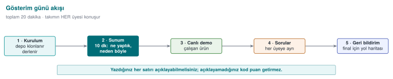
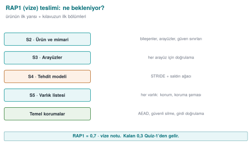
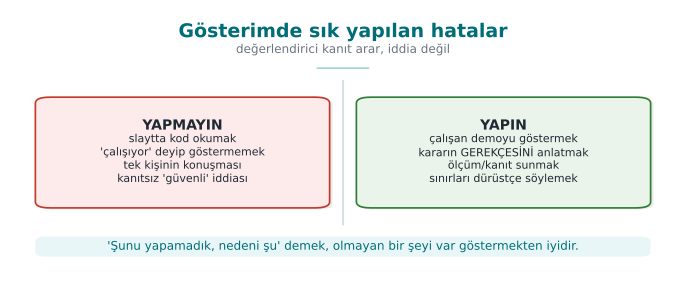
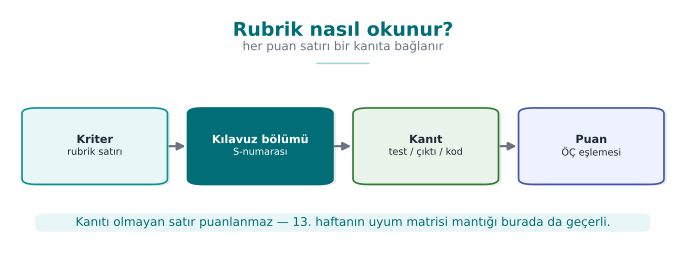

# Hafta 7 — Ara Proje Gösterimleri

| | |
| --- | --- |
| **Tarih** | 30.10.2026 |
| **Öğrenme çıktıları** | ÖÇ.1, 2, 3, 5, 7 |
| **Süre** | 3 saat |

<!-- materyal:basla -->

[:material-file-pdf-box: Ders notu (PDF)](cen429-week-7-ders-notu.pdf){ .md-button download="cen429-week-7-ders-notu.pdf" }
[:material-file-word-box: Ders notu (DOCX)](cen429-week-7-ders-notu.docx){ .md-button download="cen429-week-7-ders-notu.docx" }
[:material-presentation: Sunum (PDF)](cen429-week-7-sunum.pdf){ .md-button download="cen429-week-7-sunum.pdf" }
[:material-microsoft-powerpoint: Sunum (PPTX)](cen429-week-7-sunum.pptx){ .md-button download="cen429-week-7-sunum.pptx" }
[:material-language-html5: Sunum (HTML, çevrimdışı)](cen429-week-7-sunum.html){ .md-button download="cen429-week-7-sunum.html" }
[:material-folder-zip: Tümünü indir (ZIP)](cen429-week-7-materyal.zip){ .md-button download="cen429-week-7-materyal.zip" }
[:material-fullscreen: Sunumu tam ekran aç](cen429-week-7-sunum.html){ .md-button .md-button--primary target=_blank }

<iframe src="../cen429-week-7-sunum.html" title="Hafta 7 — Ara Proje Gösterimleri" loading="lazy" allowfullscreen></iframe>

Sunumun içine tıklayıp ok tuşlarıyla ilerleyin; tam ekran için sunumun sağ altındaki düğmeyi ya da yukarıdaki "Sunumu tam ekran aç" bağlantısını kullanın.

<!-- materyal:bitis -->

!!! abstract "Bu hafta ne oluyor?"
    Bu hafta ders anlatılmaz. Dönem projesinin **ilk kontrolü (RAP1)** yapılır: her takım ara raporunu (güvenlik
    kılavuzunun vize bölümleri) teslim eder ve çalışan uygulamasını gösterir. RAP1, vize notunun **%60'ıdır**; kalan
    %40 gelecek haftaki Quiz-1'dir (`Not_Vize = 0,6·RAP1 + 0,4·QUIZ1`). Ayrıntılı rubrik (kriterler, puanlar, başarı
    düzeyleri) dersin proje rehberindedir; bu sayfa, gösterime hazırlanmanız için bir kontrol listesidir.

!!! warning "Teslim ve süre kuralları"
    Geç teslim kabul edilmez (izlence, bölüm G). Gösterim sırası, takım başına süre ve teslim saati ders sınıfında
    duyurulur. Beklenmedik bir durum yaşarsanız öğretim üyesine **gösterimden önce** haber verin.

---

## 1. Vize kontrolü neyi ölçer?

İzlencedeki vize kontrolü rubriğinin beş kriteri ve güvenlik kılavuzunuzda karşılık gelen bölümler:

| Kriter | Öğrenme çıktısı | Kılavuzda nerede? | Hangi haftalar? |
| --- | --- | --- | --- |
| **Güvenlik analizi** | ÖÇ.1 | S2 ürün genel bakışı · S3 mimari ve arayüz tablosu · S4 tehdit ve saldırgan modeli | [1](../week-1/cen429-week-1.md#21-donem-projesi-bu-hafta), [2](../week-2/cen429-week-2.md#18-donem-projesi-bu-hafta-s4) |
| **Veri güvenliği** | ÖÇ.2 | S5 varlık listesi (taslak) · S7 veri güvenliği ve güvenlik kabuğu matrisi | [1](../week-1/cen429-week-1.md#21-donem-projesi-bu-hafta), [3](../week-3/cen429-week-3.md#17-donem-projesi-bu-hafta) |
| **C/C++ kod sağlamlaştırma (hardening) ve RASP** | ÖÇ.3 | S9 kod sağlamlaştırma (temel) · S10 RASP ve tepki politikası | [4](../week-4/cen429-week-4.md#17-donem-projesi-bu-hafta), [6](../week-6/cen429-week-6.md#12-donem-projesi-bu-hafta) |
| **Proje yönetimi** | ÖÇ.5 | S13 geliştirme ortamı ve süreci, SBOM, değişiklik yönetimi · GitHub deposu ve plan | [1](../week-1/cen429-week-1.md#21-donem-projesi-bu-hafta), [5](../week-5/cen429-week-5.md#15-donem-projesi-bu-hafta) |
| **Ara rapor** | ÖÇ.7 | Vize sütunundaki bütün bölümler; belge düzeni, kaynaklar | Tümü |

### Ara raporda bulunması gereken bölümler

Güvenlik kılavuzunuzun bölüm yapısı dönem boyunca aynıdır; vize kontrolünde bir kısmı tam, bir kısmı taslak olarak
beklenir:

| No | Bölüm | Vize kontrolünde |
| --- | --- | --- |
| S0 | Kapak, belge kontrolü, sürüm geçmişi | Tam |
| S1 | Kapsam, hedef kitle, kısaltmalar, kaynaklar | Taslak |
| S2 | Ürün genel bakışı | Tam |
| S3 | Mimari ve arayüz tablosu, güven sınırları | Tam |
| S4 | Tehdit modeli ve saldırgan modeli (STRIDE, saldırı tablosu, CWE) | Tam |
| S5 | Varlık listesi ve varlık koruma şeması (C/I/I+) | Taslak |
| S7 | Veri güvenliği (beklemede/kullanımda/aktarımda) + güvenlik kabuğu matrisi | Tam |
| S9 | Kod sağlamlaştırma (derleyici sertleştirmesi, gizleme) | Temel |
| S10 | RASP + tepki politikası | Tam |
| S12 | Raporlama ve günlükleme politikası | Kısa |
| S13 | Geliştirme ortamı ve süreci, SBOM, değişiklik yönetimi | Tam |
| S16 | Güvenlik testi ve doğrulama | Plan |
| S17 | Gereksinim uyum matrisi | Taslak |

S6, S8, S11, S14 ve S15 final kontrolüne kalır.

---

## 2. Hafta hafta hazırlık kontrol listesi

Aşağıdaki liste, ilk altı haftanın "Dönem projesi: bu hafta" bölümlerindeki görevleri tek yerde toplar. Her maddeyi
kılavuzunuzda ve deponuzda gösterebiliyor olmalısınız.

??? success "1. hafta — Proje planı ve ilk bölümler"
    Kaynak: [Hafta 1 · Dönem projesi](../week-1/cen429-week-1.md#21-donem-projesi-bu-hafta)

    - [ ] GitHub deposu, README, proje planı (iş paketleri, takvim, görev dağılımı) onaylatıldı.
    - [ ] S0 kapak ve sürüm geçmişi.
    - [ ] S2 ürün genel bakışı: uygulama ne yapıyor, kim kullanıyor?
    - [ ] S3 mimari şema ve **arayüz tablosu** (her arayüz için uçlar, kimlik doğrulama, gizlilik/bütünlük).
    - [ ] S4 saldırgan modeli, STRIDE tablosu, en az bir **saldırı ağacı**.
    - [ ] S5 varlık listesi taslağı: konum, oluşma → silinme, C/I/I+.

??? success "2. hafta — Tehdit tablosu ve sınıflandırma"
    Kaynak: [Hafta 2 · Dönem projesi](../week-2/cen429-week-2.md#18-donem-projesi-bu-hafta-s4)

    - [ ] S4 tehdit tablosunda her tehdit bir **CWE** ile eşleşiyor ve **CVSS v3.1** vektörü var.
    - [ ] Saldırı ağacı bir aracın girdi biçiminde ya da çizim olarak ekli.
    - [ ] Tehditler arayüz tablosundaki satırlardan çıkarıldı; her varlık en az bir tehditte geçiyor.

??? success "3. hafta — Veri güvenliği"
    Kaynak: [Hafta 3 · Dönem projesi](../week-3/cen429-week-3.md#17-donem-projesi-bu-hafta)

    - [ ] S7 aktarımda, beklemede ve kullanımda veri için hangi algoritma, hangi anahtar, hangi bağlama?
    - [ ] En hassas varlık için **güvenlik kabuğu matrisi** (aşama × kabuk).
    - [ ] Rastgele değerler CSPRNG'den; AEAD etiketi açık metin kullanılmadan önce doğrulanıyor.
    - [ ] TLS kullanılıyorsa doğrulama + ana makine adı denetimi (+ varsa sabitleme) gösterilebiliyor.

??? success "4. hafta — C/C++ sağlamlaştırma"
    Kaynak: [Hafta 4 · Dönem projesi](../week-4/cen429-week-4.md#17-donem-projesi-bu-hafta)

    - [ ] S9: derleyici koruma tablosu (`checksec` / `dumpbin`); kapalı kalan koruma varsa gerekçesi.
    - [ ] CERT kurallarına göre tarama; en az beş bulgu düzeltildi ve kural kimliğiyle belgelendi.
    - [ ] Testler ASan + UBSan ile çalıştı; en az bir fuzz hedefi ve sonucu.
    - [ ] Sürümde günlük yok, hassas dize (string) `strings` çıktısında yok.

??? success "5. hafta — Bağımlılıklar ve girdi doğrulama"
    Kaynak: [Hafta 5 · Dönem projesi](../week-5/cen429-week-5.md#15-donem-projesi-bu-hafta)

    - [ ] S13: CycloneDX biçiminde SBOM ve zafiyet taraması sonucu.
    - [ ] Girdi doğrulama tablosu: her giriş noktası için biçim, uzunluk sınırı, doğrulayan fonksiyon.

??? success "6. hafta — RASP"
    Kaynak: [Hafta 6 · Dönem projesi](../week-6/cen429-week-6.md#12-donem-projesi-bu-hafta)

    - [ ] S10: her kritik işlem için hangi RASP denetimleri, ne zaman, nerede çalışıyor?
    - [ ] Tepki politikası: hangi sır silinir, fail-closed mı, decoy mu, olay nereye bildirilir?
    - [ ] En az bir denetimin atlatma denemesi ve sonucu (S16 planına da yazılır).

---

## 3. Gösterim: önerilen akış

Gösterim, bir değerlendiricinin ürününüzü ilk kez incelediği toplantı gibi düşünülmelidir. Süre sınırlıdır; önceden
prova edin. Önerilen sıra:

1. **Ürün ve mimari (S2–S3):** Uygulama ne yapıyor? Arayüz tablosunu ve güven sınırlarını tek bir şemada gösterin.
2. **Tehditler ve varlıklar (S4–S5):** En kritik üç tehdit ve bunların hedeflediği varlıklar.
3. **Canlı gösterim:** Uygulamayı çalıştırın; en az bir güvenlik önlemini **çalışırken** gösterin (ör. kurcalanmış bir
   dosyanın reddedilmesi, bir RASP denetiminin tetiklenmesi).
4. **Kanıt:** Koruma tablosu, sanitizer/fuzzing sonucu, SBOM; "yaptık" değil "şu komutla şu çıktıyı aldık".
5. **Kalan risk ve plan:** Neyi henüz yapmadınız, finale kadar ne yapacaksınız?

!!! tip "Değerlendirici gibi düşünün"
    Her önlem için üç soruya cevap hazırlayın: **Neyi korur?** (hangi varlık, hangi tehdit) · **Nasıl yapıldı?** (dosya,
    fonksiyon, bayrak) · **Nasıl kanıtlandı?** (test, komut, çıktı). Cevabı "testini yapmadık" olan önlem, gözünde
    henüz yoktur.

### Gösterimde sorulabilecek örnek sorular

- Arayüz tablonuzda güven sınırını geçen hangi akış en riskli? Neden?
- Bu varlık bellekte ne kadar süre açık kalıyor? Nerede siliniyor? Derleyicinin silmeyi kaldırmadığını nasıl
  doğruladınız?
- Şifreleme anahtarınız nereden geliyor, nerede duruyor? Nonce tekrar edebilir mi?
- Hangi derleyici koruması kapalı? Neden?
- RASP denetiminiz başarısız olunca ne oluyor? Tepki, tetikleyicinin hemen yanında mı?
- SBOM'unuzda bilinen zafiyetli bir bileşen var mı? Etkileniyor musunuz?
- Tehdit tablonuzdaki T3 için önlem hangi bölümde anlatılıyor ve nasıl test edildi?

### Sık yapılan hatalar

| Hata | Neden sorun? |
| --- | --- |
| Kılavuzda anlatılan önlem kodda yok (ya da tersi) | Belge ile ürün tutarsız: değerlendirici gözünde en ciddi bulgulardan biri |
| "Güvenli" demek, kanıt göstermemek | Kanıtsız iddia puanlanmaz |
| Varlık listesinde anahtarlar, günlükler ve kodun kendisi yok | Listede olmayan varlık korunmuyor demektir |
| Tehdit tablosu arayüzlerden değil, genel bilgiden yazılmış | Projeye özgü tehditler kaçırılır |
| Canlı gösterimin prova edilmemesi | Süre boşa gider; çalışmayan gösterim puanı düşürür |
| Depoda gizli bilgi (parola, anahtar, kişisel veri) | Ciddi bir güvenlik hatası; bütün değerler sentetik olmalı |

---

## 4. Akademik dürüstlük

İzlencenin "Akademik Dürüstlük" bölümü projede de geçerlidir: başkasının kodunu ya da metnini kaynak göstermeden
kullanmak, takım dışından çalışma almak ve sonuçları uydurmak kabul edilmez. Teslim ettiğiniz her satırı açıklayabiliyor
olmalısınız. Gösterimde takımın her üyesine soru sorulabilir.

---

## 5. Gösterimden sonra

- Aldığınız geri bildirimleri bir **bulgu listesi** olarak yazın (bulgu, önem, düzeltme planı, hedef tarih). Bu liste,
  [12. haftada](../week-12/cen429-week-12.md) göreceğimiz değerlendirme sürecinin küçük bir modelidir.
- Final kontrolünde beklenen bölümler (S6 kimlik doğrulama ve bağlama, S8 kripto ve anahtar yaşam döngüsü, S11 güvenli
  iletişim, S14 varsayımlar ve devredilen gereksinimler, S15 derleme ve dağıtım hattı, S16 test sonuçları, S17 uyum
  matrisi) 9–14. haftaların konularıyla doldurulacak.
