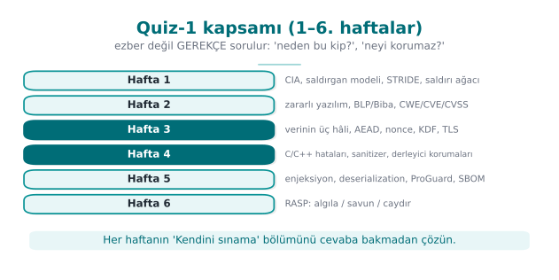
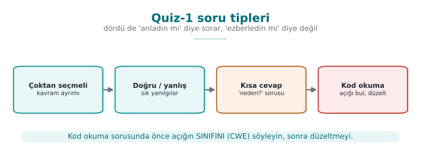
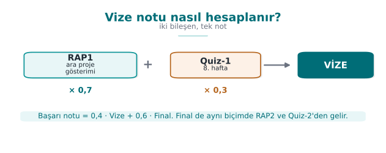
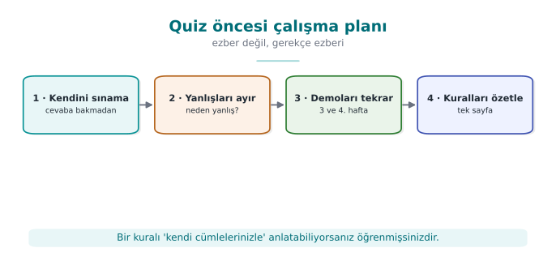

# Week 8 — Midterm Exam Week: Quiz-1

| | |
| --- | --- |
| **Date** | 31.10–08.11.2026 |
| **Learning outcomes** | LO.1, 2, 3 |
| **Duration** | 3 hours |

<!-- materyal:basla -->

<div class="materyal" markdown>

[:material-file-pdf-box: Lecture notes (PDF)](cen429-week-8-ders-notu.pdf){ .md-button download="cen429-week-8-ders-notu.pdf" }
[:material-file-word-box: Lecture notes (DOCX)](cen429-week-8-ders-notu.docx){ .md-button download="cen429-week-8-ders-notu.docx" }
[:material-presentation: Slides (PDF)](cen429-week-8-sunum.pdf){ .md-button download="cen429-week-8-sunum.pdf" }
[:material-microsoft-powerpoint: Slides (PPTX)](cen429-week-8-sunum.pptx){ .md-button download="cen429-week-8-sunum.pptx" }
[:material-language-html5: Slides (HTML, offline)](cen429-week-8-sunum.html){ .md-button download="cen429-week-8-sunum.html" }
[:material-folder-zip: Download all (ZIP)](cen429-week-8-materyal.zip){ .md-button download="cen429-week-8-materyal.zip" }
[:material-fullscreen: Open slides full screen](cen429-week-8-sunum.html){ .md-button .md-button--primary target=_blank }

</div>

<div class="sunum-cercevesi">
<iframe src="../cen429-week-8-sunum.html" title="Week 8 — Midterm Exam Week: Quiz-1" loading="lazy" allowfullscreen></iframe>
</div>

<p class="sunum-ipucu">Click inside the slides and use the arrow keys; use the button at the bottom right of the slides or the link above for full screen.</p>

<!-- materyal:bitis -->

!!! abstract "What happens this week?"
    **Quiz-1** is held during the midterm exam week. The scope is the topics of **weeks 1–6**; Quiz-1 is **40% of the
    midterm grade** (`Grade_Midterm = 0.6·RAP1 + 0.4·QUIZ1`). The date, time, place, duration and question format are
    announced in class. This page is a **study guide**: a topic map, commonly confused concepts, a one-week study
    plan, and sample questions with answers.

!!! tip "The most effective way to study"
    Answer each week's **"Self-check"** questions at the end of its page without looking at the answers, then check
    yourself. Run through the demos once more and ask yourself, for every step, "what happened, why did it happen,
    how was it fixed?" What is measured is not memorization but the **why**.

---

## 1. Topic map: weeks 1–6

| Week | Core concepts | Demos | Book |
| --- | --- | --- | --- |
| **1** Introduction and protection plan | CIA; asset–threat–vulnerability–risk; attacker models (white-box); Saltzer–Schroeder principles; the seven protection layers; the 7 steps of the protection plan; interface and asset tables (C/I/I+); STRIDE and DFD; attack tree; risk = likelihood × impact; secure startup; memory management errors; secure erasure; partitioning; version identity | PATH spoofing · password left in memory · privilege escalation via overflow · signed length | 1.1–1.9, 3.3–3.5, 12.1, 13.2–13.3 |
| **2** Malware and models | Virus types, worms, trojans; outbreak rate; rule-based detection; integrity monitoring; Bell–LaPadula, Biba, Clark–Wilson; Unix and Windows access control; RBAC; CWE, OWASP Top 10, CVE, CVSS; audit logging and log injection | Rule engine · integrity monitoring · outbreak · log injection · tamper-resistant log · ACE · umask · RBAC | 2.1–2.2, 13.11 |
| **3** Data security | The three states of data; symmetric/asymmetric/hybrid; AEAD; digest/MAC/signature; CSPRNG and modulo bias; nonce, IV, salt; ECB; PBKDF2/Argon2id; HKDF, forward secrecy; key lifecycle, hierarchy, wrapping; TLS 1.3, validation, pinning, fail-open; masking, tokenization, pseudonymization; security shells | AES-GCM · nonce reuse · ECB · round count · HKDF · MITM + pinning · SQLite encryption · mlock · four shells | 4.9–4.13, 9.1–9.3, 10.7–10.9, 11.1–11.11, 13.2 |
| **4** C/C++ hardening | SEI CERT; input validation principles; format string; UAF; integer overflow and undefined behaviour; error handling, signals; static analysis; sanitizers; fuzzing; canary, FORTIFY, ASLR, NX, RELRO, CFI; introduction to code obfuscation; flattening | Format string · UAF · UBSan · fuzzing · protections · symbols/strings · flattening | 3.1–3.5, 12.1, 12.3, 12.8, 12.11, 13.1, 13.4–13.5 |
| **5** Java and interpreted languages | What a managed language solves; SEI CERT Java; the common root of injection; SQL, command, path traversal; deserialisation; XXE/XSS; Python/JS, ReDoS; bytecode; ProGuard/R8, `-keep`; string obfuscation, reflection; SBOM, VEX | SQL · command · path · bytecode · obfuscation · SBOM · deserialisation | 3.7, 3.10, 3.11, 1.7 |
| **6** RASP | Detection–defence–deterrence; MATE; RASP architecture; integrity checking; debugger, environment, hook detection; dynamic memory protection; root and signature verification; control-flow counter; response policy, decoy, device binding; limitations | Integrity · anti-debug · VM · LD_PRELOAD · flow counter · signature · root · RASP engine | 12.2, 12.12–12.13 (concepts) |



---

## 2. Frequently confused concepts

| Concept A | Concept B | Difference |
| --- | --- | --- |
| Bug | Vulnerability | Every vulnerability is a bug; a vulnerability is a bug an attacker can **exploit** |
| Threat | Risk | A threat is a potential source of harm; risk is likelihood × impact |
| Encoding (Base64) | Encryption | Encoding is keyless and reversible; it provides no confidentiality |
| Digest (SHA-256) | MAC (HMAC) | A digest is keyless — anyone can compute it; a MAC requires a secret key and authenticates |
| MAC | Digital signature | A MAC is symmetric (both sides share the key); a signature is asymmetric (non-repudiation) |
| Nonce | Salt | A nonce must **never repeat** with a given key; a salt is unique per password and is not secret |
| IV (CBC) | Nonce (GCM) | A CBC IV must be **unpredictable**; a GCM nonce must be **unique** |
| PBKDF2 / Argon2id | HKDF | The former is for a low-entropy **password** (slow); HKDF derives from a high-entropy **secret** (fast) |
| Chain validation | Hostname verification | One asks "did a trusted CA sign this?", the other asks "is this certificate **for this server**?" |
| Pinning | TOFU | With pinning the expected key is embedded in advance; with TOFU it is learned on first connection |
| Fail-open | Fail-closed | On error, "pass" vs. "reject"; security checks should be fail-closed |
| Blacklist | Allowlist | Enumerating what is forbidden is always incomplete; defining what is permitted is correct |
| Canary | ASLR | A canary detects an overflow when the function returns; ASLR randomizes addresses |
| ASan | UBSan | ASan catches memory access errors; UBSan catches undefined behaviour (overflow, shift) |
| Static analysis | Dynamic analysis / fuzzing | Static analysis works without running the code and can produce false positives; dynamic analysis only sees the path that actually runs, but it is conclusive |
| Unsigned wraparound | Signed overflow | Wraparound is defined behaviour (a logic bug); signed overflow is **undefined behaviour** |
| Parameterised query | Escaping | Parameterization is two channels — the real fix; escaping is a secondary line of defence |
| ProGuard obfuscation | String obfuscation | ProGuard renames **identifiers**; it does not hide strings |
| Obfuscation | Secure coding | Obfuscation delays an attacker; it does not fix the bug |
| Detection | Response | Detection alone is useless; the response must be far from the trigger and implicit |
| Masking | Tokenization | Masking hides a value on display; tokenization replaces the value with a token bound to the real value held in a vault |
| Pseudonymization | Anonymization | Pseudonymized data is still personal data; anonymized data cannot be linked back to a person |



---

## 3. A one-week study plan

| Day | Topic | What to do |
| --- | --- | --- |
| 1 | Week 1 | STRIDE, attack tree, protection plan; rerun Demos 1–4; self-check 1–25 |
| 2 | Week 2 | Models (BLP, Biba, Clark–Wilson), CWE/CVSS; score a CVSS vector yourself |
| 3 | Week 3 (1) | AEAD, nonce, salt, KDF, random numbers; Demos 1–5 |
| 4 | Week 3 (2) | Key management, TLS, pinning, masking, shells; Demos 6–9 |
| 5 | Week 4 | CERT rule pairs, format string, UAF, UB, protection table; Demos 1–7 |
| 6 | Weeks 5–6 | Injection, deserialisation, ProGuard, SBOM; RASP architecture and response |
| 7 | Review | Work through the sample questions below against the clock; re-read the relevant section for anything you get wrong |



---

## 4. Sample questions

The questions below are meant to show the **kind of thinking** Quiz-1 requires, not its exact format.



### Concepts

??? question "1. In a money transfer, the recipient's account number being altered in transit breaks which property of the CIA triad? Which two controls prevent this?"
    Integrity. A message authentication code (HMAC) or a digital signature; TLS in transit (with chain validation and
    hostname verification).

??? question "2. Which letters of STRIDE apply to a data flow? Why is 'S' never asked?"
    T, I, D. A data flow has no identity of its own; spoofing applies to assets and processes.

??? question "3. What is the role of the IVP in the Clark–Wilson model? What happens if a faulty TP gets certified?"
    The IVP independently verifies that the data is consistent. If a faulty TP is certified, the enforcement rules
    cannot see it (the transaction looks authorized); the IVP is what catches the inconsistency.

??? question "4. Why is nonce reuse catastrophic in GCM?"
    The same key and nonce produce the same keystream; XOR-ing two ciphertexts yields the XOR of the two plaintexts,
    and in addition the authentication key can be recovered and forged tags can be produced.

??? question "5. Why is Argon2id used for passwords instead of SHA-256?"
    SHA-256 is fast; an attacker can try billions of guesses per second. Argon2id is deliberately slow and
    memory-hard; combined with a salt, it makes every guess expensive.

??? question "6. Which attack does a stack canary stop, and which does it not stop?"
    It stops a sequential stack overflow that reaches the return address, by terminating the program. It does not
    stop corruption of variables that sit before the canary, heap overflows, or a leaked canary value.

??? question "7. What are ProGuard's four phases? Which one hides strings?"
    Shrinking, optimisation, obfuscation (renaming), preverification. None of them hide strings.

??? question "8. In RASP, what does 'separating the response from the trigger' mean? Why is it needed?"
    Instead of crashing immediately at the moment of detection, delivering the response at a point removed in time
    and in code (e.g., wiping the secret and returning a decoy). Crashing immediately shows the attacker exactly
    which check was triggered.

### Reading code: find the bug

??? question "9. What is the bug in this code, and which CERT rule does it violate?"
    ```c
    void kaydet(const char *ad) {
        char tampon[32];
        sprintf(tampon, "kullanici=%s", ad);
        syslog(LOG_INFO, tampon);
    }
    ```

    Two bugs: `sprintf` writes without a bound (overflow, STR31-C; `snprintf` should be used instead), and `syslog`
    is given a variable string as its format argument (format string vulnerability, FIO30-C;
    `syslog(LOG_INFO, "%s", tampon)` should be used instead).

??? question "10. What is wrong with this code?"
    ```c
    char parola[64];
    oku(parola, sizeof parola);
    dogrula(parola);
    memset(parola, 0, sizeof parola);
    return;
    ```

    Because the array is never read after the `memset`, the compiler is allowed to remove that line entirely
    (MSC06-C, CWE-14). `explicit_bzero` / `SecureZeroMemory` should be used instead.

??? question "11. Why is this code unsafe, and how would you fix it?"
    ```java
    String sql = "SELECT * FROM notlar WHERE ogrenci = '" + no + "'";
    ResultSet rs = st.executeQuery(sql);
    ```

    SQL injection (CWE-89, IDS00-J). A `PreparedStatement` with a `?` parameter should be used.

??? question "12. Where is the bug in this decryption code?"
    ```c
    EVP_DecryptUpdate(ctx, acik, &n, sifreli, sifreli_n);
    kullan(acik, n);
    EVP_DecryptFinal_ex(ctx, acik + n, &m);
    ```

    The plaintext is used before the tag is verified (before `Final`), and the return value of `Final` is never
    checked. The tag should be checked first, the plaintext used only if `Final` succeeds, and wiped if it fails.

??? question "13. Why is this path check insufficient?"
    ```java
    if (istek.contains("..")) throw new SecurityException();
    return Files.readAllBytes(kok.resolve(istek));
    ```

    A raw-string check can be bypassed (absolute paths, symbolic links, encoded forms). The path must first be
    canonicalized (`normalize`, `toRealPath`) and then checked to be inside the root (FIO16-J).

??? question "14. What is the problem with this pinning code?"
    ```java
    try { pinDenetle(zincir); }
    catch (KeyStoreException e) { e.printStackTrace(); }
    ```

    Fail-open: the keystore error is swallowed and the connection is accepted. Uncertainty should lead to rejection
    (the exception should be rethrown as a `CertificateException`).

### Scenario

??? question "15. A mobile application uses the same embedded AES key on every user's device. What risks does this create, and what do you recommend?"
    A key extracted from a single copy affects every user (a violation of "compromising one instance must not affect
    the others"); it can be read out of the bytecode/binary. Recommendation: a key generated or derived on the
    server per user/device, device and version binding, wrapping, white-box if necessary; the key is never embedded
    in the code.

??? question "16. The assessor notices that your application's debug build was shipped. What findings would be written up?"
    No obfuscation, symbols and log strings exposed, the `debuggable` flag enabled (a debugger can attach), possibly
    leftover sanitizer or debug code. The release build's protections (checksec) and the removal of logging must be
    verified.

??? question "17. In a payment application, a user says 'I did not make this transaction.' Which STRIDE letter is this? Which controls provide evidence?"
    R (repudiation). A tamper-resistant audit log (HMAC chain, key evolution), signed transaction records, records
    sent to the server immediately, timestamps.

??? question "18. You are writing an archive-extraction function. What bugs do you guard against, and how?"
    Zip Slip (`../` in file names): canonicalize every entry's target path and check that it stays inside the root;
    size and file-count limits (decompression bombs); reject symbolic links; validate length fields, and fuzz the
    function.

??? question "19. What was organisations' biggest problem during Log4Shell? Which practice would have prevented it?"
    Not knowing which version of Log4j (including copies embedded inside other libraries) was present in which
    system. An SBOM (CycloneDX/SPDX) produced on every release and continuously monitored, plus an SCA tool.

??? question "20. Why is evaluating RASP checks with a single `if` weak? What is a stronger design?"
    An attacker who flips the one comparison, or who makes the check function always return "clean," bypasses all of
    it. Check results should feed into the data used by a later computation (e.g., key derivation), be carried as
    opaque values, checks should be spread across multiple points and cross-check each other, and the response
    should be delayed.
