# Hafta 9 — Gelişmiş Kod Gizleme ve Çeşitlendirme

| | |
| --- | --- |
| **Tarih** | 13.11.2026 |
| **Öğrenme çıktıları** | ÖÇ.3 |
| **Süre** | 3 saat |
| **Ön bilgi** | [Hafta 1](../week-1/cen429-week-1.md)'den beyaz kutu saldırgan modeli; [Hafta 4](../week-4/cen429-week-4.md)'ten derleme, `objdump` ve tersine mühendislik kavramları; C'de kontrol akışı (`if`, `switch`, döngü) |
| **Uygulamalar** | [`code/week-09`](https://github.com/ucoruh/cen429-secure-programming/tree/main/code/week-09) — 2 demo; `code` klasöründe bir kez derleyin, sonra `bin/linux` (Windows'ta `bin\windows`) altından çalıştırın |

<!-- materyal:basla -->

<div class="materyal" markdown>

[:material-file-pdf-box: Ders notu (PDF)](cen429-week-9-ders-notu.pdf){ .md-button download="cen429-week-9-ders-notu.pdf" }
[:material-file-word-box: Ders notu (DOCX)](cen429-week-9-ders-notu.docx){ .md-button download="cen429-week-9-ders-notu.docx" }
[:material-presentation: Sunum (PDF)](cen429-week-9-sunum.pdf){ .md-button download="cen429-week-9-sunum.pdf" }
[:material-microsoft-powerpoint: Sunum (PPTX)](cen429-week-9-sunum.pptx){ .md-button download="cen429-week-9-sunum.pptx" }
[:material-language-html5: Sunum (HTML, çevrimdışı)](cen429-week-9-sunum.html){ .md-button download="cen429-week-9-sunum.html" }
[:material-folder-zip: Tümünü indir (ZIP)](cen429-week-9-materyal.zip){ .md-button download="cen429-week-9-materyal.zip" }
[:material-fullscreen: Sunumu tam ekran aç](cen429-week-9-sunum.html){ .md-button .md-button--primary target=_blank }

</div>

<div class="sunum-cercevesi">
<iframe src="../cen429-week-9-sunum.html" title="Hafta 9 — Gelişmiş Kod Gizleme ve Çeşitlendirme" loading="lazy" allowfullscreen></iframe>
</div>

<p class="sunum-ipucu">Sunumun içine tıklayıp ok tuşlarıyla ilerleyin; tam ekran için sunumun sağ altındaki düğmeyi ya da yukarıdaki "Sunumu tam ekran aç" bağlantısını kullanın.</p>

<!-- materyal:bitis -->

!!! example "Bu haftanın çalışan demosu"
    `code/week-09/01-manuel-gizleme` — Manuel gizleme + maliyet olcumu: ayni davranis, sir gizli, `objdump` ile olculen maliyet.
    · `code/week-09/02-cesitlendirme` — Çeşitlendirme: aynı kaynak iki tohumla derlenir → davranışça eş, yapıca farklı ikili.

    Çalıştırma: `sh demo.sh` (Linux/WSL) ya da CMake ile derleyip `bin/` altından. Tümüyle sentetik ve güvenlidir; öğrenci bilgisayarına zarar vermez.


!!! tip "Demoyu kendiniz çalıştırın — adım adım (kopyala-yapıştır)"
    Kurulum ve ilk derleme `code/README.md`'de (Visual Studio ya da komut satırı). Depoyu klonlayıp **`code`** klasörüne girdikten sonra:

    ```powershell
    # Windows (PowerShell) — 'code' klasöründe
    .\build.ps1                                    # tüm demoları bir kez derle
    cd week-09\01-manuel-gizleme
    .\bin\windows\erisim_temiz.exe CEN429-OK     # korumasız sürüm
    .\bin\windows\erisim_gizli.exe CEN429-OK     # gizli sürüm — çıktı AYNI
    ```

    ```sh
    # WSL / Linux — 'code' klasöründe
    ./build.sh
    cd week-09/01-manuel-gizleme
    sh demo.sh                                     # açıklamalı tam akış
    ```

    **Beklenen çıktı:** İki sürüm de `CEN429-OK` için **aynı** "erişim verildi" satırını basar (davranış korundu). `strings` çıktısında `CEN429-OK` **temizde görünür, gizlide görünmez** (K-07 dize kodlama). `objdump` ölçümü: `erisim_ver` **~28 komut / 3 dal → ~51 komut / 6 dal** (maliyet arttı). İkinci demo (`02-cesitlendirme`) aynı kaynağı iki tohumla derler → **davranış aynı, ikili farklı**.

!!! abstract "Bu haftanın sonunda şunları yapabileceksiniz"
    1. **Kod gizlemeyi** (obfuscation) bir güvenlik **kuralı/karşı önlemi** olarak tanımlamak; her tekniği "neyi korur,
       hangi gereksinimi karşılar, maliyeti nedir, sınırı nedir" biçiminde yazmak.
    2. Gizleme **taksonomisini** (düzen, veri, kontrol akışı, önleyici, sanallaştırma) ve **beyaz kutu / MATE**
       (uçtaki saldırgan) tehdit modelini açıklamak.
    3. İleri **kontrol akışı** ve **veri** gizleme kurallarını (opak yüklemler ve döngüler, aritmetik kodlama, sahte
       işlemler ve ölü dallar, kontrol akışı düzleştirme, rastgele çıkış, dize ve sabit kodlama) kavram düzeyinde
       çözümlemek.
    4. **Çeşitlendirmenin** (diversification) neden bir bütünsel dayanıklılık kuralı olduğunu; **sanallaştırma tabanlı**,
       **derleyici tabanlı** ve **dinamik** gizlemenin ne kazandırıp ne pahasına geldiğini anlatmak.
    5. Gizlemenin **etkinliğini ölçmek**: güç, dayanıklılık, gizlilik ve maliyet ölçütleriyle bir koruma kararını
       gerekçelendirmek ve kendi projenizin S9 bölümü için bir **koruma tablosu** yazmak.

??? info "Ders akışı (öğretim üyesi için zaman planı)"
    | Zaman | Bölüm | Ne yapılıyor |
    | --- | --- | --- |
    | 0:00–0:20 | 1 | Gizleme neden bir kural? Beyaz kutu / MATE tehdit modeli, gizlemenin verdiği ve vermediği |
    | 0:20–0:45 | 2 | Gizleme taksonomisi ve "koruma kuralı" şablonu (neyi korur / gereksinim / maliyet / sınır) |
    | 0:45–0:50 | Ara | |
    | 0:50–1:35 | 3 | Kontrol akışı kuralları: opak yüklem ve döngü, aritmetik kodlama, sahte işlem/ölü dal, düzleştirme, rastgele çıkış |
    | 1:35–1:40 | Ara | |
    | 1:40–2:10 | 4 | Veri kuralları: dize/sabit kodlama, değişken bölme/birleştirme; sanallaştırma, derleyici tabanlı, dinamik gizleme (kavram) |
    | 2:10–2:40 | 5 | Çeşitlendirme; gizlemenin ölçülmesi (güç, dayanıklılık, gizlilik, maliyet); deobfuscation ve dayanıklılık |
    | 2:40–3:00 | 6+ | Katmanlı savunmada yeri; proje S9; kendini sınama |

!!! info "Bu haftanın kaynakları hakkında"
    Bu hafta iki ana kaynağa dayanır: (1) **güvenli programlama teknik kılavuzu** — sertifikasyondan geçmiş bir mobil
    ödeme kütüphanesinin **kod sağlamlaştırma (hardening) karşı önlemlerini** "açıklama / uygulama / sınır" biçiminde listeler; (2)
    **Secure Programming Cookbook** (Viega & Messier), Bölüm 12 "Anti-Tampering". Kılavuzdaki karşı önlemler burada
    **kurallar** olarak, üründen ve gerçek değerlerden arındırılmış biçimde verilir; bütün kod ve değerler
    **sentetiktir**. 4. hafta bu tekniklere giriş yaptı (sembol/dize gizleme, düzleştirmeye giriş); bu hafta aynı
    teknikleri **ileri düzeyde** ele alır ve **nasıl ölçüleceğini** ekler. [14. hafta](../week-14/cen429-week-14.md) bunların **otomatik** karşılığını
    (Tigress) gösterir.

---

## 0. Başlamadan önce

Bu bölüm haftaya hazırlık içindir. Önce bu haftanın dayandığı önceki konuları kısaca hatırlatır; sonra bu haftanın
kavramlarını birer cümleyle tanımlayıp her birini ayrıntılı anlatıldığı bölüme bağlar. Önceki haftalarda görülmemiş
temel bilgiler ise "Ön bilgi" başlıkları altında sıfırdan anlatılır.

### Önceki haftalardan gelenler

- **Beyaz kutu / MATE saldırgan modeli** — cihazı elinde tutan kullanıcının aynı zamanda saldırgan olduğu, belleği
  okuyup hata ayıklayıcı bağlayabildiği tehdit modeli
  ([Hafta 1, §3](../week-1/cen429-week-1.md#3-saldirgan-kim-neye-erisebiliyor)). Bu hafta §1'de bu modeli **MATE**
  (Man-At-The-End) adıyla kod gizlemenin motivasyonu olarak yeniden kullanıyoruz.
- **Hata ayıklayıcı (debugger)** — programı adım adım çalıştıran, değişkenleri gösteren araç (gdb, lldb); bir hata
  ayıklayıcının bağlı olup olmadığını çalışma anında denetlemeyi RASP bağlamında görmüştük
  ([Hafta 6, §4](../week-6/cen429-week-6.md#4-hata-ayiklayici-debugger-algilama)). Bu hafta MATE saldırganının
  araçlarından biri olarak §1'de kısaca geçiyor.
- **Entropi (rastgelelik)** — bir verinin baytlarının ne kadar düzensiz/öngörülemez göründüğünün ölçüsü; H2'de
  şifreli/paketli içerik tespitinde
  ([Hafta 2, §6](../week-2/cen429-week-2.md#demo-02-entropi-olcer-sifrelipaketli-icerik-nasil-anlasilir)), H3'te
  rastgele sayı üretiminin temelinde
  ([Hafta 3, §3](../week-3/cen429-week-3.md#3-rastgele-sayilar-kriptografinin-gorunmez-temeli)) gördük. Bu hafta
  aynı ölçütü, bir saldırganın ikili dosyada yüksek entropili blokları (anahtar, şifreli veri) ayırt etmesi
  bağlamında sayısal bir örnekle derinleştiriyoruz (aşağıdaki "Ön bilgi").
- **Derleme bayrağı, `strings` ve sembol tablosu** — derleyiciye verilen seçenekler (`-O2`, `-Wall`, `-DGUNLUK_ACIK`; aynı kaynak bayrağa göre günlüklü ya da
  günlüksüz derlenebilir) ve bir ikili
  dosyanın okunabilir metinlerini/isim listesini gösteren araçlar; H4'te bunları ilk kez tanımlamış, gizlemenin
  giriş seviyesindeki adımlarını görmüştük
  ([Hafta 4, §15](../week-4/cen429-week-4.md#15-sembol-dize-ve-gunluk-gizleme)). Bu hafta K-06/K-07 aynı ipuçlarını
  daha ileri düzeyde kapatıyor.
- **Tersine derleme** — bir ikili/bayt kodunu geri, okunabilir bir koda yaklaştırma işlemi; H5'te JVM bayt kodu
  üzerinde gördük ([Hafta 5, §10](../week-5/cen429-week-5.md#10-bayt-kodu-ve-tersine-derleme)). Bu hafta aynı
  fikri native (C/C++) ikili dosyalar ve Ghidra/IDA gibi araçlarla genişletiyoruz.
- **XOR** — iki bit farklıysa 1, aynıysa 0 veren işlem; `a^b^b=a` özelliği sayesinde kendini geri alır. H5'te Java
  dize gizlemede XOR'u elle çözmüştük
  ([Hafta 5, §12](../week-5/cen429-week-5.md#12-dize-gizleme-ve-dinamik-yontem-cagrisi)). Bu hafta aynı mekanizmayı
  K-02 ve K-07 kurallarının temeli olarak kullanıp bit tablosuyla adım adım yeniden izliyoruz (aşağıdaki "Ön
  bilgi").
- **Günlük (log)** — programın çalışırken yazdığı bilgi mesajları; hassas bilgi ya da iç durum günlüğe düşerse
  saldırgan okur. Ne kaydedilir/kaydedilmez ve kurcalamaya
  dayanıklı günlükleri H2'de ayrıntılı işlemiştik
  ([Hafta 2, §9](../week-2/cen429-week-2.md#9-guvenlik-denetim-kaydi-kanit-olarak-gunluk)). Bu hafta yalnız "sürüm
  ikili dosyasında günlüğün kaldırılması" düzen kuralı olarak §2'de kısaca geçiyor.

### Bu haftanın kavram haritası

| Kavram | Bir cümlede | Ayrıntısı |
| --- | --- | --- |
| Gizleme (obfuscation) bir güvenlik kuralı olarak | Kod gizleme, saldırıyı imkânsız değil pahalı kılan; maliyeti değerin üstüne çıkarma, otomasyonu kırma ve diğer katmanlara zaman kazandırma amacı taşıyan bir karşı önlemdir. | [§1](#1-gizleme-neden-bir-guvenlik-kuralidir) |
| Gizleme taksonomisi (beş aile) | Gizleme teknikleri neyi gizlediğine göre düzen, veri, kontrol akışı, önleyici ve sanallaştırma olmak üzere beş aileye ayrılır; bir aile davranışı üreten mekanizmaya ne kadar yakınsa o kadar güçlü ama o kadar pahalıdır. | [§2](#2-gizleme-taksonomisi-bes-aile) |
| Gizlemenin sınırı | Gizleme statik analize karşı gecikme ve otomasyona karşı direnç sağlar; bir sırrın matematiksel gizliliğini (kriptografi) ya da çalışan programda bellekten okumaya karşı korumayı (RASP/whitebox) sağlamaz. | [§3](#3-gizleme-ne-verir-ne-vermez) |
| Koruma kuralı şablonu | Her gizleme tekniği; neyi korur, hangi tehdide karşı, nasıl, maliyeti, sınırı ve ölçümü veren altı satırlık standart bir şablonla değerlendirilir. | [§4](#4-koruma-kurali-sablonu) |
| Kontrol akışı kuralları (K-01–K-06) | Opak yüklem/döngü, aritmetik kodlama, sahte işlem/ölü dal, kontrol akışı düzleştirme, rastgele çıkış ve fonksiyon/parametre gizleme; algoritmanın CFG'sini okunmaz kılan kurallardır. | [§5](#5-kontrol-akisi-kurallari-ileri) |
| Veri gizleme kuralları (K-07–K-09) | Statik dize (string) kodlama, opak boolean ve değişken bölme/birleştirme; programın işlediği sabitleri, dizeleri ve değişkenleri gizler. | [§6](#6-veri-gizleme-kurallari) |
| Program bütünü düzeyinde kurallar (K-10–K-12) | Sanallaştırma tabanlı gizleme, derleyici tabanlı gizleme (O-LLVM) ve kendini değiştiren kod; fonksiyonun makine kodunun kendisini ya da üretim biçimini değiştiren en pahalı ve en güçlü katmandır. | [§7](#7-program-butunu-duzeyinde-kurallar) |
| Çeşitlendirme (diversification) | Aynı kaynaktan tohuma bağlı, davranışça eş ama yapıca farklı ikili dosyalar üretmek; gizlemenin gücünü değil, bir kırığın diğer kopyalara yayılmasını (ölçeklenmesini) engeller. | [§8](#8-cesitlendirme-tek-kirik-her-yeri-acmasin) |
| Gizlemenin dört ölçütü | Güç (insan için anlaşılmazlık), dayanıklılık (otomatik araca direnç), gizlilik (fark edilmezlik) ve maliyet (boyut/hız/bakım); bir koruma kararı bu dördü korunan varlığın değerine göre dengeler. | [§9](#9-gizlemenin-olculmesi) |
| Deobfuscation | Sembolik yürütme, ifade sadeleştirme ve kalıp tanıma gibi saldırganın otomatik araçları; dayanıklılığı ölçmenin tek yolu bu araçları gerçekten çalıştırıp sonucu gözlemlemektir. | [§10](#10-deobfuscation-karsi-tarafin-araclari-ve-dayaniklilik-kurali) |
| Katmanlı savunmada gizlemenin yeri | Gizleme bellek güvenliği, RASP, whitebox kriptografi ve kripto/anahtar yenilemenin yerine geçmez; her katmanın "geciktirme süresi" saldırı potansiyeli değerlendirmesinde ayrı ayrı sayılır. | [§11](#11-katmanli-savunmada-gizlemenin-yeri) |

### Ön bilgi: ikili dosyalar, tersine mühendislik ve temel yapı taşları

Bu haftanın konusu **kod gizleme**dir; gizlemeyi anlamak için önce bir ikili dosyanın nasıl üretildiğini ve bir
saldırganın onu nasıl okuduğunu bilmek gerekir. Aşağıdaki kavramların hiçbiri önceki haftalarda öğretilmedi;
tanımlardan sonra gelen işlenmiş örnekler bu hafta boyunca sürekli kullanacağımız araçlardır.

#### Kaynak koddan ikiliye: derleyici, makine kodu ve assembly

**Kaynak kod**, sizin yazdığınız, insanın okuyabildiği program metnidir (ör. bir C dosyası):
`int topla(int a, int b) { return a + b; }`. Kaynak kod **derlenir** ve makinenin çalıştırdığı biçime döner.
**Derleyici** (compiler),
kaynak kodu **makine koduna** çeviren programdır (gcc, clang); **ikili dosya** (binary) ise derleme sonucudur,
bilgisayarın doğrudan çalıştırdığı dosyadır (`.exe`, `.so`).

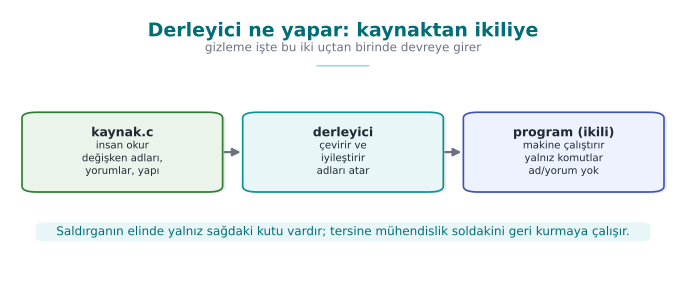

**Makine kodu**, işlemcinin anladığı sayısal komutlardır; **assembly** ise makine kodunun insana biraz daha okunur
hâlidir (`mov`, `cmp`, `jmp`). İkili dosyayı açtığınızda gördüğünüz şey budur.

#### Tersine mühendislik ve tersine derleyici

**Tersine mühendislik** (reverse engineering), bir ikili dosyaya bakıp programın ne yaptığını anlamaya
çalışmaktır — saldırganın temel işi budur. **Tersine derleyici** (decompiler), ikili dosyayı geri, okunabilir koda
yakın bir biçime çeviren araçtır (örnekler: Ghidra, IDA); amacı, kaynağa erişimi olmayan birinin ikiliye bakarak
mantığı çıkarsamasıdır. (H5'te bunun JVM bayt kodu üzerindeki karşılığını görmüştük — bkz. yukarıdaki "Önceki
haftalardan gelenler"; burada aynı fikri native ikili dosyalara taşıyoruz.)

**Tersine derleyici çıktısı neye benzer?** Elimizde yalnız bir `.exe`/`.so` dosyası olduğunu, kaynak kodu
görmediğimizi hayal edelim. `int topla(int a, int b) { return a + b; }` fonksiyonunu bir tersine derleyicide
açtığımızda, tipik çıktı şuna benzer (araçtan araca biçim değişir, fikir aynıdır):

```text title="Tersine derleyici çıktısı (kavramsal örnek — Ghidra/IDA benzeri)"
undefined4 FUN_00401020(int param_1, int param_2)
{
    return param_1 + param_2;
}
```

Dikkat edin: `topla`, `a`, `b` gibi **anlamlı adlar kaybolmuştur** (kaynak dosyada vardı, yalnız derleyicinin
ürettiği ikili dosyada saklı değildi); araç kendi ürettiği `FUN_00401020` (adres tabanlı) ve `param_1`, `param_2`
gibi **jenerik** adları kullanır. Ama **mantık korunur**: toplama işlemi hâlâ açıkça görünür. Bu, gizlemenin neden
yalnız **adları** değiştirmenin (düzen ailesi) yeterli olmadığının somut kanıtıdır — bir tersine derleyici zaten
adları kaybetmiş bir şekilde çalışır; asıl mücadele **mantığı** (kontrol akışı ve veri) okunmaz kılmaktır, bu da
bölüm 5 ve 6'nın konusudur.

#### Bit, bayt, onaltılık

**Bit**, 0 veya 1'dir. **Bayt**, 8 bittir. **Onaltılık (hex)**, `0x` ile yazılır; `0x2A` = 42. Kodda `0x5A` gibi
değerler göreceğiz; bunlar sadece sayılardır.

**Onaltılık-ikilik-onluk dönüşümünü tek tabloda pekiştirelim.** Onaltılık her bir hanesi tam olarak **4 bit**e
karşılık gelir (çünkü `2⁴ = 16`); bu yüzden bir bayt (8 bit) her zaman **iki** onaltılık haneyle yazılır:

| Onaltılık hane | İkilik (4 bit) | Onluk |
| --- | --- | --- |
| `0` | `0000` | 0 |
| `5` | `0101` | 5 |
| `A` | `1010` | 10 |
| `F` | `1111` | 15 |

Bu tabloyu birleştirerek `0x5A`'yı çözelim: hane `5` → `0101`, hane `A` → `1010`; yan yana yazınca `0101 1010` (8
bit, 1 bayt). Onluğa çevirmek için basamak değerleriyle toplarız: `5 × 16 + 10 × 1 = 80 + 10 = 90`. Yani `0x5A =
90` (onluk) `= 0101 1010` (ikilik) — bu hafta boyunca kod örneklerinde göreceğiniz her `0x..` değeri bu üç
gösterimin (hex/ikilik/onluk) **aynı sayısının** farklı yazılışlarından ibarettir; hiçbiri diğerinden "daha
gizli" değildir, yalnız insan için okuma kolaylığı farklıdır (hex kısa, ikilik bit işlemlerini gösterir açıkça).

#### XOR: tersine çevrilebilir gizlemenin temeli

**XOR** (`^`), iki bit farklıysa 1, aynıysa 0 veren işlemdir. Özelliği: `a ^ b ^ b == a` → **kendini geri alır**:

```c
c = a ^ 0x5A;   /* şifrele */
a = c ^ 0x5A;   /* geri çöz */
```

Gizlemede çok kullanılır çünkü tersine çevrilebilir (H5'te Java dize gizlemede XOR'u elle çözmüştük — bkz.
yukarıdaki "Önceki haftalardan gelenler"; burada aynı işlemi bit bit izliyoruz).

**XOR'u adım adım izleyelim: `0x41` baytını gizleyip geri açalım.** XOR'un "kendini geri alma" özelliğini soyut
bırakmayalım; tek bir baytı bit bit izleyelim. `'A'` harfinin ikilik (ASCII) karşılığı `0x41`'dir (onaltılık) = 65
(onluk) = `0100 0001` (ikilik). Anahtar olarak `0x5A` = `0101 1010` kullanalım.

**Şifreleme:** `0x41 ^ 0x5A`

| Bit konumu | 7 | 6 | 5 | 4 | 3 | 2 | 1 | 0 |
| --- | --- | --- | --- | --- | --- | --- | --- | --- |
| `0x41` | 0 | 1 | 0 | 0 | 0 | 0 | 0 | 1 |
| `0x5A` | 0 | 1 | 0 | 1 | 1 | 0 | 1 | 0 |
| XOR | 0 | 0 | 0 | 1 | 1 | 0 | 1 | 1 |

Sonuç: `0001 1011` = `0x1B`. Kural basit: aynıysa (`0^0=0`, `1^1=0`) sonuç 0, farklıysa (`0^1=1`, `1^0=1`) sonuç 1
— tam da yukarıdaki "XOR" tanımının bit düzeyindeki karşılığı.

**Geri çözme:** aynı anahtarla tekrar XOR'layalım: `0x1B ^ 0x5A`

| Bit konumu | 7 | 6 | 5 | 4 | 3 | 2 | 1 | 0 |
| --- | --- | --- | --- | --- | --- | --- | --- | --- |
| `0x1B` | 0 | 0 | 0 | 1 | 1 | 0 | 1 | 1 |
| `0x5A` | 0 | 1 | 0 | 1 | 1 | 0 | 1 | 0 |
| XOR | 0 | 1 | 0 | 0 | 0 | 0 | 0 | 1 |

Sonuç: `0100 0001` = `0x41` — tam olarak başladığımız bayt. Bunu garanti eden cebirsel kural şudur: `a ^ b ^ b = a ^
(b ^ b) = a ^ 0 = a` (herhangi bir değer kendisiyle XOR'lanınca 0 verir; 0 ile XOR'lanan değer değişmeden kalır).
Bölüm 6'daki K-07 kuralında bir dizeyi tam olarak bu mekanizmayla kodlayıp çözeceğiz; orada aynı bit tablosunu
tekrar kuracaksınız, sadece bir bayt yerine bir dizi bayt için.

#### Entropi: bir verinin ne kadar "rastgele" göründüğü

**Entropi**, bir verinin ne kadar "rastgele" göründüğünün ölçüsüdür; kriptografik anahtarlar **yüksek entropili**
görünür (düzensiz baytlar). Saldırgan, ikilide yüksek entropili bir blok görürse "burada anahtar olabilir" der.
(H2'de şifreli/paketli içerik tespitinde, H3'te rastgele sayı üretiminde gördüğümüz ölçütün aynısıdır — bkz.
yukarıdaki "Önceki haftalardan gelenler"; burada sayısal bir örnekle derinleştiriyoruz.)

**Sayısal bir entropi örneği.** Yukarıdaki tanımı somutlaştıralım. Basit bir ölçüt olan Shannon entropisi, bir
dizideki her farklı bayt değerinin **görülme olasılığına** bakar: `H = -Σ p(x) · log2 p(x)`. İki küçük örnek
üzerinde elle hesaplayalım:

- **Dizi A:** `[0x41, 0x41, 0x41, 0x41]` — dört bayt da aynı. Tek değerin olasılığı `p = 1`, `log2(1) = 0`,
  dolayısıyla `H = -(1 · 0) = 0` bit/sembol. Tamamen **öngörülebilir**: ilk baytı görürseniz gerisini bilirsiniz.
- **Dizi B:** `[0x3F, 0xA1, 0x08, 0xC7]` — dört bayt da birbirinden farklı, her birinin olasılığı `p = 1/4`. `H = -4
  · (1/4 · log2(1/4)) = -4 · (1/4 · (-2)) = 2` bit/sembol — bu dört sembollük alfabede ulaşılabilecek **en yüksek**
  entropi değeri.

Gerçek bir kriptografik anahtar, yüzlerce baytlık ölçekte "dizi B" gibi görünür: baytlar arasında tekrar eden bir
desen yoktur, her bayt değeri hemen hemen eşit olasılıkla çıkar. Bir saldırgan ikili dosyayı tarayan bir araçla
gezdiğinde, "dizi A" gibi düşük entropili bloklarla (sabit metinler, sıfır doldurmalar, tekrar eden yapılar) "dizi
B" gibi yüksek entropili blokları (anahtarlar, sıkıştırılmış ya da şifreli veri) istatistiksel olarak ayırt
edebilir — az önceki tanımdaki "saldırgan yüksek entropili bir blok görürse anahtar olabilir der" cümlesinin
sayısal karşılığı tam olarak budur.

#### Fonksiyon, dal, temel blok ve kontrol akışı grafiği (CFG)

**Fonksiyon**, bir işi yapan kod bloğudur (`erisim_ver`); **dal (branch)**, `if` gibi bir yol ayrımıdır; **koşul**,
dalın hangi yöne gideceğini belirleyen ifadedir. **Temel blok (basic block)**, dalsız, baştan sona akan komut
dizisidir — bir `if` gelince blok biter, iki yeni blok başlar; program, temel blokların birbirine bağlanmasıdır.
**CFG** (Control Flow Graph), temel blokları **düğüm**, geçişleri **kenar** yapan şemadır — programın "yol
haritası"dır.

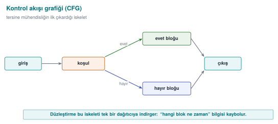

**Somut bir örnekle "temel blok" ve "CFG" kavramlarını birleştirelim.** Bölüm 5'te tekrar göreceğimiz şu küçük
fonksiyonu ele alalım:

```c title="denetim: üç temel bloklu küçük bir fonksiyon"
int denetim(int girdi) {
    int a = girdi + 1;      /* Blok 1 */
    if (a > 10) {            /* Blok 2 */
        return HATA;
    }
    return a * 2;             /* Blok 3 */
}
```

Bu fonksiyonu temel bloklara ayıralım: **Blok 1** (`a = girdi + 1` ve `if` koşulunun hesaplanması) dalsız akar,
`if`'e geldiği an biter. **Blok 2** koşul `doğru` ise `return HATA`'ya gider — bu tek satırlık ayrı bir blok
(**Blok 2a**). Koşul `yanlış` ise **Blok 2b**'ye (`return a*2`) geçilir. CFG'nin düğümleri bu üç blok
(1, 2a, 2b), kenarları ise aralarındaki geçişlerdir:

| Düğüm (temel blok) | İçeriği | Giden kenarlar |
| --- | --- | --- |
| Blok 1 | `a = girdi+1`; `if (a>10)` hesapla | → Blok 2a (koşul doğru) veya Blok 2b (koşul yanlış) |
| Blok 2a | `return HATA` | (çıkış — kenar yok) |
| Blok 2b | `return a*2` | (çıkış — kenar yok) |

Toplam: **3 düğüm, 2 kenar**. Bir tersine derleyici bu grafiği çizdiğinde, "girdi 10'dan büyükse hata, değilse iki
katını dön" mantığını **saniyeler içinde** okur — çünkü düğüm sayısı az, kenarlar doğrudan ve dallanma kararı tek
bir karşılaştırmadır. Bölüm 5'te aynı fonksiyonu K-04 ile düzleştirdiğimizde düğüm/kenar sayısının nasıl arttığını
ve bu okunabilirliğin nasıl bozulduğunu birebir bu örnek üzerinden göreceğiz — burada tanımını, orada "neden
saldırganı yorduğunu" öğreneceksiniz.

### Sık karıştırılan üç terim: "kodlama", "şifreleme", "gizleme"

Bu üçü konuşma dilinde birbirinin yerine kullanılır ama **teknik olarak farklı** şeylerdir; karıştırmak sınavda ve
projede en sık yapılan kavramsal hatalardan biridir:

- **Kodlama (encoding):** bir veriyi başka bir gösterime çevirmek (ör. XOR ile basit dönüştürme, Base64). Amaç
  **gizlilik değil temsil**dir; matematiksel bir güvenlik iddiası yoktur. Anahtar (ör. `0x5A`) bulunursa **anında**
  geri çevrilir.
- **Şifreleme (encryption):** matematiksel olarak incelenmiş, anahtara dayalı, ispatlanabilir güvenlik sağlayan
  dönüşüm (ör. 3. haftadaki AES-GCM). Doğru anahtar olmadan, günümüz bilgisayarlarıyla makul sürede **çözülemez**.
- **Gizleme (obfuscation):** kodun **insan tarafından anlaşılmasını** zorlaştırma. Matematiksel bir güvenlik iddiası
  yoktur; yalnız çaba ve zaman maliyeti yükseltir (bölüm 1'deki "Kural 1").

Bu ayrım önemlidir çünkü K-07'de göreceğimiz "dize **kodlama**" tam olarak **encoding**'dir (XOR ile), **encryption**
değildir — çözme anahtarı da ikili dosyanın içinde durur, bu yüzden matematiksel bir gizlilik iddia edilmez; yalnız
`strings` gibi statik araçları yavaşlatır. Bölüm 3'te bunu "gizleme anahtar saklamaz" kuralıyla tekrar göreceğiz.

### Hızlı sözlük: bu haftanın İngilizce terimleri

Bu haftanın araçları (Ghidra, IDA, KLEE, Tigress, Obfuscator-LLVM) ve akademik kaynaklar İngilizcedir. Aşağıdaki
sözlük, ders boyunca geçecek terimlerin İngilizce karşılıklarını verir — bir araç belgesinde ya da makalede
karşılaştığınızda tanıyabilmeniz için:

| Türkçe | İngilizce |
| --- | --- |
| Gizleme | Obfuscation |
| Tersine mühendislik | Reverse engineering |
| Tersine derleyici | Decompiler |
| Beyaz kutu / uçtaki saldırgan | White-box attacker / MATE (Man-At-The-End) |
| Kontrol akışı düzleştirme | Control flow flattening |
| Opak yüklem | Opaque predicate |
| Sahte işlem | Bogus (dead) operation |
| Ölü dal | (Bogus) death branch |
| Rastgele çıkış noktası | Random exit point |
| Sanallaştırma tabanlı gizleme | Virtualization-based obfuscation |
| Çeşitlendirme | Diversification |
| Sembolik yürütme | Symbolic execution |
| Güç (ölçüt) | Potency |
| Dayanıklılık (ölçüt) | Resilience |
| Gizlilik (ölçüt) | Stealth |

### Bir cümlede bu haftanın sorusu

> Programı kullanıcıya teslim ettim; **saldırgan artık ona sahip.** Kodumu okumasını ve değiştirmesini nasıl
> **zorlaştırırım**?

Yanıt: **kod gizleme kuralları.** Başlıyoruz.

## 1. Gizleme neden bir güvenlik kuralıdır?

Dersin ilk haftasında ([Hafta 1, §3](../week-1/cen429-week-1.md#3-saldirgan-kim-neye-erisebiliyor)) saldırgan
modellerini ayırmıştık. Ağdan girdi gönderen bir saldırgana karşı savunmamız girdi
doğrulama, bellek güvenliği ve kriptografiydi. Ama bir mobil uygulamayı, bir masaüstü programını ya da bir gömülü
kütüphaneyi kullanıcıya **teslim ettiğimizde**, saldırgan artık programın kendisine sahiptir. Bu tehdit modeline
literatürde **MATE** (Man-At-The-End, "uçtaki insan") ya da **beyaz kutu** denir: saldırgan ikili dosyayı bir tersine
derleyicide açabilir, adım adım çalıştırabilir, belleği okuyup değiştirebilir, istediği kadar deneyebilir. Sunucu
tarafındaki hiçbir güvenlik denetimi burada geçerli değildir; çünkü kod saldırganın makinesinde çalışır.

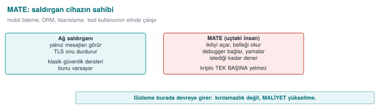

!!! note "Kısa tarihçe: kod gizleme nereden geldi?"
    - **1976** — Diffie & Hellman, bir programı "anlaşılmaz ama çalışır" kılma fikrini ilk kez tartışır (gizlilik-yoluyla değil, **çaba-yoluyla** koruma).
    - **1997** — Collberg, Thomborson ve Low ilk **gizleme taksonomisini** (düzen · veri · kontrol akışı · önleyici) ve *güç–dayanıklılık–gizlilik–maliyet* çerçevesini yayımlar. Bu dersteki **beş aile** buradan gelir.
    - **2001** — Barak vd. "kusursuz (kara-kutu) gizleme genel olarak **imkânsızdır**" teoremini kanıtlar → gizleme bu yüzden "kırılamazlık" değil, **maliyet** olarak öğretilir.
    - **2002** — Chow vd. **whitebox AES** ile anahtarı yazılıma gömme fikrini başlatır ([11. hafta](../week-11/cen429-week-11.md)).
    - **2010'lar** — DRM, mobil bankacılık ve oyun sektörü gizlemeyi yaygınlaştırır; **Tigress** (Collberg) ve **Obfuscator-LLVM** işi araç hâline getirir ([14. hafta](../week-14/cen429-week-14.md)).

    Yani gizleme, akademik bir **imkânsızlık** sonucunun üzerine kurulmuş **pratik bir geciktirme** disiplinidir.

### "İmkânsızlık" ne demek? Barak vd.'nin sonucunu sıfırdan anlayalım

Tarihçedeki 2001 maddesini biraz açalım, çünkü bu hafta boyunca öğreneceğimiz her kuralın **neden asla "kırılamaz"
diye pazarlanmadığının** temelidir. "Kusursuz kara-kutu gizleme" şu anlama gelir: bir programı öyle bir hâle
getirmek ki, saldırgan **girdi verip çıktısını gözlemlemekten** öte hiçbir şey öğrenemesin — programın içini açıp
baksa bile, yalnızca girdi-çıktı ilişkisini gözlemleyen biriyle **aynı** bilgiye sahip olsun. Barak ve arkadaşları,
**her** program için böyle mükemmel bir dönüşümün var olamayacağını matematiksel olarak kanıtladılar: özel
tasarlanmış bazı programlar vardır ki, onların içine bakmak, yalnızca dışarıdan gözlemlemekten **kaçınılmaz olarak
daha fazla** bilgi verir — dönüşüm ne kadar iyi yapılırsa yapılsın.

Bu, dersimiz için iki somut sonuç doğurur:

1. Hiçbir K-01–K-12 kuralı (ya da bunların toplamı) "saldırgan hiçbir zaman hiçbir şey öğrenemez" diye
   **iddia edilemez** — böyle bir iddia matematiksel olarak çürütülmüştür.
2. Bu yüzden bu hafta her kuralı "neyi korur / **maliyeti / sınırı**" biçiminde yazıyoruz (bölüm 4'teki şablon):
   amaç kusursuz gizlilik değil, bölüm 1'deki üç kuralın (maliyeti artır, otomasyonu kır, zaman kazandır) pratik
   hedefleridir.

!!! success "Kural: 'kırılamaz' kelimesini hiçbir koruma açıklamasında kullanmayın"
    S9'unuzda ya da bir üretim belgesinde bir korumayı "kırılamaz", "aşılamaz" gibi ifadelerle tanımlamak hem
    akademik olarak yanlıştır (yukarıdaki teorem) hem de bir değerlendiriciye karşı **inandırıcılığınızı zedeler**.
    Bunun yerine ölçülebilir ifadeler kullanın: "sembolik yürütmeye karşı ölçülmedi", "statik taramayı X süre
    geciktirir", "iki bağımsız nokta değiştirilmeden atlatılamaz" gibi.

Bu modelde bir gerçekle başlamak dürüstlüktür: **yeterli zamanı, becerisi ve motivasyonu olan bir saldırgan her
gizlemeyi eninde sonunda çözer.** Cookbook bunu açıkça söyler (Tarif 12.1): anti-tampering önlemleri "kırılamaz"
değildir; amaçları **kırmayı ekonomik olmaktan çıkarmaktır**. O yüzden gizlemeyi bir sır saklama yöntemi değil, bir
**maliyet yükseltme kuralı** olarak ele alırız:

- **Kural 1 — Maliyeti değerin üstüne çıkar.** Saldırıyı, korunan varlığın değerinden daha pahalı hale getir. 10 TL'lik
  bir sırrı 1000 TL'lik bir çabayla korumak akıldışıdır; tersi de geçerlidir.
- **Kural 2 — Otomasyonu kır.** Bir kopyada işe yarayan saldırının bütün kopyalarda otomatik işe yaramamasını sağla.
  Bunun adı **çeşitlendirmedir** (bu haftanın 5. bölümü, 14. haftada araçla).
- **Kural 3 — Diğer katmanlara zaman kazandır.** Gizleme tek başına bir savunma değildir; RASP ([6. hafta](../week-6/cen429-week-6.md)), bütünlük
  denetimi, sunucu tarafı denetimler ve anahtar yenileme için **zaman kazandıran** bir katmandır. Anahtar
  yenilenene, sürüm güncellenene kadar dayanması yeter.

!!! quote "Kaynağın dili"
    Teknik kılavuz her koruma önlemini üç başlıkla yazar: **Açıklama** (neyi korur), **Uygulama** (nasıl yapılır) ve
    **Örnek Kullanım** (nerede kullanılır), çoğu zaman bir **uyum gereksinimi kimliğiyle** birlikte (ör. bir ödeme
    şemasının "hassas veri düz metin loglanmaz" maddesi). Biz de bu hafta her tekniği aynı disiplinle, bir **kural**
    olarak yazacağız: *neyi korur · nasıl · maliyeti · sınırı*.

### Sayısal örnek: "maliyeti değerin üstüne çıkar" ne demek?

Kural 1'i havada bırakmayalım; basit bir maliyet-fayda hesabıyla somutlaştıralım. Değerler tamamen **varsayımsaldır**
(gerçek bir sözleşme ya da ürün rakamı değildir), amaç yalnız akıl yürütme biçimini göstermektir:

1. Deneyimli bir tersine mühendisin saatlik "pazar değeri"nin **500 TL** olduğunu varsayalım.
2. Hiç gizleme uygulanmamış bir ikili dosyada, `lisans_dogrula` gibi adı kendini ele veren bir fonksiyonu bulup
   mantığını çıkarmak **10 dakika (1/6 saat)** sürsün. Saldırganın maliyeti: `500 × (1/6) ≈ 83 TL`.
3. Bu hafta öğreneceğimiz üç kuralı (kontrol akışı düzleştirme K-04 + opak yüklem K-01 + dize kodlama K-07) birlikte
   uyguladığımızda, aynı analiz **40 saate** çıksın (bu tür süreler gerçek projelerde ölçülür, tahmin edilmez —
   bölüm 9). Saldırganın maliyeti: `500 × 40 = 20.000 TL`.
4. Şimdi iki senaryo karşılaştıralım:
     - Korunan varlığın (ör. bir lisans anahtarının kopyalanmasını engellemenin) değeri **yıllık 5.000 TL'lik bir
       gelir kaybını** önlüyorsa: `20.000 TL > 5.000 TL` — saldırı ekonomik olarak **anlamsızdır**, kural amacına
       ulaşmıştır.
     - Korunan varlığın değeri **yıllık 100.000 TL** ise: `20.000 TL < 100.000 TL` — saldırı hâlâ **kârlıdır**; tek
       başına bu üç kural yetmez, ek katmanlar (RASP — 6. hafta, whitebox — 11. hafta) gerekir.

!!! danger "Sık yapılan hata: bu hesabı tek seferlik ve kesin bir formül sanmak"
    Yukarıdaki sayılar bir **karar çerçevesi göstermek** içindir, gerçek bir güvenlik kanıtı değildir. "Saldırgan saati
    500 TL, demek ki güvendeyiz" diye bir sonuç çıkarmak yanlıştır: gerçek saldırganın becerisi, motivasyonu (ör.
    rakip bir şirket ya da meraklı bir öğrenci) ve elindeki otomatik araçlar (bölüm 10) bu süreyi kökten değiştirir.
    **Kural:** bu hesabı yalnız "hangi katmanları eklemeye değer" tartışmasını başlatmak için kullanın; kesin bir
    güvenlik garantisi olarak sunmayın. [13. haftadaki](../week-13/cen429-week-13.md) saldırı potansiyeli puanlaması bu tahmini sistematik hâle
    getirir.

Bu akıl yürütme aynı zamanda 1. haftada gördüğümüz **risk = olasılık × etki** çerçevesiyle örtüşür: burada "maliyeti
yükseltmek" saldırının **olasılığını** (rasyonel bir saldırganın girişme ihtimalini) düşürmenin yoludur.

## 2. Gizleme taksonomisi: beş aile

Collberg ve arkadaşlarının yazılım koruma dizisinden bu derse taşıdığımız sınıflandırma, gizlemeyi **neyi
gizlediğine** göre beş aileye ayırır. Bu harita
[4. haftada](../week-4/cen429-week-4.md#14-kod-gizlemeye-giris-tarif-121-123) tanıtıldı; burada her ailenin "ne
zaman kural haline geldiğini" netleştiriyoruz.

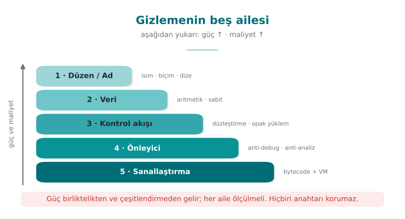

| Aile | Neyi gizler? | Örnek kurallar | Bu dersteki yeri |
| --- | --- | --- | --- |
| **Düzen (layout)** | Adları, biçimi, meta veriyi | Sembolleri görünmez yap, fonksiyon/dosya adlarını anlamsızlaştır, sürümde günlüğü kaldır | 4. hafta (giriş), bu hafta (derinlik) |
| **Veri** | Sabitleri, dizeleri, değişkenleri | Dize kodlama, sabit dönüşümleri, değişken bölme/birleştirme, opak boolean | Bu hafta bölüm 6 |
| **Kontrol akışı** | Algoritmanın yapısını | Kontrol akışı düzleştirme, opak yüklemler, sahte/ölü dallar, rastgele çıkış | Bu hafta bölüm 5 |
| **Önleyici (anti-analysis)** | Analiz araçlarının işini | Tersine derleyiciyi yanıltan yapılar, çalışma anında kod çözme | Bu hafta (kavram), [6. hafta](../week-6/cen429-week-6.md) (RASP) |
| **Sanallaştırma** | Makine kodunun kendisini | Fonksiyonu özel bir sanal makinenin bayt koduna çevirme | Bu hafta (kavram), [14. hafta](../week-14/cen429-week-14.md) (Tigress) |

!!! note "Sahada bu aileler birlikte kullanılır"
    Kaynak kılavuzun kod sağlamlaştırma bölümü, yukarıdaki ailelerin neredeyse tamamını **tek bir üründe** listeler:
    paylaşılan kütüphanede sembol görünürlüğünün kapatılması; fonksiyon, dosya ve parametre adlarının el ile
    anlamsızlaştırılması (asıl adlar iç belgede); aritmetik komutların dönüştürülmesi; statik dizelerin derleme
    öncesi kodlanıp kullanım anında çözülüp hemen silinmesi; yalnız "başarılı/başarısız" döndüren opak boolean'lar;
    sonucu değiştirmeyen sahte işlemler ve hiç çalışmayan ölü dallar; kontrol akışı düzleştirme ve hata durumunda
    rastgele bir çıkış noktası; sürümde günlüğün kaldırılması. **Hiçbiri tek başına güçlü değildir; güçleri birlikte
    ve RASP ile kullanılmalarından gelir.** Cookbook'un önerisi de aynıdır (Tarif 12.1): tek bir gelişmiş tekniği
    mükemmelleştirmek yerine, birkaç basit tekniği veri gizlemeyle birlikte kullanmak daha verimlidir.

### İşlenmiş örnek: bir fonksiyonda beş aileyi ayrı ayrı görelim

Taksonomiyi soyut bırakmayalım. Aşağıdaki küçük (sentetik) fonksiyonda, hangi satırın **hangi aileye** ait olduğunu
yorum satırlarıyla işaretleyelim:

```c title="Beş aile tek fonksiyonda (kavram gösterimi)"
/* DÜZEN (layout): fonksiyon adı 'esik_hesapla' değil, anlamsız 'f7' */
int f7(int x) {
    /* VERİ (data): 0x2A sabiti doğrudan yazılmıyor, iki parçadan üretiliyor (K-02, bölüm 6) */
    uint8_t esik = (uint8_t)(0x37 ^ 0x1D);

    /* KONTROL AKIŞI (control flow): opak yüklem ile dallanma (K-01, bölüm 5) */
    if (((x * (x + 1)) & 1u) == 0u) {
        return esik;          /* gerçek yol: x*(x+1) her zaman çift olduğu için buraya HER ZAMAN girilir */
    }
    return 0;                 /* ÖNLEYİCİ (anti-analysis) amaçlı ölü dal: hiç çalışmaz, analisti oyalar */
}
```

Beşinci aile — **sanallaştırma** — bu küçük örnekte yok, çünkü sanallaştırma tek bir satıra değil **fonksiyonun
tamamının makine koduna** uygulanır (bölüm 7, K-10). Bu örnek şunu göstermek içindir: gerçek kodda beş aile **iç
içe** yaşar; bir satırı okurken "bu hangi ailenin işi?" diye sorabilmek, kaynağın "hepsi birlikte kullanılmalı"
uyarısını somutlaştırır.

!!! danger "Sık yapılan hata: tek bir aileyi uygulayıp 'gizledim' sanmak"
    Yeni başlayan bir geliştirici genelde yalnız **düzen** ailesini uygular (adları anlamsızlaştırır) ve işi bitmiş
    sayar. Ama sembol adları gizlense bile, fonksiyonun **mantığı** (kontrol akışı ve veri) hâlâ düz okunabilir
    durumdadır — bir tersine derleyici çıktısında `f7` adını görmeseniz de içindeki `if`/`return` yapısını
    saniyeler içinde anlarsınız. **Kural:** bir koruma kararı en az **kontrol akışı + veri** ailelerini birlikte
    kapsamalı; yalnız düzen ailesi 4. haftada "giriş seviyesi" olarak öğretildi, bu hafta onun **yetersiz kaldığı**
    yer.

### Neden bu sıra? Aşağıdan yukarı güç ve maliyet neden artıyor?

Görseldeki (h09-01) "aşağıdan yukarı güç ve maliyet artar" notunu açalım — bu tesadüfi bir sıralama değildir, her
ailenin **neyi değiştirdiğiyle** doğrudan ilgilidir:

- **Düzen** yalnız **isimleri/meta veriyi** değiştirir; programın **davranışını üreten hiçbir şeye** dokunmaz. Bu
  yüzden uygulaması ucuzdur (bir derleyici bayrağı ya da isim listesi) ama gücü de düşüktür — az önceki örnekte
  gördüğümüz gibi, mantık hâlâ aynı kalır.
- **Veri** ve **kontrol akışı**, programın **ne işlediğini** ve **hangi sırayla işlediğini** değiştirir; bu yüzden
  hem daha fazla mühendislik emeği (her sabiti, her dalı elden geçirmek) hem de çalışma zamanı maliyeti (fazladan
  komutlar) gerektirir — güçleri de buna paralel artar.
- **Önleyici** teknikler (K-06'daki fonksiyon değiştirme gibi) analiz **araçlarının kendisini** hedef alır; bu,
  yalnız veriyi/akışı gizlemekten daha zahmetlidir çünkü hangi aracın kullanılacağını tahmin etmeniz gerekir.
- **Sanallaştırma**, programın **makine kodunun kendisini** değiştirir — artık orijinal komutlar hiç yoktur, yerine
  bambaşka bir komut kümesi (VM bayt kodu) geçer. Bu en radikal değişikliktir; bu yüzden hem en güçlü hem de (K-10'da
  gördüğümüz gibi %'lerle ifade edilemeyecek kadar büyük, kata-dayalı) en pahalı seçenektir.

Kısacası: bir aile **davranışı üreten mekanizmaya ne kadar yakınsa**, onu gizlemek o kadar güçlü ama o kadar pahalı
olur. Bölüm 9'daki dört ölçütü hatırlarsanız, bu sıralama aslında **güç ↔ maliyet ödünleşiminin** taksonomi
üzerindeki yansımasıdır.

## 3. Gizleme ne verir, ne vermez?

Bir kuralı doğru uygulamak için sınırını bilmek gerekir.
[4. haftada](../week-4/cen429-week-4.md#14-kod-gizlemeye-giris-tarif-121-123) bu ayrımı kısaca görmüştük; burada
tabloyu ve bir saldırganın ilk on dakikasını izleyen bir zaman çizelgesiyle derinleştiriyoruz. Gizlemenin verdikleri
ve **vermedikleri** şunlardır:

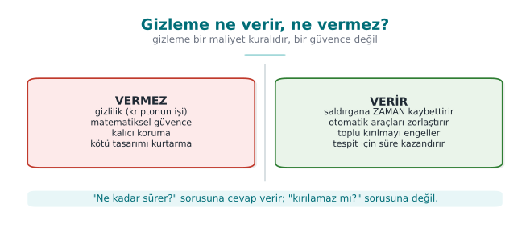

| Gizleme **verir** | Gizleme **vermez** |
| --- | --- |
| Statik analize karşı gecikme (`strings`, sembol tablosu, tersine derleme) | Bir sırrın matematiksel gizliliği — anahtar için **kriptografi** gerekir |
| Otomatik saldırıya karşı direnç (çeşitlendirmeyle) | Çalışan programda bellekten okumaya karşı koruma — bunun için **RASP** ve **whitebox** ([11. hafta](../week-11/cen429-week-11.md)) |
| Diğer katmanlara zaman | Kalıcı güvenlik — "kırılamaz" diye bir şey yoktur |
| Ölçülebilir bir maliyet artışı | Bedava koruma — her gizleme **bakım ve başarım** maliyeti getirir |

!!! danger "En sık yapılan hata: gizlemeyi anahtar saklama sanmak"
    Kodun içine gömülü ya da "gizlenmiş" bir anahtar, gizlense de **oradadır**. Program çalışırken anahtarı kullanmak
    zorundadır; o an bellekte açığa çıkar ve çözme mantığı da programın içindedir. Gizleme, `strings` gibi **statik**
    aramaları yavaşlatır; gerçek anahtar koruması için 11. haftadaki **whitebox kriptografi** ya da donanım (HSM,
    güvenli öğe) gerekir. Bu ayrımı 3. ve [10. haftalarda](../week-10/cen429-week-10.md) da vurgulamıştık: **gizlilik kriptografinin işidir, gizleme
    değil.**

### Adım adım: bir saldırganın ilk 10 dakikası — gizleme öncesi ve sonrası

Tablodaki "verir/vermez" ayrımını bir zaman çizelgesine dökelim. İki sürümü de düşünün: **korumasız** ve **bu
haftanın kurallarıyla korunmuş**.

**Korumasız ikili dosyada saldırganın ilk 10 dakikası:**

1. `strings program.exe` çalıştırır → `"CEN429-OK"`, `"Erisim reddedildi"` gibi dizeler doğrudan görünür (0. dakika).
2. Tersine derleyiciyi açar, sembol tablosunda `erisim_ver`, `lisans_dogrula` gibi adları görür (2. dakika).
3. Fonksiyonun CFG'sini okur: tek bir `if/else`, hangi dalın "izin", hangisinin "red" olduğu bir bakışta bellidir
   (5. dakika).
4. Karşılaştırma değerini (`"CEN429-OK"`) bulur, kendi girdisiyle test eder, doğrular (10. dakika). **İş bitmiştir.**

**Bu haftanın kurallarıyla korunmuş ikili dosyada aynı 10 dakika:**

1. `strings` çalıştırır → K-07 sayesinde dizeler görünmez; eline bir ipucu geçmez (0. dakika).
2. Sembol tablosuna bakar → K-06 ve düzen ailesi sayesinde tanınan bir ad yoktur (2. dakika).
3. CFG'yi açar → K-04 düzleştirmesi yüzünden tek bir `switch` dağıtıcısı görür; hangi `case`'in "izin" olduğu belli
   değildir; K-01 opak yüklemleri hangi dalın gerçek, hangisinin ölü olduğunu gizler (10. dakika, **hâlâ
   çözülmemiştir**).
4. Saldırgan bu noktada ya sembolik yürütme gibi otomatik bir araca geçer (bölüm 10 — dakikalar değil **saatler**
   alır) ya da vazgeçer.

Bu iki çizelge, tablodaki dört satırın **zamana yayılmış** hâlidir: gizleme "asla kırılmaz" demez, "10 dakika yerine
saatler/günler ister" der.

!!! danger "Sık yapılan hata: gizlemeyi bir sızma testinin (pentest) yerine koymak"
    Bir ekip "kodumuzu gizledik, artık güvenlik testine gerek yok" diyebilir. Bu yanlıştır: gizleme yalnız **statik**
    okumayı zorlaştırır; çalışan programın davranışını (girdi/çıktı, ağ trafiği, bellek) inceleyen **dinamik**
    analiz ve bağımsız bir **sızma testi/değerlendirme** (12–13. hafta) hâlâ gereklidir. **Kural:** gizleme, güvenlik
    testinin **yerine** değil, testin **bulacağı zayıflıkları geciktiren bir katman olarak** planlanır.

## 4. "Koruma kuralı" şablonu

Bu hafta boyunca her tekniği aynı dört soruyla değerlendireceğiz. Kendi projenizin S9 bölümünü de bu şablonla
yazmanızı bekliyoruz:

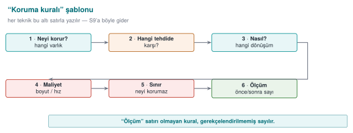

```text
KURAL K-xx: <tekniğin adı>
  Neyi korur? : hangi varlık / hangi kod bölümü (ör. lisans denetimi, anahtar türetme)
  Hangi tehdide karşı? : statik analiz / dinamik analiz / otomatik saldırı / kurcalama
  Nasıl? : kavram düzeyinde uygulama (bir cümle)
  Maliyet : boyut, hız, bakım, hata ayıklama zorluğu
  Sınır : neyi korumaz, hangi saldırıya dayanmaz
  Ölçüm : etkinliği nasıl doğrularız (bkz. bölüm 5)
```

Bu şablonun değeri şudur: bir gizleme "var/yok" değildir. Değerlendirici ([13. hafta](../week-13/cen429-week-13.md), saldırı potansiyeli puanlaması)
her katmanın saldırıyı **ne kadar geciktirdiğini** sorar. Yukarıdaki "Ölçüm" satırı olmadan bir koruma kararını
savunamazsınız.

### İşlenmiş örnek: şablonu bu haftanın demosuyla dolduralım

Soyut kalmasın diye, bu bölümün başındaki "Bu haftanın çalışan demosu" kutusunda verilen **gerçek ölçüm**
sayılarıyla (K-04'ün demoda uygulanmış hâli) şablonu tam olarak dolduralım:

```text
KURAL K-04-uygulama: erisim_ver fonksiyonuna kontrol akışı düzleştirme
  Neyi korur?       : erişim denetiminin akış sırası (CEN429-OK karşılaştırmasının nerede/nasıl yapıldığı)
  Hangi tehdide karşı?: statik analiz (tersine derleyicide CFG okuma), tek-bayt/tek-dal yama saldırısı
  Nasıl?            : switch tabanlı dağıtıcı (K-04) + opak yüklem (K-01) + rastgele çıkış (K-05)
  Maliyet           : komut sayısı 28 → 51 (+82%), dal sayısı 3 → 6 (+100%) — objdump ile ölçüldü
  Sınır             : yalnız düzleştirme; sembolik yürütmeyle geri açılabilir (bölüm 10); veri hâlâ K-07 ister
  Ölçüm             : objdump çıktısında komut/dal sayısı karşılaştırması (bu haftanın demosu, adım adım kılavuzda)
```

Maliyet satırındaki yüzdeleri doğrulayalım: komut sayısında artış `(51 − 28) / 28 × 100 ≈ %82,1`; dal sayısında
artış `(6 − 3) / 3 × 100 = %100` (tam iki katına çıkmış). Bu, "Ölçüm" satırının **iddia değil rakam** olması
gerektiğinin somut kanıtıdır — bölüm 9'da bu sayıları tekrar kullanacağız.

!!! danger "Sık yapılan hata: şablonun yalnız 'Nasıl' satırını doldurup 'Ölçüm' satırını boş bırakmak"
    Öğrenciler genelde hangi tekniği uyguladıklarını (Nasıl) yazar ama **maliyet** ve **ölçüm** satırlarını atlar.
    Bölüm 12'deki değerlendirici notu bunu açıkça söylüyor: ölçülmemiş bir koruma "iddia" sayılır, kanıt sayılmaz.
    **Kural:** altı satırın **hepsi** doldurulmadan bir koruma S9'a yazılmış sayılmaz; en az bir satır "Ölçüm"
    somut bir sayı ya da gözlem içermelidir (ör. "`strings` çıktısında X dizesi görünmüyor").

### İkinci bir işlenmiş örnek: farklı bir varlık için şablonu dolduralım

Şablonun her varlık türüne uyduğunu görmek için, bu kez bölüm 6'da tanıyacağımız bir **veri** koruma kuralını
dolduralım (fonksiyon değil, bir dize):

```text
KURAL K-07-uygulama: hata mesajı dizgesine dize kodlama
  Neyi korur?       : ikili dosyada duran "Erisim reddedildi" gibi okunabilir metinler
  Hangi tehdide karşı?: strings taraması (bölüm 3'teki "saldırganın ilk 10 dakikası")
  Nasıl?            : XOR 0x5A ile kodla, kullanım anında çöz, memset_s ile hemen sil (bölüm 6)
  Maliyet           : düşük — birkaç ek komut, ölçülebilir bir hız kaybı yok
  Sınır             : çözme anahtarı ikilide durur; gerçek anahtar koruması değildir (bölüm 3 kuralı)
  Ölçüm             : strings çıktısında ilgili dizge sayısı: kodlama öncesi 1, sonrası 0
```

İki örneği (K-04-uygulama ve K-07-uygulama) yan yana koyduğumuzda fark netleşir: **kontrol akışı** kuralları
genelde "komut/dal sayısı" ile, **veri** kuralları genelde "görünür dize/sabit sayısı" ile ölçülür — ama her
ikisinde de şablonun altı satırı **aynı disiplinle** doldurulur. S9'unuzda en az bir kontrol akışı, bir de veri
kuralı için bu şablonu ayrı ayrı doldurmanız beklenir.

---

## 5. Kontrol akışı kuralları (ileri)

Derlenmiş bir fonksiyonun **kontrol akışı grafiği** (CFG) algoritmanın iskeletini gösterir: hangi denetim hangi sırayla
yapılıyor, hangi dal başarıya gidiyor. Beyaz kutu saldırganın ilk işi bu iskeleti çıkarmaktır. Kontrol akışı gizleme
kuralları, bu iskeleti okunamaz kılar. 4. haftada düzleştirmeye giriş yaptık; burada onu **güçlendiren** kuralları
ekliyoruz. Bütün örnekler sentetiktir ve tek bir küçük denetim (`erisim_ver`) üzerinden anlatılır.

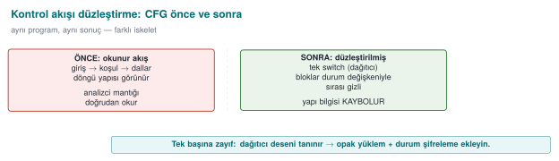

### KURAL K-01 — Opak yüklemler ve opak döngüler

**Neyi korur?** Bir dalın hangi koşulda alındığını; bir döngünün kaç kez döndüğünü. **Nasıl?** Değeri programcının
bildiği ama analiz aracının kolayca çözemediği bir ifadeyle (**opak yüklem**) dallanma yapılır. Klasik örnek, her zaman
doğru olan ama bunu statik olarak kanıtlaması zor bir aritmetik özdeşliktir:

```c title="Opak yüklem: her zaman true, ama statik analiz kolay kanıtlayamaz"
/* x*(x+1) her zaman çifttir → (x*(x+1)) % 2 == 0 daima doğrudur. */
static int opak_dogru(unsigned x) { return ((x * (x + 1)) & 1u) == 0; }

if (opak_dogru(sayac)) {          /* gerçek yol: daima buraya girer */
    durum = gercek_adim(durum);
} else {
    durum = sahte_adim(durum);    /* ölü yol: hiç çalışmaz ama analizde gerçek görünür */
}
```

??? question "Neden `x*(x+1)` her zaman çift? (tek tek görelim)"
    Ardışık iki tam sayıdan **biri mutlaka çifttir**; çift bir sayıyla çarpılan her şey çifttir. Sayılarla:

    | `x` | `x + 1` | `x * (x+1)` | Çift mi? |
    | --- | --- | --- | --- |
    | 0 | 1 | 0 | evet |
    | 1 | 2 | 2 | evet |
    | 2 | 3 | 6 | evet |
    | 3 | 4 | 12 | evet |
    | 4 | 5 | 20 | evet |
    | 7 | 8 | 56 | evet |

    Demek ki `(x * (x+1)) & 1` **her zaman 0**'dır, yani `opak_dogru(x)` **her x için `true`** döner. Program
    çalışırken daima "gerçek yol"a girer.

    **Peki neden buna 'opak' diyoruz?** Çünkü bunu *biz* biliyoruz; **statik analiz aracı bilmiyor**. Araç kodu
    çalıştırmadan baktığında `x`'in her değeri için bu çarpımın çift olduğunu kanıtlamak zorundadır — bu, basit bir
    sabit-katlama (constant folding) işiyle çözülemez. Bu yüzden araç **iki dalı da olası** sayar ve sahte dalı da
    çözümlemek zorunda kalır. Analizcinin işi ikiye katlanır; programın davranışı ise hiç değişmez.

    !!! warning "Sınırı da bilin"
        Bu **klasik** bir kalıptır; modern araçların kütüphanelerinde tanınır. Bu yüzden [14. haftada](../week-14/cen429-week-14.md) Tigress ile
        **tohumla çeşitlendirilmiş** ve daha zor yüklemler üretiyoruz — aynı kalıbı her derlemede tekrarlamak
        dayanıklılığı düşürür.

Kılavuz, opak döngüleri ayrı bir kural olarak yazar: döngüler (for, while) doğrudan görünmez; **kontrol akışı
düzleştirmenin içine gizlenir**, gövde küçük bloklara bölünür ve yineleme bir durum değişkeniyle yönetilir. Böylece
"şu döngü N kez dönüyor" bilgisi CFG'den okunamaz.

**Maliyet:** düşük–orta (fazladan aritmetik ve dal). **Sınır:** iyi bilinen opak yüklem kalıpları (kütüphaneler)
otomatik tanınabilir; bu yüzden çeşitlendirilmeleri gerekir. **Ölçüm:** düzleştirme öncesi/sonrası temel blok sayısı.

**İşlenmiş örnek: opak bir döngü sınırını elle izleyelim.** Kılavuzun "döngü sınırı CFG'den okunamaz" iddiasını
sayılarla doğrulayalım. Gerçek yineleme sınırımız `3` olsun, ama bunu doğrudan yazmak yerine ikinci bir **her zaman
doğru** opak yüklemle örtelim:

```c title="Opak döngü: gerçek sınır (3) kodda açıkça görünmez"
static int hep_dogru(unsigned y) { return ((y * y + y) & 1u) == 0u; }  /* y*(y+1) her zaman çift — bkz. yukarısı */

unsigned i = 0;
while (hep_dogru(i) && i < GERCEK_SINIR) {   /* GERCEK_SINIR = 3, ayrı bir sabitte tanımlı (K-02 ile kodlanabilir) */
    isle(i);
    i++;
}
```

Elle izleyelim (`GERCEK_SINIR = 3`):

| Adım | `i` | `hep_dogru(i)` hesabı | Sonuç | `i < 3`? | Döngü gövdesi çalışır mı? |
| --- | --- | --- | --- | --- | --- |
| 1 | 0 | `0*0+0=0`, `0 & 1 = 0` | true | evet | evet → `isle(0)`, `i=1` |
| 2 | 1 | `1*1+1=2`, `2 & 1 = 0` | true | evet | evet → `isle(1)`, `i=2` |
| 3 | 2 | `2*2+2=6`, `6 & 1 = 0` | true | evet | evet → `isle(2)`, `i=3` |
| 4 | 3 | `3*3+3=12`, `12 & 1 = 0` | true | **hayır** (`3 < 3` yanlış) | **hayır**, döngü biter |

Sonuç: döngü tam olarak **3 kez** çalışır (`i = 0, 1, 2`), tıpkı beklendiği gibi. Ama dikkat: `hep_dogru(i)` **her
zaman** `true` döner — bu yüzden bir analiz aracı, döngünün ne zaman biteceğini anlamak için `hep_dogru`'yu değil
`i < GERCEK_SINIR` karşılaştırmasını izlemek zorundadır; ve `hep_dogru`'nun her zaman doğru olduğunu **kanıtlamak**
için de yukarıdaki tam-sayı özdeşliğini çözmesi gerekir. İki ayrı analiz yükü aynı satıra binmiştir.

### KURAL K-02 — Aritmetik komutların kodlanması

**Neyi korur?** Sabitleri ve basit hesapları; "bu sayı 0x1F, bu işlem bir XOR" gibi doğrudan okunabilir ipuçlarını.
**Nasıl?** Bir işlem, sonucu değişmeyen ama daha karmaşık görünen denk bir ifadeyle değiştirilir (mixed
boolean-arithmetic). Örneğin `a + b`, `(a ^ b) + 2*(a & b)` ile aynıdır; `x * 2`, `x << 1` ile. Sabitler doğrudan
yazılmaz, çalışma anında küçük bir hesapla üretilir:

```c title="Sabit dönüşümü: 0x2A doğrudan görünmez"

/* 0x2A yerine iki parçadan üret; ikili dosyada '0x2A' araması sonuç vermez. */
static uint8_t esik(void) { uint8_t a = 0x37, b = 0x1D; return (uint8_t)(a ^ b); } /* = 0x2A */
```

**Maliyet:** düşük. **Sınır:** modern tersine derleyiciler ve `arybo`/`msynth` gibi araçlar birçok MBA ifadesini
sadeleştirebilir; tek başına zayıftır, kontrol akışı gizlemeyle birlikte anlam kazanır. **Ölçüm:** sabit için
`strings`/bayt araması sonuç vermemeli.

**İşlenmiş örnek: iki MBA özdeşliğini elle doğrulayalım.** Kuralın verdiği örnek `a + b` ↔ `(a ^ b) + 2·(a & b)`
iddiasını **sayılarla** kanıtlayalım (`a = 5`, `b = 3`):

| İfade | Hesap | Sonuç |
| --- | --- | --- |
| `a + b` | `5 + 3` | `8` |
| `a ^ b` | `0101 ^ 0011 = 0110` | `6` |
| `a & b` | `0101 & 0011 = 0001` | `1` |
| `(a ^ b) + 2·(a & b)` | `6 + 2·1 = 6 + 2` | `8` |

İkisi de `8` — özdeşlik doğrulandı. Bu, dört bitlik her `a,b` çifti için geçerli bir cebirsel kimliktir (taşıma
bitini `2·(a&b)` terimi telafi eder); derleyici bunu `a+b` yerine üretirse, ikili dosyada düz bir "toplama" görünmez,
üç ayrı komut (XOR, AND, kaydırma+toplama) görünür.

Aynı mantıkla kuraldaki `esik()` fonksiyonunun ürettiği `0x2A` sabitini de doğrulayalım (`a = 0x37`, `b = 0x1D`):

| Bit | `0x37` | `0x1D` | XOR |
| --- | --- | --- | --- |
| 7–4 | `0011` | `0001` | `0010` |
| 3–0 | `0111` | `1101` | `1010` |

Sonuç: `0010 1010` = `0x2A` — kod bloğundaki yorumla birebir örtüşüyor. İkili dosyada `0x2A` değeri **hiçbir yerde**
tek bir bayt olarak durmaz; yalnız `0x37` ve `0x1D` durur, `strings`/bayt taramasıyla `0x2A` aranırsa **sonuç
çıkmaz**.

!!! danger "Sık yapılan hata: dönüşümü yalnız derleme-zamanı sabitler üzerinde yapmak"
    `esik()` örneğini `#define ESIK ((0x37) ^ (0x1D))` gibi bir önişlemci makrosuyla yazarsanız, derleyici **sabit
    katlama (constant folding)** yaparken bu ifadeyi derleme sırasında kendisi hesaplar ve ikili dosyaya doğrudan
    `0x2A`'yı gömer — MBA dönüşümü kaynakta var, **ikilide yok**. **Kural:** dönüşümün gerçekten çalışma anında
    (runtime'da) hesaplandığını, derleme anında sadeleştirilmediğini derlenmiş ikili dosyada (`objdump`/`strings`
    ile) **doğrulayın**; bölüm 0'daki "derleme bayrağı" ayrımı burada da geçerlidir — optimizasyon açıkken test
    edin.

### KURAL K-03 — Sahte işlemler ve ölü dallar (ikisi farklıdır)

Kılavuz bu ikisini **ayrı** kurallar olarak yazar ve aradaki fark önemlidir:

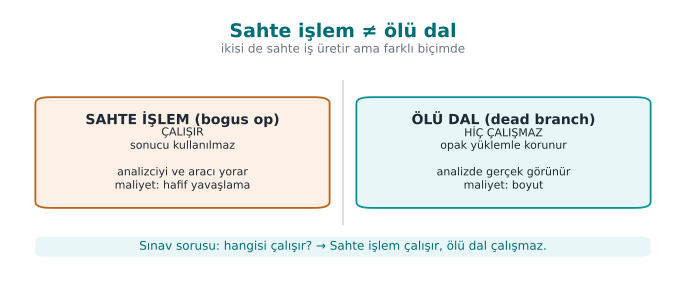

| | **Sahte işlem (bogus operation)** | **Ölü dal (bogus death branch)** |
| --- | --- | --- |
| Çalışır mı? | **Evet**, çalışır ama sonucu değiştirmez | **Hayır**, hiç çalışmaz (opak yüklemle korunur) |
| Amaç | Gerçek işlemleri kalabalık içinde gizlemek | Analiste sahte bir yürütme yolu göstermek |
| Örnek | Bir CRC hesabına `x ^ x` eklemek (sonuç değişmez) | `if (opak_yanlis()) { ... }` içindeki kod |

```c title="Sahte işlem: sonucu değiştirmez, kodu kalabalıklaştırır"
crc = crc32_guncelle(crc, veri, n);
crc ^= (sabit ^ sabit);   /* = crc; sahte işlem, sonuç aynı */
```

**Neyi korur?** Gerçek mantığı, onu çevreleyen anlamsız ama makul görünen kodla. **Maliyet:** düşük (sahte işlem)
–orta (ölü dallar CFG'yi büyütür). **Sınır:** ölü kod eleme yapan bir analiz aracı, opak yüklem çözülürse ölü dalı
atabilir; bu yüzden opak yüklemin kalitesine bağlıdır. **Ölçüm:** ölü dalların gerçek dallardan ayırt edilme süresi.

**İşlenmiş örnek: sahte işlem gerçekten sonucu değiştirmiyor mu?** Yukarıdaki `crc ^= (sabit ^ sabit)` satırını sayı
ile doğrulayalım (`sabit = 0x11` olsun): `sabit ^ sabit = 0x11 ^ 0x11 = 0x00` (herhangi bir değer kendisiyle
XOR'lanınca her zaman `0` verir — bölüm 0'daki XOR özdeşliğinin aynısı). `crc ^= 0x00` işlemi `crc`'yi **değiştirmez**
(`x ^ 0 = x`). Yani `sabit` ne olursa olsun bu satır matematiksel olarak her zaman etkisizdir; kalabalıklaştırma
etkisi yalnız **derlenmiş komut sayısında**dır, `crc`'nin değerinde değil.

!!! danger "Sık yapılan hata: sahte işlemi derleyicinin sessizce silmesi"
    Optimize edici bir derleyici (`-O2`, `-O3`), sonucu hiçbir yerde kullanılmayan ya da matematiksel olarak
    etkisiz olduğu **kanıtlanabilen** bir işlemi ölü kod (dead code) sayıp **tamamen kaldırabilir**. `crc ^= (sabit ^
    sabit)` gibi bir satır, derleyici sabit-katlama yaparsa `crc ^= 0` görür, bunu da hiçbir şey yapmıyor diye siler
    — gizleme, siz fark etmeden ortadan kalkar. **Kural:** sahte işlemlerde kullanılan değerler **çalışma anında**
    belirlenmeli (ör. bir girdiye ya da opak yükleme bağlı), derleme anında sabitlenmemeli; ayrıca gizlemeyi hep
    **optimizasyon açık** derlenmiş ikili üzerinde (bölüm 0'da tanımlanan derleme bayrağıyla) doğrulayın — "kaynakta
    var, ikilide yok" sık karşılaşılan bir sürprizdir.

### KURAL K-04 — Kontrol akışı düzleştirme (derin)

**Neyi korur?** Algoritmanın **yapısını**: blokların doğal komşuluğunu ve "hangi bloktan hangisine gidilir"
bilgisini. **Nasıl?** Kılavuzun deyişiyle, **dikey** kontrol akışı **yatay** hale getirilir: bütün temel bloklar tek
bir döngü içindeki bir `switch` dağıtıcısına taşınır; sıra yalnız bir **durum değişkeninden** okunur.

```c title="Düzleştirme şablonu (4. haftadan; burada güçlendiriyoruz)"
int durum = BASLA;
for (;;) {
    switch (durum) {
    case BASLA:  durum = ADIM1; break;
    case ADIM1:  durum = kosul ? ADIM2 : HATA; break;
    case ADIM2:  durum = BITIR; break;
    case HATA:   return RED;
    case BITIR:  return IZIN;
    default:     return RED;          /* rastgele çıkış buraya düşer (K-05) */
    }
}
```

[Dördüncü haftada](../week-4/cen429-week-4.md#16-kontrol-akisi-duzlestirme-ve-opak-degerler-tarif-123-128) bu
şablonun tek başına deneyimli bir analist için kısa sürede çözülebildiğini söylemiştik. Kılavuzun
"native tarafta bu düzleştirme birçok güvenlik özelliğiyle güçlendirilir" dediği güçlendirmeler tam olarak diğer
kurallardır:

- **Durum değerleri gizlenir** (K-02): `case 1, 2, 3` yerine dağınık, aritmetikle üretilen değerler; ardışıklık
  görünmez.
- **Sahte ve ölü bloklar** eklenir (K-03): hangi `case` gerçek, ayırt etmek zorlaşır.
- **Rastgele çıkış** (K-05): hata `default` dalından, öngörülemeyen bir durumla çıkar.
- **Opak yüklemlerle** dallanma (K-01): `case` geçişleri sabit değil, opak koşullara bağlıdır.

**Maliyet:** orta–yüksek (blok sayısı ve dal çok artar, başarım düşer). **Sınır:** yalnız düzleştirme, sembolik
yürütmeyle (bölüm 5) geri açılabilir; gücü güçlendirmelerden gelir. **Ölçüm:** tersine derleyicide CFG düğüm/kenar
sayısı, bir denetimi izlemek için gereken süre.

**İşlenmiş örnek: üç bloklu bir fonksiyonu elle düzleştirelim.** Aşağıdaki sıradan (düzleştirilmemiş) fonksiyonla
başlayalım:

```c title="Düzleştirme öncesi: doğal (dikey) akış"
int denetim(int girdi) {
    int a = girdi + 1;      /* Blok 1 */
    if (a > 10) {            /* Blok 2 */
        return HATA;
    }
    return a * 2;             /* Blok 3 */
}
```

Bu üç bloğu, K-04'teki şablonla düzleştirilmiş haline elle taşıyalım:

```c title="Düzleştirme sonrası: aynı üç blok, tek switch içinde"
int denetim(int girdi) {
    int durum = B1, a = 0;
    for (;;) {
        switch (durum) {
        case B1: a = girdi + 1; durum = B2; break;
        case B2: durum = (a > 10) ? B_HATA : B3; break;
        case B3: return a * 2;
        case B_HATA: return HATA;
        default: return HATA;      /* rastgele çıkış buraya düşer (K-05) */
        }
    }
}
```

`girdi = 4` için elle izleyelim: `durum=B1` → `a = 4+1 = 5`, `durum=B2`. `durum=B2` → `a(5) > 10` yanlış, `durum=B3`.
`durum=B3` → `return 5*2 = 10`. **İki sürüm de aynı `girdi` için aynı `10` değerini döndürür** — davranış korunmuştur,
yalnız akışın **şekli** değişmiştir: doğal sürümde üç blok art arda okunurken, düzleştirilmiş sürümde hepsi tek bir
`switch`'in eşit mesafedeki dalları gibi görünür ve aralarındaki **doğal komşuluk bilgisi** (B1'den sonra hep B2
gelir) CFG'den silinmiştir; artık yalnız `durum` değişkeninin çalışma anındaki değerinden okunabilir.

!!! danger "Sık yapılan hata: durum değerlerini ardışık bırakmak"
    `B1=1, B2=2, B3=3, B_HATA=4` gibi ardışık sabitler kullanmak, düzleştirmenin **görünüşte** var ama gerçekte zayıf
    olmasına yol açar: bir analist `case` sırasını okuyarak orijinal akışı kolayca tahmin eder. **Kural:** durum
    değerleri K-02 ile (aritmetik kodlama) ya da rastgele, dağınık sabitlerle üretilmeli; art arda gelen tam
    sayılar olmamalıdır — aksi hâlde düzleştirme yalnızca **görsel gürültü** eklemiş olur, gerçek koruma sağlamaz.

### KURAL K-05 — Kontrol akışından rastgele çıkış

**Neyi korur?** Bir denetimin **nerede** başarısız olduğunu. Saldırgan çoğu zaman "başarısızlık dalını" bulup onu
"başarı dalına" çevirmeye çalışır. **Nasıl?** Kılavuzun anlattığı gibi: bir denetim başarısız olduğunda, program
doğrudan bir "return RED" satırına gitmez; bunun yerine durum değişkeni **öngörülemeyen büyük bir değere** ayarlanır
ve fonksiyon `default` dalından çıkar. Başarılı çıkış da aynı yöntemle yapılabilir, böylece başarı ve başarısızlık
akışta birbirine benzer.

```c title="Rastgele çıkış: hata noktası akıştan okunamaz"
if (!imza_gecerli(p)) {
    durum = kararsiz_deger();   /* switch'te tanımlı olmayan bir değer → default */
    break;
}
```

**Maliyet:** düşük. **Sınır:** tek başına değil, düzleştirmeyle birlikte anlamlıdır. **Ölçüm:** "başarısızlık dalını
bul ve tersine çevir" saldırısının süresi; ideal olarak tek bir bayt yaması denetimi atlatmaya yetmemeli.

!!! danger "Sık yapılan hata: bütün hata durumları için aynı sentinel değeri kullanmak"
    Eğer `kararsiz_deger()` her zaman aynı sabiti (ör. hep `0xDEADBEEF`) döndürüyorsa, saldırgan ikili dosyada bu
    sabiti bir kez `grep` ile arayıp **bütün** hata noktalarını tek seferde bulur — rastgele çıkışın amacı tam
    tersine döner. **Kural:** sentinel değer her çağrı noktasında **farklı** olmalı (K-11'deki tohuma bağlı üretim
    ya da her çağrı yerinde ayrı bir sabit); aksi hâlde "rastgele çıkış" aslında **tek bir sabit imza** haline gelir
    ve bölüm 8'deki çeşitlendirme ilkesini ihlal eder.

### KURAL K-06 — Fonksiyon çağrılarının ve dış kütüphane bağımlılığının gizlenmesi

[4. haftada](../week-4/cen429-week-4.md#16-kontrol-akisi-duzlestirme-ve-opak-degerler-tarif-123-128) fonksiyon
adı ve bellek ayırma gizlemeye kısaca değinmiştik; burada bunu dış kütüphane bağımlılığı ve sahte parametrelerle
derinleştiriyoruz.

**Neyi korur?** "Şu fonksiyon `memcmp` çağırıyor, demek ki bir karşılaştırma yapıyor" gibi ipuçlarını. Standart
kütüphane çağrıları, saldırgana bir fonksiyonun ne yaptığını doğrudan söyler. **Nasıl?** Kritik yollarda standart
kütüphane fonksiyonları **kendi iç sürümleriyle** değiştirilir (ör. sabit zamanlı kendi `esit_mi` fonksiyonunuz),
böylece bağlantı çözümleyicide tanınan bir ad görünmez. Kılavuz ayrıca **fonksiyon parametrelerinin gizlenmesini** ve
**sahte parametreler** eklenmesini de ayrı kurallar olarak listeler: gerçek parametrelerin yanına hiç kullanılmayan
sahte parametreler konur; imza, saldırgan için yanıltıcı olur.

**Maliyet:** düşük–orta (kendi sürümleri bakım ister). **Sınır:** davranış analizi yine de ne yaptığını gösterebilir;
bu bir **gecikme** kuralıdır. **Ölçüm:** ikili dosyada tanınan kütüphane çağrılarının sayısı.

**İşlenmiş örnek: `memcmp` yerine kendi sabit zamanlı karşılaştırmanız.** Kural, standart `memcmp`'yi tanınabilir
olduğu için değiştirmemizi söylüyor; ama asıl kazanç [3. haftadan](../week-3/cen429-week-3.md) tanıdık bir yan kanal kapatmaktır:

```c title="Sabit zamanlı karşılaştırma (kavram)"
static int sabit_zamanli_esit_mi(const uint8_t *a, const uint8_t *b, size_t n) {
    uint8_t fark = 0;
    for (size_t i = 0; i < n; i++) {
        fark |= (uint8_t)(a[i] ^ b[i]);   /* her bayt işlenir, ilk uyuşmazlıkta DURMAZ */
    }
    return fark == 0;                      /* tek karşılaştırma, dizinin sonunda */
}
```

`a = {0x41,0x42,0x43}`, `b = {0x41,0x00,0x43}` için izleyelim: `i=0`: `0x41^0x41=0x00`, `fark = 0x00`. `i=1`:
`0x42^0x00=0x42`, `fark = 0x00 | 0x42 = 0x42`. `i=2`: `0x43^0x43=0x00`, `fark = 0x42 | 0x00 = 0x42`. Döngü **her
zaman üç adım da çalışır**, `i=1`'de uyuşmazlık bulunduğunda erken çıkmaz; sonunda `fark = 0x42 ≠ 0`, `esit_mi`
`0` (false) döner. Standart bir `memcmp` ya da elle yazılmış `for (...) if (a[i]!=b[i]) return 0;` ise `i=1`'de
**erken döner** — bu, uyuşmazlığın **nerede** olduğunu çalışma süresinden sızdırabilen klasik bir zamanlama
kanalıdır (3. haftadaki `CRYPTO_memcmp` kuralının aynısı). K-06'nın kazancı iki katlıdır: hem `memcmp` adı ikili
dosyada görünmez hem de karşılaştırma sabit zamanlıdır.

**Sahte parametre örneği.** Kuralın ikinci kısmı — sahte parametreler — imzayı yanıltıcı yapar:

```c title="Sahte parametre: imza yanıltıcı hâle gelir"
/* Gerçek imza: int erisim_kontrol(const char *kod); */
int erisim_kontrol(const char *kod, int gunluk_seviyesi, void *ayarlar) {
    (void)gunluk_seviyesi;   /* kullanılmıyor — sahte parametre */
    (void)ayarlar;           /* kullanılmıyor — sahte parametre */
    return sabit_zamanli_esit_mi((const uint8_t *)kod, GERCEK_KOD, GERCEK_KOD_UZUNLUK);
}
```

Bir tersine derleyici bu fonksiyonu üç parametreli olarak gösterir; saldırgan "ikinci parametre günlük seviyesi mi,
üçüncüsü bir yapı işaretçisi mi gerçekten kullanılıyor mu?" sorusuna cevap ararken zaman kaybeder — hâlbuki ikisi de
**hiç kullanılmaz**. `(void)parametre` satırları derleyicinin "kullanılmayan parametre" uyarısını susturur; gerçek
projelerde bu satırlar aranmadıkça sahte olduğu belli olmaz.

!!! warning "Kural: sabit zamanlılığı bozma"
    Kendi karşılaştırma/kripto sürümünüzü yazarken **sabit zamanlı** olmasına dikkat edin (3. hafta). Gizleme uğruna
    erken çıkışlı bir karşılaştırma yazmak, bir **yan kanal** açar; koruma eklerken yeni bir açık yaratmayın.

---

## 6. Veri gizleme kuralları

Kontrol akışı algoritmanın yapısını gizler; **veri gizleme** ise programın işlediği **değerleri** gizler: dizeler,
sabitler, tablolar ve değişkenler. Cookbook'un anti-tampering bölümü ile teknik kılavuz burada aynı kuralları
listeler.

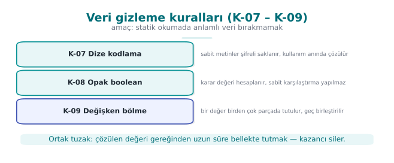

### KURAL K-07 — Statik dizelerin kodlanması

[4. haftada](../week-4/cen429-week-4.md#15-sembol-dize-ve-gunluk-gizleme) dize gizlemeye giriş yapmış,
[5. haftada](../week-5/cen429-week-5.md#12-dize-gizleme-ve-dinamik-yontem-cagrisi) Java tarafında XOR ile elle
çözmüştük; burada aynı fikri C/C++ tarafında derinleştiriyoruz.

**Neyi korur?** İkili dosyadaki okunabilir metinleri. Tersine mühendisliğin en ucuz ilk adımı `strings` çalıştırmaktır;
`"Lisans gecersiz"` ya da bir URL, saldırgana nereye bakacağını söyler. **Nasıl?** Hassas dizeler **derleme öncesinde
kodlanır** (ör. bir XOR anahtarıyla ya da bir üretim betiğiyle şifrelenir), ikili dosyada kodlanmış hâlde durur,
**kullanım anında çözülür** ve iş biter bitmez **bellekten silinir**.

```c title="Dize kodlama: kullan ve hemen sil (sentetik)"
static const uint8_t GIZLI[] = { 0x3B,0x2A,0x2E,0x2E,0x2D };   /* "merhaba" değil; sentetik */
void kullan(void) {
    char tmp[sizeof GIZLI];
    for (size_t i = 0; i < sizeof GIZLI; i++) tmp[i] = GIZLI[i] ^ 0x5A;  /* çöz */
    isle(tmp, sizeof GIZLI);
    memset_s_benzeri(tmp, sizeof tmp);   /* kullanımdan hemen sonra sil (3. hafta) */
}
```

**Maliyet:** düşük. **Sınır:** çalışan programda çözülmüş dize bellekte görünür; bu bir **statik tarama** önlemidir.
Çözme anahtarı da ikili dosyadadır — bu yüzden sahada çözme anahtarı **parçalanır ve dağıtılır** ve çözme fonksiyonu
ek denetimlerle korunur. **Ölçüm:** `strings` çıktısında hassas dize **bulunmamalı**.

**İşlenmiş örnek: yukarıdaki `GIZLI` dizisini elle çözelim.** Kod bloğundaki `GIZLI = {0x3B, 0x2A, 0x2E, 0x2E,
0x2D}` dizisini, her baytı `0x5A` ile XOR'layarak (bölüm 0'daki bit tablosuyla aynı yöntem) tek tek çözelim:

| İndeks | `GIZLI[i]` | `^ 0x5A` (bit hesabı) | Sonuç (hex) | ASCII |
| --- | --- | --- | --- | --- |
| 0 | `0x3B` = `0011 1011` | `0011 1011 ^ 0101 1010` | `0110 0001` = `0x61` | `'a'` |
| 1 | `0x2A` = `0010 1010` | `0010 1010 ^ 0101 1010` | `0111 0000` = `0x70` | `'p'` |
| 2 | `0x2E` = `0010 1110` | `0010 1110 ^ 0101 1010` | `0111 0100` = `0x74` | `'t'` |
| 3 | `0x2E` = `0010 1110` | (aynı hesap) | `0x74` | `'t'` |
| 4 | `0x2D` = `0010 1101` | `0010 1101 ^ 0101 1010` | `0111 0111` = `0x77` | `'w'` |

Çözülen bayt dizisi `"apttw"` — kod yorumundaki "`merhaba` değil; sentetik" ifadesiyle tutarlı: gerçek bir dizeyi
değil, **mekanizmayı** gösteriyoruz. Önemli olan şudur: ikili dosyada duran baytlar `{0x3B, 0x2A, 0x2E, 0x2E,
0x2D}`'dir; `strings` bu baytları çalıştırıp XOR uygulamaz, olduğu gibi okumaya çalışır ve okunabilir bir metin
bulamaz (bu beş bayt yazdırılabilir ASCII aralığının dışına düşebilir ya da anlamsız görünür) — saldırganın ilk ve
en ucuz adımı (bölüm 3'teki "ilk 10 dakika") burada **boşa çıkar**.

!!! danger "Sık yapılan hata: `memset` ile 'sildim' sanmak"
    Kod örneğindeki `memset_s_benzeri(tmp, sizeof tmp)` satırı özellikle **sıradan `memset` değil** özel bir
    fonksiyon çağırır; bunun nedeni derleyici optimizasyonlarıdır. Eğer bir değişken kullanıldıktan hemen sonra
    kapsam dışına çıkıyorsa (fonksiyon bitiyorsa), optimize edici derleyici "bu `memset` çağrısının hiçbir gözlenen
    etkisi yok" diye **ölü depolama elemesi (dead store elimination)** yaparak siler — çözülmüş sır bellekte
    **silinmeden** kalır. **Kural:** hassas belleği temizlerken derleyicinin silemeyeceği bir çağrı kullanın
    (`memset_s`, `SecureZeroMemory`, `explicit_bzero` ya da `volatile` işaretçili elle yazılmış döngü); düz `memset`
    kullanıp "temizledim" varsaymak, temizlemenin kendisini gizleme kadar gerçek bir hatadır.

!!! danger "Kural: dize gizleme ile anahtar saklama karıştırılmaz"
    Dize gizleme, `strings` gibi statik taramaları durdurur; **anahtar** korumak için değildir. Bu 1. bölümdeki
    "gizleme anahtar saklamaz" kuralının somut halidir. Gerçek anahtarlar için whitebox ([11. hafta](../week-11/cen429-week-11.md)) ya da donanım.

### KURAL K-08 — Sabit dönüşümleri, opak boolean ve fonksiyon boolean dönüşleri

Kılavuz güvenlik sonuçlarının nasıl temsil edileceğini ayrı bir kural yapar. Bir denetimin sonucunu düz bir `0`/`1`
olarak döndürmek tehlikelidir: saldırgan tek bir baytı çevirerek "başarısız"ı "başarılı"ya dönüştürebilir. **Opak
boolean** kuralı, doğru/yanlış değerini **birden çok değere bağlı** ve tek bir bayt yamasıyla çevrilemeyecek biçimde
tutar. Fonksiyonlar da düz boolean yerine bu tür **opak dönüş kodları** verir.

```c title="Opak boolean: tek bayt yaması sonucu çeviremez (kavram)"
/* "izin" değeri tek bir sabit değil; iki durumdan türetilir ve çağıran taraf ikisini de doğrular. */
typedef struct { uint32_t a, b; } Karar;
static Karar izin_ver(void)  { return (Karar){ 0xA3C1u, 0x5C3Eu }; } /* a ^ b == 0xFFFF */
static int  karar_izin_mi(Karar k) { return (k.a ^ k.b) == 0xFFFFu; }
```

**Maliyet:** düşük. **Sınır:** yeterince incelenirse çözülür; amacı tek-bayt yamayı ve kaba dal-çevirmeyi
engellemektir. **Ölçüm:** "sonucu tersine çevir" saldırısında değiştirilmesi gereken bağımsız nokta sayısı > 1.

**İşlenmiş örnek: `0xA3C1 ^ 0x5C3E` gerçekten `0xFFFF` mi?** Kod örneğindeki iddiayı dörtlü gruplar (nibble) hâlinde
doğrulayalım:

| Nibble | `0xA3C1` | `0x5C3E` | XOR |
| --- | --- | --- | --- |
| 15–12 | `A` = `1010` | `5` = `0101` | `1111` = `F` |
| 11–8 | `3` = `0011` | `C` = `1100` | `1111` = `F` |
| 7–4 | `C` = `1100` | `3` = `0011` | `1111` = `F` |
| 3–0 | `1` = `0001` | `E` = `1110` | `1111` = `F` |

Dört nibble de `F` çıkıyor → `a ^ b = 0xFFFF`, iddia doğrulandı. Her nibble'ın `F` olmasının nedeni basit: iki değer
birbirinin **bit-tersi** olacak şekilde seçilmiş (`A=1010` ↔ `5=0101`, `3=0011` ↔ `C=1100`, vb.).

Şimdi kuralın "tek bayt yamasıyla çevrilemez" iddiasını sınayalım: saldırgan `a`'nın yalnız **alt baytını** `0xC1`'den
`0x00`'a değiştirsin (`a` artık `0xA300`). Yeni sonuç: `0xA300 ^ 0x5C3E`:

| Nibble | `0xA300` | `0x5C3E` | XOR |
| --- | --- | --- | --- |
| 15–12 | `A`=`1010` | `5`=`0101` | `F` |
| 11–8 | `3`=`0011` | `C`=`1100` | `F` |
| 7–4 | `0`=`0000` | `3`=`0011` | `3` |
| 3–0 | `0`=`0000` | `E`=`1110` | `E` |

Sonuç: `0xFF3E` — `0xFFFF`'e **eşit değil**. `karar_izin_mi` fonksiyonu `(k.a ^ k.b) == 0xFFFFu` kontrolünde `false`
döner: tek baytlık kaba bir yama, "izin"i tetiklemeyi **başaramaz**. Saldırganın işe yaraması için hem `a`'nın hem
`b`'nin **birbiriyle tutarlı** biçimde değiştirilmesi gerekir — bu da tek nokta yerine en az iki bağımsız noktayı
aynı anda bulup değiştirmesini gerektirir; "Ölçüm" satırındaki "bağımsız nokta sayısı > 1" ifadesinin sayısal
karşılığı tam olarak budur.

!!! danger "Sık yapılan hata: karşılaştırma sabitini (`0xFFFF`) her yerde aynı bırakmak"
    Yukarıdaki mekanizma tek başına güçlü görünse de, eğer projede **her** opak boolean denetimi aynı `0xFFFFu`
    sabitiyle karşılaştırıyorsa, bir saldırgan ikili dosyada bu sabiti bir kez bulup **bütün** izin noktalarının
    deseni hakkında fikir sahibi olur — K-05'teki "aynı sentinel'i her yerde kullanmak" hatasının aynısı. **Kural:**
    her fonksiyon/denetim için **farklı** bir hedef sabit (ör. `0xA5C3`, `0x3D71`, ...) kullanın; sabitin kendisi de
    K-02 ile kodlanabilir.

### KURAL K-09 — Değişken bölme, birleştirme ve dizi yeniden yapılandırma

**Neyi korur?** Hassas bir değişkenin bellekteki tanınabilir izini. "32 baytlık bir blok = bir AES anahtarı" gibi
kalıplar saldırgana yol gösterir. **Nasıl?** Bir değişken iki parçaya **bölünür** (ör. bir 32-bit değeri iki 16-bit
paydan hesaplamak), birden çok değişken tek bir söze **birleştirilir**, diziler yeniden düzenlenir; tamponların
boyutu, sırası ve yerleşimi değiştirilir, araya sahte ayırmalar konur ve kullanımdan sonra rastgele değerle doldurulur.

**Maliyet:** düşük–orta. **Sınır:** yalnız statik/kalıp analizini yavaşlatır. **Ölçüm:** hassas tamponun bellek
kalıbından tanınma süresi.

**İşlenmiş örnek: 32 bitlik bir değeri bölüp geri birleştirelim.** Saklamak istediğimiz değer `0x1234ABCD` (32-bit)
olsun. Bunu tek bir 4 baytlık blok olarak tutmak yerine, iki ayrı 16-bit **parça**ya bölelim:

```c title="Değişken bölme ve yeniden birleştirme"
uint16_t yuksek = 0x1234;   /* üst 16 bit — ayrı bir değişkende, belki ayrı bir yapıda */
uint16_t dusuk  = 0xABCD;   /* alt 16 bit — koddaki başka bir yerde tutulur */

uint32_t deger = ((uint32_t)yuksek << 16) | dusuk;   /* kullanım anında yeniden birleştirilir */
```

Doğrulayalım: `yuksek << 16` işlemi `0x1234`'ü 16 bit sola kaydırır → `0x12340000`. Bunu `dusuk = 0x0000ABCD` ile
`OR`'larsak: `0x12340000 | 0x0000ABCD = 0x1234ABCD` — orijinal değeri tam olarak geri verir.

Bunun neden işe yaradığını bellek tarayan bir araç gözünden düşünelim: böyle bir araç genelde "art arda duran 4
(ya da 16/32) baytlık, yüksek entropili bir blok" arar — bu, bölüm 0'daki entropi tanımının pratikte kullanıldığı
yerdir (ör. bir AES anahtarının bellekte "dizi B" gibi görünmesi). `yuksek` ve `dusuk` ayrı değişkenlerde, hatta
derleyicinin seçimine bağlı olarak bellekte **bitişik olmayan** adreslerde durabilir; taranan blok artık 4 bayt
değil, iki ayrı 2 baytlık parçadır ve aralarında "bu ikisi birleşince bir anahtar oluşturur" bilgisi kodda **açıkça
yazmaz**, yalnız birleştirme ifadesinde gizlidir.

!!! danger "Sık yapılan hata: birleştirilmiş değeri erken üretip uzun süre bellekte tutmak"
    Bölme/birleştirmenin kazancı, yalnız **kullanım anında** birleştirme yapıldığı sürece geçerlidir. Eğer `deger`
    değişkeni fonksiyonun başında bir kez hesaplanıp fonksiyon boyunca (ya da bir yapı içinde kalıcı olarak)
    saklanırsa, artık ortada yine tek, bütün ve tanınabilir bir 32-bit blok vardır — K-09'un kazandırdığı avantaj
    kaybolur. **Kural:** birleştirmeyi yalnız **tam ihtiyaç duyulan anda** yapın, kullanımdan hemen sonra K-07'deki
    gibi (`memset_s` ile) temizleyin; parçaları (`yuksek`, `dusuk`) ayrı tutmak, birleşik hâli sürekli saklamaktan
    her zaman daha güvenlidir.

## 7. Program bütünü düzeyinde kurallar

### KURAL K-10 — Sanallaştırma tabanlı gizleme (kavram)

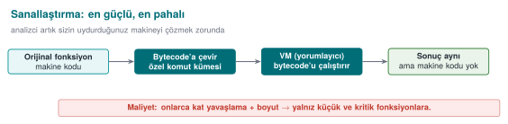

**Neyi korur?** Bir fonksiyonun **makine kodunun kendisini**. **Nasıl?** Fonksiyon, gerçek makine komutları yerine
**özel bir sanal makinenin (VM) bayt koduna** çevrilir; ikili dosyaya bu bayt kodu ile onu yorumlayan küçük bir
yorumlayıcı gömülür. Saldırgan artık tanıdık makine kodunu değil, önce çözmesi gereken **özel bir komut kümesini**
görür.

**Maliyet:** **yüksek** — hem başarım (yorumlanan kod yavaştır) hem bakım açısından pahalıdır; bu yüzden yalnız en
kritik, küçük ve sık değişmeyen fonksiyonlara uygulanır. **Sınır:** VM'in kendisi bir kez çözülürse bütün korunan
fonksiyonlar açılabilir; ve tek bir VM tasarımı bütün kopyalarda aynıysa çeşitlendirme yoktur. **Ölçüm:** korunan
fonksiyonun boyut/hız maliyeti; bir analistin VM komut kümesini çözme süresi. [14. haftada](../week-14/cen429-week-14.md) Tigress'in `Virtualize`
dönüşümüyle bunu kavramsal olarak göreceğiz.

**İşlenmiş örnek: küçük, kavramsal bir bayt kodu ve yorumlayıcısı.** Gerçek sanallaştırma araçları çok daha
karmaşıktır; ama mekanizmayı görmek için üç komutluk minik bir "sanal makine" kuralım — amacımız `5 + 7` işlemini
gerçek bir toplama komutu **olmadan** hesaplamak:

```c title="Sanallaştırma fikri (küçük, kavramsal örnek — gerçek Tigress çıktısı değildir)"
enum { OP_PUSH, OP_ADD, OP_RET };
uint8_t kod[] = { OP_PUSH, 5, OP_PUSH, 7, OP_ADD, OP_RET };   /* '5 + 7 hesapla' bayt kodu */

int yorumla(const uint8_t *kod, size_t n) {
    int yigin[8], sp = 0, pc = 0;
    for (;;) {
        switch (kod[pc++]) {
        case OP_PUSH: yigin[sp++] = kod[pc++]; break;
        case OP_ADD:  { int b = yigin[--sp], a = yigin[--sp]; yigin[sp++] = a + b; } break;
        case OP_RET:  return yigin[--sp];
        }
    }
}
```

Elle izleyelim (yığın `sp`, program sayacı `pc`):

| Adım | `pc` öncesi | Komut | İşlem | Yığın (sonra) | `sp` |
| --- | --- | --- | --- | --- | --- |
| 1 | 0 | `OP_PUSH` | `5`'i it | `[5]` | 1 |
| 2 | 2 | `OP_PUSH` | `7`'yi it | `[5, 7]` | 2 |
| 3 | 4 | `OP_ADD` | `b=7`, `a=5` çıkar, `a+b=12` it | `[12]` | 1 |
| 4 | 5 | `OP_RET` | `12`'yi döndür | — | — |

Sonuç `12 = 5 + 7` — doğru. Şimdi bir tersine mühendisin ne gördüğüne bakalım: ikili dosyada `yorumla` diye genel
amaçlı, `switch`'li bir döngü ve ayrı bir yerde `{0, 5, 0, 7, 1, 2}` gibi bir bayt dizisi görür. **"5 artı 7"** diye
bir komut **hiçbir yerde yoktur**; toplama, bu altı baytın `yorumla`'nın belirli bir sırayla işlenmesiyle ortaya
çıkan bir **yan etkidir**. Analist gerçek mantığı anlamak için önce `yorumla`'nın kendisini (VM'i) çözmek, sonra her
bayt kodu sürümünü ayrı ayrı yorumlamak zorundadır — K-10'un "maliyet yüksek ama VM bir kez çözülürse hepsi açılır"
sınırının kaynağı da tam burada görülür: `yorumla` fonksiyonunun kendisi tek bir yerdir, o çözülünce bütün bayt kodu
dizileri okunabilir hâle gelir.

**Maliyeti kabaca büyüklük mertebesiyle görelim.** Yukarıdaki `yorumla` fonksiyonunu bir daha inceleyin: `5 + 7`
gibi tek bir toplama işlemi için gerçek makine kodunda **bir** komut (`add`) yeterliyken, yorumlayıcı sürümde her
adım şunları gerektirir: bayt kodunu oku (`kod[pc++]`), `switch` ile hangi işlem olduğuna karar ver, yığından
değer(ler) çek, işlemi yap, sonucu yığına koy, program sayacını ilerlet. Tek bir "toplama" en az 5-6 gerçek makine
komutuna karşılık gelir; toplama **döngü içinde tekrar tekrar** çağrılıyorsa bu çarpan da tekrarlanır. Literatürde
bayt kodu yorumlamanın **10 kata kadar** (bazı tasarımlarda daha fazla) yavaşlamaya yol açması sık karşılaşılan bir
büyüklük mertebesidir — kesin oran VM'in tasarımına (kaç yığın işlemi, kaç dolaylı erişim) bağlıdır ve **projenizde
ölçülmelidir**, burada verilen sayı yalnız "neden bu kadar pahalı" sorusuna kaba bir cevaptır. Bu yüzden K-10'un
"Maliyet: yüksek" satırı yalnız retorik değildir; **her** komutun 5-10 katına çıkması demektir ve bu yüzden yalnız
saniyede binlerce kez çağrılmayan, küçük, kritik fonksiyonlara (ör. bir lisans anahtarı türetme adımı, saniyede bir
kez çağrılan bir denetim) uygulanır — bir görüntü işleme döngüsüne ya da sık çağrılan bir yardımcı fonksiyona
**uygulanmaz**.

!!! warning "Sık karıştırılan iki kavram: 'sanallaştırma tabanlı gizleme' ile Java/CLR sanal makinesi aynı şey değil"
    [5. haftada](../week-5/cen429-week-5.md) Java/Kotlin uygulamalarının bir **sanal makine** (JVM/ART) üzerinde çalıştığını, ProGuard/R8'in DEX
    bayt kodunu küçülttüğünü görmüştünüz. K-10'daki "sanallaştırma tabanlı gizleme" **bambaşka** bir şeydir:
    - **JVM/ART:** bütün uygulamanın çalıştığı **genel amaçlı, herkesçe bilinen** bir sanal makinedir; bayt kodu
      biçimi (DEX) standarttır, herkes tarafından okunabilir bir araçla (`baksmali`, `jadx`) çözülür.
    - **K-10'daki VM:** yalnız **seçilmiş birkaç kritik fonksiyon** için, **projeye özel, standart olmayan** bir
      bayt kodu ve yorumlayıcıdır; hiçbir genel araç onu doğrudan okuyamaz, çünkü komut kümesini **siz**
      tasarlarsınız.
    Yani K-10, "uygulamamı Java'da yazdım, zaten VM'de çalışıyor, gizlenmiş sayılır" demek **değildir** — tam
    tersine, DEX gibi standart bir bayt kodu, standart araçlarla kolayca okunur; K-10'un gücü tam olarak VM
    tasarımının **standart olmamasından** gelir.

### KURAL K-11 — Derleyici tabanlı gizleme (O-LLVM ailesi)

**Neyi korur?** Yukarıdaki kontrol/veri kurallarını, **el ile değil** derleyici geçişleriyle uygulayarak. **Nasıl?**
LLVM tabanlı gizleyiciler (Obfuscator-LLVM ve türevleri) düzleştirme, sahte kontrol akışı ve komut değiştirme
geçişlerini derleme sırasında otomatik uygular. Avantajı: kaynak kodu okunur kalır, koruma bir derleme
seçeneğidir; her sürümde farklı tohum (**seed**) vererek çeşitlendirme kolaydır. **Maliyet:** orta; başarım etkisi
seçilen geçişlere bağlıdır. **Sınır:** iyi bilinen geçişlerin ürettiği kalıplar tanınabilir; araç sürümüyle güncel
kalmak gerekir. **Ölçüm:** aynı geçişlerin farklı tohumlarla ürettiği ikili dosyalar arasındaki fark (çeşitlendirme
ölçütü, bölüm 5).

**Kavramsal örnek: aynı kaynak, iki tohum, iki farklı ikili.** Aynı `erisim_ver` kaynağını bir O-LLVM tabanlı
derleyiciyle iki kez, yalnız `--Seed` değerini değiştirerek derlediğimizi düşünelim. Kaynak kod **birebir aynıdır**;
değişen şeyler derleyicinin **rastgele seçimleridir**:

| Ne değişir? | Tohum A | Tohum B |
| --- | --- | --- |
| Düzleştirmedeki durum sabitleri (K-04) | ör. `{0x7A1, 0x3F0, ...}` | ör. `{0x22C, 0x9E4, ...}` (tamamen farklı) |
| Hangi opak yüklem kalıbı seçilir (K-01) | `x*(x+1)` ailesinden biri | aynı aileden **başka** bir özdeşlik |
| Temel blokların `switch` içindeki sırası | bir permütasyon | başka bir permütasyon |

**Ne değişmez?** `erisim_ver("CEN429-OK")` çağrıldığında iki ikili de **aynı** sonucu döner — kaynak kod ve
davranış birebir aynıdır, yalnız derlenmiş **şekil** farklıdır. Bu, bölüm 8'de "çeşitlendirme" başlığı altında
göreceğimiz tam olgudur; O-LLVM bunu elle yapmak yerine derleme sırasında otomatik üretir.

!!! danger "Sık yapılan hata: tek bir O-LLVM bayrağını ölçmeden 'güvenli' saymak"
    `-mllvm -fla` (düzleştirme) gibi bir bayrağı ekleyip "artık gizlendi" demek yaygın bir hatadır. Geçişin gerçekte
    ne kadar komut/dal eklediği, çalışma süresini ne kadar artırdığı ve hangi alt geçişlerin (opak yüklem, sahte
    kontrol akışı) birlikte etkinleştirildiği **ölçülmeden** bilinemez. **Kural:** her O-LLVM yapılandırmasını da
    bölüm 4'teki koruma kuralı şablonuyla (özellikle "Maliyet" ve "Ölçüm" satırlarıyla) değerlendirin; "bir bayrak
    ekledim" bir kanıt değildir.

### KURAL K-12 — Kendini değiştiren kod ve dinamik şifreleme (kavram, dikkatli)

**Neyi korur?** En hassas kod bölümlerini, ikili dosyada **şifreli** tutarak. **Nasıl?** Bölüm ikili dosyada şifreli
durur; yalnız çalışacağı an belleğe çözülür, çalışır ve sonra yeniden şifrelenir ya da silinir. **Maliyet:** yüksek
ve **risklidir**: modern işletim sistemlerinin bellek korumalarıyla (DEP/NX, yazılabilir-ve-çalıştırılabilir sayfa
ayrımı, W^X) doğrudan çatışır; yanlış uygulanırsa hem çöker hem de yeni bir açık yaratır. **Sınır:** çalışırken bir
noktada kod bellekte açıktır; bir bellek dökümü onu yakalayabilir. **Ölçüm:** açık pencerenin ne kadar kısa
olduğu.

**İşlenmiş örnek: çözme-çalıştırma-yeniden şifreleme döngüsünün zaman çizelgesi.** Kavramsal akış şu adımlardan
oluşur:

1. **t₀:** Fonksiyon çağrılır; ilgili bellek sayfası hâlâ şifrelidir.
2. **t₁:** Sayfa çözülür (bellekte açık hâle gelir), sayfa izinleri geçici olarak **yazılabilir+çalıştırılabilir**
   yapılır.
3. **t₂:** Kod çalışır (asıl iş burada olur) — bu, saldırganın bir bellek dökümü alması hâlinde kodu **açık**
   yakalayabileceği penceredir.
4. **t₃:** İş biter; sayfa yeniden şifrelenir ve izinler eski hâline (yalnız çalıştırılabilir, yazılamaz) döner.

**Kritik nokta:** `t₃` adımı **her çıkış yolunda** çalışmalıdır — yalnız başarılı dönüşte değil, bir hata,
istisna (exception) ya da erken `return` durumunda da. Aksi hâlde kod bellekte **süresiz açık** kalır ve "açık
pencere" tanımdaki gibi kısa değil, sonsuz olur.

!!! danger "Sık yapılan hata: yalnız başarı yolunda yeniden şifrelemek"
    Bir geliştirici çoğu zaman yalnız fonksiyonun **normal** (başarılı) çıkışına `t₃` adımını ekler; hata
    durumlarında erken `return`'lerde ya da bir istisna fırlatıldığında bu adım **atlanır**. Sonuç: bir saldırgan
    bilinçli olarak bir hataya yol açarsa (ör. geçersiz bir girdi vererek), kod kalıcı olarak çözülmüş kalır ve bir
    sonraki bellek dökümünde açığa çıkar. **Kural:** yeniden şifreleme adımını, dilin "her zaman çalışır" yapısına
    (C'de `goto temizle:` etiketi, C++'ta RAII/yıkıcı, Java/Kotlin'de `finally`) bağlayın; başarı ve hata yollarını
    **ayrı ayrı** ele almayın.

!!! warning "Kural: OS korumalarıyla çatışan bir tekniği güvenlik uğruna körlemesine açma"
    Kendini değiştiren kod, yürütülebilir belleği yazılabilir yapmayı gerektirir; bu, [4. haftadaki](../week-4/cen429-week-4.md) DEP/NX ve W^X
    ilkelerini zayıflatır. Bir koruma eklerken başka bir korumayı kapatıyorsanız, net kazancı ölçün ve ödünleşim
    kaydına yazın. Uygulamada bu teknik çok seçici ve küçük bölümlerde kullanılır.

!!! note "Java/yönetilen taraf: ProGuard/R8 ve DEX (5. haftadan köprü)"
    Bu haftanın kuralları native (C/C++) tarafı içindir. Yönetilen dillerde (Java/Kotlin, Android) karşılığı
    **ProGuard/R8** ile ad gizleme, ölü kod eleme ve küçültmedir; `-keep` kuralları ve reflection ile çağrılan API'ler
    5. haftada işlendi. İki taraf birlikte kullanılır: Java tarafı R8 ile gizlenir, native taraf bu haftanın
    kurallarıyla; native taraf Java tarafının bütünlüğünü, Java tarafı native kütüphanenin sağlamasını denetler
    (çapraz denetim — [6. hafta](../week-6/cen429-week-6.md) RASP).

### Bölüm 5–7 özet tablosu: on iki kural bir bakışta

Zayıf noktalardan biri, bu kadar çok kuralı bir arada tutmaktır. Aşağıdaki tablo bir **kopyala-yapıştır listesi
değil**, bir hatırlatıcıdır; her satırın arkasında yukarıda tam açıklaması, işlenmiş örneği ve sık hata/kural kutusu
bulunur:

| Kural | Aile | Neyi korur (özet) | Maliyet | En büyük sınırı |
| --- | --- | --- | --- | --- |
| K-01 Opak yüklem/döngü | Kontrol akışı | Dal/döngü koşulu | Düşük–orta | Bilinen kalıplar sembolik yürütmeye açık |
| K-02 Aritmetik kodlama | Veri | Sabitler, basit hesaplar | Düşük | MBA sadeleştiricilerle açılabilir |
| K-03 Sahte işlem/ölü dal | Kontrol akışı | Gerçek mantığı kalabalıkta gizler | Düşük–orta | Derleyici optimizasyonuyla silinebilir |
| K-04 Düzleştirme | Kontrol akışı | Blok komşuluğu/sırası | Orta–yüksek | Sembolik yürütme + kalıp tanıma |
| K-05 Rastgele çıkış | Kontrol akışı | Başarı/hata noktası | Düşük | Tek başına zayıf, düzleştirmeyle anlamlı |
| K-06 Fonksiyon/parametre gizleme | Düzen | Kütüphane çağrısı ipuçları | Düşük–orta | Davranış analizi hâlâ ne yaptığını gösterebilir |
| K-07 Dize kodlama | Veri | Okunabilir metinler | Düşük | Çalışırken bellekte açığa çıkar |
| K-08 Opak boolean | Veri | Karar sonucu (izin/red) | Düşük | Yeterince incelenirse çözülür |
| K-09 Değişken bölme/birleştirme | Veri | Bellek kalıbı/izi | Düşük–orta | Yalnız kalıp/statik analizi yavaşlatır |
| K-10 Sanallaştırma | Sanallaştırma | Makine kodunun kendisi | Yüksek | VM bir kez çözülürse bütün korunanlar açılır |
| K-11 Derleyici tabanlı (O-LLVM) | Karma | Yukarıdakileri otomatik uygular | Orta | Bilinen geçiş kalıpları tanınabilir |
| K-12 Kendini değiştiren kod | Önleyici | Kritik kod bölümü | Yüksek, riskli | OS bellek korumalarıyla (DEP/NX, W^X) çatışır |

Sınav ya da S9 hazırlığında "hangi kuralı ne zaman seçerim?" sorusuna hızlı cevap için: **düşük değerli, sık
değişen** kod için üstteki satırlar (K-01, K-02, K-05, K-07 gibi düşük maliyetliler); **yüksek değerli, az
değişen, küçük** kod bölümleri için alttaki satırlar (K-10, K-12) tercih edilir — tam olarak bölüm 9'daki "Karar
kuralı"nın söylediği şey.

---

## 8. Çeşitlendirme: tek kırık her yeri açmasın

1. bölümdeki "Kural 2 — otomasyonu kır" burada somutlaşır. Bir saldırgan bir kopyayı kırdığında, ürettiği yamayı ya
da betiği **bütün kullanıcılara** dağıtabiliyorsa, bir kırık her yeri açar. **Çeşitlendirme** (diversification), aynı
kaynaktan **farklı ama davranışça eş** ikili dosyalar üretmektir; böylece bir kopyaya karşı geliştirilen otomatik
saldırı diğerlerinde çalışmaz.

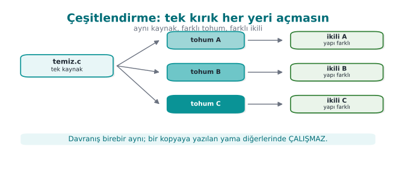

- **Uzayda çeşitlendirme:** her yapı (build) ya da her dağıtım farklı bir **tohumla** gizlenir; opak yüklemler, sahte
  bloklar ve durum değerleri kopyadan kopyaya değişir.
- **Zamanda çeşitlendirme:** her sürüm yeni bir düzenle gelir; eski sürüme karşı bulunan saldırı yeni sürümde bozulur.
  Bu, anahtar/sürüm yenileme politikanızla ([10. hafta](../week-10/cen429-week-10.md)) birlikte çalışır.

Çeşitlendirme, gizlemenin **gücünü** artırmaz — bir kopyayı kırmak yine mümkündür — ama **ölçeklenmesini** engeller.
On [dördüncü haftada](../week-4/cen429-week-4.md) Tigress'in `RandomFuns`, `--Seed` ve dönüşüm birleştirme özellikleriyle bunu araçla üreteceğiz.

!!! example "Çeşitlendirme etkinliği: basit bir ölçüt"
    Aynı kaynağı iki farklı tohumla derleyin. İki ikili dosyanın korunan fonksiyonlarını karşılaştırın: bayt düzeyinde
    fark oranı ne kadar yüksekse, bir kopyaya yazılan bir saldırının diğerinde çalışma olasılığı o kadar düşüktür.
    Ölçütü S9'a yazın.

**İşlenmiş örnek: fark oranını sayısal hesaplayalım.** Yukarıdaki ölçütü somut bir sayıya dökelim. Diyelim korunan
`erisim_ver` fonksiyonunun düzleştirilmiş hâli ikili dosyada **512 bayt** yer kaplıyor. İki farklı tohumla üretilen
ikili dosyalarda bu fonksiyonu bayt bayt karşılaştırdığımızda **340 baytın** farklı çıktığını ölçtük (varsayımsal
ama gerçekçi bir demo sonucu):

```text
fark_orani = degisen_bayt_sayisi / toplam_bayt_sayisi × 100
           = 340 / 512 × 100
           ≈ 66,4 %
```

Yorum: iki kopyanın %66,4'ü **farklı**; yalnız %33,6'sı ortak kalmış (muhtemelen fonksiyon girişi/çıkışı gibi
derleyicinin değiştiremeyeceği sabit parçalar). Bir saldırgan Kopya A'da bulduğu bir bayt yamasını (ör. "şu ofsete
şu değeri yaz, denetim hep izin versin") doğrudan Kopya B'ye uygularsa, o ofsette artık **farklı bir komut**
bulunduğu için yama ya işe yaramaz ya da programı çökertir. Bu, 1. bölümdeki "Kural 2 — otomasyonu kır"ın sayısal
kanıtıdır.

!!! danger "Sık yapılan hata: derleyici optimizasyon düzeyini değiştirmeyi çeşitlendirme sanmak"
    "`-O2` yerine `-O3` ile derledim, artık iki farklı ikilim var" demek çeşitlendirme **değildir**. Optimizasyon
    düzeyi değişikliği (a) her derlemede **aynı** sonucu üretir (tohuma bağlı değildir, dolayısıyla tekrarlanabilir
    ve tahmin edilebilir bir tek "B sürümü" yaratır, birden çok farklı kopya değil) ve (b) davranışı da değiştirmeme
    garantisi güçlü olsa da amaç bu değildir. **Kural:** gerçek çeşitlendirme, her yapıda **farklı ve öngörülemeyen**
    bir tohumla (K-11'deki `--Seed`) üretilmelidir; yalnız iki sabit yapılandırma (`-O2` ve `-O3`) arasında geçiş
    yapmak en fazla **iki** sabit varyant verir, bölüm 1'deki "otomasyonu kırma" hedefine ulaşmaz.

Çeşitlendirme kararı, RASP ([6. hafta](../week-6/cen429-week-6.md)) ve anahtar/sürüm yenileme (10. hafta) ile birlikte düşünülür: bir kopya
kırılıp bir bypass betiği yayılsa bile, hem o betik diğer kopyalarda çalışmaz (çeşitlendirme) hem de bir sonraki
sürümde eski betik geçersiz kalır (zamanda çeşitlendirme + anahtar yenileme).

!!! note "Sahadan bilinen bir dinamik: neden çeşitlendirme sürekli bir yarıştır?"
    Dijital hak yönetimi (DRM) ve oyunlardaki hile-önleme (anti-cheat) sistemleri, çeşitlendirmenin **neden tek
    seferlik değil sürekli** olması gerektiğini kamuya açık biçimde gösteren, herkesçe bilinen bir alandır: bir
    koruma sürümü kırıldığında (bir "crack" ya da bypass yayıldığında), üretici genelde yeni bir sürümde **farklı**
    bir koruma düzeni yayınlar ve eski kırık işe yaramaz hâle gelir. Bu, bölüm 1'deki tarihçe kutusunda geçen
    "2010'lar — DRM, mobil bankacılık ve oyun sektörü gizlemeyi yaygınlaştırır" cümlesinin somut çalışma biçimidir:
    savunma tek bir "kırılmaz" sürüm değil, **sürekli yenilenen** bir dizi sürümdür. Ders için çıkarım: bölüm
    12'deki S9 yazınızda çeşitlendirmeyi yalnız "bir kere uyguladım" değil, "her sürümde tekrar uygulanan bir
    süreç" olarak tanımlayın.

## 9. Gizlemenin ölçülmesi

Bir koruma kararını savunmak için onu **ölçmek** gerekir. Collberg'in çerçevesi gizlemeyi dört boyutta değerlendirir;
bu dört ölçüt aynı zamanda [13. haftadaki](../week-13/cen429-week-13.md) **saldırı potansiyeli** puanlamasının ("gereken süre", "gereken uzmanlık")
temelidir.

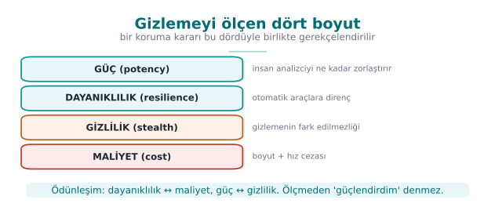

| Ölçüt | Sorusu | Nasıl ölçülür (kavram) |
| --- | --- | --- |
| **Güç (potency)** | İnsan için ne kadar anlaşılmaz? | Karmaşıklık ölçütleri: CFG düğüm/kenar sayısı, çevrimsel karmaşıklık, iç içe geçme derinliği — gizleme öncesi/sonrası |
| **Dayanıklılık (resilience)** | Otomatik araca ne kadar dayanır? | Bir deobfuscation aracının (sembolik yürütme, sadeleştirici) korumayı geri açma süresi/başarısı |
| **Gizlilik (stealth)** | Gizleme kendini ele veriyor mu? | Gizlenmiş kodun, normal koddan istatistiksel olarak ayırt edilebilirliği (ayırt edilirse saldırgan nereye bakacağını bilir) |
| **Maliyet (cost)** | Bize ne kadara mal oluyor? | Boyut artışı, çalışma süresi artışı, bellek, bakım ve hata ayıklama zorluğu |

Bu dört ölçüt bir **ödünleşimdir**: gücü ve dayanıklılığı artırdıkça maliyet artar, gizlilik çoğu zaman azalır (daha
karmaşık kod daha çok dikkat çeker). İyi bir mühendislik kararı, **korunan varlığın değerine** göre bu dördü
dengeler.

### İşlenmiş örnek: dört ölçütü `erisim_ver` üzerinde sayılarla dolduralım

Bölüm 4'te tanıdığımız gerçek demo ölçümlerini (**28 → 51 komut**, **3 → 6 dal**) burada dört ölçüte dağıtalım:

**Güç (potency).** Basit bir yaklaşık ölçüt olarak McCabe'in **çevrimsel karmaşıklık** fikrini kabaca kullanalım:
tek girişli/çıkışlı bir fonksiyon için `karmaşıklık ≈ dal_sayısı + 1`.

```text
Öncesi : 3 dal + 1 = 4
Sonrası: 6 dal + 1 = 7
Artış  : (7 − 4) / 4 × 100 = %75
```

Karmaşıklık `4`'ten `7`'ye, yani **%75** artmış: bir insan analistin fonksiyonu elle çizip anlaması artık %75 daha
fazla "yol" barındırıyor.

**Maliyet (cost).** Komut sayısındaki artışı aynı şekilde hesaplayalım:

```text
(51 − 28) / 28 × 100 ≈ %82,1
```

Yani bu tek kuralın (K-04 + K-01 + K-05) uygulanması, fonksiyonu **%82** daha büyük ve muhtemelen biraz daha yavaş
yapmıştır — bu, bölüm 4'teki koruma kuralı şablonunun "Maliyet" satırına yazılacak somut sayıdır.

**Dayanıklılık (resilience) ve gizlilik (stealth).** Bu ikisi, yalnız komut/dal sayarak ölçülemez; dayanıklılık için
gerçek bir deobfuscation aracı çalıştırıp (bölüm 10) "geri açma" süresini/başarısını ölçmek, gizlilik için gizlenmiş
kodun istatistiksel olarak "normal" koddan ayrılıp ayrılmadığına (ör. anormal derecede yüksek dal yoğunluğu dikkat
çeker mi) bakmak gerekir. Bu haftanın demosu yalnız güç ve maliyeti **doğrudan** ölçer; dayanıklılık ölçümü bir
sonraki bölümün konusudur.

!!! danger "Sık yapılan hata: yalnızca maliyeti ölçüp 'güçlü' demek"
    "İkili dosya %82 büyüdü, demek ki iyi korundu" sonucu yanlıştır — büyüme yalnız **maliyeti** gösterir, kırılmaya
    karşı **dayanıklılığı** göstermez (bölüm 10'da göreceğimiz gibi zayıf bir opak yüklem, çok komut eklese de bir
    çözücü tarafından saniyeler içinde açılabilir). **Kural:** dört ölçütü ayrı ayrı raporlayın; yalnız birini
    (genelde en kolay ölçülebilen "maliyet"i) öne çıkarıp diğerlerini atlamayın.

**Karar kuralı (S9'a yazılır):**

- Varlık değeri **düşük** → hafif, ucuz gizleme (K-01, K-02, K-07) yeter.
- Varlık değeri **yüksek** → katmanlı koruma (K-04 + K-05 + K-08 + çeşitlendirme); maliyeti kabul edilir.
- Her katman için güç ve dayanıklılık kazancı, boyut/hız maliyetine karşı ölçülür ve yazılır.

**İşlenmiş örnek: karar kuralını iki farklı varlığa uygulayalım.** Aynı uygulamada iki farklı kod bölümü olsun:

- **Varlık A — bir "hoş geldiniz" ekranının metnini seçen yardımcı fonksiyon.** Değeri düşüktür (sızsa bile büyük
  bir kayıp doğurmaz). Karar: yalnız K-07 (dize kodlama) yeterlidir; K-04 gibi pahalı bir dönüşüm **gereksizdir** —
  bölüm 9'un "maliyet" ölçütü burada "gereksiz maliyet eklemeyin" yönünde de çalışır.
- **Varlık B — lisans anahtarının doğrulandığı `lisans_dogrula` fonksiyonu.** Değeri yüksektir (bölüm 1'deki
  sayısal örnekte yıllık 100.000 TL'lik bir gelire bağlıydı). Karar: K-04 + K-01 + K-05 + K-08 + çeşitlendirme
  birlikte uygulanır; toplam maliyet (bölüm 9'da ölçtüğümüz gibi **%82** komut artışı) kabul edilir çünkü korunan
  varlığın değeri bunu haklı çıkarır.

Bu karşılaştırma, "her fonksiyona aynı gizleme düzeyini uygulamak" yaklaşımının **hem gereksiz maliyetli hem de
yetersiz koruyucu** olabileceğini gösterir: Varlık A'ya K-04 uygulamak boşuna performans kaybettirir; Varlık B'ye
yalnız K-07 uygulamak ise CFG'yi tamamen açık bırakır. S9'unuzda her kod bölümü için **ayrı** bir karar verin.

## 10. Deobfuscation: karşı tarafın araçları ve dayanıklılık kuralı

Dayanıklılığı doğru ölçmek için saldırganın otomatik araçlarını kavramsal olarak bilmek gerekir. Bunları **savunmayı
sınamak** için öğreniriz:

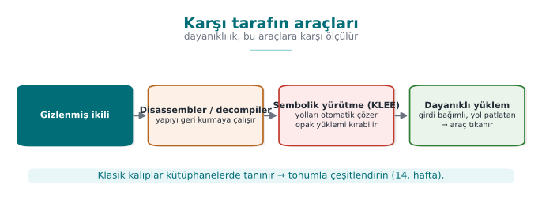

- **Sembolik / eşzamanlı yürütme (KLEE gibi):** program yolları matematiksel kısıtlar olarak çözülür; opak yüklemler
  ve düzleştirme bu yolla geri açılabilir. **Dayanıklılık kuralı:** çözücüyü zorlamak için opak yüklemleri, çözmesi
  pahalı (ör. çarpanlara ayırmaya ya da karma değerlere dayalı) yapılara bağla ve durum uzayını büyüt; ama maliyeti
  ölç.
- **İfade sadeleştirme (MBA çözücüler):** aritmetik kodlamayı (K-02) açar. **Kural:** aritmetik kodlamayı tek başına
  bir sır katmanı sayma; kontrol akışıyla birleştir.
- **Kalıp tanıma:** bilinen kütüphane/geçiş kalıplarını tanır. **Kural:** çeşitlendir; tek bir opak yüklem kalıbına
  ya da tek bir VM tasarımına bağlı kalma.

Banescu ve arkadaşlarının çalışması (Tigress + KLEE) tam da bunu yapar: hangi dönüşümlerin sembolik yürütmeye ne kadar
dayandığını ölçer. Ders için çıkarım nettir: **dayanıklılık bir iddia değil, ölçülen bir niceliktir.** Bir korumanın
"güçlü" olduğunu söylemek yerine, "şu araca karşı şu kadar dayandı" demek gerekir.

### Sembolik yürütme K-01'deki opak yüklemi nasıl kırar? Adım adım

Bölüm 5'teki `opak_dogru(x) = ((x*(x+1)) & 1) == 0` yüklemine dönelim; o bölümdeki uyarı kutusu bunun "klasik bir
kalıp, modern araçların kütüphanelerinde tanınır" olduğunu söylemişti. Şimdi **neden** böyle olduğunu görelim.

Bir sembolik yürütme aracı (KLEE gibi), programı **somut** değerlerle (`x = 5` gibi) değil, `x`'i bilinmeyen bir
**sembol** olarak tutup çalıştırır. `if (opak_dogru(x))` satırına geldiğinde, aracın sorması gereken soru şudur:

> "`x`'in **her** değeri için `((x*(x+1)) & 1) == 0` doğru mudur, yoksa bunu yanlış yapan bir `x` var mıdır?"

Bu soruyu bir **kısıt çözücüye** (constraint solver / SMT solver) devreder. Çözücü, `x`'i tek ve çift olmak üzere iki
duruma ayırarak (ki bu, tam sayı aritmetiğinde standart bir çözüm stratejisidir) hızlıca kanıtlar:

- `x` çiftse: `x = 2k` → `x*(x+1) = 2k*(2k+1)` → ifade `2`'nin katı → `& 1 = 0`. ✅
- `x` tekse: `x = 2k+1` → `x+1 = 2k+2 = 2(k+1)` çift → `x*(x+1)` yine `2`'nin katı → `& 1 = 0`. ✅

İki durumda da sonuç `0`; çözücü **saniyeler içinde** "bu yüklem her zaman doğru, ikinci dal (sahte) hiçbir zaman
çalışmaz" sonucuna ulaşır ve ölü dalı otomatik eler. Bu yüzden K-01'deki uyarı kutusu, bu **belirli** özdeşliği tek
başına yeterli görmüyor, [14. haftada](../week-14/cen429-week-14.md) tohumla çeşitlendirilmiş ve çözücüyü daha çok yoran (ör. çarpanlara ayırmaya ya
da bir karma fonksiyonun tersini almaya dayanan) yüklemler öneriyordu — şimdi bu önerinin **nedenini** de görmüş
olduk.

### MBA sadeleştiriciler K-02'yi nasıl açar?

K-02'deki `(a ^ b) + 2·(a & b) = a + b` gibi bir ifade, insana karmaşık görünse de sonlu bir **doğruluk tablosu**
(4 bitlik her `a,b` çifti için `2⁴ × 2⁴ = 256` satır, 8 bitlik için `65.536` satır) ile mekanik olarak sınanabilir.
`arybo`/`msynth` gibi araçlar tam olarak bunu yapar: ifadeyi küçük bit genişliklerinde **kaba kuvvetle** dener, aynı
doğruluk tablosunu veren en kısa standart ifadeyi (`a+b`) bulur ve ikisinin **eşdeğer** olduğunu rapor eder. Bu
yüzden K-02'nin sınır satırı "tek başına zayıftır" diyordu: aritmetik kodlama tek katman olarak kalırsa, bu
sadeleştirme adımı onu birkaç saniyede geri açabilir; ancak sonucu K-04'ün düzleştirilmiş `switch`'inin **içine**
gömerseniz, sadeleştirici önce hangi ifadenin sadeleştirileceğini **bulmak** için düzleştirmeyi de çözmek zorunda
kalır — iki zayıf katman, birlikte tek katmandan daha güçlüdür.

### Kalıp tanıma K-04/K-11'i nasıl hedefler?

Bir "kalıp tanıma" aracı, ikili dosyayı tarayıp bilinen **yapısal imzaları** arar: tek bir döngü içinde büyük bir
`switch`, ardışık olmayan ama sabit bir kümeden gelen durum değerleri, `default` dalından çıkan bir hata yolu —
tam olarak K-04'ün şablonu. O-LLVM gibi popüler araçların ürettiği düzleştirme şekli de zamanla "tanınan" bir imza
hâline gelmiştir (bir yazılımın hangi gizleme aracıyla derlendiğini tahmin eden akademik çalışmalar bile vardır).
Bu, K-11'in sınır satırındaki "iyi bilinen geçişlerin ürettiği kalıplar tanınabilir" uyarısının kaynağıdır.

!!! danger "Sık yapılan hata: her tekniğin her araca karşı eşit dayandığını varsaymak"
    Bir korumayı "güçlü" ilan etmeden önce **hangi araç sınıfına karşı** ölçüldüğünü belirtmek gerekir. Aşağıdaki
    tablo, bu haftanın kurallarını hangi deobfuscation aracının hedeflediğini özetler; bir kural yalnız kendi
    sütunundaki araca karşı ölçülmüşse, diğer sütunlardaki araçlara karşı **hâlâ zayıf olabilir**:

    | Kural | Asıl tehdit ettiği araç | Bu haftaki karşı önlem |
    | --- | --- | --- |
    | K-01 (klasik opak yüklem) | Sembolik/kısıtlı yürütme (KLEE) | 14. haftada çözücüye dirençli yüklemler |
    | K-02 (MBA) | İfade sadeleştirici (arybo/msynth) | Kontrol akışı gizlemeyle birleştirme |
    | K-04/K-11 (düzleştirme) | Kalıp tanıma, CFG imza eşleştirme | Çeşitlendirme (bölüm 8), güçlendirme (K-01/K-03/K-05) |

    **Kural:** bölüm 4'teki koruma kuralı şablonuna, "hangi araca karşı ölçüldü" bilgisini de (dolaylı olarak
    "Hangi tehdide karşı?" satırına) yazın; "genel olarak güçlü" bir ifade, hiçbir araca karşı ölçülmemiş demektir.

### Dayanıklılık ile maliyet aynı şey değildir — karıştırmayın

Bölüm 9'da "dayanıklılık" ve "maliyet"i iki ayrı ölçüt olarak tanımlamıştık; bu bölümden sonra aradaki farkı daha
net görebiliriz. **Maliyet**, korumayı uygulamanın *bize* ne kadara mal olduğudur (komut sayısı, hız, bellek) — bunu
kendi derleme sürecimizde doğrudan ölçeriz (bölüm 4 ve 9'daki `objdump` örnekleri). **Dayanıklılık** ise korumanın
*saldırganın aracına karşı* ne kadar dayandığıdır — bunu ölçmek için saldırganın aracını (sembolik yürütme, MBA
sadeleştirici, kalıp tanıma) gerçekten çalıştırıp sonucu gözlemlemek gerekir; yalnız "çok komut ekledim" demek
dayanıklılığı **kanıtlamaz**. Bölüm 9'daki "%82 maliyet artışı" örneğini hatırlayın: bu sayı tek başına, K-04'ün
sembolik yürütmeye karşı ne kadar dayandığını söylemez — o soru ancak bu bölümdeki gibi bir deobfuscation aracı
gerçekten denenerek cevaplanabilir. S9'unuzda bu iki ölçütü **karıştırmadan**, ayrı ayrı raporlayın.

## 11. Katmanlı savunmada gizlemenin yeri

Gizleme, tek başına bir kale değil, **derinlemesine savunmanın** bir katmanıdır. Diğer haftalarla ilişkisi:

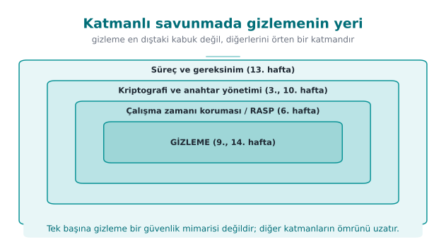

| Katman | Haftası | Gizlemeyle ilişkisi |
| --- | --- | --- |
| Bellek güvenliği, güvenli derleme | 4 | Gizleme bunların yerine geçmez; ikisi birlikte |
| RASP (kurcalama/hata ayıklama tespiti) | 6 | Gizleme, RASP denetimlerinin kendisini de gizler; RASP, gizlemeyi çalışırken korur |
| Whitebox kriptografi | 11 | Anahtar için asıl koruma; gizleme onu çevreleyen kabuğu zorlaştırır |
| Kripto ve anahtar yenileme | 10 | Gizleme "anahtar yenilenene kadar" zaman kazandırır |
| Sertifikasyon / saldırı potansiyeli | 12–13 | Her katmanın "geciktirme süresi" puanlamaya girer |

### Tek bir örnek üzerinden bütün dönemi bağlayalım: bir mobil ödeme uygulamasının lisans denetimi

Bilgi bağlarını somutlaştırmak için, dönem boyunca aynı hayali işlevi — bir mobil ödeme uygulamasının
`lisans_dogrula` fonksiyonunu — farklı haftaların gözünden izleyelim:

- **[1. hafta](../week-1/cen429-week-1.md):** Tehdit modeli çıkarılır; `lisans_dogrula` **MATE** saldırganına (uygulamayı elinde tutan kullanıcı)
  karşı korunması gereken bir varlık olarak işaretlenir.
- **[3. hafta](../week-3/cen429-week-3.md):** Fonksiyonun kullandığı anahtarlar **AEAD** ile şifrelenir, rastgele sayılar **CSPRNG**'den gelir;
  ama bu, verinin **saklanma** güvenliğidir, kodun **okunma** güvenliği değildir.
- **[4. hafta](../week-4/cen429-week-4.md):** İlk gizleme adımları atılır: semboller görünmez yapılır, temel bir düzleştirme denenir.
- **[6. hafta](../week-6/cen429-week-6.md):** RASP eklenir; bir hata ayıklayıcının bağlı olup olmadığı çalışma anında denetlenir.
- **9. hafta (bu hafta):** K-01–K-12 uygulanır: kontrol akışı düzleştirilir ve güçlendirilir (K-01, K-03, K-05),
  veriler kodlanır (K-07, K-08, K-09), çeşitlendirme eklenir (bölüm 8), etkinlik ölçülür (bölüm 9).
- **[10. hafta](../week-10/cen429-week-10.md):** Fonksiyonun kullandığı anahtarların **yaşam döngüsü** (üretim, dağıtım, yenileme) PKI ile
  yönetilir — gizleme anahtarı **saklamaz**, yalnız çevresini zorlaştırır (bölüm 3'teki kural).
- **[11. hafta](../week-11/cen429-week-11.md):** En kritik anahtar türetme adımı **whitebox kriptografi** ile korunur — K-10'un (sanallaştırma)
  "yalnız en kritik küçük fonksiyona uygula" ilkesinin kriptografideki karşılığı.
- **12–13. hafta:** Bağımsız bir değerlendirici, bütün bu katmanları saldırı potansiyeli çerçevesiyle puanlar;
  bölüm 4'teki koruma kuralı şablonundaki "Ölçüm" satırları burada kanıt olarak sunulur.
- **[14. hafta](../week-14/cen429-week-14.md):** Bütün bu el ile yapılan işler Tigress ile **otomatikleştirilir**; aynı kaynak, her sürümde farklı
  tohumla, tek bir komutla yeniden üretilir.

Bu zincir, tek bir fonksiyonun dönem boyunca hangi haftalarda hangi **farklı** tehdide karşı korunduğunu gösterir:
hiçbir hafta diğerinin yerine geçmez, her biri bir öncekinin bıraktığı boşluğu kapatır.

!!! quote "Sahadan bir gözlem"
    Sertifikasyondan geçmiş bir üründe listelenen native koruma önlemleri bu haftanın kurallarının neredeyse tümünü
    kapsar; ama belge her önlemin yanına **"tek başına güçlü değildir"** notunu düşer. Değerlendiriciyi ikna eden şey
    tek bir teknik değil, kuralların **birlikteliği**, **çeşitlendirilmiş** olması ve her birinin **ölçülmüş** bir
    geciktirme değeriyle sunulmasıdır.

### "Geciktirme süresi" pratikte neye bakılarak tahmin edilir?

12–13. haftada göreceğimiz saldırı potansiyeli değerlendirmeleri, genel olarak bir saldırının **kaç faktörle**
zorlaştığına bakar; bu hafta öğrendiğimiz kurallar bu faktörleri şöyle etkiler (kesin puanlar sertifikasyon şemasına
göre değişir, burada yalnız **yönü** gösteriyoruz):

| Faktör | Sorusu | Bu haftanın hangi kuralı etkiler? |
| --- | --- | --- |
| **Gereken zaman** | Saldırı kaç saat/gün sürer? | Hepsi — özellikle K-04 (CFG'yi büyütür) ve K-10 (VM'i çözmek zaman ister) |
| **Gereken uzmanlık** | Genel beceri mi, uzman bilgisi mi gerekir? | K-01/K-02 (MBA, opak yüklem bilgisi), K-10 (VM tersine mühendisliği) |
| **Hedef bilgisi** | Saldırgan kaynak koda/tasarıma ne kadar hakim? | K-06 (iç fonksiyon adları/imzaları gizlenince "hedef bilgisi" düşer) |
| **Fırsat penceresi** | Saldırgan ikiliye ne kadar süre erişebilir? | Çeşitlendirme (bölüm 8) + K-12 (kısa açık pencere) bu süreyi daraltır |
| **Gerekli ekipman** | Genel araç mı, özel/pahalı araç mı gerekir? | Sembolik yürütmeye dirençli yüklemler (bölüm 10) "genel araç yetmez" durumuna iter |

Bu beş soru, sertifikasyon dünyasında yaygın kullanılan **saldırı potansiyeli** değerlendirme yaklaşımlarının ortak
iskeletidir. Örneğin **yalnız dize gizleme (K-07)** uygularsanız, gereken zamanı birkaç dakika artırırsınız ama
gereken uzmanlığı neredeyse hiç değiştirmezsiniz (herkes `strings` yerine bir tersine derleyicide dizeyi arayabilir).
**Kontrol akışı düzleştirme + opak yüklem + çeşitlendirme** birlikte uygulanırsa, hem gereken zaman (CFG'yi elle
çözmek saatler alır) hem gereken uzmanlık (jenerik bir araç yetmez, özel bir betik/analiz yazılması gerekir) hem de
fırsat penceresi (her kopya farklı olduğu için bir betik yeniden yazılmalı) birlikte yükselir — bu, tek bir kuralın
değil, **katmanların** neden değerlendirmede daha yüksek puan aldığının teknik açıklamasıdır.

### Bu bölümün kısa özeti

Katmanlı savunmada gizlemenin yeri şu üç cümleyle özetlenebilir: (1) gizleme, bellek güvenliğinin (4. hafta),
kriptografinin (3. hafta) ve RASP'ın (6. hafta) **yerine** geçmez, onların **etrafını** zorlaştırır; (2) her katman,
saldırı potansiyeli değerlendirmesinde (12–13. hafta) ayrı bir "geciktirme" olarak sayılır, tek başına hiçbiri
yeterli değildir; (3) bir sonraki bölümde (S9) yazacağınız her koruma satırı, bu tabloya ve bölüm 4'teki şablona
geri bağlanabilmelidir — "bu koruma hangi katmana ait, hangi diğer katmanla birlikte çalışıyor" sorusuna cevap
veremiyorsanız, o koruma muhtemelen izole ve yetersiz kalmıştır.

## 12. Dönem projesi: bu hafta (S9 — ileri sağlamlaştırma)

Vize sonrası projenizin S9 bölümünü **ileri** düzeye taşıyın:

1. **Koruma tablosu:** En kritik iki–üç kod bölümü için (ör. lisans/lisanslama, anahtar türetme, bütünlük denetimi)
   1. bölümdeki **"koruma kuralı" şablonunu** doldurun: neyi korur, hangi tehdide karşı, nasıl, maliyet, sınır, ölçüm.
2. **Ölçüm:** En az bir teknik için gizleme öncesi/sonrası bir ölçüt verin (ör. `strings` çıktısındaki hassas dize
   sayısı; CFG düğüm sayısı; ikili boyut ve bir işlemin süresi).
3. **Çeşitlendirme kararı:** Çeşitlendirme uygulayacak mısınız? Uygulamayacaksanız **neden** (gerekçe de bir yanıttır).
4. **Sınır ve kalan risk:** Her koruma için neyi **korumadığını** açıkça yazın. "Bu dize gizleme anahtarı korumaz;
   anahtar için S8'deki whitebox/donanım kullanılır" gibi.

### İşlenmiş örnek: bir S9 taslağı baştan sona

Bu haftanın bütün örneklerini birleştirip kısa bir S9 taslağı yazalım (kendi projenizde fonksiyon adlarını ve
sayıları kendi ölçümünüzle değiştirin):

```text
S9 — İleri sağlamlaştırma (örnek taslak)

1) Koruma tablosu
   KURAL: lisans_dogrula fonksiyonuna K-04 (düzleştirme) + K-01 (opak yüklem) + K-05 (rastgele çıkış)
     Neyi korur?        : lisans anahtarının doğrulama sırası
     Hangi tehdide karşı?: statik CFG okuma, tek-bayt yama
     Nasıl?             : switch dağıtıcı + x*(x+1) tabanlı opak yüklem + öngörülemeyen hata çıkışı
     Maliyet             : komut 28→51 (+%82), dal 3→6 (+%100) [objdump ile ölçüldü]
     Sınır               : sembolik yürütmeye (bölüm 10) karşı zayıf; veri hâlâ K-07 ile korunmalı
     Ölçüm               : objdump çıktısı (ek A), CFG düğüm/kenar sayısı

   KURAL: anahtar dizesine K-07 (dize kodlama)
     Neyi korur?        : ikili dosyadaki hassas dizgeler
     Hangi tehdide karşı?: strings taraması (bölüm 3'teki "ilk 10 dakika" saldırısı)
     Nasıl?             : XOR 0x5A ile kodlama, kullanım anında çözüp memset_s ile silme
     Maliyet             : düşük (birkaç ek komut)
     Sınır               : çözme anahtarı ikilide durur; gerçek anahtar koruması S8/whitebox işidir
     Ölçüm               : strings çıktısında hassas dizge sayısı: 3 → 0

2) Ölçüm: yukarıdaki iki satırda "Ölçüm" alanı doldurulmuş durumda (objdump + strings)

3) Çeşitlendirme kararı: EVET — derleme betiğine rastgele bir --seed parametresi eklendi;
   her sürüm farklı durum sabitleriyle derlenir (bölüm 8, K-11 ile).

4) Sınır ve kalan risk: Bu katman anahtarı korumaz (yalnız statik taramayı geciktirir);
   sembolik yürütmeye karşı ölçülmedi (gelecek iş); anahtarın kalıcı koruması S10/S11'e bırakıldı.
```

Bu taslak, bölüm 4'teki şablonu bölüm 9'daki dört ölçütle ve bölüm 8'deki çeşitlendirme kararıyla birleştirir; her
satırı **kendi ölçtüğünüz** sayılarla değiştirmeniz beklenir — yukarıdaki sayılar bu haftanın demosundan alınmıştır,
kopyalanıp doğrudan başka bir projeye yazılmamalıdır.

!!! warning "S9 teslimi öncesi kontrol listesi"
    - [ ] En az iki kod bölümü için (bir kontrol akışı, bir veri kuralı) bölüm 4'teki altı satırlık şablon **eksiksiz**
      dolduruldu mu?
    - [ ] Her "Ölçüm" satırında somut bir sayı ya da gözlem var mı (yalnız "güçlendirildi" gibi bir sıfat değil)?
    - [ ] Hangi tekniğin hangi **aileye** (düzen/veri/kontrol akışı/önleyici/sanallaştırma — bölüm 2) ait olduğu
      belirtildi mi, yoksa tek bir aile mi kullanıldı (bölüm 2'deki "sık yapılan hata" burada tekrar geçerlidir)?
    - [ ] Çeşitlendirme kararı (uygulandı/uygulanmadı) gerekçesiyle birlikte yazıldı mı (bölüm 8)?
    - [ ] Her koruma için "Sınır" satırında **neyi korumadığı** açıkça belirtildi mi — özellikle "bu anahtarı
      korumaz" gibi bölüm 3'ün temel uyarısı unutulmadı mı?
    - [ ] Hiçbir yerde "kırılamaz", "aşılamaz" gibi mutlak bir ifade **kullanılmadı** mı (bölüm 1'deki Barak vd.
      uyarısı)?
    - [ ] Optimizasyon açık (`-O2`/`-O3`) derlenmiş ikili üzerinde test edildi mi (K-02/K-03'teki "derleyici sessizce
      siler" hatasına karşı)?

!!! tip "Değerlendirici gözüyle"
    S9'da aranan şey "çok teknik kullandım" değil, **her tekniğin gerekçesi ve ölçüsüdür**. Ölçülmemiş bir koruma,
    değerlendirmede "iddia" sayılır; kanıt sayılmaz.

## 13. Kendini sınama


??? question "1. Kaynaktan kaynağa gizleme nedir? MATE tehdit modeli ağ saldırganından hangi yönüyle ayrılır ve neden kriptografiyi tek başına yeterli bırakmaz ama gizlemeyi gerekli kılar?"
    MATE (Man-At-The-End) uygulamanın çalıştığı cihaza tam sahiptir: belleği okur, hata ayıklayıcı bağlar, kodu değiştirir; ağ saldırganı yalnız dışarıdan bağlanır. Kriptografi hâlâ gereklidir ama tek başına yetmez, çünkü anahtar/veri **çalışırken** bellekte açığa çıkar. Gizleme bu yüzden gerekir: anahtar çıkarmayı ve mantığı anlamayı geciktirip pahalılaştırır.

??? question "2. 'Gizleme kırılamaz kılmaz, pahalı kılar.' Bunu bir varlık değeri örneğiyle açıklayın."
    Gizleme saldırıyı imkânsız değil, daha çok **zaman/beceri/araç** gerektirir hale getirir. 100 TL değerindeki bir içeriği kırmak 10.000 TL emek isterse rasyonel saldırgan vazgeçer. Bu yüzden koruma gücü, korunan varlığın değerine göre ölçülür.

??? question "3. Sahte işlem (bogus operation) ile ölü dal (death branch) arasındaki fark nedir? Hangisi çalışır?"
    **Sahte işlem** gerçekten çalışır ama sonucu kullanılmaz (analizciyi ve aracı yorar). **Ölü dal** bir opak yüklemle korunur ve **hiç çalışmaz**. Yani sahte işlem çalışan-ama-etkisiz, ölü dal ise hiç çalışmayan koddur.

??? question "4. Kontrol akışı düzleştirme tek başına neden zayıftır? Onu güçlendiren en az üç kuralı sayın."
    Düzleştirme bir dağıtıcı (dispatcher/switch) deseni bırakır; bu desen tanınır ve durum değişkeni izlenerek akış geri kurulabilir. Güçlendiriciler: **opak yüklemler**, **durum değişkenini şifreleme**, **sahte durumlar/bloklar + rastgele çıkış** (ayrıca ad/dize gizleme).

??? question "5. Rastgele çıkış noktası hangi saldırıyı zorlaştırır? Tek bayt yaması neden yetmez hâle gelir?"
    Desen/eşleştirme, otomatik betik ve sembolik yürütme saldırılarını zorlaştırır (tek sabit çıkış kalıbı yoktur). Tek bir sabit çıkış olmadığı için tek bir bayt yaması bütün yolları kapatmaz; saldırgan her yolu ayrı ayrı ele almak zorunda kalır.

??? question "6. Dize gizleme bir anahtarı korur mu? Neden? Anahtar için hangi haftalara bakılır?"
    Hayır. Dize/tablo gizleme yalnız statik `strings` taramasını zorlaştırır; anahtar **çalışırken bellekte** açığa çıkar. Anahtarın gerçek korunması için [10. hafta](../week-10/cen429-week-10.md) (PKI, HSM/PKCS#11) ve [11. hafta](../week-11/cen429-week-11.md) (whitebox kriptografi) yöntemlerine bakılır.

??? question "7. Sanallaştırma tabanlı gizlemenin en büyük iki maliyeti nedir? Neden yalnız küçük ve kritik fonksiyonlara uygulanır?"
    Büyük **performans** cezası (bytecode'u yorumlayan sanal makine yavaştır) ve **boyut** artışı (VM + bytecode). Bu maliyet yüzünden yalnızca değeri yüksek, küçük ve kritik fonksiyonlara uygulanır; tüm koda uygulanamaz.

??? question "8. Kendini değiştiren kod hangi işletim sistemi korumasıyla çatışır? Bu neden yeni bir risk yaratabilir?"
    **W^X / DEP-NX** ile: bir bellek sayfası aynı anda yazılabilir **ve** çalıştırılabilir olamaz. Kodu değiştirmek için sayfayı geçici olarak yazılabilir-çalıştırılabilir yapmak gerekir; bu hem çoğu ortamda engellenir/şüphelidir hem de saldırgana kod enjeksiyonu için bir pencere açabilir (yeni risk).

??? question "9. Gizlemeyi ölçen dört boyutu (güç, dayanıklılık, gizlilik, maliyet) tanımlayın. Hangileri birbiriyle ödünleşir?"
    **Güç:** insan analizciyi ne kadar zorlaştırır. **Dayanıklılık:** otomatik deobfuscation araçlarına direnç. **Gizlilik:** gizlemenin fark edilmezliği (normal görünme). **Maliyet:** performans/boyut cezası. Başlıca ödünleşimler: dayanıklılık ↔ maliyet ve güç ↔ gizlilik (güçlü gizleme çoğu zaman daha 'anormal' görünür).

??? question "10. Çeşitlendirme gizlemenin gücünü mü, ölçeklenmesini mi engeller? Basit bir etkinlik ölçütü önerin."
    **Ölçeklenmesini** engeller: tek bir kopyanın gücünü artırmaz ama bir kırığın tüm kopyalara/kullanıcılara **yayılmasını** engeller. Ölçüt: aynı kaynaktan iki tohumla üretilen ikililerin farklılık oranı (farklı bayt/komut yüzdesi) + her iki ikilinin aynı girdiye aynı çıktıyı verdiğini gösteren davranış testi.

??? question "11. Sembolik yürütme (KLEE gibi) hangi gizleme kurallarını zorlar? Dayanıklılığı artırmak için ne yaparsınız, maliyeti nasıl kontrol edersiniz?"
    KLEE yolları otomatik çözerek basit opak yüklem ve düzleştirmeyi kırabilir. Dayanıklılık için yüklemleri **sembolik yürütmeye dayanıklı** yaparsınız (girdi bağımlı, kriptografik, yol patlaması yaratan). Maliyeti, bu pahalı dönüşümleri yalnız kritik fonksiyonlara uygulayıp önce/sonra ölçerek kontrol edersiniz.

??? question "12. Projenizdeki bir kod bölümü için 'koruma kuralı' şablonunu doldurun (altı satır)."
    Örnek — **Varlık:** lisans doğrulama fonksiyonu. **Tehdit:** MATE saldırganının yamayla doğrulamayı atlaması. **Kural:** kontrol akışı düzleştirme + opak yüklem. **Nasıl:** Tigress `Flatten` + `AddOpaque`, yalnız bu fonksiyona. **Ölçüm:** boyut +%X, hız −%Y, komut sayısı N→M. **Kalan risk:** güçlü ama sanallaştırma değil; sürümde tohumla çeşitlendir.

??? question "13. `0x41` baytını `0x5A` ile XOR'layıp sonucu tekrar `0x5A` ile XOR'ladığınızda ne elde edersiniz? Bunu hangi cebirsel kural garanti eder?"
    `0x41 ^ 0x5A = 0x1B`, sonra `0x1B ^ 0x5A = 0x41` — başladığınız bayta geri dönersiniz. Bunu garanti eden kural `a ^ b ^ b = a ^ (b ^ b) = a ^ 0 = a`dır: herhangi bir değer kendisiyle XOR'lanınca `0` verir, `0` ile XOR'lanan değer değişmeden kalır. Bu, K-07'deki dize kodlama/çözmenin ve genel olarak "XOR tersine çevrilebilir" iddiasının matematiksel temelidir.

??? question "14. `[0x41,0x41,0x41,0x41]` dizisinin Shannon entropisi neden 0 bit/sembol, `[0x3F,0xA1,0x08,0xC7]` dizisininki neden 2 bit/semboldür? Bunun bir saldırgan için pratik anlamı nedir?"
    Birinci dizide tek bir değerin olasılığı `p=1`, `log2(1)=0`, dolayısıyla `H=0` — tamamen öngörülebilir. İkinci dizide dört farklı değer eşit olasılıkla (`p=1/4`) görülür: `H = -4·(1/4·log2(1/4)) = -4·(1/4·(-2)) = 2` bit/sembol, bu dört sembollük alfabede ulaşılabilecek en yüksek değerdir. Pratikte: bir saldırgan ikili dosyayı tararken düşük entropili (tekrar eden) bloklarla yüksek entropili (anahtar/şifreli veri olabilecek) blokları istatistiksel olarak ayırt edebilir; yüksek entropi "burada bir sır olabilir" ipucudur.

??? question "15. `(a ^ b) + 2·(a & b)` ifadesinin `a + b`'ye eşit olduğunu `a=5, b=3` için doğrulayın. Bu tür ifadelere ne ad verilir ve tek başına neden yeterince güçlü değildir?"
    `a+b = 5+3 = 8`. `a^b = 0101^0011 = 0110 = 6`; `a&b = 0101&0011 = 0001 = 1`; `(a^b)+2·(a&b) = 6+2 = 8`. İkisi eşit — özdeşlik doğrulandı. Bu tür ifadelere **mixed boolean-arithmetic (MBA)** denir (K-02). Tek başına yeterince güçlü değildir çünkü `arybo`/`msynth` gibi ifade sadeleştiriciler, küçük bit genişliklerinde doğruluk tablosu üreterek bu tür ifadeleri kısa sürede orijinal hâline (`a+b`) indirger; gücünü ancak kontrol akışı gizlemeyle (K-04) birleşince kazanır.

??? question "16. K-08'deki opak boolean örneğinde `a=0xA3C1, b=0x5C3E` iken `a^b` neden `0xFFFF`'tir? Saldırgan yalnız `a`'nın alt baytını (`0xC1→0x00`) değiştirirse `karar_izin_mi` ne döner?"
    Dört nibble de birbirinin bit-tersi olduğu için (`A=1010`↔`5=0101`, `3=0011`↔`C=1100`, `C=1100`↔`3=0011`, `1=0001`↔`E=1110`) XOR'ları hep `1111=F` verir, toplamda `0xFFFF`. `a`'nın alt baytı `0x00` yapılırsa yeni `a=0xA300`; `0xA300^0x5C3E = 0xFF3E ≠ 0xFFFF`, dolayısıyla `karar_izin_mi` **false (red)** döner — tek bayt yaması saldırıyı başaramaz, çünkü `a` ve `b`'nin **birlikte** tutarlı değişmesi gerekir.

??? question "17. `0x1234ABCD` değeri K-09'daki gibi iki 16-bit parçaya nasıl bölünüp geri birleştirilir? Bu tekniğin bellek taramasına karşı işe yaramasının nedeni nedir?"
    Bölme: `yuksek=0x1234`, `dusuk=0xABCD`. Birleştirme: `(yuksek<<16)|dusuk`; `0x1234<<16 = 0x12340000`, bunu `0x0000ABCD` ile OR'lamak `0x1234ABCD` verir — orijinal değer geri gelir. İşe yaramasının nedeni: bellek tarayan araçlar genelde "art arda duran, sabit boyutlu, yüksek entropili bir blok" arar (ör. 16/32 baytlık bir anahtar deseni); değer iki ayrı, birbirine bitişik olmayan değişkene bölünürse bu "tek blok" deseni ortadan kalkar.

??? question "18. Bölüm 7'deki küçük bytecode örneğinde `{OP_PUSH,5,OP_PUSH,7,OP_ADD,OP_RET}` çalıştırıldığında yığın (stack) nasıl değişir, sonuç nedir? Bir analist bu sonucu neden doğrudan 'kaynak kodda' göremez?"
    Sırasıyla: `OP_PUSH 5` → yığın `[5]`; `OP_PUSH 7` → yığın `[5,7]`; `OP_ADD` → `7` ve `5` yığından çıkar, `5+7=12` yığına girer → `[12]`; `OP_RET` → `12` döner. Sonuç `12`. Analist bunu kaynakta göremez çünkü "toplama" diye bir komut yoktur — toplama, `yorumla` fonksiyonunun bu altı baytı belirli bir sırayla işlemesinin **yan etkisidir**; önce yorumlayıcının (VM'in) kendisi çözülmelidir.

??? question "19. K-03'teki bir sahte işlem (`crc ^= sabit^sabit`), optimize edici bir derleyici (`-O2`) tarafından neden tamamen silinebilir? Bunu önlemek için ne yapılır?"
    `sabit^sabit` her zaman `0`'dır (bölüm 0'daki XOR özdeşliği: bir değer kendisiyle XOR'lanınca `0` verir) ve `crc^=0` `crc`'yi değiştirmez. Derleyici bunu sabit-katlamayla fark edip "hiçbir gözlenen etkisi yok" diyerek **ölü kod eleme** ile siler; gizleme siz fark etmeden ortadan kalkar. Önlem: sahte işlemde kullanılan değerleri çalışma anında (girdiye/opak yükleme bağlı) belirleyin, derleme anında sabitlemeyin; gizlemeyi her zaman optimizasyon açık derlenmiş ikili üzerinde doğrulayın.

??? question "20. Bölüm 8'deki örnekte 512 baytlık bir fonksiyonun iki tohumla üretilen ikili dosyaları arasında 340 bayt farklıysa fark oranı yüzde kaçtır? Bu oran neyi gösterir, neyi göstermez?"
    `fark_orani = 340/512×100 ≈ %66,4`. Bu, iki kopyanın kod düzeyinde ne kadar **farklı** göründüğünü gösterir — bir kopyaya yazılan bayt-düzeyi bir yamanın diğer kopyada aynı ofsette işe yaramama olasılığının yüksek olduğunu ima eder. Göstermediği şey: tek bir kopyanın **gücünü** (potency/resilience) artırmaz; yalnızca bir kırığın **ölçeklenmesini** zorlaştırır (bölüm 8'in ana iddiası).

??? question "21. Bu haftanın demosunda `erisim_ver` düzleştirme sonrası 28→51 komuta, 3→6 dala çıkıyor. Basit çevrimsel karmaşıklık (dal+1) öncesi/sonrası kaçtır, yüzde kaç artmıştır? Bu hangi ölçütü (bölüm 9) temsil eder?"
    Öncesi: `3+1=4`. Sonrası: `6+1=7`. Artış: `(7-4)/4×100=%75`. Bu, bölüm 9'daki dört ölçütten **güç (potency)**'yi temsil eder — bir insan analistin fonksiyonu anlaması için izlemesi gereken yol sayısının bir yaklaşık göstergesidir; komut sayısındaki `%82` artış ise aynı örnekte **maliyet (cost)** ölçütünü temsil eder.

??? question "22. Sembolik yürütme, K-01'deki `((x*(x+1))&1)==0` opak yüklemini neden 'klasik ve zayıf' kılar? Bir çözücü bunu nasıl kanıtlar?"
    Sembolik yürütme `x`'i somut değil sembolik tutar ve "her `x` için bu ifade doğru mu?" sorusunu bir kısıt çözücüye sorar. Çözücü `x`'i çift/tek diye ikiye ayırarak (çiftse `x=2k`, tekse `x=2k+1`) her iki durumda da `x*(x+1)`'in `2`'nin katı olduğunu, dolayısıyla `&1=0` olduğunu birkaç adımda kanıtlar. Kanıt saniyeler sürdüğü için ölü dal otomatik elenir; bu yüzden [14. haftada](../week-14/cen429-week-14.md) çözücüye daha dirençli (çarpanlara ayırmaya/karma değerlere dayalı) yüklemler önerilir.

??? question "23. Saldırı potansiyeli çerçevelerinde genel olarak hangi beş faktör değerlendirilir? Yalnız dize gizleme (K-07) uygulamak bu faktörlerden hangisini, ne kadar etkiler?"
    Genel olarak: **gereken zaman**, **gereken uzmanlık**, **hedef bilgisi**, **fırsat penceresi** ve **gerekli ekipman**. Yalnız K-07 (dize gizleme) uygulamak, gereken zamanı yalnız birkaç dakika artırır (bir tersine derleyicide dizeyi elle aramak yerine `strings` çalışmaz) ama gereken uzmanlığı neredeyse hiç değiştirmez — herkesin yapabileceği bir adımdır. Kontrol akışı düzleştirme + opak yüklem + çeşitlendirme gibi katmanlar birlikte hem zamanı hem uzmanlığı hem de fırsat penceresini birlikte yükseltir.

??? question "24. K-12'de bir hata/istisna çıkışında yeniden şifreleme adımı atlanırsa ne olur? Kural nedir?"
    Kod, normal (başarılı) yol dışında hataya düşerse bellekte **kalıcı olarak açık (çözülmüş)** kalır; "açık pencere" tanımdaki gibi kısa değil, sonsuz hâle gelir ve bir bellek dökümü bunu her zaman yakalayabilir. Kural: yeniden şifreleme adımını dilin "her zaman çalışır" yapısına bağlayın (C'de `goto temizle:`, C++'ta RAII/yıkıcı, Java/Kotlin'de `finally`); başarı ve hata yollarını ayrı ayrı ele alıp birini unutmayın.

??? question "25. 'Kodlama (encoding)', 'şifreleme (encryption)' ve 'gizleme (obfuscation)' arasındaki fark nedir? K-07'deki 'dize kodlama' bunlardan hangisidir?"
    **Kodlama:** veriyi başka bir gösterime çevirir, matematiksel gizlilik iddiası yoktur (ör. XOR). **Şifreleme:** anahtara dayalı, ispatlanabilir güvenlik sağlar (ör. AES-GCM, [3. hafta](../week-3/cen429-week-3.md)); doğru anahtar olmadan çözülemez. **Gizleme:** kodun insan tarafından anlaşılmasını zorlaştırır, matematiksel bir güvenlik iddiası taşımaz. K-07'deki "dize kodlama" bir **encoding**'dir (XOR ile); çözme anahtarı da ikili dosyada durduğu için **encryption** değildir, yalnız statik taramayı (`strings`) yavaşlatır.

??? question "26. Taksonomideki beş aile neden 'aşağıdan yukarı güç ve maliyet artar' sırasıyla dizilir? Düzen ailesi neden en zayıfıdır?"
    Bir ailenin gücü, programın **davranışını üreten mekanizmaya ne kadar yakın** olduğuyla orantılıdır. Düzen ailesi yalnız isimleri/meta veriyi değiştirir, davranışı üreten hiçbir şeye dokunmaz — bu yüzden en ucuz ama en zayıf katmandır (bölüm 0'daki tersine derleyici örneğinde görüldüğü gibi, adlar zaten kaybolur ama mantık kalır). Sanallaştırma ise makine kodunun kendisini değiştirdiği için hem en güçlü hem en pahalı uçtadır.

??? question "27. K-10'daki 'sanallaştırma tabanlı gizleme' ile Java/Kotlin uygulamalarının çalıştığı JVM/ART sanal makinesi neden aynı şey değildir?"
    JVM/ART, bütün uygulamanın üzerinde çalıştığı **genel amaçlı, standart** bir sanal makinedir; bayt kodu biçimi (DEX) bilinir ve `jadx` gibi genel araçlarla kolayca okunur. K-10'daki VM ise yalnız seçilmiş birkaç kritik fonksiyon için tasarlanan, **projeye özel, standart olmayan** bir bayt kodu ve yorumlayıcıdır; hiçbir genel araç onu doğrudan çözemez. Bir uygulamanın Java'da yazılmış olması, K-10 anlamında "sanallaştırılmış" olduğu anlamına gelmez.

??? question "28. DRM ve oyun hile-önleme sistemlerindeki çeşitlendirme neden 'tek seferlik' değil 'sürekli bir süreç' olarak tanımlanır?"
    Bir koruma sürümü kırıldığında (bir bypass yayıldığında), o kırık yalnız **o sürüme özgüdür**; üretici genelde yeni bir sürümde farklı bir koruma düzeni (yeni tohum, yeni opak yüklemler) yayınlar ve eski kırık işe yaramaz hâle gelir. Bu yüzden çeşitlendirme S9'da "bir kere uyguladım" değil, "her sürümde tekrar uygulanan bir süreç" olarak tanımlanmalıdır — bölüm 1'deki "Kural 3: diğer katmanlara zaman kazandır" ilkesinin sürüm bazında somutlaşmış hâlidir.

??? question "29. Barak vd.'nin 2001 'kusursuz kara-kutu gizleme imkânsızdır' sonucu ne anlama gelir? Bu, bu haftaki kuralların hiç işe yaramadığı anlamına mı gelir?"
    Sonuç, **her** program için, saldırganın kodun içine bakarak yalnızca girdi-çıktı gözlemlemekten **hiçbir fazla bilgi edinemeyeceği** kusursuz bir dönüşümün var olamayacağını matematiksel olarak kanıtlar. Bu, kuralların işe yaramadığı anlamına **gelmez**; yalnız hiçbir korumanın "mutlak/kırılamaz gizlilik" olarak pazarlanamayacağını gösterir. Bu hafta her kuralı "kırılamaz" değil, "şu maliyeti getirir, şu sınırı vardır, şu kadar dayanır" biçiminde (bölüm 4 şablonu) yazmamızın akademik gerekçesi budur.

??? question "30. Bölüm 9'daki iki-varlık örneğinde neden Varlık A'ya (düşük değerli metin) K-04 gibi pahalı bir dönüşüm uygulamak yanlış bir karardır?"
    K-04 (düzleştirme) önemli bir maliyet getirir (bu haftanın demosunda %82 komut artışı, %100 dal artışı). Değeri düşük bir varlık için bu maliyeti ödemek, bölüm 1'deki Kural 1'in ("maliyeti değerin üstüne çıkar") tam tersini yapmak olur: saldırının maliyetini değil, **savunmanın** maliyetini gereksiz yere artırırsınız. Doğru karar, K-07 gibi düşük maliyetli bir kuralla yetinmektir.

??? question "31. K-06'daki sahte parametre örneğinde `(void)gunluk_seviyesi;` satırının amacı nedir?"
    `gunluk_seviyesi` ve `ayarlar` parametreleri fonksiyon içinde hiç kullanılmaz (yalnızca imzayı yanıltıcı yapmak için eklenmiştir); çoğu derleyici "kullanılmayan parametre" uyarısı verir. `(void)parametre` satırı bu uyarıyı susturur ve parametrenin **bilerek** kullanılmadığını (bir hata değil, tasarım kararı olduğunu) belirtir; böylece sahte parametre, gerçek kod incelemesinde bile dikkat çekmeden durur.


## 14. Kaynaklar ve ileri okuma

- **Secure Programming Cookbook for C and C++** (Viega & Messier) — Bölüm 12, Anti-Tampering: gizlemenin amacı ve
  sınırı, birkaç basit tekniği birlikte kullanma önerisi.
- **Güvenli programlama teknik kılavuzu** (ders kaynağı) — native kod sağlamlaştırma karşı önlemleri: opak döngü,
  aritmetik/dize/parametre gizleme, opak boolean, sahte işlem/ölü dal, kontrol akışı düzleştirme ve rastgele çıkış.
- C. Collberg, J. Nagra, *Surreptitious Software* — gizleme taksonomisi ve güç/dayanıklılık/gizlilik/maliyet çerçevesi.
- S. Schrittwieser vd., "Protecting Software through Obfuscation: Can It Keep Pace with Progress in Code Analysis?"
  (ACM Computing Surveys, 2016) — genel bakış ve deobfuscation araçları.
- S. Banescu vd., Tigress + KLEE ile dönüşüm dayanıklılığının ölçülmesi — [14. haftaya](../week-14/cen429-week-14.md) köprü.
- Obfuscator-LLVM (O-LLVM) — derleyici tabanlı gizlemeye örnek.

### Hangi kaynağı ne zaman açmalısınız?

Bu kaynaklar birbirinin yerine geçmez; her biri farklı bir soruya cevap verir:

- **S9'unuzu yazarken** "bu tekniğin adı ne, nasıl tanımlanır" sorusuna takılırsanız → **teknik kılavuz** ve
  **Cookbook Bölüm 12**'ye bakın; bu ikisi bu haftanın K-01–K-12 kurallarının doğrudan kaynağıdır.
- **"Bu taksonomiyi kim, ne zaman önerdi, neden bu beş aile?"** sorusuna → **Collberg & Nagra**'ya bakın (bölüm 1'deki
  kısa tarihçenin ayrıntılı hâli).
- **"Bu koruma gerçekte ne kadar dayanıklı, hangi araca karşı ölçülür?"** sorusuna → **Schrittwieser vd.** (genel
  tarama) ve **Banescu vd.** (Tigress+KLEE ile somut ölçüm) makalelerine bakın; bölüm 10'daki deobfuscation
  tartışmasının akademik temelidir.
- **"Bu kuralları elle değil araçla nasıl uygularım?"** sorusuna → **Obfuscator-LLVM** belgelerine bakın; 14. hafta
  bunu Tigress üzerinden uygulamalı olarak gösterecek.

!!! info "Bir sonraki hafta"
    **[10. hafta](../week-10/cen429-week-10.md) — Sertifikalar ve kriptografik yöntemler.** Bu hafta "gizleme anahtarı korumaz" dedik; 10. haftada
    anahtarların doğru seçimi, yaşam döngüsü ve PKI ile korunması işlenir. [11. haftada](../week-11/cen429-week-11.md) whitebox kriptografi, 14.
    haftada bu haftaki kuralların otomatik karşılığı (Tigress) gelir.
