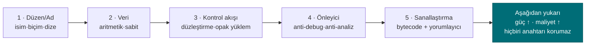

# Hafta 9 — Gelişmiş Kod Gizleme ve Çeşitlendirme

| | |
| --- | --- |
| **Tarih** | 13.11.2026 |
| **Öğrenme çıktıları** | ÖÇ.3 |
| **Süre** | 3 saat |

<!-- materyal:basla -->

<div class="materyal" markdown>

[:material-file-pdf-box: Ders notu (PDF)](cen429-week-9-ders-notu.pdf){ .md-button download="cen429-week-9-ders-notu.pdf" }
[:material-file-word-box: Ders notu (DOCX)](cen429-week-9-ders-notu.docx){ .md-button download="cen429-week-9-ders-notu.docx" }
[:material-presentation: Sunum (PDF)](cen429-week-9-sunum.pdf){ .md-button download="cen429-week-9-sunum.pdf" }
[:material-microsoft-powerpoint: Sunum (PPTX)](cen429-week-9-sunum.pptx){ .md-button download="cen429-week-9-sunum.pptx" }
[:material-language-html5: Sunum (HTML, çevrimdışı)](cen429-week-9-sunum.html){ .md-button download="cen429-week-9-sunum.html" }
[:material-folder-zip: Tümünü indir (ZIP)](cen429-week-9-materyal.zip){ .md-button download="cen429-week-9-materyal.zip" }
[:material-fullscreen: Sunumu tam ekran aç](cen429-week-9-sunum.html){ .md-button .md-button--primary target=_blank }

</div>

<div class="sunum-cercevesi">
<iframe src="../cen429-week-9-sunum.html" title="Hafta 9 — Gelişmiş Kod Gizleme ve Çeşitlendirme" loading="lazy" allowfullscreen></iframe>
</div>

<p class="sunum-ipucu">Sunumun içine tıklayıp ok tuşlarıyla ilerleyin; tam ekran için sunumun sağ altındaki düğmeyi ya da yukarıdaki "Sunumu tam ekran aç" bağlantısını kullanın.</p>

<!-- materyal:bitis -->

!!! example "Bu haftanın çalışan demosu"
    `code/week-09/01-manuel-gizleme` — Manuel gizleme + maliyet olcumu: ayni davranis, sir gizli, `objdump` ile olculen maliyet.
    · `code/week-09/02-cesitlendirme` — Çeşitlendirme: aynı kaynak iki tohumla derlenir → davranışça eş, yapıca farklı ikili.

    Çalıştırma: `sh demo.sh` (Linux/WSL) ya da CMake ile derleyip `bin/` altından. Tümüyle sentetik ve güvenlidir; öğrenci bilgisayarına zarar vermez.


!!! tip "Demoyu kendiniz çalıştırın — adım adım (kopyala-yapıştır)"
    Kurulum ve ilk derleme `code/README.md`'de (Visual Studio ya da komut satırı). Depoyu klonlayıp **`code`** klasörüne girdikten sonra:

    ```powershell
    # Windows (PowerShell) — 'code' klasöründe
    .\build.ps1                                    # tüm demoları bir kez derle
    cd week-09\01-manuel-gizleme
    .\bin\windows\erisim_temiz.exe CEN429-OK     # korumasız sürüm
    .\bin\windows\erisim_gizli.exe CEN429-OK     # gizli sürüm — çıktı AYNI
    ```

    ```sh
    # WSL / Linux — 'code' klasöründe
    ./build.sh
    cd week-09/01-manuel-gizleme
    sh demo.sh                                     # açıklamalı tam akış
    ```

    **Beklenen çıktı:** İki sürüm de `CEN429-OK` için **aynı** "erişim verildi" satırını basar (davranış korundu). `strings` çıktısında `CEN429-OK` **temizde görünür, gizlide görünmez** (K-07 dize kodlama). `objdump` ölçümü: `erisim_ver` **~28 komut / 3 dal → ~51 komut / 6 dal** (maliyet arttı). İkinci demo (`02-cesitlendirme`) aynı kaynağı iki tohumla derler → **davranış aynı, ikili farklı**.

!!! abstract "Bu haftanın sonunda şunları yapabileceksiniz"
    1. **Kod gizlemeyi** (obfuscation) bir güvenlik **kuralı/karşı önlemi** olarak tanımlamak; her tekniği "neyi korur,
       hangi gereksinimi karşılar, maliyeti nedir, sınırı nedir" biçiminde yazmak.
    2. Gizleme **taksonomisini** (düzen, veri, kontrol akışı, önleyici, sanallaştırma) ve **beyaz kutu / MATE**
       (uçtaki saldırgan) tehdit modelini açıklamak.
    3. İleri **kontrol akışı** ve **veri** gizleme kurallarını (opak yüklemler ve döngüler, aritmetik kodlama, sahte
       işlemler ve ölü dallar, kontrol akışı düzleştirme, rastgele çıkış, dize ve sabit kodlama) kavram düzeyinde
       çözümlemek.
    4. **Çeşitlendirmenin** (diversification) neden bir bütünsel dayanıklılık kuralı olduğunu; **sanallaştırma tabanlı**,
       **derleyici tabanlı** ve **dinamik** gizlemenin ne kazandırıp ne pahasına geldiğini anlatmak.
    5. Gizlemenin **etkinliğini ölçmek**: güç, dayanıklılık, gizlilik ve maliyet ölçütleriyle bir koruma kararını
       gerekçelendirmek ve kendi projenizin S9 bölümü için bir **koruma tablosu** yazmak.

??? info "Ders akışı (öğretim üyesi için zaman planı)"
    | Zaman | Bölüm | Ne yapılıyor |
    | --- | --- | --- |
    | 0:00–0:20 | 1 | Gizleme neden bir kural? Beyaz kutu / MATE tehdit modeli, gizlemenin verdiği ve vermediği |
    | 0:20–0:45 | 2 | Gizleme taksonomisi ve "koruma kuralı" şablonu (neyi korur / gereksinim / maliyet / sınır) |
    | 0:45–0:50 | Ara | |
    | 0:50–1:35 | 3 | Kontrol akışı kuralları: opak yüklem ve döngü, aritmetik kodlama, sahte işlem/ölü dal, düzleştirme, rastgele çıkış |
    | 1:35–1:40 | Ara | |
    | 1:40–2:10 | 4 | Veri kuralları: dize/sabit kodlama, değişken bölme/birleştirme; sanallaştırma, derleyici tabanlı, dinamik gizleme (kavram) |
    | 2:10–2:40 | 5 | Çeşitlendirme; gizlemenin ölçülmesi (güç, dayanıklılık, gizlilik, maliyet); deobfuscation ve dayanıklılık |
    | 2:40–3:00 | 6+ | Katmanlı savunmada yeri; proje S9; kendini sınama |

!!! info "Bu haftanın kaynakları hakkında"
    Bu hafta iki ana kaynağa dayanır: (1) **güvenli programlama teknik kılavuzu** — sertifikasyondan geçmiş bir mobil
    ödeme kütüphanesinin **kod sağlamlaştırma karşı önlemlerini** "açıklama / uygulama / sınır" biçiminde listeler; (2)
    **Secure Programming Cookbook** (Viega & Messier), Bölüm 12 "Anti-Tampering". Kılavuzdaki karşı önlemler burada
    **kurallar** olarak, üründen ve gerçek değerlerden arındırılmış biçimde verilir; bütün kod ve değerler
    **sentetiktir**. 4. hafta bu tekniklere giriş yaptı (sembol/dize gizleme, düzleştirmeye giriş); bu hafta aynı
    teknikleri **ileri düzeyde** ele alır ve **nasıl ölçüleceğini** ekler. 14. hafta bunların **otomatik** karşılığını
    (Tigress) gösterir.

---

## 1. Gizleme neden bir güvenlik kuralıdır?

Dersin ilk haftasında saldırgan modellerini ayırmıştık. Ağdan girdi gönderen bir saldırgana karşı savunmamız girdi
doğrulama, bellek güvenliği ve kriptografiydi. Ama bir mobil uygulamayı, bir masaüstü programını ya da bir gömülü
kütüphaneyi kullanıcıya **teslim ettiğimizde**, saldırgan artık programın kendisine sahiptir. Bu tehdit modeline
literatürde **MATE** (Man-At-The-End, "uçtaki insan") ya da **beyaz kutu** denir: saldırgan ikili dosyayı bir tersine
derleyicide açabilir, adım adım çalıştırabilir, belleği okuyup değiştirebilir, istediği kadar deneyebilir. Sunucu
tarafındaki hiçbir güvenlik denetimi burada geçerli değildir; çünkü kod saldırganın makinesinde çalışır.

!!! note "Kısa tarihçe: kod gizleme nereden geldi?"
    - **1976** — Diffie & Hellman, bir programı "anlaşılmaz ama çalışır" kılma fikrini ilk kez tartışır (gizlilik-yoluyla değil, **çaba-yoluyla** koruma).
    - **1997** — Collberg, Thomborson ve Low ilk **gizleme taksonomisini** (düzen · veri · kontrol akışı · önleyici) ve *güç–dayanıklılık–gizlilik–maliyet* çerçevesini yayımlar. Bu dersteki **beş aile** buradan gelir.
    - **2001** — Barak vd. "kusursuz (kara-kutu) gizleme genel olarak **imkânsızdır**" teoremini kanıtlar → gizleme bu yüzden "kırılamazlık" değil, **maliyet** olarak öğretilir.
    - **2002** — Chow vd. **whitebox AES** ile anahtarı yazılıma gömme fikrini başlatır (11. hafta).
    - **2010'lar** — DRM, mobil bankacılık ve oyun sektörü gizlemeyi yaygınlaştırır; **Tigress** (Collberg) ve **Obfuscator-LLVM** işi araç hâline getirir (14. hafta).

    Yani gizleme, akademik bir **imkânsızlık** sonucunun üzerine kurulmuş **pratik bir geciktirme** disiplinidir.

Bu modelde bir gerçekle başlamak dürüstlüktür: **yeterli zamanı, becerisi ve motivasyonu olan bir saldırgan her
gizlemeyi eninde sonunda çözer.** Cookbook bunu açıkça söyler (Tarif 12.1): anti-tampering önlemleri "kırılamaz"
değildir; amaçları **kırmayı ekonomik olmaktan çıkarmaktır**. O yüzden gizlemeyi bir sır saklama yöntemi değil, bir
**maliyet yükseltme kuralı** olarak ele alırız:

- **Kural 1 — Maliyeti değerin üstüne çıkar.** Saldırıyı, korunan varlığın değerinden daha pahalı hale getir. 10 TL'lik
  bir sırrı 1000 TL'lik bir çabayla korumak akıldışıdır; tersi de geçerlidir.
- **Kural 2 — Otomasyonu kır.** Bir kopyada işe yarayan saldırının bütün kopyalarda otomatik işe yaramamasını sağla.
  Bunun adı **çeşitlendirmedir** (bu haftanın 5. bölümü, 14. haftada araçla).
- **Kural 3 — Diğer katmanlara zaman kazandır.** Gizleme tek başına bir savunma değildir; RASP (6. hafta), bütünlük
  denetimi, sunucu tarafı denetimler ve anahtar yenileme için **zaman kazandıran** bir katmandır. Anahtar
  yenilenene, sürüm güncellenene kadar dayanması yeter.

!!! quote "Kaynağın dili"
    Teknik kılavuz her koruma önlemini üç başlıkla yazar: **Açıklama** (neyi korur), **Uygulama** (nasıl yapılır) ve
    **Örnek Kullanım** (nerede kullanılır), çoğu zaman bir **uyum gereksinimi kimliğiyle** birlikte (ör. bir ödeme
    şemasının "hassas veri düz metin loglanmaz" maddesi). Biz de bu hafta her tekniği aynı disiplinle, bir **kural**
    olarak yazacağız: *neyi korur · nasıl · maliyeti · sınırı*.

## 2. Gizleme taksonomisi: beş aile

Collberg ve arkadaşlarının yazılım koruma dizisinden bu derse taşıdığımız sınıflandırma, gizlemeyi **neyi
gizlediğine** göre beş aileye ayırır. Bu harita 4. haftada tanıtıldı; burada her ailenin "ne zaman kural haline
geldiğini" netleştiriyoruz.



| Aile | Neyi gizler? | Örnek kurallar | Bu dersteki yeri |
| --- | --- | --- | --- |
| **Düzen (layout)** | Adları, biçimi, meta veriyi | Sembolleri görünmez yap, fonksiyon/dosya adlarını anlamsızlaştır, sürümde günlüğü kaldır | 4. hafta (giriş), bu hafta (derinlik) |
| **Veri** | Sabitleri, dizgeleri, değişkenleri | Dize kodlama, sabit dönüşümleri, değişken bölme/birleştirme, opak boolean | Bu hafta bölüm 4 |
| **Kontrol akışı** | Algoritmanın yapısını | Kontrol akışı düzleştirme, opak yüklemler, sahte/ölü dallar, rastgele çıkış | Bu hafta bölüm 3 |
| **Önleyici (anti-analysis)** | Analiz araçlarının işini | Tersine derleyiciyi yanıltan yapılar, çalışma anında kod çözme | Bu hafta (kavram), 6. hafta (RASP) |
| **Sanallaştırma** | Makine kodunun kendisini | Fonksiyonu özel bir sanal makinenin bayt koduna çevirme | Bu hafta (kavram), 14. hafta (Tigress) |

!!! note "Sahada bu aileler birlikte kullanılır"
    Kaynak kılavuzun kod sağlamlaştırma bölümü, yukarıdaki ailelerin neredeyse tamamını **tek bir üründe** listeler:
    paylaşılan kütüphanede sembol görünürlüğünün kapatılması; fonksiyon, dosya ve parametre adlarının el ile
    anlamsızlaştırılması (asıl adlar iç belgede); aritmetik komutların dönüştürülmesi; statik dizgelerin derleme
    öncesi kodlanıp kullanım anında çözülüp hemen silinmesi; yalnız "başarılı/başarısız" döndüren opak boolean'lar;
    sonucu değiştirmeyen sahte işlemler ve hiç çalışmayan ölü dallar; kontrol akışı düzleştirme ve hata durumunda
    rastgele bir çıkış noktası; sürümde günlüğün kaldırılması. **Hiçbiri tek başına güçlü değildir; güçleri birlikte
    ve RASP ile kullanılmalarından gelir.** Cookbook'un önerisi de aynıdır (Tarif 12.1): tek bir gelişmiş tekniği
    mükemmelleştirmek yerine, birkaç basit tekniği veri gizlemeyle birlikte kullanmak daha verimlidir.

## 3. Gizleme ne verir, ne vermez?

Bir kuralı doğru uygulamak için sınırını bilmek gerekir. Gizlemenin verdikleri ve **vermedikleri** şunlardır:

| Gizleme **verir** | Gizleme **vermez** |
| --- | --- |
| Statik analize karşı gecikme (`strings`, sembol tablosu, tersine derleme) | Bir sırrın matematiksel gizliliği — anahtar için **kriptografi** gerekir |
| Otomatik saldırıya karşı direnç (çeşitlendirmeyle) | Çalışan programda bellekten okumaya karşı koruma — bunun için **RASP** ve **whitebox** (11. hafta) |
| Diğer katmanlara zaman | Kalıcı güvenlik — "kırılamaz" diye bir şey yoktur |
| Ölçülebilir bir maliyet artışı | Bedava koruma — her gizleme **bakım ve başarım** maliyeti getirir |

!!! danger "En sık yapılan hata: gizlemeyi anahtar saklama sanmak"
    Kodun içine gömülü ya da "gizlenmiş" bir anahtar, gizlense de **oradadır**. Program çalışırken anahtarı kullanmak
    zorundadır; o an bellekte açığa çıkar ve çözme mantığı da programın içindedir. Gizleme, `strings` gibi **statik**
    aramaları yavaşlatır; gerçek anahtar koruması için 11. haftadaki **whitebox kriptografi** ya da donanım (HSM,
    güvenli öğe) gerekir. Bu ayrımı 3. ve 10. haftalarda da vurgulamıştık: **gizlilik kriptografinin işidir, gizleme
    değil.**

## 4. "Koruma kuralı" şablonu

Bu hafta boyunca her tekniği aynı dört soruyla değerlendireceğiz. Kendi projenizin S9 bölümünü de bu şablonla
yazmanızı bekliyoruz:

```text
KURAL K-xx: <tekniğin adı>
  Neyi korur? : hangi varlık / hangi kod bölümü (ör. lisans denetimi, anahtar türetme)
  Hangi tehdide karşı? : statik analiz / dinamik analiz / otomatik saldırı / kurcalama
  Nasıl? : kavram düzeyinde uygulama (bir cümle)
  Maliyet : boyut, hız, bakım, hata ayıklama zorluğu
  Sınır : neyi korumaz, hangi saldırıya dayanmaz
  Ölçüm : etkinliği nasıl doğrularız (bkz. bölüm 5)
```

Bu şablonun değeri şudur: bir gizleme "var/yok" değildir. Değerlendirici (13. hafta, saldırı potansiyeli puanlaması)
her katmanın saldırıyı **ne kadar geciktirdiğini** sorar. Yukarıdaki "Ölçüm" satırı olmadan bir koruma kararını
savunamazsınız.

---

## 5. Kontrol akışı kuralları (ileri)

Derlenmiş bir fonksiyonun **kontrol akışı grafiği** (CFG) algoritmanın iskeletini gösterir: hangi denetim hangi sırayla
yapılıyor, hangi dal başarıya gidiyor. Beyaz kutu saldırganın ilk işi bu iskeleti çıkarmaktır. Kontrol akışı gizleme
kuralları, bu iskeleti okunamaz kılar. 4. haftada düzleştirmeye giriş yaptık; burada onu **güçlendiren** kuralları
ekliyoruz. Bütün örnekler sentetiktir ve tek bir küçük denetim (`erisim_ver`) üzerinden anlatılır.

### KURAL K-01 — Opak yüklemler ve opak döngüler

**Neyi korur?** Bir dalın hangi koşulda alındığını; bir döngünün kaç kez döndüğünü. **Nasıl?** Değeri programcının
bildiği ama analiz aracının kolayca çözemediği bir ifadeyle (**opak yüklem**) dallanma yapılır. Klasik örnek, her zaman
doğru olan ama bunu statik olarak kanıtlaması zor bir aritmetik özdeşliktir:

```c title="Opak yüklem: her zaman true, ama statik analiz kolay kanıtlayamaz"
/* x*(x+1) her zaman çifttir → (x*(x+1)) % 2 == 0 daima doğrudur. */
static int opak_dogru(unsigned x) { return ((x * (x + 1)) & 1u) == 0; }

if (opak_dogru(sayac)) {          /* gerçek yol: daima buraya girer */
    durum = gercek_adim(durum);
} else {
    durum = sahte_adim(durum);    /* ölü yol: hiç çalışmaz ama analizde gerçek görünür */
}
```

Kılavuz, opak döngüleri ayrı bir kural olarak yazar: döngüler (for, while) doğrudan görünmez; **kontrol akışı
düzleştirmenin içine gizlenir**, gövde küçük bloklara bölünür ve yineleme bir durum değişkeniyle yönetilir. Böylece
"şu döngü N kez dönüyor" bilgisi CFG'den okunamaz.

**Maliyet:** düşük–orta (fazladan aritmetik ve dal). **Sınır:** iyi bilinen opak yüklem kalıpları (kütüphaneler)
otomatik tanınabilir; bu yüzden çeşitlendirilmeleri gerekir. **Ölçüm:** düzleştirme öncesi/sonrası temel blok sayısı.

### KURAL K-02 — Aritmetik komutların kodlanması

**Neyi korur?** Sabitleri ve basit hesapları; "bu sayı 0x1F, bu işlem bir XOR" gibi doğrudan okunabilir ipuçlarını.
**Nasıl?** Bir işlem, sonucu değişmeyen ama daha karmaşık görünen denk bir ifadeyle değiştirilir (mixed
boolean-arithmetic). Örneğin `a + b`, `(a ^ b) + 2*(a & b)` ile aynıdır; `x * 2`, `x << 1` ile. Sabitler doğrudan
yazılmaz, çalışma anında küçük bir hesapla üretilir:

```c title="Sabit dönüşümü: 0x2A doğrudan görünmez"
/* 0x2A yerine iki parçadan üret; ikili dosyada '0x2A' araması sonuç vermez. */
static uint8_t esik(void) { uint8_t a = 0x37, b = 0x1D; return (uint8_t)(a ^ b); } /* = 0x2A */
```

**Maliyet:** düşük. **Sınır:** modern tersine derleyiciler ve `arybo`/`msynth` gibi araçlar birçok MBA ifadesini
sadeleştirebilir; tek başına zayıftır, kontrol akışı gizlemeyle birlikte anlam kazanır. **Ölçüm:** sabit için
`strings`/bayt araması sonuç vermemeli.

### KURAL K-03 — Sahte işlemler ve ölü dallar (ikisi farklıdır)

Kılavuz bu ikisini **ayrı** kurallar olarak yazar ve aradaki fark önemlidir:

| | **Sahte işlem (bogus operation)** | **Ölü dal (bogus death branch)** |
| --- | --- | --- |
| Çalışır mı? | **Evet**, çalışır ama sonucu değiştirmez | **Hayır**, hiç çalışmaz (opak yüklemle korunur) |
| Amaç | Gerçek işlemleri kalabalık içinde gizlemek | Analiste sahte bir yürütme yolu göstermek |
| Örnek | Bir CRC hesabına `x ^ x` eklemek (sonuç değişmez) | `if (opak_yanlis()) { ... }` içindeki kod |

```c title="Sahte işlem: sonucu değiştirmez, kodu kalabalıklaştırır"
crc = crc32_guncelle(crc, veri, n);
crc ^= (sabit ^ sabit);   /* = crc; sahte işlem, sonuç aynı */
```

**Neyi korur?** Gerçek mantığı, onu çevreleyen anlamsız ama makul görünen kodla. **Maliyet:** düşük (sahte işlem)
–orta (ölü dallar CFG'yi büyütür). **Sınır:** ölü kod eleme yapan bir analiz aracı, opak yüklem çözülürse ölü dalı
atabilir; bu yüzden opak yüklemin kalitesine bağlıdır. **Ölçüm:** ölü dalların gerçek dallardan ayırt edilme süresi.

### KURAL K-04 — Kontrol akışı düzleştirme (derin)

**Neyi korur?** Algoritmanın **yapısını**: blokların doğal komşuluğunu ve "hangi bloktan hangisine gidilir"
bilgisini. **Nasıl?** Kılavuzun deyişiyle, **dikey** kontrol akışı **yatay** hale getirilir: bütün temel bloklar tek
bir döngü içindeki bir `switch` dağıtıcısına taşınır; sıra yalnız bir **durum değişkeninden** okunur.

```c title="Düzleştirme şablonu (4. haftadan; burada güçlendiriyoruz)"
int durum = BASLA;
for (;;) {
    switch (durum) {
    case BASLA:  durum = ADIM1; break;
    case ADIM1:  durum = kosul ? ADIM2 : HATA; break;
    case ADIM2:  durum = BITIR; break;
    case HATA:   return RED;
    case BITIR:  return IZIN;
    default:     return RED;          /* rastgele çıkış buraya düşer (K-05) */
    }
}
```

Dördüncü haftada bu şablonun tek başına deneyimli bir analist için kısa sürede çözülebildiğini söylemiştik. Kılavuzun
"native tarafta bu düzleştirme birçok güvenlik özelliğiyle güçlendirilir" dediği güçlendirmeler tam olarak diğer
kurallardır:

- **Durum değerleri gizlenir** (K-02): `case 1, 2, 3` yerine dağınık, aritmetikle üretilen değerler; ardışıklık
  görünmez.
- **Sahte ve ölü bloklar** eklenir (K-03): hangi `case` gerçek, ayırt etmek zorlaşır.
- **Rastgele çıkış** (K-05): hata `default` dalından, öngörülemeyen bir durumla çıkar.
- **Opak yüklemlerle** dallanma (K-01): `case` geçişleri sabit değil, opak koşullara bağlıdır.

**Maliyet:** orta–yüksek (blok sayısı ve dal çok artar, başarım düşer). **Sınır:** yalnız düzleştirme, sembolik
yürütmeyle (bölüm 5) geri açılabilir; gücü güçlendirmelerden gelir. **Ölçüm:** tersine derleyicide CFG düğüm/kenar
sayısı, bir denetimi izlemek için gereken süre.

### KURAL K-05 — Kontrol akışından rastgele çıkış

**Neyi korur?** Bir denetimin **nerede** başarısız olduğunu. Saldırgan çoğu zaman "başarısızlık dalını" bulup onu
"başarı dalına" çevirmeye çalışır. **Nasıl?** Kılavuzun anlattığı gibi: bir denetim başarısız olduğunda, program
doğrudan bir "return RED" satırına gitmez; bunun yerine durum değişkeni **öngörülemeyen büyük bir değere** ayarlanır
ve fonksiyon `default` dalından çıkar. Başarılı çıkış da aynı yöntemle yapılabilir, böylece başarı ve başarısızlık
akışta birbirine benzer.

```c title="Rastgele çıkış: hata noktası akıştan okunamaz"
if (!imza_gecerli(p)) {
    durum = kararsiz_deger();   /* switch'te tanımlı olmayan bir değer → default */
    break;
}
```

**Maliyet:** düşük. **Sınır:** tek başına değil, düzleştirmeyle birlikte anlamlıdır. **Ölçüm:** "başarısızlık dalını
bul ve tersine çevir" saldırısının süresi; ideal olarak tek bir bayt yaması denetimi atlatmaya yetmemeli.

### KURAL K-06 — Fonksiyon çağrılarının ve dış kütüphane bağımlılığının gizlenmesi

**Neyi korur?** "Şu fonksiyon `memcmp` çağırıyor, demek ki bir karşılaştırma yapıyor" gibi ipuçlarını. Standart
kütüphane çağrıları, saldırgana bir fonksiyonun ne yaptığını doğrudan söyler. **Nasıl?** Kritik yollarda standart
kütüphane fonksiyonları **kendi iç sürümleriyle** değiştirilir (ör. sabit zamanlı kendi `esit_mi` fonksiyonunuz),
böylece bağlantı çözümleyicide tanınan bir ad görünmez. Kılavuz ayrıca **fonksiyon parametrelerinin gizlenmesini** ve
**sahte parametreler** eklenmesini de ayrı kurallar olarak listeler: gerçek parametrelerin yanına hiç kullanılmayan
sahte parametreler konur; imza, saldırgan için yanıltıcı olur.

**Maliyet:** düşük–orta (kendi sürümleri bakım ister). **Sınır:** davranış analizi yine de ne yaptığını gösterebilir;
bu bir **gecikme** kuralıdır. **Ölçüm:** ikili dosyada tanınan kütüphane çağrılarının sayısı.

!!! warning "Kural: sabit zamanlılığı bozma"
    Kendi karşılaştırma/kripto sürümünüzü yazarken **sabit zamanlı** olmasına dikkat edin (3. hafta). Gizleme uğruna
    erken çıkışlı bir karşılaştırma yazmak, bir **yan kanal** açar; koruma eklerken yeni bir açık yaratmayın.

---

## 6. Veri gizleme kuralları

Kontrol akışı algoritmanın yapısını gizler; **veri gizleme** ise programın işlediği **değerleri** gizler: dizgeler,
sabitler, tablolar ve değişkenler. Cookbook'un anti-tampering bölümü ile teknik kılavuz burada aynı kuralları
listeler.

### KURAL K-07 — Statik dizgelerin kodlanması

**Neyi korur?** İkili dosyadaki okunabilir metinleri. Tersine mühendisliğin en ucuz ilk adımı `strings` çalıştırmaktır;
`"Lisans gecersiz"` ya da bir URL, saldırgana nereye bakacağını söyler. **Nasıl?** Hassas dizgeler **derleme öncesinde
kodlanır** (ör. bir XOR anahtarıyla ya da bir üretim betiğiyle şifrelenir), ikili dosyada kodlanmış hâlde durur,
**kullanım anında çözülür** ve iş biter bitmez **bellekten silinir**.

```c title="Dize kodlama: kullan ve hemen sil (sentetik)"
static const uint8_t GIZLI[] = { 0x3B,0x2A,0x2E,0x2E,0x2D };   /* "merhaba" değil; sentetik */
void kullan(void) {
    char tmp[sizeof GIZLI];
    for (size_t i = 0; i < sizeof GIZLI; i++) tmp[i] = GIZLI[i] ^ 0x5A;  /* çöz */
    isle(tmp, sizeof GIZLI);
    memset_s_benzeri(tmp, sizeof tmp);   /* kullanımdan hemen sonra sil (3. hafta) */
}
```

**Maliyet:** düşük. **Sınır:** çalışan programda çözülmüş dize bellekte görünür; bu bir **statik tarama** önlemidir.
Çözme anahtarı da ikili dosyadadır — bu yüzden sahada çözme anahtarı **parçalanır ve dağıtılır** ve çözme fonksiyonu
ek denetimlerle korunur. **Ölçüm:** `strings` çıktısında hassas dizge **bulunmamalı**.

!!! danger "Kural: dize gizleme ile anahtar saklama karıştırılmaz"
    Dize gizleme, `strings` gibi statik taramaları durdurur; **anahtar** korumak için değildir. Bu 1. bölümdeki
    "gizleme anahtar saklamaz" kuralının somut halidir. Gerçek anahtarlar için whitebox (11. hafta) ya da donanım.

### KURAL K-08 — Sabit dönüşümleri, opak boolean ve fonksiyon boolean dönüşleri

Kılavuz güvenlik sonuçlarının nasıl temsil edileceğini ayrı bir kural yapar. Bir denetimin sonucunu düz bir `0`/`1`
olarak döndürmek tehlikelidir: saldırgan tek bir baytı çevirerek "başarısız"ı "başarılı"ya dönüştürebilir. **Opak
boolean** kuralı, doğru/yanlış değerini **birden çok değere bağlı** ve tek bir bayt yamasıyla çevrilemeyecek biçimde
tutar. Fonksiyonlar da düz boolean yerine bu tür **opak dönüş kodları** verir.

```c title="Opak boolean: tek bayt yaması sonucu çeviremez (kavram)"
/* "izin" değeri tek bir sabit değil; iki durumdan türetilir ve çağıran taraf ikisini de doğrular. */
typedef struct { uint32_t a, b; } Karar;
static Karar izin_ver(void)  { return (Karar){ 0xA3C1u, 0x5C3Eu }; } /* a ^ b == 0xFFFF */
static int  karar_izin_mi(Karar k) { return (k.a ^ k.b) == 0xFFFFu; }
```

**Maliyet:** düşük. **Sınır:** yeterince incelenirse çözülür; amacı tek-bayt yamayı ve kaba dal-çevirmeyi
engellemektir. **Ölçüm:** "sonucu tersine çevir" saldırısında değiştirilmesi gereken bağımsız nokta sayısı > 1.

### KURAL K-09 — Değişken bölme, birleştirme ve dizi yeniden yapılandırma

**Neyi korur?** Hassas bir değişkenin bellekteki tanınabilir izini. "32 baytlık bir blok = bir AES anahtarı" gibi
kalıplar saldırgana yol gösterir. **Nasıl?** Bir değişken iki parçaya **bölünür** (ör. bir 32-bit değeri iki 16-bit
paydan hesaplamak), birden çok değişken tek bir söze **birleştirilir**, diziler yeniden düzenlenir; tamponların
boyutu, sırası ve yerleşimi değiştirilir, araya sahte ayırmalar konur ve kullanımdan sonra rastgele değerle doldurulur.

**Maliyet:** düşük–orta. **Sınır:** yalnız statik/kalıp analizini yavaşlatır. **Ölçüm:** hassas tamponun bellek
kalıbından tanınma süresi.

## 7. Program bütünü düzeyinde kurallar

### KURAL K-10 — Sanallaştırma tabanlı gizleme (kavram)

**Neyi korur?** Bir fonksiyonun **makine kodunun kendisini**. **Nasıl?** Fonksiyon, gerçek makine komutları yerine
**özel bir sanal makinenin (VM) bayt koduna** çevrilir; ikili dosyaya bu bayt kodu ile onu yorumlayan küçük bir
yorumlayıcı gömülür. Saldırgan artık tanıdık makine kodunu değil, önce çözmesi gereken **özel bir komut kümesini**
görür.

**Maliyet:** **yüksek** — hem başarım (yorumlanan kod yavaştır) hem bakım açısından pahalıdır; bu yüzden yalnız en
kritik, küçük ve sık değişmeyen fonksiyonlara uygulanır. **Sınır:** VM'in kendisi bir kez çözülürse bütün korunan
fonksiyonlar açılabilir; ve tek bir VM tasarımı bütün kopyalarda aynıysa çeşitlendirme yoktur. **Ölçüm:** korunan
fonksiyonun boyut/hız maliyeti; bir analistin VM komut kümesini çözme süresi. 14. haftada Tigress'in `Virtualize`
dönüşümüyle bunu kavramsal olarak göreceğiz.

### KURAL K-11 — Derleyici tabanlı gizleme (O-LLVM ailesi)

**Neyi korur?** Yukarıdaki kontrol/veri kurallarını, **el ile değil** derleyici geçişleriyle uygulayarak. **Nasıl?**
LLVM tabanlı gizleyiciler (Obfuscator-LLVM ve türevleri) düzleştirme, sahte kontrol akışı ve komut değiştirme
geçişlerini derleme sırasında otomatik uygular. Avantajı: kaynak kodu okunur kalır, koruma bir derleme
seçeneğidir; her sürümde farklı tohum (**seed**) vererek çeşitlendirme kolaydır. **Maliyet:** orta; başarım etkisi
seçilen geçişlere bağlıdır. **Sınır:** iyi bilinen geçişlerin ürettiği kalıplar tanınabilir; araç sürümüyle güncel
kalmak gerekir. **Ölçüm:** aynı geçişlerin farklı tohumlarla ürettiği ikili dosyalar arasındaki fark (çeşitlendirme
ölçütü, bölüm 5).

### KURAL K-12 — Kendini değiştiren kod ve dinamik şifreleme (kavram, dikkatli)

**Neyi korur?** En hassas kod bölümlerini, ikili dosyada **şifreli** tutarak. **Nasıl?** Bölüm ikili dosyada şifreli
durur; yalnız çalışacağı an belleğe çözülür, çalışır ve sonra yeniden şifrelenir ya da silinir. **Maliyet:** yüksek
ve **risklidir**: modern işletim sistemlerinin bellek korumalarıyla (DEP/NX, yazılabilir-ve-çalıştırılabilir sayfa
ayrımı, W^X) doğrudan çatışır; yanlış uygulanırsa hem çöker hem de yeni bir açık yaratır. **Sınır:** çalışırken bir
noktada kod bellekte açıktır; bir bellek dökümü onu yakalayabilir. **Ölçüm:** açık pencerenin ne kadar kısa
olduğu.

!!! warning "Kural: OS korumalarıyla çatışan bir tekniği güvenlik uğruna körlemesine açma"
    Kendini değiştiren kod, yürütülebilir belleği yazılabilir yapmayı gerektirir; bu, 4. haftadaki DEP/NX ve W^X
    ilkelerini zayıflatır. Bir koruma eklerken başka bir korumayı kapatıyorsanız, net kazancı ölçün ve ödünleşim
    kaydına yazın. Uygulamada bu teknik çok seçici ve küçük bölümlerde kullanılır.

!!! note "Java/yönetilen taraf: ProGuard/R8 ve DEX (5. haftadan köprü)"
    Bu haftanın kuralları native (C/C++) tarafı içindir. Yönetilen dillerde (Java/Kotlin, Android) karşılığı
    **ProGuard/R8** ile ad gizleme, ölü kod eleme ve küçültmedir; `-keep` kuralları ve reflection ile çağrılan API'ler
    5. haftada işlendi. İki taraf birlikte kullanılır: Java tarafı R8 ile gizlenir, native taraf bu haftanın
    kurallarıyla; native taraf Java tarafının bütünlüğünü, Java tarafı native kütüphanenin sağlamasını denetler
    (çapraz denetim — 6. hafta RASP).

---

## 8. Çeşitlendirme: tek kırık her yeri açmasın

1. bölümdeki "Kural 2 — otomasyonu kır" burada somutlaşır. Bir saldırgan bir kopyayı kırdığında, ürettiği yamayı ya
da betiği **bütün kullanıcılara** dağıtabiliyorsa, bir kırık her yeri açar. **Çeşitlendirme** (diversification), aynı
kaynaktan **farklı ama davranışça eş** ikili dosyalar üretmektir; böylece bir kopyaya karşı geliştirilen otomatik
saldırı diğerlerinde çalışmaz.

- **Uzayda çeşitlendirme:** her yapı (build) ya da her dağıtım farklı bir **tohumla** gizlenir; opak yüklemler, sahte
  bloklar ve durum değerleri kopyadan kopyaya değişir.
- **Zamanda çeşitlendirme:** her sürüm yeni bir düzenle gelir; eski sürüme karşı bulunan saldırı yeni sürümde bozulur.
  Bu, anahtar/sürüm yenileme politikanızla (10. hafta) birlikte çalışır.

Çeşitlendirme, gizlemenin **gücünü** artırmaz — bir kopyayı kırmak yine mümkündür — ama **ölçeklenmesini** engeller.
On dördüncü haftada Tigress'in `RandomFuns`, `--Seed` ve dönüşüm birleştirme özellikleriyle bunu araçla üreteceğiz.

!!! example "Çeşitlendirme etkinliği: basit bir ölçüt"
    Aynı kaynağı iki farklı tohumla derleyin. İki ikili dosyanın korunan fonksiyonlarını karşılaştırın: bayt düzeyinde
    fark oranı ne kadar yüksekse, bir kopyaya yazılan bir saldırının diğerinde çalışma olasılığı o kadar düşüktür.
    Ölçütü S9'a yazın.

## 9. Gizlemenin ölçülmesi

Bir koruma kararını savunmak için onu **ölçmek** gerekir. Collberg'in çerçevesi gizlemeyi dört boyutta değerlendirir;
bu dört ölçüt aynı zamanda 13. haftadaki **saldırı potansiyeli** puanlamasının ("gereken süre", "gereken uzmanlık")
temelidir.

| Ölçüt | Sorusu | Nasıl ölçülür (kavram) |
| --- | --- | --- |
| **Güç (potency)** | İnsan için ne kadar anlaşılmaz? | Karmaşıklık ölçütleri: CFG düğüm/kenar sayısı, çevrimsel karmaşıklık, iç içe geçme derinliği — gizleme öncesi/sonrası |
| **Dayanıklılık (resilience)** | Otomatik araca ne kadar dayanır? | Bir deobfuscation aracının (sembolik yürütme, sadeleştirici) korumayı geri açma süresi/başarısı |
| **Gizlilik (stealth)** | Gizleme kendini ele veriyor mu? | Gizlenmiş kodun, normal koddan istatistiksel olarak ayırt edilebilirliği (ayırt edilirse saldırgan nereye bakacağını bilir) |
| **Maliyet (cost)** | Bize ne kadara mal oluyor? | Boyut artışı, çalışma süresi artışı, bellek, bakım ve hata ayıklama zorluğu |

Bu dört ölçüt bir **ödünleşimdir**: gücü ve dayanıklılığı artırdıkça maliyet artar, gizlilik çoğu zaman azalır (daha
karmaşık kod daha çok dikkat çeker). İyi bir mühendislik kararı, **korunan varlığın değerine** göre bu dördü
dengeler.

```text
Karar kuralı (S9'a yazılır):
  Varlık değeri düşük  → hafif, ucuz gizleme (K-01, K-02, K-07) yeter
  Varlık değeri yüksek → katmanlı (K-04 + K-05 + K-08 + çeşitlendirme), maliyeti kabul et
  Her katman için: güç ve dayanıklılık kazancı vs. boyut/hız maliyeti ölçülür ve yazılır
```

## 10. Deobfuscation: karşı tarafın araçları ve dayanıklılık kuralı

Dayanıklılığı doğru ölçmek için saldırganın otomatik araçlarını kavramsal olarak bilmek gerekir. Bunları **savunmayı
sınamak** için öğreniriz:

- **Sembolik / eşzamanlı yürütme (KLEE gibi):** program yolları matematiksel kısıtlar olarak çözülür; opak yüklemler
  ve düzleştirme bu yolla geri açılabilir. **Dayanıklılık kuralı:** çözücüyü zorlamak için opak yüklemleri, çözmesi
  pahalı (ör. çarpanlara ayırmaya ya da karma değerlere dayalı) yapılara bağla ve durum uzayını büyüt; ama maliyeti
  ölç.
- **İfade sadeleştirme (MBA çözücüler):** aritmetik kodlamayı (K-02) açar. **Kural:** aritmetik kodlamayı tek başına
  bir sır katmanı sayma; kontrol akışıyla birleştir.
- **Kalıp tanıma:** bilinen kütüphane/geçiş kalıplarını tanır. **Kural:** çeşitlendir; tek bir opak yüklem kalıbına
  ya da tek bir VM tasarımına bağlı kalma.

Banescu ve arkadaşlarının çalışması (Tigress + KLEE) tam da bunu yapar: hangi dönüşümlerin sembolik yürütmeye ne kadar
dayandığını ölçer. Ders için çıkarım nettir: **dayanıklılık bir iddia değil, ölçülen bir niceliktir.** Bir korumanın
"güçlü" olduğunu söylemek yerine, "şu araca karşı şu kadar dayandı" demek gerekir.

## 11. Katmanlı savunmada gizlemenin yeri

Gizleme, tek başına bir kale değil, **derinlemesine savunmanın** bir katmanıdır. Diğer haftalarla ilişkisi:

| Katman | Haftası | Gizlemeyle ilişkisi |
| --- | --- | --- |
| Bellek güvenliği, güvenli derleme | 4 | Gizleme bunların yerine geçmez; ikisi birlikte |
| RASP (kurcalama/hata ayıklama tespiti) | 6 | Gizleme, RASP denetimlerinin kendisini de gizler; RASP, gizlemeyi çalışırken korur |
| Whitebox kriptografi | 11 | Anahtar için asıl koruma; gizleme onu çevreleyen kabuğu zorlaştırır |
| Kripto ve anahtar yenileme | 10 | Gizleme "anahtar yenilenene kadar" zaman kazandırır |
| Sertifikasyon / saldırı potansiyeli | 12–13 | Her katmanın "geciktirme süresi" puanlamaya girer |

!!! quote "Sahadan bir gözlem"
    Sertifikasyondan geçmiş bir üründe listelenen native koruma önlemleri bu haftanın kurallarının neredeyse tümünü
    kapsar; ama belge her önlemin yanına **"tek başına güçlü değildir"** notunu düşer. Değerlendiriciyi ikna eden şey
    tek bir teknik değil, kuralların **birlikteliği**, **çeşitlendirilmiş** olması ve her birinin **ölçülmüş** bir
    geciktirme değeriyle sunulmasıdır.

## 12. Dönem projesi: bu hafta (S9 — ileri sağlamlaştırma)

Vize sonrası projenizin S9 bölümünü **ileri** düzeye taşıyın:

1. **Koruma tablosu:** En kritik iki–üç kod bölümü için (ör. lisans/lisanslama, anahtar türetme, bütünlük denetimi)
   1. bölümdeki **"koruma kuralı" şablonunu** doldurun: neyi korur, hangi tehdide karşı, nasıl, maliyet, sınır, ölçüm.
2. **Ölçüm:** En az bir teknik için gizleme öncesi/sonrası bir ölçüt verin (ör. `strings` çıktısındaki hassas dize
   sayısı; CFG düğüm sayısı; ikili boyut ve bir işlemin süresi).
3. **Çeşitlendirme kararı:** Çeşitlendirme uygulayacak mısınız? Uygulamayacaksanız **neden** (gerekçe de bir yanıttır).
4. **Sınır ve kalan risk:** Her koruma için neyi **korumadığını** açıkça yazın. "Bu dize gizleme anahtarı korumaz;
   anahtar için S8'deki whitebox/donanım kullanılır" gibi.

!!! tip "Değerlendirici gözüyle"
    S9'da aranan şey "çok teknik kullandım" değil, **her tekniğin gerekçesi ve ölçüsüdür**. Ölçülmemiş bir koruma,
    değerlendirmede "iddia" sayılır; kanıt sayılmaz.

## 13. Kendini sınama


??? question "1. Kaynaktan kaynağa gizleme nedir? MATE tehdit modeli ağ saldırganından hangi yönüyle ayrılır ve neden kriptografiyi tek başına yeterli bırakmaz ama gizlemeyi gerekli kılar?"
    MATE (Man-At-The-End) uygulamanın çalıştığı cihaza tam sahiptir: belleği okur, hata ayıklayıcı bağlar, kodu değiştirir; ağ saldırganı yalnız dışarıdan bağlanır. Kriptografi hâlâ gereklidir ama tek başına yetmez, çünkü anahtar/veri **çalışırken** bellekte açığa çıkar. Gizleme bu yüzden gerekir: anahtar çıkarmayı ve mantığı anlamayı geciktirip pahalılaştırır.

??? question "2. 'Gizleme kırılamaz kılmaz, pahalı kılar.' Bunu bir varlık değeri örneğiyle açıklayın."
    Gizleme saldırıyı imkânsız değil, daha çok **zaman/beceri/araç** gerektirir hale getirir. 100 TL değerindeki bir içeriği kırmak 10.000 TL emek isterse rasyonel saldırgan vazgeçer. Bu yüzden koruma gücü, korunan varlığın değerine göre ölçülür.

??? question "3. Sahte işlem (bogus operation) ile ölü dal (death branch) arasındaki fark nedir? Hangisi çalışır?"
    **Sahte işlem** gerçekten çalışır ama sonucu kullanılmaz (analizciyi ve aracı yorar). **Ölü dal** bir opak yüklemle korunur ve **hiç çalışmaz**. Yani sahte işlem çalışan-ama-etkisiz, ölü dal ise hiç çalışmayan koddur.

??? question "4. Kontrol akışı düzleştirme tek başına neden zayıftır? Onu güçlendiren en az üç kuralı sayın."
    Düzleştirme bir dağıtıcı (dispatcher/switch) deseni bırakır; bu desen tanınır ve durum değişkeni izlenerek akış geri kurulabilir. Güçlendiriciler: **opak yüklemler**, **durum değişkenini şifreleme**, **sahte durumlar/bloklar + rastgele çıkış** (ayrıca ad/dize gizleme).

??? question "5. Rastgele çıkış noktası hangi saldırıyı zorlaştırır? Tek bayt yaması neden yetmez hâle gelir?"
    Desen/eşleştirme, otomatik betik ve sembolik yürütme saldırılarını zorlaştırır (tek sabit çıkış kalıbı yoktur). Tek bir sabit çıkış olmadığı için tek bir bayt yaması bütün yolları kapatmaz; saldırgan her yolu ayrı ayrı ele almak zorunda kalır.

??? question "6. Dize gizleme bir anahtarı korur mu? Neden? Anahtar için hangi haftalara bakılır?"
    Hayır. Dize/tablo gizleme yalnız statik `strings` taramasını zorlaştırır; anahtar **çalışırken bellekte** açığa çıkar. Anahtarın gerçek korunması için 10. hafta (PKI, HSM/PKCS#11) ve 11. hafta (whitebox kriptografi) yöntemlerine bakılır.

??? question "7. Sanallaştırma tabanlı gizlemenin en büyük iki maliyeti nedir? Neden yalnız küçük ve kritik fonksiyonlara uygulanır?"
    Büyük **performans** cezası (bytecode'u yorumlayan sanal makine yavaştır) ve **boyut** artışı (VM + bytecode). Bu maliyet yüzünden yalnızca değeri yüksek, küçük ve kritik fonksiyonlara uygulanır; tüm koda uygulanamaz.

??? question "8. Kendini değiştiren kod hangi işletim sistemi korumasıyla çatışır? Bu neden yeni bir risk yaratabilir?"
    **W^X / DEP-NX** ile: bir bellek sayfası aynı anda yazılabilir **ve** çalıştırılabilir olamaz. Kodu değiştirmek için sayfayı geçici olarak yazılabilir-çalıştırılabilir yapmak gerekir; bu hem çoğu ortamda engellenir/şüphelidir hem de saldırgana kod enjeksiyonu için bir pencere açabilir (yeni risk).

??? question "9. Gizlemeyi ölçen dört boyutu (güç, dayanıklılık, gizlilik, maliyet) tanımlayın. Hangileri birbiriyle ödünleşir?"
    **Güç:** insan analizciyi ne kadar zorlaştırır. **Dayanıklılık:** otomatik deobfuscation araçlarına direnç. **Gizlilik:** gizlemenin fark edilmezliği (normal görünme). **Maliyet:** performans/boyut cezası. Başlıca ödünleşimler: dayanıklılık ↔ maliyet ve güç ↔ gizlilik (güçlü gizleme çoğu zaman daha 'anormal' görünür).

??? question "10. Çeşitlendirme gizlemenin gücünü mü, ölçeklenmesini mi engeller? Basit bir etkinlik ölçütü önerin."
    **Ölçeklenmesini** engeller: tek bir kopyanın gücünü artırmaz ama bir kırığın tüm kopyalara/kullanıcılara **yayılmasını** engeller. Ölçüt: aynı kaynaktan iki tohumla üretilen ikililerin farklılık oranı (farklı bayt/komut yüzdesi) + her iki ikilinin aynı girdiye aynı çıktıyı verdiğini gösteren davranış testi.

??? question "11. Sembolik yürütme (KLEE gibi) hangi gizleme kurallarını zorlar? Dayanıklılığı artırmak için ne yaparsınız, maliyeti nasıl kontrol edersiniz?"
    KLEE yolları otomatik çözerek basit opak yüklem ve düzleştirmeyi kırabilir. Dayanıklılık için yüklemleri **sembolik yürütmeye dayanıklı** yaparsınız (girdi bağımlı, kriptografik, yol patlaması yaratan). Maliyeti, bu pahalı dönüşümleri yalnız kritik fonksiyonlara uygulayıp önce/sonra ölçerek kontrol edersiniz.

??? question "12. Projenizdeki bir kod bölümü için 'koruma kuralı' şablonunu doldurun (altı satır)."
    Örnek — **Varlık:** lisans doğrulama fonksiyonu. **Tehdit:** MATE saldırganının yamayla doğrulamayı atlaması. **Kural:** kontrol akışı düzleştirme + opak yüklem. **Nasıl:** Tigress `Flatten` + `AddOpaque`, yalnız bu fonksiyona. **Ölçüm:** boyut +%X, hız −%Y, komut sayısı N→M. **Kalan risk:** güçlü ama sanallaştırma değil; sürümde tohumla çeşitlendir.


## 14. Kaynaklar ve ileri okuma

- **Secure Programming Cookbook for C and C++** (Viega & Messier) — Bölüm 12, Anti-Tampering: gizlemenin amacı ve
  sınırı, birkaç basit tekniği birlikte kullanma önerisi.
- **Güvenli programlama teknik kılavuzu** (ders kaynağı) — native kod sağlamlaştırma karşı önlemleri: opak döngü,
  aritmetik/dize/parametre gizleme, opak boolean, sahte işlem/ölü dal, kontrol akışı düzleştirme ve rastgele çıkış.
- C. Collberg, J. Nagra, *Surreptitious Software* — gizleme taksonomisi ve güç/dayanıklılık/gizlilik/maliyet çerçevesi.
- S. Schrittwieser vd., "Protecting Software through Obfuscation: Can It Keep Pace with Progress in Code Analysis?"
  (ACM Computing Surveys, 2016) — genel bakış ve deobfuscation araçları.
- S. Banescu vd., Tigress + KLEE ile dönüşüm dayanıklılığının ölçülmesi — 14. haftaya köprü.
- Obfuscator-LLVM (O-LLVM) — derleyici tabanlı gizlemeye örnek.

!!! info "Bir sonraki hafta"
    **10. hafta — Sertifikalar ve kriptografik yöntemler.** Bu hafta "gizleme anahtarı korumaz" dedik; 10. haftada
    anahtarların doğru seçimi, yaşam döngüsü ve PKI ile korunması işlenir. 11. haftada whitebox kriptografi, 14.
    haftada bu haftaki kuralların otomatik karşılığı (Tigress) gelir.
